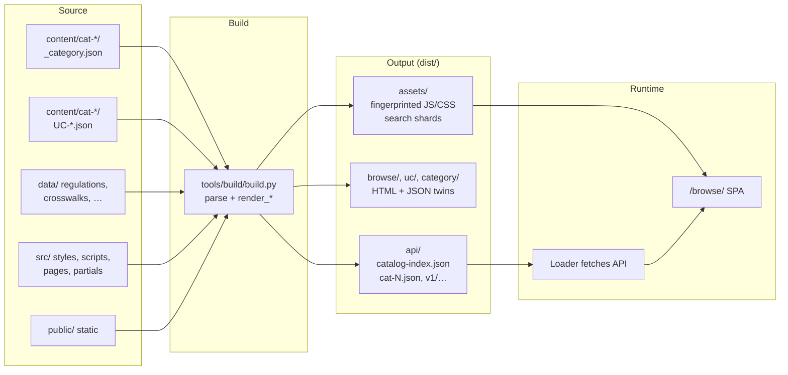
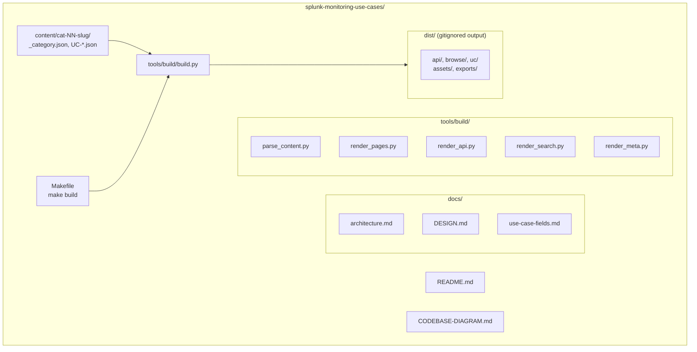
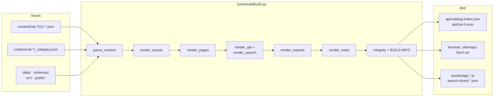
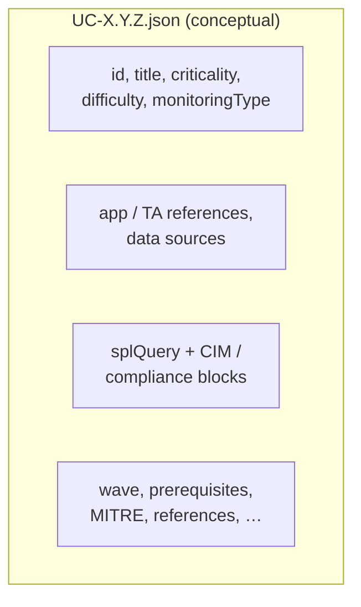
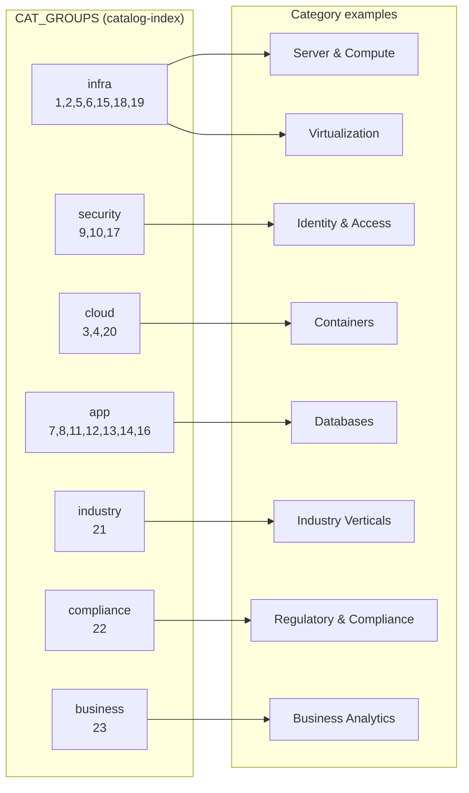
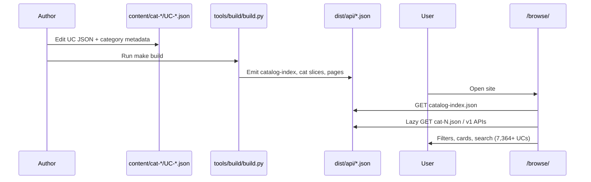

# Splunk Monitoring Use Cases — Codebase Diagram

This document visualizes the repository structure, **v7** build pipeline, and data flow (**7,364** use cases).

---

## 1. High-level architecture

---

## 2. Repository structure (simplified)

---

## 3. Build pipeline (v7 data flow)

---

## 4. Use case on disk (v7)

Each canonical use case is **`content/cat-NN-slug/UC-X.Y.Z.json`** validated against `schemas/uc.schema.json`. Optional long-form markdown may sit beside the JSON for prose-heavy UCs.

---

## 5. Category groups (dashboard filter)

---

## 6. End-to-end flow

