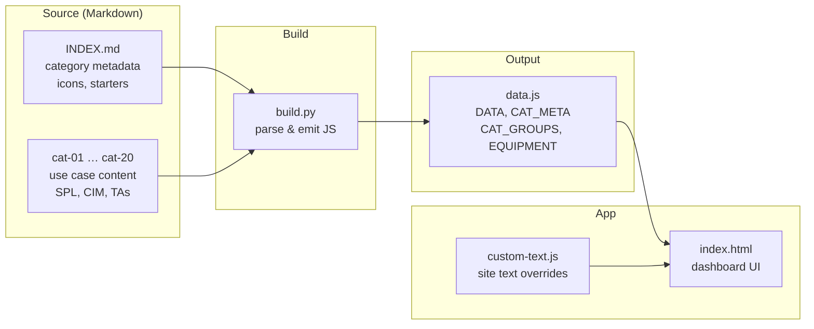
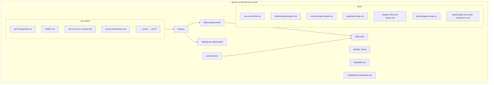
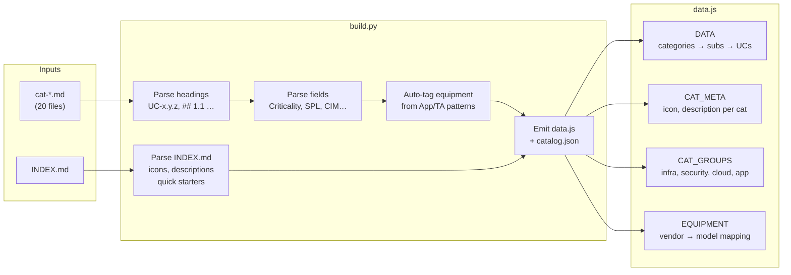
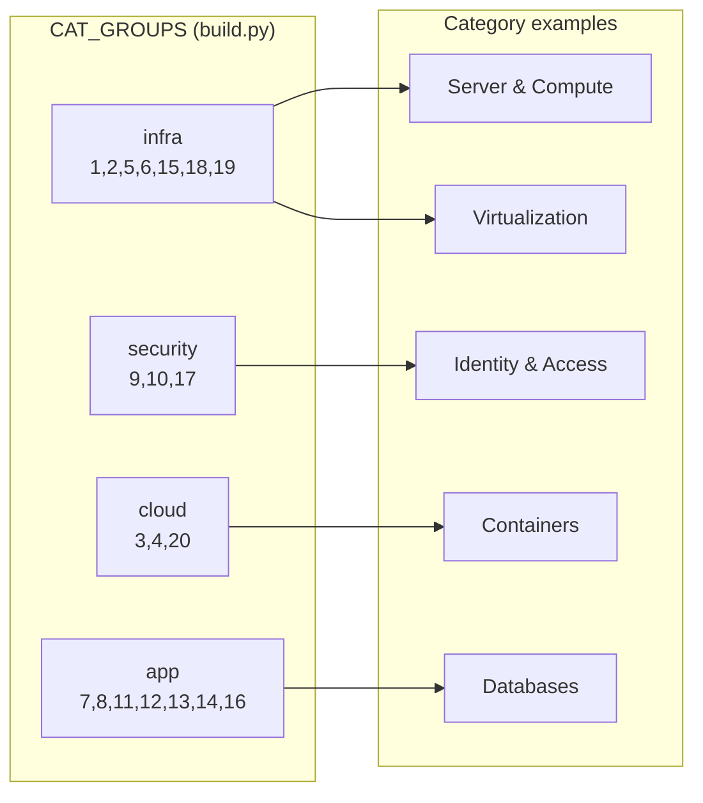
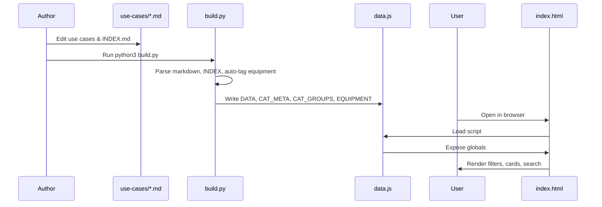

# Splunk Monitoring Use Cases — Codebase Diagram

This document visualizes the repository structure, build pipeline, and data flow.

---

## 1. High-level architecture

---

## 2. Repository structure

---

## 3. Build pipeline (data flow)

---

## 4. Use case document structure

Each `cat-XX-*.md` file follows this structure; `build.py` extracts the bolded fields and SPL blocks.

```mermaid
flowchart TB
    subgraph file["cat-XX-*.md"]
        H1["# N. Category Name"]
        H2["## N.1 Subcategory"]
        UC["### UC-N.1.K · Use Case Title"]
        F1["**Criticality** critical/high/medium/low"]
        F2["**Difficulty** beginner/intermediate/advanced/expert"]
        F3["**Monitoring type** Performance/Availability/…"]
        F4["**Value** (why it matters)"]
        F5["**App/TA** (Splunk add-on)"]
        F6["**Data Sources** (index, sourcetype)"]
        F7["**SPL** (code block)"]
        F8["**CIM Models** (or N/A)"]
        F9["**CIM SPL** (optional code block)"]
        F10["**Implementation**"]
        F11["**Visualization**"]
        F12["**Equipment Models** (optional)"]
    end

    H1 --> H2
    H2 --> UC
    UC --> F1
    F1 --> F2
    F2 --> F3
    F3 --> F4
    F4 --> F5
    F5 --> F6
    F6 --> F7
    F7 --> F8
    F8 --> F9
    F9 --> F10
    F10 --> F11
    F11 --> F12
```

---

## 5. Category groups (dashboard filter)

---

## 6. End-to-end flow

---

*Generated for the Splunk Infrastructure Monitoring Use Case Repository.*
