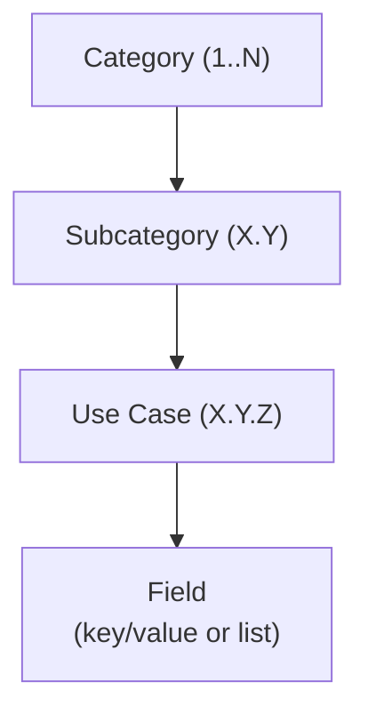
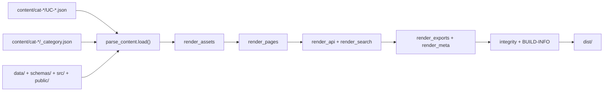
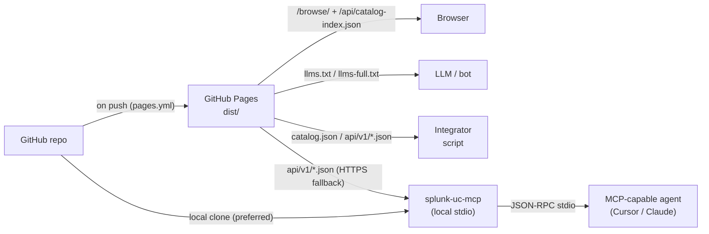
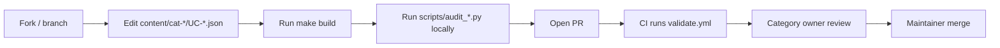

# Product Design Document

**Status:** Living document. Authoritative reference for implementation, CI, and replication.
**Owner:** Repository maintainers. See [GOVERNANCE.md](../GOVERNANCE.md).
**Last reviewed:** 2026-04-20

This document describes the full product (v7 build and runtime), with the layered system contract detailed in [`docs/architecture.md`](architecture.md). It covers what the product is, how it is organised, how it is built, how it runs, how it is governed, and — critically — how to replicate it on a different platform, for a different vendor, or for a different content domain.

Every architectural claim in this document is linked to a concrete file in the repository so the document remains auditable against the implementation. When a claim and the code diverge, the bug is in the document.

---

## Table of contents

1. [Purpose and scope](#1-purpose-and-scope)
2. [Goals and non-goals](#2-goals-and-non-goals)
3. [Target audiences](#3-target-audiences)
4. [Information architecture](#4-information-architecture)
5. [Content authoring contract](#5-content-authoring-contract)
6. [Build pipeline](#6-build-pipeline)
7. [Runtime architecture](#7-runtime-architecture)
8. [Quality system](#8-quality-system)
9. [Data exports and integrations](#9-data-exports-and-integrations)
10. [Release management](#10-release-management)
11. [Governance and contribution model](#11-governance-and-contribution-model)
12. [Non-functional properties](#12-non-functional-properties)
13. [Reference implementation stack](#13-reference-implementation-stack)
14. [Replication guide](#14-replication-guide)
15. [Decision log](#15-decision-log)
16. [Glossary](#16-glossary)
17. [Extension points](#17-extension-points)

---

## 1. Purpose and scope

The product is a curated, machine-readable, versioned catalog of IT monitoring and detection use cases, together with a static single-page web dashboard and a set of downstream integrations (Splunk TA, ITSI content pack, Enterprise Security content pack, OpenAPI feed, LLM-readable indices).

The current scope is Splunk-native content: every use case carries a ready-to-run SPL query, CIM data model mappings where applicable, and a TA/App reference. The same information architecture, build pipeline, and runtime are deliberately designed to carry a non-Splunk payload (KQL for Sentinel, DQL for Datadog, SignalFlow for Splunk Observability Cloud, YARA-L for Chronicle) without structural changes; see [§14 Replication guide](#14-replication-guide).

The scope explicitly excludes:

- Hosting, executing, or scheduling the SPL against a live Splunk instance. The catalog is content-only.
- Vendor-specific agent code or data collection scripts beyond the minimal `Script example:` snippets embedded in UCs.
- Real-time or per-user personalisation. The dashboard is a static asset.

---

## 2. Goals and non-goals

### Goals

- **Single source of truth for authoring** — per-UC JSON under `content/cat-*/UC-*.json` (plus optional companion prose), reviewable in a pull request.
- **Multiple machine-readable projections** — JSON for programmatic access, Splunk conf for direct deployment, LLM text for AI agents, Simple XML for dashboards.
- **Zero build-time external dependencies** — a fresh clone can build the entire site with a stock Python 3 interpreter and a browser. No npm, no pip, no database.
- **Static hosting** — the entire dashboard runs on GitHub Pages, S3+CloudFront, or any static host. No server-side rendering, no API gateway, no login.
- **Audit-gated quality** — every pull request passes automated audits for ID uniqueness, structural completeness, schema conformance, and link integrity.
- **Deterministic release artefacts** — CI regenerates and diff-checks every generated file so the repository and the deployed site never drift.

### Non-goals

- Not a live monitoring product. The catalog does not execute or schedule searches.
- Not a detection authoring IDE. Authors use a text editor or GitHub's web editor.
- Not multi-tenant. The site assumes one fork per operator.
- Not personalised. No user accounts, no saved searches, no history.

---

## 3. Target audiences

The product serves three audiences, each addressed by a different surface:

| Audience | Surface | Primary need |
|---|---|---|
| Splunk Sales Engineer (SE) | Dashboard + `.spl` exports | Find the 10 most relevant UCs for a customer conversation; drop the content pack into a live instance |
| Splunk practitioner (detection engineer, platform admin) | Markdown source + CI | Author new UCs, enforce quality, rebase vendor-specific searches |
| Integrator or tooling author | `catalog.json`, `api/cat-*.json`, `api/v1/*.json`, `llms*.txt`, OpenAPI, MCP server, `AGENTS.md` | Pull the catalog into another system (CMDB tagging, chatbot, documentation portal, Cursor/Claude Desktop agent, compliance automation) |

Replicators who want to stand up the same system for a different vendor are served by [§14 Replication guide](#14-replication-guide) and `templates/replication-starter/`.

---

## 4. Information architecture

### 4.1 Hierarchy



The catalog is a three-level tree: **Category → Subcategory → Use Case**. Every node has a stable numeric identifier that appears in its URL, its markdown heading, and its JSON representation.

### 4.2 Identifiers

- **Category ID `X`** — integer `1..N`. Authoring lives under `content/cat-XX-slug/` with `_category.json` and UC files `UC-X.Y.Z.json`.
- **Subcategory ID `X.Y`** — dotted pair. Within a category, `Y` starts at `1` and increments.
- **Use Case ID `X.Y.Z`** — dotted triple. Within a subcategory, `Z` starts at `1` and increments without gaps.
- **Full UC-ID** is `UC-X.Y.Z` (with the `UC-` prefix) whenever the ID is rendered for humans; the `UC-` prefix is dropped in JSON keys.

Uniqueness is enforced repo-wide by [`scripts/audit_uc_ids.py`](../scripts/audit_uc_ids.py). The gap-free rule is a deliberate design choice: gaps imply removed content that a catalog consumer may still have a reference to, which would silently break their integration. When a UC is removed, all UCs below it in its subcategory are renumbered in the same PR.

### 4.3 Field taxonomy

Every UC carries a set of typed fields. Fields fall into four classes:

- **Required** — must be present and non-empty on every UC. Enforced by [`scripts/audit_uc_structure.py`](../scripts/audit_uc_structure.py).
- **Optional catalogued** — appear on some UCs, parsed into the JSON schema, surfaced in the dashboard.
- **Optional quality** — references, false positives, MITRE, detection type, reviewer, last-reviewed date. Target coverage tracked in [§8 Quality system](#8-quality-system).
- **Derived** — auto-assigned during catalog load in [`tools/build/parse_content.py`](../tools/build/parse_content.py) (equipment IDs, pillar, premium-app inference, regulation merge, and related post-processing).

The authoritative machine-readable shape is [schemas/uc.schema.json](../schemas/uc.schema.json). The human-readable list is [docs/use-case-fields.md](use-case-fields.md).

### 4.4 Category groups

Categories are grouped for dashboard navigation by `CAT_GROUPS`, loaded into the build catalog (see [`tools/build/parse_content.py`](../tools/build/parse_content.py) `_load_cat_groups`):

| Group | Categories |
|---|---|
| infra | 1, 2, 5, 6, 15, 18, 19 |
| security | 9, 10, 17 |
| cloud | 3, 4, 20 |
| app | 7, 8, 11, 12, 13, 14, 16 |
| industry | 21 |
| compliance | 22 |
| business | 23 |

Groups are a UI-only convenience; they are not reflected in UC IDs. Renumbering a category is a breaking change for downstream consumers and requires a major version bump.

### 4.5 Equipment tagging

Equipment is a filter axis derived from the TA / app string on each UC. Vendor slug → pattern lists are loaded with the catalog (`_load_equipment` in [`tools/build/parse_content.py`](../tools/build/parse_content.py)); matching populates the UC's `e` (equipment IDs) and `em` (model IDs) fields during post-processing.

Equipment is derived, not authored in each UC file. Adding a new vendor updates that shared equipment metadata (consumed by the parser); individual UC JSON does not need a one-off edit for the map itself.

---

## 5. Content authoring contract

### 5.1 File layout

```
content/
├── INDEX.md                         # repo-level pointers / narrative (optional)
└── cat-NN-slug/                     # one directory per category
    ├── _category.json               # id, name, subcategories, icons, quick tips
    └── UC-X.Y.Z.json                # canonical structured UC (required)
```

Optional long-form markdown companions may exist alongside specific UCs where curators split prose from JSON. UC IDs in filenames and `_category.json` must stay in sync; [`scripts/audit_uc_ids.py`](../scripts/audit_uc_ids.py) enforces uniqueness and ordering rules across all `content/cat-*/UC-*.json` files.

### 5.2 Authoring shape

Each `UC-X.Y.Z.json` validates against [`schemas/uc.schema.json`](../schemas/uc.schema.json). The build maps canonical keys to the compact legacy-style keys used by API and UI renderers (see [`tools/build/parse_content.py`](../tools/build/parse_content.py)). Optional companion markdown (where present) holds long-form narrative; structured fields (SPL, CIM, compliance, wave, prerequisites, etc.) live in JSON.

For human-readable field names and curation guidance, use [docs/use-case-fields.md](use-case-fields.md) and [docs/implementation-ordering.md](implementation-ordering.md).

Legacy markdown block template (for migration reference only):

````markdown
---

### UC-X.Y.Z · Short descriptive title
- **Criticality:** 🟠 High
- **Difficulty:** 🔵 Intermediate
- **Monitoring type:** Security
- **Value:** One or two sentences on impact.
- **App/TA:** `Your_TA_id`
- **Data Sources:** Sourcetypes, APIs, logs.
- **SPL:**
```spl
index=...
| ...
```
- **Implementation:** How to roll it out and tune it.
- **Visualization:** Table, single value, etc.
- **CIM Models:** Authentication
- **CIM SPL:**
```spl
| tstats `summariesonly` count from datamodel=Authentication.Authentication ...
```

---
````

If there is no sensible CIM data model, use `- **CIM Models:** N/A` and omit the **CIM SPL:** line entirely.

### 5.3 Required fields

`scripts/audit_uc_structure.py --full` checks markdown sources where still present; canonical **`content/cat-*/UC-*.json`** files are validated primarily by `schemas/uc.schema.json` during `tools/build/build.py` parse. The bullets below remain the human authoring checklist (mirrored in JSON properties):

| Field | Allowed values |
|---|---|
| `Criticality:` | `🔴 Critical`, `🟠 High`, `🟡 Medium`, `🟢 Low` |
| `Difficulty:` | `🟢 Beginner`, `🔵 Intermediate`, `🟠 Advanced`, `🔴 Expert` |
| `Monitoring type:` | free text, typically Security / Performance / Availability / Capacity / Fault / Configuration |
| `Value:` | free text |
| `App/TA:` | free text; backtick-wrapped TA ids preferred |
| `Data Sources:` | free text |
| `SPL:` | followed by a `` ```spl `` fenced block |
| `Implementation:` | free text |
| `Visualization:` | free text |
| `CIM Models:` | model name(s) or `N/A` |

### 5.4 Optional fields (parsed into the catalog)

| Field | Catalog key |
|---|---|
| `Detailed implementation:` | `md` (else generated at build) |
| `Script example:` | `script` (expects a fenced block next) |
| `Premium Apps:` | `premium` |
| `Equipment Models:` | `hw` |
| `Data model acceleration:` | `dma` |
| `Schema:` / `OCSF:` | `schema` |
| `Known false positives:` | `kfp` |
| `References:` | `refs` |
| `MITRE ATT&CK:` | `mitre[]` (validated against `T####(.###)?` regex) |
| `Detection type:` | `dtype` (TTP / Anomaly / Baseline / Hunting / Correlation) |
| `Security domain:` | `sdomain` (endpoint / network / threat / identity / access / audit / cloud) |
| `Required fields:` | `reqf` |
| `Regulations:` | `regs[]` (else auto-assigned per category+subcategory) |
| `Splunk Pillar:` | `pillar` (else auto-assigned from title+mtype) |
| `Status:` | `status` — `verified` / `community` / `draft` (v5.1+) |
| `Last reviewed:` | `reviewed` — `YYYY-MM-DD` (v5.1+) |
| `Splunk versions:` | `sver` — e.g. `9.2+`, `Cloud` (v5.1+) |
| `Reviewer:` | `rby` — GitHub handle or `N/A` (v5.1+) |
| `Wave:` | `wv` — `crawl` / `walk` / `run` implementation tier (schema v1.4.0+); drives the per-category roadmap and the wave badge on the UC panel. See [§5.6 Implementation ordering](#56-implementation-ordering) and [docs/implementation-ordering.md](implementation-ordering.md). |
| `Prerequisite UCs:` | `pre[]` — comma-separated list of `UC-X.Y.Z` ids that must be implemented first (schema v1.4.0+); reverse-indexed into an "Enables" list on every referenced UC. |

### 5.5 Rules that are not obvious

- UC IDs must be **unique repo-wide**, not just per file.
- Within a subcategory, UC `Z` values are **strictly increasing with no gaps**. [`audit_uc_ids.py`](../scripts/audit_uc_ids.py) fails the CI if you add `...3, ...5` without a `...4`.
- The SPL fenced block must immediately follow the `- **SPL:**` line. Intervening prose breaks the parser.
- Multi-model CIM lists are comma-separated: `- **CIM Models:** Authentication, Change`.
- MITRE IDs that do not match `T\d{4}(\.\d{3})?` are dropped silently. This is a deliberate defence against typos; fix the typo, don't work around the regex.
- The [`non-technical-view.js`](../non-technical-view.js) file must have an entry for every category and every subcategory referenced in markdown. [`audit_non_technical_sync.py`](../scripts/audit_non_technical_sync.py) enforces this.

### 5.6 Implementation ordering

Schema v1.4.0+ introduces two optional per-UC fields that let authors declare *what to implement first*:

- **`Wave:`** — a coarse `crawl` / `walk` / `run` tier.
  - `crawl` = foundation UC (install the TA, ship one panel or alert, no UC prerequisites).
  - `walk` = intermediate UC (refines or correlates a crawl signal; depends on at most one or two crawls).
  - `run` = advanced UC (depends on multiple crawls/walks, often cross-category; treat as the last thing an operator turns on).
- **`Prerequisite UCs:`** — a comma-separated list of `UC-X.Y.Z` ids that must be implemented first (shared lookups, macros, summary indexes, ITSI services, baselines). Not a soft "related reading" list — this is a **hard technical dependency**. See the [curator rubric](implementation-ordering.md#3-prerequisite-rubric) for the disambiguation test.

The full curator rubric, legal syntax, and downstream surfaces are documented in [docs/implementation-ordering.md](implementation-ordering.md). The schema is defined in [`schemas/uc.schema.json`](../schemas/uc.schema.json) (fields `wave` and `prerequisiteUseCases`); the compact keys in API payloads and `catalog.json` are `wv` and `pre` respectively.

**Validation & enforcement.** Three independent gates guard the graph:

1. Catalog build (`make build` / [`tools/build/build.py`](../tools/build/build.py)) — runs prerequisite validation over the assembled catalog (unknown ids, cycles, wave monotonicity); prints a deterministic `Waves:` summary.
2. [`scripts/audit_catalog_schema.py`](../scripts/audit_catalog_schema.py) — per-UC shape checks against the committed `catalog.json` (`wv ∈ {crawl, walk, run}`, `pre[]` entries match the `UC-X.Y.Z` grammar, no self-references, no duplicates).
3. [`scripts/audit_prerequisites.py`](../scripts/audit_prerequisites.py) — standalone graph audit: re-runs every invariant against the committed `catalog.json`, emits a deterministic JSON report at `reports/prerequisites-audit.json`, and `--check` diffs the regenerated report against the committed file. This is the **artefact-diffable CI gate** — reviewers can download the report as an action artefact and inspect the full forward/reverse graph without re-running Python locally. `--strict` promotes wave-monotonicity warnings to hard errors (used by `release.yml`).

**Runtime surfaces.** The fields are projected into:

- `index.html` — wave badge on the UC panel, `Implement first` + `Enables` chip lists, and a per-category `Crawl → Walk → Run` roadmap band above the UC list (renders only when the category has at least one UC tagged with a wave).
- `catalog.json` (when emitted) and `/api/v1/*` — compact `wv` and `pre` per UC plus the top-level `implementationRoadmap` object keyed by category id → wave bucket.
- `/api/v1/uc-thin.json`, `/api/v1/compliance/*.json`, and the JSON-LD context surface the same fields for agents.
- The MCP server's `search_use_cases` accepts a `wave` filter; `get_use_case` returns `wave`, `prerequisiteUseCases`, and the reverse `enables` list.
- The static per-UC HTML pages rendered by [`tools/build/templates/uc.py`](../tools/build/templates/uc.py) render the wave badge, the clickable prerequisite chips, and the reverse-lookup "Enables" list.

---

## 6. Build pipeline

### 6.1 Inputs

- `content/cat-*/UC-*.json` and `content/cat-*/_category.json` (canonical UC + category metadata).
- `content/INDEX.md` where present (supplementary metadata).
- `non-technical-view.js` (plain-language outcomes per category; validated, not always emitted inline).
- `data/` (regulations, crosswalks, inventory, provenance, etc.).
- `schemas/` (JSON Schema for UCs and emitted artefacts).
- `src/` (styles, scripts, partials, pages) and `public/` (static assets copied verbatim).
- `mitre_techniques.json` and other enrichment inputs referenced by the pipeline.

### 6.2 Outputs (`dist/`)

All generated site files are written under `dist/` (see [docs/architecture.md](architecture.md)). Representative paths:

| Path | Consumer | Content |
|---|---|---|
| `dist/api/catalog-index.json` | `/browse/` SPA | Stub index for bootstrap + globals (`catMeta`, `catGroups`, `equipment`, stubs for 7,364+ UCs) |
| `dist/api/cat-N.json` | SPA + integrations | Full category slice (lazy-loaded) |
| `dist/api/v1/*.json` | HTTP clients + MCP | Versioned catalog, compliance, manifest, recommender, JSON-LD |
| `dist/browse/`, `dist/uc/`, `dist/category/` | Browsers | Static HTML + paired JSON |
| `dist/catalog.json` | Bulk consumers | Full catalog tree (when enabled for release) |
| `dist/llms.txt`, `dist/llms-full.txt` | AI agents | llms.txt convention exports |
| `dist/sitemap*.xml` | Crawlers | Canonical URLs |
| `dist/assets/*.css`, `dist/assets/*.js` | Browsers | Fingerprinted bundles (loader fetches API; no checked-in `data.js`) |
| `dist/exports/*` | Integrators | CSV, JSON, OSCAL, STIX, ZIP |
| `dist/integrity.json`, `dist/BUILD-INFO.json` | Supply chain | Per-file hashes + build metadata |

### 6.3 Stages



Orchestration lives in [`tools/build/build.py`](../tools/build/build.py) (`make build` wraps the same command). Stages are modular Python modules under [`tools/build/`](../tools/build/); CI may run them sequentially or shard them with `--only`. Output is reproducible with `--reproducible` (see [docs/architecture.md](architecture.md)).

### 6.4 Auto-tagging rules

During `_post_process_category` in [`tools/build/parse_content.py`](../tools/build/parse_content.py), the same enrichment rules apply as the historic single-file builder:

- **Equipment** — substring match of the UC's TA string (`t`) against vendor pattern lists from shared equipment metadata.
- **Pillar** — security if category ∈ `{9, 10, 17}` or title matches security terms; observability when monitoring type matches performance/availability/capacity/fault/configuration; `both` when both fire.
- **Premium** — keyword scan of title, TA string, and SPL for ES / ITSI / SOAR signals.
- **Regulations** — merge of authored `regs` / `compliance` with category+subcategory auto rules.

### 6.5 Release notes generation

Release notes in repo-root [`index.html`](../index.html) stay in sync with [`CHANGELOG.md`](../CHANGELOG.md) via the HTML note sync step in the maintained workflows. **Do not edit the release notes block by hand** — update `CHANGELOG.md` and regenerate via the normal build/publish flow (`make build` and commit any tracked HTML deltas required by the project).

---

## 7. Runtime architecture

### 7.1 Deployment topology



The production site is **GitHub Pages** serving the contents of `dist/` from `main`. There is no application back-end. The MCP server runs **client-side**, alongside the agent, and reads `api/v1/*.json` either from a local checkout of `dist/` (preferred) or the Pages mirror (HTTPS fallback).

### 7.2 Dashboard architecture

The interactive catalog browser (`dist/browse/`) ships as static HTML plus fingerprinted JavaScript. At runtime the bundled loader (`src/scripts/00-loader.js`) fetches `/api/catalog-index.json`, reconstructs the in-memory catalog graph (`DATA`, `CAT_META`, `CAT_GROUPS`, `EQUIPMENT`, …), and lazy-loads `/api/cat-N.json` (and richer `/api/v1/*` surfaces) when a user opens a category or UC. **There is no monolithic `data.js` in the v7 deployment.**

Renders also include:

- A filter strip (pillar / criticality / difficulty / monitoring type / regulation / sort).
- A virtualised list — required because the catalog is **7,364** use cases.
- A deep-link router: `#uc-10.1.5`, `#c-10`, `#s-10.1`, `#q=ransomware`.
- Release-notes and non-technical / executive views driven by the same static bundle + injected scripts (`custom-text.js`, `non-technical-view.js` where applicable).

### 7.3 Customisation points without forking

- [`custom-text.js`](../custom-text.js) — hero copy, footer, chip labels, roadmap text. Not overwritten by `make build`.
- `window.SITE_CUSTOM.siteRepoUrl` — override in `index.html` so forks point "Report issue" links at their own GitHub.
- `window.SITE_CUSTOM.extraFooterLinks` — add external links (e.g. your internal documentation).

### 7.4 Companion tools

| Path | Purpose |
|---|---|
| [`tools/data-sizing/`](../tools/data-sizing/) | Data Sizing Assessment — ingest volume estimator, standalone static app, cross-linked to UCs |
| `dashboards/` (gitignored) | Splunk Dashboard Studio JSON exports with synthetic `makeresults` data; importable into a live Splunk instance. Generated locally, not tracked. |
| [`eventgen_data/`](../eventgen_data/) | Sample events + manifest for driving Cribl Stream Datagen / Splunk HEC against representative UCs |
| [`tools/`](../tools/) | Generic standalone utilities that don't belong in `scripts/` |

---

## 8. Quality system

### 8.1 Audit scripts

All audits are pure Python (stdlib) and live under [`scripts/`](../scripts/). Each script exits 0 on success, non-zero on failure. The current set:

| Script | Checks |
|---|---|
| [`audit_uc_ids.py`](../scripts/audit_uc_ids.py) | Repo-wide UC ID uniqueness; `X` vs filename; per-subcategory `Z` ordering with no gaps |
| [`audit_uc_structure.py`](../scripts/audit_uc_structure.py) | Required fields present; enum values valid; SPL fenced block present |
| [`audit_catalog_schema.py`](../scripts/audit_catalog_schema.py) | `catalog.json` shape: categories, subcategories, required keys, enum values (including per-UC `wv` / `pre` shape and the top-level `implementationRoadmap` object) |
| [`audit_prerequisites.py`](../scripts/audit_prerequisites.py) (v6.1+) | UC implementation-ordering graph: rejects unknown prereq ids, self-references, duplicates, and cycles (iterative DFS); warns on wave monotonicity; emits a deterministic graph audit report at `reports/prerequisites-audit.json` that CI diffs under `--check`. See [implementation-ordering.md](implementation-ordering.md). |
| [`audit_non_technical_sync.py`](../scripts/audit_non_technical_sync.py) | Every category+subcategory in markdown has a `non-technical-view.js` entry with exactly 3 UC refs; referenced UC IDs exist |
| [`audit_changelog_uc_refs.py`](../scripts/audit_changelog_uc_refs.py) | CHANGELOG version headers (shape, dates, ordering, uniqueness); UC references in markdown point at real UCs |
| [`audit_repo_consistency.py`](../scripts/audit_repo_consistency.py) | `INDEX.md` / `content/` vs HTML; icons; Quick Start entries; `CAT_GROUPS` coverage |
| [`audit_spl_hallucinations.py`](../scripts/audit_spl_hallucinations.py) | SPL commands, eval functions, `tstats` datamodel paths, unknown commands, `IN` wildcard misuse |
| [`audit_splunkbase_ids.py`](../scripts/audit_splunkbase_ids.py) | Splunkbase app ID references cross-checked for consistent app naming |
| [`audit_links.py`](../scripts/audit_links.py) | HTTP HEAD every external URL; report broken |
| [`audit_quality_metadata.py`](../scripts/audit_quality_metadata.py) (v5.1+) | Coverage % of `Status:`, `Last reviewed:`, `Splunk versions:`, `Reviewer:`, `References:`, `Known false positives:` |
| [`audit_splunk_cloud_compat.py`](../scripts/audit_splunk_cloud_compat.py) (v6.0) | Flags SPL commands restricted on Splunk Cloud |
| [`audit_design_doc_freshness.py`](../scripts/audit_design_doc_freshness.py) | DESIGN.md section headings match canonical list; every linked-file reference resolves |

### 8.2 CI enforcement

The PR workflow [`.github/workflows/validate.yml`](../.github/workflows/validate.yml) runs on pull requests touching catalog sources (`content/**`, `data/**`, `schemas/**`, `src/**`, `tools/**`, `scripts/**`, and related paths—see the workflow `paths` filter).

Representative steps (order may evolve—read the workflow for truth):

1. UC ID audit (`audit_uc_ids.py`)
2. UC structure audit (`audit_uc_structure.py --full`)
3. Non-technical view sync (`audit_non_technical_sync.py`)
4. CHANGELOG and cross-references (`audit_changelog_uc_refs.py`)
5. Repository consistency (`audit_repo_consistency.py`)
6. Catalog / schema audits (`audit_catalog_schema.py`, `tools/audits/*` as wired)
7. Prerequisite graph audit (`audit_prerequisites.py --check`)
8. Quality metadata coverage (`audit_quality_metadata.py`)
9. Design / regulatory primer freshness guards
10. Build reproducibility + budgets + Lighthouse / axe (per [docs/architecture.md](architecture.md))
11. Build freshness — `make build` / `python3 tools/build/build.py --out dist` must match committed generated artefacts enumerated in `.github/workflows/validate.yml` (catalog mirrors, API shards, LLM exports, sitemaps, scorecard outputs, etc.).

Post-merge, `pages.yml` publishes `dist/` to GitHub Pages.

### 8.3 Other workflows

| Workflow | Trigger | Purpose |
|---|---|---|
| `pages.yml` | push to main | Build `dist/` and deploy GitHub Pages |
| `traffic.yml` | daily cron | Persist GitHub traffic stats for long-term analysis |
| `uc-manifest.yml` | push to main | Rebuild the UC summary manifest for internal consumers |
| `link-check.yml` (v5.1+) | weekly cron | Run `audit_links.py`; open an Issue on new breakage |
| ~~`appinspect.yml`~~ | ~~PR~~ | ~~Validate generated `.spl` against Splunk AppInspect~~ (planned, not yet implemented) |
| `uc-tests.yml` (v6.0) | PR (static) + nightly (dynamic) | Run `scripts/run_uc_tests.py` |
| `release.yml` (v5.2+) | tag push | Publish `.spl` artefacts to the GitHub Release |

---

## 9. Data exports and integrations

### 9.1 Canonical shapes

- **`catalog.json`** — Single pretty-printed JSON file. Top-level keys: `DATA`, `CAT_META`, `CAT_GROUPS`, `EQUIPMENT`. Full schema in [docs/catalog-schema.md](catalog-schema.md).
- **`api/index.json`** — summary: list of `{i, n, src, uc_count, sub_count}` per category.
- **`api/cat-N.json`** — slice: the single category subtree from `DATA`.
- **`llms.txt`** / **`llm.txt`** — follows [llms.txt convention](https://llmstxt.org/): category index, links to `llms-full.txt`, top-3 UCs per category.
- **`llms-full.txt`** — every UC title on its own line prefixed by `UC-X.Y.Z`.
- **`sitemap.xml`** — canonical per-UC URLs; entries auto-pruned when UCs are removed.

### 9.2 Planned enterprise exports (v5.2)

| Artefact | Path | Format |
|---|---|---|
| Splunk TA | `dist/TA-splunk-monitoring-use-cases/` + `.spl` | Splunk app: `savedsearches.conf`, `macros.conf`, `views/*.xml`, `nav/default.xml`, `app.conf`, `metadata/default.meta` |
| ITSI content pack | `dist/splunk-monitoring-use-cases-itsi.zip` | ITSI backup-restore JSON: `itsi_kpi_base_search.conf`, `itsi_service_template.conf`, entity types |
| ES content pack | `dist/splunk-monitoring-use-cases-es/` + `.spl` | `savedsearches.conf` with ES correlation-search schema, `analyticstories.conf` |
| OpenAPI spec | `openapi.yaml` + `api-docs.html` | OpenAPI 3.1 + vendored Swagger UI (`vendor/swagger-ui/`) |

All four are generated from `catalog.json` by scripts under [`scripts/`](../scripts/). None is hand-authored.

### 9.3 Consumption patterns

- **HTTP GET `api/cat-N.json`** — small payloads (tens of KB) per category; suitable for on-demand fetching.
- **HTTP GET `catalog.json`** — full catalog (~40 MB). Suitable for bulk offline processing; cache aggressively.
- **`git clone` + `make build`** — reproduce `dist/` locally; use when changing parsers, renderers, or emitted APIs.
- **`git clone` + `pip install openapi-generator-cli` + codegen** — the OpenAPI 3.1 spec at `openapi.yaml` (rendered at [`/api-docs.html`](../api-docs.html)) means typed client code is a single `openapi-generator-cli generate -i openapi.yaml -g <lang>` away.
- **`pip install -e mcp/` + MCP-capable client** — the Phase 6 Model Context Protocol server at [`mcp/`](../mcp/) wraps `api/v1/*.json` in an LLM-addressable surface (eight tools + four URI schemes) for Cursor, Claude Desktop, Claude Code, and any other MCP-compatible agent.

### 9.4 MCP server (Phase 6)

The project ships a **Model Context Protocol** server, `splunk-uc-mcp`, that
exposes the `api/v1/*.json` catalogue to LLM agents. It is a separately
installable Python package at [`mcp/`](../mcp/) built on the official
[`mcp`](https://pypi.org/project/mcp/) Python SDK.

**Transport.** Stdio (JSON-RPC over stdin/stdout). No HTTP listener,
no authentication surface, no DNS-rebinding risk. Stdio is the
recommended MCP transport per the CoSAI MCP Security guidance; HTTP
streaming is on the backlog for opt-in remote single-tenant
deployments.

**Data source.** The server resolves catalogue paths with a
**local-clone-first** strategy and falls back to the GitHub Pages
mirror only when a local clone is absent. The fallback base URL is
allow-listed at process start (default
`https://fenre.github.io/splunk-monitoring-use-cases`); path
traversal sequences (`..`, `/`, absolute paths) are rejected before
any read.

**Surface.** Eight read-only tools (`search_use_cases`,
`get_use_case`, `list_categories`, `list_regulations`,
`get_regulation`, `list_equipment`, `get_equipment`,
`find_compliance_gap`) and four URI schemes (`uc://`, `reg://`,
`equipment://`, `ledger://`). Each tool has a JSON `inputSchema` and
`outputSchema` that the MCP SDK validates on both sides of the wire.
Errors return a canonical `{"error", "message"}` envelope wrapped in
a `CallToolResult(isError=True)` so agents have an unambiguous
`isError` signal without having to introspect the JSON payload.

**Audit gates.** `scripts/audit_mcp_tool_schemas.py` exercises every
tool against the committed `api/v1/*.json` tree and validates each
response against its declared `outputSchema`. The guard also freezes
the slug regex set, asserts the 8 tools are declared with non-empty
descriptions, and verifies `api/v1/manifest.json` still exposes the
endpoints the remote-fallback catalogue depends on. Wired into
`.github/workflows/validate.yml` so schema drift between `api/v1`
and the MCP tool surface fails a PR before it ships.

**Security posture.** Read-only by construction, input-validated at
every boundary (regex-validated slugs, 200-char query cap,
1..100-bounded `limit`, 10 MB payload cap on local reads and
HTTPS streams), SHA-256-hashed argument logging. See
[`docs/mcp-server.md`](mcp-server.md) §7 for the full model.

---

## 10. Release management

### 10.1 Version triple

The single source of truth for the current version is the file [`VERSION`](../VERSION). Three locations must always agree:

1. The `VERSION` file (single-line semver: `X.Y[.Z]`).
2. The top header in [`CHANGELOG.md`](../CHANGELOG.md) (`## [X.Y.Z] - YYYY-MM-DD`).
3. The top release-notes block in [`index.html`](../index.html) (`<span class="rn-version-tag ...">X.Y</span>`).

CI enforces the triple in `.github/workflows/validate.yml` (step 9).

### 10.2 Versioning rules

- **Patch** — bug fixes, typos, small content tweaks.
- **Minor** — new features, notable content additions.
- **Major** — rare; breaking changes (category renumbering, schema field removal, ID format change).

Maintainers always ask the user/PM before bumping. Never pick a version autonomously.

### 10.3 CI freshness gate

On every PR, CI runs the catalog build and fails if tracked generated files drift. The remediation is `make build` (or `python3 tools/build/build.py --out dist`), then commit the regenerated outputs the workflow lists.

---

## 11. Governance and contribution model

### 11.1 Roles

| Role | Responsibility |
|---|---|
| Maintainer | Merge PRs; cut releases; bump `VERSION`; keep audit suite green |
| Category owner | Subject-matter review for a category or group of categories (see `.github/CODEOWNERS`) |
| Contributor | Opens PRs adding or editing UCs, exports, or tooling |
| Reviewer (v5.1+) | Named in `- **Reviewer:**` on a UC; attests the UC is production-ready |

### 11.2 Contribution flow



### 11.3 Decision process

Non-trivial architectural changes are captured as ADRs under [`docs/adr/`](adr/). An ADR uses the [MADR](https://adr.github.io/madr/) template (Context / Decision / Consequences / Alternatives). Any change to this document (`DESIGN.md`) that contradicts an ADR requires a superseding ADR in the same PR.

---

## 12. Non-functional properties

### 12.1 Accessibility

- WCAG 2.1 AA target. The v7 build pipeline integrates axe-core checks (see `docs/architecture.md`).
- All interactive elements reachable by keyboard.
- Focus rings visible in both light and dark themes.
- ARIA roles on sidebar and filter controls.
- Respects `prefers-reduced-motion`.
- Print stylesheet preserves content hierarchy.

### 12.2 Performance

- Cold loads fetch `catalog-index.json` (~hundreds of KB gzipped) plus sharded search JSON — not a single 30+ MB script.
- **Virtualised list** keeps interactive browsing responsive across **7,364** UCs.
- Full-text search uses MiniSearch shards loaded from `/assets/search-shard-*.json`; merge cost scales with shard count, not a monolithic dump.
- `api/cat-N.json` shards limit payload size for programmatic consumers who only need one category.

### 12.3 SEO

- `sitemap.xml` + `robots.txt`.
- JSON-LD structured data (`WebSite`, `CollectionPage`, `TechArticle`) embedded in `index.html`.
- Deep links are crawlable (hash router backed by server-side URL parsing fallback).

### 12.4 i18n readiness

The schema is English-only today. The design permits localisation by:

- Adding `n_lang` (localised name) and `v_lang` (localised value) sibling keys per language.
- Keeping UC IDs and keys (`i`, `c`, `f`, `t`, ...) in stable English.
- Localising static UI strings via `custom-text.js` only.

Localisation is not on the current roadmap; the surface is documented so replicators can add it without schema breakage.

### 12.5 Security

- No secrets in the repo (enforced by workspace rules).
- No server-side code, no back-end attack surface.
- External link integrity enforced via `audit_links.py` and weekly `link-check.yml`.
- `.github/workflows/*.yml` uses pinned action versions (@v4, @v5) to limit supply-chain risk.

---

## 13. Reference implementation stack

| Layer | Implementation | Rationale |
|---|---|---|
| Authoring | `content/cat-*/UC-*.json` + `_category.json` | Small PR diffs; schema-validated JSON |
| Build | [`tools/build/build.py`](../tools/build/build.py) (`make build`), Python 3.12 stdlib | Reproducible `dist/`; modular `parse_content` / `render_*` stages |
| Validation | Python stdlib under [`scripts/`](../scripts/); one Node eval for JS syntax check | Same reasoning |
| Runtime | Static HTML + JS; no bundler; no framework | Forkability; editor can open `index.html` directly |
| Hosting | GitHub Pages | Free, native for GitHub repos, integrates with CI |
| CI | GitHub Actions | Matches hosting; free for public repos |
| Content packs | Generated Splunk `.conf` files + tar.gz `.spl` | Native to the target platform |

The only non-optional external dependency is Python 3. Node is invoked exactly once by CI to syntax-check `non-technical-view.js` (a JS file); the runtime never needs Node.

---

## 14. Replication guide

This section shows how to stand up the same product for a different content domain, query language, or host. A minimal worked example lives in [`templates/replication-starter/`](../templates/replication-starter/). A longer walkthrough lives in [docs/replication-guide.md](replication-guide.md).

### 14.1 Swap the content domain

To replicate for **Microsoft Sentinel analytic rules** (KQL):

1. Keep the JSON schema fields. Swap `splQuery` (or equivalent) payloads from SPL to KQL in each `UC-*.json`.
2. Replace equipment / connector maps in the shared metadata the parser loads so tags reflect Sentinel data sources.
3. Replace CIM-oriented fields with ASIM (or your normalised schema) in the schema + templates.
4. Replace the Splunk TA generator with an **Azure Sentinel solution package** generator (`azuresentinel/Solutions/<name>/`).

Everything else — the ID scheme, the audits, the static site, the OpenAPI spec, the `llms.txt` convention — remains structurally the same.

### 14.2 Swap the query language

For **Datadog monitors** (DQL):

1. Change stored query language field(s) in `UC-*.json` from SPL blocks to ` ```dql ` fenced prose in long-form markdown companions (or a first-class JSON field, after you extend the schema).
2. Drop CIM fields; add Datadog-specific metadata the schema allows.
3. Replace the Splunk TA generator with a Terraform module generator that emits `datadog_monitor` resources.

For **Google Chronicle** (YARA-L):

1. Store rules as YARA-L in JSON (extend schema + templates accordingly).
2. Add Chronicle UDM mapping fields.
3. Replace the Splunk TA generator with a Chronicle rules pack (JSON array of rule objects).

### 14.3 Swap the host

GitHub Pages is the default. The site is pure static assets, so any static host works:

| Host | Adjustments |
|---|---|
| AWS S3 + CloudFront | Upload `dist/` (and any mandatory repo-root assets your host expects). Omit authoring-only trees (`content/`, `tools/`, `.github/`) from the bucket if desired. |
| Netlify | Drop a `netlify.toml` with `publish = "."` and no `build.command` (the repo ships pre-built). |
| Vercel | Configure as a static project; no framework preset. |
| Internal GitLab Pages | `.gitlab-ci.yml` with a single `pages` job that copies the repo contents to `public/`. |

The CI freshness gate ensures whichever host you choose always serves the exact bytes in the repo.

### 14.4 Fork checklist

When you fork this project:

1. Replace `SITE_BASE_URL` / deployment constants in [`tools/build/`](../tools/build/) (and any remaining root HTML templates) with your URLs.
2. Replace `fenre/splunk-monitoring-use-cases` in `README.md` and `CONTRIBUTING.md`.
3. Update `window.SITE_CUSTOM.siteRepoUrl` (or equivalent in `custom-text.js` / bundled site config).
4. Replace category metadata in `content/cat-*/_category.json` + [`content/INDEX.md`](../content/INDEX.md) as needed.
5. Replace vendor/equipment metadata loaded by the parser (see `_load_equipment` in [`tools/build/parse_content.py`](../tools/build/parse_content.py)).
6. Maintain your catalog under `content/cat-*/UC-*.json`; keep the ID scheme gap-free within subcategories (this repository ships **7,364** UCs).
7. Keep `VERSION`, `CHANGELOG.md`, and release notes HTML in sync.

---

## 15. Decision log

Architecture Decision Records live under [`docs/adr/`](adr/). Each ADR follows the [MADR 3.0](https://adr.github.io/madr/) template.

| ID | Title | Status |
|---|---|---|
| [ADR-0001](adr/0001-markdown-as-source-of-truth.md) | Markdown as source of truth for UC content | Accepted |
| [ADR-0002](adr/0002-static-single-page-app.md) | Static single-page app with no back-end | Accepted |
| [ADR-0003](adr/0003-single-catalog-json-plus-per-category-api.md) | Emit both a single `catalog.json` and per-category `api/cat-N.json` | Accepted |
| [ADR-0004](adr/0004-python-stdlib-only.md) | Python stdlib only for build and audits | Accepted |
| [ADR-0005](adr/0005-uc-id-x-y-z-scheme.md) | Three-part numeric UC ID with gap-free ordering | Accepted |
| [ADR-0006](adr/0006-single-file-design-doc.md) | Single-file DESIGN.md, split by section only if any section exceeds ~1,500 words | Accepted |

---

## 16. Glossary

| Term | Meaning |
|---|---|
| **UC** | Use Case — a single monitoring or detection pattern with a SPL query, CIM mapping, and implementation notes |
| **Category** | Top-level grouping such as "Server & Compute" or "Network Infrastructure" |
| **Subcategory** | Mid-level grouping such as "1.1 Linux Servers" |
| **CIM** | [Splunk Common Information Model](https://docs.splunk.com/Documentation/CIM) — a normalized schema for security and operational data |
| **TA** | Technology Add-on — a Splunk app providing data collection and normalization for a specific source |
| **DMA** | Data Model Acceleration — Splunk's pre-computed summaries for `| tstats` queries |
| **SSE** | [Splunk Security Essentials](https://splunkbase.splunk.com/app/3435) — a content catalog for security use cases |
| **ESCU** | Enterprise Security Content Update — Splunk's pre-built detection pack |
| **ES** | [Splunk Enterprise Security](https://splunkbase.splunk.com/app/263) — premium SIEM app |
| **ITSI** | [IT Service Intelligence](https://splunkbase.splunk.com/app/1841) — premium observability app |
| **Pillar** | Splunk's strategic product division: `security` or `observability` |
| **ADR** | Architecture Decision Record |
| **MADR** | Markdown Architecture Decision Record template |

---

## 17. Extension points

The product is designed to be extended without forking the parser. These are the stable extension points:

| Extension | Where | How |
|---|---|---|
| Add a new UC field | `schemas/uc.schema.json` + [`tools/build/parse_content.py`](../tools/build/parse_content.py) canonical→legacy mapping | Extend schema, conversion, and audits |
| Add a new audit | `scripts/audit_*.py` or `tools/audits/*` + `.github/workflows/validate.yml` | New script exiting non-zero on failure; wire a workflow step |
| Add a new equipment vendor | Equipment metadata consumed by `_load_equipment` / post-processing | Append patterns; no per-UC JSON edits required for the map itself |
| Add a new category group | `CAT_GROUPS` source used by `parse_content` | Extend group map; update browse filters |
| Add a new generated output | New `render_*` module + [`tools/build/build.py`](../tools/build/build.py) stage list | Register stage; add integrity coverage |
| Replace the query language | UC JSON + templates + SPL audits | Swap validators and field names; keep URLs stable |
| Replace the runtime UI | `src/` pages + scripts | Keep `/api/*` contracts stable for integrators |
| Add an MCP tool | [`mcp/src/splunk_uc_mcp/tools/`](../mcp/src/splunk_uc_mcp/tools/) | Declare `TOOL_DEF`, schemas, handler; register in `server.py`; extend drift guard tests |
| Add an MCP URI scheme | [`mcp/src/splunk_uc_mcp/resources/`](../mcp/src/splunk_uc_mcp/resources/) | Add slug regex + resolver; register in `server.py`; add tests. Keep read-only and path-traversal-safe. |

This list is exhaustive for the purpose of adding content, automations, or exports. Anything beyond it needs an ADR.
