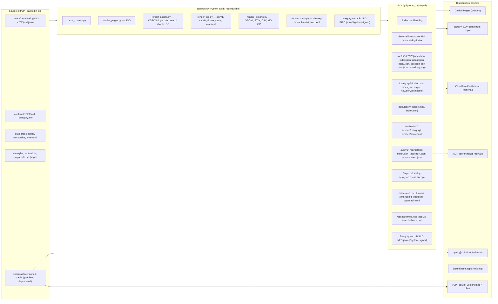

# Architecture

> **Status:** Locked at v7.0.0. This document is the permanent contract for the
> repository's build, hosting, and distribution architecture. Changes follow the
> RFC process documented in [`governance.md`](governance.md).

## Mission

Be the gold-standard, vendor-curated reference for Splunk monitoring use cases — fast
enough to use as a daily tool, stable enough to build products on top of, flexible
enough to embed and extend, and scalable enough to absorb 10× growth in content and
contributors without re-architecting again.

## Architecture in one diagram



## Layered model

| Layer | Owns | Tracked in git? |
|---|---|---|
| **Source** (`content/`, `data/`, `schemas/`, `src/`, `public/`) | Authored truth | Yes |
| **Build** (`tools/build/`, `tools/audits/`, `tools/validate/`) | Pure-Python pipeline | Yes |
| **Distribution** (`dist/`) | Generated artefacts deployed to GitHub Pages | No (`.gitignore`) |
| **Channels** (Pages, jsDelivr, Cloudflare, npm, PyPI, Splunkbase, MCP) | Read-only consumers of `dist/` | n/a |

### Source

* `content/cat-NN-slug/` is the unit of authoring. One UC = one `.md` (prose) + one
  `.json` (structured fields). Subcategory metadata lives in the directory's
  `_category.json`. Sample fixtures live in `samples/UC-X.Y.Z/`.
* `data/` holds cross-UC data: regulations, crosswalks (ATT&CK, D3FEND, OSCAL, OLIR),
  per-regulation rollups, inventory, provenance ledger, regulatory watch.
* `schemas/` holds JSON Schemas, versioned per [`schema-versioning.md`](schema-versioning.md).
* `src/styles/`, `src/scripts/`, `src/partials/`, `src/pages/` are hand-authored web
  assets the build pipeline bundles, fingerprints, and inlines.
* `public/` is copied verbatim to `dist/` (favicons, robots.txt, OG previews,
  `.nojekyll`).

### Build

* Single entrypoint: `python3 tools/build/build.py --out dist`. No Node, no npm, no
  external services in the page/content pipeline. `python3` 3.12 stdlib only.
* Build is **reproducible**: `--reproducible` sorts iteration, freezes timestamps to
  `git log -1 --format=%cI HEAD`, sorts JSON keys, sets `LC_ALL=C`. CI builds twice
  and asserts byte-identical output (see [`schema-versioning.md`](schema-versioning.md)
  for the same discipline applied to schemas).
* Build is **modular**: `parse_content` produces a `Catalog` in memory; the five
  `render_*` modules consume the same `Catalog` and write disjoint subtrees. New
  output formats slot in as new `render_*` modules without touching siblings.
* Build is **fast**: target wall-clock ≤90 s on a default `ubuntu-latest` runner for
  60 K UCs (10× current). Per-page render is O(1); only catalog-index + sitemap +
  search shards walk every UC.

### Distribution

`dist/` is the deployment artefact. Every public URL is permanent (see
[`url-scheme.md`](url-scheme.md)) and every byte is reproducible. The build emits:

* Static HTML for landing, `/browse/`, every UC, every category, every regulation,
  every equipment with matches, plus all supporting human pages.
* Paired machine-readable JSON next to every HTML page (`index.json`, `jsonld.json`,
  `oscal.json`, `stix.json`, `csv-row.json`, `uc.md`).
* Lazy-loaded API endpoints (`/api/catalog-index.json`, `/api/cat-N.json`) and
  versioned API surface (`/api/v1/`). The next major lives at `/api/v2/` when it
  ships.
* Bulk exports (`/exports/`) in CSV, JSON, OSCAL, STIX, and ZIP formats.
* Embeddable widgets at `/embed/uc/`, `/embed/category/`, `/embed/scorecard/`.
* Discovery: sitemap-index, `llms.txt`, `llms-full.txt`, `feed.xml`, `openapi.yaml`.
* Integrity: `integrity.json` (SHA-256 of every artefact), `BUILD-INFO.json`
  (git SHA, schema versions, UC count, asset hashes), both Sigstore-signed by the
  GitHub OIDC identity that produced the release.

### Channels

* **GitHub Pages** is the primary host. The `pages.yml` workflow uploads `dist/` and
  deploys via `actions/deploy-pages@v4`.
* **jsDelivr** automatically mirrors the repo at
  `https://cdn.jsdelivr.net/gh/<owner>/<repo>@v<version>/api/v1/...`. No setup
  required; documented in `docs/distribution.md`.
* **Cloudflare/Fastly** can front Pages without changes — fingerprinted assets carry
  `<meta http-equiv="Cache-Control" content="public, max-age=31536000, immutable">`,
  no cookies, no auth, no `Vary` beyond `Accept-Encoding`.
* **npm**: `@splunk-uc/schemas` (JSON Schemas + TypeScript types) ships from CI on
  every tag.
* **PyPI**: `splunk-uc-schemas` (schemas + Pydantic models) and `splunk-uc-client`
  (thin async client around `/api/v1/`) ship from CI on every tag.
* **Splunkbase** continues to receive existing `splunk-apps/*` releases.
* **MCP**: `mcp/src/splunk_uc_mcp/server.py` reads from `/api/v1/` (URL is
  configurable so the same server can target a local checkout, GitHub Pages, jsDelivr,
  or a private mirror).

## Performance budgets

| Page | Target gz first paint | Lighthouse perf |
|---|---|---|
| `/` | ≤100 KB | ≥0.95 |
| `/uc/UC-X.Y.Z/` | ≤80 KB | ≥0.95 |
| `/category/<slug>/` | ≤120 KB | ≥0.95 |
| `/regulation/<slug>/` | ≤120 KB | ≥0.95 |
| `/browse/` | ≤1 MB | ≥0.90 |

Budgets are enforced in CI by `tools/audits/budgets.py` reading
`tools/build/budgets.json`. A failing budget blocks merge.

## Loading model

* **Static-first.** Every primary content page (`/`, `/uc/`, `/category/`,
  `/regulation/`) renders fully without JavaScript. JS is layered on top for
  ergonomic features (copy-SPL buttons, dark-mode toggle, search-on-this-page).
* **Catalog index for `/browse/`.** The interactive browser bootstraps from
  `/api/catalog-index.json` (UC stub: `{i, n, c, d, cat, sub, mtype, regs,
  search_blob}`), which gzips to ~600 KB at current scale and ~4 MB at 60 K UCs.
* **Per-category lazy load.** Opening a category fetches `/api/cat-N.json` (cached in
  memory and Service Worker).
* **Sharded search.** Full-text search uses MiniSearch shards
  (`/assets/search-shard-<n>.json`, ~100 KB each, 16–32 shards). Loaded on first
  keystroke; merged client-side.
* **Service Worker.** `src/scripts/sw.js` pre-caches the app shell + landing +
  catalog index, cache-first for fingerprinted `/assets/`, network-first for
  `/api/cat-N.json`.
* **Fingerprinted assets.** Every file in `/assets/` is content-hashed and served
  with `Cache-Control: public, max-age=31536000, immutable`.

## Build pipeline

```
content/ + data/ + src/ + schemas/
        │
        ▼
parse_content.py  ──►  Catalog (in-memory)
        │
        ├──► render_assets.py   ──►  dist/assets/
        ├──► render_pages.py    ──►  dist/{index.html, browse/, uc/, category/, regulation/, equipment/, embed/}
        ├──► render_api.py      ──►  dist/api/
        ├──► render_exports.py  ──►  dist/exports/
        ├──► render_meta.py     ──►  dist/{sitemap-*.xml, llms*.txt, feed.xml, openapi.yaml, manifest.json}
        ▼
public/  ──►  dist/  (verbatim copy)
        │
        ▼
integrity.py + build_info.py  ──►  dist/{integrity.json, BUILD-INFO.json}
        │
        ▼
Sigstore attest (in CI only)
```

Stages are independent and can run in parallel CI jobs (each writes a disjoint
subtree of `dist/`); `actions/upload-artifact` + `download-artifact` merge them. Total
CI wall-clock target: ≤4 min for a full release build.

## Stability commitments

| Surface | Stability mechanism |
|---|---|
| Public URLs (`url-scheme.md`) | `tools/audits/url_freeze.py` blocks merge if a URL from the latest tag's `manifest.json` is missing in HEAD. |
| `/api/v{N}/` | semver per [`api-versioning.md`](api-versioning.md). 12-month parallel-release window for breaking changes. |
| JSON Schemas | per-schema `version` + `x-stability` per [`schema-versioning.md`](schema-versioning.md). `tools/audits/schema_diff.py` blocks breaking changes on `stable` schemas. |
| Build output | `--reproducible` produces byte-identical artefacts from the same SHA. CI re-builds and diffs. |
| Provenance | `dist/integrity.json` + `dist/BUILD-INFO.json` Sigstore-signed via `actions/attest-build-provenance@v1`. |

## Scalability targets (10× headroom)

| Dimension | Today (v6.x) | Target (v7+) |
|---|---|---|
| UC count | ~6,400 | 60,000 |
| Build wall-clock | ~30 s (manual) | ≤90 s in CI |
| `catalog-index.json` gzipped | n/a (no index) | ≤4 MB at 60 K UCs |
| Search shard size | n/a (linear scan over 39 MB) | 16–32 shards × ≤120 KB |
| Sitemap shards | 1 file | auto-shards once URLs > 50 K |
| PR diff size | thousands of lines (monolithic markdown) | ≤200 lines (per-UC files) |

## Quality gates (CI-enforced, blocking)

`.github/workflows/ci.yml` runs in parallel and blocks merge to `main`:

1. **Build & reproducibility** — two builds → byte diff.
2. **Schema validation** — every UC validates against `schemas/uc.schema.json`; every
   emitted JSON validates against its declared schema.
3. **Schema-diff** — `tools/audits/schema_diff.py` against the previous tag.
4. **URL freeze** — `tools/audits/url_freeze.py` against the latest tag's
   `manifest.json`.
5. **Lighthouse CI** — perf/a11y/best-practices/SEO ≥0.95 on `/`, `/browse/`, sample
   `/uc/`, `/category/`, `/regulation/`.
6. **axe-core a11y** — zero violations of `wcag2a wcag2aa wcag22aa`.
7. **Bundle-size budgets** — see table above.
8. **Link checker** — internal + external (allow-list).
9. **SPL syntax + CIM compliance** — `scripts/audit_*` consolidated under
   `tools/audits/`.

See [`governance.md`](governance.md) for how these gates relate to release cadence and
the RFC process for breaking changes.

## Non-goals

* No SPA framework (React/Vue/Svelte) and no Node build step in the **content/page**
  pipeline. (npm is allowed only for publishing the schemas package and for
  Lighthouse CI / Playwright in CI runners.)
* No paid hosting required — the entire stack must remain runnable on free GitHub
  Pages. CDN front, custom domain, and analytics are opt-in.
* No login/auth/server-side state. Read-only static site.
* No change to existing Splunk app sources (`splunk-apps/`, `ta/`, `mcp/`,
  `dashboards/`, `tools/data-sizing/`) other than where they read the catalog from.
