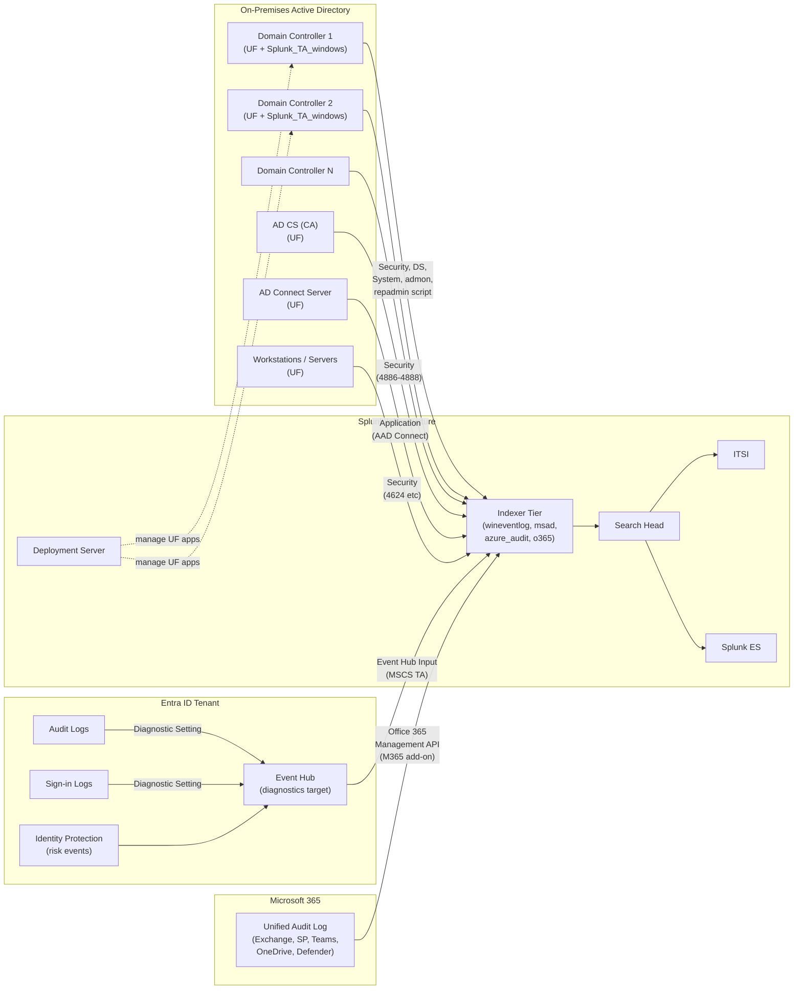

# Active Directory and Microsoft Entra ID Integration Guide

> The definitive guide to monitoring Microsoft identity infrastructure with
> Splunk — on-premises Active Directory (ADDS), Entra ID (formerly Azure AD),
> and Microsoft 365. 28 use cases spanning Kerberos abuse, AD CS attacks
> (ESC1-ESC8), AdminSDHolder modifications, account lockouts, replication
> health, GPO changes, sign-in risk, and conditional access.

---

## Table of Contents

- [Quick Start](#quick-start)
- [Overview and What Good Looks Like](#overview)
- [Architecture and Data Flow](#architecture)
- [Prerequisites](#prerequisites)
- [Data Sources Reference](#data-sources)
- [Field Dictionary](#field-dictionary)
- [Sample Events](#sample-events)
- [On-Premises AD Configuration](#on-prem)
- [Active Directory Audit Policy](#audit-policy)
- [AD CS (Certificate Services) Auditing](#adcs)
- [Entra ID Configuration](#entra)
- [Microsoft 365 Configuration](#m365)
- [Hybrid Identity (AD + Entra ID + AD Connect)](#hybrid)
- [Cross-Product Correlation](#cross-product-correlation)
- [CIM Mapping Reference](#cim-mapping)
- [Compliance Mapping](#compliance-mapping)
- [Capacity Planning and Sizing](#sizing)
- [Recommended Dashboard Layouts](#dashboards)
- [ITSI Service Modeling](#itsi)
- [SOAR Playbook Examples](#soar)
- [Security Hardening](#security-hardening)
- [Crawl / Walk / Run Roadmap](#roadmap)
- [Validation Checklist](#validation-checklist)
- [Known Limitations and Gaps](#known-limitations)
- [Troubleshooting](#troubleshooting)
- [FAQ](#faq)
- [Glossary](#glossary)
- [References](#references)
- [Contribution and Feedback](#contribution)

---

<a id="quick-start"></a>
## Quick Start — 60 Minutes to AD Visibility

For identity engineers who want logon failure alerts and Kerberos visibility flowing within an hour:

1. **Deploy the Splunk Universal Forwarder on every Domain Controller** with the `Splunk_TA_windows` add-on. (See the [Windows Servers guide](windows-servers.md) for the Splunk install pattern; here we focus on the AD-specific bits.)

2. **Enable the AD audit policy** on every DC via Group Policy:

    ```
    Computer Configuration → Policies → Windows Settings → Security Settings →
    Advanced Audit Policy Configuration → Audit Policies →

    Account Logon:
      ✓ Audit Credential Validation        — Success + Failure
      ✓ Audit Kerberos Authentication      — Success + Failure
      ✓ Audit Kerberos Service Ticket      — Success + Failure
      ✓ Audit Other Account Logon Events   — Success + Failure

    Account Management:
      ✓ All sub-categories                 — Success + Failure

    DS Access:
      ✓ Audit Directory Service Access     — Success + Failure
      ✓ Audit Directory Service Changes    — Success + Failure
      ✓ Audit Directory Service Replication — Success

    Logon/Logoff:
      ✓ Audit Logon                         — Success + Failure
      ✓ Audit Logoff                        — Success
      ✓ Audit Account Lockout               — Success
      ✓ Audit Special Logon                 — Success + Failure
    ```

3. **Configure the Splunk inputs.conf on the DCs** (typically deployed via Splunk Deployment Server):

    ```ini
    # %SPLUNK_HOME%\etc\apps\windows_uf\local\inputs.conf

    [WinEventLog://Security]
    disabled = 0
    index = wineventlog
    renderXml = 1

    [WinEventLog://Directory Service]
    disabled = 0
    index = msad
    renderXml = 1

    [WinEventLog://System]
    disabled = 0
    index = wineventlog
    renderXml = 1

    [admon://default]
    disabled = 0
    monitorSubtree = 1
    index = msad
    ```

4. **Verify within 5 minutes**:

    ```spl
    index=wineventlog sourcetype="WinEventLog:Security" EventCode=4624 host=dc-* | head 10
    index=msad sourcetype=ActiveDirectory | head 10
    ```

5. **Activate UC-9.1.1** — Failed logon brute force detection (10 failures in 15 min, suppressed by privileged_accounts lookup).

6. **For Entra ID** — separately, configure the [Entra ID streaming pipeline](#entra) (Diagnostic Setting → Event Hub → Splunk_TA_microsoft-cloudservices). This is independent of the on-prem path.

**Stuck?** Jump to [Troubleshooting](#troubleshooting).

---

<a id="overview"></a>
## Overview and What Good Looks Like

### What you're collecting from where

| Source | Tool | Sourcetype |
|--------|------|-----------|
| **DC Security Event Log** | UF + Splunk_TA_windows | `WinEventLog:Security` |
| **DC Directory Service Event Log** | UF + Splunk_TA_windows | `WinEventLog:Directory Service` |
| **DC NTLM Operational** | UF + Splunk_TA_windows | `WinEventLog:Microsoft-Windows-NTLM/Operational` |
| **AD Object Snapshot** | UF (admon) | `ActiveDirectory` |
| **AD CS audit (Certificate Authority)** | UF on the CA server | `WinEventLog:Security` (4886-4888) |
| **`repadmin /replsummary`** | Custom scripted input | `repadmin_replsummary` |
| **Entra ID audit + sign-in** | Splunk_TA_microsoft-cloudservices via Event Hub | `mscs:azure:audit`, `mscs:azure:signin`, `mscs:azure:identityprotection` |
| **Microsoft 365 audit** | Splunk Add-on for Microsoft Office 365 | `o365:management:activity` |
| **AD Connect sync events** | UF on AD Connect server | `WinEventLog:Application` (Microsoft-Azure-AD-Connect) |

### Why integrate AD + Entra with Splunk?

| Capability | Native MSFT | Splunk |
|------------|-------------|--------|
| AD audit search | Event Viewer per DC | Splunk: federated across DCs, retained |
| Cross-domain investigation | Manual | Single SPL across all forests |
| Kerberoasting / DCSync detection | Defender for Identity | Splunk: with full forensic detail (UC-9.1.5, .6) |
| AD CS attack detection (ESC1-8) | Manual hunting | Splunk: UC-9.1.26, .28 |
| Hybrid identity correlation | Microsoft 365 Defender | Splunk: AD logon ↔ Entra sign-in ↔ M365 audit (one pane) |
| Long-term audit retention | Limited | Splunk: 7y for SOX |
| Cross-product RBA | — | Splunk ES Risk-Based Alerting |
| SOAR auto-disable / forced reset | Manual | Splunk SOAR with AD/Graph connectors |

### Who should read this guide?

| Role | Relevant sections |
|------|-------------------|
| **Identity engineers** | All — this is your primary playbook |
| **Security operations** | Audit Policy, AD CS, Cross-Product, SOAR |
| **Compliance / audit** | Compliance Mapping, Validation Checklist |
| **Incident responders** | Field Dictionary, Sample Events, SOAR |

### What good looks like

| Dimension | Before integration | After full deployment |
|-----------|-------------------|-----------------------|
| **Failed logon investigation** | Event Viewer per DC | Splunk: 5 sec, all DCs (UC-9.1.1) |
| **Account lockout root-cause** | Repeated calls to helpdesk | Auto-pinpoint source workstation (UC-9.1.2) |
| **Kerberoasting detection** | Defender for Identity | Splunk: native + correlated (UC-9.1.5) |
| **AD CS attacks (ESC1)** | Pen-test only | Real-time alert (UC-9.1.26, .28) |
| **AdminSDHolder modification** | Hard to detect | Real-time alert (UC-9.1.21) |
| **Hybrid sign-in correlation** | Multiple consoles | One SPL search |
| **Compliance evidence** | Manual export | Saved searches |

---

<a id="architecture"></a>
## Architecture and Data Flow



**Key collection patterns:**

1. **DC-side UF** — every Domain Controller runs the Splunk Universal Forwarder with `Splunk_TA_windows`. The TA's input definitions handle Security, Directory Service, System, NTLM, and admon (AD object snapshot).

2. **Workstations and member servers** — UF on every endpoint forwards `WinEventLog:Security` 4624/4625 etc. — essential for full attack-path visibility.

3. **AD CS** — same UF + TA, but specifically focus on Certificate Services events (4886-4888, 4870-4885).

4. **AD Connect** — UF on the AD Connect server collects sync errors and provisioning events.

5. **Entra ID** — Diagnostic Setting on the tenant routes Audit + Sign-in + Identity Protection logs to an Event Hub. Splunk_TA_microsoft-cloudservices reads from the Event Hub.

6. **Microsoft 365** — separate add-on (Splunk Add-on for Microsoft Office 365) polls the O365 Management Activity API.

---

<a id="prerequisites"></a>
## Prerequisites

### On-prem AD

| Requirement | Detail |
|-------------|--------|
| **AD version** | Windows Server 2016+ on DCs; 2019/2022/2025 recommended |
| **Domain functional level** | 2016 minimum for full AD FS / Kerberos auditing detail |
| **Universal Forwarder** | UF 9.0+ on every DC (and CA server, AD Connect server, every workstation/server) |
| **Splunk_TA_windows** | Latest from Splunkbase 742 |
| **GPO permissions** | Edit-rights on the Default Domain Controllers Policy (or a dedicated audit GPO) |
| **DC hardware** | Allow ~5-10% additional CPU when audit policy is fully enabled (more events to write) |
| **Sysmon (optional)** | Recommended on DCs for richer process/network correlation |

### Entra ID

| Requirement | Detail |
|-------------|--------|
| **Entra ID licence** | Sign-in logs need Entra ID P1 minimum (P2 for Identity Protection) |
| **Tenant admin** | Global admin or Security admin role |
| **Event Hub** | Standard tier in a chosen subscription |
| **Splunk_TA_microsoft-cloudservices** | Latest from Splunkbase 3110 |
| **App registration** | Optional, only if pulling other Entra data via Graph |

### Microsoft 365

| Requirement | Detail |
|-------------|--------|
| **M365 licence** | Any plan that includes the Unified Audit Log (most paid plans) |
| **Audit logging enabled** | Compliance Center → Audit → Start recording user and admin activity |
| **App registration** | Application with Office 365 Management API permission, admin consent |
| **Splunk Add-on for Microsoft Office 365** | Latest from Splunkbase 4055 |

### Splunk

| Requirement | Detail |
|-------------|--------|
| **Splunk Enterprise / Cloud** | 9.0+ |
| **Indexes** | `wineventlog`, `msad`, `azure_audit`, `o365` |
| **CIM compliance** | Authentication and Change models populated |
| **ES (recommended)** | For Risk-Based Alerting on identity events |

### Network

| From | To | Port | Notes |
|------|----|------|-------|
| UF on DC | Indexer | 9997 (or 9998 SSL) | Standard forwarding |
| UF on DC | Deployment Server | 8089 | Splunkd REST |
| HF (MSCS) | Event Hub | 5671 | AMQP/TLS |
| HF (M365) | `manage.office.com` | 443 | Management API |
| HF (M365) | `login.microsoftonline.com` | 443 | OAuth |

---

<a id="data-sources"></a>
## Data Sources Reference

### Windows Security Event Log on Domain Controllers

| EventCode | Description | UC |
|-----------|-------------|-----|
| 4624 | Successful logon (Logon Type indicates kind) | UC-9.1.4 |
| 4625 | Failed logon | UC-9.1.1 |
| 4634 / 4647 | Logoff |  |
| 4648 | Explicit credential logon (RunAs etc) | Lateral movement |
| 4672 | Special privileges assigned to logon | Privilege use |
| 4720 / 4722 / 4723 / 4724 / 4725 / 4726 / 4738 | User account changes | Account mgmt |
| 4728 / 4732 / 4756 | Member added to security-enabled global/local/universal group | Group changes |
| 4729 / 4733 / 4757 | Member removed from group | Group changes |
| 4740 | Account locked out | UC-9.1.2 |
| 4767 | Account unlocked |  |
| 4768 | Kerberos TGT requested | UC-9.1.5, .16 |
| 4769 | Kerberos service ticket requested | UC-9.1.5 (Kerberoasting) |
| 4770 | Kerberos service ticket renewed |  |
| 4771 | Kerberos pre-authentication failed | Wrong password / account disabled |
| 4776 | Domain account auth attempt (NTLM) | NTLM use tracking |
| 4886 / 4887 / 4888 | Certificate Services: request received / cert issued / denied | UC-9.1.26, .28 |
| 5136 | Directory Service object modified (use ObjectClass / ObjectDN) | UC-9.1.7, .21 |
| 5137 | Directory Service object created |  |
| 5141 | Directory Service object deleted |  |

### Windows Directory Service Event Log

| EventCode | Description | UC |
|-----------|-------------|-----|
| 1644 | Expensive LDAP search (when enabled via 15 Field Engineering registry key) | UC-9.1.9 |
| 2042 | Tombstone lifetime exceeded | UC-9.1.27 |
| 1646 | Inefficient search |  |
| 1864-1865 | Replication latency / failure | UC-9.1.27 |

### admon (`ActiveDirectory`)

The admon input pulls AD object data (users, groups, computers, GPOs) on a schedule. Useful for:
- Inventory baselines
- Drift detection (new admin user added)
- Stale account / password-not-required detection

### `WinEventLog:Microsoft-Windows-NTLM/Operational`

NTLM authentication events. Useful for tracking deprecated NTLM use and for detecting over-pass-the-hash.

### Custom scripted: `repadmin_replsummary`

Daily scheduled script:

```cmd
repadmin /replsummary /csv > C:\splunk_data\repadmin_replsummary.csv
```

inputs.conf:

```ini
[script://.\bin\repadmin_replsummary.bat]
disabled = 0
interval = 86400
sourcetype = repadmin_replsummary
index = msad
```

### Entra ID via MSCS

| Sourcetype | Source | Description |
|------------|--------|-------------|
| `mscs:azure:audit` | Entra audit log via Event Hub | Admin actions, role changes, app consents |
| `mscs:azure:signin` | Entra sign-in log via Event Hub | All interactive and non-interactive sign-ins |
| `mscs:azure:identityprotection` | Identity Protection risk events via Event Hub | Risky sign-in / risky user (P2 licence required) |

### Microsoft 365

| Sourcetype | Source | Description |
|------------|--------|-------------|
| `o365:management:activity` | O365 Management Activity API | All M365 service audit (Exchange, SharePoint, OneDrive, Teams, Defender) |
| `o365:reporting` | Reporting API | Usage reports |

---

<a id="field-dictionary"></a>
## Field Dictionary

### `WinEventLog:Security` (DC subset)

| Field | Type | Example | Description | Used by |
|-------|------|---------|-------------|---------|
| `EventCode` | int | `4624`, `4625`, `4768`, `4769` | Event ID | All |
| `Account_Name` | string | `alice` | Account performing action | All |
| `TargetUserName` | string | `bob` | Account being acted upon (group changes etc) | Account mgmt UCs |
| `Subject_Account_Name` | string | `SYSTEM` or admin | Subject performing action | All |
| `Logon_Type` | int | `2` (interactive), `3` (network), `4` (batch), `5` (service), `7` (unlock), `10` (RDP), `11` (cached) | Type of logon | UC-9.1.4 |
| `Source_Network_Address` | string | `10.0.1.23` | Client IP | UC-9.1.1, .4 |
| `WorkstationName` | string | `WIN10-LAPTOP` | Source workstation | All |
| `CallerComputerName` | string | `WIN10-LAPTOP` | Source workstation (different schema events) | UC-9.1.2 |
| `Service_Name` | string | `MSSQLSvc/db01.contoso.com:1433` | Kerberos SPN | UC-9.1.5 |
| `Ticket_Encryption_Type` | string | `0x12` (AES-256), `0x17` (RC4) | Kerberos etype | UC-9.1.5, .16 |
| `Ticket_Lifetime` | int | seconds | Kerberos ticket lifetime | UC-9.1.16 |
| `Ticket_Options` | string | hex | Kerberos ticket options | UC-9.1.5 |
| `Status` / `Sub_Status` | string | hex | Failure reason (4625) | UC-9.1.1 |
| `ObjectClass` | string | `groupPolicyContainer`, `user`, `group` | DS object class (5136) | UC-9.1.7, .21 |
| `ObjectDN` | string | `CN=AdminSDHolder,CN=System,DC=contoso,DC=com` | DS object DN (5136) | UC-9.1.7, .21 |
| `AttributeLDAPDisplayName` | string | `gPLink`, `member`, `nTSecurityDescriptor` | DS attribute changed | UC-9.1.7, .21 |
| `AttributeValue` | string | varies | New value | UC-9.1.7, .21 |
| `Requester` | string | `CONTOSO\alice` | Cert request requester (4886-4888) | UC-9.1.26, .28 |
| `Template_OID` | string | `1.3.6.1.4.1.311.21.8.x.x...` | Cert template OID | UC-9.1.26 |
| `CertificateTemplate` | string | `User`, `SmartcardLogon` | Template name | UC-9.1.28 |
| `SubjectName` | string | `CN=alice,...` | Cert subject (sometimes contains SAN abuse) | UC-9.1.28 |

### `WinEventLog:Directory Service`

| Field | Type | Example | Description | Used by |
|-------|------|---------|-------------|---------|
| `EventCode` | int | `1644`, `2042` | Event ID | UC-9.1.9, .27 |
| `entries_visited` | int | extracted via rex | LDAP search size | UC-9.1.9 |
| `Search Filter` | string | `(&(objectClass=user)(memberOf=...))` | LDAP filter | UC-9.1.9 |
| `Client` | string | `10.0.1.23` | LDAP client | UC-9.1.9 |

### `repadmin_replsummary` (custom CSV)

| Field | Type | Example | Description | Used by |
|-------|------|---------|-------------|---------|
| `source_dc` | string | `DC1` | Source DC | UC-9.1.27 |
| `dest_dc` | string | `DC2` | Destination DC | UC-9.1.27 |
| `failures` | int | `0`, `5` | Failure count | UC-9.1.27 |
| `last_failure` | string (ISO) | `2026-04-25T12:00:00Z` | Last failure time | UC-9.1.27 |
| `last_success` | string (ISO) | timestamp | Last success | UC-9.1.27 |

### `mscs:azure:signin`

| Field | Type | Example | Description |
|-------|------|---------|-------------|
| `userPrincipalName` | string | `alice@contoso.com` | UPN |
| `appDisplayName` | string | `Microsoft Teams`, `Office 365 Exchange Online` | Application |
| `appId` | string | UUID | App ID |
| `clientAppUsed` | string | `Browser`, `Mobile Apps and Desktop clients` | Client type |
| `ipAddress` | string | `203.0.113.45` | Source IP |
| `location.city` / `country` | string | enrichment | Geo |
| `deviceDetail.browser` / `operatingSystem` | string |  | Device metadata |
| `riskLevelAggregated` | string | `none`, `low`, `medium`, `high` | Identity Protection risk |
| `riskState` | string | `none`, `confirmedSafe`, `atRisk`, `confirmedCompromised` | Risk state |
| `conditionalAccessStatus` | string | `success`, `failure`, `notApplied` | CA result |
| `status.errorCode` / `status.failureReason` | mixed | `0` (success), `50158` (MFA required not satisfied) | Outcome |
| `mfaDetail.authMethod` | string | `phoneAppNotification` etc | MFA method |
| `tenantId` | string | UUID | Tenant |

### `mscs:azure:audit`

| Field | Type | Example | Description |
|-------|------|---------|-------------|
| `category` | string | `RoleManagement`, `UserManagement`, `ApplicationManagement`, `Authentication`, `Policy` | Audit category |
| `activityDisplayName` | string | `Add member to role`, `Add app role assignment to user` | Operation |
| `initiatedBy.user.userPrincipalName` | string | UPN |  |
| `initiatedBy.app.displayName` | string | App name |  |
| `targetResources[].userPrincipalName` | string | Targeted UPN |  |
| `targetResources[].displayName` | string | Resource name |  |
| `result` | string | `success`, `failure` |  |

---

<a id="sample-events"></a>
## Sample Events

### `WinEventLog:Security` 4625 (failed logon)

```
EventCode=4625
EventType=Audit Failure
Account For Which Logon Failed:
    Security ID:    NULL SID
    Account Name:   alice
    Account Domain: CONTOSO
Failure Information:
    Failure Reason: Unknown user name or bad password.
    Status:         0xC000006D
    Sub Status:     0xC000006A
Network Information:
    Workstation Name: WIN10-LAPTOP
    Source Network Address: 10.0.1.23
    Source Port:    54321
Logon Type: 3
```

### `WinEventLog:Security` 4769 (Kerberos TGS — Kerberoasting indicator)

```
EventCode=4769
Account Information:
    Account Name:   alice@CONTOSO.COM
    Account Domain: CONTOSO.COM
Service Information:
    Service Name:   MSSQLSvc/sqlsrv-prod-01.contoso.com:1433
    Service ID:     CONTOSO\svc_sql
Network Information:
    Client Address: ::ffff:10.0.1.23
    Client Port:    54321
Additional Information:
    Ticket Options: 0x40810000
    Ticket Encryption Type: 0x17  ← RC4! Kerberoasting indicator
    Failure Code:   0x0
```

UC-9.1.5 alerts on `Ticket_Encryption_Type=0x17` for non-trivial counts per Service_Name.

### `WinEventLog:Security` 5136 (DS object modified — AdminSDHolder)

```
EventCode=5136
Subject:
    Account Name:    alice
Object:
    DN: CN=AdminSDHolder,CN=System,DC=contoso,DC=com
    Class: container
Attribute:
    LDAP Display Name: nTSecurityDescriptor
    Value:             O:DAG:DAD:PAI(...)...
```

UC-9.1.21 fires on any modification to AdminSDHolder.

### `WinEventLog:Security` 4887 (cert issued — UC-9.1.28)

```
EventCode=4887
Requester: CONTOSO\alice
Attributes:
    SAN=otherName:1.3.6.1.4.1.311.20.2.3=admin@contoso.com
Certificate Template: User
```

UC-9.1.28 alerts when SAN `otherName` contains `admin@*` and Requester is non-admin (ESC1 indicator).

### `mscs:azure:signin` (risky sign-in)

```json
{
  "userPrincipalName": "alice@contoso.com",
  "appDisplayName": "Microsoft Teams",
  "ipAddress": "203.0.113.45",
  "location": {"city": "Tokyo", "country": "JP"},
  "deviceDetail": {"browser": "Chrome 122", "operatingSystem": "Linux"},
  "riskLevelAggregated": "high",
  "riskState": "atRisk",
  "conditionalAccessStatus": "failure",
  "status": {"errorCode": 50158, "failureReason": "MFA required not satisfied"}
}
```

---

<a id="on-prem"></a>
## On-Premises AD Configuration

### Splunk_TA_windows install scope on DCs

Standard: install on every DC via Deployment Server. The TA brings:
- Field extractions for WinEventLog
- CIM aliases (Account_Name → user, Source_Network_Address → src)
- Eventtypes / tags for Authentication, Change, Endpoint

### inputs.conf for DCs

```ini
# %SPLUNK_HOME%\etc\apps\windows_uf_dc\local\inputs.conf

[default]
host = $decideOnStartup

# Security log — high volume on DCs
[WinEventLog://Security]
disabled = 0
index = wineventlog
renderXml = 1
checkpointInterval = 5

# Directory Service — replication, LDAP queries
[WinEventLog://Directory Service]
disabled = 0
index = msad
renderXml = 1

# System log — DC service health
[WinEventLog://System]
disabled = 0
index = wineventlog
renderXml = 1

# Application log — including AD Connect on the AD Connect host
[WinEventLog://Application]
disabled = 0
index = wineventlog
renderXml = 1

# NTLM operational — track legacy NTLM use
[WinEventLog://Microsoft-Windows-NTLM/Operational]
disabled = 0
index = wineventlog
renderXml = 1

# AD object snapshot via admon
[admon://default]
disabled = 0
monitorSubtree = 1
index = msad
sourcetype = ActiveDirectory

# repadmin scripted input
[script://.\bin\repadmin_replsummary.bat]
disabled = 0
interval = 86400
sourcetype = repadmin_replsummary
index = msad
```

### serverclass.conf on Deployment Server

```ini
[serverClass:domain_controllers]
whitelist.0 = dc-*

[serverClass:domain_controllers:app:windows_uf_dc]
restartSplunkd = 1
```

### Workstation/server inputs.conf

(See [Windows Servers guide](windows-servers.md) for full coverage; below is the minimum identity-relevant subset.)

```ini
[WinEventLog://Security]
disabled = 0
index = wineventlog
```

This brings `4624 / 4625` from every endpoint — essential for understanding lateral movement.

---

<a id="audit-policy"></a>
## Active Directory Audit Policy

### Recommended audit policy for DCs

Apply via the Default Domain Controllers GPO or a dedicated audit GPO:

| Subcategory | Settings |
|-------------|----------|
| **Account Logon** | All sub-categories: Success + Failure |
| **Account Management** | All sub-categories: Success + Failure |
| **DS Access** | Audit Directory Service Access: Success + Failure |
| **DS Access** | Audit Directory Service Changes: Success + Failure |
| **DS Access** | Audit Directory Service Replication: Success |
| **Logon/Logoff** | Audit Logon: Success + Failure |
| **Logon/Logoff** | Audit Account Lockout: Success |
| **Logon/Logoff** | Audit Special Logon: Success + Failure |
| **Logon/Logoff** | Audit Other Logon/Logoff Events: Success + Failure |
| **Object Access** | Audit Certification Services: Success + Failure (CA only) |
| **Object Access** | Audit File Share / Removable Storage / etc: as needed |
| **Privilege Use** | Audit Sensitive Privilege Use: Success + Failure |
| **Policy Change** | All sub-categories: Success + Failure |
| **System** | All sub-categories: Success + Failure |

Force update with:

```cmd
gpupdate /force
auditpol /get /category:*
```

### Volume implications

Full audit policy on a 10K-user DC easily generates 10-50 GB/day per DC just from Security logs. Plan for it (see [Sizing](#sizing)).

### LDAP expensive search auditing (UC-9.1.9)

Enable via registry on each DC:

```
HKLM\SYSTEM\CurrentControlSet\Services\NTDS\Diagnostics
  "15 Field Engineering" = 5 (DWORD)

HKLM\SYSTEM\CurrentControlSet\Services\NTDS\Parameters
  "Expensive Search Results Threshold" = 10000 (DWORD)
  "Inefficient Search Results Threshold" = 1000 (DWORD)
```

This makes the DC log Event 1644 for slow LDAP queries (UC-9.1.9).

### NTLM auditing

Via GPO: `Security Settings > Local Policies > Security Options >`:
- `Network security: Restrict NTLM: Audit Incoming NTLM Traffic` = Enable auditing for all accounts
- `Network security: Restrict NTLM: Audit NTLM authentication in this domain` = Enable all

Generates `Microsoft-Windows-NTLM/Operational` event 8001-8004 — useful for finding legacy NTLM consumers before disabling.

---

<a id="adcs"></a>
## AD CS (Certificate Services) Auditing

AD CS is one of the most exploited paths in modern AD attacks (ESC1-ESC8, see SpecterOps research). Enable auditing on all CA servers.

### Enable CA auditing

On the CA server:

```cmd
certutil -setreg CA\AuditFilter 127
net stop certsvc
net start certsvc
```

`AuditFilter=127` enables all sub-categories (start/stop, requests, issuance, revocation, security, role separation, key recovery).

### EventCodes generated

| EventCode | Description | UC |
|-----------|-------------|-----|
| 4870-4885 | CA service operations |  |
| 4886 | Cert request received | UC-9.1.26 |
| 4887 | Cert issued | UC-9.1.28 |
| 4888 | Cert denied | UC-9.1.28 |
| 4892 | One or more cert manager settings changed |  |
| 4893 | Property of CA changed |  |
| 4895 | CRL change |  |
| 4896 | Property changed in cert template |  |
| 4897 | New role added |  |

### Template risk lookup (`cert_template_risk.csv`)

For UC-9.1.26, maintain a lookup mapping template OIDs to ESC categories per [SpecterOps research](https://posts.specterops.io/certified-pre-owned-d95910965cd2):

```csv
Template_OID,template_name,risk_esc,description
1.3.6.1.4.1.311.21.8.1234.5678,SubjectAltAdmin,ESC1,"Allows enrollee-supplied SAN; can request cert as any user"
1.3.6.1.4.1.311.21.8.9876.5432,EnrollAgent,ESC3,"Enrollment Agent template grants ability to request certs on behalf of others"
```

### PingCastle / Locksmith parallel

Splunk audit is for *detection*; PingCastle and Microsoft Locksmith are for *prevention*. Run them periodically; ingest their JSON output into Splunk for trend dashboards.

---

<a id="entra"></a>
## Entra ID Configuration

### Step 1: Create Event Hub (covered in [Azure guide](azure.md))

You need an Event Hub Namespace with an Event Hub (e.g. `evh-entra-logs`) and a consumer group `cg-splunk`.

### Step 2: Configure Diagnostic Settings on the Entra tenant

Entra ID → Diagnostic settings → Add diagnostic setting.

| Category | Toggle |
|----------|--------|
| AuditLogs | ✓ |
| SignInLogs | ✓ |
| NonInteractiveUserSignInLogs | ✓ |
| ServicePrincipalSignInLogs | ✓ |
| ManagedIdentitySignInLogs | ✓ |
| ProvisioningLogs | ✓ |
| ADFSSignInLogs | ✓ (if AD FS) |
| RiskyUsers (P2) | ✓ |
| UserRiskEvents (P2) | ✓ |

Destination: **Stream to event hub** → your Event Hub Namespace → `evh-entra-logs` → SAS policy.

### Step 3: Configure the TA input

In Splunk Add-on for Microsoft Cloud Services → Inputs → Azure Event Hub → New:

| Field | Value |
|-------|-------|
| Name | `entra-prod-tenant` |
| Event Hub Namespace | `evhns-splunk-platform.servicebus.windows.net` |
| Event Hub Name | `evh-entra-logs` |
| Consumer Group | `cg-splunk` |
| SAS Key Name | `splunk-listen` |
| SAS Key Value | (from policy) |
| Sourcetype | (auto-routed by category — `mscs:azure:audit`, `mscs:azure:signin`, `mscs:azure:identityprotection`) |
| Index | `azure_audit` (or `msentra`) |

### Step 4: Verify

```spl
index=azure_audit (sourcetype=mscs:azure:audit OR sourcetype=mscs:azure:signin)
| stats count by sourcetype, category
```

### Categories to monitor

| Category | Used by |
|----------|---------|
| `RoleManagement` | Role assignments / removals — privilege escalation tracking |
| `UserManagement` | User create/modify/delete |
| `GroupManagement` | Group membership changes |
| `ApplicationManagement` | App consent (BEC vector), app registrations |
| `Authentication` | OAuth2 events |
| `Policy` | Conditional Access policy changes |
| `RiskyUsers` / `UserRiskEvents` | Identity Protection (P2 only) |

---

<a id="m365"></a>
## Microsoft 365 Configuration

### Enable Unified Audit Log

Microsoft 365 Compliance Center → Audit → "Start recording user and admin activity" (one-time enablement).

### Register Azure AD app for the M365 add-on

Entra → App registrations → New registration:

| Setting | Value |
|---------|-------|
| Name | `splunk-m365-collector` |
| Account types | Single tenant |

API permissions:
- Office 365 Management APIs: `ActivityFeed.Read` (Application)
- Office 365 Management APIs: `ServiceHealth.Read` (Application)
- (Add `ActivityFeed.ReadDlp` for DLP events)

Grant admin consent.

Create a client secret (rotate quarterly).

### Configure the Splunk Add-on for Microsoft Office 365

[Splunkbase 4055](https://splunkbase.splunk.com/app/4055). Install on a Heavy Forwarder.

| Field | Value |
|-------|-------|
| Tenant ID | (Entra tenant ID) |
| Client ID | (App ID) |
| Client Secret | (Secret value) |
| Sourcetype | `o365:management:activity` |
| Index | `o365` |
| Content types to subscribe | `Audit.AzureActiveDirectory`, `Audit.SharePoint`, `Audit.Exchange`, `Audit.General`, `DLP.All` |

### Verify

```spl
index=o365 sourcetype=o365:management:activity
| stats count by Workload, Operation
```

`Workload` will be `AzureActiveDirectory`, `Exchange`, `SharePoint`, `OneDrive`, `MicrosoftTeams`, `MicrosoftDefender`, `SecurityComplianceCenter`.

---

<a id="hybrid"></a>
## Hybrid Identity (AD + Entra ID + AD Connect)

### AD Connect

The AD Connect server (synchronisation engine) writes events to the Application log under `Microsoft-Azure-AD-Connect`. Install UF + `Splunk_TA_windows`. Watch for:

- Sync failures (event 6900-series)
- Account password sync errors
- OBJ-XXX errors during attribute sync

### Hybrid sign-in correlation

Same user could appear in both:
- `WinEventLog:Security` 4624 (on-prem AD logon)
- `mscs:azure:signin` (Entra sign-in via cloud apps)

Correlation:

```spl
(index=wineventlog sourcetype="WinEventLog:Security" EventCode=4624 Account_Name="alice")
OR (index=azure_audit sourcetype=mscs:azure:signin userPrincipalName="alice@contoso.com")
| sort _time
```

This gives you a unified user activity view.

### Pass-through Authentication (PTA) vs. Password Hash Sync

- **PHS (Password Hash Sync)**: Entra holds hashed passwords; sign-in is local to Entra. AD doesn't know about cloud sign-ins.
- **PTA (Pass-through Authentication)**: Entra forwards auth attempts to on-prem AD. The on-prem DC sees the auth (Event 4776 - NTLM domain account auth attempt).
- **Federation (AD FS)**: AD FS handles auth; produces its own `ADFSSignInLogs`.

Each topology requires slightly different correlation logic.

---

<a id="cross-product-correlation"></a>
## Cross-Product Correlation

### AD ↔ Endpoint (Windows / Linux / Mac)

```spl
(index=wineventlog sourcetype="WinEventLog:Security" EventCode=4624 Account_Name="alice")
OR (index=os sourcetype=linux_secure user="alice" "Accepted publickey")
| transaction user maxspan=15m
```

### AD ↔ Cloud (AWS / Azure / GCP)

```spl
(index=wineventlog sourcetype="WinEventLog:Security" EventCode=4624 Account_Name="alice")
OR (index=aws_cloudtrail userIdentity.userName="alice")
OR (index=azure sourcetype=mscs:azure:activity caller="alice@contoso.com")
| timechart span=15m count by sourcetype
```

### AD ↔ Microsoft Defender for Identity

Defender for Identity surfaces high-fidelity AD attacks (Pass-the-Ticket, Golden Ticket, DCSync). Ingest its alerts via the Microsoft Graph Security API.

### AD ↔ Splunk ES (Risk-Based Alerting)

UC-9.1.5 (Kerberoasting) → 90 risk score per user.
UC-9.1.21 (AdminSDHolder) → 100 risk score per modifier.
UC-9.1.26, .28 (AD CS ESC1) → 100 risk score per requester.

### AD ↔ BloodHound / SharpHound

BloodHound's data is JSON; can be ingested into a Splunk lookup. Cross-reference attack paths with detected activity.

---

<a id="cim-mapping"></a>
## CIM Mapping Reference

| CIM Data Model | Mapped sourcetypes / EventCodes | Validation SPL |
|----------------|---------------------------------|----------------|
| **Authentication** | `WinEventLog:Security` 4624/4625/4768/4769/4776; `mscs:azure:signin`; `o365:management:activity` (UserLoggedIn) | `\| tstats count from datamodel=Authentication where action=success by user` |
| **Change** | `WinEventLog:Security` 4720-4738 (account mgmt), 4728-4729 (group mgmt), 5136 (DS modify); `mscs:azure:audit`; `o365:management:activity` (admin actions) | `\| tstats count from datamodel=Change` |
| **Endpoint** | `WinEventLog:Security` (process events; if Sysmon used too) | `\| tstats count from datamodel=Endpoint` |

The Splunk_TA_windows ships eventtypes/tags for Authentication and Change — verify in Settings → Data Models after installing.

---

<a id="compliance-mapping"></a>
## Compliance Mapping

### NIST 800-53 Rev. 5

| UC | Control |
|----|---------|
| UC-9.1.1 | AC-7 Unsuccessful logon attempts |
| UC-9.1.2 | AC-7 |
| UC-9.1.5, .6 | AC-6 Least privilege |
| UC-9.1.7 (GPO modify) | CM-3 Configuration change control |
| UC-9.1.21 (AdminSDHolder) | AC-6(2) Privilege accounts |
| UC-9.1.26, .28 (AD CS) | SC-12 Cryptographic key management |

### PCI-DSS v4.0

| UC | Requirement |
|----|------------|
| UC-9.1.1 | 8.3.4 Lockout after failures |
| UC-9.1.2 | 8.3.4 |
| UC-9.1.4 (svc account misuse) | 7.x Restrict access |
| UC-9.1.* (admin changes) | 10.2 Audit logs |

### ISO 27001:2022

| UC | Annex |
|----|-------|
| UC-9.1.1 | A.5.16 Identity management |
| UC-9.1.* (audit) | A.8.16 Monitoring activities |

### CIS Microsoft Active Directory Benchmark

Most UCs map to specific CIS control items in the Audit Policy section.

---

<a id="sizing"></a>
## Capacity Planning and Sizing

### Per-DC ingest

| Activity | Volume |
|----------|--------|
| Security log (full audit) on a 10K-user enterprise DC | 5–50 GB/day |
| Directory Service log | 100 KB – 100 MB/day |
| admon snapshot | 100 MB / sync cycle |
| repadmin scripted input | < 1 MB/day |

### Worked examples

| Estate | Daily ingest |
|--------|-------------|
| **Small (1 forest, 4 DCs, 2K users)** | ~10 GB/day |
| **Medium (1 forest, 10 DCs, 20K users)** | ~80 GB/day |
| **Large (multi-forest, 50 DCs, 100K users)** | ~400 GB/day |

Plus Entra ID and M365:

| Source | Daily ingest |
|--------|-------------|
| Entra sign-in (10K users) | ~500 MB – 5 GB/day |
| M365 audit | ~500 MB – 10 GB/day |

### Cost-cutting levers

1. **Filter Sysmon noise** at source if also collecting
2. **Drop noisy 4634/4647 logoff events** — usually low value
3. **Aggregate `Microsoft-Windows-NTLM` to summary index** for trending
4. **Sample non-interactive sign-ins** in Entra (high volume, low value)
5. **Use Splunk Edge Processor** for routing/filtering before HEC

---

<a id="dashboards"></a>
## Recommended Dashboard Layouts

### Crawl Dashboard — "Identity at a Glance"

```
+----------------------------------+----------------------------------+
| FAILED LOGONS LAST 24H           | ACCOUNT LOCKOUTS LAST 24H        |
| (UC-9.1.1)                       | (UC-9.1.2)                       |
+----------------------------------+----------------------------------+
| KERBEROASTING INDICATORS         | ADMINSDHOLDER MODIFICATIONS      |
| (UC-9.1.5)                       | (UC-9.1.21)                      |
+----------------------------------+----------------------------------+
| AD REPLICATION HEALTH            | RECENT ROLE ASSIGNMENTS (Entra)  |
| (UC-9.1.27)                      | (mscs:azure:audit)               |
+----------------------------------+----------------------------------+
```

### Walk Dashboard — "Operational Intelligence"

```
+----------------------------------+----------------------------------+
| EXPENSIVE LDAP QUERIES           | GPO MODIFICATIONS                |
| (UC-9.1.9)                       | (UC-9.1.7)                       |
+----------------------------------+----------------------------------+
| NTLM USE OVER TIME               | RISKY SIGN-INS (Entra)           |
| (8001-8004)                      | (mscs:azure:identityprotection)  |
+----------------------------------+----------------------------------+
| AD CS CERT ISSUANCE              | CONDITIONAL ACCESS FAILURES      |
| (UC-9.1.26, .28)                 | (mscs:azure:signin CA failure)   |
+----------------------------------+----------------------------------+
```

### Run Dashboard — "Security & Compliance"

```
+----------------------------------+----------------------------------+
| GOLDEN/SILVER TICKET INDICATORS  | SERVICE ACCOUNT MISUSE           |
+----------------------------------+----------------------------------+
| AD CS ESC1-8 EXPLOIT INDICATORS  | EXTERNAL APP CONSENTS (BEC)      |
+----------------------------------+----------------------------------+
| CIS AD BENCHMARK SCORECARD       | COMPLIANCE EVIDENCE PER UC       |
+----------------------------------+----------------------------------+
```

---

<a id="itsi"></a>
## ITSI Service Modeling

### Service hierarchy

```
Identity Platform
├── On-Prem AD
│   ├── Domain Controllers (per DC)
│   │   ├── Replication health
│   │   ├── Failed logons
│   │   └── DC service health
│   ├── AD Connect
│   └── AD CS (CA)
├── Entra ID
│   ├── Sign-in success rate
│   ├── MFA challenge volume
│   └── Risky sign-ins
└── Microsoft 365
    └── Service health (per workload)
```

### Recommended KPIs

| KPI | Source | Threshold |
|-----|--------|-----------|
| **DC Replication failure count** | UC-9.1.27 | Static (any) |
| **Failed logon rate** | EventCode=4625 | Adaptive |
| **Account lockout rate** | EventCode=4740 | Adaptive |
| **Risky sign-ins (Entra)** | `mscs:azure:identityprotection riskLevelAggregated=high` | Static |
| **AD CS cert issuance** | EventCode=4887 | Static (baseline) |

---

<a id="soar"></a>
## SOAR Playbook Examples

### Playbook 1: Kerberoasting (UC-9.1.5)

**Trigger:** UC-9.1.5 alerts (Service_Name targeted with RC4 from same Account_Name).

```
1. RECEIVE alert (account, service_targeted, count, source_ip)
2. PULL last 24h account activity (4624, 4769, 4776)
3. CHECK if account is privileged
4. IF service account targeted is sensitive:
   - ROTATE service account password (PowerShell + AD)
   - REVOKE Kerberos tickets (klist purge on suspect hosts)
   - DISABLE source workstation
5. NOTIFY identity team + SecOps
6. CREATE INCIDENT (P1)
```

### Playbook 2: AdminSDHolder Modification (UC-9.1.21)

**Trigger:** UC-9.1.21 alerts.

```
1. RECEIVE alert (subject, attribute, value)
2. CHECK change ticket database
3. IF unauthorised:
   - REVERT ACL via PowerShell:
     Set-Acl -Path "AD:CN=AdminSDHolder,..." -AclObject $original_acl
   - DISABLE subject account
   - REVOKE all subject's tickets
4. SCAN domain for newly added admin group members
5. CREATE INCIDENT (P1)
6. NOTIFY CISO + identity team
```

### Playbook 3: AD CS ESC1 Cert Issued (UC-9.1.26, .28)

**Trigger:** Cert issued with admin SAN to non-admin.

```
1. RECEIVE alert (requester, template, subject_san)
2. REVOKE the certificate via certutil
3. DISABLE the requester account
4. CHECK if vulnerable template still in use:
   - ANALYSE template via PSPKIAudit
   - SUGGEST template hardening (remove Enrollee Supplies Subject)
5. CREATE INCIDENT (P1)
6. SUMMON identity team for emergency template review
```

---

<a id="security-hardening"></a>
## Security Hardening

### UF service identity on DCs

The UF runs as `LOCAL SYSTEM` by default — required to read Security log. Don't change to a service account unless you know how to grant explicit `Manage auditing and security log` rights.

### Sensitive data in logs

- 4624 includes `Source_Network_Address` (PII in some jurisdictions)
- 5136 may contain attribute *values* (passwords, secrets if stored in directory)
- Apply field-level RBAC for analyst roles on `wineventlog` index

### TLS

- UF → Indexer: enable TLS (port 9998)
- HF → Event Hub: TLS by default

### Audit log integrity

- DC audit log subject to tampering by domain admins
- Forward in real-time (UF default checkpoint = 5s)
- Store retention copy in protected Splunk index (no `delete` permission for non-admin roles)

### Detection of Splunk evasion

- Alert on UF process kill on DCs
- Alert on inputs.conf modification on DCs
- Alert on Splunk forwarder TCP outbound failure

---

<a id="roadmap"></a>
## Crawl / Walk / Run Roadmap

### Crawl (Week 1–4)

| Order | UC | Title |
|-------|----|-------|
| 1 | UC-9.1.1 | Failed logon brute force |
| 2 | UC-9.1.2 | Account lockout monitoring |
| 3 | UC-9.1.7 | GPO modifications |
| 4 | UC-9.1.27 | AD replication health |
| 5 | (Entra basics) | Risky sign-in dashboard |

### Walk (Week 5–12)

1. Kerberos: UC-9.1.5 (Kerberoasting), .16 (TGT anomalies)
2. Service account: UC-9.1.4
3. AdminSDHolder: UC-9.1.21
4. LDAP performance: UC-9.1.9
5. Hybrid correlation (AD + Entra)

### Run (Month 4+)

1. AD CS: UC-9.1.26, .28 (ESC1-ESC8 detection)
2. ITSI per-domain services
3. SOAR playbooks (Kerberoasting, AdminSDHolder, ESC1)
4. M365 integration
5. RBA in Splunk ES with risk scoring

---

<a id="validation-checklist"></a>
## Validation Checklist

### Day 1

- [ ] UF on every DC; phoning home
- [ ] Splunk_TA_windows installed on UF + SH + indexer (eventtypes)
- [ ] AD audit policy applied via GPO
- [ ] inputs.conf for Security, DS, System, admon, repadmin running
- [ ] `index=wineventlog sourcetype=WinEventLog:Security host=dc-* | head 10` shows events
- [ ] `index=msad sourcetype=ActiveDirectory | head 10` shows admon data

### Day 7

- [ ] Crawl-tier UCs deployed
- [ ] Crawl dashboard built
- [ ] Failed logon brute force alert tested
- [ ] Workstation UF deployment in progress

### Day 30

- [ ] Walk-tier UCs deployed
- [ ] Workstation UFs at >80% coverage
- [ ] Entra ID streaming pipeline working
- [ ] M365 audit flowing
- [ ] Hybrid identity dashboards working

### Day 90

- [ ] Run-tier UCs deployed
- [ ] AD CS auditing on all CAs
- [ ] ITSI services configured
- [ ] First SOAR playbook in production
- [ ] CIS AD scorecard reviewed

---

<a id="known-limitations"></a>
## Known Limitations and Gaps

| Limitation | Impact | Workaround |
|------------|--------|------------|
| **Security log volume on busy DCs** | 50+ GB/day per DC | Use Splunk_TA_windows excludes for noise; route to summary index |
| **NTLM auditing not enabled by default** | UC-9.1.5 / NTLM tracking blind | Enable via GPO |
| **AD CS auditing not enabled by default** | UC-9.1.26, .28 blind | `certutil -setreg CA\AuditFilter 127` |
| **DCSync detection requires advanced filtering** | Hard to detect natively | Defender for Identity supplements |
| **admon doesn't include all attributes** | Inventory partial | Custom PowerShell scripted input |
| **Entra IdentityProtection requires P2** | Risk events unavailable on P1 | Licence upgrade |
| **AD Connect logs are sparse** | Hard to root-cause sync errors | Enable verbose AAD Connect logging |

---

<a id="troubleshooting"></a>
## Troubleshooting

### No 4624 events from a DC

1. Check audit policy: `auditpol /get /category:*` — verify Logon = Success enabled
2. Check UF inputs.conf: `[WinEventLog://Security]` enabled
3. Check UF logs: `splunkd.log` for `WinEventLog` errors
4. Check Splunk index permission: UF can write to `wineventlog`?

### Failed logon alerts too noisy

- Add a `service_accounts.csv` lookup and exclude
- Add a `break_glass_accounts.csv` lookup and exclude
- Tune the threshold (default 10 in 15min may be too aggressive)

### Kerberos events missing fields

- Some Kerberos fields require `renderXml = 1` in inputs.conf
- DC functional level must be 2008+ for full audit detail

### admon not pulling all data

- Check `[admon://default]` `monitorSubtree = 1`
- Confirm UF service account has Read rights on AD

### Entra sign-in volume manageable?

- 10K users typically 500MB-5GB/day depending on app activity
- Filter `category=NonInteractiveUserSignInLogs` if too noisy

---

<a id="faq"></a>
## FAQ

**Q: Should I use Splunk or Microsoft Defender for Identity (MDI)?**
A: They complement. MDI provides high-fidelity AD attack detection out-of-the-box (Golden Ticket, DCSync, Pass-the-Ticket). Splunk provides custom detections, retention, multi-source correlation, and the Crawl-Walk-Run UC catalog. Many enterprises ingest MDI alerts INTO Splunk for unified investigation.

**Q: How do I detect DCSync?**
A: 4662 events with specific GUIDs (`1131f6aa-9c07-11d1-f79f-00c04fc2dcd2` for DS-Replication-Get-Changes-All) on the DC. Or rely on MDI.

**Q: What's the right approach for Sysmon on DCs?**
A: Sysmon on DCs gives huge process / network detail at moderate cost. Recommended for high-security environments. Use SwiftOnSecurity or Olaf Hartong configs and tune for DC noise.

**Q: How do I monitor AD FS?**
A: AD FS server runs `Microsoft-Windows-WindowsRemoteManagement/Operational` and a custom AD FS log. Forward via UF. ADFSSignInLogs (Entra-side) cover claims and federation auth attempts.

**Q: Cross-forest trust monitoring?**
A: 4768 / 4769 events show `Account_Domain` as the trusted forest. Cross-forest replication monitored via `repadmin /showrepl /csv` per DC.

**Q: How do I detect external app consents (BEC vector)?**
A: `mscs:azure:audit category=ApplicationManagement activityDisplayName="Add app role assignment to user"` or "Consent to application". Add unverified-app filter.

**Q: M365 audit log retention?**
A: Default 90d for E3, 1y for E5. Splunk extends per your policy.

**Q: How do I correlate AD logon with VPN logon?**
A: `transaction user maxspan=10m` joining `WinEventLog:Security` 4624 and your VPN logs.

---

<a id="glossary"></a>
## Glossary

| Term | Definition |
|------|-----------|
| **AD CS** | Active Directory Certificate Services |
| **AdminSDHolder** | AD container whose ACL is propagated to protected accounts every 60 min |
| **AD FS** | Active Directory Federation Services |
| **AD Connect** | Microsoft's hybrid identity sync engine |
| **admon** | Splunk modular input that pulls AD object snapshots |
| **DCSync** | Mimikatz technique replicating AD database from a DC |
| **Entra ID** | Modern name for Azure Active Directory |
| **ESC1-ESC8** | AD CS attack categories per SpecterOps research |
| **Golden Ticket** | Forged TGT signed with the krbtgt account hash |
| **Kerberoasting** | Requesting service tickets to crack offline |
| **MDI** | Microsoft Defender for Identity |
| **Silver Ticket** | Forged service ticket signed with service account hash |
| **TGT** | Ticket-Granting Ticket (Kerberos) |
| **TGS** | Ticket-Granting Service ticket |

---

<a id="references"></a>
## References

| Resource | URL |
|----------|-----|
| Splunk Add-on for Microsoft Windows (Splunkbase 742) | [splunkbase.splunk.com/app/742](https://splunkbase.splunk.com/app/742) |
| Splunk Add-on for Microsoft Cloud Services (Splunkbase 3110) | [splunkbase.splunk.com/app/3110](https://splunkbase.splunk.com/app/3110) |
| Splunk Add-on for Microsoft Office 365 (Splunkbase 4055) | [splunkbase.splunk.com/app/4055](https://splunkbase.splunk.com/app/4055) |
| Microsoft AD Audit policy guidance | [learn.microsoft.com/windows/security/threat-protection/auditing/advanced-security-audit-policy-settings](https://learn.microsoft.com/en-us/windows/security/threat-protection/auditing/advanced-security-audit-policy-settings) |
| Microsoft AD CS auditing | [learn.microsoft.com/windows-server/networking/core-network-guide/cncg/server-certs/configure-the-server-with-the-certificate-authority](https://learn.microsoft.com/en-us/windows-server/identity/ad-cs/) |
| SpecterOps Certified Pre-Owned (AD CS attacks) | [posts.specterops.io/certified-pre-owned-d95910965cd2](https://posts.specterops.io/certified-pre-owned-d95910965cd2) |
| Entra ID Diagnostic Settings | [learn.microsoft.com/azure/active-directory/reports-monitoring/howto-integrate-activity-logs-with-azure-sentinel](https://learn.microsoft.com/en-us/entra/identity/monitoring-health/howto-stream-logs-to-event-hub) |
| O365 Management Activity API | [learn.microsoft.com/office/office-365-management-api/office-365-management-activity-api-reference](https://learn.microsoft.com/en-us/office/office-365-management-api/office-365-management-activity-api-reference) |
| CIS Microsoft Windows Server Benchmark | [cisecurity.org/benchmark/microsoft_windows_server](https://www.cisecurity.org/benchmark/microsoft_windows_server) |

---

<a id="contribution"></a>
## Contribution and Feedback

Part of the [Splunk Monitoring Use Cases](https://github.com/fenre/splunk-monitoring-use-cases) project. Found an error? [Open an issue](https://github.com/fenre/splunk-monitoring-use-cases/issues/new).

---

*Last updated: 2026-05-08. Covers `Splunk_TA_windows` 8.x, `Splunk_TA_microsoft-cloudservices` 5.x, M365 add-on 4.x.*
