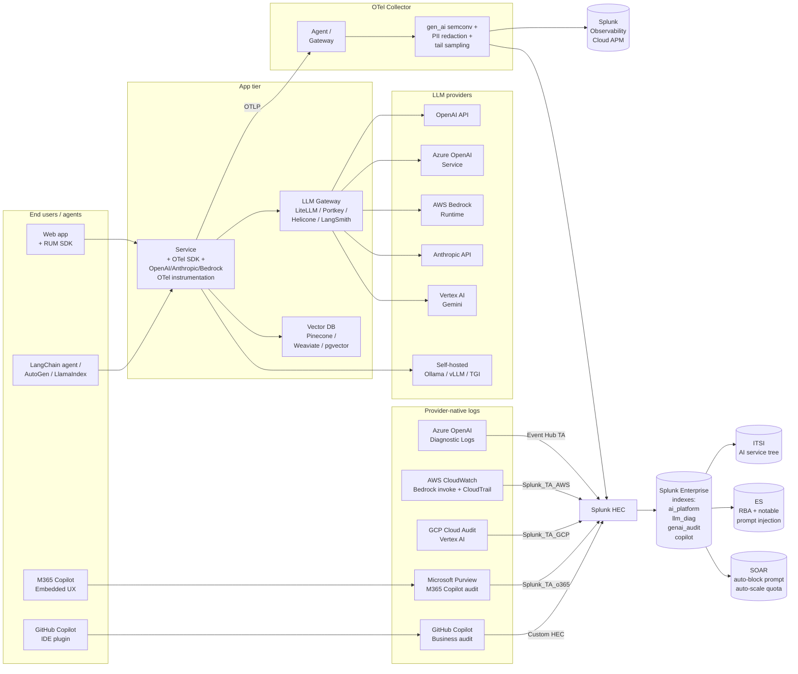

# AI & LLM Observability Integration Guide

> The definitive guide to monitoring generative AI workloads with
> Splunk — managed LLM APIs (OpenAI, Azure OpenAI, AWS Bedrock,
> Anthropic, Vertex AI), Microsoft 365 / GitHub Copilot, self-hosted
> models (Ollama, vLLM, TGI), vector databases, RAG pipelines, and
> agent frameworks. 17 use cases across cat 13.4 covering latency
> SLOs, error rates, token-cost budgets, prompt-injection detection,
> hallucination evidence, RAG quality drift, agent-loop runaway,
> Microsoft 365 Copilot audit, M365 Copilot data-exposure detection,
> and OWASP Top 10<sup class="ref">[<a href="#ref-10">10</a>]</sup> for LLMs.

---

## Table of Contents

- [Quick Start](#quick-start)
- [Overview](#overview)
- [Architecture and Data Flow](#architecture)
- [Prerequisites](#prerequisites)
- [LLM Provider Coverage Matrix](#provider-matrix)
- [Managed LLM APIs](#managed-llms)
  - [OpenAI / Azure OpenAI](#openai)
  - [AWS Bedrock](#bedrock)
  - [Anthropic API](#anthropic)
  - [Google Vertex AI / Gemini](#vertex)
  - [Microsoft 365 Copilot](#m365-copilot)
  - [GitHub Copilot](#github-copilot)
- [Self-Hosted LLMs](#self-hosted)
  - [Ollama](#ollama)
  - [vLLM and Hugging Face TGI](#vllm)
- [LLM Gateways](#llm-gateways)
  - [LiteLLM](#litellm)
  - [LangSmith / LangChain](#langsmith)
  - [Portkey, Helicone](#portkey)
- [Vector Databases](#vector-dbs)
- [RAG Pipeline Observability](#rag)
- [Agent Frameworks (LangGraph, AutoGen)](#agents)
- [OpenTelemetry GenAI Semantic Conventions](#otel-genai)
- [Splunk-Side Configuration](#splunk-config)
- [Field Dictionary](#field-dictionary)
- [Sample Events](#sample-events)
- [Token Cost Budgeting (FinOps for AI)](#token-cost)
- [Prompt-Injection and Jailbreak Detection](#prompt-injection)
- [Hallucination Evidence](#hallucination)
- [PII / PHI / Cardholder Data in Prompts](#pii-prompts)
- [OWASP Top 10 for LLMs Mapping](#owasp-llm)
- [EU AI Act and ISO 42001 Compliance](#ai-act)
- [Cross-Product Correlation](#cross-product)
- [CIM Mapping Reference](#cim-mapping)
- [Capacity Planning](#sizing)
- [Recommended Dashboard Layouts](#dashboards)
- [ITSI Service Modeling for AI Platforms](#itsi)
- [SOAR Playbook Examples](#soar)
- [Multi-Tenant / Multi-Region Strategy](#multi-tenant)
- [Security Hardening](#security-hardening)
- [Crawl / Walk / Run Roadmap](#roadmap)
- [Validation Checklist](#validation-checklist)
- [Known Limitations](#known-limitations)
- [Troubleshooting](#troubleshooting)
- [FAQ](#faq)
- [Glossary](#glossary)
- [References](#references)
- [Contribution and Feedback](#contribution)

---

<a id="quick-start"></a>
## Quick Start — 60 Minutes to First Dashboard

### 1. Decide your minimum signal set

| Signal | Why first |
|---|---|
| **Per-request latency** | LLM latency is volatile — model shifts, region issues, throttling — first dashboard everyone wants |
| **Error rate (esp. HTTP 429 quota)** | Most production LLM outages are quota exhaustion, not failures |
| **Tokens used (input + output)** | Cost is metered in tokens; without this no FinOps |
| **Model + deployment + tenant** | Cardinality matters for cost allocation and SLO scoping |

### 2. Instrument with OpenTelemetry GenAI semantic conventions

Most modern OpenAI / Anthropic / Bedrock SDKs now emit `gen_ai.*`
attributes natively when wrapped by OTel. Easiest path: add the
LangChain or LlamaIndex OTel instrumentation:

```bash
pip install opentelemetry-instrumentation-langchain \
            opentelemetry-instrumentation-openai \
            opentelemetry-instrumentation-anthropic \
            opentelemetry-instrumentation-bedrock \
            splunk-opentelemetry[all]
```

```python
# auto-instrument with environment variables
import os
os.environ['OTEL_SERVICE_NAME'] = 'rag-api'
os.environ['OTEL_EXPORTER_OTLP_ENDPOINT'] = 'http://localhost:4318'
os.environ['SPLUNK_PROFILER_ENABLED'] = 'true'

from opentelemetry.instrumentation.openai import OpenAIInstrumentor
OpenAIInstrumentor().instrument()

from openai import OpenAI
client = OpenAI()
resp = client.chat.completions.create(
    model='gpt-4o-mini',
    messages=[{'role': 'user', 'content': 'Why is the sky blue?'}]
)
# Span created with gen_ai.system=openai, gen_ai.request.model=gpt-4o-mini,
# gen_ai.usage.input_tokens, gen_ai.usage.output_tokens, etc.
```

### 3. Provider-side telemetry (zero-code)

| Provider | Enable in provider | Lands in Splunk via |
|---|---|---|
| **Azure OpenAI** | Diagnostic Settings → ResourceProvider logs to Event Hub | `Splunk_TA_microsoft-cloudservices` → `azure:openai:diagnostic` |
| **AWS Bedrock** | CloudWatch Logs + CloudTrail | `Splunk_TA_AWS` → `aws:cloudwatch:bedrock`, `aws:cloudtrail:bedrock` |
| **Vertex AI** | Cloud Audit Logs + Stackdriver | `Splunk_TA_google-cloudplatform` → `vertex:ai:audit` |
| **OpenAI** (public API) | No native log export — gateway in front (LiteLLM, Portkey) | Custom HEC source |
| **M365 Copilot** | Microsoft Purview Audit (Premium) | `Splunk_TA_o365` → `splunk:m365:copilot:audit` |
| **GitHub Copilot** | Copilot Business audit + billing API | Custom HEC source |

### 4. Verify in Splunk

```spl
| mstats avg(gen_ai.request.duration) AS lat_ms
        WHERE index=otel_metrics gen_ai.system=* span=1m
| timechart span=1m max(lat_ms) AS p_max BY gen_ai.system
```

```spl
index=ai_platform OR index=llm_diag (sourcetype=otel:traces OR sourcetype=azure:openai:diagnostic) earliest=-1h
| stats count(eval(http_status>=400)) AS errors count AS total BY gen_ai.system
| eval err_rate = round(errors/total*100, 2)
```

### 5. Activate crawl tier

UC-13.4.1 (LLM API Latency and Error Rate), UC-13.4.2 (Token cost
trending), UC-13.4.3 (Prompt-injection detection), UC-13.4.5 (M365
Copilot audit), UC-13.4.10 (RAG quality drift).

---

<a id="overview"></a>
## Overview

### What this guide covers

This guide is for teams **operating** generative AI products and
features in production with Splunk as the observability backbone.
Coverage:

| Area | Examples |
|---|---|
| **Managed LLM APIs** | OpenAI, Azure OpenAI, AWS Bedrock (Claude/Titan/Llama/Nova), Anthropic, Vertex AI / Gemini |
| **End-user Copilots** | Microsoft 365 Copilot, GitHub Copilot, custom enterprise chatbots |
| **Self-hosted LLMs** | Ollama, vLLM, Hugging Face TGI, llama.cpp |
| **LLM gateways** | LiteLLM, LangSmith, Portkey, Helicone |
| **Vector databases** | Pinecone, Weaviate, Qdrant, Milvus, ChromaDB, pgvector, AWS OpenSearch |
| **RAG pipelines** | Embedding latency, retrieval recall, context window utilization |
| **Agent frameworks** | LangChain, LlamaIndex, LangGraph, AutoGen, Semantic Kernel |
| **Cost & FinOps** | Per-tenant token spend, model-tier shift, quota exhaustion |
| **Security & safety** | Prompt injection, jailbreak, PII/PHI in prompts, hallucination |
| **Compliance** | EU AI Act<sup class="ref">[<a href="#ref-2">2</a>]</sup>, ISO 42001, NIST AI RMF, OWASP Top 10 for LLMs |

### What's NOT in scope

| Area | Where to look |
|---|---|
| Splunk APM platform tracing patterns | [Splunk Observability Cloud Guide](splunk-observability-cloud.md) |
| Cloud platform integrations | [AWS](aws.md), [Azure](azure.md), [GCP](gcp.md) guides |
| API gateway operational health | [API Gateways Guide](api-gateways.md) |
| Application server JMX | [Application Servers Guide](application-servers.md) |
| Detection of fully synthetic media (deepfakes) | Out of scope (different signal set) |

### What good looks like

| Dimension | Without integration | With full deployment |
|---|---|---|
| LLM provider outage | "Why is checkout slow?" → 1h triage | Multi-source alert in 5 min, blast radius mapped |
| Token spend overrun | Bill shock at month-end | Daily per-tenant budget with predictive alert |
| Prompt injection | Discovered after data exfiltration | Detected at gateway, blocked by SOAR playbook |
| Hallucination | Reported by customer | Sampled and scored continuously, drift tracked |
| Compliance audit (EU AI Act) | Manual reconstruction | Continuous evidence in `index=genai_audit` |

---

<a id="architecture"></a>
## Architecture and Data Flow



### Data sources by deployment pattern

| Pattern | Required telemetry |
|---|---|
| **Application calls public OpenAI directly** | OTel client metrics + traces only |
| **App calls Azure OpenAI** | OTel client + Azure Diagnostic Logs (definitive ground truth) |
| **App calls AWS Bedrock** | OTel client + CloudWatch invoke logs + CloudTrail |
| **App routes through LLM gateway** | OTel client + gateway access log (LiteLLM, Portkey) |
| **App uses Microsoft 365 Copilot** | M365 Audit (Purview Premium) + Conditional Access |
| **App uses GitHub Copilot** | GitHub Copilot Business audit + billing API |
| **App self-hosts (Ollama, vLLM)** | Server metrics + custom request logging |

---

<a id="prerequisites"></a>
## Prerequisites

### General

| Requirement | Notes |
|---|---|
| **Splunk Enterprise** ≥ 9.0 (recommended 9.4) | For metric indexes and Edge Processor PII redaction |
| **HEC tokens** | Per-purpose: traces, metrics, audit, billing |
| **Edge Processor or Cribl Stream** | Strongly recommended for inline PII / PHI redaction before indexing |
| **Indexes** | `ai_platform`, `llm_diag`, `genai_audit`, `copilot`, `vector_db`, `rag_eval`, `genai_metrics` (metric) |

### Provider-specific

#### Azure OpenAI

- **Subscription**: `Microsoft.CognitiveServices` resource provider enabled
- **Diagnostic Settings**: Resource → Diagnostic settings → All logs +
  metrics → Event Hub or Storage Account → forward to Splunk via
  `Splunk_TA_microsoft-cloudservices` (Splunkbase 3110)
- **Categories**: `RequestResponse`, `Audit`, `AllMetrics`

#### AWS Bedrock

- **CloudWatch Logs**: enable model invocation logging at the Bedrock
  console → Settings → Model invocation logging → CloudWatch Logs
  group + S3 (for prompt/completion if needed)
- **CloudTrail**: management events automatic; for data events on
  embeddings / fine-tuning, enable explicit data event coverage
- **Splunk_TA_AWS** ≥ 7.x with Kinesis Firehose or SQS-based input

#### Google Vertex AI

- **Cloud Audit Logs**: AdminActivity automatic, DataAccess opt-in
  (bucketed by Vertex AI service)
- **Cloud Logging Export** to Pub/Sub → Splunk_TA_google-cloudplatform
  Pub/Sub input

#### Microsoft 365 Copilot

- **Microsoft Purview Premium** required for full Copilot audit
- **Audit (Premium) Search** retention: 1 year (or 10 years with
  add-on)
- **Splunk_TA_o365** (Splunkbase 4055) with audit log API enabled
- **Conditional Access** signals (Splunk_TA_microsoft-cloudservices)
  to correlate user posture with Copilot access

#### GitHub Copilot

- **Copilot Business or Enterprise**: required for audit log access
- **GitHub Audit Log Streaming** to Splunk via webhook → HEC
- **Copilot billing API**: per-seat usage; requires PAT with
  `manage_billing:copilot` scope

### OpenTelemetry instrumentation versions

| Library | Min version | Notes |
|---|---|---|
| `opentelemetry-instrumentation-openai` | 0.30.0 | gen_ai semconv aware |
| `opentelemetry-instrumentation-anthropic` | 0.25.0 | gen_ai semconv aware |
| `opentelemetry-instrumentation-bedrock` | 0.27.0 | InvokeModel + Converse API |
| `opentelemetry-instrumentation-langchain` | 0.30.0 | Chain spans + LCEL |
| `opentelemetry-instrumentation-llama-index` | 0.20.0 | RAG pipeline tracing |

---

<a id="provider-matrix"></a>
## LLM Provider Coverage Matrix

| Provider | Latency | Error rate | Tokens | Cost | Audit | RAG context | Safety filters |
|---|---|---|---|---|---|---|---|
| **OpenAI public API** | OTel + LiteLLM | OTel | OTel | LiteLLM | gateway only | OTel | Moderation API |
| **Azure OpenAI** | OTel + AzDiag | OTel + AzDiag | OTel + AzDiag | AzDiag | AzDiag (Audit category) | OTel | Content filter logs |
| **AWS Bedrock** | OTel + CloudWatch | OTel + CW | OTel + CW | CW Cost Explorer | CloudTrail | OTel | Guardrails logs |
| **Anthropic API** | OTel | OTel | OTel | Gateway | gateway | OTel | n/a |
| **Vertex AI / Gemini** | OTel + StackD | OTel + StackD | OTel + StackD | Billing export | Cloud Audit | OTel | Safety attributes in response |
| **M365 Copilot** | n/a (Microsoft-managed) | M365 Audit | M365 Audit (semantic indexing) | per-seat license | Purview Audit | n/a (DLP-controlled) | DLP / Purview policies |
| **GitHub Copilot** | n/a | Copilot audit | Suggestion count | per-seat | Copilot audit | n/a | code-scanning policies |
| **Ollama (self-hosted)** | OTel + server log | server log | server log | n/a (compute cost) | server access log | OTel | n/a |
| **vLLM / TGI** | OTel + Prometheus | Prometheus | Prometheus | n/a | server access log | OTel | n/a |

---

<a id="managed-llms"></a>
## Managed LLM APIs

<a id="openai"></a>
### OpenAI / Azure OpenAI

#### Where the data comes from

| Source | Captured |
|---|---|
| **OTel GenAI instrumentation** | Per-request latency, error class, prompt/completion tokens, model, vendor, region |
| **Azure OpenAI Diagnostic Logs** | Authoritative request statistics including content filter triggers, deployment, region, error code |
| **LLM gateway** | If LiteLLM/Portkey/Helicone in front, every request fully captured with response body |

#### Azure OpenAI Diagnostic Settings

```json
{
  "name": "splunk-eventhub",
  "logs": [
    {"category": "RequestResponse", "enabled": true},
    {"category": "Audit", "enabled": true},
    {"category": "Trace", "enabled": true}
  ],
  "metrics": [
    {"category": "AllMetrics", "enabled": true}
  ],
  "eventHubAuthorizationRuleId": "/subscriptions/.../eventhubs/splunk-ingest/authorizationRules/RootManageSharedAccessKey",
  "eventHubName": "azure-openai-diag"
}
```

Splunk side: `Splunk_TA_microsoft-cloudservices` Event Hub input
landing as `sourcetype=azure:openai:diagnostic`. Key fields after
extraction:

```json
{
  "OperationName": "ChatCompletions_Create",
  "ResultType": "Success",
  "ResultSignature": "200",
  "DurationMs": 1247,
  "properties": {
    "deploymentName": "gpt-4o-prod",
    "modelName": "gpt-4o-2024-08-06",
    "promptTokenCount": 412,
    "completionTokenCount": 187,
    "totalTokenCount": 599,
    "subscriptionId": "<subscription-uuid>",
    "region": "eastus2",
    "filtered": false,
    "filterReasons": ""
  },
  "callerIpAddress": "10.34.5.12",
  "identity": {
    "claims": {"appid": "<app-uuid>", "oid": "<user-oid>"}
  }
}
```

When `filtered=true`, Azure's content filter blocked the response —
strong signal for prompt-injection detection or harmful-content
attempts.

#### OpenAI public API (no provider logs)

OpenAI does not export logs of your API calls. Capture them yourself:

1. **OTel client instrumentation** captures latency, status, tokens
2. **HTTP gateway in front** (LiteLLM example) captures full payload:

```yaml
# litellm config.yaml — log to Splunk HEC
litellm_settings:
  callbacks: ["splunk_hec"]
  splunk_hec_endpoint: "https://hec.splunk.example.com:8088/services/collector"
  splunk_hec_token: "${SPLUNK_HEC_TOKEN}"
  splunk_hec_index: "ai_platform"
  splunk_hec_sourcetype: "litellm:request"
  redact_messages_in_exceptions: true     # do not log full prompts on errors
```

LiteLLM emits per-request rows with prompt hashes, completion hashes,
token counts, latency, vendor, model, fallback path used, and per-key
cost.

<a id="bedrock"></a>
### AWS Bedrock

#### Enable model invocation logging

```bash
aws bedrock put-model-invocation-logging-configuration \
    --logging-config '{
      "cloudWatchConfig": {
        "logGroupName": "/aws/bedrock/invocations",
        "roleArn": "arn:aws:iam::123456789012:role/BedrockLoggingRole"
      },
      "s3Config": {
        "bucketName": "bedrock-prompts-prod-us-east-1",
        "keyPrefix": "invocations/"
      },
      "textDataDeliveryEnabled": false,
      "imageDataDeliveryEnabled": false,
      "embeddingDataDeliveryEnabled": false
    }'
```

`textDataDeliveryEnabled=false` keeps prompts/completions out of
CloudWatch — recommended for privacy. If you need full payloads for
RAG quality scoring, send them only to S3 and apply S3 lifecycle
policies + bucket-level encryption with strict access.

#### CloudWatch metrics (always on)

```
AWS/Bedrock/InvocationLatency
AWS/Bedrock/InvocationServerErrors
AWS/Bedrock/InvocationClientErrors
AWS/Bedrock/InvocationThrottles
AWS/Bedrock/InputTokenCount
AWS/Bedrock/OutputTokenCount
AWS/Bedrock/InvocationsCount
```

Splunk_TA_AWS → CloudWatch Metrics input → `index=metrics
sourcetype=aws:cloudwatch metric_name="aws.bedrock.*"`.

#### CloudTrail (control plane)

Bedrock model deployment changes, guardrail edits, knowledge base
mods all log to CloudTrail. Splunk_TA_AWS S3 input or Kinesis Firehose
input lands them as `sourcetype=aws:cloudtrail`.

#### Bedrock Guardrails

When a Bedrock Guardrail intervenes (PII detected, denied topic,
content filter), the API response carries `amazon-bedrock-guardrail-action`
header with `INTERVENED` value plus `outputAssessments`. Capture via
LiteLLM/Portkey wrapper or via CloudWatch invoke log:

```spl
index=ai_platform sourcetype="aws:cloudwatch:bedrock"
| spath path=output.outputAssessments output=assessments
| where len(assessments) > 0
| stats count BY assessments
```

<a id="anthropic"></a>
### Anthropic API

No native log export. Recommend running through LangSmith, LiteLLM,
or Portkey for observability. OTel `opentelemetry-instrumentation-anthropic`
package captures client-side latency, tokens, and stop_reason.

```python
from opentelemetry.instrumentation.anthropic import AnthropicInstrumentor
AnthropicInstrumentor().instrument()

import anthropic
client = anthropic.Anthropic()
msg = client.messages.create(
    model='claude-3-5-sonnet-20240620',
    max_tokens=1024,
    messages=[{'role': 'user', 'content': 'Hello Claude'}]
)
# Span with gen_ai.system=anthropic, gen_ai.request.model=claude-3-5-sonnet,
# gen_ai.usage.input_tokens, gen_ai.usage.output_tokens, gen_ai.response.finish_reasons
```

<a id="vertex"></a>
### Google Vertex AI / Gemini

#### Cloud Audit Logs (recommended)

Vertex AI emits Admin Activity logs always. Enable Data Access logs
for content-aware audit (`SetIamPolicy`, `GenerateContent`):

```yaml
# IAM policy via gcloud
gcloud logging settings update \
    --organization=ORG_ID \
    --enable-data-access-logs=true
```

Splunk_TA_google-cloudplatform → Pub/Sub input → `sourcetype=vertex:ai:audit`.

#### Cloud Logging metric explorer

Built-in metrics under `aiplatform.googleapis.com/`:

- `aiplatform.googleapis.com/prediction/online/response_count`
- `aiplatform.googleapis.com/prediction/online/error_count`
- `aiplatform.googleapis.com/prediction/online/latencies`

#### Safety attributes in response

Gemini API responses include per-category safety scores
(`HARM_CATEGORY_HARASSMENT`, `HARM_CATEGORY_HATE_SPEECH`,
`HARM_CATEGORY_SEXUALLY_EXPLICIT`, `HARM_CATEGORY_DANGEROUS_CONTENT`)
at probability levels (`NEGLIGIBLE`, `LOW`, `MEDIUM`, `HIGH`).
Capture via OTel custom attributes or gateway log.

<a id="m365-copilot"></a>
### Microsoft 365 Copilot

The fastest-growing enterprise AI surface in 2026. Copilot reads,
summarizes, and acts on Microsoft 365 content (mail, files, Teams,
calendar) and increasingly invokes Graph connectors and third-party
plugins.

#### Audit log categories (Microsoft Purview Premium)

| Operation | Captured fields |
|---|---|
| `CopilotInteraction` | User, app context (Word, Excel, Teams), prompt text (configurable retention), response summary, sources used, plugin calls |
| `CopilotPluginAction` | Plugin name, action, target resource |
| `CopilotEnabled` / `CopilotDisabled` | License changes |

Splunk_TA_o365 → Audit Log API → `sourcetype=splunk:m365:copilot:audit`.

#### Sample event

```json
{
  "CreationTime": "2026-05-09T12:34:56",
  "Operation": "CopilotInteraction",
  "UserId": "alice@contoso.com",
  "AppContext": "Microsoft.Word",
  "AISystemPlugin": ["Microsoft Search", "Outlook calendar"],
  "DataSourcesUsed": [
    {"DocId": "https://contoso.sharepoint.com/sites/finance/Q4-Forecast.xlsx"},
    {"DocId": "https://contoso.sharepoint.com/sites/finance/2026-Budget.docx"}
  ],
  "Prompt": "Summarize Q4 budget for the leadership memo",
  "ResponseSummary": "Summary generated from sourced documents",
  "ClientIP": "203.0.113.45",
  "DeviceInfo": {"OS": "Windows 11", "App": "Microsoft Word for Microsoft 365"}
}
```

#### Detection: M365 Copilot accessing files outside user's normal scope

```spl
index=copilot sourcetype="splunk:m365:copilot:audit" Operation="CopilotInteraction"
| spath input=DataSourcesUsed{} path=DocId output=doc
| mvexpand doc
| rex field=doc "https://[^/]+/sites/(?<site>[^/]+)/"
| stats values(site) AS sites_accessed BY UserId
| eval site_count = mvcount(sites_accessed)
| where site_count > 5
| `notable`
```

<a id="github-copilot"></a>
### GitHub Copilot

#### Copilot Business / Enterprise audit log

```bash
# Streaming audit log to webhook → Splunk HEC
gh api -X POST orgs/<org>/audit-log/stream \
    -f stream_type=splunk \
    -f host=hec.splunk.example.com \
    -f port=8088 \
    -f token=<HEC_TOKEN> \
    -f index=copilot \
    -f source=github_audit
```

Events of interest:

- `copilot.add_user`, `copilot.remove_user` — license changes
- `copilot.policy_change` — enterprise policy edits
- `copilot.code_referencing_block` — public code reference triggered

#### Copilot billing & seat usage

```bash
# /enterprises/<ent>/copilot/billing — seat counts, pending cancellation
# /enterprises/<ent>/copilot/usage — last activity per user
```

Custom HEC modular input or scheduled fetch:

```python
import requests, json
# requires PAT with manage_billing:copilot scope
r = requests.get(
    'https://api.github.com/enterprises/contoso/copilot/usage',
    headers={'Authorization': f'Bearer {GH_PAT}', 'Accept': 'application/vnd.github+json'}
)
events = [{'event': u, 'sourcetype': 'github:copilot:usage', 'index': 'copilot'}
          for u in r.json()]
requests.post('https://hec.splunk.example.com:8088/services/collector',
              headers={'Authorization': f'Splunk {HEC_TOKEN}'},
              data='\n'.join(json.dumps(e) for e in events))
```

---

<a id="self-hosted"></a>
## Self-Hosted LLMs

<a id="ollama"></a>
### Ollama

Default Ollama runs on `:11434`. Enable structured logging:

```bash
OLLAMA_HOST=0.0.0.0:11434
OLLAMA_DEBUG=1
ollama serve 2>&1 | tee /var/log/ollama/server.log
```

Universal Forwarder picks up `/var/log/ollama/server.log` →
`sourcetype=ollama:server`. Each request line:

```
[GIN] 2026/05/09 - 12:34:56 | 200 | 1.247s | 10.34.5.12 | POST /api/chat
[gin-debug] model=llama3:8b prompt_tokens=412 completion_tokens=187 total_duration=1247ms
```

Add OTel host metrics for GPU utilization (NVIDIA SMI receiver):

```yaml
receivers:
  nvidia_smi:
    collection_interval: 10s
```

<a id="vllm"></a>
### vLLM and Hugging Face TGI

Both expose Prometheus metrics out of the box at `:8000/metrics`
(vLLM) / `:80/metrics` (TGI):

```yaml
# vLLM key metrics
vllm:num_requests_running             # currently in-flight
vllm:num_requests_waiting             # in queue
vllm:gpu_cache_usage_perc             # KV cache utilization
vllm:time_to_first_token_seconds      # TTFT histogram
vllm:time_per_output_token_seconds    # TPOT histogram
vllm:request_prompt_tokens            # input length distribution
vllm:request_generation_tokens        # output length distribution
vllm:e2e_request_latency_seconds      # end-to-end histogram

# TGI
tgi_request_inference_duration       # latency histogram
tgi_request_input_length              # input length
tgi_request_generated_tokens          # output tokens
tgi_batch_current_size                # active batch
```

OTel Collector Prometheus receiver scrapes these → indexed as
`metric_name="vllm.*"` etc., consumable via `mstats`.

---

<a id="llm-gateways"></a>
## LLM Gateways

<a id="litellm"></a>
### LiteLLM

Universal LLM gateway — one OpenAI-compatible API in front of all
providers. Excellent observability hook because it sees every request:

```yaml
# litellm proxy config
general_settings:
  master_key: <ROUTING_KEY>
  database_url: postgresql://litellm:<pwd>@db/litellm

litellm_settings:
  callbacks: ["splunk_hec", "prometheus"]
  splunk_hec_endpoint: "https://hec.splunk.example.com:8088/services/collector"
  splunk_hec_token: "${SPLUNK_HEC_TOKEN}"
  splunk_hec_index: "ai_platform"
  splunk_hec_sourcetype: "litellm:request"

model_list:
  - model_name: gpt-4o-mini
    litellm_params:
      model: openai/gpt-4o-mini
      api_key: ${OPENAI_KEY}
  - model_name: claude-3-5-sonnet
    litellm_params:
      model: anthropic/claude-3-5-sonnet-20240620
      api_key: ${ANTHROPIC_KEY}
  - model_name: bedrock-claude
    litellm_params:
      model: bedrock/anthropic.claude-3-5-sonnet-20240620-v1:0
      aws_region_name: us-east-1
```

Per-request log captured: `model`, `provider`, `latency_ms`,
`prompt_tokens`, `completion_tokens`, `total_cost_usd`, `cache_hit`,
`fallback_used`, `error_message`, `routing_strategy`, `team_id`,
`api_key_alias`. Cost is computed via LiteLLM's pricing library —
no need to maintain it yourself.

<a id="langsmith"></a>
### LangSmith / LangChain

LangSmith is LangChain's hosted observability. For self-hosted
Splunk-only deployments, use OTel LangChain instrumentation instead:

```python
from opentelemetry.instrumentation.langchain import LangChainInstrumentor
LangChainInstrumentor().instrument()
```

Each LangChain Runnable becomes a span with input/output captured
(can be disabled per-step for PII concerns).

If you do use LangSmith: export traces via webhook → HEC.

<a id="portkey"></a>
### Portkey, Helicone

| Gateway | Splunk integration |
|---|---|
| **Portkey** | Webhook destination → HEC; `sourcetype=portkey:event` |
| **Helicone** | Webhook destination → HEC; `sourcetype=helicone:request` |

Both gateways add caching, retries, and cost tracking. The webhook
event structure is similar to LiteLLM and includes prompt hashes
rather than raw text by default.

---

<a id="vector-dbs"></a>
## Vector Databases

| DB | Metrics endpoint | Key metrics |
|---|---|---|
| **Pinecone** | Pinecone Metrics API (Prometheus) | `pinecone_query_latency_seconds`, `pinecone_index_fullness`, `pinecone_records_count` |
| **Weaviate** | `:2112/metrics` | `weaviate_objects_durations_ms`, `weaviate_concurrent_queries`, `weaviate_lsm_segment_count` |
| **Qdrant** | `:6333/metrics` | `qdrant_grpc_responses_total`, `qdrant_search_latency_seconds`, `qdrant_collections_optimization_status` |
| **Milvus** | `:9091/metrics` | `milvus_proxy_search_vectors_count`, `milvus_querynode_search_latency_bucket` |
| **ChromaDB** | application-level only | latency captured via OTel client instrumentation |
| **pgvector** | Postgres metrics | use Splunk DB Connect or postgres_exporter |
| **AWS OpenSearch (k-NN)** | CloudWatch | `KNNQueryRequests`, `KNNSearchLatency` |

OTel Collector Prometheus receiver scrapes vector DB endpoints. Tag
each metric series with `vector_db.system` and `vector_db.collection`
attributes for multi-DB dashboards.

### RAG-specific signals from vector DB queries

| Signal | Why important |
|---|---|
| **Recall@k** (offline eval) | Quality of retrieval |
| **Query latency p95** | Adds to overall RAG latency |
| **Result similarity score distribution** | Shift indicates index drift |
| **Filter selectivity** | Highly selective filters can mean 0 results returned |
| **Index size growth** | Capacity planning |

---

<a id="rag"></a>
## RAG Pipeline Observability

A typical RAG pipeline:

```
User question
  → embed (LLM call #1, embedding model)
  → vector DB query (top-k retrieval)
  → optional rerank (LLM call #2, reranker)
  → assemble prompt with context
  → LLM call #3 (chat completion with context)
  → post-process (PII redaction, citation injection)
  → response
```

Each step needs a span. The OTel `gen_ai.*` semantic conventions
include retrieval-specific attributes:

| Attribute | Use |
|---|---|
| `gen_ai.system` | provider |
| `gen_ai.request.model` | embedding or chat model name |
| `gen_ai.usage.input_tokens` / `output_tokens` | per-call tokens |
| `gen_ai.operation.name` | `chat`, `text_completion`, `embeddings` |
| `vector_db.system` | `pinecone`, `weaviate`, `qdrant` |
| `vector_db.query.top_k` | retrieval k |
| `vector_db.query.collection` | collection / index name |
| `vector_db.query.return.documents_count` | how many returned |
| `gen_ai.usage.cache_read_input_tokens` | prompt-cache reads (Anthropic, Bedrock) |

### RAG quality metrics — UC-13.4.10

| Metric | Definition | How to measure |
|---|---|---|
| **Faithfulness** | Response sticks to retrieved context | LLM-as-judge eval, sampled offline |
| **Answer relevance** | Response addresses the question | LLM-as-judge eval |
| **Context precision** | Retrieved docs are relevant | LLM-as-judge eval |
| **Context recall** | Retrieved docs cover the answer | golden dataset comparison |

Frameworks: RAGAS, TruLens, DeepEval, Promptfoo. Score outputs land
in `index=rag_eval sourcetype=rag:eval:run` with per-question rows.

### Drift detection

Schedule eval runs nightly. Compare moving averages — alert when
faithfulness drops > 5 points or context_precision drops > 10 points.

---

<a id="agents"></a>
## Agent Frameworks (LangGraph, AutoGen)

Agentic frameworks call multiple tools / LLM APIs per "turn", with
plan-execute-reflect loops. Observability needs:

| Signal | Why |
|---|---|
| **Loop iteration count per request** | Runaway agents can iterate forever |
| **Tools called per request** | High variance suggests model hallucination or planning failure |
| **Total tokens per request** | Agents commonly burn 10-50× a single chat call |
| **Span depth per trace** | Nested tool calls create deep traces |
| **Error per tool** | Tool failures cascade — agent retries blindly |
| **Approval gates triggered** | Compliance: every human-approved action |

### LangGraph instrumentation

```python
from opentelemetry.instrumentation.langchain import LangChainInstrumentor
LangChainInstrumentor().instrument()

from langgraph.graph import StateGraph
graph = StateGraph(...)
# every node automatically becomes a span; tool calls nest under the planner
```

### Agent loop runaway detection — UC-13.4.7

```spl
index=apm_traces sourcetype=otel:traces gen_ai.operation.name="chat"
| stats count AS llm_calls dc(span_id) AS spans
        sum(eval('gen_ai.usage.output_tokens')) AS total_out_tokens
        BY trace_id, service.name
| eval cost_per_request = total_out_tokens * 0.000015     /* sample tier */
| where llm_calls > 20 OR total_out_tokens > 50000
| sort -llm_calls
| `notable`
```

---

<a id="otel-genai"></a>
## OpenTelemetry GenAI Semantic Conventions

The OTel community defined a `gen_ai.*` namespace for LLM telemetry,
mature as of OTel 1.30+ (2025). Splunk Observability Cloud<sup class="ref">[<a href="#ref-12">12</a>]</sup> and Splunk
Enterprise both consume these natively.

### Span attributes (per LLM call)

| Attribute | Type | Example |
|---|---|---|
| `gen_ai.system` | string | `openai` / `anthropic` / `aws.bedrock` / `azure.ai.openai` / `google.gemini` |
| `gen_ai.operation.name` | string | `chat` / `text_completion` / `embeddings` |
| `gen_ai.request.model` | string | `gpt-4o-mini` |
| `gen_ai.response.model` | string | `gpt-4o-mini-2024-07-18` |
| `gen_ai.request.temperature` | float | `0.7` |
| `gen_ai.request.max_tokens` | int | `1024` |
| `gen_ai.usage.input_tokens` | int | `412` |
| `gen_ai.usage.output_tokens` | int | `187` |
| `gen_ai.response.finish_reasons` | string[] | `["stop"]` / `["length"]` / `["tool_calls"]` |

### Metrics (instrument names)

| Metric | Type | Unit |
|---|---|---|
| `gen_ai.client.token.usage` | histogram | tokens |
| `gen_ai.client.operation.duration` | histogram | s |
| `gen_ai.server.request.duration` | histogram | s |
| `gen_ai.server.time_per_output_token` | histogram | s |
| `gen_ai.server.time_to_first_token` | histogram | s |

### Why this matters

Pre-`gen_ai` everyone invented attribute names. Now all OTel-instrumented
SDKs emit the same fields → your Splunk dashboards work identically
across OpenAI, Anthropic, Bedrock, and Vertex.

---

<a id="splunk-config"></a>
## Splunk-Side Configuration

### Index recipes (`indexes.conf`)

```ini
[ai_platform]
homePath   = $SPLUNK_DB/ai_platform/db
coldPath   = $SPLUNK_DB/ai_platform/colddb
thawedPath = $SPLUNK_DB/ai_platform/thaweddb
maxDataSizeMB = 5000
frozenTimePeriodInSecs = 7776000  # 90d

[llm_diag]
homePath   = $SPLUNK_DB/llm_diag/db
maxDataSizeMB = 3000
frozenTimePeriodInSecs = 2592000  # 30d

[genai_audit]
homePath   = $SPLUNK_DB/genai_audit/db
maxDataSizeMB = 2000
frozenTimePeriodInSecs = 220752000  # 7y for HIPAA + EU AI Act

[copilot]
homePath   = $SPLUNK_DB/copilot/db
maxDataSizeMB = 5000
frozenTimePeriodInSecs = 31536000  # 1y

[genai_metrics]
datatype = metric
homePath   = $SPLUNK_DB/genai_metrics/db
maxDataSizeMB = 5000
frozenTimePeriodInSecs = 31536000  # 1y

[rag_eval]
homePath   = $SPLUNK_DB/rag_eval/db
maxDataSizeMB = 1000
frozenTimePeriodInSecs = 7776000  # 90d
```

### Edge Processor / Cribl Stream — PII redaction inline

For prompts/completions that may carry PII/PHI/cardholder data:

```yaml
# Edge Processor pipeline — pseudocode
- name: redact_pii_in_prompts
  filter: index=ai_platform AND (sourcetype=litellm:request OR sourcetype=portkey:event)
  steps:
    - mask: 
        field: prompt
        patterns:
          - regex: "\\b\\d{3}-\\d{2}-\\d{4}\\b"  # SSN
            replace: "[SSN-REDACTED]"
          - regex: "\\b(?:\\d[ -]*?){13,16}\\b"  # CC
            replace: "[CC-REDACTED]"
          - regex: "\\b[\\w._%+-]+@[\\w.-]+\\.\\w{2,}\\b"  # email
            replace: "[EMAIL-REDACTED]"
    - hash:
        field: prompt
        as: prompt_hash
        algo: sha256
```

### Lookups (recommended)

```ini
# llm_endpoints.csv — model metadata
model_id,endpoint_class,slo_latency_budget_ms,owner_pod
gpt-4o-mini,reasoning_chat,30000,platform_team
gpt-4o,reasoning_chat,30000,platform_team
claude-3-5-sonnet,reasoning_chat,30000,platform_team
text-embedding-3-large,embedding,5000,rag_team
amazon.titan-embed-text-v2,embedding,5000,rag_team
```

```ini
# llm_pricing.csv — token pricing per model
model_id,unit_price_per_1k_input,unit_price_per_1k_output,currency,notes
gpt-4o,0.005,0.015,USD,2024-08 pricing
gpt-4o-mini,0.00015,0.00060,USD,
claude-3-5-sonnet,0.003,0.015,USD,
amazon.titan-embed-text-v2,0.00002,0,USD,embedding only
text-embedding-3-large,0.00013,0,USD,
```

### Macros

```ini
[ai_platform_idx]
definition = (index=ai_platform OR index=llm_diag OR index=copilot OR index=ai_proxy)

[genai_metric_idx]
definition = (index=genai_metrics OR index=otel_metrics)
```

---

<a id="field-dictionary"></a>
## Field Dictionary

| Field | Type | Source | Notes |
|---|---|---|---|
| `_time` | epoch | All | Auto |
| `gen_ai.system` | string | OTel spans | `openai`, `aws.bedrock`, etc. |
| `gen_ai.request.model` | string | OTel | Requested model |
| `gen_ai.response.model` | string | OTel | Actual model (may include date suffix) |
| `gen_ai.usage.input_tokens` | int | OTel | Prompt tokens |
| `gen_ai.usage.output_tokens` | int | OTel | Completion tokens |
| `gen_ai.usage.cache_read_input_tokens` | int | OTel (Anthropic, Bedrock) | Prompt-cache reads |
| `gen_ai.operation.name` | string | OTel | `chat`, `text_completion`, `embeddings` |
| `gen_ai.request.temperature` | float | OTel | Sampling temp |
| `gen_ai.response.finish_reasons` | string[] | OTel | `stop`, `length`, `tool_calls`, `content_filter` |
| `vector_db.system` | string | OTel | `pinecone`, `weaviate`, etc. |
| `vector_db.query.top_k` | int | OTel | Retrieval k |
| `vector_db.query.return.documents_count` | int | OTel | Returned count |
| `properties.deploymentName` | string | Azure OpenAI | Deployment alias |
| `properties.modelName` | string | Azure OpenAI | Underlying model |
| `properties.promptTokenCount` | int | Azure OpenAI | Prompt tokens |
| `properties.completionTokenCount` | int | Azure OpenAI | Completion tokens |
| `properties.filtered` | bool | Azure OpenAI | Content filter triggered |
| `Operation` | string | M365 audit | `CopilotInteraction` etc. |
| `UserId` | email | M365 audit | User principal name |
| `AppContext` | string | M365 audit | `Microsoft.Word`, `Microsoft.Teams` |
| `DataSourcesUsed[].DocId` | URL | M365 audit | Documents Copilot read |
| `Prompt` | string | M365 audit (premium) | Raw prompt — PII risk |
| `tenant_id` | string | All | Customer or business unit identifier |
| `cost_usd` | float | LiteLLM/Helicone | Computed cost per call |
| `cache_hit` | bool | LiteLLM | Prompt cache hit |
| `prompt_hash` | hex | Edge Processor | SHA-256 of redacted prompt |
| `completion_hash` | hex | Edge Processor | SHA-256 of completion |
| `safety.harm_category` | string | Vertex AI | `HARM_CATEGORY_HARASSMENT` etc. |
| `safety.probability` | string | Vertex AI | `NEGLIGIBLE`/`LOW`/`MEDIUM`/`HIGH` |
| `guardrail.action` | string | Bedrock | `INTERVENED` |
| `guardrail.assessments` | json | Bedrock | per-policy verdict |
| `loop_iteration` | int | Agent frameworks | LangGraph step number |
| `tool.name` | string | Agent frameworks | Tool invoked |

---

<a id="sample-events"></a>
## Sample Events

### azure:openai:diagnostic — successful chat completion

```json
{
  "time": "2026-05-09T12:34:56Z",
  "OperationName": "ChatCompletions_Create",
  "Category": "RequestResponse",
  "ResultType": "Success",
  "ResultSignature": "200",
  "DurationMs": 1247,
  "properties": {
    "deploymentName": "gpt-4o-prod",
    "modelName": "gpt-4o-2024-08-06",
    "modelVersion": "2024-08-06",
    "promptTokenCount": 412,
    "completionTokenCount": 187,
    "totalTokenCount": 599,
    "filtered": false,
    "filterReasons": "",
    "subscriptionId": "subscription-uuid",
    "region": "eastus2",
    "apiVersion": "2024-10-01-preview"
  },
  "callerIpAddress": "10.34.5.12",
  "identity": {"claims": {"appid": "app-uuid", "oid": "user-oid"}}
}
```

### azure:openai:diagnostic — content filter trigger

```json
{
  "time": "2026-05-09T12:35:18Z",
  "OperationName": "ChatCompletions_Create",
  "ResultType": "Failure",
  "ResultSignature": "400",
  "properties": {
    "deploymentName": "gpt-4o-prod",
    "modelName": "gpt-4o-2024-08-06",
    "filtered": true,
    "filterReasons": "hate, self_harm, sexual, violence",
    "errorCode": "content_filter",
    "errorMessage": "The response was filtered due to the prompt triggering Azure OpenAI's content management policy."
  }
}
```

### litellm:request — gateway log

```json
{
  "_time": 1746812345.678,
  "request_id": "req_abc123",
  "team_id": "rag-team",
  "api_key_alias": "rag-team-prod",
  "model": "gpt-4o",
  "provider": "openai",
  "messages_count": 4,
  "prompt_tokens": 412,
  "completion_tokens": 187,
  "total_tokens": 599,
  "latency_ms": 1247,
  "status_code": 200,
  "cost_usd": 0.005860,
  "cache_hit": false,
  "fallback_used": null,
  "routing_strategy": "least-busy",
  "prompt_hash": "8a3b2c4d...",
  "completion_hash": "f3e2d1c0..."
}
```

### splunk:m365:copilot:audit — sensitive doc access

```json
{
  "CreationTime": "2026-05-09T12:34:56",
  "Operation": "CopilotInteraction",
  "UserId": "alice@contoso.com",
  "AppContext": "Microsoft.Word",
  "AISystemPlugin": ["Microsoft Search"],
  "DataSourcesUsed": [
    {"DocId": "https://contoso.sharepoint.com/sites/exec/M&A-target-list.xlsx",
     "Sensitivity": "Confidential - Restricted"}
  ],
  "Prompt": "Summarize the M&A target list and rank by valuation",
  "ResponseSummary": "Generated summary",
  "ClientIP": "203.0.113.45"
}
```

### otel:traces — RAG agent span

```json
{
  "name": "rag.assemble_prompt",
  "kind": "INTERNAL",
  "duration_ms": 240,
  "attributes": {
    "gen_ai.system": "openai",
    "gen_ai.operation.name": "chat",
    "gen_ai.request.model": "gpt-4o",
    "gen_ai.usage.input_tokens": 4123,
    "gen_ai.usage.output_tokens": 287,
    "gen_ai.response.finish_reasons": ["stop"],
    "vector_db.system": "pinecone",
    "vector_db.query.top_k": 8,
    "vector_db.query.return.documents_count": 8,
    "trace_id": "6a8b3c..."
  }
}
```

---

<a id="token-cost"></a>
## Token Cost Budgeting (FinOps for AI)

### Per-tenant daily spend — UC-13.4.2

```spl
index=ai_platform sourcetype=litellm:request earliest=-7d
| eval cost_usd = coalesce(cost_usd, prompt_tokens*0.000005 + completion_tokens*0.000015)
| timechart span=1d sum(cost_usd) AS daily_spend BY team_id
| addtotals
```

### Predictive monthly forecast

```spl
index=ai_platform sourcetype=litellm:request earliest=-30d
| eval cost_usd = coalesce(cost_usd, 0)
| bin _time span=1d
| stats sum(cost_usd) AS daily BY _time, team_id
| eventstats avg(daily) AS avg_daily BY team_id
| eval projected_30d = avg_daily * 30
| eval projected_monthly_cost = round(projected_30d, 2)
| stats max(projected_monthly_cost) AS forecast BY team_id
| sort -forecast
```

### Budget alert — UC-13.4.2

Saved search: when `forecast > monthly_budget * 1.10`, page FinOps
team via SOAR.

### Cost per outcome

If you can correlate LLM calls to business outcomes (orders placed,
support tickets resolved), divide cost by outcome:

```spl
index=ai_platform sourcetype=litellm:request earliest=-1d team_id="support-bot"
| stats sum(cost_usd) AS total_cost BY trace_id
| join trace_id [search index=app_logs sourcetype="support_bot:resolved" earliest=-1d
                 | stats count AS resolved BY trace_id]
| stats sum(total_cost)/sum(resolved) AS cost_per_resolution
```

---

<a id="prompt-injection"></a>
## Prompt-Injection and Jailbreak Detection

### Signal sources

| Signal | Source |
|---|---|
| **Azure OpenAI content filter triggered** | `properties.filtered=true` in diag log |
| **Bedrock Guardrails INTERVENED** | `output.outputAssessments[]` |
| **Vertex AI safety MEDIUM/HIGH** | response safetyRatings |
| **Custom injection detector** (e.g., Lakera, Microsoft Prompt Shields, NeMo Guardrails) | webhook → HEC |
| **Repeated identical prompts from one user** | LiteLLM access log |
| **Prompt with adversarial markers** (`Ignore previous instructions`, `</context>`) | regex against prompt or hash matched against known-bad |

### Detection — UC-13.4.3

```spl
index=ai_platform (sourcetype=azure:openai:diagnostic OR sourcetype=litellm:request)
        earliest=-1h
| eval injected = case(
    'properties.filtered'=true, 1,
    match(prompt, "(?i)ignore (?:all )?previous|system prompt|act as|jailbreak|developer mode"), 1,
    match(prompt, "(?i)</?(?:system|context|instructions)>"), 1,
    1=1, 0)
| where injected = 1
| stats count BY UserId, properties.deploymentName, properties.filterReasons
| where count >= 3
| eval risk_score = count * 5
| `notable`
```

### Response patterns

| Pattern | Action |
|---|---|
| **One-off filtered** | Log only |
| **Repeated from same user** | SOAR → revoke API key, notify security |
| **System-level mass attempt** | SOAR → enable stricter Bedrock Guardrail; page security |
| **PII leakage attempt** | Tag for investigation; Edge Processor redacts before indexing |

---

<a id="hallucination"></a>
## Hallucination Evidence

LLMs generate plausible-but-wrong outputs. Continuous monitoring:

| Approach | Trade-off |
|---|---|
| **Sampled LLM-as-judge** | Cheap; biased by judge model |
| **Golden-dataset eval (RAGAS, TruLens)** | Accurate; needs labeled data |
| **User feedback signals** (thumbs down, regenerate clicks) | Noisy; high signal-to-noise on persistent issues |
| **Citation verification** (RAG) | Programmatic; only works when output cites sources |

UC-13.4.11 captures faithfulness/answer-relevance scores from RAGAS
runs into `index=rag_eval` and detects drift > 5 points week-over-week.

```spl
index=rag_eval sourcetype=rag:eval:run earliest=-30d
| timechart span=1d avg(faithfulness) AS faith avg(answer_relevance) AS rel BY model
| streamstats global=f window=8 current=f first(faith) AS faith_7d_ago
| eval faith_drift = faith - faith_7d_ago
| where abs(faith_drift) > 0.05
```

> Splunk has no `lag()` function — it is a SQL window-function pattern.
> The Splunk equivalent is `streamstats current=f window=N first(field)`,
> which exposes the value from `N` rows back as a new field.

---

<a id="pii-prompts"></a>
## PII / PHI / Cardholder Data in Prompts

### Risk: end users paste sensitive data into prompts

Detection patterns:

| Data class | Regex / pattern |
|---|---|
| US SSN | `\b\d{3}-\d{2}-\d{4}\b` |
| Credit card (Luhn-valid) | `\b(?:\d[ -]*?){13,16}\b` (validate Luhn) |
| Email address | `\b[\w._%+-]+@[\w.-]+\.\w{2,}\b` |
| Phone (US) | `\b\(?\d{3}\)?[-.\s]?\d{3}[-.\s]?\d{4}\b` |
| EU IBAN | `\b[A-Z]{2}\d{2}[A-Z0-9]{1,30}\b` |
| MRN (medical record number, format varies) | site-specific |

**Strongly recommended pattern**: Edge Processor / Cribl Stream
redacts inline **before** spans/logs reach indexers, so raw PII never
lands in Splunk.

### Detection — UC-13.4.13

```spl
index=ai_platform sourcetype=litellm:request earliest=-1h
| rex field=prompt_unredacted_temp "(?<has_ssn>\d{3}-\d{2}-\d{4})"
| rex field=prompt_unredacted_temp "(?<has_email>[\w._%+-]+@[\w.-]+\.\w{2,})"
| eval pii_classes = mvappend(if(isnotnull(has_ssn), "SSN", null()),
                              if(isnotnull(has_email), "EMAIL", null()))
| where mvcount(pii_classes) > 0
| stats count BY team_id, api_key_alias, pii_classes
| `notable`
```

(This SPL assumes your Edge Processor has stored the raw prompt in a
non-indexed temp field for in-pipeline detection only — never index
raw PII.)

---

<a id="owasp-llm"></a>
## OWASP Top 10 for LLMs Mapping

| OWASP LLM Top 10 | Splunk control |
|---|---|
| **LLM01 — Prompt Injection** | UC-13.4.3 (detection), Bedrock Guardrails, Azure content filter, custom Lakera/Prompt Shield webhook |
| **LLM02 — Sensitive Information Disclosure** | UC-13.4.13 (PII in prompts), Edge Processor redaction, M365 Copilot DLP |
| **LLM03 — Supply Chain Vulnerabilities** | Pin model versions in `llm_endpoints.csv`; alert on `gen_ai.response.model` change |
| **LLM04 — Data and Model Poisoning** | RAG content audit; vector DB index version tracking |
| **LLM05 — Improper Output Handling** | Audit downstream consumption of LLM output (e.g., LLM output → SQL execution) |
| **LLM06 — Excessive Agency** | UC-13.4.7 (agent loop runaway); approval gate audit (`splunk:m365:copilot:audit` with `Approved=true` field) |
| **LLM07 — System Prompt Leakage** | Detect responses echoing system prompt content |
| **LLM08 — Vector and Embedding Weaknesses** | Vector DB query distribution monitoring; recall@k drift |
| **LLM09 — Misinformation** | UC-13.4.11 (hallucination metrics), citation verification |
| **LLM10 — Unbounded Consumption** | UC-13.4.7 (loop runaway), per-tenant token rate limits |

---

<a id="ai-act"></a>
## EU AI Act and ISO 42001 Compliance

### EU AI Act (in force 2025-2026)

| Article | Splunk evidence |
|---|---|
| **Art. 12 (Logging)** | Per-request audit in `index=genai_audit` with input/output references, model version, timestamp, decision context |
| **Art. 13 (Transparency)** | Track that disclaimers were shown to users (UI event capture via RUM custom event) |
| **Art. 14 (Human Oversight)** | Approval gate audit — every high-risk decision logged with human approver identity |
| **Art. 17 (Quality Management)** | RAG eval results in `index=rag_eval`; SLO tracking from `index=sli_summary` |

### ISO/IEC 42001 (AI Management Systems)

| Requirement | Splunk evidence |
|---|---|
| AI risk register | Lookup `ai_risk_register.csv` referenced in saved searches |
| Continuous monitoring | UC-13.4.* family of saved searches scheduled |
| Incident response | SOAR playbooks for prompt injection, PII leak, runaway agent |
| Performance review | Quarterly report from `index=sli_summary` |

### NIST AI RMF (Manage 4.1, 4.2, 4.3)

UC-13.4.* family provides continuous evidence for measure (4.1),
manage (4.2 risk treatment via SOAR), and govern (4.3 audit trail in
`genai_audit`) functions.

---

<a id="cross-product"></a>
## Cross-Product Correlation

| With… | Pattern |
|---|---|
| **Splunk APM** | LLM call spans embed in larger application traces — RUM session → API call → embedding → vector query → chat completion |
| **Splunk ES** | Prompt injection detection → notable event with risk score; M365 Copilot audit → user risk score |
| **Splunk SOAR** | Auto-revoke leaked OpenAI key; auto-block user with > N PII paste attempts |
| **Splunk ITSI** | "AI platform" service tree — LLM provider availability KPI feeds top-level service health |
| **DLP / Microsoft Purview** | Copilot data exfiltration → DLP policy engine; Purview labels propagate to Copilot audit |
| **Splunk On-Call** | Detector firings route to AI platform on-call schedule |

### Pattern: M365 Copilot accessing classified document → Purview alert + ES notable

```spl
index=copilot sourcetype=splunk:m365:copilot:audit Operation="CopilotInteraction"
| spath input=DataSourcesUsed{} output=docs
| mvexpand docs
| spath input=docs path=Sensitivity output=sens
| where sens IN ("Confidential","Confidential - Restricted","Highly Confidential")
| spath input=docs path=DocId output=doc_id
| stats count BY UserId, doc_id, sens
| `notable`
```

---

<a id="cim-mapping"></a>
## CIM Mapping Reference

| CIM Data Model | LLM telemetry mapping |
|---|---|
| **Web** | Gateway access logs (`apigee:mint`, `azure:apim:diagnostics`, `litellm:request`) → http_method, status, uri_path, src |
| **Authentication** | Azure OpenAI `identity.claims.oid` → user; M365 Copilot `UserId` → user |
| **Performance** | OTel `gen_ai.client.operation.duration` → response_time |
| **Alerts** | Detector firings → notable index |
| **Network_Traffic** | Outbound calls to `api.openai.com`, `bedrock-runtime.us-east-1.amazonaws.com` |

```ini
[litellm:request]
FIELDALIAS-cim-1 = team_id AS user
FIELDALIAS-cim-2 = model AS dest_app
FIELDALIAS-cim-3 = latency_ms AS response_time
FIELDALIAS-cim-4 = status_code AS status

[splunk:m365:copilot:audit]
FIELDALIAS-cim-5 = UserId AS user
FIELDALIAS-cim-6 = ClientIP AS src
EVAL-action = "copilot_query"
```

---

<a id="sizing"></a>
## Capacity Planning

| Tenancy size | Approx ingest |
|---|---|
| **5K LLM calls/day, gateway-only logs** | ~50 MB/day (text), ~2 MB/day if hashed |
| **500K LLM calls/day with full prompts** | ~5 GB/day |
| **500K LLM calls/day, hash-only with metrics** | ~200 MB/day |
| **Add Azure OpenAI diagnostics for 500K calls/day** | +1 GB/day (no payload) |
| **Add 50K M365 Copilot interactions/day** | ~250 MB/day |
| **Add OTel collector traces** | +500 MB-2 GB/day depending on sampling |

Strongly recommend hash-only + Edge Processor PII redaction. Full
prompts/completions explode storage and increase legal/regulatory
exposure.

---

<a id="dashboards"></a>
## Recommended Dashboard Layouts

### Per-LLM-platform health (1 dashboard per provider)

| Row | Panel |
|---|---|
| **Headline** | Provider name + region + status (from status pages where applicable) |
| **Latency** | p50/p95/p99 by model + region |
| **Errors** | Error rate %, breakout by HTTP status (429 separate from 5xx) |
| **Tokens** | Input/output tokens per minute |
| **Cost** | $/min + cumulative today |
| **Top consumers** | Top 10 teams + API keys |
| **Rate limit headroom** | Quota used % vs allocated |

### Per-tenant FinOps

| Row | Panel |
|---|---|
| **Today's spend** | Dollars, with delta vs yesterday |
| **30-day projection** | Linear extrapolation vs budget |
| **Per-model breakdown** | Pie of % by model |
| **Per-app breakdown** | Top 10 apps |
| **Cost per business outcome** | $/order, $/ticket-resolved |

### Safety / compliance

| Row | Panel |
|---|---|
| **Content filter hits** | Count of blocked responses |
| **Prompt injection signal** | Suspicious-pattern detections |
| **PII exposure events** | Count + drilldown |
| **M365 Copilot sensitive doc access** | Top users, top documents |
| **Hallucination drift** | Trend of faithfulness score |

### Agent / RAG performance

| Row | Panel |
|---|---|
| **End-to-end latency** | Per-step waterfall |
| **Retrieval precision** | Recall@k from RAG eval |
| **Tool calls per request** | Distribution |
| **Cache hit rate** | Per-model |
| **Loop iterations** | Histogram |

---

<a id="itsi"></a>
## ITSI Service Modeling for AI Platforms

| ITSI concept | LLM mapping |
|---|---|
| **Service** | One per LLM provider (`openai`, `azure_openai`, `bedrock`, `vertex`) |
| **Service template** | "LLM Provider" — rate, error rate, p95 latency KPIs |
| **Entity** | One per `model + deployment + region` |
| **KPI** | Error rate, p95 latency, quota headroom %, content filter rate |
| **Service tree** | RAG Stack → (LLM Provider, Embedding Provider, Vector DB, Application Tier) |
| **Glass table** | Executive summary — provider tiles + monthly spend + safety incidents |

### Auto-build "RAG Stack" service from spans

A scheduled job extracts the dependency graph:

```spl
index=apm_traces sourcetype=otel:trace earliest=-1h
| spath path=attributes
| eval edge = mvjoin(mvappend(service.name, gen_ai.system, vector_db.system), "→")
| where like(edge, "%→%")
| stats count BY edge
| outputlookup ai_dependency_graph.csv
```

Then ITSI Modular Action reads CSV → creates / updates service tree.

---

<a id="soar"></a>
## SOAR Playbook Examples

### Playbook 1 — Prompt injection burst → revoke key + notify

```yaml
name: prompt_injection_burst
trigger:
  splunk_alert: ai_uc_13_4_3_prompt_injection_storm
steps:
  - extract: [api_key_alias, team_id, src_ip]
  - litellm_revoke_key: api_key_alias=$api_key_alias
  - servicenow_create_incident:
      assignment_group: ai_security
      short_description: "Prompt injection burst from $api_key_alias ($team_id)"
  - send_email:
      to: $team_owner_email$
      subject: "Your API key has been revoked - prompt injection detected"
```

### Playbook 2 — M365 Copilot accessing sensitive doc → Purview alert

```yaml
name: copilot_sensitive_doc_access
trigger:
  splunk_alert: ai_uc_13_4_5_copilot_classified_access
steps:
  - extract: [UserId, doc_id, sens]
  - microsoft_purview_create_alert:
      severity: high
      summary: "Copilot accessed $sens$ document for $UserId$"
      ref: $doc_id$
  - servicenow_create_incident:
      assignment_group: data_governance
      assigned_to: $manager_of($UserId$)$
```

### Playbook 3 — Token cost runaway → notify + soft cap

```yaml
name: tenant_cost_runaway
trigger:
  splunk_alert: ai_uc_13_4_2_cost_budget_breach
steps:
  - extract: [team_id, projected_monthly_cost, monthly_budget]
  - litellm_set_team_budget:
      team_id: $team_id
      max_budget: $monthly_budget * 1.05$
  - send_email:
      to: $team_owner_email$
      cc: finops@example.com
      subject: "AI spend cap applied to $team_id - approaching monthly budget"
```

---

<a id="multi-tenant"></a>
## Multi-Tenant / Multi-Region Strategy

Tag every span and gateway log with `tenant_id`, `business_unit`,
`cost_center`. Use them everywhere — dashboards, alerts, SOAR
routing, ITSI services. For multi-region, also tag `cloud.region`
and route alerts to the regional on-call schedule.

For data sovereignty: use Azure OpenAI EU deployments + Splunk Cloud
EU realm; AWS Bedrock EU regions + Splunk indexer in EU. Keep
`genai_audit` data residency contractually documented.

---

<a id="security-hardening"></a>
## Security Hardening

| Risk | Mitigation |
|---|---|
| **Stolen OpenAI API key in logs** | Never log raw keys; tag `api_key_alias` only; rotate on detection |
| **PII leaked into completion** | Edge Processor redaction inline; LLM moderation API check |
| **Prompt injection** | Bedrock Guardrails + Azure content filter + custom Lakera/Prompt Shields |
| **Excessive agency** (agent does something bad) | Approval gates for high-impact tools; UC-13.4.7 runaway detection |
| **Embeddings leakage** (vector DB scrape) | Vector DB IAM hardening; query rate limits |
| **Gateway compromise** (LiteLLM) | mTLS to providers; key rotation; audit gateway access |
| **M365 Copilot oversharing** | Purview labels; right-size SharePoint permissions before deployment |

### Token / key rotation cadence

| Token | Rotate every |
|---|---|
| OpenAI / Anthropic API key | 90 days |
| Azure OpenAI key | 90 days (or use Managed Identity instead) |
| AWS Bedrock IAM role | session-based; STS only |
| LiteLLM master key | 60 days |
| Splunk HEC token | 180 days |

---

<a id="roadmap"></a>
## Crawl / Walk / Run Roadmap

### Crawl (Week 0-2) — 5 use cases

| UC | Why |
|---|---|
| UC-13.4.1 | LLM API latency + error rate — operational baseline |
| UC-13.4.2 | Token cost trending — FinOps first |
| UC-13.4.3 | Prompt injection signal — minimum security |
| UC-13.4.5 | M365 Copilot audit baseline — most regulated surface |
| UC-13.4.10 | RAG quality drift — first quality SLO |

### Walk (Month 1-3) — 7 more

| UC | Why |
|---|---|
| UC-13.4.4 | Vector DB query latency |
| UC-13.4.6 | Bedrock Guardrails coverage |
| UC-13.4.7 | Agent loop runaway |
| UC-13.4.8 | Cache hit ratio (cost optimization) |
| UC-13.4.11 | Hallucination drift detection |
| UC-13.4.12 | Vendor outage correlation |
| UC-13.4.13 | PII in prompts detection |

### Run (Month 3+) — 5 advanced

| UC | Why |
|---|---|
| UC-13.4.9 | Per-team budget enforcement loop |
| UC-13.4.14 | Model version pinning and drift |
| UC-13.4.15 | EU AI Act audit pack generation |
| UC-13.4.16 | RAG citation verification |
| UC-13.4.17 | Multi-provider failover SLA tracking |

---

<a id="validation-checklist"></a>
## Validation Checklist

- [ ] Indexes created (`ai_platform`, `llm_diag`, `genai_audit`, `copilot`, `genai_metrics`, `rag_eval`)
- [ ] HEC tokens scoped per index, in K8s Secrets
- [ ] Azure OpenAI Diagnostic Settings forwarding to Splunk
- [ ] AWS Bedrock model invocation logging enabled (CloudWatch + S3)
- [ ] OTel SDKs at gen_ai semconv-compatible versions
- [ ] LiteLLM (or other gateway) callbacks to HEC
- [ ] Edge Processor PII redaction pipeline active
- [ ] `llm_endpoints.csv` and `llm_pricing.csv` populated
- [ ] M365 Audit (Premium) license confirmed
- [ ] GitHub Copilot audit streaming configured
- [ ] First detector firing (latency p99 outlier)
- [ ] First SOAR playbook tested (key revocation)
- [ ] FinOps dashboard live for tier-0 tenants
- [ ] Hallucination eval scheduled nightly
- [ ] EU AI Act / NIST AI RMF audit pack generation tested

---

<a id="known-limitations"></a>
## Known Limitations

| Limitation | Workaround |
|---|---|
| OpenAI public API has no native log export | Use gateway (LiteLLM/Portkey) |
| Azure OpenAI diag logs add ~30s latency | Combine with OTel client metrics for fast signal |
| Bedrock prompt/completion in S3 only when explicitly enabled | Acceptable trade-off for privacy |
| Anthropic API has no provider logs | Use gateway exclusively |
| M365 Copilot prompts only with Purview Premium | License gating; without it you see Operation but not Prompt content |
| GitHub Copilot per-suggestion telemetry not exposed | Use seat usage only |
| OTel gen_ai semconv still maturing — attribute names changing | Pin instrumentation versions; test upgrade |
| Hallucination scoring with LLM-as-judge biased | Use multiple judges or human-in-loop sample |
| Vector DB metrics endpoints vary widely | Wrap with adapter layer |
| Per-conversation token math tricky for streaming responses | Compute at end-of-stream span event |

---

<a id="troubleshooting"></a>
## Troubleshooting

### "OTel spans missing gen_ai attributes"

1. Instrumentation library too old — upgrade to gen_ai-aware version
2. Some SDKs require explicit `enable_genai_semconv=True` flag
3. Custom client code bypassing OpenAI SDK — instrument manually

### "Azure OpenAI Diagnostic Settings configured but no events"

1. Activity log level not enabled on resource
2. Event Hub partition count too low → backpressure
3. Splunk_TA_microsoft-cloudservices Event Hub input misconfigured;
   check connection string and consumer group

### "Cost computed by LiteLLM differs from invoice"

1. Pricing tier different (e.g., enterprise discount); update `llm_pricing.csv`
2. Cache reads not being subtracted (Anthropic prompt cache lowers cost ~90%)
3. Region surcharge (e.g., Bedrock cross-region inference)

### "M365 Copilot audit shows Operation but no Prompt"

1. Purview Premium license required for full prompt content
2. Audit log retention category must be set to include Copilot

### "Bedrock invoke logs missing"

1. `aws bedrock put-model-invocation-logging-configuration` not run
2. IAM role lacks `logs:CreateLogStream` on the log group
3. Splunk_TA_AWS Kinesis input not subscribed to the log group

---

<a id="faq"></a>
## FAQ

**Q: Can I use Splunk Observability Cloud APM for LLM-only workloads?**
Yes — gen_ai instrumentation surfaces LLM calls as ordinary spans
in APM. Tag Spotlight on `gen_ai.system` and `gen_ai.request.model`
gives instant breakdown. AlwaysOn Profiling is less useful (LLM
latency is dominated by network and model inference, not your code).

**Q: How do I attribute cost across teams without per-key tagging?**
You cannot accurately. Strongly recommend per-team API keys or
LiteLLM virtual keys with `team_id` metadata.

**Q: Does Splunk redact PII automatically?**
No — you must configure Edge Processor or Cribl Stream patterns.
Splunk indexers do not have inline PII detection.

**Q: Can I detect when M365 Copilot accesses customer PII files?**
Yes, with Microsoft Purview labels propagated into Copilot audit.
The `Sensitivity` field in `DataSourcesUsed[]` indicates the label.

**Q: Will OTel gen_ai semconv break my existing dashboards?**
Possibly — attribute names changed in 2.x (e.g., `llm.request.model`
became `gen_ai.request.model`). Pin instrumentation versions and
test upgrades in staging.

**Q: What about agent observability for AutoGen / CrewAI?**
Both have OTel instrumentation. Each agent role becomes a sub-span
of the parent task. Loop iteration counts via custom attributes.

**Q: Does Splunk monitor model fine-tuning runs?**
Yes — fine-tuning APIs (OpenAI, Bedrock, Vertex) emit CloudTrail /
Activity log events. Job status, training tokens, validation loss
land in the same provider audit indexes.

**Q: Can Splunk replace LangSmith / Helicone?**
Yes — once you have OTel + gen_ai semconv + a gateway, you have all
the observability primitives. The hosted offerings provide UI
polish and pre-built playgrounds; Splunk gives long-term retention,
cross-product correlation, and ITSI integration.

---

<a id="glossary"></a>
## Glossary

| Term | Definition |
|---|---|
| **LLM** | Large Language Model |
| **GenAI** | Generative AI |
| **RAG** | Retrieval-Augmented Generation |
| **Embedding** | Numerical vector representation of text |
| **Prompt cache** | Anthropic/Bedrock optimization caching the prompt prefix |
| **Hallucination** | LLM generates plausible-but-wrong content |
| **Prompt injection** | Adversarial input that overrides system instructions |
| **Jailbreak** | Prompt injection that bypasses safety filters |
| **Guardrails** | Provider-side safety layer (Bedrock Guardrails, Azure content filter) |
| **Token** | Sub-word unit of LLM input/output billing |
| **Context window** | Max prompt + completion tokens per call |
| **System prompt** | Application-defined instructions provided alongside user prompt |
| **Agent** | LLM-driven loop that plans, calls tools, and iterates |
| **Tool / Function call** | Structured invocation by LLM of an external function |
| **TTFT** | Time-To-First-Token (streaming responses) |
| **TPOT** | Time-Per-Output-Token (streaming responses) |
| **gen_ai semconv** | OpenTelemetry semantic conventions for LLM telemetry |
| **LLM-as-judge** | Using one LLM to evaluate another's output |
| **MCP** | Model Context Protocol — standard for tool / context exchange |
| **Faithfulness** | Output sticks to retrieved context (RAG quality metric) |
| **EU AI Act** | EU regulation on AI risk classification (in force 2025-2026) |
| **NIST AI RMF** | NIST AI Risk Management Framework<sup class="ref">[<a href="#ref-1">1</a>]</sup> |
| **OWASP LLM Top 10** | OWASP project listing top 10 LLM application risks |

---

<a id="references"></a>
## References

### Splunk official

- [Splunk Observability Cloud — main docs](https://docs.splunk.com/observability/en/)
- [Splunk Observability Cloud docs (APM, AI/LLM observability)](https://docs.splunk.com/observability)
- [Splunk Add-on for Microsoft Cloud Services (Splunkbase 3110)](https://splunkbase.splunk.com/app/3110)
- [Splunk Add-on for AWS (Splunkbase 1876)](https://splunkbase.splunk.com/app/1876)
- [Splunk Add-on for Office 365 (Splunkbase 4055)](https://splunkbase.splunk.com/app/4055)
- [Splunk Add-on for Google Cloud Platform](https://splunkbase.splunk.com/app/3088)

### OpenTelemetry GenAI

- [OpenTelemetry GenAI semantic conventions](https://opentelemetry.io/docs/specs/semconv/gen-ai/)
- [OpenTelemetry GenAI traces](https://opentelemetry.io/docs/specs/semconv/gen-ai/)
- [OpenTelemetry GenAI metrics](https://opentelemetry.io/docs/specs/semconv/gen-ai/)
- [OpenTelemetry GenAI events](https://opentelemetry.io/docs/specs/semconv/gen-ai/gen-ai-events/)

### Provider documentation

- [Azure OpenAI Service diagnostic logs](https://learn.microsoft.com/en-us/azure/ai-services/openai/how-to/monitoring)
- [Azure OpenAI content filtering](https://learn.microsoft.com/en-us/azure/ai-services/openai/concepts/content-filter)
- [AWS Bedrock model invocation logging](https://docs.aws.amazon.com/bedrock/latest/userguide/model-invocation-logging.html)
- [AWS Bedrock Guardrails](https://docs.aws.amazon.com/bedrock/latest/userguide/guardrails.html)
- [Google Vertex AI logging](https://cloud.google.com/vertex-ai/docs/general/audit-logging)
- [Microsoft Purview Audit (Premium) — Copilot](https://learn.microsoft.com/en-us/purview/audit-copilot)
- [GitHub Copilot audit log streaming](https://docs.github.com/en/enterprise-cloud@latest/admin/monitoring-activity-in-your-enterprise/reviewing-audit-logs-for-your-enterprise/streaming-the-audit-log-for-your-enterprise)

### Standards and frameworks

- [OWASP Top 10 for Large Language Model Applications](https://owasp.org/www-project-top-10-for-large-language-model-applications/)
- [NIST AI Risk Management Framework](https://www.nist.gov/itl/ai-risk-management-framework)
- [EU AI Act — official text](https://artificialintelligenceact.eu/)
- [ISO/IEC 42001:2023 — AI management systems](https://www.iso.org/standard/81230.html)

### LLM gateways and frameworks

- [LiteLLM proxy](https://docs.litellm.ai/docs/proxy/quick_start)
- [LangChain](https://python.langchain.com/)
- [LlamaIndex](https://docs.llamaindex.ai/)
- [LangGraph](https://langchain-ai.github.io/langgraph/)
- [Microsoft Semantic Kernel](https://learn.microsoft.com/en-us/semantic-kernel/)
- [AutoGen](https://microsoft.github.io/autogen/)
- [Helicone](https://docs.helicone.ai/)
- [Portkey](https://portkey.ai/docs/)
- [LangSmith](https://docs.smith.langchain.com/)

### Quality / hallucination

- [RAGAS evaluation framework](https://docs.ragas.io/)
- [TruLens](https://www.trulens.org/)
- [DeepEval](https://docs.confident-ai.com/)
- [Promptfoo](https://www.promptfoo.dev/)

---

<a id="contribution"></a>
## Contribution and Feedback

This guide is part of the Splunk Monitoring Use Cases catalog.

- **Add a use case** — Open a PR adding a JSON sidecar in
  `content/cat-13-observability-monitoring-stack/UC-13.4.{N+1}.json`
- **Suggest a correction** — Open a GitHub issue with the section anchor
- **Share a SOAR playbook** — PR a YAML playbook to `playbooks/ai-llm/`
- **Production story** — Anonymized stories on real GenAI ops with Splunk
  are welcomed

The full catalog is at
[github.com/fenre/splunk-monitoring-use-cases](https://github.com/fenre/splunk-monitoring-use-cases).

---

<!-- BEGIN-AUTOGENERATED-SOURCES -->

## References

*Auto-generated by `scripts/generate_doc_references.py` from `data/source-references.json` and `data/source-mappings.json`. Edit those files (or the document body) to change citations; this footer is rewritten on every run.*

### Primary sources

<a id="ref-1"></a>**[1]** National Institute of Standards and Technology. (2023). *Artificial Intelligence Risk Management Framework (AI RMF 1.0)* (1.0). U.S. Department of Commerce. NIST AI 100-1. https://www.nist.gov/itl/ai-risk-management-framework

<a id="ref-2"></a>**[2]** European Parliament and Council of the European Union. (2024, June). *Regulation (EU) 2024/1689 — EU Artificial Intelligence Act*. Official Journal of the European Union. ELI: reg/2024/1689. https://eur-lex.europa.eu/eli/reg/2024/1689/oj

### Supporting sources

<a id="ref-3"></a>**[3]** American Institute of Certified Public Accountants. (2017). *Trust Services Criteria (2017) for Security, Availability, Processing Integrity, Confidentiality, and Privacy*. AICPA & CIMA. SOC 2 / TSP Section 100. https://www.aicpa-cima.com/topic/audit-assurance/soc-suite-of-services

<a id="ref-4"></a>**[4]** European Parliament and Council of the European Union. (2016, April). *Regulation (EU) 2016/679 — General Data Protection Regulation*. Official Journal of the European Union, L 119. ELI: reg/2016/679. https://eur-lex.europa.eu/eli/reg/2016/679/oj

<a id="ref-5"></a>**[5]** International Organization for Standardization. (2022). *ISO/IEC 27001:2022 — Information security, cybersecurity and privacy protection — Information security management systems — Requirements*. ISO/IEC. ISO/IEC 27001:2022. https://www.iso.org/standard/27001

<a id="ref-6"></a>**[6]** National Institute of Standards and Technology. (2020). *Security and Privacy Controls for Information Systems and Organizations* (Revision 5). U.S. Department of Commerce. NIST SP 800-53 Rev. 5. https://csrc.nist.gov/pubs/sp/800/53/r5/upd1/final

<a id="ref-7"></a>**[7]** OpenTelemetry Authors. (2026). *OpenTelemetry Semantic Conventions*. Cloud Native Computing Foundation. Retrieved May 11, 2026, from https://opentelemetry.io/docs/specs/semconv/

<a id="ref-8"></a>**[8]** OpenTelemetry Authors. (2026). *OpenTelemetry Specification*. Cloud Native Computing Foundation. Retrieved May 11, 2026, from https://opentelemetry.io/docs/specs/otel/

<a id="ref-9"></a>**[9]** OWASP Foundation. (2026). *OWASP Cheat Sheet Series*. OWASP Foundation, Inc. Retrieved May 11, 2026, from https://cheatsheetseries.owasp.org/

<a id="ref-10"></a>**[10]** OWASP Foundation. (2021). *OWASP Top 10:2021 — The Ten Most Critical Web Application Security Risks*. OWASP Foundation, Inc. Retrieved May 11, 2026, from https://owasp.org/Top10/

<a id="ref-11"></a>**[11]** Splunk Inc. (2026). *Splunk Distribution of the OpenTelemetry Collector*. Splunk LLC, a Cisco company. Retrieved May 11, 2026, from https://docs.splunk.com/observability/en/gdi/opentelemetry/opentelemetry.html

<a id="ref-12"></a>**[12]** Splunk Inc. (2026). *Splunk Observability Cloud Documentation*. Splunk LLC, a Cisco company. Retrieved May 11, 2026, from https://docs.splunk.com/observability/en/

<a id="ref-13"></a>**[13]** U.S. Department of Health & Human Services. (2002). *HIPAA Privacy Rule (45 CFR Parts 160 and 164, Subparts A and E)*. Office for Civil Rights, HHS. 45 CFR 160, 164. https://www.hhs.gov/hipaa/for-professionals/privacy/index.html

<a id="ref-14"></a>**[14]** U.S. Department of Health & Human Services. (2013). *HIPAA Security Rule (45 CFR Parts 160 and 164, Subparts A and C)*. Office for Civil Rights, HHS. 45 CFR 160, 164. https://www.hhs.gov/hipaa/for-professionals/security/index.html

<details>
<summary>Additional online sources cited in the document body (32)</summary>

<a id="ref-15"></a>**[15]** docs.splunk.com. *Splunk Observability Cloud docs (APM, AI/LLM observability)*. Retrieved May 11, 2026, from https://docs.splunk.com/observability

<a id="ref-16"></a>**[16]** splunkbase.splunk.com. *Splunk Add-on for Microsoft Cloud Services (Splunkbase 3110)*. Retrieved May 11, 2026, from https://splunkbase.splunk.com/app/3110

<a id="ref-17"></a>**[17]** splunkbase.splunk.com. *Splunk Add-on for AWS (Splunkbase 1876)*. Retrieved May 11, 2026, from https://splunkbase.splunk.com/app/1876

<a id="ref-18"></a>**[18]** splunkbase.splunk.com. *Splunk Add-on for Office 365 (Splunkbase 4055)*. Retrieved May 11, 2026, from https://splunkbase.splunk.com/app/4055

<a id="ref-19"></a>**[19]** splunkbase.splunk.com. *Splunk Add-on for Google Cloud Platform*. Retrieved May 11, 2026, from https://splunkbase.splunk.com/app/3088

<a id="ref-20"></a>**[20]** opentelemetry.io. *OpenTelemetry GenAI semantic conventions*. Retrieved May 11, 2026, from https://opentelemetry.io/docs/specs/semconv/gen-ai/

<a id="ref-21"></a>**[21]** opentelemetry.io. *OpenTelemetry GenAI events*. Retrieved May 11, 2026, from https://opentelemetry.io/docs/specs/semconv/gen-ai/gen-ai-events/

<a id="ref-22"></a>**[22]** learn.microsoft.com. *Azure OpenAI Service diagnostic logs*. Retrieved May 11, 2026, from https://learn.microsoft.com/en-us/azure/ai-services/openai/how-to/monitoring

<a id="ref-23"></a>**[23]** learn.microsoft.com. *Azure OpenAI content filtering*. Retrieved May 11, 2026, from https://learn.microsoft.com/en-us/azure/ai-services/openai/concepts/content-filter

<a id="ref-24"></a>**[24]** docs.aws.amazon.com. *AWS Bedrock model invocation logging*. Retrieved May 11, 2026, from https://docs.aws.amazon.com/bedrock/latest/userguide/model-invocation-logging.html

<a id="ref-25"></a>**[25]** docs.aws.amazon.com. *AWS Bedrock Guardrails*. Retrieved May 11, 2026, from https://docs.aws.amazon.com/bedrock/latest/userguide/guardrails.html

<a id="ref-26"></a>**[26]** cloud.google.com. *Google Vertex AI logging*. Retrieved May 11, 2026, from https://cloud.google.com/vertex-ai/docs/general/audit-logging

<a id="ref-27"></a>**[27]** learn.microsoft.com. *Microsoft Purview Audit (Premium) — Copilot*. Retrieved May 11, 2026, from https://learn.microsoft.com/en-us/purview/audit-copilot

<a id="ref-28"></a>**[28]** docs.github.com. *GitHub Copilot audit log streaming*. Retrieved May 11, 2026, from https://docs.github.com/en/enterprise-cloud@latest/admin/monitoring-activity-in-your-enterprise/reviewing-audit-logs-for-your-enterprise/streaming-the-audit-log-for-your-enterprise

<a id="ref-29"></a>**[29]** owasp.org. *OWASP Top 10 for Large Language Model Applications*. Retrieved May 11, 2026, from https://owasp.org/www-project-top-10-for-large-language-model-applications/

<a id="ref-30"></a>**[30]** artificialintelligenceact.eu. *EU AI Act — official text*. Retrieved May 11, 2026, from https://artificialintelligenceact.eu/

<a id="ref-31"></a>**[31]** iso.org. *ISO/IEC 42001:2023 — AI management systems*. Retrieved May 11, 2026, from https://www.iso.org/standard/81230.html

<a id="ref-32"></a>**[32]** docs.litellm.ai. *LiteLLM proxy*. Retrieved May 11, 2026, from https://docs.litellm.ai/docs/proxy/quick_start

<a id="ref-33"></a>**[33]** python.langchain.com. *LangChain*. Retrieved May 11, 2026, from https://python.langchain.com/

<a id="ref-34"></a>**[34]** docs.llamaindex.ai. *LlamaIndex*. Retrieved May 11, 2026, from https://docs.llamaindex.ai/

<a id="ref-35"></a>**[35]** langchain-ai.github.io. *LangGraph*. Retrieved May 11, 2026, from https://langchain-ai.github.io/langgraph/

<a id="ref-36"></a>**[36]** learn.microsoft.com. *Microsoft Semantic Kernel*. Retrieved May 11, 2026, from https://learn.microsoft.com/en-us/semantic-kernel/

<a id="ref-37"></a>**[37]** microsoft.github.io. *AutoGen*. Retrieved May 11, 2026, from https://microsoft.github.io/autogen/

<a id="ref-38"></a>**[38]** docs.helicone.ai. *Helicone*. Retrieved May 11, 2026, from https://docs.helicone.ai/

<a id="ref-39"></a>**[39]** portkey.ai. *Portkey*. Retrieved May 11, 2026, from https://portkey.ai/docs/

<a id="ref-40"></a>**[40]** docs.smith.langchain.com. *LangSmith*. Retrieved May 11, 2026, from https://docs.smith.langchain.com/

<a id="ref-41"></a>**[41]** docs.ragas.io. *RAGAS evaluation framework*. Retrieved May 11, 2026, from https://docs.ragas.io/

<a id="ref-42"></a>**[42]** trulens.org. *TruLens*. Retrieved May 11, 2026, from https://www.trulens.org/

<a id="ref-43"></a>**[43]** docs.confident-ai.com. *DeepEval*. Retrieved May 11, 2026, from https://docs.confident-ai.com/

<a id="ref-44"></a>**[44]** promptfoo.dev. *Promptfoo*. Retrieved May 11, 2026, from https://www.promptfoo.dev/

<a id="ref-45"></a>**[45]** github.com. *github.com/fenre/splunk-monitoring-use-cases*. Retrieved May 11, 2026, from https://github.com/fenre/splunk-monitoring-use-cases

<a id="ref-46"></a>**[46]** github.com. *GitHub: signalfx/splunk-otel-collector*. Retrieved May 11, 2026, from https://github.com/signalfx/splunk-otel-collector

</details>

### Related repository documents

- [`docs/guides/api-gateways.md`](api-gateways.md)
- [`docs/guides/application-servers.md`](application-servers.md)
- [`docs/guides/aws.md`](aws.md)
- [`docs/guides/azure.md`](azure.md)
- [`docs/guides/gcp.md`](gcp.md)
- [`docs/guides/splunk-observability-cloud.md`](splunk-observability-cloud.md)

### Cited by

- [`docs/guides/finops-cost-capacity.md`](finops-cost-capacity.md)
- [`docs/guides/observability-tooling-grafana-fluentd.md`](observability-tooling-grafana-fluentd.md)
- [`docs/guides/regulatory-compliance-master.md`](regulatory-compliance-master.md)
- [`docs/guides/splunk-observability-cloud.md`](splunk-observability-cloud.md)
- [`docs/guides/third-party-monitoring.md`](third-party-monitoring.md)

<!-- END-AUTOGENERATED-SOURCES -->
