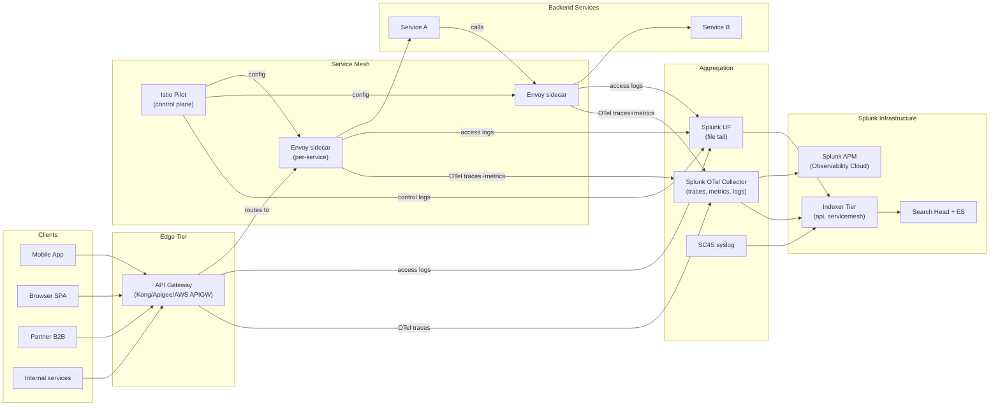

# API Gateways, Reverse Proxies, & Service Mesh Integration Guide

> The definitive guide to integrating API gateways, reverse proxies,
> and service mesh data planes with Splunk. **43 use cases in cat 8.4
> + ~52 in cat 5.14 reverse-proxy use cases**. Covers Kong, Apigee,
> AWS API Gateway, Azure APIM, Mulesoft, Tyk, Istio + Envoy, Linkerd,
> Consul Connect, AWS App Mesh, and the data-plane proxies HAProxy,
> Traefik, NGINX Plus, and Varnish. API error rate by endpoint,
> consumer rate-limiting, OAuth/JWT validation failures, mutual TLS
> client cert errors, mesh ext_authz latency, circuit breakers,
> outlier detection ejections, retries, distributed tracing context
> propagation, and the integration with Splunk APM (Observability
> Cloud) for full request-trace visibility.

---

## Table of Contents

- [Quick Start](#quick-start)
- [Overview](#overview)
- [Architecture and Data Flow](#architecture)
- [Prerequisites](#prerequisites)
- [Platform Coverage Matrix](#platform-matrix)
- [Kong (OSS + Konnect)](#kong)
- [Google Apigee](#apigee)
- [AWS API Gateway](#aws-apigw)
- [Azure API Management (APIM)](#azure-apim)
- [Mulesoft Anypoint, Tyk](#mulesoft-tyk)
- [Istio + Envoy Service Mesh](#istio)
- [Linkerd, Consul Connect, AWS App Mesh](#other-mesh)
- [HAProxy](#haproxy)
- [Traefik](#traefik)
- [NGINX Plus, Varnish](#nginx-plus-varnish)
- [Field Dictionary (Cross-Vendor)](#field-dictionary)
- [Sample Events](#sample-events)
- [Splunk-Side Configuration](#splunk-config)
- [OpenTelemetry & Splunk APM Integration](#otel-apm)
- [Cross-Product Correlation](#cross-product)
- [CIM Mapping Reference](#cim-mapping)
- [Compliance Mapping](#compliance)
- [Capacity Planning and Sizing](#sizing)
- [Recommended Dashboard Layouts](#dashboards)
- [ITSI Service Modeling](#itsi)
- [SOAR Playbook Examples](#soar)
- [Multi-Cluster / Multi-Region Strategy](#multi-region)
- [Security Hardening](#security-hardening)
- [Crawl / Walk / Run Roadmap](#roadmap)
- [Validation Checklist](#validation-checklist)
- [Known Limitations and Gaps](#known-limitations)
- [Troubleshooting](#troubleshooting)
- [FAQ](#faq)
- [Glossary](#glossary)
- [References](#references)
- [Contribution and Feedback](#contribution)

---

<a id="quick-start"></a>
## Quick Start — 30 Minutes to First API Insight

### Kong (OSS or Konnect)

1. Enable file logging plugin:
    ```bash
    curl -X POST http://kong:8001/plugins \
      --data "name=file-log" \
      --data "config.path=/var/log/kong/access.log"
    ```
2. UF inputs.conf:
    ```ini
    [monitor:///var/log/kong/access.log]
    sourcetype = kong:access
    index = api
    INDEXED_EXTRACTIONS = json
    ```
3. Validate: `index=api sourcetype="kong:access" earliest=-15m | stats count by status, request_uri`

### AWS API Gateway

1. Install [Splunk Add-on for AWS (Splunkbase 1876)](https://splunkbase.splunk.com/app/1876).
2. Enable execution + access logs to CloudWatch Logs:
    - API Gateway → Stages → Logs/Tracing → Enable execution logs + Enable detailed metrics
3. Configure Splunk to pull CloudWatch via TA.
4. Validate: `index=aws sourcetype="aws:apigateway:execution" earliest=-15m | stats count by status, resourcePath`

### Istio (Envoy access logs)

```yaml
# values.yaml
meshConfig:
  accessLogFile: /dev/stdout
  accessLogFormat: |
    [%START_TIME%] "%REQ(:METHOD)% %REQ(X-ENVOY-ORIGINAL-PATH?:PATH)% %PROTOCOL%" %RESPONSE_CODE% ...
  accessLogEncoding: JSON
```

### Activate crawl tier

UC-8.4.1 (API Error Rate by Endpoint), UC-8.4.x (Consumer Rate Limit Hits), UC-8.4.x (OAuth Failures), UC-8.4.x (Mesh ext_authz Latency).

---

<a id="overview"></a>
## Overview

### Why API gateway / mesh observability matters

APIs are the primary surface for modern applications. API gateways and service meshes are:
- **Single ingress point** for all API traffic
- **Authentication/authorization choke point**
- **Rate-limiting + quota enforcement**
- **Routing + load balancing**
- **Distributed tracing context propagation**

Without observability you can't:
- Debug per-endpoint failures
- Detect API abuse / scraping
- Enforce SLOs per consumer
- Correlate distributed traces

### Platforms covered

| Platform | Type |
|---------|------|
| **Kong** | API gateway (OSS + Konnect cloud) |
| **Apigee** | Google Cloud API management |
| **AWS API Gateway** | AWS-native API gateway |
| **Azure APIM** | Azure-native API management |
| **Mulesoft Anypoint** | Salesforce-owned API management |
| **Tyk** | OSS + commercial API gateway |
| **Istio** | Service mesh control plane |
| **Linkerd** | Lightweight service mesh |
| **Consul Connect** | HashiCorp service mesh |
| **AWS App Mesh** | AWS service mesh |
| **Envoy** | High-performance proxy (data plane for many meshes) |
| **HAProxy** | Open-source TCP/HTTP load balancer |
| **Traefik** | Cloud-native reverse proxy |
| **NGINX Plus** | Commercial NGINX |
| **Varnish** | HTTP cache / reverse proxy |

### Domains covered

| Domain | Examples |
|--------|---------|
| **API error rate / latency** | Per-endpoint, per-consumer |
| **Consumer rate limiting** | Quota hits, throttling |
| **Authentication** | OAuth/JWT validation, API key auth |
| **Authorization** | mTLS client cert errors, ext_authz |
| **Rate / circuit breakers** | Outlier ejection, retries |
| **Mesh data plane** | Envoy access logs, sidecar health |
| **Reverse proxy / LB** | Backend health, SSL handshake fails |

### What's NOT in scope

| Domain | Where to look |
|--------|---------------|
| **Web servers (Apache, NGINX OSS, IIS)** | [Web Servers Guide](web-servers.md) |
| **Application servers (Tomcat, .NET)** | [Application Servers Guide](application-servers.md) |
| **Forward proxy / SWG** | [Web Security Guide](web-security.md) |
| **NGFW URL filtering** | [NGFW Security Guide](ngfw-security.md) |
| **Kubernetes ingress** | [Kubernetes Guide](kubernetes.md) |

### What good looks like

| Dimension | Without integration | With full integration |
|-----------|---------------------|-----------------------|
| API error attribution | Manual log diving | Per-endpoint dashboard |
| API consumer SLA tracking | None | Per-consumer KPIs in ITSI |
| Distributed trace context | Lost at gateway | OTel propagated end-to-end |
| Mesh-side latency view | None | Sidecar histogram dashboards |
| Rate-limit policy effect | Manual sampling | Throttle event trending |

---

<a id="architecture"></a>
## Architecture and Data Flow



### Core principles

- **Access logs at every hop** (gateway → mesh sidecar → backend)
- **OpenTelemetry traces** propagated end-to-end (`traceparent` header)
- **CIM Web** for HTTP-style events
- **APM (Splunk Observability Cloud<sup class="ref">[<a href="#ref-11">11</a>]</sup>)** for distributed traces

---

<a id="prerequisites"></a>
## Prerequisites

| Item | Detail |
|------|--------|
| **Splunk version** | 9.0+ Enterprise / Cloud |
| **Splunk APM** | Recommended for distributed traces (separate license) |
| **CIM 6.x** | Web model |
| **OpenTelemetry Collector** | For traces/metrics/logs from mesh |
| **Kubernetes** | Required for most service mesh deployments |
| **HEC** | For OTel + custom inputs |

---

<a id="platform-matrix"></a>
## Platform Coverage Matrix

| Platform | Ingest method | Sourcetypes |
|---------|--------------|-------------|
| **Kong (OSS + Konnect)** | File log plugin / Splunk plugin | `kong:access`, `kong:admin:audit` |
| **Apigee** | Google Cloud Logging → Splunk Add-on for GCP | `apigee:traffic`, `apigee:audit` |
| **AWS API Gateway** | CloudWatch Logs → Splunk_TA_aws | `aws:apigateway:execution`, `aws:apigateway:access` |
| **Azure APIM** | Azure Diagnostics → Event Hub → Splunk_TA_microsoft-cloudservices | `azure:apim:diagnostics` |
| **Mulesoft Anypoint** | CloudHub Audit Log API | `mulesoft:cloudhub:audit` |
| **Tyk** | Tyk Pump → Splunk via webhook / file | `tyk:gateway` |
| **Istio + Envoy** | Envoy access logs + OTel | `istio:envoy:access`, `istio:pilot` |
| **Linkerd** | Stdout + OTel | `linkerd:proxy` |
| **Consul Connect** | Envoy access logs | `consul:connect:envoy` |
| **AWS App Mesh** | Envoy access logs to CloudWatch | (via AWS TA) |
| **HAProxy** | syslog or file tail | `haproxy:http`, `haproxy:syslog`, `haproxy:stats` |
| **Traefik** | Stdout JSON / file | `traefik:access`, `traefik:json` |
| **NGINX Plus** | API status + log | `nginx:plus:status`, `nginx:plus:stream` |
| **Varnish** | varnishncsa file tail | `varnish:varnishncsa`, `varnish:syslog` |

---

<a id="kong"></a>
## Kong (OSS + Konnect)

### Configuration

```bash
# Enable file-log plugin globally
curl -X POST http://localhost:8001/plugins \
  --data "name=file-log" \
  --data "config.path=/usr/local/kong/logs/access.log" \
  --data "config.reopen=true"

# Or per-service:
curl -X POST http://localhost:8001/services/<svc>/plugins \
  --data "name=file-log" \
  --data "config.path=/usr/local/kong/logs/svc-access.log"
```

### Sample event

```json
{
    "request": {
        "method": "POST",
        "uri": "/api/v1/users",
        "url": "http://api.example.com/api/v1/users",
        "size": "234",
        "headers": {
            "host": "api.example.com",
            "user-agent": "curl/7.68.0",
            "authorization": "Bearer abc..."
        }
    },
    "response": {
        "status": 200,
        "size": "1234",
        "headers": {"content-type": "application/json"}
    },
    "latencies": {
        "kong": 5,
        "proxy": 50,
        "request": 55
    },
    "client_ip": "203.0.113.45",
    "consumer": {
        "id": "consumer-uuid",
        "username": "partner-acme",
        "custom_id": "acme-corp"
    },
    "service": {
        "id": "service-uuid",
        "name": "users-svc"
    },
    "route": {
        "id": "route-uuid"
    },
    "started_at": 1745596215123
}
```

### Sample SPL — Top error endpoints

```spl
index=api sourcetype="kong:access" earliest=-1h
| eval is_error = if(response.status >= 500, 1, 0)
| stats count, sum(is_error) as errors by request.uri, service.name
| eval error_rate = round(errors/count*100, 2)
| where error_rate > 1
| sort -error_rate
```

---

<a id="apigee"></a>
## Google Apigee

### Configuration

Apigee logs flow naturally to Google Cloud Logging.

```
Apigee Edge UI → Analytics & Logging → enable Cloud Logging integration
Splunk Add-on for GCP → configure Cloud Logging input
```

### Sample event (Apigee Audit)

```json
{
    "timestamp": "2026-04-25T14:30:15.000Z",
    "organization": "acme-prod",
    "environment": "prod",
    "user": "admin@acme.com",
    "operation": "DEPLOY_PROXY",
    "proxy_name": "users-api",
    "revision": 42,
    "result": "SUCCESS"
}
```

---

<a id="aws-apigw"></a>
## AWS API Gateway

### Configuration

```
API Gateway → Stages → <stage> → Logs/Tracing:
+ CloudWatch Logs: <log-group>
+ Log Level: INFO (or ERROR for cost saving)
+ Log full requests/responses (sensitive data warning)
+ Detailed metrics: enabled
+ X-Ray Tracing: enabled (for distributed tracing)
```

### Sample event (AWS API Gateway execution)

```
(abc-123-...) Endpoint request URI: https://api.acme.com/users
(abc-123-...) Method completed with status: 200
(abc-123-...) Method response body after transformations: { "users": [...] }
(abc-123-...) Method response headers: {Content-Type=application/json}
```

---

<a id="azure-apim"></a>
## Azure API Management (APIM)

### Configuration

```
Azure Portal → APIM → Diagnostic settings → Add:
+ Logs: GatewayLogs
+ Destination: Event Hub or Storage Account
Splunk Add-on for Microsoft Cloud Services → poll Event Hub
```

---

<a id="mulesoft-tyk"></a>
## Mulesoft Anypoint, Tyk

### Mulesoft

```
Anypoint Audit Log API
Splunk → custom modular input polling
```

### Tyk

```
Tyk Pump → publishes per-request events to webhook / file
Splunk → HEC ingest or file tail
```

---

<a id="istio"></a>
## Istio + Envoy Service Mesh

### Access log configuration

```yaml
# IstioOperator
spec:
  meshConfig:
    accessLogFile: /dev/stdout
    accessLogEncoding: JSON
    accessLogFormat: |
      {
        "start_time": "%START_TIME%",
        "method": "%REQ(:METHOD)%",
        "path": "%REQ(X-ENVOY-ORIGINAL-PATH?:PATH)%",
        "protocol": "%PROTOCOL%",
        "response_code": "%RESPONSE_CODE%",
        "response_flags": "%RESPONSE_FLAGS%",
        "bytes_received": "%BYTES_RECEIVED%",
        "bytes_sent": "%BYTES_SENT%",
        "duration": "%DURATION%",
        "upstream_service_time": "%RESP(X-ENVOY-UPSTREAM-SERVICE-TIME)%",
        "x_forwarded_for": "%REQ(X-FORWARDED-FOR)%",
        "user_agent": "%REQ(USER-AGENT)%",
        "request_id": "%REQ(X-REQUEST-ID)%",
        "authority": "%REQ(:AUTHORITY)%",
        "upstream_host": "%UPSTREAM_HOST%",
        "downstream_remote_address": "%DOWNSTREAM_REMOTE_ADDRESS%",
        "upstream_cluster": "%UPSTREAM_CLUSTER%"
      }
```

### Sample event (Istio Envoy access)

```json
{
    "start_time": "2026-04-25T14:30:15.000Z",
    "method": "POST",
    "path": "/api/v1/users",
    "protocol": "HTTP/1.1",
    "response_code": 200,
    "response_flags": "-",
    "bytes_received": 234,
    "bytes_sent": 1234,
    "duration": 55,
    "upstream_service_time": "50",
    "x_forwarded_for": "203.0.113.45",
    "user_agent": "curl/7.68.0",
    "request_id": "abc-123",
    "authority": "users.acme.svc.cluster.local",
    "upstream_host": "10.244.1.10:8080",
    "downstream_remote_address": "10.244.0.15:55678",
    "upstream_cluster": "outbound|8080||users.acme.svc.cluster.local"
}
```

### Sample SPL — Mesh ext_authz latency

```spl
index=servicemesh sourcetype="istio:envoy:access" earliest=-1h
| where ext_authz_latency_ms > 0
| stats avg(ext_authz_latency_ms) as avg_latency p95(ext_authz_latency_ms) as p95_latency by upstream_cluster
| sort -p95_latency
```

---

<a id="other-mesh"></a>
## Linkerd, Consul Connect, AWS App Mesh

### Linkerd

```
linkerd-proxy stdout logs → kubectl logs → fluent-bit → Splunk HEC
Or: OTel collector for proxy metrics
```

### Consul Connect

Envoy data plane — same Envoy access log model as Istio.

### AWS App Mesh

Envoy data plane on ECS/EKS — CloudWatch Logs → Splunk Add-on for AWS.

---

<a id="haproxy"></a>
## HAProxy

### Configuration

```haproxy
# /etc/haproxy/haproxy.cfg
global
    log <sc4s-vip>:514 local6 info
    log <sc4s-vip>:514 local6 notice

defaults
    log global
    option httplog
    option dontlognull
    timeout connect 5000
    timeout client 50000
    timeout server 50000

frontend api_frontend
    bind *:443 ssl crt /etc/ssl/api.pem
    mode http
    default_backend api_backend

backend api_backend
    mode http
    balance roundrobin
    option httpchk GET /healthz
    server srv1 10.10.10.1:8080 check
    server srv2 10.10.10.2:8080 check
```

### Sample event

```
Apr 25 14:30:15 lb-01 haproxy[12345]: 203.0.113.45:55678 [25/Apr/2026:14:30:15.123] api_frontend api_backend/srv1 25/0/2/55/82 200 1234 - - ---- 145/12/0/1/0 0/0 "POST /api/v1/users HTTP/1.1"
```

### Sample SPL — Backend health check failures

```spl
index=proxy sourcetype="haproxy:http" earliest=-1h
| where match(_raw, "(?i)NOLB|no server|layer7 invalid")
| stats count by backend, server
| sort -count
```

---

<a id="traefik"></a>
## Traefik

### Configuration

```yaml
# traefik.yml
log:
  level: INFO
  filePath: /var/log/traefik/traefik.log
accessLog:
  filePath: /var/log/traefik/access.log
  format: json
  fields:
    headers:
      defaultMode: keep
```

### Sample event (Traefik JSON access log)

```json
{
    "ClientHost": "203.0.113.45",
    "RequestMethod": "GET",
    "RequestPath": "/api/v1/users",
    "RequestProtocol": "HTTP/2.0",
    "DownstreamStatus": 200,
    "DownstreamContentSize": 1234,
    "Duration": 55000000,
    "ServiceName": "users-svc",
    "RouterName": "users-router",
    "EntryPointName": "websecure",
    "RequestUserAgent": "curl/7.68.0",
    "level": "info",
    "msg": "",
    "time": "2026-04-25T14:30:15Z"
}
```

---

<a id="nginx-plus-varnish"></a>
## NGINX Plus, Varnish

### NGINX Plus extended status API

```bash
curl http://nginx-plus-host:8080/api/9/http/server_zones
```

### Varnish

```bash
varnishncsa -F '%{X-Forwarded-For}i %u %t "%r" %s %b "%{Referer}i" "%{User-agent}i" %D %{Varnish:hitmiss}x' \
  > /var/log/varnish/access.log
```

---

<a id="field-dictionary"></a>
## Field Dictionary (Cross-Vendor)

After CIM Web mapping:

| Field | Kong | AWS APIGW | Istio Envoy | HAProxy | Traefik |
|-------|------|-----------|-------------|---------|---------|
| `src` | client_ip | identity.sourceIp | downstream_remote_address | (X-Forwarded-For) | ClientHost |
| `dest` | service.name | (resource path) | upstream_cluster | server | ServiceName |
| `url` | request.uri | resourcePath | path | request_uri | RequestPath |
| `http_method` | request.method | httpMethod | method | method | RequestMethod |
| `status` | response.status | status | response_code | status | DownstreamStatus |
| `bytes_in` | request.size | (n/a) | bytes_received | bytes_in | (n/a) |
| `bytes_out` | response.size | (n/a) | bytes_sent | bytes_out | DownstreamContentSize |
| `duration_ms` | latencies.request | (n/a) | duration | tt | Duration/1000000 |
| `consumer` | consumer.username | apiKey/iamuser | (none) | (Authorization) | (none) |
| `route_id` | route.id | resourceId | route_name | (frontend) | RouterName |

---

<a id="sample-events"></a>
## Sample Events

(See per-platform sections.)

---

<a id="splunk-config"></a>
## Splunk-Side Configuration

### Index strategy

```ini
[api]
homePath = $SPLUNK_DB/api/db
maxDataSize = auto_high_volume
frozenTimePeriodInSecs = 7776000   # 90 days

[apigateway]
homePath = $SPLUNK_DB/apigateway/db
maxDataSize = auto_high_volume
frozenTimePeriodInSecs = 7776000

[servicemesh]
homePath = $SPLUNK_DB/servicemesh/db
maxDataSize = auto_high_volume
frozenTimePeriodInSecs = 7776000

[proxy]
homePath = $SPLUNK_DB/proxy/db
maxDataSize = auto_high_volume
frozenTimePeriodInSecs = 31536000
```

### CIM data model acceleration

```ini
[Web]
acceleration = 1
acceleration.earliest_time = -7d
```

---

<a id="otel-apm"></a>
## OpenTelemetry & Splunk APM Integration

### Splunk OTel Collector deployment

```yaml
# OTel Collector helm values
splunkObservability:
  accessToken: <token>
  realm: us0

agent:
  config:
    receivers:
      jaeger:
      otlp:
        protocols:
          grpc:
          http:
    processors:
      batch:
      memory_limiter:
    exporters:
      sapm:
        access_token: <token>
        endpoint: https://ingest.<realm>.signalfx.com/v2/trace
      splunk_hec:
        token: <hec-token>
        endpoint: https://splunk-cloud.com:443/services/collector
    service:
      pipelines:
        traces:
          receivers: [jaeger, otlp]
          processors: [memory_limiter, batch]
          exporters: [sapm]
        logs:
          receivers: [filelog, otlp]
          processors: [memory_limiter, batch]
          exporters: [splunk_hec]
```

### Distributed trace context propagation

Modern API gateways and meshes inject `traceparent` (W3C Trace Context) header:

```
traceparent: 00-abc123def456...-7890-01
```

This propagates through gateway → mesh → backend automatically when OTel SDK auto-instrumented.

---

<a id="cross-product"></a>
## Cross-Product Correlation

### API Gateway + APM trace correlation

```spl
index=api sourcetype="kong:access" earliest=-1h status>=500
| rename request_id as trace_id
| join trace_id [search index=otel_traces sourcetype=otel:trace earliest=-1h | fields trace_id, service_name, error_message]
| stats count by service_name, error_message
```

### Mesh sidecar + Backend latency

```spl
(index=servicemesh sourcetype="istio:envoy:access")
OR (index=app sourcetype="myapp:json")
| rename request_id as request_id
| transaction request_id maxspan=10s
| eval mesh_overhead = duration - upstream_service_time
| stats avg(mesh_overhead) as mesh_overhead_avg by upstream_cluster
```

---

<a id="cim-mapping"></a>
## CIM Mapping Reference

| CIM model | Sourcetype |
|-----------|-----------|
| **Web.Web** | All gateway / mesh / reverse-proxy access logs |

---

<a id="compliance"></a>
## Compliance Mapping

### NIST 800-53

| Control | Coverage |
|---------|----------|
| **AC-3** Access Enforcement | API gateway authn/authz |
| **AC-4** Information Flow | mesh policy enforcement |
| **AU-2/12** Audit | All gateway / mesh logs |

### PCI-DSS 4.0

| Requirement | Coverage |
|-------------|----------|
| **8.x** Authentication | API key + OAuth + JWT validation |
| **1.x** Network Security | mesh egress policies |

### OWASP API Security Top 10

| Risk | Detection |
|------|-----------|
| **API1: Broken Object Level Authorization** | Per-endpoint authz failure rate |
| **API2: Broken Authentication** | Auth failure trending |
| **API3: Broken Object Property Level Authorization** | Custom |
| **API4: Unrestricted Resource Consumption** | Rate limit / quota events |
| **API5: Broken Function Level Authorization** | Per-method authz failure rate |
| **API8: Security Misconfiguration** | Admin audit log review |
| **API9: Improper Inventory Management** | API discovery |

---

<a id="sizing"></a>
## Capacity Planning and Sizing

| Tenant | Daily API events |
|--------|---------------------|
| Small (1-10 services) | ~500 MB |
| Mid (10-50 services) | ~5 GB |
| Large (50-500 services) | ~50 GB |
| Hyper (500+ services with mesh) | ~500+ GB |

Service mesh access logs significantly amplify volume — expect 5-10x application traffic.

---

<a id="dashboards"></a>
## Recommended Dashboard Layouts

### Crawl

```
+---------------------+---------------------+
| API REQUEST VOLUME — TREND                 |
+---------------------+---------------------+
| API ERROR RATE — TREND                     |
+---------------------+---------------------+
| TOP ENDPOINTS BY ERROR RATE                |
+---------------------+---------------------+
| TOP CONSUMERS BY VOLUME                    |
+---------------------+---------------------+
```

### Walk

```
+---------------------+---------------------+
| RATE LIMIT / 429 EVENTS — TREND            |
+---------------------+---------------------+
| AUTH FAILURE — TREND                       |
+---------------------+---------------------+
| MESH SIDECAR HEALTH                        |
+---------------------+---------------------+
| BACKEND HEALTH CHECK FAILURES              |
+---------------------+---------------------+
```

### Run

```
+---------------------+---------------------+
| END-TO-END TRACE LATENCY P95               |
+---------------------+---------------------+
| OWASP API TOP 10 COVERAGE                  |
+---------------------+---------------------+
| SLO BURN-RATE PER CONSUMER                 |
+---------------------+---------------------+
| MESH MTLS CERT EXPIRY                      |
+---------------------+---------------------+
```

---

<a id="itsi"></a>
## ITSI Service Modeling

### Service hierarchy

```
API Platform Health
├── Gateway Tier
│   ├── Per-Gateway Latency
│   ├── Per-Gateway Error Rate
│   └── Per-Gateway Auth Success Rate
├── Mesh Tier
│   ├── Sidecar Health (per-pod)
│   ├── Pilot/Control Plane Health
│   └── mTLS Cert Expiry
├── Per-Service KPIs
│   ├── Service Availability (SLO)
│   ├── Service Latency (P50/P95/P99)
│   └── Service Error Budget Burn
└── Per-Consumer SLA
    ├── Per-Consumer Throughput
    ├── Per-Consumer Error Rate
    └── Per-Consumer SLA Compliance
```

---

<a id="soar"></a>
## SOAR Playbook Examples

### Playbook 1: API Abuse Auto-Block

**Trigger:** Same client_ip > 1000 4xx errors in 5 min.

```
1. EXTRACT client_ip from notable
2. ENRICH (geo, threat-feed, AS owner)
3. AUTO-BLOCK at gateway via vendor API (Kong API key revocation, AWS WAF rule)
4. NOTIFY API team
5. CREATE ticket
```

### Playbook 2: SLO Burn Auto-Investigation

**Trigger:** Service error budget burn > 10x normal.

```
1. CORRELATE access logs + traces + backend errors
2. IDENTIFY top error endpoints + consumers
3. AUTO-CREATE Splunk dashboard with filters set
4. PAGE on-call
5. POST to #on-call Slack with summary
```

---

<a id="multi-region"></a>
## Multi-Cluster / Multi-Region Strategy

- Per-region gateway + mesh with cross-region traffic policy
- Centralised Splunk indexer cluster across regions
- Multi-cluster traces stitched via OTel
- Regional SLO budgets

---

<a id="security-hardening"></a>
## Security Hardening

- Gateway admin in vault, MFA-protected
- Audit immutable: forward all admin changes to write-once
- TLS for all gateway → Splunk transport
- mTLS internal mesh-to-mesh (default for Istio strict mode)
- Field-level RBAC for sensitive headers (Authorization)
- Rate-limit + WAF in front of gateway

---

<a id="roadmap"></a>
## Crawl / Walk / Run Roadmap

### Crawl (Week 1-4)

1. Onboard primary API gateway access logs
2. CIM Web acceleration
3. Crawl-tier dashboards
4. UC-8.4.1 wired

### Walk (Month 2-3)

1. Onboard mesh sidecar logs
2. OTel Collector deployed
3. Splunk APM integration
4. Per-service SLO modeled in ITSI

### Run (Month 4+)

1. Full SOAR auto-response (rate limit / API key revoke)
2. Multi-region trace stitching
3. OWASP API Top 10<sup class="ref">[<a href="#ref-1">1</a>]</sup> coverage dashboard
4. Per-consumer SLA reports

---

<a id="validation-checklist"></a>
## Validation Checklist

- [ ] Day 1: First gateway sending events
- [ ] Day 7: Mesh sidecar logs onboarded
- [ ] Day 30: Walk-tier UCs deployed; APM integration live
- [ ] Day 90: SOAR + ITSI fully wired

---

<a id="known-limitations"></a>
## Known Limitations and Gaps

| Limitation | Impact | Workaround |
|------------|--------|------------|
| **Sidecar log volume amplification** | Costly | Selective sampling per-service |
| **Trace context lost at legacy gateway** | Broken e2e visibility | Upgrade to OTel-aware gateway |
| **Per-vendor admin audit format differences** | Normalization burden | Per-vendor TA / parsing |
| **TLS 1.3 ECH may break SNI-based routing** | Future risk | Plan for ECH adoption |
| **Mesh control plane is critical SPoF** | Cluster-wide impact | HA + alerting on Pilot/Linkerd-control |

---

<a id="troubleshooting"></a>
## Troubleshooting

### Gateway access logs missing

- Verify file permission for UF / file plugin
- Check disk space on gateway pod
- Verify HEC token valid

### Mesh access log JSON malformed

- Ensure accessLogEncoding is JSON
- Validate accessLogFormat string

### OTel traces dropped

- Check OTel Collector queue / batch settings
- Verify SAPM endpoint reachable
- Throttling on Splunk Observability ingest

### HAProxy log format change

- Update Splunk TA expectations
- Use standard `option httplog` format

---

<a id="faq"></a>
## FAQ

**Q: API gateway vs service mesh?**
A: Gateway sits at edge (north-south); mesh sits between services (east-west). Often deployed together (gateway routes external, mesh handles internal).

**Q: Kong vs Apigee vs AWS APIGW?**
A: Kong: open-source first, runs anywhere. Apigee: best-in-class enterprise (Google). AWS APIGW: tightly AWS-coupled. Pick by cloud strategy + sophistication.

**Q: Istio vs Linkerd?**
A: Istio: most-featured, complex. Linkerd: simpler, lighter. Both are CNCF graduated.

**Q: Why use service mesh at all?**
A: Universal mTLS, observability, traffic management, retries/circuit breakers — without per-service code.

**Q: How does Splunk APM compare to Datadog/Honeycomb?**
A: Splunk APM (formerly SignalFx) is OTel-native, integrates tightly with Splunk Cloud (logs, infra, RUM). Datadog: broad SaaS suite. Honeycomb: best at high-cardinality. All viable; pick by ecosystem fit.

**Q: Should I do TLS inspection at gateway?**
A: For external-facing yes (terminate at gateway, re-encrypt internal). For mesh internal, mTLS is preferred.

---

<a id="glossary"></a>
## Glossary

| Term | Definition |
|------|-----------|
| **API Gateway** | Single ingress for API traffic; auth/rate/route |
| **Service Mesh** | Sidecar-based service-to-service infrastructure |
| **Data Plane** | Where traffic flows (Envoy, Linkerd-proxy) |
| **Control Plane** | Where config/policy is computed (Pilot, Linkerd) |
| **Sidecar** | Per-pod proxy container |
| **mTLS** | Mutual TLS (both ends authenticate) |
| **ext_authz** | External authorization filter (Envoy) |
| **Circuit Breaker** | Stop calls to failing backend |
| **Retry** | Repeat failed request |
| **Rate Limit** | Throttle per-consumer |
| **OAuth/JWT** | Token-based authentication |
| **OTel / OpenTelemetry** | CNCF observability framework |

---

<a id="references"></a>
## References

- [Splunk Add-on for AWS (Splunkbase 1876)](https://splunkbase.splunk.com/app/1876)
- [Splunk Add-on for Microsoft Cloud Services (Splunkbase 3110)](https://splunkbase.splunk.com/app/3110)
- [Splunk Add-on for GCP (Splunkbase 3088)](https://splunkbase.splunk.com/app/3088)
- [Kong documentation](https://docs.konghq.com/)
- [Apigee documentation](https://cloud.google.com/apigee/docs)
- [Istio documentation](https://istio.io/docs/)
- [Envoy documentation](https://www.envoyproxy.io/docs/envoy/latest/)
- [HAProxy documentation](https://www.haproxy.com/documentation/)
- [Traefik documentation](https://doc.traefik.io/traefik/)
- [OpenTelemetry](https://opentelemetry.io/)
- [Splunk APM (Observability Cloud)](https://www.splunk.com/en_us/products/apm.html)
- [OWASP API Security Top 10](https://owasp.org/API-Security/editions/2023/en/0x11-t10/)

---

<a id="contribution"></a>
## Contribution and Feedback

Part of the [Splunk Monitoring Use Cases](https://github.com/fenre/splunk-monitoring-use-cases) project. [Open an issue](https://github.com/fenre/splunk-monitoring-use-cases/issues/new).

---

*Last updated: 2026-05-09. Covers Kong 3.x, Istio 1.21+, Envoy 1.30+, HAProxy 2.8+, Traefik 3.x, AWS API Gateway / Apigee current.*

---

<!-- BEGIN-AUTOGENERATED-SOURCES -->

## References

*Auto-generated by `scripts/generate_doc_references.py` from `data/source-references.json` and `data/source-mappings.json`. Edit those files (or the document body) to change citations; this footer is rewritten on every run.*

### Primary sources

<a id="ref-1"></a>**[1]** OWASP Foundation. (2023). *OWASP API Security Top 10 — 2023*. OWASP Foundation, Inc. Retrieved May 11, 2026, from https://owasp.org/API-Security/editions/2023/en/0x00-header/

### Supporting sources

<a id="ref-2"></a>**[2]** American Institute of Certified Public Accountants. (2017). *Trust Services Criteria (2017) for Security, Availability, Processing Integrity, Confidentiality, and Privacy*. AICPA & CIMA. SOC 2 / TSP Section 100. https://www.aicpa-cima.com/topic/audit-assurance/soc-suite-of-services

<a id="ref-3"></a>**[3]** European Parliament and Council of the European Union. (2022, December). *Directive (EU) 2022/2555 — NIS2 Directive on cybersecurity*. Official Journal of the European Union, L 333. ELI: dir/2022/2555. https://eur-lex.europa.eu/eli/dir/2022/2555/oj

<a id="ref-4"></a>**[4]** Hardt, D. (Ed.). (2012, October). *The OAuth 2.0 Authorization Framework*. Internet Engineering Task Force. RFC 6749. https://www.rfc-editor.org/rfc/rfc6749

<a id="ref-5"></a>**[5]** International Organization for Standardization. (2022). *ISO/IEC 27001:2022 — Information security, cybersecurity and privacy protection — Information security management systems — Requirements*. ISO/IEC. ISO/IEC 27001:2022. https://www.iso.org/standard/27001

<a id="ref-6"></a>**[6]** National Institute of Standards and Technology. (2020). *Security and Privacy Controls for Information Systems and Organizations* (Revision 5). U.S. Department of Commerce. NIST SP 800-53 Rev. 5. https://csrc.nist.gov/pubs/sp/800/53/r5/upd1/final

<a id="ref-7"></a>**[7]** Nottingham, M., Wilde, E., & Dalal, S. (2023, July). *Problem Details for HTTP APIs*. Internet Engineering Task Force. RFC 9457. https://www.rfc-editor.org/rfc/rfc9457

<a id="ref-8"></a>**[8]** OpenTelemetry Authors. (2026). *OpenTelemetry Specification*. Cloud Native Computing Foundation. Retrieved May 11, 2026, from https://opentelemetry.io/docs/specs/otel/

<a id="ref-9"></a>**[9]** OWASP Foundation. (2026). *OWASP Cheat Sheet Series*. OWASP Foundation, Inc. Retrieved May 11, 2026, from https://cheatsheetseries.owasp.org/

<a id="ref-10"></a>**[10]** Splunk Inc. (2026). *Splunk Common Information Model Add-on Manual*. Splunk LLC, a Cisco company. Retrieved May 11, 2026, from https://docs.splunk.com/Documentation/CIM

<a id="ref-11"></a>**[11]** Splunk Inc. (2026). *Splunk Observability Cloud Documentation*. Splunk LLC, a Cisco company. Retrieved May 11, 2026, from https://docs.splunk.com/observability/en/

<a id="ref-12"></a>**[12]** U.S. Department of Health & Human Services. (2002). *HIPAA Privacy Rule (45 CFR Parts 160 and 164, Subparts A and E)*. Office for Civil Rights, HHS. 45 CFR 160, 164. https://www.hhs.gov/hipaa/for-professionals/privacy/index.html

<a id="ref-13"></a>**[13]** U.S. Department of Health & Human Services. (2013). *HIPAA Security Rule (45 CFR Parts 160 and 164, Subparts A and C)*. Office for Civil Rights, HHS. 45 CFR 160, 164. https://www.hhs.gov/hipaa/for-professionals/security/index.html

<details>
<summary>Additional online sources cited in the document body (14)</summary>

<a id="ref-14"></a>**[14]** splunkbase.splunk.com. *Splunk Add-on for AWS (Splunkbase 1876)*. Retrieved May 11, 2026, from https://splunkbase.splunk.com/app/1876

<a id="ref-15"></a>**[15]** splunkbase.splunk.com. *Splunk Add-on for Microsoft Cloud Services (Splunkbase 3110)*. Retrieved May 11, 2026, from https://splunkbase.splunk.com/app/3110

<a id="ref-16"></a>**[16]** splunkbase.splunk.com. *Splunk Add-on for GCP (Splunkbase 3088)*. Retrieved May 11, 2026, from https://splunkbase.splunk.com/app/3088

<a id="ref-17"></a>**[17]** docs.konghq.com. *Kong documentation*. Retrieved May 11, 2026, from https://docs.konghq.com/

<a id="ref-18"></a>**[18]** cloud.google.com. *Apigee documentation*. Retrieved May 11, 2026, from https://cloud.google.com/apigee/docs

<a id="ref-19"></a>**[19]** istio.io. *Istio documentation*. Retrieved May 11, 2026, from https://istio.io/docs/

<a id="ref-20"></a>**[20]** envoyproxy.io. *Envoy documentation*. Retrieved May 11, 2026, from https://www.envoyproxy.io/docs/envoy/latest/

<a id="ref-21"></a>**[21]** haproxy.com. *HAProxy documentation*. Retrieved May 11, 2026, from https://www.haproxy.com/documentation/

<a id="ref-22"></a>**[22]** doc.traefik.io. *Traefik documentation*. Retrieved May 11, 2026, from https://doc.traefik.io/traefik/

<a id="ref-23"></a>**[23]** opentelemetry.io. *OpenTelemetry*. Retrieved May 11, 2026, from https://opentelemetry.io/

<a id="ref-24"></a>**[24]** splunk.com. *Splunk APM (Observability Cloud)*. Retrieved May 11, 2026, from https://www.splunk.com/en_us/products/apm.html

<a id="ref-25"></a>**[25]** owasp.org. *OWASP API Security Top 10*. Retrieved May 11, 2026, from https://owasp.org/API-Security/editions/2023/en/0x11-t10/

<a id="ref-26"></a>**[26]** github.com. *Splunk Monitoring Use Cases*. Retrieved May 11, 2026, from https://github.com/fenre/splunk-monitoring-use-cases

<a id="ref-27"></a>**[27]** github.com. *Open an issue*. Retrieved May 11, 2026, from https://github.com/fenre/splunk-monitoring-use-cases/issues/new

</details>

### Related repository documents

- [`docs/guides/application-servers.md`](application-servers.md)
- [`docs/guides/kubernetes.md`](kubernetes.md)
- [`docs/guides/ngfw-security.md`](ngfw-security.md)
- [`docs/guides/web-security.md`](web-security.md)
- [`docs/guides/web-servers.md`](web-servers.md)

### Cited by

- [`docs/guides/ai-llm-observability.md`](ai-llm-observability.md)
- [`docs/guides/cert-pki.md`](cert-pki.md)
- [`docs/guides/web-security.md`](web-security.md)

<!-- END-AUTOGENERATED-SOURCES -->
