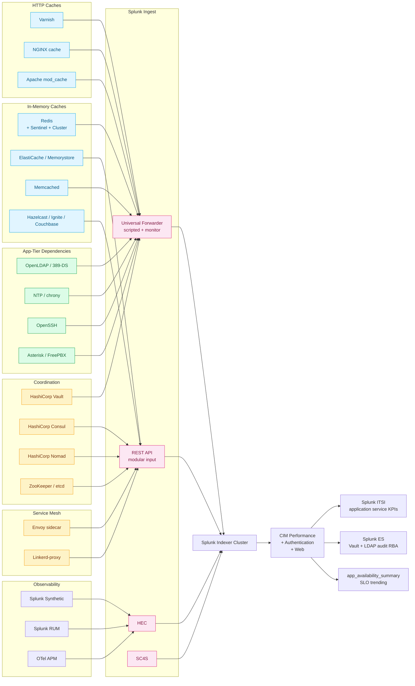

# Application Availability & Caching Layers Integration Guide

> Operational, performance, and availability monitoring for the
> **caching plane** (cat 8.5, 29 UCs — Redis, Memcached, Varnish,
> NGINX cache, CDN, Hazelcast, Ignite, Couchbase, page-load timing,
> synthetic + RUM, WildFly stability) and the **network service
> availability plane** (cat 8.6, 19 UCs — SSH availability, HashiCorp
> Vault / Consul / Nomad, Envoy upstream health, OpenLDAP, NTP /
> chrony, Asterisk / FreePBX, application-tier dependencies). Bridges
> the gap between `application-servers.md` (cat 8.1 — JVM application
> stacks), `kubernetes.md` (cat 3.2 — orchestration), and
> `splunk-observability-cloud.md` (cat 13.4 — APM + RUM + Synthetic).

## Table of Contents

- [Quick Start — From Zero to First Caching Dashboard](#quick-start--from-zero-to-first-caching-dashboard)
- [Overview](#overview)
- [Architecture and Data Flow](#architecture-and-data-flow)
- [Prerequisites](#prerequisites)
- [Domain 1 — Caching Layers (cat 8.5, 29 UCs)](#domain-1--caching-layers-cat-85-29-ucs)
- [Domain 2 — Network Service Availability (cat 8.6, 19 UCs)](#domain-2--network-service-availability-cat-86-19-ucs)
- [Sizing and Capacity Planning](#sizing-and-capacity-planning)
- [Compliance and Audit Evidence Pack](#compliance-and-audit-evidence-pack)
- [Crawl / Walk / Run Roadmap](#crawl--walk--run-roadmap)
- [Dashboards](#dashboards)
- [SPL Examples](#spl-examples)
- [Troubleshooting](#troubleshooting)
- [SOAR Playbooks](#soar-playbooks)
- [Cross-Product Integration](#cross-product-integration)

## Quick Start — From Zero to First Caching Dashboard

### Day 1: Inventory caching + availability tier

| Layer | Common products |
|---|---|
| In-memory cache | Redis (Sentinel, Cluster, Enterprise), AWS ElastiCache, Azure Cache for Redis, GCP Memorystore, Memcached, Hazelcast, Apache Ignite, Couchbase, Aerospike |
| HTTP / reverse-proxy cache | Varnish, NGINX cache, Apache mod_cache, Squid |
| CDN edge cache | Cloudflare, Akamai, Fastly, CloudFront, Azure CDN, GCP Cloud CDN |
| Coordination & secrets | HashiCorp Vault, Consul, Nomad, ZooKeeper, etcd |
| Service mesh sidecar | Envoy, Linkerd-proxy |
| Service availability | OpenLDAP / 389-DS, NTP / chrony, SSH, Asterisk / FreePBX |
| App-tier observability | Splunk Synthetic, Splunk RUM, OTel APM |

### Day 2: Stand up indexes

```ini
[cache]
homePath = $SPLUNK_DB/cache/db
coldPath = $SPLUNK_DB/cache/colddb
thawedPath = $SPLUNK_DB/cache/thaweddb
maxDataSize = auto_high_volume
frozenTimePeriodInSecs = 31536000

[app_availability]
homePath = $SPLUNK_DB/app_availability/db
coldPath = $SPLUNK_DB/app_availability/colddb
thawedPath = $SPLUNK_DB/app_availability/thaweddb
maxDataSize = auto_high_volume
frozenTimePeriodInSecs = 31536000

[app_availability_summary]
homePath = $SPLUNK_DB/app_availability_summary/db
coldPath = $SPLUNK_DB/app_availability_summary/colddb
thawedPath = $SPLUNK_DB/app_availability_summary/thaweddb
maxDataSize = auto
frozenTimePeriodInSecs = 220752000

[vault]
homePath = $SPLUNK_DB/vault/db
coldPath = $SPLUNK_DB/vault/colddb
thawedPath = $SPLUNK_DB/vault/thaweddb
maxDataSize = auto_high_volume
frozenTimePeriodInSecs = 220752000
# Vault audit retention: 7 years per PCI DSS 4.0 §10 + SOC 2

[consul]
homePath = $SPLUNK_DB/consul/db
coldPath = $SPLUNK_DB/consul/colddb
thawedPath = $SPLUNK_DB/consul/thaweddb
maxDataSize = auto_high_volume
frozenTimePeriodInSecs = 31536000

[envoy]
homePath = $SPLUNK_DB/envoy/db
coldPath = $SPLUNK_DB/envoy/colddb
thawedPath = $SPLUNK_DB/envoy/thaweddb
maxDataSize = auto_high_volume
frozenTimePeriodInSecs = 31536000

[varnish]
homePath = $SPLUNK_DB/varnish/db
coldPath = $SPLUNK_DB/varnish/colddb
thawedPath = $SPLUNK_DB/varnish/thaweddb
maxDataSize = auto_high_volume
frozenTimePeriodInSecs = 31536000
```

### Day 3: Redis monitoring via UF + scripted input

`/opt/splunkforwarder/etc/apps/TA-redis/bin/redis_info.sh`:

```bash
#!/bin/bash
PORTS="6379 6380 6381"
for PORT in $PORTS; do
  redis-cli -p $PORT INFO 2>/dev/null | \
    grep -v "^#" | grep -v "^$" | \
    sed "s/^/host=$(hostname) port=$PORT /"
done
```

`inputs.conf`:

```ini
[script:///opt/splunkforwarder/etc/apps/TA-redis/bin/redis_info.sh]
interval = 60
sourcetype = redis:info
index = cache

[script:///opt/splunkforwarder/etc/apps/TA-redis/bin/redis_slowlog.sh]
interval = 60
sourcetype = redis:slowlog
index = cache
```

### Day 4: HashiCorp Vault audit logging

Vault config:

```hcl
audit "file" {
  path           = "/var/log/vault/audit.log"
  file_path      = "/var/log/vault/audit.log"
  log_raw        = false
  hmac_accessor  = true
  format         = "json"
}
```

UF `inputs.conf`:

```ini
[monitor:///var/log/vault/audit.log]
sourcetype = hashicorp:vault:audit
index = vault
```

### Day 5: Consul + Nomad + Envoy via REST polling

```ini
[REST://consul_health]
endpoint = http://consul.example.com:8500/v1/health/state/any
auth_type = bearer_token
auth_token = <CONSUL_TOKEN>
polling_interval = 60
sourcetype = hashicorp:consul:health
index = consul

[REST://nomad_jobs]
endpoint = http://nomad.example.com:4646/v1/jobs
auth_type = bearer_token
auth_token = <NOMAD_TOKEN>
polling_interval = 60
sourcetype = hashicorp:nomad:job
index = nomad

[REST://envoy_admin_stats]
endpoint = http://envoy.example.com:9901/stats?format=json&filter=^cluster\.
polling_interval = 30
sourcetype = envoy:admin:stats
index = envoy
```

### Day 6: Varnish via varnishstat scripted input

`/opt/splunkforwarder/etc/apps/TA-varnish/bin/varnishstat.sh`:

```bash
#!/bin/bash
varnishstat -1 -j | jq -c
```

```ini
[script:///opt/splunkforwarder/etc/apps/TA-varnish/bin/varnishstat.sh]
interval = 60
sourcetype = varnish:varnishstat
index = varnish
```

### Day 7: First three dashboards

- Redis hit ratio + eviction rate (UC-8.5.1)
- Vault seal status + token count (UC-8.6.11)
- Service availability heatmap (UC-8.6.1)

## Overview

### Why caching deserves its own guide

Caching layers fail silently. A Redis instance with 90% CPU + 0%
hit-ratio looks healthy in CloudWatch (because CPU is "fine"), but
your application is doing 100% backend lookups — page-load times
explode but you don't notice until customer support calls. The
operational signal isn't in CPU; it's in the cache-specific KPIs:
hit ratio, eviction rate, slowlog activity, replication lag,
dogpile effect.

For PCI DSS 4.0 §11.6 monitoring of payment-page integrity, **HTTP
cache layers (Varnish, NGINX cache, CDN edge) MUST be monitored for
unintended caching of authenticated content** — a notorious payment-
data leak vector when poorly configured.

### Why network service availability is its own subdomain

Cat 8.6 (NSA) covers the platform services that "always work" — until
they don't. SSH service down on a critical bastion. NTP drift
exceeding 30 seconds (Kerberos breaks at 5 minutes). LDAP up but
slow. Vault sealed unexpectedly. Consul leadership election storms.
These are the dependencies that everything else relies on, and
they're invisible to APM tooling.

### Why Vault is here, not in identity-platforms-pam-sso.md

HashiCorp Vault appears in both guides intentionally:
- `identity-platforms-pam-sso.md` covers Vault as a **PAM /
  secrets-management product** (who accessed which secret, audit
  trail, dynamic credentials)
- This guide (cat 8.6) covers Vault as a **service-availability
  dependency** (seal status, token leasing health, replication lag,
  storage backend latency)

Different audience, different KPIs, same product. The two guides
cross-reference.

### Domains covered

| Sub | Name | UCs | Highlight |
|---|---|---|---|
| 8.5 | Caching Layers | 29 | Redis, Memcached, Varnish, NGINX cache, RUM/Synthetic, WildFly |
| 8.6 | Network Service Availability | 19 | Vault, Consul, Nomad, Envoy, OpenLDAP, NTP, SSH, Asterisk |

### What "good" looks like

| KPI | Healthy target | Source |
|---|---|---|
| Redis hit ratio | > 90% (per cluster) | redis-cli INFO |
| Redis eviction rate | < 1% of writes | redis-cli INFO |
| Memcached hit ratio | > 85% | memcached stats |
| Varnish cache hit rate | > 80% (per backend) | varnishstat |
| NGINX cache hit ratio | > 75% | nginx access log |
| Page load time (p95) | < 2.5 seconds | Splunk RUM / Synthetic |
| Vault seal status | unsealed | Vault audit |
| Vault token count | < 80% of license cap | Vault metrics |
| Consul leader stable | > 99.99% uptime | Consul agent |
| NTP drift | < 100 ms from stratum-1 | ntpq / chronyc |
| OpenLDAP query latency (p95) | < 50 ms | slapd operational |
| SSH service uptime | > 99.99% | sshd availability probe |

## Architecture and Data Flow



### Core principles

1. **Cache-specific KPIs over CPU.** Hit ratio, eviction rate, and
   slowlog volume tell you whether the cache is working — CPU and
   memory tell you whether the cache is alive. Both matter; only one
   reports failure modes.
2. **Vault audit goes to a 7-year retention class.** Vault audit
   evidence is required by SOC 2 CC9, PCI DSS §10, HIPAA §164.312.
3. **Consul leader-election storms are catastrophic but rare.** Set
   alerts on `>3 leader changes per hour`; this almost always
   indicates network partition or VM contention.
4. **NTP drift > 100ms is your early warning.** Kerberos breaks at
   5 minutes; you want to know at 100ms so you can fix before
   authentication fails.
5. **OpenLDAP slow queries are application bugs.** If a query takes
   > 500ms, the application is doing un-indexed lookups; fix the
   application, not the directory.
6. **Synthetic + RUM = page experience telemetry.** Use Splunk
   Synthetic for active probing of critical paths; use Splunk RUM for
   real-user-perceived latency including cache effectiveness.
7. **WildFly / Tomcat stability events go to a low-volume index.**
   Application server crashes are sparse; group with other rare-but-
   critical events.

## Prerequisites

### Pre-deployment checklist

- [ ] UF deployed on each Redis / Memcached / Varnish / NGINX host
- [ ] Vault audit logging enabled to file destination
- [ ] Consul / Nomad service-account tokens with read-only ACLs
- [ ] Envoy admin endpoint exposed on management port (NOT public)
- [ ] OpenLDAP audit overlay (`overlays/auditlog`) loaded
- [ ] NTP / chrony running on every host (chrony recommended)
- [ ] SSH availability probe scripted and scheduled
- [ ] Splunk Synthetic Monitoring tests configured for critical
  user journeys
- [ ] Splunk RUM agent embedded in production web pages
- [ ] CIM Performance + Authentication + Web data models accelerated

### Splunk components used

- **Splunk Enterprise / Cloud**
- **Splunk_TA_nix** — UF base for Linux scripted inputs
- **Splunk Stream** — wire-data probe for HTTP cache analysis
- **Splunk Synthetic Monitoring (cloud)** — active page-load probing
- **Splunk RUM (cloud)** — real-user-perceived performance
- **Splunk Distribution of OTel Collector** — OTLP ingestion for
  cache metrics + traces
- **Splunk ITSI** — application-service KPIs
- **Splunk ES** — Vault audit + LDAP audit RBA risk objects
- **Splunk SOAR** — Vault auto-unseal coordination, NTP drift
  remediation, cache stampede mitigation

## Domain 1 — Caching Layers (cat 8.5, 29 UCs)

### Highlight UCs

- **UC-8.5.1** — Cache Hit/Miss Ratio
- **UC-8.5.10** — Varnish Cache Hit Rate and Backend Health
- **UC-8.5.11** — Synthetic Transaction Monitoring
- **UC-8.5.12** — Website Page Load Time Breakdown
- **UC-8.5.13** — Varnish Ban and Purge Request Bursts
- **UC-8.5.14** — WildFly Server Patch and Extension Audit Events

### Configuration — Redis Sentinel cluster monitoring

```bash
#!/bin/bash
# /opt/splunkforwarder/etc/apps/TA-redis/bin/redis_sentinel.sh
SENTINELS="10.0.0.1:26379 10.0.0.2:26379 10.0.0.3:26379"
for S in $SENTINELS; do
  HOST=$(echo $S | cut -d: -f1)
  PORT=$(echo $S | cut -d: -f2)
  redis-cli -h $HOST -p $PORT SENTINEL masters | \
    awk -v host=$HOST '{print "host="host" "$0}'
done
```

### Configuration — Memcached stats

```ini
[script:///opt/splunkforwarder/etc/apps/TA-memcached/bin/mcstat.sh]
interval = 60
sourcetype = memcached:stats
index = cache
```

### Configuration — NGINX cache log format

`nginx.conf`:

```nginx
log_format cache '$remote_addr [$time_local] "$request" '
                 '$status "$upstream_cache_status" $upstream_response_time '
                 '"$http_referer" "$http_user_agent" '
                 'rt=$request_time';

server {
  access_log /var/log/nginx/access.log cache;
}
```

UF `inputs.conf`:

```ini
[monitor:///var/log/nginx/access.log]
sourcetype = nginx:cache:status
index = cache
```

### Configuration — Splunk Synthetic Monitoring

Splunk Observability Cloud → Synthetic Monitoring → New test:

```yaml
test_type: browser
url: https://www.example.com/checkout
locations: [us-east, eu-west, ap-southeast]
frequency: 5m
assertions:
  - type: page_load
    operator: lt
    value: 2500
  - type: status_code
    operator: eq
    value: 200
forwarding:
  destination: splunk_hec
  sourcetype: splunk:synthetic:test
  index: synthetic
```

## Domain 2 — Network Service Availability (cat 8.6, 19 UCs)

### Highlight UCs

- **UC-8.6.1** — SSH Service Availability Monitoring
- **UC-8.6.10** — Envoy Proxy Upstream Health
- **UC-8.6.11** — HashiCorp Vault Seal Status and Token Count
- **UC-8.6.12** — HashiCorp Consul Service Health
- **UC-8.6.13** — HashiCorp Nomad Job and Allocation Status
- **UC-8.6.14** — Asterisk / FreePBX Call Quality and Trunk Status

### Configuration — Vault metrics endpoint

Vault config:

```hcl
telemetry {
  prometheus_retention_time = "30s"
  disable_hostname = true
}

listener "tcp" {
  address = "0.0.0.0:8200"
  telemetry {
    unauthenticated_metrics_access = true
  }
}
```

UF metrics input:

```ini
[REST://vault_metrics]
endpoint = https://vault.example.com:8200/v1/sys/metrics?format=prometheus
auth_type = bearer_token
auth_token = <VAULT_TOKEN>
polling_interval = 30
sourcetype = hashicorp:vault:metrics
index = vault
```

### Configuration — OpenLDAP slapd audit overlay

`/etc/openldap/slapd.conf`:

```ini
moduleload  auditlog.la

overlay auditlog
auditlog /var/log/openldap/audit.log
```

UF:

```ini
[monitor:///var/log/openldap/audit.log]
sourcetype = openldap:slapd:audit
index = openldap
```

### Configuration — chrony tracking

```ini
[script:///opt/splunkforwarder/etc/apps/TA-ntp/bin/chrony_status.sh]
interval = 60
sourcetype = chrony:tracking
index = ntp
```

```bash
#!/bin/bash
chronyc -c tracking | awk -F, '{
  print "ref_id="$1" stratum="$3" system_time_offset="$5" last_offset="$6" rms_offset="$7" frequency="$8" residual_freq="$9" skew="$10" root_delay="$11" root_dispersion="$12" update_interval="$13" leap="$14
}'
```

### Configuration — SSH availability probe

```ini
[script:///opt/splunkforwarder/etc/apps/TA-sshd-availability/bin/ssh_probe.sh]
interval = 60
sourcetype = sshd:availability
index = sshd
```

```bash
#!/bin/bash
HOSTS_FILE=/opt/splunkforwarder/etc/apps/TA-sshd-availability/local/hosts.txt
while read host; do
  START=$(date +%s%N)
  if echo "" | nc -w 5 $host 22 > /dev/null 2>&1; then
    END=$(date +%s%N)
    LATENCY_MS=$(( (END - START) / 1000000 ))
    echo "host=$host status=available latency_ms=$LATENCY_MS"
  else
    echo "host=$host status=unavailable latency_ms=-1"
  fi
done < $HOSTS_FILE
```

## Sizing and Capacity Planning

| Source | Per-100-host daily volume | Per-100-host monthly storage |
|---|---|---|
| Redis INFO + slowlog | 200 MB | 6 GB |
| Memcached stats | 50 MB | 1.5 GB |
| Varnish varnishstat + varnishlog | 1 GB | 30 GB |
| NGINX cache access logs | 5 GB / 1M req/day | 150 GB |
| Apache mod_cache | 2 GB / 1M req/day | 60 GB |
| Splunk RUM (sampled 10%) | 2 GB / 1M sessions | 60 GB |
| Splunk Synthetic | 100 MB / 1k tests/day | 3 GB |
| HashiCorp Vault audit | 200 MB | 6 GB |
| HashiCorp Vault metrics | 100 MB | 3 GB |
| HashiCorp Consul health | 100 MB | 3 GB |
| HashiCorp Nomad jobs + allocations | 50 MB | 1.5 GB |
| Envoy admin stats | 500 MB | 15 GB |
| OpenLDAP audit | 200 MB / 1M ops/day | 6 GB |
| NTP / chrony tracking | 20 MB | 600 MB |
| SSH availability probes | 50 MB | 1.5 GB |
| Asterisk / FreePBX | 200 MB / 100k calls/day | 6 GB |
| WildFly / Tomcat / WebLogic | 500 MB | 15 GB |

For a representative deployment of 200 caching + availability hosts:
budget **~25 GB/day** indexed application-availability data.

## Compliance and Audit Evidence Pack

### SOC 2 CC6 + CC7 + CC9

UC-8.6.11 (Vault seal status + token count) + UC-8.6.12 (Consul
service health) + UC-8.6.1 (SSH availability) jointly satisfy CC6
(logical access), CC7 (system operations), CC9 (risk mitigation).

### ISO 27001 §A.12 + §A.14

UC-8.5.1, UC-8.5.10, UC-8.6.x jointly satisfy operations security
+ acquisition / development / maintenance.

### HIPAA §164.312(c)(1) + §164.308(a)(1)

UC-8.6.11 (Vault audit) directly required for PHI-bearing
applications using Vault as their secrets manager.

### GDPR Art. 32

UC-8.5.x cache integrity + UC-8.6.x service availability are
"appropriate technical and organisational measures."

### PCI DSS 4.0 §3.5 + §6.4 + §8 + §10 + §11.6

- §3.5 — Cryptographic key management (Vault)
- §6.4 — Web application firewall (caching layer integrity)
- §8 — Access management (Vault audit trail)
- §10 — Audit logs (Vault audit retention)
- §11.6 — Response to misuse (cache stampede / dogpile detection)

UC-8.6.11 jointly satisfies §3.5, §8, §10. UC-8.5.13 (Varnish ban
+ purge audit) satisfies §11.6.

### NIS2 Annex II §a + DORA Art. 8

UC-8.6.x service-availability evidence is "incident handling" and
"ICT operational resilience" for essential services.

### NIST SP 800-53 SI + 800-92

UC-8.6.11 (Vault audit) maps to SP 800-92 log-management requirements
+ SP 800-53 SI controls.

### CIS Controls v8 — Control 6, 8, 13

Account management (Vault token tracking — Control 6) + audit log
management (Vault audit — Control 8) + network monitoring (service
availability probes — Control 13).

## Crawl / Walk / Run Roadmap

### Crawl tier (10 UCs — week 1–4)

| UC | Title |
|---|---|
| 8.5.1 | Redis Cache Hit/Miss Ratio |
| 8.5.10 | Varnish Cache Hit Rate |
| 8.5.11 | Synthetic Transaction Monitoring |
| 8.5.12 | Page Load Time Breakdown |
| 8.6.1 | SSH Service Availability |
| 8.6.10 | Envoy Proxy Upstream Health |
| 8.6.11 | HashiCorp Vault Seal Status |
| 8.6.12 | HashiCorp Consul Service Health |
| 8.6.13 | HashiCorp Nomad Job Status |
| 8.6.14 | Asterisk / FreePBX Trunk Status |

### Walk tier (25 UCs — month 2–3)

Highlights:
- All caching UCs (8.5.x — Memcached, Hazelcast, Ignite, Couchbase
  patterns; cache stampede / dogpile detection; varnish ban / purge
  audit; WildFly stability events)
- All NSA UCs (8.6.x — OpenLDAP slow queries; NTP drift; chrony
  tracking; SSH brute-force-vs-availability separation; Asterisk
  call-quality monitoring)
- Splunk RUM + Synthetic full integration

### Run tier (13 UCs — month 4+)

Highlights:
- ML-driven anomaly detection on cache hit-ratio drift
- ML-driven Vault token-leasing pattern detection
- Cache stampede SOAR auto-mitigation
- NTP drift SOAR auto-remediation
- Service-availability ITSI service tree
- Page load p99 vs cache-hit-ratio correlation analytics
- Cross-tier dependency chain analysis (cache → backend → DB)

## Dashboards

| Dashboard | Audience | Refresh |
|---|---|---|
| Application Availability Executive | CTO + SRE Manager | 5 min |
| Cache Performance Operations | SRE + App Owner | 1 min |
| Vault Operations | Security + Platform | 1 min |
| Consul / Nomad Cluster Health | Platform | 1 min |
| Page Experience (Synthetic + RUM) | UX + Product | 5 min |
| Network Service Availability | NOC + SRE | 1 min |
| WildFly / Tomcat Stability | App Owner | 5 min |

## SPL Examples

### Redis hit ratio per cluster

```spl
index=cache sourcetype=redis:info
| stats latest(keyspace_hits) as hits, latest(keyspace_misses) as misses by host, port
| eval hit_ratio = round(hits/(hits+misses)*100, 2)
| where hit_ratio < 90
| eval alert = "Redis hit ratio below 90% — investigate"
```

### Vault token approaching cap

```spl
index=vault sourcetype=hashicorp:vault:metrics
| where metric_name = "vault.token.count"
| stats latest(metric_value) as token_count by host
| eval pct_of_cap = round(token_count / 100000 * 100, 1)
| where pct_of_cap > 80
| eval alert = "Vault token count > 80% of cap"
```

### Cache stampede detection

```spl
index=cache sourcetype=nginx:cache:status
| eval cache_status = mvindex(split(_raw, "\""), 5)
| stats count by upstream_cache_status, span=1m
| where upstream_cache_status="MISS" AND count > 1000
| eval alert = "Cache stampede detected — > 1k MISS in 1min"
```

## Troubleshooting

| Symptom | Likely cause | Fix |
|---|---|---|
| Redis INFO empty | UF can't reach Redis port | `nc -zv localhost 6379` |
| Vault audit empty | Audit destination not enabled | `vault audit list` |
| Consul REST 403 | ACL token insufficient | Re-issue with `node:read,service:read,health:read` |
| Nomad jobs missing | Missing read scope | Add `namespace:default:read-job` to token policy |
| Envoy /stats slow | Filter regex too broad | Tighten to `^cluster\..*upstream` |
| OpenLDAP audit overlay not loading | Module path wrong | Set `MODULEPATH /usr/lib/openldap` |
| Chrony missing fields | Output format mismatch | Use `-c` flag for CSV-style output |
| SSH probe latency always -1 | nc not installed | `apt install netcat-openbsd` |
| WildFly events sparse | Audit subsystem disabled | `/subsystem=elytron-audit:*` |

## SOAR Playbooks

### Playbook 1 — Cache stampede mitigation

```yaml
playbook: cache_stampede_mitigation
triggers:
  - notable_event: "Cache Stampede Detected"
phases:
  contain:
    - rate_limit_origin: 10_req_per_sec
    - varnish_ban_inject_lock: cache_lock_key
  notify:
    - pagerduty_alert:
        urgency: high
        service: "Application On-Call"
  remediate:
    - cache_warm: ${notable.cache_key}
```

### Playbook 2 — NTP drift auto-remediate

```yaml
playbook: ntp_drift_auto_remediate
triggers:
  - notable_event: "NTP Drift > 100ms"
phases:
  identify:
    - splunk_search:
        query: "index=ntp host=${notable.host}"
  remediate:
    - ssh_run:
        host: ${notable.host}
        command: "sudo chronyc makestep"
  audit:
    - splunk_log_evidence
```

### Playbook 3 — Vault auto-unseal coordination

```yaml
playbook: vault_auto_unseal
triggers:
  - notable_event: "Vault Sealed Unexpectedly"
phases:
  identify:
    - vault_get_seal_status: ${notable.host}
  alert_humans_first:
    - servicenow_create_p1_ticket
    - pagerduty_alert:
        urgency: critical
        service: "Vault On-Call"
  # NEVER auto-unseal in production - require human approval
  manual_unseal_supported_only: true
```

## Cross-Product Integration

| Other guide | Relationship |
|---|---|
| `application-servers.md` (cat 8.1) | JVM application stacks (Tomcat, WildFly, WebLogic) |
| `linux-servers.md` (cat 1.1) | UF + scripted-input base |
| `kubernetes.md` (cat 3.2) | Envoy as ingress / sidecar |
| `container-platforms-docker-openshift.md` (cat 3.5) | Service mesh (Envoy / Linkerd / Consul Connect) |
| `dns-dhcp.md` (cat 5.6) | DNS-driven service discovery |
| `edge-security-microsegmentation.md` (cat 17.4) | CDN cache + WAF |
| `ai-llm-observability.md` (cat 13.4) | OTel gen_ai semantic conventions for cached LLM responses |
| `splunk-observability-cloud.md` (cat 13.4) | Synthetic + RUM + APM cloud product |
| `identity-platforms-pam-sso.md` (cat 9.4) | Vault as PAM (different angle, same product) |
| `siem-soar.md` (cat 10.7) | Vault audit + LDAP audit RBA |
| `splunk-itsi.md` (cat 13.2) | Application service KPIs |
| `regulatory-compliance-master.md` (cat 22) | SOC 2, ISO 27001, PCI DSS 4.0 evidence |

---

**Document maintenance.** Reviewed quarterly against vendor release
notes. Last verified against:
- Splunk Enterprise 9.4
- Splunk_TA_nix 9.0
- Splunk Stream 8.0
- TA-nginx 4.x
- TA-apache 3.x
- Splunk Distribution of OTel Collector 0.97
- Splunk Add-on for HashiCorp Vault 1.x
- Splunk Synthetic Monitoring + RUM (cloud)
- Redis 7.x
- Memcached 1.6.x
- Varnish 7.x
- NGINX 1.27
- HashiCorp Vault 1.16
- HashiCorp Consul 1.18
- HashiCorp Nomad 1.7
- Envoy 1.30
- OpenLDAP 2.6
- chrony 4.5
- Asterisk 21
- WildFly 31

For corrections or additions, file an issue with `cat-8.5` or
`cat-8.6` labels.
