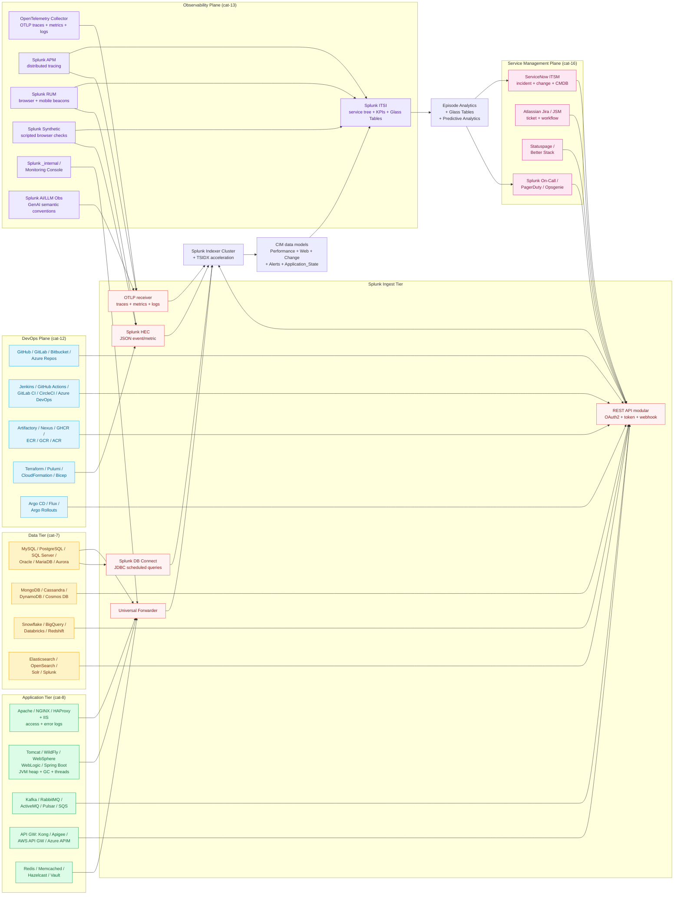

# Application & Service Monitoring Domain Master Guide

> Splunk's value in application & service monitoring comes from
> **stitching the entire delivery graph into one searchable narrative**:
> the database exposes tail latency, the gateway and queue shape
> fan-out, CI/CD decides which binary ever reaches the pool, Splunk
> tells you whether your evidence pipeline is trustworthy, and ITSM
> timestamps whether recovery met the contract. This domain guide
> bridges five catalogue pillars — Database & Data Platforms (cat 7,
> 122 UCs), Application Infrastructure (cat 8, 106 UCs), DevOps &
> CI/CD (cat 12, 88 UCs), Observability & Monitoring Stack (cat 13,
> 143 UCs), and Service Management & ITSM (cat 16, 81 UCs) — into
> one sequenced operational programme. It is the **front door** for
> SRE leads, platform engineering managers, application owners,
> service managers, and CIOs; per-product depth lives in the
> integration guides linked below.

## Table of Contents

- [Audience and Use](#audience-and-use)
- [Quick Start — From Zero to First SLO in 30 Days](#quick-start--from-zero-to-first-slo-in-30-days)
- [Architecture and Data Flow](#architecture-and-data-flow)
- [Domain 1 — Database & Data Platforms (cat 7, 122 UCs)](#domain-1--database--data-platforms-cat-7-122-ucs)
- [Domain 2 — Application Infrastructure (cat 8, 106 UCs)](#domain-2--application-infrastructure-cat-8-106-ucs)
- [Domain 3 — DevOps & CI/CD (cat 12, 88 UCs)](#domain-3--devops--cicd-cat-12-88-ucs)
- [Domain 4 — Observability & Monitoring Stack (cat 13, 143 UCs)](#domain-4--observability--monitoring-stack-cat-13-143-ucs)
- [Domain 5 — Service Management & ITSM (cat 16, 81 UCs)](#domain-5--service-management--itsm-cat-16-81-ucs)
- [SLO and Error Budget Anchor](#slo-and-error-budget-anchor)
- [DORA Metrics — Deployment Frequency, Lead Time, Change Failure Rate, MTTR](#dora-metrics--deployment-frequency-lead-time-change-failure-rate-mttr)
- [Crawl / Walk / Run Roadmap (22 / 65 / 53 UCs)](#crawl--walk--run-roadmap-22--65--53-ucs)
- [Sizing and Capacity Planning](#sizing-and-capacity-planning)
- [Compliance and Audit Evidence Pack](#compliance-and-audit-evidence-pack)
- [Reference Dashboards](#reference-dashboards)
- [SPL Examples](#spl-examples)
- [Troubleshooting](#troubleshooting)
- [SOAR Playbook Catalogue](#soar-playbook-catalogue)
- [Cross-Product Integration](#cross-product-integration)
- [References](#references)

## Audience and Use

| Audience | What you get from this guide | Where to go for depth |
|---|---|---|
| **CIO / VP Engineering** | DORA<sup class="ref">[<a href="#ref-5">5</a>]</sup> metrics, SLO scorecard, capacity model, business-service KPI map | `regulatory-compliance-master.md`, `compliance-business.md` |
| **SRE Lead / Platform Mgr** | End-to-end service graph, OTel + APM + RUM + Synthetic, ITSI service tree | `splunk-itsi.md`, `splunk-observability-cloud.md` |
| **Application Owner** | Service-tier UC catalogue, SLO definitions, error-budget burn-rate alerting | `application-servers.md`, `web-servers.md` |
| **DBA** | Statement-level latency, plan regressions, replication lag, deadlocks | `relational-databases.md`, `nosql-cloud-databases.md` |
| **DevOps Engineer** | DORA metrics, pipeline health, supply-chain security, GitOps reconciliation | `devops-cicd.md` |
| **Service Manager** | Incident lifecycle, SLA compliance, change-incident correlation, problem mgmt | `service-management-itsm.md` |
| **Splunk Platform Owner** | Indexer queue health, forwarder connectivity, SHC captain health | `splunk-platform-health.md` |
| **AI/ML Platform Owner** | LLM gateway latency, token economics, retrieval-augmented grounding | `ai-llm-observability.md` |

## Quick Start — From Zero to First SLO in 30 Days

### Week 1 — Database & HTTP Foundation

1. **Database slow queries** — MySQL slow log, PostgreSQL `pg_stat_statements`, SQL Server DMVs into `app_db`. Statement-level visibility anchors every upstream latency investigation.
2. **HTTP error rates** — reverse proxy access logs (Apache, NGINX, HAProxy, IIS) with normalised `status`, `upstream_status`, `request_time`, `upstream_response_time` into `app_web`.
3. **First three detections enabled:**
   - UC-7.1.1 Slow Query Detection
   - UC-8.1.1 HTTP Error Rate Monitoring
   - UC-8.1.5 SSL Certificate Monitoring

### Week 2 — JVM, Queues, Splunk Self-Health

4. **JVM heap + GC** — Tomcat / WildFly / WebLogic / WebSphere via JMX exporters into `app_metrics`.
5. **Kafka consumer lag** — `kafka:lag` per consumer-group/topic/partition into `app_queue`.
6. **Splunk platform health** — `_internal`, `_introspection` into `splunk_internal` (Splunk-managed; ensure Monitoring Console enabled).
7. **First three detections enabled:**
   - UC-8.2.1 JVM Heap Utilisation
   - UC-8.3.1 Kafka Consumer Lag Monitoring
   - UC-13.1.1 Indexer Queue Fill Ratio

### Week 3 — DevOps + APM/RUM/Synthetic

8. **GitHub / GitLab / Jenkins webhooks** — pipeline + deployment + push events into `app_devops_pipeline`. Tag with `service_id`, `deployment_hash`, `commit_sha`.
9. **OpenTelemetry traces** — Splunk Distribution of OTel Collector to APM (Splunk Observability Cloud<sup class="ref">[<a href="#ref-10">10</a>]</sup>) or `app_traces`.
10. **Splunk RUM beacons** for web SPA and mobile.
11. **Splunk Synthetic Monitoring** — synthetic browser checks for top-10 customer journeys.
12. **First three detections enabled:**
    - UC-12.2.5 Failed Deployment Tracking
    - UC-13.5.1 OpenTelemetry Trace Health
    - UC-8.7.1 Application Synthetic Health Monitoring

### Week 4 — ITSI Service Tree + ITSM Integration

13. **Splunk ITSI service tree** — model your top-10 business services as ITSI services with KPI rollups + Glass Tables.
14. **ServiceNow integration** — `Splunk_TA_snow` polling incidents, changes, CMDB, problems into `itsm_*` indexes.
15. **First three detections enabled:**
    - UC-13.2.1 Service Health Score Trending
    - UC-16.1.2 SLA Compliance Monitoring
    - UC-16.1.9 Change-Incident Correlation

By day 30 you have **15 production detections, all field-normalised**,
covering database / HTTP / JVM / queues / DevOps / OTel / RUM /
Synthetic / ITSI / ITSM — the full service graph from commit to
customer to contract.

## Architecture and Data Flow



### Core principles repeated throughout

1. **Service-graph thinking from day one.** Build saved searches that
   share identifiers — `service_id`, `deployment_hash`,
   `change_number`, `trace_id`, `span_id` — so one drill path
   carries engineers from customer symptom to causal change without
   re-asking questions the tools already answered.
2. **Golden signals first** (Latency, Traffic, Errors, Saturation per
   Brendan Gregg's USE method + Tom Wilkie's RED method). Saturation
   is the leading indicator; latency and errors are lagging.
3. **SLOs over absolute thresholds.** Tail latency p95/p99 + error
   budget burn rate beat fixed alert thresholds every time.
   Multi-window burn alerts (1h + 6h + 24h) catch acceleration before
   absolute exhaustion.
4. **OpenTelemetry is the contract.** Standardise on `service.name`,
   `deployment.environment`, `k8s.*`, `gen_ai.*` so third-party
   spans stitch to Splunk APM traces without regex archaeology.
5. **Splunk self-health is incident-class.** When indexer queues
   fill, all other dashboards lie. Alert on Splunk platform KPIs at
   the same severity as customer-facing service KPIs.
6. **Database CPU is precious.** Route heavy trending searches
   through replicas or warehouse replicas explicitly labelled
   non-production workloads. OLTP regressions attributed to "Splunk
   broke prod" destroy observability programmes.
7. **DORA metrics are the engineering productivity contract.**
   Deployment Frequency, Lead Time, Change Failure Rate, MTTR — track
   weekly per service, share quarterly with leadership.
8. **Change correlation is the reliability superpower.** Join
   change records (`CHG`) with incident spikes (`INC`) within
   configurable proximity windows. Change-induced incidents are the
   dominant preventable outage class.

---

## Domain 1 — Database & Data Platforms (cat 7, 122 UCs)

> Per-product depth: `relational-databases.md` (cat-7.1),
> `nosql-cloud-databases.md` (cat-7.2-7.4),
> `business-analytics.md` (cat-23 BI overlap).

### Subcategory map

| Sub | Focus | UCs | Deep-dive guide |
|---|---|---|---|
| 7.1 | Relational (MySQL, PG, MSSQL, Oracle, MariaDB, Aurora) | 15 | `relational-databases.md` |
| 7.2 | NoSQL (MongoDB, Cassandra, Couchbase, Aerospike) | 23 | `nosql-cloud-databases.md` |
| 7.3 | Cloud-managed (RDS, Aurora, Azure SQL, Cloud SQL, Cosmos, DynamoDB) | 17 | `nosql-cloud-databases.md` |
| 7.4 | Data Warehouses & Lakehouses (Snowflake, BigQuery, Databricks, Redshift) | 41 | `nosql-cloud-databases.md` |
| 7.5 | Search & Analytics (Elasticsearch, OpenSearch, Solr) | 21 | `nosql-cloud-databases.md` |
| 7.6 | Database & Data Platform Trending | 5 | `relational-databases.md` |

### Statement-level latency — the universal anchor

| Engine | What to collect | Why |
|---|---|---|
| **MySQL** | Slow query log (file or table) with `query_time`, `lock_time`, `rows_examined`, digest | Long-running statements hold locks, inflate buffers, mask as "CPU problems" |
| **PostgreSQL** | `pg_stat_statements` aggregates + `auto_explain` sampling for outliers | Single-statement tails miss repeated mid-cost queries that dominate p95 |
| **SQL Server** | Extended Events / Query Store + DMV snapshots (`sys.dm_exec_query_stats`, waits, blocking) | Plan regressions swap hash joins for nested loops silently |
| **Oracle** | AWR snapshots + ASH + listener log + alert log | Latch contention and library cache misses dominate in AWR Top SQL |
| **MongoDB** | `db.currentOp()` + profiler logs (level 1 = slow ops only) + `mongostat` | Index hit ratio and `COLLSCAN` flag are leading indicators |
| **Cassandra** | `nodetool tablestats`, GC log, system.log slow query | Tombstones and SSTable counts predict read latency degradation |

**Critical UCs:**
- UC-7.1.1 Slow Query Detection
- UC-7.1.2 Deadlock Monitoring
- UC-7.1.3 Connection Pool Exhaustion
- UC-7.1.5 Tablespace / Data File Growth
- UC-7.1.12 Database Availability Group Health
- UC-7.1.15 Privilege Escalation Audit
- UC-7.1.17 Database Connection Pool Exhaustion
- UC-7.1.19 Table and Index Bloat / Maintenance Window

### Replication lag and topology health

Measure **bytes/seconds behind primary** (MySQL replication, PG
replication slots, Mongo oplog lag, SQL Server AG REDO queue) plus
**quorum/election events** in clustered NoSQL engines. Read scaling
and DR depend on bounded lag; unbounded lag precedes split-brain
acceptance of stale reads or failed failovers.

**Anchor:** UC-7.2.1 Cluster Membership Changes (NoSQL pattern;
applies to relational HA too).

### Data warehouses and lakehouses — credits, queues, concurrency

Snowflake / BigQuery / Databricks expose **warehouse queues**, **slot
contention**, **spill-to-remote-storage volume**, and **failed micro-
partitions** — signals analogous to OS run queues but billed per
credit. Pull query history exports (latency, credits consumed,
queued time), pipe/stream lag for ingestion paths, and cluster
resize events. Join warehouse KPI baselines with **cat-20 cost &
capacity** spend anomalies when burst workloads coincide with
oversized warehouse SKUs left running after one-off campaigns.

### Cloud-managed databases — patch windows beat blame

RDS / Aurora / Cloud SQL / Azure SQL Managed Instance abstract hosts
yet expose **Performance Insights**, **deadlocks**, **failovers**,
**storage auto-grow**, and **backup slot contention**. **Tag
`maintenance_window_id`** from provider notifications wherever APIs
expose them — cloud patch windows masquerade as rogue application
deploys without this tag.

### Search and analytics engines — Elasticsearch / OpenSearch

Beyond generic slow-query narratives, search clusters add **shard
allocation**, **circuit breaker trips**, **cross-cluster replication
lag**, and **bulk indexing refusal rates**. Cluster health
transitions (`yellow` / `red`), pending tasks, JVM heap pressure per
data node, and indexing latency histograms are the operational
contract.

---

## Domain 2 — Application Infrastructure (cat 8, 106 UCs)

> Per-product depth: `web-servers.md` (cat-8.1),
> `application-servers.md` (cat-8.2 + 8.7-8.8),
> `message-queues.md` (cat-8.3), `api-gateways.md` (cat-8.4),
> `application-availability-caching.md` (cat-8.5-8.6).

### Subcategory map

| Sub | Focus | UCs | Deep-dive guide |
|---|---|---|---|
| 8.1 | Web Servers & Reverse Proxies (Apache, NGINX, HAProxy, IIS, Traefik) | 18 | `web-servers.md` |
| 8.2 | Application Servers & Runtimes (Tomcat, WildFly, WebSphere, WebLogic, Spring Boot) | 23 | `application-servers.md` |
| 8.3 | Message Queues & Event Streaming (Kafka, RabbitMQ, ActiveMQ, Pulsar, SQS, Service Bus) | 21 | `message-queues.md` |
| 8.4 | API Gateways & Service Mesh (Kong, Apigee, AWS API GW, Azure APIM, Envoy, Istio) | 16 | `api-gateways.md` |
| 8.5 | Caching & Session Stores (Redis, Memcached, Hazelcast, Apache Ignite) | 12 | `application-availability-caching.md` |
| 8.6 | Network Service Availability (HashiCorp Vault, Consul, Nomad, OpenLDAP, NTP) | 11 | `application-availability-caching.md` |
| 8.7 | Application Trending | varies | `application-servers.md` |
| 8.8 | Automation & RPA | varies | `application-servers.md` |

### HTTP error rates and saturation

Partition **5xx vs 4xx**, **upstream connect failures**, **retry
storms**, and **latency percentiles** per route/service — not a
single red/green uptime bit. Distinguishing `502` upstream from
`503` overload drives the right remediation (rollback vs scale-out).

**Critical UCs:**
- UC-8.1.1 HTTP Error Rate Monitoring
- UC-8.1.5 SSL Certificate Monitoring
- UC-8.1.14 SSL Certificate Expiry
- UC-8.1.15 HAProxy Backend Health
- UC-8.1.32 ActiveMQ Memory Pressure (cross-listed)

### JVM heap, GC, and runtime stalls

Heap utilisation (`Old Gen`), GC pause times (`Pause Young`,
`Pause Full`), thread deadlocks, thread pool exhaustion. **GC storms
masquerade as network latency when pause times exceed client
timeouts.** Use JMX/JFR exporters via TA-jmx or OpenTelemetry.

**Critical UCs:**
- UC-8.2.1 JVM Heap Utilisation
- UC-8.2.10 GC Pause Distribution
- UC-8.2.15 Thread Pool Exhaustion

### Kafka — consumer lag and broker health

**Consumer group lag** per topic/partition, **under-replicated
partitions**, **offline replicas**, **controller elections**, **ISR
shrink events**. Streaming backlogs propagate into downstream DB
writes and batch SLA misses faster than disk KPIs move.

**Critical UCs:**
- UC-8.3.1 Kafka Consumer Lag Monitoring
- UC-8.3.3 Broker Health Monitoring
- UC-8.3.10 Under-Replicated Partition Trending

### API gateways — quotas, auth failures, backend mapping

Modern gateways (Kong, Apigee, AWS API Gateway, Azure APIM) emit
rate-limit counters, JWT validation failures, latency histograms per
route/key, backend connectivity faults. Normalise consumer/
subscription identifiers, **429 vs 503**, quota exhaustion,
certificate pinning mismatches when east-west TLS terminates twice.

### IIS / Windows web stacks

Microsoft IIS remains pervasive for .NET APIs even when Linux
gateways front customer traffic. `W3SVC` logs, Windows Event Log
application errors, ASP.NET request queues, Application Pool recycle
reasons. **Recycles mid-flight mimic upstream 502s** — Splunk
timelines must differentiate worker process crashes from
deployment-induced restarts.

### CDN and edge offload awareness

When CDN tiers absorb traffic, origin HTTP dashboards lose fidelity
unless **`X-Cache`** / **`Age`** headers or CDN analytics APIs
contribute cache-hit context. Otherwise engineering debates whether
microservices regressed when edge caches expired simultaneously
during marketing spikes.

---

## Domain 3 — DevOps & CI/CD (cat 12, 88 UCs)

> Per-product depth: `devops-cicd.md`.

### Subcategory map

| Sub | Focus | UCs | Deep-dive guide |
|---|---|---|---|
| 12.1 | Source Control (GitHub, GitLab, Bitbucket, Azure Repos) | 20 | `devops-cicd.md` |
| 12.2 | CI/CD Pipelines (Jenkins, Actions, GitLab CI, CircleCI, Azure DevOps) | 26 | `devops-cicd.md` |
| 12.3 | Artifact & Package Management (Artifactory, Nexus, GHCR, ECR, GCR, ACR) | 12 | `devops-cicd.md` |
| 12.4 | Infrastructure as Code (Terraform, Pulumi, CloudFormation, Bicep) | 16 | `devops-cicd.md` |
| 12.5 | GitOps & Progressive Delivery (Argo CD, Flux, Argo Rollouts) | 10 | `devops-cicd.md` |
| 12.6 | DevOps & CI/CD Trending | 4 | `devops-cicd.md` |

### Source-control governance signals

Critical UCs:
- UC-12.1.1 Commit Activity Trending
- UC-12.1.2 Branch Protection Bypasses
- UC-12.1.4 Secret Exposure Detection
- UC-12.1.10 Force Push to Protected Branches

### Pipeline reliability beyond green builds

Critical UCs:
- UC-12.2.5 Failed Deployment Tracking
- UC-12.2.8 Security Scan Results in Pipeline
- UC-12.2.15 Pipeline Duration Trending
- UC-12.2.20 Test Flakiness Detection

### Supply chain security — SBOM and dependency scanning

Ingest SBOM artefacts (CycloneDX/SPDX), container image digest
signing outcomes, and scanner verdicts from pipelines (SAST/DAST/
dependency CVE gates). Pipeline JSON → HEC with immutable linkage
`(repo, commit, digest)`.

Critical UCs:
- UC-12.3.2 Dependency Vulnerability Alerts
- UC-12.3.10 Container Image Signing Verification

### Infrastructure as Code and GitOps reconciliation

Terraform / CloudFormation / Pulumi apply events and Argo CD / Flux
reconciliation health tell you **whether declared state matches
live state** before an application ever logs an error. Capture
plan/apply summaries, drift detection, sync failures, pruned
resources, helm hook outcomes.

---

## Domain 4 — Observability & Monitoring Stack (cat 13, 143 UCs)

> Per-product depth: `splunk-platform-health.md` (cat-13.1),
> `splunk-itsi.md` (cat-13.2),
> `third-party-monitoring.md` (cat-13.3),
> `ai-llm-observability.md` (cat-13.4),
> `splunk-observability-cloud.md` + `observability-tooling-grafana-fluentd.md` (cat-13.5).

### Subcategory map

| Sub | Focus | UCs | Deep-dive guide |
|---|---|---|---|
| 13.1 | Splunk Platform Health (indexers, SHC, ingestion, licensing) | 51 | `splunk-platform-health.md` |
| 13.2 | Splunk ITSI (services, KPIs, episodes, Glass Tables, predictive) | 37 | `splunk-itsi.md` |
| 13.3 | Third-Party Monitoring Integration (Prometheus, Grafana, Datadog, New Relic, Dynatrace, AppD) | 19 | `third-party-monitoring.md` |
| 13.4 | AI & LLM Observability (token economics, prompt safety, refusal rates) | 15 | `ai-llm-observability.md` |
| 13.5 | OpenTelemetry, Observability Pipelines & SRE Patterns | 21 | `splunk-observability-cloud.md` + `observability-tooling-grafana-fluentd.md` |

### Splunk platform KPIs — ingestion and topology

Indexer queue fill, forwarder connectivity, SHC captain health,
indexer replication backlog. **Observability debt cascades** —
customers blame apps when Splunk stalled ingestion mid-incident.

Critical UCs:
- UC-13.1.1 Indexer Queue Fill Ratio
- UC-13.1.3 Forwarder Connectivity
- UC-13.1.10 Search Head Cluster Status
- UC-13.1.11 Indexer Cluster Bucket Replication Health

### Splunk ITSI — service tree, KPIs, episodes

| Topic | Detail |
|---|---|
| **KPI source search types** | Data model KPI (accelerated), Ad-hoc KPI (raw indexes), Metrics KPI (`mstats`), Base search KPI (shared heavy searches) |
| **Entity-level thresholds** | Tier-1 OLTP demands tighter envelopes than sandbox; threshold templates per cohort |
| **Predictive Analytics** | Multivariate anomaly detection + forecasting baselines when statistical readiness exists |
| **Service Templates** | Import from Content Pack for Monitoring & Alerting where applicable; customise entity rules per data centre |
| **Glass Tables** | Situational dashboards with embedded KPI tiles + service dependency edges |
| **Episode Analytics** | Group symptoms under a single service narrative — reduces pager storms |

Critical UCs:
- UC-13.2.1 Service Health Score Trending
- UC-13.2.6 Rules Engine Health
- UC-13.2.10 Episode Backlog Distribution

### Third-party telemetry bridges

Prometheus / Grafana / Datadog / Dynatrace / AppDynamics / New Relic
estates federate through **Splunk Observability Cloud** collectors or
webhook relays. Preserve **golden signal** parity (`latency`,
`traffic`, `errors`, `saturation`) when migrating dashboards. The
**OpenTelemetry Specification<sup class="ref">[<a href="#ref-6">6</a>]</sup>** defines consistent attribute names
— `service.name`, `deployment.environment`, `k8s.*`, `gen_ai.*` —
so third-party spans stitch to Splunk APM traces without regex
archaeology.

### AI & LLM observability edge

LLM gateways demand **token economics**, **policy-filter blocks**,
**retrieval-augmented grounding failures**, and **prompt-injection
mitigation telemetry** when regulated workloads adopt Copilot-style
assistants. Histogram latency per model/route, refusal counts,
citation/recall scores. Slow-first-token latency differs
diagnostically from slow-last-token streaming. Normalise `gen_ai.*`
semantic conventions where collectors support OpenTelemetry GenAI
instrumentation.

---

## Domain 5 — Service Management & ITSM (cat 16, 81 UCs)

> Per-product depth: `service-management-itsm.md`.

### Subcategory map

| Sub | Focus | UCs | Deep-dive guide |
|---|---|---|---|
| 16.1 | Ticketing Systems (ServiceNow, Jira Service Management, Cherwell, Ivanti) | 27 | `service-management-itsm.md` |
| 16.2 | Configuration Management (CMDB) | 18 | `service-management-itsm.md` |
| 16.3 | Business Process Monitoring | 16 | `service-management-itsm.md` |
| 16.4 | Change & Release Management | 12 | `service-management-itsm.md` |
| 16.5 | Service Management Trending | 8 | `service-management-itsm.md` |

### ITIL v4 incident, problem, change, SLA

| Practice | Critical UC |
|---|---|
| Incident Management | UC-16.1.1 Incident Volume Trending |
| SLA Compliance | UC-16.1.2 SLA Compliance Monitoring |
| MTTR by Category | UC-16.1.3 MTTR by Category |
| Change Success Rate | UC-16.1.4 Change Success Rate |
| Change-Incident Correlation | UC-16.1.9 Change-Incident Correlation |
| SLA Breach Prediction | UC-16.1.14 SLA Breach Prediction |
| CMDB Data Quality | UC-16.2.1 CMDB Data Quality Score |

### ServiceNow integration via Splunk Add-on

Pull **incident, change, CMDB, problem** entities on poll or push
webhooks bidirectionally. Splunk stays the analytics brain;
ServiceNow stays the workflow system of record — duplicate UI work
creates drift. Configure `Splunk_TA_snow` inputs with least-
privilege service accounts; map `sys_id` fields for joins with
telemetry events carrying `configuration_item` tags.

---

## SLO and Error Budget Anchor

### Why SLOs and burn-rate alerting

Static thresholds (e.g. "alert when latency > 500ms") break under
seasonality and miss bursty incidents. **SLOs reframe reliability
as budgeted risk** — define an objective (99.9% availability over
30 days), accept the inverse (43.2 min/30d budget), and alert on
**burn rate** (consumption velocity) rather than threshold violation.

### Reference burn-rate alert windows

| Window | Burn rate threshold | Severity | Why |
|---|---|---|---|
| 1h | >14.4× | Critical | Catches catastrophic outages within 1h |
| 6h | >6× | High | Catches sustained degradation within a half-shift |
| 24h | >3× | Medium | Catches slow burn within a day |
| 72h | >1× | Low | Catches chronic degradation across long weekends |

`14.4` for the 1h window comes from the multi-window guidance in
the Google SRE Workbook: alerting at 14.4× burn means you'll
exhaust 2% of monthly budget in 1h, which is a clear incident.

### SLI definitions per service tier

| Service tier | Availability SLI | Latency SLI | Quality SLI |
|---|---|---|---|
| Tier-1 customer-facing | 99.9% (30d) | p95 < 200 ms | < 0.1% errors |
| Tier-2 internal | 99.5% (30d) | p95 < 500 ms | < 0.5% errors |
| Tier-3 batch | 99% (30d) | per-batch SLA | varies |

### Splunk SPL for burn-rate calculation

```spl
| from datamodel:Performance.All_Performance
| where status="success" 
| stats count as total_requests, count(eval(status="success" AND duration<200)) as fast_success_requests by service, _time span=5m
| eval slo_target = 0.999
| eval error_rate_5m = 1 - (fast_success_requests / total_requests)
| eval budget_consumed_5m = (error_rate_5m / (1 - slo_target))
| eval burn_rate_1h = mvavg(budget_consumed_5m, 12)
| where burn_rate_1h > 14.4
```

---

## DORA Metrics — Deployment Frequency, Lead Time, Change Failure Rate, MTTR

Per Accelerate / DORA research, elite teams optimise four outcomes:

| Metric | Definition | Elite | High | Medium | Low |
|---|---|---|---|---|---|
| **Deployment Frequency** | Successful prod deploys per service per period | On-demand (multiple/day) | 1/day to 1/week | 1/week to 1/month | <1/month |
| **Lead Time** | Commit merge → prod-ready deploy | <1h | 1d to 1w | 1w to 1m | >1m |
| **Change Failure Rate** | % deploys causing incidents/rollback | 0-15% | 0-15% | 16-30% | 16-30%+ |
| **Mean Time to Restore** | Detection → mitigation | <1h | <1d | <1w | >1w |

### Splunk SPL for DORA scorecard

```spl
| eventstats count as deploys by service, deploy_environment, _time span=1d
| where deploy_environment="production"
| stats avg(deploys) as deployment_frequency by service
| join service [
    | search index=app_devops_pipeline source="*pipeline*" status="success"
    | eval lead_time_min = (deploy_time - merge_time) / 60
    | stats avg(lead_time_min) as avg_lead_time_min by service
  ]
| join service [
    | search index=itsm_incident source="*servicenow*"
    | join cause_change_number [
        | search index=app_devops_pipeline source="*deploy*"
      ]
    | stats count as change_caused_incidents by service
  ]
| eval dora_tier = case(
    deployment_frequency >= 1 AND avg_lead_time_min < 60, "elite",
    deployment_frequency >= 0.14 AND avg_lead_time_min < 1440, "high",
    deployment_frequency >= 0.03 AND avg_lead_time_min < 10080, "medium",
    1=1, "low")
```

---

## Crawl / Walk / Run Roadmap (22 / 65 / 53 UCs)

### Crawl tier (22 UCs — month 1-2)

The "first 30 days" detections from the Quick Start, plus 7 high-
value extensions:

| UC | Domain | Title |
|---|---|---|
| 7.1.1 | DB | Slow Query Detection |
| 7.1.2 | DB | Deadlock Monitoring |
| 7.1.3 | DB | Connection Pool Exhaustion |
| 7.1.5 | DB | Tablespace / Data File Growth |
| 8.1.1 | Web | HTTP Error Rate Monitoring |
| 8.1.5 | Web | SSL Certificate Monitoring |
| 8.1.15 | Web | HAProxy Backend Health |
| 8.2.1 | App | JVM Heap Utilisation |
| 8.3.1 | Queue | Kafka Consumer Lag Monitoring |
| 8.3.3 | Queue | Broker Health Monitoring |
| 8.7.1 | App | Application Synthetic Health Monitoring |
| 12.1.4 | DevOps | Secret Exposure Detection |
| 12.2.5 | DevOps | Failed Deployment Tracking |
| 13.1.1 | Splunk | Indexer Queue Fill Ratio |
| 13.1.3 | Splunk | Forwarder Connectivity |
| 13.2.1 | ITSI | Service Health Score Trending |
| 13.5.1 | Obs | OpenTelemetry Trace Health |
| 16.1.1 | ITSM | Incident Volume Trending |
| 16.1.2 | ITSM | SLA Compliance Monitoring |
| 16.1.3 | ITSM | MTTR by Category |
| 16.1.9 | ITSM | Change-Incident Correlation |
| 16.2.1 | ITSM | CMDB Data Quality Score |

### Walk tier (65 UCs — month 3-6)

Highlights:
- Full database statement-level monitoring (7.1.x extended + 7.2.x NoSQL)
- Cloud-managed DB Performance Insights (7.3.x)
- Data Warehouse credits + slot contention (7.4.x)
- Search engine cluster health (7.5.x)
- Application server full posture (8.2.x extended)
- Message queue full coverage (8.3.x extended)
- API Gateway full coverage (8.4.x)
- Caching layer coverage (8.5.x)
- Network service availability (8.6.x — Vault, Consul, NTP)
- Source-control governance full set (12.1.x extended)
- Pipeline + supply chain full set (12.2.x + 12.3.x)
- IaC + GitOps reconciliation (12.4.x + 12.5.x)
- ITSI service templates + Glass Tables (13.2.x extended)
- Third-party Prometheus / Grafana / Datadog bridges (13.3.x)
- ServiceNow + Jira full integration (16.1.x extended)
- CMDB + Change & Release full set (16.2.x + 16.4.x)

### Run tier (53 UCs — month 7+)

Highlights:
- Splunk APM + RUM + Synthetic full deployment with SLO + burn-rate alerting
- ITSI Predictive Analytics + Adaptive Thresholding production-grade
- AI & LLM observability with `gen_ai.*` semantic conventions
- DORA metrics scorecard + per-service trending
- DataOps for data warehouse / lakehouse with credit-cost burn-rate
- AIOps with Episode Analytics + auto-remediation playbooks
- Continuous Performance Engineering with load-test → APM trace correlation
- Game-day chaos engineering with controlled fault injection
- ML-driven anomaly detection on golden signals
- Business Process Monitoring with BPMN-aligned KPIs

---

## Sizing and Capacity Planning

| Source | Per-1k-employee daily volume | Per-1k-employee monthly storage |
|---|---|---|
| MySQL slow log | 200 MB / 100 instances | 6 GB |
| PostgreSQL `pg_stat_statements` | 100 MB / 100 instances | 3 GB |
| SQL Server XEvents + DMV | 500 MB / 100 instances | 15 GB |
| Oracle AWR snapshots | 1 GB / 100 instances | 30 GB |
| MongoDB profiler (level 1) | 300 MB / 50 instances | 9 GB |
| Cassandra system + GC log | 500 MB / 50 nodes | 15 GB |
| Apache / NGINX access | 5 GB / 1k RPS | 150 GB |
| HAProxy access | 3 GB / 1k RPS | 90 GB |
| IIS W3SVC | 4 GB / 1k RPS | 120 GB |
| Tomcat / WildFly catalina + JMX | 1 GB / 100 instances | 30 GB |
| Kafka broker logs + lag metrics | 500 MB / 10 brokers | 15 GB |
| RabbitMQ management API | 100 MB / 10 nodes | 3 GB |
| API Gateway access | 8 GB / 1k RPS | 240 GB |
| Redis INFO | 50 MB / 100 instances | 1.5 GB |
| OpenTelemetry traces (sampled) | 10 GB / 100 services | 300 GB |
| Splunk RUM beacons | 5 GB / 1M page views | 150 GB |
| Splunk Synthetic checks | 100 MB / 100 checks | 3 GB |
| GitHub / GitLab webhooks | 200 MB / 100 repos | 6 GB |
| Jenkins build logs | 2 GB / 100 jobs/day | 60 GB |
| Terraform / GitOps reconciliation | 500 MB / 100 stacks | 15 GB |
| Splunk `_internal` | varies; budget 5-10% of total | varies |
| ITSI summary | 1 GB / 100 services | 30 GB |
| ServiceNow incident + change | 500 MB / 1k tickets/day | 15 GB |

**Worked example (10k-employee mid-market enterprise):**
- 100 DB instances (mixed): ~5 GB/day
- 100 application servers + JVM: ~1 GB/day
- 50 web servers (Apache/NGINX/IIS): ~50 GB/day at 10k RPS
- 10 Kafka brokers: ~5 GB/day
- 200 services with OTel sampling: ~20 GB/day
- 1M page views Splunk RUM: ~5 GB/day
- 100 synthetic checks: ~100 MB/day
- 200 repos GitHub webhooks: ~400 MB/day
- 100 Jenkins jobs: ~2 GB/day
- ITSI summary + ITSM integration: ~3 GB/day
- Splunk `_internal`: ~9 GB/day

→ **~100-110 GB/day indexed application & service data** for a
balanced golden-signal-first instrumentation pattern. Heavy
distributed-tracing sampling (100% retention for canary) can triple
this; tune trace sampling to <10% on stable services.

---

## Compliance and Audit Evidence Pack

| Framework | Evidence pack file | Anchor UCs |
|---|---|---|
| SOC 2 Type II | `docs/evidence-packs/soc-2.md` | 8.x availability, 13.x monitoring, 16.x change/incident |
| ISO 27001:2022 | `docs/evidence-packs/iso-27001.md` | A.5.30, A.8.6, A.8.16 |
| HIPAA Security Rule<sup class="ref">[<a href="#ref-13">13</a>]</sup> | `docs/evidence-packs/hipaa-security.md` | §164.312(b) audit controls — 7.x DB audit + 16.x ITSM |
| PCI DSS 4.0 | `docs/evidence-packs/pci-dss.md` | Req 6, 10, 11 — 12.x DevOps, 13.x monitoring, 16.x change |
| GDPR<sup class="ref">[<a href="#ref-4">4</a>]</sup> | `docs/evidence-packs/gdpr.md` | Art. 32 — 7.x DB + 13.x monitoring |
| NIS2 | `docs/evidence-packs/nis2.md` | Annex II §a + §c |
| DORA | `docs/evidence-packs/dora.md` | Art. 8 + 16 + 17 — 13.x monitoring, 16.x incident classification |
| CMMC 2.0 Level 2 | `docs/evidence-packs/cmmc.md` | NIST 800-171 r3 SI + AU + CM + IR families |
| NIST CSF 2.0 | `docs/evidence-packs/nist-csf.md` | Detect (DE) + Respond (RS) + Recover (RC) |
| NIST 800-53 r5 | `docs/evidence-packs/nist-800-53.md` | AU, CA, CM, CP, IR, SI families |
| SOX ITGC | `docs/evidence-packs/sox-itgc.md` | 12.x change-mgmt + 16.x ITSM |

**ITIL v4 + ISO 20000 evidence pattern.** Splunk ITSI service tree
+ ITSM integration produces the **defensible audit trail**: every
incident carries the ITIL practice it exercised (Incident, Problem,
Change, Release, Availability, Capacity, Service Continuity), the
KPIs that fired, and the change records correlated within the
proximity window.

---

## Reference Dashboards

| Dashboard | Audience | Refresh | Source |
|---|---|---|---|
| Service Health Scorecard | CIO + VP Eng | 1h | ITSI service tree |
| SLO + Error Budget Burn | SRE + App Owner | 5 min | APM + RUM + Synthetic |
| DORA Metrics by Service | DevOps Lead | 24h | `app_devops_pipeline` + `itsm_incident` |
| Database Statement Top-N | DBA | 5 min | `app_db` |
| HTTP Error Triage | Web Ops | 1 min | `app_web` |
| JVM + GC Triage | App Ops | 1 min | `app_metrics` |
| Kafka Lag + Broker Health | Streaming Ops | 1 min | `app_queue` |
| Splunk Platform Health | Splunk Admin | 5 min | `splunk_internal` |
| ITSI Episode Inbox | NOC | 1 min | `itsi_grouped_alerts` |
| ITSM Incident Backlog | Service Mgr | 15 min | `itsm_incident` |
| Change-Incident Correlation | Change Mgr | 1h | `itsm_change` join `itsm_incident` |
| AI/LLM Token Economics | AI Platform | 5 min | `app_metrics` `gen_ai.*` |

---

## SPL Examples

### Service health composite (RED method)

```spl
| from datamodel:Performance.All_Performance
| stats 
    count as traffic,
    count(eval(status="error")) as errors,
    perc95(duration) as p95_latency,
    perc99(duration) as p99_latency
    by service, _time span=5m
| eval error_rate = errors / traffic
| eval health_score = case(
    error_rate >= 0.05 OR p95_latency >= 1000, 0,
    error_rate >= 0.01 OR p95_latency >= 500, 50,
    1=1, 100)
```

### Database slow query top-N with regression detection

```spl
index=app_db sourcetype="postgres:pg_stat_statements"
| eval baseline_ms = mvfirst(mvexpand(weekly_baseline_ms)), current_ms = mean_exec_time
| where current_ms > 2 * baseline_ms AND calls > 100
| stats sum(calls) as total_calls, avg(current_ms) as avg_current, avg(baseline_ms) as avg_baseline by query
| eval regression_factor = avg_current / avg_baseline
| sort - regression_factor
| head 25
```

### Kafka consumer lag with predicted exhaustion time

```spl
index=app_queue sourcetype="kafka:lag"
| stats max(lag) as current_lag by topic, partition, consumer_group, _time span=1m
| eventstats avg(current_lag) as avg_lag_5min by topic, partition, consumer_group
| stats max(current_lag) as current_lag, avg(avg_lag_5min) as recent_avg_lag, latest(_time) as last_seen by topic, partition, consumer_group
| where current_lag > 10000 AND current_lag > 1.5 * recent_avg_lag
| eval lag_growth_rate = (current_lag - recent_avg_lag) / 300
| eval estimated_exhaustion_time = if(lag_growth_rate > 0, "growing", "stable")
```

### DORA Change Failure Rate per service

```spl
index=app_devops_pipeline source="*deploy*" status="success"
| eval deploy_time = _time
| join cause_change_number [
    | search index=itsm_incident source="*servicenow*"
    | eval incident_time = opened_at
    | where incident_time > deploy_time AND incident_time < deploy_time + 86400
  ]
| stats count(eval(isnotnull(incident_number))) as failed_deploys, count as total_deploys by service
| eval change_failure_rate_pct = round(100 * failed_deploys / total_deploys, 2)
| eval dora_tier = case(
    change_failure_rate_pct <= 15, "elite/high",
    change_failure_rate_pct <= 30, "medium",
    1=1, "low")
```

### Splunk indexer queue saturation

```spl
index=_internal sourcetype=splunkd component=Metrics group=queue 
| stats max(current_size) as current_size, avg(largest_size) as max_size by host, name
| eval queue_fill_pct = round(100 * current_size / max_size, 2)
| where queue_fill_pct > 80
| sort - queue_fill_pct
```

### Cross-correlation: deploy → DB regression → HTTP 5xx

```spl
| multisearch
  [ search index=app_devops_pipeline source="*deploy*" status="success"
    | eval event_class = "deploy", _time = deploy_time ]
  [ search index=app_db sourcetype="postgres:pg_stat_statements" current_ms > 2 * baseline_ms
    | eval event_class = "db_regression" ]
  [ search index=app_web status>=500
    | eval event_class = "http_5xx" ]
| where event_class IN ("deploy", "db_regression", "http_5xx")
| stats count by service, event_class, _time span=15m
| chart count over _time by event_class
```

---

## Troubleshooting

| Symptom | Likely cause | Fix |
|---|---|---|
| MySQL slow log not arriving | UF stanza missing or `slow_query_log_file` path wrong | Verify `inputs.conf` matches `SHOW GLOBAL VARIABLES LIKE 'slow_query_log%'` |
| PG `pg_stat_statements` empty | Extension not loaded or `track_activity_query_size` too small | `CREATE EXTENSION pg_stat_statements;` + restart + tune `track_activity_query_size` to 4096 |
| Tomcat JMX export gaps | TA-jmx config drift on container restarts | Bake JMX config into container image; persist via ConfigMap |
| Kafka consumer lag exporter stale | Exporter pod evicted or OOMKilled | Set CPU/mem limits properly; use Kafka Lag Exporter health check |
| Splunk APM trace ingestion gaps | OTel collector dropping at queue saturation | Increase `sending_queue.queue_size`; add backpressure handling |
| ITSI service health stuck "N/A" | KPI base search has no data in lookback window | Verify base search returns data; check threshold template assignment |
| ITSI episode policy not grouping | Filter expression too restrictive | Test filter with `| search` against `itsi_tracked_alerts` |
| ServiceNow integration drift | Polling delay; webhook missed | Use bi-directional pattern: webhook for real-time + poll for safety net |
| Indexer queue fill alarms during nightly batch | Heavy CIM acceleration during peak ingest | Schedule DM accel during low-ingest window; add indexer parallel pipelines |
| RUM beacons missing for SPA route changes | RUM SDK not instrumented for SPA history events | Use `splunk-otel-web` SPA mode + custom route-change events |
| Synthetic check passing but customers report errors | Check is too narrow (homepage only) | Build synthetic for full customer journey including login + key transactions |
| OTel `service.name` mismatch breaking trace search | Attribute set inconsistently across instrumentations | Standardise via OTel collector `transform` processor |
| AppDynamics → Splunk Obs migration trace gaps | Different sampling strategies | Run dual-sending during migration; reconcile via business transaction tags |
| `gen_ai.*` attribute conventions not appearing | Older OTel collector / instrumentation libs | Upgrade OTel Collector ≥ 0.106 + GenAI semconv-compliant SDKs |

---

## SOAR Playbook Catalogue

### Reference playbooks for the application/service domain

| Playbook | Trigger UC | Phases | Severity |
|---|---|---|---|
| `db_slow_query_remediation` | UC-7.1.1 + UC-7.1.2 | identify regression, attempt index hint, page DBA, freeze deploys | High |
| `db_replication_lag_response` | UC-7.2.1 + UC-7.1.12 | failover decision, route reads to writer, page DBA | Critical |
| `http_5xx_burst_response` | UC-8.1.1 | pull last deploy hashes, attempt rollback, page on-call | High |
| `tls_cert_expiry_response` | UC-8.1.5 + UC-8.1.14 | trigger ACME renewal, verify chain, schedule deploy | Medium |
| `jvm_oom_response` | UC-8.2.1 | grab heap dump, pod restart, schedule heap analysis | High |
| `kafka_lag_burst_response` | UC-8.3.1 | scale consumer pods, verify broker health, page on-call | High |
| `failed_deploy_rollback` | UC-12.2.5 | trigger rollback workflow, smoke-test, post status | Critical |
| `secret_exposure_response` | UC-12.1.4 | rotate secret, block PR merge, audit access logs | Critical |
| `dependency_vuln_response` | UC-12.3.2 | open backport PR, update lockfile, smoke-test | High |
| `splunk_indexer_queue_response` | UC-13.1.1 | identify hot index, throttle source, scale indexer | High |
| `slo_burn_rate_critical` | SLO-derived | freeze deploys, scale infrastructure, exec page | Critical |
| `change_caused_incident_response` | UC-16.1.9 | auto-rollback last change, open RCA, schedule retro | High |
| `cmdb_drift_response` | UC-16.2.1 | open data quality ticket, route to CI owner | Medium |

Each playbook has its full YAML in `siem-soar.md` (the platform
playbook reference) — this guide is the **inventory and trigger
map**, not the implementation.

---

## Cross-Product Integration

| Other guide | Relationship |
|---|---|
| `relational-databases.md` | Cat-7.1 deep dive (MySQL, PG, MSSQL, Oracle, Aurora) |
| `nosql-cloud-databases.md` | Cat-7.2-7.5 deep dive (NoSQL, cloud DB, DW, search) |
| `web-servers.md` | Cat-8.1 deep dive (Apache, NGINX, HAProxy, IIS, Traefik) |
| `application-servers.md` | Cat-8.2 + 8.7-8.8 deep dive |
| `message-queues.md` | Cat-8.3 deep dive (Kafka, RabbitMQ, ActiveMQ, Pulsar, SQS) |
| `api-gateways.md` | Cat-8.4 deep dive (Kong, Apigee, AWS API GW, Azure APIM) |
| `application-availability-caching.md` | Cat-8.5-8.6 deep dive |
| `devops-cicd.md` | Cat-12 deep dive |
| `splunk-platform-health.md` | Cat-13.1 deep dive |
| `splunk-itsi.md` | Cat-13.2 deep dive |
| `third-party-monitoring.md` | Cat-13.3 deep dive |
| `ai-llm-observability.md` | Cat-13.4 deep dive |
| `splunk-observability-cloud.md` | Cat-13.5 — Splunk APM/RUM/Synthetic |
| `observability-tooling-grafana-fluentd.md` | Cat-13.5 — OTel + non-Splunk tools |
| `service-management-itsm.md` | Cat-16 deep dive |
| `kubernetes.md` | Cat-3.4-3.6 — workload orchestration |
| `container-platforms-docker-openshift.md` | Cat-3.1-3.3 — container runtimes |
| `aws.md` / `azure.md` / `gcp.md` | Cat-4 — cloud platforms |
| `compliance-business.md` | Cat-22 + cat-20 — compliance + cost overlay |
| `regulatory-compliance-master.md` | Cat-22 — evidence pack assembly |

---

## References

### Vendor documentation

- Splunk Application Performance Monitoring<sup class="ref">[<a href="#ref-1">1</a>]</sup> (APM) — https://docs.splunk.com/Observability/apm
- Splunk Real User Monitoring<sup class="ref">[<a href="#ref-11">11</a>]</sup> (RUM) — https://docs.splunk.com/Observability/rum
- Splunk Synthetic Monitoring — https://docs.splunk.com/Observability/synthetics
- Splunk Distribution of OpenTelemetry Collector — https://github.com/signalfx/splunk-otel-collector
- Splunk DB Connect — https://docs.splunk.com/Documentation/DBX
- Splunk ITSI documentation — https://docs.splunk.com/Documentation/ITSI/latest/Configure/KPIoverview
- Splunk Observability Cloud — https://docs.splunk.com/Observability
- Splunk Add-on for ServiceNow — https://splunkbase.splunk.com/app/1928
- OpenTelemetry Specification — https://opentelemetry.io/docs/specs/otel/
- OpenTelemetry Semantic Conventions — https://opentelemetry.io/docs/specs/semconv/
- OpenTelemetry GenAI semantic conventions — https://opentelemetry.io/docs/specs/semconv/gen-ai/
- W3C Trace Context — https://www.w3.org/TR/trace-context/
- MySQL slow query log documentation — https://dev.mysql.com/doc/refman/8.0/en/slow-query-log.html
- PostgreSQL pg_stat_statements — https://www.postgresql.org/docs/current/pgstatstatements.html
- ITIL v4 (Axelos) — https://www.axelos.com/best-practice-solutions/itil

### Standards and frameworks

- Google Site Reliability Engineering book + Workbook — https://sre.google/books/
- DORA / Accelerate research — https://cloud.google.com/devops
- ISO/IEC 20000-1:2018 (service management)
- ISO/IEC 22301 (BCMS)
- ISO/IEC 27001:2022 + 27013 (integrated 27001 + 20000)
- NIST CSF 2.0 — https://www.nist.gov/cyberframework
- NIST SP 800-53 r5 + 800-160 v2 (system resilience)
- DORA (EU) 2022/2554
- NIS2 Directive (EU) 2022/2555<sup class="ref">[<a href="#ref-3">3</a>]</sup>

---

**Document maintenance.** Reviewed quarterly against vendor + OTel
+ ITIL + DORA release notes. Last verified against:
- Splunk Enterprise 9.4 + Splunk Observability Cloud
- Splunk ITSI 4.19
- Splunk APM + RUM + Synthetic (current)
- Splunk Distribution of OTel Collector 0.110
- ServiceNow Yokohama
- ITIL v4
- DORA Accelerate State of DevOps Report (current)
- Google SRE Workbook
- ISO/IEC 27001:2022

For corrections or additions, file an issue with `domain-application`,
`cat-7`, `cat-8`, `cat-12`, `cat-13`, or `cat-16` labels.

---

<!-- BEGIN-AUTOGENERATED-SOURCES -->

## References

*Auto-generated by `scripts/generate_doc_references.py` from `data/source-references.json` and `data/source-mappings.json`. Edit those files (or the document body) to change citations; this footer is rewritten on every run.*

### Primary sources

<a id="ref-1"></a>**[1]** Splunk Inc. (2026). *Splunk Application Performance Monitoring Documentation*. Splunk LLC, a Cisco company. Retrieved May 11, 2026, from https://docs.splunk.com/observability/en/apm/intro-to-apm.html

### Supporting sources

<a id="ref-2"></a>**[2]** Beyer, B., Jones, C., Petoff, J., & Murphy, N. R. (Eds.). (2016). *Site Reliability Engineering: How Google Runs Production Systems*. O'Reilly Media. ISBN 978-1491929124. https://sre.google/sre-book/table-of-contents/

<a id="ref-3"></a>**[3]** European Parliament and Council of the European Union. (2022, December). *Directive (EU) 2022/2555 — NIS2 Directive on cybersecurity*. Official Journal of the European Union, L 333. ELI: dir/2022/2555. https://eur-lex.europa.eu/eli/dir/2022/2555/oj

<a id="ref-4"></a>**[4]** European Parliament and Council of the European Union. (2016, April). *Regulation (EU) 2016/679 — General Data Protection Regulation*. Official Journal of the European Union, L 119. ELI: reg/2016/679. https://eur-lex.europa.eu/eli/reg/2016/679/oj

<a id="ref-5"></a>**[5]** European Parliament and Council of the European Union. (2022, December). *Regulation (EU) 2022/2554 — Digital Operational Resilience Act (DORA)*. Official Journal of the European Union, L 333. ELI: reg/2022/2554. https://eur-lex.europa.eu/eli/reg/2022/2554/oj

<a id="ref-6"></a>**[6]** OpenTelemetry Authors. (2026). *OpenTelemetry Specification*. Cloud Native Computing Foundation. Retrieved May 11, 2026, from https://opentelemetry.io/docs/specs/otel/

<a id="ref-7"></a>**[7]** Payment Card Industry Security Standards Council. (2018). *Payment Card Industry Data Security Standard v3.2.1* (v3.2.1). PCI SSC. https://www.pcisecuritystandards.org/document_library/?category=pcidss

<a id="ref-8"></a>**[8]** Payment Card Industry Security Standards Council. (2022). *Payment Card Industry Data Security Standard v4.0* (v4.0). PCI SSC. https://www.pcisecuritystandards.org/document_library/?category=pcidss

<a id="ref-9"></a>**[9]** Splunk Inc. (2026). *Splunk Distribution of the OpenTelemetry Collector*. Splunk LLC, a Cisco company. Retrieved May 11, 2026, from https://docs.splunk.com/observability/en/gdi/opentelemetry/opentelemetry.html

<a id="ref-10"></a>**[10]** Splunk Inc. (2026). *Splunk Observability Cloud Documentation*. Splunk LLC, a Cisco company. Retrieved May 11, 2026, from https://docs.splunk.com/observability/en/

<a id="ref-11"></a>**[11]** Splunk Inc. (2026). *Splunk Real User Monitoring Documentation*. Splunk LLC, a Cisco company. Retrieved May 11, 2026, from https://docs.splunk.com/observability/en/rum/intro-to-rum.html

<a id="ref-12"></a>**[12]** U.S. Department of Health & Human Services. (2002). *HIPAA Privacy Rule (45 CFR Parts 160 and 164, Subparts A and E)*. Office for Civil Rights, HHS. 45 CFR 160, 164. https://www.hhs.gov/hipaa/for-professionals/privacy/index.html

<a id="ref-13"></a>**[13]** U.S. Department of Health & Human Services. (2013). *HIPAA Security Rule (45 CFR Parts 160 and 164, Subparts A and C)*. Office for Civil Rights, HHS. 45 CFR 160, 164. https://www.hhs.gov/hipaa/for-professionals/security/index.html

<a id="ref-14"></a>**[14]** United Kingdom Parliament. (2018). *Data Protection Act 2018 (UK GDPR, retained EU law)*. The Stationery Office. 2018 c. 12. https://www.legislation.gov.uk/ukpga/2018/12/contents

<a id="ref-15"></a>**[15]** Wilkie, T. (2018, April). *Monitoring Microservices The RED Way*. Grafana Labs (originally Weaveworks Engineering Blog). https://grafana.com/blog/2018/08/02/the-red-method-how-to-instrument-your-services/

<details>
<summary>Additional online sources cited in the document body (29)</summary>

<a id="ref-16"></a>**[16]** splunkbase.splunk.com. *Splunkbase app #2882*. Retrieved May 11, 2026, from https://splunkbase.splunk.com/app/2882

<a id="ref-17"></a>**[17]** splunkbase.splunk.com. *Splunkbase app #2980*. Retrieved May 11, 2026, from https://splunkbase.splunk.com/app/2980

<a id="ref-18"></a>**[18]** splunkbase.splunk.com. *Splunkbase app #4239*. Retrieved May 11, 2026, from https://splunkbase.splunk.com/app/4239

<a id="ref-19"></a>**[19]** splunkbase.splunk.com. *Splunkbase app #2950*. Retrieved May 11, 2026, from https://splunkbase.splunk.com/app/2950

<a id="ref-20"></a>**[20]** splunkbase.splunk.com. *Splunkbase app #3110*. Retrieved May 11, 2026, from https://splunkbase.splunk.com/app/3110

<a id="ref-21"></a>**[21]** splunkbase.splunk.com. *Splunkbase app #3010*. Retrieved May 11, 2026, from https://splunkbase.splunk.com/app/3010

<a id="ref-22"></a>**[22]** splunkbase.splunk.com. *Splunkbase app #3719*. Retrieved May 11, 2026, from https://splunkbase.splunk.com/app/3719

<a id="ref-23"></a>**[23]** splunkbase.splunk.com. *Splunkbase app #4181*. Retrieved May 11, 2026, from https://splunkbase.splunk.com/app/4181

<a id="ref-24"></a>**[24]** splunkbase.splunk.com. *Splunkbase app #4647*. Retrieved May 11, 2026, from https://splunkbase.splunk.com/app/4647

<a id="ref-25"></a>**[25]** splunkbase.splunk.com. *Splunkbase app #5256*. Retrieved May 11, 2026, from https://splunkbase.splunk.com/app/5256

<a id="ref-26"></a>**[26]** splunkbase.splunk.com. *Splunkbase app #3274*. Retrieved May 11, 2026, from https://splunkbase.splunk.com/app/3274

<a id="ref-27"></a>**[27]** splunkbase.splunk.com. *Splunkbase app #3457*. Retrieved May 11, 2026, from https://splunkbase.splunk.com/app/3457

<a id="ref-28"></a>**[28]** docs.splunk.com. *docs.splunk.com: Apm*. Retrieved May 11, 2026, from https://docs.splunk.com/Observability/apm

<a id="ref-29"></a>**[29]** docs.splunk.com. *docs.splunk.com: Rum*. Retrieved May 11, 2026, from https://docs.splunk.com/Observability/rum

<a id="ref-30"></a>**[30]** docs.splunk.com. *docs.splunk.com: Synthetics*. Retrieved May 11, 2026, from https://docs.splunk.com/Observability/synthetics

<a id="ref-31"></a>**[31]** github.com. *GitHub: signalfx/splunk-otel-collector*. Retrieved May 11, 2026, from https://github.com/signalfx/splunk-otel-collector

<a id="ref-32"></a>**[32]** docs.splunk.com. *Splunk DBX*. Retrieved May 11, 2026, from https://docs.splunk.com/Documentation/DBX

<a id="ref-33"></a>**[33]** docs.splunk.com. *Splunk ITSI: Kpioverview*. Retrieved May 11, 2026, from https://docs.splunk.com/Documentation/ITSI/latest/Configure/KPIoverview

<a id="ref-34"></a>**[34]** docs.splunk.com. *docs.splunk.com: Observability*. Retrieved May 11, 2026, from https://docs.splunk.com/Observability

<a id="ref-35"></a>**[35]** splunkbase.splunk.com. *Splunkbase app #1928*. Retrieved May 11, 2026, from https://splunkbase.splunk.com/app/1928

<a id="ref-36"></a>**[36]** opentelemetry.io. *OpenTelemetry: Semconv*. Retrieved May 11, 2026, from https://opentelemetry.io/docs/specs/semconv/

<a id="ref-37"></a>**[37]** opentelemetry.io. *OpenTelemetry: Gen Ai*. Retrieved May 11, 2026, from https://opentelemetry.io/docs/specs/semconv/gen-ai/

<a id="ref-38"></a>**[38]** w3.org. *W3C: Trace Context*. Retrieved May 11, 2026, from https://www.w3.org/TR/trace-context/

<a id="ref-39"></a>**[39]** dev.mysql.com. *dev.mysql.com: Slow Query Log*. Retrieved May 11, 2026, from https://dev.mysql.com/doc/refman/8.0/en/slow-query-log.html

<a id="ref-40"></a>**[40]** postgresql.org. *postgresql.org: Pgstatstatements*. Retrieved May 11, 2026, from https://www.postgresql.org/docs/current/pgstatstatements.html

<a id="ref-41"></a>**[41]** axelos.com. *axelos.com: Itil*. Retrieved May 11, 2026, from https://www.axelos.com/best-practice-solutions/itil

<a id="ref-42"></a>**[42]** sre.google. *sre.google: Books*. Retrieved May 11, 2026, from https://sre.google/books/

<a id="ref-43"></a>**[43]** cloud.google.com. *Google Cloud: Devops*. Retrieved May 11, 2026, from https://cloud.google.com/devops

<a id="ref-44"></a>**[44]** nist.gov. *NIST Cybersecurity Framework*. Retrieved May 11, 2026, from https://www.nist.gov/cyberframework

</details>

<!-- END-AUTOGENERATED-SOURCES -->
