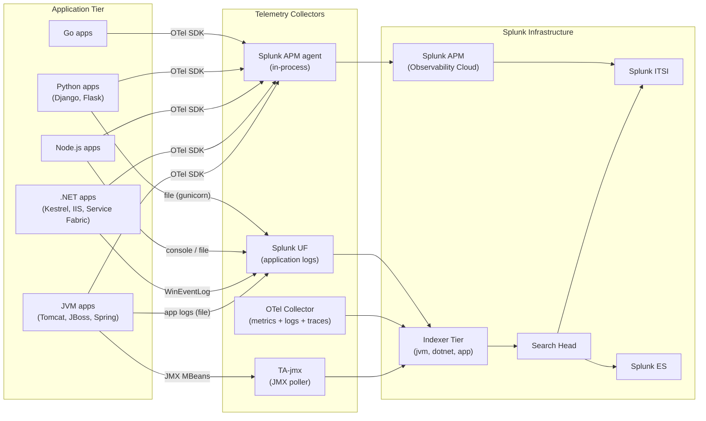

# Application Servers & Runtimes Integration Guide

> The definitive guide to monitoring application servers and runtimes
> with Splunk. 40 use cases covering JVM (Tomcat, JBoss/WildFly,
> WebLogic, WebSphere, Spring Boot), .NET (IIS-hosted, Kestrel, .NET
> 8 Core, Service Fabric), Node.js, Python, Go, and Ruby. Heap
> utilization, GC pause times, thread starvation, request rates,
> response time SLAs, error budgets, exception storms, OpenTelemetry
> traces, and full integration with Splunk APM / Observability Cloud.

---

## Table of Contents

- [Quick Start](#quick-start)
- [Overview](#overview)
- [Architecture and Data Flow](#architecture)
- [Prerequisites](#prerequisites)
- [Runtime Coverage Matrix](#runtime-matrix)
- [JVM (Tomcat, JBoss/WildFly, WebLogic, WebSphere, Spring Boot)](#jvm)
- [.NET (Kestrel, IIS, Service Fabric)](#dotnet)
- [Node.js](#nodejs)
- [Python (Django, Flask, FastAPI)](#python)
- [Go](#go)
- [OpenTelemetry — universal observability](#otel)
- [Splunk APM Integration](#splunk-apm)
- [Field Dictionary (Cross-Runtime)](#field-dictionary)
- [Sample Events](#sample-events)
- [Splunk-Side Configuration](#splunk-config)
- [Three Pillars: Metrics, Logs, Traces](#three-pillars)
- [Cross-Product Correlation](#cross-product)
- [CIM Mapping Reference](#cim-mapping)
- [Compliance Mapping](#compliance)
- [Capacity Planning and Sizing](#sizing)
- [Recommended Dashboard Layouts](#dashboards)
- [ITSI Service Modeling](#itsi)
- [SOAR Playbook Examples](#soar)
- [Multi-Site Strategy](#multi-site)
- [Security Hardening](#security-hardening)
- [Crawl / Walk / Run Roadmap](#roadmap)
- [Validation Checklist](#validation-checklist)
- [Known Limitations and Gaps](#known-limitations)
- [Troubleshooting](#troubleshooting)
- [FAQ](#faq)
- [Glossary](#glossary)
- [References](#references)
- [Contribution and Feedback](#contribution)

---

<a id="quick-start"></a>
## Quick Start — 30 Minutes to First Telemetry

> Pick the section matching your runtime. **All runtimes share the
> same end-state**: metrics + logs + (ideally) traces flow into
> Splunk Enterprise + Splunk APM, ready for golden signals dashboards
> (RED — Rate, Errors, Duration), exception storms, GC pauses, and
> ITSI services per microservice.

### JVM via JMX (fastest)

1. Install [TA-jmx (Splunkbase 2647)](https://splunkbase.splunk.com/app/2647) on a Heavy Forwarder.
2. Enable JMX on each JVM (e.g., Tomcat `bin/setenv.sh`):

    ```bash
    JAVA_OPTS="$JAVA_OPTS \
        -Dcom.sun.management.jmxremote \
        -Dcom.sun.management.jmxremote.port=9010 \
        -Dcom.sun.management.jmxremote.authenticate=true \
        -Dcom.sun.management.jmxremote.password.file=/opt/jmx/jmx.password \
        -Dcom.sun.management.jmxremote.access.file=/opt/jmx/jmx.access \
        -Dcom.sun.management.jmxremote.ssl=true"
    ```

3. Configure the TA-jmx config file `local/jmx.conf` to poll each host:

    ```xml
    <jmxpoller>
        <cluster name="prod-tomcat">
            <jmxserver host="tomcat01" jmxport="9010" username="splunk" password="<encrypted>"/>
            <jmxserver host="tomcat02" jmxport="9010" username="splunk" password="<encrypted>"/>
            <formatter type="com.dtdsoftware.splunk.formatter.JSONFormatter"/>
            <stanza name="memory" sourcetype="jmx:memory">
                <mbean objectName="java.lang:type=Memory">
                    <attribute objectName="HeapMemoryUsage"/>
                    <attribute objectName="NonHeapMemoryUsage"/>
                </mbean>
            </stanza>
            <stanza name="gc" sourcetype="jmx:gc">
                <mbean objectName="java.lang:type=GarbageCollector,name=*">
                    <attribute objectName="CollectionCount"/>
                    <attribute objectName="CollectionTime"/>
                </mbean>
            </stanza>
            <stanza name="threads" sourcetype="jmx:thread">
                <mbean objectName="java.lang:type=Threading">
                    <attribute objectName="ThreadCount"/>
                    <attribute objectName="DaemonThreadCount"/>
                </mbean>
            </stanza>
        </cluster>
    </jmxpoller>
    ```

4. Validate: `index=jvm sourcetype="jmx:*" earliest=-15m | stats count by sourcetype, host`

### Splunk OTel Collector — universal

```yaml
# /etc/otel/config.yaml
receivers:
  hostmetrics:
    collection_interval: 10s
    scrapers: { cpu: , memory: , process: }
  jmx:
    jar_path: /opt/opentelemetry-jmx-metrics.jar
    endpoint: tomcat01:9010
    target_system: tomcat

processors:
  batch:

exporters:
  splunk_hec:
    token: <HEC token>
    endpoint: https://hec.splunk.example.com:8088/services/collector
    source: otel
    sourcetype: otel:metrics
    index: app_metrics

service:
  pipelines:
    metrics:
      receivers: [hostmetrics, jmx]
      processors: [batch]
      exporters: [splunk_hec]
```

### Activate crawl tier

UC-8.2.1 (JVM heap utilization), UC-8.2.x (GC pause), UC-8.2.x (thread starvation), UC-8.2.x (response time p95).

---

<a id="overview"></a>
## Overview

### Why monitor application servers

Application servers are where business logic runs. Failures here are direct revenue impact. Without telemetry you have:

- Java OOM crashes with no warning
- .NET exception storms hidden in event logs
- Node.js memory leaks → crash → restart loop
- Slow request degradation at p99 invisible at p50

### What this guide covers

| Runtime | Use case fit |
|---------|------------|
| **JVM** | Tomcat, JBoss/WildFly, WebLogic, WebSphere, Spring Boot, Quarkus |
| **.NET** | .NET Framework 4.x, .NET Core 6/7/8, ASP.NET, Kestrel, Service Fabric |
| **Node.js** | Express, Fastify, NestJS, custom |
| **Python** | Django, Flask, FastAPI; Gunicorn, uWSGI |
| **Go** | Standard library, Gin, Echo, custom |
| **Ruby** | Rails, Puma, Unicorn |

### Domains covered

| Domain | Examples |
|--------|---------|
| **Performance** | Response time p50/p95/p99, throughput, GC pause |
| **Availability** | Process uptime, crash detection, restart loop |
| **Capacity** | Heap, CPU, thread pool exhaustion, connection pool |
| **Errors** | Exception rate, error rate %, top error types |
| **Tracing** | OTel distributed traces, span analysis |
| **Security** | OWASP-related logs (suspicious input, injection, auth fails) |

### What's NOT in scope

| Domain | Where to look |
|--------|---------------|
| **Web server (Apache, NGINX, IIS)** | [Web Servers Guide](web-servers.md) |
| **Container orchestration** | [Kubernetes Guide](kubernetes.md) |
| **End-user RUM** | Splunk Real User Monitoring |
| **Database queries** | [Relational Databases Guide](relational-databases.md) |
| **Message broker health** | [Message Queues Guide](message-queues.md) |

### What good looks like

| Dimension | Without integration | With full deployment |
|-----------|---------------------|----------------------|
| OutOfMemoryError | Crash alert from end-user | Pre-failure heap warning + auto-extension |
| Slow API endpoint | "App is slow" tickets | p99 SLA dashboard + correlation |
| Memory leak | Restart loop in prod | Sawtooth pattern detection |
| Distributed trace | "Where's the latency?" | End-to-end span analysis |
| Error budget | Manual quarterly review | Real-time SLO burn-rate alert |

---

<a id="architecture"></a>
## Architecture and Data Flow



---

<a id="prerequisites"></a>
## Prerequisites

| Item | Detail |
|------|--------|
| **Splunk version** | 9.0+ Enterprise or Cloud |
| **Splunk APM** | Observability Cloud subscription (recommended for traces) |
| **Splunk OTel Collector** | One per host or one per pod (sidecar pattern) |
| **TA-jmx** | For JVM JMX polling |
| **HEC token** | For OTel HEC exporter |

### Application-side requirements

| Runtime | Required configs |
|---------|-----------------|
| **JVM** | JMX enabled, log4j/logback configured |
| **.NET** | EventLog enabled, OTel .NET auto-instrumentation |
| **Node.js** | Winston/Pino structured logs, OTel SDK |
| **Python** | Structured logging (e.g., python-json-logger), OTel SDK |
| **Go** | Zap/Logrus, OTel SDK |

---

<a id="runtime-matrix"></a>
## Runtime Coverage Matrix

| Runtime | JMX | OTel | Splunk APM auto-inst | Logs |
|---------|-----|------|----------------------|------|
| **JVM (Tomcat, JBoss, Spring Boot)** | Native | Yes | Yes (Java agent) | log4j, logback |
| **.NET 4.x** | n/a | Partial | Yes (.NET profiler) | EventLog |
| **.NET 8 Core** | n/a | Yes | Yes (.NET 8 OTel SDK) | Serilog, NLog |
| **Node.js** | n/a | Yes | Yes (auto-instrumentation) | Winston, Pino |
| **Python** | n/a | Yes | Yes (auto-instrumentation) | python-json-logger |
| **Go** | n/a | Yes | Yes (manual via SDK) | Zap, Logrus |

---

<a id="jvm"></a>
## JVM (Tomcat, JBoss/WildFly, WebLogic, WebSphere, Spring Boot)

### JMX setup — the foundation

```bash
# JVM startup args (Tomcat example: bin/setenv.sh)
JAVA_OPTS="$JAVA_OPTS \
    -Dcom.sun.management.jmxremote \
    -Dcom.sun.management.jmxremote.port=9010 \
    -Dcom.sun.management.jmxremote.rmi.port=9011 \
    -Dcom.sun.management.jmxremote.authenticate=true \
    -Dcom.sun.management.jmxremote.password.file=/opt/jmx/jmx.password \
    -Dcom.sun.management.jmxremote.access.file=/opt/jmx/jmx.access \
    -Dcom.sun.management.jmxremote.ssl=true \
    -Dcom.sun.management.jmxremote.ssl.need.client.auth=true \
    -Dcom.sun.management.jmxremote.registry.ssl=true \
    -Djava.rmi.server.hostname=tomcat01.example.com"
```

Create `jmx.password` (mode 600 — JMX won't start if loose):

```
splunk <secret>
admin <secret>
```

And `jmx.access`:

```
splunk readonly
admin readwrite
```

### Critical JMX MBeans to poll

| MBean | What | Why |
|-------|------|-----|
| `java.lang:type=Memory` | Heap usage | UC-8.2.1 OOM prevention |
| `java.lang:type=GarbageCollector,name=*` | GC count + time | UC-8.2.x GC pause |
| `java.lang:type=Threading` | Thread count + deadlock | UC-8.2.x thread starvation |
| `java.lang:type=ClassLoading` | Loaded classes | Memory leak indicator |
| `java.lang:type=OperatingSystem` | Process CPU + load | Capacity |
| `Catalina:type=ThreadPool,name=*` | Tomcat connector pool | Connection saturation |
| `jboss.web:type=GlobalRequestProcessor,name=*` | JBoss request stats | Throughput |
| `Catalina:type=DataSource,*` | JDBC pool | DB connection saturation |
| `org.apache.activemq:type=Broker,*` | JMS depth | (if applicable) |

### Application logs — log4j / logback

```ini
# UF inputs.conf
[monitor:///var/log/tomcat/catalina*.log]
sourcetype = tomcat:catalina
index = app

[monitor:///var/log/tomcat/localhost_access_log*]
sourcetype = tomcat:access
index = web

[monitor:///opt/spring-app/logs/application.log]
sourcetype = logback:json
index = app
INDEXED_EXTRACTIONS = json
```

### Sample SPL — JVM heap trending

```spl
index=jvm sourcetype="jmx:memory" earliest=-1h
| eval heap_pct = round(HeapMemoryUsage.used / HeapMemoryUsage.max * 100, 1)
| timechart span=1m avg(heap_pct) as heap_usage by host
```

### Sample SPL — GC pause analysis

```spl
index=jvm sourcetype="jmx:gc" earliest=-1h
| stats sum(CollectionTime) as gc_time_ms, sum(CollectionCount) as gc_count by host, gc_name
| eval avg_pause_ms = round(gc_time_ms / gc_count, 2)
| where avg_pause_ms > 200   /* > 200ms pauses = STW concern */
```

### Sample SPL — Memory leak detection (sawtooth with rising floor)

```spl
index=jvm sourcetype="jmx:memory" earliest=-7d
| bin _time span=1h
| stats min(HeapMemoryUsage.used) as min_heap by _time, host
| streamstats avg(min_heap) as moving_avg window=24 by host
| eval delta_pct = round((min_heap - moving_avg) / moving_avg * 100, 2)
| where delta_pct > 10   /* baseline rising over time = leak */
```

---

<a id="dotnet"></a>
## .NET (Kestrel, IIS, Service Fabric)

### Sources

| Source | Sourcetype | Purpose |
|--------|-----------|---------|
| Windows Event Log (Application) | `dotnet:eventlog` / `WinEventLog:Application` | Exceptions, EventSource events |
| .NET app log file | `dotnet:application` | App-emitted Serilog/NLog |
| OTel .NET SDK metrics | `otel:metrics` | Memory, GC, request rate |
| OTel .NET SDK traces | `otel:traces` | Distributed tracing |

### Splunk_TA_windows for EventLog

```ini
[WinEventLog://Application]
disabled = 0
sourcetype = WinEventLog:Application
index = dotnet
checkpointInterval = 5
start_from = oldest

# Filter to .NET error sources at search time:
# index=dotnet SourceName="ASP.NET*" OR SourceName=".NET Runtime"
```

### Splunk OTel Collector for .NET

```yaml
# /etc/otel/config.yaml — .NET specific
receivers:
  prometheus:
    config:
      scrape_configs:
        - job_name: dotnet-app
          scrape_interval: 30s
          static_configs:
            - targets: ['localhost:9090']

  otlp:
    protocols:
      grpc: { endpoint: 0.0.0.0:4317 }
      http: { endpoint: 0.0.0.0:4318 }

exporters:
  splunk_hec:
    token: <HEC token>
    endpoint: https://hec.splunk.example.com:8088/services/collector
    sourcetype: otel:metrics
    index: app_metrics

service:
  pipelines:
    metrics:
      receivers: [prometheus, otlp]
      exporters: [splunk_hec]
    traces:
      receivers: [otlp]
      exporters: [splunk_hec]
```

### Auto-instrument .NET app

```bash
# Splunk OTel .NET zero-code instrumentation
curl -O https://github.com/signalfx/splunk-otel-dotnet/releases/latest/download/splunk-otel-dotnet-installer.exe
splunk-otel-dotnet-installer.exe --service-name MyApp --otel-exporter-otlp-endpoint http://otel-collector:4318
```

### Sample SPL — .NET exception trending

```spl
index=dotnet (SourceName="ASP.NET*" OR SourceName=".NET Runtime")
EventCode IN (1325, 1326, 1308) earliest=-1h
| stats count by SourceName, ExceptionType, host
| sort -count
```

### Sample SPL — IIS app pool restart

```spl
index=dotnet SourceName="WAS" EventCode=5057
| stats count, latest(_time) as last_restart by ApplicationPool
| eval hours_since_restart = round((now() - last_restart)/3600, 1)
```

---

<a id="nodejs"></a>
## Node.js

### Logging setup — Winston / Pino structured

```javascript
// app.js — Winston example
const winston = require('winston');
const logger = winston.createLogger({
    level: 'info',
    format: winston.format.json(),
    defaultMeta: { service: 'my-service', version: process.env.APP_VERSION },
    transports: [
        new winston.transports.File({ filename: '/var/log/myapp/app.log' }),
    ],
});

logger.info({ msg: 'request', method: 'GET', path: '/api/users', duration_ms: 23 });
```

### UF inputs.conf

```ini
[monitor:///var/log/myapp/*.log]
sourcetype = nodejs:winston
index = nodejs
INDEXED_EXTRACTIONS = json
```

### OTel auto-instrumentation

```bash
# Install Splunk OTel Node.js SDK
npm install @splunk/otel @opentelemetry/api

# Run with auto-instrumentation
node --require @splunk/otel/instrument app.js
```

### Sample SPL — Node.js event loop lag

```spl
index=app_metrics sourcetype="otel:metrics" metric_name="nodejs_eventloop_lag_seconds"
| stats max(value) as max_lag by host
| where max_lag > 0.05
```

### Sample SPL — uncaught exception storm

```spl
index=nodejs level=error msg="*uncaught*" OR msg="*unhandled*"
| stats count by error_message, service
| sort -count
```

---

<a id="python"></a>
## Python (Django, Flask, FastAPI)

### Logging setup — structured JSON

```python
import logging, json_log_formatter
formatter = json_log_formatter.JSONFormatter()
handler = logging.FileHandler('/var/log/myapp/app.log')
handler.setFormatter(formatter)
logger = logging.getLogger('myapp')
logger.addHandler(handler)
logger.setLevel(logging.INFO)
```

### Gunicorn access log

```ini
# gunicorn.conf.py
accesslog = '/var/log/gunicorn/access.log'
errorlog = '/var/log/gunicorn/error.log'
access_log_format = '%(h)s %(l)s %(u)s %(t)s "%(r)s" %(s)s %(b)s "%(f)s" "%(a)s" %(D)s'
```

### UF inputs.conf

```ini
[monitor:///var/log/myapp/app.log]
sourcetype = python:django
index = python_apps
INDEXED_EXTRACTIONS = json

[monitor:///var/log/gunicorn/access.log]
sourcetype = python:gunicorn
index = python_apps
```

### OTel auto-instrumentation

```bash
pip install splunk-opentelemetry[all]

# Run with auto-instrumentation
opentelemetry-instrument --service_name my-service \
    --exporter_otlp_endpoint http://otel-collector:4318 \
    gunicorn myapp.wsgi:application
```

### Sample SPL — Django 500 errors

```spl
index=python_apps level=ERROR earliest=-1h
| stats count by exception_type, view, request_path
| sort -count
```

---

<a id="go"></a>
## Go

### Logging setup — Zap

```go
import "go.uber.org/zap"
logger, _ := zap.NewProduction()
logger.Info("request",
    zap.String("method", "GET"),
    zap.String("path", "/api/users"),
    zap.Int("duration_ms", 23),
)
```

### OTel auto-instrumentation

```bash
go get github.com/signalfx/splunk-otel-go
```

```go
import "github.com/signalfx/splunk-otel-go/distro"
sdk, _ := distro.Run()
defer sdk.Shutdown(context.Background())
```

---

<a id="otel"></a>
## OpenTelemetry — universal observability

OTel is the **vendor-neutral standard** for application telemetry. Splunk OTel Collector is a fork with first-class Splunk integration.

### Why OTel?

- One API for metrics + logs + traces
- Vendor-neutral instrumentation
- Auto-instrumentation for major frameworks
- Single collector → multiple backends (Splunk + Prometheus + Jaeger)

### Splunk OTel Collector deployment

```yaml
# /etc/otel/config.yaml
receivers:
  hostmetrics:
    collection_interval: 10s
    scrapers:
      cpu:
      memory:
      disk:
      load:
      filesystem:
      network:
      process:
  jmx:
    jar_path: /opt/opentelemetry-jmx-metrics.jar
    endpoint: localhost:9010
    target_system: tomcat,jvm
    collection_interval: 10s
  otlp:
    protocols:
      grpc: { endpoint: 0.0.0.0:4317 }
      http: { endpoint: 0.0.0.0:4318 }
  filelog:
    include: [ '/var/log/myapp/*.log' ]
    operators:
      - type: json_parser

processors:
  batch:
    send_batch_size: 10000
    timeout: 10s
  resourcedetection:
    detectors: [ env, system, ec2, gcp, azure ]
  attributes:
    actions:
      - key: deployment.environment
        value: production
        action: upsert

exporters:
  splunk_hec/metrics:
    token: <HEC token>
    endpoint: https://hec.splunk.example.com:8088/services/collector
    sourcetype: otel:metrics
    source: otel-collector
    index: app_metrics
  splunk_hec/logs:
    token: <HEC token>
    endpoint: https://hec.splunk.example.com:8088/services/collector
    sourcetype: otel:logs
    source: otel-collector
    index: app
  splunk_hec/traces:
    token: <HEC token>
    endpoint: https://hec.splunk.example.com:8088/services/collector
    sourcetype: otel:traces
    source: otel-collector
    index: app

service:
  pipelines:
    metrics:
      receivers: [hostmetrics, jmx, otlp]
      processors: [resourcedetection, attributes, batch]
      exporters: [splunk_hec/metrics]
    logs:
      receivers: [filelog, otlp]
      processors: [resourcedetection, attributes, batch]
      exporters: [splunk_hec/logs]
    traces:
      receivers: [otlp]
      processors: [resourcedetection, attributes, batch]
      exporters: [splunk_hec/traces]
```

---

<a id="splunk-apm"></a>
## Splunk APM Integration

For full distributed tracing + service map + DB span analysis, send traces to **Splunk APM** (Splunk Observability Cloud<sup class="ref">[<a href="#ref-10">10</a>]</sup>):

```yaml
exporters:
  sapm:
    access_token: <Splunk Observability access token>
    endpoint: https://ingest.<realm>.signalfx.com/v2/trace
    num_workers: 8
```

OR send to both Splunk Enterprise (search/correlation) AND APM (trace UI).

---

<a id="field-dictionary"></a>
## Field Dictionary (Cross-Runtime)

| Field | JVM (JMX) | .NET | Node.js | Python | OTel |
|-------|----------|------|---------|--------|------|
| `service` | (set in jmx.conf) | EventLog SourceName | logger meta | logger meta | service.name |
| `host` | hostname | hostname | os.hostname() | socket.gethostname() | host.name |
| `level` | n/a | EventCode → mapped | level | levelname | severity_text |
| `error_message` | n/a | Message | error.message | exception_type | exception.message |
| `duration_ms` | (custom) | (custom) | duration_ms | (custom) | duration_ns/1e6 |
| `heap_used` | HeapMemoryUsage.used | (custom counter) | process.memoryUsage().heapUsed | psutil | process.memory.usage |
| `gc_pause_ms` | CollectionTime | GCTime metric | gc-stats lib | gc.callbacks | jvm.gc.pause |

---

<a id="sample-events"></a>
## Sample Events

(See per-runtime sections.)

---

<a id="splunk-config"></a>
## Splunk-Side Configuration

### Index strategy

```ini
[app]
homePath = $SPLUNK_DB/app/db
maxDataSize = auto_high_volume
frozenTimePeriodInSecs = 7776000

[jvm]
homePath = $SPLUNK_DB/jvm/db
maxDataSize = auto_high_volume
frozenTimePeriodInSecs = 7776000

[app_metrics]
# Use Splunk metrics index for OTel metrics
homePath = $SPLUNK_DB/app_metrics/db
datatype = metric
maxDataSize = auto_high_volume
frozenTimePeriodInSecs = 7776000
```

---

<a id="three-pillars"></a>
## Three Pillars: Metrics, Logs, Traces

| Pillar | Source | Splunk index |
|--------|--------|--------------|
| **Metrics** | OTel hostmetrics + JMX + Prometheus scrape | `app_metrics` (datatype=metric) |
| **Logs** | UF file monitor (json) + OTel filelog | `app`, `jvm`, `dotnet` |
| **Traces** | OTel SDK / Splunk APM agent | `app` (HEC) + Splunk APM |

---

<a id="cross-product"></a>
## Cross-Product Correlation

### App + Web Server (root cause of slow request)

```spl
(index=jvm sourcetype="logback:json" trace_id=*)
OR (index=web sourcetype="access_combined")
| transaction trace_id maxspan=10s
```

### App + Database (slow query attribution)

```spl
(index=app sourcetype="otel:traces" service=order-service)
OR (index=database sourcetype="mssql:query" duration_ms>1000)
| transaction trace_id maxspan=5s
```

### App + Message Queue (lag impact on app)

```spl
(index=jvm sourcetype="jmx:memory")
OR (index=kafka sourcetype="kafka:consumer_lag")
| eval host=coalesce(host, broker)
| stats values(consumer_lag) as lag, values(heap_pct) as heap by host, _time
```

---

<a id="cim-mapping"></a>
## CIM Mapping Reference

| CIM model | Sourcetype | Auto-mapped? |
|-----------|-----------|--------------|
| **Performance** | `jmx:*`, `otel:metrics` | Partial |
| **Application_State** | n/a | Custom datamodel (recommended) |
| **Web** | `tomcat:access` | Yes |

---

<a id="compliance"></a>
## Compliance Mapping

### NIST 800-53

| Control | Coverage |
|---------|----------|
| **AU-2/12** Audit | Application logs |
| **SI-4** System monitoring | Heap, GC, error rate |
| **CM-6** Configuration baselines | Config inventory tracking |

### OWASP Top 10

| Risk | Detection via app logs |
|------|----------------------|
| **A01 Broken access control** | 403 burst on protected endpoints |
| **A03 Injection** | Stacktrace patterns, suspicious params |
| **A09 Logging failures** | Lack of log volume = compromise indicator |

### PCI-DSS

| Requirement | Coverage |
|-------------|----------|
| **10.2.x** Audit | Application audit logs |
| **6.4.x** Change control | Deploy event tracking |

---

<a id="sizing"></a>
## Capacity Planning and Sizing

### Per-app daily ingest

| Component | Daily ingest |
|-----------|-------------|
| JMX (poll every 60s) | ~10 MB / JVM / day |
| Application log (typical) | ~500 MB - 5 GB / app / day |
| OTel metrics (10s interval) | ~100 MB / host / day |
| OTel traces (1% sampling) | ~50 MB - 500 MB / service / day |

### Retention

| Data | Retention | Rationale |
|------|-----------|-----------|
| Metrics | 90 days | Capacity trending |
| Application logs | 90 days | Investigation |
| Traces | 30 days | Trace UI in APM |
| Audit logs | 1 year+ | Compliance |

---

<a id="dashboards"></a>
## Recommended Dashboard Layouts

### Crawl — "Application Golden Signals"

```
+---------------------+---------------------+
| RATE (req/s) per service                   |
+---------------------+---------------------+
| ERROR RATE % per service                   |
+---------------------+---------------------+
| DURATION p95 / p99 per service             |
+---------------------+---------------------+
| SATURATION (heap, threads, queue)          |
+---------------------+---------------------+
```

### Walk — "Performance Deep-Dive"

```
+---------------------+---------------------+
| GC PAUSE TREND                             |
+---------------------+---------------------+
| TOP SLOW ENDPOINTS                         |
+---------------------+---------------------+
| THREAD POOL UTILIZATION                    |
+---------------------+---------------------+
| TOP EXCEPTION TYPES                        |
+---------------------+---------------------+
```

### Run — "SLO / Error Budget"

```
+---------------------+---------------------+
| SLO BURN RATE (% of error budget consumed) |
+---------------------+---------------------+
| ERROR BUDGET REMAINING (28-day window)     |
+---------------------+---------------------+
| TRACE WATERFALL (slowest spans)            |
+---------------------+---------------------+
| DEPLOY EVENTS OVERLAY                      |
+---------------------+---------------------+
```

---

<a id="itsi"></a>
## ITSI Service Modeling

### Service hierarchy

```
Application Tier
├── Per-Service entities
│   ├── order-service (3 instances)
│   ├── payment-service (5 instances)
│   ├── user-service (4 instances)
│   └── ...
├── Shared Runtime
│   ├── JVM cluster A
│   └── .NET cluster B
└── External dependencies
    ├── Database (cat 7.1)
    ├── Cache (Redis)
    └── Message queues (cat 8.3)
```

### Recommended KPIs per service

| KPI | Source | Threshold |
|-----|--------|-----------|
| Request rate | OTel metrics | Adaptive |
| Error rate % | logs / traces | Static (page > 1%) |
| Response time p95 | OTel traces | Adaptive (SLO-aligned) |
| Heap utilization | JMX | Static (warn 75%, page 85%) |
| GC pause p99 | JMX | Static (warn > 200 ms) |
| Thread pool saturation | JMX | Static (warn > 80%) |

---

<a id="soar"></a>
## SOAR Playbook Examples

### Playbook 1: OOM Approaching

**Trigger:** UC-8.2.1 — heap > 85% sustained 5 min.

```
1. RECEIVE alert (service, instance, heap_pct, gc_count)
2. AUTO-CAPTURE heap dump via JMX (jstack/jmap or HeapDumpOnOutOfMemoryError)
3. AUTO-ROLL pod via K8s if cloud-native
4. CREATE Sev-2 ticket; attach heap dump
5. NOTIFY app owner
```

### Playbook 2: Exception Storm

**Trigger:** Error rate > 100/min for any service.

```
1. RECEIVE alert (service, top_exception_type, error_count)
2. CHECK recent deploys (deploy events index)
3. ROLLBACK deploy via CI/CD if correlation found
4. PAGE app team on-call
5. CREATE incident ticket
```

### Playbook 3: SLO Burn-Rate Alert

**Trigger:** 1h burn rate > 10× sustained 1h.

```
1. RECEIVE alert (service, slo_target, current_error_rate)
2. AUTO-DRAIN traffic from affected instance via load balancer
3. PAGE app team on-call
4. CREATE Sev-1 if business-critical service
```

---

<a id="multi-site"></a>
## Multi-Site Strategy

For globally-distributed apps:

- **Per-region OTel collectors** with HEC export to local indexer
- **Per-region indexes** (`app_emea`, `app_amer`, `app_apac`)
- **Splunk APM accepts traces** from all regions natively
- **ITSI federated services** for global service-level dashboards

---

<a id="security-hardening"></a>
## Security Hardening

- JMX over TLS + mutual auth (enforce — never plaintext)
- OTel collector TLS for OTLP receivers
- HEC tokens scoped per-app/source
- Application logs may contain PII / PCI / PHI → Splunk role-based field masking
- OTel traces may contain sensitive request bodies → use OTel attribute processors to strip

---

<a id="roadmap"></a>
## Crawl / Walk / Run Roadmap

### Crawl (Week 1–2)

1. Stand up OTel Collector
2. JMX TA on first JVM cluster
3. UF for application log files
4. Golden signals dashboard

### Walk (Week 3–6)

1. OTel auto-instrumentation across runtimes
2. CIM Performance acceleration
3. ITSI per-service services
4. Top slow endpoints dashboard

### Run (Month 2+)

1. Splunk APM full deployment
2. SLO + error budget framework
3. Cross-product correlation
4. SOAR playbooks

---

<a id="validation-checklist"></a>
## Validation Checklist

### Day 1

- [ ] First app sending logs
- [ ] JMX TA + first JVM connected (or OTel Collector)
- [ ] Golden signals dashboard live

### Day 7

- [ ] All major services onboarded
- [ ] OTel auto-instrumentation deployed
- [ ] Threshold alerts wired

### Day 30

- [ ] APM full integration
- [ ] ITSI per-service services
- [ ] SLO definitions

### Day 90

- [ ] Error budget framework live
- [ ] SOAR playbooks
- [ ] Compliance audit reports

---

<a id="known-limitations"></a>
## Known Limitations and Gaps

| Limitation | Impact | Workaround |
|------------|--------|------------|
| **JMX RMI port firewall complexity** | Connectivity issues | Use jmxremote.rmi.port = same as jmxremote.port |
| **TA-jmx not officially Cloud-vetted (verify version)** | Cloud install issue | Validate latest cloud compatibility |
| **OTel collector resource overhead** | CPU on host | Tune batch + sampling |
| **Trace sampling reduces fidelity** | Missing rare errors | Use error-aware sampling |
| **.NET Framework 3.5 not OTel-supported** | No traces | Manual app metric counters |
| **High-cardinality custom metrics** | Metric explosion | Limit cardinality at SDK level |

---

<a id="troubleshooting"></a>
## Troubleshooting

### JMX connection refused

```bash
# Test connectivity
telnet tomcat01 9010
# Or jconsole
jconsole tomcat01:9010
```

- Check firewall rules
- Verify `jmx.password` permissions (must be 600)
- Check `java.rmi.server.hostname` is reachable

### OTel collector not exporting

```bash
# Check OTel collector logs
journalctl -u otel-collector -f
```

- Verify HEC endpoint reachable: `curl -k -H "Authorization: Splunk <token>" https://hec.splunk.example.com:8088/services/collector/health`
- Check token validity in Splunk Web

### .NET EventLog noise

- Filter at search-time: `index=dotnet SourceName="ASP.NET*" OR SourceName=".NET Runtime"`
- Or filter at UF: use `whitelist` in inputs.conf

### CIM Performance returns nothing

- Map JMX fields to Performance.* via TA-jmx props.conf
- Check acceleration completed

---

<a id="faq"></a>
## FAQ

**Q: Should I use OTel or per-runtime SDKs?**
A: OTel — it's vendor-neutral, supports all major runtimes, and Splunk OTel Collector is the standard.

**Q: Can I send traces to Splunk Enterprise?**
A: Yes via OTel HEC exporter, but Splunk APM is much better for trace UI/analysis. Use both.

**Q: How do I handle sensitive data in traces?**
A: Use OTel attribute processors to redact / hash sensitive fields before export.

**Q: What's the minimum overhead of OTel auto-instrumentation?**
A: Typically 1-5% CPU. Verify in your environment with load tests.

**Q: Can I correlate JVM heap with K8s pod restarts?**
A: Yes — combine JMX heap data with K8s event log (`index=kubernetes`) by hostname/pod.

**Q: How do I detect a memory leak?**
A: Sawtooth pattern with rising baseline (see SPL above). Or compare 7-day baseline vs current.

---

<a id="glossary"></a>
## Glossary

| Term | Definition |
|------|-----------|
| **JVM** | Java Virtual Machine |
| **JMX** | Java Management Extensions (introspection API) |
| **MBean** | Managed Bean (JMX-managed object) |
| **GC** | Garbage Collection |
| **STW** | Stop-the-world GC pause |
| **OOM** | Out of Memory |
| **CLR** | Common Language Runtime (.NET) |
| **APM** | Application Performance Monitoring |
| **OTel** | OpenTelemetry |
| **Span** | Single operation in a distributed trace |
| **Trace** | End-to-end request flow across services |
| **SLO / SLI / SLA** | Service Level Objective / Indicator / Agreement |
| **Error budget** | Allowed unreliability before SLO breach |
| **RED** | Rate, Errors, Duration golden signals |
| **USE** | Utilization, Saturation, Errors |

---

<a id="references"></a>
## References

- [TA-jmx (Splunkbase 2647)](https://splunkbase.splunk.com/app/2647)
- [Splunk OpenTelemetry Collector](https://github.com/signalfx/splunk-otel-collector)
- [Splunk APM docs](https://docs.splunk.com/observability/apm/)
- [Splunk OTel .NET](https://github.com/signalfx/splunk-otel-dotnet)
- [Splunk OTel Java](https://github.com/signalfx/splunk-otel-java)
- [Splunk OTel Node.js](https://github.com/signalfx/splunk-otel-js)
- [Splunk OTel Python](https://github.com/signalfx/splunk-otel-python)
- [OpenTelemetry spec](https://opentelemetry.io/docs/specs/)

---

<a id="contribution"></a>
## Contribution and Feedback

Part of the [Splunk Monitoring Use Cases](https://github.com/fenre/splunk-monitoring-use-cases) project. [Open an issue](https://github.com/fenre/splunk-monitoring-use-cases/issues/new).

---

*Last updated: 2026-05-09. Covers TA-jmx 1.x, Splunk OTel Collector 0.110+, Splunk APM.*

---

<!-- BEGIN-AUTOGENERATED-SOURCES -->

## References

*Auto-generated by `scripts/generate_doc_references.py` from `data/source-references.json` and `data/source-mappings.json`. Edit those files (or the document body) to change citations; this footer is rewritten on every run.*

### Primary sources

<a id="ref-1"></a>**[1]** Splunk Inc. (2026). *Splunk Common Information Model Add-on Manual*. Splunk LLC, a Cisco company. Retrieved May 11, 2026, from https://docs.splunk.com/Documentation/CIM

### Supporting sources

<a id="ref-2"></a>**[2]** International Organization for Standardization. (2022). *ISO/IEC 27001:2022 — Information security, cybersecurity and privacy protection — Information security management systems — Requirements*. ISO/IEC. ISO/IEC 27001:2022. https://www.iso.org/standard/27001

<a id="ref-3"></a>**[3]** National Institute of Standards and Technology. (2020). *Security and Privacy Controls for Information Systems and Organizations* (Revision 5). U.S. Department of Commerce. NIST SP 800-53 Rev. 5. https://csrc.nist.gov/pubs/sp/800/53/r5/upd1/final

<a id="ref-4"></a>**[4]** OpenTelemetry Authors. (2026). *OpenTelemetry Specification*. Cloud Native Computing Foundation. Retrieved May 11, 2026, from https://opentelemetry.io/docs/specs/otel/

<a id="ref-5"></a>**[5]** OWASP Foundation. (2026). *OWASP Cheat Sheet Series*. OWASP Foundation, Inc. Retrieved May 11, 2026, from https://cheatsheetseries.owasp.org/

<a id="ref-6"></a>**[6]** OWASP Foundation. (2021). *OWASP Top 10:2021 — The Ten Most Critical Web Application Security Risks*. OWASP Foundation, Inc. Retrieved May 11, 2026, from https://owasp.org/Top10/

<a id="ref-7"></a>**[7]** Public Company Accounting Oversight Board. (2007). *Auditing Standard 2201 — An Audit of Internal Control Over Financial Reporting*. PCAOB. PCAOB AS 2201. https://pcaobus.org/oversight/standards/auditing-standards/details/AS2201

<a id="ref-8"></a>**[8]** Splunk Inc. (2026). *Splunk Application Performance Monitoring Documentation*. Splunk LLC, a Cisco company. Retrieved May 11, 2026, from https://docs.splunk.com/observability/en/apm/intro-to-apm.html

<a id="ref-9"></a>**[9]** Splunk Inc. (2026). *Splunk Distribution of the OpenTelemetry Collector*. Splunk LLC, a Cisco company. Retrieved May 11, 2026, from https://docs.splunk.com/observability/en/gdi/opentelemetry/opentelemetry.html

<a id="ref-10"></a>**[10]** Splunk Inc. (2026). *Splunk Observability Cloud Documentation*. Splunk LLC, a Cisco company. Retrieved May 11, 2026, from https://docs.splunk.com/observability/en/

<a id="ref-11"></a>**[11]** U.S. Congress. (2002). *Sarbanes-Oxley Act of 2002 — Public Company Accounting Reform and Investor Protection Act*. U.S. Government. Pub. L. 107–204. https://www.sec.gov/about/laws/soa2002.pdf

<a id="ref-12"></a>**[12]** U.S. Department of Health & Human Services. (2002). *HIPAA Privacy Rule (45 CFR Parts 160 and 164, Subparts A and E)*. Office for Civil Rights, HHS. 45 CFR 160, 164. https://www.hhs.gov/hipaa/for-professionals/privacy/index.html

<a id="ref-13"></a>**[13]** U.S. Department of Health & Human Services. (2013). *HIPAA Security Rule (45 CFR Parts 160 and 164, Subparts A and C)*. Office for Civil Rights, HHS. 45 CFR 160, 164. https://www.hhs.gov/hipaa/for-professionals/security/index.html

<a id="ref-14"></a>**[14]** Wilkie, T. (2018, April). *Monitoring Microservices The RED Way*. Grafana Labs (originally Weaveworks Engineering Blog). https://grafana.com/blog/2018/08/02/the-red-method-how-to-instrument-your-services/

<details>
<summary>Additional online sources cited in the document body (10)</summary>

<a id="ref-15"></a>**[15]** splunkbase.splunk.com. *TA-jmx (Splunkbase 2647)*. Retrieved May 11, 2026, from https://splunkbase.splunk.com/app/2647

<a id="ref-16"></a>**[16]** github.com. *Splunk OpenTelemetry Collector*. Retrieved May 11, 2026, from https://github.com/signalfx/splunk-otel-collector

<a id="ref-17"></a>**[17]** docs.splunk.com. *Splunk APM docs*. Retrieved May 11, 2026, from https://docs.splunk.com/observability/apm/

<a id="ref-18"></a>**[18]** github.com. *Splunk OTel .NET*. Retrieved May 11, 2026, from https://github.com/signalfx/splunk-otel-dotnet

<a id="ref-19"></a>**[19]** github.com. *Splunk OTel Java*. Retrieved May 11, 2026, from https://github.com/signalfx/splunk-otel-java

<a id="ref-20"></a>**[20]** github.com. *Splunk OTel Node.js*. Retrieved May 11, 2026, from https://github.com/signalfx/splunk-otel-js

<a id="ref-21"></a>**[21]** github.com. *Splunk OTel Python*. Retrieved May 11, 2026, from https://github.com/signalfx/splunk-otel-python

<a id="ref-22"></a>**[22]** opentelemetry.io. *OpenTelemetry spec*. Retrieved May 11, 2026, from https://opentelemetry.io/docs/specs/

<a id="ref-23"></a>**[23]** github.com. *Splunk Monitoring Use Cases*. Retrieved May 11, 2026, from https://github.com/fenre/splunk-monitoring-use-cases

<a id="ref-24"></a>**[24]** github.com. *Open an issue*. Retrieved May 11, 2026, from https://github.com/fenre/splunk-monitoring-use-cases/issues/new

</details>

### Related repository documents

- [`docs/guides/kubernetes.md`](kubernetes.md)
- [`docs/guides/message-queues.md`](message-queues.md)
- [`docs/guides/relational-databases.md`](relational-databases.md)
- [`docs/guides/web-servers.md`](web-servers.md)

### Cited by

- [`docs/guides/ai-llm-observability.md`](ai-llm-observability.md)
- [`docs/guides/api-gateways.md`](api-gateways.md)
- [`docs/guides/datacenter-fabric-sdn.md`](datacenter-fabric-sdn.md)
- [`docs/guides/message-queues.md`](message-queues.md)
- [`docs/guides/splunk-observability-cloud.md`](splunk-observability-cloud.md)

<!-- END-AUTOGENERATED-SOURCES -->
