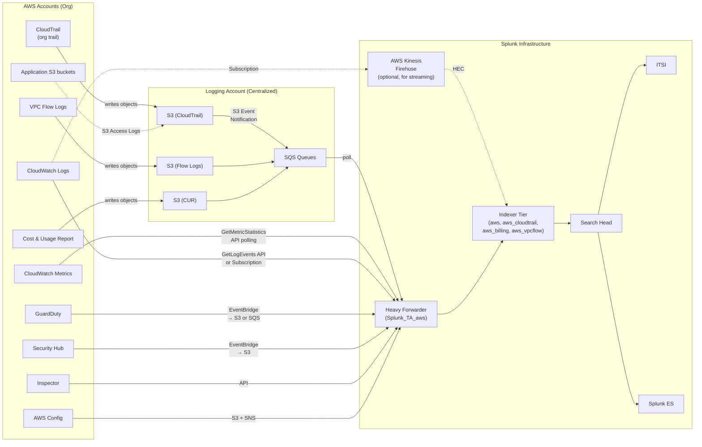

# Amazon Web Services (AWS) Integration Guide

> The definitive guide to monitoring AWS with Splunk. 77 use cases spanning
> CloudTrail audit, IAM, EC2/EKS/RDS, S3, VPC Flow Logs, Lambda, GuardDuty,
> Security Hub, Inspector, Config, Cost & Usage, and the AWS control plane.
> Everything you need to operationalise the Splunk Add-on for AWS at scale.

---

## Table of Contents

- [Quick Start](#quick-start)
- [Overview and What Good Looks Like](#overview)
- [Architecture and Data Flow](#architecture)
- [Prerequisites](#prerequisites)
- [Data Sources Reference](#data-sources)
- [Field Dictionary](#field-dictionary)
- [Sample Events](#sample-events)
- [TA Configuration (Step-by-Step)](#ta-configuration)
- [SQS-Based S3 Inputs (CloudTrail, VPC Flow Logs)](#sqs-s3)
- [CloudWatch Logs Subscriptions](#cw-logs)
- [Cost and Usage Reports (CUR)](#cur)
- [GuardDuty, Security Hub, Inspector, Config](#security-services)
- [Multi-Account / Multi-Region Strategy](#multi-account)
- [Cross-Product Correlation](#cross-product-correlation)
- [CIM Mapping Reference](#cim-mapping)
- [Compliance Mapping](#compliance-mapping)
- [Capacity Planning and Sizing](#sizing)
- [Recommended Dashboard Layouts](#dashboards)
- [ITSI Service Modeling](#itsi)
- [SOAR Playbook Examples](#soar)
- [Security Hardening](#security-hardening)
- [Crawl / Walk / Run Roadmap](#roadmap)
- [Validation Checklist](#validation-checklist)
- [Known Limitations and Gaps](#known-limitations)
- [Troubleshooting](#troubleshooting)
- [FAQ](#faq)
- [Glossary](#glossary)
- [References](#references)
- [Contribution and Feedback](#contribution)

---

<a id="quick-start"></a>
## Quick Start — 60 Minutes to Audit-Grade CloudTrail

For platform engineers who want CloudTrail flowing into Splunk and a working detection within an hour:

1. **Enable an organisation-wide CloudTrail** — In AWS Organizations management account, create a CloudTrail trail at the organisation level. Destination: a dedicated S3 bucket (e.g. `acme-cloudtrail-logs-prod`) with a 7-year lifecycle policy.

2. **Configure SQS notifications on the bucket** — On the S3 bucket, add an event notification: every `s3:ObjectCreated:*` → SQS queue (`splunk-cloudtrail-q`). This is the SQS-based S3 input pattern that scales to multi-TB/day ingestion.

3. **Create the IAM role for Splunk** — In the AWS account hosting the S3 bucket:

   ```json
   {
     "Version": "2012-10-17",
     "Statement": [
       {
         "Effect": "Allow",
         "Action": ["sqs:ReceiveMessage", "sqs:DeleteMessage", "sqs:GetQueueAttributes"],
         "Resource": "arn:aws:sqs:us-east-1:123456789012:splunk-cloudtrail-q"
       },
       {
         "Effect": "Allow",
         "Action": ["s3:GetObject", "s3:ListBucket"],
         "Resource": [
           "arn:aws:s3:::acme-cloudtrail-logs-prod",
           "arn:aws:s3:::acme-cloudtrail-logs-prod/*"
         ]
       }
     ]
   }
   ```

   Trust policy: allow your Splunk account / EC2 instance role to assume.

4. **Install the Splunk Add-on for AWS** ([Splunkbase 1876](https://splunkbase.splunk.com/app/1876)) on a Heavy Forwarder. The TA does not run on Universal Forwarders.

5. **Configure the SQS-based S3 input** via the TA setup UI:
   - **Input type**: SQS-Based S3
   - **AWS Account**: configure with role ARN (or access key)
   - **SQS queue**: `https://sqs.us-east-1.amazonaws.com/123456789012/splunk-cloudtrail-q`
   - **Sourcetype**: `aws:cloudtrail`
   - **Index**: `aws_cloudtrail`

6. **Verify** within 5 minutes:

   ```spl
   index=aws_cloudtrail sourcetype=aws:cloudtrail | stats count by eventSource
   ```

   You should see CloudTrail events from `iam.amazonaws.com`, `ec2.amazonaws.com`, `s3.amazonaws.com`, etc.

7. **Activate your first detection** — Deploy UC-4.1.2 (Root account usage) — fires when `userIdentity.type=Root` is observed.

**Stuck?** Jump to [Troubleshooting](#troubleshooting).

---

<a id="overview"></a>
## Overview and What Good Looks Like

### What `Splunk_TA_aws` collects

The Splunk Add-on for AWS is a multi-service collector with 14 input types:

| Input type | Sourcetype | Use |
|------------|-----------|-----|
| **SQS-Based S3** | configurable; commonly `aws:cloudtrail`, `aws:cloudwatchlogs:vpcflow`, `aws:s3:accesslogs` | Scalable S3 object ingestion via SQS notifications |
| **Generic S3** | configurable | One-off / non-SQS S3 buckets |
| **Incremental S3** | configurable | Reads new objects since last run (legacy; prefer SQS) |
| **CloudTrail** | `aws:cloudtrail` | Direct CloudTrail SNS/SQS subscription (legacy; prefer SQS-Based S3) |
| **CloudWatch** | `aws:cloudwatch:metric` | Metric polling via CloudWatch GetMetricStatistics API |
| **CloudWatch Logs** | `aws:cloudwatchlogs` | Pull CloudWatch log groups via API (no streaming; prefer Subscription Filters) |
| **CloudWatch Logs VPC Flow** | `aws:cloudwatchlogs:vpcflow` | Specifically for VPC Flow Logs in CloudWatch |
| **Description** | `aws:description` | Inventory polling — EC2, RDS, S3, IAM, Lambda inventory |
| **Config** | `aws:config` | AWS Config snapshots |
| **Config Rule** | `aws:config:rule` | Config rule evaluations |
| **Inspector** | `aws:inspector` | EC2/ECR vulnerability findings |
| **Inspector v2** | `aws:inspector:v2` | Modern Inspector findings |
| **Kinesis** | `aws:kinesis` | Real-time stream ingestion |
| **Billing/CUR** | `aws:billing`, `aws:billing:cur` | Cost and Usage Reports from S3 |

### Why integrate with Splunk?

| Capability | AWS Console / CloudWatch | Splunk + Splunk_TA_aws |
|------------|-------------------------|------------------------|
| CloudTrail event search | Athena (SQL only, slow) | Splunk: instant, with ES correlation |
| Cross-account / cross-region | Manual aggregation | Single pane via `aws_account_id`, `region` |
| Long-term audit retention | S3 (no search) | Splunk: 7-year audit retention with search |
| Compliance evidence | Manual export from Athena | Auditor-ready saved searches |
| GuardDuty triage | GuardDuty Console | Splunk: correlated with CloudTrail, VPC Flow, IAM |
| Cost optimization | Cost Explorer (24h delay) | Splunk: hourly CUR, multi-account anomaly detection |
| Service-level monitoring | CloudWatch dashboards (per-account) | Splunk ITSI cross-account |
| SOAR auto-remediation | Lambda + Step Functions | Splunk SOAR with native AWS connectors |

### Who should read this guide?

| Role | Relevant sections |
|------|-------------------|
| **Cloud platform / SRE** | Quick Start, TA Configuration, Multi-Account, Sizing |
| **Security operations (CloudSec)** | Security Services, GuardDuty, Compliance Mapping |
| **Compliance / audit** | Compliance Mapping, Validation Checklist, CUR |
| **FinOps / cost optimisation** | CUR, Cost-related UCs |
| **Splunk architecture** | Architecture, Sizing, Multi-Account |

### What good looks like

| Dimension | Before integration | After full deployment |
|-----------|-------------------|-----------------------|
| **CloudTrail search** | Athena query (5–60s) | Splunk: < 5s |
| **Multi-account view** | Per-account console | Single SPL with `aws_account_id` filter |
| **Root account usage** | Email from CloudTrail | Real-time alert (UC-4.1.2) |
| **GuardDuty triage** | Manual investigation | Auto-correlated with CloudTrail / VPC Flow (UC-4.1.8) |
| **VPC Flow Log analysis** | Athena queries | Splunk dashboards (UC-4.1.9) |
| **Cost anomalies** | Monthly bill shock | Daily anomaly detection (UC-4.1.14, .20) |
| **Compliance evidence** | Manual report assembly | Real-time scorecard with retention |

---

<a id="architecture"></a>
## Architecture and Data Flow



**Key collection patterns:**

1. **SQS-based S3 (preferred for log files)** — CloudTrail, VPC Flow Logs, S3 access logs, ELB access logs, CUR all land in S3. S3 Event Notifications publish to SQS. The TA polls SQS, retrieves the objects, and indexes them. **This is the scalable pattern** for multi-TB/day environments.

2. **CloudWatch Metrics (polling)** — The TA calls `GetMetricStatistics` per metric/dimension. Suitable for hundreds–thousands of metrics; for very high cardinality, use Splunk Observability Cloud or stream via Firehose.

3. **CloudWatch Logs Subscription Filter → Kinesis Firehose → HEC** — For streaming log groups (Lambda, custom apps, CloudWatch metric streams). Lower latency than polling.

4. **Description (inventory)** — Periodically calls `Describe*` APIs to snapshot EC2 instances, RDS clusters, IAM users, Lambda functions, etc. Useful for asset inventory and drift detection.

5. **EventBridge rule → S3/SQS for security services** — GuardDuty, Security Hub findings flow via EventBridge to S3 (then SQS-based S3 input).

For most production deployments, the dominant pattern is: SQS-based S3 for CloudTrail and VPC Flow Logs + CloudWatch metric polling for service KPIs + EventBridge → S3 for GuardDuty/Security Hub findings.

---

<a id="prerequisites"></a>
## Prerequisites

### AWS requirements

| Requirement | Detail |
|-------------|--------|
| **CloudTrail** | Enabled in all regions (org trail recommended). Multi-region trail. |
| **CloudTrail event types** | Management events at minimum; data events for S3/Lambda where in scope |
| **Log file integrity validation** | Recommended (digest files allow tamper detection) |
| **Logging account / centralization** | Highly recommended — single S3 bucket per data type |
| **VPC Flow Logs** | Enabled per VPC (or at TGW/Subnet level), destination S3 |
| **AWS Config** | Recorder enabled in all regions for inventory + compliance UCs |
| **GuardDuty** | Enabled in all regions; findings exported to S3 via EventBridge |
| **AWS Organizations** | Recommended; enables org-wide CloudTrail + Config + GuardDuty |

### Splunk requirements

| Requirement | Detail |
|-------------|--------|
| **Splunk version** | Splunk Enterprise 9.0+ or Splunk Cloud (Victoria or Classic) |
| **Heavy Forwarder for TA** | The Splunk Add-on for AWS does NOT run on Universal Forwarders |
| **HF sizing** | 8 vCPU, 32 GB RAM, 200 GB disk for typical workloads (CloudTrail < 100 GB/day). Larger for high-volume VPC Flow Logs. |
| **Indexes** | `aws_cloudtrail`, `aws_billing`, `aws_vpcflow`, optionally `aws_security` (GuardDuty, Security Hub) |
| **TA install scope** | Heavy Forwarder (data collection) + Search Head (eventtypes, dashboards). Indexer only if running ES with ES use cases. |
| **HEC (for Kinesis Firehose)** | Required if using streaming pattern |
| **Roles** | `aws_observer`, `aws_security`, `aws_finops` |

### IAM permissions

The TA's IAM role typically needs:

```json
{
  "Version": "2012-10-17",
  "Statement": [
    { "Effect": "Allow", "Action": ["sqs:ReceiveMessage", "sqs:DeleteMessage", "sqs:GetQueueAttributes"], "Resource": "arn:aws:sqs:*:*:splunk-*" },
    { "Effect": "Allow", "Action": ["s3:GetObject", "s3:ListBucket"], "Resource": ["arn:aws:s3:::acme-cloudtrail-*", "arn:aws:s3:::acme-cloudtrail-*/*", "arn:aws:s3:::acme-vpc-flow-*", "arn:aws:s3:::acme-vpc-flow-*/*", "arn:aws:s3:::acme-cur-*", "arn:aws:s3:::acme-cur-*/*"] },
    { "Effect": "Allow", "Action": ["cloudwatch:GetMetricStatistics", "cloudwatch:GetMetricData", "cloudwatch:ListMetrics"], "Resource": "*" },
    { "Effect": "Allow", "Action": ["logs:DescribeLogGroups", "logs:DescribeLogStreams", "logs:GetLogEvents"], "Resource": "*" },
    { "Effect": "Allow", "Action": ["ec2:Describe*", "rds:Describe*", "iam:List*", "iam:Get*", "lambda:List*", "lambda:Get*", "s3:List*"], "Resource": "*" },
    { "Effect": "Allow", "Action": ["config:Describe*", "config:Get*"], "Resource": "*" },
    { "Effect": "Allow", "Action": ["inspector2:List*", "inspector2:Get*"], "Resource": "*" }
  ]
}
```

For multi-account setups: a single role per source account that can be assumed by the Splunk-hosting account; `sts:AssumeRole` from the HF.

### Network requirements

| From | To | Port | Protocol | Purpose |
|------|----|------|----------|---------|
| HF | sqs.<region>.amazonaws.com | 443 | HTTPS | SQS poll |
| HF | s3.<region>.amazonaws.com | 443 | HTTPS | S3 object retrieval |
| HF | monitoring.<region>.amazonaws.com | 443 | HTTPS | CloudWatch metrics |
| HF | logs.<region>.amazonaws.com | 443 | HTTPS | CloudWatch Logs |
| HF | sts.amazonaws.com | 443 | HTTPS | STS AssumeRole (cross-account) |
| Kinesis Firehose | Splunk HEC | 8088 | HTTPS | Streaming ingest (optional) |

Use VPC endpoints (PrivateLink) for SQS, S3, and CloudWatch where possible to avoid public internet.

---

<a id="data-sources"></a>
## Data Sources Reference

### CloudTrail (`aws:cloudtrail`)

| Aspect | Detail |
|--------|--------|
| Source | S3 bucket fed by CloudTrail trail; SQS-Based S3 input |
| Volume | 100 KB – 10 MB per minute per account, depending on activity |
| Key fields | `eventName`, `eventSource`, `userIdentity.*`, `sourceIPAddress`, `userAgent`, `requestParameters.*`, `responseElements.*`, `errorCode`, `awsRegion`, `recipientAccountId` |
| Cadence | Near-real-time (CloudTrail delivers to S3 every 5 min) |
| Used by | UC-4.1.1, .2, .7, .76 (almost every IAM/audit UC) |

### VPC Flow Logs (`aws:cloudwatchlogs:vpcflow`)

| Aspect | Detail |
|--------|--------|
| Source | S3 bucket fed by VPC Flow Logs; SQS-Based S3 input. (Or via CloudWatch Logs subscription filter.) |
| Volume | Highly variable — 100 MB – 100 GB/day per VPC depending on traffic |
| Key fields | `srcaddr`, `dstaddr`, `srcport`, `dstport`, `protocol`, `action` (`ACCEPT`/`REJECT`), `bytes`, `packets`, `account_id`, `vpc_id`, `subnet_id`, `interface_id` |
| Cadence | Near-real-time (typical 1–10 min latency) |
| Used by | UC-4.1.9, network UCs |

### CloudWatch Metrics (`aws:cloudwatch:metric`)

| Aspect | Detail |
|--------|--------|
| Source | CloudWatch via TA polling (`GetMetricStatistics`/`GetMetricData`) |
| Volume | 100 KB – 1 GB/day per account depending on metric count |
| Key fields | `namespace`, `metric_name`, `Average`, `Sum`, `Maximum`, `Minimum`, `dimensions.*` |
| Cadence | Configurable; 60s, 300s, 900s |
| Used by | EC2/RDS/Lambda/EBS performance UCs |

### CloudWatch Logs (`aws:cloudwatchlogs`)

| Aspect | Detail |
|--------|--------|
| Source | CloudWatch Logs via TA polling or Kinesis Firehose subscription |
| Volume | Variable; can be very high (Lambda logs, CodeBuild) |
| Key fields | Log message body; group/stream attributes |
| Used by | UC-4.1.77 (ECS task logs), application log UCs |

### GuardDuty (`aws:cloudwatch:guardduty`)

| Aspect | Detail |
|--------|--------|
| Source | EventBridge rule → S3 or SQS → TA |
| Volume | Low (typically < 1 MB/day per account; spikes during incidents) |
| Key fields | `detail.severity`, `detail.type`, `detail.title`, `detail.description`, `detail.service.action.*`, `detail.resource.*`, `account` |
| Used by | UC-4.1.8 |

### AWS Config (`aws:config`, `aws:config:rule`)

| Aspect | Detail |
|--------|--------|
| Source | Config snapshots → S3 → TA |
| Volume | 10–100 MB/day per account depending on resource count |
| Key fields | `configurationItem.resourceType`, `configurationItem.resourceId`, `configurationItem.configuration.*`, `configurationItemDiff.*` |
| Used by | Drift detection, compliance UCs |

### Security Hub (`aws:securityhub`)

| Aspect | Detail |
|--------|--------|
| Source | EventBridge rule → S3 → TA |
| Volume | Variable; depends on enabled standards |
| Key fields | `detail.findings[].Severity.Label`, `detail.findings[].Compliance.Status`, `detail.findings[].Title` |
| Used by | Compliance scorecard UCs |

### Inspector (`aws:inspector`, `aws:inspector:v2`)

| Aspect | Detail |
|--------|--------|
| Source | Inspector v2 API or EventBridge to S3 |
| Volume | One-time scan + continuous monitoring |
| Key fields | `severity`, `findingType`, `vulnerabilityId`, `affectedResource` |
| Used by | EC2/ECR vulnerability UCs |

### Cost and Usage Report (`aws:billing`, `aws:billing:cur`)

| Aspect | Detail |
|--------|--------|
| Source | CUR delivered to S3 daily/hourly → TA |
| Volume | 50–500 MB/day depending on org size and granularity |
| Key fields | `lineItem_LineItemType`, `lineItem_UnblendedCost`, `lineItem_UsageAmount`, `product_*`, `reservation_*`, `pricing_*`, `bill_BillingPeriodStartDate` |
| Used by | UC-4.1.14, .20 (cost anomalies, RI utilization), all FinOps UCs |

---

<a id="field-dictionary"></a>
## Field Dictionary

### `aws:cloudtrail`

| Field | Type | Example | Description | Used by |
|-------|------|---------|-------------|---------|
| `eventName` | string | `CreateUser`, `RunInstances`, `PutBucketPolicy`, `AssumeRole` | API call | UC-4.1.* |
| `eventSource` | string | `iam.amazonaws.com`, `ec2.amazonaws.com`, `s3.amazonaws.com` | Service emitting | UC-4.1.* |
| `eventTime` | string (ISO) | `2026-04-25T14:30:00Z` | Event timestamp | All |
| `userIdentity.type` | string | `IAMUser`, `AssumedRole`, `Root`, `AWSService`, `FederatedUser` | Principal type | UC-4.1.2 |
| `userIdentity.arn` | string | `arn:aws:iam::123456789012:user/alice` | Principal ARN | UC-4.1.1, .2 |
| `userIdentity.userName` | string | `alice` | User name (when applicable) | UC-4.1.* |
| `userIdentity.principalId` | string | `AIDAIOSFODNN7EXAMPLE` | Stable principal ID | Forensics |
| `userIdentity.accountId` | string | `123456789012` | Acting account | UC-4.1.* |
| `userIdentity.sessionContext.sessionIssuer.arn` | string | role ARN when AssumedRole | Original role | Forensics |
| `sourceIPAddress` | string | `203.0.113.45`, `AWS Internal` | Client IP or AWS service marker | UC-4.1.1, .2 |
| `userAgent` | string | `aws-cli/2.13.0`, `console.amazonaws.com` | Client identifier | Forensics |
| `awsRegion` | string | `us-east-1`, `eu-west-1` | Region | UC-4.1.* |
| `recipientAccountId` | string | `123456789012` | Account where event happened | Multi-account |
| `errorCode` | string | `AccessDenied`, `Client.UnauthorizedAccess`, `Throttling` | Error indicator | UC-4.1.1 |
| `errorMessage` | string | "User is not authorized..." | Error detail | UC-4.1.1 |
| `requestParameters.bucketName` | string | `acme-prod-data` | S3 bucket parameter | UC-4.1.7 |
| `requestParameters.policy` | string (JSON) | bucket policy text | Resource policy | UC-4.1.7 |
| `responseElements.*` | varies | API response | New resource ARN, etc | Forensics |
| `vpcEndpointId` | string | `vpce-12345` | VPCE source if applicable | Forensics |

### `aws:cloudwatchlogs:vpcflow`

| Field | Type | Example | Description | Used by |
|-------|------|---------|-------------|---------|
| `version` | int | `2`, `3`, `5` | Flow log format version | UC-4.1.9 |
| `account_id` | string | `123456789012` | Owner account | UC-4.1.9 |
| `interface_id` | string | `eni-12345` | ENI | UC-4.1.9 |
| `srcaddr` / `src_ip` | string | `10.0.1.23` | Source IP | UC-4.1.9 |
| `dstaddr` / `dest_ip` | string | `54.239.28.85` | Destination IP | UC-4.1.9 |
| `srcport` / `src_port` | int | `443`, `22` | Source port | UC-4.1.9 |
| `dstport` / `dest_port` | int | `443`, `22` | Destination port | UC-4.1.9 |
| `protocol` | int | `6` (TCP), `17` (UDP), `1` (ICMP) | IANA protocol number | UC-4.1.9 |
| `action` | string | `ACCEPT`, `REJECT` | Outcome | UC-4.1.9 |
| `bytes` | int | `4096` | Bytes in flow | UC-4.1.9 |
| `packets` | int | `42` | Packet count | UC-4.1.9 |
| `vpc_id` | string | `vpc-12345` | VPC | UC-4.1.9 |
| `subnet_id` | string | `subnet-12345` | Subnet | UC-4.1.9 |
| `start` / `end` | epoch | `1714052400` | Flow start/end | UC-4.1.9 |
| `flow_direction` | string | `ingress`, `egress` (v5+) | Direction | UC-4.1.9 |
| `pkt_srcaddr` / `pkt_dstaddr` | string | preserved IP through NAT (v5+) | Real source/dest | Forensics |

### `aws:cloudwatch:metric`

| Field | Type | Example | Description |
|-------|------|---------|-------------|
| `namespace` | string | `AWS/EC2`, `AWS/RDS`, `AWS/Lambda`, `AWS/ApplicationELB` | Service namespace |
| `metric_name` | string | `CPUUtilization`, `DBLoad`, `Invocations` | Metric name |
| `Average` / `Sum` / `Maximum` / `Minimum` | float | numeric | Aggregations |
| `period` | int | `60`, `300` | Period (s) |
| `dimensions.InstanceId` | string | `i-1234567890abcdef0` | Common dimension |
| `dimensions.DBInstanceIdentifier` | string | `prod-postgres-01` | RDS dimension |
| `dimensions.FunctionName` | string | `my-lambda` | Lambda dimension |

### `aws:cloudwatch:guardduty`

| Field | Type | Example | Description | Used by |
|-------|------|---------|-------------|---------|
| `detail.severity` | float | `8.5` | 0–10 severity | UC-4.1.8 |
| `detail.type` | string | `Recon:EC2/PortProbeUnprotectedPort`, `UnauthorizedAccess:IAMUser/ConsoleLogin` | Finding type | UC-4.1.8 |
| `detail.title` | string | "Unprotected port..." | Finding title | UC-4.1.8 |
| `detail.description` | string | full description | UC-4.1.8 |
| `detail.service.action.*` | object | network/authentication/api/dns details | Forensics | UC-4.1.8 |
| `detail.resource.instanceDetails.instanceId` | string | `i-12345` | Affected EC2 | UC-4.1.8 |
| `detail.resource.accessKeyDetails.userName` | string | IAM user | UC-4.1.8 |
| `account` | string | `123456789012` | Source account | Multi-account |

### `aws:billing:cur`

| Field | Type | Example | Description | Used by |
|-------|------|---------|-------------|---------|
| `bill_BillingPeriodStartDate` | string (ISO) | `2026-04-01T00:00:00Z` | Billing period | UC-4.1.14 |
| `lineItem_LineItemType` | string | `Usage`, `Tax`, `Credit`, `RIFee`, `DiscountedUsage`, `Refund` | Line type | UC-4.1.14, .20 |
| `lineItem_UsageAmount` | float | `730.0` | Hours / GB / requests | UC-4.1.14, .20 |
| `lineItem_UnblendedCost` / `BlendedCost` | float | `12.34` | Cost in USD | UC-4.1.14, .20 |
| `lineItem_UsageAccountId` | string | `123456789012` | Account using the resource | UC-4.1.14 |
| `product_ProductName` / `ProductName` | string | `Amazon Elastic Compute Cloud`, `Amazon RDS Service` | Product | UC-4.1.14, .20 |
| `product_instanceType` | string | `m5.xlarge`, `db.r5.2xlarge` | Instance type | UC-4.1.20 |
| `reservation_ReservationARN` | string | RI ARN | RI binding | UC-4.1.20 |
| `pricing_term` | string | `OnDemand`, `Reserved`, `SavingsPlans` | Pricing model | UC-4.1.20 |

---

<a id="sample-events"></a>
## Sample Events

### `aws:cloudtrail` (Root account login — UC-4.1.2)

```json
{
  "eventVersion": "1.08",
  "userIdentity": {
    "type": "Root",
    "principalId": "123456789012",
    "arn": "arn:aws:iam::123456789012:root",
    "accountId": "123456789012"
  },
  "eventTime": "2026-04-25T14:30:00Z",
  "eventSource": "signin.amazonaws.com",
  "eventName": "ConsoleLogin",
  "awsRegion": "us-east-1",
  "sourceIPAddress": "203.0.113.45",
  "userAgent": "Mozilla/5.0 ...",
  "responseElements": {"ConsoleLogin": "Success"},
  "additionalEventData": {"MFAUsed": "No"},
  "recipientAccountId": "123456789012"
}
```

### `aws:cloudtrail` (PutBucketPolicy — UC-4.1.7)

```json
{
  "eventName": "PutBucketPolicy",
  "eventSource": "s3.amazonaws.com",
  "userIdentity": {"arn": "arn:aws:iam::123456789012:user/alice"},
  "requestParameters": {
    "bucketName": "acme-prod-data",
    "policy": "{ \"Version\": \"2012-10-17\", \"Statement\": [{\"Effect\":\"Allow\",\"Principal\":\"*\",\"Action\":\"s3:GetObject\",\"Resource\":\"arn:aws:s3:::acme-prod-data/*\"}] }"
  }
}
```

UC-4.1.7 fires on `PutBucketPolicy` and parses the `Principal` to detect public-access changes.

### `aws:cloudwatchlogs:vpcflow` (REJECT — UC-4.1.9)

```
2 123456789012 eni-1235b8ca123456789 203.0.113.45 10.0.1.23 51234 22 6 1 40 1714052400 1714052460 REJECT OK
```

### `aws:cloudwatch:guardduty` (UC-4.1.8)

```json
{
  "version": "0",
  "id": "f1e2d3c4-b5a6-7890-abcd-ef1234567890",
  "detail-type": "GuardDuty Finding",
  "source": "aws.guardduty",
  "account": "123456789012",
  "time": "2026-04-25T14:30:00Z",
  "region": "us-east-1",
  "detail": {
    "severity": 8.5,
    "type": "UnauthorizedAccess:IAMUser/MaliciousIPCaller.Custom",
    "title": "API GetCallerIdentity was invoked from an IP on a custom threat list.",
    "description": "API GetCallerIdentity was invoked from IP address 203.0.113.45...",
    "service": {
      "action": {
        "actionType": "AWS_API_CALL",
        "awsApiCallAction": {
          "api": "GetCallerIdentity",
          "callerType": "Remote IP",
          "remoteIpDetails": {"ipAddressV4": "203.0.113.45"}
        }
      }
    }
  }
}
```

### `aws:billing:cur` (per-line-item cost — UC-4.1.14)

```
{"bill_BillingPeriodStartDate":"2026-04-01T00:00:00Z","lineItem_LineItemType":"Usage","lineItem_ProductCode":"AmazonEC2","product_instanceType":"m5.xlarge","lineItem_UsageAmount":24,"lineItem_UnblendedCost":4.608,"lineItem_UsageAccountId":"123456789012"}
```

---

<a id="ta-configuration"></a>
## TA Configuration (Step-by-Step)

### Step 1: Install the TA on Search Head and Heavy Forwarder

Download from [Splunkbase 1876](https://splunkbase.splunk.com/app/1876). Install via Splunk Web on:
- **Heavy Forwarder** (data collection)
- **Search Head** (knowledge bundle, dashboards, eventtypes)
- **Indexer** (only if running custom data models / lookups)

NOT on Universal Forwarders.

### Step 2: Create indexes

```ini
[aws_cloudtrail]
homePath   = $SPLUNK_DB/aws_cloudtrail/db
coldPath   = $SPLUNK_DB/aws_cloudtrail/colddb
thawedPath = $SPLUNK_DB/aws_cloudtrail/thaweddb
maxTotalDataSizeMB = 5242880
frozenTimePeriodInSecs = 220752000  ; 7 years for SOX/PCI

[aws_vpcflow]
maxTotalDataSizeMB = 10485760  ; 10 TB
frozenTimePeriodInSecs = 31536000  ; 1 year

[aws_billing]
maxTotalDataSizeMB = 524288
frozenTimePeriodInSecs = 220752000  ; 7 years

[aws]
maxTotalDataSizeMB = 1048576
frozenTimePeriodInSecs = 31536000
```

### Step 3: Configure AWS account in the TA

Splunk Web → Splunk Add-on for AWS → Configuration → Account → Add.

| Field | Value |
|-------|-------|
| Account name | `prod-account` |
| Account type | `IAM Role` (recommended) |
| AWS Account ID | `123456789012` |
| IAM Role ARN | `arn:aws:iam::123456789012:role/SplunkAWSCollectionRole` |
| External ID | (random secret matching the role's trust policy) |
| Default region | `us-east-1` |

For multi-account, repeat per account; the HF assumes each role via STS.

### Step 4: Configure SQS-Based S3 input for CloudTrail

Splunk Web → Splunk Add-on for AWS → Inputs → Create New Input → SQS-Based S3.

| Field | Value |
|-------|-------|
| Name | `cloudtrail-prod` |
| AWS Account | `prod-account` |
| AWS Region | `us-east-1` |
| SQS Queue Name | `splunk-cloudtrail-q` |
| S3 File Decoder | `CloudTrail` |
| Sourcetype | `aws:cloudtrail` |
| Index | `aws_cloudtrail` |
| Interval | `60` |

### Step 5: Configure SQS-Based S3 input for VPC Flow Logs

Same as above but:
- SQS queue: `splunk-vpcflow-q`
- S3 File Decoder: `VPCFlowLogs`
- Sourcetype: `aws:cloudwatchlogs:vpcflow`
- Index: `aws_vpcflow`

### Step 6: Configure CloudWatch Metric input

Splunk Web → Splunk Add-on for AWS → Inputs → CloudWatch.

| Field | Value |
|-------|-------|
| Name | `cw-ec2-prod` |
| AWS Account | `prod-account` |
| Regions | `us-east-1, us-west-2` |
| Metric Namespace | `AWS/EC2` |
| Metric Names | `CPUUtilization, NetworkIn, NetworkOut, DiskReadOps, DiskWriteOps` |
| Statistics | `Average, Maximum` |
| Period | `300` |
| Sourcetype | `aws:cloudwatch:metric` |
| Index | `aws` |

Repeat for `AWS/RDS`, `AWS/Lambda`, `AWS/ApplicationELB`, etc.

### Step 7: Configure CUR input

Splunk Web → Splunk Add-on for AWS → Inputs → Billing/Cost and Usage Report.

| Field | Value |
|-------|-------|
| Report Name | `prod-cur-report` |
| AWS Account | `org-master-account` (CUR usually delivered to org master) |
| S3 Bucket | `acme-cur-prod` |
| S3 Key Prefix | `cur/` |
| Report Type | `CUR (Cost and Usage Report)` |
| Sourcetype | `aws:billing:cur` |
| Index | `aws_billing` |

### Step 8: Validate

```spl
| from inputlookup:aws_account_lookup
index=aws_cloudtrail | stats count earliest(_time) as first latest(_time) as last by aws_account_id
index=aws_vpcflow | stats count by vpc_id
index=aws sourcetype=aws:cloudwatch:metric | stats count by namespace
index=aws_billing sourcetype=aws:billing:cur | stats count by lineItem_UsageAccountId
```

---

<a id="sqs-s3"></a>
## SQS-Based S3 Inputs (CloudTrail, VPC Flow Logs)

### Why SQS-based S3?

- **Scales to multi-TB/day**: SQS provides backpressure; the TA polls only what's needed
- **Reliable**: Failed deliveries auto-retry via SQS visibility timeout
- **Cost-efficient**: Single SQS queue per data type vs. polling S3 directly
- **No state management**: SQS holds the work queue (no marker files)

### CloudTrail S3 Event Notification setup

In the AWS Console:

1. S3 bucket → Properties → Event notifications → Create notification
2. Name: `splunk-cloudtrail-trigger`
3. Event types: `All object create events`
4. Prefix: `AWSLogs/<org-id>/<account-id>/CloudTrail/` (or leave blank for all)
5. Destination: SQS queue → `splunk-cloudtrail-q`

The SQS queue must allow S3 to publish:

```json
{
  "Version": "2012-10-17",
  "Statement": [{
    "Effect": "Allow",
    "Principal": {"Service": "s3.amazonaws.com"},
    "Action": "sqs:SendMessage",
    "Resource": "arn:aws:sqs:us-east-1:123456789012:splunk-cloudtrail-q",
    "Condition": {
      "ArnLike": {"aws:SourceArn": "arn:aws:s3:::acme-cloudtrail-logs-prod"},
      "StringEquals": {"aws:SourceAccount": "123456789012"}
    }
  }]
}
```

### Dead-letter queue (DLQ)

Configure a DLQ on `splunk-cloudtrail-q`. After 5 failed receives, messages go to `splunk-cloudtrail-dlq` for inspection. CloudWatch alarm on DLQ depth > 0 = "Splunk ingest broken; investigate."

### Multi-account / multi-region

Pattern A (recommended): all CloudTrail logs land in ONE central S3 bucket in your logging account; all SQS queues in that same account; one TA input per environment.

Pattern B: per-account/per-region SQS queues; TA inputs proliferate but isolation is clear.

### Throughput tuning

| Variable | Default | Recommendation |
|----------|---------|----------------|
| TA `interval` | 60s | Keep at 60s; SQS batches |
| Number of workers per input | 1 | For >10 GB/hr, run 2-4 inputs against the same SQS (SQS supports parallel consumers) |
| Max message size | 10 (default) | Up to 10 — messages are batched |
| HF count | 1 | For >100 GB/day per data type, run 2+ HFs polling the same SQS |

---

<a id="cw-logs"></a>
## CloudWatch Logs Subscriptions

For real-time streaming from CloudWatch Log Groups (Lambda, ECS, custom), use the Subscription Filter pattern:

```
CloudWatch Log Group
       ↓
CloudWatch Subscription Filter
       ↓
Kinesis Firehose
       ↓
Splunk HEC
```

### Setup

1. Create HEC token in Splunk: Settings → HEC → New Token. Index: `aws`. Sourcetype: `aws:cloudwatchlogs`.
2. Create Kinesis Firehose delivery stream: destination Splunk; HEC URL; HEC token; index/sourcetype overrides via record.
3. Create CloudWatch Subscription Filter on the log group, destination = Firehose delivery stream.

### When to use this vs. polling

| Pattern | Pros | Cons |
|---------|------|------|
| **Subscription → Firehose → HEC** | Real-time, scales | Firehose cost; Lambda+Kinesis billing |
| **TA polling (`aws:cloudwatchlogs`)** | No Firehose | Latency; API throttling at scale |
| **CloudWatch metric stream → Firehose → HEC** | Real-time metrics | Higher cost than polling for low-cardinality |

For Lambda/ECS application logs at any scale: use Subscription Filter.

For one-off log groups (CodeBuild, RDS audit logs): TA polling is fine.

---

<a id="cur"></a>
## Cost and Usage Reports (CUR)

### Why CUR (vs. CloudWatch billing metrics)?

- CUR has line-item granularity (per-resource, per-hour)
- CUR breaks down RI utilization, Savings Plans coverage, taxes, credits
- CloudWatch billing has coarse aggregates only

### Setting up CUR

1. AWS Billing Console → Cost & Usage Reports → Create Report
2. Name: `acme-cur-prod`
3. Time granularity: Hourly (best for anomaly detection)
4. Versioning: Overwrite existing report
5. Compression: Parquet or GZIP
6. Resource IDs: Include
7. S3 bucket: `acme-cur-prod`, prefix: `cur/`

CUR is delivered up to twice per day. Splunk TA picks up new files via SQS.

### CUR-based UCs

- **UC-4.1.14**: Cost anomaly detection (per-product daily spend > 2 stdev above baseline)
- **UC-4.1.20**: Reserved Instance utilization
- (Many other FinOps UCs in the catalog)

### Sample exec dashboard SPL

```spl
index=aws_billing sourcetype=aws:billing:cur earliest=-30d
| stats sum(lineItem_UnblendedCost) as cost by product_ProductName, lineItem_UsageAccountId
| sort -cost
| eventstats sum(cost) as total_cost
| eval pct = round((cost / total_cost) * 100, 1)
| where pct > 1
```

---

<a id="security-services"></a>
## GuardDuty, Security Hub, Inspector, Config

### GuardDuty

GuardDuty findings stream via EventBridge:

```
GuardDuty
   ↓
EventBridge rule (account level OR org level via Security Hub)
   ↓
Target: S3 OR SQS OR Kinesis Firehose
   ↓
Splunk TA SQS-based S3 input
   ↓
sourcetype=aws:cloudwatch:guardduty
```

UC-4.1.8 alerts on `detail.severity >= 7` (High and Critical).

### Security Hub

Security Hub aggregates findings from GuardDuty, Inspector, Macie, IAM Access Analyzer, Config, and third-party integrations.

```
Security Hub
   ↓
EventBridge rule on "Security Hub Findings - Imported"
   ↓
S3 / SQS
   ↓
Splunk TA → sourcetype=aws:securityhub
```

Pattern: use Security Hub as the aggregator; only one EventBridge → Splunk pipe instead of four (GD, Inspector, Macie, AccessAnalyzer).

### Inspector v2

Inspector v2 scans EC2 and ECR for vulnerabilities. Findings via EventBridge or pull via API:

- Pull pattern: TA "Inspector" input calls `inspector2:ListFindings`
- Push pattern: EventBridge → S3 → SQS-based S3

### AWS Config

Config recorder snapshots and configuration items land in S3:

```
AWS Config
   ↓
S3 bucket (config/AWSLogs/.../Config/...)
   ↓
SNS topic (notifications)
   ↓
SQS subscription
   ↓
Splunk TA SQS-based S3 → sourcetype=aws:config
```

UCs use Config for inventory, drift detection, and compliance scoring.

---

<a id="multi-account"></a>
## Multi-Account / Multi-Region Strategy

### Account topology (recommended)

```
Org Master Account
  └── CloudTrail (org trail) → Logging Account S3
  └── AWS Config (org aggregator) → Logging Account
  └── GuardDuty (org-wide) → Security Account
  └── Security Hub (org aggregator) → Security Account

Logging Account
  ├── S3 Buckets: cloudtrail, vpcflow, cur, config
  ├── SQS Queues: splunk-cloudtrail, splunk-vpcflow, splunk-cur, splunk-config
  └── IAM Role: SplunkAWSCollectionRole (assumed by HF)

Security Account
  ├── GuardDuty / Security Hub aggregator
  └── Splunk Heavy Forwarder (in EC2 or on-prem)

Workload Accounts (production, dev, etc)
  └── Local CloudWatch metrics — TA assumes role per account
```

### Cross-account role pattern

In each workload account, deploy the same IAM role (`SplunkAWSCollectionRole`):

Trust policy:
```json
{
  "Version": "2012-10-17",
  "Statement": [{
    "Effect": "Allow",
    "Principal": {"AWS": "arn:aws:iam::SPLUNK-HOST-ACCOUNT:role/SplunkHFInstanceRole"},
    "Action": "sts:AssumeRole",
    "Condition": {"StringEquals": {"sts:ExternalId": "secret-string-here"}}
  }]
}
```

Use AWS Organizations CloudFormation StackSets to deploy the role to all accounts in one shot.

### Multi-region collection

CloudWatch Metrics: configure separate inputs per region (the TA doesn't auto-discover regions for metric polling).

CloudTrail: organisation trail captures all regions in one bucket, so one input.

VPC Flow Logs: typically per-region buckets; one input per region.

---

<a id="cross-product-correlation"></a>
## Cross-Product Correlation

### CloudTrail + GuardDuty (UC-4.1.8 enrichment)

```spl
(index=aws sourcetype=aws:cloudwatch:guardduty)
OR (index=aws_cloudtrail sourcetype=aws:cloudtrail)
| transaction sourceIPAddress maxspan=1h
| where mvcount(sourcetype) > 1
```

### AWS + on-premises

```spl
(index=aws sourcetype=aws:cloudwatch:guardduty detail.resource.instanceDetails.networkInterfaces{}.publicIp=*)
OR (index=os sourcetype=linux_audit)
| transaction src_ip=detail.resource.instanceDetails.networkInterfaces{}.publicIp maxspan=1h
```

### AWS + Splunk Enterprise Security

UC-4.1.2 (Root account) and UC-4.1.8 (GuardDuty High) should produce ES Risk events with score 90+.

### AWS + Cost & FinOps

```spl
(index=aws_cloudtrail eventName=RunInstances)
| join _time
   [search index=aws_billing sourcetype=aws:billing:cur lineItem_LineItemType=Usage]
| stats sum(lineItem_UnblendedCost) by userIdentity.arn
```

---

<a id="cim-mapping"></a>
## CIM Mapping Reference

| CIM Data Model | Mapped sourcetypes / UCs | Validation SPL |
|----------------|--------------------------|----------------|
| **Authentication** | `aws:cloudtrail` (`ConsoleLogin`, `AssumeRole`, etc) | `\| tstats count from datamodel=Authentication` |
| **Change** | `aws:cloudtrail` (Create/Update/Delete*), `aws:config` | `\| tstats count from datamodel=Change` |
| **Network_Traffic** | `aws:cloudwatchlogs:vpcflow` | `\| tstats count from datamodel=Network_Traffic` |
| **Performance** | `aws:cloudwatch:metric` (CPU, Network, etc) | `\| tstats count from datamodel=Performance` |
| **Alerts** | `aws:cloudwatch:guardduty`, `aws:securityhub` | `\| tstats count from datamodel=Alerts` |
| **Vulnerabilities** | `aws:inspector`, `aws:inspector:v2` | `\| tstats count from datamodel=Vulnerabilities` |
| **Web** | `aws:elb:accesslogs`, `aws:cloudfront:accesslogs` | `\| tstats count from datamodel=Web` |

The TA ships eventtypes/tags for most of these; verify in Settings → Data Models after install.

---

<a id="compliance-mapping"></a>
## Compliance Mapping

### NIST 800-53 Rev. 5

| UC | Control | Description |
|----|---------|-------------|
| UC-4.1.1 | AU-2 | Event logging |
| UC-4.1.2 | AC-6(1), AC-6(7) | Privileged accounts (root use) |
| UC-4.1.7 | AC-3, SC-7 | Bucket policy (boundary protection) |
| UC-4.1.8 | SI-4 | System monitoring |
| UC-4.1.9 | AU-12, SC-7 | Network audit, boundary |

### PCI-DSS v4.0

| UC | Requirement |
|----|------------|
| UC-4.1.* | 10.1, 10.2 (audit logging) |
| UC-4.1.7 | 1.2 (firewall config / boundary) |
| UC-4.1.8 | 11.5 (intrusion detection) |
| UC-4.1.2 | 7.x, 8.x (least privilege) |

### CIS AWS Foundations Benchmark

| UC | CIS Section |
|----|-------------|
| UC-4.1.1 | 4.1 Unauthorized API calls metric |
| UC-4.1.2 | 4.3 Root usage metric |
| UC-4.1.7 | 1.20 S3 buckets prohibit public read |
| UC-4.1.* | 3.x Logging configuration |

### SOC 2 / SOX

CloudTrail retention 7 years + protected against deletion = SOX 404/302 evidence baseline.

### NIS2 / DORA

CloudTrail + GuardDuty + Security Hub continuous monitoring evidence map directly to NIS2 Article 21 and DORA ICT risk framework.

---

<a id="sizing"></a>
## Capacity Planning and Sizing

### Per-data-source ingest

| Data source | Volume baseline |
|-------------|-----------------|
| **CloudTrail (management events)** | 50–200 MB/day per account; 500 MB+/day per active account |
| **CloudTrail (data events on S3 buckets)** | Can be 100x management; only enable per-bucket where needed |
| **VPC Flow Logs** | 100 MB – 100 GB/day per VPC depending on traffic |
| **CloudWatch Metrics** | 1 KB per data point; 10 metrics × 5 min × 24h × 30 days × 100 instances ≈ 87 MB/account/day |
| **CloudWatch Logs (Lambda etc)** | 10 KB – 10 MB/Lambda invocation; can be huge |
| **GuardDuty** | < 1 MB/day/account in steady state |
| **Security Hub** | 1–10 MB/day/account |
| **Config** | 10–100 MB/day/account |
| **CUR (Hourly)** | 10–100 MB/day for org master |

### Worked examples

| Estate | Daily ingest |
|--------|-------------|
| **5-account dev/test** | ~500 MB CT + ~2 GB Flow Logs + ~50 MB CW + ~100 MB CUR ≈ 3 GB/day |
| **50-account organisation** | ~5 GB CT + ~50 GB Flow + ~1 GB CW + ~100 MB CUR ≈ 55–100 GB/day |
| **500-account organisation** | ~50 GB CT + ~500 GB Flow + ~10 GB CW + ~500 MB CUR ≈ 550–1000 GB/day |

### Cost-cutting levers

1. **Filter VPC Flow Logs at source** — log only REJECT, or only specific subnets, or aggregate at TGW
2. **Don't enable CloudTrail data events globally** — only on regulated buckets/Lambdas
3. **Drop high-volume non-actionable CloudTrail** — `Describe*` and `List*` events at index time (warning: destroys evidence; only do it for accounts with light compliance burden)
4. **Sample VPC Flow Logs** — keep 100% in S3 for forensics; index 10% in Splunk for search
5. **Use Cribl Stream** for routing/filtering between S3 → Splunk

### HF sizing

| Daily ingest | HF count |
|--------------|----------|
| < 50 GB | 1 (8 vCPU, 32 GB) |
| 50–250 GB | 2 (16 vCPU, 64 GB) |
| 250 GB – 1 TB | 4 |
| > 1 TB | Per Splunk Validated Architecture |

For high-volume ingest, consider switching from HF + TA polling to Kinesis Firehose → HEC for the high-volume streams.

---

<a id="dashboards"></a>
## Recommended Dashboard Layouts

### Crawl Dashboard — "AWS Security at a Glance"

```
+----------------------------------+----------------------------------+
| ROOT ACCOUNT USAGE LAST 30D      | ACCESS DENIED EVENTS LAST 24H    |
| (UC-4.1.2)                       | (UC-4.1.1)                       |
+----------------------------------+----------------------------------+
| GUARDDUTY HIGH/CRITICAL          | UNAUTHORIZED VPC ACCESS          |
| (UC-4.1.8)                       | (UC-4.1.9 REJECT spike)          |
+----------------------------------+----------------------------------+
| BUCKET POLICY CHANGES            | CONSOLE LOGINS WITHOUT MFA       |
| (UC-4.1.7)                       |                                  |
+----------------------------------+----------------------------------+
```

### Walk Dashboard — "Operational Intelligence"

```
+----------------------------------+----------------------------------+
| EC2 CPU > 80% LAST 1H            | RDS CONNECTION SATURATION        |
+----------------------------------+----------------------------------+
| LAMBDA ERROR RATE > 1%           | ELB 5xx RATE                     |
+----------------------------------+----------------------------------+
| SNAPSHOT/EBS COSTS LAST 7D       | UNUSED ELASTIC IPs               |
+----------------------------------+----------------------------------+
```

### Run Dashboard — "Cost & Compliance"

```
+----------------------------------+----------------------------------+
| DAILY COST ANOMALY (UC-4.1.14)   | RI COVERAGE & WASTE (UC-4.1.20)  |
+----------------------------------+----------------------------------+
| CIS AWS BENCHMARK SCORECARD      | COMPLIANCE EVIDENCE PER UC       |
+----------------------------------+----------------------------------+
| CROSS-ACCOUNT IAM USE PATTERNS   | EXTERNAL SHARING (S3, Lambda)    |
+----------------------------------+----------------------------------+
```

---

<a id="itsi"></a>
## ITSI Service Modeling

### Service hierarchy

```
AWS Platform
├── Account: prod (123456789012)
│   ├── Compute (EC2): KPIs from CloudWatch
│   ├── Database (RDS): KPIs from CloudWatch + Performance Insights
│   ├── Containers (EKS): KPIs from CloudWatch Container Insights
│   ├── Serverless (Lambda): KPIs from CloudWatch
│   ├── Network (VPC, ELB): KPIs from VPC Flow + CloudWatch
│   └── Security: GuardDuty + Security Hub
└── Account: dev (210987654321)
    └── ...
```

### Recommended KPIs

| KPI | Source | Threshold |
|-----|--------|-----------|
| **EC2 CPU per ASG** | `aws:cloudwatch:metric` `AWS/EC2 CPUUtilization` | Adaptive |
| **RDS CPU / Connections** | `AWS/RDS CPUUtilization`, `DatabaseConnections` | Per-class baseline |
| **Lambda errors %** | `AWS/Lambda Errors / Invocations` | Static (warn 1%, crit 5%) |
| **ELB 5xx %** | `AWS/ApplicationELB HTTPCode_ELB_5XX_Count` | Static |
| **GuardDuty HIGH count** | `aws:cloudwatch:guardduty severity>=7` | Static (warn >0) |

### Entity import (EC2 instances)

```spl
index=aws sourcetype=aws:description aws_resource_type=AWS::EC2::Instance earliest=-24h
| dedup InstanceId
| table InstanceId InstanceType State.Name aws_account_id Region Tags
```

---

<a id="soar"></a>
## SOAR Playbook Examples

### Playbook 1: Root Account Usage (UC-4.1.2)

**Trigger:** Real-time alert on `userIdentity.type=Root`.

```
1. RECEIVE alert (eventName, sourceIPAddress, userAgent, MFAUsed)
2. CHECK if MFAUsed=No → CRITICAL
3. CHECK source IP against approved corporate egress
4. CONTEXT:
   - Pull last 24h root activity
   - Pull associated CloudTrail events for the same session
5. NOTIFY:
   - Slack #security-ops with full context
   - Email CISO + AWS account owner
6. AUTO-ROTATE root password (only if approved by CISO)
7. CREATE Jira INCIDENT (P1)
8. INITIATE forensic snapshot of all running EC2 in account
```

### Playbook 2: GuardDuty Critical (UC-4.1.8)

**Trigger:** GuardDuty severity >= 8.

```
1. RECEIVE alert (severity, type, resource_arn)
2. SWITCH on type:
   - Trojan:* / Backdoor:* → quarantine instance
   - UnauthorizedAccess:IAMUser:* → revoke session, rotate keys
   - Exfiltration:* → isolate via security group + capture forensics
   - Recon:EC2/PortProbe → tighten security group
3. AUTO-QUARANTINE EC2 (if applicable):
   - Move to "quarantine-sg" (deny-all) via boto3
   - Snapshot EBS volumes
   - Capture memory image (SSM doc)
4. NOTIFY: PagerDuty SecOps; Slack
5. CREATE INCIDENT with full GuardDuty + CloudTrail context
```

### Playbook 3: Public S3 Bucket Detected (UC-4.1.7)

**Trigger:** `PutBucketPolicy` or `PutBucketAcl` with public principal.

```
1. RECEIVE alert (bucketName, principal, policy)
2. PARSE the policy — identify the public statement
3. CHECK bucket against approved-public allowlist
   ├── If approved → close as benign
   └── Else → CONTINUE
4. AUTO-REVERT if outside business hours (configurable):
   - PutPublicAccessBlock with all 4 blocks=true
   - Backup old policy to S3 evidence bucket
5. NOTIFY bucket owner (from tags) + cloud-sec on-call
6. CREATE INCIDENT (P2 if no PII; P1 if bucket name suggests PII)
```

---

<a id="security-hardening"></a>
## Security Hardening

### IAM role hygiene

- Dedicated `SplunkAWSCollectionRole` per account; no human users
- External ID required on the trust policy
- Rotate access keys (if used) every 90 days
- Use IRSA / EKS Pod Identity if Splunk runs in K8s

### Encryption

- All S3 buckets: SSE-S3 minimum; SSE-KMS for regulated data
- VPC endpoints for SQS, S3, CloudWatch (avoid public internet)
- TLS 1.2+ for HEC

### Logging the loggers

- CloudTrail must log activity on the CloudTrail bucket itself (S3 access logs OR a separate "monitoring" CloudTrail)
- Detect unexpected `DeleteTrail`, `StopLogging` events (UC-4.1.* covers this)

### Least privilege for the TA's IAM role

- Use `aws:SourceArn` and `aws:SourceAccount` conditions where possible
- Block unnecessary `Describe*` (e.g. don't allow `ec2:DescribeImages` if not used)
- Use SCPs to prevent the role from being modified

---

<a id="roadmap"></a>
## Crawl / Walk / Run Roadmap

### Crawl (Week 1–4)

| Order | UC | Title |
|-------|----|-------|
| 1 | UC-4.1.2 | Root account usage |
| 2 | UC-4.1.1 | AccessDenied burst |
| 3 | UC-4.1.7 | Bucket policy change |
| 4 | UC-4.1.9 | VPC Flow REJECT analysis |
| 5 | UC-4.1.8 | GuardDuty High/Critical |

### Walk (Week 5–12)

1. **Inventory & drift**: Config, Description inputs
2. **CIS AWS Benchmark scorecard** (multiple UCs)
3. **EC2/RDS performance**: CloudWatch UCs
4. **Cost**: UC-4.1.14, .20

### Run (Month 4+)

1. ITSI per-account services
2. SOAR playbooks (root, GuardDuty, S3 public)
3. Cross-account, cross-region dashboards
4. Multi-cloud correlation (AWS + Azure + GCP)

---

<a id="validation-checklist"></a>
## Validation Checklist

### Day 1

- [ ] Heavy Forwarder built; TA installed
- [ ] IAM role created; trust policy with External ID
- [ ] Org-wide CloudTrail created
- [ ] S3 buckets created with lifecycle + encryption
- [ ] SQS queues created with policies
- [ ] First SQS-Based S3 input running
- [ ] `index=aws_cloudtrail | stats count by eventSource` returns data
- [ ] DLQ alarm configured

### Day 7

- [ ] Crawl-tier UCs deployed
- [ ] CloudTrail events for all accounts visible (validate `aws_account_id` cardinality)
- [ ] VPC Flow Logs flowing
- [ ] First detections firing
- [ ] CIS Benchmark dashboard built

### Day 30

- [ ] Walk-tier UCs deployed
- [ ] CUR processing complete
- [ ] CloudWatch metric inputs running
- [ ] GuardDuty / Security Hub findings flowing
- [ ] Cost anomaly alerts validated

### Day 90

- [ ] Run-tier UCs deployed
- [ ] ITSI services configured
- [ ] SOAR playbooks in production
- [ ] Multi-account dashboards operational
- [ ] Compliance evidence reports automated

---

<a id="known-limitations"></a>
## Known Limitations and Gaps

| Limitation | Impact | Workaround |
|------------|--------|------------|
| **TA can't run on UF** | HF infrastructure required | Plan dedicated HFs |
| **CloudWatch metric polling at scale** | API throttling at 100s of metrics | Use Metric Streams via Firehose |
| **CloudTrail Insights events**  | Separate sourcetype, not always parsed | Custom field extractions |
| **VPC Flow log v5 fields** | Not extracted by default | Update TA to latest version |
| **CUR file format changes** | AWS occasionally updates schema | Test in lab; subscribe to AWS notifications |
| **Inspector v1 EOL** | Migrate to Inspector v2 input | Update TA inputs |
| **Splunk doesn't auto-discover new accounts** | Manual TA input per account | Use Terraform/CloudFormation to provision inputs |

---

<a id="troubleshooting"></a>
## Troubleshooting

### No CloudTrail events arriving

1. **SQS depth**: AWS Console → SQS → Monitoring. If > 0 and growing, the TA is not consuming.
2. **TA logs**: `index=_internal sourcetype=splunkd component=ExecProcessor "Splunk_TA_aws" ERROR`
3. **Common causes**:
   - IAM role permissions missing (`sqs:ReceiveMessage`)
   - SQS queue policy doesn't allow S3 to publish
   - S3 event notification not configured for `ObjectCreated`

### CloudWatch metrics throttled

- Symptom: gaps in metric data; TA logs show `Throttling` errors
- Fix: spread inputs across multiple HFs; reduce metric cardinality; use `GetMetricData` (newer API) instead of `GetMetricStatistics`

### CUR data missing

- CUR files arrive 1–2x daily; allow 12h after enabling before troubleshooting
- Check S3 bucket: are files appearing? (Look in `/cur/<report-name>/<billing-period>/...`)
- Check SQS: is the file event being published?

### High HF CPU / memory

- Likely cause: too many concurrent inputs; large message batches
- Fix: split inputs across multiple HFs; reduce concurrent S3 file processing

### Multi-account chaos

- Symptom: events from accounts you don't recognise
- Cause: AWS Organizations org trail captures all member accounts
- Fix: scope SPL with `recipientAccountId` IN ($approved$)

---

<a id="faq"></a>
## FAQ

**Q: Should I use SQS-Based S3 or direct CloudTrail input?**
A: SQS-Based S3. The legacy CloudTrail input doesn't scale to multi-TB/day.

**Q: How many HFs do I need?**
A: Start with 1 (8 vCPU, 32 GB). Scale to 2-4 when daily volume crosses 100 GB. Use HF auto-scaling group if your SQS depth grows during peaks.

**Q: Can I run the TA on Splunk Cloud?**
A: Yes — Splunk Cloud provides "data manager" wrappers for AWS inputs; or you can run a self-hosted HF as a "data collection node" pushing into Splunk Cloud.

**Q: What's the difference between `aws:cloudwatchlogs` and `aws:cloudwatchlogs:vpcflow`?**
A: VPC Flow Logs need the special parser (different format). Use the dedicated sourcetype.

**Q: How do I monitor a brand-new AWS account?**
A: 1) Add to org trail (automatic), 2) Deploy IAM role to new account (CloudFormation StackSet), 3) Add CloudWatch input in TA, 4) Wait for first metric data.

**Q: Can I use this guide with Splunk Connect for AWS Lambda?**
A: That's a different tool (logs from Lambda functions to Splunk). The Splunk Add-on for AWS handles the *AWS service* logs (CloudTrail, etc); Splunk Connect for Lambda handles application logs from inside Lambda.

**Q: Should I enable CloudTrail data events?**
A: Only for buckets/Lambdas in scope for compliance. They're 10–100x the volume of management events.

**Q: What about EKS-specific data?**
A: See the [Kubernetes guide](kubernetes.md). For EKS-specific control-plane logs, enable Control Plane Logging → CloudWatch → subscription filter.

**Q: How do I integrate with Splunk Observability Cloud?**
A: Splunk Observability has its own AWS integration (CloudWatch metric stream via Firehose). Run both side-by-side: Splunk platform for events/audit, Splunk Observability for high-cardinality metrics.

---

<a id="glossary"></a>
## Glossary

| Term | Definition |
|------|-----------|
| **CloudTrail** | AWS service that logs all API calls in an account |
| **CUR** | Cost and Usage Report — granular billing data |
| **GuardDuty** | AWS managed threat-detection service |
| **HEC** | Splunk HTTP Event Collector |
| **IRSA** | IAM Roles for Service Accounts (EKS) |
| **Kinesis Firehose** | AWS managed streaming delivery service |
| **Logging Account** | Centralised AWS account that receives logs from all member accounts |
| **Org Trail** | CloudTrail trail at the AWS Organization level — captures all member accounts |
| **PrivateLink** | VPC Endpoint — keeps AWS API traffic on the AWS backbone |
| **SQS** | AWS Simple Queue Service |
| **STS** | AWS Security Token Service (used for AssumeRole) |

---

<a id="references"></a>
## References

| Resource | URL |
|----------|-----|
| Splunk Add-on for AWS (Splunkbase 1876) | [splunkbase.splunk.com/app/1876](https://splunkbase.splunk.com/app/1876) |
| Splunk Add-on for AWS docs | [docs.splunk.com/Documentation/AddOns/released/AWS](https://docs.splunk.com/Documentation/AddOns/released/AWS) |
| AWS CloudTrail User Guide | [docs.aws.amazon.com/awscloudtrail](https://docs.aws.amazon.com/awscloudtrail/) |
| AWS VPC Flow Logs | [docs.aws.amazon.com/vpc/latest/userguide/flow-logs.html](https://docs.aws.amazon.com/vpc/latest/userguide/flow-logs.html) |
| AWS GuardDuty | [docs.aws.amazon.com/guardduty](https://docs.aws.amazon.com/guardduty/) |
| AWS Cost and Usage Reports | [docs.aws.amazon.com/cur](https://docs.aws.amazon.com/cur/) |
| CIS AWS Foundations Benchmark | [cisecurity.org/benchmark/amazon_web_services](https://www.cisecurity.org/benchmark/amazon_web_services) |
| AWS Well-Architected Framework | [aws.amazon.com/architecture/well-architected](https://aws.amazon.com/architecture/well-architected/) |

---

<a id="contribution"></a>
## Contribution and Feedback

Part of the [Splunk Monitoring Use Cases](https://github.com/fenre/splunk-monitoring-use-cases) project. Found an error? [Open an issue](https://github.com/fenre/splunk-monitoring-use-cases/issues/new).

---

*Last updated: 2026-05-08. Covers `Splunk_TA_aws` 7.x.*
