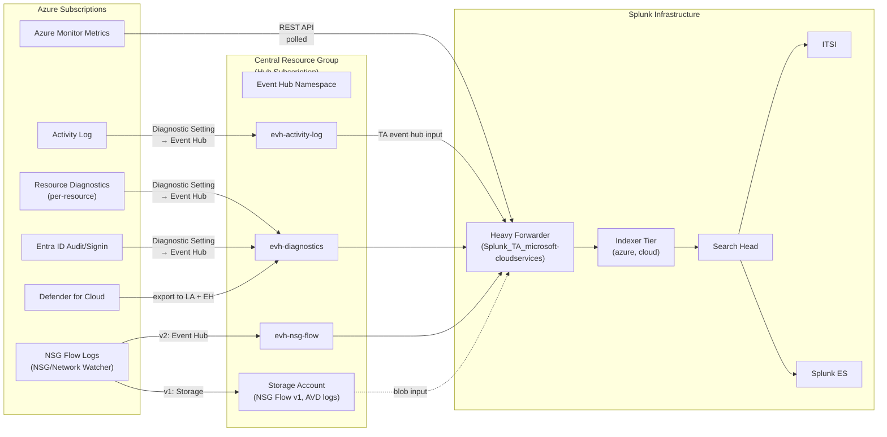

# Microsoft Azure Integration Guide

> The definitive guide to monitoring Microsoft Azure with Splunk. 57 use cases
> spanning Activity Log audit, Azure Monitor<sup class="ref">[<a href="#ref-1">1</a>]</sup> diagnostics & metrics, NSG Flow
> Logs, Key Vault, Azure SQL, AKS, Azure Bastion, Application Gateway,
> Storage, Functions, Data Factory, AVD, Sentinel, and the wider Azure platform
> — using the Splunk Add-on for Microsoft Cloud Services (Splunk_TA_microsoft-cloudservices)
> with Event Hub as the primary streaming pattern.

---

## Table of Contents

- [Quick Start](#quick-start)
- [Overview and What Good Looks Like](#overview)
- [Architecture and Data Flow](#architecture)
- [Prerequisites](#prerequisites)
- [Data Sources Reference](#data-sources)
- [Field Dictionary](#field-dictionary)
- [Sample Events](#sample-events)
- [TA Configuration (Step-by-Step)](#ta-configuration)
- [Event Hub Streaming Pattern](#event-hub)
- [Azure Monitor Metrics Polling](#metrics-polling)
- [Azure Activity Log](#activity-log)
- [Azure Diagnostics Settings](#diagnostics)
- [NSG Flow Logs](#nsg-flow)
- [Azure Storage Blob Polling (Backup Diagnostics)](#blob-polling)
- [Multi-Subscription / Multi-Tenant Strategy](#multi-subscription)
- [Cross-Product Correlation](#cross-product-correlation)
- [CIM Mapping Reference](#cim-mapping)
- [Compliance Mapping](#compliance-mapping)
- [Capacity Planning and Sizing](#sizing)
- [Recommended Dashboard Layouts](#dashboards)
- [ITSI Service Modeling](#itsi)
- [SOAR Playbook Examples](#soar)
- [Security Hardening](#security-hardening)
- [Crawl / Walk / Run Roadmap](#roadmap)
- [Validation Checklist](#validation-checklist)
- [Known Limitations and Gaps](#known-limitations)
- [Troubleshooting](#troubleshooting)
- [FAQ](#faq)
- [Glossary](#glossary)
- [References](#references)
- [Contribution and Feedback](#contribution)

---

<a id="quick-start"></a>
## Quick Start — 60 Minutes to Audit-Grade Activity Log

For platform engineers who want Azure Activity Log flowing into Splunk and a working detection within an hour:

1. **Create an Event Hub Namespace** in the subscription you want to monitor:
   - Resource group: `rg-splunk-platform`
   - Name: `evhns-splunk-platform`
   - Pricing tier: Standard (Basic does NOT support consumer groups beyond `$Default`)
   - Throughput units: 2 (auto-inflate enabled)

2. **Create an Event Hub** within the namespace:
   - Name: `evh-activity-log`
   - Partitions: 4
   - Message retention: 1 day (Splunk reads near-real-time)

3. **Create a consumer group** for Splunk: `cg-splunk`. (Each TA input needs its own consumer group; never use `$Default`.)

4. **Create a SAS policy** on the Event Hub: name `splunk-listen`, permission Listen.

5. **Route Activity Log to Event Hub**:
   - Subscriptions → Activity Log → Diagnostic settings → Add diagnostic setting
   - Categories: Administrative, Security, ServiceHealth, Alert, Recommendation, Policy, Autoscale, ResourceHealth
   - Destination: Stream to an event hub → select `evhns-splunk-platform` → `evh-activity-log` → SAS policy `splunk-listen`

6. **Install the Splunk Add-on for Microsoft Cloud Services** ([Splunkbase 3110](https://splunkbase.splunk.com/app/3110)) on a Heavy Forwarder.

7. **Register an Azure AD app for the TA** (only needed for metric polling, NOT for Event Hub):
   - Entra ID → App registrations → New registration → name `splunk-azure-collector`
   - API permissions: none (metric reads use the role assignment instead)
   - Create a client secret (rotate later via Key Vault)
   - Note: tenant ID, application (client) ID, secret value
   - Subscription → Access control (IAM) → Add role assignment → "Monitoring Reader" → the app

8. **Configure the TA** via Splunk Web → Splunk Add-on for Microsoft Cloud Services:
   - Configuration → Azure App Account → Add (paste tenant ID, client ID, secret)
   - Inputs → Azure Event Hub → Create:
     - Name: `azure-activity-log`
     - Event Hub Namespace: `evhns-splunk-platform.servicebus.windows.net`
     - Event Hub Name: `evh-activity-log`
     - Consumer Group: `cg-splunk`
     - SAS Key Name: `splunk-listen`
     - SAS Key Value: (from step 4)
     - Sourcetype: `mscs:azure:activity`
     - Index: `azure`

9. **Verify** within 5 minutes:

   ```spl
   index=azure sourcetype=mscs:azure:activity
   | stats count by category, operationName
   ```

   You should see entries from `Microsoft.Compute`, `Microsoft.Storage`, `Microsoft.Network`, etc.

10. **Activate UC-4.2.x** (e.g. UC-4.2.5 - VM CPU > 80%, UC-4.2.30 - NSG flow analysis).

**Stuck?** Jump to [Troubleshooting](#troubleshooting).

---

<a id="overview"></a>
## Overview and What Good Looks Like

### What `Splunk_TA_microsoft-cloudservices` collects

| Input type | Sourcetype | Use |
|------------|-----------|-----|
| **Azure Event Hub** | `mscs:azure:activity`, `mscs:azure:diagnostics` (auto-routed by message), `mscs:azure:nsgflow` | Streaming ingest of Azure Activity Log, Diagnostic Settings, NSG Flow Logs |
| **Azure Monitor Metrics** | `azure:monitor:metric` / `mscs:azure:metrics` | API polling for Azure Monitor metrics |
| **Azure Storage Account (Blob)** | `mscs:storage:blob` | Generic blob input — for legacy log archives, NSG flow log v1, etc |
| **Azure Resource** | `mscs:resource` | Polled inventory of Azure resources via ARM API |
| **Azure Audit / Sign-in Logs** | `mscs:azure:audit`, `mscs:azure:signin` | Entra ID audit and sign-in logs (covered in the [AD/Entra ID guide](active-directory-entra-id.md)) |
| **Microsoft Defender for Cloud** | `mscs:azure:securityalerts` | Security alerts (legacy ASC + MDC) |
| **Office 365 Management API** | `o365:*` | Microsoft 365 audit and activity (separate Splunk Add-on for Microsoft Office 365) |

The dominant production pattern is: Diagnostic Settings → Event Hub → TA, plus polling for Azure Monitor metrics.

### Why integrate with Splunk?

| Capability | Azure Portal / Log Analytics | Splunk + TA |
|------------|------------------------------|-------------|
| Activity Log search | Log Analytics (KQL only) | Splunk: SPL, retained, ES correlated |
| Cross-subscription view | Log Analytics workspace per sub | Splunk: single index with `subscriptionId` |
| Long-term retention | Workspace retention pricing | Splunk: cost-controlled |
| Multi-cloud correlation | None native | Splunk: AWS + Azure + GCP in one search |
| Compliance evidence | Manual export | Auditor-ready saved searches |
| SOAR auto-remediation | Logic Apps + Sentinel | Splunk SOAR with Azure connectors |
| Cost optimisation | Cost Management (delayed) | Splunk: hourly billing data, multi-sub anomaly |

### Who should read this guide?

| Role | Relevant sections |
|------|-------------------|
| **Cloud platform / SRE** | Quick Start, TA Config, Multi-Subscription, Sizing |
| **Cloud security** | Activity Log, NSG Flow, Compliance |
| **Compliance / audit** | Compliance Mapping, Validation Checklist |
| **FinOps** | Cost-related UCs |
| **Splunk architecture** | Architecture, Sizing, Multi-tenant |

### What good looks like

| Dimension | Before integration | After full deployment |
|-----------|-------------------|-----------------------|
| **Activity Log search** | Log Analytics KQL | Splunk SPL, instant |
| **Multi-subscription audit** | Per-sub workspace | Single SPL across all subs |
| **NSG Flow Log analysis** | Traffic Analytics (paid) | Splunk dashboards (UC-4.2.30) |
| **Key Vault access tracking** | Diagnostics manual review | Real-time alert (UC-4.2.8) |
| **Azure SQL performance** | Azure Portal per-DB | Splunk fleet-wide (UC-4.2.6) |
| **Bastion session audit** | Diagnostics review | Real-time per-session alert (UC-4.2.54) |
| **Cost anomalies** | Cost Management 24h delay | Splunk: hourly anomaly detection |

---

<a id="architecture"></a>
## Architecture and Data Flow



**Key collection patterns:**

1. **Diagnostic Setting → Event Hub → TA event hub input (preferred)** — every Azure resource that supports diagnostics can stream logs to Event Hubs. The TA reads from the Event Hub via AMQP. This is the scalable pattern for any volume.

2. **Activity Log → Event Hub** — same as above, applied to the subscription-level Activity Log.

3. **Azure Monitor Metrics polling** — TA calls `https://management.azure.com/...providers/microsoft.insights/metrics` for each resource at intervals.

4. **NSG Flow Logs v2 → Event Hub** — preferred over v1 (Storage Account-only).

5. **Storage Account blob polling (legacy / fallback)** — for sources that only export to Storage (older NSG flow v1, AVD, certain VM diagnostics): TA polls the blob container.

6. **Entra ID logs** — Diagnostic Setting on the Entra ID tenant → Event Hub (covered in [AD/Entra ID guide](active-directory-entra-id.md)).

For most production deployments, the dominant pattern is: Activity Log + Diagnostics → Event Hub Namespace + Metric polling.

---

<a id="prerequisites"></a>
## Prerequisites

### Azure requirements

| Requirement | Detail |
|-------------|--------|
| **Tenant** | Azure AD (Entra ID) tenant — required for app registration |
| **Subscriptions** | One or many; the TA can ingest from many |
| **Permissions to configure** | Owner or Contributor on the subscription (to create Event Hub namespace and Diagnostic Settings); Cloud Application Administrator (to register the TA's app) |
| **Event Hub Namespace** | Standard tier minimum (Basic doesn't support multiple consumer groups) |
| **Throughput Units (TUs)** | 1 TU = 1 MB/s ingress, 2 MB/s egress; auto-inflate enabled |
| **Diagnostic Settings** | Configured per resource OR via Azure Policy at scale |
| **Network access** | TA's HF must reach `*.servicebus.windows.net:5671` (AMQP), `management.azure.com:443` (metrics), `login.microsoftonline.com:443` (auth) |
| **Time sync** | All resources NTP-synced |

### Splunk requirements

| Requirement | Detail |
|-------------|--------|
| **Splunk version** | Splunk Enterprise 9.0+ or Splunk Cloud (Victoria or Classic) |
| **Heavy Forwarder for TA** | The TA does NOT run on Universal Forwarders |
| **HF sizing** | 8 vCPU, 32 GB RAM, 200 GB disk for typical workloads (CloudTrail-equivalent < 100 GB/day). Larger for high-volume NSG Flow. |
| **Indexes** | `azure` (events), optionally `azure_metrics` (metric store), `azure_audit` (Activity + Entra), `cloud` (cross-cloud bucket) |
| **Roles** | `azure_observer`, `azure_security` (audit-only), `azure_admin` |

### Network requirements

| From | To | Port | Protocol | Purpose |
|------|----|------|----------|---------|
| HF | `<namespace>.servicebus.windows.net` | 5671 | AMQP/TLS | Event Hub read |
| HF | `management.azure.com` | 443 | HTTPS | ARM API (metrics, resource list) |
| HF | `login.microsoftonline.com` | 443 | HTTPS | OAuth / token acquisition |
| HF | `<storageaccount>.blob.core.windows.net` | 443 | HTTPS | Blob input (legacy) |

Use Private Endpoints / Service Endpoints where possible.

---

<a id="data-sources"></a>
## Data Sources Reference

### Activity Log (`mscs:azure:activity`)

| Aspect | Detail |
|--------|--------|
| Source | Subscription Diagnostic Setting → Event Hub → TA |
| Volume | 100 KB – 10 MB per minute per subscription depending on activity |
| Key fields | `category`, `operationName`, `level`, `caller`, `correlationId`, `claims.*`, `properties.*`, `subscriptionId`, `resourceId`, `resourceGroupName` |
| Cadence | Near-real-time (1–2 min latency) |
| Used by | Audit UCs, change tracking, RBAC anomalies |

### Azure Monitor Diagnostics (`mscs:azure:diagnostics` / `azure:diagnostics`)

| Aspect | Detail |
|--------|--------|
| Source | Per-resource Diagnostic Setting → Event Hub → TA |
| Volume | Highly variable; depends on resources and selected log categories |
| Key fields | `Category`, `ResourceProvider`, `ResourceType`, `OperationName`, `ResultType`, `properties.*` |
| Used by | UC-4.2.6 (Azure SQL), .8 (Key Vault), .50 (Data Factory), .51 (APIM), .52 (AVD), .54 (Bastion), .55 (Connection Monitor) |

### Azure Monitor Metrics (`azure:monitor:metric` / `mscs:azure:metrics`)

| Aspect | Detail |
|--------|--------|
| Source | TA polling (`management.azure.com/.../metrics`) |
| Volume | Varies; metric_count × interval × resources |
| Key fields | `metricName`, `average`, `maximum`, `total`, `count`, `resourceId`, `metricNamespace` |
| Cadence | 1 min, 5 min, 15 min, 1h |
| Used by | UC-4.2.5 (VM CPU), .49 (Redis), .53 (Traffic Manager), .56 (Storage queue), .57 (Disk IOPS) |

### NSG Flow Logs (`mscs:azure:nsgflow`)

| Aspect | Detail |
|--------|--------|
| Source | NSG Flow Logs v2 → Event Hub OR Storage Account |
| Volume | 100 MB – 100 GB/day per VNet depending on traffic |
| Key fields | `srcaddr`/`src`, `dstaddr`/`dest`, `srcport`/`src_port`, `dstport`/`dest_port`, `protocol`, `flowState`, `decision`, `flowDirection`, `vnet`, `nsgRule`, `bytes`, `packets` |
| Used by | UC-4.2.30 |

### Entra ID Audit / Sign-in (`mscs:azure:audit`, `mscs:azure:signin`)

See [AD/Entra ID guide](active-directory-entra-id.md).

### Microsoft Defender for Cloud (`mscs:azure:securityalerts`)

| Aspect | Detail |
|--------|--------|
| Source | MDC alerts via continuous export → Event Hub |
| Volume | Low; spikes during incidents |
| Key fields | `alertSeverity`, `alertType`, `compromisedEntity`, `description`, `remediationSteps`, `vendorName` |
| Used by | Security UCs |

---

<a id="field-dictionary"></a>
## Field Dictionary

### `mscs:azure:activity`

| Field | Type | Example | Description | Used by |
|-------|------|---------|-------------|---------|
| `category` | string | `Administrative`, `Security`, `ServiceHealth`, `Alert`, `Recommendation`, `Policy`, `Autoscale`, `ResourceHealth` | Activity Log category | All |
| `operationName` | string | `Microsoft.Compute/virtualMachines/start/action`, `Microsoft.Storage/storageAccounts/listkeys/action` | Operation invoked | Audit UCs |
| `level` | string | `Informational`, `Warning`, `Error`, `Critical` | Severity | Audit |
| `caller` | string | `alice@contoso.com`, `00000000-0000-0000-0000-000000000000` (service principal) | Acting principal | Audit |
| `correlationId` | string | UID | Cross-resource transaction ID | Forensics |
| `claims.*` | object | various | Claims from Entra ID token | Audit |
| `subscriptionId` | string | UUID | Subscription | Multi-sub |
| `resourceId` | string | `/subscriptions/.../resourceGroups/.../providers/Microsoft.Storage/storageAccounts/foo` | Affected resource | All |
| `resourceGroupName` | string | `rg-prod-payments` | Resource group | All |
| `properties.statusCode` | string | `OK`, `Created`, `Forbidden` | Operation outcome | Audit |
| `properties.entity` | string | `/subscriptions/.../...` | Entity acted upon | Audit |

### `mscs:azure:diagnostics` (Key Vault example)

| Field | Type | Example | Description | Used by |
|-------|------|---------|-------------|---------|
| `Category` | string | `AuditEvent`, `AzurePolicyEvaluationDetails` | Diagnostic category | UC-4.2.8 |
| `ResourceProvider` | string | `MICROSOFT.KEYVAULT`, `MICROSOFT.SQL`, `MICROSOFT.STORAGE` | Provider namespace | All |
| `ResourceType` | string | `VAULTS`, `SERVERS/DATABASES`, `STORAGEACCOUNTS` | Resource type | All |
| `OperationName` | string | `SecretGet`, `KeyDecrypt`, `VaultGet`, `KeyCreate` | Specific operation | UC-4.2.8 |
| `ResultType` | string | `Success`, `Failure` | Outcome | UC-4.2.8 |
| `ResultDescription` | string | "Operation completed successfully" | Detail | UC-4.2.8 |
| `identity.claim.upn` | string | `alice@contoso.com` | User principal | UC-4.2.8 |
| `identity.claim.appid` | string | UUID | App principal | UC-4.2.8 |
| `properties.*` | object | varies | Per-operation detail | All |
| `Resource` | string | `myvault` | Resource name | UC-4.2.8 |

### `mscs:azure:nsgflow`

| Field | Type | Example | Description | Used by |
|-------|------|---------|-------------|---------|
| `flowDirection` | string | `In`, `Out` | Direction | UC-4.2.30 |
| `src` / `srcaddr` | string | `10.0.1.23` | Source IP | UC-4.2.30 |
| `dest` / `dstaddr` | string | `10.0.2.45` | Destination IP | UC-4.2.30 |
| `src_port` / `srcport` | int | `54321` | Source port | UC-4.2.30 |
| `dest_port` / `dstport` | int | `443` | Destination port | UC-4.2.30 |
| `protocol` | string | `T` (TCP), `U` (UDP) | Protocol | UC-4.2.30 |
| `decision` | string | `A` (Allow), `D` (Deny) | NSG verdict | UC-4.2.30 |
| `flowState` | string | `B` (begin), `C` (continuing), `E` (end) | Flow state | UC-4.2.30 |
| `nsgRule` | string | `UserRule_AllowHTTPS_Inbound` | Matched rule | UC-4.2.30 |
| `vnet` | string | `vnet-prod` | Owning VNet | UC-4.2.30 |
| `subnet` | string | `web-subnet` | Owning subnet | UC-4.2.30 |
| `bytes` | int | `4096` | Bytes | UC-4.2.30 |
| `packets` | int | `42` | Packets | UC-4.2.30 |
| `mac` | string | `001DD8B71C00` | NIC MAC | UC-4.2.30 |

### `azure:monitor:metric`

| Field | Type | Example | Description |
|-------|------|---------|-------------|
| `resourceId` / `Resource` | string | `/subscriptions/.../providers/Microsoft.Compute/virtualMachines/vm01` | Source resource |
| `metricName` | string | `Percentage CPU`, `Available Memory Bytes`, `Disk Read Bytes/sec` | Metric |
| `metricNamespace` | string | `Microsoft.Compute/virtualMachines` | Resource provider |
| `average` / `maximum` / `minimum` / `total` / `count` | float | numeric | Aggregations |
| `unit` | string | `Percent`, `Bytes`, `Count`, `Seconds` | Unit |
| `timeGrain` | string | `PT1M`, `PT5M`, `PT1H` | Sample interval (ISO 8601) |

---

<a id="sample-events"></a>
## Sample Events

### `mscs:azure:activity` (Storage account key listed)

```json
{
  "time": "2026-04-25T14:30:00.123Z",
  "category": "Administrative",
  "operationName": "Microsoft.Storage/storageAccounts/listkeys/action",
  "level": "Informational",
  "caller": "alice@contoso.com",
  "correlationId": "f1e2d3c4-b5a6-7890-abcd-ef1234567890",
  "subscriptionId": "00000000-0000-0000-0000-000000000000",
  "resourceGroupName": "rg-prod-data",
  "resourceId": "/subscriptions/00000000-0000-0000-0000-000000000000/resourceGroups/rg-prod-data/providers/Microsoft.Storage/storageAccounts/acmeprodlogs",
  "claims": {
    "ipaddr": "203.0.113.45",
    "appid": "04b07795-8ddb-461a-bbee-02f9e1bf7b46"
  },
  "properties": {
    "statusCode": "OK"
  }
}
```

### `mscs:azure:diagnostics` (Key Vault SecretGet — UC-4.2.8)

```json
{
  "time": "2026-04-25T14:30:00.123Z",
  "Category": "AuditEvent",
  "ResourceProvider": "MICROSOFT.KEYVAULT",
  "ResourceType": "VAULTS",
  "OperationName": "SecretGet",
  "ResultType": "Success",
  "Resource": "kv-prod-payments",
  "identity": {
    "claim": {
      "upn": "alice@contoso.com",
      "appid": "04b07795-8ddb-461a-bbee-02f9e1bf7b46"
    }
  },
  "properties": {
    "id": "https://kv-prod-payments.vault.azure.net/secrets/db-connection-string/abc123",
    "clientInfo": "Microsoft.Azure.KeyVault.AksAuthClient/1.0"
  }
}
```

UC-4.2.8 alerts on `Category=AuditEvent ResourceType=VAULTS ResultType!=Success`.

### `mscs:azure:nsgflow` (UC-4.2.30)

```json
{
  "time": "2026-04-25T14:30:00.123Z",
  "category": "NetworkSecurityGroupFlowEvent",
  "Resource": "nsg-web-tier",
  "flowDirection": "In",
  "src": "203.0.113.45",
  "dest": "10.0.1.23",
  "src_port": 54321,
  "dest_port": 22,
  "protocol": "T",
  "decision": "D",
  "flowState": "B",
  "nsgRule": "DenyAllInbound",
  "bytes": 0,
  "packets": 1,
  "vnet": "vnet-prod",
  "subnet": "web-subnet"
}
```

### `azure:monitor:metric` (VM CPU — UC-4.2.5)

```json
{
  "time": "2026-04-25T14:30:00Z",
  "resourceId": "/subscriptions/00000000-0000-0000-0000-000000000000/resourceGroups/rg-prod-app/providers/Microsoft.Compute/virtualMachines/vm-app01",
  "metricName": "Percentage CPU",
  "metricNamespace": "Microsoft.Compute/virtualMachines",
  "average": 87.45,
  "maximum": 95.20,
  "unit": "Percent",
  "timeGrain": "PT5M"
}
```

---

<a id="ta-configuration"></a>
## TA Configuration (Step-by-Step)

### Step 1: Install the TA on Search Head and Heavy Forwarder

Download from [Splunkbase 3110](https://splunkbase.splunk.com/app/3110). Install on Heavy Forwarder + Search Head.

### Step 2: Create indexes

```ini
[azure]
homePath   = $SPLUNK_DB/azure/db
coldPath   = $SPLUNK_DB/azure/colddb
thawedPath = $SPLUNK_DB/azure/thaweddb
maxTotalDataSizeMB = 5242880
frozenTimePeriodInSecs = 220752000  ; 7 years for SOX/PCI

[azure_metrics]
maxTotalDataSizeMB = 1048576
frozenTimePeriodInSecs = 31536000

[azure_audit]
maxTotalDataSizeMB = 524288
frozenTimePeriodInSecs = 220752000
```

### Step 3: Register an Azure AD app for the TA (for metric polling)

Entra ID → App registrations → New registration.

| Setting | Value |
|---------|-------|
| Name | `splunk-azure-collector` |
| Supported account types | Single tenant |
| Redirect URI | (none) |

After creation:

1. Note the **Tenant ID**, **Application (client) ID**.
2. Certificates & secrets → New client secret → name `splunk-2026-q2`, expires 6 months → save value somewhere safe.
3. Subscription(s) you want to monitor → Access control (IAM) → Add role assignment:
   - Role: **Monitoring Reader** (read metrics + diagnostics)
   - Optional: **Reader** (broader resource read for inventory)
   - Assign to: the app you just created

For Activity Log via Event Hub, the TA does NOT need any Azure AD app — it uses the SAS key directly.

### Step 4: Configure the Azure App Account in the TA

Splunk Web → Splunk Add-on for Microsoft Cloud Services → Configuration → Azure App Account → Add.

| Field | Value |
|-------|-------|
| Account Name | `azure-prod-tenant` |
| Tenant ID | (from step 3) |
| Client ID | (from step 3) |
| Client Secret | (from step 3) |
| Account Class Type | `Azure Public Cloud` (or `Azure US Government` etc) |

### Step 5: Configure an Event Hub input

Splunk Web → Splunk Add-on for Microsoft Cloud Services → Inputs → Create New Input → Azure Event Hub.

| Field | Value |
|-------|-------|
| Name | `azure-activity-log-prod` |
| Event Hub Namespace | `evhns-splunk-platform.servicebus.windows.net` |
| Event Hub Name | `evh-activity-log` |
| Consumer Group | `cg-splunk` |
| SAS Key Name | `splunk-listen` |
| SAS Key Value | (from Event Hub SAS policy) |
| Sourcetype | `mscs:azure:activity` |
| Index | `azure` |

Repeat for additional Event Hubs (per resource type or per subscription).

### Step 6: Configure Azure Monitor Metrics input

Splunk Web → Splunk Add-on for Microsoft Cloud Services → Inputs → Azure Monitor Metrics.

| Field | Value |
|-------|-------|
| Name | `azure-vm-metrics-prod` |
| Azure App Account | `azure-prod-tenant` |
| Subscription ID | `<sub-uuid>` |
| Resource Group | (leave empty for all) |
| Resource Type | `Microsoft.Compute/virtualMachines` |
| Metric Statistics | `average, maximum` |
| Metric Names | `Percentage CPU, Available Memory Bytes, Network In Total, Network Out Total` |
| Time Grain | `PT5M` |
| Sourcetype | `azure:monitor:metric` |
| Index | `azure_metrics` (or `azure`) |

Repeat for `Microsoft.Sql/servers/databases`, `Microsoft.Storage/storageAccounts`, `Microsoft.Network/loadBalancers`, etc.

### Step 7: Validate

```spl
index=azure sourcetype=mscs:azure:activity | stats count by category, operationName | sort -count
index=azure sourcetype=mscs:azure:diagnostics | stats count by Category, ResourceType
index=azure_metrics sourcetype=azure:monitor:metric | stats count by metricName, metricNamespace
```

---

<a id="event-hub"></a>
## Event Hub Streaming Pattern

Event Hub is the high-throughput streaming pattern that scales to TBs/day. This section explains the design choices.

### Architecture choices

#### Option A: Single Event Hub Namespace, multiple Event Hubs (recommended)

```
evhns-splunk-platform/
  ├── evh-activity-log         → Activity Log (subscription)
  ├── evh-diag-keyvault        → Key Vault diagnostics
  ├── evh-diag-sql             → Azure SQL diagnostics
  ├── evh-nsg-flow             → NSG Flow Logs v2
  └── evh-entra                → Entra ID audit + sign-in
```

Pros: clear separation; per-source consumer groups; easier to scale TUs per workload.

Cons: more configuration; multiple TA inputs.

#### Option B: Single Event Hub for everything

```
evhns-splunk-platform/
  └── evh-azure-all   ← every diagnostic setting points here
```

Pros: simpler.

Cons: contention; hard to scale; one bad-actor source can starve others.

**Recommendation**: Option A.

### Event Hub sizing

| Throughput Units (TUs) | Ingress | Egress |
|------------------------|---------|--------|
| 1 TU | 1 MB/s | 2 MB/s |
| 10 TUs | 10 MB/s | 20 MB/s |
| 20 TUs | 20 MB/s | 40 MB/s |

Standard tier supports up to 20 TUs per namespace; Premium scales much higher.

Enable **Auto-Inflate** to avoid throttling during spikes.

### Partitions

Each Event Hub has 1–32 partitions (default 4). Splunk TA reads partitions in parallel, so:
- 4 partitions = up to 4 concurrent reads
- 8 partitions = better parallelism for very high volume
- More partitions ≠ always better; over-partitioning wastes resources

Pick: 4 for typical Activity Log; 8–16 for NSG Flow.

### Consumer groups

**One consumer group per consuming application**. Never share `$Default` between Splunk and another tool.

```
Event Hub: evh-activity-log
  Consumer Groups:
    $Default      ← unused
    cg-splunk     ← Splunk TA
    cg-sentinel   ← Microsoft Sentinel (if dual-shipping)
```

### Throughput troubleshooting

If Splunk lag grows:
1. Check Event Hub Namespace metrics: `IncomingMessages`, `OutgoingMessages`, `IncomingBytes`, `ThrottledRequests`
2. If `ThrottledRequests > 0`: increase TUs (or Auto-Inflate)
3. If TA can't keep up: add a second TA input on a different consumer group, OR partition load across multiple HFs

---

<a id="metrics-polling"></a>
## Azure Monitor Metrics Polling

The TA's Azure Monitor Metrics input calls the Azure Monitor REST API per resource, per metric.

### When to use

- **Use polling** when: metric cardinality is reasonable (< 10,000 series); 1-min or 5-min latency is acceptable.
- **Use Azure Monitor Metric Streams via Event Hubs** when: you need real-time; cardinality is high; you have many subscriptions.

### Polling configuration tips

- One TA input per (subscription × resource type)
- Use `Resource Group` filter to scope (e.g. only production)
- `Time Grain`: 1 min for SLI metrics; 5 min for capacity dashboards; 1 hour for trends
- Stagger inputs across HFs for very large estates

### Metric Streams (alternative for real-time)

Configure a Metric Streaming destination to Event Hub:

1. Azure Monitor → Metrics → Diagnostic Settings → Metrics
2. Stream to Event Hub → `evh-azure-metrics`
3. Splunk TA Event Hub input on this hub

Sourcetype `mscs:azure:metricstream` (or remap to `azure:monitor:metric`).

---

<a id="activity-log"></a>
## Azure Activity Log

The Activity Log is your subscription-level audit trail (administrative actions, service health, recommendations, policy evaluations, alerts).

### Categories you should always enable

| Category | Why |
|----------|-----|
| **Administrative** | Who did what (resource changes) |
| **Security** | Microsoft Defender for Cloud alerts |
| **ServiceHealth** | Azure-side incidents affecting your subs |
| **Alert** | Azure Monitor alert state changes |
| **Recommendation** | Azure Advisor |
| **Policy** | Azure Policy evaluation events |
| **Autoscale** | VMSS scale events |
| **ResourceHealth** | Per-resource health changes |

### Configure via portal

Subscriptions → Activity Log → Diagnostic settings → Add diagnostic setting:
- All categories ticked
- Destination: Stream to Event Hub → `evh-activity-log`

### Configure via Azure Policy at scale

For organisations with many subscriptions, use the built-in Azure Policy initiative **"Configure Azure Activity logs to stream to specified Event Hub"**. Apply at the management group level.

---

<a id="diagnostics"></a>
## Azure Diagnostics Settings

Each resource type has its own diagnostic categories. Enable them per resource (or via Policy).

### High-value diagnostics

| Resource type | Categories | UC |
|---------------|-----------|-----|
| **Key Vault** | `AuditEvent`, `AzurePolicyEvaluationDetails` | UC-4.2.8 |
| **Azure SQL** | `SQLInsights`, `Errors`, `Deadlocks`, `Audit`, `QueryStoreRuntimeStatistics`, `Timeouts` | UC-4.2.6 |
| **AKS** | `kube-apiserver`, `kube-audit`, `kube-controller-manager`, `kube-scheduler`, `cluster-autoscaler` | (covered in Kubernetes guide) |
| **Storage** | `StorageRead`, `StorageWrite`, `StorageDelete` | UC-4.2.* |
| **App Service** | `AppServiceHTTPLogs`, `AppServiceConsoleLogs`, `AppServiceAppLogs`, `AppServiceAuditLogs` | App health UCs |
| **Application Gateway** | `ApplicationGatewayAccessLog`, `ApplicationGatewayPerformanceLog`, `ApplicationGatewayFirewallLog` | UC-4.2.* |
| **Bastion** | `BastionAuditLogs` | UC-4.2.54 |
| **API Management** | `GatewayLogs` | UC-4.2.51 |
| **AVD (WVD)** | `WVDConnections`, `WVDErrors`, `WVDCheckpoints`, `WVDManagement` | UC-4.2.52 |
| **Data Factory** | `PipelineRuns`, `ActivityRuns`, `TriggerRuns` | UC-4.2.50 |
| **Function Apps** | `FunctionAppLogs` | App UCs |

### Apply at scale via Azure Policy

Built-in initiative **"Enable Azure Monitor for VMs"** sets up the agent + diagnostics on VMs. For non-VM resources, use Policy definitions like **"Deploy Diagnostic Settings for [Resource Type] to Event Hub"**.

---

<a id="nsg-flow"></a>
## NSG Flow Logs

NSG Flow Logs capture network flow data through Network Security Groups.

### v1 vs v2

- **v1**: writes to Storage Account only; older format
- **v2 (recommended)**: writes to Storage Account, can stream via Event Hub via Traffic Analytics, includes more fields (flow state, MAC)

### Setup (v2 → Storage → SQS-equivalent → TA)

There's no native NSG Flow → Event Hub direct path; the typical pattern is:

```
NSG Flow Logs v2
   ↓
Storage Account (JSON files in container `insights-logs-networksecuritygroupflowevent`)
   ↓
TA "Storage Account" blob input
   ↓
sourcetype=mscs:azure:nsgflow
```

Configure in Splunk Web → Splunk Add-on for Microsoft Cloud Services → Inputs → Azure Storage Blob:
- Storage Account: name + access key
- Container: `insights-logs-networksecuritygroupflowevent`
- Sourcetype: `mscs:azure:nsgflow`
- Index: `azure`

For real-time NSG Flow (v2 + Traffic Analytics), set Traffic Analytics destination to Log Analytics; then export Log Analytics → Event Hub → TA.

### Volume control

NSG Flow can be enormous (10s–100s GB/day per VNet). Levers:

- Enable per-NSG, not per-VNet (only on critical subnets)
- Sample (Traffic Analytics supports 1/10/60 min flow log intervals)
- Drop verbose flows at ingest (e.g. internal east-west)

---

<a id="blob-polling"></a>
## Azure Storage Blob Polling (Backup Diagnostics)

Some Azure services only export to Storage Account (legacy). The TA's Blob input handles these.

### Use cases

- NSG Flow Logs v1
- AVD diagnostics (older versions)
- Custom application logs uploaded by VMs/apps

### Configuration

Splunk Web → Inputs → Azure Storage Blob:
- Account name + key (or managed identity if HF runs in Azure)
- Container name
- Path filter (e.g. `*.json`)
- Sourcetype: `mscs:storage:blob` (override per source type)
- Index

The TA tracks the last-read offset per blob.

### Tradeoffs vs Event Hub

| Pattern | Pros | Cons |
|---------|------|------|
| Event Hub | Real-time; scales | Additional cost (TUs) |
| Blob | Cheaper; reliable | Latency (5–30 min); polling overhead at scale |

Use Event Hub where supported; fall back to Blob only when forced.

---

<a id="multi-subscription"></a>
## Multi-Subscription / Multi-Tenant Strategy

### Single tenant, many subscriptions (common)

Topology:

```
Hub Subscription
  ├── Event Hub Namespace (shared)
  └── Splunk HF (in Azure VM)

Workload Subscriptions
  ├── Activity Log → Hub Event Hub
  ├── Resource Diagnostics → Hub Event Hub
  └── Metrics polled by HF (with role assignment)
```

The Splunk app (registered once in the tenant) gets `Monitoring Reader` on each subscription via Azure Policy or manual IAM.

### Multiple tenants (e.g. MSP / multi-customer)

Each tenant requires:
- Its own app registration (or use multi-tenant app + customer consent)
- Its own role assignments per subscription
- Its own Event Hub Namespace (or shared with multi-tenant routing)

In Splunk: separate `Azure App Account` entries per tenant; tag inputs with `tenant_id` field.

### Index strategy

**Option A — shared `azure` index**: filter by `subscriptionId` field at search time.

**Option B — per-environment indexes**: `azure_prod`, `azure_nonprod`. Stronger access boundaries.

**Option C — per-tenant indexes**: when multi-tenant; mandatory for MSPs.

### Dashboard tokens

```xml
<input type="dropdown" token="sub_id">
  <label>Subscription</label>
  <choice value="*">All</choice>
  <fieldForLabel>subscription_name</fieldForLabel>
  <fieldForValue>subscriptionId</fieldForValue>
  <search>
    <query>| inputlookup azure_subscription_lookup</query>
  </search>
  <default>*</default>
</input>
```

---

<a id="cross-product-correlation"></a>
## Cross-Product Correlation

### Azure + Entra ID

```spl
(index=azure sourcetype=mscs:azure:activity caller="$user$")
OR (index=azure sourcetype=mscs:azure:signin user_principal_name="$user$")
| transaction _time maxspan=1h
```

### Azure + on-premises Windows AD

```spl
(index=azure sourcetype=mscs:azure:signin)
OR (index=wineventlog sourcetype=WinEventLog:Security EventCode=4624)
| transaction user maxspan=15m
```

### Azure + AWS / GCP (multi-cloud RBA)

```spl
(index=azure sourcetype=mscs:azure:signin status.error_code=50158)
OR (index=aws_cloudtrail userIdentity.userName=$user$ errorCode=AccessDenied)
| transaction user maxspan=1h
```

### Azure + Splunk ES

UC-4.2.8 (Key Vault failure burst) → ES Risk score (high). UC-4.2.30 (NSG denied burst) → ES Notable.

### Azure + Splunk SOAR

SOAR connectors for Azure: Compute (start/stop/snapshot), Storage (block public access), KeyVault (rotate keys), Network (modify NSG rules). All via Microsoft Graph + ARM.

---

<a id="cim-mapping"></a>
## CIM Mapping Reference

| CIM Data Model | Mapped sourcetypes / UCs | Validation SPL |
|----------------|--------------------------|----------------|
| **Authentication** | `mscs:azure:signin`, `mscs:azure:audit` (login-relevant) | `\| tstats count from datamodel=Authentication` |
| **Change** | `mscs:azure:activity`, `mscs:azure:diagnostics` (resource provider operations) | `\| tstats count from datamodel=Change` |
| **Network_Traffic** | `mscs:azure:nsgflow` | `\| tstats count from datamodel=Network_Traffic` |
| **Performance** | `azure:monitor:metric` (CPU, Memory, Disk) | `\| tstats count from datamodel=Performance` |
| **Alerts** | `mscs:azure:securityalerts`, MDC | `\| tstats count from datamodel=Alerts` |
| **Web** | App Service AppServiceHTTPLogs, AppGateway access logs | `\| tstats count from datamodel=Web` |

The TA ships eventtypes/tags for the major sourcetypes; verify in Settings → Data Models.

---

<a id="compliance-mapping"></a>
## Compliance Mapping

### NIST 800-53 Rev. 5

| UC | Control |
|----|---------|
| UC-4.2.5, .6, .49, .57 | SI-4 System monitoring |
| UC-4.2.8 (Key Vault) | SC-12, SC-28, AC-3 |
| UC-4.2.30 (NSG flow) | SC-7, AU-12 |
| UC-4.2.54 (Bastion audit) | AC-17, AU-2 |

### PCI-DSS v4.0

| UC | Requirement |
|----|------------|
| UC-4.2.8 | 3.x Cryptography / Key management |
| UC-4.2.30 | 1.x Network segmentation |
| UC-4.2.54 | 8.x Identify users (admin sessions) |

### CIS Microsoft Azure Foundations Benchmark

| UC | CIS Section |
|----|-------------|
| UC-4.2.8 | 8.x Key Vault |
| UC-4.2.30 | 6.x Networking |
| Activity Log retention | 5.x Logging |

### ISO 27001:2022

| UC | Annex |
|----|-------|
| UC-4.2.* (audit) | A.8.16 Monitoring |
| UC-4.2.8 | A.8.24 Cryptographic key management |

---

<a id="sizing"></a>
## Capacity Planning and Sizing

### Per-data-source ingest

| Data source | Volume baseline |
|-------------|-----------------|
| **Activity Log** | 50–500 MB/day per active sub |
| **Diagnostics (per resource)** | varies; KV ~10 MB/day, SQL ~100 MB/day, App Service ~100 MB – 10 GB/day |
| **NSG Flow Logs v2** | 100 MB – 100 GB/day per VNet |
| **Azure Monitor Metrics** | 1–100 MB/day per subscription |
| **Entra ID logs** | 100 MB – 5 GB/day depending on tenant size |
| **MDC alerts** | < 1 MB/day in steady state |

### Worked examples

| Estate | Daily ingest |
|--------|-------------|
| **Single sub, ~100 resources, low traffic** | ~500 MB Activity + ~1 GB Diag + ~5 GB NSG + ~50 MB Metrics ≈ 7 GB/day |
| **5 subs, 1000 resources** | ~3 GB Activity + ~5 GB Diag + ~30 GB NSG + ~500 MB Metrics ≈ 40 GB/day |
| **50 subs, 10,000 resources** | ~25 GB + ~50 GB + ~300 GB + ~5 GB ≈ 380 GB/day |

### Cost-cutting levers

1. **Filter NSG Flow at source** (only critical NSGs)
2. **Don't enable verbose Diagnostic categories** (e.g. `StorageRead` for high-traffic accounts can be GBs/day)
3. **Sample Sign-in logs** if low-risk subs
4. **Use Cribl/Edge Processor** for routing/filtering between Event Hub → Splunk
5. **Drop unused Activity Log categories** (e.g. `Recommendation`, `Autoscale` if not actioned)

### HF sizing

| Daily ingest | HF count |
|--------------|----------|
| < 50 GB | 1 (8 vCPU, 32 GB) |
| 50–250 GB | 2 (16 vCPU, 64 GB) |
| 250 GB – 1 TB | 4 |
| > 1 TB | Per Splunk Validated Architecture |

### Event Hub TU sizing

| Daily ingest | TUs |
|--------------|-----|
| < 50 GB | 1–2 (auto-inflate) |
| 50–500 GB | 5–10 |
| 500 GB – 2 TB | 15–20 (or move to Premium) |

---

<a id="dashboards"></a>
## Recommended Dashboard Layouts

### Crawl Dashboard — "Azure Security at a Glance"

```
+----------------------------------+----------------------------------+
| RECENT ADMINISTRATIVE EVENTS     | KEY VAULT FAILURES (UC-4.2.8)    |
| (per category, top 10 caller)    |                                  |
+----------------------------------+----------------------------------+
| MDC ALERTS HIGH/CRITICAL         | NSG DENY BURSTS (UC-4.2.30)      |
+----------------------------------+----------------------------------+
| BASTION SESSIONS LAST 24H        | NEW RBAC ASSIGNMENTS LAST 7D     |
| (UC-4.2.54)                      |                                  |
+----------------------------------+----------------------------------+
```

### Walk Dashboard — "Operational Intelligence"

```
+----------------------------------+----------------------------------+
| VM CPU > 80% (UC-4.2.5)          | AZURE SQL DTU SATURATION (UC-4.2.6)|
+----------------------------------+----------------------------------+
| STORAGE QUEUE BACKLOG (UC-4.2.56)| DISK IOPS THROTTLE (UC-4.2.57)   |
+----------------------------------+----------------------------------+
| APIM BACKEND ERRORS (UC-4.2.51)  | DATA FACTORY FAILURES (UC-4.2.50)|
+----------------------------------+----------------------------------+
```

### Run Dashboard — "Cost & Compliance"

```
+----------------------------------+----------------------------------+
| DAILY COST BY SUBSCRIPTION       | RESERVED INSTANCE / SAVINGS PLAN |
+----------------------------------+----------------------------------+
| CIS AZURE BENCHMARK SCORECARD    | COMPLIANCE EVIDENCE PER UC       |
+----------------------------------+----------------------------------+
| PUBLIC RESOURCES (Storage, etc)  | EXTERNAL SHARING                 |
+----------------------------------+----------------------------------+
```

---

<a id="itsi"></a>
## ITSI Service Modeling

### Service hierarchy

```
Azure Platform
├── Subscription: prod
│   ├── Compute (VM, AKS, App Service)
│   ├── Database (Azure SQL, Cosmos)
│   ├── Storage
│   ├── Networking (NSG, AGW, ExpressRoute)
│   └── Identity (Key Vault)
└── Subscription: nonprod
    └── ...
```

### Recommended KPIs

| KPI | Source | Threshold |
|-----|--------|-----------|
| **VM CPU (per ASG)** | `azure:monitor:metric Percentage CPU` | Adaptive |
| **Azure SQL DTU** | `azure:monitor:metric dtu_consumption_percent` | Static (warn 80%, crit 90%) |
| **App Service Errors** | `azure:monitor:metric Http5xx` | Static |
| **MDC HIGH count** | `mscs:azure:securityalerts severity=High` | Static |
| **NSG Deny rate** | `mscs:azure:nsgflow decision=D` | Adaptive |

### Entity import

```spl
index=azure sourcetype=mscs:resource resourceType=Microsoft.Compute/virtualMachines earliest=-24h
| dedup name
| table name location resourceGroupName subscriptionId tags
```

---

<a id="soar"></a>
## SOAR Playbook Examples

### Playbook 1: Key Vault Failure Burst (UC-4.2.8)

**Trigger:** > 10 Key Vault failures from same UPN in 5 min.

```
1. RECEIVE alert (vault, upn, count, operations)
2. PULL last 1h of vault audit for the user
3. CHECK if user has been deprovisioned
4. CHECK Entra ID risk score for user (Identity Protection)
5. IF risk HIGH:
   - DISABLE user via Microsoft Graph
   - REVOKE all sessions
6. CREATE INCIDENT (P1 if PROD vault; P2 otherwise)
7. NOTIFY SecOps via Slack + email
```

### Playbook 2: NSG Public Rule Detected

**Trigger:** UC-4.2.* alert when an NSG rule is added/modified to allow inbound from `0.0.0.0/0`.

```
1. RECEIVE alert (nsg, rule, source, destination, port)
2. CHECK rule against approved-public allowlist
3. CHECK change ticket
4. IF unauthorized:
   - REVERT rule via ARM API
   - NOTIFY change requester + cloud-sec
5. CREATE INCIDENT
```

### Playbook 3: Bastion Anomalous Session (UC-4.2.54)

**Trigger:** Bastion connection from unexpected IP or to non-allowlisted VM.

```
1. RECEIVE alert (userName, sourceIp, targetVMIPAddress)
2. CONTEXT:
   - Pull Entra ID sign-in for user (recent IPs)
   - Pull recent Activity Log for the source IP
3. CHECK if VM is in approved Bastion target list
4. IF anomalous:
   - REVOKE session via Graph
   - REQUIRE MFA re-auth
5. CREATE INCIDENT; notify VM owner
```

---

<a id="security-hardening"></a>
## Security Hardening

### TA app registration

- Dedicated app per environment; no human users
- Client secret rotated quarterly via Key Vault + automation
- Federated credentials (workload identity) preferred over secrets
- Block app from Conditional Access (it's a backend service; no MFA)

### Event Hub

- SAS keys with `Listen` permission only (no Send/Manage)
- Rotate SAS keys quarterly
- Use Private Endpoint for the Event Hub Namespace
- Disable public network access where possible

### Storage Account

- Block public access, require TLS 1.2+
- Use Managed Identity for blob input (HF in Azure)
- Network ACL: only allow HF subnet

### Splunk side

- TLS for HEC (if used in addition to direct TA pull)
- Audit which users see Activity Log (it contains UPNs and IP addresses)

---

<a id="roadmap"></a>
## Crawl / Walk / Run Roadmap

### Crawl (Week 1–4)

| Order | UC | Title |
|-------|----|-------|
| 1 | UC-4.2.5 | VM CPU baseline |
| 2 | UC-4.2.30 | NSG denied bursts |
| 3 | UC-4.2.8 | Key Vault failure detection |
| 4 | (Activity Log alerts: role assignment changes) | RBAC change tracking |
| 5 | UC-4.2.54 | Bastion session audit |

### Walk (Week 5–12)

1. **Performance**: Azure SQL (.6), Redis (.49), Disk IOPS (.57), Storage queue (.56)
2. **Application services**: APIM (.51), Data Factory (.50), App Service
3. **AVD**: UC-4.2.52
4. **Network**: Connection Monitor (.55), Traffic Manager (.53)

### Run (Month 4+)

1. ITSI per-subscription services
2. SOAR playbooks (Key Vault, NSG, Bastion)
3. Cross-cloud (AWS + Azure + GCP) dashboards
4. Cost optimization with Cost Management exports
5. CIS Azure Benchmark scorecard

---

<a id="validation-checklist"></a>
## Validation Checklist

### Day 1

- [ ] Heavy Forwarder built; TA installed
- [ ] Event Hub Namespace created
- [ ] Activity Log Diagnostic Setting configured
- [ ] Splunk Azure App Account configured
- [ ] First Event Hub input running
- [ ] `index=azure | stats count by sourcetype` shows data

### Day 7

- [ ] Crawl-tier UCs deployed
- [ ] Multi-subscription view validated
- [ ] First detections firing
- [ ] CIS Benchmark dashboard built

### Day 30

- [ ] Walk-tier UCs deployed
- [ ] Diagnostic Settings rolled out via Policy
- [ ] NSG Flow Logs flowing
- [ ] Cost optimization dashboards reviewed

### Day 90

- [ ] Run-tier UCs deployed
- [ ] ITSI services configured
- [ ] SOAR playbooks in production
- [ ] Multi-cloud (AWS + Azure) dashboards working

---

<a id="known-limitations"></a>
## Known Limitations and Gaps

| Limitation | Impact | Workaround |
|------------|--------|------------|
| **TA can't run on UF** | HF infrastructure required | Plan dedicated HFs |
| **Metrics polling can throttle ARM API** | Gaps at scale | Use Metric Streams via Event Hub |
| **NSG Flow v2 only via Storage** | Latency vs Event Hub | Use Traffic Analytics → LA → EH for real-time |
| **Diagnostic Setting per resource** | Manual without Policy | Use Azure Policy initiative at scale |
| **Diagnostic categories vary by resource** | Confusion | Document per resource type |
| **Sentinel double-shipping cost** | If using both Splunk + Sentinel | Decide one as primary; use other for limited correlation |
| **Event Hub TU bursts** | Throttling | Auto-Inflate; Premium tier for predictable high volume |

---

<a id="troubleshooting"></a>
## Troubleshooting

### No Event Hub data

1. **Splunkd logs**: `index=_internal sourcetype=splunkd component=ExecProcessor "Splunk_TA_microsoft-cloudservices" ERROR`
2. **Common causes**:
   - SAS key wrong (Send vs Listen confusion)
   - Consumer group not created
   - Network blocked (firewall, NSG, Private Endpoint)
   - Event Hub doesn't actually have data (check Azure Portal → Event Hub → Metrics → IncomingMessages)

### Metrics throttled

- Symptom: gaps in metric data; TA logs show `429 Too Many Requests`
- Fix: spread inputs across multiple HFs; reduce metric counts; switch to Metric Streams

### Activity Log missing certain operations

- Some `Microsoft.Authorization` operations require enabling `Security` category specifically
- Check Diagnostic Setting includes ALL categories you care about

### Diagnostic events parsed as one giant message

- Cause: TA hasn't extracted JSON properly
- Fix: confirm sourcetype = `mscs:azure:diagnostics` (not `_json` or generic); check `props.conf` `KV_MODE=json`

### High HF CPU

- Many concurrent Event Hub partition reads
- Reduce concurrency or split across HFs

---

<a id="faq"></a>
## FAQ

**Q: Should I use Splunk or Microsoft Sentinel<sup class="ref">[<a href="#ref-8">8</a>]</sup>?**
A: Both are valid. Splunk excels at multi-source correlation, ES Risk-Based Alerting, and existing Splunk investments. Sentinel excels at Microsoft-native (Defender, Entra) integration. Many enterprises use both: Sentinel for Microsoft sources, Splunk as the SIEM-of-record for everything else, with cross-correlation via custom integrations.

**Q: Can I run the TA on Splunk Cloud?**
A: Yes — Splunk Cloud's "data manager" wraps Azure inputs, OR you run a self-hosted HF as a "data collection node" pushing into Splunk Cloud.

**Q: How do I configure Diagnostic Settings at scale?**
A: Azure Policy. Built-in initiatives like "Configure Azure Activity Logs to stream to a specified Event Hub" and per-resource-type Diagnostic Setting policies handle thousands of resources automatically.

**Q: Why use Event Hub instead of Log Analytics → Splunk?**
A: Event Hub is the streaming primitive; LA charges per-GB ingested. Going Event Hub → Splunk avoids paying the LA tax for data you're moving to Splunk anyway. Note: some Microsoft products (Sentinel, Defender) require LA, so you may end up dual-shipping.

**Q: How do I monitor Microsoft 365?**
A: Use the [Splunk Add-on for Microsoft Office 365](https://splunkbase.splunk.com/app/4055) — separate add-on. Pulls from Office 365 Management Activity API.

**Q: How do I correlate AKS with Azure platform events?**
A: AKS audit events come via Diagnostic Settings → Event Hub. Correlate with Activity Log events on the AKS resource using `resourceId`. See the [Kubernetes guide](kubernetes.md) for AKS specifics.

**Q: Can I send Azure data through Cribl Stream?**
A: Yes. Common pattern: Event Hub → Cribl → (filter/route) → Splunk. Useful for cost optimization on high-volume NSG flow.

---

<a id="glossary"></a>
## Glossary

| Term | Definition |
|------|-----------|
| **Activity Log** | Azure subscription-level audit trail |
| **AMQP** | Advanced Message Queuing Protocol — Event Hub transport |
| **AVD** | Azure Virtual Desktop (formerly WVD) |
| **Diagnostic Setting** | Per-resource configuration for log/metric routing |
| **Entra ID** | Modern name for Azure Active Directory |
| **Event Hub** | Azure managed streaming service |
| **Log Analytics (LA)** | Azure's own log query workspace |
| **MDC** | Microsoft Defender for Cloud |
| **NSG** | Network Security Group |
| **Sentinel** | Microsoft Sentinel — Microsoft's cloud SIEM |
| **TU** | Throughput Unit (Event Hub capacity) |

---

<a id="references"></a>
## References

| Resource | URL |
|----------|-----|
| Splunk Add-on for Microsoft Cloud Services (Splunkbase 3110) | [splunkbase.splunk.com/app/3110](https://splunkbase.splunk.com/app/3110) |
| Splunk Add-on for Microsoft Cloud Services docs | [docs.splunk.com/Documentation/AddOns/released/MSCloudServices](https://docs.splunk.com/Documentation/AddOns/released/MSCloudServices) |
| Azure Monitor documentation | [learn.microsoft.com/azure/azure-monitor](https://learn.microsoft.com/en-us/azure/azure-monitor/) |
| Azure Activity Log | [learn.microsoft.com/azure/azure-monitor/essentials/activity-log](https://learn.microsoft.com/en-us/azure/azure-monitor/essentials/activity-log) |
| Diagnostic Settings | [learn.microsoft.com/azure/azure-monitor/essentials/diagnostic-settings](https://learn.microsoft.com/en-us/azure/azure-monitor/essentials/diagnostic-settings) |
| Azure Event Hubs | [learn.microsoft.com/azure/event-hubs](https://learn.microsoft.com/en-us/azure/event-hubs/) |
| NSG Flow Logs | [learn.microsoft.com/azure/network-watcher/network-watcher-nsg-flow-logging-overview](https://learn.microsoft.com/en-us/azure/network-watcher/network-watcher-nsg-flow-logging-overview) |
| CIS Azure Foundations Benchmark | [cisecurity.org/benchmark/azure](https://www.cisecurity.org/benchmark/azure) |

---

<a id="contribution"></a>
## Contribution and Feedback

Part of the [Splunk Monitoring Use Cases](https://github.com/fenre/splunk-monitoring-use-cases) project. Found an error? [Open an issue](https://github.com/fenre/splunk-monitoring-use-cases/issues/new).

---

*Last updated: 2026-05-08. Covers `Splunk_TA_microsoft-cloudservices` 5.x.*

---

<!-- BEGIN-AUTOGENERATED-SOURCES -->

## References

*Auto-generated by `scripts/generate_doc_references.py` from `data/source-references.json` and `data/source-mappings.json`. Edit those files (or the document body) to change citations; this footer is rewritten on every run.*

### Primary sources

<a id="ref-1"></a>**[1]** Microsoft Corporation. (2026). *Azure Monitor Documentation*. Retrieved May 11, 2026, from https://learn.microsoft.com/en-us/azure/azure-monitor/

### Supporting sources

<a id="ref-2"></a>**[2]** Beyer, B., Jones, C., Petoff, J., & Murphy, N. R. (Eds.). (2016). *Site Reliability Engineering: How Google Runs Production Systems*. O'Reilly Media. ISBN 978-1491929124. https://sre.google/sre-book/table-of-contents/

<a id="ref-3"></a>**[3]** Center for Internet Security. (2021). *CIS Critical Security Controls v8* (v8). https://www.cisecurity.org/controls

<a id="ref-4"></a>**[4]** European Parliament and Council of the European Union. (2022, December). *Directive (EU) 2022/2555 — NIS2 Directive on cybersecurity*. Official Journal of the European Union, L 333. ELI: dir/2022/2555. https://eur-lex.europa.eu/eli/dir/2022/2555/oj

<a id="ref-5"></a>**[5]** European Parliament and Council of the European Union. (2022, December). *Regulation (EU) 2022/2554 — Digital Operational Resilience Act (DORA)*. Official Journal of the European Union, L 333. ELI: reg/2022/2554. https://eur-lex.europa.eu/eli/reg/2022/2554/oj

<a id="ref-6"></a>**[6]** International Organization for Standardization. (2022). *ISO/IEC 27001:2022 — Information security, cybersecurity and privacy protection — Information security management systems — Requirements*. ISO/IEC. ISO/IEC 27001:2022. https://www.iso.org/standard/27001

<a id="ref-7"></a>**[7]** Microsoft Corporation. (2026). *Microsoft Entra ID Documentation*. Retrieved May 11, 2026, from https://learn.microsoft.com/en-us/entra/identity/

<a id="ref-8"></a>**[8]** Microsoft Corporation. (2026). *Microsoft Sentinel Documentation*. Retrieved May 11, 2026, from https://learn.microsoft.com/en-us/azure/sentinel/

<a id="ref-9"></a>**[9]** National Institute of Standards and Technology. (2020). *Security and Privacy Controls for Information Systems and Organizations* (Revision 5). U.S. Department of Commerce. NIST SP 800-53 Rev. 5. https://csrc.nist.gov/pubs/sp/800/53/r5/upd1/final

<a id="ref-10"></a>**[10]** Splunk Inc. (2026). *Splunk Common Information Model Add-on Manual*. Splunk LLC, a Cisco company. Retrieved May 11, 2026, from https://docs.splunk.com/Documentation/CIM

<a id="ref-11"></a>**[11]** Splunk Inc. (2026). *Splunk Distribution of the OpenTelemetry Collector*. Splunk LLC, a Cisco company. Retrieved May 11, 2026, from https://docs.splunk.com/observability/en/gdi/opentelemetry/opentelemetry.html

<a id="ref-12"></a>**[12]** Splunk Inc. (2026). *Splunk Enterprise Security Administration Manual*. Splunk LLC, a Cisco company. Retrieved May 11, 2026, from https://docs.splunk.com/Documentation/ES

<a id="ref-13"></a>**[13]** Splunk Inc. (2026). *Splunk Observability Cloud Documentation*. Splunk LLC, a Cisco company. Retrieved May 11, 2026, from https://docs.splunk.com/observability/en/

<a id="ref-14"></a>**[14]** U.S. Department of Health & Human Services. (2002). *HIPAA Privacy Rule (45 CFR Parts 160 and 164, Subparts A and E)*. Office for Civil Rights, HHS. 45 CFR 160, 164. https://www.hhs.gov/hipaa/for-professionals/privacy/index.html

<a id="ref-15"></a>**[15]** U.S. Department of Health & Human Services. (2013). *HIPAA Security Rule (45 CFR Parts 160 and 164, Subparts A and C)*. Office for Civil Rights, HHS. 45 CFR 160, 164. https://www.hhs.gov/hipaa/for-professionals/security/index.html

<details>
<summary>Additional online sources cited in the document body (10)</summary>

<a id="ref-16"></a>**[16]** splunkbase.splunk.com. *Splunkbase 3110*. Retrieved May 11, 2026, from https://splunkbase.splunk.com/app/3110

<a id="ref-17"></a>**[17]** splunkbase.splunk.com. *Splunk Add-on for Microsoft Office 365*. Retrieved May 11, 2026, from https://splunkbase.splunk.com/app/4055

<a id="ref-18"></a>**[18]** docs.splunk.com. *docs.splunk.com/Documentation/AddOns/released/MSCloudServices*. Retrieved May 11, 2026, from https://docs.splunk.com/Documentation/AddOns/released/MSCloudServices

<a id="ref-19"></a>**[19]** learn.microsoft.com. *learn.microsoft.com/azure/azure-monitor/essentials/activity-log*. Retrieved May 11, 2026, from https://learn.microsoft.com/en-us/azure/azure-monitor/essentials/activity-log

<a id="ref-20"></a>**[20]** learn.microsoft.com. *learn.microsoft.com/azure/azure-monitor/essentials/diagnostic-settings*. Retrieved May 11, 2026, from https://learn.microsoft.com/en-us/azure/azure-monitor/essentials/diagnostic-settings

<a id="ref-21"></a>**[21]** learn.microsoft.com. *learn.microsoft.com/azure/event-hubs*. Retrieved May 11, 2026, from https://learn.microsoft.com/en-us/azure/event-hubs/

<a id="ref-22"></a>**[22]** learn.microsoft.com. *learn.microsoft.com/azure/network-watcher/network-watcher-nsg-flow-logging-overview*. Retrieved May 11, 2026, from https://learn.microsoft.com/en-us/azure/network-watcher/network-watcher-nsg-flow-logging-overview

<a id="ref-23"></a>**[23]** cisecurity.org. *cisecurity.org/benchmark/azure*. Retrieved May 11, 2026, from https://www.cisecurity.org/benchmark/azure

<a id="ref-24"></a>**[24]** github.com. *Splunk Monitoring Use Cases*. Retrieved May 11, 2026, from https://github.com/fenre/splunk-monitoring-use-cases

<a id="ref-25"></a>**[25]** github.com. *Open an issue*. Retrieved May 11, 2026, from https://github.com/fenre/splunk-monitoring-use-cases/issues/new

</details>

### Related repository documents

- [`docs/guides/active-directory-entra-id.md`](active-directory-entra-id.md)
- [`docs/guides/kubernetes.md`](kubernetes.md)

### Cited by

- [`docs/guides/active-directory-entra-id.md`](active-directory-entra-id.md)
- [`docs/guides/ai-llm-observability.md`](ai-llm-observability.md)
- [`docs/guides/datacenter-fabric-sdn.md`](datacenter-fabric-sdn.md)
- [`docs/guides/dns-dhcp.md`](dns-dhcp.md)
- [`docs/guides/edr.md`](edr.md)
- [`docs/guides/f5-bigip.md`](f5-bigip.md)
- [`docs/guides/finops-cost-capacity.md`](finops-cost-capacity.md)
- [`docs/guides/firewalls.md`](firewalls.md)
- [`docs/guides/gcp.md`](gcp.md)
- [`docs/guides/industry-verticals.md`](industry-verticals.md)
- [`docs/guides/relational-databases.md`](relational-databases.md)
- [`docs/guides/storage-backup.md`](storage-backup.md)

<!-- END-AUTOGENERATED-SOURCES -->
