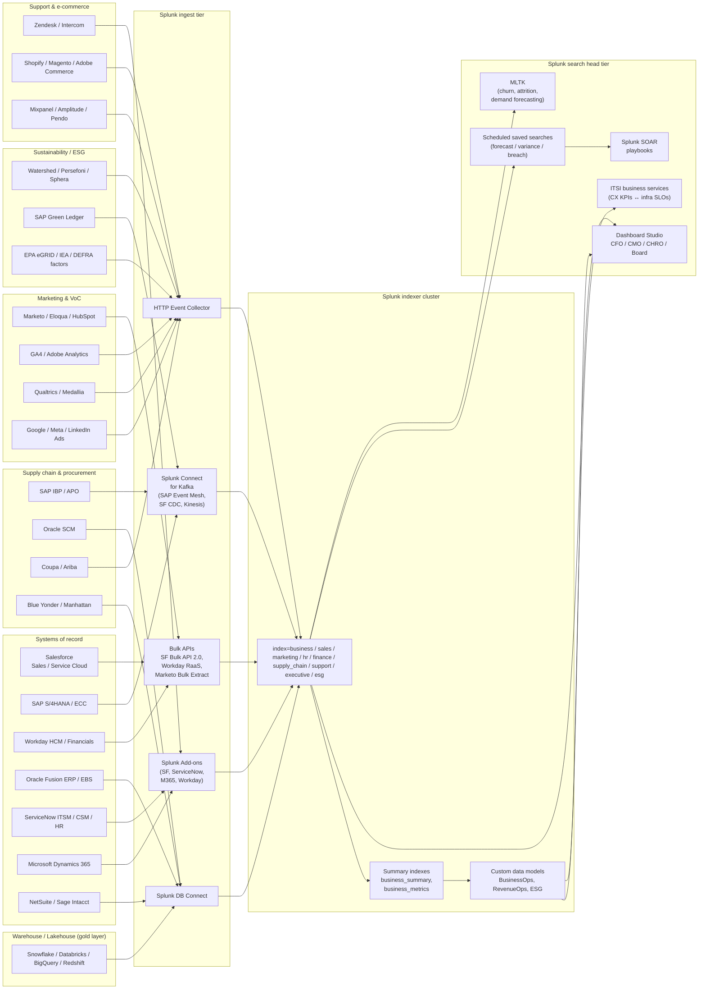

# Business Analytics — Customer Experience, Revenue, Marketing, HR, Supply Chain, Finance, Support, Executive KPIs & ESG with Splunk

> **Audience.** RevOps, FP&A, CFO / CEO staff, CHRO, CMO, supply-chain
> directors, customer-success leaders, sustainability officers,
> investor-relations partners, internal-audit, and the Splunk
> platform team that gives them all a single source of truth.
> **Scope.** All 63 use cases in **category 23 — Business Analytics**
> across nine subcategories (23.1 customer experience, 23.2 revenue &
> sales, 23.3 marketing, 23.4 HR & people, 23.5 supply chain, 23.6
> financial operations, 23.7 customer support, 23.8 executive
> dashboards, 23.9 ESG / sustainability), plus the cross-cutting
> integration patterns that bring **CRM**, **ERP**, **HCM**, marketing
> automation, customer-support, e-commerce, supply-chain, and
> sustainability data into Splunk for board-level reporting,
> attestable disclosures, and operational decision-making.
> **Goal.** Promote Splunk from "the IT log tool" to **the operating
> system of the business**: a single timeline where revenue,
> headcount, marketing spend, customer satisfaction, supplier OTIF,
> carbon emissions, and the systems that produce them are searched,
> alerted, and explained side-by-side with the same SPL grammar.

---

## 1. Why Splunk for business analytics

The classic business-analytics stack is fragmented: a CRM tool with
its own reporting engine, an ERP with its own GL drilldown, a marketing
suite with vendor dashboards, an HCM with packaged headcount tiles, a
support tool with its own SLA reports, a customer survey platform with
its own NPS chart, plus a bespoke ESG portal for the annual report.
Each tool answers its own slice of "how are we doing" and none of them
agrees on customer ID, opportunity ID, employee ID, supplier ID, or a
common time grain.

Splunk earns its place in this stack when it is used as the
**read-side join layer**: a place where every business event is
ingested in raw, append-only form, normalized through a small set of
field aliases (`customer_id`, `opportunity_id`, `worker_id`,
`supplier_id`, `gl_account`, `cost_center`, `fiscal_period`), and
correlated with the operational telemetry (RUM page-load times,
service health, infrastructure cost) that **also** lives in the same
indexer cluster. The result is a single pane that the CFO, the VP of
Sales, the CMO, and the head of customer success can each pivot on
without exporting to Excel.

| What this guide adds beyond a packaged BI tool | Why Splunk |
|---|---|
| **Real-time joins between business and operational data** (e.g. cart abandonment ↔ checkout-API p99 latency, ARR drop ↔ deployment marker) | Same index, same timestamp, same SPL — no nightly export |
| **Multi-source forecast accuracy auditing** (CRM stage history + warehouse fact tables + finance close) | Append-only ingestion preserves point-in-time snapshots, so re-stated forecasts are still discoverable |
| **Forensic explainability for board metrics** | Drill from a single executive KPI back to the raw API call that created the underlying record, in one click |
| **Attestable ESG disclosures** | Immutable summary indexes with role-based access satisfy CSRD / SOX<sup class="ref">[<a href="#ref-8">8</a>]</sup>-style audit-trail requirements without a separate sustainability platform |
| **Cross-product correlation** (revenue ↔ infra cost ↔ customer experience ↔ sustainability) | Splunk is already the system of record for IT — this guide extends that promise to the business |

This guide is **not** a replacement for Salesforce CRM Analytics, SAP
Analytics Cloud, Workday Prism, Adobe Customer Journey Analytics, or
Watershed. It is the **search-and-correlation layer** above all of
them and a board-ready presentation surface that survives any one
vendor swap.

---

## 2. Subcategory landscape (all 63 UCs)

| Sub | Theme | UCs | Crawl tier (now) | Walk tier (90 d) | Run tier (12 mo) |
|-----|-------|-----|------------------|------------------|------------------|
| **23.1** | Customer Experience & Digital Analytics | 9 | UC-23.1.1, UC-23.1.2, UC-23.1.3 | UC-23.1.4, UC-23.1.5, UC-23.1.8 | UC-23.1.6, UC-23.1.7, UC-23.1.9 |
| **23.2** | Revenue & Sales Operations | 8 | UC-23.2.1, UC-23.2.2 | UC-23.2.3, UC-23.2.5, UC-23.2.7 | UC-23.2.4, UC-23.2.6, UC-23.2.8 |
| **23.3** | Marketing Performance & Attribution | 7 | UC-23.3.1, UC-23.3.3 | UC-23.3.2, UC-23.3.4, UC-23.3.5 | UC-23.3.6, UC-23.3.7 |
| **23.4** | HR & People Analytics | 7 | UC-23.4.2, UC-23.4.4 | UC-23.4.1, UC-23.4.3, UC-23.4.5 | UC-23.4.6, UC-23.4.7 |
| **23.5** | Supply Chain & Operations | 7 | UC-23.5.2, UC-23.5.3 | UC-23.5.1, UC-23.5.4, UC-23.5.5 | UC-23.5.6, UC-23.5.7 |
| **23.6** | Financial Operations & Procurement | 6 | UC-23.6.1, UC-23.6.3 | UC-23.6.2, UC-23.6.4, UC-23.6.5 | UC-23.6.6 |
| **23.7** | Customer Support & Service Excellence | 6 | UC-23.7.1, UC-23.7.2 | UC-23.7.3, UC-23.7.5 | UC-23.7.4, UC-23.7.6 |
| **23.8** | Executive Dashboards & Business KPIs | 6 | UC-23.8.1, UC-23.8.2 | UC-23.8.3, UC-23.8.5 | UC-23.8.4, UC-23.8.6 |
| **23.9** | ESG & Sustainability Reporting | 7 | UC-23.9.2, UC-23.9.5 | UC-23.9.3, UC-23.9.4, UC-23.9.6 | UC-23.9.1, UC-23.9.7 |

**Maturity counts:** 17 crawl, 27 walk, 19 run. Start with the
**crawl** tier in your first quarter — they all use either DB Connect
to a warehouse or a Splunkbase add-on, and require no custom
modular-input work. The **walk** tier introduces stage-history
joins, real-time CDC streams, and behavioural product analytics.
The **run** tier is full multi-touch attribution, predictive
churn / attrition, perfect-order analytics, and Scope-3 carbon
accounting.

---

## 3. Reference architecture



### 3.1 Three ingestion paths, one summary tier

Every business-analytics use case in this category lands in **one of
three** ingestion paths. Knowing which path is right for which signal
prevents the most common failure mode (importing fact tables through
HEC and saturating indexers, or pulling dimension tables through
Bulk API every 15 minutes and exhausting Salesforce daily limits).

**Path A — Bulk API to HEC (for CRM / HCM / marketing snapshots)**
Use a custom Python modular input on a Heavy Forwarder for objects
that move slowly enough to ingest as full snapshots (Opportunity,
Worker, Lead, Marketo Contact). Authenticate with **JWT bearer**
(Salesforce, Eloqua), **OAuth client credentials** (HubSpot, Marketo),
or **Workday Reports as a Service (RaaS)** SOAP endpoints. Each row
becomes one HEC event with `_time` set from `LastModifiedDate` so the
Splunk timeline matches the source-of-record.

```ini
# inputs.conf — Heavy Forwarder ingest of Salesforce Opportunity
[script://$SPLUNK_HOME/etc/apps/TA_business_salesforce/bin/poll_opportunities_to_hec.py]
interval = 1800
disabled = 0
sourcetype = salesforce:opportunity
index = business
```

**Path B — Splunk DB Connect for warehouse fact tables**
For high-cardinality, high-row-count, append-mostly facts (sales
order lines, GL journals, NetFlow-like e-commerce events), pull from
the gold layer of your warehouse (Snowflake, Databricks, BigQuery,
Redshift, Synapse) on a **3–24 h cadence** with a `last_modified` /
`audit_dt` watermark. This is the right path for SAP CDS views, Oracle
GL journals, Workday Prism extracts, and any star schema you already
maintain.

```ini
# db_inputs.conf — Snowflake order-line replica
[db_inputs://snowflake_orderlines]
connection = snowflake_prod_ro
mode = batch
sourcetype = dbx:fact_orderline
index = business
query = SELECT order_id, line_id, sku, qty, gross_amt, currency, audit_dt FROM finance.fact_orderline WHERE audit_dt > ?
input_timestamp_column_full_name = audit_dt
input_timestamp_column_number = 7
```

**Path C — Splunk Connect for Kafka / event mesh**
For change-data-capture (Salesforce CDC, SAP Event Mesh, Debezium-fed
Postgres/Oracle/MS SQL), connect a Splunk indexer cluster to the
Kafka cluster with **Splunk Connect for Kafka 3.x**. Each business
event lands in `index=business` with sub-second freshness, perfect for
"deal just moved to Closed Won" or "PO line was just confirmed by
supplier" flows.

```yaml
# splunk-kafka-connector.json — sink for Salesforce CDC
{
  "name": "salesforce-cdc-sink",
  "config": {
    "connector.class": "com.splunk.kafka.connect.SplunkSinkConnector",
    "topics": "salesforce.cdc.opportunity,sap.eventmesh.po,debezium.netsuite.invoice",
    "splunk.hec.uri": "https://hec.splunk.example.com:8088",
    "splunk.hec.token": "${file:/etc/splunk/hec_token}",
    "splunk.indexes": "business,business,business",
    "splunk.sourcetypes": "salesforce:cdc:opportunity,sap:eventmesh:po,netsuite:cdc:invoice",
    "splunk.hec.json.event.formatted": "true",
    "splunk.hec.event.timestamp.regex": "\"event_time\":\"([^\"]+)\""
  }
}
```

Then build a thin **summary indexing** layer (`business_summary`,
`business_metrics`) so dashboards do not re-scan raw events on every
load. This is essential for executive boards and external auditors:
they get sub-second response and you keep the underlying raw events
for forensic drill-down.

```spl
| summary indexing the daily revenue + headcount rollup
index=business sourcetype=salesforce:opportunity StageName="Closed Won" earliest=-1d@d latest=@d
| stats sum(Amount) AS won_revenue dc(Id) AS won_deals BY ForecastCategoryName
| eval _time=relative_time(now(),"-1d@d")
| eval _raw="metric=won_revenue,won_deals category=".ForecastCategoryName." revenue=".won_revenue." deals=".won_deals
| collect index=business_summary sourcetype=biz:summary:revenue
```

### 3.2 Identity reconciliation

Every business-analytics dashboard fails the same way: the sales
team's "customer" is a Salesforce Account, the finance team's is a
billing-system Customer Master, the support team's is a Zendesk
Organization, and the data-science team's is a Snowflake `dim_customer`
hash. Splunk solves this with a **reconciliation lookup** maintained
nightly from the warehouse:

```spl
| inputlookup customer_master.csv
| eval canonical_customer_id=case(
    isnotnull(salesforce_account_id), salesforce_account_id,
    isnotnull(sap_kunnr), sap_kunnr,
    isnotnull(workday_supplier_id), workday_supplier_id,
    1==1, md5(coalesce(billing_email, legal_name)))
| outputlookup customer_master.csv
```

Then add automatic field aliases in `props.conf` so every business
sourcetype resolves to `canonical_customer_id`:

```ini
[salesforce:opportunity]
LOOKUP-account_to_customer = customer_master AccountId AS sf_account_id OUTPUT canonical_customer_id

[sap:cds:account_receivable]
LOOKUP-kunnr_to_customer = customer_master sap_kunnr AS KUNNR OUTPUT canonical_customer_id

[zendesk:ticket]
LOOKUP-zendesk_org_to_customer = customer_master zendesk_org_id AS organization_id OUTPUT canonical_customer_id
```

Once `canonical_customer_id` exists everywhere, a CFO question like
"how much support cost are we burning on the bottom-decile of revenue
customers?" resolves to a single tstats query.

---

## 4. Data sources by subcategory

### 4.1 Customer Experience (23.1)

| Signal | Source | Splunk path | Sourcetype |
|--------|--------|-------------|------------|
| Page-view, click, scroll, conversion event | GA4 BigQuery export → Splunk Connect for BigQuery (custom) or HEC | Path B / C | `googleanalytics4:event` |
| RUM (real-user monitoring) page-load, LCP, FID, CLS | Splunk Observability Cloud<sup class="ref">[<a href="#ref-7">7</a>]</sup> RUM SDK | Native Splunk Cloud | `splunk_rum:span` |
| Session-replay metadata (FullStory, LogRocket, Hotjar) | Vendor webhook → HEC | Path C | `fullstory:session` |
| Cart, checkout, order events | Shopify / Magento webhook → HEC | Path C | `shopify:cart`, `shopify:checkout` |
| App-store rating + review text | App Store Connect / Google Play Console API → custom mod input | Path A | `appstore:review`, `googleplay:review` |
| CSAT / NPS responses | Qualtrics / Medallia / Delighted webhook → HEC | Path C | `qualtrics:response`, `medallia:nps_response` |
| Form-field analytics (drop-off, time-on-field) | GA4 enhanced measurement, Heap, Mouseflow | Path B / C | `heap:form_event` |
| Customer-support ticket re-open | Zendesk Triggers webhook → HEC | Path C | `zendesk:reopen_event` |

### 4.2 Revenue & Sales Operations (23.2)

| Signal | Source | Splunk path | Sourcetype |
|--------|--------|-------------|------------|
| Opportunity snapshot | Salesforce Bulk API 2.0, Dynamics 365 Web API, HubSpot CRM API | Path A | `salesforce:opportunity`, `dynamics:opportunity`, `hubspot:deal` |
| Opportunity stage history | Salesforce CDC (Streaming API) → Kafka, OpportunityFieldHistory via Bulk API | Path A / C | `salesforce:cdc:opportunity`, `salesforce:opportunityfieldhistory` |
| Recognized revenue | SAP S/4HANA RV/CO-PA via Splunk Connect for SAP, Oracle Fusion GL via DB Connect | Path C / B | `sap:eventmesh:bsid`, `oracle:fusion:gl_journal` |
| Subscription / renewal | Zuora SOAP, Stripe Webhook, Recurly API | Path A / C | `zuora:subscription`, `stripe:invoice`, `recurly:subscription` |
| Pricing / discount approvals | Salesforce CPQ, SAP variant pricing tables | Path A / B | `salesforce:cpq:quote`, `sap:cds:pricing` |
| Quota & target | Workday Adaptive Planning, Anaplan, Xactly | Path A / B | `xactly:quota`, `anaplan:plan` |

### 4.3 Marketing Performance (23.3)

| Signal | Source | Splunk path | Sourcetype |
|--------|--------|-------------|------------|
| Lead snapshot + funnel stage | Marketo Bulk Extract API, Eloqua Bulk API, HubSpot Marketing API | Path A | `marketo:lead`, `eloqua:bulk:contact`, `hubspot:contact` |
| Email send / open / click / unsubscribe | Marketo activity API, Eloqua bulk activity, SendGrid webhook | Path A / C | `marketo:program_membership`, `sendgrid:event` |
| Paid-media spend & conversions | Google Ads API, Meta Marketing API, LinkedIn Ads API | Path A | `googleads:campaign`, `meta:ads:insights`, `linkedin:ads:campaign` |
| Web traffic + SEO rankings | GA4 export, Google Search Console API, Ahrefs / SEMrush API | Path B / A | `googleanalytics4:event`, `searchconsole:query` |
| DKIM / SPF / DMARC + delivery | DMARC aggregate XML reports → SC4S → indexer | SC4S (RFC 5424) | `dmarc:aggregate`, `dmarc:forensic` |
| Content / resource downloads | Marketo, Pardot, Drift, Intercom webhooks | Path C | `marketo:resource_download`, `pardot:visitor_activity` |

### 4.4 HR & People Analytics (23.4)

| Signal | Source | Splunk path | Sourcetype |
|--------|--------|-------------|------------|
| Worker snapshot, headcount, attrition | Workday RaaS, SuccessFactors OData, Microsoft Graph (Entra workers) | Path A | `workday:raas:headcount`, `workday:raas:turnover`, `successfactors:worker` |
| Requisition + time-to-hire | Workday Recruiting, Greenhouse, Lever, iCIMS | Path A | `workday:raas:requisition`, `greenhouse:application`, `lever:opportunity` |
| Diversity dimensions | Workday self-ID + EEO categories (sensitive) | Path A — encrypted index | `workday:raas:diversity` (restricted) |
| Training compliance | Workday Learning, Cornerstone OnDemand, LinkedIn Learning, Pluralsight | Path A | `workday:learning_completion`, `cornerstone:enrollment` |
| Absence / leave | Workday Absence, ADP, UKG, Kronos | Path A / B | `workday:absence`, `adp:time_event` |
| Internal mobility | Workday Talent Marketplace, Gloat, Fuel50 | Path A | `workday:talent_marketplace`, `gloat:opportunity` |
| Overtime / time-clock | UKG / Kronos, ADP timecards, Workday time tracking | Path A / B | `ukg:timeclock`, `adp:time_event`, `workday:time_event` |

### 4.5 Supply Chain & Operations (23.5)

| Signal | Source | Splunk path | Sourcetype |
|--------|--------|-------------|------------|
| Order header / line | SAP S/4HANA VBAK / VBAP via Splunk Connect for SAP, Oracle SCM via DB Connect | Path C / B | `sap:eventmesh:vbak`, `oracle:scm:order_line` |
| Inventory snapshot | SAP MARD / WMS, Manhattan, Blue Yonder, NetSuite Inventory | Path B / C | `sap:cds:mard`, `manhattan:inventory_snapshot` |
| Supplier OTIF | SAP confirmation tables, Coupa, Ariba SLA reports | Path C / A | `sap:cds:supplier_confirmation`, `coupa:po_event` |
| Delivery SLA | SAP TM, Manhattan, Project44, FourKites | Path C | `sap:tm:shipment`, `project44:tracking_event` |
| Production throughput | MES (Rockwell, Honeywell, AVEVA, Siemens), OT historian (PI System, Ignition) | Path C | `mes:production_event`, `pi:tag_value` |
| Returns / RMA | Service Cloud Returns, Magento RMA, ZenDesk Returns | Path A / C | `salesforce:returns`, `magento:rma` |

### 4.6 Financial Operations (23.6)

| Signal | Source | Splunk path | Sourcetype |
|--------|--------|-------------|------------|
| AR aging | SAP BSID/BSAD, Oracle AR_PAYMENT_SCHEDULES, NetSuite Customer Balance | Path B / C | `sap:cds:account_receivable`, `oracle:ar:aging` |
| Expense report | SAP Concur, Coupa Expense, Brex, Ramp | Path A / C | `concur:expense`, `coupa:expense_report` |
| Budget vs actual | Workday Adaptive, Anaplan, Hyperion, SAP BPC | Path A / B | `workday:adaptive:variance`, `anaplan:variance` |
| Payment success | Stripe, Adyen, Braintree, Worldpay, BACS direct-debit returns | Path C | `stripe:payment_intent`, `adyen:notification` |
| PO cycle / maverick spend | Coupa, Ariba, SAP MM, Oracle iProcurement | Path A / B | `coupa:po`, `sap:cds:ekko` |
| Intercompany reconciliation | SAP ICMR, BlackLine, OneStream | Path A / B | `blackline:reconciliation`, `sap:icmr_exception` |

### 4.7 Customer Support (23.7)

| Signal | Source | Splunk path | Sourcetype |
|--------|--------|-------------|------------|
| Case / ticket lifecycle | Salesforce Service Cloud, Zendesk, Intercom, ServiceNow CSM, Freshdesk | Path A / Add-on | `salesforce:case`, `zendesk:ticket`, `servicenow:csm:case` |
| Backlog age + breach risk | Same case-source-system Bulk API, queries computed in SPL | Path A | as above |
| Agent occupancy | Genesys, Five9, Talkdesk, NICE inContact, Salesforce Omni-Channel Supervisor | Path A / C | `genesys:agent_state`, `omnichannel:agent_routing` |
| Knowledge deflection | Salesforce Knowledge, Zendesk Guide, ServiceNow Knowledge, Intercom Articles | Path A | `salesforce:knowledge_view`, `zendesk:article_view` |
| Customer Effort Score / CSAT | Qualtrics, Medallia, Delighted, native CSAT in support tools | Path C | `qualtrics:response`, `zendesk:satisfaction_rating` |

### 4.8 Executive Dashboards (23.8)

This subcategory is **derived** from the others — it does not own any
new ingestion path. Build it as a pure summary-indexing layer that
rolls up:

- **Daily** revenue, bookings, ARR, NRR, GRR, NPS, CSAT, OTIF, attrition.
- **Weekly** pipeline coverage, MQL→SQL→opportunity conversion, CAC payback.
- **Monthly** budget variance, ESG metrics, cash conversion cycle.
- **Quarterly** Rule-of-40, Magic Number, board-ready scorecard.

```spl
| daily executive scorecard
index=business_summary earliest=@d-1d latest=@d
| stats sum(eval(if(metric="won_revenue",revenue,0))) AS daily_won_revenue
        sum(eval(if(metric="csat_score",numerator,0))) AS daily_csat_num
        sum(eval(if(metric="csat_score",denominator,0))) AS daily_csat_den
        sum(eval(if(metric="otif",numerator,0))) AS daily_otif_num
        sum(eval(if(metric="otif",denominator,0))) AS daily_otif_den
| eval csat_pct=round(100*daily_csat_num/daily_csat_den,1)
| eval otif_pct=round(100*daily_otif_num/daily_otif_den,1)
```

### 4.9 ESG & Sustainability (23.9)

| Signal | Source | Splunk path | Sourcetype |
|--------|--------|-------------|------------|
| Scope 1 (direct emissions) | SAP Green Ledger, Watershed, Persefoni, Sphera, Diligent ESG | Path A / C | `watershed:emissions:scope1`, `sap:greenledger:emissions` |
| Scope 2 (purchased electricity) | Energy bills via OCR + grid factor lookup (EPA eGRID, IEA, DEFRA, AIB) | Path A | `watershed:emissions:scope2`, `epa:egrid:factor` |
| Scope 3 (value-chain) | Spend-based + activity-based + hybrid methodologies — Watershed, Persefoni, EcoVadis, supplier surveys | Path A / B | `watershed:emissions:scope3`, `ecovadis:supplier_score` |
| Energy efficiency by facility | Building management systems (BMS) — Schneider EcoStruxure, Honeywell, Johnson Controls, Siemens Desigo | Path C | `bms:energy_meter`, `pi:energy_tag` |
| Waste diversion | Waste-hauler invoices, on-site weighing, Rubicon, Quantis | Path A | `waste:diversion_event` |
| Water consumption | BMS water meters, utility bills, Plant-IT historian | Path C | `bms:water_meter` |
| Renewable share + green tariff | EAC / REC / GO certificate registries (M-RETS, Green-e, AIB) | Path A | `mrets:rec_event`, `green_e:certificate` |
| ESG disclosure readiness | OneTrust ESG, Workiva, Diligent ESG, Persefoni, Watershed audit log | Path A | `csrd:disclosure`, `workiva:disclosure_status` |

---

## 5. Configuration walkthrough

### 5.1 Salesforce Bulk API 2.0 (Path A — primary CRM ingest)

The fastest, most-supported way to land complete Salesforce snapshots
in Splunk is a **Bulk API 2.0 query job** authenticated with **JWT
bearer**. The `Splunk_TA_salesforce` add-on focuses on EventLogFile
sourcetypes and is **not** a full sObject ingest path.

**Step 1 — Salesforce setup.**
1. **Setup → App Manager → New Connected App.** Enable OAuth, select
   **Use digital signatures**, upload the X.509 public half of a
   private key you hold on the Heavy Forwarder. Grant scopes `api`,
   `refresh_token`, `offline_access`.
2. Create an integration user and assign a permission set with
   **API Enabled**, **View All** on Opportunity, Account, Contact,
   Lead, Case, Quote, OpportunityLineItem, OpportunityFieldHistory,
   plus field-level read on `Amount`, `Probability`,
   `ForecastCategoryName`, etc.
3. Configure **My Domain** and **Enhanced Domains** if not already.

**Step 2 — Heavy Forwarder app.**
Drop a `TA_business_salesforce` app on a HF with this layout:

```text
TA_business_salesforce/
├── default/
│   └── inputs.conf            # one stanza per sObject
├── local/
│   └── salesforce.conf        # encrypted: client_id, key_path, sub
├── bin/
│   ├── poll_opportunities_to_hec.py
│   ├── poll_accounts_to_hec.py
│   └── lib/
│       ├── jwt_oauth.py
│       └── bulk_api2.py
└── README.md
```

Each poller writes a checkpoint file (`$SPLUNK_HOME/var/lib/splunk/modinputs/salesforce_opportunity.ckpt`)
holding the last `LastModifiedDate` watermark so reruns are idempotent.

**Step 3 — Indexer parsing.**
On the indexer cluster (or HF if parsing-on-HF), define each sObject
sourcetype:

```ini
[salesforce:opportunity]
LINE_BREAKER = ([\r\n]+)
TRUNCATE = 1000000
TIME_FORMAT = %Y-%m-%dT%H:%M:%S.%3N%z
TIMESTAMP_FIELDS = LastModifiedDate
KV_MODE = json
SHOULD_LINEMERGE = false
disabled = false
```

**Step 4 — Field aliases for cross-system joins.**
```ini
[salesforce:opportunity]
FIELDALIAS-canonical_customer = AccountId AS canonical_customer_id
FIELDALIAS-fiscal_period = FiscalQuarter AS fiscal_period
EVAL-revenue_usd = if(CurrencyIsoCode=="USD", Amount, Amount * lookup(currency_rates, CurrencyIsoCode, "rate_usd"))
```

### 5.2 Splunk DB Connect (Path B — warehouse ingest)

For the Snowflake / Databricks / BigQuery / Redshift / Synapse gold
layer, use Splunk DB Connect 3.18+ with read-only service identities.

**Identity hardening checklist** (per the database-security rule):
- Connection strings stored in DB Connect's encrypted store, never in `default/db_connections.conf`.
- Read-only service user with `SELECT` only on the gold-layer schema.
- TLS 1.2+ enforced on every connection (`encrypt=true` for SQL Server, `sslmode=require` for Postgres, `?ssl=on` for MySQL, native TLS for Snowflake / BigQuery).
- Network isolation: the Splunk DB Connect server runs in a security-group / firewall zone with egress *only* to the warehouse's private endpoint.
- Row-count and runtime caps on every input to prevent runaway extracts (`max_rows = 1000000`, `query_timeout = 600`).

**Sample `db_inputs.conf`:**
```ini
[db_inputs://snowflake_dim_customer_daily]
connection = snowflake_prod_ro
mode = batch
sourcetype = dbx:snowflake:dim_customer
index = business
ui_query_mode = simple
query = SELECT customer_id, name, segment, region, contract_value, last_renewal_date, audit_dt FROM analytics.gold.dim_customer WHERE audit_dt > ?
input_timestamp_column_full_name = audit_dt
input_timestamp_column_number = 7
tail_rising_column_full_name = audit_dt
tail_rising_column_number = 7
interval = 7200
max_rows = 1000000
query_timeout = 600
```

### 5.3 Splunk Connect for Kafka (Path C — real-time CDC)

Salesforce CDC, SAP Event Mesh, Debezium, Kinesis, Pub/Sub all land
through **Splunk Connect for Kafka 3.x**. Use it as a **sink**
(Kafka → Splunk via HEC) so you keep your existing Kafka cluster and
schema registry.

**Critical hardening** (per supply-chain + transport rules):
- mTLS between Kafka workers and Splunk HEC.
- Per-topic ACLs on the Kafka cluster — the connector's principal can only `read` the business topics it sinks.
- HEC token created with `useACK = true` so retries are explicit and exactly-once on the Splunk side.
- Connector image pinned by digest (`splunk/kafka-connect-splunk@sha256:...`) and signed via Cosign.
- DLQ topic enabled to capture parse failures for forensic recovery.

```json
{
  "name": "salesforce-cdc-business-sink",
  "config": {
    "connector.class": "com.splunk.kafka.connect.SplunkSinkConnector",
    "tasks.max": "4",
    "topics.regex": "salesforce\\.cdc\\.(opportunity|account|case|lead)",
    "splunk.hec.uri": "https://hec.splunk.example.com:8088",
    "splunk.hec.token": "${file:/etc/splunk/hec_token}",
    "splunk.hec.ack.enabled": "true",
    "splunk.hec.ack.poll.interval": "10",
    "splunk.indexes": "business",
    "splunk.sourcetypes": "salesforce:cdc",
    "splunk.hec.json.event.formatted": "true",
    "splunk.hec.event.timestamp.regex": "\"event_time\":\"([^\"]+)\"",
    "splunk.hec.json.event.enrichment": "kafka_topic=${topic},kafka_partition=${partition}",
    "errors.deadletterqueue.topic.name": "salesforce-cdc-dlq",
    "errors.deadletterqueue.context.headers.enable": "true"
  }
}
```

### 5.4 Workday RaaS (Path A — HCM snapshots)

Workday's preferred external integration is **Reports as a Service
(RaaS)** — a SOAP endpoint that returns CSV / XML / JSON for any
Workday Custom Report.

**Pattern:**
1. Build a Workday Custom Report with the columns the HR analytics use cases need (worker_id, employee_type, business_title, manager_id, location, hire_date, termination_date, termination_reason, etc.).
2. Enable **Web Service** output on the report and set **Authentication** to **Basic Auth over TLS** with an Integration System User (ISU) that has **Get_Workers** permission *only*.
3. From a Heavy Forwarder modular input, `GET https://wd5-impl-services1.workday.com/ccx/service/customreport2/<tenant>/<isu>/<report_name>?format=json` and emit one HEC event per worker row.
4. Parse XXE-safely in Python with `defusedxml` (per the XML security rule), never with `xml.etree.ElementTree.parse` on untrusted streams.

```python
# poll_workday_headcount_to_hec.py — abbreviated, no secrets
import os, json, time, requests
from defusedxml import ElementTree as DET
from splunk_hec import HECClient  # tiny helper

WORKDAY_REPORT_URL = os.environ["WORKDAY_REPORT_URL"]
WORKDAY_USER = os.environ["WORKDAY_USER"]
WORKDAY_PASS = os.environ["WORKDAY_PASS"]  # injected from secrets manager
HEC_URL = os.environ["HEC_URL"]
HEC_TOKEN = os.environ["HEC_TOKEN"]

resp = requests.get(
    WORKDAY_REPORT_URL + "?format=json",
    auth=(WORKDAY_USER, WORKDAY_PASS),
    timeout=300,
    verify=True,
)
resp.raise_for_status()

hec = HECClient(HEC_URL, HEC_TOKEN, sourcetype="workday:raas:headcount", index="hr")
for worker in resp.json().get("Report_Entry", []):
    hec.send(worker, time_field="effective_date")
hec.flush()
```

### 5.5 SAP via Splunk Connect for SAP

For S/4HANA and ECC, prefer **Splunk Connect for SAP** which uses
**ABAP custom transactions + HEC** to stream BAPI / RFC / IDoc
events without requiring a third-party message broker. Pair it with
the **Splunk Add-on for SAP HANA** for HANA-side audit and
performance metrics.

For event-driven flows, **SAP Event Mesh → Kafka → Splunk Connect for
Kafka** delivers CDC-grade freshness on PO confirmations, invoice
postings, and material movements.

### 5.6 ServiceNow CSM + HR Cases

The **Splunk Add-on for ServiceNow (1928)** supports CSM and HR Cases
out of the box once you flip the `csm_case` and `hr_case` table
inputs in `inputs.conf`. **Do not** enable `sys_audit` or
`sys_journal_field` against very large instances without first
applying the documented `sys_created_on >` watermark — full table
scans crash the integration runner.

### 5.7 Marketing platform ingest (Marketo / Eloqua / HubSpot)

All three vendors expose a **Bulk Extract API** for backfilling and a
**webhook** for near-real-time deltas. Pair them: nightly Bulk Extract
to land the canonical snapshot, webhook for lead-status changes, and
reconcile in SPL via `customer_master.csv`.

---

## 6. Compliance, governance, and segregation of duties

Business analytics data is **regulated data** the moment it leaves
the source system. This guide enforces those obligations as
configuration, not policy memos.

### 6.1 Index-level role separation

| Index | Sensitivity | Authorized roles | Retention |
|-------|-------------|------------------|-----------|
| `business` | Confidential business data | revops_analyst, fp_a, executive_view | 24 months |
| `business_summary` | Aggregated, audit-attestable | board_view, audit, executive_view | 7 years (SOX 404) |
| `business_metrics` | Aggregated, metrics-grade | board_view, ml_engineer | 13 months |
| `hr` | Confidential personnel data + SPI | hr_view (locked-down), payroll | 5 years (varies by jurisdiction) |
| `hr_diversity` | Special-category personal data | hr_diversity_view (3 named users) | 13 months — strict need-to-know |
| `finance` | Material non-public information (MNPI) | mnpi_view (closed list, MAR controlled) | 7 years (SOX 404) |
| `esg` | Mandatory disclosures (CSRD, SFDR, IFRS S2) | esg_view, audit | 10 years (CSRD double-materiality requirement) |
| `support` | Customer-identifiable data | support_view | 36 months |

### 6.2 Field-level redaction for PII / SPI

Use `props.conf` SEDCMD or transforms.conf REGEX rules to redact
sensitive fields at index-time when the downstream search role does
not have a need-to-know. Never store unredacted SPI behind a
permissions-only gate — accidental role grants leak it.

```ini
# Redact SSN on ingest (SOX-controlled finance index has different rules)
[hr_redact]
SEDCMD-ssn = s/"social_security_number":"\d{3}-\d{2}-\d{4}"/"social_security_number":"REDACTED"/g
SEDCMD-dob = s/"date_of_birth":"\d{4}-\d{2}-\d{2}"/"date_of_birth":"REDACTED"/g
```

### 6.3 Mandatory framework alignment

| Framework | Coverage in this guide |
|-----------|------------------------|
| **SOX 404 (US)** | Immutable summary indexes for revenue, AR aging, expense, intercompany; segregation-of-duties via index-level RBAC; ITGC controls on the Bulk-API integration users (per UC-22.13.x) |
| **CSRD (EU)** | ESG ingestion (23.9) is the technical implementation of CSRD's mandatory disclosures; immutable `esg` index with 10-year retention satisfies the audit trail; double-materiality assessment supported by `business_summary` cross-cuts |
| **EU AI Act<sup class="ref">[<a href="#ref-3">3</a>]</sup>** | Predictive HR (UC-23.4.1, UC-23.4.6) is **high-risk AI** under Annex III: log model inputs, predictions, and outcomes in an `ai_governance` index with the controls in [`docs/guides/ai-llm-observability.md`](ai-llm-observability.md) |
| **GDPR<sup class="ref">[<a href="#ref-1">1</a>]</sup> (EU) / UK GDPR<sup class="ref">[<a href="#ref-11">11</a>]</sup> / CCPA / LGPD** | Behavioural analytics in 23.1 must respect data-subject rights; tag every `googleanalytics4:event` and `mixpanel:event` with a `consent_status` field at ingest, and apply automated deletion via [`scripts/audit_uc_structure.py`](../../scripts/audit_uc_structure.py)-style summary cleanup |
| **PCI-DSS v4** | Payment success rate (UC-23.6.4) must never index PAN; tokenize at the source and only ingest `last4` + `bin_hash` |
| **MAR (EU Market Abuse Regulation)** | Pipeline / forecast data is MNPI: lock `finance` index to a closed list, log every search via Splunk audit, and integrate with the insider-list workflow defined in [`docs/guides/regulatory-compliance-master.md`](regulatory-compliance-master.md) |
| **DORA<sup class="ref">[<a href="#ref-2">2</a>]</sup> (EU)** | Operational resilience for financial KPI systems: business KPI dashboards (23.8) are **critical or important functions** and inherit DORA Art. 16-17 incident-reporting timelines |
| **HIPAA<sup class="ref">[<a href="#ref-10">10</a>]</sup> (US)** | Healthcare HR data (23.4) referencing benefits or wellness must follow Business Associate Agreement (BAA) terms — segregate `hr_health` index and document in the Risk Register |

---

## 7. Sizing and licensing

Approximate **daily ingest volume** for a mid-market enterprise
(1,000 employees, $200M ARR, omnichannel retail or B2B SaaS):

| Source | Daily volume | Notes |
|--------|--------------|-------|
| Salesforce Opportunity / Account / Contact / Lead snapshots | 50 – 200 MB | Bulk API every 30 min, deduped on `LastModifiedDate` |
| Salesforce CDC (real-time) | 100 – 500 MB | All sObject changes; throttle to objects you actually need |
| ServiceNow CSM + HR cases | 30 – 150 MB | Webhooks + nightly delta |
| Workday RaaS daily snapshot | 10 – 30 MB | One row per active worker + 30 days of changes |
| SAP S/4HANA via Splunk Connect for SAP | 200 MB – 2 GB | Depends on order volume; use sourcetype-level routing |
| Marketo / HubSpot lead snapshots + activity | 100 – 400 MB | Bulk Extract nightly + webhook real-time |
| GA4 BigQuery export | 500 MB – 5 GB | One row per event; sample if uncalibrated |
| Mixpanel / Amplitude product analytics | 200 MB – 2 GB | Funnel + behavior events |
| Zendesk / ServiceNow CSM cases + comments | 50 – 200 MB | Per organization |
| ESG ingestion (Watershed / Persefoni) | 5 – 20 MB | Daily emissions facts |
| **Sum (median)** | **2 – 10 GB / day** | ~70 GB – 300 GB / month |

**Workload pricing (Splunk Cloud).** Business analytics is generally
classified as **Detection / Reporting** workload, with summary-indexed
metrics graduated to **Metrics** workload. Use the FinOps guide
([`docs/guides/finops-cost-capacity.md`](finops-cost-capacity.md)) to
forecast per-search compute.

**Bucket sizing (Splunk Enterprise).**
Hot/warm: 30 days at 5 GB/day = 150 GB. Cold: 11 months at the same
rate = ~1.5 TB. Frozen: SOX-mandated 7 years for `business_summary` =
~3.8 TB compressed (roughly 1.2 TB on cheap object storage).

---

## 8. Crawl / Walk / Run roadmap

### Crawl (first 90 days, 17 use cases)

Land the **already-shipped** systems-of-record snapshots and stand up
the executive scorecard. Outcome: weekly CFO email blast and a single
Dashboard Studio board the CEO can pull up in any meeting.

| Sub | UC | Deliverable | Effort |
|-----|----|-------------|--------|
| 23.1 | UC-23.1.1, UC-23.1.2, UC-23.1.3 | Conversion funnel, cart abandonment, page-load impact panels | 5–8 d |
| 23.2 | UC-23.2.1, UC-23.2.2 | Pipeline coverage + bookings panels for sales calls | 5 d |
| 23.3 | UC-23.3.1, UC-23.3.3 | Marketing ROI + email engagement | 4 d |
| 23.4 | UC-23.4.2, UC-23.4.4 | Time-to-hire + training compliance | 4 d |
| 23.5 | UC-23.5.2, UC-23.5.3 | Inventory + supplier OTIF | 5 d |
| 23.6 | UC-23.6.1, UC-23.6.3 | AR aging + budget vs actual | 5 d |
| 23.7 | UC-23.7.1, UC-23.7.2 | SLA breach + FCR | 4 d |
| 23.8 | UC-23.8.1, UC-23.8.2 | CEO/CFO scorecard + ops productivity | 6 d |
| 23.9 | UC-23.9.2, UC-23.9.5 | Energy efficiency + ESG disclosure readiness | 5 d |

### Walk (90–180 days, 27 use cases)

Add stage-history joins, real-time CDC, churn / attrition prediction,
multi-touch attribution, and CSAT correlation with operational SLOs.

### Run (180+ days, 19 use cases)

Multi-touch attribution, predictive churn / attrition, perfect-order
analytics, Rule-of-40 / Magic Number, full Scope-3 carbon accounting
across the supply chain.

---

## 9. Dashboards and reporting cadence

| Audience | Cadence | Surface | Source data |
|----------|---------|---------|-------------|
| **Board** | Quarterly | PDF + signed Splunk snapshot | `business_summary`, `esg`, `business_metrics` |
| **CEO / CFO** | Daily 7am | Dashboard Studio + email blast | `business_summary` |
| **VP Sales / RevOps** | Weekly Mon 9am | Pipeline coverage board | `business`, `salesforce:opportunity` |
| **CMO / Marketing Ops** | Weekly Tue 9am | Lead-to-revenue, ROAS | `marketing`, `business_summary` |
| **CHRO / People Analytics** | Weekly + monthly | Attrition, hiring, training | `hr`, `business_summary` |
| **COO / Supply Chain** | Daily 6am | OTIF + inventory | `supply_chain` |
| **CFO / Controller** | Daily, monthly close | AR aging, variance, intercompany | `finance`, `business_summary` |
| **Customer Success / Support** | Daily 8am | SLA breach, agent occupancy | `support` |
| **Sustainability Officer** | Monthly + annual | Scope 1/2/3, CSRD readiness | `esg`, `business_summary` |
| **Internal Audit** | On-demand | Forensic drilldown across all indexes | All — read-only |
| **External Auditor** | Annual + interim | Read-only `business_summary` + `esg` | `business_summary`, `esg` (frozen tier) |

### Sample executive Dashboard Studio JSON snippet

```json
{
  "title": "Daily Executive Scorecard",
  "description": "Single-pane view of revenue, support, supply chain, and emissions for the CEO/CFO.",
  "inputs": {
    "input_global_period": {
      "type": "input.timerange",
      "options": {
        "defaultValue": {
          "earliest": "@d-1d",
          "latest": "@d"
        }
      },
      "title": "Period",
      "label": "Reporting Period"
    }
  },
  "defaults": {
    "dataSources": {
      "ds.search": {
        "options": {
          "queryParameters": {
            "earliest": "$input_global_period.earliest$",
            "latest": "$input_global_period.latest$"
          }
        }
      }
    }
  }
}
```

---

## 10. Troubleshooting playbook

| Symptom | Root cause | Fix |
|---------|------------|-----|
| Salesforce Opportunity ingest stops at 09:00 UTC every day | Daily API limit hit by competing integrations | Move to Bulk API 2.0 (counts as 1 call per job, not per row); contact Salesforce admin to bump org limits |
| `Amount` is `null` in Splunk while UI shows balance | Field-level security (FLS) on integration user | Setup → Object Manager → Opportunity → Fields → Amount → Set FLS read for the integration profile |
| DB Connect input shows `Connection timed out` overnight | Warehouse maintenance window or service-account password rotation | Stage rotation in vault; add retry/backoff; alert on `MODULAR_INPUT` warnings |
| Workday RaaS returns HTTP 401 after a tenant refresh | ISU credentials reset | Re-issue ISU password; rotate from secrets manager and bounce input |
| ServiceNow CSM Case input falls behind by hours | `sys_audit` table input enabled inadvertently | Disable; only enable `csm_case`, `kb_knowledge_view` with watermarks |
| Kafka connector throws `acknowledgements not received` | HEC cluster degraded or token quota exceeded | Increase `splunk.hec.ack.poll.interval`; check indexer queue health; verify token rate limit |
| Marketing dashboards show duplicated leads | Marketo Bulk Extract overlapping with webhook | Deduplicate on `lead_id`+`event_time` in summary indexing layer |
| Scope 2 emissions look 50% off year-over-year | Grid factor lookup table stale | Refresh EPA eGRID + IEA + DEFRA factor lookups quarterly; document in `esg` runbook |
| Executive dashboard slow to load | Re-scanning raw events on every render | Move to summary indexing; serve from `business_summary` for sub-second load |
| AR aging report does not match SAP F.30 | Posting-date vs document-date confusion | Pin to `BUDAT` (posting date) not `BLDAT` (document date) for SOX consistency |
| HR diversity dashboard accidentally accessible to managers | Role inheritance through `hr_view` | Move diversity to `hr_diversity` index with named-user-only role |

---

## 11. SOAR / automation playbooks

Splunk SOAR can close the loop on business-analytics signals when the
response is repeatable and auditable.

| Trigger | Playbook | Tooling |
|---------|----------|---------|
| Pipeline coverage <2× with <5 days to quarter end | Page CFO + VP Sales; create ServiceNow exec ticket; auto-schedule recalibration call | SOAR + Slack + ServiceNow + Outlook calendar |
| Cart abandonment spike >2σ on checkout API | Page checkout-engineering on-call; open Jira incident; correlate with deployment marker | SOAR + PagerDuty + Jira + Splunk Observability Cloud |
| Customer support backlog >24h breach risk | Auto-escalate ticket via Zendesk API; post in #support-leadership Slack | SOAR + Zendesk |
| AR aging >90d for a top-decile customer | Auto-create Salesforce task for AE; notify CFO; pause auto-renewal | SOAR + Salesforce + Outlook |
| HR attrition prediction high for a critical-skill cohort | Notify HRBP and people-analytics lead; create retention plan ticket | SOAR + Workday + Slack |
| Scope 3 supplier emissions data missing >7 days | Open Coupa supplier task; email supplier sustainability contact | SOAR + Coupa |
| Marketing ROAS drops >30% week-over-week on a paid campaign | Pause campaign in Google/Meta Ads via API; notify CMO; create remediation ticket | SOAR + Google Ads API + Meta Marketing API |

---

## 12. Cross-product integration

| Splunk product | Use in business analytics |
|----------------|---------------------------|
| **Splunk ITSI<sup class="ref">[<a href="#ref-6">6</a>]</sup>** | Build "Customer Experience" and "Order-to-Cash" business services with KPIs that stitch RUM page-load, checkout API latency, and cart-conversion rate together |
| **Splunk Observability Cloud** | RUM ↔ revenue correlation: every dropped checkout is joined to the precise span that failed |
| **Splunk Enterprise Security** | Insider-trading detection on MNPI access, executive scorecard data exfiltration, and HR-data abuse |
| **Splunk SOAR** | Auto-close on business-driven incidents (cart abandonment, AR aging, supplier OTIF breach) |
| **AI / LLM Observability (cat 13.4)** | Token-cost budgeting for GenAI demand-forecasting models; PII redaction on prompts containing customer identifiers |
| **FinOps & Cost (cat 20)** | Unit economics — IT spend per ARR dollar, cost-per-customer, cost-per-employee |
| **Industry Verticals (cat 21)** | Vertical KPIs that subclass the cat-23 patterns (retail conversion, healthcare Star Ratings, financial-services NPS) |
| **Regulatory Compliance Master (cat 22)** | SOX 404 ITGC + business-process controls, CSRD double-materiality, EU AI Act high-risk classification |

---

## 13. References

- [Salesforce Bulk API 2.0 reference](https://developer.salesforce.com/docs/atlas.en-us.api_asynch.meta/api_asynch/asynch_api_reference.htm)
- [Salesforce JWT bearer flow](https://help.salesforce.com/s/articleView?id=sf.remoteaccess_oauth_jwt_flow.htm)
- [Splunk Add-on for Salesforce (Splunkbase 4146)](https://splunkbase.splunk.com/app/4146)
- [Splunk DB Connect (Splunkbase 2686)](https://splunkbase.splunk.com/app/2686)
- [Splunk Connect for SAP (Splunkbase 5751)](https://splunkbase.splunk.com/app/5751)
- [Splunk Add-on for ServiceNow (Splunkbase 1928)](https://splunkbase.splunk.com/app/1928)
- [Splunk Add-on for Microsoft Cloud Services (Splunkbase 3110)](https://splunkbase.splunk.com/app/3110)
- [Splunk Connect for Kafka](https://github.com/splunk/kafka-connect-splunk)
- [Workday Reports as a Service (RaaS) overview](https://community.workday.com)
- [GHG Protocol Corporate Standard](https://ghgprotocol.org/corporate-standard)
- [GHG Protocol Scope 3 Standard](https://ghgprotocol.org/standards/scope-3-standard)
- [EU CSRD overview (European Commission)](https://finance.ec.europa.eu/capital-markets-union-and-financial-markets/company-reporting-and-auditing/company-reporting/corporate-sustainability-reporting_en)
- [EPA eGRID (US grid emissions factors)](https://www.epa.gov/egrid)
- [IEA emission factors](https://www.iea.org/data-and-statistics/data-product/emissions-factors-2024)
- [DEFRA UK conversion factors](https://www.gov.uk/government/collections/government-conversion-factors-for-company-reporting)
- [FinOps Foundation Framework](https://www.finops.org/framework/)

---

## 14. Related Splunk catalog guides

- [`docs/guides/regulatory-compliance-master.md`](regulatory-compliance-master.md) — SOX, CSRD, GDPR, EU AI Act control mapping
- [`docs/guides/finops-cost-capacity.md`](finops-cost-capacity.md) — IT cost ↔ business outcome unit economics
- [`docs/guides/ai-llm-observability.md`](ai-llm-observability.md) — GenAI demand-forecasting governance
- [`docs/guides/splunk-observability-cloud.md`](splunk-observability-cloud.md) — RUM ↔ revenue correlation
- [`docs/guides/industry-verticals.md`](industry-verticals.md) — vertical-specific KPIs that extend cat-23
- [`docs/guides/service-management-itsm.md`](service-management-itsm.md) — Incident impact on business KPIs
- [`docs/guides/active-directory-entra-id.md`](active-directory-entra-id.md) — Identity reconciliation for `worker_id`
- [`docs/guides/email-collaboration.md`](email-collaboration.md) — Microsoft Graph + Workday HR data joins

---

<!-- BEGIN-AUTOGENERATED-SOURCES -->

## References

*Auto-generated by `scripts/generate_doc_references.py` from `data/source-references.json` and `data/source-mappings.json`. Edit those files (or the document body) to change citations; this footer is rewritten on every run.*

### Supporting sources

<a id="ref-1"></a>**[1]** European Parliament and Council of the European Union. (2016, April). *Regulation (EU) 2016/679 — General Data Protection Regulation*. Official Journal of the European Union, L 119. ELI: reg/2016/679. https://eur-lex.europa.eu/eli/reg/2016/679/oj

<a id="ref-2"></a>**[2]** European Parliament and Council of the European Union. (2022, December). *Regulation (EU) 2022/2554 — Digital Operational Resilience Act (DORA)*. Official Journal of the European Union, L 333. ELI: reg/2022/2554. https://eur-lex.europa.eu/eli/reg/2022/2554/oj

<a id="ref-3"></a>**[3]** European Parliament and Council of the European Union. (2024, June). *Regulation (EU) 2024/1689 — EU Artificial Intelligence Act*. Official Journal of the European Union. ELI: reg/2024/1689. https://eur-lex.europa.eu/eli/reg/2024/1689/oj

<a id="ref-4"></a>**[4]** Public Company Accounting Oversight Board. (2007). *Auditing Standard 2201 — An Audit of Internal Control Over Financial Reporting*. PCAOB. PCAOB AS 2201. https://pcaobus.org/oversight/standards/auditing-standards/details/AS2201

<a id="ref-5"></a>**[5]** Splunk Inc. (2026). *Splunk Enterprise Documentation*. Splunk LLC, a Cisco company. Retrieved May 11, 2026, from https://docs.splunk.com/Documentation/Splunk

<a id="ref-6"></a>**[6]** Splunk Inc. (2026). *Splunk IT Service Intelligence Administration Manual*. Splunk LLC, a Cisco company. Retrieved May 11, 2026, from https://docs.splunk.com/Documentation/ITSI

<a id="ref-7"></a>**[7]** Splunk Inc. (2026). *Splunk Observability Cloud Documentation*. Splunk LLC, a Cisco company. Retrieved May 11, 2026, from https://docs.splunk.com/observability/en/

<a id="ref-8"></a>**[8]** U.S. Congress. (2002). *Sarbanes-Oxley Act of 2002 — Public Company Accounting Reform and Investor Protection Act*. U.S. Government. Pub. L. 107–204. https://www.sec.gov/about/laws/soa2002.pdf

<a id="ref-9"></a>**[9]** U.S. Department of Health & Human Services. (2002). *HIPAA Privacy Rule (45 CFR Parts 160 and 164, Subparts A and E)*. Office for Civil Rights, HHS. 45 CFR 160, 164. https://www.hhs.gov/hipaa/for-professionals/privacy/index.html

<a id="ref-10"></a>**[10]** U.S. Department of Health & Human Services. (2013). *HIPAA Security Rule (45 CFR Parts 160 and 164, Subparts A and C)*. Office for Civil Rights, HHS. 45 CFR 160, 164. https://www.hhs.gov/hipaa/for-professionals/security/index.html

<a id="ref-11"></a>**[11]** United Kingdom Parliament. (2018). *Data Protection Act 2018 (UK GDPR, retained EU law)*. The Stationery Office. 2018 c. 12. https://www.legislation.gov.uk/ukpga/2018/12/contents

<details>
<summary>Additional online sources cited in the document body (20)</summary>

<a id="ref-12"></a>**[12]** developer.salesforce.com. *Salesforce Bulk API 2.0 reference*. Retrieved May 11, 2026, from https://developer.salesforce.com/docs/atlas.en-us.api_asynch.meta/api_asynch/asynch_api_reference.htm

<a id="ref-13"></a>**[13]** help.salesforce.com. *Salesforce JWT bearer flow*. Retrieved May 11, 2026, from https://help.salesforce.com/s/articleView?id=sf.remoteaccess_oauth_jwt_flow.htm

<a id="ref-14"></a>**[14]** splunkbase.splunk.com. *Splunk Add-on for Salesforce (Splunkbase 4146)*. Retrieved May 11, 2026, from https://splunkbase.splunk.com/app/4146

<a id="ref-15"></a>**[15]** splunkbase.splunk.com. *Splunk DB Connect (Splunkbase 2686)*. Retrieved May 11, 2026, from https://splunkbase.splunk.com/app/2686

<a id="ref-16"></a>**[16]** splunkbase.splunk.com. *Splunk Connect for SAP (Splunkbase 5751)*. Retrieved May 11, 2026, from https://splunkbase.splunk.com/app/5751

<a id="ref-17"></a>**[17]** splunkbase.splunk.com. *Splunk Add-on for ServiceNow (Splunkbase 1928)*. Retrieved May 11, 2026, from https://splunkbase.splunk.com/app/1928

<a id="ref-18"></a>**[18]** splunkbase.splunk.com. *Splunk Add-on for Microsoft Cloud Services (Splunkbase 3110)*. Retrieved May 11, 2026, from https://splunkbase.splunk.com/app/3110

<a id="ref-19"></a>**[19]** github.com. *Splunk Connect for Kafka*. Retrieved May 11, 2026, from https://github.com/splunk/kafka-connect-splunk

<a id="ref-20"></a>**[20]** community.workday.com. *Workday Reports as a Service (RaaS) overview*. Retrieved May 11, 2026, from https://community.workday.com

<a id="ref-21"></a>**[21]** ghgprotocol.org. *GHG Protocol Corporate Standard*. Retrieved May 11, 2026, from https://ghgprotocol.org/corporate-standard

<a id="ref-22"></a>**[22]** ghgprotocol.org. *GHG Protocol Scope 3 Standard*. Retrieved May 11, 2026, from https://ghgprotocol.org/standards/scope-3-standard

<a id="ref-23"></a>**[23]** finance.ec.europa.eu. *EU CSRD overview (European Commission)*. Retrieved May 11, 2026, from https://finance.ec.europa.eu/capital-markets-union-and-financial-markets/company-reporting-and-auditing/company-reporting/corporate-sustainability-reporting_en

<a id="ref-24"></a>**[24]** epa.gov. *EPA eGRID (US grid emissions factors)*. Retrieved May 11, 2026, from https://www.epa.gov/egrid

<a id="ref-25"></a>**[25]** iea.org. *IEA emission factors*. Retrieved May 11, 2026, from https://www.iea.org/data-and-statistics/data-product/emissions-factors-2024

<a id="ref-26"></a>**[26]** gov.uk. *DEFRA UK conversion factors*. Retrieved May 11, 2026, from https://www.gov.uk/government/collections/government-conversion-factors-for-company-reporting

<a id="ref-27"></a>**[27]** finops.org. *FinOps Foundation Framework*. Retrieved May 11, 2026, from https://www.finops.org/framework/

<a id="ref-28"></a>**[28]** splunkbase.splunk.com. *Splunkbase app #4055*. Retrieved May 11, 2026, from https://splunkbase.splunk.com/app/4055

<a id="ref-29"></a>**[29]** splunkbase.splunk.com. *Splunkbase app #3862*. Retrieved May 11, 2026, from https://splunkbase.splunk.com/app/3862

<a id="ref-30"></a>**[30]** splunkbase.splunk.com. *Splunkbase app #5556*. Retrieved May 11, 2026, from https://splunkbase.splunk.com/app/5556

<a id="ref-31"></a>**[31]** splunkbase.splunk.com. *Splunkbase app #1876*. Retrieved May 11, 2026, from https://splunkbase.splunk.com/app/1876

</details>

<!-- END-AUTOGENERATED-SOURCES -->
