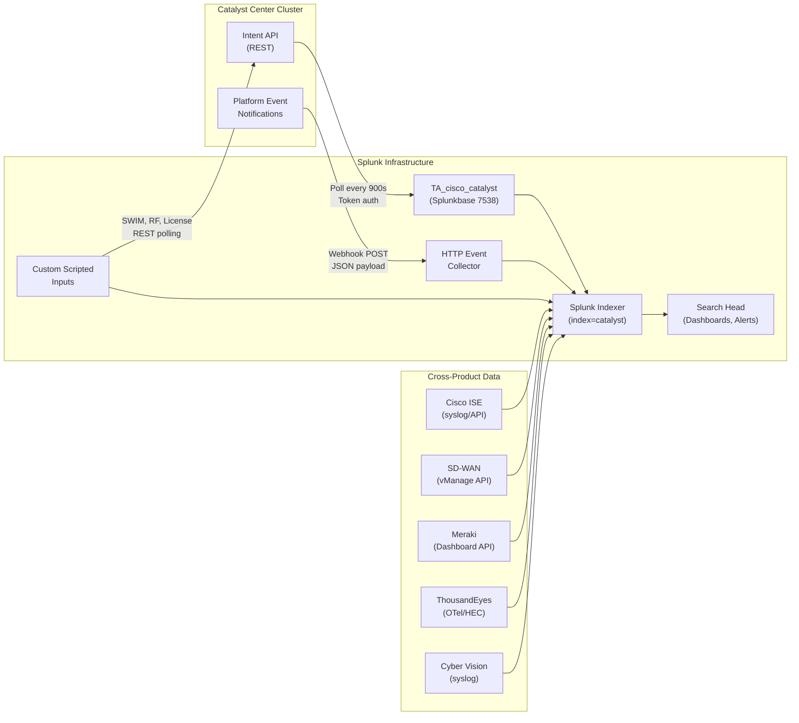

# Cisco Catalyst Center Integration Guide

> The definitive guide to integrating Cisco Catalyst Center with Splunk.
> 78 use cases across crawl/walk/run maturity tiers, covering device health,
> client experience, compliance, security advisories, SDA fabric, wireless,
> event notifications, and cross-product correlation.

---

## Table of Contents

- [Quick Start](#quick-start)
- [Overview and What Good Looks Like](#overview)
- [Architecture and Data Flow](#architecture)
- [Prerequisites](#prerequisites)
- [Data Sources Reference](#data-sources)
- [Field Dictionary](#field-dictionary)
- [Sample Events](#sample-events)
- [TA Configuration](#ta-configuration)
- [Webhook and HEC Setup](#webhook-hec-setup)
- [Custom Scripted Inputs](#custom-scripted-inputs)
- [Cross-Product Correlation](#cross-product-correlation)
- [CIM Mapping Reference](#cim-mapping)
- [Compliance Mapping](#compliance-mapping)
- [Capacity Planning and Sizing](#sizing)
- [Version Compatibility Matrix](#compatibility)
- [Recommended Dashboard Layouts](#dashboards)
- [ITSI Service Modeling](#itsi)
- [SOAR Playbook Examples](#soar)
- [Multi-Cluster and Multi-Tenancy](#multi-cluster)
- [Security Hardening](#security-hardening)
- [Crawl / Walk / Run Roadmap](#roadmap)
- [Validation Checklist](#validation-checklist)
- [Known Limitations and Gaps](#known-limitations)
- [Troubleshooting](#troubleshooting)
- [FAQ](#faq)
- [Glossary](#glossary)
- [Migrating from Legacy DNA Center](#migration)
- [References](#references)
- [Contribution and Feedback](#contribution)

---

<a id="quick-start"></a>
## Quick Start — 5 Minutes to First Data

For engineers who want data flowing before reading the rest:

1. **Install the TA** — Download [Cisco Catalyst Add-on for Splunk (Splunkbase 7538)](https://splunkbase.splunk.com/app/7538) and install it on your search head and heavy forwarder (or single-instance Splunk).

2. **Create the index** — In Splunk, go to Settings → Indexes → New Index. Name: `catalyst`, App: Search, Data type: Events.

3. **Add a Catalyst Center account** — In the TA, go to Configuration → Account. Add:
   - **Account Name**: `catcenter-prod` (your choice)
   - **URL**: `https://<your-catalyst-center-fqdn>` (no trailing slash)
   - **Username / Password**: A service account with **NETWORK-ADMIN-ROLE** or **SUPER-ADMIN-ROLE**

4. **Enable the devicehealth input** — Go to Inputs → Create New Input → Device Health. Set:
   - **Account**: `catcenter-prod`
   - **Index**: `catalyst`
   - **Interval**: `900` (15 minutes)

5. **Verify data** — Wait 15 minutes, then run:
   ```spl
   index=catalyst sourcetype="cisco:dnac:devicehealth" | stats count by sourcetype
   ```

**Data flowing?** Continue reading for the full guide.
**Stuck?** Jump to [Troubleshooting](#troubleshooting).

---

<a id="overview"></a>
## Overview and What Good Looks Like

### What is Catalyst Center?

Cisco Catalyst Center (formerly DNA Center / DNAC) is Cisco's network management and automation platform for campus and branch networks. It provides:

- **Assurance** — AI/ML-driven health scoring for devices, clients, and network segments
- **Automation** — Policy-based configuration, templates, and PnP device onboarding
- **Compliance** — Running configuration validation against golden templates
- **Security Advisories (PSIRT)** — Automated vulnerability detection for managed devices
- **Software Image Management (SWIM)** — Firmware compliance and distribution
- **SDA Fabric** — Software-Defined Access with VXLAN/LISP campus fabric

### Why integrate with Splunk?

Catalyst Center provides deep network intelligence, but it operates as a closed ecosystem. Integrating with Splunk unlocks:

- **Historical trending** that Catalyst Center's 7-day Assurance window cannot provide
- **Cross-domain correlation** with security (ISE, firewall), WAN (SD-WAN), cloud (Meraki, ThousandEyes), and OT (Cyber Vision)
- **Compliance evidence** for NIST 800-53, PCI-DSS, SOX ITGC, and ISO 27001 audits
- **Automated response** via SOAR playbooks and On-Call routing
- **Unified dashboards** that combine network health with application and infrastructure metrics

### Who should read this guide?

| Role | Relevant sections |
|------|-------------------|
| **NOC / Network Operations** | Quick Start, TA Config, Dashboards, Troubleshooting |
| **Network Engineering** | Field Dictionary, Cross-Product, ITSI, Multi-Cluster |
| **Security Operations** | Compliance, PSIRT UCs, SOAR Playbooks, Security Hardening |
| **Compliance / Audit** | Compliance Mapping, Validation Checklist |
| **Splunk Architecture** | Sizing, Multi-Cluster, Security Hardening |

### What good looks like

| Dimension | Before integration | After full deployment |
|-----------|-------------------|----------------------|
| **Visibility** | Reactive; check Catalyst Center GUI manually | Proactive dashboards with automated alerting |
| **History** | 7-day Assurance window | Unlimited retention in Splunk (90+ days typical) |
| **Correlation** | Network data siloed from security and apps | Cross-product: ISE + SD-WAN + ThousandEyes + Catalyst Center |
| **Compliance** | Manual evidence collection per audit | Automated compliance dashboards with evidence artifacts |
| **Response** | Human triage of every alert | SOAR playbooks auto-remediate or auto-escalate |
| **MTTR** | Hours (manual investigation) | Minutes (correlated dashboards + runbooks) |

---

<a id="architecture"></a>
## Architecture and Data Flow



**Three data paths:**

1. **TA polling (primary)** — The Cisco Catalyst Add-on polls the Intent API every 900 seconds (configurable) using token-based authentication. Each modular input maps to a specific API endpoint and writes to `index=catalyst` with a dedicated sourcetype.

2. **Webhook / HEC (event-driven)** — Catalyst Center Platform sends event notifications (SWIM events, security alerts, system events) to Splunk's HTTP Event Collector as webhook POSTs. Sourcetype: `cisco:dnac:event:notification`.

3. **Custom scripted inputs (gap-fill)** — For capabilities the TA doesn't cover natively (SWIM firmware compliance, wireless RF metrics, licensing), custom Python scripts poll the Intent API on a cron schedule and write to dedicated sourcetypes.

---

<a id="prerequisites"></a>
## Prerequisites

### Catalyst Center requirements

| Requirement | Detail |
|-------------|--------|
| **Version** | 2.3.5 or later (recommended). Earlier versions may have different field names in Assurance APIs. |
| **Licensing** | Cisco DNA Essentials (minimum) for inventory; DNA Advantage for full Assurance health scores; DNA Premier for SDA and advanced analytics. |
| **Service account** | Dedicated API user (not a personal account). Role: **NETWORK-ADMIN-ROLE** for most inputs; **SUPER-ADMIN-ROLE** for audit logs and some compliance endpoints. |
| **API access** | HTTPS (TCP 443) from Splunk to Catalyst Center management IP/FQDN. |
| **Virtual domains** | If using virtual domains, the service account must have access to all domains you want to monitor — or create one input per domain. |

### Splunk requirements

| Requirement | Detail |
|-------------|--------|
| **Splunk version** | Splunk Enterprise 8.2+ or Splunk Cloud |
| **TA install** | [Splunkbase 7538](https://splunkbase.splunk.com/app/7538) on search head + heavy forwarder (or single-instance) |
| **Index** | `index=catalyst` (events type) |
| **HEC** (for webhooks) | A dedicated HEC token scoped to `index=catalyst`, sourcetype `cisco:dnac:event:notification` |
| **Permissions** | The Splunk user configuring inputs needs `admin_all_objects` or equivalent |

### Network requirements

| From | To | Port | Protocol | Purpose |
|------|----|------|----------|---------|
| Splunk (TA host) | Catalyst Center | 443 | HTTPS | Intent API polling |
| Catalyst Center | Splunk (HEC) | 8088 | HTTPS | Webhook event notifications |
| Splunk (scripted inputs host) | Catalyst Center | 443 | HTTPS | Custom API polling |

---

<a id="data-sources"></a>
## Data Sources Reference

| Sourcetype | API Endpoint | Default Interval | Key Fields | Est. Volume | CIM Model | Notes |
|------------|-------------|-----------------|------------|-------------|-----------|-------|
| `cisco:dnac:devicehealth` | `/dna/intent/api/v1/device-health` | 900s | `overallHealth`, `reachabilityHealth`, `deviceName`, `deviceType`, `siteId`, `platformId` | ~1 event/device/poll | N/A | Core health scoring |
| `cisco:dnac:clienthealth` | `/dna/intent/api/v1/client-health` | 900s | `scoreDetail{}`, `scoreCategory`, `clientCount` | ~3 events/poll (ALL, WIRED, WIRELESS) | N/A | Nested JSON; use `spath \| mvexpand` |
| `cisco:dnac:networkhealth` | `/dna/intent/api/v1/network-health` | 900s | `healthScore`, `goodCount`, `badCount`, `totalCount` | ~1 event/poll | N/A | Aggregate network score |
| `cisco:dnac:issue` | `/dna/intent/api/v1/issues` | 900s | `priority`, `category`, `name`, `deviceName`, `status`, `issueId` | ~1 event/active issue/poll | N/A | Assurance-detected issues |
| `cisco:dnac:compliance` | `/dna/intent/api/v1/compliance` | 3600s | `complianceStatus`, `complianceType`, `deviceName` | ~1 event/device/poll | Change | Config compliance |
| `cisco:dnac:securityadvisory` | `/dna/intent/api/v1/security-advisory/advisory` | 3600s | `advisoryId`, `advisoryTitle`, `severity`, `cveId`, `deviceId` | ~1 event/advisory-device pair | Vulnerabilities | PSIRT/CVE |
| `cisco:dnac:device` | `/dna/intent/api/v1/network-device` | 3600s | `hostname`, `platformId`, `softwareVersion`, `managementIpAddress`, `upTime` | ~1 event/device/poll | Compute_Inventory | Full device inventory |
| `cisco:dnac:client` | `/dna/intent/api/v1/client-detail` | 900s | `macAddress`, `hostType`, `connectionType`, `healthScore{}` | ~1 event/client/poll | N/A | Per-client detail |
| `cisco:dnac:site:topology` | `/dna/intent/api/v1/topology/site-topology` | 3600s | `siteId`, `siteName`, `siteType`, `parentSiteName` | ~1 event/site/poll | Compute_Inventory | Site hierarchy |
| `cisco:dnac:audit:logs` | `/dna/data/api/v1/event/event-series/audit-log` | 300s | `auditUserName`, `auditRequestType`, `auditDescription` | Variable; ~10-100/day typical | Change | Admin activity |
| `cisco:dnac:interfacehealth` | `/dna/intent/api/v1/interface` | 900s | `portName`, `status`, `speed`, `adminStatus`, `deviceId` | ~1 event/interface/poll | N/A | Interface status |
| `cisco:dnac:fabricsite` | `/dna/intent/api/v1/business/sda/fabric-site` | 3600s | `fabricName`, `siteId`, `fabricType` | ~1 event/fabric/poll | N/A | SDA fabric topology |
| `cisco:dnac:event:notification` | Webhook POST from Catalyst Center | Real-time | `eventType`, `eventCategory`, `eventSeverity`, `description` | Variable; event-driven | N/A | Requires HEC setup |
| `cisco:dnac:swim` | `/dna/intent/api/v1/image/importation` | 3600s | `imageCompliance`, `runningVersion`, `targetVersion`, `deviceFamily` | ~1 event/device/poll | Change | Custom scripted input |
| `cisco:dnac:wireless:rf` | `/dna/intent/api/v1/wireless/rf-profile` | 900s | `band`, `channel`, `channelUtilization`, `interferencePercentage`, `apName` | ~1 event/AP/poll | N/A | Custom scripted input |
| `cisco:dnac:license` | `/dna/intent/api/v1/licenses` | 86400s | `licenseType`, `totalLicenses`, `consumedLicenses`, `availableLicenses` | ~1 event/license-type/poll | N/A | Custom scripted input |

---

<a id="field-dictionary"></a>
## Field Dictionary

### `cisco:dnac:devicehealth`

| Field | Type | Example | Description | Used by |
|-------|------|---------|-------------|---------|
| `deviceName` | string | `core-sw-01.hq.example.com` | Device hostname from Catalyst Center inventory | UC-5.13.1, .2, .3, .4, .5, .6, .7, .8 |
| `deviceType` | string | `Cisco Catalyst 9300 Switch` | Device platform family | UC-5.13.1, .5, .6 |
| `managementIpAddress` | string | `10.1.1.1` | Management IP address | UC-5.13.4, .68 |
| `overallHealth` | integer (0-100) | `87` | Composite health score from Assurance analytics | UC-5.13.1, .2, .3, .7 |
| `platformId` | string | `C9300-48P` | Hardware platform ID (PID) | UC-5.13.1, .5 |
| `reachabilityHealth` | string | `Reachable` | ICMP/SNMP reachability status (`Reachable` or `Unreachable`) | UC-5.13.1, .4 |
| `siteId` | string | `site-hq-floor3` | Site UUID from Catalyst Center hierarchy | UC-5.13.1, .21 |

### `cisco:dnac:clienthealth`

| Field | Type | Example | Description | Used by |
|-------|------|---------|-------------|---------|
| `clientCount` | integer | `245` | Number of clients in this score category | UC-5.13.9, .10, .11, .14, .15 |
| `scoreCategory` | string | `WIRED` | Client category: `ALL`, `WIRED`, `WIRELESS` | UC-5.13.9, .10 |
| `scoreDetail{}` | array/object | (nested JSON) | Nested health score breakdown; use `spath \| mvexpand \| spath` | UC-5.13.9, .11 |
| `value` | integer (0-100) | `72` | Health score for this category | UC-5.13.9, .10, .11 |

### `cisco:dnac:networkhealth`

| Field | Type | Example | Description | Used by |
|-------|------|---------|-------------|---------|
| `badCount` | integer | `3` | Number of unhealthy network elements | UC-5.13.16, .17, .18 |
| `goodCount` | integer | `47` | Number of healthy network elements | UC-5.13.16, .17 |
| `healthScore` | integer (0-100) | `94` | Overall network health score | UC-5.13.16, .17, .18, .71 |
| `totalCount` | integer | `50` | Total managed network elements | UC-5.13.16 |

### `cisco:dnac:issue`

| Field | Type | Example | Description | Used by |
|-------|------|---------|-------------|---------|
| `category` | string | `Connectivity` | Issue category (Connectivity, Onboarding, Security, etc.) | UC-5.13.21, .22, .23 |
| `deviceName` | string | `access-sw-05` | Affected device hostname | UC-5.13.21, .23 |
| `issueId` | string | `abc123-def456` | Unique issue identifier | UC-5.13.23 |
| `name` | string | `Network Device Unreachable` | Human-readable issue name | UC-5.13.21, .22, .61 |
| `priority` | string | `P1` | Issue priority: P1 (critical) through P4 (informational) | UC-5.13.21, .22, .23, .76 |
| `status` | string | `ACTIVE` | Issue lifecycle: ACTIVE, RESOLVED, IGNORED | UC-5.13.23, .76 |

### `cisco:dnac:compliance`

| Field | Type | Example | Description | Used by |
|-------|------|---------|-------------|---------|
| `complianceStatus` | string | `NON_COMPLIANT` | Compliance state: COMPLIANT, NON_COMPLIANT, ERROR | UC-5.13.28, .29, .30, .32 |
| `complianceType` | string | `RUNNING_CONFIG` | Type of compliance check | UC-5.13.31, .33 |
| `deviceName` | string | `dist-sw-02` | Device being assessed | UC-5.13.28, .29 |

### `cisco:dnac:securityadvisory`

| Field | Type | Example | Description | Used by |
|-------|------|---------|-------------|---------|
| `advisoryId` | string | `cisco-sa-20240101-xyz` | Cisco advisory identifier | UC-5.13.34, .35, .36, .38 |
| `advisoryTitle` | string | `Cisco IOS XE Web UI Privilege Escalation` | Human-readable advisory title | UC-5.13.35, .36 |
| `cveId` | string | `CVE-2024-12345` | Associated CVE identifier(s) | UC-5.13.35, .37 |
| `deviceId` | string | `device-uuid-abc123` | Affected device UUID | UC-5.13.37, .38 |
| `severity` | string | `CRITICAL` | Advisory severity: CRITICAL, HIGH, MEDIUM, LOW, INFORMATIONAL | UC-5.13.34, .35, .39 |

### `cisco:dnac:audit:logs`

| Field | Type | Example | Description | Used by |
|-------|------|---------|-------------|---------|
| `auditDescription` | string | `Updated device template` | Description of the administrative action | UC-5.13.45, .46 |
| `auditRequestType` | string | `PUT` | HTTP method of the API call (GET, PUT, POST, DELETE) | UC-5.13.46, .47 |
| `auditUserName` | string | `admin@example.com` | User who performed the action | UC-5.13.45, .47, .48, .49 |

### `cisco:dnac:event:notification`

| Field | Type | Example | Description | Used by |
|-------|------|---------|-------------|---------|
| `description` | string | `Device unreachable: core-sw-01` | Event description text | UC-5.13.64, .65, .66 |
| `eventCategory` | string | `NETWORK` | Category: NETWORK, SYSTEM, SECURITY, APP | UC-5.13.64, .65 |
| `eventSeverity` | integer | `1` | Severity level: 1 (critical) through 5 (informational) | UC-5.13.64, .65, .76 |
| `eventType` | string | `NETWORK_DEVICE_UNREACHABLE` | Machine-readable event type identifier | UC-5.13.64, .65, .66 |

### `cisco:dnac:swim`

| Field | Type | Example | Description | Used by |
|-------|------|---------|-------------|---------|
| `deviceFamily` | string | `Cisco Catalyst 9300` | Device platform family | UC-5.13.56, .57 |
| `imageCompliance` | string | `NON_COMPLIANT` | Image compliance: COMPLIANT, NON_COMPLIANT | UC-5.13.56, .57 |
| `runningVersion` | string | `17.6.5` | Currently running IOS-XE version | UC-5.13.56, .58 |
| `targetVersion` | string | `17.9.4a` | Golden image target version | UC-5.13.56, .57 |
| `upgradeStatus` | string | `FAILED` | Upgrade status for in-progress upgrades | UC-5.13.58 |

---

<a id="sample-events"></a>
## Sample Events

### cisco:dnac:devicehealth

```json
{
  "deviceName": "core-sw-01.hq.example.com",
  "deviceType": "Cisco Catalyst 9300 Switch",
  "overallHealth": 87,
  "reachabilityHealth": "Reachable",
  "memoryScore": 92,
  "cpuScore": 78,
  "interDeviceLinkScore": 95,
  "siteId": "a1b2c3d4-e5f6-7890-abcd-ef1234567890",
  "managementIpAddress": "10.1.1.1",
  "platformId": "C9300-48P",
  "softwareVersion": "17.9.4a",
  "deviceFamily": "Switches and Hubs",
  "location": "HQ/Floor3/IDF-3A"
}
```

### cisco:dnac:clienthealth

```json
{
  "scoreDetail": [
    {
      "scoreCategory": { "scoreCategory": "ALL", "value": "72" },
      "clientCount": 450,
      "scoreList": [
        { "scoreCategory": { "scoreCategory": "WIRED", "value": "85" }, "clientCount": 120 },
        { "scoreCategory": { "scoreCategory": "WIRELESS", "value": "68" }, "clientCount": 330 }
      ]
    }
  ],
  "siteId": "a1b2c3d4-e5f6-7890-abcd-ef1234567890"
}
```

Note: Client health uses nested JSON. Use `| spath output=categories path=scoreDetail{} | mvexpand categories | spath input=categories` to flatten.

### cisco:dnac:issue

```json
{
  "issueId": "abc12345-def6-7890-ghij-klmno1234567",
  "name": "Network Device 10.1.1.1 Is Unreachable From Controller",
  "priority": "P1",
  "category": "Connectivity",
  "status": "ACTIVE",
  "deviceName": "core-sw-01.hq.example.com",
  "siteId": "a1b2c3d4-e5f6-7890-abcd-ef1234567890",
  "lastOccurenceTime": 1714060200000,
  "deviceType": "Cisco Catalyst 9300 Switch"
}
```

### cisco:dnac:compliance

```json
{
  "deviceName": "dist-sw-02.branch.example.com",
  "complianceStatus": "NON_COMPLIANT",
  "complianceType": "RUNNING_CONFIG",
  "lastUpdateTime": 1714060200000,
  "deviceUuid": "device-uuid-xyz789",
  "managementIpAddress": "10.2.1.1"
}
```

### cisco:dnac:securityadvisory

```json
{
  "advisoryId": "cisco-sa-iosxe-webui-privesc-j22SaA",
  "advisoryTitle": "Cisco IOS XE Software Web UI Privilege Escalation Vulnerability",
  "severity": "CRITICAL",
  "cveId": "CVE-2023-20198",
  "deviceCount": 12,
  "fixedVersions": ["17.9.4a", "17.6.6a"],
  "publicationDate": "2023-10-16"
}
```

### cisco:dnac:audit:logs

```json
{
  "auditId": "audit-abc123",
  "auditUserName": "netadmin@example.com",
  "auditRequestType": "PUT",
  "auditDescription": "Updated network profile template for Branch-Standard",
  "auditParentId": "parent-xyz789",
  "createdDateTime": 1714060200000,
  "isSystemEvent": false
}
```

### cisco:dnac:event:notification

```json
{
  "eventType": "NETWORK_DEVICE_UNREACHABLE",
  "eventCategory": "NETWORK",
  "eventSeverity": 1,
  "description": "Network device core-sw-01.hq.example.com (10.1.1.1) is unreachable from Catalyst Center",
  "timestamp": 1714060200000,
  "domain": "Global/HQ",
  "tenantId": "tenant-abc123",
  "source": "Assurance"
}
```

### cisco:dnac:swim

```json
{
  "deviceFamily": "Cisco Catalyst 9300",
  "deviceName": "access-sw-15.branch.example.com",
  "imageCompliance": "NON_COMPLIANT",
  "runningVersion": "17.6.5",
  "targetVersion": "17.9.4a",
  "managementIpAddress": "10.3.1.15",
  "lastSyncTime": 1714060200000
}
```

---

<a id="ta-configuration"></a>
## TA Configuration (Step-by-Step)

### Step 1: Install the TA

Download from [Splunkbase 7538](https://splunkbase.splunk.com/app/7538) or install via the Splunk UI (Apps → Find More Apps → search "Cisco Catalyst").

Install on:
- **Search head** (for knowledge objects, field extractions, saved searches)
- **Heavy forwarder** or **single-instance** (for data collection via modular inputs)
- **Indexer** (for index-time transforms, if any)

For clustered environments, deploy via the deployer (SHC) and cluster manager (indexer cluster).

### Step 2: Create the index

```
[catalyst]
homePath   = $SPLUNK_DB/catalyst/db
coldPath   = $SPLUNK_DB/catalyst/colddb
thawedPath = $SPLUNK_DB/catalyst/thaweddb
maxTotalDataSizeMB = 51200
frozenTimePeriodInSecs = 7776000
```

Or via UI: Settings → Indexes → New Index → name `catalyst`.

### Step 3: Configure the Catalyst Center account

In the TA: Configuration → Account → Add.

| Field | Value |
|-------|-------|
| Account Name | `catcenter-prod` (descriptive, no spaces) |
| URL | `https://catcenter.example.com` (FQDN, no trailing slash) |
| Username | `splunk-svc@example.com` (dedicated service account) |
| Password | (service account password) |
| Verify SSL | Yes (recommended; use No only for lab/self-signed certs) |

### Step 4: Enable modular inputs

For each input type you want to collect, go to Inputs → Create New Input:

**Recommended crawl-tier inputs (enable first):**

| Input | Sourcetype | Index | Interval | Notes |
|-------|-----------|-------|----------|-------|
| Device Health | `cisco:dnac:devicehealth` | `catalyst` | 900 | Core health scores |
| Client Health | `cisco:dnac:clienthealth` | `catalyst` | 900 | Wired/wireless client health |
| Network Health | `cisco:dnac:networkhealth` | `catalyst` | 900 | Aggregate network score |
| Issues | `cisco:dnac:issue` | `catalyst` | 900 | Assurance-detected issues |
| Compliance | `cisco:dnac:compliance` | `catalyst` | 3600 | Config compliance |
| Security Advisory | `cisco:dnac:securityadvisory` | `catalyst` | 3600 | PSIRTs/CVEs |
| Device Inventory | `cisco:dnac:device` | `catalyst` | 3600 | Device inventory |
| Site Topology | `cisco:dnac:site:topology` | `catalyst` | 3600 | Site hierarchy |
| Audit Logs | `cisco:dnac:audit:logs` | `catalyst` | 300 | Admin activity audit |

### Step 5: Validate

Run `index=catalyst | stats count by sourcetype` and confirm all enabled sourcetypes appear. Compare device counts with Catalyst Center → Inventory.

---

<a id="webhook-hec-setup"></a>
## Webhook and HEC Setup

Event notifications provide real-time alerts from Catalyst Center that complement the TA's polling model.

### Step 1: Create a Splunk HEC token

In Splunk: Settings → Data Inputs → HTTP Event Collector → New Token.

| Setting | Value |
|---------|-------|
| Name | `catalyst-center-webhooks` |
| Source type | `cisco:dnac:event:notification` |
| App context | `TA_cisco_catalyst` |
| Index | `catalyst` |
| Enable indexer acknowledgement | No (unless required by your architecture) |

Note the token value and HEC URL: `https://<splunk-host>:8088/services/collector/event`

### Step 2: Configure Catalyst Center webhook destination

In Catalyst Center: System → Settings → External Services → Destinations → Webhook.

| Setting | Value |
|---------|-------|
| Name | `Splunk-HEC` |
| URL | `https://<splunk-hec-host>:8088/services/collector/event` |
| Method | POST |
| Headers | `Authorization: Splunk <your-HEC-token>` |
| Content-Type | `application/json` |
| Trust certificate | Configure for your TLS setup |

Click **Test** to verify connectivity. A `200 OK` response confirms the path is working.

### Step 3: Subscribe to event notifications

Navigate to Platform → Developer Toolkit → Event Notifications.

For each event type, create a subscription:

| Category | Recommended events | Severity filter |
|----------|--------------------|-----------------|
| NETWORK | Device unreachable, link down, AP offline | All |
| SYSTEM | Catalyst Center service health, upgrade events | All |
| SECURITY | Rogue AP, aWIPS, threat events | All |
| SWIM | Image distribution, upgrade status | All |

### Step 4: Validate end-to-end

```spl
index=catalyst sourcetype="cisco:dnac:event:notification" | head 10
```

If no events appear, check:
- HEC token is enabled and not disabled
- Firewall allows Catalyst Center → Splunk on port 8088
- Webhook test in Catalyst Center returned 200
- Sourcetype override is not misconfigured

### Step 5: Production hardening

- Use TLS 1.2+ for the HEC endpoint
- Restrict the HEC token to `index=catalyst` only
- Monitor `index=_internal sourcetype=splunkd component=HttpInputDataHandler` for errors
- Consider a load balancer in front of HEC for HA

---

<a id="custom-scripted-inputs"></a>
## Custom Scripted Inputs

These cover capabilities not available as native TA modular inputs.

### SWIM Firmware Compliance

**Purpose:** Poll SWIM image compliance status for all managed devices.

**API Endpoint:** `GET /dna/intent/api/v1/compliance/detail?complianceType=IMAGE`

**Script skeleton (Python):**

```python
import requests
import json
import sys
import time

CATCENTER_URL = "https://catcenter.example.com"
USERNAME = "splunk-svc@example.com"
PASSWORD = "..."  # Use Splunk credential manager in production

def get_token():
    resp = requests.post(
        f"{CATCENTER_URL}/dna/system/api/v1/auth/token",
        auth=(USERNAME, PASSWORD), verify=True
    )
    return resp.json()["Token"]

def get_swim_compliance(token):
    headers = {"X-Auth-Token": token, "Content-Type": "application/json"}
    resp = requests.get(
        f"{CATCENTER_URL}/dna/intent/api/v1/compliance/detail?complianceType=IMAGE",
        headers=headers, verify=True
    )
    return resp.json().get("response", [])

token = get_token()
for device in get_swim_compliance(token):
    event = {
        "deviceName": device.get("deviceName"),
        "deviceFamily": device.get("deviceFamily", ""),
        "imageCompliance": device.get("complianceStatus", "UNKNOWN"),
        "runningVersion": device.get("softwareVersion", ""),
        "targetVersion": device.get("targetVersion", ""),
        "managementIpAddress": device.get("managementIpAddress", ""),
        "lastSyncTime": int(time.time())
    }
    print(json.dumps(event))
```

**inputs.conf stanza:**

```ini
[script://./bin/poll_swim_compliance.py]
index = catalyst
sourcetype = cisco:dnac:swim
interval = 3600
disabled = false
```

### Wireless RF Health

**API Endpoint:** `GET /dna/intent/api/v1/wireless/rf-profile` and per-AP detail from Assurance.

Follow the same pattern: authenticate, poll, print JSON events to stdout. Use `sourcetype = cisco:dnac:wireless:rf` and `interval = 900`.

### Licensing Status

**API Endpoint:** `GET /dna/intent/api/v1/licenses/device/count` and `/dna/intent/api/v1/licenses/device/summary`.

Use `sourcetype = cisco:dnac:license` and `interval = 86400` (daily).

---

<a id="cross-product-correlation"></a>
## Cross-Product Correlation

### Catalyst Center + ISE

**Purpose:** Correlate network health issues with authentication failures to determine if a connectivity problem is caused by an ISE policy issue.

**Join field:** `managementIpAddress` (Catalyst Center) ↔ `nas_ip_address` (ISE)

**Example SPL (UC-5.13.68):**

```spl
index=catalyst sourcetype="cisco:dnac:issue" category="Onboarding"
| join type=left managementIpAddress
    [search index=ise sourcetype="cisco:ise:*"
     | stats count as auth_failures by nas_ip_address
     | rename nas_ip_address as managementIpAddress]
| where isnotnull(auth_failures)
| stats count as correlated_issues sum(auth_failures) as total_auth_failures
    by deviceName, managementIpAddress
| sort -total_auth_failures
```

**Required:** Cisco ISE TA or syslog data in `index=ise`.

### Catalyst Center + SD-WAN

**Purpose:** Compare campus health (Catalyst Center) with WAN overlay health (SD-WAN) to isolate whether degradation is campus-side or WAN-side.

**Join field:** Site name or IP subnet mapping (requires a lookup).

**UCs:** UC-5.13.69, UC-5.13.70

### Catalyst Center + Meraki

**Purpose:** Unified site health view combining on-prem Catalyst infrastructure with cloud-managed Meraki networks at the same location.

**Join field:** Site name or location tag.

**UCs:** UC-5.13.72

### Catalyst Center + ThousandEyes

**Purpose:** Isolate whether performance issues are internal (campus network) or external (WAN/internet path) by correlating Catalyst Center network health with ThousandEyes path quality metrics.

**Join field:** Time alignment (`| bin _time span=1m`).

**Example SPL (UC-5.13.71):**

```spl
index=catalyst sourcetype="cisco:dnac:networkhealth"
| stats latest(healthScore) as internal_health by _time
| appendcols
    [search `stream_index` thousandeyes.test.type="agent-to-server"
     | stats avg(network.latency) as avg_latency_s avg(network.loss) as avg_loss by _time
     | eval avg_latency_ms=round(avg_latency_s*1000,1)
     | eval loss_pct=round(avg_loss*100,1)]
| where internal_health < 70 AND (avg_latency_ms > 100 OR loss_pct > 5)
| eval isolation=if(internal_health<70 AND avg_latency_ms<50,
    "Internal network issue",
    if(internal_health>=70 AND avg_latency_ms>100,
       "External path issue", "Both internal and external issues"))
```

**Required:** ThousandEyes App for Splunk (Splunkbase 7719).

### Catalyst Center + Cyber Vision

**Purpose:** Correlate OT/ICS network events (Cyber Vision) with campus network health (Catalyst Center) to detect IT/OT boundary issues.

**Join field:** `siteId` or network segment.

**UCs:** UC-5.13.73

---

<a id="cim-mapping"></a>
## CIM Mapping Reference

| CIM Data Model | Mapped UCs | Validation SPL |
|----------------|-----------|----------------|
| **Change** | UC-5.13.8, .28–.33, .45–.50, .52, .56–.58 | `\| tstats count from datamodel=Change by _time, All_Changes.action` |
| **Vulnerabilities** | UC-5.13.34–.39, .59 | `\| tstats count from datamodel=Vulnerabilities by _time, Vulnerabilities.severity` |
| **Authentication** | UC-5.13.48, .68 | `\| tstats count from datamodel=Authentication by _time, Authentication.action` |
| **Intrusion_Detection** | UC-5.13.61 | `\| tstats count from datamodel=Intrusion_Detection by _time` |
| **Compute_Inventory** | UC-5.13.40, .51, .53, .55 | `\| tstats count from datamodel=Compute_Inventory by _time` |

**Note:** Many Catalyst Center sourcetypes do not map neatly to CIM because Assurance health scores are a proprietary construct. Use CIM where it fits (compliance = Change, advisories = Vulnerabilities); don't force-fit health score data into CIM models.

---

<a id="compliance-mapping"></a>
## Compliance Mapping

### NIST 800-53 Rev. 5

| UC | Control | Control Name | Assurance Level |
|----|---------|-------------|-----------------|
| UC-5.13.28–.33 | CM-6 | Configuration Settings | Partial |
| UC-5.13.34–.39 | SI-2 | Flaw Remediation | Partial |
| UC-5.13.34–.39 | RA-5 | Vulnerability Monitoring and Scanning | Contributing |
| UC-5.13.45–.50 | AU-2 | Event Logging | Partial |
| UC-5.13.49 | AC-2 | Account Management | Contributing |
| UC-5.13.56–.58 | CM-2 | Baseline Configuration | Partial |
| UC-5.13.56–.58 | SI-2 | Flaw Remediation | Partial |
| UC-5.13.59 | SA-22 | Unsupported System Components | Partial |
| UC-5.13.61 | AC-18 | Wireless Access | Partial |

### PCI-DSS v4.0

| UC | Requirement | Description | Assurance Level |
|----|------------|-------------|-----------------|
| UC-5.13.28–.33 | 1.1.1 | Network security controls | Partial |
| UC-5.13.34–.39 | 6.3.1 | Security vulnerabilities identification | Partial |
| UC-5.13.61 | 11.2.1 | Wireless AP detection | Partial |

### SOX ITGC

| UC | Control Area | Description | Assurance Level |
|----|-------------|-------------|-----------------|
| UC-5.13.45–.50 | Access Review | Administrative activity audit trail | Contributing |
| UC-5.13.49 | Access Review | After-hours privileged activity monitoring | Contributing |

### ISO 27001:2022

| UC | Control | Description | Assurance Level |
|----|---------|-------------|-----------------|
| UC-5.13.34–.39 | A.8.8 | Management of technical vulnerabilities | Partial |

---

<a id="sizing"></a>
## Capacity Planning and Sizing

### Events per device per day (by sourcetype)

| Sourcetype | Polls/day | Events/poll | Events/device/day | Avg event size |
|------------|----------|-------------|-------------------|---------------|
| `cisco:dnac:devicehealth` | 96 | 1 | 96 | ~800 bytes |
| `cisco:dnac:clienthealth` | 96 | 1 (per category) | ~3 | ~1.2 KB |
| `cisco:dnac:networkhealth` | 96 | 1 (aggregate) | N/A | ~500 bytes |
| `cisco:dnac:issue` | 96 | varies | ~0-10 | ~600 bytes |
| `cisco:dnac:compliance` | 24 | 1 | 24 | ~400 bytes |
| `cisco:dnac:securityadvisory` | 24 | 1 per advisory-device | varies | ~700 bytes |
| `cisco:dnac:device` | 24 | 1 | 24 | ~1.5 KB |
| `cisco:dnac:audit:logs` | 288 | varies | ~10-100 (total) | ~500 bytes |

### Storage projection formula

```
Daily volume (MB) = devices × 96 × 0.8 KB (devicehealth alone)
                  + devices × 24 × 1.5 KB (device inventory)
                  + devices × 24 × 0.4 KB (compliance)
                  + fixed overhead (network health, audit, etc.)
```

### Worked examples

| Fleet size | Daily ingest (est.) | 90-day retention | Notes |
|------------|-------------------|------------------|-------|
| **500 devices** | ~80 MB/day | ~7 GB | Small campus |
| **2,000 devices** | ~300 MB/day | ~27 GB | Mid-size enterprise |
| **10,000 devices** | ~1.5 GB/day | ~135 GB | Large enterprise / multi-site |

These estimates cover TA polling only. Add ~10-20% for webhook events and custom inputs. Actual volume depends on the number of active issues, advisories, and audit activity.

### API rate limiting

Catalyst Center enforces API rate limits (typically 5 requests/second for the Intent API). At high device counts:
- Spread inputs across multiple poll intervals to avoid thundering herd
- Monitor `splunkd.log` for HTTP 429 (Too Many Requests) errors
- Consider reducing poll frequency from 900s to 1800s for non-critical inputs

---

<a id="compatibility"></a>
## Version Compatibility Matrix

| Catalyst Center Version | TA Version | Supported Inputs | Known Issues |
|------------------------|-----------|------------------|--------------|
| **2.3.7+** (current) | 1.x+ | All core inputs | Recommended target |
| **2.3.5–2.3.6** | 1.x+ | All core inputs | Minor field differences possible in Assurance APIs |
| **2.3.3–2.3.4** | 1.x+ | Most inputs | `overallHealth` scoring algorithm may differ; validate thresholds |
| **2.2.x** | 1.x+ | Basic inputs | Some Assurance endpoints may not exist; SWIM API changed |
| **<2.2** | Not recommended | Limited | API versioning differs significantly; field names may not match |

**Catalyst Center Virtual (on ESXi):** Fully supported with same API surface. Be aware of resource constraints that may affect API response times.

**Catalyst Center on AWS/Azure:** Supported; ensure network path from Splunk to the cloud-hosted management interface.

---

<a id="dashboards"></a>
## Recommended Dashboard Layouts

### Crawl Dashboard (Day 1) — "Network Health at a Glance"

```
+----------------------------------+----------------------------------+
| DEVICE HEALTH OVERVIEW           | UNREACHABLE DEVICES              |
| (UC-5.13.1)                      | (UC-5.13.4)                      |
| Table: deviceName, health_score, | Single value: count of           |
| health_status, deviceType        | reachabilityHealth="Unreachable" |
| Sorted by health_score ascending | Red if > 0                       |
+----------------------------------+----------------------------------+
| NETWORK HEALTH TREND             | SITE HEALTH SUMMARY              |
| (UC-5.13.16)                     | (UC-5.13.21)                     |
| Timechart: healthScore over 24h  | Table: siteId, issue count,      |
| with healthy_pct overlay         | priority breakdown               |
+----------------------------------+----------------------------------+
| CLIENT HEALTH (WIRED vs WiFi)    | ISSUE PRIORITY BREAKDOWN         |
| (UC-5.13.9)                      | (UC-5.13.21)                     |
| Stacked bar: clientCount by      | Bar chart: count by priority     |
| scoreCategory and health band    | and category                     |
+----------------------------------+----------------------------------+
```

### Walk Dashboard (Week 2) — "Operational Intelligence"

Add to the crawl dashboard:

```
+----------------------------------+----------------------------------+
| COMPLIANCE STATUS                | PSIRT ADVISORY OVERVIEW          |
| (UC-5.13.28)                     | (UC-5.13.34)                     |
| Pie: COMPLIANT vs NON_COMPLIANT  | Table: severity, advisoryTitle,  |
| with drilldown to UC-5.13.33     | affected device count            |
+----------------------------------+----------------------------------+
| AUDIT LOG ACTIVITY               | FIRMWARE COMPLIANCE              |
| (UC-5.13.45)                     | (UC-5.13.56)                     |
| Timechart: audit events over 7d  | Table: deviceFamily, running     |
| colored by requestType           | vs target version, count         |
+----------------------------------+----------------------------------+
```

### Run Dashboard (Month 2) — "Cross-Product & Compliance"

Add to the walk dashboard:

```
+----------------------------------+----------------------------------+
| ISE AUTH CORRELATION             | THOUSANDEYES PATH QUALITY        |
| (UC-5.13.68)                     | (UC-5.13.71)                     |
| Table: device, auth_failures,    | Timechart: internal_health vs    |
| correlated issues                | external latency                 |
+----------------------------------+----------------------------------+
| DATA COLLECTION HEALTH (META)    | COMPLIANCE EVIDENCE SUMMARY      |
| (UC-5.13.74)                     | (UC-5.13.28-33, 56-58)           |
| Table: sourcetype, event_count,  | Table by framework: clause,      |
| hours_since_last, status         | UC, control objective, status    |
+----------------------------------+----------------------------------+
```

---

<a id="itsi"></a>
## ITSI Service Modeling

### Service hierarchy

```
Network Infrastructure (top-level service)
├── Campus Site: HQ (per-site service)
│   ├── Core Switches (device group KPIs)
│   ├── Distribution Switches
│   ├── Access Switches
│   ├── Wireless Controllers
│   └── Client Experience
├── Campus Site: Branch-NYC
│   └── ...
└── Campus Site: Branch-LON
    └── ...
```

### KPI definitions

| KPI | Source UC | Base search | Threshold type |
|-----|---------|------------|----------------|
| Device Health Score (avg) | UC-5.13.1 | `index=catalyst sourcetype="cisco:dnac:devicehealth" \| stats avg(overallHealth) as avg_health by siteId` | Adaptive (stdev) |
| Unreachable Device Count | UC-5.13.4 | `index=catalyst sourcetype="cisco:dnac:devicehealth" reachabilityHealth="Unreachable" \| stats dc(deviceName) as unreachable_count` | Static (critical > 0) |
| Client Health Score | UC-5.13.9 | `index=catalyst sourcetype="cisco:dnac:clienthealth" \| spath \| stats avg(value) as client_health by scoreCategory` | Adaptive |
| Active P1/P2 Issues | UC-5.13.23 | `index=catalyst sourcetype="cisco:dnac:issue" (priority="P1" OR priority="P2") status!="RESOLVED" \| stats count` | Static (warning > 0, critical > 3) |
| Compliance Rate | UC-5.13.28 | `index=catalyst sourcetype="cisco:dnac:compliance" \| stats count(eval(complianceStatus="COMPLIANT")) as compliant, count as total \| eval pct=round(compliant*100/total,1)` | Static (warning < 95, critical < 80) |

### Entity integration

Import Catalyst Center devices as ITSI entities:

- **Entity search:** `index=catalyst sourcetype="cisco:dnac:device" | dedup hostname | table hostname, platformId, softwareVersion, managementIpAddress, siteId`
- **Title field:** `hostname`
- **Identifier fields:** `hostname`, `managementIpAddress`
- **Informational fields:** `platformId`, `softwareVersion`, `siteId`
- **Entity type:** `network_device`

### Glass Table

Build a campus network topology Glass Table:
- Top: Overall network health score (single value from UC-5.13.16)
- Middle: Site bubbles sized by device count, colored by health score
- Bottom: Device list filtered by selected site with health indicators

References: UC-5.13.74 (data collection health), UC-5.13.75 (ITSI notable event correlation)

---

<a id="soar"></a>
## SOAR Playbook Examples

### Playbook 1: Unreachable Device Auto-Triage

**Trigger:** UC-5.13.4 alert fires (device unreachable).

```
1. RECEIVE alert (deviceName, managementIpAddress, siteId)
2. PING device from SOAR (verify Splunk isn't the only one seeing the issue)
   ├── If PING succeeds → CLOSE as transient; add note "Device responded to
   │   SOAR ping at {timestamp}; likely API polling glitch"
   └── If PING fails → CONTINUE
3. CHECK interface status on upstream device via Catalyst Center API
   GET /dna/intent/api/v1/interface?deviceId={upstream_device_id}
4. CHECK recent changes in audit log
   SPL: index=catalyst sourcetype="cisco:dnac:audit:logs"
        auditDescription="*{deviceName}*" earliest=-4h
5. CREATE ServiceNow incident (priority based on device role)
   ├── Core/distribution device → P1
   └── Access device → P2
6. NOTIFY on-call engineer via Splunk On-Call / PagerDuty
7. UPDATE Splunk notable event with triage results
```

### Playbook 2: Critical PSIRT Response

**Trigger:** UC-5.13.35 alert fires (critical/high severity PSIRT).

```
1. RECEIVE alert (advisoryId, severity, cveId, affected_devices count)
2. LOOKUP advisory details from Cisco PSIRT API
   GET https://api.cisco.com/security/advisories/advisory/{advisoryId}
3. ENUMERATE affected devices
   SPL: index=catalyst sourcetype="cisco:dnac:securityadvisory"
        advisoryId="{advisoryId}" | stats values(deviceId) as devices
4. CHECK SWIM compliance for affected devices
   SPL: index=catalyst sourcetype="cisco:dnac:swim"
        deviceName IN ({affected_devices})
        | stats latest(imageCompliance) by deviceName
5. CREATE change request for firmware upgrade (affected non-compliant devices)
6. NOTIFY security team with:
   - Advisory summary and CVE details
   - Affected device count and list
   - Current firmware compliance status
   - Recommended action (upgrade to fixed version)
7. SCHEDULE follow-up check in 7 days (UC-5.13.38 remediation tracking)
```

### Playbook 3: Rogue AP Containment

**Trigger:** UC-5.13.61 alert fires (rogue AP or aWIPS detection).

```
1. RECEIVE alert (deviceName, siteId, alert type)
2. CORRELATE with ISE
   SPL: index=ise sourcetype="cisco:ise:*"
        | search mac_address="{rogue_mac}"
   ├── If known device → CLASSIFY as misconfigured, not rogue
   └── If unknown → CONTINUE as rogue
3. LOCATE AP using Catalyst Center floor map API
   GET /dna/intent/api/v1/client-detail?macAddress={rogue_mac}
4. DECISION: containment
   ├── If in sensitive area (data center, exec floor) → AUTO-CONTAIN via
   │   Catalyst Center API and ALERT SecOps immediately
   └── If in common area → ALERT SecOps for manual decision
5. CREATE security incident with location details
6. LOG all actions for audit trail
```

---

<a id="multi-cluster"></a>
## Multi-Cluster and Multi-Tenancy

### TA configuration for multiple clusters

Create one account and one set of inputs per Catalyst Center cluster:

```ini
# inputs.conf — cluster 1
[cisco_catalyst_devicehealth://cluster1_devicehealth]
account = catcenter-cluster1
index = catalyst
interval = 900

# inputs.conf — cluster 2
[cisco_catalyst_devicehealth://cluster2_devicehealth]
account = catcenter-cluster2
index = catalyst
interval = 900
```

### Index strategy

**Option A: Shared index (recommended for most)**
- All clusters write to `index=catalyst`
- Add a `cluster_name` field via `transforms.conf` or input configuration
- Filter dashboards with a `cluster_name` dropdown token

**Option B: Separate indexes**
- `index=catalyst_hq`, `index=catalyst_branch_us`, etc.
- More isolation; harder to build cross-cluster views
- Best for regulatory environments requiring strict data separation

### Dashboard design for multi-cluster

Add a cluster selector dropdown at the top of every dashboard:

```xml
<input type="dropdown" token="cluster_filter">
  <label>Catalyst Center Cluster</label>
  <choice value="*">All Clusters</choice>
  <choice value="cluster1">HQ</choice>
  <choice value="cluster2">Branch US</choice>
  <choice value="cluster3">Branch EU</choice>
  <default>*</default>
</input>
```

Use `$cluster_filter$` in SPL: `index=catalyst cluster_name="$cluster_filter$" sourcetype=...`

### RBAC for multi-cluster

Create Splunk roles per cluster if access separation is needed:
- `role_network_hq` with `index=catalyst` + `cluster_name=cluster1` search filter
- `role_network_branch` with `index=catalyst` + `cluster_name=cluster2` search filter

---

<a id="security-hardening"></a>
## Security Hardening

### Service account

- Use a **dedicated service account** — never a personal account
- Assign **NETWORK-ADMIN-ROLE** (minimum for most inputs); only use **SUPER-ADMIN-ROLE** if audit logs or specific endpoints require it
- Disable interactive login for the service account if Catalyst Center supports it
- Document the account in your CMDB and assign an owner for rotation

### Credential management

- Store credentials in Splunk's built-in credential manager (the TA uses `passwords.conf` encrypted storage)
- Never put passwords in plaintext in `inputs.conf` or scripts
- For custom scripted inputs, use `splunklib.client.connect().storage_passwords` to retrieve credentials at runtime
- Rotate service account passwords on a defined schedule (e.g., 90 days)

### HEC token scoping

- Restrict each HEC token to a single index (`catalyst`) and single sourcetype (`cisco:dnac:event:notification`)
- Disable the default HEC token
- Use a dedicated HEC port if possible (not shared with other data sources)
- Enable TLS 1.2+ on the HEC listener

### Network security

| Rule | Source | Destination | Port | Protocol |
|------|--------|-------------|------|----------|
| TA polling | Splunk HF/single | Catalyst Center | 443 | HTTPS |
| Webhooks | Catalyst Center | Splunk HEC | 8088 | HTTPS |
| Custom inputs | Splunk HF/single | Catalyst Center | 443 | HTTPS |

Block all other traffic between Catalyst Center and Splunk. Use firewall rules or security groups.

### Monitoring the integration

Create a meta-alert using UC-5.13.74 (Data Collection Health) to detect:
- Sourcetypes that stop producing events (stale data)
- Unusual volume spikes (potential API abuse or misconfiguration)
- Authentication failures in `splunkd.log` (credential expiry)

---

<a id="roadmap"></a>
## Crawl / Walk / Run Roadmap

### Crawl (Week 1-2) — Foundation

**Goal:** Data flowing, core health visibility, first alerts.

| Order | UC | Title | Effort |
|-------|-----|-------|--------|
| 1 | UC-5.13.1 | Device Health Score Overview | 30 min |
| 2 | UC-5.13.9 | Client Health Score Overview | 30 min |
| 3 | UC-5.13.16 | Network Health Score Overview | 15 min |
| 4 | UC-5.13.21 | Assurance Issue Summary | 15 min |
| 5 | UC-5.13.28 | Device Compliance Status | 30 min |
| 6 | UC-5.13.34 | Security Advisory Overview | 30 min |
| 7 | UC-5.13.45 | Audit Log Activity | 15 min |
| 8 | UC-5.13.51 | Site Hierarchy Inventory | 15 min |
| 9 | UC-5.13.64 | Event Notification Volume | 45 min (includes HEC setup) |
| 10 | UC-5.13.74 | Data Collection Health (Meta) | 15 min |

**Milestone:** Crawl dashboard operational, first alert (UC-5.13.4) configured.

### Walk (Week 3-6) — Depth and breadth

**Goal:** Trending, compliance alerting, PSIRT response, firmware management.

Deploy the remaining 41 walk-tier UCs in logical groups:
1. **Health deep-dives** (UC-5.13.4–.8, .11–.15, .18–.19) — Device, client, and network health drilldowns
2. **Compliance and audit** (UC-5.13.29–.33, .46–.50) — Non-compliance alerting, audit trails
3. **Security advisories** (UC-5.13.35–.39) — PSIRT alerting and remediation tracking
4. **SWIM firmware** (UC-5.13.56–.59) — Requires custom scripted input setup
5. **Wireless and SDA** (UC-5.13.60–.63) — Rogue AP, RF health, fabric monitoring

**Milestone:** Walk dashboard operational, compliance evidence collection automated.

### Run (Month 2+) — Cross-product and automation

**Goal:** Cross-product correlation, ITSI service modeling, SOAR playbooks.

Deploy the 15 run-tier UCs:
1. **Cross-product** (UC-5.13.68–.73) — ISE, SD-WAN, Meraki, ThousandEyes, Cyber Vision
2. **ITSI** (UC-5.13.75) — Service tree and KPIs
3. **SOAR** (UC-5.13.76–.77) — Automated response playbooks
4. **Advanced analytics** (UC-5.13.7, .20, .27, .32, .38, .67) — Predictive trends, anomaly detection

**Milestone:** Run dashboard operational, MTTR measurably reduced, compliance audit passed.

---

<a id="validation-checklist"></a>
## Validation Checklist

### Day 1 — Data flowing

- [ ] TA installed on search head and input host
- [ ] `index=catalyst` created with appropriate retention
- [ ] Catalyst Center account configured with verified credentials
- [ ] At least `devicehealth`, `networkhealth`, and `issue` inputs enabled
- [ ] `index=catalyst | stats count by sourcetype` returns events for all enabled inputs
- [ ] Device count in Splunk (`| stats dc(deviceName)`) matches Catalyst Center → Inventory
- [ ] Timestamps are correct (no clock skew; compare `_time` with `now()`)
- [ ] No errors in `index=_internal sourcetype=splunkd component=ExecProcessor "TA_cisco_catalyst"` on the input host

### Day 7 — Baseline established

- [ ] All crawl-tier inputs enabled (9+ sourcetypes)
- [ ] Health scores validated against Catalyst Center UI for 5 representative devices
- [ ] Crawl dashboard built with 6 core panels (see [Dashboards](#dashboards))
- [ ] First alert configured (UC-5.13.4 or UC-5.13.35)
- [ ] `cisco:dnac:event:notification` events arriving via HEC (if webhooks configured)
- [ ] Data collection health (UC-5.13.74) shows all sourcetypes as "Active"
- [ ] Documented: service account owner, credential rotation schedule, index retention

### Day 30 — Operationalized

- [ ] Walk-tier UCs deployed (compliance, PSIRT alerting, audit monitoring)
- [ ] Compliance dashboard reviewed with audit/compliance team
- [ ] Runbooks documented for top 5 alerts
- [ ] Alert throttling tuned (no alert fatigue, no missed alerts)
- [ ] SWIM custom scripted input operational (if firmware management needed)
- [ ] Saved searches scheduled and delivering to appropriate audiences
- [ ] Data volume tracking within sizing estimates (see [Sizing](#sizing))

### Day 90 — Mature

- [ ] Run-tier UCs deployed (cross-product correlation, ITSI, SOAR)
- [ ] ITSI service tree modeled (if ITSI licensed)
- [ ] At least one SOAR playbook operational (if SOAR licensed)
- [ ] Compliance evidence pack tested with auditor or audit simulation
- [ ] Multi-cluster configuration documented (if applicable)
- [ ] Security hardening checklist completed (see [Security Hardening](#security-hardening))
- [ ] Dashboard access restricted to appropriate roles
- [ ] Integration documented in organizational knowledge base

---

<a id="known-limitations"></a>
## Known Limitations and Gaps

| Limitation | Impact | Workaround |
|------------|--------|------------|
| **SWIM not in TA natively** | Firmware compliance requires custom scripted input | Use the script template in [Custom Scripted Inputs](#custom-scripted-inputs) |
| **Event notifications require manual webhook setup** | Cannot be configured via TA alone | Follow [Webhook/HEC Setup](#webhook-hec-setup) step-by-step |
| **Some endpoints require SUPER-ADMIN-ROLE** | Audit logs and certain compliance endpoints fail with NETWORK-ADMIN-ROLE | Escalate service account role or split into two accounts |
| **Client health uses nested JSON** | Standard field extraction fails; requires `spath \| mvexpand \| spath` | All client health UCs already use this pattern |
| **API throttling at high device counts** | >5,000 devices may see HTTP 429 errors during simultaneous polls | Stagger input intervals; reduce non-critical poll frequency to 1800s+ |
| **SDA fabric telemetry is limited** | Intent API exposes fabric topology but not real-time VXLAN/LISP metrics | For deep fabric monitoring, consider streaming telemetry (gNMI, subcategory 5.11) |
| **7-day Assurance data window** | Catalyst Center purges detailed Assurance data after 7 days | This is why Splunk is valuable — long-term retention |
| **Catalyst Center Virtual resource constraints** | API response times may be slower on under-provisioned VMs | Size the VM per Cisco's published requirements |
| **No native Catalyst Center dashboard in TA** | TA provides data collection only, not dashboards | Use the UC SPL and dashboard wireframes in this guide |
| **Field names may change between Catalyst Center versions** | Minor versions occasionally rename or restructure API response fields | Pin TA version; test field extraction after Catalyst Center upgrades |

---

<a id="troubleshooting"></a>
## Troubleshooting

### No events appearing

**Symptoms:** `index=catalyst | stats count` returns zero.

**Diagnostic steps:**

1. **Check the TA input is enabled:**
   - Go to TA → Inputs → verify the input is not disabled
   - Check `inputs.conf` on the input host: `cat $SPLUNK_HOME/etc/apps/TA_cisco_catalyst/local/inputs.conf`

2. **Check for errors in splunkd.log:**
   ```spl
   index=_internal sourcetype=splunkd component=ExecProcessor "TA_cisco_catalyst" ERROR
   ```
   Common errors:
   - `401 Unauthorized` — wrong credentials or expired password
   - `Connection refused` — wrong URL or firewall blocking
   - `SSL certificate verify failed` — set Verify SSL to No (lab) or fix cert chain

3. **Verify the Catalyst Center API is accessible:**
   ```bash
   curl -k -u "username:password" \
     -X POST "https://catcenter.example.com/dna/system/api/v1/auth/token"
   ```
   Should return a JSON token. If not, fix network/auth first.

4. **Check index permissions:** Ensure the Splunk user running the TA has write access to `index=catalyst`.

### Events appear but fields are missing

**Symptoms:** `overallHealth` or other expected fields don't appear in search results.

**Diagnostic steps:**

1. **Check raw events:** `index=catalyst sourcetype="cisco:dnac:devicehealth" | head 1` — look at `_raw` to see the actual JSON structure.

2. **Nested JSON:** Some sourcetypes (especially `clienthealth`) have nested arrays. Use `| spath` to explore: `index=catalyst sourcetype="cisco:dnac:clienthealth" | spath | head 1`

3. **Catalyst Center version:** Older versions may use different field names. Compare with the [Field Dictionary](#field-dictionary).

### Stale data (events stop arriving)

**Symptoms:** UC-5.13.74 (Data Collection Health) shows sourcetypes as "Stale."

**Diagnostic steps:**

1. **Check API throttling:** Look for HTTP 429 in TA logs
2. **Check Catalyst Center health:** Is the Catalyst Center cluster itself healthy?
3. **Check NTP:** Clock skew between Splunk and Catalyst Center can cause events to appear in unexpected time ranges
4. **Restart the input:** Disable and re-enable the modular input

### Webhook events not arriving

**Symptoms:** `index=catalyst sourcetype="cisco:dnac:event:notification" | stats count` returns zero despite webhooks configured.

**Diagnostic steps:**

1. **Check HEC health:** `index=_internal sourcetype=splunkd component=HttpInputDataHandler`
2. **Check HEC token:** Ensure the token is enabled and scoped to the correct index/sourcetype
3. **Check Catalyst Center webhook test:** Re-run the test from System → Settings → Destinations → Webhook
4. **Check firewall:** Catalyst Center must be able to reach Splunk HEC on port 8088

### High API error rate

**Symptoms:** Intermittent data gaps, HTTP 429 or 5xx errors in TA logs.

**Remediation:**
- Increase poll intervals for non-critical inputs (compliance, inventory) to 3600s+
- Stagger input start times so they don't all fire simultaneously
- Contact Cisco TAC if persistent 5xx errors suggest a Catalyst Center issue
- Check Catalyst Center resource utilization (CPU, memory, disk)

---

<a id="faq"></a>
## FAQ

**Q: Can I use a read-only account?**
A: No. The Intent API requires at minimum **NETWORK-ADMIN-ROLE** for Assurance endpoints. Read-only or observer roles cannot access most health and issue APIs. For audit logs, you may need **SUPER-ADMIN-ROLE**.

**Q: Does this work with Catalyst Center Virtual?**
A: Yes. Catalyst Center Virtual exposes the same Intent API. Be aware that under-provisioned VMs may respond slower to API calls, which can cause timeout errors in the TA. Size per Cisco's published requirements.

**Q: How do I monitor multiple Catalyst Center clusters?**
A: Create one TA account and set of inputs per cluster. See [Multi-Cluster and Multi-Tenancy](#multi-cluster) for index strategy and dashboard design.

**Q: What happens during a Catalyst Center upgrade?**
A: Expect a polling gap during the upgrade window (typically 2-6 hours for major upgrades). UC-5.13.74 (Data Collection Health) will flag the gap. After the upgrade, validate field extraction — minor API changes may occur between versions.

**Q: Can I reduce the poll interval below 15 minutes?**
A: Yes, but beware of API throttling. At 300s intervals with >1,000 devices, you may hit rate limits. Monitor for HTTP 429 errors and adjust accordingly.

**Q: How much data does this generate?**
A: See [Capacity Planning and Sizing](#sizing). Rough estimate: ~80 MB/day for 500 devices, ~1.5 GB/day for 10,000 devices (TA polling only).

**Q: Is this compatible with the old DNA Center TA?**
A: The Catalyst Center TA (Splunkbase 7538) is the successor to older DNA Center integrations. See [Migrating from Legacy DNA Center](#migration) for field name changes and migration guidance.

**Q: Can I use this with Splunk Cloud?**
A: Yes. Install the TA via the Splunk Cloud app management interface. HEC for webhooks works with Splunk Cloud's HEC endpoints. Custom scripted inputs require a heavy forwarder since Splunk Cloud doesn't run scripts directly.

**Q: Do I need both the TA and webhooks?**
A: The TA (polling) is the foundation. Webhooks add real-time event notifications that complement polling. Start with the TA alone; add webhooks when you need sub-15-minute alerting for critical events.

**Q: How do I validate that health scores in Splunk match Catalyst Center?**
A: Pick 3-5 devices, note their health scores in the Catalyst Center Assurance UI, then compare with the Splunk data within the same 15-minute window. Small differences (1-2 points) are normal due to poll timing; large differences indicate a field extraction or API version issue.

**Q: What about Catalyst Center Disaster Recovery (HA)?**
A: Point the TA at the Catalyst Center VIP (virtual IP) or load balancer. During failover, expect a brief polling gap. The TA's retry logic should recover automatically once the standby becomes active.

**Q: Can I use the Catalyst Center data with Enterprise Security (ES)?**
A: Yes. The PSIRT/advisory UCs map to the Vulnerabilities data model, audit UCs map to Change, and rogue AP detection maps to Intrusion_Detection. Configure the appropriate CIM tags in `tags.conf` for ES to pick up the data.

---

<a id="glossary"></a>
## Glossary

| Term | Definition |
|------|-----------|
| **Assurance** | Catalyst Center's AI/ML analytics engine that computes health scores for devices, clients, and network segments based on telemetry data. |
| **Catalyst Center** | Cisco's network management and automation platform for campus and branch networks (formerly DNA Center / DNAC). |
| **DNA Center (DNAC)** | Legacy name for Catalyst Center. The product was renamed in 2023 but many API paths and sourcetypes retain the `dnac` prefix. |
| **Golden Image** | The approved firmware version designated in SWIM for a given device family. Devices not running the golden image are flagged as non-compliant. |
| **Health Score** | A numeric value (0-100) computed by Assurance for devices, clients, and networks. Higher is healthier. Scores below 50 typically indicate significant issues. |
| **HEC** | HTTP Event Collector — Splunk's token-based API for receiving events over HTTPS. Used for Catalyst Center webhook event notifications. |
| **Intent API** | Catalyst Center's REST API organized by "intent" (what you want to accomplish). Base URL: `/dna/intent/api/v1/`. Uses token-based authentication. |
| **ISE** | Cisco Identity Services Engine — provides network access control, authentication (802.1X, MAB), and policy enforcement. |
| **Modular Input** | A Splunk data collection mechanism that the TA uses to poll the Intent API on a schedule. Each input maps to a specific API endpoint. |
| **PnP (Plug and Play)** | Catalyst Center's zero-touch provisioning feature for onboarding new network devices. |
| **PSIRT** | Product Security Incident Response Team — Cisco's organization that publishes security advisories for vulnerabilities in Cisco products. |
| **SDA (Software-Defined Access)** | Cisco's campus fabric architecture using VXLAN tunnels and LISP control plane for macro/micro-segmentation. |
| **SWIM** | Software Image Management — Catalyst Center's feature for managing firmware versions across the network, including golden image designation and automated distribution. |
| **Virtual Domain** | A logical partition within Catalyst Center that restricts visibility to a subset of devices and sites. Similar to RBAC scoping. |
| **Virtual Network (VN)** | A macro-segmentation boundary within SDA fabric. Devices in different VNs cannot communicate without a fusion firewall. |

---

<a id="migration"></a>
## Migrating from Legacy DNA Center Integrations

### Sourcetype naming

The Catalyst Center TA uses sourcetypes prefixed with `cisco:dnac:` — this is a legacy naming convention from the DNA Center era. Despite the product being renamed to "Catalyst Center," the sourcetype prefix remains `cisco:dnac:` for backward compatibility.

### Field name changes

Most field names have remained stable across DNA Center → Catalyst Center versions. Notable changes:

| Field (legacy) | Field (current) | Sourcetype | Notes |
|----------------|----------------|------------|-------|
| `dnacIssueId` | `issueId` | `cisco:dnac:issue` | Some older TAs used a prefixed version |
| `healthPercentage` | `overallHealth` | `cisco:dnac:devicehealth` | Changed from percentage string to integer |
| `networkHealthScore` | `healthScore` | `cisco:dnac:networkhealth` | Simplified name |

### Index migration

If you're moving from a legacy integration that used a different index (e.g., `index=dnac` or `index=network`):

1. Keep the old index for historical data
2. Create `index=catalyst` for new data
3. Update dashboard SPL to search both: `(index=catalyst OR index=dnac) sourcetype="cisco:dnac:*"`
4. After the retention period for the old index expires, simplify SPL to `index=catalyst` only

### SPL migration

If you wrote SPL against the old DNA Center TA or a custom REST API script:

```spl
-- Old pattern (custom script)
index=dnac sourcetype="dnac:device_health" | stats avg(health_percentage) ...

-- New pattern (Splunkbase 7538)
index=catalyst sourcetype="cisco:dnac:devicehealth" | stats avg(overallHealth) ...
```

---

<a id="references"></a>
## References

| Resource | URL |
|----------|-----|
| Cisco Catalyst Add-on for Splunk (Splunkbase 7538) | [splunkbase.splunk.com/app/7538](https://splunkbase.splunk.com/app/7538) |
| Cisco Catalyst Center API Documentation | [developer.cisco.com/docs/catalyst-center](https://developer.cisco.com/docs/catalyst-center/) |
| Cisco Catalyst Center Intent API Reference | [developer.cisco.com/docs/catalyst-center-api-reference](https://developer.cisco.com/docs/catalyst-center/#!api-reference) |
| Cisco DevNet Catalyst Center Resources | [developer.cisco.com/catalyst-center](https://developer.cisco.com/catalyst-center/) |
| Catalyst Center Use Cases (this site) | Subcategory 5.13 — Cisco Catalyst Center |
| Cisco ThousandEyes App for Splunk (7719) | [splunkbase.splunk.com/app/7719](https://splunkbase.splunk.com/app/7719) |
| Splunk Common Information Model (CIM) | [docs.splunk.com/Documentation/CIM](https://docs.splunk.com/Documentation/CIM/latest/User/Overview) |
| Cisco PSIRT Security Advisories | [sec.cloudapps.cisco.com/security/center](https://sec.cloudapps.cisco.com/security/center/publicationListing.x) |
| Cisco TAC Support | [mycase.cloudapps.cisco.com](https://mycase.cloudapps.cisco.com/case) |

---

<a id="contribution"></a>
## Contribution and Feedback

This guide is part of the [Splunk Monitoring Use Cases](https://github.com/fenre/splunk-monitoring-use-cases) project.

- **Found an error?** [Open a GitHub issue](https://github.com/fenre/splunk-monitoring-use-cases/issues/new) with the section name and a description of the problem.
- **Want to add a use case?** See `schemas/uc.schema.json` for the use case schema, create a `UC-5.13.*.json` file, and submit a pull request.
- **Have a question?** Check the [FAQ](#faq) first. If not covered, open a GitHub discussion.
- **Field name corrections?** If you have a live Catalyst Center and notice field names differ from this guide, please report it — field accuracy depends on community validation.

---

*Last updated: 2026-04-25. This guide covers Catalyst Center 2.3.5+ with TA_cisco_catalyst (Splunkbase 7538).*
