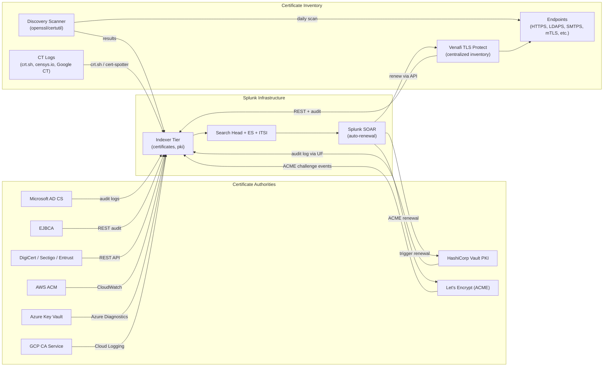

# Certificate Lifecycle & PKI Management Integration Guide

> The definitive guide to integrating certificate lifecycle and PKI
> management with Splunk. **39 use cases** covering internal CAs
> (Microsoft AD CS, EJBCA, HashiCorp Vault PKI), public CAs (DigiCert,
> Let's Encrypt, Sectigo, GlobalSign), Certificate Transparency
> (CT) log monitoring, ACME automation, Venafi TLS Protect, Sectigo
> Certificate Manager, and cloud-managed CAs (AWS ACM, Azure Key
> Vault, GCP Certificate Authority Service). Certificate expiry
> monitoring (90/60/30/7 day thresholds), weak signature algorithms
> (SHA-1, MD5), short key sizes (RSA <2048), unauthorized issuance
> via CT logs, OCSP / CRL availability, mTLS rotation tracking, and
> auto-renewal via SOAR + ACME / Vault PKI APIs.

---

## Table of Contents

- [Quick Start](#quick-start)
- [Overview](#overview)
- [Architecture and Data Flow](#architecture)
- [Prerequisites](#prerequisites)
- [Platform Coverage Matrix](#platform-matrix)
- [Internal CAs](#internal-cas)
- [Microsoft AD CS](#adcs)
- [HashiCorp Vault PKI](#vault-pki)
- [EJBCA](#ejbca)
- [OpenSSL CA](#openssl-ca)
- [Public CAs (DigiCert, Sectigo, GlobalSign, Entrust)](#public-cas)
- [Let's Encrypt + ACME](#letsencrypt)
- [Certificate Transparency (CT) logs](#ct-logs)
- [Venafi TLS Protect](#venafi)
- [Sectigo Certificate Manager](#sectigo)
- [AWS Certificate Manager (ACM)](#acm)
- [Azure Key Vault Certificates](#azure-keyvault)
- [GCP Certificate Authority Service](#gcp-cas)
- [Endpoint Discovery: Scripted Inventory](#endpoint-discovery)
- [Field Dictionary](#field-dictionary)
- [Sample Events](#sample-events)
- [Splunk-Side Configuration](#splunk-config)
- [Cross-Product Correlation](#cross-product)
- [CIM Mapping Reference](#cim-mapping)
- [Splunk ES Notable Event Pipeline](#es-notable)
- [Compliance Mapping](#compliance)
- [Capacity Planning and Sizing](#sizing)
- [Recommended Dashboard Layouts](#dashboards)
- [ITSI Service Modeling](#itsi)
- [SOAR Playbook Examples (Auto-Renewal)](#soar)
- [Multi-Tenant / Multi-CA Strategy](#multi-tenant)
- [Security Hardening](#security-hardening)
- [Crawl / Walk / Run Roadmap](#roadmap)
- [Validation Checklist](#validation-checklist)
- [Known Limitations and Gaps](#known-limitations)
- [Troubleshooting](#troubleshooting)
- [FAQ](#faq)
- [Glossary](#glossary)
- [References](#references)
- [Contribution and Feedback](#contribution)

---

<a id="quick-start"></a>
## Quick Start — 2 Hours to First Cert Inventory

> Cert lifecycle management starts with **discovery**. Without
> inventory you can't manage expiry. The fastest path: scripted
> inventory of all known endpoints + ingest into Splunk.

### Bare-bones discovery script

```bash
#!/usr/bin/env bash
# scan_certs.sh — list all SSL/TLS endpoints + cert expiry
# Output: one event per cert per line (key=value)

# Usage: scan_certs.sh hosts.txt | tee /var/log/cert_inventory.log
HOSTS_FILE=$1
[[ -z "$HOSTS_FILE" ]] && HOSTS_FILE=hosts.txt

while IFS=':' read -r host port; do
    [[ -z "$port" ]] && port=443
    cert=$(echo "" | openssl s_client -connect "$host:$port" -servername "$host" 2>/dev/null \
              | openssl x509 -text -noout 2>/dev/null)
    [[ -z "$cert" ]] && continue
    
    cn=$(echo "$cert" | grep -oP "CN=\K[^,]+" | head -1)
    issuer=$(echo "$cert" | grep -oP "Issuer:.*CN=\K[^,]+" | head -1)
    not_after=$(echo "$cert" | grep -oP "Not After : \K.*$")
    not_after_epoch=$(date -d "$not_after" +%s)
    sig_alg=$(echo "$cert" | grep -oP "Signature Algorithm: \K\S+" | head -1)
    key_size=$(echo "$cert" | grep -oP "Public-Key: \(\K[0-9]+")
    
    echo "host=$host port=$port cn=$cn issuer=\"$issuer\" cert_not_after=\"$not_after\" cert_not_after_epoch=$not_after_epoch sig_alg=$sig_alg key_size=$key_size"
done < "$HOSTS_FILE"
```

### UF inputs.conf

```ini
[script:///opt/splunk-scripts/scan_certs.sh /opt/cert-inventory/hosts.txt]
sourcetype = cert_inventory
index = certificates
interval = 86400
disabled = 0
```

### First UC

```spl
index=certificates sourcetype="cert_inventory" earliest=-1d
| eval days_to_expiry=round((cert_not_after_epoch-now())/86400)
| where days_to_expiry < 90
| table cn, issuer, days_to_expiry, host, port
| sort days_to_expiry
```

### Activate crawl tier

UC-10.8.1 (Certificate Expiry Monitoring), UC-10.8.x (Weak Signature Detection), UC-10.8.x (CT Log Monitoring), UC-10.8.x (OCSP/CRL Availability).

---

<a id="overview"></a>
## Overview

### Why cert / PKI observability matters

Certificate-related outages are **constant, expensive, and embarrassing**. Famous examples: 
- 2018 LinkedIn outage (cert expired)
- 2017 Equifax (cert renewal lapsed; allowed exfil to evade detection)
- 2020 California DMV (gov.ca.gov expired)
- 2021 Spotify (cert chain misconfigured)

PKI observability prevents:
- **Outage from expiry** (most common)
- **Trust chain breaks** (intermediate CA expiry)
- **Weak crypto deployment** (SHA-1, RSA-1024)
- **Unauthorized issuance** (CT log surveillance)
- **OCSP/CRL outages** (revocation infrastructure)
- **Compliance gaps** (PCI 4.x crypto requirements)

### Platforms covered

| Platform | Type |
|---------|------|
| **Microsoft AD CS** | Internal Windows CA |
| **HashiCorp Vault PKI** | Internal modern PKI |
| **EJBCA** | Open-source enterprise CA |
| **OpenSSL** | Manual / lab CA |
| **DigiCert / Sectigo / GlobalSign / Entrust** | Public CAs |
| **Let's Encrypt + ACME** | Free public CA + automation protocol |
| **Venafi TLS Protect** | Enterprise cert lifecycle management |
| **Sectigo Certificate Manager** | Cloud cert management |
| **AWS ACM** | AWS-managed certs |
| **Azure Key Vault Certs** | Azure-managed certs |
| **GCP CA Service** | GCP-managed CAs |

### Domains covered

| Domain | Examples |
|--------|---------|
| **Expiry monitoring** | 90/60/30/7-day countdown alerts |
| **Weak crypto detection** | SHA-1, MD5, RSA <2048, RC4 |
| **Issuance audit** | All CA-issued certs reviewed |
| **CT log monitoring** | Unauthorized issuance for our domains |
| **OCSP/CRL availability** | Revocation infra uptime |
| **Auto-renewal** | ACME, Vault PKI, AWS ACM auto-renew |
| **mTLS rotation** | Service mesh cert rotation cadence |
| **Compliance** | PCI 4.x crypto algorithm enforcement |

### What's NOT in scope

| Domain | Where to look |
|--------|---------------|
| **HSM / KMS lifecycle** | (separate guide) |
| **AD CS server health (CPU/RAM)** | [Windows Servers Guide](windows-servers.md) |
| **HTTPS / TLS at web tier** | [Web Servers Guide](web-servers.md) |
| **API Gateway mTLS** | [API Gateways Guide](api-gateways.md) |

### What good looks like

| Dimension | Without integration | With full integration |
|-----------|---------------------|-----------------------|
| Expiry-driven outages | Common, > 1/year | Effectively zero |
| Cert inventory | "We don't know" | < 24h drift detection |
| Weak crypto | Hidden in legacy systems | Active detection + remediation tickets |
| Unauthorized issuance | Discovered after compromise | Detected within 1h via CT logs |
| Auto-renewal coverage | < 20% (manual) | > 80% (ACME / Vault) |

---

<a id="architecture"></a>
## Architecture and Data Flow



### Core principles

- **Discovery is foundation** — without inventory, no management
- **CT logs catch unauthorized issuance** for your domains
- **Auto-renewal first** (ACME / Vault); manual is exception
- **Centralised dashboards** drive governance

---

<a id="prerequisites"></a>
## Prerequisites

| Item | Detail |
|------|--------|
| **Splunk version** | 9.0+ Enterprise / Cloud |
| **Splunk ES** | Optional but recommended |
| **Splunk ITSI** | Recommended for SLO tracking |
| **OpenSSL / certutil** | For scripted discovery |
| **Network access** | Splunk → all endpoints (or central Venafi) |
| **CA admin access** | Read access for audit log forwarding |

---

<a id="platform-matrix"></a>
## Platform Coverage Matrix

| Platform | Ingest method | Sourcetypes |
|---------|--------------|-------------|
| **Microsoft AD CS** | Windows Event Log via `Splunk_TA_windows` | `WinEventLog:CertificateServices-Lifecycle-Information`, `ms:adcs:audit` |
| **HashiCorp Vault PKI** | Vault audit log via UF file tail | `vault:audit:json` (custom) |
| **EJBCA** | EJBCA REST audit + DB query | `ejbca:audit` (custom) |
| **OpenSSL CA** | File monitor `index.txt` | `openssl:ca:txt` (custom) |
| **DigiCert / Sectigo / Entrust** | REST API | `digicert:cert`, `sectigo:cert_manager` |
| **Let's Encrypt + ACME** | Certbot/lego logs + cert-spotter | `acme:event`, `letsencrypt:certbot` |
| **CT Logs (crt.sh, Google CT, Censys)** | API polling | `ct:log` |
| **Venafi TLS Protect** | REST API | `venafi:tlsprotect` |
| **Sectigo Certificate Manager** | REST API | `sectigo:cert_manager` |
| **AWS ACM** | CloudTrail + CloudWatch via Splunk_TA_aws | `aws:acm:event`, `aws:cloudtrail` |
| **Azure Key Vault** | Azure Diagnostics | `azure:keyvault:cert` |
| **GCP CA Service** | Cloud Logging | `google:gcp:certificateauthorityservice` |

---

<a id="internal-cas"></a>
## Internal CAs

Internal CAs typically live in 4 places: AD CS (Windows shops), Vault PKI (modern cloud-native), EJBCA (regulated), OpenSSL (lab/legacy).

---

<a id="adcs"></a>
## Microsoft AD CS

### Configuration

Enable audit subcategory on Windows CA server:

```cmd
auditpol /set /subcategory:"Certification Services" /success:enable /failure:enable
```

Forward Application + Certificate Services event logs via Splunk UF (Splunk_TA_windows).

### Sample event (AD CS 4886 — issued cert)

```
EventID=4886
RequesterName=DOMAIN\WebServer-Cert-Request
Subject=CN=web.example.com,OU=IT,O=Acme,C=US
Issuer=CN=Acme Internal CA
SerialNumber=1234567890ABCDEF
NotBefore=2026-04-25 14:30:15
NotAfter=2027-04-25 14:30:15
Template=WebServer
SignatureAlgorithm=sha256RSA
PublicKeyAlgorithm=RSA
KeyLength=2048
```

### Sample SPL — All AD CS issued certs (audit)

```spl
index=ad sourcetype="WinEventLog:Security" EventCode=4886 earliest=-7d
| stats count by RequesterName, Template
| sort -count
```

---

<a id="vault-pki"></a>
## HashiCorp Vault PKI

### Configuration

```bash
# Enable Vault audit log
vault audit enable file file_path=/var/log/vault_audit.log
```

### UF inputs.conf

```ini
[monitor:///var/log/vault_audit.log]
sourcetype = vault:audit:json
index = pki
INDEXED_EXTRACTIONS = json
```

### Sample SPL — Vault PKI issued certs

```spl
index=pki sourcetype="vault:audit:json" path="pki*/issue/*" earliest=-7d
| spath response.data.certificate output=cert
| stats count by request.client_token, request.path
```

---

<a id="ejbca"></a>
## EJBCA

EJBCA exposes audit log via REST + DB. Recommended pattern:

```bash
# Daily cron job to dump audit table
psql -h ejbca-db -U readonly -c "COPY (SELECT * FROM AuditRecordData WHERE timeStamp > NOW()-INTERVAL '1 day') TO STDOUT" \
  > /var/log/ejbca/audit_$(date +%Y%m%d).log
```

---

<a id="openssl-ca"></a>
## OpenSSL CA

Monitor the OpenSSL `index.txt`:

```ini
[monitor:///etc/pki/CA/index.txt]
sourcetype = openssl:ca:txt
index = pki
```

---

<a id="public-cas"></a>
## Public CAs (DigiCert, Sectigo, GlobalSign, Entrust)

Most commercial CAs offer REST APIs for cert inventory + audit:

```python
# Pseudocode
import requests
api = "https://api.digicert.com/services/v2/order/certificate"
headers = {"X-DC-DEVKEY": "<your-key>"}
r = requests.get(api, headers=headers)
for cert in r.json()['certificates']:
    print(json.dumps(cert))
```

Run as Splunk modular input or scheduled cron → file ingest.

---

<a id="letsencrypt"></a>
## Let's Encrypt + ACME

### Certbot logs

```ini
[monitor:///var/log/letsencrypt/letsencrypt.log]
sourcetype = letsencrypt:certbot
index = pki
```

### ACME automation tracking

For cert-manager (Kubernetes), Lego, or other ACME clients:

```yaml
# cert-manager logs to stdout → fluent-bit → Splunk HEC
sourcetype: cert-manager:json
```

---

<a id="ct-logs"></a>
## Certificate Transparency (CT) logs

CT logs are public append-only logs of every cert issued by participating CAs (which is most). You can monitor for **unauthorized issuance** for your domains.

### Tools

- [crt.sh](https://crt.sh) — free, simple
- [SSLMate's cert-spotter](https://github.com/SSLMate/cert-spotter) — CLI watcher
- [Google CT API](https://github.com/google/certificate-transparency-go)

### cert-spotter integration

```bash
# Daily scan
cert-spotter -all_time \
  -watchlist /etc/cert-spotter/watchlist.txt \
  -script /opt/scripts/ct-to-splunk.sh
```

```bash
#!/usr/bin/env bash
# ct-to-splunk.sh — emit CT findings as JSON to log file
echo "{\"domain\":\"$DOMAIN\",\"issuer\":\"$ISSUER\",\"sha256\":\"$SHA256\",\"not_before\":\"$NOT_BEFORE\",\"not_after\":\"$NOT_AFTER\"}" \
  >> /var/log/ct/findings.log
```

### Alert on unauthorized issuance

```spl
index=pki sourcetype="ct:log" earliest=-1h
| where domain="*.example.com"
| lookup authorized_issuers issuer OUTPUT authorized
| where isnull(authorized) OR authorized="no"
| stats count by domain, issuer, sha256
```

---

<a id="venafi"></a>
## Venafi TLS Protect

Venafi is the enterprise-grade cert lifecycle platform. It provides:
- Centralised cert inventory (auto-discovery)
- Auto-renewal workflows
- Policy enforcement (cert template, key size, sig algorithm)
- Integration with all major CAs

### Configuration

```
Venafi Admin → Notifications → REST Webhook → Splunk HEC URL
+ Events: Certificate Issued, Renewed, Expired, Revoked
+ Format: JSON
```

---

<a id="sectigo"></a>
## Sectigo Certificate Manager

Cloud-based cert management; REST API:

```bash
curl -H "Authorization: Bearer <token>" \
  https://cert-manager.com/api/v1/orders \
  | jq '.[]' >> /var/log/sectigo/orders.log
```

---

<a id="acm"></a>
## AWS Certificate Manager (ACM)

### CloudWatch + CloudTrail integration

```
Splunk Add-on for AWS → enable:
+ CloudTrail (data events for ACM API calls)
+ CloudWatch metrics (cert expiry — DaysToExpiry)
```

### Sample SPL — ACM expiry tracking

```spl
index=aws sourcetype="aws:cloudwatch" namespace="AWS/CertificateManager" metric_name="DaysToExpiry" earliest=-1d
| stats min(value) as days_to_expiry by CertificateArn
| where days_to_expiry < 30
```

---

<a id="azure-keyvault"></a>
## Azure Key Vault Certificates

```
Azure Portal → Key Vault → Diagnostic settings → Add:
+ Logs: AuditEvent
+ Destination: Event Hub
Splunk Add-on for Microsoft Cloud Services → poll Event Hub
```

---

<a id="gcp-cas"></a>
## GCP Certificate Authority Service

```
GCP → Logging → Logs Router → Sink:
+ Filter: protoPayload.serviceName="privateca.googleapis.com"
+ Destination: Pub/Sub topic → Splunk Add-on for GCP
```

---

<a id="endpoint-discovery"></a>
## Endpoint Discovery: Scripted Inventory

Beyond CA-side audit, you must scan endpoints to confirm what's actually deployed.

### Inventory sources

```bash
hosts.txt:
www.example.com:443
api.example.com:443
mail.example.com:443
mail.example.com:25     # STARTTLS
ldap.example.com:636
mysql.example.com:3306  # SSL
```

### Comprehensive scan script

```bash
#!/usr/bin/env bash
# Walk all known endpoints, dump cert metadata as JSON
while IFS=':' read -r host port; do
    cert=$(echo "" | openssl s_client \
                -connect "$host:$port" \
                -servername "$host" \
                -starttls smtp 2>/dev/null \
                | openssl x509 -noout -subject -issuer -dates -fingerprint -text)
    
    sha256=$(echo "$cert" | openssl x509 -noout -fingerprint -sha256 | awk -F= '{print $2}' | tr -d ':')
    cn=$(echo "$cert" | grep -oP "subject=.*CN = \K[^,]+" | head -1)
    san=$(echo "$cert" | grep -oP "DNS:\K\S+" | tr '\n' ',' | sed 's/,$//')
    issuer=$(echo "$cert" | grep -oP "issuer=.*CN = \K[^,]+" | head -1)
    not_before=$(echo "$cert" | grep -oP "notBefore=\K.*$")
    not_after=$(echo "$cert" | grep -oP "notAfter=\K.*$")
    not_after_epoch=$(date -d "$not_after" +%s)
    sig_alg=$(echo "$cert" | grep -oP "Signature Algorithm: \K\S+" | head -1)
    key_size=$(echo "$cert" | grep -oP "Public-Key: \(\K[0-9]+")
    
    echo "{\"host\":\"$host\",\"port\":$port,\"cn\":\"$cn\",\"san\":\"$san\",\"issuer\":\"$issuer\",\"not_before\":\"$not_before\",\"not_after\":\"$not_after\",\"not_after_epoch\":$not_after_epoch,\"sig_alg\":\"$sig_alg\",\"key_size\":$key_size,\"sha256\":\"$sha256\"}"
done < hosts.txt
```

### UF inputs.conf

```ini
[script:///opt/cert-discovery/scan.sh]
sourcetype = cert_inventory
index = certificates
interval = 86400
disabled = 0
```

---

<a id="field-dictionary"></a>
## Field Dictionary

| Field | Purpose |
|-------|--------|
| `cn` | Common Name |
| `san` | Subject Alternative Names (multivalue) |
| `issuer` | CA that issued |
| `not_before` | Validity start |
| `not_after` | Validity end |
| `not_after_epoch` | Expiry as Unix epoch (for `eval` math) |
| `sha256` | Cert SHA-256 fingerprint |
| `sig_alg` | Signature algorithm (sha256WithRSAEncryption) |
| `key_size` | Public key size in bits (2048, 3072, 4096) |
| `key_algorithm` | RSA / ECDSA / Ed25519 |
| `host` | Hostname/endpoint scanned |
| `port` | Port |
| `template` | (AD CS) cert template name |
| `requester` | Who requested (AD CS) |
| `serial` | Cert serial number |
| `revoked` | Revocation status (true/false) |
| `revoked_reason` | Why revoked |

---

<a id="sample-events"></a>
## Sample Events

(See per-platform sections.)

---

<a id="splunk-config"></a>
## Splunk-Side Configuration

### Index strategy

```ini
[certificates]
homePath = $SPLUNK_DB/certificates/db
maxDataSize = auto
frozenTimePeriodInSecs = 31536000   # 1 year+ for audit history

[pki]
homePath = $SPLUNK_DB/pki/db
maxDataSize = auto
frozenTimePeriodInSecs = 31536000   # 1 year+ for issuance audit
```

### Lookup tables

`authorized_issuers.csv`:
```
issuer,authorized
"DigiCert SHA2 Secure Server CA",yes
"Acme Internal CA",yes
"Let's Encrypt R3",yes
```

---

<a id="cross-product"></a>
## Cross-Product Correlation

### Cert + Web Server outage correlation

```spl
index=certificates sourcetype="cert_inventory" earliest=-1d
| eval days_to_expiry = round((cert_not_after_epoch - now())/86400)
| where days_to_expiry < 7
| join host [search index=web sourcetype="apache:access" status>=500 earliest=-1h | stats count as recent_errors by host]
| where recent_errors > 100
```

### Cert + AD CS issuance reconciliation

```spl
index=certificates sourcetype="cert_inventory" earliest=-1d
| where issuer="Acme Internal CA"
| dedup sha256
| join sha256 [search index=ad EventCode=4886 issuer="Acme Internal CA" | rename SerialNumber as serial | fields serial, sha256] type=outer
| where isnull(serial)
| stats values(host) as deployed_endpoints by sha256
```

---

<a id="cim-mapping"></a>
## CIM Mapping Reference

| CIM model | Sourcetype |
|-----------|-----------|
| **Certificates** (custom — no native CIM model) | All cert inventory + CA audit |
| **Inventory** (asset link) | When cert is bound to asset |
| **Change** | Cert issued / renewed / revoked |

---

<a id="es-notable"></a>
## Splunk ES Notable Event Pipeline

ES correlation searches:
- "Certificate Expires Within 30 Days"
- "Weak Signature Algorithm Detected (SHA-1)"
- "Unauthorized Issuance via CT Log"
- "OCSP Endpoint Unavailable"

---

<a id="compliance"></a>
## Compliance Mapping

### NIST 800-53

| Control | Coverage |
|---------|----------|
| **SC-12** Cryptographic Key Establishment | All cert lifecycle UCs |
| **SC-17** PKI Certificates | All CA + cert UCs |
| **AU-2/12** Audit | CA issuance audit |

### PCI-DSS 4.0

| Requirement | Coverage |
|-------------|----------|
| **4.x** Cryptography | Cert + key strength compliance |
| **6.x** Secure Systems | Cert lifecycle in SDLC |

### CA/Browser Forum Baseline

| Requirement | Coverage |
|-------------|----------|
| **6.1** Algorithm requirements | Sig alg + key size monitoring |
| **6.3** Validity period | Cert lifetime tracking |
| **7.1** Subject info | CN/SAN audit |

---

<a id="sizing"></a>
## Capacity Planning and Sizing

| Cert inventory size | Daily ingest |
|---------------------|--------------|
| < 100 certs | < 1 MB |
| 100 - 1k | ~5 MB |
| 1k - 10k | ~50 MB |
| 10k - 100k | ~500 MB |
| 100k+ | ~5+ GB |

CT log monitoring is approximately ~50-200 MB/day for major orgs.

---

<a id="dashboards"></a>
## Recommended Dashboard Layouts

### Crawl

```
+---------------------+---------------------+
| CERTS EXPIRING IN < 90 DAYS                |
+---------------------+---------------------+
| CERTS EXPIRING IN < 30 DAYS (CRITICAL)     |
+---------------------+---------------------+
| WEAK SIG ALG DEPLOYED (SHA-1)              |
+---------------------+---------------------+
| WEAK KEY SIZE DEPLOYED (RSA<2048)          |
+---------------------+---------------------+
```

### Walk

```
+---------------------+---------------------+
| CT LOG MONITORING — UNAUTHORIZED ISSUANCE  |
+---------------------+---------------------+
| OCSP/CRL UPTIME                            |
+---------------------+---------------------+
| AUTO-RENEWAL COVERAGE %                    |
+---------------------+---------------------+
| CA AUDIT — ISSUED CERTS THIS WEEK          |
+---------------------+---------------------+
```

### Run

```
+---------------------+---------------------+
| CERT BIND VS DEPLOYED RECONCILIATION       |
+---------------------+---------------------+
| MEAN TIME TO RENEW (auto-renewal SLA)      |
+---------------------+---------------------+
| MITRE ATT&CK T1553 (subvert trust)         |
+---------------------+---------------------+
```

---

<a id="itsi"></a>
## ITSI Service Modeling

### Service hierarchy

```
PKI Posture
├── CA Tier
│   ├── AD CS health
│   ├── Vault PKI health
│   └── Public CA quota tracking
├── Inventory Tier
│   ├── Total cert count
│   ├── Expiring < 30d count
│   └── Weak crypto count
├── Issuance Pipeline
│   ├── Avg renewal latency
│   └── Auto-renewal success rate
└── Surveillance
    ├── CT log unauthorized findings
    └── OCSP/CRL uptime
```

---

<a id="soar"></a>
## SOAR Playbook Examples

### Playbook 1: Cert Expires < 30d → Auto-Renewal

```
1. RECEIVE notable: cert expires < 30d
2. IDENTIFY cert provider (AD CS / Vault / ACM / Let's Encrypt)
3. IF Let's Encrypt → trigger Certbot/Lego ACME renewal
4. IF Vault → trigger renewal API call
5. IF ACM → request new cert via ACM API + update endpoint
6. IF manual → CREATE high-priority ticket assigned to platform team
7. POST-RENEWAL → re-scan endpoint, confirm new cert deployed
```

### Playbook 2: CT Log Unauthorized → Investigation

```
1. RECEIVE notable: cert issued for our domain by unknown CA
2. ENRICH with CT log full details (issuance time, serial, validity)
3. CHECK if recently we requested via different vendor
4. IF unknown → escalate to security team Sev-2
5. CREATE forensic case
```

---

<a id="multi-tenant"></a>
## Multi-Tenant / Multi-CA Strategy

- Per-tenant cert inventory
- Per-tenant CA audit trail
- Per-tenant CT log watchlist
- Centralised dashboards with tenant filter

---

<a id="security-hardening"></a>
## Security Hardening

- CA admin in vault, MFA-protected
- CA private key on HSM (FIPS 140-3 Level 2+)
- All CA admin access audited and immutable
- Field-level RBAC on private key fingerprints / serials in compliance contexts
- TLS for all CA-to-Splunk transport
- Annual CA root key ceremony

---

<a id="roadmap"></a>
## Crawl / Walk / Run Roadmap

### Crawl (Week 1-4)

1. Deploy discovery script + UF
2. Daily cert inventory in Splunk
3. UC-10.8.1 (expiry monitoring) wired
4. Crawl-tier dashboards live

### Walk (Month 2-3)

1. Onboard internal CA audit (AD CS, Vault)
2. CT log monitoring (cert-spotter or similar)
3. Auto-renewal pilot (Let's Encrypt)
4. Weak crypto detection
5. ITSI service health modeled

### Run (Month 4+)

1. Full Venafi integration (or equivalent)
2. SOAR auto-renewal for all internal certs
3. Quarterly cert hygiene report
4. CA Browser Forum compliance dashboards
5. mTLS rotation tracking

---

<a id="validation-checklist"></a>
## Validation Checklist

- [ ] Day 1: First inventory scan complete
- [ ] Day 7: All known CAs onboarded; first expiry alert
- [ ] Day 30: Walk-tier UCs deployed
- [ ] Day 90: SOAR auto-renewal operational; quarterly hygiene report

---

<a id="known-limitations"></a>
## Known Limitations and Gaps

| Limitation | Impact | Workaround |
|------------|--------|------------|
| **Endpoint discovery is incomplete by definition** | "What you don't know" certs slip through expiry | Pair with Venafi (network discovery) + asset register |
| **Self-signed certs evade CT logs** | No public surveillance | Internal CA audit + endpoint scan |
| **CT logs don't catch internal CA misuse** | Internal-only attacker | Internal AD CS audit + alerts |
| **Pinned certs require coordinated rotation** | Mobile app pinning | Cert-pinning automation + grace period |
| **HSM cert export limitations** | Can't always extract private key for migration | Plan for cert reissuance |

---

<a id="troubleshooting"></a>
## Troubleshooting

### Discovery script timing out

- Increase `openssl s_client` timeout
- Parallelize with GNU parallel or xargs
- Skip unreachable hosts with retry logic

### AD CS audit events missing

- Confirm `auditpol /set /subcategory:"Certification Services" /success:enable`
- Verify Splunk_TA_windows config includes Application channel

### CT log API rate limit

- Use cert-spotter (handles rate limits)
- Or polling interval > 1h

### Auto-renewal failing

- Check ACME challenge connectivity (HTTP-01 / DNS-01)
- Verify Vault PKI role permissions
- Network reachability from cert-renewal tool to CA

---

<a id="faq"></a>
## FAQ

**Q: How long should cert validity be?**
A: Public certs are now max 398 days (CA/B Forum). Private certs vary — many orgs use 90-day rotation for hygiene. Mesh / mTLS certs can be hours/days.

**Q: Should I use Let's Encrypt for production?**
A: Yes — used by Google, Mozilla, Cloudflare, etc. Free, automated, well-vetted.

**Q: What's the difference between RSA 2048 and ECDSA P-256?**
A: ECDSA P-256 is smaller (~64 bytes vs ~256 bytes), faster handshake, equivalent security. RSA still common for legacy compatibility.

**Q: How do I migrate from SHA-1 to SHA-256?**
A: Reissue all certs with sha256WithRSAEncryption, deploy in parallel, then sunset SHA-1 endpoints.

**Q: How do I monitor mTLS rotation?**
A: Mesh-side cert metadata via Envoy admin endpoint; deploy as scheduled scan + dashboard.

**Q: What's CT (Certificate Transparency)?**
A: Public append-only logs of cert issuance. Most CAs participate. You can monitor for unauthorized issuance for your domains.

---

<a id="glossary"></a>
## Glossary

| Term | Definition |
|------|-----------|
| **CA** | Certificate Authority |
| **AD CS** | Active Directory Certificate Services |
| **PKI** | Public Key Infrastructure |
| **ACME** | Automated Certificate Management Environment (Let's Encrypt protocol) |
| **CT** | Certificate Transparency |
| **OCSP** | Online Certificate Status Protocol (revocation) |
| **CRL** | Certificate Revocation List |
| **HSM** | Hardware Security Module |
| **mTLS** | Mutual TLS |
| **CN** | Common Name |
| **SAN** | Subject Alternative Name |
| **EKU** | Extended Key Usage |
| **HSTS** | HTTP Strict Transport Security |

---

<a id="references"></a>
## References

- [Splunk Add-on for Microsoft Windows (Splunkbase 742)](https://splunkbase.splunk.com/app/742)
- [Splunk Add-on for AWS (Splunkbase 1876)](https://splunkbase.splunk.com/app/1876)
- [Splunk Add-on for Microsoft Cloud Services (Splunkbase 3110)](https://splunkbase.splunk.com/app/3110)
- [Splunk Add-on for GCP (Splunkbase 3088)](https://splunkbase.splunk.com/app/3088)
- [HashiCorp Vault PKI documentation](https://developer.hashicorp.com/vault/docs/secrets/pki)
- [Microsoft AD CS documentation](https://docs.microsoft.com/en-us/windows-server/identity/ad-cs/active-directory-certificate-services-overview)
- [Let's Encrypt documentation](https://letsencrypt.org/docs/)
- [SSLMate cert-spotter](https://github.com/SSLMate/cert-spotter)
- [Venafi TLS Protect](https://venafi.com/tls-protect/)
- [crt.sh CT log search](https://crt.sh/)
- [CA/Browser Forum Baseline Requirements](https://cabforum.org/baseline-requirements/)
- [NIST SP 800-57 (Key Management)](https://csrc.nist.gov/publications/detail/sp/800-57-part-1/rev-5/final)

---

<a id="contribution"></a>
## Contribution and Feedback

Part of the [Splunk Monitoring Use Cases](https://github.com/fenre/splunk-monitoring-use-cases) project. [Open an issue](https://github.com/fenre/splunk-monitoring-use-cases/issues/new).

---

*Last updated: 2026-05-09. Covers AD CS Windows Server 2019/2022/2025, HashiCorp Vault 1.15+, Let's Encrypt current, AWS ACM current, Azure Key Vault current, GCP CA Service current.*
