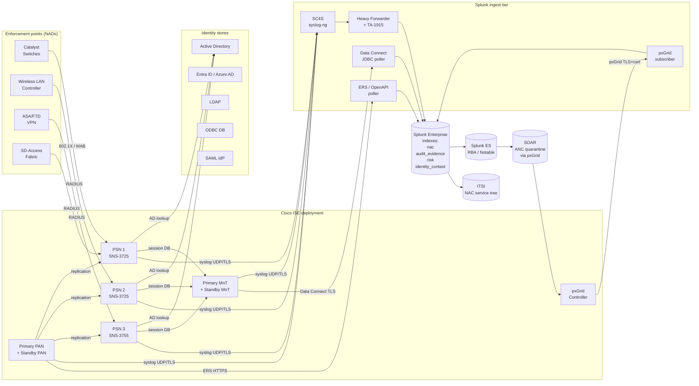

# Cisco Identity Services Engine (ISE) Integration Guide

> The definitive guide to integrating Cisco ISE<sup class="ref">[<a href="#ref-1">1</a>]</sup> with Splunk for
> network access control (NAC), identity-aware monitoring, posture
> compliance, TrustSec microsegmentation, pxGrid context sharing, ANC
> adaptive response, audit-grade regulatory evidence, and SOAR-driven
> closed-loop response. 82 production-ready use cases across crawl /
> walk / run maturity tiers, plus 24 cross-cutting compliance wrappers
> in cat-22 covering PCI-DSS v4, HIPAA<sup class="ref">[<a href="#ref-12">12</a>]</sup>, NIS2<sup class="ref">[<a href="#ref-2">2</a>]</sup>, DORA<sup class="ref">[<a href="#ref-3">3</a>]</sup>, ISO 27001, SOC 2,
> SOX<sup class="ref">[<a href="#ref-10">10</a>]</sup> ITGC, CMMC 2.0, NERC CIP, NIST 800-53, and TSA / IEC 62443.

---

## Table of Contents

- [Quick Start](#quick-start)
- [Overview — What Good Looks Like](#overview)
- [Architecture and Data Flow](#architecture)
- [Prerequisites](#prerequisites)
- [Cisco ISE Components Reference](#ise-components)
- [Data Sources Reference](#data-sources)
- [ISE Logging Categories Map](#logging-categories)
- [MessageCode Reference](#messagecode)
- [Sample Events](#sample-events)
- [TA Configuration](#ta-configuration)
- [Syslog Pipeline (SC4S Recommended)](#syslog-pipeline)
- [pxGrid Subscriber Setup](#pxgrid)
- [pxGrid Cloud (3.2+)](#pxgrid-cloud)
- [ERS / OpenAPI Polling](#ers-openapi)
- [Data Connect (Direct DB Read)](#data-connect)
- [Cisco Secure Client Posture Telemetry](#secure-client)
- [Splunk-Side Configuration](#splunk-config)
- [Field Dictionary](#field-dictionary)
- [CIM Mapping](#cim-mapping)
- [Compliance Mapping](#compliance-mapping)
- [Crawl / Walk / Run Roadmap](#roadmap)
- [Cross-Product Correlation](#cross-product)
- [SOAR Closed-Loop Patterns](#soar)
- [ITSI Service Modeling](#itsi)
- [Splunk ES Risk-Based Alerting (RBA)](#rba)
- [Recommended Dashboard Layouts](#dashboards)
- [Capacity Planning and Sizing](#sizing)
- [Performance Tuning](#performance-tuning)
- [TrustSec / SGT Operations](#trustsec)
- [Posture Funnel Operations](#posture-funnel)
- [Validation Checklist](#validation-checklist)
- [Security Hardening](#security-hardening)
- [Multi-Tenant / MSSP Patterns](#multi-tenant)
- [Migration Patterns](#migration)
- [Troubleshooting](#troubleshooting)
- [Known Limitations](#known-limitations)
- [FAQ](#faq)
- [Glossary](#glossary)
- [References](#references)
- [Contribution and Feedback](#contribution)

---

<a id="quick-start"></a>
## Quick Start — 10 Minutes to First Data

1. **Install the TA** — Download
   [Splunk Add-on for Cisco Identity Services (Splunkbase 1915)](https://splunkbase.splunk.com/app/1915)
   and install on your search head and heavy forwarder (or single-instance Splunk).

2. **Create the index** — In Splunk, Settings → Indexes → New Index.
   Name `nac`, type Events. Set retention per the highest-tier compliance
   framework you operate under (HIPAA: 6y; SOX/NERC CIP: 7y; PCI: 1y).

3. **Configure ISE syslog forwarding** — In ISE, Administration →
   System → Logging → Remote Logging Targets. Add the heavy forwarder
   hostname/IP, port `514` UDP (or port `6514` over TLS), and assign
   all relevant logging categories (Failed-Attempts,
   Passed-Authentications, Authorization, Admin-Operations,
   System-Diagnostics, Posture, etc.).

4. **Verify data** — Within 5 minutes, run:
   ```spl
   index=nac sourcetype=cisco:ise:syslog | stats count by MessageCode | sort -count
   ```

5. **Deploy core UCs** — Start with the [Crawl tier](#roadmap)
   (UC-17.1.1 — UC-17.1.10, plus 17.1.28, 17.1.31, 17.1.43, 17.1.71).

---

<a id="overview"></a>
## Overview — What Good Looks Like

Cisco ISE is a **policy decision point** for network access control,
implementing per-session authorization for wired, wireless, VPN, and
BYOD endpoints and providing centralized device administration via
TACACS+. Its surface area:

| Capability | Description |
|---|---|
| **Authentication** | 802.1X (EAP-TLS, EAP-TEAP, PEAP, EAP-FAST), MAB, iPSK, PSK; RADIUS for network-edge enforcement; TACACS+ for device administration |
| **Authorization** | Policy stack producing per-session results — VLAN, dACL, SGT, ACL push, URL redirect, voice domain |
| **Posture** | Endpoint compliance attestation via Cisco Secure Client posture module (formerly AnyConnect) |
| **Profiling** | Endpoint identification via DHCP, RADIUS, NMAP, NetFlow, SNMP, HTTP, AD, AI Endpoint Analytics |
| **TrustSec / Group-Based Policy (GBP)** | SGT-based microsegmentation; SXP for IP-to-SGT propagation |
| **pxGrid** | Real-time context sharing with security/IT ecosystems (FMC, Cyber Vision, AMP, Stealthwatch, third parties) |
| **ANC (Adaptive Network Control)** | Programmatic enforcement — quarantine, port-bounce, port-shutdown |
| **Guest / BYOD** | Sponsor portals, self-registration, MDM/UEM integration |
| **Threat-Centric NAC (TC-NAC)** | STIX/TAXII feed integration; threat-list endpoint matching |
| **Cisco Identity Intelligence (CII)** | Risk-scoring service enriching auth posture |
| **AI Endpoint Analytics (AEB)** | Catalyst Center co-deployment, applies ML to profiler data |

What good Splunk integration looks like:

- All 10 sourcetypes ingested with end-to-end timestamp accuracy
  (clock skew < 2 seconds)
- CIM Authentication, TACACS+, RADIUS, Change tags applied with
  100% coverage on relevant MessageCodes
- Posture, profiling, and TrustSec context exposed via the Splunk
  Add-on for Cisco Identity Services field model
- Cross-product correlation with WLC, Catalyst, ASA/FTD, ThousandEyes,
  and Catalyst Center
- ANC closed-loop integration with Splunk SOAR (Splunkbase 4250) for
  MTTC < 60s
- Audit-grade evidence pipelines into `audit_evidence` index tagged
  with regulatory clauses (PCI 4.2.1, HIPAA 164.312(b), NIS2 Art. 21,
  etc.)
- Per-PSN telemetry feeding capacity planning and SLO dashboards
- Stable, repeatable RBA risk modifiers feeding ES Notable
- ITSI service tree with PAN, MnT, PSN, pxGrid sub-services and
  composite health score

---

<a id="architecture"></a>
## Architecture and Data Flow



### Data acquisition options (recommended layering)

| Path | Use | Note |
|---|---|---|
| **Syslog (primary)** | Logging categories targeted to a Splunk heavy forwarder; UDP/514, TCP/6514 (TLS), or via SC4S | Backbone of all ISE telemetry |
| **pxGrid (real-time context)** | Subscriber model for streaming session context, profiling, ANC events | Requires pxGrid certificate trust |
| **ERS / OpenAPI (poll-based)** | Read-only inventory for SGT matrix, certs, license, MnT operational data | Light footprint |
| **Data Connect (advanced)** | Direct database access for high-volume historical reporting | Audit-controlled; ISE 3.2+ |

### Data flow per session

```
Endpoint authenticates →
  NAD sends RADIUS Access-Request to PSN →
    PSN evaluates policy (identity store + authz rules) →
      PSN returns RADIUS Access-Accept with VLAN / dACL / SGT →
        NAD enforces; CoA available for re-authz →
          PSN forwards session record to MnT →
            MnT writes operational DB →
              ISE emits CISE_Passed_Authentications syslog (5200) →
                SC4S parses & routes →
                  Splunk indexes as cisco:ise:syslog →
                    pxGrid publishes session context →
                      Splunk pxGrid subscriber receives →
                        ES correlates with auth, ITSI updates KPI
```

---

<a id="prerequisites"></a>
## Prerequisites

| Layer | Requirement |
|---|---|
| **Cisco ISE** | 3.1+ (3.2+ for full pxGrid Cloud, Data Connect, AI Endpoint Analytics); current minor patch level |
| **Splunk Enterprise** | 9.2+ or Splunk Cloud current |
| **Splunk Add-on for Cisco Identity Services** | 4.x or later |
| **Heavy forwarder** | At least one, sized for ISE syslog volume (see [Sizing](#sizing)) |
| **TLS** | TLS 1.2+ for syslog (port 6514); TLS 1.2+ for pxGrid (mandatory) |
| **Trusted CA** | For pxGrid mutual auth (use ISE internal CA or your enterprise PKI) |
| **Splunk SOAR Cisco ISE App** | Optional — Splunkbase 4250 for closed-loop ANC |
| **Splunk Enterprise Security<sup class="ref">[<a href="#ref-9">9</a>]</sup>** | Optional but recommended — ES 7.x+ for RBA / Notable / IDM integration |
| **Indexes** | `nac` (primary), `audit_evidence` (compliance), `risk` (ES RBA), `identity_context` (pxGrid sessions) |
| **Lookups** | `ise_psn_capacity.csv`, `ise_sgt_matrix.csv`, `pci_cde_*`, `bes_cyber_asset_inventory.csv` (NERC), `ise_psn_to_site.csv` |
| **Time sync** | NTP on every ISE node; clock skew with Splunk indexers must be < 2s |
| **Firewall** | Allow PSN → SC4S/HF on UDP/514 or TCP/6514; Allow Splunk subscriber → pxGrid 8910/TLS; Allow Splunk poller → PAN ERS 9060/HTTPS |

### Recommended host sizing for the syslog ingestion tier

| ISE deployment | SC4S receivers | HF count | Indexer count |
|---|---|---|---|
| Small (1 PAN+MnT, 2 PSN, < 5,000 endpoints) | 1 | 1 | 1 |
| Medium (Distributed, 4 PSN, 20,000 endpoints) | 2 | 1-2 | 2-3 |
| Large (Distributed-Multisite, 10+ PSN, 100,000 endpoints) | 2-3 | 2 | 4-8 |
| Hyperscale (50,000+ endpoints/site) | 3+ | 3+ | 8+ |

---

<a id="ise-components"></a>
## Cisco ISE Components Reference

| Component | Role | Telemetry implications |
|---|---|---|
| **PAN** (Policy Administration Node) | Control plane: configuration, policy editor, replication primary | `cisco:ise:syslog` admin operations, replication health |
| **MnT** (Monitoring Node) | Operational data store: session events, reports | Largest syslog source; Data Connect read endpoint |
| **PSN** (Policy Services Node) | Data plane: RADIUS / TACACS+ / posture / profiler / pxGrid | Authentication / authorization syslog volume |
| **pxGrid Controller** | Co-located with PAN/PSN; publish/subscribe topology for context | Subscriber telemetry health |
| **PIC** (Passive Identity Connector) | AD agent for identity discovery without 802.1X | `cisco:ise:syslog` PassiveID events |
| **PMnT** (Primary MnT) / **SMnT** (Secondary MnT) | Active/standby MnT pair | Failover-related syslog |

### Persona matrix

In a small deployment, all personas can run on a single node. In
production deployments:

- **3-node**: 1 PAN+MnT (combined), 1 standby PAN+MnT, 1 PSN
- **5-node**: 1 PAN, 1 MnT, 2 PSN, 1 standby for each
- **Multi-site**: PSNs distributed by site; replication across WAN

UC-17.1.61 monitors replication lag; UC-17.1.78 detects PSN load imbalance.

---

<a id="data-sources"></a>
## Data Sources Reference

The Splunk Add-on for Cisco Identity Services (1915) supports 10 sourcetypes:

| Sourcetype | Source | Volume (typical) |
|---|---|---|
| `cisco:ise:syslog` | All ISE logging categories | 80% of ISE volume |
| `cisco:ise:radius` | RADIUS Accounting | High in WLC-heavy estates |
| `cisco:ise:tacacs` | TACACS+ accounting | Medium |
| `cisco:ise:profiler` | Profiler events | Medium |
| `cisco:ise:guestaccess` | Sponsor / guest portal | Low-medium |
| `cisco:ise:posture` | Posture events (some via syslog) | Medium |
| `cisco:ise:admin-audit` | Administrative ops audit | Low (high importance) |
| `cisco:ise:system-statistics` | Performance stats | Low |
| `cisco:ise:pxgrid` | pxGrid subscriber events | Variable |
| `cisco:ise:ers` | OpenAPI / ERS poll outputs | Low (snapshot data) |

Plus optional:

- `cisco:secureclient:posture` — Endpoint Cisco Secure Client posture
  agent telemetry (forwarded via UF or HEC from endpoints)
- `cisco:ise:dataconnect` — Data Connect JDBC poll outputs

---

<a id="logging-categories"></a>
## ISE Logging Categories Map

Configure under Administration → System → Logging → Logging
Categories. Each category maps to a target — typically your remote
syslog target (SC4S/HF):

| Category | What it includes | Recommended verbosity |
|---|---|---|
| **AAA Audit** → Failed-Attempts | Auth failures (5400, 5440, 5450) | INFO |
| **AAA Audit** → Passed-Authentications | Successful auth (5200, 5205) | INFO (or NOTICE for low volume) |
| **AAA Diagnostics** | Auth diagnostic info | NOTICE |
| **Accounting** | Accounting Start/Stop/Interim | INFO |
| **Administrative and Operational Audit** | Admin actions (60xxx) | INFO |
| **Authorization** | Authz decisions | INFO |
| **Posture and Client Provisioning Audit** | Posture results (80xxx) | INFO |
| **Posture and Client Provisioning Diagnostics** | Posture details | NOTICE |
| **Profiler** | Endpoint profile changes (80002, 80004) | INFO |
| **Replication Audit** | Inter-node replication (37xxx) | INFO |
| **System Diagnostics** | OS / process events | NOTICE |
| **System Statistics** | Performance metrics | INFO |
| **TrustSec** | TrustSec / SGT (87xxx) | INFO |

UC-17.1.74 detects logging category drift; UC-17.1.32 detects
ISE log purge / MnT retention shortfall.

---

<a id="messagecode"></a>
## MessageCode Reference

Key MessageCode ranges within `cisco:ise:syslog`:

| Range | Category | Examples |
|---|---|---|
| **5000–5099** | RADIUS auth | 5200 (Passed), 5400 (Failed), 5440 (Endpoint NAK), 5450 (Reject) |
| **5100–5299** | RADIUS accounting | 5210 (Acct Start), 5211 (Acct Stop), 5212 (Acct Interim) |
| **11000–11999** | TACACS+ Device Administration | 11023 (Privileged Command), 11005 (Login), 11018 (Logout) |
| **35000–36999** | Certificate Management | 36001 (Cert imported), 36005 (Cert expired) |
| **37000–37999** | Replication | 37050 (Replication completed), 37051 (Failed) |
| **40000–40999** | Operational Database | 40400 (Data Connect connection), 40401 (Query) |
| **60000–60999** | Administrative Operations Audit | 60100 (Role assigned), 60101 (Config change), 60110 (Login admin) |
| **80000–80999** | Posture / AI Endpoint Analytics | 80002 (Posture compliant), 80003 (Non-compliant), 80004 (Profile change) |
| **86000–86099** | ANC (Adaptive Network Control) | 86001 (Quarantine applied), 86002 (Quarantine released), 86040 (TC-NAC threat match), 86200 (MDM noncompliance) |
| **87000–87999** | TrustSec / SXP | 87000 (SGT push), 87001 (SXP peer up), 87010 (SGT mapping changed) |
| **94000–94099** | pxGrid | 94001 (Subscriber connected), 94002 (Topic published) |

Reference: Cisco ISE 3.4 [Message Codes Reference](https://www.cisco.com/c/en/us/td/docs/security/ise/3-4/admin_guide/b_ise_admin_3_4.html).

---

<a id="sample-events"></a>
## Sample Events

### Successful authentication (5200)

```
<134>Apr 25 15:23:01 ise-psn-01 CISE_Passed_Authentications 0001234567 1 0 2026-04-25 15:23:01.123 +00:00 0001234567 5200 NOTICE Passed-Authentication: Authentication succeeded, ConfigVersionId=12345, Device IP Address=10.10.10.5, DestinationIPAddress=10.20.30.40, DestinationPort=1812, UserName=jdoe@CORP.LOCAL, Protocol=Radius, RequestLatency=15, NetworkDeviceName=core-switch-bldg5, User-Name=jdoe@CORP.LOCAL, NAS-IP-Address=10.10.10.5, NAS-Port=Gi1/0/24, Service-Type=Framed, Framed-MTU=1500, Calling-Station-ID=00-11-22-33-44-55, NAS-Identifier=core-switch-bldg5, Acct-Session-Id=000ABCDE, NAS-Port-Type=Ethernet, NAS-Port-Id=GigabitEthernet1/0/24, EAP-Key-Name=, cisco-av-pair=service-type=Framed, cisco-av-pair=audit-session-id=0A0A0A050000ABCDE, AcsSessionID=ise-psn-01/123456789/12345, AuthenticationIdentityStore=AD-corp.local, AuthenticationMethod=dot1x, SelectedAccessService=Default Network Access, SelectedAuthorizationProfiles=PERMIT_ALL_TRUSTED, IdentityGroup=Endpoint Identity Groups:Profiled:Workstation, MatchedPolicyName=Trusted Workstation, EapAuthentication=EAP-TLS, EapTunnel=, FailureReason=, NetworkDeviceProfileName=Cisco
```

### Failed authentication (5400)

```
<134>Apr 25 15:24:01 ise-psn-01 CISE_Failed_Attempts 0001234568 1 0 2026-04-25 15:24:01.456 +00:00 0001234568 5400 NOTICE Failed-Attempt: Authentication failed, ConfigVersionId=12345, Device IP Address=10.10.10.5, UserName=svc-account, Protocol=Radius, RequestLatency=8, NetworkDeviceName=core-switch-bldg5, User-Name=svc-account, NAS-IP-Address=10.10.10.5, FailureReason=22056 Subject not found in the applicable identity store(s), Step latency: 8 ms
```

### ANC quarantine applied (86001)

```
<134>Apr 25 15:25:02 ise-psn-01 CISE_AdaptiveNetworkControl 0001234569 1 0 2026-04-25 15:25:02.789 +00:00 0001234569 86001 NOTICE ANC: Quarantine applied to endpoint, anc_action=quarantine, mac=00-11-22-33-44-55, anc_policy=DEFAULT_QUARANTINE, initiator=SOAR, source=pxGrid, request_id=abcdef-12345
```

### Admin role grant (60100)

```
<134>Apr 25 15:26:03 ise-pan-01 CISE_AdministrativeOperationsAudit 0001234570 1 0 2026-04-25 15:26:03.012 +00:00 0001234570 60100 NOTICE Administration: Admin role assigned, admin_user=jdoe, admin_role=SUPERADMIN, admin_action=role_assigned, source_ip=10.0.0.5
```

### TrustSec SGT push (87000)

```
<134>Apr 25 15:27:04 ise-pan-01 CISE_TrustSec 0001234571 1 0 2026-04-25 15:27:04.345 +00:00 0001234571 87000 INFO TrustSec: SGT pushed to NAD, sgt_value=10, sgt_name=PCI_CDE, target_nad=core-switch-bldg5, push_status=SUCCESS
```

### Posture non-compliant (80003)

```
<134>Apr 25 15:28:05 ise-psn-02 CISE_Posture 0001234572 1 0 2026-04-25 15:28:05.678 +00:00 0001234572 80003 NOTICE Posture: Endpoint non-compliant, mac=00-11-22-33-44-55, ip=10.10.20.30, posture_status=NonCompliant, failed_requirements=Antivirus_Definition_Outdated;Disk_Encryption_Off, action=remediate
```

### Data Connect query (40400)

```
<134>Apr 25 15:29:06 ise-mnt-01 CISE_DataConnect 0001234573 1 0 2026-04-25 15:29:06.901 +00:00 0001234573 40400 NOTICE Data Connect: Query executed, db_user=splunk_dataconnect, source_ip=10.0.0.10, query_type=SELECT, table=radius_authentications, row_count=10000, duration_ms=1250
```

### pxGrid subscriber connected (94001)

```
<134>Apr 25 15:30:07 ise-pxg-01 CISE_pxGrid 0001234574 1 0 2026-04-25 15:30:07.234 +00:00 0001234574 94001 INFO pxGrid: Subscriber connected, subscriber_name=splunk-soar, topic=com.cisco.ise.session, status=CONNECTED
```

---

<a id="ta-configuration"></a>
## TA Configuration

Configure under `Splunk Add-on for Cisco Identity Services` →
Configuration:

```ini
# inputs.conf — ERS polling
[cisco_ise://prod-cluster]
host = ise-pan-01.example.com
duration = 900
index = nac
account = ise-prod
disabled = 0
```

```ini
# inputs.conf — pxGrid subscriber
[cisco_ise_pxgrid://prod-cluster]
host = ise-pan-01.example.com
pxgrid_port = 8910
client_cert = $SPLUNK_HOME/etc/apps/Splunk_TA_cisco_ise/local/certs/pxgrid-client.pem
ca_cert = $SPLUNK_HOME/etc/apps/Splunk_TA_cisco_ise/local/certs/ca.pem
topics = com.cisco.ise.session,com.cisco.ise.config.profiler,com.cisco.ise.anc,com.cisco.ise.config.identity,com.cisco.ise.mdm
index = nac
disabled = 0
```

```ini
# inputs.conf — Data Connect (3.2+)
[cisco_ise_dataconnect://prod-mnt]
host = ise-mnt-01.example.com
db_port = 2484
db_user = splunk_dataconnect
db_password = <encrypted>
db_service_name = cpm10
queries = radius_authentications,tacacs_accounting,posture_assessment_by_endpoint
poll_interval = 300
sourcetype = cisco:ise:dataconnect
index = nac
```

### Account credentials

Configure read-only API user in ISE: Administration → System → Admin
Access → Administrators → Admin Users → Add. Role: `ERS Operator`
(read-only) for ERS; `pxGrid` (subscriber-only) for pxGrid; `Data
Connect` (read-only DB) for Data Connect.

UC-17.1.71 audits admin role assignments; UC-17.1.57 detects ERS
brute-force / abuse.

---

<a id="syslog-pipeline"></a>
## Syslog Pipeline (SC4S Recommended)

### Splunk Connect for Syslog (SC4S)

SC4S provides built-in ISE message parsing, per-PSN routing, TLS
termination, and index/sourcetype assignment. Strongly recommended
for any production ISE deployment > 10 GB/day.

```yaml
# /etc/syslog-ng/conf.d/local/cisco_ise.conf
filter f_cisco_ise {
    program("CISE_Passed_Authentications") or
    program("CISE_Failed_Attempts") or
    program("CISE_AdaptiveNetworkControl") or
    program("CISE_Posture") or
    program("CISE_AdministrativeOperationsAudit") or
    program("CISE_Profiler") or
    program("CISE_TrustSec") or
    program("CISE_pxGrid") or
    program("CISE_DataConnect") or
    program("CISE_Replication");
};

destination d_hec_cisco_ise {
    splunk-hec(
        url("https://splunk-hec.example.com:8088/services/collector/event")
        token("`SC4S_DEST_SPLUNK_HEC_DEFAULT_TOKEN`")
        index("nac")
        sourcetype("cisco:ise:syslog")
        compression(yes)
    );
};

log {
    source(s_DEFAULT);
    filter(f_cisco_ise);
    destination(d_hec_cisco_ise);
};
```

### TLS-encrypted syslog (recommended)

```yaml
# Cisco ISE side: Administration → System → Logging → Remote Logging Targets
# Set: Target Type = TCP SysLog with TLS
#      Port = 6514
#      CA Certificate Chain = uploaded SC4S server cert
```

```yaml
# SC4S side: enable TLS source
sources:
  - name: s_TLS_default
    type: tcp
    port: 6514
    tls:
      key-file: "/etc/syslog-ng/tls/server.key"
      cert-file: "/etc/syslog-ng/tls/server.crt"
      ca-dir: "/etc/syslog-ng/tls/ca/"
```

### Heavy forwarder props.conf (without SC4S)

If you can't deploy SC4S, configure on the heavy forwarder:

```ini
# props.conf
[cisco:ise:syslog]
TIME_PREFIX = ^<\d+>\w+ \d+ \d+:\d+:\d+ \S+ CISE_
TIME_FORMAT = %b %d %H:%M:%S
TZ = UTC
SHOULD_LINEMERGE = false
LINE_BREAKER = ([\r\n]+)<\d+>
KV_MODE = none
EXTRACT-ise_kv = (?<key>\w+)=(?<value>[^,]+)(?:, |$)
EXTRACT-message_code = MessageCode=(?<MessageCode>\d+)
EXTRACT-mac = (?:Calling-Station-ID|mac|endpoint_mac)=(?<src_mac>[\dA-Fa-f:.-]{12,17})
EXTRACT-username = (?:User-Name|UserName|user|username)=(?<user>[^,\s]+)
EXTRACT-nas_ip = (?:NAS-IP-Address|nas_ip|device_ip)=(?<nas_ip>[\d.]+)

[cisco:ise:radius]
TIME_PREFIX = ^<\d+>
TIME_FORMAT = %b %d %H:%M:%S
KV_MODE = none

[cisco:ise:tacacs]
TIME_PREFIX = ^<\d+>
TIME_FORMAT = %b %d %H:%M:%S
KV_MODE = none
```

### EPS budgeting per logging category

| Category | Typical EPS (medium ISE 4-PSN) |
|---|---|
| Passed-Authentications | 200-2,000 |
| Failed-Attempts | 50-500 |
| Authorization | 200-2,000 |
| Accounting | 100-500 |
| Profiler | 50-200 |
| Posture (compliant) | 20-100 |
| Posture (non-compliant) | 1-20 |
| ANC | 0-10 |
| Admin Operations | 0-5 |
| Replication | 1-5 |
| TrustSec | 1-50 |
| **Total** | **~1,000 - 5,000 EPS** |

Hyperscale (10+ PSN, 100k+ endpoints): plan for 10-50k EPS sustained.

---

<a id="pxgrid"></a>
## pxGrid Subscriber Setup

Recommended topics for security operations:

| Topic | Purpose |
|---|---|
| `com.cisco.ise.session` | Session context — user-to-IP mapping with full identity context |
| `com.cisco.ise.config.profiler` | Profiler attribute updates |
| `com.cisco.ise.anc` | ANC (quarantine) events from peers |
| `com.cisco.ise.config.identity` | Identity-store updates |
| `com.cisco.ise.config.endpoint.assetlookup` | TC-NAC threat list updates |
| `com.cisco.ise.mdm` | MDM compliance state |
| `com.cisco.ise.config.profiler.policy` | Profile policy changes |
| `com.cisco.ise.radius.failure` | RADIUS failure events |

### Subscriber lifecycle

1. **Create pxGrid client** — Splunk subscriber generates CSR
2. **Approve in ISE** — Administration → pxGrid Services → Web
   Clients → Approve
3. **Issue cert** — ISE internal CA or your enterprise CA signs cert
4. **Subscribe to topics** — Splunk subscriber subscribes to chosen
   topics
5. **Receive published events** — Push from ISE to Splunk

UC-17.1.33 subscriber connection health, UC-17.1.34 throughput
anomaly, UC-17.1.35 cloud-relay TLS health.

### Operational concerns

| Issue | Detection / Response |
|---|---|
| Subscriber stuck "PendingApproval" | Manual approval needed (ISE UI) |
| Cert expiry | UC-17.1.31 cert lifecycle alert |
| WebSocket disconnect | UC-17.1.33 — reconnect logic in TA, alert if reconnect > 3x in 5m |
| Topic throughput anomaly | UC-17.1.34 — bursty topic = possible event-storm or pxGrid side issue |
| Cloud relay (3.2+) TLS issue | UC-17.1.35 — heartbeat probe to cloud relay endpoint |

---

<a id="pxgrid-cloud"></a>
## pxGrid Cloud (3.2+)

ISE 3.2+ supports pxGrid Cloud, exposing context to SaaS consumers
(e.g., Cisco Attack Surface Management — formerly Cisco Secure Cloud
Insights, end-of-sale August 2024 — and third-party SaaS) via
Cisco-hosted relay. Splunk-side considerations:

- pxGrid Cloud uses TLS via internet — enable from ISE Administration
  → pxGrid Services → Settings → Enable pxGrid Cloud
- Splunk subscriber connects to relay URL (rather than direct to
  PSN/PAN)
- Latency typically +50-200ms vs on-prem pxGrid
- Subject to pxGrid Cloud SLAs

UC-17.1.35 monitors cloud relay TLS health; UC-17.1.59 covers
pxGrid Cloud specific event flow.

---

<a id="ers-openapi"></a>
## ERS / OpenAPI Polling

ERS (External RESTful Services) and OpenAPI are read-mostly REST
endpoints for inventory and configuration:

| Endpoint | Purpose |
|---|---|
| `/ers/config/sgt` | SGT inventory |
| `/ers/config/sgmatrix` | Effective SGT matrix |
| `/ers/config/networkdevice` | NAD inventory |
| `/ers/config/endpoint` | Endpoint inventory |
| `/ers/config/identitygroup` | Identity group definitions |
| `/api/v1/admin-permissions` | Admin role inventory (OpenAPI) |
| `/api/v1/policy/network-access/policy-set` | Policy set definitions |
| `/api/v1/policy/network-access/authentication-rules` | Auth rules |
| `/api/v1/policy/network-access/authorization-rules` | Authz rules |
| `/api/v1/posture/posture-policy` | Posture policy |
| `/api/v1/posture/posture-status` | Endpoint posture status snapshot |

### Risk awareness

| Risk | Mitigation |
|---|---|
| ERS rate-limit (100 req/s default) | Backoff + retry; reduce poll frequency |
| ERS account compromise | UC-17.1.57 detects brute force / abuse patterns |
| ERS write operations (admin role) | Restrict TA account to read-only; UC-17.1.71 audits |
| ERS cert validation bypass | Always pin / verify cert; never accept self-signed in production |

### OpenAPI vs ERS

OpenAPI (newer, OpenAPI 3.0 spec, JWT bearer auth) is the modern
replacement for ERS. Use OpenAPI for ISE 3.1+; some legacy endpoints
only on ERS for backward compatibility.

---

<a id="data-connect"></a>
## Data Connect (Direct DB Read)

ISE Data Connect (3.2+) exposes the MnT operational DB read-only over
TLS, port 2484. Useful for high-volume retrospective reports.

**Audit-controlled**: every connection logged via `cisco:ise:syslog`
40400/40401 events. Wrapped by UC-17.1.58 + UC-22.12.43.

### Recommended views

| View | What it gives you |
|---|---|
| `radius_authentications` | All RADIUS auth records with NAD context |
| `tacacs_accounting` | TACACS+ command authorization log |
| `posture_assessment_by_endpoint` | Posture results per MAC |
| `network_devices` | NAD inventory |
| `endpoints_data` | Endpoint inventory |
| `radius_acct` | Accounting records |
| `change_configuration_audit` | Config change audit |

### Splunk DB Connect setup

Use Splunk DB Connect (Splunkbase 2686) with Oracle JDBC driver:

```ini
# db_inputs.conf
[ise_dataconnect_authentications]
connection = ise-mnt-01-dataconnect
identifier = ise-auth-historical
mode = batch
query = SELECT * FROM radius_authentications WHERE acsview_timestamp > ?
input_timestamp_column_number = 5
output_timestamp_format = yyyy-MM-dd HH:mm:ss.SSS
sourcetype = cisco:ise:dataconnect
index = nac
```

### Security caveats

- Use a dedicated read-only DB user (`splunk_dataconnect`)
- Restrict source IP via ISE firewall to Splunk DB Connect host
- Rotate password every 90 days
- Audit every Data Connect connection (UC-17.1.58)

---

<a id="secure-client"></a>
## Cisco Secure Client Posture Telemetry

Cisco Secure Client (formerly AnyConnect) posture module emits local
events that can be forwarded via UF or HEC for cross-correlation:

```ini
# Splunk Universal Forwarder on endpoints
# inputs.conf
[monitor://C:\ProgramData\Cisco\Cisco Secure Client\Posture\posture.log]
sourcetype = cisco:secureclient:posture
index = nac
```

### Posture funnel correlation

```spl
# Endpoints attempting auth + missing posture
index=nac sourcetype="cisco:ise:syslog" MessageCode=5200 earliest=-24h
| stats count BY src_mac
| join src_mac type=outer [search index=nac sourcetype="cisco:secureclient:posture" earliest=-24h
                            | stats count AS posture_event_count BY mac
                            | rename mac AS src_mac]
| where isnull(posture_event_count) OR posture_event_count = 0
```

UC-17.1.53 Posture funnel monitoring; UC-17.1.69 TEAP user+machine
auth; UC-17.1.21 posture compliance baseline.

---

<a id="splunk-config"></a>
## Splunk-Side Configuration

### Index recipes

```ini
# indexes.conf
[nac]
homePath = $SPLUNK_DB/nac/db
maxDataSizeMB = 5000
frozenTimePeriodInSecs = 220752000  # 7y for SOX/NERC

[audit_evidence]
homePath = $SPLUNK_DB/audit_evidence/db
maxDataSizeMB = 1000
frozenTimePeriodInSecs = 220752000  # 7y for HIPAA/SOX/NERC

[risk]
homePath = $SPLUNK_DB/risk/db
maxDataSizeMB = 500
frozenTimePeriodInSecs = 31536000

[identity_context]
homePath = $SPLUNK_DB/identity_context/db
maxDataSizeMB = 1000
frozenTimePeriodInSecs = 31536000
```

### Macros

```ini
# macros.conf
[ise_idx]
definition = (index=nac OR index=cisco_ise OR index=identity_context)

[ise_auth_failed]
definition = `ise_idx` sourcetype=cisco:ise:syslog (MessageCode=5400 OR MessageCode=5440 OR MessageCode=5450)

[ise_auth_passed]
definition = `ise_idx` sourcetype=cisco:ise:syslog (MessageCode=5200 OR MessageCode=5205)

[ise_anc_event]
definition = `ise_idx` sourcetype=cisco:ise:syslog MessageCode IN (86001, 86002, 86040)

[ise_admin_audit]
definition = `ise_idx` sourcetype=cisco:ise:syslog MessageCode>=60000 MessageCode<60999

[normalize_mac]
definition = eval src_mac_norm = upper(replace(coalesce(src_mac, calling_station_id, mac, endpoint_mac), "[\.\-:]", ""))
```

### Lookups

```csv
# ise_psn_capacity.csv
psn_hostname,psn_model,max_tps,site,role
ise-psn-east-01,SNS-3725,10000,east,production
ise-psn-east-02,SNS-3725,10000,east,production
ise-psn-west-01,SNS-3755,20000,west,production

# ise_sgt_matrix.csv
src_sgt,dst_sgt,policy,allowed
PCI_CDE,PCI_CDE,inter_pci_allow,YES
PCI_CDE,GENERAL,pci_to_general_block,NO
EMPLOYEE,SERVERS,employee_to_servers_allow,YES

# nad_to_owner.csv
nad_name,nad_ip,site,owner_email,role
core-switch-bldg5,10.10.10.5,bldg5,netops@example.com,distribution
ap-bldg5-fl3-01,10.10.20.10,bldg5,wireless@example.com,access
```

---

<a id="field-dictionary"></a>
## Field Dictionary

| Field | Type | Source | Notes |
|---|---|---|---|
| `_time` | epoch | All | Auto |
| `MessageCode` | int | cisco:ise:syslog | Numeric code (5200, 5400, 86001, etc.) |
| `user` / `username` / `User-Name` | string | All | Authenticating identity |
| `src_mac` / `Calling-Station-ID` | string | All | Endpoint MAC |
| `nas_ip` / `NAS-IP-Address` | string | All | NAD IP |
| `NetworkDeviceName` | string | All | NAD friendly name |
| `Acct-Status-Type` | string | RADIUS Accounting | Start/Stop/Interim |
| `EapAuthentication` | string | Auth | EAP-TLS, EAP-TEAP, etc. |
| `MatchedPolicyName` | string | Auth | Matched authz rule name |
| `IdentityGroup` | string | Auth | Endpoint identity group |
| `AuthenticationIdentityStore` | string | Auth | AD-corp.local, Internal Users, etc. |
| `FailureReason` | string | Auth (failed) | Specific failure reason |
| `anc_action` | string | ANC (86001) | quarantine/release/portbounce |
| `anc_policy` | string | ANC | Policy name |
| `posture_status` | string | Posture (80003) | Compliant/NonCompliant |
| `failed_requirements` | string | Posture | List of failed posture requirements |
| `sgt_value` / `sgt_name` | int / string | TrustSec | Tag value/name |
| `target_nad` | string | TrustSec | NAD receiving the SGT push |
| `admin_user` | string | Admin Audit | Admin performing action |
| `admin_action` | string | Admin Audit | Action performed |
| `admin_role` | string | Admin Audit | Role being assigned/removed |
| `framed_ip_address` | string | RADIUS | Endpoint IP (post-DHCP) |
| `audit_session_id` | string | All | Cisco AV-pair session ID |

---

<a id="cim-mapping"></a>
## CIM Mapping

| ISE Field | CIM Model | CIM Field |
|---|---|---|
| `user`, `username`, `User-Name` | Authentication | `user` |
| `nas_ip`, `device_ip` | Authentication | `dest`, `dvc` |
| `Calling-Station-ID` (MAC) | Authentication | `src_mac` |
| `framed_ip_address` | Authentication | `src_ip` |
| `Acct-Status-Type` | Authentication | `action` |
| `MessageCode` | Authentication | `signature_id` |
| `MatchedPolicyName` | Authentication | `authentication_method` |
| `EapAuthentication` | Authentication | `signature` |
| `admin_user`, `admin_role`, `admin_action` | Change | `user`, `object`, `action` |
| `anc_action`, `endpoint_mac` | Alerts | `signature`, `dest_mac` |
| `anomaly_type`, `anomaly_score` | Alerts | `signature`, `severity_id` |
| `sgt_value`, `sgt_name` | Network_Traffic | `tag` (cs_value, cs_name) |
| `posture_status` | Vulnerabilities | `signature`, `severity` |

### Required tags

```ini
# eventtypes.conf
[ise_authentication]
search = sourcetype="cisco:ise:syslog" (MessageCode=5200 OR MessageCode=5400 OR MessageCode=5440)

[ise_radius]
search = sourcetype IN (cisco:ise:syslog, cisco:ise:radius) (MessageCode=5200 OR MessageCode=5400 OR Acct-Status-Type=*)

[ise_tacacs]
search = sourcetype IN (cisco:ise:syslog, cisco:ise:tacacs) MessageCode>=11000 MessageCode<12000

[ise_change]
search = sourcetype="cisco:ise:syslog" MessageCode>=60000 MessageCode<60999

# tags.conf
[eventtype=ise_authentication]
authentication = enabled

[eventtype=ise_radius]
authentication = enabled
radius = enabled

[eventtype=ise_tacacs]
authentication = enabled
tacacs = enabled

[eventtype=ise_change]
change = enabled
```

---

<a id="compliance-mapping"></a>
## Compliance Mapping

This guide's UC catalog is mapped to the following frameworks via the
structured `compliance[]` array on each UC:

| Framework | Primary cat-22 wrappers |
|---|---|
| **PCI DSS v4.0<sup class="ref">[<a href="#ref-6">6</a>]</sup>** | UC-22.11.107 (4.2.1 wireless), UC-22.11.108 (1.4.5 segmentation), UC-22.11.109 (8.3.10 revocation), UC-22.11.110 (1.4.5 dACL push) |
| **HIPAA** | UC-22.10.57 (164.308(a)(4)(ii)(B) admin), UC-22.10.58 (164.312(b) posture) |
| **NIS2** | UC-22.2.58 (Art.21(2)(b) ANC), UC-22.2.59 (Art.21(2)(b) MTTC) |
| **DORA** | UC-22.3.46 (Art.7 capacity), UC-22.3.47 (Art.10 multi-site) |
| **NIST 800-53 Rev.5** | UC-22.14.81 (IA-2(1) TEAP), UC-22.14.82 (AC-3 enforcement), UC-22.14.83 (AU-2 audit) |
| **ISO/IEC 27001:2022** | UC-22.6.56 (A.8.24 PKI), UC-22.6.57 (A.8.2 admin), UC-22.6.58 (A.8.20 segregation) |
| **SOC 2** | UC-22.8.40 (CC7.4 ANC), UC-22.8.41 (CC6.1 access) |
| **SOX / ITGC** | UC-22.12.41 (admin), UC-22.12.42 (TACACS+), UC-22.12.43 (Data Connect) |
| **CMMC 2.0** | UC-22.20.21 (AC.L2-3.1.1 strong auth), UC-22.20.22 (AC.L2-3.1.5 minimum privilege) |
| **NERC CIP** | UC-22.13.71 (CIP-007-6 R5 BES), UC-22.13.72 (CIP-005-7 ESP) |
| **TSA Pipeline / IEC 62443** | UC-22.42.21 (OT segmentation via TrustSec) |
| **Cross-cutting** | UC-22.40.6/7 (privileged access), UC-22.41.6/7 (encryption/key management) |

Each cat-17 ISE UC also carries its own `compliance[]` array for
direct framework attribution. Together they provide bidirectional
linking from ISE technical evidence to regulatory clauses.

### Evidence pack outputs

Per quarter, generate from `audit_evidence` index:

| Evidence | Source UCs | Format |
|---|---|---|
| 802.1X coverage report | UC-17.1.74, UC-17.1.40 | CSV per site |
| ANC quarantine MTTC report | UC-17.1.82 | CSV per quarantine |
| Admin privileged action log | UC-17.1.43, UC-17.1.71 | Read-only DB |
| Posture compliance baseline | UC-17.1.21, UC-17.1.53 | Quarterly snapshot |
| TrustSec policy matrix | UC-17.1.36, UC-17.1.76 | YAML diff |
| Cert expiry tracking | UC-17.1.31 | Annual review |

---

<a id="roadmap"></a>
## Crawl / Walk / Run Roadmap

### Crawl (foundation, weeks 0-4) — 16 use cases

Focus: get core auth flow, admin audit, and replication / cert health
working. Establish baseline visibility.

| UC | Why |
|---|---|
| 17.1.1-10 | Existing legacy detections (auth fail spike, etc.) |
| 17.1.28 | Replication lag alert |
| 17.1.29 | Node resource saturation |
| 17.1.31 | Certificate expiry tracking |
| 17.1.43 | TACACS+ privileged commands audit |
| 17.1.71 | Admin role assignment audit |

### Walk (operational excellence, weeks 4-12) — 28 use cases

Focus: deepen ISE-specific monitoring (pxGrid, profiler, advanced auth).

| UC | Why |
|---|---|
| 17.1.30 | Process crash detection |
| 17.1.32 | License / MnT retention monitoring |
| 17.1.33-35 | pxGrid subscriber health |
| 17.1.38-40 | Advanced authentication patterns (TEAP, EAP-TLS) |
| 17.1.44-46 | Identity stores (AD, LDAP, SAML), PassiveID, CII |
| 17.1.47-49 | Backup / restore / upgrade audit |
| 17.1.55 | Profiler probe quality |
| 17.1.56 | CoA failure detection |
| 17.1.74 | SSID auth-mode purity (no MAB on enterprise SSIDs) |
| 17.1.75 | dACL push integrity |
| 17.1.78 | PSN distribution imbalance |

### Run (advanced patterns, weeks 12+) — 38 use cases

Focus: TrustSec / SGT operations, threat-centric NAC, cross-product
correlation, automation.

| UC | Why |
|---|---|
| 17.1.36-37 | TrustSec / SGT matrix audit |
| 17.1.41-42 | TC-NAC, ANC adaptive response |
| 17.1.50-54 | MDM, sponsor portals, posture funnel, agent telemetry |
| 17.1.57-65 | ERS abuse, Data Connect audit, Edge Processor for ISE, cloud PSN, hybrid, Stealthwatch, CPP, CoCM |
| 17.1.66-68 | IoT / AI Endpoint Analytics integration |
| 17.1.69-72 | TEAP, OCSP/CRL, account lockouts, anomaly detection |
| 17.1.73 | Wireless onboarding funnel |
| 17.1.76 | GBP matrix drift |
| 17.1.77, 17.1.79 | PSN SLO, policy-set funnel |
| 17.1.80-82 | Closed-loop ANC, RBA, SOAR MTTC measurement |

---

<a id="cross-product"></a>
## Cross-Product Correlation

| Combine ISE with | Use Case |
|---|---|
| **Cisco WLC** | UC-17.1.73 wireless onboarding funnel; correlate Calling-Station-ID across WLC+ISE |
| **Cisco Catalyst Center** | UC-5.13.68 cross-correlation of failed auths to NAD health |
| **Cisco ASA / FTD** | Identity-aware firewall policy (pxGrid IDM); UC-17.4.* |
| **Cisco ThousandEyes** | Network path correlation for ISE PSN reachability |
| **Cisco Cyber Vision** | OT-asset profile feeding ISE TC-NAC |
| **Cisco Catalyst Switches** | dot1x port-level diagnostics + ISE auth flow |
| **Microsoft Active Directory / Entra** | Identity-store auth latency + ISE PSN AD-join health |
| **Splunk SOAR** | UC-17.1.82 closed-loop ANC playbook MTTC |
| **Splunk ES** | UC-17.1.81 Risk-Based Alerting integration |
| **AWS / Azure / GCP** | UC-17.1.60 cloud-hosted PSN cost & resource tracking |
| **Microsoft Intune / Workspace ONE / Jamf** | MDM compliance state via pxGrid → ISE authz |
| **Splunk ITSI** | NAC service composite health |

### Pattern: WLC + ISE wireless onboarding funnel

```spl
# WLC RADIUS request → ISE PSN auth event → Acct Start
index=cisco_wireless sourcetype=cisco:wlc:syslog earliest=-1h "RADIUS request"
| rex field=_raw "client (?<src_mac>[\dA-Fa-f:.-]+)"
| `normalize_mac`
| join src_mac_norm [search `ise_idx` sourcetype=cisco:ise:syslog (MessageCode=5200 OR MessageCode=5400) earliest=-1h
                     | `normalize_mac`
                     | stats latest(MessageCode) AS auth_result latest(_time) AS ise_time BY src_mac_norm]
| eval funnel_status = case(
    isnull(auth_result), "WLC_REQUEST_NO_ISE_RESPONSE",
    auth_result=5200, "AUTH_PASSED",
    auth_result IN (5400,5440,5450), "AUTH_FAILED",
    1==1, "UNKNOWN")
| stats count BY funnel_status
```

---

<a id="soar"></a>
## SOAR Closed-Loop Patterns

The Splunk SOAR Cisco ISE app (Splunkbase 4250) provides actions:

| Action | Purpose |
|---|---|
| `block_endpoint` | Apply ANC quarantine |
| `unblock_endpoint` | Release ANC quarantine |
| `endpoint_session_info` | Get current session context |
| `terminate_session` | RADIUS CoA disconnect |
| `port_bounce` | NAD port bounce via CoA |
| `port_shutdown` | NAD port shutdown via CoA |
| `update_endpoint_attribute` | Tag endpoint with custom attribute |

### Pattern: SOC investigation → ANC quarantine

(audited by UC-17.1.82 + UC-22.2.59):

```yaml
# SOAR playbook
name: ise_anc_quarantine_from_es_notable
trigger: splunk_es_notable: high_risk_endpoint
steps:
  - extract: [src_mac, src_ip, user, risk_score, notable_id]
  - cisco_ise_endpoint_session_info:
      mac: $src_mac$
  - if: session_info.session_state == "AUTHORIZED"
    then:
      - cisco_ise_block_endpoint:
          mac: $src_mac$
          policy: DEFAULT_QUARANTINE
      - servicenow_create_incident:
          assignment_group: soc_l1
          severity: high
          short_description: "ANC quarantine applied to $src_mac$ ($user$) - risk score $risk_score$"
          description: "Notable: $notable_id$; auto-quarantine via SOAR playbook"
      - splunk_search_send_results_to_index:
          query: index=audit_evidence sourcetype=anc:soar MessageCode=ANC_APPLIED mac=$src_mac$
          results_index: audit_evidence
  - else:
      - log: "Endpoint $src_mac$ not currently authorized; no action taken"
```

### MTTC measurement (UC-17.1.82)

```spl
# End-to-end MTTC: Notable fired -> ISE ANC applied -> NAD enforced
index=notable earliest=-7d severity=high
| eval notable_time = _time
| join orig_src_mac [search `ise_anc_event` MessageCode=86001 earliest=-7d
                     | rename src_mac AS orig_src_mac, _time AS anc_time]
| eval mttc_seconds = anc_time - notable_time
| eval day = strftime(notable_time, "%Y-%m-%d")
| stats avg(mttc_seconds) AS avg_mttc p95(mttc_seconds) AS p95_mttc max(mttc_seconds) AS max_mttc count BY day
```

NIS2 / DORA require MTTC tracking; UC-22.2.59 wraps for evidence.

---

<a id="itsi"></a>
## ITSI Service Modeling

### Service: ISE NAC Platform

#### Tier-1 KPIs

| KPI | Target | Source UC |
|---|---|---|
| **Authentication success rate** | > 95% | UC-17.1.40 |
| **PSN headroom (TPS)** | < 70% peak | UC-17.1.77 |
| **Replication lag** | < 30s | UC-17.1.28, UC-17.1.61 |
| **PAN node reachability** | 100% | UC-17.1.29 |

#### Tier-2 KPIs

| KPI | Target | Source UC |
|---|---|---|
| **pxGrid subscriber connection count** | All approved | UC-17.1.33 |
| **Posture compliance rate** | > 90% | UC-17.1.21, UC-17.1.53 |
| **Backup job success** | 100% | UC-17.1.47 |
| **TACACS+ command audit success** | 100% | UC-17.1.43 |
| **Cert days-to-expiry** | > 30d | UC-17.1.31 |

### Sub-services

```
ISE NAC Platform
├── PAN tier (admin / config plane)
├── MnT tier (operational data store)
├── PSN tier (per-PSN sub-service for capacity tracking)
├── pxGrid (subscriber health)
├── Identity Stores
│   ├── Active Directory
│   ├── Internal Users
│   ├── LDAP
│   └── SAML
└── Cross-product
    ├── Cisco SOAR (ANC closed-loop)
    └── Splunk ES (RBA integration)
```

### Glass table example

CSO / CISO board view:
- Per-site PSN map with status indicator
- 24h auth pass/fail trend
- Active ANC quarantines (count + drilldown)
- Posture compliance % by department
- Top failed users / endpoints (RBA-driven)
- Compliance evidence age (oldest)

---

<a id="rba"></a>
## Splunk ES Risk-Based Alerting (RBA)

ISE risk modifiers applied to identity / endpoint risk objects:

| Source signature | Risk score | Description |
|---|---|---|
| 5400 (auth fail × N) | 5 each | Failed authentication |
| 80003 (posture fail) | 15 | Endpoint posture non-compliance |
| 86040 (TC-NAC threat) | 60 | Threat-list match |
| 86200 (MDM noncompliance) | 30 | MDM-detected risk |
| 86001 (CII risk score >70) | 40 | CII-driven risk elevation |
| 60101 (admin config change OOB hours) | 25 | Admin change during sensitive window |
| 11023 (TACACS+ privileged command) | 10 | Privileged command execution |

Wrapped by UC-17.1.81. Configure via ES → Risk → Risk Factors and
Risk Modifiers.

### Risk modifier saved search example

```spl
# RBA: Failed auth ramps risk
index=nac sourcetype=cisco:ise:syslog (MessageCode=5400 OR MessageCode=5440)
        earliest=-1h
| `normalize_mac`
| stats count BY src_mac_norm, user
| where count > 5
| eval risk_object = src_mac_norm
| eval risk_object_type = "system"
| eval risk_score = count * 5
| eval risk_message = "Multiple failed auth attempts from " . src_mac_norm . " (user: " . user . ")"
| collect index=risk
```

---

<a id="dashboards"></a>
## Recommended Dashboard Layouts

### NAC Operations Center

| Row | Panel |
|---|---|
| **Headline** | Auth pass/fail % last hour, active sessions, top failed users |
| **Auth flow** | Time-chart of pass/fail by site/PSN |
| **Failure breakdown** | Pareto of FailureReason codes |
| **Top NADs by volume** | Top 10 NADs by auth count |
| **PSN load** | Per-PSN TPS gauge (UC-17.1.77) |

### TrustSec / SGT

| Row | Panel |
|---|---|
| **SGT push status** | Heatmap NAD × SGT |
| **SXP peer health** | Per-peer status |
| **Matrix changes** | Change events 24h |
| **Effective policy** | SGT × SGT current matrix |

### Posture Funnel

| Row | Panel |
|---|---|
| **Compliance %** | Gauge per department |
| **Failed requirements** | Pareto |
| **Posture grace period** | Endpoints in grace (with countdown) |
| **CoCM continuous compliance** | Endpoints lost compliance after auth |

### pxGrid

| Row | Panel |
|---|---|
| **Subscriber list** | Connected subscribers |
| **Topic throughput** | Per-topic EPS |
| **Cert expiry** | Days to expiry per subscriber |
| **Errors** | WebSocket disconnects, replay failures |

### Admin Audit (SOX / NERC)

| Row | Panel |
|---|---|
| **Admin actions** | Top 10 admins by action count |
| **Role changes** | Recent role assignments |
| **Privileged commands** | TACACS+ priv commands (UC-17.1.43) |
| **OOB activity** | Admin activity outside business hours |

---

<a id="sizing"></a>
## Capacity Planning and Sizing

| ISE deployment scale | Daily syslog volume | Splunk indexer count |
|---|---|---|
| Small (1 PAN+MnT, 1-2 PSN, < 5,000 endpoints) | 5–20 GB | 1 |
| Medium (Distributed, 4 PSN, 20,000 endpoints) | 50–150 GB | 2-3 |
| Large (Distributed-Multisite, 10+ PSN, 100,000 endpoints) | 300 GB-1 TB | 4-8 |
| Very large (Hyperscale-Multisite, 50,000+ endpoints/site) | 1-3 TB | 8+ |

PSN platform TPS reference (Cisco SNS-3700 series):

| Platform | Max TPS |
|---|---|
| SNS-3715 | 5,000 |
| SNS-3725 | 10,000 |
| SNS-3755 | 20,000 |
| SNS-3795 | 50,000 |

Used by UC-17.1.77.

### Volume reduction tactics

For high-volume deployments:

1. **Disable Passed-Authentications NOTICE** — set to INFO + filter
   in SC4S; keep aggregated count via accounting
2. **Use Splunk Edge Processor** — drop low-value events (e.g.,
   accounting Interim) before ingest (UC-17.1.59)
3. **Daily summary index** — pre-aggregate auth counts to
   `nac_summary` index
4. **Acceleration on Authentication DM** — speeds up auth dashboards

---

<a id="performance-tuning"></a>
## Performance Tuning

### ISE side

- Tune logging category verbosity (avoid DEBUG in production)
- Disable unused logging targets
- Configure Suppression and Filter rules for noisy known events
- For multi-site, ensure replication uses dedicated WAN link
- Use Edge Processor for syslog pre-filtering when possible

### Splunk side

- Accelerate Authentication and Change DMs
- Use summary indexing for daily auth metrics
- Avoid wildcard sourcetypes in dashboards (use specific sourcetype)
- Summary index per-PSN auth latency for SLO dashboards

---

<a id="trustsec"></a>
## TrustSec / SGT Operations

### Initial deployment

1. Define SGT taxonomy (use cases below):
   - Per-department: `EMPLOYEE_FINANCE`, `EMPLOYEE_HR`, `EMPLOYEE_IT`
   - Per-environment: `PROD`, `DEV`, `TEST`
   - Per-data classification: `PCI_CDE`, `PHI_DATA`, `GENERAL`
   - Per-zone: `OT_ZONE_1`, `OT_ZONE_2`, `IT_ZONE`
2. Create SGTs in ISE Administration → TrustSec → SGTs
3. Apply SGTs via authz policy (Authorization Profile → Common Tasks → SGT)
4. Define matrix rules in TrustSec Policy

### Operational monitoring

UC-17.1.36 SGT inventory baseline; UC-17.1.37 Matrix change audit;
UC-17.1.76 GBP matrix drift detection; UC-17.1.75 dACL push integrity.

```spl
# SXP peer health monitoring
index=nac sourcetype=cisco:ise:syslog MessageCode=87001 earliest=-1h
| stats latest(state) AS peer_state count BY peer_ip
| where peer_state != "On"
```

```spl
# SGT push success ratio
index=nac sourcetype=cisco:ise:syslog MessageCode=87000 earliest=-24h
| stats count BY push_status, target_nad
| eval pct = round(count / sum(count) * 100, 2) BY target_nad
```

---

<a id="posture-funnel"></a>
## Posture Funnel Operations

```spl
# Posture funnel: 802.1X auth → posture initial → posture compliant
index=nac sourcetype="cisco:ise:syslog" MessageCode=5200 earliest=-24h
| `normalize_mac`
| stats earliest(_time) AS auth_time BY src_mac_norm
| join src_mac_norm [search index=nac sourcetype="cisco:ise:syslog" MessageCode=80002
                     earliest=-24h | `normalize_mac`
                     | stats earliest(_time) AS posture_time BY src_mac_norm]
| eval posture_funnel_seconds = posture_time - auth_time
| stats avg(posture_funnel_seconds) AS avg_funnel
        p95(posture_funnel_seconds) AS p95_funnel count
| sort -count
```

---

<a id="validation-checklist"></a>
## Validation Checklist

- [ ] All 10 sourcetypes producing events
- [ ] Heavy-forwarder syslog endpoint reachable from PSNs (UDP/514 or TCP/6514)
- [ ] Clock skew between ISE and Splunk indexers < 2 seconds
- [ ] CIM Authentication tag present for `cisco:ise:syslog`
      MessageCode 5200/5400
- [ ] CIM Change tag present for MessageCode 60xxx
- [ ] CIM Alerts tag present for MessageCode 86xxx
- [ ] pxGrid subscriber connected (UC-17.1.33 healthy)
- [ ] Acceleration enabled on Authentication and Change DMs
- [ ] `ise_psn_capacity.csv` populated
- [ ] `ise_sgt_matrix.csv` populated (if TrustSec enabled)
- [ ] `audit_evidence` index has 1y+ retention; PCI/HIPAA/SOX/NERC
      retention enforced per applicable framework
- [ ] All Crawl-tier UCs deployed and steady-state validated
- [ ] First SOAR playbook tested (ANC quarantine via Splunk → ISE)
- [ ] First ITSI service health score live
- [ ] First RBA risk modifier feeding ES Notable

---

<a id="security-hardening"></a>
## Security Hardening

| Risk | Mitigation |
|---|---|
| **TA / pxGrid credentials in clear** | Splunk encrypted credentials store; rotate every 90 days |
| **Syslog UDP spoofing** | Use TLS syslog (TCP/6514); ISE-side verify cert |
| **pxGrid cert reuse across environments** | Per-environment certs; revoke on compromise |
| **ERS account write access** | Restrict to read-only; UC-17.1.71 audits |
| **Data Connect DB user privileges** | Read-only DB user; per-host source IP filter |
| **Splunk audit log of ISE config changes** | `audit_evidence` index immutable storage |
| **Subscriber spoofing** | Require pxGrid cert chain; pin issuing CA |
| **Replication unencrypted** | ISE replication uses dedicated TLS — confirm |

---

<a id="multi-tenant"></a>
## Multi-Tenant / MSSP Patterns

For MSSPs or multi-tenant Splunk deployments:

| Strategy | Use |
|---|---|
| **Per-tenant index** | `nac_<tenant>` per customer |
| **Per-tenant pxGrid subscriber** | One subscriber identity per tenant |
| **Per-tenant ITSI service** | Separate service / glass table |
| **RBAC enforcement** | Splunk roles; index ACLs |
| **Compliance segregation** | Per-tenant `audit_evidence_<tenant>` |

---

<a id="migration"></a>
## Migration Patterns

### ACS → ISE migration

ACS (legacy) → ISE has different syslog format. During migration
period:

```spl
# Detect if events still coming from ACS
index=nac sourcetype IN ("cisco:acs:syslog","cisco:ise:syslog") earliest=-7d
| stats count BY sourcetype
```

### Splunk_TA_cisco-acs to Splunk_TA_cisco_ise

After full ISE cutover, decommission `Splunk_TA_cisco-acs`. Keep
historical ACS data in cold storage for required retention.

### ISE 2.x → 3.x

- Sourcetype names unchanged
- pxGrid Cloud only available 3.2+
- Data Connect only 3.2+
- AI Endpoint Analytics requires 3.x + Catalyst Center 2.3.5+

---

<a id="troubleshooting"></a>
## Troubleshooting

### Symptom: No `cisco:ise:syslog` events

1. Check ISE Logging → Remote Logging Targets — destination valid?
2. Check heavy forwarder firewall — UDP/514 or TCP/6514 allowed?
3. Run `nc -ul 514 | head -5` on the heavy forwarder to confirm
   reception
4. Check `index=_internal source=*splunkd.log component=TcpInputProc`
   for connection accept errors

### Symptom: `MessageCode` field missing

1. Verify Splunk Add-on for Cisco Identity Services 4.x+ deployed on
   indexers and search head
2. Check `props.conf` extractions are pushed to indexers
3. Confirm sourcetype matches (case-sensitive)

### Symptom: pxGrid subscriber stuck "PendingApproval"

1. Approve via ISE Administration → pxGrid Services → Web Clients →
   Approve
2. Check cert chain: subscriber CSR signed by trusted CA?
3. See UC-17.1.33 known false positives

### Symptom: Event volume drops at the same time daily

1. ISE log purge / bucket roll — UC-17.1.32 detects MnT retention
   falling below target
2. Check `cisco:ise:system-statistics` for backup window

### Symptom: Auth latency spikes

1. PSN AD-join health (UC-17.1.39)
2. Identity store reachability (UC-17.1.44)
3. Network latency to AD / LDAP (cross-correlate with ThousandEyes)

### Symptom: ANC quarantine doesn't enforce

1. NAD CoA support — verify configured
2. CoA UDP/1700 (or 3799) reachable from PSN to NAD
3. NAD `aaa server radius dynamic-author` config
4. UC-17.1.56 detects CoA failure rate

---

<a id="known-limitations"></a>
## Known Limitations

| Limitation | Note |
|---|---|
| Pre-3.2 ISE does not support pxGrid Cloud | UC-17.1.35 will not fire on legacy |
| AI Endpoint Analytics requires Catalyst Center 2.3.5+ AND ISE 3.x | UC-17.1.66, UC-17.1.67; not standalone |
| Data Connect requires ISE 3.2+ Premium licensing | UC-17.1.58 |
| MDM/UEM integration requires connector configuration per MDM vendor | UC-17.1.50; not all messages real-time |
| TEAP requires Windows 11 22H2+ or Cisco Secure Client native supplicant | UC-17.1.69 |
| ERS rate-limited to ~100 req/sec | Backoff strategy in TA |
| Posture grace period < 60s requires Cisco Secure Client 5.x+ | UC-17.1.21 |
| Continuous Compliance Monitoring (CoCM) requires ISE 3.3+ | UC-17.1.65 |
| Splunk SOAR Cisco ISE app actions limited to MAC-keyed targets | Use IP→MAC lookup for IP-based playbooks |

---

<a id="faq"></a>
## FAQ

**Q: We use TACACS+ but not RADIUS — does this guide apply?**
Most UCs apply; UC-17.1.43 is fully TACACS+ focused.
Wireless-specific UCs (UC-17.1.73, 74) won't apply.

**Q: Can we run this guide with ISE 2.x?**
Most syslog-based UCs work with ISE 2.7+. pxGrid Cloud, AI Endpoint
Analytics, TEAP, and Data Connect UCs require 3.x.

**Q: How do we handle ISE high-cardinality fields like `endpoint_mac`?**
Use summary indexing for daily aggregates. The `audit_evidence` index
already accommodates this pattern.

**Q: Do we need ES?**
Strongly recommended. UC-17.1.81 (RBA) and UC-22.* compliance
wrappers leverage ES Risk and Notable frameworks.

**Q: Direct syslog or via SC4S?**
SC4S strongly preferred for any deployment > 10 GB/day. Direct only
for small POCs.

**Q: Splunk_TA_cisco-ise vs old Splunk_TA_cisco-acs?**
TA-cisco-acs is for legacy ACS only. ISE uses TA 1915 (Splunk Add-on
for Cisco Identity Services).

**Q: How to integrate with Microsoft Sentinel / Microsoft Defender?**
ISE pxGrid topics can publish to multiple subscribers. Add Sentinel
as separate subscriber alongside Splunk.

**Q: Can pxGrid replace syslog?**
No. pxGrid is for context (sessions, profiler, ANC). Syslog carries
auth events, audit, system. Always run both.

**Q: What about pxGrid Cloud SaaS-only?**
ISE 3.2+ supports pxGrid Cloud — Splunk subscriber connects to
Cisco-hosted relay rather than direct PSN/PAN. Latency +50-200ms.

---

<a id="glossary"></a>
## Glossary

| Term | Definition |
|---|---|
| **ANC** | Adaptive Network Control — programmatic policy enforcement |
| **CoA** | Change of Authorization — RADIUS message to update a session |
| **CII** | Cisco Identity Intelligence — risk-scoring service |
| **CoCM** | Continuous Compliance Monitoring — posture grace tracking |
| **CPP** | Custom Posture Provisioning |
| **GBP** | Group-Based Policy |
| **MnT** | Monitoring node — ISE node aggregating operational data |
| **NAD** | Network Access Device — switch, AP, controller |
| **PAN** | Policy Administration Node — ISE control plane |
| **PSN** | Policy Services Node — ISE data plane |
| **pxGrid** | Cisco's context-sharing fabric |
| **SGT** | Security Group Tag — TrustSec tag |
| **SXP** | SGT Exchange Protocol — IP-to-SGT propagation |
| **TC-NAC** | Threat-Centric NAC — STIX/TAXII feed integration |
| **TEAP** | Tunnel EAP — joint user+machine authentication |
| **dACL** | Downloadable ACL — pushed by ISE to NAD per session |
| **iPSK** | Identity Pre-Shared Key — per-user wireless key |
| **MAB** | MAC Authentication Bypass — fallback auth using MAC |
| **PassiveID** | AD-based identity discovery without 802.1X |
| **pxGrid Cloud** | SaaS-relayed pxGrid (3.2+) |
| **PIC** | Passive Identity Connector — AD agent |
| **AEB** | AI Endpoint Analytics — Catalyst Center co-product |

---

<a id="references"></a>
## References

### Cisco

- [Cisco ISE 3.4 Administration Guide](https://www.cisco.com/c/en/us/td/docs/security/ise/3-4/admin_guide/b_ise_admin_3_4.html)
- [Cisco ISE 3.4 Message Codes Reference](https://www.cisco.com/c/en/us/td/docs/security/ise/3-4/admin_guide/b_ise_admin_3_4.html)
- [Cisco TrustSec Configuration Guide](https://www.cisco.com/c/en/us/support/security/identity-services-engine/products-installation-and-configuration-guides-list.html)
- [Cisco AI Endpoint Analytics](https://www.cisco.com/c/en/us/solutions/enterprise-networks/dna-spaces/index.html)
- [Cisco SNS-3700 Series Datasheet](https://www.cisco.com/c/en/us/products/security/identity-services-engine/index.html)
- [Cisco ISE Data Connect Deployment Guide](https://www.cisco.com/c/en/us/td/docs/security/ise/3-4/admin_guide/b_ise_admin_3_4.html)
- [pxGrid 2.0 Specification](https://github.com/cisco-pxgrid/pxgrid-rest-ws)

### Splunk

- [Splunk Add-on for Cisco Identity Services (Splunkbase 1915)](https://splunkbase.splunk.com/app/1915)
- [Splunk SOAR Cisco ISE App (Splunkbase 4250)](https://splunkbase.splunk.com/app/4250)
- [Splunk Add-on for Cisco WLC (Splunkbase 1645)](https://splunkbase.splunk.com/)
- [Splunk Connect for Syslog (SC4S)](https://github.com/splunk/splunk-connect-for-syslog)
- [Splunk Common Information Model — Authentication](https://docs.splunk.com/Documentation/CIM/latest/User/Authentication)

### Standards

- [RFC 7170 — TEAP](https://www.rfc-editor.org/rfc/rfc7170)
- [RFC 5176 — Dynamic Authorization (CoA)](https://www.rfc-editor.org/rfc/rfc5176)
- [RFC 3580 — IEEE 802.1X RADIUS Usage](https://www.rfc-editor.org/rfc/rfc3580)
- [STIX / TAXII 2.x](https://www.oasis-open.org/standards#stixv2.0)

### Lantern

- [Splunk Lantern — NAC and 802.1X articles](https://lantern.splunk.com/)

---

<a id="contribution"></a>
## Contribution and Feedback

Contributions welcome via PR. UC IDs follow the cat-17.1.X convention;
compliance wrappers in cat-22 follow the existing subcategory
numbering. See [`AGENTS.md`](../../AGENTS.md) and
[`CONTRIBUTING.md`](../../CONTRIBUTING.md).

The full catalog is at
[github.com/fenre/splunk-monitoring-use-cases](https://github.com/fenre/splunk-monitoring-use-cases).

---

<!-- BEGIN-AUTOGENERATED-SOURCES -->

## References

*Auto-generated by `scripts/generate_doc_references.py` from `data/source-references.json` and `data/source-mappings.json`. Edit those files (or the document body) to change citations; this footer is rewritten on every run.*

### Primary sources

<a id="ref-1"></a>**[1]** Cisco Systems, Inc. (2026). *Cisco Identity Services Engine (ISE) Documentation*. Retrieved May 11, 2026, from https://www.cisco.com/c/en/us/support/security/identity-services-engine/series.html

### Supporting sources

<a id="ref-2"></a>**[2]** European Parliament and Council of the European Union. (2022, December). *Directive (EU) 2022/2555 — NIS2 Directive on cybersecurity*. Official Journal of the European Union, L 333. ELI: dir/2022/2555. https://eur-lex.europa.eu/eli/dir/2022/2555/oj

<a id="ref-3"></a>**[3]** European Parliament and Council of the European Union. (2022, December). *Regulation (EU) 2022/2554 — Digital Operational Resilience Act (DORA)*. Official Journal of the European Union, L 333. ELI: reg/2022/2554. https://eur-lex.europa.eu/eli/reg/2022/2554/oj

<a id="ref-4"></a>**[4]** Hardt, D. (Ed.). (2012, October). *The OAuth 2.0 Authorization Framework*. Internet Engineering Task Force. RFC 6749. https://www.rfc-editor.org/rfc/rfc6749

<a id="ref-5"></a>**[5]** Payment Card Industry Security Standards Council. (2018). *Payment Card Industry Data Security Standard v3.2.1* (v3.2.1). PCI SSC. https://www.pcisecuritystandards.org/document_library/?category=pcidss

<a id="ref-6"></a>**[6]** Payment Card Industry Security Standards Council. (2022). *Payment Card Industry Data Security Standard v4.0* (v4.0). PCI SSC. https://www.pcisecuritystandards.org/document_library/?category=pcidss

<a id="ref-7"></a>**[7]** Public Company Accounting Oversight Board. (2007). *Auditing Standard 2201 — An Audit of Internal Control Over Financial Reporting*. PCAOB. PCAOB AS 2201. https://pcaobus.org/oversight/standards/auditing-standards/details/AS2201

<a id="ref-8"></a>**[8]** Splunk Inc. (2026). *Splunk Common Information Model Add-on Manual*. Splunk LLC, a Cisco company. Retrieved May 11, 2026, from https://docs.splunk.com/Documentation/CIM

<a id="ref-9"></a>**[9]** Splunk Inc. (2026). *Splunk Enterprise Security Administration Manual*. Splunk LLC, a Cisco company. Retrieved May 11, 2026, from https://docs.splunk.com/Documentation/ES

<a id="ref-10"></a>**[10]** U.S. Congress. (2002). *Sarbanes-Oxley Act of 2002 — Public Company Accounting Reform and Investor Protection Act*. U.S. Government. Pub. L. 107–204. https://www.sec.gov/about/laws/soa2002.pdf

<a id="ref-11"></a>**[11]** U.S. Department of Health & Human Services. (2002). *HIPAA Privacy Rule (45 CFR Parts 160 and 164, Subparts A and E)*. Office for Civil Rights, HHS. 45 CFR 160, 164. https://www.hhs.gov/hipaa/for-professionals/privacy/index.html

<a id="ref-12"></a>**[12]** U.S. Department of Health & Human Services. (2013). *HIPAA Security Rule (45 CFR Parts 160 and 164, Subparts A and C)*. Office for Civil Rights, HHS. 45 CFR 160, 164. https://www.hhs.gov/hipaa/for-professionals/security/index.html

<details>
<summary>Additional online sources cited in the document body (17)</summary>

<a id="ref-13"></a>**[13]** splunkbase.splunk.com. *Splunk Add-on for Cisco Identity Services (Splunkbase 1915)*. Retrieved May 11, 2026, from https://splunkbase.splunk.com/app/1915

<a id="ref-14"></a>**[14]** cisco.com. *Message Codes Reference*. Retrieved May 11, 2026, from https://www.cisco.com/c/en/us/td/docs/security/ise/3-4/admin_guide/b_ise_admin_3_4.html

<a id="ref-15"></a>**[15]** cisco.com. *Cisco TrustSec Configuration Guide*. Retrieved May 11, 2026, from https://www.cisco.com/c/en/us/support/security/identity-services-engine/products-installation-and-configuration-guides-list.html

<a id="ref-16"></a>**[16]** cisco.com. *Cisco AI Endpoint Analytics*. Retrieved May 11, 2026, from https://www.cisco.com/c/en/us/solutions/enterprise-networks/dna-spaces/index.html

<a id="ref-17"></a>**[17]** cisco.com. *Cisco SNS-3700 Series Datasheet*. Retrieved May 11, 2026, from https://www.cisco.com/c/en/us/products/security/identity-services-engine/index.html

<a id="ref-18"></a>**[18]** github.com. *pxGrid 2.0 Specification*. Retrieved May 11, 2026, from https://github.com/cisco-pxgrid/pxgrid-rest-ws

<a id="ref-19"></a>**[19]** splunkbase.splunk.com. *Splunk SOAR Cisco ISE App (Splunkbase 4250)*. Retrieved May 11, 2026, from https://splunkbase.splunk.com/app/4250

<a id="ref-20"></a>**[20]** splunkbase.splunk.com. *Splunk Add-on for Cisco WLC (Splunkbase 1645)*. Retrieved May 11, 2026, from https://splunkbase.splunk.com/

<a id="ref-21"></a>**[21]** github.com. *Splunk Connect for Syslog (SC4S)*. Retrieved May 11, 2026, from https://github.com/splunk/splunk-connect-for-syslog

<a id="ref-22"></a>**[22]** docs.splunk.com. *Splunk Common Information Model — Authentication*. Retrieved May 11, 2026, from https://docs.splunk.com/Documentation/CIM/latest/User/Authentication

<a id="ref-23"></a>**[23]** rfc-editor.org. *RFC 7170 — TEAP*. Retrieved May 11, 2026, from https://www.rfc-editor.org/rfc/rfc7170

<a id="ref-24"></a>**[24]** rfc-editor.org. *RFC 5176 — Dynamic Authorization (CoA)*. Retrieved May 11, 2026, from https://www.rfc-editor.org/rfc/rfc5176

<a id="ref-25"></a>**[25]** rfc-editor.org. *RFC 3580 — IEEE 802.1X RADIUS Usage*. Retrieved May 11, 2026, from https://www.rfc-editor.org/rfc/rfc3580

<a id="ref-26"></a>**[26]** oasis-open.org. *STIX / TAXII 2.x*. Retrieved May 11, 2026, from https://www.oasis-open.org/standards#stixv2.0

<a id="ref-27"></a>**[27]** lantern.splunk.com. *Splunk Lantern — NAC and 802.1X articles*. Retrieved May 11, 2026, from https://lantern.splunk.com/

<a id="ref-28"></a>**[28]** github.com. *github.com/fenre/splunk-monitoring-use-cases*. Retrieved May 11, 2026, from https://github.com/fenre/splunk-monitoring-use-cases

<a id="ref-29"></a>**[29]** splunkbase.splunk.com. *Splunkbase app #2757*. Retrieved May 11, 2026, from https://splunkbase.splunk.com/app/2757

</details>

### Cited by

- [`docs/guides/cisco-networks.md`](cisco-networks.md)
- [`docs/guides/wireless-infrastructure.md`](wireless-infrastructure.md)
- [`docs/regulatory-primer.md`](../regulatory-primer.md)

<!-- END-AUTOGENERATED-SOURCES -->
