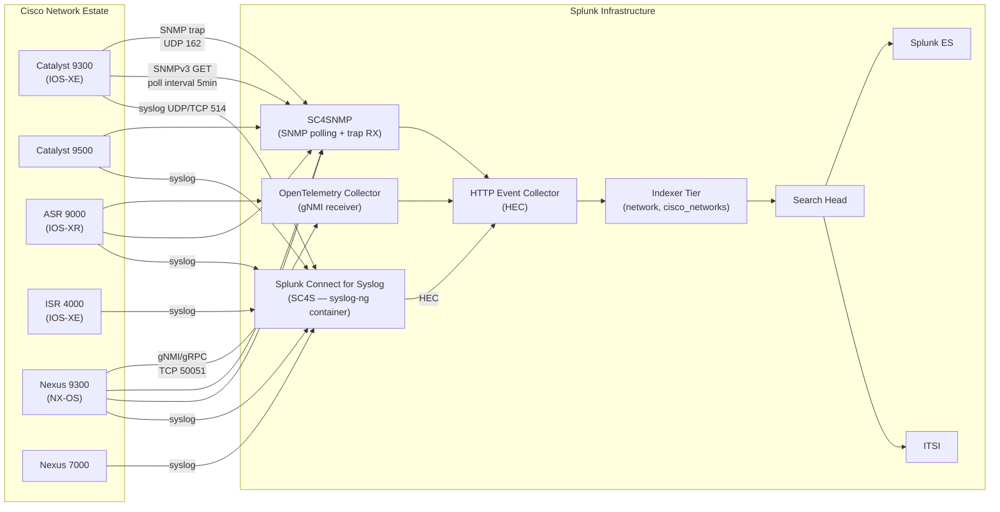

# Cisco Networks (Routers & Switches) Integration Guide

> The definitive guide to monitoring Cisco IOS, IOS-XE, IOS-XR, and NX-OS
> network devices with Splunk. 66 use cases spanning interface health,
> routing protocols (BGP, OSPF, EIGRP, IS-IS), spanning tree, hardware
> environment, AAA, ACLs, and gNMI/streaming telemetry. Multi-vendor
> coverage across Catalyst, Nexus, ASR, ISR, and IOSv platforms.

---

## Table of Contents

- [Quick Start](#quick-start)
- [Overview](#overview)
- [Architecture and Data Flow](#architecture)
- [Prerequisites](#prerequisites)
- [Data Sources Reference](#data-sources)
- [Field Dictionary](#field-dictionary)
- [Sample Events](#sample-events)
- [Device-Side Configuration](#device-config)
- [Splunk-Side Configuration](#splunk-config)
- [SC4S Pipeline (Recommended)](#sc4s)
- [SNMP Polling and Traps](#snmp)
- [gNMI / Streaming Telemetry](#gnmi)
- [Multi-Vendor Coverage](#multi-vendor)
- [Cross-Product Correlation](#cross-product)
- [CIM Mapping Reference](#cim-mapping)
- [Compliance Mapping](#compliance)
- [Capacity Planning and Sizing](#sizing)
- [Recommended Dashboard Layouts](#dashboards)
- [ITSI Service Modeling](#itsi)
- [SOAR Playbook Examples](#soar)
- [Multi-Site Strategy](#multi-site)
- [Security Hardening](#security-hardening)
- [Crawl / Walk / Run Roadmap](#roadmap)
- [Validation Checklist](#validation-checklist)
- [Known Limitations and Gaps](#known-limitations)
- [Troubleshooting](#troubleshooting)
- [FAQ](#faq)
- [Glossary](#glossary)
- [References](#references)
- [Contribution and Feedback](#contribution)

---

<a id="quick-start"></a>
## Quick Start — 30 Minutes to First Telemetry

1. **Install the Cisco Networks Add-on for Splunk** (`TA-cisco_ios`, [Splunkbase 1352](https://splunkbase.splunk.com/app/1352)) on your indexers AND search heads. Production-grade deployments run it on the Heavy Forwarder / Splunk Connect for Syslog (SC4S) tier as well.

2. **Create the network index** with appropriate retention:

    ```ini
    [network]
    homePath = $SPLUNK_DB/network/db
    coldPath = $SPLUNK_DB/network/colddb
    thawedPath = $SPLUNK_DB/network/thaweddb
    maxDataSize = auto_high_volume
    frozenTimePeriodInSecs = 7776000   # 90 days hot+warm; tune to retention policy
    ```

3. **Configure Cisco device-side syslog** — the foundational data source:

    ```cisco
    !! Cisco IOS / IOS-XE
    service timestamps log datetime msec localtime show-timezone
    logging buffered 16384 informational
    logging trap informational
    logging source-interface Loopback0
    logging host <splunk-syslog-ip> transport tcp port 514
    !! Or for SC4S over UDP 514:
    logging host <sc4s-vip> transport udp port 514
    ```

4. **Receive on Splunk** via either SC4S (recommended — see [SC4S Pipeline](#sc4s)) or a direct UDP/TCP input on a Heavy Forwarder:

    ```ini
    [udp://514]
    sourcetype = cisco:ios
    index = network
    no_appending_timestamp = true
    ```

5. **Validate ingestion** within 5 minutes:

    ```spl
    index=network sourcetype="cisco:ios" earliest=-15m
    | stats count by host
    | sort -count
    ```

6. **Activate the crawl tier** — UC-5.1.1 (Interface Up/Down), UC-5.1.4 (BGP), UC-5.1.5 (OSPF), UC-5.1.11 (PSU/Fan).

**Stuck?** Jump to [Troubleshooting](#troubleshooting).

---

<a id="overview"></a>
## Overview

### What this guide covers

| Domain | Examples |
|--------|---------|
| **L1/L2 health** | Interface up/down, link flapping, optics, port errors, STP topology changes, BPDU guard |
| **L3 routing** | BGP/OSPF/EIGRP/IS-IS adjacency, route flaps, route table size, prefix changes |
| **Hardware** | Power supplies (PSU), fans, temperature, FRU status, optic transceivers, line card status |
| **AAA & access** | TACACS+/RADIUS server reachability, AAA auth failures, console/VTY logins |
| **Configuration** | Config commit logs, running-vs-startup drift, archive logging |
| **Security** | ACL hits, MAC address learning, DHCP snooping violations, ARP inspection |
| **Performance** | CPU, memory, buffer, drop counters, QoS queue depth |

### What's NOT in scope (other guides)

| Domain | Where to look |
|--------|---------------|
| **Cisco firewalls (Firepower/ASA)** | [Firewalls Guide](firewalls.md) |
| **Catalyst Center<sup class="ref">[<a href="#ref-1">1</a>]</sup> (DNAC)** | [Catalyst Center Guide](catalyst-center.md) |
| **Cisco ThousandEyes** | [Cisco ThousandEyes Guide](cisco-thousandeyes.md) |
| **Cisco ISE** | [Cisco ISE Guide](cisco-ise.md) |
| **Wireless (WLC, AP)** | Separate WLC Guide (planned); Catalyst Center for SDA |
| **SD-WAN (vManage/vEdge)** | Separate SD-WAN Guide (planned) |

### Multi-vendor extension

Although this guide is written for Cisco, the patterns translate directly to Juniper Junos, Arista EOS, HPE Aruba CX, Nokia SR Linux, and Cumulus Linux through SC4S vendor packs and the appropriate Splunkbase TAs ([Splunk_TA_juniper](https://splunkbase.splunk.com/app/2847), Arista CloudVision integration, [Aruba Networks Add-on for Splunk](https://splunkbase.splunk.com/app/4668)). See [Multi-Vendor Coverage](#multi-vendor).

### Who should read this guide?

| Role | Relevant sections |
|------|-------------------|
| **Network engineer** | Device-side config, Field dictionary, Troubleshooting |
| **NOC** | Crawl roadmap, Dashboards, ITSI |
| **Splunk admin** | Splunk-side config, SC4S, Sizing |
| **SRE** | Cross-product correlation, gNMI, ITSI |
| **Security ops** | ACL hits, AAA failures, Compliance |
| **Audit** | Compliance mapping (NIST/PCI/CIS) |

### What good looks like

| Dimension | Without integration | With full deployment |
|-----------|---------------------|----------------------|
| **Link flap detection** | Reactive ticket from end-user | Real-time UC-5.1.1 alert |
| **Routing protocol changes** | Console review | Per-protocol KPIs (UC-5.1.4 BGP, UC-5.1.5 OSPF) |
| **Hardware failure** | Visit data center | Pre-failure alerts (UC-5.1.11) |
| **Config drift** | Change-management audit | Real-time `archive` logs |
| **Port utilization trending** | SNMP poll once a day | 5-min interface counters via gNMI |
| **AAA brute force** | Discovered later in audit | Real-time alerts on TACACS+ failure spikes |

---

<a id="architecture"></a>
## Architecture and Data Flow



**Three complementary data planes:**

1. **Syslog (event-driven)** — interface up/down, routing flaps, AAA, config commits, hardware alarms. The bedrock of Cisco monitoring.
2. **SNMP (poll-driven, supplemented by traps)** — counters, environmentals, MIB-based health. SC4SNMP is the modern collector replacing legacy SNMP modular inputs.
3. **gNMI / streaming telemetry (push-driven, structured)** — high-frequency interface counters, hardware sensors, BGP table size from IOS-XR / NX-OS / IOS-XE 17.x+ via OpenConfig YANG paths.

Most production deployments run all three; small/legacy estates may run syslog + SNMP only.

---

<a id="prerequisites"></a>
## Prerequisites

### Splunk requirements

| Item | Detail |
|------|--------|
| **Splunk version** | Splunk Enterprise 9.0+ or Splunk Cloud (Classic / Victoria) |
| **Splunkbase add-on** | `TA-cisco_ios` ≥ 5.1.0 (Splunkbase 1352) |
| **Forwarder** | Splunk Universal Forwarder (UF) on SC4S host (if SC4S used); Heavy Forwarder for SC4SNMP polling tasks |
| **Index** | `network` (single-tenant) or `cisco_networks` + per-site indexes for multi-site |
| **CIM** | Splunk Common Information Model<sup class="ref">[<a href="#ref-12">12</a>]</sup> (CIM) Add-on (Splunkbase 1621) for Network_Traffic, Authentication, Change models |
| **HEC** | Required for SC4S, SC4SNMP, and OTel collector outputs |

### Network requirements

| Item | Detail |
|------|--------|
| **Syslog** | UDP 514 (default) or TCP 514/6514 (TLS — recommended for production) from Cisco devices to SC4S/HF |
| **SNMP** | UDP 161 (poll) and 162 (trap) from SC4SNMP collector to Cisco devices |
| **gNMI** | TCP 50051 (default) or 6030 (Cisco-native), TLS-protected, from OTel collector to NX-OS / IOS-XR / IOS-XE 17.x+ devices |
| **HEC** | TCP 8088 (TLS) from collectors to Splunk indexers / load balancer |
| **Time sync** | All Cisco devices must use NTP — Splunk relies on accurate event time for correlation |

### Cisco device requirements

| Item | Detail |
|------|--------|
| **IOS / IOS-XE** | 12.4+ for syslog; 16.6+ for gNMI; 17.x+ for full OpenConfig coverage |
| **IOS-XR** | 6.1+ for telemetry; 7.x+ for OpenConfig YANG model parity |
| **NX-OS** | 7.0+ for telemetry; 9.x+ for full OpenConfig |
| **AAA** | TACACS+ (recommended) or local user with `network-operator` role for SNMPv3/gNMI access |
| **Logging buffer** | `logging buffered 16384` minimum for diagnostic recovery |

---

<a id="data-sources"></a>
## Data Sources Reference

### Syslog sourcetypes

| Sourcetype | Source platform | Used by |
|-----------|----------------|---------|
| `cisco:ios` | IOS, IOS-XE (Catalyst, ISR, ASR) | UC-5.1.1, .4, .5, .11 (most UCs) |
| `cisco:nxos` | NX-OS (Nexus 5K/7K/9K) | Nexus-specific UCs |
| `cisco:iosxr` | IOS-XR (ASR 9K, NCS) | Service provider edge UCs |
| `cisco:asa` | ASA platforms (legacy firewall) | See [Firewalls Guide](firewalls.md) |
| `syslog` | Generic syslog (vendor-agnostic) | Cross-vendor correlation |

### SNMP sourcetypes

| Sourcetype | Mechanism | Used by |
|-----------|-----------|---------|
| `sc4snmp:event` | SNMP trap → SC4SNMP HEC | Hardware alarms, link state |
| `sc4snmp:metric` | SNMP poll → metrics index | Interface counters, CPU, memory |
| `cisco:snmp:trap` | Direct trap input (legacy) | When SC4SNMP not deployed |

### gNMI / streaming telemetry sourcetypes

| Sourcetype | Path | Used by |
|-----------|------|---------|
| `cisco:nxos:telemetry:json` | NX-OS dial-out, JSON encoding | High-frequency counters |
| `cisco:iosxr:telemetry` | IOS-XR dial-out | SP edge UCs |
| `telegraf:gnmi` | Telegraf gNMI input → splunkmetric | Multi-vendor metrics |
| `otel:metrics` | OpenTelemetry vendor-neutral | Multi-vendor metrics |

### Key Cisco syslog mnemonics

| Mnemonic | Severity | Tells you |
|---------|----------|-----------|
| `%LINK-3-UPDOWN` | 3 (Error) | Physical interface state change |
| `%LINEPROTO-5-UPDOWN` | 5 (Notice) | Line protocol state change |
| `%BGP-5-ADJCHANGE` | 5 | BGP neighbor up/down |
| `%BGP-3-NOTIFICATION` | 3 | BGP error/notification |
| `%OSPF-5-ADJCHG` | 5 | OSPF adjacency change |
| `%DUAL-5-NBRCHANGE` | 5 | EIGRP neighbor change |
| `%ENVMON-2-FAN_FAILED` | 2 (Critical) | Fan failure |
| `%PLATFORM_ENV-1-PSU` | 1 (Alert) | Power supply alarm |
| `%C6KPWR-4-DISABLED` | 4 (Warning) | Module disabled |
| `%SPANTREE-2-ROOTGUARD_BLOCK` | 2 | Root guard triggered |
| `%SPANTREE-2-LOOPGUARD_BLOCK` | 2 | Loop guard triggered |
| `%SEC-6-IPACCESSLOGP` | 6 | ACL hit |
| `%SYS-5-CONFIG_I` | 5 | Configuration committed |
| `%SYS-5-RELOAD` | 5 | Device reload requested |
| `%PARSER-5-CFGLOG_LOGGEDCMD` | 5 | Per-command audit log |
| `%TACACS-3-ACCT_REQ_FAILED` | 3 | TACACS+ accounting failed |

### Key MIBs (SNMP)

| MIB / OID | Use |
|----------|-----|
| `IF-MIB` (`ifInOctets`, `ifOutOctets`) | Interface throughput |
| `IF-MIB` (`ifOperStatus`) | Operational status |
| `CISCO-PROCESS-MIB` (`cpmCPUTotal5secRev`) | CPU |
| `CISCO-MEMORY-POOL-MIB` (`ciscoMemoryPoolUsed`) | Memory |
| `CISCO-ENVMON-MIB` (`ciscoEnvMonFanStatusDescr`) | Fan health |
| `CISCO-ENVMON-MIB` (`ciscoEnvMonSupplyStatusDescr`) | PSU health |
| `CISCO-ENTITY-SENSOR-MIB` | Temperature sensors |
| `BGP4-MIB` (`bgpPeerState`) | BGP neighbor state |
| `OSPF-MIB` (`ospfNbrState`) | OSPF neighbor state |
| `BRIDGE-MIB` (`dot1dStpPortDesignatedRoot`) | STP topology |

---

<a id="field-dictionary"></a>
## Field Dictionary

After `TA-cisco_ios` parses events, the following normalised fields are available:

### Common (all sourcetypes)

| Field | Type | Example | Description |
|-------|------|---------|-------------|
| `host` | string | `core-rtr-01` | Device hostname |
| `severity` | int | `3` | Cisco severity (0-7) |
| `severity_label` | string | `error` | Human-readable severity |
| `mnemonic` | string | `LINK-3-UPDOWN` | Cisco mnemonic |
| `facility` | string | `LINK` | Facility component |
| `message` | string | `Interface GigabitEthernet0/1, changed state to down` | Parsed message text |
| `dvc` | string | `core-rtr-01` | Device (CIM normalised) |
| `vendor_product` | string | `Cisco IOS-XE` | CIM `vendor_product` |

### Interface events (UC-5.1.1)

| Field | Example | Description |
|-------|---------|-------------|
| `interface` | `GigabitEthernet0/1` | Interface name |
| `interface_short` | `Gi0/1` | Abbreviated form |
| `state` | `down` / `up` | New state |
| `reason` | `link down` | Reason if logged |

### BGP events (UC-5.1.4)

| Field | Example | Description |
|-------|---------|-------------|
| `bgp_neighbor` | `10.1.2.3` | Peer IP |
| `bgp_state` | `Established` / `Idle` | New state |
| `bgp_asn` | `65001` | Local or remote ASN |
| `bgp_vrf` | `customer-a` | VRF (if applicable) |

### OSPF events (UC-5.1.5)

| Field | Example | Description |
|-------|---------|-------------|
| `ospf_neighbor` | `192.168.1.1` | Neighbor router-id |
| `ospf_state` | `FULL` / `DOWN` | New state |
| `ospf_process` | `1` | OSPF process ID |
| `ospf_area` | `0.0.0.0` | OSPF area |

### Hardware (UC-5.1.11)

| Field | Example | Description |
|-------|---------|-------------|
| `component` | `PS1` | PSU/fan/module identifier |
| `component_state` | `failed` / `ok` | State |
| `temperature_c` | `42` | Sensor temperature (when applicable) |

### AAA (UC-5.1.x cluster)

| Field | Example | Description |
|-------|---------|-------------|
| `user` | `noc-engineer` | TACACS+ username |
| `src` | `10.0.0.5` | Source IP of session |
| `aaa_method` | `tacacs+` / `radius` / `local` | AAA backend |
| `aaa_result` | `granted` / `denied` | Outcome |

### Per-command audit (`%PARSER-5-CFGLOG_LOGGEDCMD`)

| Field | Example | Description |
|-------|---------|-------------|
| `command` | `interface GigabitEthernet0/1` | Configuration command issued |
| `user` | `noc-engineer` | User who ran it |
| `tty` | `vty 0` | Source line |

---

<a id="sample-events"></a>
## Sample Events

### Interface up/down

```
<189>1 2026-04-25T14:30:00.123Z core-rtr-01 - - - - 1234567: Apr 25 14:30:00.123 UTC: %LINK-3-UPDOWN: Interface GigabitEthernet0/1, changed state to down
<189>1 2026-04-25T14:30:00.456Z core-rtr-01 - - - - 1234568: Apr 25 14:30:00.456 UTC: %LINEPROTO-5-UPDOWN: Line protocol on Interface GigabitEthernet0/1, changed state to down
```

### BGP neighbor down

```
<189>1 2026-04-25T14:35:12.789Z edge-rtr-01 - - - - 1234569: %BGP-5-ADJCHANGE: neighbor 10.1.2.3 vpn vrf customer-a Down BGP Notification sent
<189>1 2026-04-25T14:35:12.890Z edge-rtr-01 - - - - 1234570: %BGP-3-NOTIFICATION: sent to neighbor 10.1.2.3 4/0 (hold time expired) 0 bytes
```

### Hardware (PSU failure)

```
<185>1 2026-04-25T14:40:00.000Z core-sw-01 - - - - 1234571: Apr 25 14:40:00.000 UTC: %ENVMON-2-FAN_FAILED: Fan 1 failed
<185>1 2026-04-25T14:41:00.000Z core-sw-01 - - - - 1234572: Apr 25 14:41:00.000 UTC: %PLATFORM_ENV-1-PSU: PSU 1 has gone down or has been removed
```

### Configuration committed (audit)

```
<189>1 2026-04-25T14:50:00.000Z core-sw-01 - - - - 1234573: %SYS-5-CONFIG_I: Configured from console by noc-engineer on vty0 (10.0.0.5)
<189>1 2026-04-25T14:50:01.000Z core-sw-01 - - - - 1234574: %PARSER-5-CFGLOG_LOGGEDCMD: User:noc-engineer  logged command:no shutdown
```

### TACACS+ failure

```
<187>1 2026-04-25T14:55:00.000Z core-rtr-01 - - - - 1234575: %TACACS-3-ACCT_REQ_FAILED: Accounting request failed for username "operator", retry exhausted
```

---

<a id="device-config"></a>
## Device-Side Configuration

### Cisco IOS / IOS-XE — minimum baseline

```cisco
!! Time and timestamp formatting (CRITICAL — Splunk correlation depends on it)
clock timezone UTC 0
ntp server 10.0.0.1
ntp server 10.0.0.2
service timestamps log datetime msec localtime show-timezone year
service timestamps debug datetime msec localtime show-timezone year

!! Logging buffer (locally on device)
logging buffered 32768 informational
logging count

!! Source interface (so syslog has a stable source IP)
logging source-interface Loopback0

!! Severity threshold for syslog forwarding
logging trap informational

!! TCP-based syslog (recommended for reliability) over TLS port 6514
logging host <splunk-syslog-ip> transport tcp port 6514
!! OR direct UDP for SC4S
logging host <sc4s-vip> transport udp port 514

!! Per-command audit (CRITICAL for change tracking — UC-5.1.x audit cluster)
archive
  log config
    logging enable
    logging size 1000
    notify syslog contenttype plaintext
    hidekeys

!! BGP and OSPF event logging
router bgp 65001
  bgp log-neighbor-changes
router ospf 1
  log-adjacency-changes detail

!! AAA — log auth attempts
aaa accounting exec default start-stop group tacacs+
aaa accounting commands 15 default start-stop group tacacs+
```

### Cisco NX-OS — minimum baseline

```cisco
!! Logging
logging server <splunk-syslog-ip> 6 use-vrf management
logging level local6 6
logging timestamp milliseconds
logging logfile messages 6 size 32000

!! BGP and OSPF
feature bgp
router bgp 65001
  log-neighbor-changes

router ospf 1
  log-adjacency-changes detail

!! Per-command audit
feature scheduler
logging level cli 5

!! NTP
ntp server 10.0.0.1
ntp server 10.0.0.2
clock timezone UTC 0 0
```

### Cisco IOS-XR — minimum baseline

```cisco
!! Logging
logging trap informational
logging <splunk-syslog-ip> vrf default severity informational
logging source-interface Loopback0
logging buffered 16384 informational

!! Service timestamps
clock timezone UTC
ntp server 10.0.0.1

!! Routing protocols — log adjacency changes
router bgp 65001
  bgp log neighbor changes detail

router ospf 1
  log adjacency changes detail

!! Per-command audit
logging events level informational
logging events display-location
```

---

<a id="splunk-config"></a>
## Splunk-Side Configuration

### Heavy Forwarder direct UDP/TCP input (small estate)

```ini
# inputs.conf on Heavy Forwarder
[udp://514]
sourcetype = cisco:ios
index = network
no_appending_timestamp = true
no_priority_stripping = false

[tcp://6514]
sourcetype = cisco:ios
index = network
SSL = true
```

### `props.conf` minimum

```ini
[cisco:ios]
TIME_FORMAT = %b %d %H:%M:%S.%3N
TIME_PREFIX = :\s
MAX_TIMESTAMP_LOOKAHEAD = 30
SHOULD_LINEMERGE = false
TRUNCATE = 16384
TRANSFORMS-set_host = cisco_set_host
KV_MODE = none
EXTRACT-mnemonic = %(?<mnemonic>[A-Z0-9_-]+):
EXTRACT-severity = %[A-Z0-9_-]+-(?<severity>\d)-

[cisco:nxos]
TIME_FORMAT = %Y %b %d %H:%M:%S.%3N
TIME_PREFIX = ^\<\d+\>\d
MAX_TIMESTAMP_LOOKAHEAD = 60
SHOULD_LINEMERGE = false
TRUNCATE = 16384
KV_MODE = none

[cisco:iosxr]
TIME_FORMAT = %b %d %H:%M:%S.%3N
TIME_PREFIX = :\s
MAX_TIMESTAMP_LOOKAHEAD = 30
SHOULD_LINEMERGE = false
TRUNCATE = 16384
KV_MODE = none
```

The `TA-cisco_ios` add-on ships a much larger `props.conf` / `transforms.conf` with hundreds of field extractions; this is the minimum if you need to author your own.

### CIM normalisation

`TA-cisco_ios` aliases / extracts populate:

| CIM model | Object | Mapping |
|-----------|--------|---------|
| `Network_Traffic` | `All_Traffic` | ACL hits, NetFlow events |
| `Change` | `Endpoint_Changes`, `Network_Changes` | Config commits, archive logs |
| `Authentication` | `All_Authentication` | TACACS+/RADIUS auth events |
| `Alerts` | `All_Alerts` | Hardware/environmental alarms |

Validate with `tstats`:

```spl
| tstats summariesonly=t count from datamodel=Change.All_Changes where vendor="Cisco" by sourcetype
```

---

<a id="sc4s"></a>
## SC4S Pipeline (Recommended)

[Splunk Connect for Syslog (SC4S)](https://splunk.github.io/splunk-connect-for-syslog/) is the recommended ingest tier for any production network estate. It runs as a syslog-ng container with vendor-aware parsing rules and forwards via HEC.

### Why SC4S over direct HF input?

| Capability | Direct UDP HF | SC4S |
|-----------|--------------|------|
| Vendor packs | Manual (props.conf) | Built-in for 50+ vendors |
| TLS | Per-host config | Single global config |
| TCP fallback | Manual | Automatic |
| Multi-vendor in one stream | Hard | Native (auto-routes by message pattern) |
| Resource isolation | HF shared | Container-isolated |
| Scaling | Vertical | Horizontal (HAProxy + multiple SC4S) |

### Minimal SC4S deployment (Docker Compose)

```yaml
version: "3.8"
services:
  sc4s:
    image: ghcr.io/splunk/splunk-connect-for-syslog/container3:latest
    ports:
      - target: 514
        published: 514
        protocol: udp
      - target: 514
        published: 514
        protocol: tcp
      - target: 6514
        published: 6514
        protocol: tcp
    environment:
      SC4S_DEST_SPLUNK_HEC_DEFAULT_URL: "https://splunk-hec.example.com:8088"
      SC4S_DEST_SPLUNK_HEC_DEFAULT_TOKEN: "${SPLUNK_HEC_TOKEN}"
      SC4S_DEST_SPLUNK_HEC_DEFAULT_TLS_VERIFY: "yes"
      SC4S_USE_NAME_CACHE: "yes"
      SC4S_DEST_SPLUNK_HEC_DEFAULT_WORKERS: "10"
    volumes:
      - sc4s-cache:/var/lib/syslog-ng
    restart: unless-stopped
volumes:
  sc4s-cache:
```

Cisco devices then point at the SC4S VIP via standard `logging host` config — vendor-pack rules sort the events into the correct `cisco:ios` / `cisco:nxos` / `cisco:iosxr` sourcetypes automatically.

For a turnkey deployment, see the `splunk-connect-for-syslog-setup` skill in this repo.

### Vendor pack reference

SC4S ships out-of-the-box rules for:

- Cisco IOS / IOS-XE / IOS-XR / NX-OS / ASA / Firepower / WLC
- Juniper Junos / SRX
- Arista EOS
- HPE Aruba CX / ClearPass
- F5 BIG-IP
- Palo Alto PAN-OS
- Fortinet FortiOS
- Check Point
- and 40+ more

---

<a id="snmp"></a>
## SNMP Polling and Traps

### SC4SNMP (modern collector)

[Splunk Connect for SNMP (SC4SNMP)](https://splunk.github.io/splunk-connect-for-snmp/) handles both polling and trap reception, writing to Splunk via HEC.

For deployment, see the `splunk-connect-for-snmp-setup` skill in this repo.

### Recommended polled OIDs (per device, every 5 min)

```yaml
# SC4SNMP profile snippet
profiles:
  cisco_baseline:
    frequency: 300
    varBinds:
      - ['IF-MIB', 'ifOperStatus']
      - ['IF-MIB', 'ifInOctets']
      - ['IF-MIB', 'ifOutOctets']
      - ['IF-MIB', 'ifInDiscards']
      - ['IF-MIB', 'ifOutDiscards']
      - ['IF-MIB', 'ifInErrors']
      - ['IF-MIB', 'ifOutErrors']
      - ['CISCO-PROCESS-MIB', 'cpmCPUTotal5secRev']
      - ['CISCO-MEMORY-POOL-MIB', 'ciscoMemoryPoolUsed']
      - ['CISCO-MEMORY-POOL-MIB', 'ciscoMemoryPoolFree']
      - ['CISCO-ENVMON-MIB', 'ciscoEnvMonFanStatusDescr']
      - ['CISCO-ENVMON-MIB', 'ciscoEnvMonSupplyState']
      - ['CISCO-ENTITY-SENSOR-MIB', 'entSensorValue']
```

### Recommended trap reception

```cisco
!! On Cisco device — send key traps to SC4SNMP
snmp-server enable traps snmp authentication linkdown linkup coldstart warmstart
snmp-server enable traps bgp
snmp-server enable traps ospf
snmp-server enable traps cef
snmp-server enable traps envmon shutdown supply fan temperature
snmp-server enable traps tty
snmp-server enable traps stpx
snmp-server host <sc4snmp-trap-receiver> version 2c <trap-community>
```

### CPU/memory dashboard query (polled)

```spl
| mstats avg(cpu_5sec_rev) as cpu5s
  WHERE index=netmetrics earliest=-1h
  span=5m
  BY host
| eval threshold = 70
| where cpu5s > threshold
| sort - cpu5s
```

---

<a id="gnmi"></a>
## gNMI / Streaming Telemetry

For platforms that support it (NX-OS 7+, IOS-XR 6+, IOS-XE 17+), gNMI streaming is more efficient than SNMP polling and provides higher granularity (sub-minute updates).

### Cisco NX-OS — dial-out telemetry config

```cisco
feature telemetry

telemetry
  destination-group 1
    ip address <otel-collector-ip> port 50051 protocol gRPC encoding GPB-compact
  sensor-group 1
    !! interface counters every 30s
    data-source NX-API
    path "show interface counters" depth 0
  sensor-group 2
    !! environment sensors every 60s
    data-source NX-API
    path "show environment" depth 0
  subscription 1
    dst-grp 1
    snsr-grp 1 sample-interval 30000
    snsr-grp 2 sample-interval 60000
```

### Splunk OpenTelemetry Collector — gNMI receiver config

```yaml
receivers:
  gnmi:
    targets:
      - ip: 10.0.0.10
        port: 50051
        username: "splunk-telemetry"
        password: "${env:GNMI_PASSWORD}"
        tls:
          insecure: false
          ca_file: /etc/ssl/cisco-ca.pem
    paths:
      - "/interfaces/interface/state/counters"
      - "/network-instances/network-instance/protocols/protocol/bgp/neighbors"

exporters:
  splunk_hec/metrics:
    token: "${env:SPLUNK_HEC_TOKEN}"
    endpoint: "https://splunk-hec.example.com:8088/services/collector"
    index: netmetrics
    source: gnmi
    sourcetype: telegraf:gnmi

service:
  pipelines:
    metrics:
      receivers: [gnmi]
      exporters: [splunk_hec/metrics]
```

### When to choose gNMI over SNMP

| Use SNMP | Use gNMI |
|----------|---------|
| Legacy IOS 12.x / 15.x | Modern IOS-XE 17+, NX-OS 7+, IOS-XR |
| Multi-vendor estate | Single-vendor or you already use OTel |
| Trap-based event delivery | Push subscription model |
| Existing MIB-based tooling | Want OpenConfig YANG paths |
| Polling intervals 5+ min | Sub-minute granularity |

---

<a id="multi-vendor"></a>
## Multi-Vendor Coverage

Although most UCs in cat 5.1 reference Cisco mnemonics, every UC is written to be vendor-agnostic. Here are the equivalent mnemonics for other vendors:

| Event class | Cisco IOS | Juniper Junos | Arista EOS | HPE Aruba CX |
|------------|-----------|---------------|-----------|--------------|
| Interface up/down | `LINK-3-UPDOWN` | `SNMP_TRAP_LINK_DOWN/UP` | `LINEPROTO-5-UPDOWN` | `LLDP-5-LINK_UP/DOWN` |
| BGP adjacency | `BGP-5-ADJCHANGE` | `RPD_BGP_NEIGHBOR_STATE_CHANGED` | `BGP-5-ADJCHANGE` | `BGP-5-NEIGHBOR_STATE_CHANGE` |
| OSPF adjacency | `OSPF-5-ADJCHG` | `RPD_OSPF_NBRSTATE` | `OSPF-5-ADJCHG` | `OSPF-5-ADJCHANGE` |
| PSU failure | `PLATFORM_ENV-1-PSU` | `CHASSISD_PSU_FAIL` | `ENVIRONMENT-2-PSU_FAIL` | `CHASSIS-2-PSU_DOWN` |
| Fan failure | `ENVMON-2-FAN_FAILED` | `CHASSISD_FAN_FAIL` | `ENVIRONMENT-2-FAN_FAIL` | `CHASSIS-2-FAN_FAIL` |
| Config commit | `SYS-5-CONFIG_I` | `UI_COMMIT_COMPLETED` | `SYS-5-CONFIG_E` | `CONFIG-6-CONFIGCHANGED` |

Use the SC4S vendor packs to auto-classify; build per-vendor saved searches that share common alert thresholds.

### Splunkbase add-ons used

| Vendor | Add-on | Splunkbase ID |
|--------|--------|--------------|
| Cisco IOS/NX-OS/IOS-XR | `TA-cisco_ios` | 1352 |
| Cisco ASA | `Splunk_TA_cisco-asa` | 1620 |
| Juniper | `Splunk_TA_juniper` | 2847 |
| Arista | (CloudVision integration / generic syslog) | n/a |
| HPE Aruba | `Aruba Networks Add-on for Splunk` | 4668 |
| F5 BIG-IP | `Splunk_TA_f5-bigip` | 2680 |

---

<a id="cross-product"></a>
## Cross-Product Correlation

### Network → application latency (with ThousandEyes)

```spl
(index=network sourcetype="cisco:ios" mnemonic="LINK-3-UPDOWN")
OR (index=thousandeyes_metrics sourcetype="cisco:thousandeyes:metric")
| eval link_down = if(mnemonic="LINK-3-UPDOWN" AND state="down", 1, 0)
| eval te_loss = if(loss > 5, 1, 0)
| transaction maxspan=10m host
| where link_down=1 OR te_loss=1
```

### Network → ITSI service health

Map Cisco devices into ITSI entities (key = `host`); attach KPI base searches:

| KPI | SPL |
|-----|-----|
| Interface drop rate | `\| mstats avg(ifInDiscards) WHERE index=netmetrics span=5m BY host, ifname` |
| BGP adjacency count | `\| tstats count WHERE index=network sourcetype=cisco:ios mnemonic="BGP-5-ADJCHANGE" bgp_state="Established" span=5m BY host` |
| Hardware alarm count | `\| tstats count WHERE index=network sourcetype=cisco:ios severity<=3 span=5m BY host` |

### Network → ISE / 802.1X auth (cross-product with cat 17)

```spl
(index=network sourcetype="cisco:ios" mnemonic="MAB-*")
OR (index=ise sourcetype="cisco:ise:syslog" event_type="auth_succeeded" OR event_type="auth_failed")
| transaction maxspan=2m mac_address
| where event_type="auth_failed"
```

### Network → NetFlow (cat 5.7) for source-of-traffic

```spl
(index=network sourcetype="cisco:ios" mnemonic="LINK-3-UPDOWN" state="down")
OR (index=netflow sourcetype="netflow" earliest=-15m@m)
| eventstats sum(bytes) as total_bytes by interface
| where total_bytes > 1000000000
```

---

<a id="cim-mapping"></a>
## CIM Mapping Reference

| CIM model | Sourcetype | Mapped fields |
|-----------|-----------|--------------|
| **Network_Traffic** | `cisco:ios` (ACL hits, NetFlow), `cisco:nxos` | `src`, `dest`, `src_port`, `dest_port`, `bytes`, `transport` |
| **Change** | `cisco:ios` (`SYS-5-CONFIG_I`, `PARSER-5-CFGLOG_LOGGEDCMD`) | `action`, `change_type`, `command`, `user`, `dvc` |
| **Authentication** | `cisco:ios` (TACACS+/RADIUS events) | `user`, `src`, `action`, `signature`, `dvc` |
| **Alerts** | `cisco:ios` (severity ≤ 3 events) | `severity`, `signature`, `dvc`, `category` |
| **Inventory** | SNMP polling | `dvc`, `os`, `version`, `serial` |
| **Performance** | gNMI metrics, SNMP polling | `cpu`, `mem_used`, `interface_in_pkts`, etc. |

Validation:

```spl
| tstats summariesonly=t count from datamodel=Network_Traffic where vendor="Cisco" by sourcetype, action
| sort -count
```

---

<a id="compliance"></a>
## Compliance Mapping

### NIST 800-53 (rev 5)

| Control | UC examples | Why |
|--------|------------|-----|
| **AU-2** Audit Events | UC-5.1.x audit cluster | Per-command audit logging |
| **AU-3** Content of Audit Records | All cisco:ios UCs | Severity, mnemonic, host, user captured |
| **AU-12** Audit Generation | Device baseline config | Devices generate logs at agreed severity |
| **CM-3** Configuration Change Control | UC-5.1.x archive logs | Change tracked + attributed |
| **CM-6** Configuration Settings | Splunk dashboards | Drift between devices |
| **SC-7** Boundary Protection | UC-5.1.x ACL hit cluster | Network policy enforcement evidence |
| **SI-4** System Monitoring | All UCs | Continuous monitoring |

### NIS2 (Article 21)

| Article | UC examples |
|---------|------------|
| 21(2)(a) Risk analysis | Hardware health UCs |
| 21(2)(b) Incident handling | UC-5.1.1, .4, .5 alert cluster |
| 21(2)(d) Supply chain | Vendor inventory + version tracking |
| 21(2)(g) Cyber hygiene | Per-command audit + AAA logging |
| 21(2)(i) Authentication | TACACS+ federation evidence |

### PCI-DSS 4.0

| Requirement | UC examples |
|------------|------------|
| **1.1** Network configuration standards | Per-command audit |
| **8.5** All non-console access via MFA | TACACS+/RADIUS auth UCs |
| **10.2** Audit log generation | Logging buffer + syslog forwarding |
| **10.7** Audit log retention (≥1 year) | Splunk index retention policy |
| **11.5** Change-detection mechanism | Config drift UCs |

### CIS Controls (v8)

| Control | UC examples |
|---------|------------|
| **4.5** Centrally managed network device config | Archive logs |
| **8.5** Secure system configuration | Drift dashboards |
| **8.11** Time synchronization | NTP monitoring |
| **12.5** Centralised network device authentication | TACACS+ UCs |
| **13.4** Establish and maintain inventory | SNMP discovery |

---

<a id="sizing"></a>
## Capacity Planning and Sizing

### Per-device daily ingestion (typical)

| Device class | Syslog GB/day | SNMP GB/day | gNMI GB/day | Total |
|------------|--------------|------------|------------|-------|
| Access switch (48 ports) | 0.05 | 0.10 | 0.50 (if enabled) | 0.65 |
| Distribution switch | 0.10 | 0.20 | 1.00 | 1.30 |
| Core switch | 0.30 | 0.50 | 2.00 | 2.80 |
| WAN router | 0.20 | 0.30 | 1.50 | 2.00 |
| BGP edge router | 0.50 | 0.40 | 2.50 | 3.40 |

Multipliers — apply to baseline:

- **Severity verbosity**: `informational` = 1.0×, `debugging` = 5–10×.
- **Per-command audit** (`archive log config`): +20% to syslog.
- **gNMI sample rate**: 10s = 5×, 30s = 1×, 60s = 0.5× of baseline.

### Worked examples

| Estate | Devices | Daily ingest |
|--------|---------|-------------|
| Small office (10 switches) | 10 access | ~7 GB/day |
| Mid-size campus (200 switches, 20 routers) | 220 | ~210 GB/day |
| Large enterprise (1500 devices) | 1500 mixed | ~2 TB/day |
| Service provider (25K devices) | 25 000 mixed | ~30 TB/day |

### Retention recommendations

| Data | Retention | Rationale |
|------|-----------|-----------|
| Syslog (event-driven) | 90 days hot/warm; 1 year cold | Audit, root-cause analysis |
| SNMP metrics | 30 days hot; 90 days cold | Trending only |
| gNMI metrics | 14 days hot; 30 days cold | High-frequency, prefer aggregation |

---

<a id="dashboards"></a>
## Recommended Dashboard Layouts

### Crawl Dashboard — "Network At a Glance"

```
+----------------------------------+----------------------------------+
| INTERFACE UP/DOWN (UC-5.1.1)     | BGP/OSPF ADJACENCY               |
| Real-time + 24h trend            | (UC-5.1.4, .5)                   |
+----------------------------------+----------------------------------+
| HARDWARE ALARMS (UC-5.1.11)      | CONFIG COMMITS (last 24h)        |
+----------------------------------+----------------------------------+
| TOP-N TALKING INTERFACES         | DEVICE COUNT BY VENDOR/MODEL     |
| (gNMI/SNMP counters)             |                                  |
+----------------------------------+----------------------------------+
```

### Walk Dashboard — "Routing Health"

```
+----------------------------------+----------------------------------+
| BGP TABLE SIZE TREND             | OSPF LSDB SIZE TREND             |
+----------------------------------+----------------------------------+
| BGP NEIGHBOR FLAP COUNT (24h)    | OSPF NEIGHBOR FLAP COUNT (24h)   |
+----------------------------------+----------------------------------+
| ROUTING CONVERGENCE TIME         | ROUTE CHANGE EVENTS (per day)    |
+----------------------------------+----------------------------------+
```

### Run Dashboard — "Operations Intelligence"

```
+----------------------------------+----------------------------------+
| TOP-10 NOISIEST DEVICES          | LICENSE BURN-RATE (cisco:ios)    |
+----------------------------------+----------------------------------+
| TACACS+/RADIUS AUTH SUMMARY      | UNAUTHORIZED CONFIG ATTEMPTS     |
+----------------------------------+----------------------------------+
| CAPACITY: TOP-N PORT UTILIZATION | DEVICE EOL / EOS CALENDAR        |
+----------------------------------+----------------------------------+
```

---

<a id="itsi"></a>
## ITSI Service Modeling

### Service hierarchy

```
Network
├── Core
│   ├── core-rtr-01 (entity)
│   ├── core-rtr-02 (entity)
│   └── core-sw-01 (entity)
├── Distribution
│   ├── (per-site distribution stack)
├── Access
│   ├── (per-site access stack)
└── WAN
    ├── edge-rtr-01
    └── edge-rtr-02
```

### Recommended KPIs

| KPI | Source | Threshold |
|-----|--------|-----------|
| **Interface up percentage** | gNMI/SNMP polling | Static (warn < 99%, page < 95%) |
| **BGP neighbor count** | UC-5.1.4 | Static (page if drops below configured) |
| **OSPF neighbor count** | UC-5.1.5 | Static (page if drops below configured) |
| **CPU 5s** | SNMP/gNMI | Adaptive (warn > 75%, page > 90%) |
| **Memory used %** | SNMP/gNMI | Static (warn > 80%, page > 90%) |
| **Hardware alarm count** | UC-5.1.11 | Static (page > 0) |

### Entity import (Cisco device inventory)

```spl
| inputlookup cisco_inventory.csv
| eval entity_name = host
| eval entity_alias = host . "," . mgmt_ip . "," . serial
| eval entity_type = "cisco_network_device"
| outputlookup itsi_entity_import_cisco.csv
```

---

<a id="soar"></a>
## SOAR Playbook Examples

### Playbook 1: Interface Flap Auto-Triage (UC-5.1.1)

**Trigger:** UC-5.1.1 alert (>3 transitions on same interface in 10 min).

```
1. RECEIVE alert (host, interface, transition_count)
2. PULL last 1h of cisco:ios logs for that interface
3. PULL SNMP/gNMI counters: ifInErrors, ifOutErrors, optic dBm
4. PULL physical inventory (CMDB): site, rack, patch panel
5. DECISION:
   - High errors + low optic dBm → optics fail (open Sev-2 ticket)
   - High errors normal optic → cable / switch port issue (open Sev-2)
   - No errors but flapping → remote device reboot (Sev-3, monitor)
6. NOTIFY NOC via Slack
7. AUTO-DISABLE interface if business-impact below threshold
```

### Playbook 2: BGP Adjacency Loss (UC-5.1.4)

**Trigger:** UC-5.1.4 alert (BGP neighbor goes Idle).

```
1. RECEIVE alert (host, neighbor, asn, vrf)
2. PULL last 4h of BGP events for that neighbor
3. CHECK reverse path (ping/traceroute from local)
4. CHECK BGP NOTIFICATION reason
5. CATEGORISE:
   - Hold-time expired → upstream/path issue (page WAN team)
   - Authentication failure → password mismatch (Sev-1 to NOC)
   - Cease (max prefix exceeded) → policy issue (Sev-1)
6. CREATE INCIDENT (P1 if customer-facing)
7. NOTIFY peering coordinator
```

### Playbook 3: Config Commit Out-of-Window (UC-5.1.x audit)

**Trigger:** `%SYS-5-CONFIG_I` outside change window.

```
1. RECEIVE alert (host, user, source IP, timestamp)
2. PULL last 5min of PARSER-5-CFGLOG_LOGGEDCMD for that host
3. CORRELATE with change-management API (no approved CR)
4. PULL TACACS+ session detail (where did this user log in from?)
5. DECISION:
   - User in NOC group + small change → Sev-3 (notify approver)
   - Outside NOC + any change → Sev-1 (security incident)
6. AUTO-DIFF running vs golden config
7. CREATE security ticket
```

---

<a id="multi-site"></a>
## Multi-Site Strategy

### Federated SC4S model

For estates spanning multiple regions, deploy SC4S at each site:

```
Site A (EMEA)
└── SC4S cluster (HAProxy + 3× SC4S) → HEC → Splunk EU stack

Site B (AMER)
└── SC4S cluster → HEC → Splunk US stack

Splunk EU + US
└── Cross-stack search (CSC) → Single MC view
```

### Per-region indexing

```ini
# indexes.conf — region-specific
[network_emea]
homePath = $SPLUNK_DB/network_emea/db
maxDataSize = auto_high_volume

[network_amer]
homePath = $SPLUNK_DB/network_amer/db
maxDataSize = auto_high_volume
```

### Multi-tenant (MSP) pattern

- Use indexes per tenant (`network_acme`, `network_globex`)
- TA-cisco_ios at the indexer/SH for shared parsing
- Per-tenant role with `srchIndexesAllowed=network_acme`
- ITSI service per tenant; cross-tenant rollup at MSP level

---

<a id="security-hardening"></a>
## Security Hardening

### Secure syslog transport

- **Prefer TLS** (TCP 6514) over plain UDP 514 for syslog from production routers
- Cisco IOS supports `logging host <ip> transport tcp port 6514` with `crypto pki` config

### SNMP

- **SNMPv3 with authPriv** (SHA-256 + AES-256) — never SNMPv1/v2c with default community
- Restrict access via `snmp-server view` + `snmp-server group` + ACL

### gNMI

- mTLS required (gNMI is gRPC over TLS)
- Per-device service account with read-only role

### TACACS+

- `key encryption aes-128-cbc` minimum
- TACACS+ servers in management VRF, separate from data plane
- Rotate TACACS+ keys quarterly

### Splunk-side

- HEC tokens scoped to `network` index only
- SC4S running as non-root user
- Field-level RBAC: only NOC role sees `tacacs_password` extraction (if accidentally captured)

---

<a id="roadmap"></a>
## Crawl / Walk / Run Roadmap

### Crawl (Week 1–2)

| Order | UC | Title |
|-------|----|-------|
| 1 | UC-5.1.1 | Interface up/down detection |
| 2 | UC-5.1.4 | BGP peer state changes |
| 3 | UC-5.1.5 | OSPF neighbor adjacency |
| 4 | UC-5.1.11 | PSU/fan failures |
| 5 | (audit) | Config commit logging |

### Walk (Week 3–6)

1. UC-5.1.x interface error/discard tracking (SNMP/gNMI)
2. UC-5.1.x CPU/memory baselining
3. UC-5.1.x routing table size monitoring
4. UC-5.1.x EIGRP / IS-IS neighbor monitoring
5. UC-5.1.x ACL hit summarisation
6. STP topology change tracking
7. AAA auth attempt analysis
8. SC4S deployment if not already in place

### Run (Month 2+)

1. ITSI services per network tier (core/dist/access/WAN)
2. SOAR playbooks (interface flap, BGP loss, config drift)
3. gNMI streaming telemetry deployment
4. Capacity dashboards (port utilisation, BGP table growth)
5. Lifecycle (EOL/EOS) calendar
6. Cross-product correlation (ThousandEyes, ISE, NetFlow)

---

<a id="validation-checklist"></a>
## Validation Checklist

### Day 1

- [ ] `TA-cisco_ios` installed on all SH + indexers + SC4S/HF
- [ ] `network` index created with appropriate retention
- [ ] At least 1 device sending syslog and visible in Splunk
- [ ] NTP synchronised on all devices
- [ ] Crawl-tier UCs deployed

### Day 7

- [ ] All critical-tier devices forwarding syslog
- [ ] SC4S deployed (if estate > 50 devices)
- [ ] Per-command audit (`archive log config`) enabled
- [ ] Crawl dashboard built and shared with NOC

### Day 30

- [ ] Walk-tier UCs deployed
- [ ] SC4SNMP polling baseline metrics
- [ ] Walk dashboards reviewed
- [ ] CIM Network_Traffic data model populated

### Day 90

- [ ] Run-tier UCs deployed
- [ ] gNMI rolled out on supported platforms
- [ ] ITSI services configured
- [ ] First SOAR playbook in production
- [ ] Quarterly capacity review

---

<a id="known-limitations"></a>
## Known Limitations and Gaps

| Limitation | Impact | Workaround |
|------------|--------|------------|
| **UDP syslog can drop** | Event loss during bursts | Use TCP/TLS syslog or SC4S TCP listener |
| **TA-cisco_ios doesn't parse all NX-OS variants** | Some events fall through to `cisco:ios` | Use `cisco:nxos` sourcetype + manual EXTRACT- |
| **gNMI on NX-OS doesn't expose all CLI counters** | Some counters only via `show` commands | NX-API REST as supplement |
| **SNMP counter wraparound on 1G+ links** | Throughput numbers wrong | Use 64-bit counters (`ifHCInOctets`) |
| **ACLs with `log` are CPU-expensive** | Don't enable on data-plane ACLs | Use `log-input` only on critical match lines |
| **Cisco logs don't always include process ID** | Hard to correlate process | Pull `show process cpu` via SNMP |
| **Trap storms during outages** | Splunk overwhelmed | SC4SNMP ratelimits; HF queue tuning |

---

<a id="troubleshooting"></a>
## Troubleshooting

### No data after device-side config

1. Verify Splunk-side input is up: `index=_internal sourcetype=splunkd "Connection from"`
2. Check device sends to right IP/port: `show logging` on Cisco
3. Test path: `tcpdump -i any port 514 -A` on receiver
4. Check ACL between device and receiver
5. If using SC4S: `docker logs sc4s | tail -100`

### Events show wrong timestamp

- Splunk parses time from message; `service timestamps log datetime msec localtime show-timezone year` MUST be configured
- Check `props.conf` `TIME_FORMAT` and `TIME_PREFIX`

### Sourcetype is `cisco:ios` for NX-OS device

- SC4S vendor pack mis-routing — check `sc4s_vendor` field in raw event
- Fix: ensure `logging level local6 6` on NX-OS (different facility)

### High volume from one device

- Check `show logging` for `Logged messages: ` count
- Common cause: routing instability flooding `BGP-3-NOTIFICATION`
- Throttle with `logging rate-limit 100`

### gNMI session won't establish

- Verify TLS cert chain; gNMI requires mTLS
- Check `show telemetry transport` (NX-OS) or `show grpc trace ipv4` (IOS-XR)
- Confirm OTel collector is reaching device on TCP 50051

---

<a id="faq"></a>
## FAQ

**Q: Should I run TA-cisco_ios on the Universal Forwarder?**
A: No. UFs cannot run search-time field extractions — they only forward raw bytes. Install on indexers + SH; if using a Heavy Forwarder, install there too for parse-time benefits.

**Q: SC4S vs Heavy Forwarder syslog input — which?**
A: SC4S for any production estate >50 devices. HF input is fine for lab/POC. SC4S is the strategic direction from Splunk.

**Q: Why am I missing some Cisco events that I see on the device?**
A: Check `logging trap <severity>` — Splunk only sees what the device forwards. Default is `informational` (level 6); `debugging` (level 7) is more verbose but very noisy.

**Q: How do I distinguish a device reboot from a planned reload?**
A: `%SYS-5-RELOAD` includes user / source IP for planned reloads. Unexpected reboots show only the post-reboot startup messages without a preceding reload event.

**Q: Should I parse NetFlow with TA-cisco_ios?**
A: No — use `Splunk App for Stream` or `Splunk Add-on for NetFlow`. NetFlow is a separate ingest pipeline.

**Q: Does TA-cisco_ios handle Cisco ASA logs?**
A: Limited — use `Splunk_TA_cisco-asa` (Splunkbase 1620) for ASA syslog parsing.

**Q: Is gNMI worth deploying for a small estate?**
A: Probably not. SC4SNMP polling at 5-min intervals is adequate up to ~500 devices and is simpler to operate.

**Q: How do I handle TACACS+ shared secrets in inputs?**
A: They never appear in syslog. If you accidentally capture a `radius-server key 0 PLAIN-PASSWORD` configuration line via `archive log config`, redact via SEDCMD on the device's sourcetype.

**Q: What about IPv6 monitoring?**
A: IPv6 events use the same mnemonics — no separate parsing needed. `BGP-5-ADJCHANGE` covers both v4 and v6 peers; check `address-family` field.

---

<a id="glossary"></a>
## Glossary

| Term | Definition |
|------|-----------|
| **gNMI** | gRPC Network Management Interface — model-driven streaming telemetry |
| **OpenConfig** | Vendor-neutral YANG data model |
| **TACACS+** | Cisco-developed AAA protocol (RFC 8907) |
| **SC4S** | Splunk Connect for Syslog |
| **SC4SNMP** | Splunk Connect for SNMP |
| **CDP** | Cisco Discovery Protocol (L2 neighbor discovery) |
| **LLDP** | IEEE 802.1AB neighbor discovery (multi-vendor) |
| **VRF** | Virtual Routing and Forwarding (L3 segregation) |
| **VRRP/HSRP/GLBP** | Layer-3 first-hop redundancy protocols |
| **EIGRP** | Cisco-proprietary routing protocol |
| **IS-IS** | Intermediate System to Intermediate System routing |
| **BPDU** | Bridge Protocol Data Unit (STP control packet) |
| **MAC table** | Layer-2 forwarding table (CAM table on Cisco) |
| **SVI** | Switched Virtual Interface (L3 interface on a switch) |

---

<a id="references"></a>
## References

| Resource | URL |
|----------|-----|
| Splunkbase: TA-cisco_ios | [splunkbase.splunk.com/app/1352](https://splunkbase.splunk.com/app/1352) |
| Splunk Connect for Syslog (SC4S) | [splunk.github.io/splunk-connect-for-syslog](https://splunk.github.io/splunk-connect-for-syslog/) |
| Splunk Connect for SNMP (SC4SNMP) | [splunk.github.io/splunk-connect-for-snmp](https://splunk.github.io/splunk-connect-for-snmp/) |
| Cisco IOS syslog mnemonics | [cisco.com — Error Message Decoder](https://www.cisco.com/c/en/us/support/index.html) |
| OpenConfig YANG models | [openconfig.net/projects/models](https://www.openconfig.net/projects/models/) |
| Splunk Lantern (Cisco) | [lantern.splunk.com](https://lantern.splunk.com) (search "cisco") |
| Cisco Networks Add-on docs | [docs.splunk.com/Documentation/AddOns](https://docs.splunk.com/Documentation/AddOns) (search "Cisco Networks") |

---

<a id="contribution"></a>
## Contribution and Feedback

Part of the [Splunk Monitoring Use Cases](https://github.com/fenre/splunk-monitoring-use-cases) project. Found an error? [Open an issue](https://github.com/fenre/splunk-monitoring-use-cases/issues/new).

---

*Last updated: 2026-05-09. Covers TA-cisco_ios 5.1+, IOS 12.4+, IOS-XE 16.6+, IOS-XR 6.1+, NX-OS 7.0+.*

---

<!-- BEGIN-AUTOGENERATED-SOURCES -->

## References

*Auto-generated by `scripts/generate_doc_references.py` from `data/source-references.json` and `data/source-mappings.json`. Edit those files (or the document body) to change citations; this footer is rewritten on every run.*

### Primary sources

<a id="ref-1"></a>**[1]** Cisco Systems, Inc. (2026). *Cisco Catalyst Center Documentation*. Retrieved May 11, 2026, from https://www.cisco.com/site/us/en/products/networking/catalyst-center/index.html

### Supporting sources

<a id="ref-2"></a>**[2]** Beyer, B., Jones, C., Petoff, J., & Murphy, N. R. (Eds.). (2016). *Site Reliability Engineering: How Google Runs Production Systems*. O'Reilly Media. ISBN 978-1491929124. https://sre.google/sre-book/table-of-contents/

<a id="ref-3"></a>**[3]** Center for Internet Security. (2021). *CIS Critical Security Controls v8* (v8). https://www.cisecurity.org/controls

<a id="ref-4"></a>**[4]** Cisco Meraki. (2026). *Cisco Meraki Documentation*. Cisco Systems, Inc. Retrieved May 11, 2026, from https://documentation.meraki.com/

<a id="ref-5"></a>**[5]** Cisco Systems, Inc. (2026). *Cisco Catalyst SD-WAN Documentation*. Retrieved May 11, 2026, from https://www.cisco.com/c/en/us/support/routers/sd-wan/series.html

<a id="ref-6"></a>**[6]** European Parliament and Council of the European Union. (2022, December). *Directive (EU) 2022/2555 — NIS2 Directive on cybersecurity*. Official Journal of the European Union, L 333. ELI: dir/2022/2555. https://eur-lex.europa.eu/eli/dir/2022/2555/oj

<a id="ref-7"></a>**[7]** Gerhards, R. (2009, March). *The Syslog Protocol*. Internet Engineering Task Force. RFC 5424. https://www.rfc-editor.org/rfc/rfc5424

<a id="ref-8"></a>**[8]** International Organization for Standardization. (2022). *ISO/IEC 27001:2022 — Information security, cybersecurity and privacy protection — Information security management systems — Requirements*. ISO/IEC. ISO/IEC 27001:2022. https://www.iso.org/standard/27001

<a id="ref-9"></a>**[9]** National Institute of Standards and Technology. (2020). *Security and Privacy Controls for Information Systems and Organizations* (Revision 5). U.S. Department of Commerce. NIST SP 800-53 Rev. 5. https://csrc.nist.gov/pubs/sp/800/53/r5/upd1/final

<a id="ref-10"></a>**[10]** OpenTelemetry Authors. (2026). *OpenTelemetry Semantic Conventions*. Cloud Native Computing Foundation. Retrieved May 11, 2026, from https://opentelemetry.io/docs/specs/semconv/

<a id="ref-11"></a>**[11]** OpenTelemetry Authors. (2026). *OpenTelemetry Specification*. Cloud Native Computing Foundation. Retrieved May 11, 2026, from https://opentelemetry.io/docs/specs/otel/

<a id="ref-12"></a>**[12]** Splunk Inc. (2026). *Splunk Common Information Model Add-on Manual*. Splunk LLC, a Cisco company. Retrieved May 11, 2026, from https://docs.splunk.com/Documentation/CIM

<details>
<summary>Additional online sources cited in the document body (11)</summary>

<a id="ref-13"></a>**[13]** splunkbase.splunk.com. *Splunkbase 1352*. Retrieved May 11, 2026, from https://splunkbase.splunk.com/app/1352

<a id="ref-14"></a>**[14]** splunkbase.splunk.com. *Splunk_TA_juniper*. Retrieved May 11, 2026, from https://splunkbase.splunk.com/app/2847

<a id="ref-15"></a>**[15]** splunkbase.splunk.com. *Aruba Networks Add-on for Splunk*. Retrieved May 11, 2026, from https://splunkbase.splunk.com/app/4668

<a id="ref-16"></a>**[16]** splunk.github.io. *Splunk Connect for Syslog (SC4S)*. Retrieved May 11, 2026, from https://splunk.github.io/splunk-connect-for-syslog/

<a id="ref-17"></a>**[17]** splunk.github.io. *Splunk Connect for SNMP (SC4SNMP)*. Retrieved May 11, 2026, from https://splunk.github.io/splunk-connect-for-snmp/

<a id="ref-18"></a>**[18]** cisco.com. *cisco.com — Error Message Decoder*. Retrieved May 11, 2026, from https://www.cisco.com/c/en/us/support/index.html

<a id="ref-19"></a>**[19]** openconfig.net. *openconfig.net/projects/models*. Retrieved May 11, 2026, from https://www.openconfig.net/projects/models/

<a id="ref-20"></a>**[20]** lantern.splunk.com. *Splunk Lantern: article*. Retrieved May 11, 2026, from https://lantern.splunk.com

<a id="ref-21"></a>**[21]** docs.splunk.com. *docs.splunk.com/Documentation/AddOns*. Retrieved May 11, 2026, from https://docs.splunk.com/Documentation/AddOns

<a id="ref-22"></a>**[22]** github.com. *Splunk Monitoring Use Cases*. Retrieved May 11, 2026, from https://github.com/fenre/splunk-monitoring-use-cases

<a id="ref-23"></a>**[23]** github.com. *Open an issue*. Retrieved May 11, 2026, from https://github.com/fenre/splunk-monitoring-use-cases/issues/new

</details>

### Related repository documents

- [`docs/guides/catalyst-center.md`](catalyst-center.md)
- [`docs/guides/cisco-ise.md`](cisco-ise.md)
- [`docs/guides/cisco-thousandeyes.md`](cisco-thousandeyes.md)
- [`docs/guides/firewalls.md`](firewalls.md)

### Cited by

- [`docs/guides/cisco-thousandeyes.md`](cisco-thousandeyes.md)
- [`docs/guides/firewalls.md`](firewalls.md)
- [`docs/guides/wireless-infrastructure.md`](wireless-infrastructure.md)

<!-- END-AUTOGENERATED-SOURCES -->
