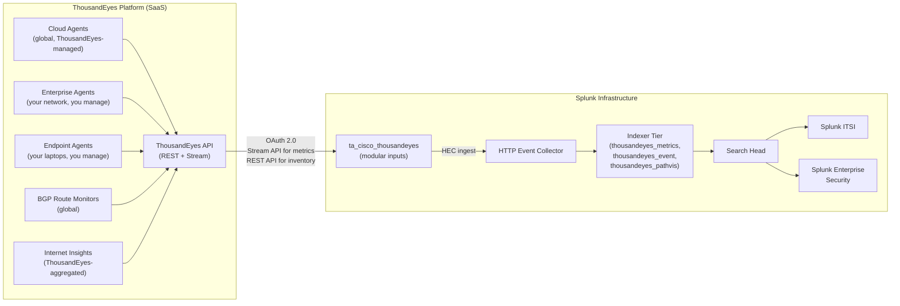

# Cisco ThousandEyes Integration Guide

> Digital Experience Monitoring (DEM) at Internet scale, integrated into
> Splunk. 54 use cases covering Cloud and Enterprise Agent network
> tests, HTTP server tests, BGP route monitoring, path visualization,
> Endpoint Agent telemetry, and Internet Insights — providing
> end-to-end visibility from user device to application across the
> public Internet, your corporate network, and SaaS providers.

---

## Table of Contents

- [Quick Start](#quick-start)
- [Overview](#overview)
- [Architecture and Data Flow](#architecture)
- [Prerequisites](#prerequisites)
- [Test Type Coverage](#test-types)
- [Data Sources Reference](#data-sources)
- [Field Dictionary](#field-dictionary)
- [Sample Events](#sample-events)
- [Cisco ThousandEyes App Setup](#app-setup)
- [OAuth and HEC Configuration](#oauth-hec)
- [Tests Stream — Metrics Input](#metrics-input)
- [Tests Stream — Path Visualization Input](#pathvis-input)
- [Internet Insights Input](#insights-input)
- [Endpoint Agent Data](#endpoint-agent)
- [Cross-Product Correlation](#cross-product)
- [CIM Mapping Reference](#cim-mapping)
- [Compliance Mapping](#compliance)
- [Capacity Planning and Sizing](#sizing)
- [Recommended Dashboard Layouts](#dashboards)
- [ITSI Service Modeling](#itsi)
- [SOAR Playbook Examples](#soar)
- [Multi-Account / MSP Strategy](#multi-account)
- [Security Hardening](#security-hardening)
- [Crawl / Walk / Run Roadmap](#roadmap)
- [Validation Checklist](#validation-checklist)
- [Known Limitations and Gaps](#known-limitations)
- [Troubleshooting](#troubleshooting)
- [FAQ](#faq)
- [Glossary](#glossary)
- [References](#references)
- [Contribution and Feedback](#contribution)

---

<a id="quick-start"></a>
## Quick Start — 60 Minutes from Zero to First Telemetry

1. **Install Cisco ThousandEyes<sup class="ref">[<a href="#ref-1">1</a>]</sup> App for Splunk** ([Splunkbase 7719](https://splunkbase.splunk.com/app/7719)) on a Heavy Forwarder or search head with management capability.

2. **Create indexes**:

    ```ini
    [thousandeyes_metrics]
    homePath = $SPLUNK_DB/thousandeyes_metrics/db
    coldPath = $SPLUNK_DB/thousandeyes_metrics/colddb
    thawedPath = $SPLUNK_DB/thousandeyes_metrics/thaweddb
    maxDataSize = auto_high_volume
    frozenTimePeriodInSecs = 7776000

    [thousandeyes_event]
    # ... similar
    [thousandeyes_pathvis]
    # ... similar
    ```

3. **OAuth setup** — In the ThousandEyes UI: **Settings > User API Tokens**, generate a token. In the Cisco ThousandEyes App for Splunk, enter your Account Group ID + token. Or use OAuth 2.0 device-code flow (modern).

4. **Create HEC token** for ThousandEyes events:

    ```bash
    curl -k -u admin:<pwd> https://splunk:8089/services/data/inputs/http -d \
      name=thousandeyes -d index=thousandeyes_metrics -d \
      sourcetype=cisco:thousandeyes:metric -d disabled=false
    ```

5. **Enable Tests Stream — Metrics input** in the app — within minutes, network/HTTP test results stream into `thousandeyes_metrics`.

6. **Validate**:

    ```spl
    index=thousandeyes_metrics earliest=-15m
    | stats count by thousandeyes.test.type, thousandeyes.test.name
    ```

7. **Activate crawl tier** — UC-5.9.1 (latency), UC-5.9.2 (loss), UC-5.9.3 (jitter), UC-5.9.8 (BGP reachability).

For a **fully automated setup**, use the `cisco-thousandeyes-setup` skill in this repo.

---

<a id="overview"></a>
## Overview

### What this guide covers

| Domain | What ThousandEyes shows you |
|--------|---------------------------|
| **Network performance** | Latency, loss, jitter from any vantage point to any target |
| **HTTP/HTTPS health** | DNS resolution, TCP connect, SSL negotiate, response time, status |
| **Path visualization** | Hop-by-hop traceroute (TCP/UDP/ICMP) showing intermediate ASNs |
| **BGP routing** | Reachability and path changes for monitored prefixes |
| **DNS** | Resolution time, response correctness, server availability |
| **VoIP / RTP** | MOS, latency, jitter for voice quality |
| **Endpoint Agent** | Per-user-device experience to corporate / SaaS apps |
| **Internet Insights** | Outage detection across major ISPs and SaaS providers |
| **Browser-bot tests** | Synthetic transactions through web apps (page load + Selenium-style scripts) |

### Why ThousandEyes + Splunk?

ThousandEyes' native UI is great for incident response — but Splunk gives you:

- **Long-term retention** beyond ThousandEyes' default rolling window
- **Correlation** with everything else in Splunk (firewall logs, SaaS logs, AD events, application logs)
- **ITSI Service Health Score** weighting from real user-experience metrics
- **Custom alerting** beyond ThousandEyes' built-in alert rules
- **Compliance evidence** for ITIL service performance attestation
- **Cost intelligence** — overlay ThousandEyes performance with cost data

### What's NOT in scope

| Domain | Where to look |
|--------|---------------|
| **Network device monitoring** | [Cisco Networks Guide](cisco-networks.md) |
| **WAN routers (SD-WAN)** | Separate SD-WAN Guide (planned) |
| **Application APM (deep code)** | Splunk APM / Observability Cloud |
| **End-user workstation perf** | Endpoint Agent (covered here) + endpoint EDR (separate) |

### What good looks like

| Dimension | Without integration | With full deployment |
|-----------|---------------------|----------------------|
| Detect SaaS slowdown | User complaint | Real-time ThousandEyes alert |
| Identify ISP issue | Vendor finger-pointing | Path-vis + BGP evidence |
| RCA WAN latency | Hours of triage | Cross-product correlation in minutes |
| Capacity for new SaaS | Guesswork | Pre-deployment baseline |
| Vendor SLA enforcement | Verbal agreement | Reportable monthly performance |

---

<a id="architecture"></a>
## Architecture and Data Flow



**Key ingest paths:**

1. **Tests Stream — Metrics** (push): high-frequency network and HTTP test metrics streamed via the OTel v2 metrics API
2. **Tests Stream — Path Visualization** (push): hop-by-hop traceroute snapshots
3. **Internet Insights** (poll): aggregated ISP/SaaS provider health
4. **Inventory poll** (REST): test definitions, agent inventory, account info — used for enrichment lookups
5. **Endpoint Agent** (poll): per-device application experience metrics

---

<a id="prerequisites"></a>
## Prerequisites

### Splunk requirements

| Item | Detail |
|------|--------|
| **Splunk version** | Splunk Enterprise 9.0+ or Splunk Cloud (Classic / Victoria) |
| **App** | ta_cisco_thousandeyes 1.x ([Splunkbase 7719](https://splunkbase.splunk.com/app/7719)) — Cisco-Supported |
| **Forwarder** | Heavy Forwarder recommended (modular inputs need persistence); search-head install also supported |
| **HEC** | Required for stream ingest |
| **CIM** | Web data model for HTTP test mapping (optional but recommended) |

### ThousandEyes requirements

| Item | Detail |
|------|--------|
| **Account tier** | Essentials (BGP only), Advantage (Cloud Agent tests), Premier (Enterprise Agents + Endpoint Agents + Internet Insights) |
| **Stream API entitlement** | Included in Advantage / Premier tiers |
| **API token** | User-scoped or Account Group-scoped (preferred for production) |
| **OAuth 2.0** | Optional but more secure; the app supports device-code flow |

### Network requirements

| Item | Detail |
|------|--------|
| **Outbound HTTPS 443** | Splunk HF → `api.thousandeyes.com` (and regional endpoints) |
| **Inbound HTTPS 8088** | Stream API endpoint → Splunk HEC |

### Account hygiene

- Create a dedicated Splunk-integration user in ThousandEyes with read-only privileges (token-only)
- Use Account Group scoping if you have multiple ThousandEyes accounts (test owner / org / customer separation)

---

<a id="test-types"></a>
## Test Type Coverage

ThousandEyes test types and where they fit:

| Test type | What it measures | Common UCs |
|----------|-----------------|-----------|
| **Network — Agent to Server** | Network performance from agent to one server (latency, loss, jitter, MTU) | UC-5.9.1, .2, .3, .7 |
| **Network — Agent to Agent** | Bidirectional network performance between agents | (similar) |
| **HTTP Server** | Phase-by-phase HTTP transaction (DNS, connect, SSL, wait, receive) | HTTP test UCs |
| **Page Load** | Browser-bot full page load with all asset waterfall | Page load UCs |
| **Transaction (Web)** | Selenium-scripted multi-step web flow | Transaction UCs |
| **DNS Server** | DNS resolution time and correctness | DNS UCs |
| **DNS Trace** | Authoritative DNS chain | DNS UCs |
| **DNSSEC** | DNSSEC validation | DNS security UCs |
| **VoIP / RTP** | Voice quality MOS, jitter, packet loss | VoIP UCs |
| **BGP Route Monitoring** | Reachability and path changes per prefix | UC-5.9.8, .9 |
| **API** | REST API health (response code, latency) | API UCs |
| **FTP** | FTP transfer health | FTP UCs |
| **Endpoint scheduled tests** | From Endpoint Agent (laptop) to target | Endpoint UCs |
| **Endpoint Browser sessions** | Real user web session telemetry | UEM UCs |

### Agent type strategy

- **Cloud Agents (ThousandEyes-managed):** ~200+ globally — use for testing public services from outside-in (where would my customers see my service?)
- **Enterprise Agents (you-managed):** test from inside your network — branch offices, data centres, SaaS endpoints
- **Endpoint Agents (you-managed, on user laptops):** real user experience — use sparingly to limit noise

---

<a id="data-sources"></a>
## Data Sources Reference

### Stream-based metrics (OTel v2 format)

| Sourcetype | Index | Test types |
|-----------|-------|-----------|
| `cisco:thousandeyes:metric` | `thousandeyes_metrics` | Network, HTTP, BGP, DNS, VoIP, API tests |

### Stream-based path visualization

| Sourcetype | Index | Use |
|-----------|-------|-----|
| `cisco:thousandeyes:path-vis` | `thousandeyes_pathvis` | Hop-by-hop traceroute snapshots |

### Stream-based events (alerts)

| Sourcetype | Index | Use |
|-----------|-------|-----|
| `cisco:thousandeyes:event` | `thousandeyes_event` | ThousandEyes-fired alerts (test going below thresholds) |

### Internet Insights polling

| Sourcetype | Index | Use |
|-----------|-------|-----|
| `cisco:thousandeyes:internet-insights` | `thousandeyes_internet_insights` | Aggregated ISP/SaaS outage information |

### Inventory polling (lookups for enrichment)

| API endpoint | Use |
|------------|-----|
| `/v7/agents` | Agent name → IP/location lookup |
| `/v7/tests` | Test ID → test name + URL/host lookup |
| `/v7/account-groups` | Account-Group enrichment for multi-tenant |

The app stores these as KV-store collections updated periodically.

### Key OTel v2 metrics (Tests Stream)

| Metric | Test type | Unit | Description |
|--------|----------|------|-------------|
| `network.latency` | Network | seconds | Round-trip time |
| `network.loss` | Network | percent | Packet loss percentage |
| `network.jitter` | Network | milliseconds | Inter-packet delay variation |
| `network.score` | Network (Endpoint Agent only) | 0-10 | Pre-computed quality score |
| `http.response_time` | HTTP | seconds | Total response time |
| `http.dns_time` | HTTP | seconds | DNS resolution duration |
| `http.connect_time` | HTTP | seconds | TCP connect duration |
| `http.ssl_time` | HTTP | seconds | SSL handshake duration |
| `http.wait_time` | HTTP | seconds | TTFB (server processing) |
| `http.receive_time` | HTTP | seconds | Body transfer duration |
| `http.status_code` | HTTP | int | HTTP status |
| `bgp.reachability` | BGP | percent | % of monitors that see prefix as reachable |
| `bgp.path_changes.count` | BGP | int | Path changes observed per interval |
| `dns.resolution_time` | DNS | seconds | DNS resolution time |
| `voice.mos` | VoIP | 1.0-5.0 | Mean Opinion Score |

### Key resource attributes (every event)

| Attribute | Example | Use |
|-----------|---------|-----|
| `thousandeyes.test.type` | `agent-to-server` / `http-server` / `bgp` | Filter by test type |
| `thousandeyes.test.name` | `Salesforce - US East` | Test display name |
| `thousandeyes.test.id` | `1234567` | Numeric ID for stable joins |
| `thousandeyes.source.agent.name` | `LON-Office-1` | Agent that ran the test |
| `thousandeyes.source.agent.location` | `London, UK` | Geographic location |
| `thousandeyes.source.agent.type` | `cloud` / `enterprise` / `endpoint` | Agent class |
| `server.address` | `salesforce.com` | Target hostname |
| `network.prefix` | `203.0.113.0/24` | (BGP only) monitored prefix |
| `thousandeyes.permalink` | `https://...` | Direct deep-link to ThousandEyes UI |

---

<a id="field-dictionary"></a>
## Field Dictionary

### Common (all sourcetypes)

| Field | Example | Description |
|-------|---------|-------------|
| `_time` | `2026-04-25T14:30:00Z` | Round timestamp |
| `index` | `thousandeyes_metrics` | Routing |
| `sourcetype` | `cisco:thousandeyes:metric` | Type |

### Test identification

| Field | Example | Description |
|-------|---------|-------------|
| `thousandeyes.test.id` | `1234567` | ThousandEyes test ID |
| `thousandeyes.test.name` | `Salesforce - US East` | Display name |
| `thousandeyes.test.type` | `agent-to-server` / `http-server` / `bgp` / `voice` / `dns-server` | Test class |

### Agent identification (source)

| Field | Example | Description |
|-------|---------|-------------|
| `thousandeyes.source.agent.name` | `LON-Office-1` | Agent display name |
| `thousandeyes.source.agent.id` | `123` | Numeric ID |
| `thousandeyes.source.agent.location` | `London, UK` | Geographic |
| `thousandeyes.source.agent.type` | `cloud` / `enterprise` / `endpoint` | Class |

### Target

| Field | Example | Description |
|-------|---------|-------------|
| `server.address` | `salesforce.com` | Target hostname or IP |
| `server.port` | `443` | Target port |

### BGP-specific

| Field | Example | Description |
|-------|---------|-------------|
| `thousandeyes.monitor.name` | `Equinix Ashburn` | BGP monitor (peer) |
| `thousandeyes.monitor.location` | `Ashburn, VA` | Geographic |
| `network.prefix` | `203.0.113.0/24` | Monitored prefix |

### Path visualization

| Field | Example | Description |
|-------|---------|-------------|
| `path.hop_number` | `5` | Hop sequence |
| `path.hop_ip` | `198.51.100.1` | Hop IP |
| `path.hop_asn` | `AS3356` | Hop ASN (if known) |
| `path.hop_location` | `London, UK` | Geo of hop |
| `thousandeyes.permalink` | `https://...` | Direct link to path-vis |

---

<a id="sample-events"></a>
## Sample Events

### Network Agent-to-Server metric

```json
{
    "_time": "2026-04-25T14:30:00Z",
    "thousandeyes.test.type": "agent-to-server",
    "thousandeyes.test.name": "Salesforce - US East",
    "thousandeyes.test.id": 1234567,
    "thousandeyes.source.agent.name": "LON-Office-1",
    "thousandeyes.source.agent.location": "London, UK",
    "thousandeyes.source.agent.type": "enterprise",
    "server.address": "salesforce.com",
    "network.latency": 0.085,
    "network.loss": 0.0,
    "network.jitter": 2.4,
    "thousandeyes.permalink": "https://app.thousandeyes.com/view/tests/1234567/round/1745851200"
}
```

### HTTP Server test metric

```json
{
    "_time": "2026-04-25T14:30:00Z",
    "thousandeyes.test.type": "http-server",
    "thousandeyes.test.name": "Corp Login Page",
    "thousandeyes.source.agent.name": "AMS-Office-1",
    "server.address": "login.example.com",
    "http.response_time": 0.456,
    "http.dns_time": 0.012,
    "http.connect_time": 0.022,
    "http.ssl_time": 0.045,
    "http.wait_time": 0.376,
    "http.receive_time": 0.001,
    "http.status_code": 200
}
```

### BGP route monitor reachability

```json
{
    "_time": "2026-04-25T14:30:00Z",
    "thousandeyes.test.type": "bgp",
    "thousandeyes.test.name": "Corp Edge Prefix",
    "thousandeyes.monitor.name": "Equinix Ashburn",
    "thousandeyes.monitor.location": "Ashburn, VA",
    "network.prefix": "203.0.113.0/24",
    "bgp.reachability": 100,
    "bgp.path_changes.count": 0
}
```

### Path visualization snapshot

```json
{
    "_time": "2026-04-25T14:30:00Z",
    "thousandeyes.test.id": 1234567,
    "thousandeyes.source.agent.name": "LON-Office-1",
    "server.address": "salesforce.com",
    "path.hops": [
        {"hop_number": 1, "hop_ip": "10.0.0.1", "hop_asn": null, "rtt_ms": 1},
        {"hop_number": 2, "hop_ip": "172.16.0.1", "hop_asn": null, "rtt_ms": 5},
        {"hop_number": 3, "hop_ip": "198.51.100.1", "hop_asn": "AS65000", "rtt_ms": 12},
        {"hop_number": 4, "hop_ip": "192.0.2.1", "hop_asn": "AS3356", "rtt_ms": 45},
        {"hop_number": 5, "hop_ip": "203.0.113.10", "hop_asn": "AS13414", "rtt_ms": 85}
    ]
}
```

### Internet Insights event

```json
{
    "_time": "2026-04-25T14:30:00Z",
    "type": "internet-insights",
    "outage_id": "abc-123",
    "provider": "AWS US-East-1",
    "severity": "major",
    "affected_apps": ["S3", "RDS"],
    "geo": ["US"],
    "started_at": "2026-04-25T14:25:00Z"
}
```

---

<a id="app-setup"></a>
## Cisco ThousandEyes App Setup

### Install

```bash
# Splunk Enterprise (HF or SH):
sudo /opt/splunk/bin/splunk install app /path/to/cisco-thousandeyes-app.tgz
sudo /opt/splunk/bin/splunk restart
```

For Splunk Cloud, use Splunkbase install via Web UI (the app is Cloud-vetted).

### Initial setup steps

1. Open the app — first-run wizard appears
2. Enter your **Account Group ID** (find via ThousandEyes UI > Settings > Account Settings)
3. Enter your **API token** OR start the OAuth 2.0 device-code flow
4. Configure the **HEC endpoint** that the app will use to deliver data
5. Configure index destinations per data type (defaults: `thousandeyes_metrics`, `thousandeyes_event`, `thousandeyes_pathvis`)
6. Enable individual inputs (Tests Stream — Metrics, Tests Stream — Path Visualization, etc.)
7. Validate — watch the inputs go from `disabled=false, status=running` to actual data arrival

### Common gotchas

- **Account Group ID is NOT your account ID** — it's a separate scoping concept; check the URL when you're in the Account Group context
- **API token must have Stream API entitlement** — otherwise streams return empty
- **HEC endpoint must be reachable from the app's host** — test with `curl -k -H "Authorization: Splunk <token>" https://splunk-hec:8088/services/collector -d '{"event":"test"}'`

---

<a id="oauth-hec"></a>
## OAuth and HEC Configuration

### OAuth 2.0 device-code flow (recommended)

Modern ThousandEyes API supports OAuth 2.0. The app's modular inputs use device-code flow:

```bash
# In the app UI:
# 1. Click "Start OAuth Flow"
# 2. Note the user_code and verification_url
# 3. Open verification_url in a browser
# 4. Authenticate with your ThousandEyes user
# 5. Enter the user_code
# 6. App receives access + refresh tokens, stores in passwords.conf
```

### HEC token best practices

```ini
# inputs.conf (HEC tokens)
[http://thousandeyes-metrics]
disabled = false
index = thousandeyes_metrics
sourcetype = cisco:thousandeyes:metric
indexes = thousandeyes_metrics, thousandeyes_event, thousandeyes_pathvis, thousandeyes_internet_insights
useACK = true
token = <generated-uuid>
```

- Use ACK (acknowledgment) mode for guaranteed delivery
- Scope token to ThousandEyes indexes only (not `*`)
- Rotate quarterly per security policy

---

<a id="metrics-input"></a>
## Tests Stream — Metrics Input

This is the workhorse input. It streams every test result via the OTel v2 metrics endpoint.

### Configure (via Splunk app UI)

```
Tests Stream — Metrics input:
  Status: enabled
  Account Group: <your-AG-id>
  Index: thousandeyes_metrics
  Sourcetype: cisco:thousandeyes:metric
  Test types: All  (or filter to: agent-to-server, http-server, bgp, ...)
```

### Configure (inputs.conf)

```ini
[ta_cisco_thousandeyes://tests_stream_metrics]
account_group_id = 12345
index = thousandeyes_metrics
sourcetype = cisco:thousandeyes:metric
disabled = false
test_types = agent-to-server,http-server,bgp,dns-server,voice
```

### What you get

- One event per test round per agent → can be high volume
- For 100 tests × 6 rounds/hour × 30 agents = 18,000 events/hour
- Pre-aggregated metrics for trend analysis

### Sourcetype configuration

```ini
# props.conf
[cisco:thousandeyes:metric]
SHOULD_LINEMERGE = false
TIME_PREFIX = "_time":"
TIME_FORMAT = %Y-%m-%dT%H:%M:%SZ
INDEXED_EXTRACTIONS = json
KV_MODE = json
LINE_BREAKER = ([\r\n]+)
TRUNCATE = 65536
```

---

<a id="pathvis-input"></a>
## Tests Stream — Path Visualization Input

Path visualization captures hop-by-hop traceroutes for diagnostic purposes.

```
Tests Stream — Path Visualization input:
  Status: enabled
  Index: thousandeyes_pathvis
  Sourcetype: cisco:thousandeyes:path-vis
  Test IDs: <comma-sep list> or "all"
```

Path visualization is large per event (~5–50 KB per hop list); enable selectively.

### Common paths-vis SPL pattern (UC-5.9.6)

```spl
index=thousandeyes_pathvis thousandeyes.test.id=1234567 earliest=-1d
| spath path=path.hops{} output=hops
| eval hop_ips = mvjoin(mvmap(hops, json_extract_path_text(hops, "$.hop_ip")), ",")
| eval path_hash = md5(hop_ips)
| stats earliest(_time) as first_seen, latest(_time) as last_seen, count by path_hash, hop_ips
| sort -count
```

This computes a **path fingerprint** so you can detect when the route changes.

---

<a id="insights-input"></a>
## Internet Insights Input

ThousandEyes Internet Insights aggregates outage data from across all monitors. Polled (not streamed):

```
Internet Insights input:
  Status: enabled
  Index: thousandeyes_internet_insights
  Sourcetype: cisco:thousandeyes:internet-insights
  Poll interval: 300 (5 min)
```

Use for top-of-funnel "is this an internet/ISP/SaaS-wide outage or just us?" analysis.

---

<a id="endpoint-agent"></a>
## Endpoint Agent Data

Endpoint Agents (laptop installations) provide real user experience data:

| Test type | Use |
|----------|-----|
| Scheduled (background) tests | Periodic measurement to corp / SaaS apps |
| Browser sessions | Real user web session telemetry |
| Wi-Fi & local network | RSSI, signal quality |
| Network gateway | Default-gateway latency, ISP detection |

Endpoint Agent data flows the same way as Cloud/Enterprise Agent data via the Tests Stream input. Filter on `thousandeyes.source.agent.type=endpoint` to isolate.

For UEM-style detection (UC-5.9.24+), use the pre-computed `network.score` (0–10) field — it's only generated for Endpoint Agent tests.

---

<a id="cross-product"></a>
## Cross-Product Correlation

### ThousandEyes + firewall (decryption blame)

When a TLS decryption rule is added and HTTP test latency goes up:

```spl
(index=firewall sourcetype="pan:config" object="decryption-policy")
OR (index=thousandeyes_metrics thousandeyes.test.type="http-server")
| stats min(_time) as fw_change_time, max(http.response_time) as latency by server.address
| where latency > 1.0
```

### ThousandEyes + AWS (cloud-region issue)

```spl
(index=thousandeyes_metrics thousandeyes.test.type="agent-to-server" 
  | rex field=server.address "(?<aws_region>us-east-1|us-west-2|eu-west-1)")
| join type=left aws_region
    [ search index=aws sourcetype="aws:health" event_type="open" earliest=-1h
      | rename region as aws_region ]
| stats avg(network.latency) as latency, count(eventType) as aws_events by aws_region
```

### ThousandEyes + Catalyst Center (network device → DEM)

When DNAC reports a switch issue, check ThousandEyes for affected agents:

```spl
(index=catalyst_center event_type="device-down" device_id="*")
OR (index=thousandeyes_metrics thousandeyes.source.agent.type="enterprise")
| transaction maxspan=1h thousandeyes.source.agent.location
```

### ThousandEyes + Application Logs (application-level vs network-level)

```spl
(index=web sourcetype="access_combined" url="/api/v1/login")
OR (index=thousandeyes_metrics thousandeyes.test.name="Login API Test")
| stats avg(response_time) as app_response, avg(http.response_time) as te_response by _time
| eval network_overhead = te_response - app_response
```

---

<a id="cim-mapping"></a>
## CIM Mapping Reference

| CIM model | Sourcetype | Mapped fields |
|-----------|-----------|--------------|
| **Web** | `cisco:thousandeyes:metric` (HTTP tests) | `dest`, `url`, `response_time`, `status` |
| **Performance** | `cisco:thousandeyes:metric` | `response_time`, `value`, custom KPIs |
| **Alerts** | `cisco:thousandeyes:event` | `severity`, `signature`, `dvc` |

Most ThousandEyes data is custom (DEM-specific) and best queried natively rather than through CIM.

---

<a id="compliance"></a>
## Compliance Mapping

### NIST 800-53 (rev 5)

| Control | UC examples |
|---------|------------|
| **CA-7** Continuous Monitoring | Foundational for all ThousandEyes UCs |
| **SA-9** External Information System Services | SaaS provider performance UCs |
| **SC-5** Denial of Service Protection | DDoS detection through latency anomalies |
| **SI-4** System Monitoring | Foundational |

### NIS2 (Article 21)

| Article | Coverage |
|---------|----------|
| 21(2)(b) Incident handling | Path-vis + alert correlation for outage RCA |
| 21(2)(c) Business continuity | Internet Insights + alert escalation |
| 21(2)(d) Supply chain | SaaS provider performance tracking |

### ITIL Service Management

| Practice | Coverage |
|---------|----------|
| Service Level Management | SLA evidence for SaaS / WAN |
| Capacity Management | Latency / throughput trending |
| Availability Management | Reachability + uptime tracking |
| Problem Management | Path-vis for RCA |

---

<a id="sizing"></a>
## Capacity Planning and Sizing

### Volume per test type

| Test type | Per round per agent | Round freq |
|----------|---------------------|------------|
| Network (agent-to-server) | ~1 KB | 1–60 min |
| HTTP Server | ~2 KB | 1–60 min |
| BGP | ~0.5 KB per monitor per prefix | 15 min |
| DNS Server | ~1 KB | 1–60 min |
| Path Visualization | ~5–50 KB | 15–60 min |
| VoIP / RTP | ~3 KB | 1–60 min |

### Worked examples

| Estate | Daily ingest |
|--------|-------------|
| 50 tests, 10 agents, 15-min interval (no path-vis) | ~30 MB/day |
| 200 tests, 30 agents, 1-min interval | ~1 GB/day |
| 500 tests, 100 agents, 1-min + path-vis | ~10 GB/day |
| Large MSP (10K tests) | ~50 GB/day |

### Retention recommendations

| Data | Retention | Rationale |
|------|-----------|-----------|
| Metrics | 90 days hot; 1 year cold | Trend / SLA |
| Path-vis | 30 days hot; 90 days cold | RCA |
| Internet Insights | 1 year | Long-term trend |
| Events / alerts | 1 year | Audit |

---

<a id="dashboards"></a>
## Recommended Dashboard Layouts

### Crawl — "DEM At a Glance"

```
+---------------------+---------------------+
| TOP SaaS LATENCY    | TOP HTTP RESPONSE   |
+---------------------+---------------------+
| BGP REACHABILITY    | INTERNET INSIGHTS   |
+---------------------+---------------------+
| WORST-PERFORMING    | CRAWL TEST COUNT    |
| AGENTS              | (capacity check)    |
+---------------------+---------------------+
```

### Walk — "Application Experience"

```
+---------------------+---------------------+
| HTTP PHASE BREAKDOWN (DNS/CONN/SSL/WAIT)  |
+---------------------+---------------------+
| GEO-MAP USER LATENCY                      |
+---------------------+---------------------+
| QUALITY SCORE BY APP (UC-5.9.7)           |
+---------------------+---------------------+
```

### Run — "Routing & Insights"

```
+---------------------+---------------------+
| BGP HIJACK DETECT   | PATH CHANGES TREND  |
+---------------------+---------------------+
| PATH-VIS HEAT MAP   | OUTAGE TIMELINE     |
+---------------------+---------------------+
| SLA REPORT          | EXEC SUMMARY        |
+---------------------+---------------------+
```

---

<a id="itsi"></a>
## ITSI Service Modeling

### Service hierarchy

```
Digital Experience
├── Critical SaaS Apps
│   ├── Salesforce (entity)
│   ├── ServiceNow (entity)
│   ├── M365 (entity)
│   └── Slack (entity)
├── Internal Apps
│   ├── HR Portal
│   └── Finance Apps
├── Internet Connectivity
│   ├── Per-Site WAN (rolled by location)
│   └── ISP Performance
└── BGP Reachability
    └── Per-Prefix
```

### Recommended KPIs

| KPI | SPL pattern | Threshold |
|-----|------------|-----------|
| Avg HTTP response time | TS metrics | Adaptive (warn 1.5×, page 3×) |
| Network latency | TS metrics | Static per app SLA |
| Loss % | TS metrics | Static (warn 1%, page 5%) |
| BGP reachability | TS metrics | Static (page < 100% across all monitors) |
| Quality score | UC-5.9.7 composite | Static (warn < 70, page < 50) |
| Page load time | Browser test | Adaptive |

---

<a id="soar"></a>
## SOAR Playbook Examples

### Playbook 1: SaaS App Latency Spike

**Trigger:** ThousandEyes alert — HTTP test threshold exceeded.

```
1. RECEIVE alert (test_name, server_address, response_time)
2. PULL last 24h response_time trend
3. CHECK Internet Insights — is provider in known outage?
4. CHECK path-vis — has the path changed?
5. CHECK firewall logs — new decryption policy? new ACL?
6. CHECK other agents — global or local issue?
7. DECISION:
   - Provider outage → notify users, no action needed (vendor side)
   - Path change → page network team
   - Firewall change → page security team
   - Local agent only → page site team
8. CREATE Sev-2 ticket with all enrichment
```

### Playbook 2: BGP Reachability Drop (UC-5.9.8)

**Trigger:** `bgp.reachability < 100` for any monitored prefix.

```
1. RECEIVE alert (prefix, monitor, reachability)
2. PULL all monitors' view — global vs partial loss?
3. CHECK origin ASN — is it correct?
4. CHECK if neighbor BGP states match (cross-product with cat 5.1 UC-5.1.4)
5. DECISION:
   - All monitors lost reachability → P1 (likely BGP misconfig or hijack)
   - Subset lost → P2 (regional ISP issue)
   - Origin ASN changed → P0 (BGP HIJACK SUSPECTED)
6. CREATE incident; if hijack: notify CSIRT immediately
```

### Playbook 3: Path Change Detection (UC-5.9.6)

**Trigger:** Path fingerprint hash changes significantly for monitored test.

```
1. RECEIVE alert (test_name, old_path_hash, new_path_hash)
2. DIFF the two paths — what hops changed?
3. CHECK if change correlates with maintenance window
4. CHECK ASN changes — different ISP exit?
5. CHECK if latency changed materially
6. DECISION:
   - Maintenance window → log only
   - Latency degradation → page network team
   - Unusual ASN appearing → potential security incident
7. ATTACH path-vis permalink to ticket
```

---

<a id="multi-account"></a>
## Multi-Account / MSP Strategy

For MSPs or large enterprises with multiple ThousandEyes Account Groups:

- Configure **one Splunk app instance per Account Group** (separate modular input configs)
- Use **per-Account-Group indexes** (e.g., `thousandeyes_metrics_acmecorp`, `thousandeyes_metrics_globex`)
- Apply **RBAC** so each tenant sees only their indexes
- Build **MSP-level rollup dashboards** that union across all tenant indexes for capacity planning

---

<a id="security-hardening"></a>
## Security Hardening

### API token

- Use **Account Group-scoped tokens** (least privilege)
- Rotate quarterly
- Store in Splunk credential store (`passwords.conf` / app secret store)
- Never embed in source-controlled files

### OAuth 2.0

- Prefer over static tokens
- Use refresh tokens — short-lived access tokens reduce blast radius
- Audit token usage via ThousandEyes audit log

### HEC token

- Scope to `thousandeyes_*` indexes only
- TLS-required, ACK enabled

### Permalink leakage

- ThousandEyes permalinks contain test IDs and timestamps but require ThousandEyes auth to view — safe to share in tickets

---

<a id="roadmap"></a>
## Crawl / Walk / Run Roadmap

### Crawl (Week 1–2)

1. Install ta_cisco_thousandeyes
2. Configure OAuth + HEC
3. Enable Tests Stream — Metrics
4. Deploy UC-5.9.1 (latency), UC-5.9.2 (loss), UC-5.9.3 (jitter)
5. Crawl dashboard live

### Walk (Week 3–6)

1. Enable Tests Stream — Path Visualization (selective)
2. Enable Internet Insights polling
3. UC-5.9.7 (quality score), UC-5.9.6 (path change), UC-5.9.8 (BGP)
4. CIM Web mapping
5. Walk dashboards

### Run (Month 2+)

1. ITSI services per SaaS app + WAN site
2. SOAR playbooks
3. ES enrichment for security incidents (BGP hijack)
4. Multi-account / MSP setup if needed
5. Quarterly SLA reports

---

<a id="validation-checklist"></a>
## Validation Checklist

### Day 1

- [ ] App installed and licensed
- [ ] OAuth or token auth working
- [ ] Tests Stream — Metrics flowing
- [ ] At least UC-5.9.1 alert wired

### Day 7

- [ ] All test types ingesting
- [ ] Path-vis selectively enabled
- [ ] Internet Insights polling
- [ ] Crawl dashboard live

### Day 30

- [ ] BGP UCs deployed
- [ ] Quality-score UC-5.9.7 deployed
- [ ] First SOAR playbook in production
- [ ] CIM Web populated

### Day 90

- [ ] ITSI services per SaaS app
- [ ] Run-tier UCs + dashboards
- [ ] SLA reports generated quarterly

---

<a id="known-limitations"></a>
## Known Limitations and Gaps

| Limitation | Impact | Workaround |
|------------|--------|------------|
| **Stream API requires Advantage tier+** | Essentials customers limited to BGP only | Upgrade tier or use REST polling instead |
| **Path-vis is large per event** | Index bloat | Enable selectively for diagnostic-only tests |
| **Endpoint Agent has high event volume** | Cost | Filter to specific tests; use sampling |
| **OAuth token refresh requires app-host network access** | Behind strict proxies | Configure proxy in app settings |
| **ThousandEyes UI permalinks expire after 90 days for some account types** | Cannot drill from old Splunk events | Capture full path-vis JSON locally |
| **Test inventory must be polled separately from metrics** | Lookups can lag | Schedule inventory poll every 15 min |
| **No native CIM model for DEM data** | Some patterns require custom search | Build app-specific dashboards |

---

<a id="troubleshooting"></a>
## Troubleshooting

### No data after enabling Tests Stream

1. Check input status: Settings > Data inputs > ta_cisco_thousandeyes
2. Verify OAuth token / API token validity in app
3. Check HEC endpoint reachability from app host: `curl -k -H "Authorization: Splunk <token>" https://splunk-hec:8088/services/collector/health`
4. Check `index=_internal sourcetype=splunkd "ta_cisco_thousandeyes"` for errors

### Some tests missing

- Account Group filter — confirm tests belong to the AG you authorized
- Test type filter — input may exclude certain types
- Tests must be in "enabled" state in ThousandEyes

### Path-vis events delayed

- Path-vis is computed lazily by ThousandEyes — typical lag 5–10 min
- Stream interval default 5 min; reduce to 1 min if needed

### Internet Insights showing duplicates

- Polling interval too short relative to ThousandEyes data update
- Set `poll_interval >= 300` and dedupe in SPL

### High volume

- Path-vis enabled for all tests → disable for tests that don't need it
- Per-round metric volume too high → increase test interval (15 min instead of 1 min)

---

<a id="faq"></a>
## FAQ

**Q: REST API or Stream API — which?**
A: Stream API for production (push-based, low-latency, OTel native). REST API for inventory and on-demand pulls.

**Q: How does this guide compare to using ThousandEyes' native UI?**
A: Native UI is great for incident response on a per-test basis. Splunk gives you long-term retention, cross-product correlation, custom alerting, and ITSI service health weighting.

**Q: Can I get test results into Splunk Observability Cloud<sup class="ref">[<a href="#ref-12">12</a>]</sup> (Splunk APM)?**
A: Yes — same OTel v2 API can target Splunk Observability. Use o11y Cloud for high-frequency metrics, Splunk Cloud for log-style search and correlation.

**Q: How do I detect BGP hijacks?**
A: Use UC-5.9.8 (reachability) + check origin ASN field. Alert if origin ASN differs from your expected ASN. ThousandEyes also has built-in BGP hijack alerting.

**Q: Endpoint Agent or Browser sessions?**
A: Endpoint Agent for scheduled background tests; Browser sessions for real user web telemetry. Use both for full UEM coverage.

**Q: What about Cisco AppDynamics integration?**
A: AppDynamics is application APM — complementary to ThousandEyes (network DEM). Splunk can ingest both; cross-correlate via shared user/session IDs where possible.

**Q: Is the app supported on Splunk Cloud Victoria?**
A: Yes — the app is Cisco-Supported and Splunk Cloud-vetted for both Classic and Victoria experiences.

**Q: How do I report on SaaS provider SLA?**
A: Per-test response_time + reachability over the SLA period. Build a saved search with `stats avg(response_time), count(eval(reachability=100)) / count` per test name per month.

**Q: How big is the BGP test volume?**
A: ~50 MB/month for 10 prefixes monitored from 300 monitors at 15-min interval. Negligible compared to network or HTTP tests.

---

<a id="glossary"></a>
## Glossary

| Term | Definition |
|------|-----------|
| **DEM** | Digital Experience Monitoring |
| **Cloud Agent** | ThousandEyes-managed test endpoint, globally distributed |
| **Enterprise Agent** | Customer-managed test endpoint inside their network |
| **Endpoint Agent** | Customer-managed agent on user laptop |
| **BGP Route Monitor** | ThousandEyes BGP peering point at major IXPs |
| **Internet Insights** | ThousandEyes' aggregated provider/ISP outage data |
| **Test** | A single measurement definition (target + metric + interval) |
| **Round** | One execution of a test by all assigned agents |
| **Path Visualization** | Hop-by-hop traceroute snapshot |
| **OTel v2** | OpenTelemetry metrics format used by Tests Stream API |
| **Stream API** | ThousandEyes' push-based metric/event delivery |
| **Account Group** | Scoping concept for multi-tenant ThousandEyes setups |

---

<a id="references"></a>
## References

- [Cisco ThousandEyes App for Splunk (Splunkbase 7719)](https://splunkbase.splunk.com/app/7719)
- [ThousandEyes API documentation](https://developer.cisco.com/docs/thousandeyes/)
- [ThousandEyes Stream API guide](https://docs.thousandeyes.com/product-documentation/integrations/integrations-and-api-clients/stream-api)
- [ThousandEyes BGP Route Monitoring](https://docs.thousandeyes.com/product-documentation/internet-and-wan-monitoring/tests/routing-tests/bgp-test)
- [ThousandEyes OTel v2 metric reference](https://developer.cisco.com/docs/thousandeyes/get-tests-via-opentelemetry/)

---

<a id="contribution"></a>
## Contribution and Feedback

Part of the [Splunk Monitoring Use Cases](https://github.com/fenre/splunk-monitoring-use-cases) project. [Open an issue](https://github.com/fenre/splunk-monitoring-use-cases/issues/new).

---

*Last updated: 2026-05-09. Covers ta_cisco_thousandeyes 1.x, Cisco ThousandEyes Stream API v2, OTel v2 metrics format.*

---

<!-- BEGIN-AUTOGENERATED-SOURCES -->

## References

*Auto-generated by `scripts/generate_doc_references.py` from `data/source-references.json` and `data/source-mappings.json`. Edit those files (or the document body) to change citations; this footer is rewritten on every run.*

### Primary sources

<a id="ref-1"></a>**[1]** Cisco ThousandEyes. (2026). *Cisco ThousandEyes Documentation*. Cisco Systems, Inc. Retrieved May 11, 2026, from https://docs.thousandeyes.com/

### Supporting sources

<a id="ref-2"></a>**[2]** AXELOS. (2019). *ITIL 4 — IT service management practices* (4th edition). https://www.axelos.com/certifications/itil-service-management

<a id="ref-3"></a>**[3]** European Parliament and Council of the European Union. (2022, December). *Directive (EU) 2022/2555 — NIS2 Directive on cybersecurity*. Official Journal of the European Union, L 333. ELI: dir/2022/2555. https://eur-lex.europa.eu/eli/dir/2022/2555/oj

<a id="ref-4"></a>**[4]** Hardt, D. (Ed.). (2012, October). *The OAuth 2.0 Authorization Framework*. Internet Engineering Task Force. RFC 6749. https://www.rfc-editor.org/rfc/rfc6749

<a id="ref-5"></a>**[5]** International Organization for Standardization. (2022). *ISO/IEC 27001:2022 — Information security, cybersecurity and privacy protection — Information security management systems — Requirements*. ISO/IEC. ISO/IEC 27001:2022. https://www.iso.org/standard/27001

<a id="ref-6"></a>**[6]** National Institute of Standards and Technology. (2020). *Security and Privacy Controls for Information Systems and Organizations* (Revision 5). U.S. Department of Commerce. NIST SP 800-53 Rev. 5. https://csrc.nist.gov/pubs/sp/800/53/r5/upd1/final

<a id="ref-7"></a>**[7]** OpenTelemetry Authors. (2026). *OpenTelemetry Semantic Conventions*. Cloud Native Computing Foundation. Retrieved May 11, 2026, from https://opentelemetry.io/docs/specs/semconv/

<a id="ref-8"></a>**[8]** OpenTelemetry Authors. (2026). *OpenTelemetry Specification*. Cloud Native Computing Foundation. Retrieved May 11, 2026, from https://opentelemetry.io/docs/specs/otel/

<a id="ref-9"></a>**[9]** Splunk Inc. (2026). *Splunk Enterprise Security Administration Manual*. Splunk LLC, a Cisco company. Retrieved May 11, 2026, from https://docs.splunk.com/Documentation/ES

<a id="ref-10"></a>**[10]** Splunk Inc. (2026). *Splunk Infrastructure Monitoring Documentation*. Splunk LLC, a Cisco company. Retrieved May 11, 2026, from https://docs.splunk.com/observability/en/infrastructure/intro-to-infrastructure.html

<a id="ref-11"></a>**[11]** Splunk Inc. (2026). *Splunk IT Service Intelligence Administration Manual*. Splunk LLC, a Cisco company. Retrieved May 11, 2026, from https://docs.splunk.com/Documentation/ITSI

<a id="ref-12"></a>**[12]** Splunk Inc. (2026). *Splunk Observability Cloud Documentation*. Splunk LLC, a Cisco company. Retrieved May 11, 2026, from https://docs.splunk.com/observability/en/

<details>
<summary>Additional online sources cited in the document body (7)</summary>

<a id="ref-13"></a>**[13]** splunkbase.splunk.com. *Splunkbase 7719*. Retrieved May 11, 2026, from https://splunkbase.splunk.com/app/7719

<a id="ref-14"></a>**[14]** developer.cisco.com. *ThousandEyes API documentation*. Retrieved May 11, 2026, from https://developer.cisco.com/docs/thousandeyes/

<a id="ref-15"></a>**[15]** docs.thousandeyes.com. *ThousandEyes Stream API guide*. Retrieved May 11, 2026, from https://docs.thousandeyes.com/product-documentation/integrations/integrations-and-api-clients/stream-api

<a id="ref-16"></a>**[16]** docs.thousandeyes.com. *ThousandEyes BGP Route Monitoring*. Retrieved May 11, 2026, from https://docs.thousandeyes.com/product-documentation/internet-and-wan-monitoring/tests/routing-tests/bgp-test

<a id="ref-17"></a>**[17]** developer.cisco.com. *ThousandEyes OTel v2 metric reference*. Retrieved May 11, 2026, from https://developer.cisco.com/docs/thousandeyes/get-tests-via-opentelemetry/

<a id="ref-18"></a>**[18]** github.com. *Splunk Monitoring Use Cases*. Retrieved May 11, 2026, from https://github.com/fenre/splunk-monitoring-use-cases

<a id="ref-19"></a>**[19]** github.com. *Open an issue*. Retrieved May 11, 2026, from https://github.com/fenre/splunk-monitoring-use-cases/issues/new

</details>

### Related repository documents

- [`docs/guides/cisco-networks.md`](cisco-networks.md)

### Cited by

- [`docs/guides/cisco-networks.md`](cisco-networks.md)
- [`docs/guides/network-flow.md`](network-flow.md)
- [`docs/guides/wireless-infrastructure.md`](wireless-infrastructure.md)

<!-- END-AUTOGENERATED-SOURCES -->
