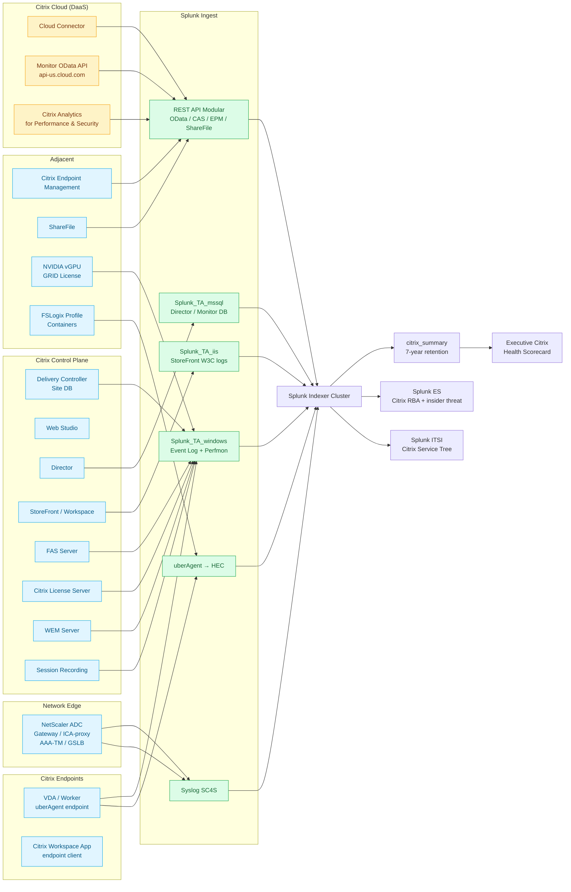

# Citrix Virtual Apps & Desktops (CVAD) Integration Guide

> Operational, security, and user-experience monitoring for the full
> Citrix delivery stack — CVAD (on-premises) and Citrix DaaS (cloud
> control plane) plus NetScaler, StoreFront, Workspace App, Director,
> WEM, FAS, Endpoint Management, ShareFile, Citrix Analytics, and the
> NVIDIA vGPU layer underneath. Covers the **79 use cases of cat 2.6**.
> Built around uberAgent UXM as the recommended endpoint sensor with
> the Template for Citrix XenDesktop 7 (TA-XD7-Broker) and Citrix
> Monitor OData API as fallbacks for environments that cannot deploy
> uberAgent everywhere.

## Table of Contents

- [Quick Start — From Zero to First Logon-Duration Dashboard](#quick-start--from-zero-to-first-logon-duration-dashboard)
- [Overview](#overview)
- [Architecture and Data Flow](#architecture-and-data-flow)
- [Prerequisites](#prerequisites)
- [Citrix Stack Components Covered](#citrix-stack-components-covered)
- [Data Sources](#data-sources)
- [Configuration](#configuration)
- [Sizing and Capacity Planning](#sizing-and-capacity-planning)
- [Compliance and Audit Evidence Pack](#compliance-and-audit-evidence-pack)
- [Crawl / Walk / Run Roadmap](#crawl--walk--run-roadmap)
- [Dashboards](#dashboards)
- [SPL Examples](#spl-examples)
- [Troubleshooting](#troubleshooting)
- [SOAR Playbooks](#soar-playbooks)
- [Cross-Product Integration](#cross-product-integration)

## Quick Start — From Zero to First Logon-Duration Dashboard

The **single most-asked question** about every Citrix environment is
"why are logons slow?" Logon duration is the universal Citrix KPI; if
you can't measure it within five minutes of any user complaint, you're
flying blind. A working logon-duration breakdown is the first deliverable
of every Citrix Splunk integration.

### Day 1: Choose your collection model

Three options, in order of preference for new deployments:

| Option | When to choose | Effort |
|---|---|---|
| **uberAgent UXM** (Splunkbase 1448) | Net-new deployment; budget for licence; best per-session breakdown | Easiest — agent install on VDAs |
| **Citrix Monitor Service OData API** (cloud or 7.x on-prem) | Cloud DaaS or no-budget on-prem; can tolerate 5-min granularity | Medium — REST polling, OData query language |
| **TA-XD7-Broker** (community Splunkbase template) | On-premises CVAD + free | Medium — relies on Citrix-supplied PowerShell |

uberAgent gives sub-second per-session logon-phase breakdown (HDX
brokering, profile load, GPO processing, drive mapping, login script
runtime). The Monitor OData API gives 5-minute aggregated session
counts plus the same logon-duration phases at lower cardinality. Pick
one as your primary; the other can be added later for cross-validation.

### Day 2: Stand up `citrix` index + summary index

```ini
# indexes.conf on cluster manager
[citrix]
homePath   = $SPLUNK_DB/citrix/db
coldPath   = $SPLUNK_DB/citrix/colddb
thawedPath = $SPLUNK_DB/citrix/thaweddb
maxDataSize = auto_high_volume
frozenTimePeriodInSecs = 31536000   # 1 year — enough for SOX & SOC2 audit
maxHotBuckets = 10

[citrix_summary]
homePath   = $SPLUNK_DB/citrix_summary/db
coldPath   = $SPLUNK_DB/citrix_summary/colddb
thawedPath = $SPLUNK_DB/citrix_summary/thaweddb
maxDataSize = auto
frozenTimePeriodInSecs = 220752000  # 7 years — multi-year capacity planning + Tier-1 audit
```

### Day 3: Install uberAgent or wire up Monitor OData

If uberAgent: deploy via SCCM / Intune / GPO to all VDAs and physical
endpoints. Configure the uberAgent endpoint registry pointing at HEC.
Within 30 minutes you'll see `uberagent:logon:duration` events flowing.

If Monitor OData API: configure REST API modular input on a Heavy
Forwarder polling the Citrix Cloud OData endpoint
(`https://api-us.cloud.com/monitorodata/Sessions`) every 5 minutes.

### Day 4: Build the logon-duration breakdown panel

```spl
index=citrix sourcetype=uberagent:logon:duration earliest=-24h
| stats avg(LogonDuration) as avg_total
        avg(BrokeringDuration) as brokering
        avg(ProfileLoadTime) as profile
        avg(GPOProcessingTime) as gpo
        avg(DriveMappingTime) as drives
        avg(LogonScriptTime) as scripts
        avg(InteractiveSessionTime) as interactive
        by DeliveryGroup
| eval avg_total = round(avg_total/1000, 2)
| sort - avg_total
```

Render as stacked bar chart, one bar per delivery group, segments per
phase. Within minutes of running you'll see exactly which phase is
slowest in each delivery group — this is the single most useful Citrix
view in production.

### Day 5–6: Add the four "must-have" surrounding panels

- Active sessions per delivery group (current count + trend)
- Failed logon reasons (from Director or Monitor OData)
- VDA registration status (machine-catalog level)
- Citrix License Server check-out trend (current capacity)

### Day 7: Stand up the executive Citrix health single value

```spl
index=citrix sourcetype=uberagent:logon:duration earliest=-1h
| stats avg(LogonDuration) as avg_logon
| eval status = case(
    avg_logon < 30000, "GREEN",
    avg_logon < 60000, "YELLOW",
    1==1, "RED")
```

You now have a working Citrix monitoring stack. Iterate from here using
the [Crawl / Walk / Run Roadmap](#crawl--walk--run-roadmap).

## Overview

### Why Citrix monitoring matters

Citrix powers the published-application and virtual-desktop tier for
roughly 100 million daily users globally. A bad Citrix experience is
the most-noticed and most-complained-about IT outcome in any large
enterprise — and the most political. Citrix outages drive C-level
escalations because they prevent every employee from working. Slow
logons drive ticket-volume avalanches that overwhelm helpdesks. Citrix
licence over-spend (paying for User/Device licences nobody is using)
typically wastes six- to seven-figure annual budgets.

Splunk earns a permanent seat in the Citrix admin's tool-belt by
answering four questions other tools can't:

1. **Per-session breakdown of logon time** across hundreds of delivery
   groups, hundreds of thousands of sessions per day, with sub-second
   resolution.
2. **Cross-stack correlation**: a slow logon caused by GPO processing
   over an Active Directory site link manifests in `cisco:nxos`,
   `MSAD:NT6:Security`, `WinEventLog:GroupPolicy`, and
   `uberagent:logon:duration` simultaneously — only Splunk joins them.
3. **Long-term capacity planning** that integrates HDX session counts,
   licence check-outs, GRID vGPU encoding load, and physical hypervisor
   capacity over multi-year retention.
4. **SOC-grade telemetry from VDAs** for ESA risk-score correlation,
   insider-threat detection, and ShareFile data exfiltration tracking.

### Why Citrix Director / Monitor Service alone isn't enough

Citrix Director is excellent for live troubleshooting of the most-recent
2 hours but suffers four limitations Splunk fixes:

| Director limitation | Splunk solution |
|---|---|
| Retention capped (7-day default in Premium, 1-day in Standard) | Index forever; rollup to `citrix_summary` for 7-year trends |
| One Director per Site; no cross-Site joining | Single Splunk index across all CVAD Sites + DaaS tenants |
| No correlation with non-Citrix telemetry | Join with AD, network, Storage, FSLogix profile, GPU |
| No ML / risk scoring (without Citrix Analytics) | MLTK + ESA + custom risk objects |

### Domains covered

This guide spans **79 use cases** in subcategory 2.6:

- HDX session performance: brokering, profile load, GPO processing,
  drive mapping, logon script runtime, interactive session quality
- Application performance: per-app launch time, per-app crash rate,
  per-app session-count, app-package version drift
- Storefront and Workspace: authentication funnel, application
  enumeration latency, MFA challenge rate, user choice attribution
- NetScaler ICA-proxy / Gateway: VPN-tunnel health, AAA-TM events,
  AppFlow per-application metrics, GSLB site failover
- VDA registration: machine-catalog drift, base-image sprawl, snapshot
  age, MCS / PVS write-cache health
- Profile management: FSLogix container mount time, UPM stream-out
  latency, profile size growth, profile container corruption
- Citrix Analytics for Performance + Security: Risk Indicators (RI),
  Endpoint Security Analytics (ESA), session anomaly correlation
- WEM: agent online status, environment policy enforcement, CPU /
  memory trim aggressiveness, transformer kiosk mode events
- Citrix License Server: check-out trends, licence threshold alerts
- Federated Authentication Service: smart-card cert request rate,
  failed FAS challenge correlation
- Endpoint Management (XenMobile): MDM/MAM device compliance, app
  deployment status, jailbreak detection
- ShareFile: Folder/document audit trail, anomalous bulk download
- vGPU: NVIDIA GRID licence check-out, vGPU encoder load, frame-rate
  drop correlation with HDX session quality

### What "good" looks like

| KPI | Healthy target | Source |
|---|---|---|
| Average logon duration | < 30 sec | uberAgent / Monitor OData |
| 95th percentile logon | < 60 sec | uberAgent |
| Failed-logon rate | < 1% | Monitor OData / Director |
| VDA registration | 100% per delivery group | TA-XD7-Broker |
| Licence headroom | ≥ 15% | Citrix License Server |
| FSLogix mount time | < 5 sec | uberAgent |
| Citrix Analytics RI score | 0 critical, < 10 high | Citrix Analytics |

## Architecture and Data Flow



### Core principles

1. **Pick one logon-duration source of truth**, not two. uberAgent and
   Monitor OData both produce logon-duration metrics; if you display
   both side by side in dashboards your operators will spend 90% of
   their time arguing about which is correct. Pick uberAgent for new
   deployments, Monitor OData for cloud-only DaaS, TA-XD7-Broker for
   no-budget on-prem CVAD.
2. **NetScaler syslog through SC4S, NetScaler AppFlow through HEC.**
   Don't mix the two transports — AppFlow is IPFIX-formatted and goes
   directly to a Splunk-side IPFIX collector or HEC; syslog goes to
   SC4S and into the `netscaler` index.
3. **Director SQL Server is read-only.** Never query the Director SQL
   Server with Splunk DB Connect during business hours unless the
   Splunk SQL service account has the *DB View* role only. Director
   uses the same database for live troubleshooting, and a heavy
   Splunk query can stall the Director console for minutes.
4. **Monitor OData API has rate limits.** 240 requests / 60 sec / tenant
   for Citrix DaaS. Plan REST polling intervals accordingly: every
   60-second poll consumes 4 of those 240 if you query Sessions,
   Connections, Failures, and SessionMetrics in parallel.
5. **uberAgent license tiering matters.** uberAgent UXM Free is OK for
   < 30 endpoints; UXM Standard for production; UXM Enterprise for
   security-incident-replay (ESA) features. Splunk side is licence-
   free.

## Prerequisites

### Pre-deployment checklist

- [ ] **Citrix architecture inventory** — number of Sites, Delivery
  Controllers, Cloud Connectors (if DaaS), StoreFront servers,
  NetScaler appliances, Citrix License Servers, FAS servers, WEM
  brokers.
- [ ] **VDA OS distribution** — Windows Server (2019/2022/2025) for
  RDS multi-session vs Windows 10/11 for single-session VDI; Linux
  VDA where present.
- [ ] **Hypervisor underlay** — VMware vSphere / Microsoft Hyper-V /
  Citrix Hypervisor (XenServer) / Nutanix AHV / Azure / AWS Nitro.
  This dictates which guide you join with: `vmware-vsphere.md` or
  `hypervisors-non-vmware.md`.
- [ ] **Profile-management strategy** — FSLogix Profile Container is
  now Microsoft-recommended; Citrix UPM is legacy but still supported.
- [ ] **NetScaler version** — minimum 13.1 for Splunk-friendly syslog
  format; 14.x for AppFlow IPFIX with v6 templates.
- [ ] **Citrix Cloud presence** (or not) — DaaS, Workspace, Endpoint
  Management, Analytics tenants must be enumerated; each one needs
  separate API credentials.
- [ ] **AD authentication chain** — Citrix Workspace SSO via Entra ID,
  Okta, Ping, or AD-only — feeds the Identity guide
  (`identity-platforms-pam-sso.md`).
- [ ] **GRID licence server** if vGPU is in use; GRID v15+ has gRPC
  metrics; older versions have Windows performance counters only.
- [ ] **Splunk indexes pre-created**: `citrix`, `citrix_summary`,
  `citrix_analytics`, `netscaler`, `epm`, `sharefile`, plus `wineventlog`
  for Windows Event Logs and `perfmon_windows` for performance counters.

### Splunk components used

- **Splunk Enterprise / Cloud** — indexing, searching, dashboards
- **Splunk ITSI** — Citrix service tree (Site → DDC → Delivery Group →
  Machine Catalog) with KPIs for logon, registration, licence, NetScaler
- **Splunk Enterprise Security** — RBA risk objects for ESA Risk
  Indicators, ShareFile exfiltration, FAS smart-card anomalies
- **Splunk Observability Cloud<sup class="ref">[<a href="#ref-9">9</a>]</sup>** (optional) — RUM correlation for
  Workspace App browser sessions
- **MLTK** — peer-group anomaly detection on logon duration; profile-
  size forecasting

## Citrix Stack Components Covered

| Component | Splunk source | Primary UC family |
|---|---|---|
| Delivery Controller (DDC) | TA-XD7-Broker, Monitor OData | UC-2.6.4, UC-2.6.13 |
| StoreFront / Workspace | IIS W3C logs, REST API | UC-2.6.10, UC-2.6.31 |
| NetScaler ADC / Gateway | syslog, AppFlow | UC-2.6.14, UC-2.6.30, UC-2.6.34 |
| FAS | Windows Event Log | UC-2.6.20 |
| WEM | WEM agent log, WEM server log | UC-2.6.36, UC-2.6.51 |
| Citrix License Server | UF on lic server | UC-2.6.11 |
| Citrix Session Recording | UF on SR server | UC-2.6.15 |
| Citrix Director | SQL DB Connect (read-only) | UC-2.6.5, UC-2.6.7 |
| Citrix Analytics for Perf | REST API | UC-2.6.32, UC-2.6.49 |
| Citrix Analytics for Sec | REST API | UC-2.6.27, UC-2.6.59 |
| Endpoint Management | REST API | UC-2.6.65 |
| ShareFile | REST API + audit | UC-2.6.74 |
| FSLogix Profile Container | uberAgent | UC-2.6.40, UC-2.6.66 |
| NVIDIA vGPU | Windows Perfmon, GRID API | UC-2.6.55, UC-2.6.46 |

## Data Sources

### Source 1 — uberAgent UXM (recommended)

Endpoint sensor for VDAs and physical Workspace App clients. Collects
per-process performance, browser performance (Edge / Chrome / Firefox /
IE / Workspace browser), per-session HDX metrics, logon-duration phase
breakdown, and (UXM Enterprise) Endpoint Security Analytics signals.

Key sourcetypes:

| Sourcetype | Volume per session | What you get |
|---|---|---|
| `uberagent:application:perf` | 30 events / hr | Per-process CPU, memory, IOPS, network |
| `uberagent:browser:perf` | 50 events / session | Browser tab perf, render time, JS errors |
| `uberagent:logon:duration` | 1 per logon | Phase-level breakdown |
| `uberagent:gpu:perf` | 10 events / hr | GPU utilisation per process |
| `uberagent:network:perf` | 50 events / hr | Per-process / per-session network |
| `uberagent:user:experience` | 1 per minute | Aggregate UX score |

uberAgent → HEC, JSON-formatted. Plan ~1 GB / 1,000 sessions / day.

### Source 2 — Citrix Monitor Service OData API

For Citrix Cloud DaaS or CVAD 7.x where uberAgent isn't deployed.
Polled via REST API modular input from a Heavy Forwarder.

| Endpoint | Sourcetype | Useful for |
|---|---|---|
| `/Sessions` | `citrix:monitor:odata:session` | Active session inventory |
| `/Connections` | `citrix:monitor:odata:connection` | HDX connection events |
| `/SessionMetrics` | `citrix:monitor:odata:session_metric` | Logon duration phases |
| `/MachineMetric` | `citrix:monitor:odata:machine_metric` | VDA CPU/memory/disk |
| `/Failures` | `citrix:monitor:odata:failure` | Failed logon / launch |

### Source 3 — TA-XD7-Broker (community template)

PowerShell-based Citrix-specific KPIs from on-premises CVAD Site
Database. Polled hourly. Useful for: VDA registration state, machine-
catalog inventory, delivery-group capacity headroom.

### Source 4 — NetScaler syslog + AppFlow

Syslog via SC4S; AppFlow (IPFIX-formatted) via NetFlow TA on Heavy
Forwarder. Key sourcetypes:

| Sourcetype | Source | What you get |
|---|---|---|
| `netscaler:syslog` | UDP 514 / TCP 6514 | System events, AAA-TM events |
| `netscaler:appflow` | IPFIX 4739 | Per-app per-user transaction metrics |
| `netscaler:audit` | syslog | Configuration change audit trail |
| `netscaler:gateway:vpn` | syslog | ICA-proxy / VPN session events |

### Source 5 — StoreFront W3C IIS logs

StoreFront sits on IIS — the W3C extended logs reveal authentication
funnel, application enumeration latency, user choice attribution.
Splunk Add-on for Microsoft IIS handles the parse.

### Source 6 — Citrix Analytics REST API

Citrix Analytics for Performance and Security expose REST endpoints for
sessions, anomalies, risk indicators. Polled by REST API modular input.
Best paired with the Citrix Analytics Add-on for Splunk (Splunkbase 6280).

### Source 7 — ShareFile audit trail

ShareFile (now Citrix Content Collaboration) exposes a REST API for
account audit, folder activity, and login history. Polled into
`sharefile:audit` and `sharefile:user:activity` sourcetypes.

### Source 8 — Citrix Endpoint Management REST API

CEM (formerly XenMobile) exposes REST endpoints for device enrollment,
policy compliance, app deployment status, jailbreak detection.

## Configuration

### Step 1 — uberAgent endpoint installation

Deploy via SCCM, Intune, GPO, or Citrix App Layering. The agent
configuration registry key:

```
HKLM\SOFTWARE\vast limits\uberAgent
  Receiver               = "https://hec.splunk.example.com:443/services/collector"
  ReceiverProtocol       = "Splunk HEC"
  ReceiverConfiguration  = "AuthToken=<HEC_TOKEN>; Index=citrix"
  Configuration          = "uberAgent.conf"
```

Pin `uberAgent.conf` in `C:\ProgramData\vast limits\uberAgent\Config\`
under SCM with the standard Citrix profile.

Splunk side, create the HEC token:

```ini
# inputs.conf on HEC indexer/HEC tier
[http://uberagent]
disabled = 0
token = <UUID>
indexes = citrix
sourcetype = uberagent:auto
useACK = 1
```

### Step 2 — Citrix Monitor OData API REST input

```ini
# inputs.conf on Heavy Forwarder
[REST://citrix_monitor_sessions]
disabled = 0
endpoint = https://api-us.cloud.com/monitorodata/Sessions?$top=100&$orderby=StartDate desc
auth_type = oauth_client_credentials
token_endpoint = https://api-us.cloud.com/cctrustoauth2/<customer_id>/tokens/clients
client_id = <CITRIX_CLOUD_API_CLIENT_ID>
client_secret = <CITRIX_CLOUD_API_CLIENT_SECRET>
polling_interval = 300
sourcetype = citrix:monitor:odata:session
index = citrix

[REST://citrix_monitor_session_metrics]
disabled = 0
endpoint = https://api-us.cloud.com/monitorodata/SessionMetrics?$top=100&$orderby=CollectedDate desc
auth_type = oauth_client_credentials
client_id = <CITRIX_CLOUD_API_CLIENT_ID>
client_secret = <CITRIX_CLOUD_API_CLIENT_SECRET>
polling_interval = 300
sourcetype = citrix:monitor:odata:session_metric
index = citrix

[REST://citrix_monitor_failures]
disabled = 0
endpoint = https://api-us.cloud.com/monitorodata/Failures?$top=200&$orderby=FailureDate desc
auth_type = oauth_client_credentials
client_id = <CITRIX_CLOUD_API_CLIENT_ID>
client_secret = <CITRIX_CLOUD_API_CLIENT_SECRET>
polling_interval = 300
sourcetype = citrix:monitor:odata:failure
index = citrix
```

Store `client_secret` in Splunk encrypted credential store (`/etc/passwd`
JSON via `splunk encrypt` or via Splunk Cloud's secrets-manager
integration). Never check secrets into version control.

### Step 3 — NetScaler syslog via SC4S

Direct NetScaler at SC4S TCP 6514 (TLS) or UDP 514 (plaintext, intra-DC
only):

```
add audit syslogPolicy SPLUNK_SYSLOG_POLICY ns_true SPLUNK_SYSLOG_ACTION
add audit syslogAction SPLUNK_SYSLOG_ACTION sc4s.splunk.example.com -serverPort 6514 -loglevel ALL -logFacility LOCAL6 -tcp ALL -tcpProfileName nstcp_default_tcp_lan
bind audit syslogGlobal -policyName SPLUNK_SYSLOG_POLICY -priority 100
```

SC4S detects NetScaler automatically via the syslog header and routes
to `netscaler` index with `netscaler:syslog` sourcetype.

### Step 4 — NetScaler AppFlow

AppFlow is IPFIX-formatted; collect on a NetFlow TA Heavy Forwarder:

```
enable feature appflow
set appflow param -httpUrl ENABLED -httpHost ENABLED -httpUserAgent ENABLED -httpReferer ENABLED -httpResForwLink ENABLED
add appflow collector splunk_collector -IPAddress 10.0.20.20 -port 4739
add appflow action splunk_action -collectors splunk_collector
add appflow policy splunk_policy true splunk_action
bind appflow global splunk_policy 100 END -type REQ_DEFAULT
```

### Step 5 — Director SQL via DB Connect (read-only, optional)

Service-account permissions:

```sql
USE [CitrixMonitorDB]
GO
CREATE USER [splunk_director_ro] FOR LOGIN [splunk_director_ro]
GRANT SELECT ON [MonitorData].[Session] TO [splunk_director_ro]
GRANT SELECT ON [MonitorData].[Connection] TO [splunk_director_ro]
GRANT SELECT ON [MonitorData].[SessionMetric] TO [splunk_director_ro]
GO
```

Splunk DB Connect inputs poll every 5 minutes and tail by max(session
key). Schedule outside business hours where possible.

### Step 6 — Citrix Analytics for Performance & Security

REST API client credentials per tenant. Citrix Cloud Web Studio →
Identity and Access Management → API Access:

```ini
[REST://citrix_analytics_perf]
disabled = 0
endpoint = https://api-us.cloud.com/casanalyticsapi/v1/sessions
auth_type = oauth_client_credentials
client_id = <CAS_CLIENT_ID>
client_secret = <CAS_CLIENT_SECRET>
polling_interval = 600
sourcetype = citrix:cas:performance
index = citrix_analytics

[REST://citrix_analytics_sec]
disabled = 0
endpoint = https://api-us.cloud.com/casanalyticsapi/v1/risk-indicators
auth_type = oauth_client_credentials
client_id = <CAS_CLIENT_ID>
client_secret = <CAS_CLIENT_SECRET>
polling_interval = 300
sourcetype = citrix:risk:indicator
index = citrix_analytics
```

### Step 7 — ShareFile audit + activity

ShareFile API key from Personal Settings → API Tokens. REST input
polling `https://<account>.sharefile.com/sf/v3/AuditAccess` every
15 minutes:

```ini
[REST://sharefile_audit]
endpoint = https://<account>.sharefile.com/sf/v3/AuditAccess
auth_type = oauth2
oauth2_token_endpoint = https://secure.sharefile.com/oauth/token
client_id = <SHAREFILE_CLIENT_ID>
client_secret = <SHAREFILE_CLIENT_SECRET>
polling_interval = 900
sourcetype = sharefile:audit
index = sharefile
```

## Sizing and Capacity Planning

| Source | Per-1000-session daily volume | Per-1000-session indexer storage / month |
|---|---|---|
| uberAgent (Standard) | ~1 GB | ~30 GB |
| uberAgent (Enterprise w/ ESA) | ~3 GB | ~90 GB |
| Monitor OData API | ~100 MB | ~3 GB |
| TA-XD7-Broker | ~50 MB | ~1.5 GB |
| NetScaler syslog | ~500 MB / NS | ~15 GB |
| NetScaler AppFlow | 5–50 GB / NS | 150–1500 GB |
| StoreFront IIS | ~100 MB | ~3 GB |
| Director SQL | ~50 MB | ~1.5 GB |
| Citrix Analytics (perf + sec) | ~200 MB | ~6 GB |
| ShareFile audit | ~50 MB | ~1.5 GB |
| EPM REST | ~100 MB / 1k devices | ~3 GB |

For a production deployment of 5,000 concurrent sessions across two
NetScaler HA pairs with vGPU, full uberAgent Enterprise: budget
**~80 GB/day** of indexed Citrix data.

## Compliance and Audit Evidence Pack

### SOC 2 Type II

Trust Service Criteria covered by Citrix monitoring:

| TSC Common Criteria | UC | Evidence |
|---|---|---|
| CC6.1 Logical access | UC-2.6.10, UC-2.6.27 | StoreFront authentication, ESA |
| CC6.2 New / modified user | UC-2.6.42 | Citrix configuration audit trail |
| CC6.6 Logical / physical | UC-2.6.20 | FAS smart-card chain |
| CC6.7 Restrict access | UC-2.6.59 | Risk Indicator monitoring |
| CC7.2 Anomalies | UC-2.6.27 | ESA threat detection |
| CC7.3 Detection / response | UC-2.6.27, UC-2.6.59 | RI alerting |

### HIPAA §164.312 Technical Safeguards

For healthcare deployments delivering PHI through Citrix:

- §164.312(a)(1) Access Control → UC-2.6.20 (FAS smart-card)
- §164.312(b) Audit Controls → UC-2.6.42 (config audit), UC-2.6.74
  (ShareFile audit)
- §164.312(c)(1) Integrity → UC-2.6.15 (Session Recording)
- §164.312(d) Person/entity Authn → UC-2.6.10 (StoreFront)
- §164.312(e)(1) Transmission Security → ICA encryption / TLS 1.2+
  enforcement audit (ESA)

### PCI DSS 4.0

For Citrix used as a CDE access path:

- §1 (Network Segmentation) → UC-2.6.14 (NetScaler zoning)
- §7 (Restrict Access) → UC-2.6.20 (FAS), UC-2.6.42 (audit)
- §8 (Authentication) → UC-2.6.10, UC-2.6.20
- §10 (Logging / Monitoring) → all 79 UCs feed PCI evidence
- §11 (Security Testing) → UC-2.6.27, UC-2.6.59 (Citrix Analytics)

### SOX 404 ITGC

Standard ITGC categories for Citrix-delivered financial systems:

- Access management → UC-2.6.10, UC-2.6.20, UC-2.6.42
- Change management → UC-2.6.42 (Citrix config audit)
- Operations → UC-2.6.4 (delivery group health), UC-2.6.13
  (registration), UC-2.6.7 (logon trends)

### GDPR Art. 32

For EU operators delivering personal-data workloads through Citrix:

- "Pseudonymisation and encryption" → ICA encryption + TLS 1.2+
- "Confidentiality, integrity, availability" → UC-2.6.15 (Session
  Recording for confidentiality breach forensics), UC-2.6.5/.7
  (availability)
- "Regular testing" → UC-2.6.27, UC-2.6.59 (CAS Risk Indicator)

### NIS2 Annex II

For EU operators of essential services using Citrix in scope:

- "Risk-management" → UC-2.6.27, UC-2.6.42, UC-2.6.59
- "Network security" → UC-2.6.14, UC-2.6.34 (NetScaler), UC-2.6.30
- "Continuity" → UC-2.6.4, UC-2.6.13, UC-2.6.30

### DORA Art. 8 ICT Risk Management

Financial services deployments — UC-2.6.4 / UC-2.6.13 / UC-2.6.30
provide the required ICT-services availability evidence; UC-2.6.42
provides change-management ICT-asset trail; UC-2.6.59 provides ICT-
incident-related risk-indicator monitoring.

### CIS Citrix Benchmark

UC-2.6.42 (configuration change audit) plus UC-2.6.30 (NetScaler
hardening compliance) jointly cover the CIS Citrix Benchmark v1.x
audit set.

## Crawl / Walk / Run Roadmap

### Crawl tier (12 UCs — week 1–4)

| UC | Title |
|---|---|
| 2.6.1 | Citrix Session Logon Duration Breakdown |
| 2.6.2 | Active Sessions per Delivery Group |
| 2.6.4 | VDA Registration Status |
| 2.6.5 | Failed Logon Reasons |
| 2.6.7 | Concurrent Session Trending |
| 2.6.10 | Citrix StoreFront Authentication and Enumeration Health |
| 2.6.11 | Citrix License Server Utilization and Compliance |
| 2.6.13 | Machine Catalog Health |
| 2.6.14 | NetScaler ICA-Proxy Session Health |
| 2.6.16 | HDX EDT vs TCP Mode Tracking |
| 2.6.30 | NetScaler GSLB Site Failover |
| 2.6.40 | FSLogix Profile Container Mount Time |

### Walk tier (41 UCs — month 2–3)

Highlights:
- Per-application launch time and crash rate
- Per-session HDX quality (RTT, frame loss, audio jitter)
- Citrix WEM agent health
- NetScaler AAA-TM events
- NetScaler AppFlow per-app metrics
- vGPU encoder load tracking
- FAS smart-card chain monitoring
- Citrix Optimization for Microsoft Teams (HDX MTOP) call quality
- Profile-size growth trending and forecasting
- Endpoint Management device compliance
- ShareFile bulk-download anomaly detection

### Run tier (26 UCs — month 4+)

Highlights:
- Citrix Analytics for Performance baseline + anomaly RBA
- Citrix Analytics for Security Risk Indicator → ES correlation
- Cross-stack correlation (network ↔ AD ↔ profile ↔ Citrix logon)
- Per-user UX score forecasting (MLTK)
- Capacity planning forecast for delivery-group expansion (MLTK)
- Insider threat: Citrix Risk Indicator + ShareFile + Workspace App
  composite RBA risk objects
- HIPAA<sup class="ref">[<a href="#ref-12">12</a>]</sup> / PCI / SOX<sup class="ref">[<a href="#ref-10">10</a>]</sup> evidence-pack auto-generation
- Automated remediation via SOAR for VDA registration failures,
  NetScaler health flapping, profile-container corruption

## Dashboards

| Dashboard | Audience | Refresh |
|---|---|---|
| Citrix Executive Health | CIO / IT Ops Director | 5 min |
| Logon Duration Breakdown | Citrix Engineer | 1 min |
| Per-Delivery-Group SLA | Service Manager | 5 min |
| NetScaler Operations | NetSec / Network | 1 min |
| Citrix Analytics RI / ESA | SOC | 1 min |
| FSLogix Profile Container | Citrix Engineer | 5 min |
| vGPU Capacity & Licence | Citrix Engineer / Capacity | 15 min |
| ShareFile Activity Audit | Compliance / SOC | 15 min |
| Citrix License Server | Capacity / Procurement | 1 hour |

## SPL Examples

### Per-phase logon duration with delta-from-baseline alerting

```spl
index=citrix sourcetype=uberagent:logon:duration earliest=-7d
| stats avg(BrokeringDuration) as brk avg(ProfileLoadTime) as prf
        avg(GPOProcessingTime) as gpo avg(LogonScriptTime) as scr
        by DeliveryGroup
| eval baseline_brk=brk, baseline_prf=prf, baseline_gpo=gpo, baseline_scr=scr
| outputlookup append=false citrix_logon_baseline.csv
```

Then alert on deviation:

```spl
index=citrix sourcetype=uberagent:logon:duration earliest=-1h
| stats avg(BrokeringDuration) as brk avg(ProfileLoadTime) as prf
        avg(GPOProcessingTime) as gpo avg(LogonScriptTime) as scr
        by DeliveryGroup
| lookup citrix_logon_baseline.csv DeliveryGroup OUTPUT baseline_brk baseline_prf baseline_gpo baseline_scr
| eval brk_delta_pct = round(((brk - baseline_brk) / baseline_brk) * 100, 2)
| eval prf_delta_pct = round(((prf - baseline_prf) / baseline_prf) * 100, 2)
| where brk_delta_pct > 50 OR prf_delta_pct > 50
```

### NetScaler ICA-proxy session leakage detection

```spl
index=netscaler sourcetype=netscaler:syslog ICAPROXY_SESSION_END
| eval session_duration = end_time - start_time
| where session_duration > 86400
| stats count by user, src_ip, end_reason
| where end_reason="TIMEOUT" OR end_reason="UNKNOWN"
| sort -count
```

### vGPU encoder saturation correlation

```spl
index=perfmon_windows sourcetype=Perfmon:Citrix counter="GPU Encoder Utilization"
| stats avg(value) as avg_encoder_util by host, _time
| where avg_encoder_util > 80
| join host
    [search index=citrix sourcetype=uberagent:user:experience earliest=-1h
     | stats avg(UXScore) as avg_ux by host]
| where avg_ux < 70
| table host, avg_encoder_util, avg_ux
```

### Citrix License Server burndown forecast

```spl
index=citrix sourcetype=citrix:license:checkout earliest=-30d
| timechart span=1h max(licenses_in_use) as licenses_used
| eval licenses_avail = 5000   ` total purchased `
| predict licenses_used algorithm=LLP future_timespan=720
| eval forecast_breach = if(prediction(licenses_used) > licenses_avail, "BREACH", "OK")
```

## Troubleshooting

| Symptom | Likely cause | Where to look |
|---|---|---|
| OData REST input returns 401 | Token expired / wrong client_id | Re-mint Citrix Cloud API client; check audit log |
| OData REST input throttled | > 240 req/min | Reduce polling frequency or split queries |
| uberAgent logs not arriving | HEC token wrong; cert mismatch | Check `uberAgent_Helper.log` on agent |
| TA-XD7-Broker silent | PowerShell ExecutionPolicy too strict | `Set-ExecutionPolicy RemoteSigned` |
| NetScaler syslog truncated | UDP 514 fragmentation | Switch to TCP 6514 |
| Director SQL queries timing out | Query too heavy; index missing | Add SQL Server query plan; restrict timewindow |
| Logon-duration breakdown shows 0ms | uberAgent missing required permissions | Ensure SYSTEM context; check uberAgent service |
| FSLogix mount time spikes | Storage IOPS contention | Cross-correlate with `vmware-vsphere.md` storage UCs |
| AppFlow collector dropping | UDP 4739 buffer too small | `sysctl -w net.core.rmem_max=33554432` |

## SOAR Playbooks

### Playbook 1 — VDA registration failure auto-recovery

```yaml
playbook: citrix_vda_reregister
triggers:
  - notable_event: "VDA Failed Registration"
phases:
  identify:
    - splunk_search:
        query: "index=citrix sourcetype=citrix:director:session host=${notable.host}"
  contain:
    - powershell:
        target: ${notable.host}
        cmd: |
          Restart-Service -Name "BrokerAgent"
          Start-Sleep -Seconds 30
          Get-BrokerMachine -DNSName "${notable.host}" | Reset-BrokerMachine
  notify:
    - servicenow_create_ticket:
        category: "Citrix VDA"
        severity: 3
```

### Playbook 2 — Citrix RI escalation to ES notable + SOAR

```yaml
playbook: citrix_ri_escalation
triggers:
  - sourcetype: citrix:risk:indicator
  - condition: "severity=high OR severity=critical"
phases:
  enrich:
    - lookup_user_in_ad
    - get_recent_session_history
    - check_sharefile_recent_downloads
  contain:
    - if "data_exfiltration" in indicator_categories:
        netskope_quarantine_user: ${user}
        sharefile_revoke_active_links: ${user}
  notify:
    - splunk_es_create_notable
    - pagerduty_alert: "SOC IR On-call"
```

### Playbook 3 — NetScaler AAA-TM brute-force containment

```yaml
playbook: netscaler_aaatm_bruteforce
triggers:
  - sourcetype: netscaler:syslog
  - rule: "(Failed login attempt) AND (count > 50 in 5min by client_ip)"
phases:
  contain:
    - netscaler_add_blacklist_entry:
        ip: ${client_ip}
        ttl: 3600
  enrich:
    - threat_intel_lookup_ip: ${client_ip}
  notify:
    - splunk_es_create_notable
```

## Cross-Product Integration

| Other guide | Relationship |
|---|---|
| `active-directory-entra-id.md` | Citrix authentication chain — auth tokens, FAS smart-card, Workspace SSO |
| `identity-platforms-pam-sso.md` | Okta / Entra / Ping SSO into Citrix Workspace |
| `vmware-vsphere.md` | Underlying hypervisor for VDA hosts on VMware |
| `hypervisors-non-vmware.md` | VDA hosts on Hyper-V, Nutanix AHV, XenServer |
| `web-servers.md` | StoreFront IIS health (cat 8.1) |
| `firewalls.md` | NetScaler-adjacent perimeter firewalls |
| `network-flow.md` | NetScaler AppFlow IPFIX collection |
| `siem-soar.md` | Citrix Risk Indicators → ES RBA |
| `splunk-itsi.md` | Citrix service tree definition |
| `regulatory-compliance-master.md` | SOX, HIPAA, PCI, SOC 2 evidence packs |

---

**Document maintenance.** Reviewed quarterly against Citrix Tech Zone
release notes, NetScaler patch advisories, and Splunkbase add-on
releases. Last verified against:
- Splunk Enterprise 9.4
- uberAgent UXM 7.0
- Citrix DaaS (Cloud) — current
- CVAD 2402 LTSR / 2503 CR
- NetScaler 13.1 / 14.1
- Citrix Endpoint Management 23.x
- ShareFile API v3
- FSLogix 2305

For corrections or additions, file an issue with the `cat-2.6` label.

---

<!-- BEGIN-AUTOGENERATED-SOURCES -->

## References

*Auto-generated by `scripts/generate_doc_references.py` from `data/source-references.json` and `data/source-mappings.json`. Edit those files (or the document body) to change citations; this footer is rewritten on every run.*

### Primary sources

<a id="ref-1"></a>**[1]** Cloud Software Group. (2026). *Citrix Virtual Apps and Desktops Documentation*. Cloud Software Group, Inc. Retrieved May 11, 2026, from https://docs.citrix.com/en-us/citrix-virtual-apps-desktops

### Supporting sources

<a id="ref-2"></a>**[2]** European Parliament and Council of the European Union. (2022, December). *Directive (EU) 2022/2555 — NIS2 Directive on cybersecurity*. Official Journal of the European Union, L 333. ELI: dir/2022/2555. https://eur-lex.europa.eu/eli/dir/2022/2555/oj

<a id="ref-3"></a>**[3]** European Parliament and Council of the European Union. (2016, April). *Regulation (EU) 2016/679 — General Data Protection Regulation*. Official Journal of the European Union, L 119. ELI: reg/2016/679. https://eur-lex.europa.eu/eli/reg/2016/679/oj

<a id="ref-4"></a>**[4]** European Parliament and Council of the European Union. (2022, December). *Regulation (EU) 2022/2554 — Digital Operational Resilience Act (DORA)*. Official Journal of the European Union, L 333. ELI: reg/2022/2554. https://eur-lex.europa.eu/eli/reg/2022/2554/oj

<a id="ref-5"></a>**[5]** Payment Card Industry Security Standards Council. (2018). *Payment Card Industry Data Security Standard v3.2.1* (v3.2.1). PCI SSC. https://www.pcisecuritystandards.org/document_library/?category=pcidss

<a id="ref-6"></a>**[6]** Payment Card Industry Security Standards Council. (2022). *Payment Card Industry Data Security Standard v4.0* (v4.0). PCI SSC. https://www.pcisecuritystandards.org/document_library/?category=pcidss

<a id="ref-7"></a>**[7]** Splunk Inc. (2026). *Splunk Common Information Model Add-on Manual*. Splunk LLC, a Cisco company. Retrieved May 11, 2026, from https://docs.splunk.com/Documentation/CIM

<a id="ref-8"></a>**[8]** Splunk Inc. (2026). *Splunk Infrastructure Monitoring Documentation*. Splunk LLC, a Cisco company. Retrieved May 11, 2026, from https://docs.splunk.com/observability/en/infrastructure/intro-to-infrastructure.html

<a id="ref-9"></a>**[9]** Splunk Inc. (2026). *Splunk Observability Cloud Documentation*. Splunk LLC, a Cisco company. Retrieved May 11, 2026, from https://docs.splunk.com/observability/en/

<a id="ref-10"></a>**[10]** U.S. Congress. (2002). *Sarbanes-Oxley Act of 2002 — Public Company Accounting Reform and Investor Protection Act*. U.S. Government. Pub. L. 107–204. https://www.sec.gov/about/laws/soa2002.pdf

<a id="ref-11"></a>**[11]** U.S. Department of Health & Human Services. (2002). *HIPAA Privacy Rule (45 CFR Parts 160 and 164, Subparts A and E)*. Office for Civil Rights, HHS. 45 CFR 160, 164. https://www.hhs.gov/hipaa/for-professionals/privacy/index.html

<a id="ref-12"></a>**[12]** U.S. Department of Health & Human Services. (2013). *HIPAA Security Rule (45 CFR Parts 160 and 164, Subparts A and C)*. Office for Civil Rights, HHS. 45 CFR 160, 164. https://www.hhs.gov/hipaa/for-professionals/security/index.html

<details>
<summary>Additional online sources cited in the document body (5)</summary>

<a id="ref-13"></a>**[13]** splunkbase.splunk.com. *Splunkbase app #1448*. Retrieved May 11, 2026, from https://splunkbase.splunk.com/app/1448

<a id="ref-14"></a>**[14]** splunkbase.splunk.com. *Splunkbase app #6280*. Retrieved May 11, 2026, from https://splunkbase.splunk.com/app/6280

<a id="ref-15"></a>**[15]** splunkbase.splunk.com. *Splunkbase app #742*. Retrieved May 11, 2026, from https://splunkbase.splunk.com/app/742

<a id="ref-16"></a>**[16]** splunkbase.splunk.com. *Splunkbase app #2790*. Retrieved May 11, 2026, from https://splunkbase.splunk.com/app/2790

<a id="ref-17"></a>**[17]** splunkbase.splunk.com. *Splunkbase app #3215*. Retrieved May 11, 2026, from https://splunkbase.splunk.com/app/3215

</details>

<!-- END-AUTOGENERATED-SOURCES -->
