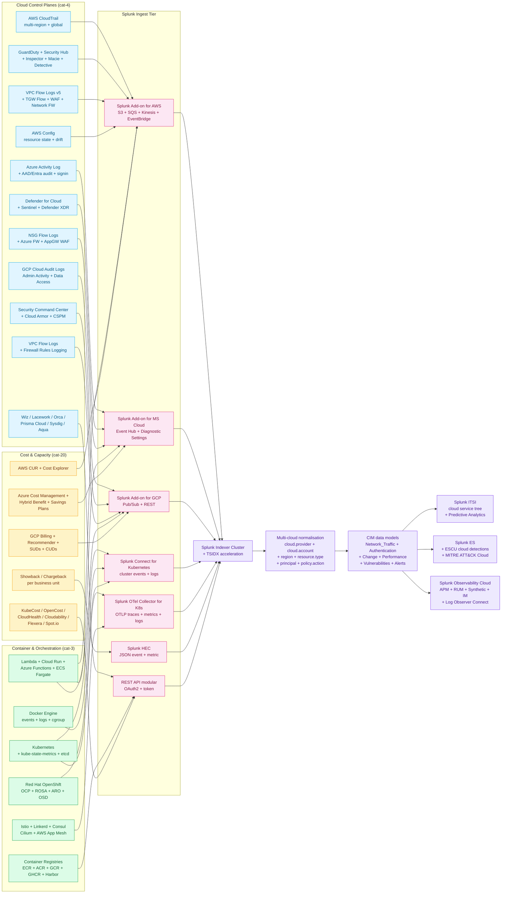

# Cloud & Containers Monitoring Domain Master Guide

> Splunk's value in cloud & container monitoring comes from
> **synthesising three independent operational planes — control-plane
> identity, workload saturation, and dollar attribution — into one
> searchable timeline**. Kubernetes saturation rarely explains a
> quarter's invoice spike unless correlated with IAM changes that
> enabled oversized node pools or forgotten sandbox clusters left
> running on premium SKUs. Splunk becomes the synthesis layer where
> CloudTrail parity, kube-state timelines, and CUR-backed dollar
> traces land together. This domain guide bridges three catalogue
> pillars — Containers & Orchestration (cat 3, 129 UCs), Cloud
> Infrastructure (cat 4, 227 UCs), and Cost & Capacity Management
> (cat 20, 77 UCs) — into one sequenced operational programme. It is
> the **front door** for cloud architects, platform engineering
> leads, FinOps practitioners, SREs, and cloud security architects.

## Table of Contents

- [Audience and Use](#audience-and-use)
- [Quick Start — From Zero to Cloud-Native Coverage in 30 Days](#quick-start--from-zero-to-cloud-native-coverage-in-30-days)
- [Architecture and Data Flow](#architecture-and-data-flow)
- [Domain 1 — Containers & Orchestration (cat 3, 129 UCs)](#domain-1--containers--orchestration-cat-3-129-ucs)
- [Domain 2 — Cloud Infrastructure (cat 4, 227 UCs)](#domain-2--cloud-infrastructure-cat-4-227-ucs)
- [Domain 3 — Cost & Capacity Management (cat 20, 77 UCs)](#domain-3--cost--capacity-management-cat-20-77-ucs)
- [Multi-Cloud Normalisation Anchor](#multi-cloud-normalisation-anchor)
- [Well-Architected Frameworks Crosswalk](#well-architected-frameworks-crosswalk)
- [Crawl / Walk / Run Roadmap (21 / 60 / 50 UCs)](#crawl--walk--run-roadmap-21--60--50-ucs)
- [Sizing and Capacity Planning](#sizing-and-capacity-planning)
- [Compliance and Audit Evidence Pack](#compliance-and-audit-evidence-pack)
- [Reference Dashboards](#reference-dashboards)
- [SPL Examples](#spl-examples)
- [Troubleshooting](#troubleshooting)
- [SOAR Playbook Catalogue](#soar-playbook-catalogue)
- [Cross-Product Integration](#cross-product-integration)
- [References](#references)

## Audience and Use

| Audience | What you get from this guide | Where to go for depth |
|---|---|---|
| **CIO / Cloud VP** | Cost-vs-capacity scorecard, multi-cloud governance, Well-Architected gap report | `compliance-business.md`, `finops-cost-capacity.md` |
| **Cloud Architect** | Multi-cloud normalisation contract, Landing Zone audit, AWS / Azure / GCP comparison | `aws.md`, `azure.md`, `gcp.md`, `multi-cloud-serverless.md` |
| **Platform Engineering Lead** | Kubernetes 5-layer monitoring, OTel / SCK / OpenShift / OpenStack | `kubernetes.md`, `container-platforms-docker-openshift.md` |
| **SRE Lead** | Saturation-first patterns, golden signals across cloud + containers | `application-monitoring.md`, `splunk-observability-cloud.md` |
| **FinOps Practitioner** | FinOps Framework Inform/Optimize/Operate, FOCUS spec, chargeback model | `finops-cost-capacity.md` |
| **Cloud Security Architect** | CSPM coverage, CIS Benchmarks, multi-cloud IAM correlation | `security-monitoring.md`, `multi-cloud-serverless.md` |
| **GRC / Auditor** | CCM v4 mapping, FedRAMP, evidence-pack assembly | `regulatory-compliance-master.md`, `docs/evidence-packs/` |
| **Compliance Lead** | ISO 27017 / 27018 mapping, regional residency, BAA / DPA evidence | `compliance-business.md` |

## Quick Start — From Zero to Cloud-Native Coverage in 30 Days

### Week 1 — Audit Foundation (always-region, multi-region)

1. **AWS CloudTrail multi-region** into `cloud_aws_cloudtrail`. Mandatory baseline; without it everything else is anecdote.
2. **Azure Activity Log** to Event Hub → Splunk Add-on for Microsoft Cloud Services into `cloud_azure_activity`.
3. **GCP Cloud Audit Logs** (Admin Activity + Data Access) via Pub/Sub sink into `cloud_gcp_audit`.
4. **First three detections enabled:**
   - UC-4.1.30 CloudTrail Log File Delivery Failures (audit integrity)
   - UC-4.1.2 Root Account Usage
   - UC-4.1.4 IAM Policy Changes

### Week 2 — Threat Detection + Network

5. **AWS GuardDuty findings** via SNS → SQS or EventBridge into `cloud_aws_guardduty`.
6. **Microsoft Defender for Cloud** alerts into `cloud_azure_defender`.
7. **GCP Security Command Center** findings into `cloud_gcp_scc`.
8. **VPC / NSG / VPC Flow Logs** into `cloud_*_vpcflow` (one per cloud).
9. **First four detections enabled:**
   - UC-4.1.8 GuardDuty Finding Ingestion
   - UC-4.2.9 Defender for Cloud Alerts
   - UC-4.3.30 Security Command Center Findings
   - UC-4.1.9 VPC Flow Log Analysis

### Week 3 — Containers (Kubernetes, Docker, OpenShift)

10. **Splunk Connect for Kubernetes** for cluster events + logs into `container_k8s_*`.
11. **Splunk Distribution of OpenTelemetry Collector for Kubernetes** for OTLP metrics + traces.
12. **`kube-state-metrics`** scrape into `container_k8s_metrics`.
13. **etcd backend commit duration** + leader changes monitored.
14. **First five detections enabled:**
    - UC-3.2.1 Pod Restart Rate
    - UC-3.2.7 Control Plane Health
    - UC-3.2.8 etcd Cluster Health
    - UC-3.1.2 Container OOM Kills
    - UC-3.1.25 Docker Socket Exposure

### Week 4 — FinOps Foundation

15. **AWS Cost & Usage Reports (CUR)** parquet to S3 → Splunk summary indexes.
16. **Azure Cost Management** exports → Splunk.
17. **GCP Billing exports to BigQuery** → REST polling or BQ-to-Splunk pipeline.
18. **First three detections enabled:**
    - UC-20.1.1 Daily Spend Trending
    - UC-20.1.2 Cost Anomaly Detection
    - UC-20.1.4 Idle Resource Identification

By day 30 you have **15 production detections**, all multi-cloud
normalised, covering identity / threats / network / containers /
spend — the **audit-first, security-second, capacity-third** pattern
documented in the cross-cutting principles below.

## Architecture and Data Flow



### Core principles repeated throughout

1. **Audit-first ingestion ordering.** CloudTrail / Azure Activity /
   GCP Audit Logs come up before any other cloud telemetry. Without
   audit parity, investigations fail and FinOps reconciliation is
   anecdotal. Treat **missing audit delivery as an incident
   precursor** — silent CloudTrail gaps blind FinOps reconciliation
   as surely as they blind SOC hunts.
2. **Multi-cloud normalisation at ingest, not search-time.**
   Standardise on `cloud.provider`, `cloud.account`, `region`,
   `resource.type`, `principal`, `policy.action` via FIELDALIAS or
   transforms. Search-time mapping requires three regex dialects per
   query and breaks Risk-Based Alerting acceleration.
3. **Five-layer Kubernetes monitoring** (CNCF + Red Hat practice):
   (1) node infra, (2) control plane, (3) workloads, (4)
   applications inside containers, (5) external endpoints.
4. **etcd is the source of truth.** API latency spikes often trace
   to etcd saturation or leader instability before user-visible
   symptoms appear. Sustained backend commit duration above ~25 ms
   is a warning that merits investigation.
5. **Threat-first within Cloud Infrastructure.** GuardDuty / Defender
   for Cloud / Security Command Center findings carry vendor
   disposition + ML inference; favour these over raw flow analysis
   for first-pass detections.
6. **Cost telemetry binds to deployments.** Tag resources at
   provisioning with `service`, `team`, `cost_center`,
   `environment`. Without these tags, FinOps showback/chargeback is
   fiction.
7. **Container security != container monitoring.** CIS Kubernetes
   Benchmark + admission controllers + image signing /
   provenance / SBOM are security tooling layered on top of
   monitoring telemetry. Don't conflate them.
8. **OpenTelemetry is the cross-cloud contract.** Standardise on
   `service.name`, `deployment.environment`, `k8s.*`,
   `cloud.platform`, `faas.*`, `gen_ai.*` semantic conventions.

---

## Domain 1 — Containers & Orchestration (cat 3, 129 UCs)

> Per-product depth: `kubernetes.md` (cat-3.4-3.6),
> `container-platforms-docker-openshift.md` (cat-3.1-3.3).

### Subcategory map

| Sub | Focus | UCs | Deep-dive guide |
|---|---|---|---|
| 3.1 | Docker | 29 | `container-platforms-docker-openshift.md` |
| 3.2 | Kubernetes | 46 | `kubernetes.md` |
| 3.3 | OpenShift | 25 | `container-platforms-docker-openshift.md` |
| 3.4 | Container Registries (ECR / ACR / GCR / GHCR / Harbor / Quay) | 9 | `kubernetes.md` |
| 3.5 | Service Mesh & Serverless Containers (Istio / Linkerd / Cilium / Fargate / Cloud Run / ACA) | 14 | `kubernetes.md` |
| 3.6 | Container & Kubernetes Trending | 6 | `kubernetes.md` |

### Five-layer Kubernetes monitoring (CNCF + Red Hat practice)

| Layer | Topic | Critical UCs |
|---|---|---|
| **1. Node & cluster infrastructure** | kubelet/CRI health, node pressure, eviction, CNI, CSI | UC-3.2.x node series |
| **2. Control plane** | API latency, scheduler rate limits, controller reconciliation, etcd | UC-3.2.7, UC-3.2.8 |
| **3. Workloads** | Pod phases, restart counts, scheduling latency, PDB, HPA | UC-3.2.1, UC-3.1.1, UC-3.1.2, UC-3.1.13 |
| **4. Applications inside containers** | RED/USE app metrics, OTel SDKs | (cat-13.5 deep dive) |
| **5. External endpoints** | Synthetic probes, egress, DNS, TLS | UC-8.7.1 (cross-listed) |

### Critical Kubernetes signals — operational rules of thumb

- **More than 5 restarts in lookback window = critical** (non-recoverable loop).
- **Pod Pending > 5 min = quota / taint / volume binding fail.**
- **etcd backend commit duration > 25 ms sustained = investigate.**
- **etcd database size > 8 GB = schedule defrag window.**
- **API server p99 latency > 1 s = control-plane saturation.**

### Splunk ingestion paths for Kubernetes

| Path | Use when | Sourcetype family |
|---|---|---|
| Splunk Connect for Kubernetes (SCK) | Need cluster logs + events with Splunk-native admin | `kube:*` |
| Splunk Distribution of OTel Collector for K8s | Standardising on OTel for cross-cloud / on-prem parity | `opentelemetry:*` |
| Splunk Connect for Docker | Standalone Docker host (no orchestrator) | `docker:*` |
| `kube-prometheus-stack` federation | Prometheus-native shop migrating to Splunk | `opentelemetry:metric` (via OTel Prometheus receiver) |

### Container registries and supply-chain telemetry

Registries are the distribution choke point for compromised or
policy-violating images. Track push/pull volumes, authentication
failures, manifest digests tagged across environments, and
webhook-driven admission outcomes. Critical UC: UC-3.4.1 Image
Push/Pull Audit.

### OpenShift platform overlays (Red Hat)

OpenShift adds an opinionated operator model, Cluster Version
Operator (CVO) progress, ClusterOperator degraded conditions,
ingress/DNS availability, and registry pull success in addition to
generic Kubernetes KPIs. Critical UC: UC-3.3.1 OpenShift
ClusterVersion Upgrade Progress and CVO Stuck Detection.

### Service mesh and serverless containers

| Surface | What | Why |
|---|---|---|
| Istio / Linkerd / Cilium | L7 request volume, latency, error rates, peer identities, mTLS handshakes | Network policies & retries hide systemic faults until queues saturate mesh-wide |
| AWS Fargate / ECS | Task lifecycle APIs, cold-start latency, throttle counters, scaling decisions | Subnet/IP exhaustion manifests as HTTP 503 storms before instance count alerts |
| GCP Cloud Run | Revision traffic split, instance counts, request concurrency caps | Capacity appears infinite until concurrency caps hit |
| Azure Container Apps | Revision-based traffic, KEDA-driven scaling, Dapr sidecar | Mixed scaling triggers (HTTP / queue / cron) need narrative |

---

## Domain 2 — Cloud Infrastructure (cat 4, 227 UCs)

> Per-product depth: `aws.md` (cat-4.1), `azure.md` (cat-4.2),
> `gcp.md` (cat-4.3), `multi-cloud-serverless.md` (cat-4.4-4.6).

### Subcategory map

| Sub | Focus | UCs | Deep-dive guide |
|---|---|---|---|
| 4.1 | AWS | 77 | `aws.md` |
| 4.2 | Azure | 57 | `azure.md` |
| 4.3 | GCP | 40 | `gcp.md` |
| 4.4 | Multi-Cloud & Cloud Management (Terraform Cloud, Crossplane, Pulumi, CSPM, FinOps) | 32 | `multi-cloud-serverless.md` |
| 4.5 | Serverless & FaaS | 15 | `multi-cloud-serverless.md` |
| 4.6 | Cloud Infrastructure Trending | 6 | `multi-cloud-serverless.md` |

### AWS — vendor-aligned practices

| Practice | Critical UCs |
|---|---|
| **CloudTrail multi-region audit** | UC-4.1.30 CloudTrail Log File Delivery Failures |
| **GuardDuty intelligent threat detection** | UC-4.1.8 GuardDuty Finding Ingestion |
| **AWS Config (state vs event)** | UC-4.1.7 S3 Bucket Policy Changes |
| **VPC Flow Logs v5** | UC-4.1.9 VPC Flow Log Analysis |
| **IAM monitoring** | UC-4.1.2 Root Account Usage, UC-4.1.4 IAM Policy Changes |
| **ELB Target Health** | UC-4.1.22 ELB Target Health |
| **EKS-specific** | UC-3.2.7 Control Plane Health (cross-listed) |
| **Lambda observability** | UC-4.1.51 Lambda Concurrent Executions, UC-4.5.2 Lambda Cold Start Latency |

**CUR + Cost Explorer** combined for chargeback tags and hourly
granularity required for FinOps anomaly algorithms (cat-20).

### Microsoft Azure — vendor-aligned practices

| Practice | Critical UCs |
|---|---|
| **Activity Log + Diagnostic Settings via Event Hub** | (foundational; not single UC) |
| **Defender for Cloud secure-score regressions** | UC-4.2.9 Defender for Cloud Alerts |
| **NSG Flow Logs** | UC-4.2.4 NSG Flow Log Analysis |
| **AKS audit** | UC-4.2.7 AKS Cluster Health |
| **Azure Policy** | (compliance overlay) |
| **Azure Functions** | (cross-listed in cat-4.5) |

### Google Cloud Platform — vendor-aligned practices

| Practice | Critical UCs |
|---|---|
| **Cloud Audit Logs (Admin / Data / System)** | UC-4.3.2 IAM Policy Changes |
| **Security Command Center** | UC-4.3.30 Security Command Center Findings |
| **VPC Flow Logs + Firewall Rules Logging** | (network normalisation) |
| **GKE audit** | UC-3.2.7 Control Plane Health (cross-listed) |
| **Binary Authorization** | (supply-chain admission) |

### Multi-cloud CSPM (Cloud Security Posture Management)

Multi-cloud estates layer dedicated CSPM platforms over native
controls:

| Tool | Focus |
|---|---|
| Wiz | Agentless cloud workload protection + risk graph |
| Lacework | Polygraph anomaly detection across cloud + container |
| Orca Security | Side-scanning (no agents) cloud + container vulnerability |
| Palo Alto Prisma Cloud | CNAPP — CSPM + CWPP + IAM + DSPM |
| Sysdig Secure | Cloud + container runtime + Falco rules |
| Aqua CSPM | Container / Kubernetes / serverless security |
| Tenable Cloud Security | CSPM + IAM + entitlement discovery |
| Microsoft Defender CSPM | Native Azure + AWS + GCP coverage |

Ingest CSPM findings via REST polling into `cloud_multicloud_cspm`;
correlate across cloud audit logs for cross-vendor lateral
movement detection.

### Serverless & FaaS

Serverless stacks emphasise four KPI classes:
1. **Latency percentiles** (cold-start vs warm)
2. **Throttles and concurrency caps** (per function / region)
3. **Dead-letter queues / failed invocations**
4. **Platform delivery of logs/metrics themselves** (missed
   telemetry = missed incident)

---

## Domain 3 — Cost & Capacity Management (cat 20, 77 UCs)

> Per-product depth: `finops-cost-capacity.md`.

### Subcategory map

| Sub | Focus | UCs | Deep-dive guide |
|---|---|---|---|
| 20.1 | Cloud Cost Monitoring | 27 | `finops-cost-capacity.md` |
| 20.2 | Capacity Planning | 33 | `finops-cost-capacity.md` |
| 20.3 | License & Subscription Management | 17 | `finops-cost-capacity.md` |

### FinOps Framework alignment

Per the FinOps Framework, mature organisations cycle through three
phases:

| Phase | Focus | Splunk-anchored UCs |
|---|---|---|
| **Inform** | Cost visibility, allocation, benchmarking | UC-20.1.1 Daily Spend Trending, UC-20.1.13 Cost Anomaly by Cloud Service |
| **Optimize** | Rightsizing, commitment-based discounts, anomaly remediation | UC-20.1.2 Cost Anomaly Detection, UC-20.1.4 Idle Resource Identification, UC-20.1.5 Budget Threshold Alerting |
| **Operate** | Continuous improvement, automation, governance | UC-20.2.1 Compute Capacity Forecasting, UC-20.2.2 Storage Growth Forecasting, UC-20.2.24 Cost Anomaly with Seasonal Decomposition |

### KubeCost / OpenCost — Kubernetes cost allocation

Container cost allocation requires special tooling because
multiple teams share a node. KubeCost (commercial) and OpenCost
(CNCF Sandbox) compute per-namespace / per-deployment /
per-pod cost from utilisation × node price. Ingest exports into
`cloud_finops_chargeback` for unified chargeback model that joins
Kubernetes workload cost to business-unit attribution.

### FOCUS specification

The FinOps Open Cost & Usage Specification (FOCUS) v1.x is the
emerging cross-vendor billing schema. AWS / Azure / GCP / Oracle
all publish FOCUS-compliant exports. Standardise downstream
analytics on FOCUS columns to avoid per-vendor schema drift.

### License and subscription telemetry

Cloud invoices increasingly bundle SaaS seats, marketplace
subscriptions, and committed credits beside raw compute meters.
Normalise entitlement exports — Azure Hybrid Benefit posture,
Microsoft 365 / Office 365 seats, Salesforce licenses, Splunk
license usage (`license_usage.log` summaries) — alongside CUR /
Billing rows.

---

## Multi-Cloud Normalisation Anchor

### Canonical fields

Splunk transforms / FIELDALIAS define these once; analysts use them
forever:

| Canonical field | AWS source | Azure source | GCP source |
|---|---|---|---|
| `cloud.provider` | "aws" (constant) | "azure" (constant) | "gcp" (constant) |
| `cloud.account` | `recipientAccountId` (CloudTrail) | `subscriptionId` | `project_id` |
| `cloud.organization` | `awsRegion` org context | `tenantId` | `organization_id` |
| `region` | `awsRegion` | `location` | `location` |
| `resource.type` | `eventSource` parsed | `resourceType` | `resource.type` |
| `resource.id` | ARN | Azure Resource ID | GCP resource name |
| `principal` | `userIdentity.arn` | `caller` | `protoPayload.authenticationInfo.principalEmail` |
| `principal.type` | `userIdentity.type` | `callerType` | `protoPayload.authenticationInfo.principalType` |
| `network.direction` | `action` (in VPC FL) | `FlowDirection` | direction (VPC FL) |
| `policy.action` | `eventName` | `operationName` | `methodName` |
| `policy.outcome` | `errorCode` (or success) | `resultType` | `severity` |
| `cost.amount` | CUR `lineItem/UnblendedCost` | Cost Mgmt `costInBillingCurrency` | Billing `cost` |
| `cost.currency` | CUR `lineItem/CurrencyCode` | Cost Mgmt `billingCurrency` | Billing `currency` |

### Reference SPL transforms

```spl
| eval cloud.provider = case(
    sourcetype="aws:cloudtrail", "aws",
    sourcetype LIKE "mscs:azure:%", "azure",
    sourcetype LIKE "google:gcp:%", "gcp")
| eval cloud.account = case(
    cloud.provider="aws", recipientAccountId,
    cloud.provider="azure", subscriptionId,
    cloud.provider="gcp", project_id)
| eval principal = case(
    cloud.provider="aws", 'userIdentity.arn',
    cloud.provider="azure", caller,
    cloud.provider="gcp", 'protoPayload.authenticationInfo.principalEmail')
```

---

## Well-Architected Frameworks Crosswalk

| Pillar | AWS Well-Architected | Azure Well-Architected | GCP Architecture Framework | Anchor UCs |
|---|---|---|---|---|
| **Operational Excellence** | OE | Operational Excellence | Operational Excellence | UC-3.x, UC-13.x |
| **Security** | SEC | Security | Security | UC-4.x, UC-9.x, UC-10.x, UC-17.x |
| **Reliability** | REL | Reliability | Reliability | UC-3.x, UC-13.x |
| **Performance Efficiency** | PERF | Performance Efficiency | Performance Optimization | UC-3.x, UC-4.x |
| **Cost Optimization** | COST | Cost Optimization | Cost Optimization | UC-20.x |
| **Sustainability** | SUS | (covered in Operational Excellence) | (covered in Operational Excellence) | (under-covered today) |

### AWS Well-Architected Lenses (workload-specific)

- **SaaS Lens** — multi-tenancy, tenant isolation, noisy neighbour detection
- **Serverless Lens** — concurrency, cold start, throttle observability
- **Container Lens** — pod density, eviction analysis, registry security
- **Streaming Lens** — Kinesis / MSK throughput, consumer lag
- **ML Lens** — SageMaker training cost, inference latency, drift detection
- **Financial Services Lens** — PCI / SOX overlay
- **Healthcare Lens** — HIPAA BAA scope
- **Hybrid Networking Lens** — Direct Connect, Transit Gateway

---

## Crawl / Walk / Run Roadmap (21 / 60 / 50 UCs)

### Crawl tier (21 UCs — month 1-2)

The "first 30 days" detections from the Quick Start, plus 6 high-
value extensions:

| UC | Domain | Title |
|---|---|---|
| 4.1.30 | AWS | CloudTrail Log File Delivery Failures |
| 4.1.2 | AWS | Root Account Usage |
| 4.1.4 | AWS | IAM Policy Changes |
| 4.1.7 | AWS | S3 Bucket Policy Changes |
| 4.1.8 | AWS | GuardDuty Finding Ingestion |
| 4.1.9 | AWS | VPC Flow Log Analysis |
| 4.1.22 | AWS | ELB Target Health |
| 4.2.9 | Azure | Defender for Cloud Alerts |
| 4.2.4 | Azure | NSG Flow Log Analysis |
| 4.2.7 | Azure | AKS Cluster Health |
| 4.3.2 | GCP | IAM Policy Changes |
| 4.3.30 | GCP | Security Command Center Findings |
| 3.2.1 | K8s | Pod Restart Rate |
| 3.2.7 | K8s | Control Plane Health |
| 3.2.8 | K8s | etcd Cluster Health |
| 3.1.2 | Docker | Container OOM Kills |
| 3.1.1 | Docker | Container Crash Loops |
| 3.1.25 | Docker | Docker Socket Exposure |
| 20.1.1 | FinOps | Daily Spend Trending |
| 20.1.2 | FinOps | Cost Anomaly Detection |
| 20.1.4 | FinOps | Idle Resource Identification |

### Walk tier (60 UCs — month 3-6)

Highlights:
- AWS extended set — Lambda concurrency, EKS audit, ELB advanced, CloudFront analytics
- Azure extended set — Functions cold starts, AKS upgrade, AppGW WAF, Defender XDR
- GCP extended set — GKE Binary Authorization, Cloud Run, BigQuery slot
- Multi-cloud CSPM full integration (Wiz / Lacework / Prisma)
- Serverless & FaaS full coverage (4.5.x)
- Container registries (3.4.x) full coverage
- Service mesh (Istio / Linkerd) full coverage (3.5.x)
- OpenShift specifics (3.3.x)
- Container & K8s trending (3.6.x)
- KubeCost / OpenCost workload allocation
- FinOps rightsizing (20.1.x extended)
- Capacity forecasting (20.2.x)
- License & subscription (20.3.x)

### Run tier (50 UCs — month 7+)

Highlights:
- AWS Well-Architected Lens overlays per workload class
- Multi-cloud unified service tree in ITSI with cost overlay
- AIOps anomaly detection on golden signals + spend
- FinOps automation — auto-rightsizing recommendations to JIRA
- Sustainability scorecard (carbon-equivalent estimates)
- Predictive capacity planning with seasonality
- Cross-cloud lateral movement detection (T1078 cloud variants)
- Container security depth (admission control, image signing,
  SBOM)
- Continuous compliance attestation against CCM v4 + CIS
  Benchmarks
- FOCUS-compliant cross-vendor billing analytics

---

## Sizing and Capacity Planning

| Source | Per-100-account / 100-cluster daily volume | Monthly storage |
|---|---|---|
| AWS CloudTrail (mgmt + data events) | 50 GB / 100 accounts | 1.5 TB |
| AWS GuardDuty findings | 200 MB / 100 accounts | 6 GB |
| AWS Security Hub findings | 500 MB / 100 accounts | 15 GB |
| AWS Config snapshots | 5 GB / 100 accounts | 150 GB |
| AWS VPC Flow Logs (v5, sampled) | 500 GB / 100 accounts | 15 TB (consider data tier) |
| AWS CUR | 1 GB / 100 accounts | 30 GB |
| Azure Activity Log | 30 GB / 100 subscriptions | 900 GB |
| Azure Diagnostic Settings | 100-300 GB / 100 subscriptions | 3-9 TB |
| Azure Defender for Cloud alerts | 200 MB / 100 subscriptions | 6 GB |
| Azure NSG Flow Logs | 200 GB / 100 subscriptions | 6 TB |
| Azure Cost Management | 1 GB / 100 subscriptions | 30 GB |
| GCP Cloud Audit Logs | 40 GB / 100 projects | 1.2 TB |
| GCP SCC findings | 200 MB / 100 projects | 6 GB |
| GCP VPC Flow Logs | 300 GB / 100 projects | 9 TB |
| GCP Billing | 1 GB / 100 projects | 30 GB |
| Splunk Connect for K8s logs | 50 GB / 100 clusters | 1.5 TB |
| `kube-state-metrics` | 5 GB / 100 clusters | 150 GB |
| K8s audit logs | 30 GB / 100 clusters | 900 GB |
| OpenShift platform logs | 80 GB / 100 clusters | 2.4 TB |
| Docker events | 5 GB / 1k hosts | 150 GB |
| Container registry audit | 1 GB / 10 registries | 30 GB |
| Istio access logs | 100 GB / 100 clusters | 3 TB |
| Lambda invocations / Function logs | 10 GB / 100 functions | 300 GB |
| KubeCost / OpenCost | 500 MB / 100 clusters | 15 GB |
| CSPM exports (Wiz / Lacework / Prisma) | 5 GB / 100 accounts | 150 GB |

**Worked example (10-cloud-account mid-market enterprise + 20 K8s clusters):**
- AWS audit + threat + Config: ~10 GB/day (mgmt events only)
- Azure activity + diagnostic + Defender: ~15 GB/day
- GCP audit + SCC + billing: ~6 GB/day
- VPC / NSG / VPC Flow Logs (sampled): ~50 GB/day
- 20 K8s clusters via SCK + OTel: ~30 GB/day
- KubeCost workload allocation: ~100 MB/day
- CSPM platform: ~1 GB/day
- FinOps CUR / Cost Mgmt / Billing: ~300 MB/day

→ **~110-120 GB/day indexed cloud & container data** for a balanced
audit-first ingestion pattern. Full data-event CloudTrail and full
flow-log retention multiplies this 5-10×; tier these to summary
indexes or external lakes.

---

## Compliance and Audit Evidence Pack

| Framework | Evidence pack file | Anchor UCs |
|---|---|---|
| SOC 2 Type II | `docs/evidence-packs/soc-2.md` | 4.x audit, 3.x container security |
| ISO 27001:2022 + 27017 + 27018 | `docs/evidence-packs/iso-27001.md` | All cat-4 + cat-3 |
| HIPAA Security Rule (BAA scope) | `docs/evidence-packs/hipaa-security.md` | 4.1.7 S3 + 4.2.x storage + 4.3.x storage |
| PCI DSS 4.0 (cloud merchant) | `docs/evidence-packs/pci-dss.md` | 3.x container security + 4.x cloud security |
| GDPR | `docs/evidence-packs/gdpr.md` | All cat-4 |
| NIS2 | `docs/evidence-packs/nis2.md` | All cat-4 + cat-3 |
| DORA | `docs/evidence-packs/dora.md` | 4.x ICT third-party + 20.x resilience |
| CMMC 2.0 (cloud DIB) | `docs/evidence-packs/cmmc.md` | All cat-4 |
| NIST CSF 2.0 | `docs/evidence-packs/nist-csf.md` | All cat-3 + cat-4 |
| NIST 800-53 r5 | `docs/evidence-packs/nist-800-53.md` | AC + AU + CA + CM + CP + IA families |
| FedRAMP Moderate / High | (cloud architecture guide) | All cat-4 baseline + cat-3 OCI overlay |
| CIS AWS Foundations | (CIS benchmark reports) | UC-4.1.* per control |
| CIS Azure Foundations | (CIS benchmark reports) | UC-4.2.* per control |
| CIS GCP Foundations | (CIS benchmark reports) | UC-4.3.* per control |
| CIS Kubernetes Benchmark v1.10 | (CIS benchmark reports) | UC-3.2.* per control |
| CSA CCM v4 (16 domains) | (CCM mapping) | All cat-4 + cat-3 |

---

## Reference Dashboards

| Dashboard | Audience | Refresh | Source |
|---|---|---|---|
| Cloud Cost Executive Scorecard | CIO + CFO | 24h | `cloud_*_costreports` |
| Multi-Cloud Audit Activity | Cloud Security Lead | 5 min | `cloud_*_audit` |
| AWS / Azure / GCP Posture Heat Map | Cloud Security | 1h | CSPM + native findings |
| K8s Cluster Health Triage | Platform Eng | 1 min | `container_k8s_*` |
| Container Crash Loop Triage | Platform Eng | 1 min | `container_*_logs` |
| etcd Backend Commit Distribution | Platform Eng | 1 min | `container_k8s_metrics` |
| Service Mesh Traffic Composite | Platform Eng | 5 min | `container_mesh_traffic` |
| FinOps Showback Per Team | FinOps + Team Leads | 24h | `cloud_finops_chargeback` |
| Idle Resource Spend | FinOps | 24h | `cloud_*_costreports` |
| Spend Anomaly + Deploy Correlation | FinOps + DevOps | 1h | join `cost` + `app_devops_pipeline` |
| Multi-Cloud IAM Lateral | Cloud Security | 5 min | `cloud_*_audit` normalised |
| Container Image Signing Coverage | Supply Chain | 24h | `container_registry_audit` |

---

## SPL Examples

### Multi-cloud root account / privileged usage

```spl
(index=cloud_aws_cloudtrail userIdentity.type="Root")
OR (index=cloud_azure_activity caller="root@tenant.onmicrosoft.com" OR identity.claim.role="GlobalAdministrator")
OR (index=cloud_gcp_audit protoPayload.authenticationInfo.principalEmail="*owners*")
| eval cloud.provider = case(
    sourcetype="aws:cloudtrail", "aws",
    sourcetype LIKE "mscs:azure:%", "azure",
    sourcetype LIKE "google:gcp:%", "gcp")
| stats count by cloud.provider, principal, _time span=1h
| where count > 0
```

### Kubernetes pod restart loop with cluster + namespace context

```spl
index=container_k8s_metrics sourcetype="kube:metrics:pods"
| stats max(restart_count) as restarts by cluster, namespace, pod_name, _time span=15m
| streamstats window=4 sum(restarts) as restart_window by cluster, namespace, pod_name
| where restart_window >= 5
| eval severity = "critical"
| sort - restart_window
```

### etcd backend commit duration p99

```spl
index=container_k8s_metrics sourcetype="kube:metrics:etcd"
| stats perc99(backend_commit_duration_seconds_bucket) as p99_commit by cluster, _time span=1m
| where p99_commit > 0.025
| eval cluster_etcd_health = "degraded"
```

### CloudTrail delivery gap detection

```spl
index=cloud_aws_cloudtrail
| stats count by recipientAccountId, awsRegion, _time span=10m
| eventstats avg(count) as avg_count by recipientAccountId, awsRegion
| where count < 0.1 * avg_count
| eval gap_severity = "critical"
```

### Cost anomaly with seasonal decomposition (FinOps)

```spl
index=cloud_aws_costreports earliest=-30d
| timechart span=1d sum(unblended_cost) as daily_cost by service
| predict daily_cost as predicted_cost algorithm=LLP5 future_timespan=7
| eval anomaly_factor = if(daily_cost > 1.5 * predicted_cost, "anomaly", "normal")
| where anomaly_factor = "anomaly"
```

### Multi-cloud IAM lateral movement (T1078)

```spl
| multisearch
  [ search index=cloud_aws_cloudtrail eventName="AssumeRole" 
    | eval source_account = sourceIPAddress, target_account = recipientAccountId, action = "sts.AssumeRole" ]
  [ search index=cloud_azure_activity operationName="*role*assignment*" 
    | eval source_account = caller, target_account = subscriptionId, action = operationName ]
  [ search index=cloud_gcp_audit methodName="*setIamPolicy*" 
    | eval source_account = 'protoPayload.authenticationInfo.principalEmail', target_account = project_id, action = methodName ]
| stats values(action) as actions, dc(target_account) as targets_touched by source_account, _time span=1h
| where targets_touched >= 3
| eval risk_score = 50, risk_modifier = "multi_cloud_iam_lateral"
| collect index=risk
```

### KubeCost workload showback per team

```spl
index=cloud_finops_chargeback sourcetype="kubecost:export"
| stats sum(cpu_cost) as cpu, sum(memory_cost) as mem, sum(storage_cost) as storage, sum(network_cost) as net by namespace, label_team
| eval total_cost = cpu + mem + storage + net
| sort - total_cost
| head 25
```

---

## Troubleshooting

| Symptom | Likely cause | Fix |
|---|---|---|
| CloudTrail delivery gap | S3 bucket policy denies CloudTrail principal | Verify bucket policy `s3:PutObject` for `cloudtrail.amazonaws.com` |
| GuardDuty findings not arriving | EventBridge rule disabled or SQS misconfig | Verify EventBridge rule has GuardDuty pattern + SQS dead-letter not full |
| Azure diagnostic gaps | Diagnostic Setting misconfigured per resource | Use Azure Policy to enforce diagnostic settings org-wide |
| GCP Pub/Sub sink missing logs | Sink filter too restrictive or quota exceeded | Verify sink filter; raise Pub/Sub quota |
| K8s control plane metrics empty | RBAC denies metrics scrape | `system:monitoring` ClusterRoleBinding for prometheus SA |
| etcd commit latency alarm flaps | Disk burst-credit exhaustion (cloud VMs) | Move etcd to gp3 with provisioned IOPS or local SSD |
| CrashLoopBackOff + nothing in container logs | Init container failure or readiness probe misconfig | `kubectl describe pod` then check init events |
| Splunk Connect for K8s missing events | Watcher resync interval too long | Tune `eventRouter.bufferSize` + `eventRouter.useV1Beta1Api` |
| OTel Collector dropping at queue saturation | `sending_queue.queue_size` too small | Increase queue + add backpressure handling |
| FinOps showback per pod = $0 | KubeCost / OpenCost not configured | Install KubeCost or OpenCost; verify cluster ID join key |
| Multi-cloud field aliases not applied | FIELDALIAS in wrong app or props.conf | Ensure FIELDALIAS in app loaded after vendor TAs |
| AWS CUR ingestion lag | Daily / hourly file landing delays | Schedule TA collection 4h after expected landing |
| ServiceNow CMDB → Splunk lag | Polling interval too long | Use webhook for CI changes + poll for safety net |
| K8s audit log volume too high | `--audit-policy-file` too verbose | Tune audit policy to RequestResponse only for sensitive verbs |
| Cost Anomaly predict() not converging | History too short or too noisy | Use longer baseline + `LLT` algorithm + smoothing window |

---

## SOAR Playbook Catalogue

### Reference playbooks for the cloud & container domain

| Playbook | Trigger UC | Phases | Severity |
|---|---|---|---|
| `cloudtrail_delivery_gap_response` | UC-4.1.30 | verify bucket policy, alert security team, escalate to AWS support | Critical |
| `aws_root_login_response` | UC-4.1.2 | verify legitimacy, force MFA, exec page | Critical |
| `iam_policy_overprivilege_response` | UC-4.1.4 | revert policy, audit recent assume-role usage, page identity team | High |
| `s3_public_bucket_response` | UC-4.1.7 | enable Block Public Access, audit S3 access logs, IR ticket | Critical |
| `guardduty_critical_response` | UC-4.1.8 | NACL deny source IP, snapshot affected EC2, EDR isolate | Critical |
| `defender_for_cloud_critical_response` | UC-4.2.9 | apply Azure Policy fix, snapshot resource, IR ticket | Critical |
| `scc_critical_response` | UC-4.3.30 | apply Org Policy fix, page cloud security | Critical |
| `k8s_pod_restart_loop_response` | UC-3.2.1 | scale to 0, capture container logs + heap, page workload owner | High |
| `etcd_quorum_loss_response` | UC-3.2.8 | page platform eng, freeze cluster changes, restore from snapshot | Critical |
| `docker_socket_exposure_response` | UC-3.1.25 | revoke socket binding, scan host, page container security | Critical |
| `unsigned_container_image_response` | UC-3.4.1 | block deployment, alert supply chain team | High |
| `cost_anomaly_response` | UC-20.1.2 | alert FinOps + deploy team, link last deploys, throttle if abuse | High |
| `idle_resource_remediation` | UC-20.1.4 | open right-sizing ticket, schedule decommission window | Medium |

---

## Cross-Product Integration

| Other guide | Relationship |
|---|---|
| `kubernetes.md` | Cat-3.4-3.6 deep dive |
| `container-platforms-docker-openshift.md` | Cat-3.1-3.3 deep dive (Docker, OpenShift) |
| `aws.md` | Cat-4.1 deep dive |
| `azure.md` | Cat-4.2 deep dive |
| `gcp.md` | Cat-4.3 deep dive |
| `multi-cloud-serverless.md` | Cat-4.4-4.6 deep dive |
| `finops-cost-capacity.md` | Cat-20 deep dive |
| `application-monitoring.md` | Cat-13 + cat-7 + cat-8 — full app monitoring domain |
| `splunk-observability-cloud.md` | Cat-13.5 — Splunk APM + RUM + Synthetic + IM |
| `splunk-itsi.md` | Cat-13.2 — service tree + KPIs |
| `security-monitoring.md` | Cat-9 + cat-10 + cat-17 — security domain (cloud workloads need this) |
| `compliance-business.md` | Cat-22 + cat-20 + cat-23 — compliance & business overlay |
| `regulatory-compliance-master.md` | Cat-22 — evidence pack assembly |
| `network-flow.md` | Cat-5.7 — flow telemetry beyond cloud |
| `observability-tooling-grafana-fluentd.md` | Cat-13.5 — non-Splunk obs tools |

---

## References

### Vendor documentation

- AWS CloudTrail — https://docs.aws.amazon.com/awscloudtrail/latest/userguide/cloudtrail-user-guide.html
- AWS Config — https://docs.aws.amazon.com/config/latest/developerguide/evaluate-config.html
- AWS GuardDuty — https://docs.aws.amazon.com/guardduty/
- AWS Security Hub — https://docs.aws.amazon.com/securityhub/
- AWS Well-Architected Framework — https://aws.amazon.com/architecture/well-architected/
- AWS Well-Architected Lenses — https://aws.amazon.com/architecture/well-architected/lenses/
- Azure Monitor — https://learn.microsoft.com/en-us/azure/azure-monitor/essentials/activity-log
- Microsoft Defender for Cloud — https://learn.microsoft.com/en-us/azure/defender-for-cloud/
- Azure Well-Architected Framework — https://learn.microsoft.com/en-us/azure/well-architected/
- GCP logging export — https://cloud.google.com/logging/docs/export
- GCP Security Command Center — https://cloud.google.com/security-command-center
- GCP Architecture Framework — https://cloud.google.com/architecture/framework
- etcd documentation — https://etcd.io/docs/v3.5/op-guide/monitoring/
- Istio observability — https://istio.io/latest/docs/tasks/observability/metrics/
- Red Hat OpenShift monitoring — https://docs.openshift.com/container-platform/latest/monitoring/monitoring-overview.html

### Splunk documentation

- Splunk Add-on for AWS — https://splunkbase.splunk.com/app/1876
- Splunk Add-on for Microsoft Cloud Services — https://splunkbase.splunk.com/app/3110
- Splunk Add-on for Google Cloud Platform — https://splunkbase.splunk.com/app/3088
- Splunk Connect for Kubernetes — https://splunkbase.splunk.com/app/4055
- Splunk Distribution of OpenTelemetry Collector (incl. Kubernetes install) — https://docs.splunk.com/observability
- Splunk Observability Cloud — https://docs.splunk.com/Observability

### Standards and frameworks

- FinOps Framework — https://www.finops.org/framework/
- FOCUS specification — https://focus.finops.org/
- KubeCost / OpenCost — https://www.opencost.io/
- Cloud Security Alliance Cloud Controls Matrix CCM v4 — https://cloudsecurityalliance.org/research/cloud-controls-matrix/
- CIS AWS Foundations Benchmark — https://www.cisecurity.org/benchmark/amazon_web_services
- CIS Microsoft Azure Foundations Benchmark — https://www.cisecurity.org/benchmark/azure
- CIS Google Cloud Platform Foundations Benchmark — https://www.cisecurity.org/benchmark/google_cloud
- CIS Kubernetes Benchmark — https://www.cisecurity.org/benchmark/kubernetes
- CIS Docker Benchmark — https://www.cisecurity.org/benchmark/docker
- NIST SP 800-204 (Microservices) + 800-207 (ZTA) + 800-209 (Storage) + 800-210 (Cloud-native)
- MITRE ATT&CK Cloud + Containers — https://attack.mitre.org/matrices/enterprise/cloud/
- CNCF Landscape — https://landscape.cncf.io/

---

**Document maintenance.** Reviewed quarterly against vendor + CNCF
+ FinOps + CIS Benchmark release notes. Last verified against:
- Splunk Enterprise 9.4 + Splunk Observability Cloud
- Splunk Distribution of OTel Collector 0.110
- Splunk Connect for Kubernetes 1.5
- Splunk Add-on for AWS 7.x
- Splunk Add-on for Microsoft Cloud Services 5.x
- Splunk Add-on for GCP 4.x
- Kubernetes 1.31 + 1.32
- OpenShift 4.18
- AWS Well-Architected Framework current
- Azure Well-Architected current
- GCP Architecture Framework current
- CIS Kubernetes Benchmark v1.10
- CIS AWS / Azure / GCP Foundations v2.x / v3.x
- FinOps Framework + FOCUS v1.x

For corrections or additions, file an issue with `domain-cloud`,
`cat-3`, `cat-4`, or `cat-20` labels.
