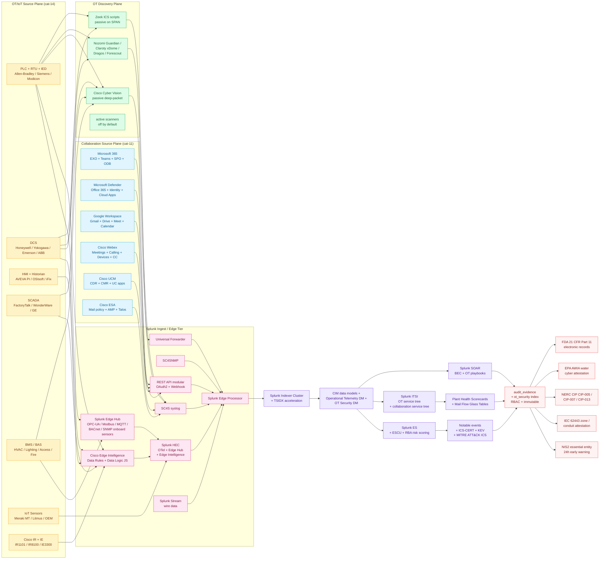

# Collaboration & IoT/OT Monitoring Domain Master Guide

> Splunk's role in collaboration and OT spans **two universes that
> rarely speak**: cloud productivity (mail, video, identity) and
> industrial physics (PLCs, sensors, building systems). Both expose
> Splunk to high-cardinality, high-frequency telemetry where
> filtering discipline matters as much as detection logic. Both
> contain mission-critical workflows: BEC compromises and OT
> intrusions can each erase shareholder value overnight. This
> domain guide bridges Email & Collaboration (cat-11, 107 UCs)
> with IoT & Operational Technology (cat-14, 230 UCs) into one
> sequenced operational programme. It is the **front door** for
> CISO, CIO, Plant Manager, Facilities Director, Workplace
> Experience Lead, and CIO-OT readers; per-product depth lives in
> the integration guides linked below.

## Table of Contents

- [Audience and Use](#audience-and-use)
- [Quick Start — From Zero to First Detection in 30 Days](#quick-start--from-zero-to-first-detection-in-30-days)
- [Architecture and Data Flow](#architecture-and-data-flow)
- [Domain 1 — Email & Collaboration (cat 11, 107 UCs)](#domain-1--email--collaboration-cat-11-107-ucs)
- [Domain 2 — IoT & Operational Technology (cat 14, 230 UCs)](#domain-2--iot--operational-technology-cat-14-230-ucs)
- [Operational Telemetry Data Model Anchor](#operational-telemetry-data-model-anchor)
- [Purdue Model + ISA/IEC 62443 Anchor](#purdue-model--isaiec-62443-anchor)
- [BEC + OT Cross-Domain Risk Anchor](#bec--ot-cross-domain-risk-anchor)
- [Crawl / Walk / Run Roadmap (18 / 50 / 40 UCs)](#crawl--walk--run-roadmap-18--50--40-ucs)
- [Sizing and Capacity Planning](#sizing-and-capacity-planning)
- [Compliance Mapping](#compliance-mapping)
- [Reference Dashboards](#reference-dashboards)
- [SPL Examples](#spl-examples)
- [Troubleshooting](#troubleshooting)
- [SOAR Playbook Catalogue](#soar-playbook-catalogue)
- [Cross-Product Integration](#cross-product-integration)
- [References](#references)

## Audience and Use

| Audience | What you get from this guide | Where to go for depth |
|---|---|---|
| **CISO** | Cross-domain BEC + OT threat picture, compliance mapping (NIS2<sup class="ref">[<a href="#ref-3">3</a>]</sup> essential entity, IEC 62443<sup class="ref">[<a href="#ref-5">5</a>]</sup> SR) | `security-monitoring.md`, `iot-ot.md` |
| **CIO** | Collaboration platform availability, SaaS audit trail completeness | `microsoft-365.md`, `webex.md`, `google-workspace.md` |
| **CIO-OT (Plant CIO)** | OT/ICS visibility, IT/OT convergence governance | `iot-ot.md`, `cisco-cyber-vision.md` |
| **Plant Manager / Operations Director** | Asset health, process variable anomalies, safety system activation | `cisco-cyber-vision.md`, `splunk-edge-hub.md` |
| **Facilities Director** | BMS / HVAC / water / Legionella / Refrigerant compliance | `splunk-edge-hub.md`, `meraki-mt.md` |
| **Workplace Experience Lead** | Room utilisation, hot-desk analytics, occupancy compliance | `webex.md` (room intelligence section) |
| **OT Security Lead** | Cyber Vision + Nozomi + Claroty + Dragos integration patterns | `cisco-cyber-vision.md`, `iot-ot.md` |
| **Mail Admin / UC Admin** | Mail flow + queue + CDR / CMR operational dashboards | `microsoft-365.md`, `cisco-ucm.md`, `cisco-esa.md` |
| **Identity Admin** | M365 / Workspace audit ↔ identity correlation (BEC kill chain) | `security-monitoring.md` (Identity section) |
| **Compliance Officer** | NIS2 + IEC 62443 + NERC CIP<sup class="ref">[<a href="#ref-6">6</a>]</sup> + AWIA + 21 CFR Part 11 evidence | `compliance-business.md`, `docs/evidence-packs/` |
| **OT Engineer** | Edge Intelligence pipeline authoring, register map governance | `cisco-edge-intelligence.md`, `iot-ot.md` |

## Quick Start — From Zero to First Detection in 30 Days

### Week 1 — Mail Flow + M365 Audit + BEC

1. **`Splunk_TA_MS_O365`** ingests Management Activity API → `mail_o365`.
2. **Message Trace API** ingestion (separate from audit plane).
3. **First three detections enabled:**
   - UC-11.1.1 Mail Flow Health Monitoring
   - UC-11.1.8 Inbox Rule Monitoring (BEC anchor)
   - UC-11.2.4 Login Anomaly Detection (Workspace parity)

### Week 2 — Webex / UC + ESA

4. **Webex REST + CDR** via `Splunk_TA_cisco_webex_*` → `uc_webex`.
5. **Cisco UCM CDR/CMR** → `uc_ucm`.
6. **Cisco ESA syslog** via SC4S → `mail_esa`.
7. **First three detections enabled:**
   - UC-11.3.16 Webex Calling Queue Performance and SLA
   - UC-11.5.5 Webex Room System Uptime
   - UC-11.4.1 SMTP Service Availability

### Week 3 — OT Asset Inventory + Cyber Vision

8. **Cisco Cyber Vision Center → REST + syslog CEF** to `cv_*` indexes.
9. **First three detections enabled:**
   - UC-14.9.1 OT Asset Discovery and Inventory Tracking
   - UC-14.9.12 New Communication Flow Detection
   - UC-14.9.13 Protocol Exception Monitoring

### Week 4 — Edge Hub / Edge Intelligence + Building Telemetry

10. **Splunk Edge Hub<sup class="ref">[<a href="#ref-8">8</a>]</sup>** sensor + protocol adapter → `edge_hub*`.
11. **Meraki MT** sensor portfolio → `meraki_mt`.
12. **First three detections enabled:**
    - UC-14.3.1 Temperature Anomaly Detection (Edge Hub)
    - UC-14.1.18 Water Leak Detection and Flood Alerts (Meraki MT)
    - UC-14.1.40 Domestic Hot Water Temperature Compliance (Legionella)

By day 30 you have **12 production detections**, OT inventory in
place, and the cross-domain visibility that anchors NIS2 essential
entity reporting, IEC 62443 zone integrity, and BEC dwell-time
reduction.

## Architecture and Data Flow



### Core principles repeated throughout

1. **Identity-first for collaboration; physics-first for OT.** A
   collaboration compromise is a race between detection and dwell
   time. An OT compromise is a physics problem first; loss of
   process variable visibility means humans only learn about
   failure when the flare stack lights up.
2. **Audit plane vs delivery plane separation (M365).** Management
   Activity API answers WHO changed WHAT; Message Trace answers
   WHY mail is delayed. Never collapse them.
3. **Passive over active for OT discovery.** Cyber Vision / Nozomi
   / Claroty / Dragos / Zeek are passive — they don't violate
   vendor warranties, don't disturb deterministic loops, and don't
   trigger watchdog timers.
4. **Edge filtering discipline for OT.** **Send on change**,
   **deadband analog swings**, aggregate high-frequency vibration
   FFT buckets at the edge. Splunk indexers are not the place to
   deduplicate 4–20 mA noise.
5. **Operational Telemetry > CIM for sensors.** OT data needs
   `metric_name`, `metric_value`, `metric_unit`, `asset_id`,
   `equipment_id`. Operational Telemetry data model normalises
   this; CIM doesn't.
6. **Purdue model + IEC 62443 zones discipline.** Splunk indexes
   should mirror the Purdue model so RBAC and retention can be
   tuned per zone (Level 0/1 raw process vs Level 4 enterprise
   business systems).
7. **Cross-domain correlation matters.** Executive Webex bridges
   depend on HVAC keeping IDF closets within spec. **[Webex Room
   System Uptime](../../index.html#uc-11.5.5)** correlated with
   **[SNMP Trap Storm Detection](../../index.html#uc-14.1.10)** is
   how you stop blaming the AV team for cooling-loss outages.
8. **OT identity ≠ IT identity.** Plant operators rarely use
   federated IdPs; OT user accounts live in HMI workstations and
   PLC engineering keys. Identity correlation must respect this
   schism.
9. **OT change is slow; instrumentation must be slower.** Don't
   redeploy Cyber Vision sensor configs without OT engineering
   change-board approval. Splunk SOAR playbooks for OT must
   require human-in-the-loop confirmation by default.

---

## Domain 1 — Email & Collaboration (cat 11, 107 UCs)

> Per-product depth: `microsoft-365.md`, `google-workspace.md`,
> `webex.md`, `cisco-ucm.md`, `cisco-esa.md`.

### Subcategory map

| Sub | Focus | UCs | Deep-dive guide |
|---|---|---|---|
| 11.1 | Microsoft 365 / Exchange | 12 | `microsoft-365.md` |
| 11.2 | Google Workspace | 18 | `google-workspace.md` |
| 11.3 | Unified Communications (Webex Calling, UCM) | 57 | `webex.md`, `cisco-ucm.md` |
| 11.4 | Mail Transport (ESA, hybrid SMTP) | 8 | `cisco-esa.md` |
| 11.5 | Video Conferencing (Webex Meetings, devices) | 12 | `webex.md` |

### Microsoft 365 — audit + delivery + Defender planes

- **Management Activity API** (`Splunk_TA_MS_O365`, app 3110) →
  `ms:o365:management` covers Exchange Online, SharePoint, Entra
  ID-integrated workloads, PowerShell cmdlets where unified audit
  is licensed.
- **Message Trace** (separate from audit) → `ms:o365:messageTrace`
  for delivery diagnostics. Threshold against trailing median, not
  static counts, so seasonal mail bursts don't flood paging.
- **Defender for Office 365 / Defender XDR** signals route via
  Graph Security API or SIEM forwarding to Splunk for cross-tenant
  correlation with **[Inbox Rule Monitoring](../../index.html#uc-11.1.8)**.
- **Records for legal & HR holds** — mailbox litigation hold,
  eDiscovery jobs, privileged mailbox access mirror into a
  restricted index with chain-of-custody documentation.

### Cisco Webex — Meetings + Calling + Devices + Contact Center

- OAuth 2.0 against `https://webexapis.com/v1/` with separated
  scopes: read analytics ≠ device control privileges.
- **Meetings**: `cisco:webex:meetings:history` +
  `cisco:webex:meetings:attendee` for quality + engagement.
  Pair with ThousandEyes for path triage on "audio only" incidents.
- **Calling CDR/CMR**: `cisco:webex:calling:cdr` +
  `cisco:webex:calling:cmr` for toll-fraud, hunt-group efficiency,
  PSTN spend.
- **Contact Center**: bridge JSON / HEC pipelines as first-class
  sourcetypes with schema tests; alert on ingestion gap detectors
  per skill group.
- **Audit**: `cisco:webex:audit` for SOC 2<sup class="ref">[<a href="#ref-1">1</a>]</sup>-style change control
  over UC infrastructure.
- **Splunkbase apps**: 4991 (Meetings Add-on), 4992 (Webex App),
  5781 (Webex REST Add-on).

### Cisco UCM (Unified Communications Manager)

CDR (billing-grade call records) + CMR (quality diagnostics)
through Cisco UCM Add-on. Per-call QoS vectors + endpoint identity
for capacity justification and priv-dial fraud hunting; align
device/line fields to Identity lookup tables; monitor anomalous
international patterns alongside Webex Calling CDR for hybrid PSTN
estates.

### Cisco ESA (Email Security Appliance)

SMTP policy enforcement + DKIM/DMARC alignment + AMP file
reputation + Talos sender reputation + outbreak filters.
`cisco:esa:mail_logs` correlated with **[Mail Flow Health
Monitoring](../../index.html#uc-11.1.1)** when transport bifurcates
across O365 connectors and ESA hops.

### Critical UCs

| UC | Why critical |
|---|---|
| UC-11.1.1 Mail Flow Health Monitoring | Foundation for delivery SLO + connector health |
| UC-11.1.8 Inbox Rule Monitoring | BEC anchor — silent data diversion detection |
| UC-11.2.4 Login Anomaly Detection (GWS) | Workspace parity to M365 brute-force / impossible travel |
| UC-11.3.16 Webex Calling Queue Performance and SLA | PSTN exit + queue abandon rate trending |
| UC-11.3.20 Webex License Utilization and Adoption | Finance vs behavioural reality |
| UC-11.4.1 SMTP Service Availability | Hybrid mail-flow MTA uptime |
| UC-11.5.5 Webex Room System Uptime | Device connectivity for war-room workflows |
| UC-11.5.9 Meeting Room No-Show and Early Release | Facilities cost recovery + workplace analytics |

---

## Domain 2 — IoT & Operational Technology (cat 14, 230 UCs)

> Per-product depth: `cisco-cyber-vision.md`,
> `cisco-edge-intelligence.md`, `splunk-edge-hub.md`, `iot-ot.md`,
> `meraki-mt.md`, `zeek-ics.md`, `litmus-edge.md`,
> `operational-telemetry-data-model.md`.

### Subcategory map

| Sub | Focus | UCs | Deep-dive guide |
|---|---|---|---|
| 14.1 | Building Management Systems (BMS) + Meraki MT sensors | 47 | `meraki-mt.md`, `splunk-edge-hub.md` |
| 14.2 | ICS / SCADA (PLC, RTU, IED, HMI) | 28 | `iot-ot.md` |
| 14.3 | Splunk Edge Hub | 56 | `splunk-edge-hub.md` |
| 14.4 | IoT Platforms (asset trackers, OEM clouds) | 19 | `iot-ot.md` |
| 14.5 | MQTT / OPC-UA + Cisco Edge Intelligence | 22 | `cisco-edge-intelligence.md`, `iot-ot.md` |
| 14.6 | (other / emerging) | 4 | `iot-ot.md` |
| 14.7 | Zeek ICS | 20 | `zeek-ics.md` |
| 14.8 | Litmus Edge | 9 | `litmus-edge.md` |
| 14.9 | Cisco Cyber Vision / Nozomi / Claroty / Dragos | 25 | `cisco-cyber-vision.md` |

### Cisco Cyber Vision — passive OT discovery

| Pillar | Detail |
|---|---|
| **Preset categories** | Starter asset classes (OT devices, controller families, CSMS tooling) cloned into customer-named groups before production |
| **Baselines** | Separate weekday/weekend profiles for batch vs continuous loads; train anomaly windows per asset group with exclusion calendars |
| **Subnetwork posture** | Tag ranges internal vs external; risk scoring weighs exposure differently per perimeter assumption |
| **IDS overlays** | Snort/Suricata-class rules tuned post-PLC firmware upgrade |

Splunk-facing telemetry: REST inventories + syslog CEF normalised
through SC4S. Canonical sourcetypes: `cisco:cybervision:components`,
`cisco:cybervision:flows`, `cisco:cybervision:events`,
`cisco:cybervision:vulnerabilities`.

### Cisco Edge Intelligence — industrial pipelines

Runs on **IR1101**, **IR829**, **IC3000**, select **Catalyst IE**
switches, close to sensors where OPC-UA subscriptions would choke
the WAN.

| Stage | Pattern |
|---|---|
| **Source** | PLC tags, MQTT topics, serial payloads, Modbus holding registers |
| **Transform** | Data Rules / Data Logic (JavaScript) — unit-test against captured PCAP |
| **Destination** | Splunk HEC batch vs single-event modes; tune batch KB per uplink |

Filter at the edge: send-on-change, deadband analog swings,
aggregate vibration FFT buckets locally. Document JavaScript
transforms under Git revision control — OT engineers deserve diff
reviews identical to PLC ladder edits.

### Splunk Edge Hub — onboard sensors + protocol adapters

Bundles compute near harsh environments with onboard sensors
(temperature/humidity/vibration depending on SKU) plus protocol
adapters: **MQTT**, **OPC-UA**, **Modbus**, **SNMP**, **BACnet**.

Commissioning checklist:
- Sensor calibration proofs
- MQTT broker ACL matrices
- OPC-UA endpoint certificates (Basic256Sha256 minimum,
  abandon anonymous)
- Modbus register maps frozen under change control via versioned
  `plc_register_meaning.csv` lookup beside Splunk apps
- Failover behaviour: Edge Hub buffers locally on uplink loss;
  dashboard ingest lag detectors accordingly

### Critical UCs

| UC | Why critical |
|---|---|
| UC-14.9.1 OT Asset Discovery and Inventory Tracking | Foundation for IEC 62443 zoning + NERC CIP-002 categorisation |
| UC-14.9.6 Snort IDS Threat Detection on OT Networks | Sensor-backed IDS overlays correlated with firewall denies |
| UC-14.9.12 New Communication Flow Detection | East-west surprises after segmentation projects |
| UC-14.9.13 Protocol Exception Monitoring | Deterministic PLC chatter disrupted by scanners or ransomware |
| UC-14.9.15 Admin Connection Detection to ICS Assets | Engineering laptop crossings into Purdue Level 2 |
| UC-14.9.19 Network Redundancy and HA Failover Events | Ring/PRP redundancy flaps tied to historian gaps |
| UC-14.9.23 OT Event Severity Distribution | OT monitoring posture dashboard |
| UC-14.9.24 OT Protocol Usage Analysis and Inventory | "Which ICS dialects per VLAN?" before firewall changes drop UDP ports |
| UC-14.9.25 Decode Failure and Malformed Packet Detection | Parser mismatches after firmware bumps |
| UC-14.2.1 PLC/RTU Health Monitoring | CPU/memory/comm wedges before HMIs freeze |
| UC-14.2.2 Process Variable Anomalies | Analog breaches predicting mechanical faults |
| UC-14.2.3 Safety System Activation | Interlocks proving IEC 61511 narratives post-trip |
| UC-14.3.1 Temperature Anomaly Detection (Edge Hub) | Sensor-driven anomaly with seasonal overlay |
| UC-14.1.10 SNMP Trap Storm Detection | Protects collectors when firmware storms after power blips |
| UC-14.1.18 Water Leak Detection (Meraki MT) | Physical loss prevention in IDF closets |
| UC-14.1.40 Domestic Hot Water Temperature (Legionella) | Public-health compliance from `bms:water` pipelines |

---

## Operational Telemetry Data Model Anchor

Where deployments adopt **Operational Telemetry** or **CIM**
extensions, enforce field aliasing per Splunk OT documentation so
facility teams and plant engineers share dashboards without
rebuilding extractions. The minimum field contract:

| Field | Meaning | Example |
|---|---|---|
| `metric_name` | What is measured | `temperature`, `vibration_rms`, `motor_current` |
| `metric_value` | Numeric value | `73.2` |
| `metric_unit` | Unit of measure | `degF`, `mm/s`, `A` |
| `asset_id` | Stable equipment identifier | `LINE3-PUMP-7` |
| `equipment_id` | Equipment model identifier | `WEG-W22-100HP` |
| `asset_class` | Equipment class | `pump`, `motor`, `chiller` |
| `site` | Plant / facility | `plant-detroit-mi` |
| `process_area` | Process step | `polymerization`, `packaging` |
| `purdue_level` | Purdue model layer (0-5) | `1` (sensors/actuators) |
| `safety_critical` | Safety system flag | `true` / `false` |

This contract enables tstats acceleration of OT use cases, cross-
asset comparison, and natural language queries that translate
directly to OT engineering vocabulary.

---

## Purdue Model + ISA/IEC 62443 Anchor

### Purdue model levels

| Level | Description | Splunk index pattern |
|---|---|---|
| **0** | Physical process — sensors, actuators, motors | `edge_hub_*`, `meraki_mt`, `bms` |
| **1** | Basic control — PLCs, RTUs, IEDs | `ics`, `opcua`, `modbus` |
| **2** | Supervisory control — HMIs, historians | `litmus`, `cv_*`, `bacnet` |
| **3** | Manufacturing operations — MES, MOM | `mes`, business systems |
| **3.5** | IDMZ — industrial DMZ | Demarcation and scrubbing |
| **4** | Site business — ERP integration | `biz_supplychain` |
| **5** | Enterprise — corporate IT | `enterprise_*` |

### ISA/IEC 62443 Security Requirements (SR) families

| SR | Family | Splunk anchor |
|---|---|---|
| SR 1.* | Identification & Authentication Control | UC-14.9.15 + Identity correlation |
| SR 2.* | Use Control | UC-14.9.12 + UC-14.9.15 |
| SR 3.* | System Integrity | UC-14.9.13 + Cyber Vision IDS |
| SR 4.* | Data Confidentiality | TLS / OPC-UA Basic256Sha256 enforcement |
| SR 5.* | Restricted Data Flow | UC-14.9.12 + IT/OT boundary |
| SR 6.* | Timely Response to Events | ITSI episode + SOAR playbook |
| SR 7.* | Resource Availability | UC-14.2.1 + ITSI service health |

---

## BEC + OT Cross-Domain Risk Anchor

The most expensive cross-domain risk pattern: **BEC compromise of
finance + OT supplier impersonation = wire fraud against a real
plant transaction**. Detection requires correlating:

1. M365 audit (UC-11.1.8 Inbox Rule Monitoring) — silent diversion
2. ESA / Defender — phishing simulation training cohort
3. Salesforce Service Cloud / SAP Vendor Master — invoice
   anomaly
4. Cyber Vision — actual plant supplier connectivity

```spl
| multisearch
  [ search index=mail_o365 sourcetype="ms:o365:management" Operation="New-InboxRule"
    | rex field=Parameters "ForwardTo=(?<forward_target>[^,]+)"
    | where like(forward_target, "%@external.tld%") ]
  [ search index=biz_finance source="*sap*vendor_master*" change_type="bank_account_update"
    | eval recent_change=if(_time > relative_time(now(), "-7d"), 1, 0) ]
| stats values(*) as * by user
| where isnotnull(forward_target) AND recent_change=1
```

This style of cross-domain detection is precisely why Splunk
collapses these two universes into one pane.

---

## Crawl / Walk / Run Roadmap (18 / 50 / 40 UCs)

### Crawl tier (18 UCs — month 1-2)

| UC | Domain | Title |
|---|---|---|
| 11.1.1 | Mail | Mail Flow Health Monitoring |
| 11.1.8 | Mail | Inbox Rule Monitoring |
| 11.2.4 | Mail | Login Anomaly Detection |
| 11.3.16 | UC | Webex Calling Queue Performance and SLA |
| 11.3.20 | UC | Webex License Utilization and Adoption |
| 11.4.1 | Mail | SMTP Service Availability |
| 11.5.5 | UC | Webex Room System Uptime |
| 11.5.9 | UC | Meeting Room No-Show and Early Release |
| 14.9.1 | OT | OT Asset Discovery and Inventory |
| 14.9.12 | OT | New Communication Flow Detection |
| 14.9.13 | OT | Protocol Exception Monitoring |
| 14.9.15 | OT | Admin Connection Detection to ICS Assets |
| 14.2.1 | OT | PLC/RTU Health Monitoring |
| 14.3.1 | OT | Temperature Anomaly Detection (Edge Hub) |
| 14.1.10 | OT | SNMP Trap Storm Detection |
| 14.1.18 | OT | Water Leak Detection (Meraki MT) |
| 14.1.40 | OT | Domestic Hot Water Temperature (Legionella) |
| 14.9.23 | OT | OT Event Severity Distribution |

### Walk tier (50 UCs — month 3-6)

Highlights:
- Defender XDR / MDI / MDCA full ingestion + correlation
- Webex Contact Center bridge instrumentation
- UCM CDR/CMR quality SLAs + toll-fraud detection
- ESA AMP + Talos correlation with M365 Defender
- Cyber Vision IDS (Snort) overlays + suppression management
- Cisco Edge Intelligence pipeline authoring (Data Logic JS)
- OPC-UA secure session enforcement
- Zeek ICS protocol deep-parse (Modbus, DNP3, BACnet, ENIP)
- BMS / BACnet temperature anomaly + valve position trending
- Refrigerant leak detection + F-Gas compliance
- Process variable anomaly with predictive maintenance overlays
- Safety system activation (IEC 61511) + RCA workflow

### Run tier (40 UCs — month 7+)

Highlights:
- Cross-domain BEC + OT supplier impersonation detection
- AI-noise-reduction usage analytics for hybrid meeting quality
- Litmus Edge multi-cluster orchestration governance
- Nozomi / Claroty / Dragos parallel sensor reconciliation
- Predictive maintenance with Splunk MLTK on vibration/oil/IR
- Digital twin telemetry validation (ISO 23247)
- 21 CFR Part 11 electronic records integrity for pharma
  manufacturing
- NERC CIP-013 supply chain risk monitoring
- AWIA water utility cyber attestation
- TSA Pipeline Security Directive SD-2 evidence
- IEC 62443 zone & conduit attestation reports
- ENISA OT incident reporting integration

---

## Sizing and Capacity Planning

| Source | Per-1k-employee daily volume | Monthly storage |
|---|---|---|
| Microsoft 365 Management Activity API | 2-5 GB | 60-150 GB |
| Microsoft 365 Message Trace | 500 MB | 15 GB |
| Microsoft Defender XDR / MDE / MDI / MDCA | 1-3 GB | 30-90 GB |
| Google Workspace Reports API (login/admin/drive/gmail/meet) | 1 GB | 30 GB |
| Cisco Webex Meetings + Calling REST | 500 MB | 15 GB |
| Cisco UCM CDR/CMR | 200 MB | 6 GB |
| Cisco ESA syslog | 500 MB | 15 GB |

| Source | Per-typical-plant daily volume | Monthly storage |
|---|---|---|
| Cisco Cyber Vision (1 sensor) | 1-3 GB | 30-90 GB |
| Cisco Edge Intelligence agent | 200 MB-1 GB | 6-30 GB |
| Splunk Edge Hub onboard sensors | 100 MB | 3 GB |
| OPC-UA polled metrics (~1k tags @ 1Hz) | 5-10 GB | 150-300 GB |
| Modbus polled (~500 registers @ 5s) | 1-2 GB | 30-60 GB |
| MQTT broker (typical PoC scope) | 1-3 GB | 30-90 GB |
| BACnet building automation (~5k objects) | 500 MB-1 GB | 15-30 GB |
| BMS HVAC/lighting/access logs | 500 MB | 15 GB |
| Meraki MT sensor portfolio (~100 sensors) | 100-500 MB | 3-15 GB |
| Zeek ICS scripts (10 Gbps SPAN) | 5-15 GB | 150-450 GB |
| Litmus Edge cluster | 1-5 GB | 30-150 GB |
| Nozomi / Claroty / Dragos parallel sensor | 1-3 GB | 30-90 GB |

**Worked example (mid-market: 5k employees + 3 plants + 50
buildings):**
- Collaboration: ~12 GB/day
- OT (3 plants @ 15 GB/day each): ~45 GB/day
- BMS / IoT (50 buildings @ 1 GB/day each): ~50 GB/day

→ **~107 GB/day indexed collaboration + OT data**. OT volumes
dominate with high-frequency sensor data; aggressive edge filtering
(send-on-change + deadband + temporal aggregation) is essential.
Tier raw OT to SmartStore + Federated Search for Amazon S3 for
long-term incident retention.

---

## Compliance Mapping

| Framework | Domain | Critical UCs |
|---|---|---|
| **ISA/IEC 62443 SR 1.*** | OT | 14.9.15 |
| **ISA/IEC 62443 SR 2.*** | OT | 14.9.12, 14.9.15 |
| **ISA/IEC 62443 SR 3.*** | OT | 14.9.13 + Cyber Vision IDS |
| **ISA/IEC 62443 SR 5.*** | OT | 14.9.12 + IT/OT deny |
| **ISA/IEC 62443 SR 7.*** | OT | 14.2.1 + ITSI |
| **NIST SP 800-82 r3** | OT | All cat-14 critical UCs |
| **NERC CIP-002** | OT (electric) | 14.9.1 |
| **NERC CIP-005** | OT (electric) | 14.9.15 + UC-22.13.11 |
| **NERC CIP-007 R4** | OT (electric) | 14.9.13 + 14.9.6 |
| **NERC CIP-008** | OT (electric) | ITSI + SOAR OT IR |
| **NERC CIP-010** | OT (electric) | 14.9.13 + change mgmt |
| **NERC CIP-013** | OT supply chain | UC-22.13.11 + supplier monitoring |
| **NIS2 essential entities** | OT + IT | UC-22.2.1 + cat-14 critical |
| **TSA Pipeline SD-2** | OT (pipeline) | 14.9.1 + 14.9.12 |
| **EPA AWIA water utility cyber** | OT (water) | 14.1.40 + 14.9.1 |
| **FDA 21 CFR Part 11** | OT (pharma) | Audit trail + electronic signature integrity |
| **GDPR<sup class="ref">[<a href="#ref-4">4</a>]</sup> Art. 32** | Mail | 11.1.8 + audit retention |
| **HIPAA Security Rule<sup class="ref">[<a href="#ref-11">11</a>]</sup>** | Mail | M365 audit + holds for ePHI |
| **SOC 2 CC7 + A1** | UC + Mail | 11.1.1, 11.4.1, 11.5.5 |
| **MITRE ATT&CK for ICS** | OT | 14.9.12, 14.9.13, 14.9.15 |
| **ASHRAE 188 Legionella** | BMS | 14.1.40 |
| **F-Gas Regulation EU 2024/573** | BMS | Refrigerant tracking + leak detection |
| **IEC 61511 process safety** | OT | 14.2.3 + safety system attestation |

See `compliance-business.md` and `docs/evidence-packs/` for per-
framework deep dives.

---

## Reference Dashboards

| Dashboard | Audience | Refresh | Source |
|---|---|---|---|
| Mail Flow Operations Console | Mail Admin | 5 min | `mail_o365`, `mail_esa` |
| BEC Detection Aging | Identity / SOC | 5 min | `mail_o365` |
| Webex Quality + Capacity | UC Admin | 5 min | `uc_webex` |
| UCM CDR / CMR Quality | UC Admin | 5 min | `uc_ucm` |
| Cisco ESA Mail Policy Effectiveness | Mail Admin | 1h | `mail_esa` |
| OT Asset Inventory Drift | OT Engineer | 1h | `cv_components` |
| OT Communication Flow Map | OT SOC | 5 min | `cv_flows` |
| OT Vulnerability SLA | OT Patch Mgmt | 1h | `cv_vulns` |
| Plant Health Scorecard | Plant Manager | 5 min | `ics`, `opcua`, `cv_events` |
| Process Variable Trending | Process Engineer | Real-time | `opcua`, `modbus` |
| Safety System Activation Log | HSE Lead | Real-time | `ics` |
| BMS HVAC Dashboard | Facilities | 5 min | `bms`, `bacnet` |
| Legionella Compliance | Facilities + Public Health | 1h | `bms:water` |
| Refrigerant Leak Tracking | Facilities + Sustainability | 1h | `bms`, IoT |
| Meraki MT Sensor Portfolio | Facilities | 5 min | `meraki_mt` |
| Edge Hub Ingest Lag | OT + Splunk Admin | 1 min | `edge_hub_metrics` |
| Cyber Vision Sensor Health | OT SOC | 5 min | `cv_events` |
| Cross-Domain BEC + Vendor Pivot | CISO + CFO | 1h | `mail_o365` + `biz_finance` |

---

## SPL Examples

### Inbox Rule Monitoring (UC-11.1.8) — BEC anchor

```spl
index=mail_o365 sourcetype="ms:o365:management" Operation IN ("New-InboxRule","Set-InboxRule")
| rex field=Parameters "ForwardTo=(?<forward_target>[^,]+)"
| rex field=Parameters "DeleteMessage=(?<delete_flag>[^,]+)"
| eval suspicious = case(
    like(forward_target, "%@gmail.com%") OR like(forward_target, "%@outlook.com%"), "external_personal",
    like(forward_target, "%.tld%"), "external_other",
    delete_flag="True", "auto_delete",
    1=1, "review")
| where suspicious!="review"
| stats values(forward_target) as forward_targets, values(suspicious) as flags by user, ClientIP, _time
```

### Mail Flow Health (UC-11.1.1) with trailing median threshold

```spl
index=mail_o365 sourcetype="ms:o365:messageTrace"
| timechart span=15m count by Status
| join _time
  [ search index=mail_o365 sourcetype="ms:o365:messageTrace" earliest=-30d
    | timechart span=15m count
    | rename count as historical_count ]
| eval median_30d = streamstats median(historical_count) as median_30d
| eval anomaly = if(count > median_30d * 3, "ALERT", "OK")
```

### OT Asset Inventory Drift (UC-14.9.1)

```spl
| inputlookup ot_authoritative_inventory.csv
| eval source = "authoritative"
| append [ search index=cv_components sourcetype="cisco:cybervision:components" earliest=-1d
            | dedup mac_address | eval source = "cybervision" ]
| stats values(source) as sources, values(ip) as ips, values(vendor) as vendors by mac_address
| eval drift = if(mvcount(sources)<2, "DRIFT", "OK")
| where drift = "DRIFT"
```

### Safety System Activation (UC-14.2.3)

```spl
index=ics sourcetype="opcua:metrics" metric_name IN ("safety_trip","esd_active","interlock_engaged") metric_value=1
| eval iec_61508_sil = case(
    safety_critical="true" AND process_area="reactor", "SIL3",
    safety_critical="true", "SIL2",
    1=1, "non-SIL")
| stats min(_time) as first_trip, max(_time) as last_event, count by asset_id, equipment_id, iec_61508_sil
| eval root_cause_required = if(iec_61508_sil="SIL3" OR count>5, "yes", "no")
```

### Cross-Domain Cooling Loss → Webex Outage (correlation)

```spl
| multisearch
  [ search index=bms sourcetype="bms:air" metric_name="ahu_supply_temp" 
    | where metric_value > 80
    | eval event_class = "cooling_loss" ]
  [ search index=uc_webex sourcetype="cisco:webex:devices" status="offline"
    | eval event_class = "device_outage" ]
| eval site = coalesce(site, building)
| stats values(event_class) as classes, count by site, _time span=15m
| where mvcount(classes) >= 2
```

### Domestic Hot Water Legionella (UC-14.1.40)

```spl
index=bms sourcetype="bms:water" metric_name IN ("dhw_supply_temp","dhw_return_temp")
| stats min(metric_value) as min_temp, avg(metric_value) as avg_temp by location, asset_id, _time span=1h
| eval ashrae_188_pass = if(min_temp >= 122 AND avg_temp >= 124, "pass", "fail")
| eval hsg274_pass = if(min_temp >= 50 AND avg_temp >= 55, "pass_uk", "fail_uk")
| where ashrae_188_pass = "fail" OR hsg274_pass = "fail_uk"
```

### Cisco UCM toll fraud (CDR pattern)

```spl
index=uc_ucm sourcetype="cisco:ucm:cdr" originalCallingPartyNumber=*
| eval is_international = case(
    like(finalCalledPartyNumber, "+%") AND NOT like(finalCalledPartyNumber, "+1%"), 1,
    1=1, 0)
| where is_international=1 AND duration > 600
| stats sum(duration) as total_duration, count by originalCallingPartyNumber, finalCalledPartyNumber
| where total_duration > 36000
| eval suspected_toll_fraud = "true"
```

---

## Troubleshooting

| Symptom | Likely cause | Fix |
|---|---|---|
| M365 Management Activity API gap | OAuth token expired silently | Monitor `inputs.conf` certificate fingerprints; alert when renewal window < 30d |
| Message Trace lag > 1h | Microsoft API throttling | Reduce poll interval; check tenant call pattern; consider Splunk Add-on for Microsoft 365 1.x |
| Webex CDR missing | Webex Calling REST polling too slow | Per-org polling cadence; check `429` backoff |
| ESA missing AMP verdicts | SC4S parser drift after firmware | Update `splunk_metadata` mapping in SC4S |
| Cyber Vision sensor backlog growing | Decode buffer overrun | Check sensor CPU; reduce `flow` capture scope; suppress benign vendor signatures |
| OPC-UA session disconnects | Certificate expiry or Basic128Rsa15 endpoint | Rotate certs; force Basic256Sha256 minimum |
| Modbus poll timeouts | Scan budget exceeded | Reduce poll frequency; respect PLC scan cycle |
| BACnet object discovery incomplete | Multi-segment broadcast not configured | Add BBMD entries; verify Foreign Device registration |
| Edge Hub buffer overflow | Uplink degradation | Tune local buffer size; enable HEC ACK monitoring |
| Edge Intelligence Data Logic crash | JavaScript exception in transform | Code review; unit test against historical PCAP |
| Meraki MT sensor offline | Battery / connectivity / firmware | Check Meraki Dashboard alerts; replace battery |
| Zeek ICS missing fields | Script not loaded for protocol | Enable specific Zeek ICS script; verify `pcap_dump` |
| MQTT topic explosion | Wildcard subscription too broad | Narrow subscription; aggregate at edge |
| Litmus Edge driver disconnect | Firmware mismatch | Update driver; verify protocol compatibility |
| Plant cross-domain correlation flaky | CMDB lookup stale | Refresh `device_id` ↔ `asset_id` mapping nightly |
| Webex Room System constant offline alerts | IDF cooling loss; HVAC failure | Pair with `bms:air` AHU supply temp; chain runbook |
| Defender alert duplication in Splunk | M365 + MDE both forward | Deduplicate by `alert_id` join key |

---

## SOAR Playbook Catalogue

### Reference playbooks for collaboration & OT

| Playbook | Trigger UC | Phases | Severity |
|---|---|---|---|
| `bec_inbox_rule_response` | UC-11.1.8 | revoke session, disable rule, audit recent forward, exec page | High |
| `mail_flow_degradation_triage` | UC-11.1.1 | identify connector, page mail admin, status page update | Medium |
| `webex_calling_outage` | UC-11.3.16 | Webex incident page, ThousandEyes path check, escalation | High |
| `room_system_offline_war_room` | UC-11.5.5 | check `bms:air` AHU temp, dispatch facilities, AV team page | Medium |
| `ot_asset_drift_response` | UC-14.9.1 | OT engineering ticket, refresh inventory, vendor outreach | Medium |
| `ot_new_flow_review` | UC-14.9.12 | maintenance window check, OT engineering review, suppress or escalate | Medium |
| `ot_protocol_exception_review` | UC-14.9.13 | check vendor firmware notes, suppress benign, escalate suspect | Medium |
| `ot_admin_connection_audit` | UC-14.9.15 | identify engineering laptop, validate change ticket, log | Medium |
| `safety_system_activation_rca` | UC-14.2.3 | trigger HSE workflow, RCA template, IEC 61511 attestation | Critical |
| `legionella_compliance_failure` | UC-14.1.40 | dispatch facilities, public health notification, retest schedule | Critical |
| `water_leak_dispatch` | UC-14.1.18 | dispatch facilities, isolate equipment, insurance claim prep | High |
| `refrigerant_leak_compliance` | UC-14 (custom) | F-Gas log, dispatch refrigerant tech, regulatory filing | High |
| `bec_+_vendor_change_correlation` | (cross-domain) | freeze wire, audit vendor master change, CFO escalation | Critical |

---

## Cross-Product Integration

| Other guide | Relationship |
|---|---|
| `microsoft-365.md` | Cat-11.1.x deep dive — M365 Management Activity API + Defender |
| `google-workspace.md` | Cat-11.2.x deep dive — Workspace Reports API |
| `webex.md` | Cat-11.3.x + 11.5.x deep dive — Webex Meetings + Calling + Devices |
| `cisco-ucm.md` | Cat-11.3.x deep dive — UCM CDR/CMR |
| `cisco-esa.md` | Cat-11.4.x deep dive — ESA mail policy + AMP |
| `cisco-cyber-vision.md` | Cat-14.9.x deep dive — passive OT discovery |
| `cisco-edge-intelligence.md` | Cat-14.5.x deep dive — Data Rules / Logic |
| `splunk-edge-hub.md` | Cat-14.3.x deep dive — onboard sensors + protocol adapters |
| `meraki-mt.md` | Cat-14.1.x deep dive — sensor portfolio |
| `zeek-ics.md` | Cat-14.7.x deep dive — passive ICS protocol parsing |
| `litmus-edge.md` | Cat-14.8.x deep dive — multi-cluster IIoT orchestration |
| `iot-ot.md` | Cross-cutting OT integration patterns |
| `operational-telemetry-data-model.md` | Field contract for OT/IoT |
| `security-monitoring.md` | Cross-domain — Identity correlation for BEC + OT |
| `compliance-business.md` | NIS2 / IEC 62443 / NERC CIP / AWIA / 21 CFR Part 11 |
| `network-monitoring.md` | Cisco Catalyst IE switching + IR routing for OT |
| `industry-verticals.md` | Cat-10.12 — Manufacturing / Energy / Water vertical anchors |

---

## References

### Standards and frameworks (with stable URLs)

- ISA/IEC 62443 — https://www.isa.org/standards-and-publications/isa-standards/isa-iec-62443-series-of-standards
- NIST SP 800-82 r3 — https://csrc.nist.gov/publications/detail/sp/800-82/rev-3/final
- NERC CIP — https://www.nerc.com/pa/Stand/Pages/CIPStandards.aspx
- TSA Pipeline Security Directive — https://www.tsa.gov/
- EPA America's Water Infrastructure Act — https://www.epa.gov/waterresilience/awia-section-2013
- FDA 21 CFR Part 11 — https://www.fda.gov/regulatory-information/
- MITRE ATT&CK for ICS — https://attack.mitre.org/matrices/ics/
- ENISA OT recommendations — https://www.enisa.europa.eu/
- ASHRAE 188 — https://www.ashrae.org/technical-resources/standards-and-guidelines/standards-addenda/standard-188-2015
- F-Gas Regulation EU 2024/573 — https://eur-lex.europa.eu/eli/reg/2024/573/oj
- IEC 61508 + 61511 + 62443 functional/process/cyber safety
- Purdue Reference Architecture — ISA-95 + Purdue model

### Vendor documentation

- Cisco Cyber Vision — https://www.cisco.com/c/en/us/products/security/cyber-vision/
- Cisco Edge Intelligence — https://www.cisco.com/c/en/us/products/cloud-systems-management/edge-intelligence/
- Cisco UCM admin guide
- Cisco ESA admin guide
- Cisco Webex admin (https://help.webex.com/) + REST APIs (https://developer.webex.com/)
- Microsoft 365 Management Activity API
- Microsoft Defender XDR
- Google Workspace Admin SDK Reports API
- Splunk Edge Hub administration
- OPC Foundation OPC UA spec
- HART Communication Foundation
- BACnet International
- Eclipse Mosquitto MQTT broker

### Splunk documentation

- Splunk Operational Telemetry data model
- Splunk OT Security Add-on
- Splunk Add-on for Microsoft Cloud Services (3110)
- Splunk Add-on for Microsoft 365 + Defender
- Splunk Add-on for Google Workspace
- Cisco Webex Meetings Add-on (4991)
- Cisco Webex App (4992)
- Cisco Webex REST Add-on (5781)
- Cisco UCM Add-on
- Cisco ESA Add-on
- Cisco Cyber Vision Add-on
- Splunk Add-on for OPC-UA / Modbus / MQTT / BACnet
- Splunk Connect for Syslog (SC4S)
- Splunk Connect for SNMP (SC4SNMP)

---

**Document maintenance.** Reviewed quarterly against vendor
release notes, regulatory updates, and Splunk product updates.
Last verified against:
- Splunk Enterprise Security 8.0
- Splunk SOAR 6.x
- ESCU current quarterly drop
- ISA/IEC 62443 (current series)
- NIST SP 800-82 r3
- Microsoft 365 Management Activity API (current)
- Cisco Webex APIs (current)
- Cisco Cyber Vision 5.3.x administration
- Splunk Edge Hub (current firmware)
- OPC UA Spec
- F-Gas Regulation EU 2024/573

For corrections or additions, file an issue with `domain-collaboration`,
`domain-iot-ot`, `cat-11`, or `cat-14` labels.

---

<!-- BEGIN-AUTOGENERATED-SOURCES -->

## References

*Auto-generated by `scripts/generate_doc_references.py` from `data/source-references.json` and `data/source-mappings.json`. Edit those files (or the document body) to change citations; this footer is rewritten on every run.*

### Supporting sources

<a id="ref-1"></a>**[1]** American Institute of Certified Public Accountants. (2017). *Trust Services Criteria (2017) for Security, Availability, Processing Integrity, Confidentiality, and Privacy*. AICPA & CIMA. SOC 2 / TSP Section 100. https://www.aicpa-cima.com/topic/audit-assurance/soc-suite-of-services

<a id="ref-2"></a>**[2]** California Office of the Attorney General. (2020). *California Consumer Privacy Act / California Privacy Rights Act*. State of California. CA Civ Code § 1798.100 et seq. https://oag.ca.gov/privacy/ccpa

<a id="ref-3"></a>**[3]** European Parliament and Council of the European Union. (2022, December). *Directive (EU) 2022/2555 — NIS2 Directive on cybersecurity*. Official Journal of the European Union, L 333. ELI: dir/2022/2555. https://eur-lex.europa.eu/eli/dir/2022/2555/oj

<a id="ref-4"></a>**[4]** European Parliament and Council of the European Union. (2016, April). *Regulation (EU) 2016/679 — General Data Protection Regulation*. Official Journal of the European Union, L 119. ELI: reg/2016/679. https://eur-lex.europa.eu/eli/reg/2016/679/oj

<a id="ref-5"></a>**[5]** International Electrotechnical Commission. (2018). *IEC 62443 — Industrial communication networks — Network and system security*. IEC. https://webstore.iec.ch/en/publication/7029

<a id="ref-6"></a>**[6]** North American Electric Reliability Corporation. (2024). *NERC Critical Infrastructure Protection (CIP) Reliability Standards*. NERC. https://www.nerc.com/pa/Stand/Pages/CIPStandards.aspx

<a id="ref-7"></a>**[7]** Splunk Inc. (2026). *Splunk Common Information Model Add-on Manual*. Splunk LLC, a Cisco company. Retrieved May 11, 2026, from https://docs.splunk.com/Documentation/CIM

<a id="ref-8"></a>**[8]** Splunk Inc. (2026). *Splunk Edge Hub Documentation*. Splunk LLC, a Cisco company. Retrieved May 11, 2026, from https://docs.splunk.com/Documentation/EdgeHub

<a id="ref-9"></a>**[9]** Splunk Inc. (2026). *Splunk Infrastructure Monitoring Documentation*. Splunk LLC, a Cisco company. Retrieved May 11, 2026, from https://docs.splunk.com/observability/en/infrastructure/intro-to-infrastructure.html

<a id="ref-10"></a>**[10]** U.S. Department of Health & Human Services. (2002). *HIPAA Privacy Rule (45 CFR Parts 160 and 164, Subparts A and E)*. Office for Civil Rights, HHS. 45 CFR 160, 164. https://www.hhs.gov/hipaa/for-professionals/privacy/index.html

<a id="ref-11"></a>**[11]** U.S. Department of Health & Human Services. (2013). *HIPAA Security Rule (45 CFR Parts 160 and 164, Subparts A and C)*. Office for Civil Rights, HHS. 45 CFR 160, 164. https://www.hhs.gov/hipaa/for-professionals/security/index.html

<details>
<summary>Additional online sources cited in the document body (23)</summary>

<a id="ref-12"></a>**[12]** splunkbase.splunk.com. *Splunkbase app #3110*. Retrieved May 11, 2026, from https://splunkbase.splunk.com/app/3110

<a id="ref-13"></a>**[13]** splunkbase.splunk.com. *Splunkbase app #3260*. Retrieved May 11, 2026, from https://splunkbase.splunk.com/app/3260

<a id="ref-14"></a>**[14]** splunkbase.splunk.com. *Splunkbase app #4055*. Retrieved May 11, 2026, from https://splunkbase.splunk.com/app/4055

<a id="ref-15"></a>**[15]** splunkbase.splunk.com. *Splunkbase app #4991*. Retrieved May 11, 2026, from https://splunkbase.splunk.com/app/4991

<a id="ref-16"></a>**[16]** splunkbase.splunk.com. *Splunkbase app #4992*. Retrieved May 11, 2026, from https://splunkbase.splunk.com/app/4992

<a id="ref-17"></a>**[17]** splunkbase.splunk.com. *Splunkbase app #5781*. Retrieved May 11, 2026, from https://splunkbase.splunk.com/app/5781

<a id="ref-18"></a>**[18]** splunkbase.splunk.com. *Splunkbase app #2898*. Retrieved May 11, 2026, from https://splunkbase.splunk.com/app/2898

<a id="ref-19"></a>**[19]** splunkbase.splunk.com. *Splunkbase app #4955*. Retrieved May 11, 2026, from https://splunkbase.splunk.com/app/4955

<a id="ref-20"></a>**[20]** splunkbase.splunk.com. *Splunkbase app #5403*. Retrieved May 11, 2026, from https://splunkbase.splunk.com/app/5403

<a id="ref-21"></a>**[21]** splunkbase.splunk.com. *Splunkbase app #3457*. Retrieved May 11, 2026, from https://splunkbase.splunk.com/app/3457

<a id="ref-22"></a>**[22]** isa.org. *isa.org: Isa Iec 62443 Series Of Standards*. Retrieved May 11, 2026, from https://www.isa.org/standards-and-publications/isa-standards/isa-iec-62443-series-of-standards

<a id="ref-23"></a>**[23]** csrc.nist.gov. *NIST: Final*. Retrieved May 11, 2026, from https://csrc.nist.gov/publications/detail/sp/800-82/rev-3/final

<a id="ref-24"></a>**[24]** tsa.gov. *tsa.gov*. Retrieved May 11, 2026, from https://www.tsa.gov/

<a id="ref-25"></a>**[25]** epa.gov. *epa.gov: Awia Section 2013*. Retrieved May 11, 2026, from https://www.epa.gov/waterresilience/awia-section-2013

<a id="ref-26"></a>**[26]** fda.gov. *fda.gov: Regulatory Information*. Retrieved May 11, 2026, from https://www.fda.gov/regulatory-information/

<a id="ref-27"></a>**[27]** attack.mitre.org. *MITRE ATT&CK Knowledge Base*. Retrieved May 11, 2026, from https://attack.mitre.org/matrices/ics/

<a id="ref-28"></a>**[28]** enisa.europa.eu. *enisa.europa.eu*. Retrieved May 11, 2026, from https://www.enisa.europa.eu/

<a id="ref-29"></a>**[29]** ashrae.org. *ashrae.org: Standard 188 2015*. Retrieved May 11, 2026, from https://www.ashrae.org/technical-resources/standards-and-guidelines/standards-addenda/standard-188-2015

<a id="ref-30"></a>**[30]** eur-lex.europa.eu. *EU Regulation 2024/573*. Retrieved May 11, 2026, from https://eur-lex.europa.eu/eli/reg/2024/573/oj

<a id="ref-31"></a>**[31]** cisco.com. *Cisco: Cyber Vision*. Retrieved May 11, 2026, from https://www.cisco.com/c/en/us/products/security/cyber-vision/

<a id="ref-32"></a>**[32]** cisco.com. *Cisco: Edge Intelligence*. Retrieved May 11, 2026, from https://www.cisco.com/c/en/us/products/cloud-systems-management/edge-intelligence/

<a id="ref-33"></a>**[33]** help.webex.com. *help.webex.com*. Retrieved May 11, 2026, from https://help.webex.com/

<a id="ref-34"></a>**[34]** developer.webex.com. *developer.webex.com*. Retrieved May 11, 2026, from https://developer.webex.com/

</details>

<!-- END-AUTOGENERATED-SOURCES -->
