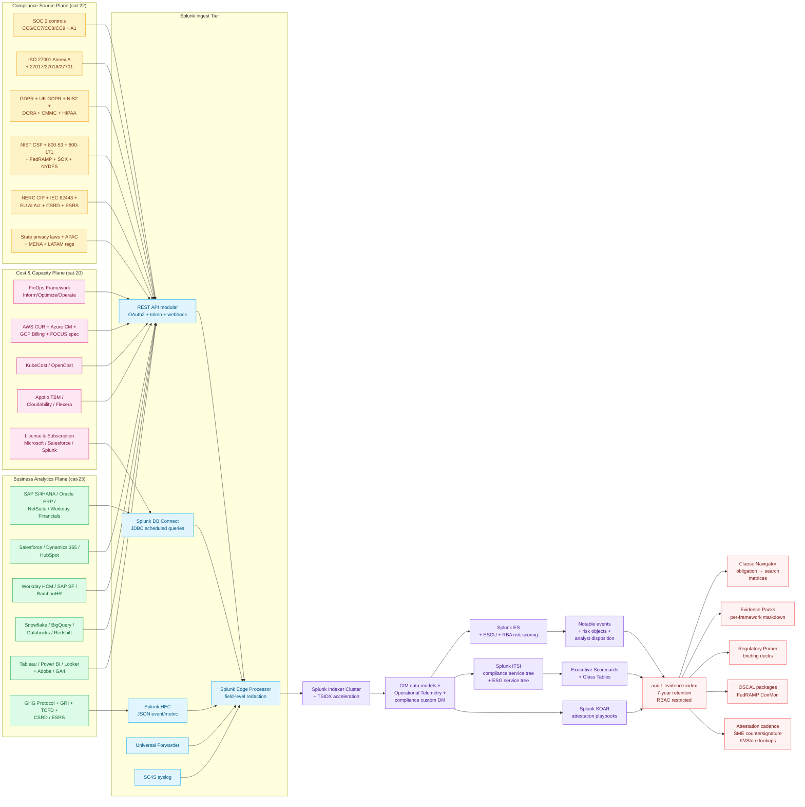

# Compliance & Business Analytics Domain Master Guide

> Splunk's value in compliance & business analytics comes from
> **synthesising three independent governance planes — financial
> spend, regulatory obligations, and business intelligence — into
> one immutable, attestation-ready timeline**. CFO narratives must
> reconcile with engineering reality; regulator interrogations must
> survive forensic scrutiny; sustainability disclosures must trace
> to instrumented evidence. This domain guide bridges three
> catalogue pillars — Cost & Capacity Management (cat 20, 77 UCs),
> Regulatory & Compliance Frameworks (cat 22, 1,332 UCs), and
> Business Analytics & Executive Intelligence (cat 23, 63 UCs) —
> into one sequenced operational programme. It is the **front
> door** for CISO, CIO, CFO, CRO, DPO, and Board Risk Committee
> readers; per-framework deep dives live in `docs/evidence-packs/`
> and the integration guides linked below.

## Table of Contents

- [Audience and Use](#audience-and-use)
- [Quick Start — From Zero to First Audit-Ready Evidence in 30 Days](#quick-start--from-zero-to-first-audit-ready-evidence-in-30-days)
- [Architecture and Data Flow](#architecture-and-data-flow)
- [Domain 1 — Cost & Capacity Management (cat 20, 77 UCs)](#domain-1--cost--capacity-management-cat-20-77-ucs)
- [Domain 2 — Regulatory & Compliance Frameworks (cat 22, 1,332 UCs)](#domain-2--regulatory--compliance-frameworks-cat-22-1332-ucs)
- [Domain 3 — Business Analytics & Executive Intelligence (cat 23, 63 UCs)](#domain-3--business-analytics--executive-intelligence-cat-23-63-ucs)
- [Three Lines of Defense Anchor](#three-lines-of-defense-anchor)
- [Framework Overlap Crosswalk](#framework-overlap-crosswalk)
- [Evidence Pack Assembly](#evidence-pack-assembly)
- [Crawl / Walk / Run Roadmap (22 / 60 / 50 UCs)](#crawl--walk--run-roadmap-22--60--50-ucs)
- [Sizing and Capacity Planning](#sizing-and-capacity-planning)
- [Reference Dashboards](#reference-dashboards)
- [SPL Examples](#spl-examples)
- [Troubleshooting](#troubleshooting)
- [SOAR Playbook Catalogue](#soar-playbook-catalogue)
- [Cross-Product Integration](#cross-product-integration)
- [References](#references)

## Audience and Use

| Audience | What you get from this guide | Where to go for depth |
|---|---|---|
| **Board Risk Committee** | Three Lines of Defense scorecard, regulator-ready narrative, risk appetite mapping | `docs/evidence-packs/`, `regulatory-compliance-master.md` |
| **CISO** | Compliance ↔ security control crosswalk, evidence pack assembly | `security-monitoring.md`, `docs/evidence-packs/` |
| **CIO** | IT spend governance, FinOps showback / chargeback, ITGC traceability | `finops-cost-capacity.md`, `cloud-monitoring.md` |
| **CFO** | Revenue / forecast accuracy, FP&A reconciliation, FinOps unit economics | `business-analytics.md`, `finops-cost-capacity.md` |
| **CRO** | ERM heatmap with telemetry-derived KRIs / KCIs, residual risk dashboards | `regulatory-compliance-master.md` |
| **DPO** | GDPR<sup class="ref">[<a href="#ref-3">3</a>]</sup> / UK GDPR<sup class="ref">[<a href="#ref-14">14</a>]</sup> / state privacy law DPIA evidence + DSAR fulfilment | `docs/evidence-packs/gdpr.md`, `docs/evidence-packs/uk-gdpr.md` |
| **Internal Audit (3LoD line 3)** | Workpaper-grade evidence + ITGC + IT4IT mapping | `service-management-itsm.md`, `docs/evidence-packs/sox-itgc.md` |
| **External Auditor / 3PAO** | Continuous control monitoring + OSCAL + FedRAMP ConMon packages | `docs/evidence-packs/`, `docs/regulatory-primer.md` |
| **Sustainability Lead (CSO)** | CSRD / ESRS / TCFD scope 1+2+3 telemetry-driven disclosure | `business-analytics.md` (cat-23.9 ESG section) |
| **Compliance Officer** | Multi-framework crosswalk + Clause Navigator mapping | `regulatory-compliance-master.md`, Clause Navigator |
| **GRC Platform Owner (ServiceNow GRC / Archer / OneTrust)** | Splunk evidence integration patterns | `service-management-itsm.md` |

## Quick Start — From Zero to First Audit-Ready Evidence in 30 Days

### Week 1 — Compliance Foundation

1. **Provision `audit_evidence` index** with role-based access controls + immutable retention policies.
2. **Identify your top 3 audit frameworks** by enforcement teeth (e.g. SOC 2 + GDPR + PCI DSS for SaaS; SOX + HIPAA for healthcare).
3. **Clone the corresponding Evidence Packs** under `docs/evidence-packs/` for those frameworks.
4. **First three detections enabled:**
   - UC-22.1.1 GDPR PII Detection in Application Log Data
   - UC-22.8.1 SOC 2 Trust Services Criteria<sup class="ref">[<a href="#ref-1">1</a>]</sup> Continuous Control Monitoring
   - UC-22.11.1 Scheduled Firewall Rule Review Evidence for CDE NSCs

### Week 2 — Cost & Spend Governance

5. **AWS CUR + Azure Cost Management + GCP Billing** into `finops_chargeback`.
6. **Cost Anomaly detection** with seasonal decomposition.
7. **Idle Resource identification** + rightsizing.
8. **First three detections enabled:**
   - UC-20.1.1 Daily Spend Trending
   - UC-20.1.2 Cost Anomaly Detection
   - UC-20.1.4 Idle Resource Identification

### Week 3 — Business Analytics Foundation

9. **Salesforce Opportunity / Pipeline + Service Cloud** via Bulk API 2.0 → HEC into `biz_pipeline`.
10. **SAP S/4HANA Financial Close + GL** via DB Connect → `biz_finance`.
11. **Workday HCM** via RaaS exports → `biz_hr` (RBAC scoped to HR-approved roles).
12. **First three detections enabled:**
    - UC-23.2.1 Sales Pipeline Velocity and Forecast Accuracy
    - UC-23.6.1 Accounts Receivable Aging and Cash Collection
    - UC-23.4.1 Workday Employee Attrition Risk

### Week 4 — Executive Scorecard + Attestation Cycle

13. **Build CEO/CFO Business Health Scorecard** combining 5-7 critical KPIs from above.
14. **Establish quarterly SME attestation cadence** with `reviewed_by` + `review_epoch` KVStore lookups.
15. **First three detections enabled:**
    - UC-23.8.1 CEO/CFO Business Health Scorecard
    - UC-22.7.1 NIST CSF Maturity Posture Dashboard
    - UC-22.6.1 ISO 27001 Annex A Control Effectiveness Monitoring

By day 30 you have **15 production detections**, attestation
cadence in place, and the executive narrative that survives
auditor scrutiny.

## Architecture and Data Flow



### Core principles repeated throughout

1. **Continuous control monitoring beats point-in-time audit.**
   Splunk excels at immutable timelines, scheduled attestations,
   and tamper-evident exports. Quarterly screenshot binders are
   audit anti-patterns.
2. **Saved searches with deterministic destinations.** Schedule UC-
   backed searches to summary indexes or `stash://` destinations
   stamped per UC-ID. Audit sampling prefers reproducibility over
   exploratory SPL nobody archived.
3. **SME attestation is non-negotiable.** Adaptive Response
   frameworks optionally page IR leads, but **must capture
   acknowledgement arrays** (`reviewed_by`, `review_epoch`)
   persisted via KVStore lookups. Courts and regulators punish
   checkbox automation lacking SME timestamps.
4. **Three Lines of Defense alignment.** Operational management
   (line 1), risk & compliance (line 2), internal audit (line 3) —
   each consume different views of the same Splunk searches.
5. **Framework overlap should be celebrated.** A single Splunk
   search satisfies SOC 2 CC6.1 + ISO 27001 A.9 + NIST CSF PR.AC
   + PCI DSS Req 7-8 + HIPAA §164.312(a) simultaneously. Document
   reuse in workpapers; auditors reward this.
6. **Data minimisation discipline.** Strip unnecessary HR salary
   fields before HRIS indexes intersect security indexes. DPIAs
   reference Clause Navigator mappings proving necessity.
7. **Evidence index hygiene.** `audit_evidence` is RBAC-restricted,
   immutable retention, never co-mingled with operational indexes.
   Reviewed for legal admissibility and chain-of-custody.
8. **Cost telemetry binds to business outcomes.** FinOps showback
   is meaningless without service-to-cost-center attribution.
   Without tagging discipline, chargeback is fiction.
9. **Business Analytics needs grain reconciliation.** When CFO
   numbers diverge from CRM forecasts, **the grain is wrong**.
   Splunk excels at making grain mismatches visible nightly.

---

## Domain 1 — Cost & Capacity Management (cat 20, 77 UCs)

> Per-product depth: `finops-cost-capacity.md`. Cloud-specific cost
> patterns: `cloud-monitoring.md`.

### Subcategory map

| Sub | Focus | UCs | Deep-dive guide |
|---|---|---|---|
| 20.1 | Cloud Cost Monitoring | 27 | `finops-cost-capacity.md` |
| 20.2 | Capacity Planning | 33 | `finops-cost-capacity.md` |
| 20.3 | License & Subscription Management | 17 | `finops-cost-capacity.md` |

### FinOps Framework alignment

Per the FinOps Framework, mature organisations cycle through three
phases: **Inform** (visibility), **Optimize** (rightsizing,
commitments, anomaly remediation), **Operate** (continuous
improvement, automation, governance).

**Critical UCs:**
- UC-20.1.1 Daily Spend Trending
- UC-20.1.2 Cost Anomaly Detection
- UC-20.1.4 Idle Resource Identification
- UC-20.1.5 Budget Threshold Alerting
- UC-20.1.13 Cost Anomaly by Cloud Service
- UC-20.2.1 Compute Capacity Forecasting
- UC-20.2.2 Storage Growth Forecasting
- UC-20.2.24 Cost Anomaly with Seasonal Decomposition

### FOCUS specification + KubeCost / OpenCost

- **FOCUS v1.x** is the cross-vendor billing schema (AWS / Azure /
  GCP / Oracle compliant). Standardise downstream analytics on
  FOCUS columns to avoid per-vendor schema drift.
- **KubeCost / OpenCost** provide per-namespace / per-deployment
  Kubernetes cost allocation. Required for accurate container
  showback / chargeback because multiple teams share nodes.

### License and subscription telemetry

Cloud invoices increasingly bundle SaaS seats, marketplace
subscriptions, and committed credits beside raw compute meters.
Normalise entitlement exports — Microsoft 365 / Office 365 seats,
Salesforce licenses, Splunk license usage (`license_usage.log`
summaries), Azure Hybrid Benefit posture — alongside CUR / Billing
rows.

---

## Domain 2 — Regulatory & Compliance Frameworks (cat 22, 1,332 UCs)

> Per-framework depth: 12 tier-1 evidence packs at
> `docs/evidence-packs/` + `regulatory-compliance-master.md` + the
> `docs/regulatory-primer.md` briefing reference.

### Subcategory map (representative — confirm live inventory against `Browse Cat 22`)

| Framework | UCs | Evidence pack | Primer anchor |
|---|---|---|---|
| GDPR | 50 | `docs/evidence-packs/gdpr.md` | Tier-1 |
| UK GDPR | (subset of GDPR) | `docs/evidence-packs/uk-gdpr.md` | Tier-1 |
| NIS2 | 57 | `docs/evidence-packs/nis2.md` | Tier-1 |
| DORA<sup class="ref">[<a href="#ref-4">4</a>]</sup> | 40 | `docs/evidence-packs/dora.md` | Tier-1 |
| CCPA / CPRA | 25 | (state-privacy section) | Tier-2 |
| PCI DSS 4.0 | 90 | `docs/evidence-packs/pci-dss.md` | Tier-1 |
| HIPAA Security Rule<sup class="ref">[<a href="#ref-13">13</a>]</sup> | 55 | `docs/evidence-packs/hipaa-security.md` | Tier-1 |
| SOX ITGC | 35 | `docs/evidence-packs/sox-itgc.md` | Tier-1 |
| NIST CSF 2.0<sup class="ref">[<a href="#ref-8">8</a>]</sup> | 50 | `docs/evidence-packs/nist-csf.md` | Tier-1 |
| NIST 800-53 r5 | 80 | `docs/evidence-packs/nist-800-53.md` | Tier-1 |
| ISO 27001:2022 | 45 | `docs/evidence-packs/iso-27001.md` | Tier-1 |
| SOC 2 Type II | 30 | `docs/evidence-packs/soc-2.md` | Tier-1 |
| NERC CIP | 70 | (electric-sector pack) | Tier-2 |
| ISA/IEC 62443 | 55 | (OT/ICS pack) | Tier-2 |
| CMMC 2.0 | 20 | `docs/evidence-packs/cmmc.md` | Tier-1 |
| EU AI Act<sup class="ref">[<a href="#ref-5">5</a>]</sup> | 25 | (AI governance pack) | Tier-2 |
| Other (state privacy / regional / sector) | Various | (cross-cutting families 22.35-22.49) | Tier-3 |

### EU regimes — GDPR, NIS2, DORA, EU AI Act, CSRD

| Regulation | Critical UC anchor |
|---|---|
| **GDPR** Art. 32 + 33 + 34 | UC-22.1.1 GDPR PII Detection in Application Log Data |
| **NIS2** Art. 23(4)(a) — 24h early warning | UC-22.2.1 NIS2 24-Hour Early-Warning Notification Readiness |
| **DORA** Art. 5-14 ICT risk mgmt | UC-22.3.1 DORA ICT Risk Management Dashboard |
| **EU AI Act** Art. 12 — model performance | UC-22.21.4 Model Performance Degradation Detection |
| **CSRD / ESRS** Scope 1+2+3 | UC-23.9.1 Enterprise GHG Inventory: Scopes 1-3 CO2e |

### US regimes — CCPA / HIPAA / PCI DSS / SOX / NIST CSF

| Regulation | Critical UC anchor |
|---|---|
| **CCPA / CPRA** | UC-22.4.1 CCPA Consumer Data Access and Deletion Request Tracking |
| **HIPAA Security Rule** | UC-22.10.1 HIPAA Risk Analysis Evidence — Asset & ePHI Inventory |
| **PCI DSS 4.0 Req 1** | UC-22.11.1 Scheduled Firewall Rule Review Evidence for CDE NSCs |
| **SOX ITGC** | UC-22.12.1 User Provisioning Evidence Tied to Financial App Accounts |
| **NIST CSF 2.0** | UC-22.7.1 NIST CSF Maturity Posture Dashboard |
| **NIST 800-53 r5 AU-2** | UC-22.14.1 Centralized Audit Event Logging Policy Coverage |
| **NYDFS 23 NYCRR 500** | (financial services overlay) |

### Cross-industry & technical baselines

| Framework | Critical UC anchor |
|---|---|
| **ISO 27001 Annex A** | UC-22.6.1 ISO 27001 Annex A Control Effectiveness Monitoring |
| **SOC 2 TSC** | UC-22.8.1 SOC 2 Trust Services Criteria Continuous Control Monitoring |
| **NERC CIP-005** | UC-22.13.11 Electronic Access Authorization Record Coverage for PAM Sessions |
| **IEC 62443** | UC-22.15.1 OT Security Policy Control Evidence + UC-22.16.1 IT/OT Boundary Deny vs Allow |
| **CMMC Level 2** | UC-22.20.1 CMMC Level 2 practice evidence — CUI control area 1 |

### How Splunk provides continuous compliance evidence

| Pattern | Detail |
|---|---|
| **Saved searches with deterministic destinations** | Schedule UC-backed searches to summary or `stash://` indexes stamped per UC-ID |
| **Evidence lineage tags** | `provenance`, `requires_sme_review` embedded inside UC JSON compliance blocks |
| **SME attestation rituals** | Quarterly governance councils review Clause Navigator outputs; annotate deltas inside Compliance Story drafts before PDF circulation |
| **OSCAL package generation** | FedRAMP ConMon evidence assembled via OSCAL components mapped to UC IDs |
| **Immutable evidence index** | `audit_evidence` with WORM-equivalent retention + RBAC + SAML role binding |
| **Cross-border transfer narratives** | Splunk Cloud residency annotated with SCC templates; `_time`-bounded excerpts demonstrating contractual SLA clocks |

---

## Domain 3 — Business Analytics & Executive Intelligence (cat 23, 63 UCs)

> Per-product depth: `business-analytics.md`.

### Subcategory map

| Sub | Focus | UCs |
|---|---|---|
| 23.1 | Customer Experience | 9 |
| 23.2 | Revenue / Sales | 8 |
| 23.3 | Marketing | 7 |
| 23.4 | HR / People | 7 |
| 23.5 | Supply Chain | 7 |
| 23.6 | Finance | 6 |
| 23.7 | Customer Support | 6 |
| 23.8 | Executive Dashboards | 6 |
| 23.9 | ESG / Sustainability | 7 |

### Critical UCs by subcategory

| Sub | Critical UC | Why |
|---|---|---|
| 23.1 | UC-23.1.1 Website Conversion Funnel Analysis | Churn warning long before finance books attrition |
| 23.2 | UC-23.2.1 Sales Pipeline Velocity & Forecast Accuracy + UC-23.2.2 SAP S/4HANA Bookings/Recognized Revenue + UC-23.2.3 Customer Churn Prediction | CRM forecast vs ERP recognition reconciliation |
| 23.3 | UC-23.3.1 Cross-Channel Marketing ROI | Blended CAC scrutiny under macro softness |
| 23.4 | UC-23.4.1 Workday Employee Attrition Risk | SOC staffing gaps cascade from workforce disruption |
| 23.5 | UC-23.5.1 Order-to-Cash Cycle Time | Inventory carrying cost surfaced late |
| 23.6 | UC-23.6.1 AR Aging and Cash Collection | Treasury liquidity hedging |
| 23.7 | UC-23.7.1 On-Time Resolution / SLA Breach for CSM | Support friction predicts churn |
| 23.8 | UC-23.8.1 CEO/CFO Business Health Scorecard | Single-pane KPI synthesis |
| 23.9 | UC-23.9.1 Enterprise GHG Inventory: Scopes 1-3 CO2e | Sustainability-linked lending |

### Ingestion patterns for business systems

| Source system | Pattern | Sourcetype |
|---|---|---|
| Salesforce | Bulk API 2.0 + Streaming API + CDC | `salesforce:opportunity`, `salesforce:case` |
| SAP S/4HANA | DB Connect + SAP BTP REST | `sap:s4hana:*`, `sap:ecc:*` |
| Oracle ERP | DB Connect + Oracle REST | `oracle:erp:*` |
| NetSuite | SuiteAnalytics + REST | `netsuite:*` |
| Workday | RaaS reports + REST | `workday:hcm:*`, `workday:financials:*` |
| Tableau | Audit log REST API | `tableau:audit` |
| Power BI | Audit log via M365 Graph | `powerbi:audit` |
| Looker | Audit log REST | `looker:audit` |
| GA4 / Adobe Analytics | Reporting API + BigQuery export | `ga4:*`, `adobe:analytics:*` |

### Grain reconciliation discipline

When CFO numbers diverge from CRM forecasts, **the grain is
wrong**. Splunk SPL pattern to surface this nightly:

```spl
| join customer_id [search index=biz_pipeline source="*salesforce*"]
| join customer_id [search index=biz_finance source="*sap*"]
| stats sum(opportunity_amount) as crm_forecast, sum(recognized_revenue) as erp_recognized by customer_id
| eval grain_mismatch_pct = abs(crm_forecast - erp_recognized) / crm_forecast * 100
| where grain_mismatch_pct > 10
| sort - grain_mismatch_pct
```

---

## Three Lines of Defense Anchor

The IIA's Three Lines Model defines:

| Line | Owner | Splunk view |
|---|---|---|
| **Line 1** — Operational Management | Process owners, IT operations, app teams | Operational dashboards (cat-13.2 ITSI service tree) |
| **Line 2** — Risk & Compliance | CISO, CRO, DPO, Compliance Officer | Compliance dashboards (cat-22 evidence pack views) |
| **Line 3** — Internal Audit | Internal audit function, audit committee | Workpaper-grade evidence (`audit_evidence` index) |

External assurance providers (3PAOs, SOC 2 auditors, statutory
auditors, regulators) consume the same evidence with different
scoping.

### COSO Internal Control Framework alignment

The 17 COSO principles map to Splunk capabilities:

| Component | Principles | Splunk anchor |
|---|---|---|
| **Control Environment** | 1-5 | Splunk RBAC + Asset & Identity Framework |
| **Risk Assessment** | 6-9 | RBA risk score per asset/identity |
| **Control Activities** | 10-12 | ESCU detection content + correlation searches |
| **Information & Communication** | 13-15 | Splunk dashboards + Glass Tables + episode reviews |
| **Monitoring Activities** | 16-17 | ITSI service health + adaptive thresholds + attestation cycles |

---

## Framework Overlap Crosswalk

A single Splunk search satisfies multiple frameworks when control
domains overlap. Document **reuse** in workpapers — auditors reward
this; redundant work is anti-pattern.

| Control domain | GDPR | NIS2 | DORA | PCI DSS 4.0 | HIPAA | SOX | NIST CSF 2.0 | ISO 27001:2022 | SOC 2 | NERC CIP | IEC 62443 | CMMC 2.0 | NIST 800-53 r5 |
|---|---|---|---|---|---|---|---|---|---|---|---|---|---|
| **Access control** | Art.32 | Art.21(2)(d) | Art.9(4)(c) | Req.7-8 | §164.312(a) | ITGC | PR.AC | A.5.15-A.5.18 | CC6.1-3 | CIP-004/005 | SR 1.1-1.13 | AC.L2 | AC family |
| **Logging & monitoring** | Art.30 | Art.21(2)(g) | Art.10 | Req.10 | §164.312(b) | ITGC | DE.CM | A.8.15-A.8.17 | CC7.1-3 | CIP-007-R4 | SR 6.1-6.2 | AU.L2 | AU family |
| **Incident response** | Art.33-34 | Art.23 | Art.17-19 | Req.12.10 | §164.308(a)(6) | — | RS.RP | A.5.24-A.5.27 | CC7.4-5 | CIP-008 | SR 6.2 | IR.L2 | IR family |
| **Change management** | — | Art.21(2)(e) | Art.8(4) | Req.6.5 | §164.308(a)(5) | ITGC | PR.PS | A.8.32 | CC8.1 | CIP-010 | SR 7.6 | CM.L2 | CM family |
| **Encryption** | Art.32(1)(a) | Art.21(2)(h) | Art.9(4)(d) | Req.3-4 | §164.312(a)(2)(iv) | — | PR.DS | A.8.24 | CC6.7 | CIP-011 | SR 4.1-4.3 | SC.L2 | SC family |
| **Asset inventory** | Art.30 | Art.21(2)(a) | Art.5 | Req.2 | §164.310(d) | — | ID.AM | A.5.9 | CC6.1 | CIP-002 | SR 7.1 | CM.L2 | CM family |
| **Vulnerability mgmt** | — | Art.21(2)(f) | Art.10 | Req.6.3 + 11 | §164.308(a)(8) | — | ID.RA + DE.CM | A.5.36 + A.8.8 | CC7.1 | CIP-007-R2 | SR 5.1-5.3 | RA.L2 | RA + SI families |
| **Risk assessment** | Art.35 (DPIA) | Art.21(2)(a) | Art.5-6 | Req.12.3 | §164.308(a)(1) | ICFR | ID.RA + GV.RM | A.5.4 | CC3.1-3 | CIP-003 | (ZCR) | RA.L2 + RM | RA family |
| **3rd-party risk** | Art.28 | Art.21(2)(d) | Art.28-30 | Req.12.8 | §164.308(b) | ITGC vendor | GV.SC | A.5.19-A.5.23 | CC9.2 | CIP-013 | SR 8.1 | (CMMC L3) | SR family |
| **Crisis mgmt / BC** | — | Art.21(2)(c) | Art.10-12 | Req.12.10.1 | §164.308(a)(7) | — | RC.RP + RS.MA | A.5.29-A.5.30 | A1.1-3 | CIP-009 | SR 7.4 | (CMMC L2) | CP family |

---

## Evidence Pack Assembly

### Per-framework structure

Each Evidence Pack under `docs/evidence-packs/` follows a stable
contract:

1. **Regulator-ready introduction** — Plain-language framing
2. **Control mapping table** — Framework clause ↔ UC ID
3. **Evidence collection cadence** — Schedule (daily / weekly / monthly / quarterly)
4. **Sample SPL exports** — Reproducible queries with stable field names
5. **Retention requirements** — Aligned to regulatory mandates
6. **Auditor Q&A prompts** — Pre-baked answers to common interrogations
7. **Workflow diagram** — How evidence flows from detection → archive → audit room

### OSCAL package generation (FedRAMP / NIST RMF)

For FedRAMP ConMon and federal authorisations, Splunk evidence
generates OSCAL components:

| OSCAL element | Splunk source |
|---|---|
| **Component definition** | KVStore lookup of UC IDs ↔ NIST 800-53 control IDs |
| **System Security Plan (SSP)** | Catalogue export filtered by FedRAMP baseline |
| **Assessment plan** | ESCU correlation search inventory |
| **Assessment results** | `notable` + `risk` index events for assessment window |
| **POA&M** | Open notable events past SLA, with remediation tickets |

---

## Crawl / Walk / Run Roadmap (22 / 60 / 50 UCs)

### Crawl tier (22 UCs — month 1-2)

The "first 30 days" detections from the Quick Start, plus 7 high-
value extensions:

| UC | Domain | Title |
|---|---|---|
| 22.1.1 | GDPR | GDPR PII Detection in Application Log Data |
| 22.2.1 | NIS2 | NIS2 24-Hour Early-Warning Notification Readiness |
| 22.3.1 | DORA | DORA ICT Risk Management Dashboard |
| 22.6.1 | ISO 27001 | ISO 27001 Annex A Control Effectiveness Monitoring |
| 22.7.1 | NIST CSF | NIST CSF Maturity Posture Dashboard |
| 22.8.1 | SOC 2 | SOC 2 Trust Services Criteria Continuous Control Monitoring |
| 22.10.1 | HIPAA | HIPAA Risk Analysis Evidence — Asset & ePHI Inventory |
| 22.11.1 | PCI DSS | Scheduled Firewall Rule Review Evidence for CDE NSCs |
| 22.12.1 | SOX | User Provisioning Evidence Tied to Financial App Accounts |
| 22.14.1 | NIST 800-53 | Centralized Audit Event Logging Policy Coverage |
| 22.20.1 | CMMC | CMMC Level 2 practice evidence — CUI control area 1 |
| 20.1.1 | FinOps | Daily Spend Trending |
| 20.1.2 | FinOps | Cost Anomaly Detection |
| 20.1.4 | FinOps | Idle Resource Identification |
| 20.1.5 | FinOps | Budget Threshold Alerting |
| 23.2.1 | Sales | Sales Pipeline Velocity and Forecast Accuracy |
| 23.6.1 | Finance | Accounts Receivable Aging and Cash Collection |
| 23.4.1 | HR | Workday Employee Attrition Risk |
| 23.7.1 | Support | On-Time Resolution and SLA Breach Rate |
| 23.8.1 | Executive | CEO/CFO Business Health Scorecard |
| 23.1.1 | CX | Website Conversion Funnel Analysis |
| 23.5.1 | Supply | Order-to-Cash Cycle Time and Bottleneck Analysis |

### Walk tier (60 UCs — month 3-6)

Highlights:
- Full 12 tier-1 evidence pack control coverage
- State privacy expansion (CCPA / CPRA / TX TDPSA / VA VCDPA / CO CPA)
- NERC CIP / IEC 62443 (electric / OT)
- EU AI Act high-risk system controls
- CSRD / ESRS scope 3 supply chain emissions
- FOCUS spec multi-cloud cost normalisation
- KubeCost / OpenCost workload allocation
- License & subscription full set (20.3.x)
- Capacity forecasting (20.2.x)
- Marketing ROI / multi-touch attribution (23.3.x)
- Customer churn prediction with ML (23.2.3)
- SAP financial close + ERP reconciliation (23.2.2 extended)

### Run tier (50 UCs — month 7+)

Highlights:
- OSCAL-based FedRAMP ConMon automation
- AI / ML risk modelling (EU AI Act high-risk classification)
- Continuous adversary emulation feedback loops (Atomic Red Team)
- Multi-jurisdictional privacy DSAR fulfilment (Asana / ServiceNow + Splunk evidence)
- Sustainability-linked lending KPI scorecard
- Regulator-graded RBA risk modelling per CCO appetite
- Three Lines of Defense automated workflow
- Predictive financial close anomalies (ML-driven JE detection)
- ESG scope 3 financed-emissions (PCAF) for FIs
- Quantum-readiness control attestation (post-quantum cryptography)

---

## Sizing and Capacity Planning

| Source | Per-1k-employee daily volume | Monthly storage |
|---|---|---|
| Splunk ES notable + risk + correlation | 500 MB | 15 GB |
| ESCU detection content | 200 MB | 6 GB |
| `audit_evidence` index (continuous control monitoring) | 1-2 GB | 30-60 GB |
| Compliance per-framework summary (12 frameworks) | 500 MB | 15 GB |
| AWS CUR / Azure CM / GCP Billing | 1 GB | 30 GB |
| KubeCost / OpenCost | 500 MB | 15 GB |
| Salesforce CRM (opportunities + cases) | 2 GB | 60 GB |
| SAP S/4HANA financial close + GL | 5 GB | 150 GB |
| Workday HCM | 500 MB | 15 GB |
| Marketing analytics (GA4 + Adobe) | 2 GB | 60 GB |
| Tableau / Power BI / Looker audit | 200 MB | 6 GB |
| ServiceNow GRC + IRM | 500 MB | 15 GB |
| Sustainability / ESG (energy meters + carbon) | 200 MB | 6 GB |

**Worked example (10k-employee mid-market enterprise):**
- ES + ESCU + correlation: ~7 GB/day
- 12 evidence packs: ~12 GB/day total
- `audit_evidence` archive: ~10 GB/day (long-term retention)
- FinOps ingestion (CUR + KubeCost): ~10 GB/day
- Business systems (Salesforce + SAP + Workday + Tableau): ~30 GB/day
- ESG / sustainability: ~1 GB/day

→ **~70-75 GB/day indexed compliance & business data** for a
fully-instrumented programme. Long-term audit archive multiplies
storage cost; tier `audit_evidence` to S3 / Azure Blob with Splunk
SmartStore + Federated Search for Amazon S3.

---

## Reference Dashboards

| Dashboard | Audience | Refresh | Source |
|---|---|---|---|
| CEO/CFO Business Health Scorecard | CEO + CFO + Board | 24h | `biz_executive` |
| Three Lines of Defense Heatmap | Audit Committee | 24h | All compliance + risk |
| Compliance Coverage Heatmap | CISO + CCO | 1h | All compliance indexes |
| Per-Framework Evidence Inventory | GRC | 24h | Per-framework index |
| FinOps Spend by Service | FinOps + Cloud Ops | 24h | `finops_chargeback` |
| Cost Anomaly + Deploy Correlation | FinOps + DevOps | 1h | `finops_anomaly` |
| Sales Pipeline ↔ ERP Recognition | CFO + RevOps | 24h | join `biz_pipeline` + `biz_finance` |
| AR Aging + Cash Collection | Treasury | 24h | `biz_finance` |
| Workforce Attrition Risk | CHRO | 24h | `biz_hr` |
| Marketing ROI Per Channel | CMO | 24h | `biz_marketing` |
| Order-to-Cash Bottleneck | Supply Chain Lead | 24h | `biz_supplychain` |
| ESG Scope 1+2+3 Dashboard | CSO / CFO | Weekly | `biz_esg` |
| Customer Churn Risk | CRO + RevOps | 24h | `biz_revenue` |
| Compliance Attestation Backlog | Compliance Officer | 24h | `audit_attestation` |
| Regulator Notification Readiness (NIS2 / DORA / SEC) | CISO + CCO | 1h | `cmp_*` indexes |

---

## SPL Examples

### Continuous Control Monitoring (SOC 2 CC7.1)

```spl
| from datamodel:Authentication.All_Authentication
| stats count(eval(action="failure")) as fails, count(eval(action="success")) as successes by user, _time span=1h
| eval failure_rate = fails / (fails + successes)
| where failure_rate > 0.5 AND fails > 10
| eval control_id = "SOC2.CC7.1", framework = "SOC2", uc_id = "22.8.1"
| collect index=audit_evidence
```

### NIS2 24-hour early warning readiness

```spl
index=notable severity_id>=4 earliest=-24h
| eval first_seen = strftime(min(_time), "%Y-%m-%dT%H:%M:%S%z")
| eval reportable_within = case(
    severity_id=5, "1h",
    severity_id=4, "24h",
    1=1, "no")
| eval nis2_clock_remaining = relative_time(now(), "+24h") - max(_time)
| where reportable_within != "no"
| stats min(first_seen) as initial_detection, max(_time) as last_event, count by entity, severity_id
| eval status = if(nis2_clock_remaining < 3600, "BREACH IMMINENT", "OK")
```

### GDPR DSAR fulfilment evidence

```spl
index=cmp_gdpr sourcetype="cmp:gdpr:dsar"
| stats count by status, request_type, _time span=1d
| chart sum(count) over _time by status
| eval sla_target_days = case(
    request_type="erasure", 30,
    request_type="access", 30,
    request_type="rectification", 30,
    request_type="portability", 30)
```

### FinOps cost anomaly + deploy correlation

```spl
| multisearch
  [ search index=finops_chargeback sourcetype="aws:cur:billing"
    | timechart span=1d sum(unblended_cost) as daily_cost by service
    | eval event_class = "cost", _time = _time ]
  [ search index=app_devops_pipeline source="*deploy*" status="success"
    | eval event_class = "deploy" ]
| stats values(actions) by service, event_class, _time span=1d
| ...
```

### CFO/CEO Business Health Scorecard composite

```spl
| multisearch
  [ search index=biz_pipeline | stats sum(opportunity_amount) as pipeline_total ]
  [ search index=biz_finance source="*sap*" | stats sum(recognized_revenue) as recognized ]
  [ search index=biz_revenue | stats avg(churn_rate) as churn ]
  [ search index=biz_finance | stats avg(dso) as days_sales_outstanding ]
  [ search index=biz_hr | stats avg(attrition_rate) as attrition ]
| eventstats values(*) as *
| stats first(*) as *
| eval score = case(
    churn < 5 AND dso < 45, "green",
    churn < 10 AND dso < 60, "yellow",
    1=1, "red")
```

### MITRE ATT&CK + NIST CSF coverage scorecard

```spl
| inputlookup mitre_technique_map.csv
| join type=outer technique_id [
    | rest /servicesNS/-/-/saved/searches splunk_server=local
    | search action.correlationsearch.enabled="1"
    | rex field=description "T(?<technique_id>\d+)(\.\d+)?"
    | rex field=description "(?<csf_function>GV|ID|PR|DE|RS|RC)"
    | stats values(title) as covering_searches by technique_id, csf_function
  ]
| eval coverage = if(isnull(covering_searches), "uncovered", "covered")
| stats count by tactic_name, csf_function, coverage
| chart sum(count) over csf_function by coverage
```

---

## Troubleshooting

| Symptom | Likely cause | Fix |
|---|---|---|
| `audit_evidence` retention exhausted prematurely | Wrong DM acceleration overhead | Disable DM accel on `audit_evidence`; use SmartStore for cold-tier |
| Compliance scorecard shows 0% for valid framework | Per-framework summary index empty | Verify scheduled saved searches are firing on `audit_evidence` |
| GDPR PII scan misses obvious PII | Tokeniser missing SE / EU character classes | Add custom regex tuned to your locales |
| NIS2 24h clock alarm flaps | Severity threshold too low | Tune to severity_id ≥ 4 (high) initially; iterate |
| FinOps showback per pod = $0 | KubeCost not configured or wrong cluster ID | Install KubeCost; verify cluster ID join key |
| CRM ↔ ERP grain reconciliation spurious | Customer ID mapping inconsistent | Build authoritative customer-360 lookup nightly |
| Marketing attribution fragmented | UTM tagging discipline absent | Enforce UTM template at campaign creation |
| Workday extracts contain too much PII | Field minimisation discipline | Apply `INGEST_EVAL` redaction + RBAC at index level |
| ESG scope 3 estimates lack supplier coverage | PCAF data acquisition gap | Onboard CDP + EcoVadis + Sustainalytics supplier profiles |
| OSCAL package generation fails validation | Component definition drift | Re-run KVStore lookup against current 800-53 r5 catalog |
| ServiceNow GRC sync drift | Bi-directional webhook missing | Configure both push (webhook) + pull (polling) for safety net |
| Tableau / Power BI audit log incomplete | Audit logging not enabled | Enable Tableau Server site audit + M365 audit log |
| Salesforce Bulk API throttled | Polling interval too aggressive | Switch to Streaming API or Change Data Capture |
| SAP financial close anomaly false positives | Top-side adjustment seasonality | Add quarterly close exclusion windows |
| Compliance attestation aging | Manual attestation cadence broken | Automate ServiceNow ticket creation per attestation due date |

---

## SOAR Playbook Catalogue

### Reference playbooks for the compliance & business domain

| Playbook | Trigger UC | Phases | Severity |
|---|---|---|---|
| `gdpr_pii_response` | UC-22.1.1 | route to DPO, contain log source, trigger DPIA | High |
| `nis2_early_warning_response` | UC-22.2.1 | gather context, draft regulator notification, exec page | Critical |
| `dora_incident_classification` | UC-22.3.1 | apply DORA Art. 17 taxonomy, lead-overseer prep, JST liaison | Critical |
| `ccpa_dsar_fulfillment` | UC-22.4.1 | aggregate sources, redact, deliver, log fulfilment | Medium |
| `pci_segmentation_drift_response` | UC-22.11.1 | revert ACL, schedule QSA notification, IR ticket | High |
| `sox_provisioning_drift_response` | UC-22.12.1 | revert provisioning, escalate to ICOFR owner | Medium |
| `cmmc_practice_evidence_collection` | UC-22.20.1 | trigger 3PAO request, archive evidence | Medium |
| `cost_anomaly_attribution` | UC-20.1.2 | identify owner, link to deploy, FinOps escalation | High |
| `idle_resource_remediation` | UC-20.1.4 | open right-sizing ticket, schedule decommission | Medium |
| `crm_erp_grain_mismatch` | (custom) | open RevOps ticket, audit data pipeline | Medium |
| `ar_aging_critical` | UC-23.6.1 | escalate to collections, notify CFO | High |
| `attrition_risk_high` | UC-23.4.1 | confidential outreach to manager + CHRO | High |
| `esg_scope3_data_gap` | (custom) | request supplier data, escalate to CSO | Medium |

---

## Cross-Product Integration

| Other guide | Relationship |
|---|---|
| `regulatory-compliance-master.md` | Cat-22 master — evidence pack assembly |
| `business-analytics.md` | Cat-23 deep dive |
| `finops-cost-capacity.md` | Cat-20 deep dive |
| `cloud-monitoring.md` | Cat-3 + cat-4 + cat-20 cloud overlay |
| `security-monitoring.md` | Cat-9 + cat-10 + cat-17 — security domain overlap |
| `application-monitoring.md` | Cat-7 + 8 + 12 + 13 + 16 — app reliability for SOC 2 A1 |
| `service-management-itsm.md` | Cat-16 — ITSM workflow + ServiceNow GRC integration |
| `splunk-itsi.md` | Cat-13.2 — service tree for compliance scorecards |
| `splunk-platform-health.md` | Cat-13.1 — Splunk-itself audit trail |
| `iot-ot.md` | Cat-14 + cat-10.14 — OT compliance for NERC CIP / IEC 62443 |
| `industry-verticals.md` | Cat-10.12 — vertical-specific fraud / compliance |

---

## References

### Standards and frameworks (with stable URLs)

- AICPA Trust Services Criteria — https://www.aicpa.org/
- ISO/IEC 27001:2022<sup class="ref">[<a href="#ref-7">7</a>]</sup> — https://www.iso.org/standard/27001
- ISO/IEC 27017 (cloud) + 27018 (PII clouds) + 27701 (PIMS)
- HIPAA Security Rule — https://www.hhs.gov/hipaa/
- PCI DSS 4.0 — https://www.pcisecuritystandards.org/
- GDPR — https://gdpr.eu/
- EU NIS2 Directive<sup class="ref">[<a href="#ref-2">2</a>]</sup> — https://eur-lex.europa.eu/eli/dir/2022/2555/oj
- EU DORA — https://eur-lex.europa.eu/eli/reg/2022/2554/oj
- EU AI Act 2024/1689 — https://eur-lex.europa.eu/eli/reg/2024/1689/oj
- EU CSRD 2022/2464 + ESRS — https://eur-lex.europa.eu/eli/dir/2022/2464/oj
- NIST CSF 2.0 — https://www.nist.gov/cyberframework
- NIST SP 800-53 r5 — https://csrc.nist.gov/pubs/sp/800/53/r5/final
- NIST SP 800-171 r3 + 800-218 SSDF + 800-207 ZTA
- FedRAMP — https://www.fedramp.gov/
- CMMC 2.0 — https://dodcio.defense.gov/CMMC/
- COSO Internal Control — https://www.coso.org/
- COSO ERM — https://www.coso.org/enterprise-risk-management
- ISACA COBIT 2019 — https://www.isaca.org/cobit
- IIA Three Lines Model — https://www.theiia.org/en/about-us/
- ITIL v4 (Axelos) — https://www.axelos.com/
- ISO 20000-1:2018 service management
- ISO 22301 BCMS
- ISO 31000 risk management
- FinOps Framework — https://www.finops.org/framework/
- FOCUS specification — https://focus.finops.org/
- KubeCost / OpenCost — https://www.opencost.io/
- GHG Protocol — https://ghgprotocol.org/
- TCFD — https://www.fsb-tcfd.org/
- IFRS S1 + S2 (ISSB) — https://www.ifrs.org/groups/international-sustainability-standards-board/

### Splunk documentation

- Splunk Enterprise Security<sup class="ref">[<a href="#ref-10">10</a>]</sup> 8 — User Manual, Use Case Library, RBA
- Splunk SOAR — Playbook authoring, REST API
- Splunk ITSI<sup class="ref">[<a href="#ref-11">11</a>]</sup> — Compliance service tree
- Splunk DB Connect — JDBC integration
- Splunk Federated Search for Amazon S3 — long-term evidence retention
- Splunk Edge Processor — field-level redaction at ingest
- Splunk Compliance Add-ons (HIPAA / PCI / FFIEC / SOX)

---

**Document maintenance.** Reviewed quarterly against regulatory
release notes, framework revisions, and Splunk product updates.
Last verified against:
- Splunk Enterprise Security 8.0
- Splunk SOAR 6.x
- ESCU current quarterly drop
- ISO/IEC 27001:2022 + 27017 + 27018 + 27701
- NIST CSF 2.0 + 800-53 r5 + 800-171 r3
- PCI DSS 4.0.1
- GDPR + UK GDPR + DPA 2018
- NIS2 + DORA (EU)
- CMMC 2.0
- EU AI Act 2024/1689
- EU CSRD + ESRS
- FedRAMP rev 5
- FinOps Framework + FOCUS v1.x

For corrections or additions, file an issue with `domain-compliance`,
`cat-20`, `cat-22`, or `cat-23` labels.

---

<!-- BEGIN-AUTOGENERATED-SOURCES -->

## References

*Auto-generated by `scripts/generate_doc_references.py` from `data/source-references.json` and `data/source-mappings.json`. Edit those files (or the document body) to change citations; this footer is rewritten on every run.*

### Supporting sources

<a id="ref-1"></a>**[1]** American Institute of Certified Public Accountants. (2017). *Trust Services Criteria (2017) for Security, Availability, Processing Integrity, Confidentiality, and Privacy*. AICPA & CIMA. SOC 2 / TSP Section 100. https://www.aicpa-cima.com/topic/audit-assurance/soc-suite-of-services

<a id="ref-2"></a>**[2]** European Parliament and Council of the European Union. (2022, December). *Directive (EU) 2022/2555 — NIS2 Directive on cybersecurity*. Official Journal of the European Union, L 333. ELI: dir/2022/2555. https://eur-lex.europa.eu/eli/dir/2022/2555/oj

<a id="ref-3"></a>**[3]** European Parliament and Council of the European Union. (2016, April). *Regulation (EU) 2016/679 — General Data Protection Regulation*. Official Journal of the European Union, L 119. ELI: reg/2016/679. https://eur-lex.europa.eu/eli/reg/2016/679/oj

<a id="ref-4"></a>**[4]** European Parliament and Council of the European Union. (2022, December). *Regulation (EU) 2022/2554 — Digital Operational Resilience Act (DORA)*. Official Journal of the European Union, L 333. ELI: reg/2022/2554. https://eur-lex.europa.eu/eli/reg/2022/2554/oj

<a id="ref-5"></a>**[5]** European Parliament and Council of the European Union. (2024, June). *Regulation (EU) 2024/1689 — EU Artificial Intelligence Act*. Official Journal of the European Union. ELI: reg/2024/1689. https://eur-lex.europa.eu/eli/reg/2024/1689/oj

<a id="ref-6"></a>**[6]** European Parliament and Council of the European Union. (2024, October). *Regulation (EU) 2024/2847 — Cyber Resilience Act*. Official Journal of the European Union. ELI: reg/2024/2847. https://eur-lex.europa.eu/eli/reg/2024/2847/oj

<a id="ref-7"></a>**[7]** International Organization for Standardization. (2022). *ISO/IEC 27001:2022 — Information security, cybersecurity and privacy protection — Information security management systems — Requirements*. ISO/IEC. ISO/IEC 27001:2022. https://www.iso.org/standard/27001

<a id="ref-8"></a>**[8]** National Institute of Standards and Technology. (2024). *Cybersecurity Framework (CSF) 2.0* (2.0). U.S. Department of Commerce. NIST CSWP 29. https://www.nist.gov/cyberframework

<a id="ref-9"></a>**[9]** Payment Card Industry Security Standards Council. (2022). *Payment Card Industry Data Security Standard v4.0* (v4.0). PCI SSC. https://www.pcisecuritystandards.org/document_library/?category=pcidss

<a id="ref-10"></a>**[10]** Splunk Inc. (2026). *Splunk Enterprise Security Administration Manual*. Splunk LLC, a Cisco company. Retrieved May 11, 2026, from https://docs.splunk.com/Documentation/ES

<a id="ref-11"></a>**[11]** Splunk Inc. (2026). *Splunk IT Service Intelligence Administration Manual*. Splunk LLC, a Cisco company. Retrieved May 11, 2026, from https://docs.splunk.com/Documentation/ITSI

<a id="ref-12"></a>**[12]** U.S. Department of Health & Human Services. (2002). *HIPAA Privacy Rule (45 CFR Parts 160 and 164, Subparts A and E)*. Office for Civil Rights, HHS. 45 CFR 160, 164. https://www.hhs.gov/hipaa/for-professionals/privacy/index.html

<a id="ref-13"></a>**[13]** U.S. Department of Health & Human Services. (2013). *HIPAA Security Rule (45 CFR Parts 160 and 164, Subparts A and C)*. Office for Civil Rights, HHS. 45 CFR 160, 164. https://www.hhs.gov/hipaa/for-professionals/security/index.html

<a id="ref-14"></a>**[14]** United Kingdom Parliament. (2018). *Data Protection Act 2018 (UK GDPR, retained EU law)*. The Stationery Office. 2018 c. 12. https://www.legislation.gov.uk/ukpga/2018/12/contents

<details>
<summary>Additional online sources cited in the document body (28)</summary>

<a id="ref-15"></a>**[15]** splunkbase.splunk.com. *Splunkbase app #1928*. Retrieved May 11, 2026, from https://splunkbase.splunk.com/app/1928

<a id="ref-16"></a>**[16]** splunkbase.splunk.com. *Splunkbase app #2882*. Retrieved May 11, 2026, from https://splunkbase.splunk.com/app/2882

<a id="ref-17"></a>**[17]** splunkbase.splunk.com. *Splunkbase app #3110*. Retrieved May 11, 2026, from https://splunkbase.splunk.com/app/3110

<a id="ref-18"></a>**[18]** splunkbase.splunk.com. *Splunkbase app #4055*. Retrieved May 11, 2026, from https://splunkbase.splunk.com/app/4055

<a id="ref-19"></a>**[19]** splunkbase.splunk.com. *Splunkbase app #2686*. Retrieved May 11, 2026, from https://splunkbase.splunk.com/app/2686

<a id="ref-20"></a>**[20]** splunkbase.splunk.com. *Splunkbase*. Retrieved May 11, 2026, from https://splunkbase.splunk.com/

<a id="ref-21"></a>**[21]** splunkbase.splunk.com. *Splunkbase app #3088*. Retrieved May 11, 2026, from https://splunkbase.splunk.com/app/3088

<a id="ref-22"></a>**[22]** splunkbase.splunk.com. *Splunkbase app #3457*. Retrieved May 11, 2026, from https://splunkbase.splunk.com/app/3457

<a id="ref-23"></a>**[23]** splunkbase.splunk.com. *Splunkbase app #3036*. Retrieved May 11, 2026, from https://splunkbase.splunk.com/app/3036

<a id="ref-24"></a>**[24]** aicpa.org. *AICPA: standard*. Retrieved May 11, 2026, from https://www.aicpa.org/

<a id="ref-25"></a>**[25]** hhs.gov. *U.S. HHS: Hipaa*. Retrieved May 11, 2026, from https://www.hhs.gov/hipaa/

<a id="ref-26"></a>**[26]** pcisecuritystandards.org. *PCI SSC: document*. Retrieved May 11, 2026, from https://www.pcisecuritystandards.org/

<a id="ref-27"></a>**[27]** gdpr.eu. *gdpr.eu*. Retrieved May 11, 2026, from https://gdpr.eu/

<a id="ref-28"></a>**[28]** eur-lex.europa.eu. *EU Directive 2022/2464*. Retrieved May 11, 2026, from https://eur-lex.europa.eu/eli/dir/2022/2464/oj

<a id="ref-29"></a>**[29]** csrc.nist.gov. *NIST: Final*. Retrieved May 11, 2026, from https://csrc.nist.gov/pubs/sp/800/53/r5/final

<a id="ref-30"></a>**[30]** fedramp.gov. *fedramp.gov*. Retrieved May 11, 2026, from https://www.fedramp.gov/

<a id="ref-31"></a>**[31]** dodcio.defense.gov. *dodcio.defense.gov: Cmmc*. Retrieved May 11, 2026, from https://dodcio.defense.gov/CMMC/

<a id="ref-32"></a>**[32]** coso.org. *coso.org*. Retrieved May 11, 2026, from https://www.coso.org/

<a id="ref-33"></a>**[33]** coso.org. *coso.org: Enterprise Risk Management*. Retrieved May 11, 2026, from https://www.coso.org/enterprise-risk-management

<a id="ref-34"></a>**[34]** isaca.org. *isaca.org: Cobit*. Retrieved May 11, 2026, from https://www.isaca.org/cobit

<a id="ref-35"></a>**[35]** theiia.org. *theiia.org: About Us*. Retrieved May 11, 2026, from https://www.theiia.org/en/about-us/

<a id="ref-36"></a>**[36]** axelos.com. *axelos.com*. Retrieved May 11, 2026, from https://www.axelos.com/

<a id="ref-37"></a>**[37]** finops.org. *finops.org: Framework*. Retrieved May 11, 2026, from https://www.finops.org/framework/

<a id="ref-38"></a>**[38]** focus.finops.org. *focus.finops.org*. Retrieved May 11, 2026, from https://focus.finops.org/

<a id="ref-39"></a>**[39]** opencost.io. *opencost.io*. Retrieved May 11, 2026, from https://www.opencost.io/

<a id="ref-40"></a>**[40]** ghgprotocol.org. *ghgprotocol.org*. Retrieved May 11, 2026, from https://ghgprotocol.org/

<a id="ref-41"></a>**[41]** fsb-tcfd.org. *fsb-tcfd.org*. Retrieved May 11, 2026, from https://www.fsb-tcfd.org/

<a id="ref-42"></a>**[42]** ifrs.org. *ifrs.org: International Sustainability Standards Board*. Retrieved May 11, 2026, from https://www.ifrs.org/groups/international-sustainability-standards-board/

</details>

### Cited by

- [`docs/nis2-monitoring-methodology.md`](../nis2-monitoring-methodology.md)

<!-- END-AUTOGENERATED-SOURCES -->
