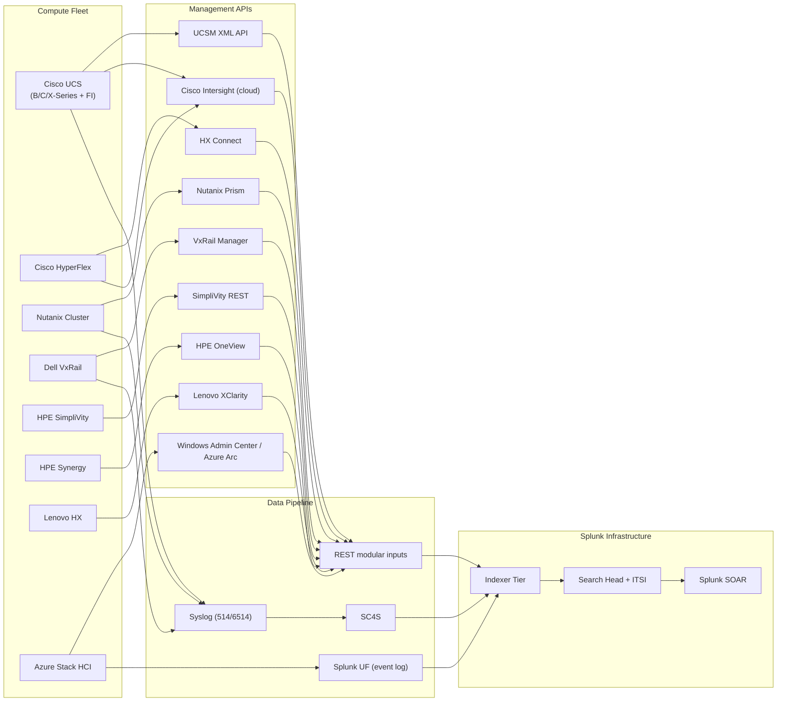

# Compute Infrastructure (HCI & Converged) Integration Guide

> The definitive guide to integrating Hyper-Converged Infrastructure
> (HCI) and converged compute platforms with Splunk. **93 use cases**
> spanning Cisco UCS (B-Series Blades, C-Series Rack, X-Series, M5/M6/
> M7), Cisco Intersight (cloud-managed), Cisco HyperFlex, Nutanix
> (AHV / NX / Prism Central), Dell VxRail, HPE SimpliVity, HPE Synergy,
> Lenovo HX (XClarity), Microsoft Azure Stack HCI (S2D + Hyper-V), and
> converged stacks (FlexPod, FlashStack, Hitachi UCP, Oracle PCA). Blade
> and rack server health, fabric interconnect monitoring, HCI cluster
> resiliency, vSAN / S2D health, hardware fault aggregation, firmware
> compliance, capacity planning, and the full converged-and-hyper-
> converged compute observability story.

---

## Table of Contents

- [Quick Start](#quick-start)
- [Overview](#overview)
- [Architecture and Data Flow](#architecture)
- [Prerequisites](#prerequisites)
- [Platform Coverage Matrix](#platform-matrix)
- [Cisco UCS Manager (UCSM) — B / C / X-Series](#cisco-ucs)
- [Cisco Intersight (Cloud-Managed)](#cisco-intersight)
- [Cisco HyperFlex](#hyperflex)
- [Nutanix (AHV / NX / Prism Central)](#nutanix)
- [Dell VxRail](#vxrail)
- [HPE SimpliVity](#simplivity)
- [HPE Synergy / OneView](#synergy)
- [Lenovo HX / XClarity](#lenovo)
- [Microsoft Azure Stack HCI (S2D + Hyper-V)](#azure-stack-hci)
- [Converged Stacks (FlexPod, FlashStack, UCP, PCA)](#converged)
- [Field Dictionary](#field-dictionary)
- [Sample Events](#sample-events)
- [Splunk-Side Configuration](#splunk-config)
- [Cross-Product Correlation](#cross-product)
- [CIM Mapping Reference](#cim-mapping)
- [ITSI Service Modeling](#itsi)
- [Compliance Mapping](#compliance)
- [Capacity Planning and Sizing](#sizing)
- [Recommended Dashboard Layouts](#dashboards)
- [SOAR Playbook Examples](#soar)
- [Multi-Site Strategy](#multi-site)
- [Security Hardening](#security-hardening)
- [Crawl / Walk / Run Roadmap](#roadmap)
- [Validation Checklist](#validation-checklist)
- [Known Limitations and Gaps](#known-limitations)
- [Troubleshooting](#troubleshooting)
- [FAQ](#faq)
- [Glossary](#glossary)
- [References](#references)
- [Contribution and Feedback](#contribution)

---

<a id="quick-start"></a>
## Quick Start — 90 Minutes to First Compute Insight

### Cisco UCS Manager (most common)

1. Install [Splunk Add-on for Cisco UCS (Splunkbase 2731)](https://splunkbase.splunk.com/app/2731) on Splunk HF.
2. Configure account:
    - URL: `https://<ucsm-vip>`
    - Username: `splunk_ro` (read-only with audit-log role)
3. Enable inputs: faults, audit, inventory, hardware-stats.
4. Validate: `index=cisco_ucs sourcetype="cisco:ucs:faults" earliest=-15m | stats count by severity, type`

### Cisco Intersight (cloud-managed)

1. Install [Splunk_TA_Cisco_Intersight (Splunkbase 5953)](https://splunkbase.splunk.com/app/5953).
2. Intersight → Settings → API Keys → Create:
    - Key ID + private key
3. Configure TA with key + secret.
4. Validate: `index=intersight sourcetype="cisco:intersight:alarm" earliest=-15m | stats count by severity`

### Nutanix Prism

1. Configure custom REST modular input or HEC scripted input
2. Pull from `/PrismGateway/services/rest/v1/alerts` and `/cluster`
3. Validate: `index=nutanix sourcetype="nutanix:alert" earliest=-15m | stats count by severity`

### Activate crawl tier

UC-19.1.1 (Cisco UCS Server Health), UC-19.1.4 (UCS Fabric Interconnect), UC-19.2.1 (HyperFlex Cluster Health), UC-19.3.1 (Azure Stack HCI Health).

---

<a id="overview"></a>
## Overview

### Why HCI / converged observability matters

Modern compute is **infrastructure-as-software**. Failures cascade:
- One blade failure → VM HA event → application downtime
- vSAN disk-group degraded → cluster I/O drop
- Fabric interconnect outage → all blades affected
- Firmware drift → security exposure
- Capacity exhaustion → unable to start VMs

### Domains covered

| Domain | Examples |
|--------|---------|
| **UCS** | B/C/X-Series blades, FI, M5/M6/M7 generations |
| **HCI** | HyperFlex, Nutanix, VxRail, SimpliVity, Azure Stack HCI |
| **Hardware mgmt** | Intersight (cloud), OneView, XClarity |
| **Converged stacks** | FlexPod, FlashStack, UCP, PCA |

### What good looks like

| Dimension | Without integration | With full integration |
|-----------|---------------------|-----------------------|
| Hardware fault visibility | UCS GUI per domain | Single Splunk dashboard |
| HCI cluster degraded → impact | Manual investigation | Auto-correlation to VMs |
| Firmware compliance | Quarterly audit | Daily report |
| Capacity planning | Spreadsheet | Predictive forecasting |
| Smart Call Home / TAC case | Email | Auto-ticket via SOAR |

---

<a id="architecture"></a>
## Architecture and Data Flow



---

<a id="prerequisites"></a>
## Prerequisites

| Item | Detail |
|------|--------|
| **Splunk version** | 9.0+ Enterprise / Cloud |
| **CIM 6.x** | Performance, Inventory, Alerts, Change |
| **Network access** | UF / HF on management VLAN |
| **Vendor TA accounts** | Read-only / audit-log roles |

---

<a id="platform-matrix"></a>
## Platform Coverage Matrix

| Platform | TA / Splunkbase |
|----------|------|
| **Cisco UCS Manager** | Splunk_TA_cisco_ucs [2731](https://splunkbase.splunk.com/app/2731) |
| **Cisco Intersight** | Splunk_TA_Cisco_Intersight [5953](https://splunkbase.splunk.com/app/5953) |
| **Cisco HyperFlex** | Custom REST + Intersight TA |
| **VMware vSAN** | Splunk Add-on for VMware [3215](https://splunkbase.splunk.com/app/3215) |
| **Nutanix Prism** | Custom REST modular input |
| **Dell VxRail** | Custom REST + VMware TA |
| **HPE SimpliVity** | Custom REST modular input |
| **HPE Synergy / OneView** | Custom REST + syslog |
| **Lenovo HX / XClarity** | Custom REST |
| **Azure Stack HCI** | Splunk_TA_windows [742](https://splunkbase.splunk.com/app/742) + Azure Arc |
| **Hitachi UCP** | Custom REST |

---

<a id="cisco-ucs"></a>
## Cisco UCS Manager (UCSM) — B / C / X-Series

### Configuration

```
Splunk_TA_cisco_ucs:
  + Add UCS Domain account (per UCS Manager VIP)
  + URL: https://<ucsm-vip>
  + Username: splunk_ro (audit-log role minimum)

Inputs:
  - faults (every 60s)
  - audit (every 60s)
  - inventory (every 1h)
  - hwstats (every 5m)
```

### Sample event (cisco:ucs:faults)

```
<dn>sys/chassis-1/blade-3/board/cpu-1</dn>
<severity>major</severity>
<lc>cleared</lc>
<code>F0408</code>
<cause>thermal-fault</cause>
<descr>CPU 1 thermal threshold crossed</descr>
<created>2026-04-25T14:30:00.000</created>
<ack>no</ack>
```

### SPL — Active critical UCS faults

```spl
index=cisco_ucs sourcetype="cisco:ucs:faults" lc!="cleared" severity IN ("critical","major") earliest=-1h
| eval ldn=lower(dn)
| eval component=case(
    match(ldn,"/cpu-\d"),"CPU",
    like(ldn,"%/memarray-%"),"Memory",
    like(ldn,"%/disk-%"),"Disk",
    like(ldn,"%/psu-%"),"PSU",
    like(ldn,"%/fan-%"),"Fan",
    1=1,"Other"
  )
| stats count, latest(descr) as last_descr by dn, component, severity
```

### SPL — UCS firmware compliance

```spl
index=cisco_ucs sourcetype="cisco:ucs:inventory" component="firmware" earliest=-1d
| stats latest(version) as installed_version by dn
| join type=outer dn [search index=cisco_ucs sourcetype="cisco:ucs:inventory" component="firmware:goldenversion" | stats latest(version) as golden_version by dn]
| eval drift=if(installed_version!=golden_version,"DRIFT","OK")
| where drift="DRIFT"
```

---

<a id="cisco-intersight"></a>
## Cisco Intersight (Cloud-Managed)

### Configuration

```
Intersight Portal → Settings → API Keys:
  + Create API key (download .pem)

Splunk_TA_Cisco_Intersight:
  + Add Intersight account (key ID + private key file)
  + Region: us-east-1 (or appropriate)
  + Inputs: alarm, audit, hyperflex, server, fabricinterconnect, switch
```

### Sample event (cisco:intersight:alarm)

```json
{
    "Severity": "Critical",
    "Description": "PSU 1 in chassis-1 not detected",
    "AffectedMo": {
        "Moid": "abc123",
        "Name": "FCH2024..."
    },
    "Code": "F0408",
    "Origin": "Local",
    "CreationTime": "2026-04-25T14:30:00.000Z"
}
```

### SPL — Intersight critical alarms

```spl
index=intersight sourcetype="cisco:intersight:alarm" Severity IN ("Critical","Warning") earliest=-1h
| stats count, latest(Description) as last_descr by AffectedMo.Name, Severity, Code
```

---

<a id="hyperflex"></a>
## Cisco HyperFlex

### REST API approach (HX Connect)

```
POST https://<hx-cluster-vip>/rest/aaa/login
  Authorization: Basic <base64(user:pass)>
  Returns accessToken (~30 min lifetime)

GET https://<hx-cluster-vip>/rest/clusters
GET https://<hx-cluster-vip>/rest/health
GET https://<hx-cluster-vip>/rest/nodes
GET https://<hx-cluster-vip>/rest/datastores
GET https://<hx-cluster-vip>/rest/alarms
```

### Custom local TA (TA_hx_collector)

```
inputs.conf:
[script:///opt/hx_collector/poll.py]
disabled = false
interval = 60
sourcetype = cisco:hyperflex:cluster
index = hyperflex
```

### Sample event (cisco:hyperflex:health)

```json
{
    "name": "HX-CLUS-PROD-01",
    "uuid": "abc-123",
    "healthState": "HEALTHY",
    "healthLevel": "GREEN",
    "resiliencyDetails": {
        "level": "FULL_RESILIENCY",
        "spaceState": "NORMAL",
        "drDetails": "Disaster recovery healthy"
    },
    "dataReplicationFactor": 3,
    "accessibility": "FULL_ACCESS"
}
```

### SPL — HyperFlex cluster degraded

```spl
index=hyperflex sourcetype="cisco:hyperflex:health" earliest=-15m
| stats latest(*) as * by name
| where healthState!="HEALTHY" OR healthLevel!="GREEN"
| table name, healthState, healthLevel, resiliencyDetails.level
```

---

<a id="nutanix"></a>
## Nutanix (AHV / NX / Prism Central)

### Custom REST modular input

```python
# Pull from Prism v3 API
GET https://<prism-ip>:9440/PrismGateway/services/rest/v1/alerts
GET https://<prism-ip>:9440/PrismGateway/services/rest/v1/cluster
GET https://<prism-ip>:9440/PrismGateway/services/rest/v1/hosts
GET https://<prism-ip>:9440/PrismGateway/services/rest/v1/vms
```

### Sample event (nutanix:alert)

```json
{
    "id": "abc-123",
    "severity": "critical",
    "alert_title": "VM HA event triggered",
    "cluster_uuid": "...",
    "entity_id": "vm-uuid",
    "entity_type": "vm",
    "created_time_stamp_in_usecs": 1714056600000000
}
```

### SPL — Nutanix alert by severity

```spl
index=nutanix sourcetype="nutanix:alert" earliest=-1d
| stats count by severity, alert_title
| sort -count
```

### SPL — Nutanix host CPU saturation

```spl
index=nutanix sourcetype="nutanix:host" earliest=-15m
| stats latest(*) as * by hypervisor_address
| where hypervisor_cpu_usage_ppm > 800000
```

---

<a id="vxrail"></a>
## Dell VxRail

VxRail combines VMware vSphere + Dell PowerEdge with VxRail Manager.

### Integration approach

1. VxRail Manager REST API: `https://<vxrm>/rest/vxm/v1/system`
2. vCenter via Splunk Add-on for VMware [3215](https://splunkbase.splunk.com/app/3215)
3. iDRAC events via syslog → SC4S

### SPL — VxRail cluster health

```spl
index=vxrail sourcetype="vxrail:health" earliest=-15m
| stats latest(*) as * by cluster_name
| where overall_status!="healthy"
```

---

<a id="simplivity"></a>
## HPE SimpliVity

### REST API

```
POST https://<ovc-ip>/api/oauth/token
GET https://<ovc-ip>/api/clusters
GET https://<ovc-ip>/api/datastores
GET https://<ovc-ip>/api/backups
```

Sourcetypes: `simplivity:cluster`, `simplivity:datastore`, `simplivity:backup`.

### SPL — SimpliVity backup status

```spl
index=simplivity sourcetype="simplivity:backup" earliest=-1d
| stats count by state
```

---

<a id="synergy"></a>
## HPE Synergy / OneView

### REST API

```
POST https://<oneview-ip>/rest/login-sessions
GET https://<oneview-ip>/rest/server-hardware
GET https://<oneview-ip>/rest/alerts
```

Sourcetypes: `hpe:oneview:audit`, `hpe:oneview:event`, `hpe:synergy:event`.

---

<a id="lenovo"></a>
## Lenovo HX / XClarity

### REST API

```
GET https://<xclarity-ip>/system
GET https://<xclarity-ip>/events
```

Sourcetypes: `lenovo:xclarity:event`, `lenovo:xclarity:audit`.

---

<a id="azure-stack-hci"></a>
## Microsoft Azure Stack HCI (S2D + Hyper-V)

Azure Stack HCI integrates Hyper-V + Storage Spaces Direct (S2D) + Failover Clustering.

### Splunk integration

1. Splunk_TA_windows [742](https://splunkbase.splunk.com/app/742) on each node:
    - WinEventLog:Microsoft-Windows-Hyper-V-Hypervisor
    - WinEventLog:Microsoft-Windows-FailoverClustering
    - WinEventLog:Microsoft-Windows-Storage-Storport
    - WinEventLog:Microsoft-Windows-Hyper-V-VmSwitch
2. Azure Arc integration → Azure Monitor → Splunk Add-on for Microsoft Cloud Services

### SPL — S2D drive failure

```spl
index=azure_stack_hci sourcetype="WinEventLog:Microsoft-Windows-Storage-Storport" EventCode IN (153,129) earliest=-1d
| stats count by ComputerName, EventCode, Message
```

### SPL — Failover Cluster events

```spl
index=azure_stack_hci sourcetype="WinEventLog:Microsoft-Windows-FailoverClustering" EventCode IN (1135,1146,1177) earliest=-1d
| stats count by ComputerName, EventCode
```

---

<a id="converged"></a>
## Converged Stacks (FlexPod, FlashStack, UCP, PCA)

### FlexPod (Cisco + NetApp + VMware)

Combines: UCS + NetApp ONTAP + Cisco Nexus + VMware. See:
- UCS section above
- [Storage Guide](storage-backup.md) for ONTAP
- VMware section in [VMware vSphere Guide](vmware-vsphere.md)

### FlashStack (Cisco + Pure + VMware)

Combines: UCS + Pure FlashArray + Cisco Nexus + VMware.

### Hitachi UCP

REST API approach. Sourcetype: `hitachi:ucp:event`.

### Oracle PCA (Private Cloud Appliance)

REST API. Sourcetype: `oracle:pca:event`.

---

<a id="field-dictionary"></a>
## Field Dictionary

| Field | UCS | Intersight | HyperFlex | Nutanix | VxRail | SimpliVity | Azure Stack HCI |
|-------|-----|------------|-----------|---------|--------|------------|-----------------|
| `cluster` | (n/a) | (n/a) | name | cluster_name | cluster_name | cluster_name | ClusterName |
| `host` | dn | AffectedMo.Name | hostname | hypervisor_address | host_name | host_name | ComputerName |
| `severity` | severity | Severity | severity | severity | level | severity | (Level) |
| `state` | lc | (n/a) | healthState | state | overall_status | state | (n/a) |
| `code` | code | Code | (n/a) | alert_title | alert_id | alert_type | EventCode |

---

<a id="sample-events"></a>
## Sample Events

(See per-platform sections.)

---

<a id="splunk-config"></a>
## Splunk-Side Configuration

### Index strategy

```ini
[cisco_ucs]
homePath = $SPLUNK_DB/cisco_ucs/db
maxDataSize = auto
frozenTimePeriodInSecs = 31536000

[intersight]
homePath = $SPLUNK_DB/intersight/db
maxDataSize = auto
frozenTimePeriodInSecs = 31536000

[hyperflex]
homePath = $SPLUNK_DB/hyperflex/db
maxDataSize = auto
frozenTimePeriodInSecs = 31536000

[nutanix]
homePath = $SPLUNK_DB/nutanix/db
maxDataSize = auto
frozenTimePeriodInSecs = 31536000

[vxrail]
homePath = $SPLUNK_DB/vxrail/db
maxDataSize = auto
frozenTimePeriodInSecs = 31536000

[hci]
homePath = $SPLUNK_DB/hci/db
maxDataSize = auto
frozenTimePeriodInSecs = 31536000
```

---

<a id="cross-product"></a>
## Cross-Product Correlation

### HCI cluster degraded → impacted VMs

```spl
(index=hyperflex sourcetype="cisco:hyperflex:health" healthState!="HEALTHY" earliest=-15m)
| stats values(name) as degraded_clusters
| join cluster [search index=vmware sourcetype="vmware:vm:perf" earliest=-15m
    | rename cluster_name as cluster, name as vm_name | stats values(vm_name) as impacted_vms by cluster]
```

### UCS faults → vSphere host event correlation

```spl
(index=cisco_ucs sourcetype="cisco:ucs:faults" lc!="cleared" earliest=-1h)
| rex field=dn "blade-(?<blade_id>\d+)"
| join blade_id [search index=vmware sourcetype="vmware:host:event" earliest=-1h | rename hardware.serial_number as blade_id]
```

---

<a id="cim-mapping"></a>
## CIM Mapping Reference

| CIM model | Sourcetype |
|-----------|-----------|
| **Performance** | All hwstats and metrics |
| **Inventory** | All inventory sourcetypes |
| **Alerts** | All faults and alarms |
| **Change** | UCS audit, OneView audit |

---

<a id="itsi"></a>
## ITSI Service Modeling

### Service hierarchy

```
Compute Posture
├── Per-Site
│   ├── DC1
│   └── DC2
├── Per-Stack
│   ├── UCS Domain 1
│   ├── HyperFlex Cluster 1
│   ├── Nutanix Cluster 1
│   ├── VxRail Cluster 1
│   ├── Azure Stack HCI 1
│   └── ...
├── Per-Component
│   ├── Blades / nodes
│   ├── Fabric Interconnects
│   └── Storage subsystem
└── Firmware Compliance
```

---

<a id="compliance"></a>
## Compliance Mapping

### NIST 800-53

| Control | Coverage |
|---------|----------|
| **CM-3** Configuration change control | UCS audit + Intersight audit |
| **AU-2/12** Audit | All audit sourcetypes |

### SOC 2

| Criteria | Coverage |
|----------|----------|
| **CC8.x** Change management | All audit sources |
| **CC7.x** System operations | Faults + alerts |

### ISO 27001 A.12

- All compute change events captured
- Per-platform inventory tracking

---

<a id="sizing"></a>
## Capacity Planning and Sizing

| Fleet size | Daily volume |
|-----------|--------------|
| Small (1 UCS domain, < 100 servers) | ~500 MB |
| Medium (multi-domain, 100-1000 servers) | ~5 GB |
| Large (multi-DC, 1000+ servers) | ~50 GB |
| Hyper-scale (10k+ servers) | ~500 GB |

---

<a id="dashboards"></a>
## Recommended Dashboard Layouts

### Crawl

```
+---------------------+---------------------+
| ACTIVE CRITICAL FAULTS (per platform)      |
+---------------------+---------------------+
| HCI CLUSTER HEALTH                         |
+---------------------+---------------------+
| FABRIC INTERCONNECT STATUS                 |
+---------------------+---------------------+
| TOP NOISY DEVICES                          |
+---------------------+---------------------+
```

### Walk

```
+---------------------+---------------------+
| FIRMWARE COMPLIANCE GAUGE                  |
+---------------------+---------------------+
| HARDWARE TREND (per component)             |
+---------------------+---------------------+
| HCI RESILIENCY MAP                         |
+---------------------+---------------------+
| CAPACITY PLANNING (CPU/Mem/Disk)           |
+---------------------+---------------------+
```

### Run

```
+---------------------+---------------------+
| MULTI-VENDOR COMPUTE SCORECARD             |
+---------------------+---------------------+
| FAULT-PREDICTION ML                        |
+---------------------+---------------------+
| FIRMWARE LIFE-CYCLE PLANNER                |
+---------------------+---------------------+
| EXECUTIVE INFRASTRUCTURE HEALTH            |
+---------------------+---------------------+
```

---

<a id="soar"></a>
## SOAR Playbook Examples

### Playbook 1: UCS critical fault → Auto-TAC case

```
1. RECEIVE notable: UCS critical fault
2. ENRICH: dn → server SN → support contract
3. CREATE TAC case via Cisco Smart Bonding API
4. ATTACH UCS show tech-support output
5. NOTIFY platform team
```

### Playbook 2: HCI cluster degraded → Auto-VM evacuation

```
1. RECEIVE notable: HCI cluster degraded
2. CALL vCenter API: vMotion VMs off impacted node
3. CREATE Sev-2 ticket
4. DO NOT auto-shutdown
```

### Playbook 3: Firmware drift detected → Maintenance window proposal

```
1. RECEIVE notable: Firmware drift > 30 days
2. CREATE SNOW change request with proposed window
3. ATTACH affected hosts list
4. NOTIFY platform owner
```

---

<a id="multi-site"></a>
## Multi-Site Strategy

- Per-site indexes (`cisco_ucs_dc1`, `cisco_ucs_dc2`)
- Per-domain UCS account in TA
- Per-cluster Nutanix Prism config
- Federated dashboards

---

<a id="security-hardening"></a>
## Security Hardening

- TLS for all REST API connections
- Read-only / audit-log roles only
- API tokens in Splunk credential store, rotated 90-day
- Management VLAN isolation
- Field-level RBAC for hostnames (PII)

---

<a id="roadmap"></a>
## Crawl / Walk / Run Roadmap

### Crawl (Week 1-4)

1. Onboard primary compute platform (usually UCS)
2. CIM Performance + Inventory acceleration
3. Crawl-tier dashboards
4. UC-19.1.1, UC-19.2.1

### Walk (Month 2-3)

1. Onboard HCI + secondary platforms
2. ITSI service hierarchy
3. SOAR playbook for critical faults
4. Firmware compliance dashboard

### Run (Month 4+)

1. Multi-vendor compute scorecard
2. Predictive fault ML
3. Quarterly compliance evidence
4. Auto-TAC / Smart Bonding integration

---

<a id="validation-checklist"></a>
## Validation Checklist

- [ ] Day 1: First UCS / HCI event in Splunk
- [ ] Day 14: All compute platforms ingesting
- [ ] Day 30: Walk-tier UCs deployed
- [ ] Day 90: SOAR playbooks operational; firmware compliance live

---

<a id="known-limitations"></a>
## Known Limitations and Gaps

| Limitation | Impact | Workaround |
|------------|--------|------------|
| **HyperFlex no Splunkbase TA** | Custom collector needed | Use TA_hx_collector pattern |
| **Nutanix REST permissions complex** | Setup time | Use cluster-admin RO role |
| **OneView REST throttling** | Limited polling rate | Cache + delta polling |
| **Azure Stack HCI hybrid path** | Multiple sourcetypes | Use both Win + Azure |

---

<a id="troubleshooting"></a>
## Troubleshooting

### TA_cisco_ucs not pulling

- Verify UCS Manager VIP reachable on 443
- Check audit-log role on splunk_ro user
- Inspect `index=_internal source=*splunk_ta_cisco_ucs*`

### Intersight token expired

- API keys are long-lived; check key not deleted
- Verify TA private key file permissions

### HX REST API session timeout

- Custom collector must refresh token every 25 min
- Check collector logs

---

<a id="faq"></a>
## FAQ

**Q: UCSM XML API vs Intersight cloud — which?**
A: Both. UCSM for on-prem deep telemetry; Intersight for cloud-managed alarms + cross-domain.

**Q: HyperFlex via Intersight or direct HX Connect?**
A: Both work; Intersight scales better across multiple clusters.

**Q: vSAN vs S2D vs Nutanix — which to monitor first?**
A: Whichever you have most production on. Patterns are similar.

**Q: How long for compute logs?**
A: 1 year minimum for compliance; 3 years for audit.

---

<a id="glossary"></a>
## Glossary

| Term | Definition |
|------|-----------|
| **HCI** | Hyper-Converged Infrastructure |
| **CI** | Converged Infrastructure |
| **UCS** | Cisco Unified Computing System |
| **FI** | Fabric Interconnect |
| **UCSM** | UCS Manager |
| **vSAN** | VMware Virtual SAN |
| **S2D** | Storage Spaces Direct |
| **AHV** | Acropolis Hypervisor (Nutanix) |
| **Prism** | Nutanix management platform |
| **FlexPod** | Cisco + NetApp + VMware reference architecture |
| **FlashStack** | Cisco + Pure + VMware reference architecture |

---

<a id="references"></a>
## References

- [Splunk Add-on for Cisco UCS (Splunkbase 2731)](https://splunkbase.splunk.com/app/2731)
- [Splunk_TA_Cisco_Intersight (Splunkbase 5953)](https://splunkbase.splunk.com/app/5953)
- [Splunk Add-on for VMware (Splunkbase 3215)](https://splunkbase.splunk.com/app/3215)
- [Cisco UCS Manager docs](https://www.cisco.com/c/en/us/support/servers-unified-computing/ucs-manager/products-installation-and-configuration-guides-list.html)
- [Cisco Intersight docs](https://intersight.com/help)
- [Nutanix Prism API](https://www.nutanix.dev/api_references/)

---

<a id="contribution"></a>
## Contribution and Feedback

Part of the [Splunk Monitoring Use Cases](https://github.com/fenre/splunk-monitoring-use-cases) project. [Open an issue](https://github.com/fenre/splunk-monitoring-use-cases/issues/new).

---

*Last updated: 2026-05-09. Covers Cisco UCS Manager 4.x, Intersight current, HyperFlex 5.x, Nutanix AOS 6.x / Prism Central pc.2024.x, Dell VxRail current, HPE SimpliVity 4.x, HPE Synergy current, Lenovo XClarity 4.x, Azure Stack HCI 23H2.*
