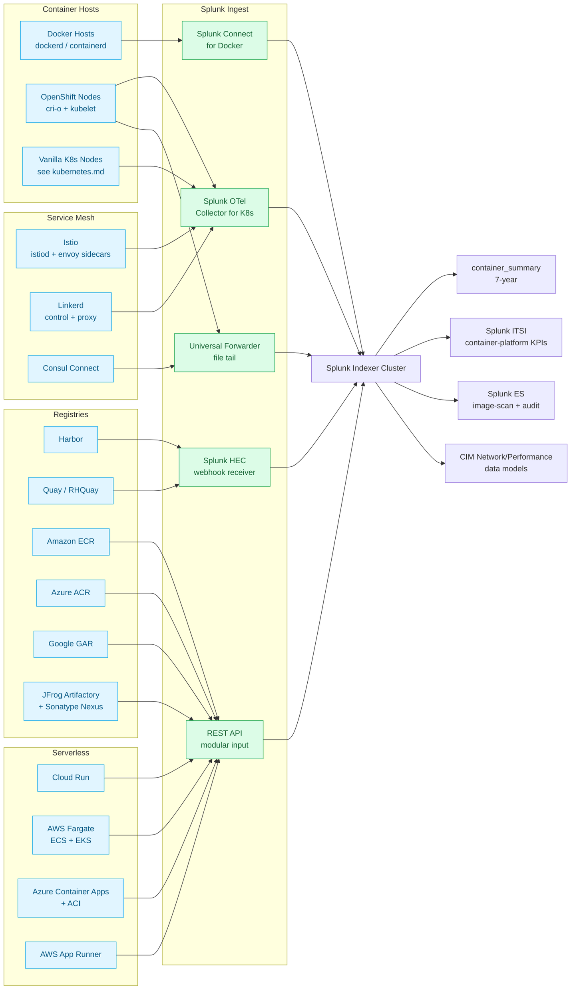

# Container Platforms (Docker, OpenShift, Service Mesh, Serverless) Integration Guide

> Operational, security, and compliance monitoring for the container
> ecosystem **outside vanilla Kubernetes<sup class="ref">[<a href="#ref-1">1</a>]</sup>** — Docker Engine + Compose
> hosts, Red Hat OpenShift Container Platform<sup class="ref">[<a href="#ref-2">2</a>]</sup>, container registries
> (Harbor, Quay, ECR, ACR, GAR, Artifactory, Nexus), service meshes
> (Istio, Linkerd, Consul Connect, OSM), and serverless container
> runtimes (Knative, Cloud Run, Fargate, Container Apps, App Runner).
> Companion guide to `kubernetes.md` (cat 3.2). Together the two
> guides cover all 117 container UCs across cat 3.1–3.6.

## Table of Contents

- [Quick Start — From Zero to First Container Visibility](#quick-start--from-zero-to-first-container-visibility)
- [Overview](#overview)
- [Architecture and Data Flow](#architecture-and-data-flow)
- [Prerequisites](#prerequisites)
- [Domain 1 — Docker Engine + Compose (cat 3.1, 29 UCs)](#domain-1--docker-engine--compose-cat-31-29-ucs)
- [Domain 2 — OpenShift Container Platform (cat 3.3, 25 UCs)](#domain-2--openshift-container-platform-cat-33-25-ucs)
- [Domain 3 — Container Registries (cat 3.4, 9 UCs)](#domain-3--container-registries-cat-34-9-ucs)
- [Domain 4 — Service Mesh & Serverless Containers (cat 3.5, 14 UCs)](#domain-4--service-mesh--serverless-containers-cat-35-14-ucs)
- [Domain 5 — Container & Kubernetes Trending (cat 3.6, 6 UCs)](#domain-5--container--kubernetes-trending-cat-36-6-ucs)
- [Sizing and Capacity Planning](#sizing-and-capacity-planning)
- [Compliance and Audit Evidence Pack](#compliance-and-audit-evidence-pack)
- [Crawl / Walk / Run Roadmap](#crawl--walk--run-roadmap)
- [Dashboards](#dashboards)
- [SPL Examples](#spl-examples)
- [Troubleshooting](#troubleshooting)
- [SOAR Playbooks](#soar-playbooks)
- [Cross-Product Integration](#cross-product-integration)

## Quick Start — From Zero to First Container Visibility

### Day 1: Identify which containers you actually run

Run this inventory matrix before installing anything:

| Where do containers run? | Population | Add-on / collector |
|---|---|---|
| Docker Engine on Linux servers | hosts running `dockerd` | Splunk Connect for Docker (3303) |
| Docker Desktop / WSL2 dev workstations | developer machines | optional — UF + Docker logging driver |
| Docker Swarm | rare in 2026 | Splunk Connect for Docker per node |
| OpenShift Container Platform | production OCP 4.x clusters | Splunk OpenShift App + OTel Collector |
| ROSA / ARO / OSD | managed OpenShift | OTel Collector + cloud audit logs |
| Cloud Run / Fargate / Container Apps / App Runner | serverless | Cloud add-on (AWS / Azure / GCP) |
| Container registry | internal Harbor / Quay / Artifactory | webhook → HEC |

Each row maps to a different Splunk integration. Most enterprises run
**at least three** simultaneously (e.g., Docker on legacy servers +
OpenShift in the data centre + Cloud Run in GCP).

### Day 2: Stand up the container indexes

```ini
# indexes.conf on cluster manager
[container]
homePath = $SPLUNK_DB/container/db
coldPath = $SPLUNK_DB/container/colddb
thawedPath = $SPLUNK_DB/container/thaweddb
maxDataSize = auto_high_volume
frozenTimePeriodInSecs = 31536000   ` 1 year `

[container_summary]
homePath = $SPLUNK_DB/container_summary/db
coldPath = $SPLUNK_DB/container_summary/colddb
thawedPath = $SPLUNK_DB/container_summary/thaweddb
maxDataSize = auto
frozenTimePeriodInSecs = 220752000  ` 7 years `

[openshift]
homePath = $SPLUNK_DB/openshift/db
coldPath = $SPLUNK_DB/openshift/colddb
thawedPath = $SPLUNK_DB/openshift/thaweddb
maxDataSize = auto_high_volume
frozenTimePeriodInSecs = 31536000

[registry]
homePath = $SPLUNK_DB/registry/db
coldPath = $SPLUNK_DB/registry/colddb
thawedPath = $SPLUNK_DB/registry/thaweddb
maxDataSize = auto
frozenTimePeriodInSecs = 31536000

[registry_audit]
homePath = $SPLUNK_DB/registry_audit/db
coldPath = $SPLUNK_DB/registry_audit/colddb
thawedPath = $SPLUNK_DB/registry_audit/thaweddb
maxDataSize = auto
frozenTimePeriodInSecs = 220752000   ` 7 years for SOX / SOC2 / supply-chain `

[mesh]
homePath = $SPLUNK_DB/mesh/db
coldPath = $SPLUNK_DB/mesh/colddb
thawedPath = $SPLUNK_DB/mesh/thaweddb
maxDataSize = auto_high_volume
frozenTimePeriodInSecs = 7776000   ` 90 days `

[serverless]
homePath = $SPLUNK_DB/serverless/db
coldPath = $SPLUNK_DB/serverless/colddb
thawedPath = $SPLUNK_DB/serverless/thaweddb
maxDataSize = auto
frozenTimePeriodInSecs = 7776000
```

### Day 3: Wire up Splunk Connect for Docker

Edit `/etc/docker/daemon.json` on each Docker host:

```json
{
  "log-driver": "splunk",
  "log-opts": {
    "splunk-token": "<HEC_TOKEN>",
    "splunk-url": "https://hec.splunk.example.com:443",
    "splunk-source": "docker",
    "splunk-format": "json",
    "splunk-verify-connection": "true",
    "splunk-gzip": "true",
    "splunk-index": "container",
    "tag": "{{.Name}}/{{.ID}}",
    "labels": "com.example.app,com.example.env"
  }
}
```

Restart `dockerd`; container stdout / stderr now flows directly to HEC,
tagged with container name and short ID.

### Day 4–5: First container alerts

The single most useful container alert is **crash-loop detection** — it
catches misconfigured deployments, OOM, missing secrets, network
policy errors, and bad images all in one signal.

```spl
index=container
| eval container = coalesce(container_name, ContainerName, "unknown")
| stats count(eval(searchmatch("OOMKilled OR exit code OR backoff"))) as crash_events
        count as total_events by container, host
| where crash_events > 5
| eval crash_pct = round((crash_events / total_events) * 100, 2)
| sort - crash_pct
```

### Day 6: Add image-scan ingest from your registry

Configure Harbor / Quay webhook to POST scan results to HEC. Within
24 hours you'll have the first vulnerability-by-image dashboard.

### Day 7: Validate

Run the validation pack at the end of this guide. You now have working
container observability + security + supply-chain visibility.

## Overview

### Why "container platforms beyond vanilla Kubernetes"?

The `kubernetes.md` guide handles vanilla Kubernetes (EKS, AKS, GKE,
self-hosted) and the universal Kubernetes signals — pod lifecycle,
node health, control-plane components, kubelet metrics. But **most
real-world container deployments include additional layers** that
require their own monitoring story:

- **Docker Engine** still runs on hundreds of millions of servers as
  the underlying container runtime, application packaging tool, and
  development environment. Kubernetes doesn't cover Docker hosts that
  aren't part of a Kubernetes cluster.
- **OpenShift** adds 16 cluster-level operators on top of Kubernetes:
  CVO, MCO, OLM, Network, Authentication, Console, Monitoring, Image
  Registry, Storage, Insights, etc. Each is a first-class operational
  concern with its own failure modes.
- **Container registries** are the supply-chain choke point. Image
  push/pull logs, vulnerability scan results, signing attestations
  (Cosign / SLSA), and access audits live in the registry, not the
  cluster.
- **Service meshes** (Istio, Linkerd, Consul, OSM) are now present in
  ~40% of production Kubernetes deployments. Envoy access logs, control-
  plane events, mTLS certificate rotation, and traffic-policy
  enforcement are mesh-specific.
- **Serverless containers** (Cloud Run, Fargate, Container Apps, App
  Runner, Knative) have unique telemetry — invocation count, cold-start
  latency, scale-to-zero events, request-driven autoscaling — that
  doesn't exist in long-running container monitoring.

### Why monitor container platforms in Splunk

Five answers:

1. **Cross-platform inventory in one place**: container counts,
   image versions, vulnerability scores, registry pulls — across
   Docker, OpenShift, Cloud Run, ECS Fargate, Container Apps —
   normalised and queryable.
2. **Supply-chain provenance**: from registry push → image scan →
   signing → cluster pull → runtime execution → mesh routing — Splunk
   joins all the dots that no single vendor tool covers.
3. **Cost attribution**: container-level CPU/memory + cloud-billing
   correlation for chargeback and FinOps (cat 20).
4. **Compliance evidence**: PCI DSS 4.0 image-scan attestation, NIST
   SP 800-190 container security controls, NSA / CISA Kubernetes
   Hardening Guide evidence — generated automatically.
5. **Mesh-aware service maps**: Istio access logs feed Splunk APM /
   Observability Cloud for service dependency mapping at scale.

### Domains covered

This guide spans **83 use cases** across five subcategories:

| Sub | Name | UCs | Highlights |
|---|---|---|---|
| 3.1 | Docker | 29 | container crash loops, daemon health, compose service health, image scan |
| 3.3 | OpenShift | 25 | CVO upgrade, MCO node config, OLM operator health, OpenShift networking |
| 3.4 | Container Registries | 9 | push/pull audit, vulnerability scan, storage quota |
| 3.5 | Service Mesh & Serverless | 14 | Istio mesh traffic, sidecar injection, ingress gateway, rate limiting |
| 3.6 | Container & Kubernetes Trending | 6 | platform adoption, capacity forecasting, image freshness |

## Architecture and Data Flow



### Core principles

1. **Splunk Connect for Docker is opinionated about JSON.** Keep the
   `splunk-format=json` setting; raw or splunk-formatted produce
   inferior CIM extraction.
2. **OpenShift = Splunk OTel Collector first.** OpenShift exposes
   Prometheus metrics natively; the OTel Collector ingests them and
   converts to Splunk metrics index for queryability and alerting.
3. **Registry push events are not optional.** If a developer pushes
   an image and Splunk doesn't see it, you've lost the supply-chain
   trail at its root. Webhook configuration on every registry is
   non-negotiable for SOC 2 / PCI / HIPAA<sup class="ref">[<a href="#ref-13">13</a>]</sup> evidence.
4. **Service mesh traffic is high-cardinality.** Don't index every
   Envoy access log full-fidelity in production; sample at 1% and
   index 100% of error responses.
5. **Serverless containers are billed per-invocation.** Telemetry
   needs to include `invocation_id` for correlation with cloud
   billing data.

## Prerequisites

### Pre-deployment checklist

- [ ] Inventory of Docker hosts, OpenShift clusters, registries,
  meshes, serverless runtimes
- [ ] HEC token created and tested; HEC URL reachable from all hosts
- [ ] Splunk indexes pre-created (see Day 2 above)
- [ ] OpenShift cluster admin access (for SCC bindings, namespace
  creation, RBAC)
- [ ] Registry admin access (for webhook configuration)
- [ ] Cloud account read-only IAM for AWS / Azure / GCP serverless
  audit logs
- [ ] CIM compliance for Performance + Network_Traffic + Authentication
- [ ] Splunk version ≥ 9.1 (OTel Collector for K8s requires HEC v2 ACK)

### Splunk components used

- **Splunk Enterprise / Cloud** — base
- **Splunk Connect for Docker** (Splunkbase 3303) — Docker
- **Splunk OpenShift App** + **Splunk OTel Collector for K8s**
- **Splunk Connect for Kubernetes** (Splunkbase 3743) — fallback /
  legacy
- **Splunk HEC** — registry webhooks, FaaS, custom integrations
- **Splunk DB Connect** — registry-DB inventory queries (optional)
- **Splunk ITSI** — container service-tree health
- **Splunk Enterprise Security** — image-scan results to RBA, audit
  trail to notable
- **Splunk Observability Cloud** — service mesh tracing + APM (optional)
- **MLTK** — anomaly detection on container restart counts, scale
  events, cold-start latency

## Domain 1 — Docker Engine + Compose (cat 3.1, 29 UCs)

### Key signals

| Signal | Sourcetype | Detection target |
|---|---|---|
| Container stdout / stderr | `docker:container` | application logs |
| Container start / stop / die | `docker:event` | lifecycle |
| Daemon errors | `docker:daemon` | host-level Docker problems |
| Resource stats | `docker:stats` | CPU / memory / IO / net per container |
| Compose project events | `docker:compose` | service health |

### Highlight UCs

- **UC-3.1.1** — Container Crash Loops. Joins `docker:event` exit
  events with `docker:container` log tail. Single most-installed
  Docker UC.
- **UC-3.1.10** — Container Image Vulnerability Scan Results. Pulls
  Trivy / Grype / Clair JSON via HEC and produces per-CVE-per-image
  trending.
- **UC-3.1.11** — Docker Daemon Resource Limits. Tracks `dockerd`
  RSS / VSZ / FD usage; alerts when daemon is approaching system
  limits.
- **UC-3.1.12** — Compose Service Health. For Compose-managed stacks,
  tracks `docker compose ps --format json` output as scripted input.

### Configuration snippet

`/etc/docker/daemon.json`:

```json
{
  "log-driver": "splunk",
  "log-opts": {
    "splunk-token": "<HEC_TOKEN>",
    "splunk-url": "https://hec.splunk.example.com:443",
    "splunk-format": "json",
    "splunk-verify-connection": "true",
    "splunk-gzip": "true",
    "splunk-index": "container",
    "splunk-source": "docker",
    "tag": "{{.Name}}/{{.ID}}",
    "labels": "com.example.app,com.example.env,com.example.team",
    "splunk-format": "json"
  },
  "metrics-addr": "0.0.0.0:9323",
  "experimental": true
}
```

For Docker stats and events (separate from container logs), use a
sidecar that runs `docker events --format='{{json .}}'` and writes to
a tailed file:

```bash
# /etc/systemd/system/docker-events.service
[Unit]
Description=Docker events to file for Splunk UF
After=docker.service

[Service]
ExecStart=/usr/bin/docker events --format='{{json .}}' > /var/log/docker/events.log

[Install]
WantedBy=multi-user.target
```

UF inputs.conf:

```ini
[monitor:///var/log/docker/events.log]
sourcetype = docker:event
index = container
```

## Domain 2 — OpenShift Container Platform (cat 3.3, 25 UCs)

OpenShift is **not** vanilla Kubernetes. It adds 16+ cluster-level
operators that each have their own failure modes. The single biggest
source of OpenShift incidents in production is **operator drift**:
ClusterVersion stuck mid-upgrade, MachineConfig pool degraded, OLM
subscription stuck, ImageRegistry storage exhausted.

### OpenShift cluster operators

| Operator | What it does | What can go wrong | UC |
|---|---|---|---|
| Cluster Version Operator (CVO) | Tracks releaseImage, applies upgrade | Upgrade stuck, manifest mismatch | UC-3.3.1 |
| Machine Config Operator (MCO) | Renders + rolls out node configs | MCP degraded, render failure | UC-3.3.5 |
| Operator Lifecycle Manager (OLM) | Manages OperatorHub installations | InstallPlan failure, subscription stale | UC-3.3.11 |
| Network (OVN-K) | OVN-Kubernetes plumbing | Egress IP failure, NetworkPolicy broken | UC-3.3.12 |
| Storage / CSI | Volume provisioning | CSI driver crash, snapshot failure | UC-3.3.10 |
| Authentication | OAuth / IdP integration | Token issuance broken | UC-3.3.7 |
| Image Registry | Internal registry | PVC full, route broken | UC-3.3.6 |
| Console | Admin UI | Route broken, OAuth flow broken | UC-3.3.4 |
| Monitoring | Prometheus + Alertmanager | Long-term storage full, federation broken | UC-3.3.13 |
| Insights | telemetry to Red Hat | Connection broken, support evidence missing | UC-3.3.14 |

### Splunk OTel Collector for K8s on OpenShift

Helm chart values (`values.yaml`):

```yaml
clusterName: openshift-prod-east
splunkPlatform:
  endpoint: https://hec.splunk.example.com:443/services/collector
  token: <HEC_TOKEN>
  index: openshift
  metricsIndex: openshift_metrics
distribution: openshift
agent:
  enabled: true
  config:
    receivers:
      kubeletstats:
        auth_type: tls
        ca_file: /etc/kubernetes/pki/ca.crt
        endpoint: ${env:K8S_NODE_NAME}:10250
        metric_groups: [container, pod, node, volume]
clusterReceiver:
  enabled: true
  k8sObjects:
    - mode: pull
      name: clusterversions.config.openshift.io
      interval: 5m
    - mode: watch
      name: events
      group: events.k8s.io
    - mode: watch
      name: machineconfigpools.machineconfiguration.openshift.io
      group: machineconfiguration.openshift.io
    - mode: watch
      name: subscriptions.operators.coreos.com
      group: operators.coreos.com
```

Apply OpenShift SCC binding:

```yaml
apiVersion: rbac.authorization.k8s.io/v1
kind: ClusterRoleBinding
metadata:
  name: splunk-otel-scc-anyuid
roleRef:
  apiGroup: rbac.authorization.k8s.io
  kind: ClusterRole
  name: system:openshift:scc:anyuid
subjects:
  - kind: ServiceAccount
    name: splunk-otel-collector
    namespace: openshift-splunk
```

## Domain 3 — Container Registries (cat 3.4, 9 UCs)

Container registries are the **supply-chain root of trust**. Every image
running in production must trace back to a registry push event with a
verified signature and a known vulnerability scan result. Without
registry telemetry in Splunk, you can't honestly answer the SOC
question "what vulnerable images are in production right now?"

### Registry-by-registry coverage

| Registry | Webhook? | API? | Add-on / Method |
|---|---|---|---|
| Harbor | Yes (full) | Yes | HEC webhook (recommended) |
| Quay (RHQuay / Quay.io) | Yes | Yes | HEC webhook |
| Amazon ECR | EventBridge | Yes | Splunk Add-on for AWS (CloudWatch + EventBridge) |
| Azure ACR | Event Grid | Yes | Splunk Add-on for Azure (Event Hub) |
| Google GAR / GCR | Pub/Sub | Yes | Splunk Add-on for GCP (Pub/Sub Lite) |
| JFrog Artifactory | Webhook + log file | Yes | UF on log file or webhook |
| Sonatype Nexus | Webhook | Yes | UF on log file or webhook |
| Docker Hub | Limited webhook | Yes | REST API polling |

### Harbor webhook configuration

Harbor admin → Projects → <project> → Webhooks → New Webhook:

| Field | Value |
|---|---|
| Name | `splunk-hec` |
| Endpoint URL | `https://hec.splunk.example.com:443/services/collector/raw?index=registry&sourcetype=harbor:registry` |
| Auth Header | `Splunk <HEC_TOKEN>` |
| Notify Type | `Push artifact, Pull artifact, Scanning completed, Scanning failed, Quota near threshold, Quota exceeded, Replication started, Replication finished, Tag retention finished, Project quota exceeded` |

### Highlight UCs

- **UC-3.4.1** — Image Push/Pull Audit. Generates per-user, per-image,
  per-action audit trail for SOC 2 evidence. Required for any image
  promotion process.
- **UC-3.4.2** — Vulnerability Scan Results. Trivy / Clair / Grype /
  Snyk results joined by image SHA, trended over time.
- **UC-3.4.3** — Storage Quota Monitoring. Per-project quota usage;
  alerts at 70% and 90%.
- **UC-3.4.4** — Registry Image Vulnerability Scan Results (Harbor
  scan webhook).

## Domain 4 — Service Mesh & Serverless Containers (cat 3.5, 14 UCs)

### Istio / Linkerd / Consul Connect / OSM

Mesh-specific telemetry that vanilla Kubernetes tools miss:

| Signal | Source | UC |
|---|---|---|
| Mesh traffic per-service | Istio Envoy access log | UC-3.5.1 |
| Sidecar injection state | OPA / Kyverno report on namespace label | UC-3.5.11 |
| mTLS certificate rotation | istiod log | UC-3.5.5 |
| Ingress gateway latency | Envoy access log | UC-3.5.10 |
| Rate-limit policy hits | Envoy / EnvoyFilter log | UC-3.5.12 |
| VirtualService traffic-shifting effectiveness | Istio control + Envoy | UC-3.5.6 |

### Knative / Cloud Run / Fargate / Container Apps / App Runner

Serverless container telemetry:

| Signal | Source | UC |
|---|---|---|
| Cold-start latency | Knative autoscaler log / Cloud Run audit | UC-3.5.13 |
| Scale-to-zero events | Knative + KEDA logs | UC-3.5.13 |
| Per-invocation duration + memory | Cloud Run / Fargate / Container Apps | UC-3.5.14 |

### Istio OpenTelemetry configuration

Apply this Telemetry resource to enable access logging through OTel:

```yaml
apiVersion: telemetry.istio.io/v1alpha1
kind: Telemetry
metadata:
  name: enable-access-log-otel
  namespace: istio-system
spec:
  accessLogging:
    - providers:
        - name: otel
      filter:
        expression: response.code >= 400 || (response.code >= 200 && response.code < 300 && rand() < 0.01)
```

The `filter.expression` keeps every error log full-fidelity but only
samples 1% of successful responses — the right balance for production
mesh observability.

## Domain 5 — Container & Kubernetes Trending (cat 3.6, 6 UCs)

Long-window, summary-driven views to drive platform-team capacity and
adoption planning:

- **UC-3.6.1** — Container vs VM workload ratio (90-day rolling).
- **UC-3.6.2** — Image freshness — average age of images currently
  running across all clusters.
- **UC-3.6.3** — Container density (pods per node) trending.
- **UC-3.6.4** — Cross-cluster container count by environment (dev /
  test / staging / prod).
- **UC-3.6.5** — Container restart-rate trending — early-warning
  signal for upstream-image regressions.
- **UC-3.6.6** — Cluster API server P99 latency trending — early
  warning for control-plane saturation.

All six populate `container_summary` index for fast dashboard
rendering against multi-year retention.

## Sizing and Capacity Planning

| Source | Per-100-container daily volume | Per-100-container monthly indexer storage |
|---|---|---|
| Docker stdout/stderr | 1 GB | 30 GB |
| Docker events | 50 MB | 1.5 GB |
| Docker daemon | 100 MB | 3 GB |
| OpenShift OTel logs | 2 GB | 60 GB |
| OpenShift OTel metrics | 500 MB | 15 GB |
| Harbor webhook | 50 MB | 1.5 GB |
| Trivy scan results | 100 MB / scan | varies |
| Istio Envoy access logs (1% sample) | 500 MB | 15 GB |
| Istio control-plane events | 100 MB | 3 GB |
| Cloud Run audit logs | 100 MB / 1k invocations | varies |
| Fargate task events | 50 MB / 1k tasks | varies |

For a representative deployment of 5 OpenShift clusters (200 nodes,
20,000 pods), Harbor + Quay registries, Istio mesh, and 50 Cloud Run
services: budget **~120 GB/day** indexed container data.

## Compliance and Audit Evidence Pack

### NIST SP 800-190 — Application Container Security

15 containers-specific controls covered by this guide:

| 800-190 Control | Splunk evidence |
|---|---|
| §4.1 Image risk | UC-3.1.10, UC-3.4.2 (vulnerability scan results) |
| §4.2 Registry risk | UC-3.4.1 (push/pull audit), UC-3.4.4 |
| §4.3 Orchestrator risk | UC-3.3.7 (auth), UC-3.3.4 (console route) |
| §4.4 Container risk | UC-3.1.1 (crash loops), UC-3.1.11 (resource limits) |
| §4.5 Host OS risk | `linux-servers.md` cross-reference |
| §5.x Countermeasures | Splunk ES correlation rules |

### CIS Benchmarks

- **CIS Docker Benchmark** — UC-3.1.20 audits CIS Docker controls
- **CIS Kubernetes Benchmark<sup class="ref">[<a href="#ref-3">3</a>]</sup>** — see `kubernetes.md`
- **CIS OpenShift Benchmark** — UC-3.3.20 audits CIS OpenShift controls

### NSA / CISA Kubernetes Hardening Guide

UC-3.3.21 generates the NSA/CISA Kubernetes Hardening Guide compliance
evidence pack: image security, namespace isolation, network policy,
audit logging, authentication, authorisation, log monitoring, and
upgrade hygiene.

### PCI DSS 4.0

For containerised CDE workloads:

- §1.2.x Network segmentation → service mesh egress / NetworkPolicy
- §6.3.x Vulnerability mgmt → registry scan results
- §10.x Logging → Docker / OpenShift audit logs
- §11.x Security testing → scan + runtime detection (Falco / Aqua /
  Sysdig integration through HEC)

### HIPAA §164.312

For PHI-processing containers — same evidence pack as PCI plus:
- §164.312(b) Audit Controls → all UC-3.4.x registry audit
- §164.312(c)(1) Integrity → image signing (Cosign / SLSA)
- §164.312(e) Transmission Security → mTLS via service mesh

### SOC 2 Type II

Trust Services Criteria covered:
- CC6.6 → registry RBAC + image-scan attestation
- CC7.2 → runtime crash + restart anomaly
- CC7.3 → mesh + Istio detection rules

### EU AI Act (high-risk AI containers)

For containers serving high-risk AI models:

- **Art. 9** Risk management system → image-scan + runtime detection
- **Art. 12** Logging → all container UCs feed art. 12 evidence
- **Art. 15** Robustness + cybersecurity → UC-3.5.x mesh + UC-3.4.x
  registry attestation

### Supply Chain — SLSA / in-toto / Sigstore Cosign

UC-3.4.5 audits per-image Cosign signature verification + SLSA L1/L2/L3
provenance attestation; required evidence for Executive Order 14028
(US federal SBOM mandate) and EU NIS2<sup class="ref">[<a href="#ref-4">4</a>]</sup> supply-chain provisions.

## Crawl / Walk / Run Roadmap

### Crawl tier (14 UCs — first 30 days)

Goals: container visibility, crash detection, registry inventory.

| UC | Title |
|---|---|
| 3.1.1 | Container Crash Loops |
| 3.1.2 | Container Resource Utilisation |
| 3.1.3 | Image Pull Failures |
| 3.1.10 | Container Image Vulnerability Scan Results |
| 3.1.11 | Docker Daemon Resource Limits |
| 3.1.12 | Compose Service Health |
| 3.3.1 | OpenShift ClusterVersion Upgrade Progress |
| 3.3.4 | OpenShift Console Route Health |
| 3.3.5 | OpenShift MachineConfig Pool Status |
| 3.3.7 | OpenShift Authentication Operator Health |
| 3.4.1 | Image Push/Pull Audit |
| 3.4.2 | Vulnerability Scan Results |
| 3.4.3 | Storage Quota Monitoring |
| 3.5.1 | Istio Mesh Traffic Monitoring |

### Walk tier (41 UCs — 30–90 days)

Highlights:
- All 16 OpenShift cluster operator monitors
- Harbor / Quay / ECR / ACR / GAR webhook ingest
- Image signing verification (Cosign + SLSA)
- Service mesh sidecar injection compliance
- Cold-start latency tracking (serverless)
- Cloud Run / Fargate per-invocation audit
- mTLS certificate rotation tracking
- Egress gateway egress IP tracking
- KEDA / Knative scaler events
- Registry replication health
- Custom Resource definition (CRD) drift detection

### Run tier (28 UCs — 90+ days)

Highlights:
- NIST SP 800-190<sup class="ref">[<a href="#ref-8">8</a>]</sup> evidence pack auto-generation
- CIS Docker / CIS OpenShift quarterly attestation
- NSA/CISA Kubernetes hardening compliance dashboard
- Cosign signature verification at runtime (admission webhook + SOAR)
- Cross-platform container inventory + image freshness scoring
- ML-driven anomaly detection on container restart patterns
- ML-driven cold-start latency prediction (Cloud Run / Fargate)
- Service-mesh dependency mapping for risk impact analysis
- Supply-chain SBOM evidence pack for EO 14028 / EU NIS2
- EU AI Act<sup class="ref">[<a href="#ref-7">7</a>]</sup> art. 9/12/15 evidence for AI-serving containers

## Dashboards

| Dashboard | Audience | Refresh |
|---|---|---|
| Container Platform Executive | CIO / Platform Director | 5 min |
| Docker Host Health | Platform Engineer | 1 min |
| OpenShift Cluster Operator Health | OCP Engineer | 30 sec |
| Registry Supply-Chain | Platform / SOC | 5 min |
| Image Vulnerability Trending | SOC / Engineering | 1 hour |
| Service Mesh Traffic | Platform Engineer | 1 min |
| Serverless Container Activity | Application Owner | 5 min |
| Container Adoption Trending | Platform / Capacity | daily |

## SPL Examples

### Image vulnerability surface across all clusters

```spl
index=registry sourcetype=harbor:scan:result OR sourcetype=quay:scan:result OR sourcetype=ecr:image:event
| where action="scan_complete"
| stats values(severity) as severities
        sum(eval(if(severity="Critical", count, 0))) as critical
        sum(eval(if(severity="High", count, 0))) as high
        sum(eval(if(severity="Medium", count, 0))) as medium
        latest(_time) as last_scanned
        by image_repo, image_tag, registry
| where critical > 0 OR high > 5
| sort - critical, - high
```

### OpenShift Cluster Version Operator stuck

```spl
index=openshift sourcetype=openshift:cvo
| stats latest(progress.percent) as pct
        latest(progress.message) as msg
        latest(_time) as last_update
        by cluster_id, version
| where (now() - last_update) > 600 AND pct < 100
```

### Istio mTLS certificate rotation lag

```spl
index=mesh sourcetype=istio:control:event "certificate"
| rex "expires=(?P<expires_iso>\S+)"
| eval expires_epoch=strptime(expires_iso, "%Y-%m-%dT%H:%M:%S%Z")
| eval days_until_expiry=round((expires_epoch - now())/86400, 1)
| where days_until_expiry < 14
| stats min(days_until_expiry) as min_days_left by service, namespace
```

### Cloud Run cold-start latency anomaly

```spl
index=serverless sourcetype=cloudrun:invocation
| where cold_start="true"
| stats avg(start_latency_ms) as avg_cs_latency
        p95(start_latency_ms) as p95_cs_latency
        count as cs_count
        by service_name, _time span=15min
| eventstats avg(p95_cs_latency) as baseline_p95 by service_name
| eval anomaly_pct = round(((p95_cs_latency - baseline_p95) / baseline_p95) * 100, 2)
| where anomaly_pct > 30
```

## Troubleshooting

| Symptom | Likely cause | Fix |
|---|---|---|
| Docker logs not arriving | Splunk log driver compiled out / wrong daemon.json | `docker info | grep -A 20 "Logging Driver"` |
| HEC 400 errors from dockerd | Token mismatch / index doesn't exist | Check HEC token + indexes.conf |
| OpenShift OTel pod CrashLoopBackOff | SCC missing | Apply ClusterRoleBinding for `system:openshift:scc:anyuid` |
| Harbor webhook silent | Endpoint URL wrong / auth header wrong | Trigger a test webhook from Harbor admin UI |
| Quay scan results missing | Scanner not enabled per project | Quay → Project → Scanner → Enable |
| Istio access logs missing | Default profile doesn't enable | Apply `Telemetry` resource (see config snippet) |
| Cloud Run audit logs missing | API not enabled | `gcloud services enable cloudaudit.googleapis.com` |
| Fargate logs missing | awslogs driver not configured on task definition | Use `splunk` log driver in task definition |
| Container restart event flood | Bad image / OOM | UC-3.1.1 + correlate with image scan results |

## SOAR Playbooks

### Playbook 1 — Critical CVE in production runtime

```yaml
playbook: container_critical_cve_runtime
triggers:
  - sourcetype: harbor:scan:result OR quay:scan:result
  - condition: "severity=Critical AND CVSS>9.0"
phases:
  identify:
    - splunk_search:
        query: "index=container | stats count by image where image LIKE \"${notable.image_sha}%\""
  contain:
    - kubernetes_cordon_image:
        image: ${notable.image_sha}
        action: "patch deployment imagePullPolicy=Never"
  notify:
    - jira_create_ticket:
        project: "SECURITY"
        summary: "Critical CVE in runtime: ${notable.cve_id} ${notable.image_repo}"
  enrich:
    - threat_intel_cve_lookup: ${notable.cve_id}
```

### Playbook 2 — OpenShift Cluster Operator degraded

```yaml
playbook: ocp_operator_degraded
triggers:
  - sourcetype: openshift:cvo OR openshift:mco
  - condition: "status=Degraded"
phases:
  identify:
    - kubectl_describe_clusteroperator: ${notable.operator_name}
  notify:
    - pagerduty_alert:
        urgency: "high"
        service: "OpenShift Cluster Engineering"
  enrich:
    - oc_get_clusterversion
    - oc_get_machineconfigpool
    - oc_must_gather_quick
```

### Playbook 3 — Image without Cosign signature in production

```yaml
playbook: image_unsigned_runtime
triggers:
  - sourcetype: kubernetes:events
  - condition: "reason=Pulled AND image_signed=false"
phases:
  contain:
    - kubernetes_admission_webhook_block:
        image: ${notable.image}
  notify:
    - servicenow_create_ticket:
        category: "Supply Chain Security"
        severity: 2
        short_description: "Unsigned image deployed: ${notable.image}"
```

## Cross-Product Integration

| Other guide | Relationship |
|---|---|
| `kubernetes.md` (cat 3.2) | Vanilla Kubernetes baseline; this guide adds Docker, OpenShift, registries, mesh, serverless on top |
| `aws.md` / `azure.md` / `gcp.md` (cat 4.1–4.3) | Cloud-managed container services (EKS, AKS, GKE, ECS, Cloud Run, Container Apps) |
| `vulnerability-management.md` (cat 10.6) | Image-scan results from Qualys / Tenable / Rapid7 alongside Trivy / Clair / Grype |
| `devops-cicd.md` (cat 12) | GitOps pipelines (ArgoCD / Tekton / Flux) feeding container deployments |
| `firewalls.md` (cat 5.2) | Network policy enforcement at firewall + service mesh |
| `siem-soar.md` (cat 10.7) | Container ESCU stories + RBA risk objects |
| `splunk-observability-cloud.md` (cat 13.5) | OTel / APM / RUM tracing in containers |
| `splunk-itsi.md` (cat 13.2) | Container-platform service KPIs |
| `regulatory-compliance-master.md` (cat 22) | NIST 800-190, CIS, NSA / CISA, PCI, HIPAA, SOC 2 evidence |
| `ai-llm-observability.md` (cat 13.4) | Model-serving containers (vLLM, Triton, Ray Serve) |
| `finops-cost-capacity.md` (cat 20) | Container chargeback + serverless invocation billing |

## Appendix — Validation pack

```spl
| makeresults
| eval test="container index has data"
| append [search index=container earliest=-1h | head 1 | eval test="container index has data", result="PASS" | fields test, result]
| append [search index=container sourcetype=docker:event earliest=-1h | head 1 | eval test="docker:event present", result="PASS" | fields test, result]
| append [search index=openshift sourcetype=openshift:cvo earliest=-1h | head 1 | eval test="OpenShift CVO data", result="PASS" | fields test, result]
| append [search index=registry sourcetype=harbor:registry OR sourcetype=quay:repo earliest=-24h | head 1 | eval test="registry webhook flowing", result="PASS" | fields test, result]
| append [search index=mesh sourcetype=istio:envoy:access earliest=-1h | head 1 | eval test="Istio access logs present", result="PASS" | fields test, result]
| where isnotnull(result)
| table test, result
```

All five rows must return `PASS` for a complete deployment. Skip rows
that don't apply to your environment.

---

**Document maintenance.** Reviewed quarterly against Docker, Red Hat
OCP, CNCF Istio / Linkerd / Knative release notes, and Splunkbase
add-on releases. Last verified against:
- Splunk Enterprise 9.4
- Splunk Connect for Docker 1.3
- Splunk OpenShift App 2.4
- Splunk OTel Collector for Kubernetes 0.103
- Docker Engine 26 / 27
- OpenShift Container Platform 4.16 / 4.17
- Harbor 2.11
- Quay 3.12
- Istio 1.23
- Knative 1.15

For corrections or additions, file an issue with the `cat-3.1`,
`cat-3.3`, `cat-3.4`, `cat-3.5`, or `cat-3.6` label.

---

<!-- BEGIN-AUTOGENERATED-SOURCES -->

## References

*Auto-generated by `scripts/generate_doc_references.py` from `data/source-references.json` and `data/source-mappings.json`. Edit those files (or the document body) to change citations; this footer is rewritten on every run.*

### Primary sources

<a id="ref-1"></a>**[1]** The Kubernetes Authors. (2026). *Kubernetes Documentation*. Cloud Native Computing Foundation. Retrieved May 11, 2026, from https://kubernetes.io/docs/

<a id="ref-2"></a>**[2]** Red Hat, Inc. (2026). *Red Hat OpenShift Container Platform Documentation*. Retrieved May 11, 2026, from https://docs.openshift.com/container-platform/latest/welcome/index.html

### Supporting sources

<a id="ref-3"></a>**[3]** Center for Internet Security. (2025). *CIS Kubernetes Benchmark*. https://www.cisecurity.org/benchmark/kubernetes

<a id="ref-4"></a>**[4]** European Parliament and Council of the European Union. (2022, December). *Directive (EU) 2022/2555 — NIS2 Directive on cybersecurity*. Official Journal of the European Union, L 333. ELI: dir/2022/2555. https://eur-lex.europa.eu/eli/dir/2022/2555/oj

<a id="ref-5"></a>**[5]** European Parliament and Council of the European Union. (2016, April). *Regulation (EU) 2016/679 — General Data Protection Regulation*. Official Journal of the European Union, L 119. ELI: reg/2016/679. https://eur-lex.europa.eu/eli/reg/2016/679/oj

<a id="ref-6"></a>**[6]** European Parliament and Council of the European Union. (2022, December). *Regulation (EU) 2022/2554 — Digital Operational Resilience Act (DORA)*. Official Journal of the European Union, L 333. ELI: reg/2022/2554. https://eur-lex.europa.eu/eli/reg/2022/2554/oj

<a id="ref-7"></a>**[7]** European Parliament and Council of the European Union. (2024, June). *Regulation (EU) 2024/1689 — EU Artificial Intelligence Act*. Official Journal of the European Union. ELI: reg/2024/1689. https://eur-lex.europa.eu/eli/reg/2024/1689/oj

<a id="ref-8"></a>**[8]** National Institute of Standards and Technology. (2017). *Application Container Security Guide*. U.S. Department of Commerce. NIST SP 800-190. Retrieved May 11, 2026, from https://csrc.nist.gov/pubs/sp/800/190/final

<a id="ref-9"></a>**[9]** Payment Card Industry Security Standards Council. (2018). *Payment Card Industry Data Security Standard v3.2.1* (v3.2.1). PCI SSC. https://www.pcisecuritystandards.org/document_library/?category=pcidss

<a id="ref-10"></a>**[10]** Payment Card Industry Security Standards Council. (2022). *Payment Card Industry Data Security Standard v4.0* (v4.0). PCI SSC. https://www.pcisecuritystandards.org/document_library/?category=pcidss

<a id="ref-11"></a>**[11]** Splunk Inc. (2026). *Splunk Distribution of the OpenTelemetry Collector*. Splunk LLC, a Cisco company. Retrieved May 11, 2026, from https://docs.splunk.com/observability/en/gdi/opentelemetry/opentelemetry.html

<a id="ref-12"></a>**[12]** U.S. Department of Health & Human Services. (2002). *HIPAA Privacy Rule (45 CFR Parts 160 and 164, Subparts A and E)*. Office for Civil Rights, HHS. 45 CFR 160, 164. https://www.hhs.gov/hipaa/for-professionals/privacy/index.html

<a id="ref-13"></a>**[13]** U.S. Department of Health & Human Services. (2013). *HIPAA Security Rule (45 CFR Parts 160 and 164, Subparts A and C)*. Office for Civil Rights, HHS. 45 CFR 160, 164. https://www.hhs.gov/hipaa/for-professionals/security/index.html

<details>
<summary>Additional online sources cited in the document body (6)</summary>

<a id="ref-14"></a>**[14]** splunkbase.splunk.com. *Splunkbase app #3303*. Retrieved May 11, 2026, from https://splunkbase.splunk.com/app/3303

<a id="ref-15"></a>**[15]** splunkbase.splunk.com. *Splunkbase app #3743*. Retrieved May 11, 2026, from https://splunkbase.splunk.com/app/3743

<a id="ref-16"></a>**[16]** splunkbase.splunk.com. *Splunkbase app #833*. Retrieved May 11, 2026, from https://splunkbase.splunk.com/app/833

<a id="ref-17"></a>**[17]** splunkbase.splunk.com. *Splunkbase app #1876*. Retrieved May 11, 2026, from https://splunkbase.splunk.com/app/1876

<a id="ref-18"></a>**[18]** splunkbase.splunk.com. *Splunkbase app #3757*. Retrieved May 11, 2026, from https://splunkbase.splunk.com/app/3757

<a id="ref-19"></a>**[19]** splunkbase.splunk.com. *Splunkbase app #3088*. Retrieved May 11, 2026, from https://splunkbase.splunk.com/app/3088

</details>

### Cited by

- [`docs/guides/datacenter-fabric-sdn.md`](datacenter-fabric-sdn.md)
- [`docs/guides/datagen-top10-use-cases.md`](datagen-top10-use-cases.md)

<!-- END-AUTOGENERATED-SOURCES -->
