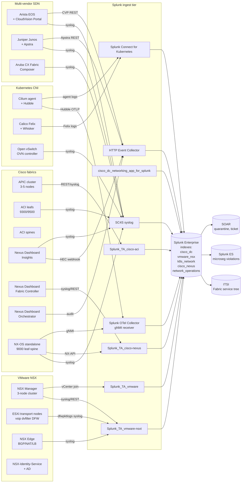

# Data Center Fabric & SDN Integration Guide

> Comprehensive monitoring guide for software-defined data center
> fabrics — 76 use cases across cat 18 covering Cisco ACI (APIC,
> faults, contracts, endpoints, audit), VMware NSX 4.x (Distributed
> Firewall, Identity Firewall, transport nodes, Edge), Cisco Nexus
> Dashboard (NDI anomaly, NDFC, NDO multi-site), NX-OS standalone EVPN/
> VXLAN fabrics, Cilium / Calico Kubernetes CNI (eBPF dataplane,
> Hubble flows, Felix policy), Arista / Juniper / Aruba multi-vendor
> patterns, BGP-EVPN underlay, and gNMI streaming telemetry. Includes
> Zero Trust East-West segmentation patterns, microsegmentation
> effectiveness scoring, contract violation hunting, endpoint mobility
> tracking, fabric capacity planning, and PCI / HIPAA segmentation
> evidence packs.

---

## Table of Contents

- [Quick Start](#quick-start)
- [Overview](#overview)
- [Architecture and Data Flow](#architecture)
- [Prerequisites](#prerequisites)
- [Cisco ACI Integration](#cisco-aci)
  - [APIC API Endpoints](#apic-api)
  - [Faults, Events, Audit](#aci-faults)
  - [Contracts and Endpoint Tracking](#aci-contracts)
  - [Tenant Health Score](#aci-tenant-health)
- [VMware NSX Integration](#vmware-nsx)
  - [Distributed Firewall (DFW)](#nsx-dfw)
  - [Identity Firewall (IDFW)](#nsx-idfw)
  - [Transport Nodes and Edge](#nsx-transport)
  - [NSX Manager Audit](#nsx-audit)
- [Cisco Nexus Dashboard](#nexus-dashboard)
  - [Nexus Dashboard Insights (NDI)](#ndi)
  - [Nexus Dashboard Fabric Controller (NDFC)](#ndfc)
  - [Nexus Dashboard Orchestrator (NDO)](#ndo)
- [NX-OS Standalone Fabric](#nx-os)
- [Kubernetes CNI (Cilium / Calico)](#k8s-cni)
- [Multi-Vendor SDN](#multi-vendor)
  - [Arista EOS / CloudVision](#arista)
  - [Juniper Junos / Apstra](#juniper)
  - [Aruba CX Fabric](#aruba)
  - [Open vSwitch / OVN](#ovs)
- [gNMI Streaming Telemetry](#gnmi)
- [Splunk-Side Configuration](#splunk-config)
- [Field Dictionary](#field-dictionary)
- [Sample Events](#sample-events)
- [CIM Mapping](#cim-mapping)
- [Compliance Mapping](#compliance)
- [Recommended Dashboard Layouts](#dashboards)
- [ITSI Service Modeling](#itsi)
- [SOAR Playbook Examples](#soar)
- [Sizing and Performance](#sizing)
- [Security Hardening](#security-hardening)
- [Crawl / Walk / Run Roadmap](#roadmap)
- [Validation Checklist](#validation-checklist)
- [Known Limitations](#known-limitations)
- [Troubleshooting](#troubleshooting)
- [FAQ](#faq)
- [Glossary](#glossary)
- [References](#references)
- [Contribution and Feedback](#contribution)

---

<a id="quick-start"></a>
## Quick Start — 90 Minutes to First Fabric Dashboard

### 1. Pick your fabric(s)

Most enterprises run more than one fabric type:

| Fabric | TA / connector | Initial sourcetype |
|---|---|---|
| **Cisco ACI** | Splunk_TA_cisco-aci (Splunkbase 4022) | `cisco:aci:syslog`, `cisco:aci:fault` |
| **VMware NSX 4.x** | Splunk_TA_vmware-nsxt (Splunkbase 4856) | `vmware:nsxt:firewall`, `vmware:nsxt:syslog` |
| **Cisco Nexus Dashboard** | cisco_dc_networking_app_for_splunk + HEC | `cisco:ndi:anomaly`, `cisco:ndi:syslog` |
| **NX-OS standalone** | Splunk_TA_cisco-nexus (Splunkbase 6876) | `cisco:nexus:syslog`, `cisco:nexus:nxapi` |
| **Cilium / Calico K8s CNI** | Splunk Connect for Kubernetes + Hubble OTLP | `cilium:hubble:flow`, `calico:felix:flow` |
| **Arista EOS** | Splunk Add-on for Arista (community) + SC4S | `arista:eos:syslog`, `arista:cvp:event` |
| **Juniper Junos** | Splunk Add-on for Juniper (Splunkbase 2847) + SC4S | `juniper:junos:syslog`, `juniper:apstra:event` |

### 2. Land in dedicated indexes

```ini
# indexes.conf
[cisco_dc]
homePath = $SPLUNK_DB/cisco_dc/db
maxDataSizeMB = 5000
frozenTimePeriodInSecs = 31536000

[vmware_nsx]
homePath = $SPLUNK_DB/vmware_nsx/db
maxDataSizeMB = 5000
frozenTimePeriodInSecs = 31536000

[k8s_network]
homePath = $SPLUNK_DB/k8s_network/db
maxDataSizeMB = 3000
frozenTimePeriodInSecs = 7776000   # 90d default for Hubble
```

### 3. First dashboard — Fabric health-at-a-glance

```spl
(index=cisco_dc OR index=vmware_nsx OR index=k8s_network) earliest=-1h
| eval fabric_type = case(
    sourcetype="cisco:aci:health" OR sourcetype="cisco:aci:fault", "Cisco ACI",
    sourcetype="cisco:ndi:anomaly", "Cisco NDI",
    sourcetype="vmware:nsxt:syslog" OR sourcetype="vmware:nsxt:firewall", "VMware NSX",
    sourcetype IN ("cilium:hubble:flow","calico:felix:flow"), "K8s CNI",
    1==1, "Other")
| stats count BY fabric_type
| sort -count
```

### 4. Activate crawl tier

UC-18.1.1 (ACI fabric health), UC-18.1.2 (Fault trending), UC-18.2.5
(NSX transport node), UC-18.4.1 (NDI anomaly), UC-18.3.1 (Cilium /
Calico CNI policy).

---

<a id="overview"></a>
## Overview

### What this guide covers

| Domain | Examples |
|---|---|
| **Cisco ACI** | APIC fault tracking, contract enforcement, endpoint mobility, tenant health |
| **VMware NSX 4.x** | DFW rule hits, IDFW user attribution, transport node connectivity, Edge BGP |
| **Cisco Nexus Dashboard** | NDI anomaly scoring, NDFC fabric automation, NDO multi-site coherency |
| **NX-OS standalone** | BGP-EVPN underlay, VXLAN VTEP health, vPC peer validation |
| **Kubernetes CNI** | Cilium Hubble flows, Calico Felix policy, eBPF dataplane health, Network Policy compliance |
| **Multi-vendor SDN** | Arista CVP / EOS, Juniper Apstra, Aruba CX Fabric Composer, OVS / OVN |
| **Telemetry** | gNMI streaming, NETCONF, syslog (RFC3164/5424), HEC webhooks |

### What's NOT in scope

| Domain | Where to look |
|---|---|
| Edge campus switching | [Cisco Catalyst Center Guide](catalyst-center.md) |
| Wireless LAN | [Wireless Infrastructure Guide](wireless-infrastructure.md) |
| Edge / branch SD-WAN | [SD-WAN & Network Management Guide](sd-wan-network-management.md) |
| Network Access Control | [VPN / NAC / Zero Trust / SASE Guide](vpn-zerotrust-sase.md) |
| Cloud-native networking (AWS VPC, Azure VNet, GCP VPC) | [AWS](aws.md) / [Azure](azure.md) / [GCP](gcp.md) guides |
| Container platform health (vs. CNI) | [Container Platforms Guide](container-platforms-docker-openshift.md) |
| Application traffic (L4-L7 LB, WAF) | [Application Servers Guide](application-servers.md) |
| Fabric storage networking (FCoE, iSCSI) | [Storage & Backup Guide](storage-backup.md) |

### Why monitor SDN in Splunk

| Capability | Native fabric tool | Splunk |
|---|---|---|
| Real-time fault | Yes (Cisco APIC, NSX Manager, NDI) | Yes — but with cross-fabric correlation |
| Long-term audit | Limited (60-90 days typical) | 7+ years |
| Multi-fabric pane | Per-vendor only | Yes |
| Contract / DFW rule effectiveness scoring | Native UI flagged | Yes — across thousands of policies in one query |
| Cross-product correlation (fabric + endpoint + identity + cloud) | None | Native |
| Zero Trust posture rolled up | Per-fabric | Cross-fabric, per-tenant rollup |
| Compliance evidence (PCI segmentation) | Manual export | Continuous evidence pack |

### What good looks like

| Dimension | Without integration | With full deployment |
|---|---|---|
| Fabric health snapshot | Open separate APIC + NSX Manager + NDFC consoles | Unified dashboard |
| Contract / DFW violation discovery | At audit time | Hourly, alerted to owner |
| Endpoint mobility tracking | Manually correlated through troubleshooting | 5-min historical timeline |
| BGP-EVPN underlay convergence | "Worked yesterday" | Sub-second telemetry, alert on >5s convergence |
| K8s NetworkPolicy effectiveness | Spreadsheet tracking | Per-namespace ratio, daily report |
| PCI segmentation evidence | Annual audit scramble | Quarterly auto-generated report |

---

<a id="architecture"></a>
## Architecture and Data Flow



### EPS budgeting

| Source | Typical EPS |
|---|---|
| ACI APIC syslog (medium fabric, 100 leafs) | 100-500 |
| ACI fault polling (1m interval) | 50-200 |
| NSX DFW (large enterprise) | 5,000-50,000 |
| NSX Manager syslog | 50-500 |
| Cisco NDI anomaly webhook | 10-100 |
| NX-OS standalone fabric (50 switches) | 200-2,000 |
| Cilium Hubble flows (medium K8s cluster) | 500-5,000 |
| gNMI streaming (per-port, 10s interval) | 100-1,000 |

**Plan SC4S** to handle 5-50k EPS for NSX DFW; provision multiple
indexers + parallel ingest pipelines for K8s CNI flows.

---

<a id="prerequisites"></a>
## Prerequisites

| Item | Notes |
|---|---|
| **Splunk Enterprise** ≥ 9.0 (recommended 9.4) | |
| **Indexes** | `cisco_dc`, `vmware_nsx`, `k8s_network`, `cisco_nexus`, `network_operations`, `network_sec` |
| **Splunk_TA_cisco-aci** ≥ 6.x | APIC REST + syslog parsing |
| **Splunk_TA_cisco-nexus** ≥ 1.5 | NX-OS NX-API + syslog |
| **cisco_dc_networking_app_for_splunk** ≥ 1.x | Data Center Networking dashboards (NDI included) |
| **Splunk_TA_vmware-nsxt** ≥ 1.x | NSX 4.x parsing |
| **Splunk_TA_vmware** ≥ 6.x | vSphere inventory enrichment |
| **SC4S** ≥ 3.40 | High-volume syslog receiver |
| **Splunk Connect for Kubernetes** Helm 1.5+ | K8s log collection |
| **Splunk OTel Collector** 0.115+ | gNMI receiver |

### IAM and RBAC

#### Cisco APIC

Create a read-only API user (Admin → AAA → Local Users), with
domain `all` and read-only privileges. Splunk_TA_cisco-aci needs:

- `GET /api/aaaLogin.json` — authenticate
- `GET /api/node/class/fault*.json` — fault tracking
- `GET /api/node/class/healthInst.json` — health scores
- `GET /api/node/class/fvCEp.json` — endpoint inventory
- `GET /api/node/class/aaaModLR.json` — audit log

#### VMware NSX

NSX role: `Auditor` (read-only) is enough for collectors. For
proactive policy snapshots:

- `GET /policy/api/v1/infra/domains/default/security-policies` — DFW policies
- `GET /policy/api/v1/infra/domains/default/security-policies/{id}/rules` — rule details
- `GET /policy/api/v1/infra/domains/default/groups` — NSGroup members
- `GET /api/v1/transport-nodes` — transport node health

#### Cisco NDI

Configure External Streaming → HEC URL → Splunk HEC token. Webhooks
authenticated with bearer token.

#### Kubernetes (Cilium / Calico)

Cilium Hubble OTLP exporter requires service account with
`hubble.io.cilium.io/server` permission; Splunk Connect for
Kubernetes needs cluster-role-binding to read namespaces/pods.

---

<a id="cisco-aci"></a>
## Cisco ACI Integration

<a id="apic-api"></a>
### APIC API Endpoints

```ini
# Splunk_TA_cisco-aci inputs.conf
[cisco_aci://prod-fabric]
host = apic-prod-01.example.com
account = aci-readonly
api = aaaModLR;fault*;healthInst;fvCEp;eventRecord;auditLog
sourcetype = cisco:aci:auto      # routes to specific sourcetypes
index = cisco_aci
interval = 60                     # 1m polling
```

#### Sourcetypes generated

| API class | Sourcetype |
|---|---|
| `aaaModLR` (audit) | `cisco:aci:audit` |
| `fault` (faults) | `cisco:aci:fault` |
| `healthInst` (health scores) | `cisco:aci:health` |
| `fvCEp` (endpoints) | `cisco:aci:endpoint` |
| `eventRecord` (events) | `cisco:aci:event` |

<a id="aci-faults"></a>
### Faults, Events, Audit

#### Fault trending by severity

```spl
index=cisco_aci sourcetype="cisco:aci:fault" earliest=-24h
| eval severity = lower(severity)
| stats count BY severity, code
| sort -count
```

#### Top 10 noisy fault codes

```spl
index=cisco_aci sourcetype="cisco:aci:fault" earliest=-7d
| stats count earliest_seen=min(_time) latest_seen=max(_time) BY code, severity
| sort -count
| head 10
```

#### New / persistent / cleared faults

```spl
index=cisco_aci sourcetype="cisco:aci:fault" earliest=-1h
| eval state = case(
    lifecycle="raised" OR lifecycle="created", "NEW",
    lifecycle="retained", "PERSISTENT",
    lifecycle="cleared", "CLEARED",
    1==1, "OTHER")
| stats count BY state, severity
```

UC-18.1.2 (Fault trending by severity).

<a id="aci-contracts"></a>
### Contracts and Endpoint Tracking

#### Contract / filter hit analysis

```spl
index=cisco_aci sourcetype IN ("cisco:aci:contract","cisco:aci:syslog") earliest=-4h
| rex field=_raw "Contract\s+(?<contract_name>\S+)\s+filter\s+(?<filter_name>\S+)\s+(?<action>permit|deny)"
| stats count BY contract_name, filter_name, action
| sort -count
```

#### Endpoint mobility tracking (UC-18.1.3)

Detect endpoints flapping between leafs:

```spl
index=cisco_aci sourcetype="cisco:aci:endpoint" earliest=-24h
| stats dc(node) AS leafs_seen, values(node) AS leaf_list, count BY mac, ip
| where leafs_seen > 3
| sort -leafs_seen
```

#### Endpoint VLAN duplication alarm

```spl
index=cisco_aci sourcetype="cisco:aci:endpoint" earliest=-1h
| stats dc(epg) AS epg_count, values(epg) AS epgs, values(tenant) AS tenant BY mac
| where epg_count > 1
```

<a id="aci-tenant-health"></a>
### Tenant Health Score

```spl
index=cisco_aci sourcetype="cisco:aci:health" earliest=-1h
| eval health_score = tonumber(cur)
| stats latest(health_score) AS current_health avg(health_score) AS avg_health min(health_score) AS min_health BY dn
| where current_health < 90
| sort current_health
```

UC-18.1.1 (Cisco ACI Fabric Health Score Monitoring).

---

<a id="vmware-nsx"></a>
## VMware NSX Integration

<a id="nsx-dfw"></a>
### Distributed Firewall (DFW)

NSX 4.x kernel-mode `vsip` dvfilter on each ESXi transport node
emits `dfwpktlogs.log` syslog. Splunk_TA_vmware-nsxt parses
`vmware:nsxt:firewall`.

#### DFW rule hit volume

```spl
index=vmware_nsx sourcetype="vmware:nsxt:firewall" earliest=-1h
| rex field=_raw "INET\s+match\s+(?<dfw_action>ALLOW|DROP|REJECT)"
| stats count BY dfw_action
```

#### DFW rule effectiveness scoring (UC-18.2.1)

```spl
index=vmware_nsx sourcetype="vmware:nsxt:firewall" earliest=-4h
| eval verdict = upper(coalesce(dfw_action, action))
| eval action_norm = case(
    match(verdict,"^(ALLOW|ACCEPT)$"), "ALLOW",
    match(verdict,"^(DROP|DENY)$"), "DROP",
    match(verdict,"^(REJECT|RESET)$"), "REJECT",
    1==1, verdict)
| eval rule_tag_raw = coalesce(rule_tag, RULE_TAG)
| rex field=rule_tag_raw "^(?<seq>[^|]+)\|(?<policy>[^|]+)\|(?<rule_id>[^|]+)$"
| bin _time span=15m
| stats count AS hits,
        sum(eval(if(action_norm="ALLOW",1,0))) AS allows,
        sum(eval(if(action_norm IN ("DROP","REJECT"),1,0))) AS denies
        BY _time, policy, rule_id
| eval effectiveness = round(allows / (allows + denies), 4)
| sort -hits
```

#### East-west breach indicator

```spl
index=vmware_nsx sourcetype="vmware:nsxt:firewall" earliest=-1h
        action_norm=DROP
| eval src_subnet = mvfilter(replace(src_ip, "(\.\d+)$",""))
| eval dst_subnet = mvfilter(replace(dst_ip, "(\.\d+)$",""))
| where src_subnet != dst_subnet
| stats count dc(src_ip) AS unique_sources dc(dst_ip) AS unique_dests
        BY src_subnet, dst_subnet
| where count > 100
| sort -count
```

<a id="nsx-idfw"></a>
### Identity Firewall (IDFW)

```ini
# props.conf
[vmware:nsxt:idfw]
EXTRACT-idfw_user = USERNAME=(?<idfw_username>\S+)
LOOKUP-ad_user = ad_user_lookup.csv idfw_username AS sAMAccountName
```

```spl
index=vmware_nsx sourcetype="vmware:nsxt:idfw" earliest=-24h
| stats count dc(rule_tag) AS rules_hit values(action) AS actions BY idfw_username
| sort -count
```

<a id="nsx-transport"></a>
### Transport Nodes and Edge

#### Transport node connectivity (UC-18.2.5)

```spl
index=vmware_nsx sourcetype="vmware:nsxt:transport_node" earliest=-1h
| eval status = lower(node_status)
| where status != "up" AND status != "connected"
| stats count BY hostname, status, node_type
```

#### Edge BGP peer monitoring

```spl
index=vmware_nsx sourcetype="vmware:nsxt:edge" earliest=-1h
        bgp_event=*
| stats latest(state) AS bgp_state count(eval(state="established")) AS established_count
        BY peer_address, edge_node
| where bgp_state != "established"
```

<a id="nsx-audit"></a>
### NSX Manager Audit

```spl
index=vmware_nsx sourcetype="vmware:nsxt:syslog" earliest=-24h
        (audit_event OR action="UPDATED" OR action="CREATED" OR action="DELETED")
| stats count values(object_path) BY user_name, action
| sort -count
```

---

<a id="nexus-dashboard"></a>
## Cisco Nexus Dashboard

Cisco Nexus Dashboard hosts three sub-products:

| Product | Function | Sourcetype |
|---|---|---|
| **NDI** (Insights) | AIOps, anomaly detection, compliance | `cisco:ndi:anomaly`, `cisco:ndi:syslog` |
| **NDFC** (Fabric Controller) | NX-OS / IOS XE provisioning | `cisco:ndfc:event` |
| **NDO** (Orchestrator) | Multi-site ACI orchestration | `cisco:ndo:audit` |

<a id="ndi"></a>
### Nexus Dashboard Insights (NDI)

#### External Streaming → HEC

NDI Console → System → External Streaming → Add destination:

```yaml
Type: Splunk
URL: https://splunk-hec.example.com:8088/services/collector/event
Authentication Token: <splunk-hec-token>
Categories: ALL                 # Resources, Performance, Connectivity, Operations, Compliance
Severities: ALL                 # critical, major, warning, minor, info
Sites: ALL
```

#### Anomaly monitoring (UC-18.4.1)

```spl
index=cisco_dc sourcetype="cisco:ndi:anomaly" earliest=-24h
| eval evt_type = lower(coalesce(eventType, event_type))
| eval cat = lower(coalesce(category, Category))
| eval sev = lower(coalesce(severity, Severity))
| where evt_type IN ("anomaly","compliance","bug","psirt") 
        AND state IN ("active","acknowledged")
| eval hotspot = case(
    cat="resources", "capacity_contract",
    cat="performance", "qos_buffer",
    cat="connectivity", "crc_link_flap",
    cat="operations", "process_health",
    cat="compliance", "policy_rules",
    1==1, "general_ndi")
| stats dc(anomalyId) AS anomaly_instances
        dc(siteName) AS sites_impacted
        latest(description) AS narrative
        latest(recommendation) AS fix
        BY siteName, cat, sev, hotspot
| eval sev_rank = case(sev=="critical",1,sev=="major",2,sev=="warning",3,sev=="minor",4,5)
| sort sev_rank, -anomaly_instances
```

#### PSIRT / Bug match alerting

```spl
index=cisco_dc sourcetype="cisco:ndi:anomaly" eventType IN ("psirt","bug") earliest=-7d
| stats values(description) values(recommendation) BY siteName, severity, cve_id
| sort severity
```

#### Compliance rule violation trend

```spl
index=cisco_dc sourcetype="cisco:ndi:anomaly" eventType="compliance" earliest=-30d
| timechart span=1d count BY severity
```

<a id="ndfc"></a>
### Nexus Dashboard Fabric Controller (NDFC)

```ini
# Splunk_TA_cisco-nexus inputs.conf
[cisco_nexus://ndfc-prod]
host = ndfc-prod.example.com
account = ndfc-readonly
endpoint = /appcenter/api/v1
sourcetype = cisco:ndfc:event
index = cisco_nexus
```

```spl
index=cisco_nexus sourcetype="cisco:ndfc:event" earliest=-24h
        event_type IN ("DEPLOY_FAILED","CONFIG_DRIFT","INTERFACE_DOWN")
| stats count BY fabric_name, event_type
```

<a id="ndo"></a>
### Nexus Dashboard Orchestrator (NDO)

```spl
index=cisco_dc sourcetype="cisco:ndo:audit" earliest=-7d
| eval action = lower(action_type)
| where action IN ("delete","modify","create")
| stats count values(object_path) BY user, action, target_site
```

---

<a id="nx-os"></a>
## NX-OS Standalone Fabric

#### BGP-EVPN session health

```spl
index=cisco_nexus sourcetype="cisco:nexus:syslog" earliest=-1h
        (BGP-5-ADJCHANGE OR BGP-3-NOTIFICATION)
| rex field=_raw "neighbor\s+(?<peer>\S+)"
| stats count BY peer, host
| where count > 5
```

#### vPC peer link / keepalive

```spl
index=cisco_nexus sourcetype="cisco:nexus:syslog" earliest=-1h
        VPC-2-PEER_KEEP_ALIVE_RECV_FAIL OR VPC-2-PEER_LINK_DOWN
| stats count BY host
```

#### VXLAN VTEP ECMP path verification (gNMI)

```spl
index=cisco_nexus sourcetype="gnmi:telemetry" path="/interfaces/interface/state/oper-status"
        earliest=-15m
| stats latest(state) AS current_state BY name, host
| where current_state != "UP"
```

---

<a id="k8s-cni"></a>
## Kubernetes CNI (Cilium / Calico)

### Cilium Hubble flows

Hubble can export to OTLP (recommended) or HEC.

```yaml
# cilium values.yaml (Helm)
hubble:
  enabled: true
  export:
    otlp:
      endpoint: splunk-otel-gateway.observability.svc.cluster.local:4317
      enabled: true
      protocol: grpc
```

#### Per-namespace policy effectiveness (UC-18.3.1)

```spl
index=k8s_network sourcetype="cilium:hubble:flow" earliest=-1h
| eval verdict = lower(verdict)
| stats count
        sum(eval(if(verdict="forwarded",1,0))) AS allowed
        sum(eval(if(verdict="dropped",1,0))) AS dropped
        BY source_namespace, destination_namespace
| eval effectiveness = round(dropped / count * 100, 2)
| sort -count
```

#### Drop reason analysis

```spl
index=k8s_network sourcetype="cilium:hubble:flow" verdict=dropped earliest=-1h
| stats count BY drop_reason_desc, source_namespace, destination_namespace
| sort -count
```

### Calico Felix flows

```spl
index=k8s_network sourcetype="calico:felix:flow" earliest=-1h
| stats count
        sum(eval(if(action="allow",1,0))) AS allows
        sum(eval(if(action="deny",1,0))) AS denies
        BY source_namespace, dest_name_aggr, reporter
```

### NetworkPolicy CRD audit

```spl
index=k8s_network sourcetype="kube:audit" earliest=-24h
        objectRef.resource="networkpolicies"
        verb IN ("create","update","delete","patch")
| stats count BY user.username, verb, objectRef.namespace
```

---

<a id="multi-vendor"></a>
## Multi-Vendor SDN

<a id="arista"></a>
### Arista EOS / CloudVision

```ini
# SC4S syslog
[arista:eos:syslog]
TIME_PREFIX = ^
TIME_FORMAT = %b %d %H:%M:%S
SHOULD_LINEMERGE = false
```

CloudVision Portal (CVP) REST → HEC for compliance / change events.

```spl
index=network_operations sourcetype="arista:cvp:event" earliest=-7d
        event_type IN ("CONFIG_PUSH","NON_COMPLIANT","RECONCILE_FAILED")
| stats count BY device_id, event_type
```

<a id="juniper"></a>
### Juniper Junos / Apstra

Apstra is intent-based fabric automation; emits anomaly + compliance
events via REST.

```spl
index=network_operations sourcetype="juniper:apstra:event" earliest=-1h
        event_type IN ("anomaly","probe_failure","cabling_violation")
| stats count BY blueprint_id, event_type, severity
```

<a id="aruba"></a>
### Aruba CX Fabric

```spl
index=network_operations sourcetype="aruba:cx:syslog" earliest=-1h
        (FABRIC OR EVPN OR VXLAN)
| rex field=_raw "(?<event_id>[A-Z]+\-\d+\-[A-Z_]+)"
| stats count BY event_id
```

<a id="ovs"></a>
### Open vSwitch / OVN

```spl
index=network_operations sourcetype="ovs:flow" earliest=-1h
| stats count avg(packets) sum(bytes) BY in_port, out_port, action
```

---

<a id="gnmi"></a>
## gNMI Streaming Telemetry

### Splunk OTel Collector with gNMI receiver

```yaml
# otel-collector-config.yaml
receivers:
  gnmi:
    targets:
      - target: leaf-01.example.com:50051
        username: gnmi-user
        tls:
          insecure_skip_verify: true
        subscriptions:
          - path: /interfaces/interface/state
            mode: STREAM
            sample_interval: 10s
          - path: /system/processes/process/state
            mode: STREAM
            sample_interval: 30s
exporters:
  splunk_hec:
    token: <hec-token>
    endpoint: https://splunk-hec.example.com:8088/services/collector/event
    source: gnmi
    sourcetype: gnmi:telemetry
    index: cisco_nexus
service:
  pipelines:
    metrics:
      receivers: [gnmi]
      exporters: [splunk_hec]
```

### Per-interface error rates

```spl
index=cisco_nexus sourcetype="gnmi:telemetry" 
        path="/interfaces/interface/state/counters/in-errors"
        earliest=-5m
| stats latest(value) AS current_errors BY name, host
| streamstats window=5 avg(current_errors) AS avg_5m BY name, host
| where current_errors > avg_5m * 2
```

---

<a id="splunk-config"></a>
## Splunk-Side Configuration

### Index recipes

```ini
[cisco_dc]
homePath = $SPLUNK_DB/cisco_dc/db
maxDataSizeMB = 5000
frozenTimePeriodInSecs = 31536000

[cisco_nexus]
homePath = $SPLUNK_DB/cisco_nexus/db
maxDataSizeMB = 5000
frozenTimePeriodInSecs = 31536000

[vmware_nsx]
homePath = $SPLUNK_DB/vmware_nsx/db
maxDataSizeMB = 10000           # DFW is voluminous
frozenTimePeriodInSecs = 31536000

[k8s_network]
homePath = $SPLUNK_DB/k8s_network/db
maxDataSizeMB = 5000
frozenTimePeriodInSecs = 7776000

[network_operations]
homePath = $SPLUNK_DB/network_operations/db
maxDataSizeMB = 3000
frozenTimePeriodInSecs = 31536000
```

### Macros

```ini
[fabric_idx]
definition = (index=cisco_dc OR index=cisco_aci OR index=cisco_nexus OR index=vmware_nsx OR index=k8s_network OR index=network_operations)

[normalize_dfw_action]
definition = eval action_norm = case( \
    match(upper(action),"^(ALLOW|ACCEPT|FORWARD)$"), "ALLOW", \
    match(upper(action),"^(DROP|DENY)$"), "DROP", \
    match(upper(action),"^(REJECT|RESET)$"), "REJECT", \
    1==1, upper(action))

[fabric_type]
definition = eval fabric_type = case( \
    sourcetype LIKE "cisco:aci:%", "Cisco ACI", \
    sourcetype LIKE "cisco:nexus:%" OR sourcetype LIKE "cisco:ndfc:%", "NX-OS / NDFC", \
    sourcetype LIKE "cisco:ndi:%", "Cisco NDI", \
    sourcetype LIKE "cisco:ndo:%", "Cisco NDO", \
    sourcetype LIKE "vmware:nsxt:%", "VMware NSX", \
    sourcetype IN ("cilium:hubble:flow","cilium:agent:log"), "Cilium CNI", \
    sourcetype IN ("calico:felix:flow","calico:felix:log"), "Calico CNI", \
    sourcetype LIKE "arista:%", "Arista", \
    sourcetype LIKE "juniper:%", "Juniper", \
    sourcetype LIKE "aruba:%", "Aruba", \
    sourcetype="ovs:flow", "OVS / OVN", \
    1==1, "Other")
```

### Lookups

```csv
# leaf_to_pod_map.csv
leaf_node,pod,role,site,rack
leaf-101,pod1,leaf,site-east,rack-A1
leaf-102,pod1,leaf,site-east,rack-A2

# epg_to_app_map.csv
epg,application,owner_email
epg-web-prod,checkout,checkout-team@example.com
epg-app-prod,checkout,checkout-team@example.com

# nsx_policy_owner.csv
policy,owner_email,business_unit
sec-policy-pci-east,pci-team@example.com,finance
sec-policy-tenant-retail,retail-team@example.com,retail
```

---

<a id="field-dictionary"></a>
## Field Dictionary

| Field | Type | Source | Notes |
|---|---|---|---|
| `_time` | epoch | All | Auto |
| `host` | string | All | Device name |
| `severity` | string | ACI/NSX/NDI | critical/major/warning/info |
| `code` | string | ACI fault | F1234, F2345 |
| `dn` | string | ACI | Distinguished name |
| `tenant` | string | ACI | Tenant name |
| `epg` | string | ACI | Endpoint group |
| `contract_name` | string | ACI | Contract name |
| `health_score` | int | ACI | 0-100 |
| `rule_tag_raw` | string | NSX DFW | seq\|policy\|id tuple |
| `policy` | string | NSX (parsed) | Security policy name |
| `rule_id` | string | NSX (parsed) | Rule ID |
| `action_norm` | string | Macro | ALLOW/DROP/REJECT |
| `src_ip` / `dst_ip` | string | NSX/CNI | Network 5-tuple |
| `idfw_username` | string | NSX IDFW | AD user |
| `anomalyId` | string | NDI | UUID |
| `eventType` | string | NDI | anomaly/compliance/bug/psirt |
| `category` | string | NDI | Resources/Performance/etc. |
| `siteName` | string | NDI | NDI site |
| `verdict` | string | Cilium Hubble | forwarded/dropped |
| `drop_reason_desc` | string | Cilium | Specific drop reason |
| `source_namespace` | string | CNI | K8s source namespace |
| `destination_namespace` | string | CNI | K8s destination namespace |
| `policies` | string | Calico | Matched policy list |

---

<a id="sample-events"></a>
## Sample Events

### cisco:aci:fault

```json
{
  "fault": {
    "code": "F1394",
    "severity": "major",
    "lifecycle": "raised",
    "type": "operational",
    "dn": "topology/pod-1/node-101/sys/eqptcapacity/fault-F1394",
    "descr": "TCAM entries usage for unicast routes table is at 95%",
    "created": "2026-05-09T12:34:56.123Z"
  }
}
```

### cisco:aci:health

```json
{
  "healthInst": {
    "cur": "92",
    "prev": "94",
    "dn": "uni/tn-tenant-retail/health",
    "updTs": "2026-05-09T12:34:56Z"
  }
}
```

### vmware:nsxt:firewall (dfwpktlogs)

```
2026-05-09T12:34:56Z esxi-prod-01.example.com nsx-firewall: 14080 INET match DROP domain-c1010/3072 IN 60 TCP 10.10.20.30/45122->10.10.50.40/3306 S RULE_TAG=2024|sec-policy-pci-east|3024
```

### vmware:nsxt:idfw

```
2026-05-09T12:35:01Z esxi-prod-01.example.com nsx-idfw: USERNAME=jdoe@CORP.LOCAL mapped from 10.10.30.50, applied at vNIC 4000
```

### cisco:ndi:anomaly

```json
{
  "anomalyId": "0123abcd-4567-89ef-0123-456789abcdef",
  "eventType": "anomaly",
  "category": "Connectivity",
  "severity": "major",
  "state": "active",
  "siteName": "site-east-aci",
  "siteType": "aci",
  "objectName": "leaf-101 Eth1/24",
  "objectType": "interface",
  "description": "CRC errors increasing on interface eth1/24 (250 errors in last 5 min)",
  "recommendation": "Inspect optic SFP-10G-LR; verify cabling distance",
  "firstSeenTimestamp": "2026-05-09T12:30:00.000Z",
  "lastSeenTimestamp": "2026-05-09T12:34:00.000Z"
}
```

### cilium:hubble:flow

```json
{
  "verdict": "DROPPED",
  "drop_reason_desc": "Policy denied",
  "source": {"namespace": "default", "pod_name": "frontend-abc", "labels": ["app=frontend"]},
  "destination": {"namespace": "kube-system", "pod_name": "kube-dns-xyz", "labels": ["k8s-app=kube-dns"]},
  "l4": {"TCP": {"source_port": 45122, "destination_port": 53}},
  "policy_match_type": "POLICY_MATCH_TYPE_NONE"
}
```

### calico:felix:flow

```json
{
  "start_time": "2026-05-09T12:34:56Z",
  "end_time": "2026-05-09T12:35:56Z",
  "action": "deny",
  "reporter": "src",
  "source_namespace": "default",
  "source_name_aggr": "frontend-*",
  "dest_namespace": "kube-system",
  "dest_name_aggr": "kube-dns-*",
  "dest_port": 53,
  "protocol": "TCP",
  "policies": ["default/np.deny-egress"]
}
```

---

<a id="cim-mapping"></a>
## CIM Mapping

| CIM Data Model | Fabric data |
|---|---|
| **Network_Traffic** | NSX DFW, Cilium / Calico flows, OVS flows, gNMI flow records |
| **Authentication** | NSX IDFW (USERNAME), APIC AAA audit, NDFC user activity |
| **Change** | ACI audit log, NSX policy edits, NDO audit, NDFC config push |
| **Alerts** | ACI faults, NDI anomalies, NDFC events, Apstra anomalies |
| **Inventory** | ACI endpoint, NSX transport_node, Cilium endpoint, K8s resources |
| **Performance** | gNMI metrics, ACI health scores |

```ini
# eventtypes.conf
[fabric_alert]
search = (sourcetype IN (cisco:aci:fault, cisco:ndi:anomaly, cisco:ndfc:event, juniper:apstra:event))

[fabric_traffic]
search = (sourcetype IN (vmware:nsxt:firewall, cilium:hubble:flow, calico:felix:flow, ovs:flow))

[fabric_change]
search = (sourcetype IN (cisco:aci:audit, cisco:ndo:audit, vmware:nsxt:syslog) AND action IN (CREATED, UPDATED, DELETED))
```

---

<a id="compliance"></a>
## Compliance Mapping

| Framework | Splunk evidence |
|---|---|
| **PCI-DSS v4 req 1 (segmentation)** | DFW / contract drop counts between PCI and non-PCI EPGs/namespaces; quarterly evidence pack |
| **HIPAA Security Rule<sup class="ref">[<a href="#ref-10">10</a>]</sup>** | Per-tenant fabric audit; PHI workload isolation report |
| **SOC 2<sup class="ref">[<a href="#ref-1">1</a>]</sup> CC6** | Microsegmentation effectiveness scores; user-context attribution |
| **ISO 27001<sup class="ref">[<a href="#ref-4">4</a>]</sup> A.13** | Network segmentation evidence; firewall change audit |
| **NIST 800-207 Zero Trust** | East-west allow/deny ratios; identity-aware enforcement (IDFW) |
| **NIST 800-53<sup class="ref">[<a href="#ref-5">5</a>]</sup> SC-7** | Boundary protection — fabric ingress/egress logging |
| **CMMC<sup class="ref">[<a href="#ref-8">8</a>]</sup> L2 SC.L2-3.13.5** | Network segmentation enforcement |
| **IEC 62443<sup class="ref">[<a href="#ref-3">3</a>]</sup> (OT)** | Per-zone segmentation between IT and OT (covered with cat 14 IoT/OT) |
| **FedRAMP<sup class="ref">[<a href="#ref-11">11</a>]</sup> SC-7** | Boundary protection for federal workloads |

### PCI segmentation evidence pack

Quarterly automated report:

```spl
index=vmware_nsx sourcetype="vmware:nsxt:firewall" earliest=-90d
| `normalize_dfw_action`
| eval src_zone = case(
    cidrmatch("10.10.0.0/16", src_ip), "PCI",
    cidrmatch("10.20.0.0/16", src_ip), "GENERAL",
    1==1, "OTHER")
| eval dst_zone = case(
    cidrmatch("10.10.0.0/16", dst_ip), "PCI",
    cidrmatch("10.20.0.0/16", dst_ip), "GENERAL",
    1==1, "OTHER")
| where src_zone="GENERAL" AND dst_zone="PCI"
| stats count BY action_norm
| eval ratio_blocked = round(action_norm IN ("DROP","REJECT") / count, 4)
```

---

<a id="dashboards"></a>
## Recommended Dashboard Layouts

### Multi-fabric overview

| Row | Panel |
|---|---|
| **Headline** | Total fabrics monitored, healthy %, active anomalies |
| **By type** | Single-value count per fabric_type |
| **Critical alerts** | Top 10 by severity across all fabrics |
| **Audit activity** | Top users by changes today |

### Cisco ACI per-tenant

| Row | Panel |
|---|---|
| **Tenant health** | Health score gauge per tenant |
| **Fault timeline** | Fault count by severity, last 24h |
| **Endpoint mobility** | Endpoints flapping between leafs |
| **Contract hits** | Top 20 contracts by hit count |

### NSX DFW microsegmentation

| Row | Panel |
|---|---|
| **Allow / Deny ratio** | Stacked timechart |
| **Top denied paths** | Source subnet → Dest subnet |
| **Top noisy rules** | By hit count |
| **IDFW coverage** | % flows with USERNAME populated |

### NDI anomaly board

| Row | Panel |
|---|---|
| **By severity** | Stacked column |
| **By category** | Pie chart |
| **PSIRT matches** | Open security advisories |
| **Compliance violations** | 30-day trend |

### K8s CNI network policy

| Row | Panel |
|---|---|
| **Per-namespace effectiveness** | Drop ratio by namespace |
| **Top drop reasons** | Pareto |
| **Cross-namespace traffic** | Heatmap |
| **Policy CRD churn** | Top users editing NetworkPolicies |

---

<a id="itsi"></a>
## ITSI Service Modeling

| ITSI concept | Fabric mapping |
|---|---|
| **Service** | One per fabric (ACI-Site-East, NSX-Prod, NDI-Multi-Site, Cilium-Cluster-A) |
| **Service template** | "Data Center Fabric" — KPIs for fabric health, anomaly count, audit churn, DFW allow ratio |
| **Entity** | One per leaf/spine, ESXi transport node, ND cluster, K8s node |
| **KPI examples** | Fabric health score, active critical anomalies, DFW drop ratio, BGP-EVPN converged peers, IDFW coverage % |
| **Service tree** | Site → Fabric → Tenant → Application |
| **Glass table** | Network Operations Center — heatmap of all fabrics with drilldown |

---

<a id="soar"></a>
## SOAR Playbook Examples

### Playbook 1 — NDI critical anomaly → NetOps ticket

```yaml
name: ndi_critical_to_jira
trigger: splunk_alert: ndi_critical_uc_18_4_1
steps:
  - extract: [anomalyId, siteName, category, description, recommendation]
  - jira_create_issue:
      project: NETOPS
      issue_type: Incident
      priority: Critical
      summary: "$category$ anomaly on $siteName$: $description$"
      description: "Recommendation: $recommendation$\nNDI Anomaly ID: $anomalyId$"
  - servicenow_create_change:
      type: emergency
      short_description: "NDI anomaly $anomalyId$ requires investigation"
```

### Playbook 2 — Endpoint flap → quarantine via APIC

```yaml
name: aci_endpoint_flap_quarantine
trigger: splunk_alert: aci_endpoint_flap_uc_18_1_3
steps:
  - extract: [mac, ip, leafs_seen, leaf_list]
  - aci_apic_disable_port:
      apic: apic-prod-01
      mac: $mac$
      reason: "Endpoint flapping across $leafs_seen$ leafs"
  - cmdb_lookup: ip=$ip$ → owner_email
  - send_email:
      to: $owner_email$
      cc: netops@example.com
      subject: "Endpoint $mac$ ($ip$) quarantined - flap"
```

### Playbook 3 — NSX DFW drop spike → escalation

```yaml
name: nsx_dfw_drop_spike
trigger: splunk_alert: nsx_drop_spike
steps:
  - extract: [src_subnet, dst_subnet, count]
  - servicenow_create_incident:
      assignment_group: nsx_admins
      severity: medium
      short_description: "DFW drop spike from $src_subnet$ to $dst_subnet$ ($count$ events)"
```

---

<a id="sizing"></a>
## Sizing and Performance

| Component | Sizing |
|---|---|
| ACI APIC syslog (100 leafs) | 1 SC4S receiver, 200 EPS sustained |
| NSX DFW (5,000 VMs) | 2-3 SC4S receivers; 10-20k EPS sustained, 50k+ peak |
| NDI HEC webhook | 1 HEC endpoint, ~100 EPS |
| K8s Hubble (50 nodes, 3,000 pods) | OTel gateway with 2 vCPU / 4 GB RAM, 5-10k EPS |
| gNMI streaming (100 ports, 10s interval) | OTel collector with 2 vCPU / 2 GB RAM |
| Indexer | 3 indexers per 50k EPS sustained |
| Search head | 2 SH + SHC for ITSI / Glass Tables on top |

### Edge Processor recommendation

For NSX DFW, use Splunk Edge Processor to drop low-value events
(e.g., known internal-internal allows) before ingest:

```yaml
# Edge Processor pipeline
pipeline: nsx-dfw-prefilter
  inputs: [vmware-nsxt-syslog]
  rules:
    - drop:
        when: action="ALLOW" AND src_zone="GENERAL" AND dst_zone="GENERAL"
    - keep: all
```

Reduces ingest by 40-70% in typical deployments.

---

<a id="security-hardening"></a>
## Security Hardening

| Risk | Mitigation |
|---|---|
| **Read-only API user compromise** | Use vault-stored credentials; rotate; least privilege |
| **HEC token exposure** | Per-source HEC tokens; revoke on compromise |
| **Syslog spoofing** | TLS syslog + RFC 5425 for sensitive flows; per-source IP allow-list |
| **Audit log tampering** | Index `cisco:aci:audit` and `cisco:ndo:audit` to immutable storage |
| **DFW rule edits without approval** | Saved search alerts on policy CRUD; integrate with change-mgmt approval |
| **Cross-tenant data leak** | Per-tenant index; RBAC on dashboards |

---

<a id="roadmap"></a>
## Crawl / Walk / Run Roadmap

### Crawl (Week 0-2) — 18 use cases

| UC | Why |
|---|---|
| 18.1.1 | ACI fabric health |
| 18.1.2 | Fault trending |
| 18.1.3 | Endpoint mobility tracking |
| 18.1.4 | Contract / filter hit |
| 18.1.6 | APIC AAA audit |
| 18.2.1 | NSX DFW rule effectiveness |
| 18.2.5 | NSX transport node connectivity |
| 18.2.6 | NSX Manager audit |
| 18.2.10 | NSX Edge BGP peer |
| 18.3.1 | Cilium / Calico CNI policy |
| 18.3.4 | OVS / OVN flow |
| 18.4.1 | NDI anomaly monitoring |
| 18.4.2 | NDFC fabric event |
| 18.4.3 | NDO multi-site audit |
| 18.4.5 | NX-OS BGP-EVPN session |
| 18.4.6 | vPC peer monitoring |
| 18.4.10 | gNMI streaming setup |
| 18.4.13 | NetworkPolicy CRD audit |

### Walk (Month 1-3) — 30 more

(detailed list in cat-18.* catalog)

### Run (Month 3+) — 28 advanced

Includes microsegmentation effectiveness scoring at scale,
predictive fabric capacity, automated remediation via SOAR.

---

<a id="validation-checklist"></a>
## Validation Checklist

- [ ] All in-scope fabrics' TAs installed and verified
- [ ] Indexes created with appropriate retention
- [ ] APIC, NSX Manager, NDI credentials stored securely (vault)
- [ ] HEC tokens issued for NDI external streaming
- [ ] SC4S sized for peak EPS (NSX DFW especially)
- [ ] Macros: `fabric_idx`, `normalize_dfw_action`, `fabric_type`
- [ ] Lookups: `leaf_to_pod_map.csv`, `epg_to_app_map.csv`, `nsx_policy_owner.csv`
- [ ] Hubble OTLP exporter configured (if Cilium used)
- [ ] gNMI receiver configured in OTel collector (if standalone NX-OS)
- [ ] First multi-fabric dashboard live
- [ ] Per-fabric ITSI service created
- [ ] Microsegmentation evidence pack (PCI / HIPAA) running quarterly
- [ ] First SOAR playbook tested (NDI → JIRA)

---

<a id="known-limitations"></a>
## Known Limitations

| Limitation | Workaround |
|---|---|
| NSX 4.x removes some legacy NSX-V parser fields | Re-validate field aliases on TA upgrade |
| NDI requires Nexus Dashboard cluster (3+ ND nodes minimum) | Cloud-only NDI Insights for SaaS deployments |
| Cilium Hubble flows can be voluminous (5-50k EPS in busy clusters) | Use OTel sampling and Edge Processor prefilter |
| ACI faults polled (1m default) — not real-time | Subscribe to syslog stream for sub-second |
| K8s NetworkPolicy doesn't capture L7 (HTTP method etc.) — Cilium does via L7 visibility | Enable Cilium L7 visibility annotations |
| gNMI requires per-vendor schema mapping (OpenConfig vs native) | Standardize on OpenConfig where possible |
| CVP REST API rate-limited | Cache results; pull every 5m not 1m |
| NDO audit only for changes (not anomalies — those are NDI) | Combine NDO + NDI feeds |

---

<a id="troubleshooting"></a>
## Troubleshooting

### "ACI faults stopped showing up"

1. APIC user expired / locked (AAA → Local Users → check status)
2. Splunk_TA_cisco-aci script failure (check `_internal` for
   `cisco_aci.py` errors)
3. APIC API rate limit (reduce poll frequency)

### "NSX DFW EPS dropping events"

1. SC4S undersized — scale horizontally (add receivers)
2. Universal Forwarder bottleneck — switch to direct SC4S
3. Index queue full — add indexers or use Edge Processor prefilter

### "NDI webhook not delivering to Splunk HEC"

1. TLS cert chain mismatch — verify NDI trust to Splunk HEC cert
2. HEC token revoked — regenerate + update NDI config
3. Firewall blocking — check NDI → Splunk HEC bidirectional path

### "K8s Hubble flows missing source/destination namespace"

1. Namespace label not set — required for Hubble enrichment
2. Hubble OTLP exporter version mismatch with collector
3. OTel attribute mapper renamed `namespace` → `k8s.namespace.name`

### "BGP-EVPN convergence shows >5s but VTEPs healthy"

1. ECMP not enabled on underlay
2. Anycast gateway MAC mismatch
3. Split-horizon ESI mis-configured

---

<a id="faq"></a>
## FAQ

**Q: ACI vs NSX vs Cilium — which to monitor first?**
Whichever you have the most spend on. Most common path: ACI for
existing data centers, NSX for VMware-heavy estates, Cilium for
modern K8s.

**Q: Splunk_TA_cisco-aci or direct REST polling?**
TA for production — handles auth, retry, schema. REST direct only for
custom pulls not covered by TA.

**Q: How to reduce NSX DFW ingest cost?**
1. Edge Processor prefilter — drop allow events for trusted
   intra-zone flows. 2. Sample DROP events at low rate when
   sustained. 3. Aggregate to 5-minute summaries for dashboards.

**Q: NDI vs Splunk for fabric anomaly detection?**
Use BOTH. NDI does AIOps detection at fabric level (it has the
gRPC telemetry). Splunk does cross-fabric correlation, long-term
audit, and integration with security tools.

**Q: Cilium Hubble or eBPF directly?**
Hubble is the official Cilium observability layer — uses eBPF under
the hood. Direct eBPF is for custom probes; Hubble is the
production answer.

**Q: When to use gNMI vs syslog?**
gNMI for high-frequency metrics (interface counters, BGP state,
latency). Syslog for events (link up/down, BGP notification). Use
both.

**Q: How does this relate to Cisco Catalyst Center?**
Catalyst Center is for campus / branch networking. Cisco ACI / Nexus
Dashboard / NX-OS are for data center fabric. They are different
products with different TAs.

---

<a id="glossary"></a>
## Glossary

| Term | Definition |
|---|---|
| **ACI** | Application Centric Infrastructure (Cisco SDN for data center) |
| **APIC** | Application Policy Infrastructure Controller (ACI brain) |
| **DFW** | Distributed Firewall (VMware NSX kernel-mode firewall) |
| **IDFW** | Identity Firewall (NSX with AD integration) |
| **EPG** | Endpoint Group (ACI logical group) |
| **EVPN** | Ethernet VPN (BGP-based control plane) |
| **VXLAN** | Virtual Extensible LAN (overlay encapsulation) |
| **vPC** | Virtual Port Channel (NX-OS multi-chassis EtherChannel) |
| **VTEP** | VXLAN Tunnel Endpoint |
| **NDI** | Nexus Dashboard Insights (Cisco AIOps for fabrics) |
| **NDFC** | Nexus Dashboard Fabric Controller |
| **NDO** | Nexus Dashboard Orchestrator (multi-site ACI) |
| **gNMI** | gRPC Network Management Interface (OpenConfig) |
| **NETCONF** | Network Configuration Protocol (XML over SSH) |
| **CNI** | Container Network Interface (K8s networking abstraction) |
| **eBPF** | Extended Berkeley Packet Filter (Linux kernel programming) |
| **Felix** | Calico's per-node policy enforcer |
| **Hubble** | Cilium's observability platform |
| **OVS** | Open vSwitch |
| **OVN** | Open Virtual Network |
| **NSGroup** | NSX Network Security Group |
| **CVP** | Arista CloudVision Portal |
| **Apstra** | Juniper intent-based fabric automation |

---

<a id="references"></a>
## References

### Cisco ACI

- [Cisco APIC REST API Configuration Guide](https://www.cisco.com/c/en/us/products/cloud-systems-management/application-policy-infrastructure-controller-apic/index.html)
- [Splunk Add-on for Cisco ACI](https://splunkbase.splunk.com/app/4022)
- [ACI Fault Management Reference](https://www.cisco.com/c/en/us/products/cloud-systems-management/application-policy-infrastructure-controller-apic/index.html)

### Cisco Nexus Dashboard

- [Cisco Nexus Dashboard documentation](https://www.cisco.com/c/en/us/products/data-center-analytics/nexus-dashboard/index.html)
- [Cisco Nexus Dashboard Insights](https://www.cisco.com/c/en/us/products/data-center-analytics/nexus-dashboard/index.html)
- [Splunk Add-on for Cisco Nexus](https://splunkbase.splunk.com/app/6876)
- [Cisco DC Networking App for Splunk](https://splunkbase.splunk.com/app/7777)

### VMware NSX

- [VMware NSX 4.2 Administration Guide](https://techdocs.broadcom.com/us/en/vmware-cis/nsx/vmware-nsx/4-2/administration-guide.html)
- [VMware NSX 4.2 API Reference](https://techdocs.broadcom.com/us/en/vmware-cis/nsx.html)
- [Splunk Add-on for VMware NSX-T](https://splunkbase.splunk.com/app/4856)

### Kubernetes CNI

- [Cilium Hubble OTLP exporter](https://docs.cilium.io/en/stable/observability/hubble/)
- [Calico Cloud and OSS](https://docs.tigera.io/)
- [Splunk Connect for Kubernetes](https://github.com/splunk/splunk-connect-for-kubernetes)

### Multi-vendor

- [Arista CloudVision documentation](https://www.arista.com/en/products/eos/eos-cloudvision)
- [Juniper Apstra documentation](https://www.juniper.net/documentation/product/us/en/apstra/)
- [Aruba CX Fabric Composer](https://www.arubanetworks.com/products/network-management-operations/fabric-composer/)
- [Open vSwitch / OVN](https://www.openvswitch.org/)

### Telemetry

- [OpenConfig models](https://github.com/openconfig/public)
- [gNMI specification](https://github.com/openconfig/reference/blob/master/rpc/gnmi/gnmi-specification.md)
- [Splunk OpenTelemetry Collector — gNMI receiver](https://github.com/signalfx/splunk-otel-collector)

### Splunk Lantern

- [Splunk Lantern — Network monitoring articles](https://lantern.splunk.com/)

---

<a id="contribution"></a>
## Contribution and Feedback

This guide is part of the Splunk Monitoring Use Cases catalog.

- **Add a use case** — PR JSON sidecar in `content/cat-18-data-center-fabric-sdn/`
- **Share a fabric pattern** — PR documentation
- **Contribute a vendor TA pattern** — PR `examples/fabric/`

The full catalog is at
[github.com/fenre/splunk-monitoring-use-cases](https://github.com/fenre/splunk-monitoring-use-cases).

---

<!-- BEGIN-AUTOGENERATED-SOURCES -->

## References

*Auto-generated by `scripts/generate_doc_references.py` from `data/source-references.json` and `data/source-mappings.json`. Edit those files (or the document body) to change citations; this footer is rewritten on every run.*

### Supporting sources

<a id="ref-1"></a>**[1]** American Institute of Certified Public Accountants. (2017). *Trust Services Criteria (2017) for Security, Availability, Processing Integrity, Confidentiality, and Privacy*. AICPA & CIMA. SOC 2 / TSP Section 100. https://www.aicpa-cima.com/topic/audit-assurance/soc-suite-of-services

<a id="ref-2"></a>**[2]** Cisco Systems, Inc. (2026). *Cisco Catalyst SD-WAN Documentation*. Retrieved May 11, 2026, from https://www.cisco.com/c/en/us/support/routers/sd-wan/series.html

<a id="ref-3"></a>**[3]** International Electrotechnical Commission. (2018). *IEC 62443 — Industrial communication networks — Network and system security*. IEC. https://webstore.iec.ch/en/publication/7029

<a id="ref-4"></a>**[4]** International Organization for Standardization. (2022). *ISO/IEC 27001:2022 — Information security, cybersecurity and privacy protection — Information security management systems — Requirements*. ISO/IEC. ISO/IEC 27001:2022. https://www.iso.org/standard/27001

<a id="ref-5"></a>**[5]** National Institute of Standards and Technology. (2020). *Security and Privacy Controls for Information Systems and Organizations* (Revision 5). U.S. Department of Commerce. NIST SP 800-53 Rev. 5. https://csrc.nist.gov/pubs/sp/800/53/r5/upd1/final

<a id="ref-6"></a>**[6]** Splunk Inc. (2026). *Splunk Common Information Model Add-on Manual*. Splunk LLC, a Cisco company. Retrieved May 11, 2026, from https://docs.splunk.com/Documentation/CIM

<a id="ref-7"></a>**[7]** Splunk Inc. (2026). *Splunk Infrastructure Monitoring Documentation*. Splunk LLC, a Cisco company. Retrieved May 11, 2026, from https://docs.splunk.com/observability/en/infrastructure/intro-to-infrastructure.html

<a id="ref-8"></a>**[8]** U.S. Department of Defense. (2024). *Cybersecurity Maturity Model Certification (CMMC) 2.0* (2.0). Office of the Under Secretary of Defense for Acquisition and Sustainment. https://dodcio.defense.gov/CMMC/

<a id="ref-9"></a>**[9]** U.S. Department of Health & Human Services. (2002). *HIPAA Privacy Rule (45 CFR Parts 160 and 164, Subparts A and E)*. Office for Civil Rights, HHS. 45 CFR 160, 164. https://www.hhs.gov/hipaa/for-professionals/privacy/index.html

<a id="ref-10"></a>**[10]** U.S. Department of Health & Human Services. (2013). *HIPAA Security Rule (45 CFR Parts 160 and 164, Subparts A and C)*. Office for Civil Rights, HHS. 45 CFR 160, 164. https://www.hhs.gov/hipaa/for-professionals/security/index.html

<a id="ref-11"></a>**[11]** U.S. General Services Administration / FedRAMP PMO. (2023). *FedRAMP Security Controls Baseline, Rev. 5* (Rev. 5). FedRAMP Program Management Office. https://www.fedramp.gov/rev5/baselines/

<details>
<summary>Additional online sources cited in the document body (23)</summary>

<a id="ref-12"></a>**[12]** cisco.com. *Cisco APIC REST API Configuration Guide*. Retrieved May 11, 2026, from https://www.cisco.com/c/en/us/products/cloud-systems-management/application-policy-infrastructure-controller-apic/index.html

<a id="ref-13"></a>**[13]** splunkbase.splunk.com. *Splunk Add-on for Cisco ACI*. Retrieved May 11, 2026, from https://splunkbase.splunk.com/app/4022

<a id="ref-14"></a>**[14]** cisco.com. *Cisco Nexus Dashboard documentation*. Retrieved May 11, 2026, from https://www.cisco.com/c/en/us/products/data-center-analytics/nexus-dashboard/index.html

<a id="ref-15"></a>**[15]** splunkbase.splunk.com. *Splunk Add-on for Cisco Nexus*. Retrieved May 11, 2026, from https://splunkbase.splunk.com/app/6876

<a id="ref-16"></a>**[16]** splunkbase.splunk.com. *Cisco DC Networking App for Splunk*. Retrieved May 11, 2026, from https://splunkbase.splunk.com/app/7777

<a id="ref-17"></a>**[17]** techdocs.broadcom.com. *VMware NSX 4.2 Administration Guide*. Retrieved May 11, 2026, from https://techdocs.broadcom.com/us/en/vmware-cis/nsx/vmware-nsx/4-2/administration-guide.html

<a id="ref-18"></a>**[18]** techdocs.broadcom.com. *VMware NSX 4.2 API Reference*. Retrieved May 11, 2026, from https://techdocs.broadcom.com/us/en/vmware-cis/nsx.html

<a id="ref-19"></a>**[19]** splunkbase.splunk.com. *Splunk Add-on for VMware NSX-T*. Retrieved May 11, 2026, from https://splunkbase.splunk.com/app/4856

<a id="ref-20"></a>**[20]** docs.cilium.io. *Cilium Hubble OTLP exporter*. Retrieved May 11, 2026, from https://docs.cilium.io/en/stable/observability/hubble/

<a id="ref-21"></a>**[21]** docs.tigera.io. *Calico Cloud and OSS*. Retrieved May 11, 2026, from https://docs.tigera.io/

<a id="ref-22"></a>**[22]** github.com. *Splunk Connect for Kubernetes*. Retrieved May 11, 2026, from https://github.com/splunk/splunk-connect-for-kubernetes

<a id="ref-23"></a>**[23]** arista.com. *Arista CloudVision documentation*. Retrieved May 11, 2026, from https://www.arista.com/en/products/eos/eos-cloudvision

<a id="ref-24"></a>**[24]** juniper.net. *Juniper Apstra documentation*. Retrieved May 11, 2026, from https://www.juniper.net/documentation/product/us/en/apstra/

<a id="ref-25"></a>**[25]** arubanetworks.com. *Aruba CX Fabric Composer*. Retrieved May 11, 2026, from https://www.arubanetworks.com/products/network-management-operations/fabric-composer/

<a id="ref-26"></a>**[26]** openvswitch.org. *Open vSwitch / OVN*. Retrieved May 11, 2026, from https://www.openvswitch.org/

<a id="ref-27"></a>**[27]** github.com. *OpenConfig models*. Retrieved May 11, 2026, from https://github.com/openconfig/public

<a id="ref-28"></a>**[28]** github.com. *gNMI specification*. Retrieved May 11, 2026, from https://github.com/openconfig/reference/blob/master/rpc/gnmi/gnmi-specification.md

<a id="ref-29"></a>**[29]** github.com. *Splunk OpenTelemetry Collector — gNMI receiver*. Retrieved May 11, 2026, from https://github.com/signalfx/splunk-otel-collector

<a id="ref-30"></a>**[30]** lantern.splunk.com. *Splunk Lantern — Network monitoring articles*. Retrieved May 11, 2026, from https://lantern.splunk.com/

<a id="ref-31"></a>**[31]** github.com. *github.com/fenre/splunk-monitoring-use-cases*. Retrieved May 11, 2026, from https://github.com/fenre/splunk-monitoring-use-cases

<a id="ref-32"></a>**[32]** splunkbase.splunk.com. *Splunkbase app #1810*. Retrieved May 11, 2026, from https://splunkbase.splunk.com/app/1810

<a id="ref-33"></a>**[33]** splunkbase.splunk.com. *Splunkbase app #2847*. Retrieved May 11, 2026, from https://splunkbase.splunk.com/app/2847

<a id="ref-34"></a>**[34]** github.com. *GitHub: splunk/splunk-connect-for-syslog*. Retrieved May 11, 2026, from https://github.com/splunk/splunk-connect-for-syslog

</details>

### Related repository documents

- [`docs/guides/application-servers.md`](application-servers.md)
- [`docs/guides/aws.md`](aws.md)
- [`docs/guides/azure.md`](azure.md)
- [`docs/guides/catalyst-center.md`](catalyst-center.md)
- [`docs/guides/container-platforms-docker-openshift.md`](container-platforms-docker-openshift.md)
- [`docs/guides/gcp.md`](gcp.md)
- [`docs/guides/sd-wan-network-management.md`](sd-wan-network-management.md)
- [`docs/guides/storage-backup.md`](storage-backup.md)
- [`docs/guides/vpn-zerotrust-sase.md`](vpn-zerotrust-sase.md)
- [`docs/guides/wireless-infrastructure.md`](wireless-infrastructure.md)

<!-- END-AUTOGENERATED-SOURCES -->
