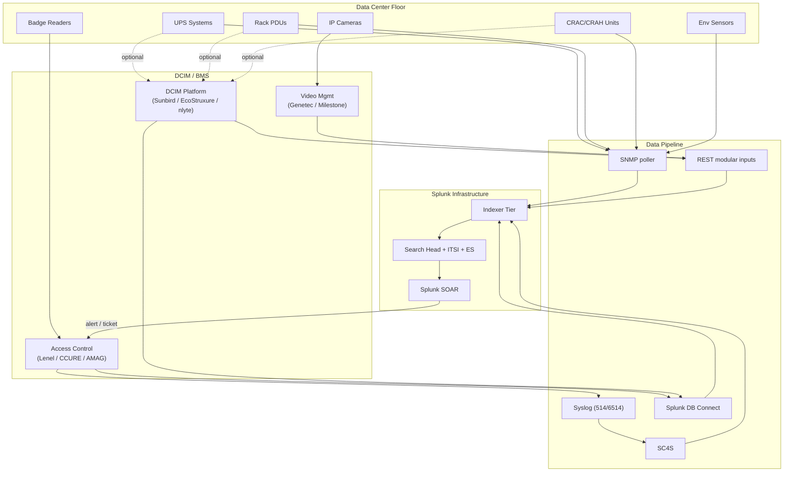

# Data Center Physical Infrastructure Integration Guide

> The definitive guide to integrating data center physical
> infrastructure with Splunk. **117 use cases** spanning UPS systems
> (APC, Schneider, Eaton, Vertiv, Mitsubishi, ABB), PDUs (Server
> Technology, Raritan, Vertiv, APC), Cooling (CRAC/CRAH, in-row, rear-
> door, liquid, free-air economizers), Environmental sensors
> (temperature, humidity, leak, smoke, dust, motion), Physical Security
> (HID, Lenel, Software House CCURE, AMAG, S2; CCTV — Avigilon, Axis,
> Genetec, Milestone), and DCIM platforms (Sunbird, Schneider
> EcoStruxure IT, nlyte, Vertiv Trellis, Device42). UPS battery health,
> PDU per-outlet load, cooling redundancy + thermal anomaly detection,
> environmental leak / smoke alerts, badge tailgating detection,
> physical security correlation with logical access, PUE measurement,
> ASHRAE thermal compliance, and the full Tier III/IV data center
> observability story.

---

## Table of Contents

- [Quick Start](#quick-start)
- [Overview](#overview)
- [Architecture and Data Flow](#architecture)
- [Prerequisites](#prerequisites)
- [Platform Coverage Matrix](#platform-matrix)
- [UPS Systems](#ups)
- [PDUs (Power Distribution Units)](#pdu)
- [Cooling — CRAC/CRAH, In-Row, Rear-Door, Liquid](#cooling)
- [Environmental Sensors (Temp / Humidity / Leak / Smoke / Motion)](#environmental)
- [Physical Access Control (HID, Lenel, CCURE, AMAG, S2)](#access-control)
- [Video Surveillance (Avigilon, Axis, Genetec, Milestone)](#cctv)
- [DCIM Platforms (Sunbird, EcoStruxure IT, nlyte, Trellis, Device42)](#dcim)
- [PUE & ASHRAE Thermal Compliance](#pue-ashrae)
- [Field Dictionary](#field-dictionary)
- [Sample Events](#sample-events)
- [Splunk-Side Configuration](#splunk-config)
- [Cross-Product Correlation](#cross-product)
- [CIM Mapping Reference](#cim-mapping)
- [ITSI Data Center Service Modeling](#itsi)
- [Compliance Mapping](#compliance)
- [Capacity Planning and Sizing](#sizing)
- [Recommended Dashboard Layouts](#dashboards)
- [SOAR Playbook Examples](#soar)
- [Multi-Site Strategy](#multi-site)
- [Security Hardening](#security-hardening)
- [Crawl / Walk / Run Roadmap](#roadmap)
- [Validation Checklist](#validation-checklist)
- [Known Limitations and Gaps](#known-limitations)
- [Troubleshooting](#troubleshooting)
- [FAQ](#faq)
- [Glossary](#glossary)
- [References](#references)
- [Contribution and Feedback](#contribution)

---

<a id="quick-start"></a>
## Quick Start — 2 Hours to First DC Infrastructure Insight

### UPS / PDU via SNMP (most common)

1. Install [Splunk Add-on for SNMP](https://splunkbase.splunk.com/app/3252) on Splunk HF.
2. Configure SNMP poll on HF inputs.conf:
    ```ini
    [snmp://ups_floor1]
    destination = 10.10.1.10
    snmp_version = 3
    v3_securityLevel = authPriv
    v3_authProtocol = SHA
    v3_privProtocol = AES
    v3_authKey = <stored>
    v3_privKey = <stored>
    snmpinterval = 60
    object_names = upsBattery, upsOutput, upsInput
    sourcetype = snmp:ups
    index = power
    ```
3. Validate: `index=power sourcetype="snmp:ups" earliest=-15m | stats count by ups_name`

### Lenel OnGuard (badge access)

1. Lenel Data Conduit / OnGuard ODBC connection
2. [Splunk DB Connect (Splunkbase 2686)](https://splunkbase.splunk.com/app/2686) input on `lnl_event_log` table
3. Validate: `index=physical_security sourcetype="lenel:event" earliest=-15m | stats count by panel, event_type`

### Activate crawl tier

UC-15.1.1 (UPS Battery Health), UC-15.2.1 (Hot/Cold Aisle Temp), UC-15.3.1 (Badge Activity), UC-15.1.5 (PDU Load Balance).

---

<a id="overview"></a>
## Overview

### Why DC physical observability matters

Data centers are **billions in capital** that fail noisily when ignored:

- UPS battery EOL = unprotected outage during grid event
- PDU overload = cascading rack failure
- Cooling loss = thermal runaway in 5-10 minutes
- Leak detection = millions in equipment loss
- Badge tailgating = compliance failure (PCI 9.x, HIPAA §164.310)
- PUE drift = millions in electricity waste

### Domains covered

| Domain | Examples |
|--------|---------|
| **Power** | UPS, PDU, ATS, generators, switchgear |
| **Cooling** | CRAC/CRAH, in-row, rear-door, liquid, immersion |
| **Environmental** | Temp, humidity, leak, smoke, motion, dust |
| **Physical Security** | Badge readers, mantraps, CCTV |
| **DCIM** | Asset management, capacity planning |
| **Compliance** | TIA-942, ASHRAE, ISO 27001 A.11 |

### What good looks like

| Dimension | Without integration | With full integration |
|-----------|---------------------|-----------------------|
| UPS battery EOL | Manual quarterly walk | Per-UPS auto-alert at 80% capacity |
| Hot spot detection | Operator complaint | Real-time thermal heat-map |
| Tailgating detection | Manual CCTV review | Auto-correlation badge ↔ CCTV |
| PUE measurement | Quarterly estimate | Real-time per-row, per-rack |
| TIA-942 evidence | Annual audit | Continuous compliance |

---

<a id="architecture"></a>
## Architecture and Data Flow



---

<a id="prerequisites"></a>
## Prerequisites

| Item | Detail |
|------|--------|
| **Splunk version** | 9.0+ Enterprise / Cloud |
| **CIM 6.x** | Performance, Inventory, Authentication (badge), Alerts |
| **SNMP TA** | For UPS / PDU / CRAC polling |
| **SNMPv3** | Required for production (no SNMPv1/v2c plain-text) |
| **DB Connect** | For DCIM databases |
| **Network access** | UF / HF on management VLAN with reach to all gear |

---

<a id="platform-matrix"></a>
## Platform Coverage Matrix

| Domain | Platform | Integration |
|--------|----------|-------------|
| **UPS** | APC by Schneider Electric | SNMP (PowerNet-MIB), NetBotz |
| **UPS** | Eaton | SNMP (XUPS-MIB) |
| **UPS** | Vertiv (Liebert, Mitsubishi) | SNMP, Trellis |
| **UPS** | ABB | SNMP |
| **PDU** | APC | SNMP (PowerNet-MIB) |
| **PDU** | Server Technology / Raritan | SNMP (Sentry-MIB) |
| **PDU** | Vertiv | SNMP |
| **Cooling** | Liebert / Vertiv CRAC | SNMP, BACnet |
| **Cooling** | Schneider InRow | SNMP, EcoStruxure |
| **Cooling** | Stulz / Munters | SNMP, BACnet |
| **Env** | APC NetBotz | SNMP, NetBotz API |
| **Env** | RLE Technologies | SNMP, BACnet |
| **Env** | Generic BACnet sensors | BACnet IP via Edge Hub |
| **Access Control** | Lenel OnGuard | DB Connect, REST |
| **Access Control** | Software House CCURE 9000 | DB Connect, REST |
| **Access Control** | AMAG Symmetry | DB Connect |
| **Access Control** | S2 NetBox | REST |
| **Access Control** | HID VertX | SNMP, syslog |
| **CCTV** | Genetec Security Center | REST + Syslog |
| **CCTV** | Milestone XProtect | REST |
| **CCTV** | Avigilon ACC | REST |
| **CCTV** | Axis Communications | REST + ONVIF |
| **DCIM** | Sunbird dcTrack | DB Connect / REST |
| **DCIM** | Schneider EcoStruxure IT | REST API |
| **DCIM** | nlyte | DB Connect / REST |
| **DCIM** | Vertiv Trellis | DB Connect |
| **DCIM** | Device42 | REST API |

---

<a id="ups"></a>
## UPS Systems

### SNMP UPS-MIB (RFC 1628) standard fields

| OID | Field | Description |
|-----|-------|-------------|
| `1.3.6.1.2.1.33.1.1.1` | `upsIdentManufacturer` | Vendor |
| `1.3.6.1.2.1.33.1.2.1` | `upsBatteryStatus` | 1=unknown, 2=normal, 3=low, 4=depleted |
| `1.3.6.1.2.1.33.1.2.4` | `upsEstimatedChargeRemaining` | Battery %  |
| `1.3.6.1.2.1.33.1.2.3` | `upsEstimatedMinutesRemaining` | Runtime |
| `1.3.6.1.2.1.33.1.2.5` | `upsBatteryVoltage` | DC voltage |
| `1.3.6.1.2.1.33.1.2.7` | `upsBatteryTemperature` | °C |

### Sample event (snmp:ups)

```
ups_name=UPS-NYC-FLR1-A
upsBatteryStatus=2
upsEstimatedChargeRemaining=98
upsEstimatedMinutesRemaining=42
upsBatteryVoltage=216.5
upsBatteryTemperature=24.1
upsInputVoltage=240.2
upsOutputLoad=42
upsAlarmsPresent=0
```

### SPL — UPS battery health

```spl
index=power sourcetype="snmp:ups" earliest=-15m
| eval issue=case(
    upsBatteryStatus=3, "Low Battery",
    upsBatteryStatus=4, "Depleted",
    upsEstimatedChargeRemaining<80, "Low Charge",
    upsEstimatedMinutesRemaining<15, "Low Runtime",
    upsBatteryReplaceIndicator="yes", "Battery Replace Required",
    1=1, "OK"
  )
| where issue!="OK"
| stats latest(*) as * by ups_name, issue
| table ups_name, location, issue, upsEstimatedChargeRemaining, upsEstimatedMinutesRemaining, battery_age_months
```

---

<a id="pdu"></a>
## PDUs (Power Distribution Units)

### PDU SNMP key fields

| Field | Description |
|-------|-------------|
| `outlet_name` | Outlet identifier |
| `outlet_state` | on / off |
| `outlet_load_amps` | Per-outlet draw |
| `outlet_voltage` | V |
| `outlet_power_kw` | kW |
| `outlet_energy_kwh` | kWh accumulated |
| `bank_load_amps` | Per-bank draw |
| `pdu_total_kw` | Total |

### SPL — PDU load balance

```spl
index=power sourcetype="snmp:rpdu" earliest=-15m
| stats avg(bank_load_amps) by pdu_name, bank
| chart values(avg) over pdu_name by bank
```

### SPL — PDU overcurrent risk

```spl
index=power sourcetype="snmp:rpdu" earliest=-15m
| eval pct_capacity=round(bank_load_amps/bank_capacity_amps*100,1)
| where pct_capacity > 80
| table _time, pdu_name, bank, bank_load_amps, bank_capacity_amps, pct_capacity
```

---

<a id="cooling"></a>
## Cooling — CRAC/CRAH, In-Row, Rear-Door, Liquid

### Common fields (CRAC SNMP)

| Field | Description |
|-------|-------------|
| `unit_name` | CRAC/CRAH identifier |
| `supply_temp_c` | Supply air |
| `return_temp_c` | Return air |
| `supply_humidity_pct` | RH |
| `compressor_state` | on / off / standby |
| `fan_speed_rpm` | Fan |
| `cool_state` | cooling / dehumidifying / off |
| `humidify_state` | humidifying / off |
| `unit_alarm` | active alarms |

### SPL — Cooling redundancy check

```spl
index=cooling sourcetype="snmp:crac" earliest=-15m
| stats count(eval(unit_state="online")) as online_units, count(eval(unit_state="standby")) as standby_units, count as total by row_name
| eval n_plus_1_ok=if(online_units >= total - standby_units, "OK", "DEGRADED")
| where n_plus_1_ok="DEGRADED"
```

### SPL — Hot spot detection

```spl
index=dc_environmental sourcetype="snmp:envmon" sensor_type="temperature" earliest=-15m
| eventstats avg(temp_c) as row_avg, stdev(temp_c) as row_std by row_id
| eval z_score=if(row_std>0, (temp_c-row_avg)/row_std, 0)
| where temp_c > 27 OR z_score > 2.5
| table _time, row_id, rack_id, sensor_id, temp_c, row_avg, z_score
```

ASHRAE TC 9.9 A1 envelope: 18-27°C inlet, 8-80% RH.

---

<a id="environmental"></a>
## Environmental Sensors (Temp / Humidity / Leak / Smoke / Motion)

### Sources

- APC NetBotz appliances (multi-sensor probes)
- RLE Technologies leak rope, smoke, water sensors
- Generic BACnet sensors via Splunk Edge Hub
- Liquid leak detection (positional rope)

### SPL — Leak detection alert

```spl
index=dc_environmental sourcetype="snmp:envmon" sensor_type="leak" earliest=-1h
| where leak_state="WET" OR leak_state=1
| table _time, sensor_location, leak_state, leak_position_meters
```

### SPL — Smoke detection

```spl
index=dc_environmental sourcetype="snmp:envmon" sensor_type="smoke" earliest=-1h
| where smoke_state="ALARM" OR smoke_value > 50
| table _time, sensor_location, smoke_state, smoke_value
```

---

<a id="access-control"></a>
## Physical Access Control (HID, Lenel, CCURE, AMAG, S2)

### Lenel OnGuard via DB Connect

```
DB Connect input:
  Connection: SQL Server (Lenel DB)
  Query:
    SELECT lnl_id, panel_name, device_name, event_type, event_time, badge_id, person_name
    FROM lnl_event_log
    WHERE event_time > {checkpoint}
  Index: physical_security
  Sourcetype: lenel:event
```

### Software House CCURE 9000

REST API + DB Connect for historical events.

Sourcetype: `software_house:ccure`.

### AMAG Symmetry

DB Connect to Symmetry SQL DB.

Sourcetype: `amag:symmetry`.

### S2 NetBox

REST API.

Sourcetype: `s2:netbox`.

### SPL — Tailgating candidate detection

```spl
index=physical_security sourcetype IN ("lenel:event","software_house:ccure","amag:symmetry") event_type IN ("Granted","Forced") earliest=-1h
| transaction reader_id maxspan=5s
| eval badge_count=mvcount(badge_id), person_count=mvcount(person_name)
| where badge_count=1 AND person_count=1
| join reader_id [search index=physical_security event_type="DoorOpen" duration > 5
    | stats values(reader_id) as long_open_readers]
| table _time, reader_id, badge_id, person_name
```

### SPL — Failed badge attempts (brute force)

```spl
index=physical_security event_type IN ("Denied","Invalid","Unknown") earliest=-1h
| stats dc(reader_id) as readers, count by badge_id
| where count > 5
| sort -count
```

---

<a id="cctv"></a>
## Video Surveillance (Avigilon, Axis, Genetec, Milestone)

### Genetec Security Center

```
Genetec → Config Tool → Plugins → Splunk plugin
  + HEC URL + token
  + Stream: alarms, events, audit
```

Sourcetype: `genetec:event`.

### Milestone XProtect

```
XProtect Smart Client → System Settings → Logs → Forward to syslog
```

Sourcetype: `milestone:event`.

### Avigilon ACC

REST API + Splunk Add-on for Avigilon.

Sourcetype: `avigilon:event`.

### Axis Communications

ONVIF events + Axis Camera Station REST API.

Sourcetype: `axis:event`, `axis:camera`.

### SPL — CCTV camera offline

```spl
index=physical_security sourcetype="genetec:event" event_type="Camera_offline" earliest=-1h
| stats latest(_time) as last_offline by camera_name, location
```

### SPL — Motion-after-hours

```spl
index=physical_security sourcetype="genetec:event" event_type="motion" earliest=-1d
| eval hour=strftime(_time,"%H")
| where hour < 6 OR hour > 22
| stats count by camera_name, location
```

---

<a id="dcim"></a>
## DCIM Platforms (Sunbird, EcoStruxure IT, nlyte, Trellis, Device42)

### Sunbird dcTrack

```
DB Connect input on dcTrack DB:
  SELECT * FROM v_assets WHERE last_modified > {checkpoint}
```

Sourcetype: `sunbird:dcim`.

### Schneider EcoStruxure IT

REST API. Sourcetype: `schneider:ecostruxure`.

### nlyte

DB Connect. Sourcetype: `nlyte:dcim`.

### Vertiv Trellis

DB Connect. Sourcetype: `vertiv:trellis`.

### Device42

REST API. Sourcetype: `device42:asset`, `device42:power`.

### SPL — Rack capacity utilization (DCIM-driven)

```spl
index=dcim sourcetype="sunbird:dcim" object_type="rack"
| eval power_capacity_kw=design_kw, power_used_kw=measured_kw
| eval pct_used=round(power_used_kw/power_capacity_kw*100,1)
| where pct_used > 70
| table rack_id, location, power_capacity_kw, power_used_kw, pct_used
```

---

<a id="pue-ashrae"></a>
## PUE & ASHRAE Thermal Compliance

### PUE (Power Usage Effectiveness)

PUE = Total Facility Energy / IT Energy

```spl
(index=power sourcetype="snmp:ups" earliest=-1h
    | stats avg(facility_total_kw) as facility_kw)
| appendcols [search index=power sourcetype="snmp:rpdu" earliest=-1h
    | stats sum(pdu_total_kw) as it_kw]
| eval pue=round(facility_kw/it_kw, 2)
| eval grade=case(pue<1.2,"World class",pue<1.5,"Efficient",pue<2.0,"Average",pue<2.5,"Inefficient",1=1,"Poor")
```

### ASHRAE thermal envelope compliance

```spl
index=dc_environmental sourcetype="snmp:envmon" sensor_type="temperature" sensor_position="cold_aisle_inlet" earliest=-1d
| eval ashrae_class=case(
    temp_c >= 18 AND temp_c <= 27, "A1 OK",
    temp_c >= 15 AND temp_c <= 32, "A2 OK",
    temp_c >= 10 AND temp_c <= 35, "A3 OK",
    temp_c >= 5 AND temp_c <= 40, "A4 OK",
    1=1, "OUT OF RANGE"
  )
| stats count by ashrae_class, rack_id
```

---

<a id="field-dictionary"></a>
## Field Dictionary

| Field | UPS | PDU | CRAC | Env | Badge | CCTV |
|-------|-----|-----|------|-----|-------|------|
| `device` | ups_name | pdu_name | unit_name | sensor_id | reader_id | camera_name |
| `metric_value` | upsBatteryCharge | bank_load_amps | supply_temp_c | (varies) | (n/a) | (n/a) |
| `metric_unit` | (varies) | A | C | (varies) | (n/a) | (n/a) |
| `severity` | upsAlarmStatus | (alarm) | unit_alarm | sensor_alarm | (event_type) | event_severity |
| `location` | location | location | row_name | rack_id | location | location |

---

<a id="sample-events"></a>
## Sample Events

(See per-platform sections.)

---

<a id="splunk-config"></a>
## Splunk-Side Configuration

### Index strategy

```ini
[power]
homePath = $SPLUNK_DB/power/db
maxDataSize = auto
frozenTimePeriodInSecs = 31536000   # 1 year

[cooling]
homePath = $SPLUNK_DB/cooling/db
maxDataSize = auto
frozenTimePeriodInSecs = 31536000

[dc_environmental]
homePath = $SPLUNK_DB/dc_environmental/db
maxDataSize = auto
frozenTimePeriodInSecs = 31536000

[physical_security]
homePath = $SPLUNK_DB/physical_security/db
maxDataSize = auto
frozenTimePeriodInSecs = 220752000  # 7 years (compliance)

[dcim]
homePath = $SPLUNK_DB/dcim/db
maxDataSize = auto
frozenTimePeriodInSecs = 31536000
```

---

<a id="cross-product"></a>
## Cross-Product Correlation

### Badge entry → logical login (insider threat)

```spl
(index=physical_security event_type="Granted" earliest=-1h)
| stats earliest(_time) as badge_in by person_name
| join person_name [search index=ad sourcetype="WinEventLog:Security" EventCode=4624 earliest=-1h
    | rename Account_Name as person_name | stats earliest(_time) as login_time by person_name]
| eval delay_min=round((login_time-badge_in)/60,1)
| where delay_min < 0 OR delay_min > 60
```

### UPS battery on → impacted IT services

```spl
(index=power sourcetype="snmp:ups" upsBatteryStatus=4 earliest=-15m)
| stats values(ups_name) as failing_ups
| join location [search index=cmdb sourcetype="snow:cmdb_ci" | rename u_location as location
    | stats values(name) as impacted_cis by location]
```

---

<a id="cim-mapping"></a>
## CIM Mapping Reference

| CIM model | Sourcetype |
|-----------|-----------|
| **Performance** | snmp:ups, snmp:pdu, snmp:crac, snmp:envmon |
| **Inventory** | dcim:* |
| **Authentication** | badge:access, lenel:event, software_house:ccure |
| **Alerts** | All sensor alarms, UPS alarms |

---

<a id="itsi"></a>
## ITSI Data Center Service Modeling

### Service hierarchy

```
DC Site Health
├── Per-Site (DC1, DC2, ...)
├── Power Tier
│   ├── UPS aggregate health
│   ├── PDU load distribution
│   └── ATS state
├── Cooling Tier
│   ├── CRAC redundancy
│   ├── Thermal compliance (ASHRAE)
│   └── Humidity within bounds
├── Environmental Tier
│   ├── Leak detection
│   ├── Smoke detection
│   └── Motion / occupancy
└── Physical Security Posture
    ├── Door state
    ├── Tailgating detection
    └── Camera availability
```

---

<a id="compliance"></a>
## Compliance Mapping

### Uptime Institute Tier Standards

| Tier | Coverage |
|------|----------|
| **Tier I** Basic capacity | UPS / cooling availability |
| **Tier II** Redundant capacity | N+1 component validation |
| **Tier III** Concurrently maintainable | Maintenance windows + redundancy |
| **Tier IV** Fault tolerant | 2N redundancy validation |

### TIA-942

- Tier classification + redundancy validation per category
- Per-row capacity tracking

### ASHRAE TC 9.9

- Continuous A1-A4 envelope compliance
- Hot/cold aisle temp validation

### ISO 27001 A.11 / SOC 2 / PCI-DSS 9.x

- Badge access audit (3-year retention min)
- Failed access attempts tracking
- Visitor logs

### NIS2 / CMMC PE

- Physical security incident reporting
- Continuous monitoring evidence

---

<a id="sizing"></a>
## Capacity Planning and Sizing

| Site size | Daily volume |
|-----------|--------------|
| Small (single room, <50 racks) | ~100 MB |
| Medium (1 DC, 50-500 racks) | ~1 GB |
| Large (multi-DC, 500-5000 racks) | ~10 GB |
| Hyper-scale (10+ DCs, 5000+ racks) | ~100 GB+ |

CCTV metadata only (not video): ~500 MB/day per 100 cameras.

---

<a id="dashboards"></a>
## Recommended Dashboard Layouts

### Crawl

```
+---------------------+---------------------+
| UPS HEALTH PANEL                           |
+---------------------+---------------------+
| PDU LOAD MAP                               |
+---------------------+---------------------+
| THERMAL HEAT-MAP (per row)                 |
+---------------------+---------------------+
| BADGE ACCESS LIVE                          |
+---------------------+---------------------+
```

### Walk

```
+---------------------+---------------------+
| TAILGATING DETECTIONS                      |
+---------------------+---------------------+
| LEAK / SMOKE / ENV ALERTS                  |
+---------------------+---------------------+
| COOLING REDUNDANCY (N+1 / 2N)              |
+---------------------+---------------------+
| FAILED BADGE ATTEMPTS (brute-force)        |
+---------------------+---------------------+
```

### Run

```
+---------------------+---------------------+
| PUE TREND (per site)                       |
+---------------------+---------------------+
| ASHRAE COMPLIANCE %                        |
+---------------------+---------------------+
| TIER III/IV ATTESTATION DASHBOARD          |
+---------------------+---------------------+
| CAPACITY PLANNING (rack power forecast)    |
+---------------------+---------------------+
```

---

<a id="soar"></a>
## SOAR Playbook Examples

### Playbook 1: Leak detection → Auto-page

```
1. RECEIVE notable: leak detected
2. PAGE facilities on-call (PagerDuty)
3. CREATE Sev-1 ticket in SNOW
4. ATTACH last 1h sensor data + badge access
5. NOTIFY DC manager
```

### Playbook 2: Tailgating → Camera alert

```
1. RECEIVE notable: tailgating candidate
2. POLL VMS API → pull video clip ±30s
3. ATTACH clip to ticket
4. ESCALATE to security if confirmed
```

### Playbook 3: UPS battery EOL → Procurement workflow

```
1. RECEIVE notable: UPS battery <80% capacity
2. CREATE SNOW request: replace battery
3. ASSIGN to DC operations
4. SCHEDULE maintenance window
```

---

<a id="multi-site"></a>
## Multi-Site Strategy

- Per-site indexes (`power_dc1`, `power_dc2`)
- Geo-tag every event via DC site lookup
- Federated dashboards across DCs

---

<a id="security-hardening"></a>
## Security Hardening

- SNMPv3 only (auth + priv)
- Management VLAN isolation
- TLS for DCIM REST APIs
- Field-level RBAC for badge holder names (PII)
- Forward physical security logs to immutable storage (compliance)

---

<a id="roadmap"></a>
## Crawl / Walk / Run Roadmap

### Crawl (Month 1)

1. Onboard UPS + PDU + CRAC via SNMP
2. Crawl-tier dashboards
3. UC-15.1.1, UC-15.2.1, UC-15.3.1

### Walk (Month 2-3)

1. Onboard environmental sensors
2. Onboard physical access + CCTV metadata
3. Cross-correlation badge ↔ login
4. PUE measurement live

### Run (Month 4+)

1. Full ASHRAE / Tier compliance dashboards
2. SOAR playbooks for facility incidents
3. Predictive UPS battery EOL ML
4. Quarterly compliance evidence pipeline

---

<a id="validation-checklist"></a>
## Validation Checklist

- [ ] Day 1: First UPS / PDU event in Splunk
- [ ] Day 14: All power + cooling sources ingesting
- [ ] Day 30: Walk-tier UCs deployed
- [ ] Day 90: Full DC physical observability live; PUE + ASHRAE compliance reported

---

<a id="known-limitations"></a>
## Known Limitations and Gaps

| Limitation | Impact | Workaround |
|------------|--------|------------|
| **SNMP polling latency** | 15-60s minimum | Use SNMP traps for critical alarms |
| **Vendor MIB variance** | Field naming inconsistency | Per-vendor field aliases |
| **Legacy badge systems** | No API | Use DB Connect on backend DB |
| **CCTV video data** | Massive volumes | Index metadata only, retain video on VMS |
| **DCIM sync lag** | Stale asset data | Schedule daily refresh |

---

<a id="troubleshooting"></a>
## Troubleshooting

### SNMP poll failing

- Verify SNMPv3 credentials
- Test with `snmpwalk -v3 -u <user> -A <auth> -a SHA -X <priv> -x AES -l authPriv <ip>`
- Check firewall: UDP/161 to UPS / PDU / CRAC

### Badge events not arriving

- Verify DB Connect query checkpoint advancing
- Check Lenel/CCURE event log table grows in DB

### Genetec Splunk plugin no events

- Re-validate plugin token
- Check Genetec Server Admin → Plugins → Splunk → Logs

---

<a id="faq"></a>
## FAQ

**Q: SNMP vs vendor TA for UPS?**
A: SNMP via UPS-MIB works for any vendor. Vendor TAs (APC NetBotz) provide richer fields.

**Q: How often should I poll UPS?**
A: Critical alarms via traps (real-time); state via poll every 30-60s.

**Q: Can I integrate video AI analytics?**
A: Yes — Genetec / Avigilon export AI events (person detected, license plate) to Splunk via REST.

**Q: How long should I retain badge access logs?**
A: 7 years for SOC 2 / PCI / HIPAA; 3 years minimum for most.

---

<a id="glossary"></a>
## Glossary

| Term | Definition |
|------|-----------|
| **UPS** | Uninterruptible Power Supply |
| **PDU** | Power Distribution Unit |
| **ATS** | Automatic Transfer Switch |
| **CRAC** | Computer Room Air Conditioning |
| **CRAH** | Computer Room Air Handler |
| **DCIM** | Data Center Infrastructure Management |
| **PUE** | Power Usage Effectiveness |
| **ASHRAE** | American Society of Heating, Refrigerating and Air-Conditioning Engineers |
| **TIA-942** | Telecommunications Infrastructure Standard for Data Centers |
| **VMS** | Video Management System |
| **N+1 / 2N** | Redundancy notation |
| **Tailgating** | Unauthorized entry following an authorized badge |

---

<a id="references"></a>
## References

- [Splunk Add-on for SNMP (Splunkbase 3252)](https://splunkbase.splunk.com/app/3252)
- [Splunk DB Connect (Splunkbase 2686)](https://splunkbase.splunk.com/app/2686)
- [UPS-MIB RFC 1628](https://datatracker.ietf.org/doc/html/rfc1628)
- [TIA-942-C Data Center Standards](https://global.ihs.com/doc_detail.cfm?document_name=TIA-942-C)
- [ASHRAE TC 9.9 Thermal Guidelines](https://www.ashrae.org/technical-resources/bookstore/datacom-series)
- [Uptime Institute Tier Standards](https://uptimeinstitute.com/tiers)

---

<a id="contribution"></a>
## Contribution and Feedback

Part of the [Splunk Monitoring Use Cases](https://github.com/fenre/splunk-monitoring-use-cases) project. [Open an issue](https://github.com/fenre/splunk-monitoring-use-cases/issues/new).

---

*Last updated: 2026-05-09. Covers APC SmartUPS / Symmetra current, Eaton 9PXM / 93PM, Vertiv Liebert APM/EXM, Schneider EcoStruxure IT, Lenel OnGuard 8.x, CCURE 9000 v3.x, Genetec Security Center 5.x, Milestone XProtect 2024 R2, Sunbird dcTrack current.*
