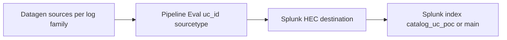

# Datagen setup guide — 10 representative use cases

This guide shows how to simulate **realistic, searchable** events for ten high-value use cases from this catalog using **Cribl Stream Datagen** (and optional [EchoLake](https://github.com/daveherrald/echolake) replay), with consistent fields for Splunk indexing and dashboard filtering.

> **Audience:** SE / Solution Architect / Workshop Facilitator /
> POC Engineer / Training Lead. Use this guide when you need to
> demonstrate the catalogue without production data, run a hands-on
> workshop, or validate a Splunk pipeline (HEC + props/transforms +
> dashboards) without waiting for real ingest. Companion to
> [eventgen_data/README.md](../../eventgen_data/README.md) and
> [config/uc_to_log_family.json](../../config/uc_to_log_family.json).

**Related repo files**

| Artifact | Purpose |
|----------|---------|
| [eventgen_data/manifest-top10.json](../../eventgen_data/manifest-top10.json) | Machine-readable rows for these 10 UCs |
| [eventgen_data/samples/](../../eventgen_data/samples/) | Redacted sample lines per **log family** (Cribl “Create Datagen File”) |
| [scripts/generate_manifest_samples.py](../../scripts/generate_manifest_samples.py) | Emit NDJSON for Splunk HEC from the manifest |
| [scripts/parse_uc_catalog.py](../../scripts/parse_uc_catalog.py) | Full-catalog UC list → `manifest-all.json` |
| [config/uc_to_log_family.json](../../config/uc_to_log_family.json) | Category → default `log_family` for automation |

Use cases were chosen for **domain coverage**, alignment with [content/INDEX.md](../../content/INDEX.md) quick-start themes, and **datagen feasibility** (syslog, JSON, web, cloud, K8s-style, metrics, OT, compliance).

---

## The ten use cases

| # | UC ID | Title | Catalog sidecar | Why datagen-friendly |
|---|--------|--------|----------------|----------------------|
| 1 | **UC-1.1.23** | Kernel Core Dump Generation | [UC-1.1.23.json](../../content/cat-01-server-compute/UC-1.1.23.json) | [Linux](linux-servers.md) **syslog** / kernel narrative |
| 2 | **UC-5.1.4** | BGP Peer State Changes | [UC-5.1.4.json](../../content/cat-05-network-infrastructure/UC-5.1.4.json) | **Network syslog** |
| 3 | **UC-8.1.1** | HTTP Error Rate Monitoring | [UC-8.1.1.json](../../content/cat-08-application-infrastructure/UC-8.1.1.json) | **[Apache](web-servers.md)**-style access log |
| 4 | **UC-9.1.3** | Privileged Group Membership Changes | [UC-9.1.3.json](../../content/cat-09-identity-access-management/UC-9.1.3.json) | **JSON** (pseudo–Windows Security) |
| 5 | **UC-4.1.8** | GuardDuty Finding Ingestion | [UC-4.1.8.json](../../content/cat-04-cloud-infrastructure/UC-4.1.8.json) | **JSON** ([AWS](aws.md)-style finding) |
| 6 | **UC-3.2.1** | Pod Restart Rate | [UC-3.2.1.json](../../content/cat-03-containers-orchestration/UC-3.2.1.json) | **[Kubernetes](kubernetes.md)**-style JSON |
| 7 | **UC-10.3.5** | Endpoint Isolation Events | [UC-10.3.5.json](../../content/cat-10-security-infrastructure/UC-10.3.5.json) | **EDR JSON** |
| 8 | **UC-13.1.1** | Indexer Queue Fill Ratio | [UC-13.1.1.json](../../content/cat-13-observability-monitoring-stack/UC-13.1.1.json) | **Metrics JSON** (demo; not real `_internal`) |
| 9 | **UC-14.2.2** | Process Variable Anomalies | [UC-14.2.2.json](../../content/cat-14-iot-operational-technology-ot/UC-14.2.2.json) | **OT** tag/value JSON |
| 10 | **UC-22.1.1** | GDPR[<a href="#ref-3">3</a>] PII Detection in Application Log Data | [UC-22.1.1.json](../../content/cat-22-regulatory-compliance/UC-22.1.1.json) | App JSON with **fake** PII only |

---

## End-to-end architecture (Cribl → Splunk)

1. **One Datagen source per log family** (not necessarily per UC). Example: UC-1.1.23 and UC-5.1.4 can share **syslog** if you set `uc_id` in **Eval**.
2. **Pipeline**: **Eval** (or Parser + Eval) to set:
   - `uc_id` — match your dashboards (e.g. `1.1.23` or `UC-1.1.23`; **pick one** and standardize).
   - `catalog_category` — `1`–`22`.
   - `sourcetype` — e.g. `catalog:syslog`, `catalog:json:aws`, `catalog:web`, `catalog:k8s`, `catalog:metrics`, `catalog:ot`.
3. **Destination**: **Splunk HEC** with JSON; ensure `_time` is valid.
4. **Splunk**: dedicated index (e.g. `catalog_uc_poc`); search `uc_id=<id>`.

Official references: [Datagen Source](https://docs.cribl.io/stream/sources-datagens/), [Use Datagens](https://docs.cribl.io/stream/datagens/), [Splunk destination](https://docs.cribl.io/stream/destinations-splunk).

---

## Per–use-case datagen recipe

For each row: start from a **built-in** Cribl template if listed, else **paste sample → Create a Datagen File** using files under [eventgen_data/samples](../../eventgen_data/samples/).

### UC-1.1.23 — Kernel core dump

- **Shape**: Syslog + message mentioning `kernel`, `core dump`, `pid`, `/var/crash` or `systemd-coredump`.
- **Cribl**: `syslog.log` built-in or [samples/syslog/kernel.sample.log](../../eventgen_data/samples/syslog/kernel.sample.log); pipeline sets `uc_id` for `1.1.23`.

### UC-5.1.4 — BGP peer state

- **Shape**: `%BGP-5-ADJCHANGE` or neutral `BGP neighbor … Down/Established`.
- **Cribl**: [samples/syslog/bgp.sample.log](../../eventgen_data/samples/syslog/bgp.sample.log); Eval `uc_id="5.1.4"`.

### UC-8.1.1 — HTTP error rate

- **Shape**: Apache combined log; mix `200`, `404`, `500`.
- **Cribl**: `apache_common.log` if available, or [samples/web/apache_access.sample.log](../../eventgen_data/samples/web/apache_access.sample.log).

### UC-9.1.3 — AD privileged group change

- **Shape**: JSON with `EventID`, `GroupName`, fake principals — **no** production paste.
- **Cribl**: [samples/iam/json_security.sample.jsonl](../../eventgen_data/samples/iam/json_security.sample.jsonl).

### UC-4.1.8 — GuardDuty finding

- **Shape**: JSON with `detail.type`, `severity`, `region` — redact all account IDs.
- **Cribl**: [samples/aws/guardduty_finding.sample.jsonl](../../eventgen_data/samples/aws/guardduty_finding.sample.jsonl). See also [AWS GuardDuty finding formats](https://docs.aws.amazon.com/guardduty/latest/ug/guardduty_finding_formats-active.html).

### UC-3.2.1 — Pod restart rate

- **Shape**: JSON lines resembling K8s events / controller logs.
- **Cribl**: [samples/k8s/pod_event.sample.jsonl](../../eventgen_data/samples/k8s/pod_event.sample.jsonl).

### UC-10.3.5 — Endpoint isolation

- **Shape**: JSON `action=isolate`, fake hostname/vendor.
- **Cribl**: [samples/edr/isolation.sample.jsonl](../../eventgen_data/samples/edr/isolation.sample.jsonl).

### UC-13.1.1 — Indexer queue fill ratio

- **Shape**: Metrics JSON `metric_name`, `metric_value` 0–1, `host=demo-idx`. Label as **demo**, not production `_internal`.
- **Cribl**: [samples/metrics/splunk_queue_demo.sample.jsonl](../../eventgen_data/samples/metrics/splunk_queue_demo.sample.jsonl).

### UC-14.2.2 — Process variable anomaly

- **Shape**: OT JSON with `metric_name` / `metric_value` / optional `alarm`.
- **Cribl**: [samples/ot/process_variable.sample.jsonl](../../eventgen_data/samples/ot/process_variable.sample.jsonl).

### UC-22.1.1 — GDPR PII in app logs

- **Shape**: App JSON with **synthetic** email/phone only (`example.com`, `555` range).
- **Cribl**: [samples/compliance/app_with_fake_pii.sample.jsonl](../../eventgen_data/samples/compliance/app_with_fake_pii.sample.jsonl). Optional **Mask** in pipeline for demos.

---

## Operating checklist (Rock Pi / any worker)

1. Worker Group → **Datagen** source → attach datagen files → low EPS (e.g. 1–10) initially.
2. **Commit & Deploy** → **Monitoring → Data Sources** verify flow.
3. Route to **Splunk HEC**; preview pipeline.
4. Splunk: `index=<yours> uc_id=*` — expect distinct `uc_id` per UC if routing is correct.
5. Tune EPS; add **Throttle** in Cribl if needed.

---

## Optional: EchoLake replay

If you have **golden JSONL**, [EchoLake](https://github.com/daveherrald/echolake) can retime events; feed output into Cribl **File** or **HTTP** source. Complements Datagen for captures you already trust.

---

## Automation (scripted, no AI required)

- **Manifest + HEC NDJSON**: `python3 scripts/generate_manifest_samples.py --manifest eventgen_data/manifest-top10.json --output /tmp/top10.ndjson` then POST to HEC (or use as Cribl file source).
- **Full catalog manifest**: `python3 scripts/parse_uc_catalog.py --output eventgen_data/manifest-all.json` (uses [config/uc_to_log_family.json](../../config/uc_to_log_family.json) for default `log_family` per category).
- **Splunk index + dashboard**: use REST for index/HEC tokens; [scripts/deploy_dashboard_studio_rest.py](../../scripts/deploy_dashboard_studio_rest.py) for Dashboard Studio in **index** mode (see [dashboards/README.md](../../dashboards/README.md)).
- **CI**: [.github/workflows/uc-manifest.yml](../../.github/workflows/uc-manifest.yml) regenerates and validates `manifest-all.json` on each push/PR.

### Scaling to every UC in the repo

- **One manifest row per UC** is automated; **event templates stay per log family** (~15–40 families), not per UC. See [eventgen_data/README.md](../../eventgen_data/README.md).

---

## Script-only vs AI

**No AI is required at runtime.** Cron, systemd, or CI can run generators and deploy steps. An LLM only speeds up **authoring** configs and samples.

---

## Architecture variants

The same set of generators / samples can drive several deployment
shapes depending on whether you want a self-contained lab, a
shared workshop environment, or a CI-driven pipeline test.

### Variant 1 — Local laptop demo (Cribl Stream → Splunk Cloud trial)

- **Use case:** Solution Architect demo over Wi-Fi, partner workshop.
- **Components:** Cribl Stream single-node + Splunk Cloud trial + HEC token.
- **Volume:** ~1-10 EPS per UC (low cost, low impact).
- **Setup time:** < 1 hour.
- **Risk:** Network dependency between laptop and Splunk Cloud.

### Variant 2 — Self-contained sandbox (Cribl Edge + Splunk Enterprise trial)

- **Use case:** Air-gapped or offline lab; conference booth.
- **Components:** Cribl Edge worker + Splunk Enterprise single-server trial,
  both in [Docker](container-platforms-docker-openshift.md) Compose or single VM.
- **Volume:** 10-100 EPS per UC, scaled with worker resources.
- **Setup time:** 2-4 hours (initial); rebuild < 30 min from snapshot.
- **Risk:** Single point of failure; trial license expiry.

### Variant 3 — Shared workshop (Cribl Stream cluster + Splunk Cloud)

- **Use case:** Multi-user training; classroom of 20-30.
- **Components:** Cribl Stream worker group (2-3 nodes) + Splunk Cloud
  workshop tenant + per-user HEC tokens.
- **Volume:** 100-1000 EPS aggregate.
- **Setup time:** 4-8 hours; teardown < 1 hour.
- **Risk:** Per-user RBAC discipline; cleanup of leftover data.

### Variant 4 — CI pipeline test (GitHub Actions + ephemeral Splunk container)

- **Use case:** Validate dashboard XML / SPL changes on every PR.
- **Components:** [GitHub Actions](../ci-architecture.md) workflow + ephemeral Splunk container +
  generate_manifest_samples.py + curl to HEC + dashboard health check.
- **Volume:** Burst of 1k-10k events for 30s, then teardown.
- **Setup time:** 4-8 hours initial; runs automatically on PR.
- **Risk:** Container resource limits in GH Actions runner.

### Variant 5 — Performance baseline (high-EPS load test)

- **Use case:** Validate Splunk indexer throughput / props.conf
  parsing performance / SPL alert latency under load.
- **Components:** Multiple Cribl workers feeding parallel HEC ports.
- **Volume:** 10k-100k EPS sustained.
- **Setup time:** 1-2 days.
- **Risk:** License burn; storage; index growth.

---

## Operating principles

The 10 UCs here are deliberately small. Scaling beyond demo
requires discipline:

1. **Manifest-driven, not hand-edited.** Every UC has a manifest
   row (`eventgen_data/manifest-top10.json`); update the manifest
   first, regenerate samples second.
2. **Log family = template grain, UC = label grain.** Dozens of
   UCs share a syslog template; differentiate them via `uc_id` set
   in Cribl Eval, not via separate template files.
3. **Volume control via Throttle.** Cribl's Throttle function
   keeps EPS predictable; otherwise a workshop becomes a noisy
   neighbour.
4. **Time discipline.** Cribl Datagen sets `_time` from internal
   clock; verify NTP sync between Cribl + Splunk; avoid timezone
   drift surprises in workshop dashboards.
5. **No real PII.** Use `example.com` domains, `555` phone-number
   range, fabricated SSNs (e.g. `000-00-XXXX`); apply a Cribl Mask
   function as a second line of defence.
6. **Cleanup.** Each UC should set `index=catalog_uc_poc` (not
   `main`) so cleanup is `| delete index=catalog_uc_poc` after
   the demo.

---

## Troubleshooting

| Symptom | Likely cause | Fix |
|---|---|---|
| HEC 401 | HEC token wrong / disabled | Recreate HEC token; verify `enableSSL` / `port` in inputs.conf |
| HEC 400 | Malformed JSON / wrong sourcetype | Validate sample with `python -m json.tool`; pin `Content-Type: application/json` |
| HEC 403 from Cribl | Cribl HEC destination URL has wrong path | Verify `/services/collector/raw` vs `/services/collector/event` |
| `uc_id` not searchable in Splunk | Field-extraction missing | Add `EXTRACT-uc_id` to `props.conf` for the sourcetype |
| All events `_time` = now | Generator not setting `_time` | Add `time_field` mapping in Cribl Datagen source; or ensure timestamp in sample |
| Cribl Datagen too slow | Single worker | Add Cribl worker; reduce sample size |
| Cribl Datagen too fast | EPS unbounded | Add Throttle function |
| Splunk Cloud rejected events | Sourcetype not in allow-list | Use HEC's accepted sourcetypes only; or contact Splunk Cloud support |
| Dashboards empty after import | Index name mismatch | Map dashboard `index=*` token to `index=catalog_uc_poc` |
| GH Actions runner OOM | Splunk container > 6GB | Use Splunk Stream-only test or use external Splunk |
| Mask function leaking real-looking PII | Pattern incomplete | Add additional patterns; review CSV samples |

---

## Cross-Product Integration

| Other guide | Relationship |
|---|---|
| `cisco-networks.md` (cat 5.1) | Real BGP UC for production; here we generate synthetic BGP syslog |
| `linux-servers.md` (cat 1.1) | Real kernel core dump UC; here we generate synthetic syslog |
| `application-monitoring.md` (cat 7+8) | Real Apache UC; here we generate Apache combined log |
| `cloud-monitoring.md` (cat 4) | Real AWS GuardDuty UC; here we generate finding JSON |
| `security-monitoring.md` (cat 9+10+17) | Real EDR + IAM UCs; here we generate JSON |
| `iot-ot.md` (cat 14) | Real OT process UC; here we generate JSON tag/value |
| `compliance-business.md` (cat 22) | Real GDPR detection; here we generate fake-PII samples |
| `splunk-platform-health.md` (cat 13) | Real `_internal` queue ratio; here we generate **demo** metrics |
| `infrastructure-monitoring.md` | Domain master guide reference |

---

## References

### Cribl

- Cribl Stream — https://docs.cribl.io/stream/
- Cribl Datagen Source — https://docs.cribl.io/stream/sources-datagens/
- Use Datagens — https://docs.cribl.io/stream/datagens/
- Splunk HEC Destination — https://docs.cribl.io/stream/destinations-splunk
- Cribl Mask function — https://docs.cribl.io/stream/usage/functions/mask
- Cribl Throttle function — https://docs.cribl.io/stream/usage/functions/throttle

### Replay tools

- EchoLake — https://github.com/daveherrald/echolake
- Splunk Eventgen — https://splunkbase.splunk.com/app/1924
- Faker (Python) — https://faker.readthedocs.io/
- Locust (HEC load testing) — https://locust.io/

### AWS sample formats

- AWS GuardDuty findings — https://docs.aws.amazon.com/guardduty/latest/ug/guardduty_finding_formats-active.html
- AWS CloudTrail[<a href="#ref-2">2</a>] — https://docs.aws.amazon.com/awscloudtrail/latest/userguide/cloudtrail-event-reference.html

### Splunk HEC documentation

- HEC overview — https://docs.splunk.com/Documentation/Splunk/latest/Data/UsetheHTTPEventCollector
- HEC `event` vs `raw` — https://docs.splunk.com/Documentation/Splunk/latest/RESTREF/RESTinput#services.2Fcollector
- Splunk Cloud service docs (HEC limits, ingest quotas) — https://docs.splunk.com/Documentation/SplunkCloud/latest/Service

### Repo artefacts

- [eventgen_data/manifest-top10.json](../../eventgen_data/manifest-top10.json)
- [eventgen_data/samples/](../../eventgen_data/samples/)
- [scripts/generate_manifest_samples.py](../../scripts/generate_manifest_samples.py)
- [scripts/parse_uc_catalog.py](../../scripts/parse_uc_catalog.py)
- [config/uc_to_log_family.json](../../config/uc_to_log_family.json)
- [.github/workflows/uc-manifest.yml](../../.github/workflows/uc-manifest.yml)
- [eventgen_data/README.md](../../eventgen_data/README.md)
- [dashboards/README.md](../../dashboards/README.md)
- [scripts/deploy_dashboard_studio_rest.py](../../scripts/deploy_dashboard_studio_rest.py)

---

**Document maintenance.** Reviewed quarterly. Last verified
against:
- Splunk Enterprise 9.4
- Splunk Cloud Platform (current)
- Cribl Stream 4.10
- Splunk HEC token format (current)
- All sample files in `eventgen_data/samples/`

For corrections or additions, file an issue with `datagen` label.

---

<!-- BEGIN-AUTOGENERATED-SOURCES -->

## References

*Auto-generated by `scripts/generate_doc_references.py` from `data/source-references.json` and `data/source-mappings.json`. Edit those files (or the document body) to change citations; this footer is rewritten on every run.*

### Supporting sources

**[1]** Amazon Web Services, Inc. (2026). *Amazon GuardDuty User Guide*. Retrieved May 11, 2026, from https://docs.aws.amazon.com/guardduty/latest/ug/what-is-guardduty.html

**[2]** Amazon Web Services, Inc. (2026). *AWS CloudTrail User Guide*. Retrieved May 11, 2026, from https://docs.aws.amazon.com/awscloudtrail/latest/userguide/cloudtrail-user-guide.html

**[3]** European Parliament and Council of the European Union. (2016, April). *Regulation (EU) 2016/679 — General Data Protection Regulation*. Official Journal of the European Union, L 119. ELI: reg/2016/679. https://eur-lex.europa.eu/eli/reg/2016/679/oj

**[4]** Gerhards, R. (2009, March). *The Syslog Protocol*. Internet Engineering Task Force. RFC 5424. https://www.rfc-editor.org/rfc/rfc5424

**[5]** The Kubernetes Authors. (2026). *Kubernetes Documentation*. Cloud Native Computing Foundation. Retrieved May 11, 2026, from https://kubernetes.io/docs/

**[6]** Splunk Inc. (2026). *Search Reference: SPL Commands and Functions*. Splunk LLC, a Cisco company. Retrieved May 11, 2026, from https://docs.splunk.com/Documentation/Splunk/latest/SearchReference/WhatsInThisManual

**[7]** Splunk Inc. (2026). *Splunk Cloud Platform Documentation*. Splunk LLC, a Cisco company. Retrieved May 11, 2026, from https://docs.splunk.com/Documentation/SplunkCloud

**[8]** Splunk Inc. (2026). *Splunk Common Information Model Add-on Manual*. Splunk LLC, a Cisco company. Retrieved May 11, 2026, from https://docs.splunk.com/Documentation/CIM

**[9]** Splunk Inc. (2026). *Splunk Enterprise Documentation*. Splunk LLC, a Cisco company. Retrieved May 11, 2026, from https://docs.splunk.com/Documentation/Splunk

**[10]** Splunk Inc. (2026). *Splunkbase — the Splunk app marketplace*. Splunk LLC, a Cisco company. Retrieved May 11, 2026, from https://splunkbase.splunk.com/

Additional online sources cited in the document body (15)

**[11]** github.com. *EchoLake*. Retrieved May 11, 2026, from https://github.com/daveherrald/echolake

**[12]** docs.cribl.io. *Datagen Source*. Retrieved May 11, 2026, from https://docs.cribl.io/stream/sources-datagens/

**[13]** docs.cribl.io. *Use Datagens*. Retrieved May 11, 2026, from https://docs.cribl.io/stream/datagens/

**[14]** docs.cribl.io. *Splunk destination*. Retrieved May 11, 2026, from https://docs.cribl.io/stream/destinations-splunk

**[15]** docs.aws.amazon.com. *AWS GuardDuty finding formats*. Retrieved May 11, 2026, from https://docs.aws.amazon.com/guardduty/latest/ug/guardduty_finding_formats-active.html

**[16]** splunkbase.splunk.com. *Splunkbase app #1924*. Retrieved May 11, 2026, from https://splunkbase.splunk.com/app/1924

**[17]** docs.cribl.io. *docs.cribl.io: Stream*. Retrieved May 11, 2026, from https://docs.cribl.io/stream/

**[18]** docs.cribl.io. *docs.cribl.io: Mask*. Retrieved May 11, 2026, from https://docs.cribl.io/stream/usage/functions/mask

**[19]** docs.cribl.io. *docs.cribl.io: Throttle*. Retrieved May 11, 2026, from https://docs.cribl.io/stream/usage/functions/throttle

**[20]** faker.readthedocs.io. *faker.readthedocs.io*. Retrieved May 11, 2026, from https://faker.readthedocs.io/

**[21]** locust.io. *locust.io*. Retrieved May 11, 2026, from https://locust.io/

**[22]** docs.aws.amazon.com. *AWS Documentation: Cloudtrail Event Reference*. Retrieved May 11, 2026, from https://docs.aws.amazon.com/awscloudtrail/latest/userguide/cloudtrail-event-reference.html

**[23]** docs.splunk.com. *Splunk Splunk: Usethe Httpevent Collector*. Retrieved May 11, 2026, from https://docs.splunk.com/Documentation/Splunk/latest/Data/UsetheHTTPEventCollector

**[24]** docs.splunk.com. *Splunk Splunk: Restinput*. Retrieved May 11, 2026, from https://docs.splunk.com/Documentation/Splunk/latest/RESTREF/RESTinput#services.2Fcollector

**[25]** docs.splunk.com. *Splunk SplunkCloud: Service*. Retrieved May 11, 2026, from https://docs.splunk.com/Documentation/SplunkCloud/latest/Service

### Related repository documents

- [`dashboards/README.md`](../../dashboards/README.md)
- [`docs/ci-architecture.md`](../ci-architecture.md)
- [`docs/guides/aws.md`](aws.md)
- [`docs/guides/container-platforms-docker-openshift.md`](container-platforms-docker-openshift.md)
- [`docs/guides/kubernetes.md`](kubernetes.md)
- [`docs/guides/linux-servers.md`](linux-servers.md)
- [`docs/guides/web-servers.md`](web-servers.md)
- [`eventgen_data/README.md`](../../eventgen_data/README.md)

### Cited by

- [`eventgen_data/README.md`](../../eventgen_data/README.md)

<!-- END-AUTOGENERATED-SOURCES -->
