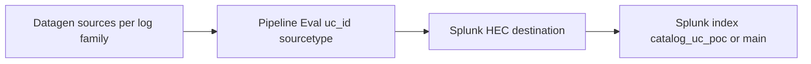

# Datagen setup guide — 10 representative use cases

This guide shows how to simulate **realistic, searchable** events for ten high-value use cases from this catalog using **Cribl Stream Datagen** (and optional [EchoLake](https://github.com/daveherrald/echolake) replay), with consistent fields for Splunk indexing and dashboard filtering.

**Related repo files**

| Artifact | Purpose |
|----------|---------|
| [eventgen_data/manifest-top10.json](../../eventgen_data/manifest-top10.json) | Machine-readable rows for these 10 UCs |
| [eventgen_data/samples/](../../eventgen_data/samples/) | Redacted sample lines per **log family** (Cribl “Create Datagen File”) |
| [scripts/generate_manifest_samples.py](../../scripts/generate_manifest_samples.py) | Emit NDJSON for Splunk HEC from the manifest |
| [scripts/parse_uc_catalog.py](../../scripts/parse_uc_catalog.py) | Full-catalog UC list → `manifest-all.json` |
| [config/uc_to_log_family.json](../../config/uc_to_log_family.json) | Category → default `log_family` for automation |

Use cases were chosen for **domain coverage**, alignment with [use-cases/INDEX.md](../../use-cases/INDEX.md) quick-start themes, and **datagen feasibility** (syslog, JSON, web, cloud, K8s-style, metrics, OT, compliance).

---

## The ten use cases

| # | UC ID | Title | Catalog file | Why datagen-friendly |
|---|--------|--------|----------------|----------------------|
| 1 | **UC-1.1.23** | Kernel Core Dump Generation | [cat-01-server-compute.md](../../use-cases/cat-01-server-compute.md) | Linux **syslog** / kernel narrative |
| 2 | **UC-5.1.4** | BGP Peer State Changes | [cat-05-network-infrastructure.md](../../use-cases/cat-05-network-infrastructure.md) | **Network syslog** |
| 3 | **UC-8.1.1** | HTTP Error Rate Monitoring | [cat-08-application-infrastructure.md](../../use-cases/cat-08-application-infrastructure.md) | **Apache**-style access log |
| 4 | **UC-9.1.3** | Privileged Group Membership Changes | [cat-09-identity-access-management.md](../../use-cases/cat-09-identity-access-management.md) | **JSON** (pseudo–Windows Security) |
| 5 | **UC-4.1.8** | GuardDuty Finding Ingestion | [cat-04-cloud-infrastructure.md](../../use-cases/cat-04-cloud-infrastructure.md) | **JSON** (AWS-style finding) |
| 6 | **UC-3.2.1** | Pod Restart Rate | [cat-03-containers-orchestration.md](../../use-cases/cat-03-containers-orchestration.md) | **Kubernetes**-style JSON |
| 7 | **UC-10.3.5** | Endpoint Isolation Events | [cat-10-security-infrastructure.md](../../use-cases/cat-10-security-infrastructure.md) | **EDR JSON** |
| 8 | **UC-13.1.1** | Indexer Queue Fill Ratio | [cat-13-observability-monitoring-stack.md](../../use-cases/cat-13-observability-monitoring-stack.md) | **Metrics JSON** (demo; not real `_internal`) |
| 9 | **UC-14.2.2** | Process Variable Anomalies | [cat-14-iot-operational-technology-ot.md](../../use-cases/cat-14-iot-operational-technology-ot.md) | **OT** tag/value JSON |
| 10 | **UC-22.1.1** | GDPR PII Detection in Application Log Data | [cat-22-regulatory-compliance.md](../../use-cases/cat-22-regulatory-compliance.md) | App JSON with **fake** PII only |

---

## End-to-end architecture (Cribl → Splunk)

1. **One Datagen source per log family** (not necessarily per UC). Example: UC-1.1.23 and UC-5.1.4 can share **syslog** if you set `uc_id` in **Eval**.
2. **Pipeline**: **Eval** (or Parser + Eval) to set:
   - `uc_id` — match your dashboards (e.g. `1.1.23` or `UC-1.1.23`; **pick one** and standardize).
   - `catalog_category` — `1`–`22`.
   - `sourcetype` — e.g. `catalog:syslog`, `catalog:json:aws`, `catalog:web`, `catalog:k8s`, `catalog:metrics`, `catalog:ot`.
3. **Destination**: **Splunk HEC** with JSON; ensure `_time` is valid.
4. **Splunk**: dedicated index (e.g. `catalog_uc_poc`); search `uc_id=<id>`.

Official references: [Datagen Source](https://docs.cribl.io/stream/sources-datagens/), [Use Datagens](https://docs.cribl.io/stream/datagens/), [Splunk destination](https://docs.cribl.io/stream/destinations-splunk).

---

## Per–use-case datagen recipe

For each row: start from a **built-in** Cribl template if listed, else **paste sample → Create a Datagen File** using files under [eventgen_data/samples](../../eventgen_data/samples/).

### UC-1.1.23 — Kernel core dump

- **Shape**: Syslog + message mentioning `kernel`, `core dump`, `pid`, `/var/crash` or `systemd-coredump`.
- **Cribl**: `syslog.log` built-in or [samples/syslog/kernel.sample.log](../../eventgen_data/samples/syslog/kernel.sample.log); pipeline sets `uc_id` for `1.1.23`.

### UC-5.1.4 — BGP peer state

- **Shape**: `%BGP-5-ADJCHANGE` or neutral `BGP neighbor … Down/Established`.
- **Cribl**: [samples/syslog/bgp.sample.log](../../eventgen_data/samples/syslog/bgp.sample.log); Eval `uc_id="5.1.4"`.

### UC-8.1.1 — HTTP error rate

- **Shape**: Apache combined log; mix `200`, `404`, `500`.
- **Cribl**: `apache_common.log` if available, or [samples/web/apache_access.sample.log](../../eventgen_data/samples/web/apache_access.sample.log).

### UC-9.1.3 — AD privileged group change

- **Shape**: JSON with `EventID`, `GroupName`, fake principals — **no** production paste.
- **Cribl**: [samples/iam/json_security.sample.jsonl](../../eventgen_data/samples/iam/json_security.sample.jsonl).

### UC-4.1.8 — GuardDuty finding

- **Shape**: JSON with `detail.type`, `severity`, `region` — redact all account IDs.
- **Cribl**: [samples/aws/guardduty_finding.sample.jsonl](../../eventgen_data/samples/aws/guardduty_finding.sample.jsonl). See also [AWS GuardDuty finding formats](https://docs.aws.amazon.com/guardduty/latest/ug/guardduty_finding_formats-active.html).

### UC-3.2.1 — Pod restart rate

- **Shape**: JSON lines resembling K8s events / controller logs.
- **Cribl**: [samples/k8s/pod_event.sample.jsonl](../../eventgen_data/samples/k8s/pod_event.sample.jsonl).

### UC-10.3.5 — Endpoint isolation

- **Shape**: JSON `action=isolate`, fake hostname/vendor.
- **Cribl**: [samples/edr/isolation.sample.jsonl](../../eventgen_data/samples/edr/isolation.sample.jsonl).

### UC-13.1.1 — Indexer queue fill ratio

- **Shape**: Metrics JSON `metric_name`, `metric_value` 0–1, `host=demo-idx`. Label as **demo**, not production `_internal`.
- **Cribl**: [samples/metrics/splunk_queue_demo.sample.jsonl](../../eventgen_data/samples/metrics/splunk_queue_demo.sample.jsonl).

### UC-14.2.2 — Process variable anomaly

- **Shape**: OT JSON with `metric_name` / `metric_value` / optional `alarm`.
- **Cribl**: [samples/ot/process_variable.sample.jsonl](../../eventgen_data/samples/ot/process_variable.sample.jsonl).

### UC-22.1.1 — GDPR PII in app logs

- **Shape**: App JSON with **synthetic** email/phone only (`example.com`, `555` range).
- **Cribl**: [samples/compliance/app_with_fake_pii.sample.jsonl](../../eventgen_data/samples/compliance/app_with_fake_pii.sample.jsonl). Optional **Mask** in pipeline for demos.

---

## Operating checklist (Rock Pi / any worker)

1. Worker Group → **Datagen** source → attach datagen files → low EPS (e.g. 1–10) initially.
2. **Commit & Deploy** → **Monitoring → Data Sources** verify flow.
3. Route to **Splunk HEC**; preview pipeline.
4. Splunk: `index=<yours> uc_id=*` — expect distinct `uc_id` per UC if routing is correct.
5. Tune EPS; add **Throttle** in Cribl if needed.

---

## Optional: EchoLake replay

If you have **golden JSONL**, [EchoLake](https://github.com/daveherrald/echolake) can retime events; feed output into Cribl **File** or **HTTP** source. Complements Datagen for captures you already trust.

---

## Automation (scripted, no AI required)

- **Manifest + HEC NDJSON**: `python3 scripts/generate_manifest_samples.py --manifest eventgen_data/manifest-top10.json --output /tmp/top10.ndjson` then POST to HEC (or use as Cribl file source).
- **Full catalog manifest**: `python3 scripts/parse_uc_catalog.py --output eventgen_data/manifest-all.json` (uses [config/uc_to_log_family.json](../../config/uc_to_log_family.json) for default `log_family` per category).
- **Splunk index + dashboard**: use REST for index/HEC tokens; [scripts/deploy_dashboard_studio_rest.py](../../scripts/deploy_dashboard_studio_rest.py) for Dashboard Studio in **index** mode (see [dashboards/README.md](../../dashboards/README.md)).
- **CI**: [.github/workflows/uc-manifest.yml](../../.github/workflows/uc-manifest.yml) regenerates and validates `manifest-all.json` on each push/PR.

### Scaling to every UC in the repo

- **One manifest row per UC** is automated; **event templates stay per log family** (~15–40 families), not per UC. See [eventgen_data/README.md](../../eventgen_data/README.md).

---

## Script-only vs AI

**No AI is required at runtime.** Cron, systemd, or CI can run generators and deploy steps. An LLM only speeds up **authoring** configs and samples.
