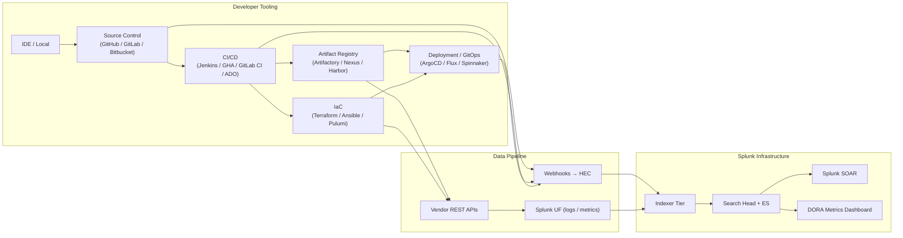

# DevOps & CI/CD Integration Guide

> The definitive guide to integrating DevOps and CI/CD platforms with
> Splunk. **126 use cases** spanning source control (GitHub, GitLab,
> Bitbucket, Azure Repos), CI/CD pipelines (Jenkins, GitHub Actions,
> GitLab CI, Bitbucket Pipelines, Azure DevOps Pipelines, AWS
> CodePipeline / CodeBuild / CodeDeploy, CircleCI, TeamCity, Bamboo,
> Drone, Tekton), GitOps (ArgoCD, Flux, Spinnaker, Octopus Deploy),
> artifact registries (Artifactory, Nexus, Harbor, GHCR, ECR, ACR,
> GAR), and Infrastructure-as-Code (Terraform, Ansible, Puppet, Chef,
> Pulumi, CloudFormation, Bicep). DORA<sup class="ref">[<a href="#ref-4">4</a>]</sup> metrics (deployment frequency,
> lead time, change failure rate, MTTR), build success trending, secret
> leakage detection, IaC drift detection, supply-chain attestation
> (SLSA), GitOps reconciliation gaps, and the full software supply chain
> security story.

---

## Table of Contents

- [Quick Start](#quick-start)
- [Overview](#overview)
- [Architecture and Data Flow](#architecture)
- [Prerequisites](#prerequisites)
- [Platform Coverage Matrix](#platform-matrix)
- [Source Control — GitHub](#github)
- [Source Control — GitLab, Bitbucket, Azure Repos](#other-scm)
- [CI/CD — Jenkins](#jenkins)
- [CI/CD — GitHub Actions](#github-actions)
- [CI/CD — GitLab CI](#gitlab-ci)
- [CI/CD — Azure DevOps Pipelines](#azuredevops)
- [CI/CD — AWS CodePipeline / CodeBuild / CodeDeploy](#aws-pipeline)
- [CI/CD — CircleCI, TeamCity, Bamboo, Drone, Tekton](#other-cicd)
- [GitOps — ArgoCD](#argocd)
- [GitOps — Flux, Spinnaker, Octopus Deploy](#other-gitops)
- [Artifact Management — Artifactory, Nexus, Harbor, ECR/ACR/GHCR](#artifacts)
- [Infrastructure as Code — Terraform](#terraform)
- [Infrastructure as Code — Ansible, Puppet, Chef, Pulumi, CloudFormation, Bicep](#other-iac)
- [DORA Metrics — Deployment Frequency, Lead Time, MTTR, CFR](#dora)
- [Secret Leakage & Supply Chain Security](#supply-chain)
- [Field Dictionary](#field-dictionary)
- [Sample Events](#sample-events)
- [Splunk-Side Configuration](#splunk-config)
- [Cross-Product Correlation](#cross-product)
- [CIM Mapping Reference](#cim-mapping)
- [Splunk ES Detection Pipeline](#es-detect)
- [Compliance Mapping](#compliance)
- [Capacity Planning and Sizing](#sizing)
- [Recommended Dashboard Layouts](#dashboards)
- [ITSI Service Modeling](#itsi)
- [SOAR Playbook Examples](#soar)
- [Multi-Tenant Strategy](#multi-tenant)
- [Security Hardening](#security-hardening)
- [Crawl / Walk / Run Roadmap](#roadmap)
- [Validation Checklist](#validation-checklist)
- [Known Limitations and Gaps](#known-limitations)
- [Troubleshooting](#troubleshooting)
- [FAQ](#faq)
- [Glossary](#glossary)
- [References](#references)
- [Contribution and Feedback](#contribution)

---

<a id="quick-start"></a>
## Quick Start — 90 Minutes to First DORA Metric

### Jenkins (most common)

1. Install [Splunk App for Jenkins (Splunkbase 3332)](https://splunkbase.splunk.com/app/3332) on Jenkins controller (manage plugins → upload).
2. Jenkins → Manage Jenkins → System → Splunk Logging:
    - HEC URL + token
    - Index: cicd
3. Validate: `index=cicd sourcetype="jenkins:build" earliest=-15m | stats count by job_name, result`

### GitHub Actions

1. GitHub repo → Settings → Webhooks → +Add webhook:
    - Payload URL: `https://splunk-hec.yourcorp.com:8088/services/collector`
    - Content type: application/json
    - Secret: HEC token
    - Events: workflow_run, workflow_job, check_run
2. Validate: `index=cicd sourcetype="github:actions" earliest=-15m | stats count by repository, conclusion`

### ArgoCD

1. ArgoCD → ConfigMap argocd-cmd-params-cm: enable webhook
2. Configure HEC HTTP destination
3. Validate: `index=gitops sourcetype="argocd:event" earliest=-15m | stats count by application, status`

### Activate crawl tier

UC-12.2.1 (Build Success Rate Trending), UC-12.1.1 (PR Merge Activity), UC-12.4.1 (IaC Drift), UC-12.5.1 (GitOps Reconciliation).

---

<a id="overview"></a>
## Overview

### Why CI/CD observability matters

Software delivery is the **product creation engine**. Visibility = velocity:

- **DORA metrics** = scientific definition of high-performing teams
- **Supply chain attacks** (SolarWinds, Codecov) require artifact provenance
- **Secret leaks** in commits = perimeter breach
- **IaC drift** = config compliance failure
- **Slow pipelines** = developer productivity loss

### What good looks like

| Dimension | Without integration | With full integration |
|-----------|---------------------|-----------------------|
| Build success rate | Per-tool dashboards | Single Splunk view |
| DORA metrics | Quarterly survey | Real-time |
| Secret leakage detection | Periodic scans | Per-commit / per-PR |
| IaC drift detection | Quarterly | Daily |
| Supply chain attestation | Manual | SLSA L3 automated |

---

<a id="architecture"></a>
## Architecture and Data Flow



---

<a id="prerequisites"></a>
## Prerequisites

| Item | Detail |
|------|--------|
| **Splunk version** | 9.0+ Enterprise / Cloud |
| **CIM 6.x** | Change, Authentication, Vulnerabilities, Inventory |
| **HEC** | Required for webhook ingest |
| **Identity** | Match dev usernames to corporate identity |

---

<a id="platform-matrix"></a>
## Platform Coverage Matrix

| Layer | Platform | Integration |
|-------|----------|-------------|
| **SCM** | GitHub | Webhook + Audit API + GitHub Advanced Security |
| **SCM** | GitLab | Audit + System hooks |
| **SCM** | Bitbucket | Webhook + Audit |
| **SCM** | Azure Repos | Audit via Azure DevOps |
| **CI/CD** | Jenkins | Splunk Plugin [3332](https://splunkbase.splunk.com/app/3332) |
| **CI/CD** | GitHub Actions | Webhooks |
| **CI/CD** | GitLab CI | Webhooks + System events |
| **CI/CD** | Azure DevOps | Service Hooks |
| **CI/CD** | AWS CodePipeline | EventBridge → Splunk_TA_aws |
| **GitOps** | ArgoCD | Notifications webhooks |
| **GitOps** | Flux | Notification controller |
| **Artifact** | Artifactory | Splunk integration plugin |
| **Artifact** | Nexus | Audit log |
| **Artifact** | Harbor | Webhooks |
| **IaC** | Terraform | Cloud audit + state diff |

---

<a id="github"></a>
## Source Control — GitHub

### Configuration

```
GitHub Org → Settings → Audit log → Stream to Splunk:
  + Stream URL: https://splunk-hec.yourcorp.com:8088
  + Token: HEC token

GitHub Org → Settings → Hooks → +Add webhook:
  + Trigger on: push, pull_request, deployment, workflow_run, security_advisory, secret_scanning_alert
```

### Sourcetypes

`github:audit`, `github:webhook`, `github:actions`, `github:advanced_security`.

### SPL — Suspicious admin actions

```spl
index=source_control sourcetype="github:audit" action IN ("repo.access","org.update_member","oauth_application.create","personal_access_token.create") earliest=-1d
| stats count by actor, action, repository
| sort -count
```

### SPL — Push protection bypass (secret detected but committed)

```spl
index=source_control sourcetype="github:advanced_security" "secret_scanning_alert" earliest=-1d
| stats count by repository, secret_type, push_protection_bypassed
```

---

<a id="other-scm"></a>
## Source Control — GitLab, Bitbucket, Azure Repos

### GitLab

```
GitLab Admin → Audit Streaming → +Add destination:
  + Splunk HEC URL + token
GitLab Project → Settings → Webhooks:
  + Push, Merge Request, Pipeline events
```

### Bitbucket

```
Bitbucket Workspace → Webhooks → +Add:
  + Repository push, pull request, deployment
```

### Azure Repos

Audit forwarded via Azure DevOps. See section [Azure DevOps](#azuredevops).

---

<a id="jenkins"></a>
## CI/CD — Jenkins

### Splunk plugin configuration

```
Jenkins → Manage Jenkins → System → Splunk Logging:
  HEC URL: https://splunk-hec.yourcorp.com:8088
  Token: <hec-token>
  Index: cicd

Jenkins → Manage Jenkins → System → Splunk Metric Logging:
  Enable build event logging
  Enable user audit logging
  Enable queue depth logging
```

### Sample event (Jenkins build)

```json
{
    "tag": "jenkins:build",
    "build": {
        "job_name": "myproject-build",
        "build_id": 1234,
        "result": "SUCCESS",
        "duration_ms": 142500,
        "user": "ci-bot",
        "scm": {
            "branch": "main",
            "commit": "abc123def456"
        }
    }
}
```

### SPL — Build success rate

```spl
index=cicd sourcetype="jenkins:build" earliest=-7d
| stats count(eval(result="SUCCESS")) as success, count as total by job_name
| eval success_rate=round(success/total*100,1)
| sort success_rate
```

### SPL — Build duration trending (p95)

```spl
index=cicd sourcetype="jenkins:build" result="SUCCESS" earliest=-7d
| timechart span=1d perc95(duration_ms) as p95_ms by job_name
```

---

<a id="github-actions"></a>
## CI/CD — GitHub Actions

### Webhook configuration

```
Repo → Settings → Webhooks → +Add webhook:
  Payload URL: https://splunk-hec.yourcorp.com:8088/services/collector
  Content type: application/json
  Secret: HEC token
  Events: workflow_run, workflow_job, check_run, deployment_status, repository_dispatch
```

### SPL — Workflow failure trending

```spl
index=cicd sourcetype="github:actions" workflow_run.conclusion="failure" earliest=-7d
| stats count by workflow_run.workflow_id, workflow_run.name
| sort -count
```

### SPL — Self-hosted runner usage

```spl
index=cicd sourcetype="github:actions" "self-hosted" earliest=-1d
| stats count, sum(duration_ms) as total_ms by runner_name, repository
```

---

<a id="gitlab-ci"></a>
## CI/CD — GitLab CI

```
GitLab Admin → Audit Events streaming
GitLab Project → Webhooks → Pipeline events, Job events
```

Sourcetypes: `gitlab:pipeline`, `gitlab:webhook`.

---

<a id="azuredevops"></a>
## CI/CD — Azure DevOps Pipelines

```
Azure DevOps → Project Settings → Service Hooks:
  + Splunk webhook
  + Trigger: Build completed, Release deployment, Code pushed
```

Sourcetypes: `azuredevops:pipeline`, `azuredevops:audit`.

---

<a id="aws-pipeline"></a>
## CI/CD — AWS CodePipeline / CodeBuild / CodeDeploy

```
AWS EventBridge → Rule → Source: aws.codepipeline / aws.codebuild
  → Target: Splunk Add-on for AWS HEC input
```

Sourcetypes: `aws:codepipeline:event`, `aws:codebuild:event`, `aws:codedeploy:event`.

---

<a id="other-cicd"></a>
## CI/CD — CircleCI, TeamCity, Bamboo, Drone, Tekton

All support webhook-based integration to Splunk HEC. Configure per-vendor docs.

Sourcetypes: `circleci:webhook`, `teamcity:event`, `bamboo:event`, `drone:event`, `tekton:event`.

---

<a id="argocd"></a>
## GitOps — ArgoCD

```yaml
# argocd-notifications-cm ConfigMap
apiVersion: v1
kind: ConfigMap
metadata:
  name: argocd-notifications-cm
data:
  service.webhook.splunk: |
    url: https://splunk-hec.yourcorp.com:8088/services/collector
    headers:
    - name: Authorization
      value: Splunk $HEC_TOKEN
  template.app-event: |
    webhook:
      splunk:
        method: POST
        body: |
          {
            "event": {{toJson .}}
          }
  trigger.on-app-status: |
    - description: Application status changed
      send: [app-event]
      when: app.status.health.status == 'Degraded' || app.status.sync.status == 'OutOfSync'
```

### SPL — ArgoCD sync drift

```spl
index=gitops sourcetype="argocd:sync" earliest=-1d
| stats count by application, sync_status, health_status
| where sync_status="OutOfSync" OR health_status="Degraded"
```

---

<a id="other-gitops"></a>
## GitOps — Flux, Spinnaker, Octopus Deploy

Same webhook patterns. Sourcetypes: `flux:event`, `spinnaker:event`, `octopus:event`.

---

<a id="artifacts"></a>
## Artifact Management — Artifactory, Nexus, Harbor, ECR/ACR/GHCR

### Artifactory

```
Artifactory → Administration → Logs → Splunk Add-on:
  HEC URL + token
```

Sourcetypes: `artifactory:request`, `artifactory:audit`.

### Nexus

UF tail of `request.log` and `audit.log`.

### Harbor

```
Harbor → Administration → Webhooks → +Add Splunk webhook
```

Sourcetypes: `harbor:event`, `harbor:audit`.

### Cloud registries (ECR/ACR/GHCR/GAR)

- **ECR**: CloudTrail → Splunk_TA_aws
- **ACR**: Azure activity log → Splunk Add-on for Microsoft Cloud Services
- **GHCR**: GitHub audit (`github:audit`)
- **GAR**: Cloud Audit Logs → Splunk_TA_google-cloudplatform

---

<a id="terraform"></a>
## Infrastructure as Code — Terraform

### Terraform Cloud / Enterprise

```
TFC → Settings → Audit Trail Token → Stream to Splunk HEC
TFC → Workspace → Settings → Notifications → +Add Splunk webhook
```

### Terraform OSS / CLI

UF tails apply logs:

```ini
[monitor:///var/log/terraform/*.log]
sourcetype = terraform:apply
index = iac
```

### SPL — Terraform drift detection

```spl
index=iac sourcetype="terraform:plan" earliest=-1d
| stats sum(plan.add) as adds, sum(plan.change) as changes, sum(plan.destroy) as destroys by workspace
| where adds > 0 OR changes > 0 OR destroys > 0
```

### SPL — Terraform apply audit

```spl
index=iac sourcetype="terraform:apply" earliest=-7d
| stats count by user, workspace, resource_type
```

---

<a id="other-iac"></a>
## Infrastructure as Code — Ansible, Puppet, Chef, Pulumi, CloudFormation, Bicep

### Ansible

```
ansible.cfg:
[defaults]
log_path = /var/log/ansible.log

callback_plugins = /etc/ansible/plugins/callback
callback_whitelist = splunk_callback
```

Sourcetype: `ansible:event`.

### Puppet

UF monitors `/var/log/puppetlabs/puppetserver/puppetserver.log` and `puppet/reports/*.yaml`.

Sourcetype: `puppet:report`.

### Chef

```
client.rb:
log_location "/var/log/chef-client.log"
```

Sourcetype: `chef:run`.

### Pulumi

Pulumi Service → Settings → Webhooks → Splunk HEC.

Sourcetype: `pulumi:event`.

### CloudFormation / Bicep

CloudTrail / Azure Activity → Splunk_TA_aws / TA-microsoft-cloudservices.

---

<a id="dora"></a>
## DORA Metrics — Deployment Frequency, Lead Time, MTTR, CFR

The four DORA (DevOps Research and Assessment) metrics are the gold standard for measuring software delivery performance.

### Deployment Frequency

```spl
(index=cicd sourcetype IN ("jenkins:build","github:actions","gitlab:pipeline","azuredevops:pipeline","aws:codepipeline:event") result="SUCCESS" event_type="deployment" earliest=-30d)
| timechart span=1d count as deployments by service
| stats avg(deployments) as avg_per_day by service
```

### Lead Time for Changes

```spl
index=source_control sourcetype="github:webhook" event="pull_request" action="closed" pull_request.merged=true earliest=-30d
| eval lead_time_hours=(_time - strptime(pull_request.created_at,"%Y-%m-%dT%H:%M:%SZ"))/3600
| stats median(lead_time_hours) as median_lead_h, perc95(lead_time_hours) as p95_lead_h by repository
```

### Change Failure Rate (CFR)

```spl
| multisearch
    [search index=cicd sourcetype="*deployment*" earliest=-30d | eval type="deployment"]
    [search index=cicd sourcetype="*deployment*" result="failure" earliest=-30d | eval type="failure"]
| stats count(eval(type="deployment")) as deployments, count(eval(type="failure")) as failures by service
| eval cfr=round(failures/deployments*100,2)
```

### MTTR (Mean Time To Restore)

```spl
index=cicd event="deployment" earliest=-30d
| sort _time
| streamstats current=t time_window=1d count(eval(result="failure")) as failures_in_window by service
| where result="success" AND failures_in_window > 0
| stats avg(time_to_recover) by service
```

---

<a id="supply-chain"></a>
## Secret Leakage & Supply Chain Security

### GitHub secret scanning

```spl
index=source_control sourcetype="github:advanced_security" alert_type="secret_scanning_alert" earliest=-7d
| stats count by repository, secret_type, state
```

### SBOM / SLSA attestation

```spl
index=cicd sourcetype="*sbom*" OR sourcetype="*slsa*" earliest=-7d
| stats count by builder_id, slsa_level
```

### Dependency vulnerabilities (Dependabot, Snyk, etc.)

```spl
index=source_control sourcetype="github:webhook" event="security_advisory" earliest=-7d
| stats count by severity, ecosystem, package
```

---

<a id="field-dictionary"></a>
## Field Dictionary

| Field | Jenkins | GHA | GitLab CI | ArgoCD | Terraform |
|-------|---------|-----|-----------|--------|-----------|
| `pipeline` | job_name | workflow.name | pipeline_name | application | workspace |
| `status` | result | conclusion | status | sync_status | apply_status |
| `user` | user | actor.login | user.username | (n/a) | user |
| `commit` | scm.commit | head_sha | commit_sha | revision | (n/a) |
| `duration` | duration_ms | duration_ms | duration_seconds | (n/a) | (n/a) |

---

<a id="sample-events"></a>
## Sample Events

(See per-platform sections.)

---

<a id="splunk-config"></a>
## Splunk-Side Configuration

### Index strategy

```ini
[cicd]
homePath = $SPLUNK_DB/cicd/db
maxDataSize = auto_high_volume
frozenTimePeriodInSecs = 31536000   # 1 year (DORA history)

[source_control]
homePath = $SPLUNK_DB/source_control/db
maxDataSize = auto_high_volume
frozenTimePeriodInSecs = 94608000   # 3 years (audit + DORA)

[iac]
homePath = $SPLUNK_DB/iac/db
maxDataSize = auto
frozenTimePeriodInSecs = 94608000

[artifacts]
homePath = $SPLUNK_DB/artifacts/db
maxDataSize = auto
frozenTimePeriodInSecs = 94608000
```

---

<a id="cross-product"></a>
## Cross-Product Correlation

### Bad deploy → production incident

```spl
(index=cicd event="deployment" earliest=-1h)
| join service [search index=itsm sourcetype="snow:incident" priority<=2 earliest=-1h
    | rename u_service as service
    | stats values(number) as incidents by service]
| where mvcount(incidents) > 0
```

### IaC change → cloud cost spike

```spl
(index=iac sourcetype="terraform:apply" earliest=-7d)
| eval iac_apply_time=_time
| join workspace [search index=aws sourcetype="aws:cloudtrail" eventName="RunInstances" earliest=-7d
    | stats count as instances_created by workspace as workspace, _time as instance_time]
| where instance_time > iac_apply_time AND instance_time < iac_apply_time + 3600
```

---

<a id="cim-mapping"></a>
## CIM Mapping Reference

| CIM model | Sourcetype |
|-----------|-----------|
| **Change** | All deployment events, IaC apply, GitOps sync |
| **Authentication** | SCM access, CI/CD user actions |
| **Vulnerabilities** | Dependabot, GitHub Advanced Security alerts |
| **Inventory** | Artifact registry inventory |

---

<a id="es-detect"></a>
## Splunk ES Detection Pipeline

ES correlation searches:
- "DevOps — Secret Leak in Public Commit"
- "DevOps — Force-Push to Protected Branch"
- "DevOps — Production Deploy Outside Window"
- "DevOps — Failed Build Spike"
- "DevOps — IaC Drift Detected"
- "DevOps — Build Artifact Tampering"

---

<a id="compliance"></a>
## Compliance Mapping

### NIST 800-53

| Control | Coverage |
|---------|----------|
| **SI-7** Software/info integrity | Build attestation + SBOM |
| **SA-15** Development process | All CI/CD events |
| **CM-3** Configuration change control | IaC + GitOps drift |

### NIST SSDF

| Group | Coverage |
|-------|----------|
| **PO** Prepare the Organization | DORA metrics tracking |
| **PS** Protect the Software | Secret scanning + SBOM |
| **PW** Produce Well-Secured Software | SAST/SCA in pipeline |
| **RV** Respond to Vulnerabilities | Vuln triage workflow |

### SLSA (Supply-chain Levels for Software Artifacts)

| Level | Coverage |
|-------|----------|
| **SLSA L1** Build process documented | Pipeline events ingested |
| **SLSA L2** Source + build identified | + commit + artifact tracked |
| **SLSA L3** Source + build verified | + provenance attestation |
| **SLSA L4** Two-party review + hermetic | + reviewer audit |

### SOC 2 / SOX ITGC

- Change management evidence (deploy + approver)
- Segregation of duties (developer ≠ approver)
- Periodic reviews of pipeline access

---

<a id="sizing"></a>
## Capacity Planning and Sizing

| Org size | Daily volume |
|----------|--------------|
| < 50 devs | ~1 GB |
| 50 - 500 devs | ~10 GB |
| 500 - 5000 devs | ~100 GB |
| 5000+ devs | ~500 GB+ |

---

<a id="dashboards"></a>
## Recommended Dashboard Layouts

### Crawl

```
+---------------------+---------------------+
| BUILD SUCCESS RATE (per pipeline)          |
+---------------------+---------------------+
| BUILD DURATION TREND (p95)                 |
+---------------------+---------------------+
| TOP FAILED BUILDS (last 24h)               |
+---------------------+---------------------+
| ARTIFACT DOWNLOAD ACTIVITY                 |
+---------------------+---------------------+
```

### Walk

```
+---------------------+---------------------+
| DORA METRICS DASHBOARD                     |
| (Deploy freq + lead time + MTTR + CFR)     |
+---------------------+---------------------+
| IaC DRIFT REPORT (per workspace)           |
+---------------------+---------------------+
| GITOPS RECONCILIATION GAPS                 |
+---------------------+---------------------+
| SUPPLY CHAIN ALERTS                        |
+---------------------+---------------------+
```

### Run

```
+---------------------+---------------------+
| ENGINEERING PRODUCTIVITY SCORECARD         |
+---------------------+---------------------+
| SLSA ATTESTATION COVERAGE                  |
+---------------------+---------------------+
| SECURITY-IN-PIPELINE METRICS               |
| (SAST/SCA/secret/IaC findings)             |
+---------------------+---------------------+
| EXECUTIVE DORA + CFR SLO                   |
+---------------------+---------------------+
```

---

<a id="itsi"></a>
## ITSI Service Modeling

### Service hierarchy

```
Software Delivery Posture
├── Per-Team Pipeline Health
│   ├── Team A
│   ├── Team B
│   └── ...
├── DORA KPIs
│   ├── Deployment frequency
│   ├── Lead time
│   ├── MTTR
│   └── CFR
├── Supply Chain Posture
│   ├── Secret leak rate
│   ├── SBOM coverage
│   └── SLSA level
└── Infrastructure Drift
    ├── IaC plan-vs-state delta
    └── GitOps reconciliation
```

---

<a id="soar"></a>
## SOAR Playbook Examples

### Playbook 1: Secret committed → Auto-revoke + remediate

```
1. RECEIVE notable: GitHub secret scanning alert
2. EXTRACT secret type, repo, commit
3. IF AWS key → call AWS IAM API to deactivate
4. IF Stripe key → call Stripe API to revoke
5. CREATE PR to remove secret from history
6. NOTIFY committer + security
```

### Playbook 2: Failed deploy → Auto-rollback

```
1. RECEIVE notable: deployment failed in prod
2. IF GitOps → trigger ArgoCD rollback API
3. IF Spinnaker → trigger pipeline rollback
4. CREATE Sev-2 ticket
5. PAGE on-call
```

### Playbook 3: IaC drift detected → Auto-PR fix

```
1. RECEIVE notable: Terraform drift detected
2. RUN terraform plan
3. CREATE PR with proposed changes
4. NOTIFY infra team
```

---

<a id="multi-tenant"></a>
## Multi-Tenant Strategy

- Per-team indexes (`cicd_team_a`, `cicd_team_b`)
- Per-org RBAC for source control data
- Cost allocation tagging via build labels

---

<a id="security-hardening"></a>
## Security Hardening

- HEC tokens scoped per pipeline
- TLS for all webhook endpoints
- Strong webhook secret validation
- Field-level RBAC for source code in logs
- Forward audit logs to immutable storage

---

<a id="roadmap"></a>
## Crawl / Walk / Run Roadmap

### Crawl (Week 1-4)

1. Onboard largest CI/CD platform
2. Webhook ingest configured
3. Crawl-tier dashboards live
4. UC-12.2.1, UC-12.4.1

### Walk (Month 2-3)

1. Onboard SCM + artifact registry
2. DORA metrics baselined
3. ES correlation enabled
4. SOAR auto-rollback on failed deploy

### Run (Month 4+)

1. Full SLSA L3 attestation
2. Supply chain SOAR auto-revoke
3. Engineering productivity dashboard
4. Quarterly DORA reports

---

<a id="validation-checklist"></a>
## Validation Checklist

- [ ] Day 1: First build event in Splunk
- [ ] Day 7: All major CI/CD platforms ingesting
- [ ] Day 30: Walk-tier UCs deployed; DORA metrics live
- [ ] Day 90: SOAR playbooks operational; SLSA attestation live

---

<a id="known-limitations"></a>
## Known Limitations and Gaps

| Limitation | Impact | Workaround |
|------------|--------|------------|
| **Webhook delivery loss** | Missing events | Use API polling fallback |
| **Self-hosted runner visibility** | Build env unknown | Forward runner logs |
| **IaC state file not always logged** | Drift gaps | Use `terraform plan --detailed-exitcode` |
| **GitOps deployment time hard to measure** | DORA accuracy | Use ArgoCD sync.completedAt |
| **Pipeline-as-code variance** | Heterogeneous events | Standardize via CDEvents |

---

<a id="troubleshooting"></a>
## Troubleshooting

### Webhook events not arriving

- Check HEC token + URL
- Verify webhook secret matches HEC token
- Inspect `index=_internal source=*splunkd_access*` for HEC requests

### Jenkins plugin slow

- Verify Splunk plugin batch size config
- Check Jenkins controller heap

### DORA metrics inaccurate

- Verify event_type=deployment is set on actual prod deploys (not staging)
- Calibrate failure window per service

---

<a id="faq"></a>
## FAQ

**Q: Webhook vs API polling for SCM/CI?**
A: Webhook for real-time; API for historical backfill + missing events.

**Q: How to track which user actually deployed in GitOps?**
A: ArgoCD sync.user (if SSO enabled) + GitHub commit author for the deploy commit.

**Q: What SLSA level do I need?**
A: L1 trivial (just track builds); L2 should be table stakes; L3 for regulated; L4 niche.

**Q: Can I detect typo-squatted dependencies?**
A: Combine GitHub Advanced Security + Dependabot + custom Splunk lookup of allowed package list.

---

<a id="glossary"></a>
## Glossary

| Term | Definition |
|------|-----------|
| **CI** | Continuous Integration |
| **CD** | Continuous Delivery / Deployment |
| **DORA** | DevOps Research and Assessment |
| **CFR** | Change Failure Rate |
| **MTTR** | Mean Time To Restore |
| **GitOps** | Git as source of truth for infra/config |
| **IaC** | Infrastructure as Code |
| **SBOM** | Software Bill of Materials |
| **SLSA** | Supply-chain Levels for Software Artifacts |
| **SCA** | Software Composition Analysis |
| **SAST** | Static Application Security Testing |
| **SSDF** | NIST Secure Software Development Framework |
| **HEC** | HTTP Event Collector |

---

<a id="references"></a>
## References

- [Splunk App for Jenkins (Splunkbase 3332)](https://splunkbase.splunk.com/app/3332)
- [Splunk Add-on for GitHub (Splunkbase 2849)](https://splunkbase.splunk.com/app/2849)
- [Splunk Add-on for GitLab (Splunkbase 4865)](https://splunkbase.splunk.com/app/4865)
- [DORA Report 2024](https://dora.dev/research/)
- [SLSA Framework](https://slsa.dev/)
- [NIST SSDF (SP 800-218)](https://csrc.nist.gov/Projects/ssdf)
- [CDEvents](https://cdevents.dev/)

---

<a id="contribution"></a>
## Contribution and Feedback

Part of the [Splunk Monitoring Use Cases](https://github.com/fenre/splunk-monitoring-use-cases) project. [Open an issue](https://github.com/fenre/splunk-monitoring-use-cases/issues/new).

---

*Last updated: 2026-05-09. Covers Jenkins LTS 2.x, GitHub current, GitLab 17.x, Bitbucket Cloud, Azure DevOps current, AWS CodePipeline current, ArgoCD 2.x, Flux 2.x, Terraform 1.x, Ansible current.*

---

<!-- BEGIN-AUTOGENERATED-SOURCES -->

## References

*Auto-generated by `scripts/generate_doc_references.py` from `data/source-references.json` and `data/source-mappings.json`. Edit those files (or the document body) to change citations; this footer is rewritten on every run.*

### Supporting sources

<a id="ref-1"></a>**[1]** American Institute of Certified Public Accountants. (2017). *Trust Services Criteria (2017) for Security, Availability, Processing Integrity, Confidentiality, and Privacy*. AICPA & CIMA. SOC 2 / TSP Section 100. https://www.aicpa-cima.com/topic/audit-assurance/soc-suite-of-services

<a id="ref-2"></a>**[2]** Beyer, B., Jones, C., Petoff, J., & Murphy, N. R. (Eds.). (2016). *Site Reliability Engineering: How Google Runs Production Systems*. O'Reilly Media. ISBN 978-1491929124. https://sre.google/sre-book/table-of-contents/

<a id="ref-3"></a>**[3]** Beyer, B., Murphy, N. R., Rensin, D. K., Kawahara, K., & Thorne, S. (Eds.). (2018). *The Site Reliability Workbook: Practical Ways to Implement SRE*. O'Reilly Media. ISBN 978-1492029502. https://sre.google/workbook/table-of-contents/

<a id="ref-4"></a>**[4]** European Parliament and Council of the European Union. (2022, December). *Regulation (EU) 2022/2554 — Digital Operational Resilience Act (DORA)*. Official Journal of the European Union, L 333. ELI: reg/2022/2554. https://eur-lex.europa.eu/eli/reg/2022/2554/oj

<a id="ref-5"></a>**[5]** Gerhards, R. (2009, March). *The Syslog Protocol*. Internet Engineering Task Force. RFC 5424. https://www.rfc-editor.org/rfc/rfc5424

<a id="ref-6"></a>**[6]** International Organization for Standardization. (2022). *ISO/IEC 27001:2022 — Information security, cybersecurity and privacy protection — Information security management systems — Requirements*. ISO/IEC. ISO/IEC 27001:2022. https://www.iso.org/standard/27001

<a id="ref-7"></a>**[7]** National Institute of Standards and Technology. (2020). *Security and Privacy Controls for Information Systems and Organizations* (Revision 5). U.S. Department of Commerce. NIST SP 800-53 Rev. 5. https://csrc.nist.gov/pubs/sp/800/53/r5/upd1/final

<a id="ref-8"></a>**[8]** OWASP Foundation. (2024). *OWASP Application Security Verification Standard 5.0* (5.0). OWASP Foundation, Inc. https://owasp.org/www-project-application-security-verification-standard/

<a id="ref-9"></a>**[9]** OWASP Foundation. (2021). *OWASP Top 10:2021 — The Ten Most Critical Web Application Security Risks*. OWASP Foundation, Inc. Retrieved May 11, 2026, from https://owasp.org/Top10/

<a id="ref-10"></a>**[10]** Public Company Accounting Oversight Board. (2007). *Auditing Standard 2201 — An Audit of Internal Control Over Financial Reporting*. PCAOB. PCAOB AS 2201. https://pcaobus.org/oversight/standards/auditing-standards/details/AS2201

<a id="ref-11"></a>**[11]** Splunk Inc. (2026). *Splunk Distribution of the OpenTelemetry Collector*. Splunk LLC, a Cisco company. Retrieved May 11, 2026, from https://docs.splunk.com/observability/en/gdi/opentelemetry/opentelemetry.html

<a id="ref-12"></a>**[12]** Splunk Inc. (2026). *Splunk IT Service Intelligence Administration Manual*. Splunk LLC, a Cisco company. Retrieved May 11, 2026, from https://docs.splunk.com/Documentation/ITSI

<a id="ref-13"></a>**[13]** Splunk Inc. (2026). *Splunk Observability Cloud Documentation*. Splunk LLC, a Cisco company. Retrieved May 11, 2026, from https://docs.splunk.com/observability/en/

<a id="ref-14"></a>**[14]** U.S. Congress. (2002). *Sarbanes-Oxley Act of 2002 — Public Company Accounting Reform and Investor Protection Act*. U.S. Government. Pub. L. 107–204. https://www.sec.gov/about/laws/soa2002.pdf

<details>
<summary>Additional online sources cited in the document body (12)</summary>

<a id="ref-15"></a>**[15]** splunkbase.splunk.com. *Splunk App for Jenkins (Splunkbase 3332)*. Retrieved May 11, 2026, from https://splunkbase.splunk.com/app/3332

<a id="ref-16"></a>**[16]** splunkbase.splunk.com. *Splunk Add-on for GitHub (Splunkbase 2849)*. Retrieved May 11, 2026, from https://splunkbase.splunk.com/app/2849

<a id="ref-17"></a>**[17]** splunkbase.splunk.com. *Splunk Add-on for GitLab (Splunkbase 4865)*. Retrieved May 11, 2026, from https://splunkbase.splunk.com/app/4865

<a id="ref-18"></a>**[18]** dora.dev. *DORA Report 2024*. Retrieved May 11, 2026, from https://dora.dev/research/

<a id="ref-19"></a>**[19]** slsa.dev. *SLSA Framework*. Retrieved May 11, 2026, from https://slsa.dev/

<a id="ref-20"></a>**[20]** csrc.nist.gov. *NIST SSDF (SP 800-218)*. Retrieved May 11, 2026, from https://csrc.nist.gov/Projects/ssdf

<a id="ref-21"></a>**[21]** cdevents.dev. *CDEvents*. Retrieved May 11, 2026, from https://cdevents.dev/

<a id="ref-22"></a>**[22]** github.com. *Splunk Monitoring Use Cases*. Retrieved May 11, 2026, from https://github.com/fenre/splunk-monitoring-use-cases

<a id="ref-23"></a>**[23]** github.com. *Open an issue*. Retrieved May 11, 2026, from https://github.com/fenre/splunk-monitoring-use-cases/issues/new

<a id="ref-24"></a>**[24]** splunkbase.splunk.com. *Splunkbase app #1876*. Retrieved May 11, 2026, from https://splunkbase.splunk.com/app/1876

<a id="ref-25"></a>**[25]** splunkbase.splunk.com. *Splunkbase app #3110*. Retrieved May 11, 2026, from https://splunkbase.splunk.com/app/3110

<a id="ref-26"></a>**[26]** splunkbase.splunk.com. *Splunkbase app #3088*. Retrieved May 11, 2026, from https://splunkbase.splunk.com/app/3088

</details>

<!-- END-AUTOGENERATED-SOURCES -->
