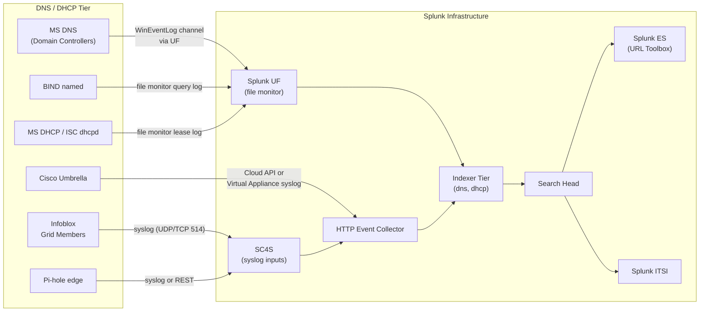

# DNS & DHCP (Infoblox, Microsoft, BIND, ISC, Pi-hole) Integration Guide

> The definitive guide to monitoring DNS and DHCP infrastructure with
> Splunk. 17 use cases covering Infoblox NIOS, Microsoft DNS / DHCP,
> BIND, ISC DHCP, Pi-hole, and Cisco Umbrella resolver. Query volume,
> error rates, DGA detection, DNS tunneling, DHCP scope exhaustion,
> rogue DHCP servers, and full normalization to the
> Network_Resolution CIM data model. DNS is the lookup phonebook of
> the internet — broken DNS is broken everything.

---

## Table of Contents

- [Quick Start](#quick-start)
- [Overview](#overview)
- [Architecture and Data Flow](#architecture)
- [Prerequisites](#prerequisites)
- [Platform Coverage Matrix](#platform-matrix)
- [Infoblox NIOS](#infoblox)
- [Microsoft DNS / DHCP](#microsoft)
- [BIND / named](#bind)
- [ISC DHCP / dhcpd](#isc-dhcp)
- [Pi-hole](#pi-hole)
- [Cisco Umbrella resolver](#umbrella)
- [Field Dictionary (Cross-Vendor)](#field-dictionary)
- [Sample Events](#sample-events)
- [Splunk-Side Configuration](#splunk-config)
- [DNS Threat Detection (DGA / Tunneling / NXDOMAIN)](#threat-detection)
- [URL Toolbox for DNS Analysis](#url-toolbox)
- [Cross-Product Correlation](#cross-product)
- [CIM Mapping Reference](#cim-mapping)
- [Compliance Mapping](#compliance)
- [Capacity Planning and Sizing](#sizing)
- [Recommended Dashboard Layouts](#dashboards)
- [ITSI Service Modeling](#itsi)
- [SOAR Playbook Examples](#soar)
- [Multi-Site Strategy](#multi-site)
- [Security Hardening](#security-hardening)
- [Crawl / Walk / Run Roadmap](#roadmap)
- [Validation Checklist](#validation-checklist)
- [Known Limitations and Gaps](#known-limitations)
- [Troubleshooting](#troubleshooting)
- [FAQ](#faq)
- [Glossary](#glossary)
- [References](#references)
- [Contribution and Feedback](#contribution)

---

<a id="quick-start"></a>
## Quick Start — 30 Minutes to First Telemetry

> Pick the section matching your DNS/DHCP platform. **All platforms
> share the same end-state**: query / lease events flow into the
> `dns` / `dhcp` indexes, normalize to Network_Resolution CIM, ready
> for DGA / tunneling detection, capacity planning, and DR
> correlation with firewalls and EDR.

### Infoblox (fastest)

1. Install [Splunk_TA_infoblox](https://splunkbase.splunk.com/app/2934) on indexers + SH.
2. In Infoblox NIOS Grid Manager: **Grid > Member > Logging > Syslog** → add SC4S VIP, facility local6, severity info.
3. Validate: `index=dns sourcetype="infoblox:dns" earliest=-15m | stats count by host`

### Microsoft DNS / DHCP

```powershell
# Enable DNS Analytical logging (high volume!)
Set-DnsServerDiagnostics -All $true

# DHCP audit logging is enabled by default
# Logs at: %SystemRoot%\System32\dhcp\
```

```ini
# UF inputs.conf
[WinEventLog://Microsoft-Windows-DNSServer/Analytical]
disabled = 0
sourcetype = MSAD:NT6:DNS
index = dns

[monitor://%SystemRoot%\System32\dhcp\DhcpSrvLog-*.log]
sourcetype = MSAD:NT6:DHCP
index = dhcp
```

### BIND / named

```bash
# named.conf — enable query log
logging {
    channel query_log {
        file "/var/log/named/queries.log" versions 3 size 100M;
        severity info;
        print-time yes;
    };
    category queries { query_log; };
};
```

### Activate crawl tier

UC-5.6.1 (DNS query volume), UC-5.6.x (NXDOMAIN trends), UC-5.6.x (DHCP lease exhaustion).

---

<a id="overview"></a>
## Overview

### Why monitor DNS & DHCP

DNS and DHCP are foundational L7 / L3 services. When they fail, *everything* fails. They're also among the **most attacked** services:

- **DNS is the C2 backbone** of most malware (DGA, tunneling, fast-flux)
- **NXDOMAIN trending** reveals brand impersonation, typosquatting
- **DHCP lease exhaustion** = users can't get IP = no network
- **Rogue DHCP** can hijack network for MITM
- **DNS amplification** is a top DDoS vector

### What this guide covers

| Platform | Use case fit |
|---------|------------|
| **Infoblox NIOS** | Enterprise IPAM/DNS/DHCP — Grid topology, REST API, syslog |
| **Microsoft DNS** | AD-integrated zones, conditional forwarders, DNSSEC |
| **Microsoft DHCP** | AD-integrated DHCP, scopes, reservations |
| **BIND** | Authoritative + recursive open-source DNS |
| **ISC DHCP** | Linux/UNIX `dhcpd` service |
| **Pi-hole** | Edge / SOHO recursive resolver with sinkhole |
| **Cisco Umbrella** | Cloud DNS resolver with categorization |

### Domains covered

| Domain | Examples |
|--------|---------|
| **Capacity** | QPS trending, DHCP scope utilization, top clients |
| **Performance** | Query latency, response code distribution |
| **Availability** | Resolver uptime, zone transfer health |
| **Security** | DGA, tunneling, NXDOMAIN spike, sinkhole hits, rogue DHCP |
| **Compliance** | DNS query logging retention, audit trails |

### What's NOT in scope

| Domain | Where to look |
|--------|---------------|
| **Firewall DNS rule policy** | [Firewalls Guide](firewalls.md) |
| **DNS sinkhole detections** | [Firewalls + ES correlation](firewalls.md) |
| **End-user DNS-over-HTTPS** | EDR / browser telemetry |
| **Cloud DNS (Route53, Azure DNS, Cloud DNS)** | [AWS](aws.md) / [Azure](azure.md) / [GCP](gcp.md) guides |

### What good looks like

| Dimension | Without integration | With full deployment |
|-----------|---------------------|----------------------|
| DNS outage detection | "Internet is down" tickets | Real-time per-resolver QPS + alert |
| DGA / malware C2 | Manual quarterly hunt | Continuous detection (cardinality + entropy) |
| DHCP scope exhaustion | "I can't get an IP" | Proactive 80% threshold alert |
| NXDOMAIN spike | Unnoticed | Anomaly detection within 5 min |
| Top talker query analysis | Manual `dig` and SSH | Splunk dashboard top 100 queries |

---

<a id="architecture"></a>
## Architecture and Data Flow



---

<a id="prerequisites"></a>
## Prerequisites

### Splunk requirements

| Item | Detail |
|------|--------|
| **Splunk version** | 9.0+ Enterprise or Cloud |
| **Splunkbase add-ons** | Per platform |
| **CIM 6.x** | Network_Resolution data model |
| **URL Toolbox** | For DGA / tunneling detection (Splunkbase 2734) |
| **SC4S** | Recommended for syslog routing |

### Source-side requirements

| Source | Required configs |
|--------|------------------|
| **Infoblox** | Per-Grid-Member syslog config; query logging enabled |
| **MS DNS** | Analytical log enabled (heavy I/O — plan disk!) |
| **MS DHCP** | Audit logging on (default) |
| **BIND** | `logging` block + `category queries` enabled |
| **ISC DHCP** | Default lease file logging |
| **Pi-hole** | Syslog or pi-hole REST API token |

---

<a id="platform-matrix"></a>
## Platform Coverage Matrix

| Platform | TA | Splunkbase | Sourcetypes | Cloud-vetted |
|---------|----|-----------|-------------|--------------|
| **Infoblox NIOS** | Splunk_TA_infoblox | [2934](https://splunkbase.splunk.com/app/2934) | `infoblox:dns`, `infoblox:dhcp`, `infoblox:audit` | Yes |
| **Microsoft DNS** | Splunk_TA_windows | [742](https://splunkbase.splunk.com/app/742) | `MSAD:NT6:DNS`, `WinEventLog:DNS Server` | Yes |
| **Microsoft DHCP** | Splunk_TA_windows | [742](https://splunkbase.splunk.com/app/742) | `MSAD:NT6:DHCP` | Yes |
| **BIND** | Splunk Add-on for ISC BIND | [4633](https://splunkbase.splunk.com/app/4633) | `named`, `bind:query` | Yes |
| **ISC DHCP** | Splunk Add-on for ISC DHCP | [4684](https://splunkbase.splunk.com/app/4684) | `dhcpd` | Yes |
| **Pi-hole** | (custom syslog parsing) | n/a | `pi-hole:dns` | n/a |
| **Cisco Umbrella** | Cisco Umbrella App | (Cisco-supported) | `cisco:umbrella:dns` | Yes |

---

<a id="infoblox"></a>
## Infoblox NIOS

### Required Splunk components

| Component | Purpose |
|-----------|--------|
| Splunk_TA_infoblox | Field extractions for DNS, DHCP, Grid audit |
| SC4S | Vendor pack routing |

### Infoblox-side syslog config

In NIOS Grid Manager:

1. **Grid > Grid Manager > Members > [member] > Logging > Syslog**
2. Add destination: `<sc4s-vip>` UDP/514 (or TCP/514)
3. Facility: `local6`
4. Severity: `info`
5. Subscribe to: `DNS Queries`, `DNS Responses`, `DHCP Audit`, `Grid Audit`

### Sample DNS query event

```
2026-04-25T14:30:15.123Z infoblox-ns01 dnsmasq-dhcp[8451]: 10.20.30.40 -> CLIENT QUERY (cache MISS) example.com / IN / A / dns01.corp.local
```

### Top Infoblox UCs

| UC | Description |
|----|------------|
| UC-5.6.1 | DNS Query Volume Trending |
| UC-5.6.x | NXDOMAIN spike detection (DGA) |
| UC-5.6.x | DHCP scope exhaustion |
| UC-5.6.x | Grid audit / config change tracking |
| UC-5.6.x | Resolver health (zone xfer failures) |

### Infoblox REST API (rich object data)

```bash
# Authenticated request to NIOS WAPI
curl -k -u admin:<pwd> https://infoblox-grid.example.com/wapi/v2.12/network
```

Push results to Splunk via custom HEC scripted input for object-level inventory.

---

<a id="microsoft"></a>
## Microsoft DNS / DHCP

### Microsoft DNS — Analytical log (the big one)

> **Warning:** Analytical logging generates ~500 bytes/query. A
> medium-sized AD environment with 1,000 queries/sec → ~43 GB/day per
> server. Plan disk + index sizing!

```powershell
# Enable Analytical channel
Set-DnsServerDiagnostics -All $true

# Or selective:
Set-DnsServerDiagnostics -EnableLoggingForRecursiveLookupEvent $true `
    -EnableLoggingForRemoteServerEvent $true `
    -EnableLoggingForLocalLookupEvent $true `
    -EnableLoggingForUpdateEvent $true `
    -LogFilePath "C:\DNS\dns.log"
```

### UF inputs.conf

```ini
[WinEventLog://Microsoft-Windows-DNSServer/Analytical]
disabled = 0
sourcetype = MSAD:NT6:DNS
index = dns
```

### Microsoft DHCP — audit log

```ini
[monitor://%SystemRoot%\System32\dhcp\DhcpSrvLog-*.log]
sourcetype = MSAD:NT6:DHCP
index = dhcp
disabled = 0
crcSalt = <SOURCE>
```

### Sample MS DHCP audit event

```
ID,Date,Time,Description,IP Address,Host Name,MAC Address,User Name,TransactionID,QResult,Probationtime,CorrelationID,Dhcid,VendorClass(Hex),VendorClass(ASCII),UserClass(Hex),UserClass(ASCII),RelayAgentInformation,DnsRegError
10,04/25/26,14:30:15,Assign,10.20.30.50,host123,001122334455,,1234567,0,,000000-1-2-3,,,Microsoft Office,,,,
```

| Event ID | Description |
|---------|-------------|
| 10 | Lease assigned |
| 11 | Lease renewed |
| 12 | Lease released |
| 13 | IP found in use |
| 14 | DHCP scope exhausted |
| 24 | Address moved to expired |

---

<a id="bind"></a>
## BIND / named

### Configuration

```bind
// /etc/named.conf
logging {
    channel query_log {
        file "/var/log/named/queries.log" versions 5 size 200M;
        severity info;
        print-time yes;
        print-category yes;
    };
    channel security_log {
        file "/var/log/named/security.log" versions 5 size 50M;
        severity warning;
        print-time yes;
    };
    category queries { query_log; };
    category security { security_log; };
};
```

### UF inputs.conf

```ini
[monitor:///var/log/named/queries.log]
sourcetype = bind:query
index = dns

[monitor:///var/log/named/security.log]
sourcetype = named
index = dns
```

### Sample BIND query log

```
25-Apr-2026 14:30:15.123 queries: info: client @0x7fff8c001000 10.20.30.40#52341 (example.com): query: example.com IN A + (10.20.30.10)
```

---

<a id="isc-dhcp"></a>
## ISC DHCP / dhcpd

### Configuration

```bash
# /etc/dhcp/dhcpd.conf — default logging is enabled
# /etc/rsyslog.d/dhcpd.conf to route to syslog file
local7.* /var/log/dhcpd.log
```

### UF inputs.conf

```ini
[monitor:///var/log/dhcpd.log]
sourcetype = dhcpd
index = dhcp
```

### Sample ISC DHCP event

```
Apr 25 14:30:15 dhcpd-relay-01 dhcpd[1234]: DHCPACK on 10.20.30.50 to 00:11:22:33:44:55 (host123) via eth0
```

---

<a id="pi-hole"></a>
## Pi-hole

### Configuration

```bash
# /etc/pihole/pihole-FTL.conf
LOG_QUERIES=yes
PRIVACYLEVEL=0   # Show full query/client info
```

Forward `/var/log/pihole.log` via syslog or UF file monitor.

---

<a id="umbrella"></a>
## Cisco Umbrella resolver

### Two ingest options

**Option 1 — Cloud Storage Bucket sink:** Umbrella exports DNS query logs to S3 / Azure Blob / GCP storage; Splunk pulls via cloud TA.

**Option 2 — Virtual Appliance syslog:** Umbrella VAs forward DNS query logs to local SC4S.

```ini
# Cloud bucket pull example (AWS S3)
[aws_logs://umbrella]
aws_account = umbrella-prod
sourcetype = cisco:umbrella:dns
index = dns
```

---

<a id="field-dictionary"></a>
## Field Dictionary (Cross-Vendor)

After Network_Resolution CIM mapping:

| Field | Example | Description |
|-------|---------|-------------|
| `query` | `example.com` | DNS name queried |
| `query_type` | `A`, `AAAA`, `MX`, `PTR`, `TXT` | Record type |
| `reply_code` | `NOERROR`, `NXDOMAIN`, `SERVFAIL` | DNS response code |
| `src` | `10.20.30.40` | Client IP |
| `dest` | `10.20.30.10` | Resolver IP |
| `answer` | `93.184.216.34` | Returned IP / record |
| `transport` | `UDP` / `TCP` / `DOT` / `DOH` | Transport |
| **DHCP** | | |
| `dhcp_action` | `Assign`, `Renew`, `Release`, `Decline` | Lease action |
| `lease_ip` | `10.20.30.50` | Assigned IP |
| `lease_mac` | `00:11:22:33:44:55` | Client MAC |
| `lease_hostname` | `host123` | Client hostname |
| `dhcp_scope` | `10.20.30.0/24` | DHCP scope |

---

<a id="sample-events"></a>
## Sample Events

(See per-platform sections.)

---

<a id="splunk-config"></a>
## Splunk-Side Configuration

### Index strategy

```ini
[dns]
homePath = $SPLUNK_DB/dns/db
maxDataSize = auto_high_volume
frozenTimePeriodInSecs = 7776000   # 90 days; extend for long-term DGA hunt

[dhcp]
homePath = $SPLUNK_DB/dhcp/db
maxDataSize = auto_high_volume
frozenTimePeriodInSecs = 31536000   # 1 year — DHCP audit often required for forensics
```

### CIM Network_Resolution acceleration

```ini
# datamodels.conf
[Network_Resolution]
acceleration = 1
acceleration.earliest_time = -7d
acceleration.cron_schedule = 8 * * * *
```

---

<a id="threat-detection"></a>
## DNS Threat Detection (DGA / Tunneling / NXDOMAIN)

### NXDOMAIN spike (DGA / typosquatting)

```spl
index=dns reply_code=NXDOMAIN earliest=-1h
| stats count by src
| where count > 100
| sort -count
| eval risk_note = "Possible DGA — investigate process/parent"
```

### DNS Tunneling (long subdomain entropy)

```spl
index=dns earliest=-1h
| eval domain_len = len(query)
| eval subdomain = mvindex(split(query, "."), 0)
| eval subdomain_len = len(subdomain)
| `ut_shannon(subdomain)`         /* URL Toolbox macro */
| where domain_len > 50 OR subdomain_len > 30 OR ut_shannon > 4
| stats count, max(ut_shannon) as max_entropy by src, query
| sort -count
```

### DGA — high cardinality on a single client

```spl
index=dns earliest=-15m
| stats dc(query) as unique_queries, count as total by src
| eval ratio = round(unique_queries/total, 2)
| where unique_queries > 1000 AND ratio > 0.8
```

### Sinkhole hits

```spl
index=dns answer IN ("0.0.0.0", "127.0.0.1")
OR (query IN ("known-c2-domain1.example", "known-c2-domain2.example"))
| stats count, values(src) as clients by query
```

---

<a id="url-toolbox"></a>
## URL Toolbox for DNS Analysis

[URL Toolbox (Splunkbase 2734)](https://splunkbase.splunk.com/app/2734) provides macros for DNS analysis:

| Macro | Use |
|-------|-----|
| `ut_shannon(field)` | Shannon entropy (DGA detection) |
| `ut_parse(field)` | TLD / SLD parsing |
| `ut_levenshtein(a,b)` | String similarity (typosquatting) |
| `ut_meaning(field)` | Word-segmentation score (random vs real) |

```spl
| `ut_parse(query)`
| stats count by ut_subdomain, ut_domain, ut_tld
```

---

<a id="cross-product"></a>
## Cross-Product Correlation

### DNS + Firewall (DGA → outbound block)

```spl
(index=dns reply_code=NXDOMAIN)
OR (index=firewall sourcetype="pan:traffic" action=blocked)
| transaction src maxspan=5m
| where eventcount > 100
```

### DHCP + Active Directory (anomalous lease for high-value account)

```spl
(index=dhcp dhcp_action=Assign)
OR (index=wineventlog EventCode=4624)
| transaction lease_mac maxspan=5m
| stats values(user) as users values(lease_ip) as ips by lease_mac
```

### DNS + EDR (process attribution)

```spl
(index=dns earliest=-1h)
OR (index=edr earliest=-1h sourcetype="crowdstrike:detection" event="dns_request")
| transaction src maxspan=10s
```

---

<a id="cim-mapping"></a>
## CIM Mapping Reference

| CIM model | Sourcetype | Auto-mapped? |
|-----------|-----------|--------------|
| **Network_Resolution / DNS** | `infoblox:dns`, `MSAD:NT6:DNS`, `bind:query`, `cisco:umbrella:dns` | Yes (per TA) |
| **Network_Sessions / DHCP** | `MSAD:NT6:DHCP`, `dhcpd`, `infoblox:dhcp` | Yes (per TA) |
| **Change** | `infoblox:audit` | Partial |

---

<a id="compliance"></a>
## Compliance Mapping

### NIST 800-53

| Control | Coverage |
|---------|----------|
| **AU-2/12** Audit | All DNS query + DHCP audit logs |
| **SC-20/21** DNS Authoritative integrity | Zone xfer + DNSSEC monitoring |
| **SI-4** System monitoring | DGA/tunneling threat hunts |

### NIS2

| Article | Coverage |
|---------|----------|
| **Art 21(2)(a)** Network security | DNS/DHCP availability + integrity |
| **Art 23** Incident reporting | DGA + sinkhole + tunneling alerts |

### PCI-DSS

| Requirement | Coverage |
|-------------|----------|
| **10.2.x** Audit trails | DNS query + DHCP lease audit |
| **6.4.x** Change control | Infoblox / MS DNS config audit |

### HIPAA

| §164.312 | Coverage |
|---------|----------|
| (b) Audit Controls | DNS + DHCP audit trails |
| (e)(1) Transmission Security | DNS-over-TLS / DoH adoption tracking |

---

<a id="sizing"></a>
## Capacity Planning and Sizing

### DNS query log volume

| Environment | Avg QPS | Daily ingest |
|-------------|--------|-------------|
| Small office | 100 QPS | ~5 GB/day (fully logged) |
| Mid enterprise | 5,000 QPS | ~250 GB/day |
| Large campus | 50,000 QPS | ~2.5 TB/day |

> **Tip:** For very high QPS, consider summary indexing 5-min QPS
> aggregates instead of every query. Keep raw queries only when threat
> hunting requires it (or store on Smart Store / S2).

### DHCP audit log volume

| Environment | Daily ingest |
|-------------|-------------|
| Small office | ~5 MB |
| Mid enterprise | ~500 MB |
| Large campus / DC | ~5 GB |

### Retention recommendations

| Data | Retention | Rationale |
|------|-----------|-----------|
| DNS query (full) | 30-90 days | Threat hunting; investigation |
| DNS aggregates | 1 year | Capacity trending |
| DHCP audit | 1 year | Forensics, compliance |
| DNS audit (zone changes) | 1 year+ | Configuration audit |

---

<a id="dashboards"></a>
## Recommended Dashboard Layouts

### Crawl — "DNS / DHCP At a Glance"

```
+---------------------+---------------------+
| QPS PER RESOLVER (timechart)               |
+---------------------+---------------------+
| TOP CLIENTS BY QUERY VOLUME                |
+---------------------+---------------------+
| NXDOMAIN RATE %                            |
+---------------------+---------------------+
| DHCP SCOPE UTILISATION                     |
+---------------------+---------------------+
```

### Walk — "Threat Detection"

```
+---------------------+---------------------+
| DGA SUSPICIOUS HOSTS (high-card NXDOMAIN)  |
+---------------------+---------------------+
| DNS TUNNELING SUSPECTS (entropy + length)  |
+---------------------+---------------------+
| SINKHOLE / KNOWN-BAD HITS                  |
+---------------------+---------------------+
| ROGUE DHCP DETECTION                       |
+---------------------+---------------------+
```

### Run — "Compliance & Operations"

```
+---------------------+---------------------+
| ZONE TRANSFER FAILURES                     |
+---------------------+---------------------+
| DNS RESPONSE TIME PERCENTILES              |
+---------------------+---------------------+
| DHCP LEASE TURNOVER PER SCOPE              |
+---------------------+---------------------+
| AUDIT — DNS / IPAM CONFIG CHANGES          |
+---------------------+---------------------+
```

---

<a id="itsi"></a>
## ITSI Service Modeling

### Service hierarchy

```
DNS / DHCP Tier
├── DNS Resolvers
│   ├── Per-Region DNS (entity = resolver host)
│   │   ├── Infoblox NIOS Grid
│   │   ├── MS DNS DCs
│   │   └── BIND named
└── DHCP Servers
    ├── MS DHCP scopes
    └── ISC DHCP / Infoblox DHCP
```

### Recommended KPIs

| KPI | Source | Threshold |
|-----|--------|-----------|
| DNS QPS per resolver | infoblox / bind / MSAD | Adaptive |
| DNS NXDOMAIN ratio | Network_Resolution DM | Static (warn > 5%) |
| Resolver heartbeat | hourly health probe | Static (page if missing) |
| DHCP scope utilization | dhcp audit | Static (warn 80%, page 90%) |
| Lease turnover rate | DHCP audit | Adaptive |

---

<a id="soar"></a>
## SOAR Playbook Examples

### Playbook 1: DGA Suspicion

**Trigger:** UC-5.6.x — single client > 1000 unique NXDOMAIN in 15 min.

```
1. RECEIVE alert (src_ip, src_hostname, top_queries)
2. LOOKUP src in asset_inventory (owner, business_unit)
3. QUERY EDR for parent process making DNS calls
4. ISOLATE host via EDR (CrowdStrike / Defender)
5. PAGE Tier 2 SOC analyst
6. CREATE forensic ticket; preserve memory dump
```

### Playbook 2: DHCP Scope Exhaustion

**Trigger:** UC-5.6.x — scope > 90%.

```
1. RECEIVE alert (scope, % used, server)
2. AUTO-DETECT lease churn anomaly (e.g., loop in client)
3. EXPAND scope OR shorten lease time
4. CREATE Sev-3 ticket if not auto-resolved
5. NOTIFY network team
```

### Playbook 3: Rogue DHCP Server

**Trigger:** Unknown DHCP OFFER source detected.

```
1. RECEIVE alert (rogue_dhcp_ip, rogue_dhcp_mac, scope)
2. IDENTIFY switch port via cross-product (cisco:ios MAC table)
3. SHUTDOWN port via SOAR (TACACS+ admin)
4. NOTIFY network team
5. CREATE incident ticket
```

---

<a id="multi-site"></a>
## Multi-Site Strategy

For geo-distributed estates:

- **Per-region SC4S** receives local DNS/DHCP syslog
- **Per-region indexes** (`dns_emea`, `dns_amer`, `dns_apac`)
- **Global search** for federated DGA / threat hunting
- **Per-DC Infoblox Grid Members** with regional Splunk targeting

---

<a id="security-hardening"></a>
## Security Hardening

- Restrict access to Infoblox WAPI to allowlisted hosts only
- Use HTTPS for all REST API access; rotate API keys 90-day
- TLS for syslog (TCP/6514) for sensitive PII (lease names)
- DNS query logs may contain queried domains visited by users → PII; restrict via Splunk RBAC
- Rate-limit external DNS resolver to prevent amplification abuse

---

<a id="roadmap"></a>
## Crawl / Walk / Run Roadmap

### Crawl (Week 1–2)

1. Install per-platform TAs
2. Configure syslog/file-monitor for first DNS server + DHCP server
3. Build DNS/DHCP At-a-Glance dashboard
4. UC-5.6.1 (QPS trend) + scope util alert

### Walk (Week 3–6)

1. Onboard remaining resolvers
2. URL Toolbox install; DGA + tunneling UCs
3. Cross-correlation with firewall sinkhole hits
4. Per-resolver ITSI service

### Run (Month 2+)

1. Threat hunting playbooks
2. SOAR for DGA + rogue DHCP
3. Long-term DNS retention to S2 / SmartStore
4. PCI / HIPAA<sup class="ref">[<a href="#ref-11">11</a>]</sup> evidence automation

---

<a id="validation-checklist"></a>
## Validation Checklist

### Day 1

- [ ] Per-platform TA installed
- [ ] First resolver sending data
- [ ] CIM Network_Resolution acceleration enabled

### Day 7

- [ ] All resolvers + DHCP servers onboarded
- [ ] At-a-Glance dashboard live
- [ ] Threshold alerts wired

### Day 30

- [ ] DGA + tunneling UCs deployed
- [ ] URL Toolbox in use
- [ ] ITSI services live

### Day 90

- [ ] Full threat hunting playbooks
- [ ] SOAR integration
- [ ] Long-term retention strategy

---

<a id="known-limitations"></a>
## Known Limitations and Gaps

| Limitation | Impact | Workaround |
|------------|--------|------------|
| **MS DNS Analytical = high-volume** | Disk pressure | Selective channels; archive to S2 |
| **DoH / DoT bypass internal DNS** | Visibility loss | Block external DoH at egress; force internal |
| **Encrypted DNS (DoH) detection** | No payload visibility | Detect via DNS over TLS port 853 / DoH provider IPs |
| **PII in query logs** | Privacy / GDPR<sup class="ref">[<a href="#ref-4">4</a>]</sup> | Apply Splunk role-based field masking |
| **Pi-hole no native TA** | Custom parsing | Use SC4S regex templates |
| **Umbrella S3 export 5-min lag** | Real-time gap | Use Umbrella VA syslog for real-time |

---

<a id="troubleshooting"></a>
## Troubleshooting

### MS DNS Analytical not generating events

```powershell
# Check if enabled
Get-DnsServerDiagnostics

# Re-enable via wevtutil
wevtutil set-log Microsoft-Windows-DNSServer/Analytical /enabled:true /rt:true /ms:1073741824
```

### Infoblox per-Member not forwarding

- Each Grid Member needs *its own* syslog config
- Verify in Grid Manager > Member > Logging > Syslog
- Check VIP routes if member sends to VIP address

### BIND queries empty

- Verify `category queries { query_log; };` in named.conf
- Check `severity info` (default is `error` which excludes queries)
- Reload: `rndc reload`

### CIM Network_Resolution returns no rows

- Verify TA-side props.conf field aliases (e.g., `name` → `query`)
- Run `| datamodel Network_Resolution DNS search` to test
- Check acceleration status: `| rest /services/datamodel/acceleration/info`

### DHCP audit log timestamps wrong

- MS DHCP logs use local server time without timezone — set `TZ` in props.conf
- Verify NTP sync on DHCP server

---

<a id="faq"></a>
## FAQ

**Q: Should I log every single DNS query?**
A: For threat hunting yes, but cost can balloon. Consider 5-min aggregates for capacity, full logs only for security-tier resolvers.

**Q: What's the best DGA detection technique?**
A: Combine: (1) NXDOMAIN spike per-client, (2) Shannon entropy on subdomain, (3) cardinality of unique queries, (4) word-meaning score. Use URL Toolbox macros.

**Q: How do I handle DNS over HTTPS (DoH)?**
A: At minimum, block known DoH providers at egress firewall. Detect DoH IPs with cross-product correlation.

**Q: My resolvers serve millions of QPS — Splunk can't keep up?**
A: Tier: log only NXDOMAIN + suspicious to Splunk; aggregate the rest at 5-min via metrics index.

**Q: Should I use the Infoblox WAPI or syslog?**
A: Both — WAPI for object metadata + audit trail, syslog for real-time queries.

**Q: How do I detect cache poisoning attacks?**
A: Track unexpected `answer` IPs for known FQDNs. Cross-reference with passive DNS feed.

---

<a id="glossary"></a>
## Glossary

| Term | Definition |
|------|-----------|
| **DNS** | Domain Name System — IP ↔ hostname resolution |
| **DHCP** | Dynamic Host Configuration Protocol — IP lease |
| **NIOS** | Infoblox Network Identity Operating System |
| **Grid** | Infoblox cluster topology (one Grid Master + Members) |
| **DGA** | Domain Generation Algorithm — malware C2 fingerprint |
| **DoH / DoT** | DNS over HTTPS / TLS |
| **DNSSEC** | DNS Security Extensions (signed records) |
| **NXDOMAIN** | Non-existent domain response code |
| **SERVFAIL** | Server failure response code |
| **Sinkhole** | Redirect malicious domain to controlled IP |
| **WAPI** | Web API (Infoblox REST API) |
| **Lease** | DHCP IP-to-MAC binding with expiration |
| **Scope** | DHCP IP range to lease from |

---

<a id="references"></a>
## References

- [Splunk Add-on for Infoblox (Splunkbase 2934)](https://splunkbase.splunk.com/app/2934)
- [Splunk Add-on for ISC BIND (Splunkbase 4633)](https://splunkbase.splunk.com/app/4633)
- [URL Toolbox (Splunkbase 2734)](https://splunkbase.splunk.com/app/2734)
- [Network_Resolution CIM model](https://docs.splunk.com/Documentation/CIM/latest/User/Network_Resolution)
- [Infoblox NIOS docs](https://docs.infoblox.com/)
- [Microsoft DNS PowerShell reference](https://docs.microsoft.com/en-us/powershell/module/dnsserver/)
- [BIND ARM (Administrator Reference Manual)](https://bind9.readthedocs.io/)

---

<a id="contribution"></a>
## Contribution and Feedback

Part of the [Splunk Monitoring Use Cases](https://github.com/fenre/splunk-monitoring-use-cases) project. [Open an issue](https://github.com/fenre/splunk-monitoring-use-cases/issues/new).

---

*Last updated: 2026-05-09. Covers Splunk_TA_infoblox 5.x, Splunk_TA_windows 9.x.*

---

<!-- BEGIN-AUTOGENERATED-SOURCES -->

## References

*Auto-generated by `scripts/generate_doc_references.py` from `data/source-references.json` and `data/source-mappings.json`. Edit those files (or the document body) to change citations; this footer is rewritten on every run.*

### Primary sources

<a id="ref-1"></a>**[1]** Splunk Inc. (2026). *Splunk Common Information Model Add-on Manual*. Splunk LLC, a Cisco company. Retrieved May 11, 2026, from https://docs.splunk.com/Documentation/CIM

### Supporting sources

<a id="ref-2"></a>**[2]** Center for Internet Security. (2021). *CIS Critical Security Controls v8* (v8). https://www.cisecurity.org/controls

<a id="ref-3"></a>**[3]** European Parliament and Council of the European Union. (2022, December). *Directive (EU) 2022/2555 — NIS2 Directive on cybersecurity*. Official Journal of the European Union, L 333. ELI: dir/2022/2555. https://eur-lex.europa.eu/eli/dir/2022/2555/oj

<a id="ref-4"></a>**[4]** European Parliament and Council of the European Union. (2016, April). *Regulation (EU) 2016/679 — General Data Protection Regulation*. Official Journal of the European Union, L 119. ELI: reg/2016/679. https://eur-lex.europa.eu/eli/reg/2016/679/oj

<a id="ref-5"></a>**[5]** International Organization for Standardization. (2022). *ISO/IEC 27001:2022 — Information security, cybersecurity and privacy protection — Information security management systems — Requirements*. ISO/IEC. ISO/IEC 27001:2022. https://www.iso.org/standard/27001

<a id="ref-6"></a>**[6]** Microsoft Corporation. (2026). *Windows Server Documentation*. Retrieved May 11, 2026, from https://learn.microsoft.com/en-us/windows-server/

<a id="ref-7"></a>**[7]** MITRE Corporation. (2026). *MITRE ATT&CK Knowledge Base*. MITRE Engenuity. https://attack.mitre.org/

<a id="ref-8"></a>**[8]** National Institute of Standards and Technology. (2020). *Security and Privacy Controls for Information Systems and Organizations* (Revision 5). U.S. Department of Commerce. NIST SP 800-53 Rev. 5. https://csrc.nist.gov/pubs/sp/800/53/r5/upd1/final

<a id="ref-9"></a>**[9]** Splunk Inc. (2026). *Splunk Enterprise Security Administration Manual*. Splunk LLC, a Cisco company. Retrieved May 11, 2026, from https://docs.splunk.com/Documentation/ES

<a id="ref-10"></a>**[10]** U.S. Department of Health & Human Services. (2002). *HIPAA Privacy Rule (45 CFR Parts 160 and 164, Subparts A and E)*. Office for Civil Rights, HHS. 45 CFR 160, 164. https://www.hhs.gov/hipaa/for-professionals/privacy/index.html

<a id="ref-11"></a>**[11]** U.S. Department of Health & Human Services. (2013). *HIPAA Security Rule (45 CFR Parts 160 and 164, Subparts A and C)*. Office for Civil Rights, HHS. 45 CFR 160, 164. https://www.hhs.gov/hipaa/for-professionals/security/index.html

<details>
<summary>Additional online sources cited in the document body (11)</summary>

<a id="ref-12"></a>**[12]** splunkbase.splunk.com. *Splunk_TA_infoblox*. Retrieved May 11, 2026, from https://splunkbase.splunk.com/app/2934

<a id="ref-13"></a>**[13]** splunkbase.splunk.com. *Splunkbase app #742*. Retrieved May 11, 2026, from https://splunkbase.splunk.com/app/742

<a id="ref-14"></a>**[14]** splunkbase.splunk.com. *Splunkbase app #4633*. Retrieved May 11, 2026, from https://splunkbase.splunk.com/app/4633

<a id="ref-15"></a>**[15]** splunkbase.splunk.com. *Splunkbase app #4684*. Retrieved May 11, 2026, from https://splunkbase.splunk.com/app/4684

<a id="ref-16"></a>**[16]** splunkbase.splunk.com. *URL Toolbox (Splunkbase 2734)*. Retrieved May 11, 2026, from https://splunkbase.splunk.com/app/2734

<a id="ref-17"></a>**[17]** docs.splunk.com. *Network_Resolution CIM model*. Retrieved May 11, 2026, from https://docs.splunk.com/Documentation/CIM/latest/User/Network_Resolution

<a id="ref-18"></a>**[18]** docs.infoblox.com. *Infoblox NIOS docs*. Retrieved May 11, 2026, from https://docs.infoblox.com/

<a id="ref-19"></a>**[19]** docs.microsoft.com. *Microsoft DNS PowerShell reference*. Retrieved May 11, 2026, from https://docs.microsoft.com/en-us/powershell/module/dnsserver/

<a id="ref-20"></a>**[20]** bind9.readthedocs.io. *BIND ARM (Administrator Reference Manual)*. Retrieved May 11, 2026, from https://bind9.readthedocs.io/

<a id="ref-21"></a>**[21]** github.com. *Splunk Monitoring Use Cases*. Retrieved May 11, 2026, from https://github.com/fenre/splunk-monitoring-use-cases

<a id="ref-22"></a>**[22]** github.com. *Open an issue*. Retrieved May 11, 2026, from https://github.com/fenre/splunk-monitoring-use-cases/issues/new

</details>

### Related repository documents

- [`docs/guides/aws.md`](aws.md)
- [`docs/guides/azure.md`](azure.md)
- [`docs/guides/firewalls.md`](firewalls.md)
- [`docs/guides/gcp.md`](gcp.md)

### Cited by

- [`docs/guides/web-security.md`](web-security.md)

<!-- END-AUTOGENERATED-SOURCES -->
