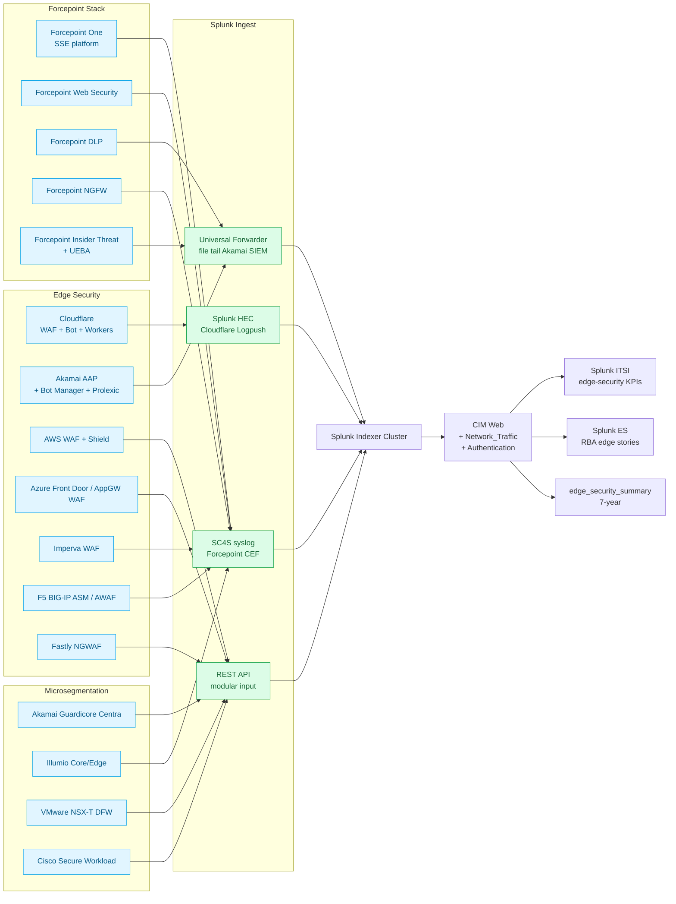

# Edge Security & Microsegmentation Integration Guide

> Operational, security, and compliance monitoring for the **edge
> security plane** (cat 17.4 — Cloudflare WAF / Bot / Workers, Akamai
> AAP / Bot Manager / Prolexic, AWS WAF / Shield, Azure FD WAF,
> Imperva, F5 ASM, Fastly NGWAF), the **Forcepoint security stack**
> (cat 17.5 — Forcepoint One / Web / DLP / NGFW / Insider Threat),
> and the **microsegmentation platforms** (cat 17.6 — Akamai
> Guardicore, Illumio, VMware NSX-T DFW, Cisco Secure Workload).
> Companion guide to `firewalls.md` (cat 5.2), `web-security.md`
> (cat 10.5), and `vpn-zerotrust-sase.md` (cat 17.1, 17.2).

## Table of Contents

- [Quick Start — From Zero to First Edge Security Dashboard](#quick-start--from-zero-to-first-edge-security-dashboard)
- [Overview](#overview)
- [Architecture and Data Flow](#architecture-and-data-flow)
- [Prerequisites](#prerequisites)
- [Domain 1 — Edge Security WAF / Bot / DDoS (cat 17.4, 9 UCs)](#domain-1--edge-security-waf--bot--ddos-cat-174-9-ucs)
- [Domain 2 — Forcepoint Security (cat 17.5, 15 UCs)](#domain-2--forcepoint-security-cat-175-15-ucs)
- [Domain 3 — Microsegmentation (cat 17.6, 12 UCs)](#domain-3--microsegmentation-cat-176-12-ucs)
- [Sizing and Capacity Planning](#sizing-and-capacity-planning)
- [Compliance and Audit Evidence Pack](#compliance-and-audit-evidence-pack)
- [Crawl / Walk / Run Roadmap](#crawl--walk--run-roadmap)
- [Dashboards](#dashboards)
- [SPL Examples](#spl-examples)
- [Troubleshooting](#troubleshooting)
- [SOAR Playbooks](#soar-playbooks)
- [Cross-Product Integration](#cross-product-integration)

## Quick Start — From Zero to First Edge Security Dashboard

### Day 1: Identify edge platforms

| Layer | Common products |
|---|---|
| Edge WAF + Bot + DDoS | Cloudflare, Akamai AAP, AWS WAF + Shield, Azure Front Door / AppGW, Imperva, F5 BIG-IP, Fastly |
| Forcepoint security stack | Forcepoint One, Forcepoint Web Security, Forcepoint DLP, Forcepoint NGFW, Forcepoint Insider Threat |
| Microsegmentation | Akamai Guardicore, Illumio Core / Edge, VMware NSX-T DFW, Cisco Secure Workload |

### Day 2: Stand up the indexes

```ini
[edge_security]
homePath = $SPLUNK_DB/edge_security/db
coldPath = $SPLUNK_DB/edge_security/colddb
thawedPath = $SPLUNK_DB/edge_security/thaweddb
maxDataSize = auto_high_volume
frozenTimePeriodInSecs = 31536000

[edge_security_summary]
homePath = $SPLUNK_DB/edge_security_summary/db
coldPath = $SPLUNK_DB/edge_security_summary/colddb
thawedPath = $SPLUNK_DB/edge_security_summary/thaweddb
maxDataSize = auto
frozenTimePeriodInSecs = 220752000

[cloudflare]
homePath = $SPLUNK_DB/cloudflare/db
coldPath = $SPLUNK_DB/cloudflare/colddb
thawedPath = $SPLUNK_DB/cloudflare/thaweddb
maxDataSize = auto_high_volume
frozenTimePeriodInSecs = 31536000

[akamai]
homePath = $SPLUNK_DB/akamai/db
coldPath = $SPLUNK_DB/akamai/colddb
thawedPath = $SPLUNK_DB/akamai/thaweddb
maxDataSize = auto_high_volume
frozenTimePeriodInSecs = 31536000

[forcepoint]
homePath = $SPLUNK_DB/forcepoint/db
coldPath = $SPLUNK_DB/forcepoint/colddb
thawedPath = $SPLUNK_DB/forcepoint/thaweddb
maxDataSize = auto_high_volume
frozenTimePeriodInSecs = 220752000

[guardicore]
homePath = $SPLUNK_DB/guardicore/db
coldPath = $SPLUNK_DB/guardicore/colddb
thawedPath = $SPLUNK_DB/guardicore/thaweddb
maxDataSize = auto_high_volume
frozenTimePeriodInSecs = 31536000
```

### Day 3: Cloudflare Logpush via Splunk HEC

Cloudflare Dashboard → Analytics → Logs → Logpush → New job:

| Field | Value |
|---|---|
| Dataset | `http_requests`, `firewall_events`, `audit_logs`, `workers_trace_events`, `nel_reports` |
| Destination | Splunk HEC |
| HEC URL | `https://hec.splunk.example.com:8088/services/collector/raw` |
| HEC token | `<HEC_TOKEN>` |
| HEC source | `cloudflare:logpush` |
| HEC sourcetype | `cloudflare:json` |
| HEC index | `cloudflare` |

### Day 4: Akamai SIEM Connector

Install Akamai SIEM Connector on a Linux Heavy Forwarder. Configure
the credential block (`/etc/akamai/edgegrid.cfg`) with EdgeGrid auth
client tokens. Splunk Add-on for Akamai consumes the resulting JSONL
file via UF input.

### Day 5: Forcepoint Insights SIEM App

Install Forcepoint Insights SIEM App for Splunk (Splunkbase 8053).
Configure CEF syslog from Forcepoint Web Security / Forcepoint NGFW
to SC4S TCP 6514. Configure Forcepoint One DLP to write JSON-formatted
audit events to a shared filesystem; tail with UF.

### Day 6–7: First three dashboards

- WAF rule block rate (UC-17.4.1)
- Bot challenge-pass rate (UC-17.4.2)
- Microsegmentation policy violations (UC-17.6.1)

## Overview

### Why edge security visibility matters

The internet edge is the single largest attack surface in any
organisation. WAF, Bot Management, DDoS protection, and API security
products defend hundreds of millions of public-facing application
endpoints. Their telemetry is enormous, high-cardinality, and often
unanalysed in any consolidated tool — Splunk closes that gap.

For PCI DSS 4.0, **§6.4 mandates a WAF for every public-facing
application processing card data**. Without continuous WAF
monitoring + tuning evidence, you fail PCI assessment.

For the EU AI Act<sup class="ref">[<a href="#ref-6">6</a>]</sup>, bot-management decisions that affect humans
(blocking individuals from web access based on JA3/JA4 behavioural
fingerprinting) qualify as **automated decision-making** subject to
GDPR<sup class="ref">[<a href="#ref-4">4</a>]</sup> Art. 22 — the bot-mitigation system needs an adjudication path
and the per-decision evidence trail must be retained.

### Why monitor microsegmentation in Splunk

Microsegmentation platforms (Guardicore, Illumio, NSX-T DFW, Cisco
Secure Workload) generate massive east-west firewall logs that vendor
consoles can't retain past 30–90 days. Splunk indexes them long-term
and joins them with EDR (cat 10.3), identity (cat 9), vulnerability
management (cat 10.6), and ITSM (cat 16) — producing the only
practical view of "lateral movement attempts and what enabled them."

### Why Forcepoint deserves its own subdomain

Forcepoint is one of the few vendors whose stack spans **web security
+ NGFW + DLP + Insider Threat / UEBA + email security** with shared
identity and shared evidence. The Forcepoint Insights SIEM App is the
only practical way to consolidate this telemetry into Splunk; it
warrants dedicated coverage rather than being scattered across
`web-security.md`, `firewalls.md`, and `email-security.md`.

### Domains covered

| Sub | Name | UCs | Highlight |
|---|---|---|---|
| 17.4 | Edge Security (WAF, Bot, DDoS) | 9 | Cloudflare WAF + Bot + Workers + Magic Transit |
| 17.5 | Forcepoint Security | 15 | Web + DLP + NGFW + ITM + ESS unified |
| 17.6 | Microsegmentation | 12 | Akamai Guardicore Centra |

### What "good" looks like

| KPI | Healthy target | Source |
|---|---|---|
| Cloudflare WAF block rate (24h) | stable trend, no unexplained spikes | Cloudflare |
| Bot challenge-pass rate | > 70% (lower = aggressive blocking) | Cloudflare / Akamai |
| DDoS Layer 7 attack attempts | 0 successful | Cloudflare / Akamai / Imperva |
| Microsegmentation policy coverage | > 95% of workloads classified | Guardicore / Illumio |
| Lateral-movement attempts blocked | 100% of attempts logged | Microsegmentation |
| Forcepoint URL category compliance | > 99% policy adherence | Forcepoint Web |
| Forcepoint DLP incidents resolved | < 24h MTTR | Forcepoint DLP |

## Architecture and Data Flow



### Core principles

1. **Cloudflare Logpush over Logpull.** Push-based delivery via
   Logpush is real-time and fault-tolerant; Logpull is rate-limited
   and you'll lose events on busy zones.
2. **Akamai SIEM via Akamai SIEM Connector.** Direct REST polling will
   exhaust EdgeGrid auth quotas; the SIEM Connector handles
   pagination and back-pressure.
3. **AWS WAF logs to Kinesis Data Firehose**, not directly to S3, then
   ingest with the Splunk Add-on for AWS Firehose Connector.
4. **Forcepoint CEF to SC4S TCP 6514.** Forcepoint Web Security writes
   `websense:cg:kv` (Common Event Format key-value); SC4S detects this
   and routes to the right index.
5. **Microsegmentation events are bidirectional.** Always capture both
   the policy decision (allow/block) AND the eventual outcome (was
   the connection re-attempted from a different source). Decision
   alone is not sufficient evidence.
6. **Bot-mitigation logs require GDPR review.** Storing JA3/JA4
   fingerprints with consent grants requires retention review under
   GDPR Art. 13 + Art. 22.

## Prerequisites

### Pre-deployment checklist

- [ ] Inventory of edge security platforms (zones, applications,
  policies)
- [ ] HEC tokens for Cloudflare Logpush
- [ ] Akamai EdgeGrid API client credentials (Manage SIEM access)
- [ ] AWS WAF / Shield logging enabled, Kinesis Firehose deployed
- [ ] Azure Front Door / AppGW Diagnostic Settings → Event Hub
- [ ] Forcepoint Insights SIEM App installed
- [ ] Forcepoint CEF syslog configured to SC4S
- [ ] Forcepoint One API credentials for REST polling
- [ ] Akamai Guardicore Add-on installed; API service account created
- [ ] Illumio PCE → Splunk syslog configured
- [ ] VMware NSX-T → Splunk syslog (DFW logs)
- [ ] Cisco Secure Workload data export configured
- [ ] CIM Web + Network_Traffic + Authentication data models
  accelerated

### Splunk components used

- **Splunk Enterprise / Cloud**
- **Splunk ES** — RBA risk objects for edge security events; ESCU
  edge-security stories
- **Splunk SOAR** — bot management adjudication, microsegmentation
  policy update via API, lateral-movement containment
- **Splunk ITSI** — edge-security service health KPIs (per-zone WAF
  health, per-application bot policy enforcement)
- **MLTK** — anomaly detection on WAF block rate, bot challenge-pass
  rate, microsegmentation policy violation rate

## Domain 1 — Edge Security WAF / Bot / DDoS (cat 17.4, 9 UCs)

### Highlight UCs (cat 17.4 currently focused on Cloudflare; the
patterns generalize)

- **UC-17.4.1** — Cloudflare WAF Managed Rule Block Rate by Rule ID
- **UC-17.4.2** — Cloudflare Bot Management Score Distribution and
  Challenge Pass Rate
- **UC-17.4.3** — Cloudflare Rate Limiting Rule Trigger Volume
- **UC-17.4.4** — Cloudflare Workers Script Errors and CPU Time
- **UC-17.4.5** — Cloudflare Magic Transit DDoS Volume

### Configuration — Cloudflare Logpush (HEC)

```bash
# Cloudflare API call
curl -X POST "https://api.cloudflare.com/client/v4/zones/<ZONE_ID>/logpush/jobs" \
  -H "Authorization: Bearer <CLOUDFLARE_API_TOKEN>" \
  -H "Content-Type: application/json" \
  --data '{
    "name": "splunk-firewall-events",
    "destination_conf": "splunk://hec.splunk.example.com:8088/services/collector/raw?channel=<UUID>&header_Authorization=Splunk%20<HEC_TOKEN>&insecure-skip-verify=false",
    "dataset": "firewall_events",
    "logpull_options": "fields=Action,ClientASN,ClientCountry,ClientIP,ClientRequestHTTPHost,ClientRequestPath,ClientRequestUserAgent,Datetime,EdgeColoCode,Kind,MatchIndex,Metadata,RayID,RuleID,Source",
    "enabled": true
  }'
```

### Configuration — AWS WAF via Kinesis Firehose

```bash
# Enable WAF logging on a Web ACL
aws wafv2 put-logging-configuration \
  --logging-configuration '{
    "ResourceArn": "arn:aws:wafv2:us-east-1:123456789012:regional/webacl/example/abc",
    "LogDestinationConfigs": [
      "arn:aws:firehose:us-east-1:123456789012:deliverystream/aws-waf-logs-splunk"
    ]
  }'
```

Splunk Add-on for AWS Firehose endpoint:

```ini
[aws-waf-firehose-input]
disabled = 0
endpoint = https://firehose.us-east-1.amazonaws.com
sourcetype = aws:waf:event
index = aws_waf
```

### Configuration — Azure Front Door WAF

```bash
# Diagnostic settings → send to Event Hub
az monitor diagnostic-settings create \
  --resource <FD_ID> \
  --name splunk-fd-waf \
  --logs '[{"category": "FrontDoorWebApplicationFirewallLog", "enabled": true}]' \
  --event-hub-rule-id /subscriptions/<sub>/resourceGroups/<rg>/providers/Microsoft.EventHub/namespaces/<ns>/AuthorizationRules/RootManageSharedAccessKey
```

Splunk Add-on for Azure consumes Event Hub directly.

## Domain 2 — Forcepoint Security (cat 17.5, 15 UCs)

### Highlight UCs

- **UC-17.5.1** — Forcepoint Web Security URL Category Block Trending
- **UC-17.5.10** — Forcepoint Advanced Malware Detection File Analysis
- **UC-17.5.11** — Forcepoint Incident Response Workflow State
- **UC-17.5.12** — Forcepoint Administrator Configuration Change Audit
- **UC-17.5.13** — Forcepoint Insider Threat Behavioural Risk Score
- **UC-17.5.14** — Forcepoint DLP Policy Violation Trending
- **UC-17.5.15** — Forcepoint NGFW Threat Insight Correlation

### Configuration — Forcepoint Web Security CEF syslog

On Forcepoint Manager → Settings → General → SIEM Integration:

| Field | Value |
|---|---|
| SIEM Integration | Enable |
| Format | CEF (Common Event Format) |
| Host | sc4s.splunk.example.com |
| Port | 6514 (TCP TLS) |
| Send Status / Activity / Audit | All |

SC4S auto-detects CEF and routes to `forcepoint` index with
`websense:cg:kv` sourcetype.

### Configuration — Forcepoint One REST polling

```ini
[REST://forcepoint_one_audit]
endpoint = https://app.forcepoint.com/api/v1/audit/events
auth_type = oauth2
oauth2_token_endpoint = https://app.forcepoint.com/oauth2/token
client_id = <FP1_CLIENT_ID>
client_secret = <FP1_CLIENT_SECRET>
polling_interval = 300
sourcetype = forcepoint:one
index = forcepoint
```

### Configuration — Forcepoint DLP

DLP audit events written to a shared file system; tailed by UF on the
Forcepoint Manager:

```ini
[monitor:///opt/forcepoint/dlp/logs/audit.log]
sourcetype = forcepoint:dlp:event
index = forcepoint
```

## Domain 3 — Microsegmentation (cat 17.6, 12 UCs)

### Highlight UCs

- **UC-17.6.1** — Akamai Guardicore Microsegmentation Policy Violation
  Alerts
- **UC-17.6.10** — Akamai Guardicore Blocked Inter-Zone Communication
  Attempts
- **UC-17.6.11** — Akamai Guardicore Agent Update Compliance and
  Version Drift
- **UC-17.6.12** — Akamai Guardicore Breach Detection Time-to-Containment
- **UC-17.6.13** — Illumio Policy Coverage and Drift
- **UC-17.6.14** — VMware NSX-T DFW Policy Hits

### Configuration — Akamai Guardicore (Centra)

```ini
[REST://guardicore_network_flow]
endpoint = https://api.cento.com/api/v3.0/visibility/incidents
auth_type = oauth2
oauth2_token_endpoint = https://api.cento.com/api/v3.0/authenticate
client_id = <GUARDICORE_CLIENT_ID>
client_secret = <GUARDICORE_CLIENT_SECRET>
polling_interval = 300
sourcetype = guardicore:network:flow
index = guardicore

[REST://guardicore_audit]
endpoint = https://api.cento.com/api/v3.0/system/auditLog
auth_type = oauth2
polling_interval = 600
sourcetype = guardicore:audit
index = guardicore
```

### Configuration — Illumio PCE syslog

Illumio PCE → Settings → Event Settings → Syslog:

```
Server: sc4s.splunk.example.com
Port: 6514 (TCP TLS)
Format: CEF
```

```ini
[monitor:///var/log/illumio-pce/audit.log]
sourcetype = illumio:audit
index = illumio
```

### Configuration — VMware NSX-T DFW logs

```ini
[REST://nsx_dfw_events]
endpoint = https://nsx-mgr.example.com/api/v1/firewall/sections
auth_type = basic
auth_user = splunk_readonly
auth_password = <PW>
polling_interval = 300
sourcetype = vmware:nsx:dfw
index = nsx
```

## Sizing and Capacity Planning

| Source | Per-100M-request daily volume | Per-100M-request monthly storage |
|---|---|---|
| Cloudflare http_requests Logpush | 30 GB | 900 GB |
| Cloudflare firewall_events | 1 GB | 30 GB |
| Cloudflare audit_logs | 50 MB | 1.5 GB |
| Akamai SIEM JSON | 5 GB | 150 GB |
| AWS WAF | 3 GB | 90 GB |
| Azure Front Door WAF | 2 GB | 60 GB |
| Imperva WAF syslog | 5 GB | 150 GB |
| F5 BIG-IP ASM syslog | 3 GB | 90 GB |
| Fastly NGWAF | 1 GB | 30 GB |
| Forcepoint Web Security | 5 GB | 150 GB |
| Forcepoint DLP | 1 GB | 30 GB |
| Forcepoint NGFW | 3 GB | 90 GB |
| Akamai Guardicore Centra | 10 GB / 1k workloads | 300 GB |
| Illumio PCE | 5 GB / 1k workloads | 150 GB |
| VMware NSX-T DFW | 3 GB / 1k workloads | 90 GB |
| Cisco Secure Workload | 5 GB / 1k workloads | 150 GB |

For a representative deployment of 5 zones (Cloudflare + Akamai + AWS),
Forcepoint stack, and Guardicore on 5,000 workloads: budget **~120
GB/day** indexed edge-security data.

## Compliance and Audit Evidence Pack

### PCI DSS 4.0 §6.4

WAF for public-facing apps. UC-17.4.1 through UC-17.4.5 jointly
satisfy §6.4 evidence; UC-17.4.x audit-log retention satisfies §10.

### PCI DSS 4.0 §11.6.1

Change-detection on payment pages. Cloudflare Workers script change
audit (UC-17.4.4) + Forcepoint web change audit (UC-17.5.12) jointly
satisfy §11.6.1.

### HIPAA §164.312(c)(1) Integrity

WAF + DDoS evidence that PHI-bearing endpoints maintained integrity
during attack. UC-17.4.1 + UC-17.4.5 + UC-17.6.x jointly satisfy.

### GDPR Art. 32 + Art. 33

Art. 32 — WAF + microsegmentation as TOMs. Art. 33 — DDoS evidence
required for breach-notification analysis.

### NIS2 Annex II

UC-17.6.x microsegmentation evidence for "incident handling" and
"network resilience" provisions.

### DORA Art. 8 + Art. 9

UC-17.6.12 (breach detection MTTR) directly satisfies DORA<sup class="ref">[<a href="#ref-5">5</a>]</sup> Art. 8 ICT
operational resilience requirements.

### CCPA / CPRA

For California-resident data — Cloudflare cookie + bot fingerprinting
adjudication evidence (UC-17.4.2). Bot-blocking decisions affecting
California residents require automated-decision-making transparency
under CPRA.

### EU AI Act (high-risk bot scoring)

Bot-mitigation systems that block individuals based on behavioural
biometrics qualify as high-risk AI under EU AI Act Annex III. UC-17.4.2
+ UC-17.4.3 jointly produce the per-decision evidence trail required
by Art. 13 (transparency to affected persons).

### SOC 2 CC6.6

UC-17.4.1 + UC-17.4.2 + UC-17.5.x + UC-17.6.x jointly satisfy CC6.6
"logical access security."

## Crawl / Walk / Run Roadmap

### Crawl tier (8 UCs — week 1–4)

| UC | Title |
|---|---|
| 17.4.1 | Cloudflare WAF Managed Rule Block Rate |
| 17.4.2 | Cloudflare Bot Management Score Distribution |
| 17.4.3 | Cloudflare Rate Limiting Rule Trigger Volume |
| 17.5.1 | Forcepoint Web Security URL Category Block Trending |
| 17.5.12 | Forcepoint Administrator Configuration Change Audit |
| 17.6.1 | Akamai Guardicore Microsegmentation Policy Violation |
| 17.6.10 | Akamai Guardicore Blocked Inter-Zone Communication |
| 17.6.11 | Akamai Guardicore Agent Update Compliance |

### Walk tier (17 UCs — month 2–3)

Highlights:
- All 9 cat-17.4 edge UCs operationalised (Workers errors, Magic
  Transit, AWS WAF, Azure FD WAF, Imperva, F5 ASM)
- Forcepoint AMD file-analysis correlation
- Forcepoint Insider Threat behavioural scoring
- Forcepoint DLP policy violation trending
- Microsegmentation policy coverage tracking
- Illumio policy drift detection
- VMware NSX-T DFW policy-hit trending
- Cisco Secure Workload reporting

### Run tier (11 UCs — month 4+)

Highlights:
- ML-driven WAF rule auto-tuning (using `histogram` + MLTK)
- Bot management adjudication automation via SOAR
- Lateral-movement containment via SOAR + microsegmentation
- Cross-vendor edge attack-surface scoring
- PCI DSS 4.0 §6.4 + §11.6.1 evidence pack auto-generation
- HIPAA<sup class="ref">[<a href="#ref-13">13</a>]</sup> + GDPR + NIS2<sup class="ref">[<a href="#ref-3">3</a>]</sup> + DORA evidence packs
- EU AI Act bot-decision adjudication evidence

## Dashboards

| Dashboard | Audience | Refresh |
|---|---|---|
| Edge Security Executive | CISO | 5 min |
| Cloudflare WAF Operations | NetSec / SOC | 1 min |
| Bot Management Adjudication | Application Owner / SOC | 5 min |
| Forcepoint Web Operations | NetSec | 5 min |
| Forcepoint DLP / Insider Threat | DLP Analyst / SOC | 5 min |
| Microsegmentation Coverage | NetSec / Platform | 15 min |
| Lateral-Movement Attempts | SOC | 1 min |
| EU AI Act Bot Decision Evidence | Compliance | daily |

## SPL Examples

### Cloudflare WAF block-rate by rule-id

```spl
index=cloudflare sourcetype=cloudflare:json dataset=firewall_events
| stats count by RuleID, Action, ClientCountry
| where Action = "block"
| sort - count
```

### Microsegmentation policy violation funnel

```spl
index=guardicore sourcetype=guardicore:network:flow OR sourcetype=guardicore:incident
| eval violation_type = case(
    severity="high" AND policy_action="block", "Hard violation",
    severity="medium" AND policy_action="alert", "Soft violation",
    1==1, "Other")
| stats count by violation_type, source_label, dest_label
| sort - count
```

### Forcepoint URL category compliance

```spl
index=forcepoint sourcetype=websense:cg:kv
| stats count by url_category, action, user
| where action = "blocked"
| sort - count
```

## Troubleshooting

| Symptom | Likely cause | Fix |
|---|---|---|
| Cloudflare Logpush silent | HEC URL/cred wrong | Run `cloudflare logpush show` |
| AWS WAF logs missing | Logging configuration not enabled | Check `aws wafv2 get-logging-configuration` |
| Azure FD WAF empty | Diagnostic Settings not configured | `az monitor diagnostic-settings list` |
| Forcepoint CEF not parsed | SC4S detection rule missing | Update SC4S to current version |
| Akamai SIEM Connector lagging | EdgeGrid quota exceeded | Reduce poll cadence; rotate API client |
| Guardicore Centra REST 401 | OAuth2 client expired | Recreate API client in Centra UI |
| Illumio syslog empty | PCE event settings off | PCE → Settings → Event Settings → Syslog |
| NSX-T DFW logs missing | Distributed firewall rule logging not enabled | Per-rule "Log" checkbox |

## SOAR Playbooks

### Playbook 1 — DDoS Layer 7 attack containment

```yaml
playbook: edge_l7_ddos_containment
triggers:
  - notable_event: "L7 DDoS Detected (Cloudflare/Akamai)"
phases:
  contain:
    - cloudflare_set_zone_security_level: "under_attack"
    - akamai_enable_kona_burst_protect
  notify:
    - pagerduty_alert:
        urgency: critical
        service: "Edge Security On-Call"
  enrich:
    - threat_intel_lookup_attacker_ip
```

### Playbook 2 — Microsegmentation lateral-movement containment

```yaml
playbook: microseg_lateral_containment
triggers:
  - notable_event: "Lateral Movement via Microsegmentation Block"
phases:
  identify:
    - splunk_search:
        query: "index=guardicore source_workload=${notable.source}"
  contain:
    - guardicore_quarantine_workload: ${notable.source_workload}
    - illumio_quarantine_workload: ${notable.source_workload}
  notify:
    - splunk_es_create_notable
    - jira_create_ticket:
        project: "SOC"
        summary: "Workload ${notable.source_workload} quarantined"
```

### Playbook 3 — Bot adjudication for GDPR Art. 22

```yaml
playbook: bot_adjudication_gdpr
triggers:
  - sourcetype: cloudflare:json
  - rule: "BotScore<30 AND Action=challenge AND user_complaint=true"
phases:
  notify:
    - servicenow_create_ticket:
        category: "Bot Adjudication / GDPR"
        severity: 4
        short_description: "Manual review for bot challenge: ${notable.cf_ray}"
  enrich:
    - generate_per_decision_evidence_pack: ${notable.cf_ray}
```

## Cross-Product Integration

| Other guide | Relationship |
|---|---|
| `firewalls.md` (cat 5.2) | Perimeter NGFW partners alongside edge security |
| `web-security.md` (cat 10.5) | SWG outbound web traffic security |
| `vpn-zerotrust-sase.md` (cat 17.1, 17.2) | SASE convergence |
| `aws.md` / `azure.md` / `gcp.md` (cat 4.1-4.3) | Cloud-native WAF + DDoS |
| `api-gateways.md` (cat 8.1) | API security at the gateway |
| `email-security.md` (cat 11) | Forcepoint Email Security cross-link |
| `vulnerability-management.md` (cat 10.6) | Feeds WAF rule tuning |
| `siem-soar.md` (cat 10.7) | RBA risk objects + SOAR playbooks |
| `splunk-itsi.md` (cat 13.2) | Edge-security service KPIs |
| `regulatory-compliance-master.md` (cat 22) | PCI 6, HIPAA, GDPR, NIS2 evidence |

---

**Document maintenance.** Reviewed quarterly against vendor release
notes. Last verified against:
- Splunk Enterprise 9.4
- Cloudflare App for Splunk 4.0
- Splunk Add-on for Akamai 5.0
- Forcepoint Insights SIEM App 1.0
- Akamai Guardicore Add-on 1.0
- Splunk Add-on for Illumio 4.0
- Splunk Add-on for VMware NSX 1.5
- Splunk Add-on for Cisco Secure Workload 1.x
- Cloudflare Logpush — current
- Akamai SIEM Connector — current
- Forcepoint One — current
- Akamai Guardicore Centra — current
- Illumio Core 22.x

For corrections or additions, file an issue with `cat-17.4`,
`cat-17.5`, or `cat-17.6` labels.

---

<!-- BEGIN-AUTOGENERATED-SOURCES -->

## References

*Auto-generated by `scripts/generate_doc_references.py` from `data/source-references.json` and `data/source-mappings.json`. Edit those files (or the document body) to change citations; this footer is rewritten on every run.*

### Primary sources

<a id="ref-1"></a>**[1]** National Institute of Standards and Technology. (2020). *Zero Trust Architecture*. U.S. Department of Commerce. NIST SP 800-207. https://csrc.nist.gov/pubs/sp/800/207/final

### Supporting sources

<a id="ref-2"></a>**[2]** Broadcom Inc. / VMware. (2026). *VMware vSphere Documentation*. Broadcom Inc. Retrieved May 11, 2026, from https://docs.vmware.com/en/VMware-vSphere/

<a id="ref-3"></a>**[3]** European Parliament and Council of the European Union. (2022, December). *Directive (EU) 2022/2555 — NIS2 Directive on cybersecurity*. Official Journal of the European Union, L 333. ELI: dir/2022/2555. https://eur-lex.europa.eu/eli/dir/2022/2555/oj

<a id="ref-4"></a>**[4]** European Parliament and Council of the European Union. (2016, April). *Regulation (EU) 2016/679 — General Data Protection Regulation*. Official Journal of the European Union, L 119. ELI: reg/2016/679. https://eur-lex.europa.eu/eli/reg/2016/679/oj

<a id="ref-5"></a>**[5]** European Parliament and Council of the European Union. (2022, December). *Regulation (EU) 2022/2554 — Digital Operational Resilience Act (DORA)*. Official Journal of the European Union, L 333. ELI: reg/2022/2554. https://eur-lex.europa.eu/eli/reg/2022/2554/oj

<a id="ref-6"></a>**[6]** European Parliament and Council of the European Union. (2024, June). *Regulation (EU) 2024/1689 — EU Artificial Intelligence Act*. Official Journal of the European Union. ELI: reg/2024/1689. https://eur-lex.europa.eu/eli/reg/2024/1689/oj

<a id="ref-7"></a>**[7]** Palo Alto Networks, Inc. (2026). *Palo Alto Networks PAN-OS Documentation*. Retrieved May 11, 2026, from https://docs.paloaltonetworks.com/pan-os

<a id="ref-8"></a>**[8]** Payment Card Industry Security Standards Council. (2018). *Payment Card Industry Data Security Standard v3.2.1* (v3.2.1). PCI SSC. https://www.pcisecuritystandards.org/document_library/?category=pcidss

<a id="ref-9"></a>**[9]** Payment Card Industry Security Standards Council. (2022). *Payment Card Industry Data Security Standard v4.0* (v4.0). PCI SSC. https://www.pcisecuritystandards.org/document_library/?category=pcidss

<a id="ref-10"></a>**[10]** Splunk Inc. (2026). *Splunk Common Information Model Add-on Manual*. Splunk LLC, a Cisco company. Retrieved May 11, 2026, from https://docs.splunk.com/Documentation/CIM

<a id="ref-11"></a>**[11]** Splunk Inc. (2026). *Splunk Enterprise Security Administration Manual*. Splunk LLC, a Cisco company. Retrieved May 11, 2026, from https://docs.splunk.com/Documentation/ES

<a id="ref-12"></a>**[12]** U.S. Department of Health & Human Services. (2002). *HIPAA Privacy Rule (45 CFR Parts 160 and 164, Subparts A and E)*. Office for Civil Rights, HHS. 45 CFR 160, 164. https://www.hhs.gov/hipaa/for-professionals/privacy/index.html

<a id="ref-13"></a>**[13]** U.S. Department of Health & Human Services. (2013). *HIPAA Security Rule (45 CFR Parts 160 and 164, Subparts A and C)*. Office for Civil Rights, HHS. 45 CFR 160, 164. https://www.hhs.gov/hipaa/for-professionals/security/index.html

<details>
<summary>Additional online sources cited in the document body (9)</summary>

<a id="ref-14"></a>**[14]** splunkbase.splunk.com. *Splunkbase app #4501*. Retrieved May 11, 2026, from https://splunkbase.splunk.com/app/4501

<a id="ref-15"></a>**[15]** splunkbase.splunk.com. *Splunkbase app #1922*. Retrieved May 11, 2026, from https://splunkbase.splunk.com/app/1922

<a id="ref-16"></a>**[16]** splunkbase.splunk.com. *Splunkbase app #1876*. Retrieved May 11, 2026, from https://splunkbase.splunk.com/app/1876

<a id="ref-17"></a>**[17]** splunkbase.splunk.com. *Splunkbase app #3757*. Retrieved May 11, 2026, from https://splunkbase.splunk.com/app/3757

<a id="ref-18"></a>**[18]** splunkbase.splunk.com. *Splunkbase app #2680*. Retrieved May 11, 2026, from https://splunkbase.splunk.com/app/2680

<a id="ref-19"></a>**[19]** splunkbase.splunk.com. *Splunkbase app #8053*. Retrieved May 11, 2026, from https://splunkbase.splunk.com/app/8053

<a id="ref-20"></a>**[20]** splunkbase.splunk.com. *Splunkbase app #7426*. Retrieved May 11, 2026, from https://splunkbase.splunk.com/app/7426

<a id="ref-21"></a>**[21]** splunkbase.splunk.com. *Splunkbase app #4178*. Retrieved May 11, 2026, from https://splunkbase.splunk.com/app/4178

<a id="ref-22"></a>**[22]** splunkbase.splunk.com. *Splunkbase app #5042*. Retrieved May 11, 2026, from https://splunkbase.splunk.com/app/5042

</details>

<!-- END-AUTOGENERATED-SOURCES -->
