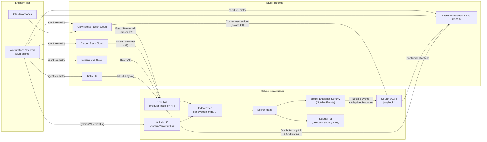

# EDR (CrowdStrike, Microsoft Defender, Carbon Black, SentinelOne) Integration Guide

> The definitive guide to integrating Endpoint Detection and Response
> (EDR) platforms with Splunk. **681 use cases** — the largest single
> subcategory in the catalogue — covering CrowdStrike Falcon,
> Microsoft Defender for Endpoint, VMware Carbon Black, SentinelOne,
> Trellix (FireEye/HX), Cybereason, and Sysmon (free baseline).
> Detection trending, MITRE ATT&CK technique coverage, response
> orchestration via Splunk SOAR, EDR vs ESCU correlation, identity
> attack chain reconstruction, and the full DFIR pipeline from
> detection to forensic evidence. Plug into Splunk Enterprise
> Security as your XDR command-and-control plane.

---

## Table of Contents

- [Quick Start](#quick-start)
- [Overview](#overview)
- [Architecture and Data Flow](#architecture)
- [Prerequisites](#prerequisites)
- [Platform Coverage Matrix](#platform-matrix)
- [CrowdStrike Falcon](#crowdstrike)
- [Microsoft Defender for Endpoint](#mde)
- [VMware Carbon Black Cloud](#carbonblack)
- [SentinelOne](#sentinelone)
- [Trellix HX (legacy FireEye)](#trellix)
- [Sysmon (free baseline)](#sysmon)
- [Field Dictionary (Cross-Vendor)](#field-dictionary)
- [Sample Events](#sample-events)
- [Splunk-Side Configuration](#splunk-config)
- [MITRE ATT&CK Coverage Mapping](#mitre)
- [Cross-Product Correlation](#cross-product)
- [CIM Mapping Reference](#cim-mapping)
- [Splunk ES + ESCU Integration](#es-escu)
- [Splunk SOAR Integration](#soar-integration)
- [Compliance Mapping](#compliance)
- [Capacity Planning and Sizing](#sizing)
- [Recommended Dashboard Layouts](#dashboards)
- [ITSI Service Modeling](#itsi)
- [SOAR Playbook Examples](#soar)
- [Multi-Tenant / MSSP Strategy](#multi-tenant)
- [Security Hardening](#security-hardening)
- [Crawl / Walk / Run Roadmap](#roadmap)
- [Validation Checklist](#validation-checklist)
- [Known Limitations and Gaps](#known-limitations)
- [Troubleshooting](#troubleshooting)
- [FAQ](#faq)
- [Glossary](#glossary)
- [References](#references)
- [Contribution and Feedback](#contribution)

---

<a id="quick-start"></a>
## Quick Start — 60 Minutes from Zero to First Detection

> Pick the section for your EDR. **All EDRs share the same
> end-state**: detection events flow into the `edr` index, normalize
> via Endpoint + Intrusion_Detection + Alerts CIM data models, ready
> for ES correlation searches, MITRE ATT&CK coverage tracking, and
> SOAR response playbooks.

### CrowdStrike Falcon (fastest)

1. Install [CrowdStrike Falcon Event Streams TA (Splunkbase 5082)](https://splunkbase.splunk.com/app/5082) on a Heavy Forwarder.
2. In CrowdStrike Falcon UI: **Support > API Clients & Keys** → create API client with `Event Streams: Read`, `Hosts: Read`, `Detects: Read` scopes.
3. Configure the TA (Splunk Web → CrowdStrike Falcon Event Streams):
    - API Cloud URL: `https://api.crowdstrike.com` (or eu/us2/...)
    - Client ID + Secret
    - Stream Name: `app-detection-events`
4. Validate: `index=crowdstrike sourcetype="crowdstrike:event_streams" earliest=-15m | stats count by event_type`
5. Activate UC-10.3.1 (Malware Detection Trending).

### Microsoft Defender for Endpoint

1. Install [Microsoft 365 Defender Add-on (Splunkbase 6207)](https://splunkbase.splunk.com/app/6207).
2. In Azure → App Registrations: create app with `WindowsDefenderATP.Alert.Read.All`, `WindowsDefenderATP.Machine.Read.All` scopes.
3. Configure the TA with tenant ID, app ID, client secret.
4. Validate: `index=mde sourcetype="microsoft:defender:detection" earliest=-15m | stats count by Severity`

### Sysmon (universal free baseline)

```ini
# UF inputs.conf
[WinEventLog://Microsoft-Windows-Sysmon/Operational]
disabled = 0
sourcetype = XmlWinEventLog:Microsoft-Windows-Sysmon/Operational
renderXml = true
index = sysmon
```

---

<a id="overview"></a>
## Overview

### Why EDR matters

EDR is the **eyes and hands** of modern SOCs. Detection alone is insufficient — EDR provides:

- **Process tree reconstruction** for incident analysis
- **One-click endpoint isolation** for containment
- **Real-time response actions** (kill process, delete file, dump memory)
- **Threat intelligence enrichment** at endpoint scale
- **MITRE ATT&CK technique mapping** for coverage visualization

### What this guide covers

| Platform | Use case fit |
|---------|------------|
| **CrowdStrike Falcon** | Cloud-native EDR with Event Streams API |
| **Microsoft Defender for Endpoint (MDE)** | Native Windows + cross-platform via M365 Defender |
| **VMware Carbon Black Cloud** | Cloud EDR (CB Cloud, CB Predictive, CB EDR Endpoint) |
| **SentinelOne** | Singularity Platform, Behavioral AI |
| **Trellix HX** | FireEye Helix / HX (legacy / migration) |
| **Cybereason** | Cybereason Defense Platform |
| **Sysmon** | Microsoft Sysinternals — free Windows baseline |

### Domains covered

| Domain | Examples |
|--------|---------|
| **Detection trending** | Daily / weekly malware count, severity distribution |
| **MITRE ATT&CK coverage** | Per-technique detection map; gap analysis |
| **Identity protection** | CrowdStrike Falcon Identity Protection / MDE Identity |
| **Process forensics** | Process tree, parent-child analysis |
| **Vulnerability + EDR** | Cross-correlation with cat 10.6 |
| **Insider threat** | UEBA-style behavioral anomalies |
| **Containment** | Isolation events, remediation tracking |
| **DFIR** | Memory dumps, file artifacts, attack timelines |

### What's NOT in scope

| Domain | Where to look |
|--------|---------------|
| **Network IDS/IPS** | [Firewalls Guide](firewalls.md) |
| **Email-borne malware** | Email Security (cat 10.4) |
| **Vulnerability scanning** | [Vulnerability Management Guide](vulnerability-management.md) |
| **SIEM correlation rules** | Splunk Enterprise Security |
| **Cloud workload protection** | Per-cloud guides ([AWS](aws.md), [Azure](azure.md), [GCP](gcp.md)) |

### What good looks like

| Dimension | Without integration | With full EDR + ES + SOAR |
|-----------|---------------------|---------------------------|
| Malware detection | EDR console alone | Splunk-correlated, multi-vendor view |
| Mean time to contain | Hours-days | < 5 min via SOAR auto-isolation |
| MITRE ATT&CK coverage | Unknown | Heatmap with quarterly gap analysis |
| Process forensics | Manual EDR query | Splunk-side timeline reconstruction |
| Vulnerability prioritization | CVSS only | EDR-attack-evidence weighted CVE |

---

<a id="architecture"></a>
## Architecture and Data Flow



### Core principles

- **EDR platforms remain authoritative** for endpoint state and response actions
- **Splunk aggregates** detections across multi-vendor estate
- **Splunk ES correlates** EDR with all other security data (firewall, identity, DNS)
- **Splunk SOAR orchestrates** response back through EDR REST APIs

---

<a id="prerequisites"></a>
## Prerequisites

| Item | Detail |
|------|--------|
| **Splunk version** | 9.0+ Enterprise or Cloud |
| **Splunk ES** | 7.x+ (recommended for full value) |
| **Splunk SOAR** | 6.x+ (recommended for response automation) |
| **CIM 6.x** | Endpoint, Intrusion_Detection, Alerts, Authentication |
| **MITRE ATT&CK App** | Splunk Security Essentials (SSE) integration |
| **Heavy Forwarder** | For EDR API polling/streaming |
| **HEC token** | For S3-pull-based EDR (Carbon Black) |

### EDR-side requirements

| Platform | Required permissions |
|---------|---------------------|
| **CrowdStrike** | API client w/ Event Streams: Read, Hosts: Read, Detects: Read |
| **MDE / M365D** | App registration w/ WindowsDefenderATP.* and ThreatHunting.Read |
| **Carbon Black** | API key + S3 Event Forwarder bucket configured |
| **SentinelOne** | API token (read-only) |
| **Trellix HX** | API user + REST endpoint |
| **Sysmon** | Sysmon installed + appropriate config (e.g., SwiftOnSecurity) |

---

<a id="platform-matrix"></a>
## Platform Coverage Matrix

| Platform | TA | Splunkbase | Sourcetypes | Cloud-vetted |
|---------|----|-----------|-------------|--------------|
| **CrowdStrike Falcon** | Falcon Event Streams TA | [5082](https://splunkbase.splunk.com/app/5082) | `crowdstrike:event_streams`, `crowdstrike:detection`, `crowdstrike:device` | Yes |
| **Microsoft 365 Defender** | Microsoft 365 Defender Add-on | [6207](https://splunkbase.splunk.com/app/6207) | `microsoft:defender:*`, `mde:*` | Yes |
| **MDE Advanced Hunting** | Splunk Add-on for MDE Advanced Hunting | [5518](https://splunkbase.splunk.com/app/5518) | `mde:advancedhunting` | Yes |
| **Carbon Black Cloud** | Carbon Black Cloud Splunk App | [5253](https://splunkbase.splunk.com/app/5253) | `cb:cloud:*`, `cb:event_forwarder` | Yes |
| **SentinelOne** | SentinelOne App for Splunk | [5208](https://splunkbase.splunk.com/app/5208) | `sentinelone:*` | Yes |
| **Sysmon** | Splunk Add-on for Microsoft Sysmon | [1914](https://splunkbase.splunk.com/app/1914) | `XmlWinEventLog:Microsoft-Windows-Sysmon/Operational` | Yes |
| **Trellix HX** | Splunk Add-on for FireEye | (varies) | `trellix:hx:alert` | Verify |
| **Cybereason** | (custom REST input) | n/a | `cybereason:event` | n/a |

---

<a id="crowdstrike"></a>
## CrowdStrike Falcon

### Required Splunk components

| Component | Purpose |
|-----------|--------|
| CrowdStrike Falcon Event Streams TA | Real-time streaming detection feed |
| CrowdStrike Falcon Endpoint App for Splunk | Pre-built dashboards (optional) |
| CrowdStrike Falcon Identity Protection App | Identity events (optional) |

### CrowdStrike-side configuration

In Falcon UI:
1. **Support > API Clients & Keys**
2. **Add new API client**:
    - Name: `splunk-prod-streamer`
    - Description: `Streaming events to Splunk`
    - Scopes: `Event Streams: Read`, `Hosts: Read`, `Detects: Read`, `Alerts: Read`
3. Note the Client ID and Client Secret (Secret shown ONCE)

### TA configuration

```ini
# Splunk_TA_crowdstrike_falcon_event_streams/local/inputs.conf
[crowdstrike_event_streams_input://crowdstrike-prod]
client_id = <client-id>
client_secret = <encrypted>
api_uri = https://api.crowdstrike.com
app_id = splunk-prod-stream
event_types = DetectionSummaryEvent,IncidentSummaryEvent,UserActivityAuditEvent,AuthActivityAuditEvent
sourcetype = crowdstrike:event_streams
index = crowdstrike
```

### Key event types

| Event type | Purpose |
|-----------|---------|
| `DetectionSummaryEvent` | Behavioral / IOC / IOA detections |
| `IncidentSummaryEvent` | Incident-graph aggregations |
| `UserActivityAuditEvent` | Admin actions on Falcon console |
| `AuthActivityAuditEvent` | Falcon login events |
| `EppDetectionSummaryEvent` | Endpoint Protection (NGAV) detections |

### Sample event (DetectionSummaryEvent)

```json
{
    "metadata": {
        "customerIDString": "<cid>",
        "offset": 12345,
        "eventType": "DetectionSummaryEvent",
        "eventCreationTime": 1745596200000
    },
    "event": {
        "ProcessId": "1234567890",
        "ParentProcessId": "9876543210",
        "ComputerName": "WS-FINANCE-001",
        "UserName": "DOMAIN\\jdoe",
        "DetectName": "MaliciousProcess",
        "DetectDescription": "Suspicious process execution detected",
        "Severity": 5,
        "FileName": "powershell.exe",
        "CommandLine": "powershell.exe -ExecutionPolicy Bypass -EncodedCommand SQBuAHYAbwBrAGUALQ...",
        "FilePath": "C:\\Windows\\System32\\WindowsPowerShell\\v1.0\\powershell.exe",
        "MD5String": "d41d8cd98f00b204e9800998ecf8427e",
        "SHA256String": "e3b0c44298fc1c149afbf4c8996fb92427ae41e4649b934ca495991b7852b855",
        "Tactic": "Execution",
        "Technique": "Command and Scripting Interpreter",
        "MITREATTACKReferences": ["T1059.001"]
    }
}
```

### Top CrowdStrike UCs

| UC | Description |
|----|------------|
| UC-10.3.1 | Malware Detection Trending |
| UC-10.3.5 | Endpoint Isolation Events |
| UC-10.3.x | MITRE ATT&CK technique heatmap |
| UC-10.3.x | Identity Protection — risky sign-in detection |
| UC-10.3.x | Detection-to-response time SLA |
| UC-10.3.x | High-severity detections by host |
| UC-10.3.x | Suppressed/closed detection audit |

---

<a id="mde"></a>
## Microsoft Defender for Endpoint

### Two TAs to install

1. **Microsoft 365 Defender Add-on (Splunkbase 6207)** — pulls alerts via Microsoft Graph Security API
2. **Splunk Add-on for MDE Advanced Hunting (Splunkbase 5518)** — pulls KQL query results via Advanced Hunting API (richer process telemetry)

### MDE side — Azure App Registration

```
1. Azure AD > App Registrations > New
2. App name: "Splunk-MDE-Streamer"
3. API permissions:
    - WindowsDefenderATP > Application: Alert.Read.All, Machine.Read.All
    - SecurityEvents > Application: SecurityAlert.Read.All
    - ThreatIndicators > Application: ThreatIndicators.Read.All
    - For Advanced Hunting: WindowsDefenderATP.AdvancedQuery.Read
4. Grant admin consent
5. Generate client secret
```

### TA configuration

```
# Splunk Web → Microsoft 365 Defender Add-on → Add Account
Tenant ID: <tenant-guid>
Application ID: <client-id>
Client Secret: <secret>
Endpoint: graph.microsoft.com (or world / chinacloud / usgov)
```

### Sample MDE alert event

```json
{
    "id": "da637...",
    "incidentId": "1234",
    "investigationId": null,
    "assignedTo": null,
    "severity": "High",
    "status": "New",
    "classification": null,
    "determination": null,
    "investigationState": "PendingApproval",
    "detectionSource": "WindowsDefenderAv",
    "category": "Malware",
    "title": "Trojan:Win32/Emotet",
    "description": "Detected file: bad.exe",
    "alertCreationTime": "2026-04-25T14:30:15Z",
    "lastEventTime": "2026-04-25T14:30:15Z",
    "computerDnsName": "WS-FINANCE-001.corp.local",
    "evidence": [
        {
            "entityType": "File",
            "fileName": "bad.exe",
            "filePath": "C:\\Users\\jdoe\\Downloads\\",
            "sha256": "e3b0c44...",
            "sha1": "da39a3..."
        }
    ],
    "mitreTechniques": ["T1059.001", "T1027"]
}
```

### Advanced Hunting (KQL) integration

```kql
// Example: PowerShell encoded commands
DeviceProcessEvents
| where Timestamp > ago(1h)
| where FileName =~ "powershell.exe" and ProcessCommandLine has_any ("-EncodedCommand", "-enc")
| project Timestamp, DeviceName, AccountName, ProcessCommandLine, InitiatingProcessFileName
```

The Advanced Hunting TA can run scheduled KQL queries and ingest results into Splunk.

---

<a id="carbonblack"></a>
## VMware Carbon Black Cloud

### Two ingest paths

**Option 1 — Event Forwarder (recommended):** CB Cloud writes events to S3, Splunk pulls via Splunk_TA_aws.

**Option 2 — REST API polling:** Splunk TA polls CB Cloud REST.

### Event Forwarder setup

In CB Cloud Console:
1. **Settings > API Access > Event Forwarder**
2. Configure S3 destination: bucket, region, IAM role
3. Choose event types: Endpoint Events, Watchlist Hits, Alerts

In Splunk:
```ini
[aws_s3://carbonblack]
aws_account = security-prod
sourcetype = cb:event_forwarder
index = carbonblack
bucket_name = cb-event-forwarder-prod
```

### Sample CB event

```json
{
    "schema": 1,
    "create_time": "2026-04-25T14:30:15Z",
    "device_id": 12345,
    "device_name": "WS-FINANCE-001",
    "event_id": "abc123-uuid",
    "event_type": "endpoint.event.crossproc",
    "process_guid": "ABCD-1234-...",
    "process_path": "C:\\Windows\\System32\\powershell.exe",
    "process_cmdline": "powershell.exe -e ...",
    "parent_path": "C:\\Program Files\\Microsoft Office\\Office16\\WINWORD.EXE",
    "alert_severity": 7,
    "watchlist_hit": ["T1059.001"]
}
```

---

<a id="sentinelone"></a>
## SentinelOne

### TA configuration

```
# Splunk Web → SentinelOne App for Splunk → Add Account
Console URL: https://<your-instance>.sentinelone.net
API Token: <token>
Polling Interval: 60s
```

### Sample event

```json
{
    "id": "1234567890",
    "agent_id": "abcdef-uuid",
    "agent_computer_name": "WS-FINANCE-001",
    "agent_os_type": "windows",
    "threat_id": "9876543210",
    "threat_classification": "Malware",
    "threat_classification_source": "Engine",
    "threat_initiated_by": "agent",
    "threat_status": "mitigated",
    "threat_indicators": ["T1059", "T1027"],
    "process_name": "powershell.exe",
    "process_path": "C:\\Windows\\System32\\WindowsPowerShell\\v1.0\\",
    "user_name": "DOMAIN\\jdoe"
}
```

---

<a id="trellix"></a>
## Trellix HX (legacy FireEye)

### Ingest via REST + syslog

```bash
# Syslog forwarding from HX appliance
syslog server <sc4s-vip>
syslog port 514
syslog protocol udp
syslog format CEF
```

```ini
# inputs.conf for syslog (via SC4S vendor pack)
# Auto-classified as trellix:hx:alert by SC4S
```

---

<a id="sysmon"></a>
## Sysmon (free baseline)

Sysmon is **the universally-deployable free baseline** — every Windows endpoint should run it.

### Recommended config

Use [SwiftOnSecurity Sysmon Config](https://github.com/SwiftOnSecurity/sysmon-config) or [Olaf Hartong Modular Config](https://github.com/olafhartong/sysmon-modular).

```bash
# Install Sysmon with curated config
sysmon64.exe -accepteula -i sysmonconfig-export.xml
```

### UF inputs.conf

```ini
[WinEventLog://Microsoft-Windows-Sysmon/Operational]
disabled = 0
sourcetype = XmlWinEventLog:Microsoft-Windows-Sysmon/Operational
renderXml = true
index = sysmon
```

### Splunk_TA_microsoft_sysmon

Install [Splunkbase 1914](https://splunkbase.splunk.com/app/1914) on indexers + SH for field extractions and CIM mapping.

### Sample SPL — Process tree

```spl
index=sysmon EventCode=1 (ProcessId=* OR ProcessGuid=*) earliest=-1h
| stats values(Image) as processes, values(CommandLine) as cmdlines, values(ParentImage) as parents by Computer, User
| where match(processes, "(?i)(powershell|cmd|wscript|cscript|mshta|rundll32|regsvr32)")
```

### Sample SPL — DNS-over-HTTPS to suspicious provider

```spl
index=sysmon EventCode=22 (QueryName="*.cloudflare-dns.com" OR QueryName="dns.google" OR QueryName="*.dns.nextdns.io")
| stats count by Computer, Image, QueryName
```

---

<a id="field-dictionary"></a>
## Field Dictionary (Cross-Vendor)

After Endpoint / Intrusion_Detection / Alerts CIM mapping:

| Field | CrowdStrike | MDE | Carbon Black | SentinelOne | Sysmon |
|-------|-------------|-----|--------------|-------------|--------|
| `dest` | ComputerName | computerDnsName | device_name | agent_computer_name | Computer |
| `user` | UserName | (custom) | (custom) | user_name | User |
| `process_name` | FileName | fileName (evidence) | process_path | process_name | Image |
| `process_id` | ProcessId | (custom) | process_guid | (custom) | ProcessId |
| `parent_process` | ParentProcessId | (custom) | parent_path | (custom) | ParentImage |
| `cmd_line` | CommandLine | (custom) | process_cmdline | (custom) | CommandLine |
| `signature` | DetectName | title | (custom) | threat_classification | (none) |
| `severity` | Severity (0-5) | severity (Low/Med/Hi/Crit) | alert_severity (1-10) | (custom) | (none — derive) |
| `mitre_technique` | Technique / MITREATTACKReferences | mitreTechniques | watchlist_hit | threat_indicators | (none) |
| `file_hash` | SHA256String | (evidence sha256) | (custom) | (custom) | Hashes |
| `action_taken` | (custom) | status / determination | (custom) | threat_status | (none) |

---

<a id="sample-events"></a>
## Sample Events

(See per-platform sections.)

---

<a id="splunk-config"></a>
## Splunk-Side Configuration

### Index strategy

```ini
[edr]
homePath = $SPLUNK_DB/edr/db
maxDataSize = auto_high_volume
frozenTimePeriodInSecs = 31536000   # 1 year for incident retention

[sysmon]
homePath = $SPLUNK_DB/sysmon/db
maxDataSize = auto_high_volume
frozenTimePeriodInSecs = 7776000   # 90 days (high-volume)

[mde]
homePath = $SPLUNK_DB/mde/db
maxDataSize = auto_high_volume
frozenTimePeriodInSecs = 31536000

[crowdstrike]
homePath = $SPLUNK_DB/crowdstrike/db
maxDataSize = auto_high_volume
frozenTimePeriodInSecs = 31536000

[carbonblack]
homePath = $SPLUNK_DB/carbonblack/db
maxDataSize = auto_high_volume
frozenTimePeriodInSecs = 31536000
```

### CIM data model acceleration

```ini
[Endpoint]
acceleration = 1
acceleration.earliest_time = -7d
acceleration.cron_schedule = 8 * * * *

[Intrusion_Detection]
acceleration = 1
acceleration.earliest_time = -7d
acceleration.cron_schedule = 13 * * * *

[Alerts]
acceleration = 1
acceleration.earliest_time = -7d
acceleration.cron_schedule = 18 * * * *
```

---

<a id="mitre"></a>
## MITRE ATT&CK Coverage Mapping

### Per-technique detection coverage

```spl
index=edr earliest=-30d
| eval mitre_technique = coalesce(MITREATTACKReferences, mitreTechniques, threat_indicators, watchlist_hit)
| mvexpand mitre_technique
| stats dc(host) as hosts_with_detections, count as total by mitre_technique
| sort -total
```

### MITRE ATT&CK Heatmap

Use [Splunk Security Essentials (SSE)](https://splunkbase.splunk.com/app/3435) → MITRE ATT&CK App for visual heatmap of detection coverage.

### Top tactics tracked

| Tactic ID | Name | EDR coverage typical |
|-----------|------|---------------------|
| TA0001 | Initial Access | High (phishing, exploit) |
| TA0002 | Execution | Very high (process events) |
| TA0003 | Persistence | High (autorun, scheduled tasks) |
| TA0004 | Privilege Escalation | High |
| TA0005 | Defense Evasion | Very high |
| TA0006 | Credential Access | High |
| TA0007 | Discovery | Medium (LOLBin patterns) |
| TA0008 | Lateral Movement | Medium |
| TA0009 | Collection | Low (need DLP integration) |
| TA0010 | Exfiltration | Low (need network corr) |
| TA0011 | Command and Control | Medium (DNS + network corr) |
| TA0040 | Impact | High (ransomware, etc.) |

---

<a id="cross-product"></a>
## Cross-Product Correlation

### EDR + AD (lateral movement attribution)

```spl
(index=edr earliest=-1h technique="T1021*")
OR (index=wineventlog EventCode=4624 LogonType=10 earliest=-1h)
| transaction user maxspan=5m
| stats values(host) as endpoints, values(LogonType) as logon_types by user
```

### EDR + DNS (C2 attribution)

```spl
(index=edr earliest=-1h technique="T1071*")
OR (index=dns earliest=-1h)
| transaction src maxspan=10s
```

### EDR + Vulnerability Management (exploited CVE)

```spl
(index=edr DetectName="*Exploit*" earliest=-7d)
OR (index=vulnerability earliest=-7d severity IN ("Critical","High"))
| transaction host maxspan=30d
| stats values(cve_id) as exploited_cves, values(DetectName) as detections by host
```

### EDR + Email (phishing-to-detection chain)

```spl
(index=edr earliest=-24h)
OR (index=email_security earliest=-24h url_clicked=true)
| transaction user maxspan=15m
```

---

<a id="cim-mapping"></a>
## CIM Mapping Reference

| CIM model | Sourcetype | Auto-mapped? |
|-----------|-----------|--------------|
| **Endpoint / Processes** | `crowdstrike:*`, `mde:*`, `cb:cloud:*`, `s1:*`, `XmlWinEventLog:Sysmon` | Yes (per TA) |
| **Endpoint / Filesystem** | Same | Yes (Sysmon EventCode 11/2) |
| **Endpoint / Registry** | Sysmon EventCode 12/13/14 | Yes |
| **Endpoint / Ports** | Sysmon EventCode 3 | Yes |
| **Intrusion_Detection / IDS_Attacks** | All EDR detection | Yes |
| **Alerts** | All EDR detection | Yes |
| **Authentication** | EDR identity events (CrowdStrike Identity Protection) | Yes |

---

<a id="es-escu"></a>
## Splunk ES + ESCU Integration

### Splunk ES is the natural correlation home for EDR

ES correlation searches consume EDR data via CIM:
- `Intrusion_Detection.IDS_Attacks` for malware/exploit detections
- `Alerts.Alerts` for alert summaries
- `Endpoint.Processes` for process telemetry

### ESCU (Splunk Enterprise Security Content Update)

Install [ES Content Update](https://splunkbase.splunk.com/app/3449) for 2,000+ pre-built detections covering MITRE ATT&CK, all of which work natively with EDR-ingested data.

### Adaptive Response

Configure ES Adaptive Response Actions to call EDR:
- **CrowdStrike**: Contain Host action via API
- **MDE**: Isolate Machine action via Graph API
- **Carbon Black**: Quarantine Device action

---

<a id="soar-integration"></a>
## Splunk SOAR Integration

### Pre-built EDR connectors

Splunk SOAR has native apps for:
- CrowdStrike (75+ actions: contain host, kill process, get process tree, etc.)
- Microsoft Defender ATP (60+ actions)
- VMware Carbon Black Cloud (50+ actions)
- SentinelOne (40+ actions)

### Auto-containment playbook example

```python
# SOAR playbook pseudocode
def on_high_severity_detection(container, results):
    detection = results['detection']
    
    if detection['severity'] >= 8:
        # 1. Get process tree for evidence
        process_tree = phantom.act("get process tree", 
                                    asset='crowdstrike',
                                    parameters=[{'device_id': detection['device_id']}])
        
        # 2. Isolate endpoint
        phantom.act("contain device", 
                    asset='crowdstrike',
                    parameters=[{'device_id': detection['device_id']}])
        
        # 3. Disable AD account
        phantom.act("disable user", 
                    asset='active_directory',
                    parameters=[{'username': detection['user']}])
        
        # 4. Create incident in ServiceNow
        phantom.act("create ticket", 
                    asset='servicenow',
                    parameters=[{
                        'short_description': f"EDR Sev-{detection['severity']}: {detection['DetectName']}",
                        'description': str(process_tree),
                        'severity': '1',
                        'assignment_group': 'soc-tier-2'
                    }])
        
        # 5. Notify
        phantom.act("send message",
                    asset='slack',
                    parameters=[{'channel': '#soc-incidents', 'message': f"AUTO-CONTAINED: {detection['DetectName']} on {detection['ComputerName']}"}])
```

---

<a id="compliance"></a>
## Compliance Mapping

### NIST 800-53

| Control | Coverage |
|---------|----------|
| **SI-3** Malicious Code Protection | All EDR detection UCs |
| **SI-4** System Monitoring | Continuous detection feed |
| **IR-4** Incident Handling | Detection + response chain |
| **IR-6** Incident Reporting | Detection trending UC |
| **AU-2/12** Audit | EDR admin audit + endpoint audit |

### NIS2

| Article | Coverage |
|---------|----------|
| **Art 21(2)(e)** Detection / response | All EDR UCs |
| **Art 21(2)(f)** Crisis management | SOAR containment playbooks |
| **Art 23** Incident reporting | Detection-to-response time UC |

### PCI-DSS 4.0

| Requirement | Coverage |
|-------------|----------|
| **5.x** Anti-malware | EDR detection + remediation |
| **10.x** Audit | EDR admin actions |
| **11.5.x** Intrusion detection | EDR network + process |

### HIPAA

| §164.308/312 | Coverage |
|---------|----------|
| **(a)(1)(ii)(D)** Information system activity review | All EDR detection |
| **(b)** Audit controls | EDR audit |
| **(c)** Integrity | File integrity via EDR |

### MITRE ATT&CK (Mandatory for SOC maturity)

Use SSE app for continuous coverage measurement and gap analysis.

---

<a id="sizing"></a>
## Capacity Planning and Sizing

### Per-EDR ingest (typical)

| Platform | Per-endpoint daily | 10K-endpoint estate |
|---------|-------------------|---------------------|
| CrowdStrike (detections only) | ~1 KB | ~10 MB/day |
| CrowdStrike (full event stream) | ~10 MB | ~100 GB/day |
| MDE alerts only | ~2 KB | ~20 MB/day |
| MDE Advanced Hunting (KQL results) | ~5 MB / scheduled query | ~varies |
| Carbon Black events forwarded (S3) | ~50 MB | ~500 GB/day |
| SentinelOne | ~5 KB | ~50 MB/day |
| Sysmon (curated config) | ~5 MB | ~50 GB/day |

### Retention recommendations

| Data | Retention | Rationale |
|------|-----------|-----------|
| EDR detections | 1 year+ | Incident history, audit |
| Sysmon process events | 90-180 days | DFIR window |
| EDR audit (admin actions) | 1 year+ | Compliance |
| CrowdStrike full event stream | 90 days | Threat hunting |

---

<a id="dashboards"></a>
## Recommended Dashboard Layouts

### Crawl — "EDR At a Glance"

```
+---------------------+---------------------+
| ACTIVE SEV-HIGH/CRITICAL DETECTIONS        |
+---------------------+---------------------+
| DETECTIONS LAST 24H — TREND                |
+---------------------+---------------------+
| TOP-10 AFFECTED HOSTS                      |
+---------------------+---------------------+
| AGENT COVERAGE % (registered vs estate)    |
+---------------------+---------------------+
```

### Walk — "MITRE ATT&CK Coverage"

```
+---------------------+---------------------+
| MITRE ATT&CK HEATMAP (per technique)       |
+---------------------+---------------------+
| TOP TECHNIQUES OBSERVED                    |
+---------------------+---------------------+
| TACTIC DISTRIBUTION                        |
+---------------------+---------------------+
| TECHNIQUE GAPS (no detections in 30d)      |
+---------------------+---------------------+
```

### Run — "DFIR & Response"

```
+---------------------+---------------------+
| MEAN TIME TO CONTAIN (MTTC)                |
+---------------------+---------------------+
| AUTO-CONTAINMENT ACTIONS                   |
+---------------------+---------------------+
| OPEN INCIDENTS (Sev-1/2)                   |
+---------------------+---------------------+
| EDR SUPPRESSION AUDIT                      |
+---------------------+---------------------+
```

---

<a id="itsi"></a>
## ITSI Service Modeling

### Service hierarchy

```
EDR / Endpoint Tier
├── Per-Vendor EDR Coverage
│   ├── CrowdStrike Falcon
│   ├── Microsoft Defender for Endpoint
│   ├── VMware Carbon Black Cloud
│   └── SentinelOne
├── Detection Pipeline
│   ├── Detection-to-Notable latency
│   ├── ES Notable Event volume
│   └── SOAR auto-action success
└── Endpoint Hygiene
    ├── Agent coverage % (per BU)
    └── Sysmon coverage %
```

### Recommended KPIs

| KPI | Source | Threshold |
|-----|--------|-----------|
| High/Crit detections/hr | All EDR | Adaptive |
| Agent coverage % | EDR device list | Static (page < 95%) |
| Detection-to-Notable latency | ES vs EDR timestamp | Static (warn > 5min) |
| MTTC (mean time to contain) | SOAR | Adaptive (improvement KPI) |
| Suppression rate | Closed/Total | Static (warn > 10%) |

---

<a id="soar"></a>
## SOAR Playbook Examples

### Playbook 1: Critical Malware Detection — Auto-Contain

**Trigger:** EDR Sev-Critical detection.

```
1. RECEIVE alert (host, user, technique, file_hash)
2. AUTO-CONTAIN host via EDR
3. AUTO-DISABLE user account in AD
4. PRESERVE memory dump via EDR
5. CREATE Sev-1 ticket
6. NOTIFY SOC + IR + manager
7. KICKOFF triage workflow (DFIR Tier 2)
```

### Playbook 2: MITRE ATT&CK Lateral Movement Chain

**Trigger:** Sequence: T1078 (Valid Accts) → T1021 (Remote Services) → T1059 (Command).

```
1. CORRELATE in 30-min window
2. ENRICH all involved hosts + users
3. AUTO-CONTAIN suspect lateral pivot host
4. PAGE SOC Tier 3
5. ESCALATE to IR if confirmed APT pattern
```

### Playbook 3: Vulnerability + Exploit Detection (Cross-product)

**Trigger:** EDR exploit detection on host with known critical CVE.

```
1. CORRELATE EDR DetectName with vulnerability scan results
2. PRIORITIZE CVE patching (raise to Sev-1)
3. AUTO-PUSH patch via SCCM/Intune
4. CONTAIN host until patched
5. CREATE incident ticket
```

---

<a id="multi-tenant"></a>
## Multi-Tenant / MSSP Strategy

For MSSPs and large multi-business-unit deployments:

- **Per-tenant indexes** (`edr_customer1`, `edr_customer2`)
- **Per-tenant ES tenants** (Splunk ES Multi-tenancy)
- **Per-tenant SOAR playbooks**
- **Per-tenant CrowdStrike Falcon Discover** (CID-segregation)
- **Per-tenant MDE — separate Azure tenant App Registrations**

---

<a id="security-hardening"></a>
## Security Hardening

- All EDR API tokens rotated 90-day
- Field-level RBAC (process command lines may contain credentials)
- Splunk role-based permissions per business unit
- Audit immutable: forward all EDR audit to write-once index
- TLS for all EDR API connections (mTLS where supported)
- Restrict SOAR access to playbook authors

---

<a id="roadmap"></a>
## Crawl / Walk / Run Roadmap

### Crawl (Week 1–4)

1. Deploy primary EDR TA
2. Deploy Sysmon baseline universally
3. CIM Endpoint + Intrusion_Detection acceleration
4. Crawl-tier dashboards
5. UC-10.3.1 trending alert wired

### Walk (Month 2–3)

1. Onboard remaining EDR vendors
2. Splunk ES correlation searches enabled
3. ESCU import (Tier 1 detections)
4. MITRE ATT&CK Heatmap
5. SOAR playbooks (containment, ticket creation)

### Run (Month 4+)

1. Full Splunk ES + SOAR integration
2. Cross-product correlation (DNS, AD, Vuln, Email)
3. Threat hunting program
4. Quarterly MITRE ATT&CK gap analysis
5. MTTC SLO tracking

---

<a id="validation-checklist"></a>
## Validation Checklist

### Day 1

- [ ] First EDR TA installed
- [ ] First detection events visible
- [ ] Sysmon baseline deployed (at least 1 fleet)

### Day 7

- [ ] All EDR vendors onboarded
- [ ] CIM acceleration enabled
- [ ] At-a-glance dashboard live

### Day 30

- [ ] Walk-tier UCs deployed
- [ ] Splunk ES correlation enabled
- [ ] MITRE ATT&CK heatmap active
- [ ] First SOAR playbook live

### Day 90

- [ ] Run-tier UCs deployed
- [ ] Full SOAR auto-containment
- [ ] Threat hunting program operational
- [ ] Quarterly gap analysis report

---

<a id="known-limitations"></a>
## Known Limitations and Gaps

| Limitation | Impact | Workaround |
|------------|--------|------------|
| **CrowdStrike Event Streams = single consumer per stream** | Can only stream once per offset | Use `app_id` to allow multiple (unique) streams |
| **MDE Graph Security API rate limits** | Slow ingest at large estate | Use Advanced Hunting for bulk |
| **Carbon Black Event Forwarder S3 lag** | 5-min delay typical | Use REST for real-time |
| **Sysmon high-volume on busy hosts** | Index bloat | Use curated config; filter at agent |
| **Cross-EDR field name divergence** | CIM mapping required | Use Splunk Add-on for each |
| **Trellix HX product migration** | Vendor uncertainty | Plan migration to MDE / CrowdStrike |
| **EDR vendor lock-in** | Re-instrumentation needed for switch | Use OCSF for normalisation |

---

<a id="troubleshooting"></a>
## Troubleshooting

### CrowdStrike Event Streams not flowing

```
# Check TA log
index=_internal source=*falcon* log_level=ERROR

# Test API auth
curl -X POST https://api.crowdstrike.com/oauth2/token \
    -d "client_id=<id>&client_secret=<secret>" \
    -H "Content-Type: application/x-www-form-urlencoded"
```

### MDE alerts missing

- Verify app permissions granted with admin consent
- Check Microsoft Graph throttling errors

### Carbon Black S3 input not pulling

- Verify IAM role has `s3:GetObject`, `s3:ListBucket` on the EF bucket
- Check CB Cloud Event Forwarder is enabled and writing

### Sysmon events truncated

- Increase WinEventLog channel max size:
  ```
  wevtutil sl Microsoft-Windows-Sysmon/Operational /ms:1073741824
  ```

### CIM Endpoint returns nothing

- Verify TA-side CIM mapping (props.conf field aliases)
- Check acceleration completed: `| rest /services/datamodel/acceleration/info`

---

<a id="faq"></a>
## FAQ

**Q: Should I use multiple EDRs?**
A: Generally no — but cross-product correlation is critical even with one EDR. Some orgs use MDE (free with E5) + best-of-breed (CrowdStrike).

**Q: Is Sysmon required if I have an enterprise EDR?**
A: Strongly recommended. Sysmon provides standardised process telemetry that EDRs sometimes summarise. Combine for richest forensic data.

**Q: How do I deduplicate detections across multiple EDRs?**
A: Use Splunk ES Asset & Identity framework + EDR-aware notable event grouping (NEAPs).

**Q: How do I justify EDR cost vs Defender (free in Windows)?**
A: Compare detection coverage (MITRE ATT&CK), MTTR, and false-positive rates. Often 3-5× improvement justifies cost.

**Q: What's the best EDR-Splunk integration practice?**
A: (1) Native vendor TA, (2) CIM mapping, (3) Splunk ES correlation, (4) SOAR auto-response, (5) MITRE ATT&CK heatmap.

**Q: Can I do SOAR without Splunk SOAR?**
A: Yes via Splunk ES Adaptive Response, but limited to single-action workflows. Splunk SOAR enables full multi-step playbooks.

**Q: How do I detect if EDR was disabled?**
A: Monitor agent heartbeat / device check-in via EDR REST API; alert if endpoint goes offline > 24h or agent service stopped event.

**Q: What about XDR?**
A: XDR = EDR + Network + Identity + Email correlation. Splunk ES *is* the XDR layer when fed by EDR + cat 5.x + cat 9.x + cat 10.4.

---

<a id="glossary"></a>
## Glossary

| Term | Definition |
|------|-----------|
| **EDR** | Endpoint Detection and Response |
| **XDR** | Extended Detection and Response (EDR + other security telemetry) |
| **MDR** | Managed Detection and Response (service offering) |
| **NGAV** | Next-Generation Antivirus |
| **IOC** | Indicator of Compromise (hash, IP, domain) |
| **IOA** | Indicator of Attack (behavioral pattern) |
| **MITRE ATT&CK** | Adversary Tactics, Techniques, and Common Knowledge |
| **TTP** | Tactics, Techniques, and Procedures |
| **DFIR** | Digital Forensics and Incident Response |
| **MTTR / MTTC** | Mean Time To Respond / Contain |
| **NEAP** | (ITSI) Notable Event Aggregation Policy |
| **OCSF** | Open Cybersecurity Schema Framework |
| **Sysmon** | Microsoft Sysinternals system monitor (free) |

---

<a id="references"></a>
## References

- [CrowdStrike Falcon Event Streams TA (Splunkbase 5082)](https://splunkbase.splunk.com/app/5082)
- [Microsoft 365 Defender Add-on (Splunkbase 6207)](https://splunkbase.splunk.com/app/6207)
- [Splunk Add-on for MDE Advanced Hunting (Splunkbase 5518)](https://splunkbase.splunk.com/app/5518)
- [Carbon Black Cloud Splunk App (Splunkbase 5253)](https://splunkbase.splunk.com/app/5253)
- [SentinelOne App for Splunk (Splunkbase 5208)](https://splunkbase.splunk.com/app/5208)
- [Splunk Add-on for Microsoft Sysmon (Splunkbase 1914)](https://splunkbase.splunk.com/app/1914)
- [Splunk Enterprise Security](https://splunkbase.splunk.com/app/263)
- [Splunk Security Essentials (Splunkbase 3435)](https://splunkbase.splunk.com/app/3435)
- [ESCU (Splunkbase 3449)](https://splunkbase.splunk.com/app/3449)
- [MITRE ATT&CK framework](https://attack.mitre.org/)
- [CIM Endpoint model](https://docs.splunk.com/Documentation/CIM/latest/User/Endpoint)
- [SwiftOnSecurity Sysmon Config](https://github.com/SwiftOnSecurity/sysmon-config)

---

<a id="contribution"></a>
## Contribution and Feedback

Part of the [Splunk Monitoring Use Cases](https://github.com/fenre/splunk-monitoring-use-cases) project. [Open an issue](https://github.com/fenre/splunk-monitoring-use-cases/issues/new).

---

*Last updated: 2026-05-09. Covers CrowdStrike Falcon Event Streams TA 4.x, Microsoft 365 Defender Add-on 1.x, Carbon Black Cloud Splunk App 2.x, SentinelOne App 2.x, Sysmon 14.x.*
