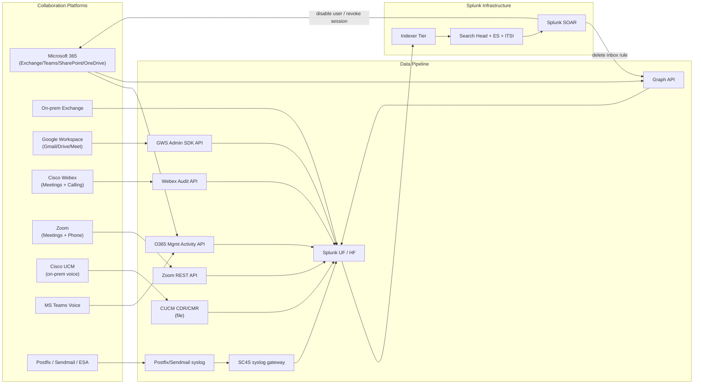

# Email & Collaboration Integration Guide

> The definitive guide to integrating Email & Collaboration platforms
> with Splunk. **135 use cases** spanning Microsoft 365 (Exchange
> Online, Teams, SharePoint, OneDrive), on-prem Exchange, Google
> Workspace (Gmail, Drive, Meet, Chat, Calendar), Cisco Webex
> (Meetings + Calling + audit), Zoom (Meetings, Phone, audit), Cisco
> Unified Communications Manager (CUCM) for voice CDR/CMR, Microsoft
> Teams voice, and on-prem mail transport (Postfix, Sendmail, Cisco
> ESA). Mailbox audit + inbox rule monitoring, OAuth consent grants,
> SharePoint/OneDrive external sharing, login anomaly detection,
> mail flow health, toll fraud detection (CDR), conferencing quality
> (jitter / packet loss / MOS), and the full collaboration security
> + observability story across all major platforms.

---

## Table of Contents

- [Quick Start](#quick-start)
- [Overview](#overview)
- [Architecture and Data Flow](#architecture)
- [Prerequisites](#prerequisites)
- [Platform Coverage Matrix](#platform-matrix)
- [Microsoft 365 (Exchange Online + Teams + SharePoint + OneDrive)](#m365)
- [On-Prem Microsoft Exchange](#exchange)
- [Google Workspace (Gmail + Drive + Meet + Chat)](#gws)
- [Cisco Webex (Meetings + Calling + Audit)](#webex)
- [Zoom (Meetings + Phone + Audit)](#zoom)
- [Cisco Unified Communications Manager (CUCM) Voice CDR/CMR](#cucm)
- [Microsoft Teams Voice](#teams-voice)
- [On-Prem Mail Transport (Postfix, Sendmail, Cisco ESA)](#mail-transport)
- [Mailbox Audit & Inbox Rules](#mailbox-audit)
- [OAuth Consent Grants & App Permissions](#oauth)
- [SharePoint / OneDrive External Sharing](#external-sharing)
- [Conferencing Quality Metrics (MOS, Jitter, Packet Loss)](#conferencing-quality)
- [Field Dictionary](#field-dictionary)
- [Sample Events](#sample-events)
- [Splunk-Side Configuration](#splunk-config)
- [Cross-Product Correlation](#cross-product)
- [CIM Mapping Reference](#cim-mapping)
- [Splunk ES Notable Event Pipeline](#es-notable)
- [Compliance Mapping](#compliance)
- [Capacity Planning and Sizing](#sizing)
- [Recommended Dashboard Layouts](#dashboards)
- [ITSI Service Modeling](#itsi)
- [SOAR Playbook Examples](#soar)
- [Multi-Tenant / Multi-Org Strategy](#multi-tenant)
- [Security Hardening](#security-hardening)
- [Crawl / Walk / Run Roadmap](#roadmap)
- [Validation Checklist](#validation-checklist)
- [Known Limitations and Gaps](#known-limitations)
- [Troubleshooting](#troubleshooting)
- [FAQ](#faq)
- [Glossary](#glossary)
- [References](#references)
- [Contribution and Feedback](#contribution)

---

<a id="quick-start"></a>
## Quick Start — 90 Minutes to First Collaboration Insight

### Microsoft 365

1. Install [Splunk Add-on for Microsoft Office 365 (Splunkbase 4055)](https://splunkbase.splunk.com/app/4055).
2. In Azure → App Registrations: create app with these scopes:
    - `ActivityFeed.Read`
    - `ActivityFeed.ReadDlp`
    - `ServiceHealth.Read`
3. Grant tenant admin consent.
4. Configure Splunk inputs (tenant ID + app ID + secret).
5. Enable content types: Audit.AzureActiveDirectory, Audit.SharePoint, Audit.Exchange, DLP.All, Audit.General.
6. Validate: `index=o365 sourcetype="ms:o365:management" earliest=-15m | stats count by RecordType, Operation`

### Google Workspace

1. Install [Splunk Add-on for Google Workspace (Splunkbase 5556)](https://splunkbase.splunk.com/app/5556).
2. In Google Cloud Console: create service account with domain-wide delegation; grant Reports API + Drive Activity API scopes.
3. Configure Splunk with service account JSON + delegated admin email.
4. Enable apps: login, admin, drive, gmail, meet, chat, groups.
5. Validate: `index=gws sourcetype="gws:login" earliest=-15m | stats count by event_name`

### Cisco Webex

1. Install [Cisco Webex TA (Splunkbase 5050)](https://splunkbase.splunk.com/app/5050).
2. In Webex Control Hub: enable Audit Events forwarding.
3. Configure Splunk Webex TA with API token + organization ID.
4. Validate: `index=webex sourcetype="cisco:webex:audit" earliest=-15m | stats count by eventType`

### Zoom

1. Install [Splunk Connect for Zoom (Splunkbase 5224)](https://splunkbase.splunk.com/app/5224).
2. In Zoom Marketplace: create OAuth app with scopes: `meeting:read:admin`, `phone:read:admin`, `dashboard:read:admin`, `account:read:admin`, `report:read:admin`.
3. Configure Splunk with Zoom API credentials.
4. Validate: `index=zoom sourcetype="zoom:meetings" earliest=-15m | stats count by event`

### Activate crawl tier

UC-11.1.1 (Mail Flow Health), UC-11.1.8 (Inbox Rule Monitoring), UC-11.2.4 (GWS Login Anomaly), UC-11.3.6 (CUCM Toll Fraud), UC-11.5.1 (Zoom Quality).

---

<a id="overview"></a>
## Overview

### Why Email & Collaboration observability matters

Email and collaboration are **both productivity tools and primary attack surfaces**:

- **Identity → Mailbox**: stolen credentials → mailbox access → BEC, data theft
- **Inbox rules**: post-compromise persistence (auto-forward, auto-delete)
- **OAuth consent grants**: persistent access without password
- **External sharing (SharePoint/OneDrive/Drive)**: data leakage risk
- **Voice systems**: toll fraud (international premium-rate calls)
- **Conferencing quality**: directly impacts business outcomes
- **Compliance**: HIPAA<sup class="ref">[<a href="#ref-12">12</a>]</sup> (PHI in email), SOX<sup class="ref">[<a href="#ref-10">10</a>]</sup> (retention), GDPR<sup class="ref">[<a href="#ref-5">5</a>]</sup> (data sovereignty)

### Platforms covered

| Platform | Strength |
|---------|---------|
| **Microsoft 365 (full suite)** | Largest footprint; native audit log granularity |
| **On-prem Exchange (2016/2019)** | Still common; declining |
| **Google Workspace** | Gmail-native; strong API coverage |
| **Cisco Webex (Meetings + Calling)** | Enterprise meeting/voice; cloud-managed |
| **Zoom (Meetings + Phone)** | Most-popular meetings; growing voice |
| **Cisco UCM (CUCM)** | On-prem voice; CDR analytics |
| **Microsoft Teams Voice** | Direct Routing + Teams calls |
| **Postfix / Sendmail / Cisco ESA** | On-prem mail relay |

### Domains covered

| Domain | Examples |
|--------|---------|
| **Mail flow health** | NDR rates, queue depth, delivery latency |
| **Mailbox audit** | Inbox rules, mailbox access, owner != accessor |
| **OAuth security** | Consent grants, suspicious app permissions |
| **Sharing security** | External SharePoint/Drive sharing, anonymous links |
| **Login security** | Anomalous logins, MFA failures |
| **Voice CDR** | Toll fraud, unusual call patterns |
| **Conferencing quality** | Jitter / packet loss / MOS |
| **Compliance** | Audit retention, eDiscovery readiness |

### What's NOT in scope

| Domain | Where to look |
|--------|---------------|
| **Email gateway / SEG (Proofpoint, etc.)** | [Email Security Guide](email-security.md) |
| **AD / Entra ID identity** | [AD/Entra ID Guide](active-directory-entra-id.md) |
| **DLP separately** | (separate guide) |
| **Endpoint URL clicks** | [EDR Guide](edr.md) |

### What good looks like

| Dimension | Without integration | With full integration |
|-----------|---------------------|-----------------------|
| Inbox-rule abuse detection | Discovered weeks late | Detected in 15 min |
| OAuth consent surveillance | Unknown | Per-app review queue |
| External-sharing visibility | Manual surveys | Daily report |
| Toll fraud detection | After bill arrives | Within hours |
| Conferencing quality MTTR | Hours of triage | Pre-meeting alert |
| Compliance audit prep | Days/weeks | Hours |

---

<a id="architecture"></a>
## Architecture and Data Flow



### Core principles

- **API-first ingestion** for cloud platforms
- **CIM-mapped** wherever possible (Email + Authentication)
- **CDR/CMR for voice** is unique to UC platforms
- **Conferencing quality** = streaming metrics

---

<a id="prerequisites"></a>
## Prerequisites

| Item | Detail |
|------|--------|
| **Splunk version** | 9.0+ Enterprise / Cloud |
| **Splunk ES** | Recommended for security correlations |
| **CIM 6.x** | Email, Authentication, Change |
| **Cloud admin access** | M365 Global Reader, GWS Super Admin (or scoped), Webex Org Admin, Zoom Admin |
| **API credentials** | App registrations / service accounts per platform |
| **Network access** | Splunk → vendor API endpoints |

---

<a id="platform-matrix"></a>
## Platform Coverage Matrix

| Platform | TA | Splunkbase | Sourcetypes |
|---------|----|-----------|-------------|
| **Microsoft 365** | Splunk_TA_MS_O365 | [4055](https://splunkbase.splunk.com/app/4055) | `ms:o365:management`, `ms:o365:messageTrace` |
| **On-prem Exchange** | Splunk Add-on for Microsoft Exchange | [3225](https://splunkbase.splunk.com/app/3225) | `ms:exchange:audit`, `ms:exchange:messagetracking` |
| **Google Workspace** | Splunk_TA_GoogleWorkspace | [5556](https://splunkbase.splunk.com/app/5556) | `gws:login`, `gws:admin`, `gws:drive`, `gws:gmail`, `gws:meet`, `gws:chat` |
| **Zoom** | Splunk Connect for Zoom | [5224](https://splunkbase.splunk.com/app/5224) | `zoom:meetings`, `zoom:phone`, `zoom:metrics`, `zoom:audit` |
| **Cisco Webex** | ta_cisco_webex_add_on_for_splunk | [5050](https://splunkbase.splunk.com/app/5050) | `cisco:webex:meeting`, `cisco:webex:audit`, `cisco:webex:calling:cdr` |
| **CUCM** | (custom UF file tail) | n/a | `cisco:ucm:cdr`, `cisco:ucm:cmr` |
| **MS Teams Voice** | Splunk_TA_MS_O365 + custom | (same) | `ms:o365:teams`, `ms:teams:cqd` |
| **Postfix / Sendmail** | (syslog via SC4S) | n/a | `postfix:syslog`, `sendmail:syslog` |

---

<a id="m365"></a>
## Microsoft 365 (Exchange Online + Teams + SharePoint + OneDrive)

### Configuration

```
Azure Portal → App Registrations → New registration:
  Name: Splunk-O365-Reader
  Account types: Single tenant
  
  API Permissions (Application):
    Office 365 Management APIs:
      ActivityFeed.Read
      ActivityFeed.ReadDlp
      ServiceHealth.Read
    Microsoft Graph:
      Reports.Read.All
      AuditLog.Read.All
      Directory.Read.All
  
  Grant admin consent
  
  Generate Client Secret (save securely)
```

### Splunk TA configuration

```
Splunk Web → Splunk Add-on for Microsoft Office 365 → Configuration:
  Tenant ID: <azure-tenant-id>
  Client ID: <app-id>
  Client Secret: <secret>
  
  Inputs → Add Management Activity Input:
    Content types:
      - Audit.AzureActiveDirectory
      - Audit.Exchange
      - Audit.SharePoint
      - DLP.All
      - Audit.General
      - Audit.OneDrive
```

### Sample event (M365 Audit — Inbox Rule)

```json
{
    "CreationTime": "2026-04-25T14:30:15",
    "Id": "abc-123",
    "Operation": "New-InboxRule",
    "OrganizationId": "tenant-id",
    "RecordType": 1,
    "ResultStatus": "True",
    "UserKey": "10032000abc...",
    "UserType": 0,
    "Version": 1,
    "Workload": "Exchange",
    "ClientIP": "203.0.113.45",
    "ObjectId": "user@yourcorp.com\\Inbox\\New Forward Rule",
    "UserId": "user@yourcorp.com",
    "Parameters": [
        {"Name": "Identity", "Value": "user@yourcorp.com"},
        {"Name": "ForwardTo", "Value": "evil.attacker@gmail.com"},
        {"Name": "Mailbox", "Value": "user@yourcorp.com"}
    ]
}
```

---

<a id="exchange"></a>
## On-Prem Microsoft Exchange

### Configuration

Use Splunk_TA_microsoft_exchange (Splunkbase 3225). Forward:
- Message tracking logs (`%ExchangeInstallPath%\TransportRoles\Logs\MessageTracking\`)
- Mailbox audit logs (Get-MailboxAuditLog)
- IIS logs from CAS server
- Application + System Windows event logs

### UF inputs.conf

```ini
[monitor:///c:/Program Files/Microsoft/Exchange Server/V15/TransportRoles/Logs/MessageTracking/*.LOG]
sourcetype = ms:exchange:messagetracking
index = exchange
disabled = 0
```

---

<a id="gws"></a>
## Google Workspace (Gmail + Drive + Meet + Chat)

### Configuration

```
Google Cloud Console → IAM & Admin → Service Accounts:
  + Create Service Account: Splunk-GWS-Reader
  + Generate JSON key file (save securely)
  + Domain-wide Delegation: enable

Google Workspace Admin Console → Security → API Controls:
  + Manage Domain Wide Delegation
  + Add new entry:
      Client ID: <service-account-id>
      OAuth Scopes:
        https://www.googleapis.com/auth/admin.reports.audit.readonly
        https://www.googleapis.com/auth/admin.reports.usage.readonly
        https://www.googleapis.com/auth/drive.activity.readonly
```

### Sample event (GWS Login)

```json
{
    "kind": "admin#reports#activity",
    "id": {
        "time": "2026-04-25T14:30:15.123Z",
        "uniqueQualifier": "abc123",
        "applicationName": "login"
    },
    "actor": {
        "callerType": "USER",
        "email": "user@yourcorp.com"
    },
    "ipAddress": "203.0.113.45",
    "events": [
        {
            "type": "login",
            "name": "login_failure",
            "parameters": [
                {"name": "login_type", "value": "google_password"},
                {"name": "login_challenge_method", "multiValue": ["password", "2sv"]}
            ]
        }
    ]
}
```

---

<a id="webex"></a>
## Cisco Webex (Meetings + Calling + Audit)

### Configuration

```
Webex Control Hub → Organization Settings → Audit Events:
  + Enable forwarding
  + API token / Webhook destination: Splunk HEC

Cisco Webex TA configuration:
  + API Token + Organization ID
  + Endpoints: meetings, audit, calling
```

### Sample event (Webex Meeting)

```json
{
    "id": "abc-123",
    "title": "Q1 Review",
    "start": "2026-04-25T14:00:00.000Z",
    "end": "2026-04-25T15:00:00.000Z",
    "host": "host@yourcorp.com",
    "siteUrl": "yourcorp.webex.com",
    "participantCount": 25,
    "duration": 3600,
    "averageQuality": "good"
}
```

---

<a id="zoom"></a>
## Zoom (Meetings + Phone + Audit)

### Configuration

```
Zoom Marketplace → Develop → Build App:
  + App Type: Server-to-Server OAuth
  + Scopes:
      meeting:read:admin
      phone:read:admin
      dashboard:read:admin
      account:read:admin
      report:read:admin
      user:read:admin

Splunk Connect for Zoom configuration:
  + Account ID + Client ID + Client Secret
  + Inputs:
      - Meetings (live + past)
      - Quality Metrics
      - Phone CDRs
      - Audit
```

### Sample event (Zoom Quality Metrics)

```json
{
    "meeting_id": "abc123",
    "user_name": "John Doe",
    "user_id": "user-uuid",
    "device": "MacBook Pro",
    "ip_address": "203.0.113.45",
    "location": "San Francisco, US",
    "join_time": "2026-04-25T14:30:15.000Z",
    "leave_time": "2026-04-25T15:30:15.000Z",
    "avg_jitter_ms": 12,
    "max_jitter_ms": 45,
    "avg_packet_loss_pct": 0.5,
    "max_packet_loss_pct": 3.2,
    "avg_rtt_ms": 95,
    "max_rtt_ms": 180,
    "input_quality": "good",
    "output_quality": "good"
}
```

---

<a id="cucm"></a>
## Cisco Unified Communications Manager (CUCM) Voice CDR/CMR

### Configuration

```
CUCM Admin → Cisco Unified Serviceability → Tools → CDR Management:
  + Add Billing Application Server: Splunk HEC URL
  + Or: SFTP to a Splunk-monitored directory
```

### UF inputs.conf

```ini
[monitor:///opt/cucm-cdr/cdr_*.txt]
sourcetype = cisco:ucm:cdr
index = voip
INDEXED_EXTRACTIONS = csv
```

### Sample SPL — Toll fraud detection

```spl
index=voip sourcetype="cisco:ucm:cdr" earliest=-1d
| where match(calledPartyNumber, "^011|^00") AND duration > 60
| stats count, sum(duration) as total_min by callingPartyNumber, calledPartyNumber
| where count > 10 OR total_min > 600
| sort -total_min
```

---

<a id="teams-voice"></a>
## Microsoft Teams Voice

For Teams Voice (Direct Routing or Calling Plans):

```
Use Splunk_TA_MS_O365 with these audit operations enabled:
  - "Add member to team"
  - "User signed in to Teams"
  - "Call session"
  
Plus Microsoft Teams CQD (Call Quality Dashboard) export via Graph API.
```

---

<a id="mail-transport"></a>
## On-Prem Mail Transport (Postfix, Sendmail, Cisco ESA)

### Postfix/Sendmail syslog → SC4S

SC4S has built-in vendor packs for Postfix and Sendmail.

```
# Postfix
postconf -e "syslog_name = postfix"

# Forward to SC4S
config syslog target=<sc4s-vip>
```

### Sample event (Postfix)

```
Apr 25 14:30:15 mail-relay-01 postfix/smtp[12345]: A1B2C3D4: to=<user@external.com>, relay=mx.external.com[203.0.113.45]:25, delay=0.5, delays=0.1/0/0.1/0.3, dsn=2.0.0, status=sent (250 OK)
```

---

<a id="mailbox-audit"></a>
## Mailbox Audit & Inbox Rules

### M365 — auto-forward to external

```spl
index=o365 sourcetype="ms:o365:management" Operation IN ("New-InboxRule","Set-InboxRule") earliest=-1d
| spath output=forward Parameters{}.Value
| search forward="*@*" NOT forward="*@yourdomain.com"
| table _time, UserId, Operation, forward
```

### M365 — non-owner mailbox access

```spl
index=o365 sourcetype="ms:o365:management" Operation IN ("MailItemsAccessed","SoftDelete") earliest=-1d
| where MailboxOwnerUPN != UserId
| stats count by UserId, MailboxOwnerUPN, Operation
| sort -count
```

---

<a id="oauth"></a>
## OAuth Consent Grants & App Permissions

### M365 — illicit consent grant detection

```spl
index=o365 sourcetype="ms:o365:management" Operation="Consent to application" earliest=-1d
| spath output=app Target{}.ID
| spath output=user UserId
| spath output=permissions ModifiedProperties{}.NewValue
| where match(permissions, "(?i)mail\\.read|files\\.readwrite|user\\.readwrite|directory")
| table _time, user, app, permissions
```

### GWS — third-party app installs

```spl
index=gws sourcetype="gws:admin" event_name="ASSIGN_ROLE" OR event_name="GRANT_OAUTH_TOKEN" earliest=-1d
| stats values(app_name) as apps by actor.email
```

---

<a id="external-sharing"></a>
## SharePoint / OneDrive External Sharing

### M365 — anonymous (Anyone with link) sharing

```spl
index=o365 sourcetype="ms:o365:management" Operation IN ("AnonymousLinkCreated","SharingInvitationCreated") earliest=-1d
| spath output=target_user TargetUserOrGroupName
| where match(target_user, "(?i)anyone|external") OR isnull(target_user)
| stats count by UserId, ObjectId
```

### GWS — Drive external sharing

```spl
index=gws sourcetype="gws:drive" event_name IN ("change_user_access","create_collection") earliest=-1d
| spath output=target_email parameters{}.value
| where match(target_email, "@") AND NOT match(target_email, "@yourcorp.com")
| stats count by actor.email, doc_title, target_email
```

---

<a id="conferencing-quality"></a>
## Conferencing Quality Metrics (MOS, Jitter, Packet Loss)

### Zoom — poor quality detection

```spl
index=zoom sourcetype="zoom:metrics" earliest=-1h
| where avg_jitter_ms > 30 OR avg_packet_loss_pct > 2 OR avg_rtt_ms > 300
| stats count avg(avg_jitter_ms) as jitter avg(avg_packet_loss_pct) as loss avg(avg_rtt_ms) as rtt by user_name
```

### Webex — poor quality

```spl
index=webex sourcetype="cisco:webex:meeting" earliest=-1d
| where averageQuality IN ("poor","bad")
| stats count by host, siteUrl
```

### Teams CQD

Microsoft Teams CQD provides per-call PSTN/peer-to-peer quality metrics; export via Graph API.

---

<a id="field-dictionary"></a>
## Field Dictionary

| Field | M365 | GWS | Zoom | Webex | CUCM |
|-------|------|-----|------|-------|------|
| `user` | UserId | actor.email | user_email | host_email | callingPartyNumber |
| `src_ip` | ClientIP | ipAddress | ip_address | (n/a) | (n/a) |
| `action` | Operation | event_name | (action) | eventType | callType |
| `app` | Workload | applicationName | (event_type) | service | (n/a) |
| `result` | ResultStatus | (event_result) | (status) | result | causeCode |
| `target` | ObjectId | parameters{}.value | meeting_id | meetingId | calledPartyNumber |
| `duration` | (n/a) | (n/a) | duration | duration | duration |
| `quality` | (n/a) | (n/a) | input_quality | averageQuality | (CMR) |

---

<a id="sample-events"></a>
## Sample Events

(See per-platform sections.)

---

<a id="splunk-config"></a>
## Splunk-Side Configuration

### Index strategy

```ini
[o365]
homePath = $SPLUNK_DB/o365/db
maxDataSize = auto_high_volume
frozenTimePeriodInSecs = 31536000   # 1 year (compliance)

[gws]
homePath = $SPLUNK_DB/gws/db
maxDataSize = auto_high_volume
frozenTimePeriodInSecs = 31536000

[exchange]
homePath = $SPLUNK_DB/exchange/db
maxDataSize = auto_high_volume
frozenTimePeriodInSecs = 31536000

[voip]
homePath = $SPLUNK_DB/voip/db
maxDataSize = auto_high_volume
frozenTimePeriodInSecs = 31536000

[zoom]
homePath = $SPLUNK_DB/zoom/db
maxDataSize = auto_high_volume
frozenTimePeriodInSecs = 7776000   # 90 days

[webex]
homePath = $SPLUNK_DB/webex/db
maxDataSize = auto_high_volume
frozenTimePeriodInSecs = 7776000
```

---

<a id="cross-product"></a>
## Cross-Product Correlation

### Compromised account → mailbox abuse → external sharing

```spl
(index=o365 sourcetype="ms:o365:management" Operation="UserLoggedIn" ResultStatus="Success" earliest=-24h)
OR (index=o365 sourcetype="ms:o365:management" Operation IN ("New-InboxRule","AnonymousLinkCreated","Consent to application") earliest=-24h)
| stats values(Operation) as ops dc(ClientIP) as ip_count values(ClientIP) as ips by UserId
| where ip_count > 3 AND mvcount(ops) > 1
```

### Login from new geo + suspicious mailbox activity

```spl
(index=o365 Operation="UserLoggedIn" earliest=-24h)
| iplocation ClientIP
| stats dc(Country) as countries by UserId
| where countries > 1
| join UserId [search index=o365 Operation="Send" earliest=-24h | stats count by UserId]
```

---

<a id="cim-mapping"></a>
## CIM Mapping Reference

| CIM model | Sourcetype |
|-----------|-----------|
| **Email.All_Email** | M365 message trace, GWS Gmail |
| **Authentication** | M365 logins, GWS logins, Webex/Zoom logins |
| **Change** | All audit events |
| **Application_State** | App permission grants |

---

<a id="es-notable"></a>
## Splunk ES Notable Event Pipeline

ES + ESCU correlation searches:
- "M365 - Suspicious Inbox Rule"
- "M365 - Illicit OAuth Consent Grant"
- "M365 - Anonymous Link Created"
- "GWS - Login Anomaly"
- "Voice - Toll Fraud Detection"
- "Conferencing - Sustained Poor Quality"

---

<a id="compliance"></a>
## Compliance Mapping

### NIST 800-53

| Control | Coverage |
|---------|----------|
| **AC-2** Account Management | All login + auth UCs |
| **AU-2/12** Audit | All collaboration audit |
| **SC-7** Boundary Protection | External sharing UCs |

### HIPAA

| Standard | Coverage |
|----------|---------|
| §164.308(a)(1)(ii)(D) | Email + collab incident response |
| §164.312(e)(1) | Transmission (email TLS) |

### SOX

| Requirement | Coverage |
|-------------|----------|
| **Section 404** | Email retention, eDiscovery audit |

### GDPR

| Article | Coverage |
|---------|----------|
| **Art 30** Records of processing | Audit log retention |
| **Art 33** Breach notification | Incident detection |

---

<a id="sizing"></a>
## Capacity Planning and Sizing

| Tenant size (mailbox count) | Daily M365 audit | Daily GWS audit |
|---------------------------|---------------------|---------------------|
| < 1k | ~100 MB | ~50 MB |
| 1k - 10k | ~1 GB | ~500 MB |
| 10k - 50k | ~10 GB | ~5 GB |
| 50k - 250k | ~50 GB | ~25 GB |
| 250k+ | ~150+ GB | ~75+ GB |

Voice CDR is much smaller (~50 KB/call).

---

<a id="dashboards"></a>
## Recommended Dashboard Layouts

### Crawl

```
+---------------------+---------------------+
| MAIL FLOW HEALTH (NDR rate, queue depth)   |
+---------------------+---------------------+
| INBOX RULE CHANGES (last 24h)              |
+---------------------+---------------------+
| EXTERNAL FILE SHARES (last 24h)            |
+---------------------+---------------------+
| LOGIN FAILURES (last 24h)                  |
+---------------------+---------------------+
```

### Walk

```
+---------------------+---------------------+
| OAUTH CONSENT GRANTS                       |
+---------------------+---------------------+
| MAILBOX NON-OWNER ACCESS                   |
+---------------------+---------------------+
| TOLL FRAUD DETECTION                       |
+---------------------+---------------------+
| CONFERENCING QUALITY (top poor quality)    |
+---------------------+---------------------+
```

### Run

```
+---------------------+---------------------+
| ACCOUNT COMPROMISE INDICATORS              |
+---------------------+---------------------+
| EXTERNAL DATA SHARING — TREND             |
+---------------------+---------------------+
| eDISCOVERY READINESS METRICS              |
+---------------------+---------------------+
| COMPLIANCE AUDIT REPORTS                  |
+---------------------+---------------------+
```

---

<a id="itsi"></a>
## ITSI Service Modeling

### Service hierarchy

```
Email & Collaboration Posture
├── Per-Platform Health
│   ├── M365 (Exchange/Teams/SharePoint)
│   ├── Google Workspace
│   ├── Cisco Webex
│   ├── Zoom
│   └── On-prem Exchange
├── Mail Flow Pipeline
│   ├── NDR rate
│   ├── Queue depth
│   └── Delivery latency
├── Security Pipeline
│   ├── Inbox rule abuse rate
│   ├── OAuth consent rate
│   └── External sharing rate
└── Quality Pipeline
    ├── Conferencing MOS
    └── Voice quality
```

---

<a id="soar"></a>
## SOAR Playbook Examples

### Playbook 1: Suspicious Inbox Rule → Auto-Remediate

```
1. RECEIVE notable: New-InboxRule with external forward
2. EXTRACT user, rule details
3. AUTO-DELETE inbox rule via Graph API
4. RESET user password + sign out all sessions
5. NOTIFY user + SOC
6. CREATE incident ticket
```

### Playbook 2: OAuth Consent → Investigation

```
1. RECEIVE notable: Consent to high-risk app
2. ENRICH app (publisher, scope analysis)
3. IF unknown publisher → AUTO-REVOKE OAuth grant
4. NOTIFY user + SOC
```

### Playbook 3: Toll Fraud → Auto-Block

```
1. RECEIVE notable: > 10 international calls from one extension in 1h
2. AUTO-BLOCK extension via CUCM API
3. PAGE Voice Engineering
4. CREATE Sev-1 ticket
```

---

<a id="multi-tenant"></a>
## Multi-Tenant / Multi-Org Strategy

- Per-tenant API credentials
- Per-tenant indexes: `o365_tenant1`, `gws_org1`
- Tenant-aware dashboards via macros
- M365 multi-tenant TA configuration

---

<a id="security-hardening"></a>
## Security Hardening

- App registration secrets in vault, rotated 90-day
- Field-level RBAC for email body / file content (PII)
- TLS for all API + transport
- Audit immutable: forward all `*:*:management*` to write-once
- Encrypt collaboration indexes at rest

---

<a id="roadmap"></a>
## Crawl / Walk / Run Roadmap

### Crawl (Week 1-4)

1. Onboard primary cloud platform (M365 or GWS)
2. CIM Email + Auth acceleration
3. Crawl-tier dashboards
4. UC-11.1.1, UC-11.1.8 wired

### Walk (Month 2-3)

1. Onboard remaining platforms
2. CDR + voice quality UCs
3. ES correlation enabled
4. SOAR inbox-rule auto-remediation

### Run (Month 4+)

1. Full SOAR auto-response (inbox rules, OAuth, toll fraud)
2. Compliance dashboards (HIPAA, SOX, GDPR)
3. Quarterly security review
4. eDiscovery automation

---

<a id="validation-checklist"></a>
## Validation Checklist

- [ ] Day 1: First platform sending events
- [ ] Day 7: All platforms onboarded; CIM acceleration
- [ ] Day 30: Walk-tier UCs deployed; ES correlation enabled
- [ ] Day 90: SOAR playbooks operational; quarterly compliance reports

---

<a id="known-limitations"></a>
## Known Limitations and Gaps

| Limitation | Impact | Workaround |
|------------|--------|------------|
| **M365 audit log latency 30-90 min** | Delayed detection | Plan SLAs accordingly |
| **GWS Reports API quota limits** | Throttling on large orgs | Stagger pulls, narrow scope |
| **Zoom API rate limits** | Quality data delays | Larger polling windows |
| **Voice CDR enrichment** | Calling number ≠ user | Lookup against AD/CMDB |
| **Multi-region data residency** | EU/US/AsiaPacific data sovereignty | Per-region indexes |

---

<a id="troubleshooting"></a>
## Troubleshooting

### M365 events delayed

- Microsoft documents 30-90min latency for Management Activity API
- Check `index=_internal source=*o365_management*` for ingest pacing

### GWS audit not arriving

- Verify domain-wide delegation client ID
- Check OAuth scopes match
- Service account JSON not expired

### Zoom quality metrics missing

- Verify dashboard:read:admin scope granted
- Some metrics require Zoom Business+ tier

### CUCM CDR file format change

- Check CUCM version compatibility
- Update Splunk parsing for new fields

---

<a id="faq"></a>
## FAQ

**Q: M365 vs GWS for cloud productivity?**
A: M365 dominates enterprise; GWS strong in startups + tech. Both offer rich Splunk integration.

**Q: How long does M365 audit retain by default?**
A: E5: 1 year. E3 with Audit Premium add-on: up to 10 years. E1: 90 days.

**Q: How to detect BEC after compromise?**
A: Combination of: inbox rule abuse + OAuth consent + non-owner mailbox access + login anomaly.

**Q: What about Slack/Microsoft Teams chat audit?**
A: Both offer audit APIs (M365 covers Teams). Slack via Slack Audit API.

**Q: How does Zoom Quality compare to Webex Quality?**
A: Both offer per-meeting metrics. Zoom dashboard is quite rich; Webex Control Hub Analytics is comparable.

---

<a id="glossary"></a>
## Glossary

| Term | Definition |
|------|-----------|
| **M365** | Microsoft 365 (formerly Office 365) |
| **GWS** | Google Workspace (formerly G Suite) |
| **EOP** | Exchange Online Protection |
| **CDR** | Call Detail Record |
| **CMR** | Call Management Record |
| **CUCM** | Cisco Unified Communications Manager |
| **MOS** | Mean Opinion Score (call quality 1-5) |
| **PSTN** | Public Switched Telephone Network |
| **BEC** | Business Email Compromise |
| **NDR** | Non-Delivery Report |
| **CQD** | Call Quality Dashboard (Teams) |

---

<a id="references"></a>
## References

- [Splunk Add-on for Microsoft Office 365 (Splunkbase 4055)](https://splunkbase.splunk.com/app/4055)
- [Splunk Add-on for Microsoft Exchange (Splunkbase 3225)](https://splunkbase.splunk.com/app/3225)
- [Splunk Add-on for Google Workspace (Splunkbase 5556)](https://splunkbase.splunk.com/app/5556)
- [Splunk Connect for Zoom (Splunkbase 5224)](https://splunkbase.splunk.com/app/5224)
- [Cisco Webex TA (Splunkbase 5050)](https://splunkbase.splunk.com/app/5050)
- [Microsoft 365 Management Activity API documentation](https://docs.microsoft.com/en-us/office/office-365-management-api/office-365-management-activity-api-reference)
- [Google Workspace Reports API](https://developers.google.com/admin-sdk/reports)
- [Zoom Marketplace API](https://developers.zoom.us/docs/api/)
- [CUCM CDR documentation](https://www.cisco.com/c/en/us/support/unified-communications/unified-communications-manager-callmanager/products-installation-and-configuration-guides-list.html)
- [CIM: Email](https://docs.splunk.com/Documentation/CIM/latest/User/Email)

---

<a id="contribution"></a>
## Contribution and Feedback

Part of the [Splunk Monitoring Use Cases](https://github.com/fenre/splunk-monitoring-use-cases) project. [Open an issue](https://github.com/fenre/splunk-monitoring-use-cases/issues/new).

---

*Last updated: 2026-05-09. Covers M365 current, on-prem Exchange 2019/2022, GWS current, Cisco Webex Cloud current, Zoom current, CUCM 14+.*

---

<!-- BEGIN-AUTOGENERATED-SOURCES -->

## References

*Auto-generated by `scripts/generate_doc_references.py` from `data/source-references.json` and `data/source-mappings.json`. Edit those files (or the document body) to change citations; this footer is rewritten on every run.*

### Primary sources

<a id="ref-1"></a>**[1]** Microsoft Corporation. (2026). *Microsoft 365 Defender Documentation*. Retrieved May 11, 2026, from https://learn.microsoft.com/en-us/microsoft-365/security/

### Supporting sources

<a id="ref-2"></a>**[2]** American Institute of Certified Public Accountants. (2017). *Trust Services Criteria (2017) for Security, Availability, Processing Integrity, Confidentiality, and Privacy*. AICPA & CIMA. SOC 2 / TSP Section 100. https://www.aicpa-cima.com/topic/audit-assurance/soc-suite-of-services

<a id="ref-3"></a>**[3]** California Office of the Attorney General. (2020). *California Consumer Privacy Act / California Privacy Rights Act*. State of California. CA Civ Code § 1798.100 et seq. https://oag.ca.gov/privacy/ccpa

<a id="ref-4"></a>**[4]** European Parliament and Council of the European Union. (2022, December). *Directive (EU) 2022/2555 — NIS2 Directive on cybersecurity*. Official Journal of the European Union, L 333. ELI: dir/2022/2555. https://eur-lex.europa.eu/eli/dir/2022/2555/oj

<a id="ref-5"></a>**[5]** European Parliament and Council of the European Union. (2016, April). *Regulation (EU) 2016/679 — General Data Protection Regulation*. Official Journal of the European Union, L 119. ELI: reg/2016/679. https://eur-lex.europa.eu/eli/reg/2016/679/oj

<a id="ref-6"></a>**[6]** Microsoft Corporation. (2026). *Microsoft Defender XDR Documentation*. Retrieved May 11, 2026, from https://learn.microsoft.com/en-us/defender-xdr/

<a id="ref-7"></a>**[7]** Public Company Accounting Oversight Board. (2007). *Auditing Standard 2201 — An Audit of Internal Control Over Financial Reporting*. PCAOB. PCAOB AS 2201. https://pcaobus.org/oversight/standards/auditing-standards/details/AS2201

<a id="ref-8"></a>**[8]** Splunk Inc. (2026). *Splunk Common Information Model Add-on Manual*. Splunk LLC, a Cisco company. Retrieved May 11, 2026, from https://docs.splunk.com/Documentation/CIM

<a id="ref-9"></a>**[9]** Splunk Inc. (2026). *Splunk Enterprise Security Administration Manual*. Splunk LLC, a Cisco company. Retrieved May 11, 2026, from https://docs.splunk.com/Documentation/ES

<a id="ref-10"></a>**[10]** U.S. Congress. (2002). *Sarbanes-Oxley Act of 2002 — Public Company Accounting Reform and Investor Protection Act*. U.S. Government. Pub. L. 107–204. https://www.sec.gov/about/laws/soa2002.pdf

<a id="ref-11"></a>**[11]** U.S. Department of Health & Human Services. (2002). *HIPAA Privacy Rule (45 CFR Parts 160 and 164, Subparts A and E)*. Office for Civil Rights, HHS. 45 CFR 160, 164. https://www.hhs.gov/hipaa/for-professionals/privacy/index.html

<a id="ref-12"></a>**[12]** U.S. Department of Health & Human Services. (2013). *HIPAA Security Rule (45 CFR Parts 160 and 164, Subparts A and C)*. Office for Civil Rights, HHS. 45 CFR 160, 164. https://www.hhs.gov/hipaa/for-professionals/security/index.html

<details>
<summary>Additional online sources cited in the document body (12)</summary>

<a id="ref-13"></a>**[13]** splunkbase.splunk.com. *Splunk Add-on for Microsoft Office 365 (Splunkbase 4055)*. Retrieved May 11, 2026, from https://splunkbase.splunk.com/app/4055

<a id="ref-14"></a>**[14]** splunkbase.splunk.com. *Splunk Add-on for Google Workspace (Splunkbase 5556)*. Retrieved May 11, 2026, from https://splunkbase.splunk.com/app/5556

<a id="ref-15"></a>**[15]** splunkbase.splunk.com. *Cisco Webex TA (Splunkbase 5050)*. Retrieved May 11, 2026, from https://splunkbase.splunk.com/app/5050

<a id="ref-16"></a>**[16]** splunkbase.splunk.com. *Splunk Connect for Zoom (Splunkbase 5224)*. Retrieved May 11, 2026, from https://splunkbase.splunk.com/app/5224

<a id="ref-17"></a>**[17]** splunkbase.splunk.com. *Splunkbase app #3225*. Retrieved May 11, 2026, from https://splunkbase.splunk.com/app/3225

<a id="ref-18"></a>**[18]** docs.microsoft.com. *Microsoft 365 Management Activity API documentation*. Retrieved May 11, 2026, from https://docs.microsoft.com/en-us/office/office-365-management-api/office-365-management-activity-api-reference

<a id="ref-19"></a>**[19]** developers.google.com. *Google Workspace Reports API*. Retrieved May 11, 2026, from https://developers.google.com/admin-sdk/reports

<a id="ref-20"></a>**[20]** developers.zoom.us. *Zoom Marketplace API*. Retrieved May 11, 2026, from https://developers.zoom.us/docs/api/

<a id="ref-21"></a>**[21]** cisco.com. *CUCM CDR documentation*. Retrieved May 11, 2026, from https://www.cisco.com/c/en/us/support/unified-communications/unified-communications-manager-callmanager/products-installation-and-configuration-guides-list.html

<a id="ref-22"></a>**[22]** docs.splunk.com. *CIM: Email*. Retrieved May 11, 2026, from https://docs.splunk.com/Documentation/CIM/latest/User/Email

<a id="ref-23"></a>**[23]** github.com. *Splunk Monitoring Use Cases*. Retrieved May 11, 2026, from https://github.com/fenre/splunk-monitoring-use-cases

<a id="ref-24"></a>**[24]** github.com. *Open an issue*. Retrieved May 11, 2026, from https://github.com/fenre/splunk-monitoring-use-cases/issues/new

</details>

### Related repository documents

- [`docs/guides/active-directory-entra-id.md`](active-directory-entra-id.md)
- [`docs/guides/edr.md`](edr.md)
- [`docs/guides/email-security.md`](email-security.md)

### Cited by

- [`docs/guides/email-security.md`](email-security.md)

<!-- END-AUTOGENERATED-SOURCES -->
