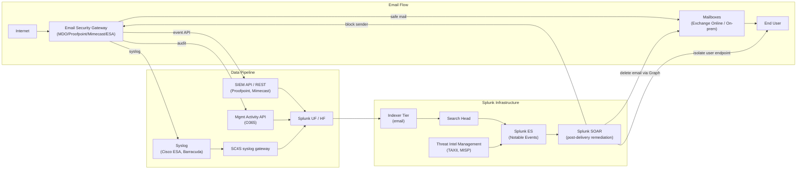

# Email Security Gateways (Proofpoint, Mimecast, M365 Defender, Cisco ESA, Barracuda) Integration Guide

> The definitive guide to integrating email security platforms with
> Splunk. **150 use cases** covering Proofpoint Email Protection / TAP,
> Mimecast Email Security, Microsoft Defender for Office 365 / EOP,
> Cisco Secure Email (ESA / IronPort), Barracuda ESG / Cloud, Trend
> Micro Email Security, Symantec Messaging Gateway, and Abnormal
> Security. Phishing detection, business email compromise (BEC),
> malicious attachment / URL tracking, DMARC compliance, DKIM
> validation, sender spoofing analysis, post-delivery containment via
> SOAR, and the full email-attack chain reconstruction with EDR + AD.

---

## Table of Contents

- [Quick Start](#quick-start)
- [Overview](#overview)
- [Architecture and Data Flow](#architecture)
- [Prerequisites](#prerequisites)
- [Platform Coverage Matrix](#platform-matrix)
- [Microsoft Defender for Office 365 + EOP](#mdo)
- [Proofpoint Email Protection + TAP](#proofpoint)
- [Mimecast Email Security](#mimecast)
- [Cisco Secure Email (ESA / IronPort)](#cisco-esa)
- [Barracuda Email Security Gateway / Cloud](#barracuda)
- [Other vendors (Trend Micro, Symantec, Abnormal)](#other-vendors)
- [DMARC / DKIM / SPF Monitoring](#dmarc-dkim-spf)
- [Field Dictionary (Cross-Vendor)](#field-dictionary)
- [Sample Events](#sample-events)
- [Splunk-Side Configuration](#splunk-config)
- [Cross-Product Correlation (Email + EDR + AD)](#cross-product)
- [CIM Mapping Reference](#cim-mapping)
- [Splunk ES Notable Event Pipeline](#es-notable)
- [Compliance Mapping](#compliance)
- [Capacity Planning and Sizing](#sizing)
- [Recommended Dashboard Layouts](#dashboards)
- [ITSI Service Modeling](#itsi)
- [SOAR Playbook Examples (Post-Delivery Remediation)](#soar)
- [Multi-Tenant / MSSP Strategy](#multi-tenant)
- [Security Hardening](#security-hardening)
- [Crawl / Walk / Run Roadmap](#roadmap)
- [Validation Checklist](#validation-checklist)
- [Known Limitations and Gaps](#known-limitations)
- [Troubleshooting](#troubleshooting)
- [FAQ](#faq)
- [Glossary](#glossary)
- [References](#references)
- [Contribution and Feedback](#contribution)

---

<a id="quick-start"></a>
## Quick Start — 60 Minutes to First Email Security Insight

> Pick the section for your email gateway. **All gateways share the
> same end-state**: events flow into the `email` index, normalize via
> Email CIM, ready for ES correlation, BEC detection, post-delivery
> containment via SOAR, and integration with the AD identity attack
> chain.

### Microsoft Defender for Office 365 (M365 customers)

1. Install [Splunk Add-on for Microsoft Office 365 (Splunkbase 4055)](https://splunkbase.splunk.com/app/4055).
2. In Azure → App Registrations → create app with `ActivityFeed.Read`, `ActivityFeed.ReadDlp`, `ServiceHealth.Read`, `ThreatHunting.Read.All` scopes.
3. Configure Splunk inputs:
    - Tenant ID + App ID + Client Secret
    - Content type: Audit.AzureActiveDirectory, Audit.SharePoint, Audit.Exchange, DLP.All
4. Validate: `index=email sourcetype="ms:o365:management:activity" RecordType IN (28,29,42) earliest=-15m | stats count`

### Proofpoint TAP

1. Install [Splunk Add-on for Proofpoint TAP (Splunkbase 3393)](https://splunkbase.splunk.com/app/3393).
2. In Proofpoint admin → Settings → Connected Applications → create SIEM API service principal.
3. Configure Splunk with TAP API key + secret.
4. Validate: `index=email sourcetype="proofpoint:tap" earliest=-15m | stats count by classification`

### Cisco Secure Email (ESA / IronPort)

1. ESA mail_logs and other text logs via syslog → SC4S
2. ESA API for reporting + tracking: 
    - GUI: System Administration → Cluster → Communication → API Settings
    - Enable HTTP/HTTPS API access
3. Validate: `index=email sourcetype="cisco:esa:textmail" earliest=-15m | stats count by status`

### Activate crawl tier

UC-10.4.1 (Phishing Trend), UC-10.4.2 (Malicious Attachment Tracking), UC-10.4.x (Sender Spoofing Detection), UC-10.4.x (DMARC Failure Trending).

---

<a id="overview"></a>
## Overview

### Why email security matters

Email is the **#1 attack vector** — Verizon DBIR consistently shows ~80% of breaches start with phishing or BEC. Email security gateways:
- Block obvious spam/malware pre-delivery
- Sandbox suspicious attachments (TAP, Mimecast TTP, MDO Safe Attachments)
- Rewrite / scan URLs at click-time (TAP URL Defense, Mimecast URL Protect)
- Detect impersonation / BEC attempts
- Enforce DMARC / DKIM / SPF
- Provide post-delivery threat detection (TAP, MDO ZAP)

### What this guide covers

| Platform | Strength |
|---------|---------|
| **MDO + EOP** | Native to M365; ZAP post-delivery cleanup; integrates with Defender for Endpoint |
| **Proofpoint** | Best-in-class TAP sandbox + URL Defense + impostor detection |
| **Mimecast** | Strong TTP attachment + URL + impersonation; broad geographic coverage |
| **Cisco ESA / IronPort** | Long-established SEG; on-prem or cloud |
| **Barracuda ESG** | Mid-market favorite; integrated DLP |
| **Trend Micro** | InterScan for SMB |
| **Symantec MG** | Legacy enterprise |
| **Abnormal Security** | API-based behavioral; complementary to existing SEG |

### Domains covered

| Domain | Examples |
|--------|---------|
| **Phishing detection** | Sender spoofing, suspicious URLs, content analysis |
| **Malicious attachments** | Sandbox verdicts, file type tracking |
| **Business Email Compromise (BEC)** | Impersonation detection, OOB invoice fraud |
| **DMARC / DKIM / SPF** | Failure trending, alignment monitoring |
| **Mail flow health** | Queue depth, delivery latency, NDR rates |
| **Post-delivery threats** | URL hover, click-time analysis |
| **User-reported phishing** | Report button → SOAR triage |
| **Compliance** | PCI awareness, HIPAA email PHI |

### What's NOT in scope

| Domain | Where to look |
|--------|---------------|
| **Mailbox audit / inbox rules** | [Email & Collaboration Guide](email-collaboration.md) |
| **AD account compromise** | [AD/Entra ID Guide](active-directory-entra-id.md) |
| **Endpoint malware execution** | [EDR Guide](edr.md) |
| **Web proxy URL filtering** | [Web Security Guide](web-security.md) |

### What good looks like

| Dimension | Without integration | With full integration |
|-----------|---------------------|-----------------------|
| Phishing visibility | Only at gateway | Pre + post-delivery |
| BEC detection | Hard | Sender-anomaly + content analysis |
| Auto-remediation | Manual deletion | SOAR + ZAP / API |
| User-reported phishing | Email to security@ | Auto-triage via SOAR |
| Cross-channel correlation | None | Email → AD → EDR chain |
| Compliance reports | Manual | Automated |

---

<a id="architecture"></a>
## Architecture and Data Flow



### Core principles

- **All email events → centralised** for cross-vendor visibility
- **API-first ingestion** wherever possible (more reliable than syslog)
- **CIM Email** mapping is the unifier
- **Post-delivery remediation** via SOAR + Graph API or vendor API

---

<a id="prerequisites"></a>
## Prerequisites

| Item | Detail |
|------|--------|
| **Splunk version** | 9.0+ Enterprise / Cloud |
| **Splunk ES** | 7.x+ recommended |
| **CIM 6.x** | Email model required |
| **API credentials** | Per vendor (Proofpoint TAP key, Mimecast key, MDO app reg) |
| **Network access** | Splunk → vendor API endpoints |

---

<a id="platform-matrix"></a>
## Platform Coverage Matrix

| Platform | TA | Splunkbase | Sourcetypes |
|---------|----|-----------|-------------|
| **MDO + EOP** | Splunk Add-on for Microsoft Office 365 | [4055](https://splunkbase.splunk.com/app/4055) | `ms:o365:management:activity`, `ms:o365:messageTrace` |
| **MDO Advanced Hunting** | Microsoft 365 Defender Add-on | [6207](https://splunkbase.splunk.com/app/6207) | `mde:advancedhunting`, `mdo:alert` |
| **Proofpoint TAP** | Splunk Add-on for Proofpoint TAP | [3393](https://splunkbase.splunk.com/app/3393) | `proofpoint:tap`, `proofpoint:url`, `proofpoint:attachment` |
| **Proofpoint SIEM API** | Splunk Add-on for Proofpoint TAP | (same) | `proofpoint:siem` |
| **Mimecast** | Splunk Add-on for Mimecast | [3852](https://splunkbase.splunk.com/app/3852) | `mimecast:siem`, `mimecast:audit`, `mimecast:ttp:url`, `mimecast:ttp:attachment` |
| **Cisco ESA / IronPort** | Splunk Add-on for Cisco ESA | [2919](https://splunkbase.splunk.com/app/2919) | `cisco:esa:textmail`, `cisco:esa:status`, `cisco:esa:authentication` |
| **Barracuda ESG** | (custom syslog via SC4S) | n/a | `barracuda:esg` |
| **Trend Micro** | (custom syslog via SC4S) | n/a | `trendmicro:email` |
| **Symantec MG** | (custom syslog via SC4S) | n/a | `symantec:msg:gateway` |
| **Abnormal** | (custom REST input) | n/a | `abnormal:detection` |

---

<a id="mdo"></a>
## Microsoft Defender for Office 365 + EOP

### Configuration

```
Azure Portal → App Registrations → New registration:
  Name: Splunk-O365-Reader
  Supported account types: This org only
  Redirect URI: (leave blank)
  Client secret: generate, save
  API permissions:
    Office 365 Management APIs > 
      ActivityFeed.Read (Application)
      ActivityFeed.ReadDlp (Application)
      ServiceHealth.Read (Application)
    Microsoft Graph >
      ThreatIndicators.ReadWrite.OwnedBy (Application)
      SecurityEvents.Read.All (Application)
  Grant admin consent
```

### Splunk TA configuration

```
Splunk Web → Splunk Add-on for Microsoft Office 365 → Configuration:
  Tenant ID, Client ID, Client Secret
  Content types: 
    - Audit.AzureActiveDirectory
    - Audit.Exchange
    - Audit.SharePoint
    - DLP.All
```

### Sample event (O365 Message Trace)

```json
{
    "Received": "2026-04-25T14:30:15.000Z",
    "SenderAddress": "phishing@evil.example.com",
    "RecipientAddress": "victim@yourcorp.com",
    "Subject": "Urgent: Account Verification Required",
    "Status": "FilteredAsSpam",
    "FromIP": "203.0.113.45",
    "ToIP": null,
    "MessageTraceId": "abc123-def456-...",
    "MessageId": "<abc123@evil.example.com>",
    "Size": 12345,
    "Disposition": "Quarantine"
}
```

### Sample event (MDO Alert)

```json
{
    "Id": "abc-123",
    "Title": "Email messages containing malicious file removed after delivery",
    "Severity": "High",
    "Category": "Phish",
    "DetectedTime": "2026-04-25T14:30:15.000Z",
    "Status": "Active",
    "Recipients": ["victim@yourcorp.com"],
    "Attackers": ["attacker@evil.example.com"],
    "ImpactedEntities": [
        {"type": "User", "name": "victim@yourcorp.com"},
        {"type": "Mailbox", "name": "victim@yourcorp.com"}
    ],
    "Investigation": {
        "id": "inv-789",
        "status": "Auto-remediated"
    }
}
```

---

<a id="proofpoint"></a>
## Proofpoint Email Protection + TAP

### Configuration

```
TAP UI → Settings → Connected Applications → Add SIEM Service Principal:
  Name: Splunk
  Generate Service Principal + Secret
  Save credentials securely
```

### Splunk TA configuration

```
Splunk Web → Splunk Add-on for Proofpoint TAP:
  Service Principal + Secret
  Inputs: 
    - clicks/blocked
    - clicks/permitted
    - messages/blocked
    - messages/delivered
    - issues
```

### Sample event (Proofpoint TAP — Click)

```json
{
    "GUID": "abc-123",
    "id": 12345,
    "messageID": "<msg-id@example.com>",
    "recipient": "victim@yourcorp.com",
    "sender": "spear@spoofed.example.com",
    "senderIP": "203.0.113.45",
    "url": "http://phishing.example.com/login",
    "clickIP": "10.10.10.10",
    "clickTime": "2026-04-25T14:30:15.000Z",
    "userAgent": "Mozilla/5.0 ...",
    "campaignId": "campaign-789",
    "threatID": "threat-456",
    "classification": "Phishing",
    "threatStatus": "active",
    "threatTime": "2026-04-25T14:30:00.000Z",
    "threatType": "url",
    "threatUrl": "http://phishing.example.com/login"
}
```

---

<a id="mimecast"></a>
## Mimecast Email Security

### API setup

```
Mimecast Admin Console → Services → Applications → Mimecast API Application:
  Generate Key + Secret + Token
```

### Sample event (Mimecast TTP URL)

```json
{
    "id": "abc-123",
    "key": "TTP_URL_PROTECT",
    "datetime": "2026-04-25T14:30:15.000Z",
    "category": "Malicious",
    "url": "http://phishing.example.com/login",
    "userEmail": "victim@yourcorp.com",
    "result": "BLOCKED",
    "ttpDefinition": "Phishing",
    "scanResult": "MALICIOUS"
}
```

---

<a id="cisco-esa"></a>
## Cisco Secure Email (ESA / IronPort)

### Configuration

```cli
# On ESA
logconfig
# Add new log subscription
mailtrace
> Forward to syslog server <sc4s-vip>
> Format: text
```

### Sample event (mail_logs)

```
Mon Apr 25 14:30:15 2026 Info: New SMTP DCID 12345 interface 192.168.1.10 address 203.0.113.45 reverse_dns_host (none) verified no
Mon Apr 25 14:30:15 2026 Info: DCID 12345 STARTTLS
Mon Apr 25 14:30:16 2026 Info: ICID 67890 ACCEPT SG SUSPECTLIST match sbrs[-2.0:1.0] SBRS -1.5
Mon Apr 25 14:30:16 2026 Info: MID 999 ICID 67890 From: <phishing@evil.example.com>
Mon Apr 25 14:30:16 2026 Info: MID 999 ICID 67890 RID 0 To: <victim@yourcorp.com>
Mon Apr 25 14:30:16 2026 Info: MID 999 Subject "Urgent: Account Verification Required"
Mon Apr 25 14:30:16 2026 Info: MID 999 SDR: Domain: evil.example.com, Reputation: Suspicious, Risk: 80
```

---

<a id="barracuda"></a>
## Barracuda Email Security Gateway / Cloud

### Configuration

```
Barracuda Admin → Logs → Syslog:
  Server: <sc4s-vip>
  Port: 514
  Protocol: UDP
  Format: BSD
  Facility: local6
```

---

<a id="other-vendors"></a>
## Other vendors (Trend Micro, Symantec, Abnormal)

- **Trend Micro IMSVA**: Syslog forwarding to SC4S; sourcetype `trendmicro:email`
- **Symantec MG**: Syslog forwarding; sourcetype `symantec:msg:gateway`
- **Abnormal Security**: REST API → custom polling input; sourcetype `abnormal:detection`

---

<a id="dmarc-dkim-spf"></a>
## DMARC / DKIM / SPF Monitoring

### DMARC aggregate reports

DMARC reports are RUA XML reports sent daily by receivers (Gmail, Yahoo, etc.).

```
DNS configuration:
  _dmarc.yourcorp.com TXT "v=DMARC1; p=quarantine; rua=mailto:dmarc-reports@yourcorp.com"
```

### Splunk ingestion

Use a custom modular input or processing script to:
1. Parse RUA XML
2. Extract per-source SPF / DKIM result
3. Forward to Splunk as JSON

### SPL — DMARC Pass Rate

```spl
index=email sourcetype="dmarc:report" earliest=-7d
| stats count(eval(spf_result="pass")) as spf_pass, 
        count(eval(dkim_result="pass")) as dkim_pass,
        count as total by source_ip
| eval spf_rate = round(spf_pass/total*100, 2),
       dkim_rate = round(dkim_pass/total*100, 2)
| where total > 100
| sort -total
```

### Spoofing detection

```spl
index=email earliest=-1h
| eval domain_match = if(match(SenderAddress, "@yourcorp\\.com$"), 1, 0)
| eval spf_failed = if(spf_result="fail", 1, 0)
| where domain_match=1 AND spf_failed=1
| stats count by SenderAddress, RecipientAddress, FromIP
```

---

<a id="field-dictionary"></a>
## Field Dictionary (Cross-Vendor)

After CIM Email mapping:

| Field | MDO | Proofpoint | Mimecast | Cisco ESA |
|-------|-----|-----------|----------|-----------|
| `src_user` | SenderAddress | sender | senderAddress | mail_from |
| `recipient` | RecipientAddress | recipient | recipientAddress | rcpt_to |
| `subject` | Subject | subject | subject | subject |
| `signature` | (Threat Intel ID) | threatID | id | threat_name |
| `action` | Status (filtered/quarantined) | classification | result | acl_result |
| `file_name` | (attachment name) | attachment.name | attachmentName | file_name |
| `file_hash` | (sha256) | attachment.sha256 | sha256 | sha256 |
| `url` | (rewritten URL) | url | url | url |
| `category` | Phish/Malware/Spam | classification | category | category |

---

<a id="sample-events"></a>
## Sample Events

(See per-platform sections.)

---

<a id="splunk-config"></a>
## Splunk-Side Configuration

### Index strategy

```ini
[email]
homePath = $SPLUNK_DB/email/db
maxDataSize = auto_high_volume
frozenTimePeriodInSecs = 31536000   # 1 year (HIPAA / SOX)
```

### CIM data model acceleration

```ini
[Email]
acceleration = 1
acceleration.earliest_time = -7d
```

---

<a id="cross-product"></a>
## Cross-Product Correlation

### Email → AD → EDR attack chain

```spl
(index=email signature="*phish*" recipient="*@yourcorp.com" earliest=-24h)
| rename recipient as user
| join user [search index=ad EventCode=4625 earliest=-24h | stats count as failed_logons by user]
| join user [search index=edr DetectName="*credential*" earliest=-24h | stats count as edr_alerts by user]
| where failed_logons > 5 OR edr_alerts > 0
```

### Click-time analysis (Proofpoint URL Defense)

```spl
index=email sourcetype="proofpoint:url" earliest=-1h
| eval delivery_to_click_minutes = (clickTime - threatTime) / 60
| stats count avg(delivery_to_click_minutes) as avg_click_min by recipient
| where count > 0
```

---

<a id="cim-mapping"></a>
## CIM Mapping Reference

| CIM model | Sourcetype |
|-----------|-----------|
| **Email.All_Email** | All email-gateway events |
| **Alerts.Alerts** | MDO alerts, Proofpoint TAP, Mimecast TTP |
| **Authentication** | (when email triggers auth events) |

---

<a id="es-notable"></a>
## Splunk ES Notable Event Pipeline

ES + ESCU ship correlation searches for:
- "Email - High Volume Phishing"
- "Email - Suspicious Sender Domain"
- "Email - Post-Delivery Threat (ZAP)"
- "Email - DMARC Failure Spike"
- "Email - Internal Sender Compromise"

Enable selectively, RBA-mode for entity aggregation.

---

<a id="compliance"></a>
## Compliance Mapping

### NIST 800-53

| Control | Coverage |
|---------|----------|
| **SI-3** Malware Protection | All email-AV UCs |
| **SI-7(8)** Spam Protection | All anti-spam UCs |
| **AT-2(3)** Security awareness | Phishing training program tracking |

### HIPAA

| Standard | Coverage |
|----------|---------|
| §164.308(a)(1)(ii)(D) | Security incident management — phishing as incident class |
| §164.312(e)(1) | Transmission security — DKIM / SPF / TLS for email |

### PCI-DSS 4.0

| Requirement | Coverage |
|-------------|----------|
| **5.x** | Anti-malware coverage in email |
| **12.x** Security awareness | Phishing training trends |

---

<a id="sizing"></a>
## Capacity Planning and Sizing

| Tenant size (mailbox count) | Daily email events |
|---------------------------|---------------------|
| < 1k | ~50 MB |
| 1k - 10k | ~500 MB |
| 10k - 50k | ~3 GB |
| 50k - 250k | ~15 GB |
| 250k+ | ~50+ GB |

---

<a id="dashboards"></a>
## Recommended Dashboard Layouts

### Crawl

```
+---------------------+---------------------+
| EMAILS BLOCKED LAST 24H — TREND            |
+---------------------+---------------------+
| TOP-10 SENDERS BLOCKED                     |
+---------------------+---------------------+
| MALICIOUS ATTACHMENT TYPES                 |
+---------------------+---------------------+
```

### Walk

```
+---------------------+---------------------+
| BEC INDICATORS                             |
+---------------------+---------------------+
| DMARC PASS RATE PER SOURCE                 |
+---------------------+---------------------+
| URL DEFENSE — POST-DELIVERY CLICKS         |
+---------------------+---------------------+
```

### Run

```
+---------------------+---------------------+
| MEAN TIME TO REMEDIATE (post-delivery)     |
+---------------------+---------------------+
| AUTO-REMEDIATION SUCCESS                   |
+---------------------+---------------------+
| EMAIL → AD COMPROMISE CHAIN                |
+---------------------+---------------------+
```

---

<a id="itsi"></a>
## ITSI Service Modeling

### Service hierarchy

```
Email Security Posture
├── Per-Vendor Health
│   ├── MDO / EOP
│   ├── Proofpoint
│   ├── Mimecast
│   └── Cisco ESA
├── Detection Pipeline
│   ├── Phishing detection rate
│   ├── BEC detection rate
│   └── Sandbox verdict success rate
└── Response Pipeline
    ├── Mean time to ZAP
    ├── User-reported phishing triage time
    └── Auto-remediation success
```

---

<a id="soar"></a>
## SOAR Playbook Examples

### Playbook 1: User-Reported Phishing → Auto-Triage

**Trigger:** User clicks "Report Phishing" in Outlook → email sent to phishing@yourcorp.com.

```
1. INGEST forwarded email → SOAR case
2. EXTRACT URLs, attachments, headers
3. SCAN URLs (Proofpoint URL Defense, urlscan.io, VirusTotal)
4. SCAN attachments (TAP, MDO, VT)
5. IF malicious → AUTO-DELETE same email from all mailboxes (Graph API hard delete)
6. NOTIFY user reporter with verdict
7. CREATE TI record if confirmed phishing
```

### Playbook 2: Post-Delivery Threat → Mass Remediation

**Trigger:** MDO/TAP detects post-delivery threat.

```
1. RECEIVE post-delivery alert
2. QUERY Graph API for all recipients of the message
3. AUTO-DELETE message from all impacted mailboxes
4. RESET password for any clicker
5. CREATE Sev-2 case
6. NOTIFY SOC
```

---

<a id="multi-tenant"></a>
## Multi-Tenant / MSSP Strategy

- Per-tenant API credentials in Splunk app
- Per-tenant indexes: `email_tenant1`, `email_tenant2`
- Per-tenant DMARC reports if RUA per tenant
- Tenant-specific dashboards via macros

---

<a id="security-hardening"></a>
## Security Hardening

- API keys / app secrets in vault, rotated 90-day
- Field-level RBAC for email body content (PII concern)
- TLS for all API calls
- Audit immutable: forward all sourcetype `*:email:*` to write-once index
- Distinguish blocked vs delivered emails for forensic searches
- Encrypt email indexes at rest

---

<a id="roadmap"></a>
## Crawl / Walk / Run Roadmap

### Crawl (Week 1-4)

1. Onboard primary email gateway
2. CIM Email acceleration
3. Crawl-tier dashboards
4. UC-10.4.1 (Phishing trending), UC-10.4.2 (Attachments)

### Walk (Month 2-3)

1. Onboard remaining vendors
2. DMARC RUA report ingestion
3. ES correlation enabled
4. SOAR playbook for user-reported phishing

### Run (Month 4+)

1. Full SOAR auto-remediation
2. Email → AD → EDR cross-attack-chain
3. BEC behavioral detection
4. Quarterly phishing program metrics
5. Threat intel feed for email IOCs

---

<a id="validation-checklist"></a>
## Validation Checklist

### Day 1

- [ ] First email gateway sending events
- [ ] First event in Splunk

### Day 7

- [ ] All gateways onboarded
- [ ] CIM acceleration enabled
- [ ] First phishing trend dashboard live

### Day 30

- [ ] Walk-tier UCs deployed
- [ ] ES correlation enabled
- [ ] SOAR playbook live

### Day 90

- [ ] Run-tier UCs deployed
- [ ] Cross-product correlation operational
- [ ] Quarterly metrics reports

---

<a id="known-limitations"></a>
## Known Limitations and Gaps

| Limitation | Impact | Workaround |
|------------|--------|------------|
| **Encrypted email content** | Limited URL/attachment visibility | Rely on metadata + pre-encryption gateway |
| **Per-vendor API quotas** | Throttling on busy days | Stagger polling intervals |
| **DMARC ingestion is manual** | XML parsing not in TA | Use community parser script |
| **MDO Defender Pro tier required for some events** | Add-on cost | Plan licensing |
| **Pre-delivery vs post-delivery field semantics differ** | Confusion in reports | Document clear field-by-stage glossary |

---

<a id="troubleshooting"></a>
## Troubleshooting

### MDO events not arriving

- Verify app registration permissions granted
- Check tenant ID + client ID + secret
- Look at TA modular input log: `index=_internal source=*o365_management*`

### Proofpoint TAP API 401

- Service Principal credentials expired or wrong
- Re-generate in TAP UI

### Mimecast API rate limit

- Reduce polling frequency
- Use date-range filtering on requests

### Cisco ESA mail_logs not parsing

- Ensure mail_logs format is "text" not "binary"
- Verify SC4S vendor pack version

### DMARC reports missing for some sources

- Verify DNS RUA address correct
- Some senders don't send aggregate reports

---

<a id="faq"></a>
## FAQ

**Q: Do I need both Proofpoint and MDO?**
A: Many enterprises run defense-in-depth (Proofpoint at perimeter, MDO at mailbox layer). Smaller orgs typically pick one.

**Q: What's the difference between TAP and URL Defense?**
A: Proofpoint TAP is the broader sandbox/threat platform. URL Defense is the click-time URL rewriting + scanning module within TAP.

**Q: How is Abnormal Security different from traditional SEGs?**
A: Abnormal is API-based (no inline gateway), uses behavioral ML. Best as a **complement** to MDO/Proofpoint, not a replacement.

**Q: Can I auto-delete emails from mailboxes?**
A: Yes:
- O365 / MDO: Graph API `messages/{id}/delete` (hard delete) or ZAP
- Exchange on-prem: PowerShell `Search-Mailbox -DeleteContent`
- Gmail: Workspace Admin API

**Q: How do I detect BEC?**
A: Combination of:
1. Sender domain spoof detection (DMARC fail from spoofed exec)
2. Behavioral anomaly (executive sending unusual request)
3. Lookalike domain detection (domain similarity score)
4. Wire-fraud language detection (NLP on subject/body)

**Q: How do I measure phishing program success?**
A: Key metrics: phishing-test click rate, user-report rate, mean time to detect post-delivery, % of emails containing user-reported indicators that match real attacks.

---

<a id="glossary"></a>
## Glossary

| Term | Definition |
|------|-----------|
| **SEG** | Secure Email Gateway |
| **MDO** | Microsoft Defender for Office 365 |
| **EOP** | Exchange Online Protection (subset of MDO) |
| **TAP** | Targeted Attack Protection (Proofpoint) |
| **TTP** | Targeted Threat Protection (Mimecast) — different from MITRE TTP |
| **ESA** | Email Security Appliance (Cisco — formerly IronPort) |
| **BEC** | Business Email Compromise |
| **DMARC** | Domain-based Message Authentication, Reporting & Conformance |
| **DKIM** | DomainKeys Identified Mail |
| **SPF** | Sender Policy Framework |
| **ZAP** | Zero-Hour Auto Purge (MDO post-delivery cleanup) |
| **URL Defense** | Proofpoint click-time URL scanning |
| **Safe Attachments** | MDO sandbox for attachments |
| **Safe Links** | MDO click-time URL scanning |

---

<a id="references"></a>
## References

- [Splunk Add-on for Microsoft Office 365 (Splunkbase 4055)](https://splunkbase.splunk.com/app/4055)
- [Splunk Add-on for Proofpoint TAP (Splunkbase 3393)](https://splunkbase.splunk.com/app/3393)
- [Splunk Add-on for Cisco ESA (Splunkbase 2919)](https://splunkbase.splunk.com/app/2919)
- [Splunk Add-on for Mimecast (Splunkbase 3852)](https://splunkbase.splunk.com/app/3852)
- [Microsoft 365 Defender Add-on (Splunkbase 6207)](https://splunkbase.splunk.com/app/6207)
- [CIM: Email](https://docs.splunk.com/Documentation/CIM/latest/User/Email)
- [DMARC.org](https://dmarc.org/)
- [Proofpoint TAP API documentation](https://help.proofpoint.com/Threat_Insight_Dashboard/API_Documentation)
- [Mimecast API documentation](https://integrations.mimecast.com/documentation/)

---

<a id="contribution"></a>
## Contribution and Feedback

Part of the [Splunk Monitoring Use Cases](https://github.com/fenre/splunk-monitoring-use-cases) project. [Open an issue](https://github.com/fenre/splunk-monitoring-use-cases/issues/new).

---

*Last updated: 2026-05-09. Covers MDO/EOP current, Proofpoint TAP API v2, Mimecast API current, Cisco ESA AsyncOS 15.x.*
