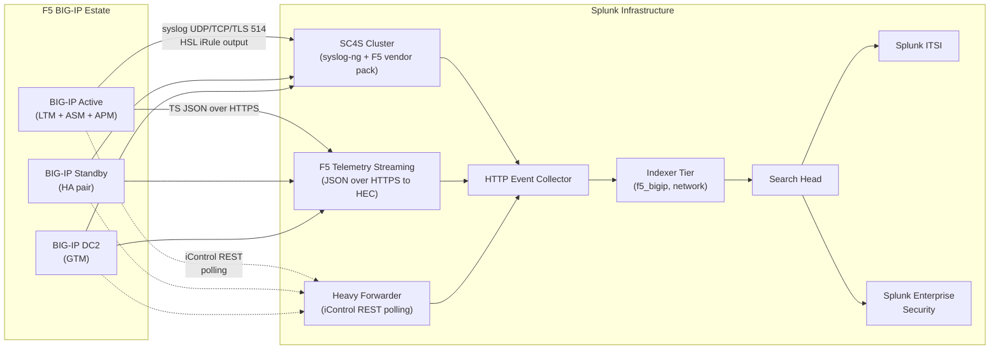

# F5 BIG-IP & Load Balancers Integration Guide

> The definitive guide to monitoring application delivery controllers
> with Splunk. 42 use cases covering F5 BIG-IP<sup class="ref">[<a href="#ref-1">1</a>]</sup> (LTM, ASM/AWAF, APM,
> DNS/GTM, AFM), Citrix NetScaler/ADC, and open-source load balancers
> (HAProxy, NGINX Plus). Pool-member health, virtual server availability,
> SSL/TLS visibility, WAF detections, identity-based access (APM),
> and capacity trending.

---

## Table of Contents

- [Quick Start](#quick-start)
- [Overview](#overview)
- [Architecture and Data Flow](#architecture)
- [Prerequisites](#prerequisites)
- [F5 Module Coverage](#f5-modules)
- [Data Sources Reference](#data-sources)
- [Field Dictionary](#field-dictionary)
- [Sample Events](#sample-events)
- [Device-Side Configuration](#device-config)
- [F5 Telemetry Streaming (Recommended)](#telemetry-streaming)
- [iControl REST Polling](#icontrol-rest)
- [Splunk-Side Configuration](#splunk-config)
- [iRules Logging Patterns](#irules)
- [Citrix NetScaler / ADC](#netscaler)
- [HAProxy & NGINX Plus](#haproxy-nginx)
- [SC4S Pipeline](#sc4s)
- [Cross-Product Correlation](#cross-product)
- [CIM Mapping Reference](#cim-mapping)
- [Compliance Mapping](#compliance)
- [Capacity Planning and Sizing](#sizing)
- [Recommended Dashboard Layouts](#dashboards)
- [ITSI Service Modeling](#itsi)
- [SOAR Playbook Examples](#soar)
- [Multi-Site Strategy](#multi-site)
- [Security Hardening](#security-hardening)
- [Crawl / Walk / Run Roadmap](#roadmap)
- [Validation Checklist](#validation-checklist)
- [Known Limitations and Gaps](#known-limitations)
- [Troubleshooting](#troubleshooting)
- [FAQ](#faq)
- [Glossary](#glossary)
- [References](#references)
- [Contribution and Feedback](#contribution)

---

<a id="quick-start"></a>
## Quick Start — 30 Minutes to First Telemetry

1. **Install Splunk Add-on for F5 BIG-IP** ([Splunkbase 2680](https://splunkbase.splunk.com/app/2680)) on indexers + SH.

2. **Create indexes** (`network` for small estates, `f5_bigip` for dedicated):

    ```ini
    [f5_bigip]
    homePath = $SPLUNK_DB/f5_bigip/db
    coldPath = $SPLUNK_DB/f5_bigip/colddb
    thawedPath = $SPLUNK_DB/f5_bigip/thaweddb
    maxDataSize = auto_high_volume
    frozenTimePeriodInSecs = 7776000
    ```

3. **F5-side syslog config** (TMSH):

    ```bash
    tmsh create sys syslog remote-servers add { sc4s-primary { host <sc4s-vip> remote-port 514 } }
    tmsh modify sys syslog include "destination remote_d { syslog(\"<sc4s-vip>\" port(514) transport(\"udp\")); };"
    tmsh save sys config
    ```

4. **Ingest** via SC4S (recommended) or HF UDP/TCP 514 input — events arrive as `f5:bigip:syslog` and split into module-specific sourcetypes (`f5:bigip:ltm`, `:asm`, `:apm`, etc.) by SC4S vendor pack.

5. **Validate**:

    ```spl
    index=f5_bigip earliest=-15m
    | stats count by sourcetype, host
    ```

6. **Activate crawl tier** — UC-5.3.2 (VIP availability), UC-5.3.3 (interface throughput), UC-5.3.9 (connection saturation).

---

<a id="overview"></a>
## Overview

### What this guide covers

| Domain | F5 module | Coverage |
|--------|-----------|----------|
| **L4/L7 load balancing** | LTM | Virtual server / pool / member health, connection counts, throughput |
| **Web app firewall** | ASM / AWAF | Attack signatures, violations, learning suggestions |
| **Identity & access** | APM | SSO sessions, policy outcomes, MFA, ACL hits |
| **Authoritative DNS / GSLB** | DNS / GTM | Wide IP availability, query patterns, health monitor results |
| **Network firewall** | AFM | DDoS protection, network rules, logging profiles |
| **Hardware health** | TMSH / SNMP | PSU, fan, temperature, dataplane CPU |
| **Custom logic** | iRules | iRule HSL log parsing |
| **Telemetry** | iControl REST + TS | High-frequency metrics |

### Multi-vendor extension

Citrix NetScaler/ADC and HAProxy share much of the same conceptual surface (VIP/server/pool, health monitors, SSL, etc.). See dedicated sections below.

### What's NOT in scope

| Domain | Where to look |
|--------|---------------|
| **Web servers behind LB** | [Web Servers Guide](web-servers.md) |
| **Cloud-native LBs (ALB, NLB, App Gateway)** | [AWS Guide](aws.md), [Azure Guide](azure.md) |
| **Service mesh sidecars (Istio, Linkerd)** | [Kubernetes Guide](kubernetes.md) |

### What good looks like

| Dimension | Without integration | With full deployment |
|-----------|---------------------|----------------------|
| Pool member down | Reactive (user complaint) | Real-time alert + auto-fail-over evidence |
| SSL cert expiry | Quarterly review | 30/14/7-day countdown alerts |
| WAF tuning | Unstructured | Per-signature trend analysis |
| Capacity | Console refresh | Predictive scaling suggestions |
| APM session anomaly | Rare detection | UEBA-style behavioural alerting |

---

<a id="architecture"></a>
## Architecture and Data Flow



**Three data planes:**

1. **Syslog (event-driven)** — system events, ASM violations, iRule HSL output, APM auth events. Always-on.
2. **F5 Telemetry Streaming (push-driven, structured JSON)** — high-frequency metrics, virtual server stats, pool member health. Modern, recommended.
3. **iControl REST polling** — full inventory, configuration, and on-demand metric pulls. Use sparingly; can stress the management plane.

Production deployments run all three; small estates may run syslog + iControl only.

---

<a id="prerequisites"></a>
## Prerequisites

### Splunk requirements

| Item | Detail |
|------|--------|
| **Splunk version** | Splunk Enterprise 9.0+ or Splunk Cloud (Classic / Victoria) |
| **Splunkbase add-on** | Splunk_TA_f5-bigip ≥ 4.0.0 (Splunkbase 2680) |
| **CIM Add-on** | For Web, Authentication, Network_Traffic data models |
| **HEC** | For TS, SC4S, iControl scripts |
| **F5 App for Splunk** | Optional dashboards (Splunkbase 2682) |

### F5 requirements

| Item | Detail |
|------|--------|
| **TMOS version** | 12.x+ for syslog; 13.x+ for full Telemetry Streaming; 14.x+ for current best practice |
| **TS package** | `f5-telemetry-streaming` AS3 extension installed on each BIG-IP for TS path |
| **Service account** | iControl REST account with `auditor` role for read-only polling |
| **NTP** | Required for accurate event timestamps |

### Network requirements

| Item | Detail |
|------|--------|
| Syslog UDP/TCP 514 | F5 → SC4S/HF |
| HTTPS 443 | F5 TS → HEC (TLS) |
| HTTPS 443 | Splunk → F5 iControl REST |

---

<a id="f5-modules"></a>
## F5 Module Coverage

| Module | Provisioned for | Sourcetypes | Key UCs |
|--------|----------------|-------------|---------|
| **LTM** (Local Traffic Manager) | L4/L7 LB | `f5:bigip:ltm`, `f5:bigip:syslog` | UC-5.3.2 VIP avail, .3 throughput, .9 conn saturation |
| **ASM / AWAF** (App Security Manager / Adv WAF) | WAF | `f5:bigip:asm` | (10.x cluster) WAF detections |
| **APM** (Access Policy Manager) | SSO / VPN / portal | `f5:bigip:apm` | APM session UCs |
| **DNS / GTM** (Global Traffic Manager) | GSLB | `f5:bigip:gtm` | Wide IP / WideIP availability |
| **AFM** (Advanced Firewall Manager) | L3/L4 firewall | `f5:bigip:afm` | Network firewall hits, DDoS |
| **PEM** (Policy Enforcement Manager) | Service-provider | `f5:bigip:pem` | (telco use cases) |
| **iRules HSL output** | Custom logic | `f5:bigip:irule` | Per-app metrics, custom alerting |

### Provisioning check

```bash
tmsh list sys provision
```

Each module must show `level [nominal|minimum|dedicated]` to be active; otherwise its log streams won't generate events.

---

<a id="data-sources"></a>
## Data Sources Reference

### Syslog sourcetypes (after SC4S routing)

| Sourcetype | Source | Used by |
|-----------|--------|---------|
| `f5:bigip:syslog` | TMOS system messages | Hardware, HA, daemon health |
| `f5:bigip:ltm` | LTM-specific events | UC-5.3.2 VIP / pool events |
| `f5:bigip:asm` | ASM/AWAF violations | WAF detections |
| `f5:bigip:apm` | APM session lifecycle | Auth UCs |
| `f5:bigip:gtm` | GTM / DNS events | Wide IP UCs |
| `f5:bigip:afm` | AFM rule hits / DDoS | Network firewall UCs |
| `f5:bigip:irule` | iRule `HSL::send` output | Custom UCs |

### Telemetry Streaming sourcetypes

| Sourcetype | Output | Used by |
|-----------|--------|---------|
| `f5:bigip:ts:metrics` | JSON metric stream | Throughput, conn count, latency |
| `f5:bigip:ts:event` | Application logs (e.g., LTM request log) | Detailed L7 visibility |

### iControl REST polled data

| Sourcetype | Endpoint polled | Used by |
|-----------|----------------|---------|
| `f5:bigip:api` | `/mgmt/tm/ltm/virtual/stats` | UC-5.3.3 VIP throughput |
| `f5:bigip:api` | `/mgmt/tm/ltm/pool/stats` | Pool member health |
| `f5:bigip:api` | `/mgmt/tm/sys/disk` | Disk utilisation |
| `f5:bigip:api` | `/mgmt/tm/sys/memory` | Memory pools |
| `f5:bigip:api` | `/mgmt/tm/sys/cpu` | TMM CPU per dataplane |

### Key SNMP MIBs (legacy / fallback)

| MIB / OID | Use |
|----------|-----|
| `F5-BIGIP-LOCAL-MIB::ltmVsStatusCurrSessions` (1.3.6.1.4.1.3375.2.2.10.13.2.1.2) | Connection sessions |
| `F5-BIGIP-LOCAL-MIB::ltmVirtualServStatClientCurConns` (1.3.6.1.4.1.3375.2.2.10.2.3.1.12) | Concurrent connections |
| `F5-BIGIP-LOCAL-MIB::ltmPoolMbrStatusAvailState` (1.3.6.1.4.1.3375.2.2.5.6.2.1.5) | Pool member availability |
| `F5-BIGIP-SYSTEM-MIB::sysCpuUsageRatio` (1.3.6.1.4.1.3375.2.1.7.5.2.1.5) | CPU per TMM |

---

<a id="field-dictionary"></a>
## Field Dictionary

### Common (all sourcetypes)

| Field | Example | Description |
|-------|---------|-------------|
| `host` | `bigip-ext-01` | F5 device hostname |
| `dvc` | `bigip-ext-01` | Device (CIM) |
| `vendor_product` | `F5 BIG-IP` | CIM normalised |

### LTM events / iControl REST

| Field | Example | Description |
|-------|---------|-------------|
| `virtual_server` | `vs_app1_443` | Virtual server name |
| `pool` | `pool_app1` | Pool name |
| `pool_member` | `10.20.30.40:8080` | Member |
| `clientside_cur_conns` | `1234` | Current client-side conns |
| `serverside_cur_conns` | `1234` | Current server-side conns |
| `clientside_bytes_in` | `123456` | Cumulative client bytes in |
| `clientside_bytes_out` | `654321` | Cumulative client bytes out |
| `clientside_pkts_in` | `1000` | Cumulative client pkts in |
| `clientside_pkts_out` | `1500` | Cumulative client pkts out |
| `tot_requests` | `9876` | HTTP requests (LTM HTTP profile) |
| `cur_compatible_proto` | `tcp` | Protocol on VIP |
| `availability_state` | `available` / `offline` | Operational state |

### ASM / AWAF events

| Field | Example | Description |
|-------|---------|-------------|
| `attack_type` | `SQL Injection` | Category |
| `severity` | `Critical` | Violation severity |
| `policy_name` | `wide-app-policy` | ASM policy name |
| `support_id` | `123456789` | Reference for analyst lookup |
| `signature_id` | `200001834` | Signature triggered |
| `request` | `GET /search?q=' OR 1=1--` | Captured request snippet |
| `src` / `dest` | (CIM) | Source / destination IP |
| `violations` | `HTTP protocol compliance failed,Illegal character in URL` | List of violations |

### APM events

| Field | Example | Description |
|-------|---------|-------------|
| `apm_session_id` | `abc123def456` | Session ID |
| `user` | `john.doe@example.com` | Authenticated user |
| `apm_action` | `granted` / `denied` | Policy outcome |
| `apm_policy` | `corp-vpn` | Access policy name |
| `endpoint_check_result` | `passed` / `failed` | Posture check |
| `auth_method` | `LDAP` / `RADIUS` / `Kerberos` | Auth backend |

### GTM / DNS events

| Field | Example | Description |
|-------|---------|-------------|
| `wide_ip` | `app.example.com` | Wide IP / FQDN |
| `wide_ip_pool` | `pool_app1_us` | GSLB pool |
| `lb_method` | `topology` / `round-robin` | LB method used |
| `record_type` | `A` / `AAAA` | DNS record type |
| `query_response_code` | `NOERROR` / `NXDOMAIN` | DNS response |

### Hardware / system

| Field | Example | Description |
|-------|---------|-------------|
| `cpu_usage_ratio` | `45` | TMM dataplane CPU % |
| `memory_total` | `34359738368` | Total memory bytes |
| `memory_used` | `12345678901` | Used memory bytes |
| `psu_status` | `up` / `down` | Power supply |
| `fan_status` | `up` / `down` | Fan |
| `temperature_c` | `42` | Sensor |

---

<a id="sample-events"></a>
## Sample Events

### Pool member down (LTM via syslog)

```
<134>1 2026-04-25T14:30:00Z bigip-ext-01 - - - -
  : 01070638:5: Pool /Common/pool_app1 member /Common/web01:8080 monitor status down. [ /Common/http: down ] [ was up for 0hr:0min:23sec ]
```

### Virtual server unavailable

```
<131>1 2026-04-25T14:35:12Z bigip-ext-01 - - - -
  : 01010001:0: Virtual /Common/vs_app1_443 is currently unavailable.
```

### ASM violation (full request log format)

```
<134>Apr 25 14:30:00 bigip-ext-01 ASM:
  unit_hostname="bigip-ext-01.example.com",
  management_ip_address="10.10.10.10",
  http_class_name="/Common/wide-app-policy",
  web_application_name="/Common/wide-app-policy",
  policy_name="/Common/wide-app-policy",
  policy_apply_date="2026-04-01 09:00:00",
  violations="HTTP protocol compliance failed,Illegal character in URL",
  support_id="123456789",
  request_status="blocked",
  response_code="0",
  ip_client="203.0.113.5",
  route_domain="0",
  method="GET",
  protocol="HTTPS",
  query_string="q=' OR 1=1--",
  x_forwarded_for_header_value="N/A",
  sig_ids="200001834,200001835",
  attack_type="SQL Injection,Other Application Activity",
  geo_location="US",
  ip_address_intelligence="N/A",
  username="N/A",
  session_id="abc",
  src_port="49234",
  dest_port="443",
  dest_ip="10.0.0.50",
  sub_violations="N/A"
```

### APM session granted

```
<134>1 2026-04-25T14:40:00Z bigip-ext-01 - - - - apmd[12345]:
  01490000:5: /Common/corp-vpn:Common:abc123def456: Session granted to user john.doe@example.com,
  client IP 203.0.113.5
```

---

<a id="device-config"></a>
## Device-Side Configuration

### Minimum baseline (TMSH)

```bash
# NTP
tmsh modify sys ntp servers add { 10.0.0.1 10.0.0.2 }
tmsh modify sys ntp timezone "UTC"

# Syslog destination
tmsh create sys syslog remote-servers add { sc4s-primary { host <sc4s-vip> remote-port 514 } }

# High-speed logging (HSL) pool for iRule output
tmsh create ltm pool sc4s-hsl-pool members add { <sc4s-vip>:514 }

# Logging severity
tmsh modify sys syslog include "filter sc4s_filter { level(notice .. emerg); }; log { source(s_syslog_pipe); filter(sc4s_filter); destination(sc4s_dest); };"

# ASM/AWAF logging profile (point at SC4S)
tmsh create security log profile splunk-asm \
    application replace-all-with { \
        splunk-asm-profile { \
            servers replace-all-with { <sc4s-vip>:514 { } } \
            format { \
                field-format \
                fields { ip_client request method response_code violations support_id sig_ids attack_type } \
            } \
        } \
    }

# APM logging
tmsh modify apm log-setting default-log-setting access \
    publisher /Common/local-db-publisher

# Save
tmsh save sys config
```

### Rate-limiting (avoid syslog flood from violations)

```bash
tmsh modify security dos device-config dos-device-vector ip-illegal {
    rate-threshold 1000
    rate-increase 200
    rate-limit 10000
}
```

---

<a id="telemetry-streaming"></a>
## F5 Telemetry Streaming (Recommended)

[Telemetry Streaming](https://clouddocs.f5.com/products/extensions/f5-telemetry-streaming/latest/) is F5's modern push-based telemetry framework, shipping high-frequency JSON metrics directly to Splunk HEC.

### Install TS package

Download from [F5 GitHub](https://github.com/F5Networks/f5-telemetry-streaming/releases) and install via iControl REST:

```bash
curl -X POST -u admin:<password> -k \
  https://<bigip>/mgmt/shared/iapp/package-management-tasks \
  -H "Content-Type: application/json" \
  -d '{"operation": "INSTALL", "packageFilePath": "/var/config/rest/downloads/f5-telemetry-1.34.0-1.noarch.rpm"}'
```

### Configure TS to ship to Splunk HEC

```bash
curl -X POST -u admin:<password> -k \
  https://<bigip>/mgmt/shared/telemetry/declare \
  -H "Content-Type: application/json" \
  -d @- <<EOF
{
    "class": "Telemetry",
    "My_Poller": {
        "class": "Telemetry_System_Poller",
        "interval": 60
    },
    "My_System": {
        "class": "Telemetry_System",
        "systemPoller": [ "My_Poller" ]
    },
    "My_Listener": {
        "class": "Telemetry_Listener",
        "port": 6514
    },
    "My_Splunk_Consumer": {
        "class": "Telemetry_Consumer",
        "type": "Splunk",
        "host": "splunk-hec.example.com",
        "protocol": "https",
        "port": 8088,
        "passphrase": {
            "cipherText": "<HEC-TOKEN>"
        },
        "format": "default"
    }
}
EOF
```

### What you get

- Per-VIP / per-pool / per-member counters every 60s (interval configurable)
- Hardware sensors
- Module-specific metrics (LTM, GTM, ASM, APM, AFM)
- iRule-emitted custom metrics

### Sample TS output (in Splunk)

```json
{
    "host": "bigip-ext-01.example.com",
    "deviceTimestamp": 1745851200,
    "tenant": "Common",
    "system": {
        "hostname": "bigip-ext-01.example.com",
        "machineId": "abc-123",
        "version": "16.1.4",
        "tmmCpu": [12, 14, 11, 13],
        "tmmMemory": 31,
        "memory": 34359738368,
        "swap": 0
    },
    "virtualServers": {
        "/Common/vs_app1_443": {
            "clientside.bitsIn": 12345678,
            "clientside.bitsOut": 87654321,
            "clientside.curConns": 1234,
            "clientside.evictedConns": 0,
            "clientside.maxConns": 5678,
            "clientside.pktsIn": 12345,
            "clientside.pktsOut": 67890,
            "clientside.totConns": 99999,
            "availabilityState": "available",
            "enabledState": "enabled"
        }
    }
}
```

---

<a id="icontrol-rest"></a>
## iControl REST Polling

Where Telemetry Streaming isn't deployed, a Splunk modular input or scripted input can poll iControl REST.

### Inventory pull (once per day)

```bash
# Get all virtual servers
curl -k -u admin:<password> \
  https://<bigip>/mgmt/tm/ltm/virtual

# Get all pools and their members
curl -k -u admin:<password> \
  https://<bigip>/mgmt/tm/ltm/pool/?expandSubcollections=true

# Get system health
curl -k -u admin:<password> \
  https://<bigip>/mgmt/tm/sys/cpu/stats
```

### Splunk scripted input pattern

```ini
[script:///opt/splunk/etc/apps/f5_inputs/bin/poll_f5.py]
interval = 300
sourcetype = f5:bigip:api
index = f5_bigip
disabled = false
```

```python
#!/usr/bin/env python3
import json, requests, sys, datetime
F5_HOSTS = ["bigip-ext-01.example.com", "bigip-ext-02.example.com"]
USER, PWD = "splunk-readonly", "<vault-password>"
for h in F5_HOSTS:
    for endpoint in ["/mgmt/tm/ltm/virtual/stats", "/mgmt/tm/ltm/pool/stats", "/mgmt/tm/sys/cpu/stats"]:
        r = requests.get(f"https://{h}{endpoint}", auth=(USER, PWD), verify=False, timeout=15)
        if r.ok:
            print(f"{datetime.datetime.utcnow().isoformat()}Z host={h} endpoint={endpoint} {json.dumps(r.json())}")
```

> **Production:** use a service-account password from a secrets vault, validate TLS certs, throttle to avoid management-plane impact.

---

<a id="splunk-config"></a>
## Splunk-Side Configuration

### HEC token (for TS)

```bash
# Splunk REST API
curl -k -u admin:<pwd> https://splunk:8089/services/data/inputs/http -d \
  name=f5-telemetry-streaming \
  -d index=f5_bigip \
  -d sourcetype=f5:bigip:ts:metrics \
  -d disabled=false
```

### Index sizing

```ini
[f5_bigip]
homePath = $SPLUNK_DB/f5_bigip/db
coldPath = $SPLUNK_DB/f5_bigip/colddb
thawedPath = $SPLUNK_DB/f5_bigip/thaweddb
maxDataSize = auto_high_volume
frozenTimePeriodInSecs = 7776000      # 90 days
```

### Datamodel acceleration

| Data Model | Why |
|-----------|-----|
| **Web** | LTM HTTP request logs, ASM violations |
| **Network_Traffic** | LTM L4 events, AFM hits |
| **Authentication** | APM session events |
| **Performance** | TS metrics, iControl polled stats |
| **Alerts** | ASM/AWAF violations |
| **Vulnerabilities** | (if integrated with vuln scanners — usually not) |

---

<a id="irules"></a>
## iRules Logging Patterns

iRules can log via the High-Speed Logging (HSL) framework directly to your SC4S/HEC pipeline. Useful for application-specific metrics not in the standard log streams.

### Example — log per-request latency

```tcl
when CLIENT_ACCEPTED {
    set start_time [clock clicks -milliseconds]
    set hsl [HSL::open -proto UDP -pool sc4s-hsl-pool]
}
when HTTP_RESPONSE {
    set duration_ms [expr {[clock clicks -milliseconds] - $start_time}]
    HSL::send $hsl "f5_irule app=app1 vs=[virtual] uri=[HTTP::uri] code=[HTTP::status] duration_ms=$duration_ms client_ip=[IP::client_addr] tcp_id=[TCP::client_port]"
}
```

Splunk receives:

```
f5_irule app=app1 vs=/Common/vs_app1_443 uri=/api/v1/users code=200 duration_ms=187 client_ip=203.0.113.5 tcp_id=49234
```

### Sourcetype

```ini
# props.conf
[f5:bigip:irule]
SHOULD_LINEMERGE = false
KV_MODE = auto
TIME_PREFIX = ^
DATETIME_CONFIG = CURRENT
TRUNCATE = 16384
```

---

<a id="netscaler"></a>
## Citrix NetScaler / ADC

| Item | Detail |
|------|--------|
| **Splunkbase add-on** | [Splunk Add-on for Citrix NetScaler](https://splunkbase.splunk.com/app/2823) |
| **Sourcetype** | `citrix:netscaler:syslog`, `citrix:netscaler:nitro` (NITRO API) |
| **Modules** | LB, AppFirewall, ICA Proxy (Citrix Gateway), GSLB, ADM |

### NetScaler CLI configuration

```cisco
> add audit syslogAction sc4s_action <sc4s-vip> -logLevel ALL -logFacility LOCAL6
> set audit syslogParams -serverIP <sc4s-vip> -serverPort 514
> add audit syslogPolicy sc4s_policy ns_true sc4s_action
> bind system global sc4s_policy
```

### NITRO API polling (for stats)

```bash
curl -k -u nsroot:<password> \
  https://<netscaler>/nitro/v1/stat/lbvserver
```

Common fields after parsing: `name`, `state`, `vsvrsurgecount`, `establishedconn`, `vslbhealth`.

---

<a id="haproxy-nginx"></a>
## HAProxy & NGINX Plus

### HAProxy

```cfg
# /etc/haproxy/haproxy.cfg
global
    log <sc4s-vip>:514 local6 info
    log-format "haproxy {\"client_ip\":\"%ci\",\"backend\":\"%b\",\"server\":\"%s\",\"http_status\":%ST,\"bytes_in\":%U,\"bytes_out\":%B,\"duration_ms\":%Tt,\"http_method\":\"%HM\",\"http_uri\":\"%HU\",\"haproxy_status\":\"%ts\"}"

defaults
    log global
    option httplog
    option dontlognull
```

Splunk sourcetype: `haproxy:json` (custom; or use `haproxy:syslog` with field extraction).

### NGINX Plus

```nginx
# /etc/nginx/nginx.conf
log_format upstream_extended escape=json
    '{"time_local":"$time_iso8601","client_ip":"$remote_addr","status":$status,'
    '"upstream":"$upstream_addr","upstream_status":"$upstream_status","upstream_response_time":"$upstream_response_time",'
    '"request_time":$request_time,"bytes_sent":$bytes_sent,"http_method":"$request_method","http_uri":"$request_uri"}';

server {
    access_log syslog:server=<sc4s-vip>:514 upstream_extended;
}
```

Splunk sourcetype: `nginx:plus:upstream` (custom). Cross-references the [Web Servers Guide](web-servers.md).

---

<a id="sc4s"></a>
## SC4S Pipeline

F5 vendor pack auto-classifies syslog into module-specific sourcetypes. Citrix NetScaler, HAProxy, NGINX also have packs.

```yaml
# Optional override (env vars)
SC4S_DEST_F5_BIGIP_INDEX="f5_bigip"
SC4S_DEST_CITRIX_NETSCALER_INDEX="netscaler"
```

Full SC4S deployment: see the `splunk-connect-for-syslog-setup` skill.

---

<a id="cross-product"></a>
## Cross-Product Correlation

### LB → web servers (front-to-back latency)

```spl
(index=f5_bigip sourcetype="f5:bigip:irule" app=app1)
OR (index=web sourcetype="access_combined" host=web*)
| transaction client_ip uri maxspan=2s
| stats avg(duration_ms) as f5_duration, avg(response_time) as web_duration by uri
| eval network_duration = f5_duration - web_duration
| sort -network_duration
```

### LB → APM users (auth → app activity)

```spl
(index=f5_bigip sourcetype="f5:bigip:apm" apm_action=granted)
| join type=left user
    [ search index=web sourcetype="access_combined" earliest=-1h
      | rex field=_raw "user=(?<user>\S+)" ]
| stats count by user, virtual_server, status
```

### LB → ASM detections + ES correlation

```spl
(index=f5_bigip sourcetype="f5:bigip:asm" attack_type=*)
| stats count by ip_client, attack_type, support_id
| join type=left ip_client
    [ search index=ti sourcetype="threat_intel" earliest=-1d
      | rename src as ip_client ]
```

---

<a id="cim-mapping"></a>
## CIM Mapping Reference

| CIM model | Sourcetype | Mapped fields |
|-----------|-----------|--------------|
| **Web** | `f5:bigip:asm`, `f5:bigip:irule` | `src`, `dest`, `url`, `http_method`, `status`, `bytes_in/out`, `signature` |
| **Network_Traffic** | `f5:bigip:ltm`, `f5:bigip:afm` | `src`, `dest`, `transport`, `bytes`, `action` |
| **Authentication** | `f5:bigip:apm` | `user`, `src`, `action`, `signature` |
| **Performance** | `f5:bigip:ts:metrics`, `f5:bigip:api` | `cpu`, `mem_used`, throughput |
| **Alerts** | `f5:bigip:asm`, `f5:bigip:syslog` (sev≤3) | `signature`, `severity`, `category` |

---

<a id="compliance"></a>
## Compliance Mapping

### NIST 800-53 (rev 5)

| Control | UC examples |
|---------|------------|
| **AC-3** Access Enforcement | APM access policy UCs |
| **AU-2/12** Audit | Syslog forwarding evidence |
| **CM-3** Change Control | Config audit (saved configs) |
| **SC-7** Boundary | LTM + AFM rules |
| **SC-8** Transmission Confidentiality | SSL/TLS UCs |
| **SI-3** Malicious Code | ASM/AWAF detections |
| **SI-4** System Monitoring | Foundational |

### PCI-DSS 4.0

| Requirement | UC examples |
|-------------|------------|
| **6.4** WAF for public-facing apps | ASM detection UCs |
| **8.5** MFA non-console | APM MFA UCs |
| **10.2** Audit logging | Foundational |
| **10.7** Audit retention (≥1 year) | Index policy |
| **11.4** Network IDS | Threat detection UCs |

### HIPAA Security Rule

| §164.312 | UC examples |
|---------|------------|
| (a)(2)(i) Unique user identification | APM session UCs |
| (b) Audit Controls | All syslog UCs |
| (c)(2) Mechanism to authenticate ePHI | TLS / cert UCs |
| (e)(1) Transmission Security | TLS / decryption UCs |

---

<a id="sizing"></a>
## Capacity Planning and Sizing

### Per-F5 daily ingestion (typical)

| Tier | LTM events GB/day | ASM violations GB/day | TS metrics GB/day | Total |
|------|-------------------|----------------------|-------------------|-------|
| Branch BIG-IP (1Gbps) | 0.2 | 0.05 | 0.5 | 0.75 |
| DC LTM (10Gbps) | 1.0 | 0.5 | 2.0 | 3.5 |
| Internet edge (LTM+AWAF+APM) | 2.5 | 5.0 | 4.0 | 11.5 |
| GSLB (DNS-only) | 0.05 | n/a | 0.2 | 0.25 |

Multipliers:

- **LTM "Log all requests"** = +5–10× LTM volume
- **ASM "All violations + learning suggestions"** = +50% ASM volume
- **TS interval 30s → 60s** = halves TS volume

### Worked examples

| Estate | F5 devices | Daily ingest |
|--------|-----------|--------------|
| Small (1 HA pair edge) | 2 | ~25 GB/day |
| Mid-size (5 HA pairs + GTM) | 12 | ~150 GB/day |
| Large enterprise (25 HA pairs + 4 GTM) | 54 | ~700 GB/day |
| Telco (100+) | 200+ | ~3 TB/day |

### Retention recommendations

| Data | Retention | Rationale |
|------|-----------|-----------|
| LTM events | 30 days hot; 90 days cold | Operational |
| ASM violations | 1 year | PCI / DFIR |
| APM sessions | 90 days hot | DFIR / audit |
| TS metrics | 14 days hot; 30 days cold | Operational |

---

<a id="dashboards"></a>
## Recommended Dashboard Layouts

### Crawl — "F5 At a Glance"

```
+--------------------+--------------------+
| VIP AVAILABILITY   | POOL MEMBER STATUS |
+--------------------+--------------------+
| ASM/AWAF EVENTS/MIN| HARDWARE STATUS    |
+--------------------+--------------------+
| HA STATUS          | LICENSE / MODULES  |
+--------------------+--------------------+
```

### Walk — "Performance"

```
+--------------------+--------------------+
| TOP-N VIPs by THROUGHPUT (TS)           |
+--------------------+--------------------+
| TMM CPU TREND      | MEMORY TREND       |
+--------------------+--------------------+
| LATENCY: CLIENT-SIDE vs SERVER-SIDE     |
+--------------------+--------------------+
```

### Run — "Security & Audit"

```
+--------------------+--------------------+
| ASM TOP ATTACK TYPES                    |
+--------------------+--------------------+
| APM AUTH OUTCOME / MFA SUCCESS RATE     |
+--------------------+--------------------+
| CONFIG CHANGES (out-of-window)          |
+--------------------+--------------------+
| SSL CERT EXPIRY (30/14/7 day)           |
+--------------------+--------------------+
```

---

<a id="itsi"></a>
## ITSI Service Modeling

### Service hierarchy

```
Application Delivery
├── Internet Edge
│   ├── bigip-ext-01 (entity)
│   └── bigip-ext-02 (entity)
├── Data Center LTM
│   ├── bigip-dc-01
│   └── bigip-dc-02
├── GSLB
│   └── bigip-gtm-01 (multi-DC)
└── Identity / APM
    └── bigip-apm-01
```

### Recommended KPIs

| KPI | Source | Threshold |
|-----|--------|-----------|
| VIP availability % | TS metrics | Static (page < 99%) |
| Pool member up % | TS metrics | Static (warn < 100%) |
| TMM CPU | TS metrics | Adaptive |
| Memory used % | TS metrics | Static (warn 80%, page 90%) |
| ASM violation rate | UCs | Adaptive |
| APM auth failure rate | UCs | Adaptive |

---

<a id="soar"></a>
## SOAR Playbook Examples

### Playbook 1: Pool Member Down (UC-5.3.x)

**Trigger:** F5 syslog `01070638:5 Pool ... member ... monitor status down`.

```
1. RECEIVE event (pool, member, monitor)
2. PULL last 1h of LTM logs for that pool
3. PULL TS metrics for that member: connection count trend
4. PULL backend host (if Splunk knows it):
   - cpu, memory, disk
5. DECISION:
   - Backend host down → page hosting team
   - Backend host healthy → page app team
   - Multiple members same pool down → page network team
6. CHECK if HA failover happened (cascading)
7. CREATE Sev-2 ticket
```

### Playbook 2: ASM/AWAF Critical Violation Spike

**Trigger:** ASM violations > N for same `attack_type` in 5 min.

```
1. RECEIVE alert (attack_type, count, top src IPs)
2. PULL ASM full request logs for those support_ids
3. CORRELATE src IPs with threat intel feeds
4. CHECK if same src has historic legitimate access
5. DECISION:
   - Confirmed malicious → block at AFM / WAF / SOAR firewall
   - Likely false positive → notify ASM analyst for tuning
6. CREATE security incident with full enrichment
7. NOTIFY CSIRT
```

### Playbook 3: APM Session from Impossible Location

**Trigger:** APM session granted from new geo for user.

```
1. RECEIVE event (user, src_ip, geo, session_id)
2. PULL last 30 days of APM sessions for user
3. PULL Entra ID sign-in for same user (cross-product)
4. CHECK travel velocity (impossible if > 500 mph)
5. DECISION:
   - Confirmed impossible → revoke session + force MFA + notify user
   - Plausible (corporate VPN exit point) → log only
6. AUTO-REVOKE session via APM API if confirmed
```

---

<a id="multi-site"></a>
## Multi-Site Strategy

For globally-distributed F5 estates:

- **Per-region SC4S** + per-region HEC endpoint
- **Per-region indexes** (`f5_bigip_emea`, `f5_bigip_amer`, `f5_bigip_apac`)
- **Per-region TS consumer config** on each BIG-IP (don't cross regions)
- **GTM rolls up centrally** — single global `f5_bigip_gtm` index across regions

---

<a id="security-hardening"></a>
## Security Hardening

### iControl REST account

- Create dedicated `splunk-readonly` user with `auditor` role
- Use SSH key + password rotation policy
- Restrict source IP via `tmsh modify auth allowed-mgmt-ip`

### Syslog transport

- Prefer **TCP+TLS (port 6514)** for production
- F5 supports BSD-style syslog only — no native RFC5424 (use SC4S to canonicalize)

### TS

- HEC token must be scoped to `f5_bigip*` indexes only
- TLS verification enabled on TS consumer config

### iRule HSL

- Don't log full requests including credentials/PII
- Use `b64decode` only on safely-sanitized fields

---

<a id="roadmap"></a>
## Crawl / Walk / Run Roadmap

### Crawl (Week 1–2)

1. Install Splunk_TA_f5-bigip
2. Configure F5 syslog → SC4S/HF
3. UC-5.3.2 (VIP availability) + UC-5.3.9 (connection saturation)
4. Deploy "F5 At a Glance" dashboard

### Walk (Week 3–6)

1. Deploy F5 Telemetry Streaming
2. Enable iControl REST polling for inventory
3. UC-5.3.3 (throughput) + UC-5.3.x (latency, certificate expiry, ASM violations)
4. Configure CIM data models + acceleration
5. Cross-product correlation queries

### Run (Month 2+)

1. ITSI services per F5 tier
2. SOAR playbooks (pool member, ASM spike, APM anomaly)
3. iRule HSL deployment for application-specific metrics
4. ES correlation searches
5. Quarterly capacity + license review

---

<a id="validation-checklist"></a>
## Validation Checklist

### Day 1

- [ ] Splunk_TA_f5-bigip installed
- [ ] First F5 syslog visible in Splunk
- [ ] UC-5.3.2 alert wired to NOC
- [ ] Crawl dashboard live

### Day 7

- [ ] All BIG-IPs forwarding syslog
- [ ] SC4S deployed (if estate > 5)
- [ ] Telemetry Streaming POC on one BIG-IP
- [ ] Pool member down alert tested

### Day 30

- [ ] TS deployed across all BIG-IPs
- [ ] Walk-tier UCs deployed
- [ ] CIM Web + Authentication populated
- [ ] First SOAR playbook in production

### Day 90

- [ ] iRule HSL for critical apps
- [ ] ITSI services per tier
- [ ] Run-tier UCs + dashboards
- [ ] Quarterly capacity review

---

<a id="known-limitations"></a>
## Known Limitations and Gaps

| Limitation | Impact | Workaround |
|------------|--------|------------|
| **Telemetry Streaming overlaps with iControl polling** | Double accounting | Pick ONE for metrics; use both only if you understand the duplication |
| **ASM logging "All requests" is huge volume** | Cost + indexer load | Log violations + sample rate for non-violations |
| **APM session events can leak PII** | Compliance | Redact via SEDCMD or logging profile field selection |
| **iControl REST is single-threaded** | Polling can be slow on large config | Increase poll interval, parallelize across HFs |
| **TMM CPU can hit 100% under DOS attack** | F5 stops processing | Tune AFM DDoS protection BEFORE the event |
| **Syslog format changes between TMOS versions** | Field extractions may fail | Test before upgrades; pin SC4S vendor pack |
| **NetScaler audit syslog can drop fields** | Incomplete events | Use NITRO API for high-fidelity needs |

---

<a id="troubleshooting"></a>
## Troubleshooting

### No F5 events in Splunk

- Check `tmsh list sys syslog` for `remote-servers`
- Check ACL between BIG-IP mgmt interface and SC4S/HF
- On SC4S: `docker logs sc4s | grep <bigip-ip>`

### TS not delivering

- Check TS declaration: `curl -k -u admin:<pwd> https://<bigip>/mgmt/shared/telemetry/declare`
- Check TS log: `cat /var/log/restnoded/restnoded.log | grep -i telemetry`
- Check HEC endpoint reachability from BIG-IP: `curl -k -X POST https://splunk-hec:8088/services/collector -H "Authorization: Splunk <token>" -d '{"event":"test"}'`

### ASM violations missing

- Check ASM logging profile attached to security policy
- Check `tmsh list security log profile`
- Verify per-policy "Logging Profile" assignment

### Pool member shows down in Splunk but up on F5

- Check time skew between BIG-IP and Splunk (NTP)
- Stale events being indexed; flush index buffer

### High volume from one BIG-IP

- Common cause: ASM "Log all requests" enabled
- Check `tmsh show ltm virtual <vs>` for HSL or syslog HSL profile attached

---

<a id="faq"></a>
## FAQ

**Q: TS or iControl REST polling — which?**
A: TS for metrics (push-based, structured, high-frequency). iControl for inventory and on-demand pulls. SNMP only as legacy fallback.

**Q: Should I use the F5 Networks App for Splunk?**
A: Yes — provides pre-built dashboards for LTM, ASM, APM. Ships with Splunk_TA_f5-bigip.

**Q: How do I monitor BIG-IP virtual editions in cloud (AWS/Azure)?**
A: Same syslog/TS/iControl methods — F5 VE is identical to physical. The difference is the host network: ensure SC4S can reach the BIG-IP's mgmt interface across cloud network boundaries.

**Q: Per-virtual-server cost reporting — how?**
A: Use TS metrics + cost-allocation lookup mapping VIP → application → cost center. See [Cost & Capacity guide](#) (planned).

**Q: How do I handle F5 device EOL?**
A: Use `tmsh show sys hardware` polled into a `f5_inventory.csv` lookup; cross-reference with F5 EOL announcements; monitor the lookup for devices in EOL window.

**Q: Should I use iRules for logging or ASM "Full Request"?**
A: For application-specific logging (per-app metrics, custom fields), iRules with HSL is more efficient. ASM "Full Request" is for compliance/forensic capture — high volume, not for general monitoring.

**Q: What about per-tenant multi-VIP isolation in Splunk?**
A: Use ASM "policy_name" or LTM "tenant" fields (BIG-IP partitioning). Combined with index-time field tagging in SC4S, you can build per-tenant indexes and RBAC.

---

<a id="glossary"></a>
## Glossary

| Term | Definition |
|------|-----------|
| **TMOS** | F5 BIG-IP operating system |
| **TMM** | Traffic Management Microkernel — F5's dataplane |
| **VIP** | Virtual IP — the load-balancer-facing address |
| **iRule** | Tcl-based scripting on TMOS |
| **iControl** | F5's REST API for management |
| **HSL** | High-Speed Logging — F5's async log forwarding |
| **AS3** | Application Services 3 — declarative F5 config |
| **TS** | Telemetry Streaming — F5's modern telemetry engine |
| **AWAF** | Advanced Web Application Firewall (rebrand of ASM) |
| **APM** | Access Policy Manager — F5's identity/SSO/VPN |
| **GTM** | Global Traffic Manager — F5's GSLB (now "DNS") |
| **AFM** | Advanced Firewall Manager |
| **NITRO** | Citrix NetScaler REST API |

---

<a id="references"></a>
## References

- [Splunk_TA_f5-bigip](https://splunkbase.splunk.com/app/2680)
- [F5 Networks App for Splunk](https://splunkbase.splunk.com/app/2682)
- [F5 Telemetry Streaming docs](https://clouddocs.f5.com/products/extensions/f5-telemetry-streaming/latest/)
- [F5 iControl REST docs](https://clouddocs.f5.com/api/icontrol-rest/)
- [Splunk Add-on for Citrix NetScaler](https://splunkbase.splunk.com/app/2823)
- [F5 ASM logging guide](https://techdocs.f5.com/en-us/bigip-15-1-0/big-ip-asm-implementations/configuring-application-security-event-logging.html)

---

<a id="contribution"></a>
## Contribution and Feedback

Part of the [Splunk Monitoring Use Cases](https://github.com/fenre/splunk-monitoring-use-cases) project. [Open an issue](https://github.com/fenre/splunk-monitoring-use-cases/issues/new).

---

*Last updated: 2026-05-09. Covers Splunk_TA_f5-bigip 4.x, F5 TS 1.x, TMOS 13.x+.*

---

<!-- BEGIN-AUTOGENERATED-SOURCES -->

## References

*Auto-generated by `scripts/generate_doc_references.py` from `data/source-references.json` and `data/source-mappings.json`. Edit those files (or the document body) to change citations; this footer is rewritten on every run.*

### Primary sources

<a id="ref-1"></a>**[1]** F5, Inc. (2026). *F5 BIG-IP Documentation*. Retrieved May 11, 2026, from https://techdocs.f5.com/en-us/bigip-17-0-0.html

### Supporting sources

<a id="ref-2"></a>**[2]** Center for Internet Security. (2021). *CIS Critical Security Controls v8* (v8). https://www.cisecurity.org/controls

<a id="ref-3"></a>**[3]** European Parliament and Council of the European Union. (2022, December). *Directive (EU) 2022/2555 — NIS2 Directive on cybersecurity*. Official Journal of the European Union, L 333. ELI: dir/2022/2555. https://eur-lex.europa.eu/eli/dir/2022/2555/oj

<a id="ref-4"></a>**[4]** Gerhards, R. (2009, March). *The Syslog Protocol*. Internet Engineering Task Force. RFC 5424. https://www.rfc-editor.org/rfc/rfc5424

<a id="ref-5"></a>**[5]** International Organization for Standardization. (2022). *ISO/IEC 27001:2022 — Information security, cybersecurity and privacy protection — Information security management systems — Requirements*. ISO/IEC. ISO/IEC 27001:2022. https://www.iso.org/standard/27001

<a id="ref-6"></a>**[6]** National Institute of Standards and Technology. (2020). *Security and Privacy Controls for Information Systems and Organizations* (Revision 5). U.S. Department of Commerce. NIST SP 800-53 Rev. 5. https://csrc.nist.gov/pubs/sp/800/53/r5/upd1/final

<a id="ref-7"></a>**[7]** Splunk Inc. (2026). *Splunk Common Information Model Add-on Manual*. Splunk LLC, a Cisco company. Retrieved May 11, 2026, from https://docs.splunk.com/Documentation/CIM

<a id="ref-8"></a>**[8]** Splunk Inc. (2026). *Splunk Infrastructure Monitoring Documentation*. Splunk LLC, a Cisco company. Retrieved May 11, 2026, from https://docs.splunk.com/observability/en/infrastructure/intro-to-infrastructure.html

<a id="ref-9"></a>**[9]** Splunk Inc. (2026). *Splunk IT Service Intelligence Administration Manual*. Splunk LLC, a Cisco company. Retrieved May 11, 2026, from https://docs.splunk.com/Documentation/ITSI

<a id="ref-10"></a>**[10]** U.S. Department of Health & Human Services. (2002). *HIPAA Privacy Rule (45 CFR Parts 160 and 164, Subparts A and E)*. Office for Civil Rights, HHS. 45 CFR 160, 164. https://www.hhs.gov/hipaa/for-professionals/privacy/index.html

<a id="ref-11"></a>**[11]** U.S. Department of Health & Human Services. (2013). *HIPAA Security Rule (45 CFR Parts 160 and 164, Subparts A and C)*. Office for Civil Rights, HHS. 45 CFR 160, 164. https://www.hhs.gov/hipaa/for-professionals/security/index.html

<details>
<summary>Additional online sources cited in the document body (9)</summary>

<a id="ref-12"></a>**[12]** splunkbase.splunk.com. *Splunkbase 2680*. Retrieved May 11, 2026, from https://splunkbase.splunk.com/app/2680

<a id="ref-13"></a>**[13]** clouddocs.f5.com. *Telemetry Streaming*. Retrieved May 11, 2026, from https://clouddocs.f5.com/products/extensions/f5-telemetry-streaming/latest/

<a id="ref-14"></a>**[14]** github.com. *F5 GitHub*. Retrieved May 11, 2026, from https://github.com/F5Networks/f5-telemetry-streaming/releases

<a id="ref-15"></a>**[15]** splunkbase.splunk.com. *Splunk Add-on for Citrix NetScaler*. Retrieved May 11, 2026, from https://splunkbase.splunk.com/app/2823

<a id="ref-16"></a>**[16]** splunkbase.splunk.com. *F5 Networks App for Splunk*. Retrieved May 11, 2026, from https://splunkbase.splunk.com/app/2682

<a id="ref-17"></a>**[17]** clouddocs.f5.com. *F5 iControl REST docs*. Retrieved May 11, 2026, from https://clouddocs.f5.com/api/icontrol-rest/

<a id="ref-18"></a>**[18]** techdocs.f5.com. *F5 ASM logging guide*. Retrieved May 11, 2026, from https://techdocs.f5.com/en-us/bigip-15-1-0/big-ip-asm-implementations/configuring-application-security-event-logging.html

<a id="ref-19"></a>**[19]** github.com. *Splunk Monitoring Use Cases*. Retrieved May 11, 2026, from https://github.com/fenre/splunk-monitoring-use-cases

<a id="ref-20"></a>**[20]** github.com. *Open an issue*. Retrieved May 11, 2026, from https://github.com/fenre/splunk-monitoring-use-cases/issues/new

</details>

### Related repository documents

- [`docs/guides/aws.md`](aws.md)
- [`docs/guides/azure.md`](azure.md)
- [`docs/guides/kubernetes.md`](kubernetes.md)
- [`docs/guides/web-servers.md`](web-servers.md)

### Cited by

- [`docs/guides/web-servers.md`](web-servers.md)

<!-- END-AUTOGENERATED-SOURCES -->
