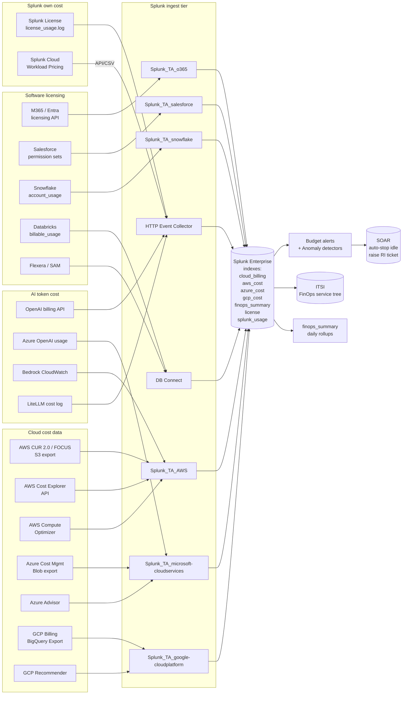

# FinOps, Cost & Capacity Management Integration Guide

> The definitive guide to running cloud and software financial
> operations on Splunk. 77 use cases across cat 20 covering AWS / Azure
> / GCP cost ingest (CUR 2.0, Focus 1.0, BigQuery export), Splunk
> Cloud workload pricing, license management (Microsoft 365, Entra,
> Salesforce, Snowflake, Databricks), FinOps Foundation Framework
> capabilities — inform, optimize, operate phases — anomaly detection,
> rightsizing recommendations from native cloud advisors, RI/Savings
> Plans coverage and utilization, idle resource detection, capacity
> planning with predictive forecasting, chargeback / showback by
> business unit, and unit economics ($/transaction, $/customer).

---

## Table of Contents

- [Quick Start](#quick-start)
- [Overview](#overview)
- [FinOps Foundation Framework Mapping](#finops-framework)
- [Architecture and Data Flow](#architecture)
- [Prerequisites](#prerequisites)
- [Cost Data Sources](#cost-sources)
  - [AWS Cost & Usage Report (CUR 2.0)](#aws-cur)
  - [AWS Cost Explorer API](#aws-ce)
  - [AWS Trusted Advisor + Compute Optimizer](#aws-advisor)
  - [Azure Cost Management Export](#azure-cost)
  - [Azure Advisor + Reservations + Savings Plans](#azure-advisor)
  - [GCP Billing BigQuery Export](#gcp-billing)
  - [GCP Recommender / Active Assist](#gcp-recommender)
  - [FOCUS 1.0 Unified Spec](#focus)
- [Software Licensing Cost](#software-licensing)
  - [Microsoft 365 / Entra ID](#m365-licensing)
  - [Salesforce](#salesforce-licensing)
  - [Snowflake](#snowflake-credits)
  - [Databricks DBU](#databricks-dbu)
  - [Flexera and ServiceNow SAM](#sam)
- [Splunk Itself — Workload Pricing and License](#splunk-cost)
- [AI Token Cost](#ai-token-cost)
- [Splunk-Side Configuration](#splunk-config)
- [Field Dictionary](#field-dictionary)
- [Sample Events](#sample-events)
- [Capacity Planning Methodology](#capacity-methodology)
- [Forecasting (predict, monthly trending)](#forecasting)
- [Anomaly Detection](#anomaly-detection)
- [Rightsizing Recommendations](#rightsizing)
- [RI / Savings Plans Coverage and Utilization](#ri-coverage)
- [Idle Resource Identification](#idle-resources)
- [Chargeback / Showback by Business Unit](#chargeback)
- [Unit Economics](#unit-economics)
- [Budget Alerts and Spend Caps](#budget-alerts)
- [Cross-Product Correlation](#cross-product)
- [CIM Mapping](#cim-mapping)
- [Compliance Mapping](#compliance)
- [Recommended Dashboard Layouts](#dashboards)
- [ITSI Service Modeling for FinOps](#itsi)
- [SOAR Playbook Examples](#soar)
- [Multi-Tenant / Multi-Account Strategy](#multi-tenant)
- [Security Hardening](#security-hardening)
- [Crawl / Walk / Run Roadmap](#roadmap)
- [Validation Checklist](#validation-checklist)
- [Known Limitations](#known-limitations)
- [Troubleshooting](#troubleshooting)
- [FAQ](#faq)
- [Glossary](#glossary)
- [References](#references)
- [Contribution and Feedback](#contribution)

---

<a id="quick-start"></a>
## Quick Start — 60 Minutes to First Cost Dashboard

### 1. Pick your hyperscalers

Most enterprises have at least 2 of {AWS, Azure, GCP}. Set up cost
ingest for each you have:

| Cloud | Quickest path |
|---|---|
| **AWS** | CUR 2.0 to S3 → Splunk_TA_AWS S3 input |
| **Azure** | Cost Management Export to Blob → Splunk_TA_microsoft-cloudservices Blob input |
| **GCP** | Detailed Billing BigQuery Export → Splunk_TA_google-cloudplatform BigQuery input or Pub/Sub bridge |

### 2. Land in dedicated indexes

```ini
# indexes.conf
[cloud_billing]
homePath = $SPLUNK_DB/cloud_billing/db
maxDataSizeMB = 10000
frozenTimePeriodInSecs = 220752000  # 7y for SOX

[finops_summary]
homePath = $SPLUNK_DB/finops_summary/db
maxDataSizeMB = 1000
frozenTimePeriodInSecs = 31536000  # 1y
```

### 3. First dashboard — Daily spend trending

```spl
(index=cloud_billing OR index=aws_cost OR index=azure_cost OR index=gcp_cost) earliest=-30d
| eval cost_usd = case(
    sourcetype="aws:billing:cur" OR sourcetype="aws:billing:cur2" OR sourcetype="aws:billing:focus",
        coalesce(BilledCost, line_item_unblended_cost, lineItem_UnblendedCost),
    sourcetype="azure:cost:export" OR sourcetype="azure:cost:focus",
        coalesce(BilledCost, Cost, CostInBillingCurrency),
    sourcetype="gcp:billing:export" OR sourcetype="gcp:billing:focus",
        coalesce(BilledCost, cost),
    1==1, 0)
| eval cloud = case(
    like(sourcetype, "aws:%"), "aws",
    like(sourcetype, "azure:%"), "azure",
    like(sourcetype, "gcp:%"), "gcp",
    1==1, "other")
| timechart span=1d sum(cost_usd) AS daily_spend BY cloud
| addtotals
```

### 4. Activate crawl tier

UC-20.1.1 (Daily spend trending), UC-20.1.4 (Idle resource
identification), UC-20.1.5 (Budget threshold alert), UC-20.2.1
(Compute capacity forecast), UC-20.3.1 (License pool tracking).

---

<a id="overview"></a>
## Overview

### What this guide covers

| Domain | Examples |
|---|---|
| **Cloud cost ingest** | AWS CUR 2.0, Azure Cost Mgmt, GCP Billing BigQuery, FOCUS 1.0 unified |
| **Cloud-native advisors** | AWS Trusted Advisor, AWS Compute Optimizer, Azure Advisor, GCP Recommender |
| **Reservation economics** | RI/Savings Plans coverage and utilization, expiration tracking |
| **Software licensing** | M365, Entra ID, Salesforce, Snowflake, Databricks, Flexera, ServiceNow SAM |
| **Splunk cost itself** | Workload pricing, license usage by source/index, ingest mix |
| **AI token cost** | OpenAI, Azure OpenAI, AWS Bedrock, LiteLLM gateway |
| **Capacity planning** | Compute, storage, network, license forecasting with predictive models |
| **FinOps practices** | Showback/chargeback, unit economics, anomaly detection, budget enforcement |

### What's NOT in scope

| Domain | Where to look |
|---|---|
| Cloud security misconfigurations | [AWS](aws.md), [Azure](azure.md), [GCP](gcp.md) guides |
| Application performance | [Splunk Observability Cloud Guide](splunk-observability-cloud.md) |
| AI / LLM detailed observability (latency, errors) | [AI & LLM Observability Guide](ai-llm-observability.md) |
| Service desk financial workflows | [Service Management & ITSM Guide](service-management-itsm.md) |
| HCI compute hardware capacity | [Compute Infrastructure Guide](compute-hci.md) |
| Data warehouse query cost (full DBA scope) | [NoSQL & Cloud Databases Guide](nosql-cloud-databases.md) |

### Why FinOps in Splunk

You probably already have a cost tool (CloudHealth, Apptio Cloudability,
Cloudaware, Anodot, ProsperOps). They are excellent at the FinOps
"inform" and "optimize" phases. Splunk adds:

| Capability | What you gain |
|---|---|
| **Cross-product correlation** | Connect cost spikes to deploy events, security incidents, support tickets |
| **One pane of glass** | FinOps + observability + security in same workbench |
| **Long-term retention** | 7+ years of detailed billing for SOX / audit |
| **Anomaly detection on raw billing data** | Faster detection than monthly invoice review |
| **Custom unit economics** | $/transaction, $/customer, $/feature with business data |
| **Splunk own usage tracking** | Splunk is itself a cost line — manage it the same way |
| **AI token cost** | Native fit — LLM telemetry already in Splunk |

### What good looks like

| Dimension | Without integration | With full deployment |
|---|---|---|
| Daily spend visibility | Monthly invoice surprise | Real-time daily trend by cloud + service |
| Idle EC2 instances | Discovered quarterly | Daily report → auto-stopped via SOAR |
| RI coverage | "Probably ~70%, ask the cloud team" | 89% real-time, with expiration alerts |
| Cost anomalies | Found in the bill, weeks late | Detected in 4 hours, auto-tagged for owner |
| Per-team chargeback | Spreadsheet exercise quarterly | Continuous showback dashboard per team |
| AI token spend | Bill shock from OpenAI | Daily $/team and $/feature tracking |
| Splunk license forecast | "We'll know when we hit the cap" | 90-day forecast with rolling burn rate |

---

<a id="finops-framework"></a>
## FinOps Foundation Framework Mapping

The [FinOps Foundation](https://www.finops.org) defines a
[Framework](https://www.finops.org/framework/) with three phases —
**Inform**, **Optimize**, **Operate** — across six [domains](https://www.finops.org/framework/domains/)
and 23 [capabilities](https://www.finops.org/framework/capabilities/).

This guide explicitly addresses these capabilities:

| FinOps capability | Splunk implementation |
|---|---|
| **Data Ingestion** | TA-aws, TA-microsoft-cloudservices, TA-google-cloudplatform → cloud_billing index |
| **Allocation** | Tag mappings + lookup-driven business unit join |
| **Reporting & Analytics** | Splunk dashboards + ITSI Glass Tables |
| **Anomaly Management** | UC-20.1.* anomaly detection |
| **Forecasting** | UC-20.2.* with `predict` + linear regression |
| **Budgeting** | Per-team budgets in lookup; budget alert searches |
| **Workload Management & Automation** | SOAR playbooks for idle stop / RI purchase |
| **Rate Optimization** | RI / Savings Plans coverage tracking |
| **Workload Optimization** | Rightsizing from Compute Optimizer / Advisor |
| **Architecting for Cloud** | Architecture review fed by cost telemetry |
| **Onboarding Workloads** | Cost-aware app onboarding checklist |
| **Cloud Sustainability** | Per-region carbon emission factors via lookup |
| **Education & Enablement** | Splunk Lantern articles + this guide |
| **Policy & Governance** | SOX evidence packs from `cloud_billing` |
| **Invoicing & Chargeback** | Showback dashboards; chargeback summary indexes |
| **FOCUS Conformance** | Direct ingestion of FOCUS 1.0 datasets |

---

<a id="architecture"></a>
## Architecture and Data Flow



### Daily / monthly summary indexes

Raw billing line items are voluminous (CUR 2.0 commonly 1-50M
rows/day). Always roll up to summary indexes for dashboards:

```spl
# Schedule daily at 02:00 — yesterday's rollup
search index=cloud_billing earliest=-1d@d latest=@d
| stats sum(cost_usd) AS daily_spend
        BY service_code, account_id, region, business_unit
| eval _time = relative_time(now(), "-1d@d")
| collect index=finops_summary sourcetype=finops:daily_summary
```

Then dashboards query `finops_summary` only — fast.

---

<a id="prerequisites"></a>
## Prerequisites

| Item | Notes |
|---|---|
| **Splunk Enterprise** ≥ 9.0 (recommended 9.4 for Edge Processor) | |
| **Indexes** | `cloud_billing`, `aws_cost`, `azure_cost`, `gcp_cost` (events); `finops_summary`, `capacity_summary` (events, pre-aggregated); `license`, `sam`, `splunk_usage` (events) |
| **Splunk_TA_AWS** ≥ 7.x | S3 input for CUR; CloudWatch input for Compute Optimizer |
| **Splunk_TA_microsoft-cloudservices** ≥ 5.x | Storage Account / Event Hub inputs |
| **Splunk_TA_google-cloudplatform** ≥ 4.x | Pub/Sub or BigQuery Export receiver |
| **Splunk DB Connect** ≥ 3.16 (optional) | Direct Snowflake / Databricks system queries |
| **Lookup CSVs** | `business_unit_account_map.csv`, `cost_center_tags.csv`, `team_budget.csv`, `license_cost_per_seat.csv` |

### IAM roles required

#### AWS

```json
{
  "Version": "2012-10-17",
  "Statement": [
    {"Effect":"Allow", "Action":[
      "ce:GetCostAndUsage", "ce:GetReservationCoverage",
      "ce:GetSavingsPlansCoverage", "ce:GetCostForecast",
      "ce:GetSavingsPlansUtilization", "ce:GetReservationUtilization"
    ], "Resource":"*"},
    {"Effect":"Allow", "Action":[
      "s3:GetObject","s3:ListBucket"
    ], "Resource":["arn:aws:s3:::cur-bucket","arn:aws:s3:::cur-bucket/*"]},
    {"Effect":"Allow","Action":[
      "compute-optimizer:GetEC2InstanceRecommendations",
      "compute-optimizer:GetEC2RecommendationProjectedMetrics",
      "compute-optimizer:GetAutoScalingGroupRecommendations",
      "compute-optimizer:GetEBSVolumeRecommendations",
      "compute-optimizer:GetLambdaFunctionRecommendations",
      "support:DescribeTrustedAdvisorChecks",
      "support:DescribeTrustedAdvisorCheckResult"
    ],"Resource":"*"}
  ]
}
```

#### Azure

Built-in role: `Cost Management Reader` (subscription scope) +
`Reader` (subscription scope). For cross-tenant rollups, MSFT
recommends [Microsoft Entra ID Privileged Identity Management
(PIM)](https://learn.microsoft.com/en-us/entra/id-governance/privileged-identity-management/pim-configure)
to grant temporary access.

#### GCP

Roles: `roles/billing.viewer` (billing account) + `roles/bigquery.dataViewer`
(billing dataset).

---

<a id="cost-sources"></a>
## Cost Data Sources

<a id="aws-cur"></a>
### AWS Cost & Usage Report (CUR 2.0)

CUR is the authoritative billing data source — every line item with
~150-250 columns. Two formats supported in 2026:

| Format | Use |
|---|---|
| **CUR 2.0** | Newer format, more granular, Athena-friendly |
| **FOCUS 1.0** | FinOps Open Cost & Usage Specification — vendor-agnostic |

#### Enable

AWS Console → Billing → **Data Exports** → Create export:

```yaml
Name: splunk-finops-export
Export type: Standard data export
Data table: COST_AND_USAGE_REPORT (or FOCUS_1_0_AWS)
Time granularity: HOURLY                    # daily acceptable for cost-only
Data refresh settings: refresh existing files
Compression: GZIP                            # or PARQUET for Athena
Time period: monthly partitioning
Configuration:
  Resource IDs: include
  Split cost allocation data: include       # for ECS/EKS pod-level
S3 bucket: cur-bucket-prod-us-east-1
S3 prefix: finops/
```

#### Splunk_TA_AWS S3 input

```ini
# inputs.conf
[aws_s3://cur-finops]
aws_account = aws-prod
bucket_name = cur-bucket-prod-us-east-1
key_name = finops/
sourcetype = aws:billing:cur2          # use aws:billing:focus for FOCUS export
index = aws_cost
host_name = aws_cur
ct_blacklist =                           # full ingest
recursion_depth = -1
interval = 3600                          # check S3 hourly
```

#### Key CUR 2.0 fields

| Field | Use |
|---|---|
| `bill_billing_period_start_date` | YYYY-MM-DD billing period |
| `line_item_unblended_cost` | Unblended cost (sum across accounts) |
| `line_item_blended_cost` | Blended cost (across-org averaged) |
| `line_item_amortized_cost` | RI/SP amortized — preferred for FinOps |
| `line_item_usage_amount` | Units used |
| `line_item_usage_type` | Granular usage type |
| `line_item_product_code` | Service short code (`AmazonEC2`, `AmazonS3`) |
| `product_servicecode` | Service code (richer than line_item) |
| `product_region` | AWS region |
| `pricing_term` | OnDemand / Reserved / SavingsPlan |
| `resource_tags_user_xxx` | Cost allocation tags |
| `line_item_resource_id` | Specific resource ARN |

#### FOCUS 1.0 fields (preferred)

FOCUS standardizes columns across clouds (`BilledCost`, `EffectiveCost`,
`ServiceName`, `ResourceId`, `Region`, `ProviderName`,
`InvoiceIssuerName`, `BillingAccountId`, etc.). Same schema works
for AWS, Azure, GCP, OCI, IBM, Snowflake.

```spl
# Cross-cloud query using FOCUS schema
(sourcetype="aws:billing:focus" OR sourcetype="azure:cost:focus" OR sourcetype="gcp:billing:focus")
        earliest=-30d
| timechart span=1d sum(BilledCost) AS daily BY ProviderName
```

<a id="aws-ce"></a>
### AWS Cost Explorer API

For aggregated / pre-grouped queries (faster than parsing CUR for
dashboard panels):

```bash
# Pull last 30 days, grouped by service
aws ce get-cost-and-usage \
    --time-period Start=2026-04-09,End=2026-05-09 \
    --granularity DAILY \
    --metrics UnblendedCost AmortizedCost \
    --group-by Type=DIMENSION,Key=SERVICE
```

Splunk_TA_AWS includes a Cost Explorer modular input:

```ini
[aws_billing_cur://cost_explorer_30d]
aws_account = aws-prod
report_period = MONTHLY
metrics = AmortizedCost,UnblendedCost,UsageQuantity
group_by = SERVICE,LINKED_ACCOUNT
sourcetype = aws:cost:explorer
index = aws_cost
```

<a id="aws-advisor"></a>
### AWS Trusted Advisor + Compute Optimizer

#### Trusted Advisor

```bash
aws support describe-trusted-advisor-checks \
    --language en \
    --query "checks[?category=='cost_optimizing']"
```

#### Compute Optimizer

```bash
aws compute-optimizer get-ec2-instance-recommendations \
    --instance-arns arn:aws:ec2:...
```

Both feed into Splunk_TA_AWS via scheduled inputs. Sourcetypes
`aws:trustedadvisor:check` and `aws:computeoptimizer:rec`.

<a id="azure-cost"></a>
### Azure Cost Management Export

Azure Portal → Cost Management → Exports → Create:

```yaml
Type: Daily export of month-to-date costs
Dataset: ActualCost (or AmortizedCost for RI/SP-aware)
Granularity: Daily
File partitioning: enabled                  # better for Splunk parallel ingest
Format: CSV (gzip) or Parquet
Storage: Azure Blob Storage
  Container: finops
  Directory: cost-export
```

#### Splunk_TA_microsoft-cloudservices Blob Storage input

```ini
[mscs_storage_blob://azure-cost]
account_name = finopsstorageprod
account_key = <encrypted>
container_name = finops
sourcetype = azure:cost:export
index = azure_cost
interval = 3600
```

#### Key Azure cost fields

| Field | Use |
|---|---|
| `Date` | Billing date |
| `Cost` | Cost in billing currency |
| `CostInBillingCurrency` | Same, explicit |
| `ResourceGroup` | RG name |
| `MeterCategory` | High-level service |
| `MeterSubcategory` | Sub-service |
| `MeterName` | Specific meter |
| `MeterRegion` | Region |
| `Tags` | JSON of tags |
| `SubscriptionId` | Subscription |
| `BillingProfileName` | Billing profile |
| `ChargeType` | Usage / Reservation / Refund |
| `PricingModel` | OnDemand / Reservation / Spot |

#### FOCUS 1.0 export (Azure preview/GA)

Azure Cost Management supports FOCUS 1.0 export — same field names
as AWS / GCP FOCUS. Strongly recommend if available.

<a id="azure-advisor"></a>
### Azure Advisor + Reservations + Savings Plans

```bash
# Azure Advisor cost recommendations
az advisor recommendation list --category Cost
```

Splunk_TA_microsoft-cloudservices Azure Resource Manager input
captures Advisor recommendations as `azure:advisor:rec`.

```bash
# Reservation utilization
az consumption reservation summaries list --start-date 2026-04-01 --end-date 2026-04-30 --grain monthly

# Savings Plan utilization
az billing-benefits savings-plan-order-alias list
```

Lands as `azure:reservations:utilization` and
`azure:savingsplans:utilization`.

<a id="gcp-billing"></a>
### GCP Billing BigQuery Export

GCP Console → Billing → Billing Export → Configure BigQuery Export:

```yaml
Dataset: billing_export (in a dedicated project)
Detailed usage cost: enabled                # row-per-resource
Pricing data: enabled
```

#### Three approaches to ingest

| Approach | Pro | Con |
|---|---|---|
| **A: BigQuery scheduled query → Pub/Sub → Splunk_TA_GCP** | Splunk-native | Pub/Sub message size limit per row |
| **B: BigQuery scheduled query → GCS export → S3-style ingest** | Handles big rows | Extra hop |
| **C: Splunk DBX with BigQuery JDBC driver** | Direct query | Slower for large datasets |

Most adopters use Approach A with day-level rollups; Approach B for
detailed audit/SOX retention.

```sql
-- Scheduled query (BigQuery)
SELECT
  service.description AS service,
  sku.description AS sku,
  project.id AS project_id,
  location.location AS region,
  invoice.month AS billing_month,
  SUM(cost) AS cost,
  SUM(IFNULL((SELECT SUM(amount) FROM UNNEST(credits)), 0)) AS credit_total,
  currency
FROM `billing_export.gcp_billing_export_v1_XXXXXX_XXXXXX_XXXXXX`
WHERE _PARTITIONTIME = TIMESTAMP_TRUNC(TIMESTAMP_SUB(CURRENT_TIMESTAMP(), INTERVAL 1 DAY), DAY)
GROUP BY service, sku, project_id, region, billing_month, currency
```

Output to Pub/Sub topic → Splunk_TA_google-cloudplatform Pub/Sub
input → `index=gcp_cost sourcetype=gcp:billing:export`.

#### FOCUS 1.0 export (GCP)

GCP also supports FOCUS export, with same FOCUS field names.

<a id="gcp-recommender"></a>
### GCP Recommender / Active Assist

```bash
gcloud recommender recommendations list \
    --project=PROJECT_ID \
    --recommender=google.compute.instance.MachineTypeRecommender \
    --location=us-central1-a
```

Other recommenders: `google.compute.image.IdleResourceRecommender`,
`google.compute.disk.IdleResourceRecommender`,
`google.iam.policy.Recommender`, etc.

Splunk_TA_GCP includes a Recommender input → `gcp:recommender:rec`.

<a id="focus"></a>
### FOCUS 1.0 Unified Spec

[FOCUS](https://focus.finops.org/) (FinOps Open Cost & Usage
Specification) standardizes billing data across providers. Field
schema is the same for AWS, Azure, GCP, OCI, Snowflake, and others.

| FOCUS field | Meaning |
|---|---|
| `BilledCost` | Cost as it appears on the invoice |
| `EffectiveCost` | After discounts, before reservations amortized |
| `ListCost` | List price equivalent |
| `ContractedCost` | After negotiated discounts |
| `ServiceName` | Logical service (e.g., `Compute`, `Storage`) |
| `ServiceCategory` | Domain (e.g., `Compute`) |
| `ProviderName` | `AWS`, `Microsoft Azure`, `Google Cloud` |
| `BillingAccountId` | Provider account |
| `BillingAccountName` | Friendly name |
| `BillingPeriodStart` / `BillingPeriodEnd` | Period boundaries |
| `ChargePeriodStart` / `ChargePeriodEnd` | Usage period |
| `RegionId` / `RegionName` | Provider region |
| `ResourceId` | Resource identifier |
| `ResourceType` | e.g., `EC2 Instance`, `S3 Bucket` |
| `Tags` | Object of tag key/value |
| `PricingCategory` | `Standard`, `Spot`, `Committed`, etc. |
| `CommitmentDiscountId` | RI / Savings Plan ID |

Adopting FOCUS lets you write **one SPL** that works across clouds.
Strongly recommend.

---

<a id="software-licensing"></a>
## Software Licensing Cost

<a id="m365-licensing"></a>
### Microsoft 365 / Entra ID

Splunk_TA_o365 reports endpoint:
[Reports — getOffice365ActiveUserCounts](https://learn.microsoft.com/en-us/graph/api/reportroot-getoffice365activeusercounts).

```ini
[ms_o365_management://m365-licensing]
sourcetype = ms:o365:licensing:assignment
index = license
content_type = ServiceUsage
report = getOffice365LicensingUsage
```

Microsoft Graph licensing API:

```bash
GET https://graph.microsoft.com/v1.0/subscribedSkus
GET https://graph.microsoft.com/v1.0/users?$select=id,userPrincipalName,assignedLicenses
```

#### M365 license cost example query

```spl
index=license sourcetype="ms:entra:license"
| stats values(skuPartNumber) AS skus values(servicePlans{}.servicePlanName) AS plans
        BY userPrincipalName
| join skuPartNumber [| inputlookup license_cost_per_seat.csv WHERE vendor="Microsoft" | rename sku AS skuPartNumber]
| stats sum(cost_per_month_usd) AS monthly_cost BY userPrincipalName, skus
| sort -monthly_cost
```

<a id="salesforce-licensing"></a>
### Salesforce

Splunk_TA_salesforce (Splunkbase 1832) ingests EventLogFile:

```ini
[salesforce://prod-org]
sourcetype = salesforce:userlicense
index = license
event_types = UserLogin, PermissionSetAssignment, FieldHistory
interval = 3600
```

Plus REST API to `/services/data/v60.0/sobjects/UserLicense` and
`/services/data/v60.0/sobjects/PermissionSet`.

```spl
index=license sourcetype="salesforce:userlicense"
| stats latest(LicenseDefinitionKey) AS license latest(Status) AS status
        BY UserId, UserName
| join LicenseDefinitionKey [| inputlookup license_cost_per_seat.csv WHERE vendor="Salesforce"]
| stats sum(cost_per_month_usd) AS monthly_cost BY license
```

<a id="snowflake-credits"></a>
### Snowflake

Direct system queries via Splunk DB Connect:

```sql
-- WAREHOUSE_METERING_HISTORY in account_usage
SELECT
  WAREHOUSE_NAME,
  DATE_TRUNC('day', START_TIME) AS day,
  SUM(CREDITS_USED) AS credits_used,
  SUM(CREDITS_USED) * 2.00 AS estimated_cost_usd          -- $/credit varies
FROM SNOWFLAKE.ACCOUNT_USAGE.WAREHOUSE_METERING_HISTORY
WHERE START_TIME >= DATEADD('day', -1, CURRENT_TIMESTAMP())
GROUP BY 1, 2
ORDER BY 2 DESC
```

Sourcetype: `snowflake:warehouse:metering`. Schedule daily.

```spl
index=license sourcetype=snowflake:warehouse:metering earliest=-30d
| timechart span=1d sum(estimated_cost_usd) AS snowflake_spend BY WAREHOUSE_NAME
```

<a id="databricks-dbu"></a>
### Databricks DBU

```sql
-- system.billing.usage in Databricks Unity Catalog
SELECT
  workspace_id,
  cluster_id,
  cluster_name,
  date(usage_date) AS day,
  sum(usage_quantity) AS dbu_used
FROM system.billing.usage
WHERE usage_date >= dateadd(day, -1, current_date())
GROUP BY 1, 2, 3, 4
```

Sourcetype: `databricks:dbu:usage`. Cost = `dbu_used * dbu_price_usd`
(varies by tier and region).

<a id="sam"></a>
### Flexera and ServiceNow SAM

Splunk DB Connect query Flexera or ServiceNow SAM database for
license positions and entitlements:

```sql
-- ServiceNow CMDB SAM samp_sw_install
SELECT 
  sys_id, name AS app_name, version, install_count, license_pool,
  publisher
FROM samp_sw_install
WHERE sys_updated_on > DATEADD(DAY, -1, GETDATE())
```

Sourcetypes: `flexera:license:position`, `servicenow:sam:installation`.

---

<a id="splunk-cost"></a>
## Splunk Itself — Workload Pricing and License

### Splunk License Master

`license_usage.log` per indexer and license master records ingest by
source type, index, host, and source:

```ini
# inputs.conf on indexer
[monitor://$SPLUNK_HOME/var/log/splunk/license_usage.log]
sourcetype = splunkd
index = _internal
disabled = 0
```

License usage breakdown:

```spl
index=_internal source="*license_usage.log*" type=Usage
        earliest=-30d
| timechart span=1d sum(b) AS bytes_per_day BY pool
| eval gb_per_day = bytes_per_day / 1024 / 1024 / 1024
```

#### License pool tracking

```spl
index=_internal source="*license_usage.log*" type=Usage earliest=-30d
| stats sum(b) AS bytes BY pool, st             /* st = sourcetype */
| eval gb = round(bytes / 1024 / 1024 / 1024, 2)
| sort -gb
| head 20
```

Top 20 sourcetypes by ingest — first place to look when license
forecast looks bad.

### Splunk Cloud Workload Pricing

Splunk Cloud Platform's modern pricing is workload-based (vCPUs and
storage), not ingest-based. Visibility comes via:

- **Splunk Cloud Health Check** → entitlements in usage portal
- **Splunk Cloud Operations Center** for SVCs / vCPUs trended
- **Cost & Usage report** (CSV download monthly)

Schedule a download and HEC POST as `splunk:cloud:workload:pricing`.

#### Workload pricing budget alert

```spl
index=splunk_usage sourcetype=splunk:cloud:workload:pricing earliest=-30d
| stats avg(svcs_used) AS avg_svc max(svcs_used) AS peak_svc latest(svc_entitlement) AS entitlement
| eval pct_of_entitlement = round(avg_svc / entitlement * 100, 2)
| eval headroom = entitlement - peak_svc
| where pct_of_entitlement > 85
```

---

<a id="ai-token-cost"></a>
## AI Token Cost

Coverage of OpenAI, Azure OpenAI, AWS Bedrock, Anthropic via:

- LiteLLM gateway log (`litellm:cost`) — preferred, has computed cost
- Azure OpenAI diag log (`azure:openai:diagnostic`) → token math
- Bedrock CloudWatch metrics → token math via lookup `llm_pricing.csv`
- OpenAI billing API (`openai:billing:usage`) — per-key dollars

See [AI & LLM Observability Guide](ai-llm-observability.md) for full
detail. FinOps integration:

```spl
index=ai_platform sourcetype=litellm:cost earliest=-30d
| eval cost_usd = coalesce(cost_usd, prompt_tokens*0.000005 + completion_tokens*0.000015)
| timechart span=1d sum(cost_usd) AS daily_ai_spend BY team_id
```

---

<a id="splunk-config"></a>
## Splunk-Side Configuration

### Index recipes

```ini
[cloud_billing]
homePath = $SPLUNK_DB/cloud_billing/db
maxDataSizeMB = 10000
frozenTimePeriodInSecs = 220752000  # 7y SOX

[finops_summary]
homePath = $SPLUNK_DB/finops_summary/db
maxDataSizeMB = 1000
frozenTimePeriodInSecs = 31536000

[capacity_summary]
homePath = $SPLUNK_DB/capacity_summary/db
maxDataSizeMB = 500
frozenTimePeriodInSecs = 31536000

[license]
homePath = $SPLUNK_DB/license/db
maxDataSizeMB = 1000
frozenTimePeriodInSecs = 220752000  # 7y SOX

[splunk_usage]
homePath = $SPLUNK_DB/splunk_usage/db
maxDataSizeMB = 500
frozenTimePeriodInSecs = 31536000
```

### Lookups

```ini
# business_unit_account_map.csv
account_id,business_unit,cost_center,owner_email
123456789012,retail,RT-001,retail-eng@example.com
234567890123,finance,FN-001,finops@example.com

# team_budget.csv
team_id,monthly_budget_usd,annual_budget_usd,owner_email
checkout-team,75000,900000,checkout-lead@example.com
data-team,150000,1800000,data-platform@example.com

# license_cost_per_seat.csv
vendor,sku,plan_name,cost_per_month_usd,currency
Microsoft,ENTERPRISEPACK,M365 E3,32,USD
Microsoft,SPE_E5,M365 E5,57,USD
Salesforce,Salesforce,Sales Cloud Enterprise,165,USD
```

### Macros

```ini
[cost_idx]
definition = (index=cloud_billing OR index=aws_cost OR index=azure_cost OR index=gcp_cost OR index=finops_summary)

[normalize_cost]
definition = eval cost_usd = case( \
    sourcetype="aws:billing:cur" OR sourcetype="aws:billing:cur2", coalesce(line_item_unblended_cost, lineItem_UnblendedCost), \
    sourcetype="aws:billing:focus" OR sourcetype="azure:cost:focus" OR sourcetype="gcp:billing:focus", BilledCost, \
    sourcetype="azure:cost:export", coalesce(Cost, CostInBillingCurrency), \
    sourcetype="gcp:billing:export", cost, \
    1==1, 0)

[normalize_provider]
definition = eval provider = case( \
    like(sourcetype, "aws:%"), "aws", \
    like(sourcetype, "azure:%"), "azure", \
    like(sourcetype, "gcp:%"), "gcp", \
    like(sourcetype, "snowflake:%"), "snowflake", \
    like(sourcetype, "databricks:%"), "databricks", \
    1==1, "other")

[bu_join]
definition = lookup business_unit_account_map.csv account_id OUTPUT business_unit, cost_center, owner_email
```

---

<a id="field-dictionary"></a>
## Field Dictionary

| Field | Type | Source | Notes |
|---|---|---|---|
| `_time` | epoch | All | Auto |
| `cost_usd` | float | Macro `normalize_cost` | Computed |
| `provider` | string | Macro `normalize_provider` | aws/azure/gcp |
| `account_id` | string | All cost sources | Provider account |
| `business_unit` | string | Macro `bu_join` | From CMDB |
| `cost_center` | string | Macro `bu_join` | Finance code |
| `service_code` | string | All | AmazonEC2, etc. |
| `region` | string | All | Provider region |
| `resource_id` | string | All (where present) | Specific resource |
| `pricing_term` | string | AWS CUR | OnDemand/Reserved/SavingsPlan |
| `ChargeType` | string | Azure | Usage/Reservation/Refund |
| `PricingCategory` | string | FOCUS | Standard/Spot/Committed |
| `usage_amount` | float | All | Units consumed |
| `usage_type` | string | All | Granular type |
| `daily_spend` | float | Computed | Daily rollup |
| `monthly_spend` | float | Computed | Monthly rollup |
| `forecasted_monthly` | float | Forecast SPL | Predictive |
| `budget_used_pct` | float | Computed | Spend / budget |
| `recommendation_class` | string | Advisor | rightsize/idle/reserve |
| `estimated_savings_usd` | float | Advisor | Cost-optimization potential |

---

<a id="sample-events"></a>
## Sample Events

### aws:billing:cur2 (CUR 2.0)

```json
{
  "bill_billing_period_start_date": "2026-05-01",
  "bill_payer_account_id": "111122223333",
  "line_item_usage_account_id": "444455556666",
  "line_item_usage_start_date": "2026-05-09T12:00:00Z",
  "line_item_product_code": "AmazonEC2",
  "line_item_usage_type": "BoxUsage:m6i.xlarge",
  "line_item_unblended_cost": 0.1920,
  "line_item_amortized_cost": 0.0512,
  "line_item_resource_id": "i-0abcdef1234567890",
  "product_servicecode": "AmazonEC2",
  "product_region": "us-east-1",
  "pricing_term": "Reserved",
  "resource_tags_user_business_unit": "retail",
  "resource_tags_user_cost_center": "RT-001",
  "resource_tags_user_environment": "prod"
}
```

### aws:billing:focus (FOCUS 1.0)

```json
{
  "BillingPeriodStart": "2026-05-01T00:00:00Z",
  "BillingPeriodEnd": "2026-06-01T00:00:00Z",
  "ProviderName": "AWS",
  "ServiceName": "Amazon Elastic Compute Cloud",
  "ServiceCategory": "Compute",
  "BilledCost": 0.1920,
  "EffectiveCost": 0.0512,
  "ContractedCost": 0.0512,
  "PricingCategory": "Committed",
  "ResourceId": "arn:aws:ec2:us-east-1:444455556666:instance/i-0abcdef1234567890",
  "ResourceType": "Compute Instance",
  "RegionId": "us-east-1",
  "BillingAccountId": "111122223333",
  "BillingCurrency": "USD",
  "Tags": {"business_unit": "retail", "cost_center": "RT-001"}
}
```

### azure:cost:export

```json
{
  "Date": "2026-05-09",
  "Cost": 142.78,
  "CostInBillingCurrency": 142.78,
  "BillingCurrency": "USD",
  "ResourceGroup": "rg-prod-retail-east",
  "ResourceLocation": "eastus2",
  "MeterCategory": "Virtual Machines",
  "MeterSubcategory": "DSv5",
  "MeterName": "D8s v5",
  "ResourceName": "vm-retail-prod-001",
  "Tags": {"BusinessUnit": "retail", "CostCenter": "RT-001"},
  "SubscriptionId": "subscription-uuid",
  "ChargeType": "Usage"
}
```

### gcp:billing:export

```json
{
  "service": {"id": "6F81-5844-456A", "description": "Compute Engine"},
  "sku": {"id": "8DCB-AC76-91DC", "description": "N1 Predefined Instance Core running in Americas"},
  "usage_start_time": "2026-05-09T12:00:00Z",
  "usage_end_time": "2026-05-09T13:00:00Z",
  "project": {"id": "proj-retail-prod-001", "name": "retail-prod"},
  "labels": [{"key": "business_unit", "value": "retail"}, {"key": "cost_center", "value": "RT-001"}],
  "location": {"location": "us-central1"},
  "cost": 0.0892,
  "currency": "USD",
  "credits": [{"name": "Sustained Usage Discount", "amount": -0.0223}]
}
```

### splunk:license:usage

```
2026-05-09 12:34:56 component=LMTracker license_pool="default" stack_id=production type=Usage idx=app_logs st=java:gc s=java_gc.log h=app01 b=24817392
```

### finops:daily_summary (collected)

```json
{
  "_time": 1746748800,
  "service_code": "AmazonEC2",
  "account_id": "444455556666",
  "region": "us-east-1",
  "business_unit": "retail",
  "daily_spend": 1247.83,
  "currency": "USD"
}
```

---

<a id="capacity-methodology"></a>
## Capacity Planning Methodology

| Step | Activity |
|---|---|
| **1. Baseline** | 90 days of historical usage by resource class |
| **2. Identify drivers** | Map usage to business drivers (orders, sessions, MAU) |
| **3. Forecast drivers** | 12-month business plan from product / sales |
| **4. Translate to capacity** | Apply usage-per-driver ratio |
| **5. Headroom buffer** | Add 15-30% buffer for variance |
| **6. Procurement plan** | RI / SP purchases + on-demand absorption |
| **7. Quarterly review** | Compare actual vs forecast, recalibrate |

---

<a id="forecasting"></a>
## Forecasting

### Linear regression over daily spend

```spl
`cost_idx` earliest=-90d
| `normalize_cost`
| timechart span=1d sum(cost_usd) AS daily_spend
| predict daily_spend future_timespan=30 algorithm=LL upper95=high lower95=low
```

### Per-team predict with alert at projected breach

```spl
`cost_idx` earliest=-90d
| `normalize_cost` | `bu_join`
| timechart span=1d sum(cost_usd) AS daily_spend BY business_unit
| predict daily_spend.* future_timespan=30 algorithm=LL
| eval projected_30d_total = round(predicted_daily_spend.business_unit*30, 2)
| join business_unit [| inputlookup team_budget.csv | rename team_id AS business_unit, monthly_budget_usd AS budget]
| eval pct_budget = round(projected_30d_total / budget * 100, 1)
| where pct_budget > 90
```

### Capacity forecast for compute (UC-20.2.1)

```spl
index=metrics metric_name="aws.ec2.cpu_utilization" earliest=-90d
| stats avg(_value) AS avg_cpu BY host
| predict avg_cpu future_timespan=30 algorithm=LLP5 holdback=10
| where avg_cpu > 80   /* projected CPU > 80% */
```

---

<a id="anomaly-detection"></a>
## Anomaly Detection

### Standard deviation based

```spl
`cost_idx` earliest=-30d
| `normalize_cost` | `normalize_provider`
| timechart span=1d sum(cost_usd) AS daily_spend BY provider
| streamstats window=14 avg(daily_spend) AS avg_14d stdev(daily_spend) AS std_14d BY provider
| eval z_score = (daily_spend - avg_14d) / std_14d
| where abs(z_score) > 2.5
```

### MAD (more robust to outliers)

```spl
`cost_idx` earliest=-30d
| `normalize_cost`
| timechart span=1d sum(cost_usd) AS daily_spend BY service_code
| streamstats window=14 median(daily_spend) AS median_spend BY service_code
| eval abs_dev = abs(daily_spend - median_spend)
| streamstats window=14 median(abs_dev) AS mad BY service_code
| eval modified_z = 0.6745 * (daily_spend - median_spend) / mad
| where abs(modified_z) > 3.5
```

### MLTK fit / apply

For more sophisticated detection with seasonality:

```spl
`cost_idx` earliest=-180d
| `normalize_cost`
| timechart span=1d sum(cost_usd) AS daily_spend BY service_code
| fit DensityFunction daily_spend.AmazonEC2 dist=auto into ec2_density_model
```

```spl
`cost_idx` earliest=-7d
| `normalize_cost`
| timechart span=1d sum(cost_usd) AS daily_spend BY service_code
| apply ec2_density_model
| where IsOutlier(daily_spend.AmazonEC2) = 1
```

---

<a id="rightsizing"></a>
## Rightsizing Recommendations

Native cloud advisors are the source of truth — Splunk surfaces them
in one pane:

```spl
(sourcetype="aws:computeoptimizer:rec" OR sourcetype="azure:advisor:rec" OR sourcetype="gcp:recommender:rec")
        earliest=-1d
| eval estimated_savings_usd = case(
    like(sourcetype, "aws:%"), tonumber(monthlySavings.value),
    like(sourcetype, "azure:%"), tonumber(extendedProperties.savingsAmount),
    like(sourcetype, "gcp:%"), tonumber(primaryImpact.costProjection.cost.units),
    1==1, 0)
| eval recommendation_class = case(
    like(sourcetype, "aws:%"), finding,
    like(sourcetype, "azure:%"), category,
    like(sourcetype, "gcp:%"), recommenderSubtype,
    1==1, "unknown")
| `normalize_provider`
| stats sum(estimated_savings_usd) AS total_potential_savings count BY provider, recommendation_class
| sort -total_potential_savings
```

UC-20.1.6 (Rightsizing recommendations dashboard).

---

<a id="ri-coverage"></a>
## RI / Savings Plans Coverage and Utilization

### Coverage = % of usage covered by reservations

| Tier | Target |
|---|---|
| Tier-0 (steady state) | > 80% |
| Tier-1 (predictable) | > 60% |
| Tier-2 (variable) | < 30% (buy on demand) |

### AWS RI / SP coverage

```spl
sourcetype="aws:ri:utilization" OR sourcetype="aws:savingsplans:utilization" earliest=-1d
| eval coverage_pct = coalesce(coverage_value.coverageHoursPercentage, coverage)
| eval utilization_pct = coalesce(utilization_value.utilizationPercentage, utilization)
| stats avg(coverage_pct) AS avg_coverage avg(utilization_pct) AS avg_utilization BY savings_plan_id, account_id
```

### Expiration alert

```spl
sourcetype="aws:ri:utilization" earliest=-1d
| eval days_to_expiry = (strptime(end_date, "%Y-%m-%dT%H:%M:%S%Z") - now()) / 86400
| where days_to_expiry < 30 AND days_to_expiry > 0
| stats values(days_to_expiry) AS days_left BY ri_id, instance_type, account_id
```

UC-20.1.10 (RI/SP expiration alerting), UC-20.1.11 (RI/SP utilization
< 80% — wasted commitment).

---

<a id="idle-resources"></a>
## Idle Resource Identification

### Idle EC2 (CPU < 5% for > 7 days)

```spl
index=metrics metric_name="aws.ec2.cpu_utilization" earliest=-14d
| stats avg(_value) AS avg_cpu max(_value) AS max_cpu BY host
| where avg_cpu < 5 AND max_cpu < 20
| join host [search sourcetype="aws:billing:cur2" earliest=-1d
             | stats sum(line_item_unblended_cost) AS daily_cost BY line_item_resource_id
             | rename line_item_resource_id AS host]
| eval annual_savings = daily_cost * 365
| sort -annual_savings
```

### Idle EBS volumes (unattached > 7 days)

Use AWS Trusted Advisor or CUR resource_id correlated against EBS
volume state:

```spl
sourcetype="aws:trustedadvisor:check" check_name="EBS Volume Unattached"
        status=warning OR status=error
| stats values(resource_id) AS resources count BY check_name
```

### Idle storage (S3 LIFECYCLE not aligned with access)

Use S3 access logs + Storage Lens:

```spl
sourcetype="aws:s3:storagelens"
| where lower_storage_class != "DEEP_ARCHIVE" AND days_since_last_access > 90
| eval lifecycle_savings = bytes / 1024 / 1024 / 1024 * 0.024  /* IA → GDA delta */
```

UC-20.1.4 (Idle resource identification — flagship use case).

---

<a id="chargeback"></a>
## Chargeback / Showback by Business Unit

### Allocation strategy decision

| Strategy | Use |
|---|---|
| **Direct (tag-based)** | Tag every resource — cleanest, requires governance |
| **Indirect (account-based)** | One account per BU — simple but limits sharing |
| **Showback (no enforcement)** | Visibility only — politically easier as starting point |
| **Chargeback (real money movement)** | Enforced — requires SOX / GL integration |

### Tag-based showback dashboard

```spl
`cost_idx` earliest=-30d
| `normalize_cost`
| eval business_unit = coalesce(
    'resource_tags_user_business_unit',           /* AWS CUR tag */
    'Tags.BusinessUnit',                           /* Azure tag */
    'labels.business_unit',                        /* GCP label */
    "untagged")
| timechart span=1d sum(cost_usd) AS daily_spend BY business_unit
```

### Untagged spend alert

```spl
`cost_idx` earliest=-7d
| `normalize_cost`
| eval business_unit = coalesce('resource_tags_user_business_unit', 'Tags.BusinessUnit', 'labels.business_unit', "untagged")
| stats sum(cost_usd) AS spend BY business_unit
| eval pct_total = round(spend / sum(spend) * 100, 1)
| where business_unit = "untagged" AND pct_total > 5
```

---

<a id="unit-economics"></a>
## Unit Economics

### Cost per transaction

```spl
`cost_idx` earliest=-1d
| `normalize_cost` | search service_code IN ("AmazonEC2","AmazonRDS","AmazonS3")
| stats sum(cost_usd) AS infra_cost
| append [search index=app_logs sourcetype="orders:placed" earliest=-1d
          | stats count AS orders]
| eval cost_per_order = round(infra_cost / orders, 4)
```

### Cost per customer (MAU)

```spl
`cost_idx` earliest=-30d
| `normalize_cost` | stats sum(cost_usd) AS monthly_infra_cost
| append [search index=app_logs sourcetype="user:active" earliest=-30d
          | stats dc(user_id) AS mau]
| eval cost_per_mau = round(monthly_infra_cost / mau, 4)
```

UC-20.1.7 (Cost per business outcome).

---

<a id="budget-alerts"></a>
## Budget Alerts and Spend Caps

### Per-team budget enforcement

```spl
`cost_idx` earliest=@mon
| `normalize_cost` | `bu_join`
| stats sum(cost_usd) AS month_to_date_spend BY business_unit
| join business_unit [| inputlookup team_budget.csv | rename team_id AS business_unit]
| eval pct_used = round(month_to_date_spend / monthly_budget_usd * 100, 1)
| where pct_used > 80
| sort -pct_used
```

### Provider-side budget enforcement

| Cloud | Mechanism |
|---|---|
| **AWS** | AWS Budgets + Budget Actions (auto-stop, IAM policy attachment) |
| **Azure** | Azure Budgets + Action Groups |
| **GCP** | Budget alerts + Pub/Sub + Cloud Function for action |

These provider-native budget actions are stronger than alerts; they
can stop resources or freeze IAM policies. Splunk surfaces and
audits the actions.

UC-20.1.5 (Budget threshold alert), UC-20.1.13 (Hard spend cap
enforcement via SOAR).

---

<a id="cross-product"></a>
## Cross-Product Correlation

| With… | Pattern |
|---|---|
| **Splunk Enterprise Security** | Cost spike + IAM Anomalous → bitcoin mining detection (NIST 800-53 SI-4 example) |
| **Splunk ITSI** | FinOps service tree — provider × service × business_unit |
| **Splunk SOAR** | Auto-stop idle resources, raise SAM tickets, send chargeback summaries |
| **Splunk Observability Cloud** | APM trace cost — cost per service per request |
| **Service Management & ITSM** | Cost approval workflows — Splunk → ServiceNow / Jira |
| **AI / LLM Observability** | Per-team token cost rolled into cloud cost dashboards |

### Pattern: cost spike + auth anomaly = potential abuse

```spl
`cost_idx` earliest=-1h
| `normalize_cost`
| stats sum(cost_usd) AS hourly_cost BY account_id
| streamstats window=24 avg(hourly_cost) AS avg_24h stdev(hourly_cost) AS std_24h BY account_id
| eval z = (hourly_cost - avg_24h) / std_24h
| where z > 4
| join account_id [search index=cloudtrail sourcetype="aws:cloudtrail" earliest=-1h
                   eventName IN (RunInstances, CreateAccessKey, AssumeRole)
                   | stats values(userIdentity.userName) AS users BY recipientAccountId
                   | rename recipientAccountId AS account_id]
| `notable`
```

---

<a id="cim-mapping"></a>
## CIM Mapping

| CIM Data Model | Cost mapping |
|---|---|
| **Change** | RI/SP purchases, instance start/stop, license assignments |
| **Inventory** | Resources from CUR/cost exports inform asset inventory |
| **Performance** | Cross-correlate cost with performance metrics |
| **Authentication** | Per-user license assignment correlates with auth events |

```ini
# eventtypes.conf
[cloud_billing_event]
search = (sourcetype=aws:billing:* OR sourcetype=azure:cost:* OR sourcetype=gcp:billing:*)

[license_event]
search = (sourcetype=ms:o365:licensing:* OR sourcetype=salesforce:userlicense OR sourcetype=splunk:license:*)

# tags.conf
[eventtype=license_event]
change = enabled

[eventtype=cloud_billing_event]
inventory = enabled
```

---

<a id="compliance"></a>
## Compliance Mapping

| Framework | Splunk evidence |
|---|---|
| **SOX (financial controls)** | 7-year retention of cloud_billing; chargeback evidence; budget approval audit |
| **FOCUS 1.0 conformance** | Direct ingest of FOCUS exports; cross-cloud reporting |
| **ISO 27001 A.5.9** | Asset inventory from cost data |
| **GDPR** | Per-region cost showback for data sovereignty cost analysis |
| **DORA Art. 28-29** | ICT third-party concentration risk via cost analysis (% spend by cloud) |
| **PCI-DSS** | Cost segregation for cardholder-data environments |
| **SOC 2 CC1 (governance)** | FinOps governance evidence |
| **Carbon disclosure (CSRD, SEC climate rule)** | Per-region carbon estimates from cost data + emission factors lookup |

---

<a id="dashboards"></a>
## Recommended Dashboard Layouts

### Executive FinOps overview

| Row | Panel |
|---|---|
| **Headline** | Today's spend, monthly run-rate, projected month total |
| **Trend** | 30-day spend by provider |
| **Top consumers** | Top 10 services, top 10 accounts |
| **Anomalies** | Unusual spend in last 24h |
| **RI / SP coverage** | Per-cloud coverage % |
| **Untagged spend** | % of total |

### Per-business-unit chargeback

| Row | Panel |
|---|---|
| **MTD spend vs budget** | Gauge per BU |
| **Service breakdown** | Pie chart of services for this BU |
| **Trend** | Daily spend vs same period last month |
| **Owners** | Who owns the spike? (CMDB join) |

### Capacity planning

| Row | Panel |
|---|---|
| **Compute headroom** | CPU/mem trends with 90-day forecast |
| **Storage growth** | Per-bucket / per-volume forecast |
| **License headroom** | Per-product seat forecast |
| **Rightsizing opportunities** | Top 10 by potential savings |

### License management

| Row | Panel |
|---|---|
| **By vendor** | Total cost per vendor |
| **Inactive users** | Users assigned license but not active in 90d |
| **Pool utilization** | Per-pool used / available |
| **Pending renewals** | Subscriptions expiring next 60 days |

---

<a id="itsi"></a>
## ITSI Service Modeling for FinOps

| ITSI concept | FinOps mapping |
|---|---|
| **Service** | One per business unit or per cost center |
| **Service template** | "Cloud Cost Service" — KPIs for daily spend, budget %, anomalies |
| **Entity** | One per cloud account |
| **KPI** | Daily spend, MTD spend, budget % used, anomaly count, RI coverage |
| **Service tree** | Business Unit → Cost Center → Service → Account |
| **Service health score** | Composite: budget compliance + anomaly count + tagging hygiene |
| **Glass table** | CFO dashboard with each BU's cost, trend, forecast, anomalies |

---

<a id="soar"></a>
## SOAR Playbook Examples

### Playbook 1 — Idle resource → auto-stop

```yaml
name: idle_ec2_auto_stop
trigger: splunk_alert: idle_ec2_uc_20_1_4
steps:
  - extract: [host, daily_cost, owner_email]
  - send_email:
      to: $owner_email$
      subject: "Idle EC2 instance $host$ scheduled for stop in 7 days"
      body: "Instance $host$ has averaged < 5% CPU for 14 days, costing $daily_cost$/day. Reply STOP to keep, otherwise it will be stopped on $stop_date$."
  - schedule_action:
      delay: 7d
      action: aws_ec2_stop
      params: {instance_id: $host$}
  - servicenow_create_change:
      type: standard
      short_description: "Auto-stop idle EC2 $host$"
```

### Playbook 2 — Budget breach → freeze new resource creation

```yaml
name: budget_breach_freeze
trigger: splunk_alert: budget_breach_uc_20_1_5
steps:
  - extract: [business_unit, pct_used, owner_email]
  - aws_iam_attach_policy:
      role: $business_unit_role$
      policy: arn:aws:iam::aws:policy/AWSDenyAll
      reason: "Budget breach at $pct_used%"
  - servicenow_create_incident:
      assignment_group: finops
      short_description: "Budget breach for $business_unit$ - resource creation frozen"
  - send_email:
      to: $owner_email$
      cc: cfo@example.com
      subject: "Budget breach - $business_unit$ at $pct_used%"
```

### Playbook 3 — Tagging hygiene → ticket resource owner

```yaml
name: untagged_resource_followup
trigger: splunk_alert: untagged_resource_uc_20_3_3
steps:
  - extract: [resource_id, account_id, monthly_cost]
  - cmdb_lookup: account_id=$account_id$ → owner_email
  - jira_create_issue:
      project: FINOPS
      issue_type: Task
      summary: "Tag missing on $resource_id$ ($monthly_cost$/mo)"
      assignee: $owner_email$
      due_date: 7d
```

---

<a id="multi-tenant"></a>
## Multi-Tenant / Multi-Account Strategy

### Tag taxonomy (recommended minimum)

| Tag | Values | Required? |
|---|---|---|
| `business_unit` | retail, finance, hr, etc. | YES |
| `cost_center` | Finance GL code | YES |
| `environment` | prod / staging / dev / test | YES |
| `application` | App slug | YES |
| `data_classification` | public / internal / confidential / restricted | NO |
| `compliance_scope` | pci / sox / hipaa / gdpr | NO |

Enforcement: AWS Tag Policies, Azure Policy, GCP Organization Policy
Constraints. Splunk surfaces tagging hygiene reports for non-
compliant resources (UC-20.3.3).

### Multi-account aggregation

For organizations with hundreds of accounts:

- Use one centralized billing account per cloud (AWS Organizations,
  Azure billing profile, GCP billing account)
- Pull CUR / cost export from the centralized account
- Use a `business_unit_account_map.csv` lookup that maps every
  account to a BU
- Splunk sees one cost data stream per cloud — aggregation happens
  in lookup-driven joins

---

<a id="security-hardening"></a>
## Security Hardening

| Risk | Mitigation |
|---|---|
| **Cost data exposes business secrets** | Index access controls; mask sensitive tags; restrict to FinOps role |
| **CUR S3 bucket open to internet** | Bucket policy denying public; enable Block Public Access |
| **Cross-tenant cost data leak** | Per-tenant separate accounts + per-tenant indexes |
| **License data has PII (user → license assignment)** | RBAC; mask UPN to hash if not needed |
| **API keys for Cost Explorer pull** | Use IAM roles with read-only billing permissions; rotate quarterly |
| **DBX credentials for Snowflake/Databricks** | Encrypt; rotate; least-privilege role |

---

<a id="roadmap"></a>
## Crawl / Walk / Run Roadmap

### Crawl (Week 0-2) — 18 use cases

| UC | Why |
|---|---|
| 20.1.1 | Daily spend trending |
| 20.1.2 | MTD spend by service |
| 20.1.3 | Cost by tag — BU showback |
| 20.1.4 | Idle resource identification |
| 20.1.5 | Budget threshold alert |
| 20.1.6 | Rightsizing recommendations dashboard |
| 20.1.7 | Cost per business outcome (unit economics) |
| 20.1.10 | RI/SP expiration alerting |
| 20.1.11 | RI/SP utilization < 80% |
| 20.1.13 | Hard spend cap enforcement |
| 20.1.20 | Untagged spend %  |
| 20.2.1 | Compute capacity forecast |
| 20.2.2 | Storage growth forecast |
| 20.2.3 | Network capacity forecast |
| 20.3.1 | License pool tracking (Splunk License Master) |
| 20.3.2 | M365 license assignments vs active users |
| 20.3.3 | Untagged resource followup |
| 20.3.10 | Salesforce permission set sprawl |

### Walk (Month 1-3) — 30 more

(detailed list available in catalog under cat-20.*)

### Run (Month 3+) — 29 advanced

(detailed list in catalog)

---

<a id="validation-checklist"></a>
## Validation Checklist

- [ ] Cost data ingest validated for all hyperscalers in use
- [ ] FOCUS 1.0 export configured (preferred) or per-vendor format
- [ ] Lookups populated: `business_unit_account_map.csv`, `team_budget.csv`, `license_cost_per_seat.csv`
- [ ] Macros defined: `cost_idx`, `normalize_cost`, `normalize_provider`, `bu_join`
- [ ] Daily summary search scheduled
- [ ] Per-BU showback dashboard live
- [ ] Anomaly detection saved searches running
- [ ] Forecasting jobs scheduled (predict + linear regression)
- [ ] First budget alert tested
- [ ] Idle resource detection running
- [ ] Splunk own license usage tracked
- [ ] AI token cost integrated (if applicable)
- [ ] Provider-side budget enforcement in place (AWS Budgets / Azure Budgets / GCP Budgets)
- [ ] Tagging hygiene report scheduled
- [ ] FinOps Service in ITSI
- [ ] First SOAR playbook tested (e.g., idle EC2 stop)

---

<a id="known-limitations"></a>
## Known Limitations

| Limitation | Workaround |
|---|---|
| CUR rows count grows with resource count + tags | Roll up to summary index daily; use Athena for ad-hoc deep dive |
| FOCUS 1.0 not yet offered by all clouds | Map per-vendor formats to FOCUS columns at search time |
| Cost Explorer API quota (1000 req/day) | Cache results; query CUR for granular |
| Azure Cost Management export latency (24-48h finalization) | Distinguish "preliminary" vs "final" cost |
| GCP BigQuery export costs money to query | Use materialized views; daily summary |
| RI/SP utilization API is rate-limited | Pull daily, not hourly |
| Splunk License Master EOL (10.x removes Volume License Pools) | Migrate to Workload Pricing in Splunk Cloud |
| FOCUS doesn't yet cover AI tokens fully | Use `gen_ai.*` semconv + provider-specific until standardized |

---

<a id="troubleshooting"></a>
## Troubleshooting

### "CUR ingestion lagging by days"

1. CUR delivery is **next day at the earliest** (it's not real-time)
2. S3 input interval too long; reduce to 1h
3. CUR delivery actually broken — check S3 manifest age
4. Use Cost Explorer API for "today" estimates

### "Per-team showback shows 30% in untagged"

1. Tag policy not enforced — implement AWS Tag Policies
2. Tags inherited from account-level only — push to resource level
3. Resource tagging at create time not enforced — use IaC checks

### "Forecast wildly off"

1. Use `predict algorithm=LL` for trend, `LLT` for seasonality
2. Holdback days too few — use `holdback=30`
3. Anomalies polluting baseline — exclude with `where z_score < 2`

### "RI utilization shows 100% but bills look wrong"

1. RI scope mismatch (regional vs zonal)
2. RI applied to wrong instance family
3. Convertible RI in conversion period

---

<a id="faq"></a>
## FAQ

**Q: Should I use Splunk for FinOps, or Apptio Cloudability / CloudHealth?**
Use Apptio/CloudHealth for FinOps "inform" and "optimize" — they have
better UX. Use Splunk for cross-product correlation, long-term
retention, custom unit economics, anomaly detection, AI token cost,
and Splunk's own license management. They are complementary.

**Q: FOCUS or per-vendor format?**
FOCUS if available — write SPL once, runs across clouds. Per-vendor
when you need fields FOCUS doesn't expose.

**Q: How accurate is `predict`?**
For monotonic trends: ±15% over 30 days. For seasonal: ±10% with
`LLT` algorithm. Always show prediction interval.

**Q: Per-team budget enforcement — how to do this politically?**
Start with showback (visibility only). After 60 days of accurate
showback, propose chargeback with clear escalation procedure. Make
sure CFO is the sponsor.

**Q: Carbon emission tracking?**
Most clouds publish per-region CO2e factors. Build a lookup
`carbon_factors.csv` and multiply by usage hours. Splunk can roll
up by BU for CSRD / SEC climate disclosures.

**Q: Splunk Workload Pricing — how do I forecast it?**
Track SVC consumption from the Splunk Cloud Operations Center, predict
30-day trend, alert at 85% of entitlement. Engagement with Splunk
account team for capacity additions.

---

<a id="glossary"></a>
## Glossary

| Term | Definition |
|---|---|
| **FinOps** | Financial Operations — cloud financial management practice |
| **CUR** | AWS Cost & Usage Report |
| **FOCUS** | FinOps Open Cost & Usage Specification (vendor-neutral) |
| **RI** | Reserved Instance (AWS) — committed capacity discount |
| **SP** | Savings Plan (AWS, Azure) — flexible commitment discount |
| **CUD** | Committed Use Discount (GCP) |
| **OPEX** | Operating expense (cloud is OPEX by default) |
| **CAPEX** | Capital expense (RI / 3-year commits straddle into CAPEX) |
| **Showback** | Visibility-only cost allocation |
| **Chargeback** | Real money movement — finance enforces |
| **Unit economics** | Cost per business outcome (transaction, customer) |
| **Rightsizing** | Resizing to actual usage (typically downsizing) |
| **Idle resource** | Provisioned but not used |
| **Burn rate** | Spend rate trend |
| **Budget breach** | Exceeded planned spend |
| **DBU** | Databricks Unit |
| **SVC** | Splunk Virtual Compute (Workload Pricing unit) |
| **MTS** | Metric Time Series (Observability Cloud unit) |
| **Cost center** | Finance GL code |
| **Cost allocation tag** | Tag used by billing for breakdown |

---

<a id="references"></a>
## References

### FinOps Foundation

- [FinOps Foundation](https://www.finops.org)
- [FinOps Framework](https://www.finops.org/framework/)
- [FOCUS specification](https://focus.finops.org)

### AWS

- [AWS Cost and Usage Report v2](https://docs.aws.amazon.com/cur/latest/userguide/what-is-cur.html)
- [AWS Cost Explorer API](https://docs.aws.amazon.com/aws-cost-management/latest/APIReference/API_Operations_AWS_Cost_Explorer_Service.html)
- [AWS Compute Optimizer](https://docs.aws.amazon.com/compute-optimizer/)
- [AWS Trusted Advisor](https://aws.amazon.com/premiumsupport/technology/trusted-advisor/)
- [Splunk Add-on for AWS](https://splunkbase.splunk.com/app/1876)

### Azure

- [Azure Cost Management Export](https://learn.microsoft.com/en-us/azure/cost-management-billing/costs/tutorial-export-acm-data)
- [Azure Advisor cost recommendations](https://learn.microsoft.com/en-us/azure/advisor/advisor-cost-recommendations)
- [Splunk Add-on for Microsoft Cloud Services](https://splunkbase.splunk.com/app/3110)

### GCP

- [GCP Billing BigQuery Export](https://cloud.google.com/billing/docs/how-to/export-data-bigquery)
- [GCP Recommender / Active Assist](https://cloud.google.com/recommender/docs)
- [Splunk Add-on for GCP](https://splunkbase.splunk.com/app/3088)

### License management

- [Microsoft Graph licensing API](https://learn.microsoft.com/en-us/graph/api/resources/licensing-api-overview)
- [Salesforce User License](https://developer.salesforce.com/docs/atlas.en-us.api.meta/api/sforce_api_objects_userlicense.htm)
- [Snowflake account_usage](https://docs.snowflake.com/en/sql-reference/account-usage)
- [Databricks system tables (billing)](https://docs.databricks.com/en/admin/system-tables/billing.html)
- [Flexera ITAM](https://docs.flexera.com/)
- [ServiceNow SAM](https://docs.servicenow.com/bundle/washingtondc-it-asset-management/page/product/asset-management/concept/c_SoftwareAssetManagement.html)

### Splunk

- [Splunk Workload Pricing](https://www.splunk.com/en_us/products/pricing/workload-pricing-faqs.html)
- [Splunk License Master docs](https://docs.splunk.com/Documentation/Splunk/latest/Admin/Configurelicensepoolswithlicensemanager)
- [Splunk DB Connect](https://splunkbase.splunk.com/app/2686)
- [Splunk MLTK](https://splunkbase.splunk.com/app/2890)

### Lantern

- [Splunk Lantern — FinOps articles](https://lantern.splunk.com/Splunk_Platform/Cost_Capacity)

---

<a id="contribution"></a>
## Contribution and Feedback

This guide is part of the Splunk Monitoring Use Cases catalog.

- **Add a use case** — PR JSON sidecar in `content/cat-20-cost-capacity-management/`
- **Share a chargeback model** — PR documentation
- **Contribute a unit-economics SPL** — PR `examples/finops/`

The full catalog is at
[github.com/fenre/splunk-monitoring-use-cases](https://github.com/fenre/splunk-monitoring-use-cases).
