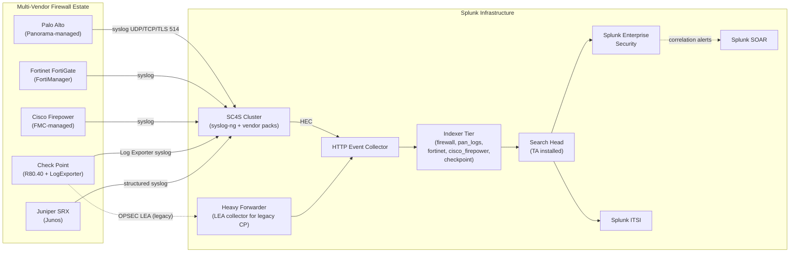

# Firewalls (Palo Alto, Fortinet, Cisco, Check Point) Integration Guide

> Multi-vendor firewall integration for Splunk. 54 use cases covering
> traffic, threat, URL/web filtering, decryption, GlobalProtect/SSLVPN,
> system/config audit, hardware health, and policy compliance across
> Palo Alto Networks, Fortinet FortiGate<sup class="ref">[<a href="#ref-4">4</a>]</sup>, Cisco Firepower/ASA, Check
> Point, and Juniper SRX. The single source of truth for the firewall
> data plane in your Splunk estate.

---

## Table of Contents

- [Quick Start](#quick-start)
- [Overview](#overview)
- [Architecture and Data Flow](#architecture)
- [Prerequisites](#prerequisites)
- [Vendor Coverage Matrix](#vendor-matrix)
- [Palo Alto Networks (PAN-OS)](#palo-alto)
- [Fortinet FortiGate](#fortinet)
- [Cisco Firepower / ASA](#cisco-firewalls)
- [Check Point](#checkpoint)
- [Juniper SRX](#juniper-srx)
- [SC4S Pipeline (Recommended)](#sc4s)
- [Field Dictionary (Cross-Vendor)](#field-dictionary)
- [Sample Events](#sample-events)
- [CIM Mapping Reference](#cim-mapping)
- [Cross-Product Correlation](#cross-product)
- [Compliance Mapping](#compliance)
- [Capacity Planning and Sizing](#sizing)
- [Recommended Dashboard Layouts](#dashboards)
- [ITSI Service Modeling](#itsi)
- [SOAR Playbook Examples](#soar)
- [Multi-Site / Multi-Tenant](#multi-site)
- [Security Hardening](#security-hardening)
- [Crawl / Walk / Run Roadmap](#roadmap)
- [Validation Checklist](#validation-checklist)
- [Known Limitations and Gaps](#known-limitations)
- [Troubleshooting](#troubleshooting)
- [FAQ](#faq)
- [Glossary](#glossary)
- [References](#references)
- [Contribution and Feedback](#contribution)

---

<a id="quick-start"></a>
## Quick Start — 30 Minutes to First Telemetry

> Pick the section matching your firewall vendor. **All vendors share the
> same end-state**: syslog → SC4S → HEC → indexed in `firewall` (or
> per-vendor) index → CIM-normalised → dashboards / ES correlation
> searches / SOAR playbooks.

### Palo Alto (fastest)

1. Install [Splunk Add-on for Palo Alto Networks](https://splunkbase.splunk.com/app/491) on indexers + SH.
2. On Panorama (or per-firewall): **Device > Server Profiles > Syslog**, then **Device > Log Settings** to forward Traffic, Threat, URL, WildFire, System, Config logs.
3. Receive on SC4S or HF UDP/TCP 514 — events arrive as `pan:traffic`, `pan:threat`, `pan:url`, `pan:wildfire`, `pan:system`, `pan:config`.
4. Validate: `index=pan_logs sourcetype=pan:traffic earliest=-15m | stats count by host`

### Fortinet

1. Install [Fortinet FortiGate Add-on for Splunk](https://splunkbase.splunk.com/app/2846).
2. CLI on FortiGate:

    ```fortios
    config log syslogd setting
        set status enable
        set server <sc4s-vip>
        set port 514
        set facility local6
        set source-ip <fortigate-mgmt-ip>
        set format default
    end
    config log syslogd filter
        set forward-traffic enable
        set local-traffic enable
        set event enable
        set utm enable
    end
    ```

3. Validate: `index=fortinet sourcetype=fgt_traffic earliest=-15m | stats count by devname`

### Cisco Firepower (FTD)

1. Install Cisco Secure Firewall Add-on for Splunk.
2. On FMC: **Devices > Platform Settings > Syslog** — point at SC4S/HF, severity 6 (informational).
3. On the FTD device: enable connection event logging via Access Control Policy.
4. Validate: `index=firewall sourcetype="cisco:firepower:syslog" earliest=-15m | stats count by host`

### Check Point

1. Install [Splunk_TA_checkpoint](https://splunkbase.splunk.com/app/5402) (LEA-based) OR Log Exporter.
2. **Recommended (R80.20+):** Configure Log Exporter to push to SC4S in Syslog format.
3. On SmartConsole CLI:

    ```bash
    cp_log_export add name splunk_export target-server <sc4s-vip> target-port 514 protocol udp format syslog
    ```

4. Validate: `index=checkpoint sourcetype=cp_log earliest=-15m | stats count by host`

---

<a id="overview"></a>
## Overview

### What this guide covers

| Domain | Examples |
|--------|---------|
| **Traffic logs** | Allow/deny decisions, bytes, sessions, NAT, application identification |
| **Threat / IPS** | Vulnerability protection, malware, command-and-control, anti-spyware |
| **URL filtering** | Web access categories, block reasons, user attribution |
| **Sandbox / WildFire** | File analysis verdicts, malicious file delivery |
| **SSL/TLS decryption** | Decryption status, cert pinning failures, unsupported ciphers |
| **System / hardware** | PSU/fan, HA failover, dataplane CPU, session table utilization |
| **Config / audit** | Rule add/modify/delete, admin login, policy push |
| **Remote access** | GlobalProtect (PAN), SSL-VPN (Fortinet), AnyConnect (Cisco), Mobile Access (CP) |
| **Identity binding** | User-ID (PAN), FSSO (Fortinet), Identity Sources (Firepower) |

### What's NOT in scope

| Domain | Where to look |
|--------|---------------|
| **Routers and switches** | [Cisco Networks Guide](cisco-networks.md) |
| **Endpoint security (EDR)** | Separate Endpoint Guide (planned) |
| **Email security** | Separate Email Security Guide (planned) |
| **Web proxies / SWG (Zscaler etc.)** | Separate SWG Guide (planned) |
| **VPN concentrators (non-firewall)** | Standalone VPN Guide (planned) |

### Why one guide for multiple vendors?

Most enterprises run a multi-vendor firewall estate (PAN at internet edge, Fortinet for branches, Check Point for legacy DMZ, etc.). Splunk normalizes these via CIM `Network_Traffic`, `Web`, `Authentication`, `Change`, `Alerts`, and `Vulnerabilities` data models — so **a single saved search can target all vendors** as long as the TAs are properly installed. This guide gives you the per-vendor onboarding plus the cross-vendor correlation patterns.

### What good looks like

| Dimension | Without integration | With full deployment |
|-----------|---------------------|----------------------|
| Threat detection | Per-firewall console | Cross-firewall ES correlation |
| Policy audit | Annual review | Real-time config-change alerts |
| Capacity planning | Reactive (at outage) | Predictive (session table, dataplane CPU) |
| Compliance evidence | Manual export | Automated quarterly attestation |
| User-attributed threats | No | User-ID/FSSO correlation |
| SSL inspection blind spot | Unknown | Real-time decryption-failure tracking |

---

<a id="architecture"></a>
## Architecture and Data Flow



---

<a id="prerequisites"></a>
## Prerequisites

### Splunk requirements

| Item | Detail |
|------|--------|
| **Splunk version** | Splunk Enterprise 9.0+ or Splunk Cloud (Classic / Victoria) |
| **Splunkbase add-ons** | One per vendor (see [Vendor Coverage Matrix](#vendor-matrix)) |
| **CIM Add-on** | Splunkbase 1621 — required for cross-vendor data models |
| **HEC** | Required for SC4S |
| **Splunk Enterprise Security<sup class="ref">[<a href="#ref-11">11</a>]</sup>** | Optional but strongly recommended for the SOC use cases |
| **Index strategy** | One per vendor (e.g., `pan_logs`, `fortinet`) for capacity isolation; or single `firewall` index for small estates |

### Network requirements

| Item | Detail |
|------|--------|
| Syslog UDP 514 | Most common — be aware of UDP packet loss |
| Syslog TCP 514 / TLS 6514 | Recommended for production |
| Check Point Log Exporter | Specific config required (see [Check Point](#checkpoint)) |
| OPSEC LEA (legacy CP) | TCP 18184; requires LEA certificate |
| HEC TCP 8088 | TLS, from SC4S/HF to indexer tier |

---

<a id="vendor-matrix"></a>
## Vendor Coverage Matrix

| Vendor | TA / App | Splunkbase | Sourcetypes | Splunk Cloud-vetted |
|--------|----------|-----------|-------------|--------|
| **Palo Alto Networks** | Splunk_TA_paloalto | [491](https://splunkbase.splunk.com/app/491) | `pan:*` | Yes |
| **Palo Alto App** | Palo Alto Networks App for Splunk | [491](https://splunkbase.splunk.com/app/491) | (dashboards only) | Yes |
| **Fortinet** | TA-fortinet_fortigate | [2846](https://splunkbase.splunk.com/app/2846) | `fgt_*` | Yes |
| **Cisco Firepower (FTD)** | Cisco Secure Firewall Add-on | [3449](https://splunkbase.splunk.com/app/3449) | `cisco:firepower:syslog`, `cisco:firepower:estreamer` | Yes |
| **Cisco ASA** | Splunk_TA_cisco-asa | [1620](https://splunkbase.splunk.com/app/1620) | `cisco:asa` | Yes |
| **Check Point** | Splunk_TA_checkpoint | [5402](https://splunkbase.splunk.com/app/5402) | `cp_log` | Yes |
| **Check Point App** | Check Point App for Splunk | [4293](https://splunkbase.splunk.com/app/4293) | (dashboards) | Yes |
| **Juniper SRX** | Splunk_TA_juniper | [2847](https://splunkbase.splunk.com/app/2847) | `juniper:junos:firewall` | Yes |

---

<a id="palo-alto"></a>
## Palo Alto Networks (PAN-OS)

### Required Splunk components

| Component | Purpose |
|-----------|--------|
| Splunk_TA_paloalto | Field extractions, CIM mapping |
| Palo Alto Networks App for Splunk | Pre-built dashboards (optional but recommended) |
| AutoFocus integration (optional) | Threat-intelligence enrichment |

### Log sources you need

| Log type | Sourcetype | Volume | Required for |
|---------|-----------|--------|-------------|
| **Traffic** | `pan:traffic` | High | Connection visibility, ES Network_Traffic |
| **Threat** | `pan:threat` | Medium | IPS, antivirus, anti-spyware |
| **URL** | `pan:url` | High | Web filtering, ES Web data model |
| **WildFire** | `pan:wildfire` | Low | Sandbox verdicts |
| **WildFire Submissions** | `pan:wildfire_submissions` | Low | Files submitted for analysis |
| **System** | `pan:system` | Low | Hardware, HA, daemon health |
| **Config** | `pan:config` | Low | Audit / change-management |
| **Decryption** | `pan:decryption` | Low | TLS inspection failures |
| **GlobalProtect** | `pan:globalprotect` | Medium | VPN client login/logout |
| **HIP-Match** | `pan:hipmatch` | Low | Host posture compliance |
| **User-ID** | `pan:userid` | Medium | Identity-traffic mapping |
| **GTP / SCTP** | `pan:gtp`, `pan:sctp` | Medium (telco) | Service-provider use |

### Panorama-side configuration

```
Device > Server Profiles > Syslog
  Name: splunk-sc4s
  Servers:
    - Name: sc4s-primary
      Server: <sc4s-vip>
      Transport: TCP   (recommended; or LSSL with cert for TLS)
      Port: 514
      Format: BSD
      Facility: LOG_USER
  Custom Log Format (optional but recommended):
    -- Use the PAN-OS "Splunk-friendly" format from KB 1140 --
    -- Adds fields not in default format --

Device > Log Settings
  System: forward INFORMATIONAL+ to splunk-sc4s
  Config: forward to splunk-sc4s
  HIP-Match: forward to splunk-sc4s
  GlobalProtect: forward to splunk-sc4s
  User-ID: forward to splunk-sc4s

Device Group > Objects > Log Forwarding
  Profile: splunk-everything
    Severity any: send to splunk-sc4s
  Apply to all rules in security policy

Template > Objects > Log Forwarding
  (mirror device-group log forwarding for templates)
```

### PAN-OS sourcetype examples

```
# pan:traffic — note CSV format
1,2026-04-25T14:30:00Z,001234567890,TRAFFIC,end,2049,2026-04-25T14:30:00Z,
10.0.0.5,8.8.8.8,0.0.0.0,0.0.0.0,allow-outbound,
john.doe,10.0.0.5,dns,vsys1,trust,untrust,
ethernet1/1,ethernet1/2,
splunk-sc4s,2026-04-25T14:30:00Z,12345,1,52345,53,0,0,
0x0,udp,allow,128,68,60,2,2026-04-25T14:30:00Z,0,
"any",any,application-default,12345,0x0,
US,US,ChIJ123,2,2026-04-25T14:30:00Z,
0,N/A,N/A,end-of-flow,client-to-server,N/A
```

### Key PAN-OS dashboards

The Palo Alto Networks App for Splunk ships with:

- Operations: Device summary, traffic dashboard, GlobalProtect dashboard
- Security: Threat dashboard, User behavior, WildFire submissions
- Compliance: Config audit, Admin actions

### Common UCs

| UC | Title | Severity |
|----|-------|----------|
| UC-5.2.2 | Firewall rule changes | Critical |
| UC-5.2.8 | TLS decryption failures | Critical |
| (10.1.x cluster) | Wildfire verdicts | Critical |
| (10.1.x cluster) | DNS sinkhole hits | Critical |
| (5.2 cluster) | GlobalProtect login anomalies | High |

---

<a id="fortinet"></a>
## Fortinet FortiGate

### Required Splunk components

| Component | Purpose |
|-----------|--------|
| TA-fortinet_fortigate | Field extractions, CIM mapping |
| Fortinet FortiGate App for Splunk | Pre-built dashboards (optional) |
| FortiSIEM Add-on (optional) | If receiving from FortiSIEM |

### Log sources you need

| Log type | Sourcetype | Required |
|---------|-----------|----------|
| **Traffic** | `fgt_traffic` | Yes |
| **Event (system)** | `fgt_event` | Yes |
| **UTM (anti-virus, web filter, IPS, app control, DLP)** | `fgt_utm` | Yes |
| **Generic catch-all** | `fgt_log` | Yes |

### FortiGate CLI configuration

```fortios
# Syslog destination
config log syslogd setting
    set status enable
    set server <sc4s-vip>
    set mode reliable                          # TCP for reliability
    set port 514
    set facility local6
    set source-ip <fortigate-mgmt-ip>
    set format default
    set enc-algorithm disable                  # set "high" if using TLS
end

# What to forward
config log syslogd filter
    set severity information
    set forward-traffic enable
    set local-traffic enable
    set multicast-traffic enable
    set sniffer-traffic enable
    set anomaly enable
    set voip enable
    set dns enable
    set ssh enable
    set ssl enable
    set filter ""                              # no filter — send everything
    set filter-type include
end

# UTM logging — turn ON in security profiles
config webfilter profile
    edit "default"
        set log-all-url enable
        config log
            set log enable
            set status enable
        end
    next
end

config antivirus profile
    edit "default"
        config http
            set log enable
        end
    next
end

config ips sensor
    edit "default"
        set log enable
    next
end
```

### FortiGate sample event (fgt_traffic)

```
date=2026-04-25 time=14:30:01 devname="FW-EDGE-01" devid="FGT60E1234567890"
  logid="0000000013" type="traffic" subtype="forward"
  level="notice" vd="root" eventtime=1745851201
  srcip=10.0.0.5 srcname="laptop-john" srcport=49234 srcintf="port5"
  dstip=8.8.8.8 dstport=53 dstintf="wan1" sessionid=12345
  proto=17 action="accept" policyid=15 policytype="policy"
  service="DNS" dstcountry="United States" srccountry="Norway"
  trandisp="snat" transip=203.0.113.5 transport=49234
  appid=16195 app="DNS" appcat="Network.Service" apprisk="elevated"
  applist="default" duration=2 sentbyte=68 rcvdbyte=128
  sentpkt=1 rcvdpkt=1 wanin=128 wanout=68 lanin=68 lanout=128
```

### Common UCs (Fortinet)

| UC | Title |
|----|-------|
| UC-5.2.2 (Fortinet path) | Policy/rule modifications |
| UC-5.2.x | Failed FortiGate failover events |
| UC-5.2.x | SSL-VPN concurrent user spike |
| (10.x) | IPS attack signature hits |

---

<a id="cisco-firewalls"></a>
## Cisco Firepower / ASA

### Cisco Firepower (FTD) — primary path

Modern Cisco firewall deployments use FTD (Firepower Threat Defense) with FMC (Firepower Management Center). Two ingest options:

#### Option A — Syslog (recommended for most deployments)

| Component | Purpose |
|-----------|--------|
| Cisco Secure Firewall Add-on for Splunk | Syslog parsing + CIM |
| FMC Platform Settings → Syslog | Send connection/intrusion/file events |

```cisco
# On FMC:
# Devices > Platform Settings > Syslog
#   Logging Setup: Enable Logging
#   Logging Destination: Syslog Servers
#   Syslog Servers: <sc4s-vip>:514 (UDP or TCP)
#   Logging Filters: severity informational+
# Apply policy to managed devices
```

#### Option B — eStreamer (high-fidelity, lossless)

For deployments needing per-flow detail beyond syslog:

| Component | Purpose |
|-----------|--------|
| eNcore for Splunk (Cisco-supported) | Streams events from FMC via eStreamer protocol |
| Sourcetype | `cisco:firepower:estreamer` |

```bash
# Install on Heavy Forwarder
sudo /opt/splunk/bin/splunk install app /tmp/cisco-secure-firewall.tgz
# Configure eStreamer client cert from FMC
# Run encore.sh as init service
```

### Cisco ASA (legacy)

| Component | Purpose |
|-----------|--------|
| Splunk_TA_cisco-asa | Field extractions |

```cisco
! On ASA
logging enable
logging timestamp
logging buffer-size 524288
logging buffered informational
logging trap informational
logging host management <sc4s-vip>
logging permit-hostdown
logging device-id hostname
```

### Cisco Firepower sample event

```
<189>1 2026-04-25T14:30:00Z FW-EDGE-01 - - - - SFIMS:
  [Primary Detection Engine (12345678-1234-1234-1234-123456789012)]
  [Intrusion Policy: My Intrusion Policy]
  [Rule: 1:46237:1] [URL: ALERTS]
  [Classification: Attempted Information Leak]
  [Priority: 2] [GID: 1] [SID: 46237] [Rev: 1]
  Protocol: TCP, SrcIP: 10.0.0.5, DstIP: 8.8.8.8,
  SrcPort: 49234, DstPort: 80, Direction: Outbound
```

---

<a id="checkpoint"></a>
## Check Point

### Recommended (R80.20+) — Log Exporter to syslog

Check Point Log Exporter formats native logs into syslog (or other formats) and pushes to a target. This is the modern, supported path.

```bash
# On Check Point Mgmt Server (Smart-1, expert mode)
cp_log_export add name splunk_export \
    target-server <sc4s-vip> \
    target-port 514 \
    protocol udp \
    format syslog

# Verify
cp_log_export show name splunk_export
cp_log_export reload
```

### Legacy — OPSEC LEA

For R77.30 and earlier, OPSEC LEA is the only path:

| Component | Purpose |
|-----------|--------|
| Splunk_TA_checkpoint (LEA) | LEA-based input |
| Heavy Forwarder | Required (LEA needs persistent state) |
| LEA Cert | Generated on Check Point CMA |

```bash
# Generate LEA cert on Check Point
opsec_pull_cert -h <mgmt-ip> -n splunk_lea -p <one-time-pwd>

# On Splunk HF — configure inputs.conf
[opsec_lea://primary]
sourcetype = cp_log
index = checkpoint
server = <mgmt-ip>
auth_type = sslca
ssl_cert = $SPLUNK_HOME/etc/apps/Splunk_TA_checkpoint/local/certs/lea.cert
```

### Check Point sample event

```
<189>1 2026-04-25T14:30:00Z CP-FW-01 - - - -
  loc=12345; time=1745851200;
  action=accept; orig=10.0.0.10; ifdir=outbound; ifname=eth2;
  has_accounting=0; product=VPN-1 & FireWall-1; src=10.0.0.5;
  s_port=49234; dst=8.8.8.8; service=53; proto=udp;
  rule=15; rule_uid={12345678-1234-1234-1234-123456789012};
  rule_name="DNS Outbound";
  service_id=domain-udp; xlatesrc=203.0.113.5;
  bytes=196; packets=2;
```

### Common UCs (Check Point specific)

| UC | Title |
|----|-------|
| UC-5.2.53 | HTTPS inspection failure tracking |
| UC-5.2.54 | Connection table utilisation |
| (5.2 cluster) | SecureXL acceleration drops |
| (5.2 cluster) | Cluster failover events |

---

<a id="juniper-srx"></a>
## Juniper SRX

| Component | Purpose |
|-----------|--------|
| Splunk_TA_juniper | Field extractions for SRX, MX, EX |
| Sourcetype | `juniper:junos:firewall` (structured syslog) |

```junos
set system syslog host <sc4s-vip> any info
set system syslog host <sc4s-vip> match RT_FLOW
set system syslog host <sc4s-vip> structured-data
set security log mode stream
set security log format syslog
set security log source-address <srx-mgmt-ip>
set security log stream splunk severity info
set security log stream splunk host <sc4s-vip>
```

---

<a id="sc4s"></a>
## SC4S Pipeline (Recommended)

For production multi-vendor estates, SC4S simplifies onboarding by routing each vendor's syslog format to the correct sourcetype automatically.

### Vendor packs (built-in)

SC4S ships ready-made parsing for:

- Palo Alto PAN-OS<sup class="ref">[<a href="#ref-9">9</a>]</sup> (all log types)
- Fortinet FortiGate (all log types)
- Cisco ASA, Firepower
- Check Point (Log Exporter syslog format)
- Juniper SRX (structured-data)
- Sophos UTM
- WatchGuard
- SonicWall
- pfSense / OPNsense

### Per-vendor index routing (optional)

```yaml
# /etc/syslog-ng/conf.d/cnf_dest_routing.conf — SC4S override
SC4S_DEST_PALO_ALTO_TRAFFIC_INDEX="pan_logs"
SC4S_DEST_PALO_ALTO_THREAT_INDEX="pan_logs"
SC4S_DEST_FORTINET_INDEX="fortinet"
SC4S_DEST_CISCO_FIREPOWER_INDEX="cisco_firepower"
SC4S_DEST_CHECKPOINT_INDEX="checkpoint"
```

For the full SC4S walk-through, see the `splunk-connect-for-syslog-setup` skill in this repo.

---

<a id="field-dictionary"></a>
## Field Dictionary (Cross-Vendor)

After CIM mapping (Network_Traffic / Web / Authentication models), every vendor exposes the same canonical field set:

### Network_Traffic.All_Traffic

| Field | Example | Description |
|-------|---------|-------------|
| `src` | `10.0.0.5` | Source IP |
| `dest` | `8.8.8.8` | Destination IP |
| `src_port` | `49234` | Source port |
| `dest_port` | `53` | Destination port |
| `transport` | `udp` | Transport protocol |
| `app` | `dns` | Application (PAN App-ID, Fortinet AppID, Cisco AppID, etc.) |
| `action` | `allowed` / `blocked` | Connection decision |
| `bytes_in` / `bytes_out` | `128` / `68` | Byte counts |
| `packets_in` / `packets_out` | `1` / `1` | Packet counts |
| `vendor_action` | `allow` (PAN), `accept` (FG/CP), `Allow` (Cisco) | Vendor-native action |
| `vendor_product` | `Palo Alto PA-3260` | Identifies firewall family |
| `dvc` | `FW-EDGE-01` | Device name |
| `user` | `john.doe` | User ID (when User-ID/FSSO/etc. populated) |

### Web.Web

| Field | Example | Description |
|-------|---------|-------------|
| `url` | `http://example.com/login` | Full URL |
| `dest` | `203.0.113.10` | Destination IP |
| `dest_port` | `443` | Port |
| `category` | `Business and Economy` | URL category |
| `action` | `allowed` / `blocked` | Decision |
| `http_user_agent` | (when captured) | UA string |
| `http_method` | `GET` / `POST` | HTTP verb |
| `status` | `200` / `403` | HTTP status |
| `user` | `john.doe` | User-attributed |

### Alerts.All_Alerts (threat / IPS)

| Field | Example | Description |
|-------|---------|-------------|
| `signature` | `Threat: SQL Injection Attempt` | Rule/signature name |
| `signature_id` | `46237` | Numeric ID |
| `severity` | `high` / `critical` | Alert severity |
| `dvc` | `FW-EDGE-01` | Reporting device |
| `category` | `vulnerability` / `spyware` / `virus` | Class |

### Change.All_Changes (config audit)

| Field | Example | Description |
|-------|---------|-------------|
| `action` | `created` / `modified` / `deleted` | What happened |
| `change_type` | `policy` / `object` / `template` | Type |
| `object` | `Allow_Outbound_DNS` | Target object |
| `user` | `firewall-admin` | Admin who acted |
| `command` | `set policy 15 action accept` | Specific config (where logged) |
| `dvc` | `FW-EDGE-01` | Device |

---

<a id="sample-events"></a>
## Sample Events

(Already included per-vendor above. Use the [SC4S sample events](https://splunk.github.io/splunk-connect-for-syslog/main/sources/) for the complete vendor catalogue.)

---

<a id="cim-mapping"></a>
## CIM Mapping Reference

Once any of the supported vendor TAs are installed, CIM mapping is automatic. Validate:

```spl
| tstats summariesonly=t count from datamodel=Network_Traffic.All_Traffic
  by sourcetype, vendor, vendor_product, action
| sort -count
```

Should return rows for each `pan:traffic`, `fgt_traffic`, `cisco:firepower:syslog`, `cp_log`, `cisco:asa`, `juniper:junos:firewall`.

### Datamodel acceleration recommendations

| Data Model | When to accelerate | Retention |
|-----------|-------------------|-----------|
| `Network_Traffic` | Always | 14–30 days |
| `Web` | If URL filtering enabled | 7–14 days |
| `Authentication` | Always (for VPN UCs) | 30 days |
| `Change` | Always | 90 days |
| `Alerts` | If using ES correlation | 30 days |
| `Vulnerabilities` | If running Inspector / vuln scanners | 30 days |

---

<a id="cross-product"></a>
## Cross-Product Correlation

### Firewall + Active Directory (user-attributed traffic)

```spl
(index=pan_logs sourcetype=pan:traffic NOT user="*")
| join type=left dvc, src
    [ search index=ad sourcetype=admon AND object_class=computer
      | rename ipAddress as src, dNSHostName as host_name
      | fields src, host_name ]
| stats count by user, host_name, app, dest, dest_port
```

### Firewall + EDR (file delivery → endpoint detonation)

```spl
(index=pan_logs sourcetype=pan:wildfire verdict="malicious")
OR (index=edr sourcetype=*crowdstrike* event_type="DetectionSummary")
| transaction maxspan=1h src
| where eventcount > 1
```

### Firewall + ThousandEyes (security-induced latency)

When a sudden TLS decryption rule is added and latency goes up:

```spl
(index=firewall sourcetype="pan:config" object="decryption-policy")
OR (index=thousandeyes_metrics test_type="http-server")
| stats min(_time) as fw_change, max(http.response_time) as latency by url
| where latency > 500
```

---

<a id="compliance"></a>
## Compliance Mapping

### NIST 800-53 (rev 5)

| Control | UC examples |
|---------|------------|
| **AC-3** Access Enforcement | Traffic UCs (allow/deny decisions) |
| **AC-4** Information Flow | Traffic + URL filtering |
| **AU-2** Audit Events | Config UCs |
| **AU-12** Audit Generation | All firewall syslog |
| **CM-3** Change Control | UC-5.2.2 + per-vendor |
| **SC-7** Boundary Protection | Foundational; all firewall UCs |
| **SC-8** Transmission Confidentiality | Decryption UCs |
| **SI-3** Malicious Code Protection | WildFire / AV UCs |
| **SI-4** System Monitoring | Threat / IPS UCs |

### PCI-DSS 4.0

| Requirement | Coverage |
|-------------|----------|
| **1.2** Network security control configurations | Config audit UCs |
| **1.3** Restrict traffic between trusted/untrusted | Traffic UCs |
| **1.4** Anti-spoofing measures | Traffic deny UCs |
| **6.4** Public-facing web app firewall | URL/Web filtering |
| **10.2** Audit logs | Foundational |
| **10.7** Audit log retention | Index retention |
| **11.4** Network intrusion detection | IPS / Threat UCs |

### HIPAA Security Rule

| §164.312 | Coverage |
|----------|----------|
| (a)(1) Access Control | Traffic UCs |
| (b) Audit Controls | Config + traffic UCs |
| (c) Integrity | Decryption UCs |
| (e) Transmission Security | TLS / IPSec UCs |

### NIS2 (EU)

| Article | Coverage |
|---------|----------|
| 21(2)(d) Supply chain | Vendor + version inventory |
| 21(2)(g) Basic cyber hygiene | Default-deny rule audit |
| 21(2)(j) MFA | VPN UCs (GP, SSL-VPN, etc.) |

---

<a id="sizing"></a>
## Capacity Planning and Sizing

### Per-firewall daily ingest (typical)

| Throughput | Traffic GB/day | Threat GB/day | URL GB/day | Total |
|-----------|---------------|---------------|-----------|-------|
| 1 Gbps internet edge | 5–15 | 1–3 | 5–10 | 11–28 |
| 10 Gbps DC edge | 50–150 | 5–15 | 20–50 | 75–215 |
| 40 Gbps DC core | 200–600 | 10–30 | n/a | 210–630 |
| Branch (200 Mbps) | 1–3 | 0.2–0.5 | 1–2 | 2–6 |

Multipliers:

- **Forward URL filtering for all categories** = +30% on URL log volume
- **Forward all sessions vs end-of-flow only** = 5–10× volume
- **Enable per-rule logging** = +20% (more verbose)
- **GlobalProtect concurrent users** = 1 KB/event × ~10 events per user/day

### Worked examples

| Estate | Devices | Daily ingest |
|--------|---------|-------------|
| 1 internet edge + 5 branches (100Mbps) | 6 | ~25 GB/day |
| 2 DC edges (10G) + 20 branches | 22 | ~250 GB/day |
| Large enterprise (200 firewalls mixed) | 200 | ~3 TB/day |
| MSSP (10K firewalls) | 10 000 | ~60 TB/day |

### Retention recommendations

| Data | Retention | Rationale |
|------|-----------|-----------|
| Traffic | 30 days hot+warm; 1 year cold | PCI-DSS 10.7 needs 1 year |
| Threat | 90 days hot; 1 year cold | SOC investigation |
| URL | 30 days hot; 1 year cold | DFIR + acceptable use |
| WildFire | 1 year | Malware investigation |
| Config | 7 years cold | Audit / forensics |

---

<a id="dashboards"></a>
## Recommended Dashboard Layouts

### Crawl — "Firewall At a Glance"

```
+--------------------+--------------------+
| TOP DENIED FLOWS   | TOP ALLOWED FLOWS  |
+--------------------+--------------------+
| THREAT EVENTS / HR | URL CATEGORY MIX   |
+--------------------+--------------------+
| HARDWARE STATUS    | CONFIG CHANGES 24H |
+--------------------+--------------------+
```

### Walk — "Threat Hunting"

```
+--------------------+--------------------+
| TOP TARGETS BY THREAT TYPE              |
+--------------------+--------------------+
| WILDFIRE/SANDBOX VERDICTS               |
+--------------------+--------------------+
| GEO-MAP OF DENIED INBOUND               |
+--------------------+--------------------+
| USER-ID OUTLIERS                        |
+--------------------+--------------------+
```

### Run — "Capacity & Audit"

```
+--------------------+--------------------+
| SESSION TABLE %    | DATAPLANE CPU      |
+--------------------+--------------------+
| RULES NEVER HIT (cleanup candidates)    |
+--------------------+--------------------+
| OUT-OF-CHANGE-WINDOW CONFIG MODS        |
+--------------------+--------------------+
| LICENSE BURN-RATE BY VENDOR             |
+--------------------+--------------------+
```

---

<a id="itsi"></a>
## ITSI Service Modeling

### Service hierarchy (typical multi-vendor)

```
Network Security
├── Internet Edge Firewalls
│   ├── pa-edge-01.example.com (entity)
│   └── pa-edge-02.example.com
├── Data Center Firewalls
│   ├── fg-dc-01
│   └── fg-dc-02
├── Branch Firewalls
│   └── (rolled up by region)
└── Remote Access (VPN)
    ├── pa-gp-01 (GlobalProtect)
    └── fg-ssl-01 (FortiGate SSL-VPN)
```

### Recommended KPIs

| KPI | SPL | Threshold |
|-----|-----|-----------|
| Threat events/min | `\| tstats count WHERE index=firewall AND severity>=high span=1m BY dvc` | Adaptive |
| Allow/deny ratio | `\| tstats count WHERE index=firewall span=5m BY dvc, action` | Static |
| Session table % | gNMI/SNMP query | Static (warn 70%, page 85%) |
| Dataplane CPU | gNMI/SNMP | Adaptive |
| HA standby healthy | System log parse | Static (page if FAILED) |
| Concurrent VPN users | VPN log count | Adaptive |

---

<a id="soar"></a>
## SOAR Playbook Examples

### Playbook 1: Wildfire Malicious Verdict (PAN)

**Trigger:** `pan:wildfire` event with `verdict=malicious`.

```
1. RECEIVE event (sha256, src, dest, filename, user)
2. PIVOT to EDR for that endpoint:
   - any execution of sha256?
3. PIVOT to email security:
   - did this file come via email?
4. CHECK threat intel (VirusTotal, AutoFocus)
5. DECISION:
   - sha256 in EDR + execution → P1 incident, isolate endpoint
   - sha256 in email but no exec yet → P2, scrub email
   - No exec found → P3, monitor
6. CREATE ticket with all enrichment
7. NOTIFY SOC channel
```

### Playbook 2: Out-of-Window Firewall Config Change (UC-5.2.2)

**Trigger:** `pan:config` / `fgt_event type=config` outside change window.

```
1. RECEIVE event (dvc, user, action, object)
2. QUERY change-management API for matching CR
3. If no CR → P1 SECURITY incident
4. PULL panorama-snapshot of policy diff
5. CORRELATE user with TACACS+ source IP
6. CHECK if user is on PAM-managed account
7. IF NOT PAM → escalate immediately
8. AUTO-REVERT if rule grants any-any
```

### Playbook 3: GlobalProtect Login Anomaly

**Trigger:** New geo, new device, or impossible-travel detection.

```
1. RECEIVE event (user, src_ip, geo, device)
2. PULL last 30 days of GP login history for that user
3. PULL Entra ID sign-in for same user (cross-product)
4. CHECK device posture (HIP profile)
5. DECISION:
   - Posture failed → block + notify user
   - Impossible travel → MFA challenge + notify user
   - New geo + business-hours → low confidence, log only
6. AUTO-DISCONNECT if confirmed compromise
7. ROTATE GP cert if cert-based auth
```

---

<a id="multi-site"></a>
## Multi-Site / Multi-Tenant

### Federated SC4S (per-region)

For global estates, deploy SC4S clusters per region with regional indexes:

```yaml
# Region: EMEA
SC4S_DEST_PALO_ALTO_TRAFFIC_INDEX="pan_logs_emea"
SC4S_DEST_FORTINET_INDEX="fortinet_emea"

# Region: AMER  
SC4S_DEST_PALO_ALTO_TRAFFIC_INDEX="pan_logs_amer"
SC4S_DEST_FORTINET_INDEX="fortinet_amer"
```

### MSP / multi-tenant model

- Per-tenant index suffixes (`pan_logs_tenant_a`, `pan_logs_tenant_b`)
- SC4S routing based on syslog source IP (auto-tag)
- ITSI service per tenant; cross-tenant rollup in MSP-level dashboard
- RBAC: each tenant role has `srchIndexesAllowed=*tenant_a*`

---

<a id="security-hardening"></a>
## Security Hardening

### Syslog transport

| Vendor | TLS support |
|--------|------------|
| PAN-OS | LSSL (TLS) — supported via syslog server profile |
| Fortinet | TLS via `enc-algorithm` setting |
| Cisco FTD | TLS supported in FMC syslog config |
| Check Point | TLS via Log Exporter |
| Juniper SRX | TLS via syslog |

Always prefer TCP+TLS for production traffic.

### Splunk-side

- HEC tokens scoped to `firewall*` indexes only
- Field-level RBAC: only Security role sees `dest_payload` raw events that may contain PII / PCI data
- SEDCMD redaction for any inadvertent capture of session keys / passwords (rare but possible if "log all packets" features misconfigured)
- Index-time data masking for PCI compliance (example: redact full PAN from URL logs containing pattern matches)

---

<a id="roadmap"></a>
## Crawl / Walk / Run Roadmap

### Crawl (Week 1–2)

1. Install relevant TA(s) — Splunk_TA_paloalto, TA-fortinet_fortigate, etc.
2. Configure syslog forwarding (Traffic + System + Config minimum)
3. Validate ingestion + CIM Network_Traffic populating
4. UC-5.2.2 (rule changes) + threat alerting

### Walk (Week 3–6)

1. Forward all log types (Threat, URL, WildFire/UTM)
2. Datamodel acceleration (Network_Traffic, Web)
3. Crawl + Walk dashboards
4. UC-5.2.x (decryption, VPN, HA failover)
5. Cross-vendor correlation queries

### Run (Month 2+)

1. ITSI services per firewall tier
2. SOAR playbooks (Wildfire, config drift, VPN anomaly)
3. ES correlation searches (vendor-agnostic)
4. Deploy in MSP/multi-tenant mode if applicable
5. Quarterly capacity + license review

---

<a id="validation-checklist"></a>
## Validation Checklist

### Day 1

- [ ] At least one vendor TA installed and validated
- [ ] First firewall sending traffic + system + config logs
- [ ] CIM Network_Traffic data model returns rows
- [ ] UC-5.2.2 alert wired to SOC

### Day 7

- [ ] All vendor types onboarded
- [ ] SC4S deployed (if estate > 5 firewalls)
- [ ] Datamodel acceleration enabled
- [ ] Crawl dashboard live

### Day 30

- [ ] Walk-tier UCs deployed
- [ ] User-ID / FSSO integration validated
- [ ] Threat / IPS alerting active
- [ ] First SOAR playbook in production

### Day 90

- [ ] ITSI services per firewall tier
- [ ] Run-tier UCs + dashboards
- [ ] Quarterly capacity review run
- [ ] First compliance attestation generated

---

<a id="known-limitations"></a>
## Known Limitations and Gaps

| Limitation | Impact | Workaround |
|------------|--------|------------|
| **PAN-OS syslog Custom Log Format breaking changes between versions** | Field extractions fail | Test in lab; pin to vendor-recommended formats |
| **Fortinet `set forward-traffic enable` is huge volume** | Cost/license | Filter at SC4S based on `srcintf` or use FortiAnalyzer pre-aggregation |
| **Cisco FMC syslog drops fields under load** | Incomplete events | Use eStreamer for high-fidelity needs |
| **Check Point Log Exporter format changes between R80.x versions** | Extractions fail | Test before upgrading; pin SC4S vendor pack version |
| **OPSEC LEA is single-threaded** | Can't keep up with high-volume CP estates | Migrate to Log Exporter |
| **Juniper SRX structured-syslog is hostname-truncated** | Host field wrong | Set explicit `set system syslog log-rotate-frequency` |
| **GP / SSL-VPN logs may contain PII** | Compliance / privacy | Field-level RBAC + redaction |
| **Decryption logs only available where decryption is configured** | Blind spot | Document untested traffic explicitly |

---

<a id="troubleshooting"></a>
## Troubleshooting

### No PAN traffic events but System events arrive

- Check **Device Group > Objects > Log Forwarding** — ensure profile is applied to security policy rules
- Validate per-rule: open a rule, check **Actions** tab → Log Forwarding profile assigned
- Check Panorama → Log Settings → Traffic forwarding enabled

### Fortinet logs missing Layer-7 / app fields

- Ensure `set forward-traffic enable` and `set local-traffic enable`
- Check that `set log-traffic enable` is on per-policy
- Application Control feature license must be active

### Cisco Firepower syslog is sparse / unstructured

- Verify FMC > Platform Settings > Syslog severity is `Informational` (level 6) not `Warning` (level 4)
- Check Access Control Policy → Logging tab → Log at end of connection enabled

### Check Point events have wrong timestamps

- Verify Log Exporter `target-server` time zone matches Splunk
- `cp_log_export show` — check `severity` and `time-format` settings

### Splunk indexer queues filling

- Common cause: traffic logs from multiple high-volume firewalls
- Mitigation: scale SC4S horizontally; add indexer parallel pipelines (`parallelIngestionPipelines = 2`)
- Long-term: index-time filtering via SC4S to drop "noise" events (e.g., DNS lookups to internal recursive resolvers)

---

<a id="faq"></a>
## FAQ

**Q: Should I use SC4S or per-vendor HF inputs?**
A: SC4S for any production multi-vendor estate. Per-vendor HF inputs are fine for single-vendor or POC.

**Q: Do I need Splunk Enterprise Security to use these UCs?**
A: No, but ES dramatically increases value. Many of cat 5.2's UCs work standalone; ES correlation searches add incident management, risk-based alerting, and analyst workflows.

**Q: How do I distinguish "blocked" from "denied" across vendors?**
A: Use CIM `action` field:
- `allowed` — vendor-native `allow` (PAN), `accept` (Fortinet), `Allow` (Cisco), `accept` (Check Point)
- `blocked` — vendor-native `deny` (PAN), `deny` (Fortinet), `Block` (Cisco), `drop` / `reject` (Check Point)

**Q: My PAN-OS firewall is logging fewer events than I expect.**
A: Check **Monitor > Logs > Traffic** in PAN-OS UI. If events are there but not in Splunk, the issue is forwarding. If events aren't even in PAN-OS, the issue is either log throttling (default ~100 events/sec on smaller models) or log forwarding profile not applied.

**Q: Can I use a single index for all vendors?**
A: Yes for small estates (<10 firewalls). For larger, per-vendor indexes give you better capacity isolation and per-tenant RBAC.

**Q: Should I capture SSL/TLS payload?**
A: No. Firewall logs don't include payload by design (and you don't want them to — payload would be massive and contain PII/secrets). Use a TLS inspection appliance + dedicated capture if needed.

**Q: How do I handle the volume of URL filtering logs?**
A: Filter at the source (PAN: don't log "default" category; Fortinet: don't log allowed-non-categorized). Use SC4S to drop noise. Aggregate in summary index for trend analysis.

**Q: What about cloud firewalls (AWS Network Firewall, Azure Firewall)?**
A: Those are covered in the [AWS Guide](aws.md) and [Azure Guide](azure.md) under Network Firewall sections; they use cloud-native log delivery (S3, Event Hub) rather than syslog.

---

<a id="glossary"></a>
## Glossary

| Term | Definition |
|------|-----------|
| **App-ID** | PAN-OS application identification |
| **Wildfire** | PAN-OS cloud sandbox |
| **GlobalProtect (GP)** | PAN VPN client |
| **FSSO** | Fortinet Single Sign-On |
| **FortiGuard** | Fortinet's threat-intel cloud |
| **eStreamer** | Cisco Firepower's lossless event protocol |
| **FMC** | Cisco Firepower Management Center |
| **Log Exporter** | Check Point's modern log forwarder |
| **OPSEC LEA** | Check Point's legacy log API |
| **SmartConsole** | Check Point management UI |
| **SCO** | Splunk Cloud Operations |
| **SVI** | Switched Virtual Interface (used in firewall HA) |

---

<a id="references"></a>
## References

- [Splunk_TA_paloalto](https://splunkbase.splunk.com/app/491)
- [TA-fortinet_fortigate](https://splunkbase.splunk.com/app/2846)
- [Cisco Secure Firewall Add-on](https://splunkbase.splunk.com/app/3449)
- [Splunk_TA_checkpoint](https://splunkbase.splunk.com/app/5402)
- [Splunk_TA_juniper](https://splunkbase.splunk.com/app/2847)
- [Splunk Connect for Syslog (SC4S)](https://splunk.github.io/splunk-connect-for-syslog/)
- [Palo Alto syslog field reference (KB)](https://docs.paloaltonetworks.com/pan-os)
- [Fortinet log reference](https://docs.fortinet.com/document/fortigate/latest/fortios-log-message-reference)
- [Cisco Firepower eStreamer guide](https://www.cisco.com/c/en/us/support/security/defense-center/series.html)
- [Check Point Log Exporter guide (sk122323)](https://supportcontent.checkpoint.com/solutions?id=sk122323)

---

<a id="contribution"></a>
## Contribution and Feedback

Part of the [Splunk Monitoring Use Cases](https://github.com/fenre/splunk-monitoring-use-cases) project. Found an error? [Open an issue](https://github.com/fenre/splunk-monitoring-use-cases/issues/new).

---

*Last updated: 2026-05-09. Covers Splunk_TA_paloalto 8.x, TA-fortinet_fortigate 1.6+, Cisco Secure Firewall Add-on 2.x, Splunk_TA_checkpoint 5.x.*

---

<!-- BEGIN-AUTOGENERATED-SOURCES -->

## References

*Auto-generated by `scripts/generate_doc_references.py` from `data/source-references.json` and `data/source-mappings.json`. Edit those files (or the document body) to change citations; this footer is rewritten on every run.*

### Primary sources

<a id="ref-1"></a>**[1]** Splunk Inc. (2026). *Splunk Common Information Model Add-on Manual*. Splunk LLC, a Cisco company. Retrieved May 11, 2026, from https://docs.splunk.com/Documentation/CIM

### Supporting sources

<a id="ref-2"></a>**[2]** Center for Internet Security. (2021). *CIS Critical Security Controls v8* (v8). https://www.cisecurity.org/controls

<a id="ref-3"></a>**[3]** European Parliament and Council of the European Union. (2022, December). *Directive (EU) 2022/2555 — NIS2 Directive on cybersecurity*. Official Journal of the European Union, L 333. ELI: dir/2022/2555. https://eur-lex.europa.eu/eli/dir/2022/2555/oj

<a id="ref-4"></a>**[4]** Fortinet, Inc. (2026). *Fortinet FortiOS Documentation*. Retrieved May 11, 2026, from https://docs.fortinet.com/product/fortigate

<a id="ref-5"></a>**[5]** Gerhards, R. (2009, March). *The Syslog Protocol*. Internet Engineering Task Force. RFC 5424. https://www.rfc-editor.org/rfc/rfc5424

<a id="ref-6"></a>**[6]** International Organization for Standardization. (2022). *ISO/IEC 27001:2022 — Information security, cybersecurity and privacy protection — Information security management systems — Requirements*. ISO/IEC. ISO/IEC 27001:2022. https://www.iso.org/standard/27001

<a id="ref-7"></a>**[7]** MITRE Corporation. (2026). *MITRE ATT&CK Knowledge Base*. MITRE Engenuity. https://attack.mitre.org/

<a id="ref-8"></a>**[8]** National Institute of Standards and Technology. (2020). *Security and Privacy Controls for Information Systems and Organizations* (Revision 5). U.S. Department of Commerce. NIST SP 800-53 Rev. 5. https://csrc.nist.gov/pubs/sp/800/53/r5/upd1/final

<a id="ref-9"></a>**[9]** Palo Alto Networks, Inc. (2026). *Palo Alto Networks PAN-OS Documentation*. Retrieved May 11, 2026, from https://docs.paloaltonetworks.com/pan-os

<a id="ref-10"></a>**[10]** Public Company Accounting Oversight Board. (2007). *Auditing Standard 2201 — An Audit of Internal Control Over Financial Reporting*. PCAOB. PCAOB AS 2201. https://pcaobus.org/oversight/standards/auditing-standards/details/AS2201

<a id="ref-11"></a>**[11]** Splunk Inc. (2026). *Splunk Enterprise Security Administration Manual*. Splunk LLC, a Cisco company. Retrieved May 11, 2026, from https://docs.splunk.com/Documentation/ES

<a id="ref-12"></a>**[12]** U.S. Congress. (2002). *Sarbanes-Oxley Act of 2002 — Public Company Accounting Reform and Investor Protection Act*. U.S. Government. Pub. L. 107–204. https://www.sec.gov/about/laws/soa2002.pdf

<a id="ref-13"></a>**[13]** U.S. Department of Health & Human Services. (2002). *HIPAA Privacy Rule (45 CFR Parts 160 and 164, Subparts A and E)*. Office for Civil Rights, HHS. 45 CFR 160, 164. https://www.hhs.gov/hipaa/for-professionals/privacy/index.html

<a id="ref-14"></a>**[14]** U.S. Department of Health & Human Services. (2013). *HIPAA Security Rule (45 CFR Parts 160 and 164, Subparts A and C)*. Office for Civil Rights, HHS. 45 CFR 160, 164. https://www.hhs.gov/hipaa/for-professionals/security/index.html

<details>
<summary>Additional online sources cited in the document body (14)</summary>

<a id="ref-15"></a>**[15]** splunkbase.splunk.com. *Splunk Add-on for Palo Alto Networks*. Retrieved May 11, 2026, from https://splunkbase.splunk.com/app/491

<a id="ref-16"></a>**[16]** splunkbase.splunk.com. *Fortinet FortiGate Add-on for Splunk*. Retrieved May 11, 2026, from https://splunkbase.splunk.com/app/2846

<a id="ref-17"></a>**[17]** splunkbase.splunk.com. *Splunk_TA_checkpoint*. Retrieved May 11, 2026, from https://splunkbase.splunk.com/app/5402

<a id="ref-18"></a>**[18]** splunkbase.splunk.com. *Splunkbase app #3449*. Retrieved May 11, 2026, from https://splunkbase.splunk.com/app/3449

<a id="ref-19"></a>**[19]** splunkbase.splunk.com. *Splunkbase app #1620*. Retrieved May 11, 2026, from https://splunkbase.splunk.com/app/1620

<a id="ref-20"></a>**[20]** splunkbase.splunk.com. *Splunkbase app #4293*. Retrieved May 11, 2026, from https://splunkbase.splunk.com/app/4293

<a id="ref-21"></a>**[21]** splunkbase.splunk.com. *Splunkbase app #2847*. Retrieved May 11, 2026, from https://splunkbase.splunk.com/app/2847

<a id="ref-22"></a>**[22]** splunk.github.io. *SC4S sample events*. Retrieved May 11, 2026, from https://splunk.github.io/splunk-connect-for-syslog/main/sources/

<a id="ref-23"></a>**[23]** splunk.github.io. *Splunk Connect for Syslog (SC4S)*. Retrieved May 11, 2026, from https://splunk.github.io/splunk-connect-for-syslog/

<a id="ref-24"></a>**[24]** docs.fortinet.com. *Fortinet log reference*. Retrieved May 11, 2026, from https://docs.fortinet.com/document/fortigate/latest/fortios-log-message-reference

<a id="ref-25"></a>**[25]** cisco.com. *Cisco Firepower eStreamer guide*. Retrieved May 11, 2026, from https://www.cisco.com/c/en/us/support/security/defense-center/series.html

<a id="ref-26"></a>**[26]** supportcontent.checkpoint.com. *Check Point Log Exporter guide (sk122323)*. Retrieved May 11, 2026, from https://supportcontent.checkpoint.com/solutions?id=sk122323

<a id="ref-27"></a>**[27]** github.com. *Splunk Monitoring Use Cases*. Retrieved May 11, 2026, from https://github.com/fenre/splunk-monitoring-use-cases

<a id="ref-28"></a>**[28]** github.com. *Open an issue*. Retrieved May 11, 2026, from https://github.com/fenre/splunk-monitoring-use-cases/issues/new

</details>

### Related repository documents

- [`docs/guides/aws.md`](aws.md)
- [`docs/guides/azure.md`](azure.md)
- [`docs/guides/cisco-networks.md`](cisco-networks.md)

### Cited by

- [`docs/guides/cisco-networks.md`](cisco-networks.md)
- [`docs/guides/dns-dhcp.md`](dns-dhcp.md)
- [`docs/guides/edr.md`](edr.md)
- [`docs/guides/ids-ips.md`](ids-ips.md)
- [`docs/guides/industry-verticals.md`](industry-verticals.md)
- [`docs/guides/network-flow.md`](network-flow.md)
- [`docs/guides/ngfw-security.md`](ngfw-security.md)
- [`docs/guides/siem-soar.md`](siem-soar.md)
- [`docs/guides/vpn-zerotrust-sase.md`](vpn-zerotrust-sase.md)
- [`docs/guides/vulnerability-management.md`](vulnerability-management.md)
- [`docs/guides/web-servers.md`](web-servers.md)
- [`docs/guides/wireless-infrastructure.md`](wireless-infrastructure.md)

<!-- END-AUTOGENERATED-SOURCES -->
