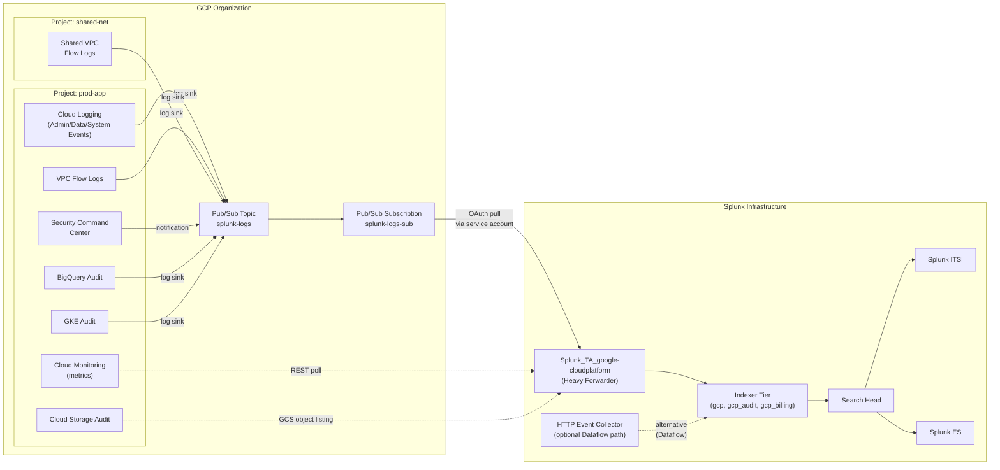

# Google Cloud Platform (GCP) Integration Guide

> The definitive guide to monitoring Google Cloud Platform with Splunk.
> 40 use cases covering Cloud Audit Logs (Admin Activity, Data Access,
> System Event), VPC Flow Logs, Cloud Storage IAM, Compute Engine,
> Google Kubernetes Engine (GKE), BigQuery audit, Pub/Sub-based
> ingestion, Security Command Center findings, and billing/cost
> attribution.

---

## Table of Contents

- [Quick Start](#quick-start)
- [Overview](#overview)
- [Architecture and Data Flow](#architecture)
- [Prerequisites](#prerequisites)
- [Service Coverage](#service-coverage)
- [Data Sources Reference](#data-sources)
- [Field Dictionary](#field-dictionary)
- [Sample Events](#sample-events)
- [Pub/Sub-Based Ingestion (Primary)](#pubsub-ingestion)
- [Cloud Storage Bucket Inputs](#storage-input)
- [Cloud Monitoring (Metrics) Input](#monitoring-input)
- [Resource Metadata Input](#metadata-input)
- [Security Command Center](#scc)
- [Splunk-Side Configuration](#splunk-config)
- [Multi-Project / Multi-Folder Strategy](#multi-project)
- [Cross-Product Correlation](#cross-product)
- [CIM Mapping Reference](#cim-mapping)
- [Compliance Mapping](#compliance)
- [Capacity Planning and Sizing](#sizing)
- [Recommended Dashboard Layouts](#dashboards)
- [ITSI Service Modeling](#itsi)
- [SOAR Playbook Examples](#soar)
- [Security Hardening](#security-hardening)
- [Crawl / Walk / Run Roadmap](#roadmap)
- [Validation Checklist](#validation-checklist)
- [Known Limitations and Gaps](#known-limitations)
- [Troubleshooting](#troubleshooting)
- [FAQ](#faq)
- [Glossary](#glossary)
- [References](#references)
- [Contribution and Feedback](#contribution)

---

<a id="quick-start"></a>
## Quick Start — 60 Minutes from Zero to First Telemetry

1. **Install [Splunk Add-on for Google Cloud Platform](https://splunkbase.splunk.com/app/3088)** (`Splunk_TA_google-cloudplatform`) on a Heavy Forwarder + indexers + SH.

2. **Create indexes**:

    ```ini
    [gcp]
    homePath = $SPLUNK_DB/gcp/db
    coldPath = $SPLUNK_DB/gcp/colddb
    thawedPath = $SPLUNK_DB/gcp/thaweddb
    maxDataSize = auto_high_volume
    frozenTimePeriodInSecs = 31536000   # 1 year for compliance
    ```

3. **GCP-side service-account setup**:

    ```bash
    # Create service account in your GCP project
    gcloud iam service-accounts create splunk-ingest \
        --display-name="Splunk Ingest"

    # Grant minimum roles
    gcloud projects add-iam-policy-binding <project-id> \
        --member="serviceAccount:splunk-ingest@<project-id>.iam.gserviceaccount.com" \
        --role="roles/pubsub.subscriber"

    gcloud projects add-iam-policy-binding <project-id> \
        --member="serviceAccount:splunk-ingest@<project-id>.iam.gserviceaccount.com" \
        --role="roles/monitoring.viewer"

    # Generate key
    gcloud iam service-accounts keys create splunk-ingest.json \
        --iam-account=splunk-ingest@<project-id>.iam.gserviceaccount.com
    ```

4. **Set up Cloud Logging → Pub/Sub log sink** (the foundational data path):

    ```bash
    # Create Pub/Sub topic
    gcloud pubsub topics create splunk-logs

    # Create subscription
    gcloud pubsub subscriptions create splunk-logs-sub --topic=splunk-logs

    # Create log sink (Admin Activity logs)
    gcloud logging sinks create splunk-admin-activity \
        pubsub.googleapis.com/projects/<project-id>/topics/splunk-logs \
        --log-filter='logName:"cloudaudit.googleapis.com%2Factivity"'
    ```

5. **Configure the Splunk add-on** — add the Pub/Sub subscription input:

    ```
    Splunk Add-on for Google Cloud Platform > Configuration:
      Account: <project-id>
      Service account key: <upload splunk-ingest.json>
    Inputs:
      Cloud Pub/Sub:
        Subscription: projects/<project-id>/subscriptions/splunk-logs-sub
        Index: gcp
        Sourcetype: google:gcp:pubsub:message
    ```

6. **Validate**:

    ```spl
    index=gcp sourcetype="google:gcp:pubsub:message" earliest=-15m
    | stats count by protoPayload.serviceName
    ```

7. **Activate crawl tier** — UC-4.3.2 (IAM changes), UC-4.3.30 (SCC findings), UC-4.3.38 (storage public access).

---

<a id="overview"></a>
## Overview

### What this guide covers

| Domain | Examples |
|--------|---------|
| **Identity / IAM** | Service account creation, role grants, group membership changes |
| **Compute Engine** | VM creation, deletion, firewall changes, project-wide SSH keys |
| **GKE** | Cluster creation, RBAC changes, workload identity issues |
| **Cloud Storage** | Bucket IAM, public access, deletion protection |
| **VPC / networking** | VPC Flow Logs, firewall rule changes, peering events |
| **BigQuery** | Query audit, dataset access, slot usage |
| **Cloud SQL** | Instance modifications, failover, audit logs |
| **Pub/Sub** | Topic/subscription audit, message volume |
| **Cost / billing** | BigQuery export, budget alerts |
| **Security Command Center** | Aggregated findings (vulns, misconfigs, threats) |

### What's NOT in scope

| Domain | Where to look |
|--------|---------------|
| **GKE workloads (in-cluster)** | [Kubernetes Guide](kubernetes.md) |
| **AWS** | [AWS Guide](aws.md) |
| **Azure** | [Azure Guide](azure.md) |
| **Application performance** | Splunk Observability Cloud |
| **Workspace (Gmail, Drive)** | Separate Workspace Guide (planned) |

### Why one guide for GCP?

GCP differs from AWS/Azure in important ways:

- **Pub/Sub is the primary log delivery mechanism** — there's no S3/Blob equivalent for log streaming
- **IAM is project + folder + organization scoped** — multi-project visibility is critical
- **Service accounts are first-class identities** — different from AWS IAM users
- **Cloud Audit Logs are split into 3 streams** — Admin Activity, Data Access, System Event

This guide uses GCP-native ingestion patterns rather than retrofitting AWS or Azure approaches.

### What good looks like

| Dimension | Without integration | With full deployment |
|-----------|---------------------|----------------------|
| IAM grants in production | Quarterly review | Real-time alert |
| VPC firewall changes | Tribal knowledge | Auditable trail |
| GKE RBAC misconfig | Discovered at incident time | Proactive scan |
| BigQuery query cost | Surprise monthly bill | Per-query attribution |
| SCC findings | Uncoordinated triage | Centralised SOC workflow |
| Cross-project anomaly | Blind spot | Org-wide query |

---

<a id="architecture"></a>
## Architecture and Data Flow



**Three primary ingest patterns:**

1. **Pub/Sub log sink + Splunk pull** — the primary path. Cloud Logging routes to Pub/Sub; Splunk pulls subscriptions.
2. **Cloud Monitoring REST polling** — for metric series.
3. **Cloud Storage GCS bucket polling** — for archived logs not in Pub/Sub (older logs, BigQuery exports, billing CUR).

**Alternative (high-throughput):** Dataflow streaming job pushes Pub/Sub → Splunk HEC. Recommended for very large estates (>5 TB/day) — reduces HF load.

---

<a id="prerequisites"></a>
## Prerequisites

### Splunk requirements

| Item | Detail |
|------|--------|
| **Splunk version** | Splunk Enterprise 9.0+ or Splunk Cloud |
| **Splunkbase add-on** | Splunk_TA_google-cloudplatform 4.x ([Splunkbase 3088](https://splunkbase.splunk.com/app/3088)) |
| **Forwarder** | Heavy Forwarder (modular inputs need persistence) |
| **CIM Add-on** | For Network_Traffic, Authentication, Change models |
| **Splunk App for Google Cloud** | Optional dashboards |

### GCP requirements

| Item | Detail |
|------|--------|
| **Service account** | Per-project or org-level, with minimum roles per data type |
| **APIs enabled** | Cloud Logging, Pub/Sub, Cloud Monitoring (per project) |
| **Pub/Sub topic + subscription** | Per-project or shared (org-level log sink) |
| **Cloud Logging sink** | Routes log streams to Pub/Sub topic |

### Required GCP IAM roles

| Role | Why |
|------|-----|
| `roles/pubsub.subscriber` | Pull messages from subscription |
| `roles/monitoring.viewer` | Read metrics |
| `roles/storage.objectViewer` | Read archived logs from GCS |
| `roles/logging.viewer` | Read logs directly (fallback) |
| `roles/iam.securityReviewer` | Read SCC findings (org-level) |
| `roles/billing.viewer` | Read billing data |

### Network requirements

| Item | Detail |
|------|--------|
| **Outbound HTTPS 443** | Splunk HF → `*.googleapis.com` |
| **VPC Service Controls** | Configure Splunk HF in service perimeter if applicable |

---

<a id="service-coverage"></a>
## Service Coverage

| GCP service | Log type | Pub/Sub recommended | Common UCs |
|------------|---------|---------------------|------------|
| **IAM** | Admin Activity | Yes | UC-4.3.2 (IAM changes) |
| **Compute Engine** | Admin Activity, System Event | Yes | UC-4.3.x VM lifecycle |
| **VPC Networking** | Admin Activity, VPC Flow Logs | Yes | UC-4.3.x firewall changes |
| **Cloud Storage** | Admin Activity, Data Access | Yes | UC-4.3.38 public buckets |
| **GKE** | Admin Activity, audit logs | Yes | UC-4.3.x cluster changes |
| **BigQuery** | Data Access (high vol), Admin | Yes (caution: cost) | Query audit |
| **Cloud SQL** | Admin Activity | Yes | DB lifecycle |
| **Pub/Sub** | Admin Activity | Yes | Topic/sub changes |
| **Cloud KMS** | Admin Activity, Data Access | Yes | Key access audit |
| **Security Command Center** | Findings via Pub/Sub notifications | Yes | UC-4.3.30 |
| **Cloud DNS** | Admin Activity | Yes | DNS zone changes |
| **Cloud Run / Functions** | Admin Activity | Yes | Serverless lifecycle |
| **Billing / Cost** | Daily BigQuery export → GCS | GCS input | Per-project cost UCs |
| **Cloud Monitoring** | Metric series | REST poll | Per-app perf |

---

<a id="data-sources"></a>
## Data Sources Reference

### Cloud Audit Logs (the foundation)

GCP audit logs are split into three streams:

| Stream | Default ON | Volume | Used for |
|--------|-----------|--------|----------|
| **Admin Activity** | Yes (always) | Low-medium | All change-tracking UCs |
| **System Event** | Yes (always) | Low | GCP-initiated events (auto-failover, etc.) |
| **Data Access** | NO (must enable) | HIGH | Per-data-record access |
| **Policy Denied** | NO (must enable) | Low-medium | Org-policy enforcement |

**Recommended:** enable Admin Activity + System Event in all projects; Data Access only on sensitive resources (e.g., financial-data BigQuery datasets).

### Sourcetypes (after TA parsing)

| Sourcetype | Source | Used by |
|-----------|--------|---------|
| `google:gcp:pubsub:message` | Pub/Sub-delivered audit logs | Most UCs |
| `google:gcp:monitoring` | Cloud Monitoring REST | Metric UCs |
| `google:gcp:storage` | GCS bucket archived logs | Older / billing |
| `google:gcp:billing:report` | BigQuery billing export | Cost UCs |
| `google:gcp:resource:metadata` | Asset Inventory API | Inventory UCs |
| `google:gcp:scc:findings` | SCC notifications | Security UCs |

### Common Cloud Audit Log fields (in Pub/Sub messages)

| Field | Example | Description |
|-------|---------|-------------|
| `protoPayload.serviceName` | `iam.googleapis.com` | Which GCP service |
| `protoPayload.methodName` | `SetIamPolicy` | Which API method called |
| `protoPayload.authenticationInfo.principalEmail` | `user@example.com` / `service-acct@project.iam.gserviceaccount.com` | Who acted |
| `protoPayload.authorizationInfo` | array of permissions checked | What was allowed |
| `protoPayload.requestMetadata.callerIp` | `203.0.113.5` | Source IP |
| `protoPayload.requestMetadata.callerSuppliedUserAgent` | `gcloud/...` | Client identification |
| `protoPayload.resourceName` | `projects/my-project/serviceAccounts/...` | Which resource |
| `resource.type` | `gce_instance` / `gcs_bucket` / `bigquery_dataset` | Resource class |
| `resource.labels.project_id` | `my-project` | Project context |
| `resource.labels.location` | `us-central1` | Region |
| `severity` | `NOTICE` / `WARNING` / `ERROR` | Log severity |
| `timestamp` | `2026-04-25T14:30:00Z` | When |

### VPC Flow Log fields

| Field | Example |
|-------|---------|
| `jsonPayload.connection.src_ip` | `10.0.0.5` |
| `jsonPayload.connection.dest_ip` | `192.168.1.1` |
| `jsonPayload.connection.src_port` | `49234` |
| `jsonPayload.connection.dest_port` | `443` |
| `jsonPayload.connection.protocol` | `6` (TCP) |
| `jsonPayload.bytes_sent` | `1234` |
| `jsonPayload.packets_sent` | `12` |
| `jsonPayload.start_time` / `end_time` | `2026-04-25T14:30:00Z` |
| `jsonPayload.src_instance.vm_name` | `web-1` |
| `jsonPayload.dest_instance.vm_name` | `db-1` |
| `jsonPayload.reporter` | `SRC` / `DEST` |

---

<a id="field-dictionary"></a>
## Field Dictionary

After ingesting Pub/Sub messages, common fields available via `spath`:

```spl
# Extract who did what
| spath path=protoPayload.authenticationInfo.principalEmail output=user
| spath path=protoPayload.methodName output=action
| spath path=protoPayload.serviceName output=service
| spath path=resource.type output=resource_type
| spath path=resource.labels.project_id output=project_id
| spath path=protoPayload.requestMetadata.callerIp output=src_ip
```

CIM-friendly mappings (after TA + custom field aliases):

| CIM field | GCP source |
|-----------|-----------|
| `user` | `protoPayload.authenticationInfo.principalEmail` |
| `src` | `protoPayload.requestMetadata.callerIp` |
| `action` | `protoPayload.methodName` (mapped to created/modified/deleted) |
| `object` | `protoPayload.resourceName` |
| `change_type` | derived from service name |
| `dvc` | `resource.labels.instance_id` (where applicable) |

---

<a id="sample-events"></a>
## Sample Events

### IAM SetIamPolicy

```json
{
    "protoPayload": {
        "@type": "type.googleapis.com/google.cloud.audit.AuditLog",
        "serviceName": "cloudresourcemanager.googleapis.com",
        "methodName": "SetIamPolicy",
        "authenticationInfo": {
            "principalEmail": "admin@example.com"
        },
        "requestMetadata": {
            "callerIp": "203.0.113.5",
            "callerSuppliedUserAgent": "gcloud/447.0.0 (gpython/3.11.6)"
        },
        "authorizationInfo": [{
            "permission": "resourcemanager.projects.setIamPolicy",
            "granted": true
        }],
        "serviceData": {
            "policyDelta": {
                "bindingDeltas": [{
                    "action": "ADD",
                    "role": "roles/owner",
                    "member": "user:contractor@external.com"
                }]
            }
        }
    },
    "resource": {
        "type": "project",
        "labels": {
            "project_id": "prod-app"
        }
    },
    "timestamp": "2026-04-25T14:30:00Z",
    "severity": "NOTICE",
    "logName": "projects/prod-app/logs/cloudaudit.googleapis.com%2Factivity"
}
```

### VPC Flow Log

```json
{
    "jsonPayload": {
        "connection": {
            "src_ip": "10.0.0.5",
            "dest_ip": "8.8.8.8",
            "src_port": 49234,
            "dest_port": 53,
            "protocol": 17
        },
        "bytes_sent": 68,
        "packets_sent": 1,
        "start_time": "2026-04-25T14:30:00Z",
        "end_time": "2026-04-25T14:30:01Z",
        "src_instance": {
            "vm_name": "app-web-1",
            "zone": "us-central1-a",
            "project_id": "prod-app"
        },
        "src_vpc": {
            "vpc_name": "default",
            "subnet_name": "default-us-central1"
        },
        "reporter": "SRC"
    },
    "resource": {
        "type": "gce_subnetwork",
        "labels": {
            "subnetwork_name": "default-us-central1",
            "location": "us-central1",
            "project_id": "prod-app"
        }
    },
    "timestamp": "2026-04-25T14:30:01Z",
    "logName": "projects/prod-app/logs/compute.googleapis.com%2Fvpc_flows"
}
```

### Storage bucket public access (UC-4.3.38)

```json
{
    "protoPayload": {
        "serviceName": "storage.googleapis.com",
        "methodName": "storage.buckets.setIamPermissions",
        "authenticationInfo": {
            "principalEmail": "developer@example.com"
        },
        "serviceData": {
            "policy": {
                "bindings": [{
                    "role": "roles/storage.objectViewer",
                    "members": ["allUsers"]
                }]
            }
        }
    },
    "resource": {
        "type": "gcs_bucket",
        "labels": {
            "bucket_name": "data-leak-bucket",
            "project_id": "prod-app"
        }
    }
}
```

### SCC Finding (UC-4.3.30)

```json
{
    "finding": {
        "name": "organizations/123/sources/456/findings/abc",
        "parent": "organizations/123/sources/456",
        "resourceName": "//compute.googleapis.com/projects/prod-app/zones/us-central1-a/instances/web-1",
        "state": "ACTIVE",
        "category": "EXTERNAL_IP",
        "severity": "HIGH",
        "createTime": "2026-04-25T14:30:00Z",
        "eventTime": "2026-04-25T14:30:00Z",
        "sourceProperties": {
            "Recommendation": "Remove external IP from VM"
        }
    },
    "resource": {
        "name": "//compute.googleapis.com/projects/prod-app/zones/us-central1-a/instances/web-1",
        "project": "projects/prod-app"
    }
}
```

---

<a id="pubsub-ingestion"></a>
## Pub/Sub-Based Ingestion (Primary)

### Architecture

```
GCP Service → Cloud Logging → Log Sink → Pub/Sub Topic → Pub/Sub Subscription → Splunk Pull
```

### Step-by-step setup

#### 1. Create Pub/Sub topic + subscription

```bash
gcloud pubsub topics create splunk-logs
gcloud pubsub subscriptions create splunk-logs-sub \
    --topic=splunk-logs \
    --ack-deadline=60 \
    --message-retention-duration=7d
```

#### 2. Create log sinks (per stream)

```bash
# Admin Activity (org-level — captures all projects in org)
gcloud logging sinks create splunk-admin-activity-org \
    pubsub.googleapis.com/projects/<topic-project>/topics/splunk-logs \
    --include-children \
    --organization=<org-id> \
    --log-filter='logName:"cloudaudit.googleapis.com%2Factivity"'

# Data Access (per project, when enabled)
gcloud logging sinks create splunk-data-access \
    pubsub.googleapis.com/projects/<topic-project>/topics/splunk-logs \
    --project=<project-id> \
    --log-filter='logName:"cloudaudit.googleapis.com%2Fdata_access"'

# System Event
gcloud logging sinks create splunk-system-event-org \
    pubsub.googleapis.com/projects/<topic-project>/topics/splunk-logs \
    --include-children \
    --organization=<org-id> \
    --log-filter='logName:"cloudaudit.googleapis.com%2Fsystem_event"'

# VPC Flow Logs
gcloud logging sinks create splunk-vpc-flow \
    pubsub.googleapis.com/projects/<topic-project>/topics/splunk-logs \
    --include-children \
    --organization=<org-id> \
    --log-filter='resource.type="gce_subnetwork" AND logName:"vpc_flows"'

# After each, grant the sink's writer SA Pub/Sub Publisher role on the topic:
SINK_SA=$(gcloud logging sinks describe splunk-admin-activity-org \
    --organization=<org-id> --format='value(writerIdentity)')
gcloud pubsub topics add-iam-policy-binding splunk-logs \
    --member=$SINK_SA --role=roles/pubsub.publisher
```

#### 3. Configure Splunk add-on

```ini
# inputs.conf
[google_cloud_pubsub://prod-logs]
google_credentials_name = prod-app
google_subscription_name = splunk-logs-sub
google_project = <topic-project>
disabled = false
index = gcp
sourcetype = google:gcp:pubsub:message
```

#### 4. (Optional) Per-stream sourcetype mapping

If you want different sourcetypes per stream (e.g., `gcp:audit:admin`, `gcp:audit:data_access`), build separate Pub/Sub topics + subscriptions and inputs.

---

<a id="storage-input"></a>
## Cloud Storage Bucket Inputs

For data not delivered via Pub/Sub (older logs, BigQuery cost exports, GCS access logs):

```ini
# inputs.conf
[google_cloud_storage://billing]
google_credentials_name = prod-app
google_bucket_name = my-billing-export
google_object_name_prefix = billing/
disabled = false
index = gcp_billing
sourcetype = google:gcp:billing:report
```

The TA will track ingested objects to avoid duplicates.

---

<a id="monitoring-input"></a>
## Cloud Monitoring (Metrics) Input

```ini
# inputs.conf
[google_cloud_monitor_metric://prod-app]
google_credentials_name = prod-app
google_project = prod-app
google_metrics = compute.googleapis.com/instance/cpu/utilization,compute.googleapis.com/instance/network/sent_bytes_count
google_metrics_interval = 300
disabled = false
index = gcp
sourcetype = google:gcp:monitoring
```

For high-volume metric ingestion, consider Splunk Observability Cloud + GCP integration instead — purpose-built for metrics workloads.

---

<a id="metadata-input"></a>
## Resource Metadata Input

Polls Cloud Asset Inventory for periodic snapshots of all resources:

```ini
# inputs.conf
[google_cloud_resource_metadata://inventory]
google_credentials_name = prod-app
google_project = prod-app
disabled = false
index = gcp
sourcetype = google:gcp:resource:metadata
interval = 86400  # daily
```

Useful for inventory dashboards and detection of unmanaged resources.

---

<a id="scc"></a>
## Security Command Center

SCC is GCP's centralised security finding store. Set up Pub/Sub notifications for SCC:

```bash
# In SCC console:
# Settings > Notifications > Add Notification
# - Notification name: splunk-findings
# - Filter: state="ACTIVE" AND severity!="LOW"
# - Pub/Sub topic: projects/<topic-project>/topics/splunk-logs
```

Splunk pulls these via the same Pub/Sub subscription. Filter:

```spl
index=gcp sourcetype="google:gcp:pubsub:message" sourceProperties.ResourceName=*
| spath path=finding
| stats count by finding.severity, finding.category
```

---

<a id="splunk-config"></a>
## Splunk-Side Configuration

### Index strategy

```ini
[gcp]
homePath = $SPLUNK_DB/gcp/db
maxDataSize = auto_high_volume
frozenTimePeriodInSecs = 31536000   # 1 year

[gcp_audit]
# Optional: separate audit log index
homePath = $SPLUNK_DB/gcp_audit/db
maxDataSize = auto_high_volume
frozenTimePeriodInSecs = 220752000  # 7 years (compliance)

[gcp_billing]
homePath = $SPLUNK_DB/gcp_billing/db
maxDataSize = auto_high_volume
frozenTimePeriodInSecs = 31536000
```

### Datamodel acceleration

| Data Model | Why |
|-----------|-----|
| **Authentication** | Service account auth, IAM grants |
| **Change** | All admin activity |
| **Network_Traffic** | VPC Flow Logs |
| **Web** | (when GCS public buckets are accessed via HTTP) |
| **Alerts** | SCC findings |
| **Inventory** | Resource metadata |

---

<a id="multi-project"></a>
## Multi-Project / Multi-Folder Strategy

### Org-level log sink (recommended)

```bash
# One log sink at the org root, --include-children captures all projects + folders
gcloud logging sinks create splunk-admin-activity-org \
    pubsub.googleapis.com/projects/<central-project>/topics/splunk-logs \
    --include-children \
    --organization=<org-id> \
    --log-filter='logName:"cloudaudit.googleapis.com%2Factivity"'
```

This means **a single Pub/Sub topic + Splunk input captures every project in the org** — much simpler than per-project sinks.

### Service account considerations

- Use a dedicated **central project** for the Pub/Sub topic and the Splunk service account
- Grant the org-level log sink writer SA permission to publish to the topic
- Avoid putting the topic in a workload project (separation of duties)

### Folder-level scoping

If multiple business units share an org but need separate Splunk indexes:

```bash
gcloud logging sinks create splunk-bu-a \
    pubsub.googleapis.com/projects/<central-project>/topics/splunk-bu-a \
    --include-children \
    --folder=<folder-id-bu-a>
```

Then per-BU indexes in Splunk: `gcp_bu_a`, `gcp_bu_b`.

---

<a id="cross-product"></a>
## Cross-Product Correlation

### GCP IAM + GitHub (developer access)

```spl
(index=gcp protoPayload.methodName="SetIamPolicy" 
  bindings.role IN ("roles/owner", "roles/editor"))
| join type=left protoPayload.authenticationInfo.principalEmail
    [ search index=github sourcetype="github:audit" event_type="repo.add_member"
      | rename actor as principalEmail ]
| stats count by principalEmail, role, project_id
```

### GCP VPC Flow + Compute Engine (which VM is talking to which)

```spl
(index=gcp jsonPayload.connection.src_ip=*
  | rename jsonPayload.src_instance.vm_name as src_vm,
           jsonPayload.dest_instance.vm_name as dest_vm)
| stats sum(bytes_sent) as total_bytes by src_vm, dest_vm
| where total_bytes > 1000000000
```

### GCP IAM + AD/Entra (workforce identity)

When using Workforce Identity Federation:

```spl
(index=gcp protoPayload.authenticationInfo.principalSubject="user:...")
| join type=left principalSubject
    [ search index=entra sourcetype="azure:eventhub:audit" 
      activity="Sign-in"
      | rename userPrincipalName as principalSubject ]
```

### GCP SCC + ITSI (security service health)

Use SCC findings as KPI inputs for ITSI security services. Critical findings page; high findings warn.

---

<a id="cim-mapping"></a>
## CIM Mapping Reference

| CIM model | GCP source | Mapping |
|-----------|-----------|---------|
| **Authentication** | `protoPayload.authenticationInfo` | `user`, `action`, `signature` |
| **Change** | All admin activity | `action` (created/modified/deleted), `object`, `user`, `dvc` |
| **Network_Traffic** | VPC Flow Logs | `src`, `dest`, `transport`, `bytes_in/out` |
| **Web** | Storage public access | `url`, `bytes`, `status` |
| **Alerts** | SCC findings | `signature`, `severity`, `category`, `dvc` |
| **Inventory** | Resource metadata | `dest`, `os`, `version`, `type` |

Validate:

```spl
| tstats summariesonly=true count from datamodel=Change.All_Changes 
  where vendor="Google Cloud Platform" by action, change_type
```

---

<a id="compliance"></a>
## Compliance Mapping

### NIST 800-53 (rev 5)

| Control | UC examples |
|---------|------------|
| **AU-2** Audit Events | Admin Activity log enforcement |
| **AU-3** Content of Audit Records | Cloud audit log structure |
| **AU-12** Audit Generation | Foundational |
| **AC-2** Account Management | UC-4.3.2 (IAM changes) |
| **AC-6** Least Privilege | IAM grants UCs |
| **CM-3** Configuration Change Control | Admin activity for resource changes |
| **SC-7** Boundary Protection | VPC firewall UCs, UC-4.3.38 |
| **SI-4** System Monitoring | SCC findings UC-4.3.30 |

### CIS GCP Foundations Benchmark

| Section | Coverage |
|---------|----------|
| 1.x IAM | UC-4.3.2 + service account UCs |
| 2.x Logging | Foundational |
| 3.x Networking | VPC firewall UCs, UC-4.3.38 |
| 4.x VMs | Compute Engine UCs |
| 5.x Storage | UC-4.3.38 (public bucket) |
| 6.x Cloud SQL | DB UCs |
| 7.x BigQuery | BigQuery UCs |

### PCI-DSS 4.0

| Requirement | Coverage |
|-------------|----------|
| **8.3** Strong authentication | Service account UCs |
| **10.2** Audit logging | Foundational |
| **10.7** Audit retention (1 year+) | `gcp_audit` index policy |

### HIPAA Security Rule

| §164.312 | Coverage |
|---------|----------|
| (a)(2)(i) Unique user ID | IAM UCs |
| (b) Audit Controls | All admin activity |
| (e) Transmission Security | TLS UCs |

### GDPR

| Article | Coverage |
|---------|----------|
| Art 30 Records of processing | Cloud audit logs |
| Art 32 Security of processing | All security UCs |
| Art 33 Breach notification | SCC + alerting |

---

<a id="sizing"></a>
## Capacity Planning and Sizing

### Per-stream daily ingest (typical)

| Stream | Per project per day |
|--------|---------------------|
| Admin Activity | 10–100 MB |
| System Event | 5–50 MB |
| Data Access (DON'T enable everywhere) | 1–10 GB |
| VPC Flow (sampled 1:10) | 100 MB – 5 GB |
| BigQuery audit | 50 MB – 5 GB |
| GKE audit (kube-apiserver) | 200 MB – 5 GB |
| SCC findings | 10–100 MB |
| Cloud Monitoring (10 metrics × 100 resources @ 5min) | 50 MB |

### Worked examples

| Estate | Projects | Daily ingest |
|--------|---------|-------------|
| Small (10 projects, no Data Access) | 10 | ~3 GB/day |
| Mid (100 projects, VPC flow on critical) | 100 | ~30 GB/day |
| Large (1000 projects, full coverage) | 1000 | ~500 GB/day |
| Enterprise org with deep telemetry | 5000+ | ~3 TB/day |

### Retention recommendations

| Data | Retention | Rationale |
|------|-----------|-----------|
| Admin Activity | 1 year hot+warm; 7 year cold | Compliance |
| Data Access | 90 days hot; 1 year cold | DFIR |
| VPC Flow | 30 days hot; 90 days cold | Forensic |
| SCC | 1 year | Audit trail |
| Billing | 13 months | Year-over-year analysis |

---

<a id="dashboards"></a>
## Recommended Dashboard Layouts

### Crawl — "GCP At a Glance"

```
+---------------------+---------------------+
| IAM CHANGES (24H)   | SCC HIGH+ FINDINGS  |
+---------------------+---------------------+
| TOP RESOURCE CHANGES| TOP USERS BY ACTIVITY|
+---------------------+---------------------+
| FAILED AUTH ATTEMPTS| EXTERNAL IP CHANGES |
+---------------------+---------------------+
```

### Walk — "Cost & Capacity"

```
+---------------------+---------------------+
| TOP-N PROJECTS BY COST                    |
+---------------------+---------------------+
| BIGQUERY SLOT USAGE                       |
+---------------------+---------------------+
| GCE INSTANCE COUNT BY MACHINE TYPE        |
+---------------------+---------------------+
| CLOUD STORAGE GROWTH                      |
+---------------------+---------------------+
```

### Run — "Security & Compliance"

```
+---------------------+---------------------+
| SCC FINDINGS BY CATEGORY                  |
+---------------------+---------------------+
| CIS BENCHMARK COMPLIANCE                  |
+---------------------+---------------------+
| OUT-OF-CHANGE-WINDOW IAM MODS             |
+---------------------+---------------------+
| WORKFORCE FED. EVENTS                     |
+---------------------+---------------------+
```

---

<a id="itsi"></a>
## ITSI Service Modeling

### Service hierarchy

```
GCP Cloud
├── Identity & Access
│   └── IAM (org-wide)
├── Compute
│   ├── GKE Clusters (per cluster entity)
│   └── Compute Engine VMs (per VM entity)
├── Data
│   ├── Cloud SQL (per instance entity)
│   ├── BigQuery (per dataset entity)
│   └── Cloud Storage (per bucket entity)
├── Network
│   └── VPCs (per VPC entity)
└── Security
    └── SCC (org-wide)
```

### Recommended KPIs

| KPI | Source | Threshold |
|-----|--------|-----------|
| IAM grants per hour | Admin Activity | Adaptive |
| SCC critical findings | SCC | Static (page > 0) |
| Service account auth failures | Admin Activity | Adaptive |
| VPC Flow bytes | VPC Flow Logs | Adaptive |
| GKE cluster health | gcloud / metrics | Static |
| Cloud SQL connections | metrics | Static |
| Cost vs budget (per project) | Billing | Static (page > 90%) |

---

<a id="soar"></a>
## SOAR Playbook Examples

### Playbook 1: IAM Owner Grant Outside Change Window

**Trigger:** UC-4.3.2-style alert — `SetIamPolicy` adds `roles/owner` outside change window.

```
1. RECEIVE event (project_id, role, member, principalEmail)
2. CHECK change-management API for matching CR
3. IF no CR → CRITICAL incident
4. PULL prior 30 days of IAM events for same principalEmail
5. CHECK if member is external (not in approved domain list)
6. IF external → P0 incident, page on-call security
7. AUTO-REVERT: remove the binding via gcloud (with approval gate)
8. NOTIFY workspace owner + security team
```

### Playbook 2: Cloud Storage Public Bucket (UC-4.3.38)

**Trigger:** `storage.buckets.setIamPermissions` adds `allUsers` or `allAuthenticatedUsers`.

```
1. RECEIVE event (bucket_name, role, member, principalEmail)
2. PULL bucket contents inventory (count + sample names)
3. CHECK DLP scan results for the bucket
4. IF sensitive data → P1 incident
5. AUTO-REVERT: remove public binding via gsutil iam ch (with gate)
6. NOTIFY data owner + security
7. CREATE compliance ticket
```

### Playbook 3: SCC Critical Finding (UC-4.3.30)

**Trigger:** New SCC finding with severity=CRITICAL.

```
1. RECEIVE finding (category, resource, recommendation)
2. PULL related cloud audit logs around finding eventTime
3. ENRICH with resource owner from Asset Inventory
4. CATEGORISE:
   - Active vulnerability → page hosting team
   - Misconfiguration → page resource owner
   - Threat detection → page CSIRT
5. APPLY recommended remediation if auto-fix safe
6. CREATE incident with full enrichment
```

---

<a id="security-hardening"></a>
## Security Hardening

### Service account

- **Per-input service account** with minimum roles
- **Workload Identity Federation** instead of static keys for Splunk-on-GCP deployments
- Rotate keys every 90 days
- Store keys in Splunk credential store, never in repo

### VPC Service Controls

- Place Splunk HF inside the org's service perimeter
- Pub/Sub topic in a perimeter-bridged project
- Block egress except to allowed Splunk endpoints

### Logging integrity

- Enable Cloud Logging immutability (org policy)
- SCC monitoring for log sink modifications

### Data protection

- DLP scan on logs before ingestion (if PII risk)
- Field-level RBAC in Splunk (financial data → restricted role)

---

<a id="roadmap"></a>
## Crawl / Walk / Run Roadmap

### Crawl (Week 1–2)

1. Install Splunk_TA_google-cloudplatform
2. Set up org-level Admin Activity log sink
3. Create central Pub/Sub topic + subscription
4. Service account + Pub/Sub subscriber role
5. Configure first input + validate
6. UC-4.3.2 (IAM changes) + UC-4.3.30 (SCC) + UC-4.3.38 (public buckets)

### Walk (Week 3–6)

1. Add System Event sink
2. Add VPC Flow Log sink (sampled)
3. Cloud Monitoring metrics input
4. Resource Metadata input
5. CIM acceleration
6. Walk dashboards

### Run (Month 2+)

1. Selective Data Access logging on sensitive resources
2. Multi-project / multi-folder strategy
3. Workforce Identity Federation
4. ITSI services per major workload
5. SOAR playbooks
6. Cost attribution + budget alerts
7. Quarterly compliance attestation

---

<a id="validation-checklist"></a>
## Validation Checklist

### Day 1

- [ ] Splunk_TA_google-cloudplatform installed
- [ ] Pub/Sub topic + subscription created
- [ ] Service account configured
- [ ] First Admin Activity events visible
- [ ] UC-4.3.2 alert wired

### Day 7

- [ ] All log sinks configured (Admin, System, VPC Flow, SCC)
- [ ] Crawl dashboard live
- [ ] Org-level sink validated
- [ ] CIM Authentication + Change populated

### Day 30

- [ ] Walk-tier UCs deployed
- [ ] Cloud Monitoring metrics flowing
- [ ] First SOAR playbook in production
- [ ] Cost attribution dashboard

### Day 90

- [ ] ITSI services per workload
- [ ] Selective Data Access on sensitive resources
- [ ] Run-tier UCs + dashboards
- [ ] Quarterly compliance attestation

---

<a id="known-limitations"></a>
## Known Limitations and Gaps

| Limitation | Impact | Workaround |
|------------|--------|------------|
| **Data Access logs are very high volume** | Cost | Enable selectively per-resource |
| **Pub/Sub message retention max 7 days** | Splunk outage > 7d → data loss | Multiple subscriptions, monitor lag |
| **VPC Flow Logs not sampled by default** | Massive volume in busy VPCs | Configure sampling 1:10 or higher |
| **SCC notifications only fire on creation/state change** | Can miss findings if Splunk offline | Periodic SCC API poll as backup |
| **Service account keys are long-lived** | Compromise risk | Use Workload Identity Federation |
| **Log sink writer SA permissions on Pub/Sub topic must be granted** | Common setup error | Use deployment automation (Terraform) |
| **BigQuery audit log `Data Access` enabled = HUGE volume** | Cost shock | Filter by dataset; sample if needed |
| **TA polls one subscription at a time** | Throughput limit | Multiple inputs across HFs for high-volume |

---

<a id="troubleshooting"></a>
## Troubleshooting

### No data after setup

1. Check Pub/Sub subscription has unacked messages: `gcloud pubsub subscriptions pull splunk-logs-sub --auto-ack --limit=1`
2. Check Splunk modular input log: `index=_internal source="*google_cloud_pubsub*"`
3. Verify service account has `roles/pubsub.subscriber` on subscription
4. Verify log sink writer SA has `roles/pubsub.publisher` on topic

### Subscription lag growing

- Splunk HF can't keep up — common with VPC Flow at high QPS
- Mitigation:
  - Add more HFs polling same subscription (auto-distributes)
  - Increase `parallelIngestionPipelines` on indexers
  - Or switch to Dataflow → HEC for very high throughput

### Some events missing

- Check log sink filter — too restrictive?
- Check if log type is enabled (Data Access not on by default)
- Check if events are being routed to a different topic by another sink

### Org-level sink not capturing all projects

- Verify `--include-children` flag was used
- New projects added after sink creation are auto-included

### High Pub/Sub costs

- VPC Flow at 100% sample rate is expensive
- Reduce sampling to 1:10
- Filter sink to exclude internal-only flows

### Time skew on events

- Pub/Sub delivery can lag a few seconds
- Splunk extracts `timestamp` field as event time, not Pub/Sub delivery time

---

<a id="faq"></a>
## FAQ

**Q: Pub/Sub vs Dataflow vs direct Cloud Logging API?**
A: Pub/Sub for most workloads (simplest, durable buffer). Dataflow for very high throughput (>5 TB/day) where you want to push directly to Splunk HEC. Direct Cloud Logging API only for ad-hoc / inventory use.

**Q: Can I use Splunk Observability Cloud for GCP metrics?**
A: Yes — for metrics, Splunk Observability is purpose-built and more cost-effective than the Splunk Cloud add-on for high-cardinality metric workloads.

**Q: Should I enable Data Access logs everywhere?**
A: No. Data Access logs are very high volume and most teams only need them on sensitive resources (financial BigQuery datasets, KMS, Secret Manager). Enable per-resource via IAM policy.

**Q: How do I handle multi-org?**
A: One Splunk integration per org. Use per-org service accounts and per-org Pub/Sub topics. Splunk indexes can be shared (`gcp_org_a`, `gcp_org_b`) or unified.

**Q: What about Anthos / multi-cloud GKE?**
A: Anthos clusters in AWS or Azure still emit logs to GCP Cloud Logging — covered by this guide. The cluster's compute layer (the AWS / Azure VMs) needs the appropriate cloud guide.

**Q: GKE workload logs — here or in the K8s guide?**
A: The K8s control plane (kube-apiserver audit) is best ingested via this guide (Pub/Sub). The workload logs (container stdout/stderr) belong in the [Kubernetes Guide](kubernetes.md).

**Q: How do I detect cryptomining VMs?**
A: SCC has built-in detectors. Cross-correlate VM metrics (CPU 100% sustained) with VPC Flow (outbound to known mining pool IPs) and IAM (recent VM creation by unusual principal).

**Q: Cloud Logging vs Cloud Monitoring — what's the difference?**
A: Cloud Logging = log events (audit, app logs). Cloud Monitoring = numeric metrics. Both reachable in Splunk, different inputs.

---

<a id="glossary"></a>
## Glossary

| Term | Definition |
|------|-----------|
| **GCP** | Google Cloud Platform |
| **GCS** | Google Cloud Storage |
| **GCE** | Google Compute Engine |
| **GKE** | Google Kubernetes Engine |
| **Cloud Logging** | GCP's log aggregation service (formerly Stackdriver Logging) |
| **Cloud Monitoring** | GCP's metric service (formerly Stackdriver Monitoring) |
| **Cloud Audit Logs** | The 4 audit log streams (Admin, Data Access, System, Policy) |
| **Pub/Sub** | GCP's message queue service |
| **Log sink** | Configuration that routes logs to a destination |
| **SCC** | Security Command Center |
| **WIF** | Workload Identity Federation |
| **CUR** | Cost & Usage Report (GCP billing export) |
| **Anthos** | GCP's hybrid/multi-cloud platform |
| **CMEK** | Customer-Managed Encryption Keys |

---

<a id="references"></a>
## References

- [Splunk Add-on for Google Cloud Platform](https://splunkbase.splunk.com/app/3088)
- [Splunk App for Google Cloud Platform (dashboards)](https://splunkbase.splunk.com/app/3217)
- [GCP Cloud Audit Logs documentation](https://cloud.google.com/logging/docs/audit)
- [GCP Pub/Sub log routing](https://cloud.google.com/logging/docs/routing/pubsub)
- [CIS GCP Foundations Benchmark](https://www.cisecurity.org/benchmark/google_cloud_computing_platform)
- [Splunk + GCP reference architecture](https://cloud.google.com/architecture/exporting-stackdriver-logging-for-splunk)

---

<a id="contribution"></a>
## Contribution and Feedback

Part of the [Splunk Monitoring Use Cases](https://github.com/fenre/splunk-monitoring-use-cases) project. [Open an issue](https://github.com/fenre/splunk-monitoring-use-cases/issues/new).

---

*Last updated: 2026-05-09. Covers Splunk_TA_google-cloudplatform 4.x.*
