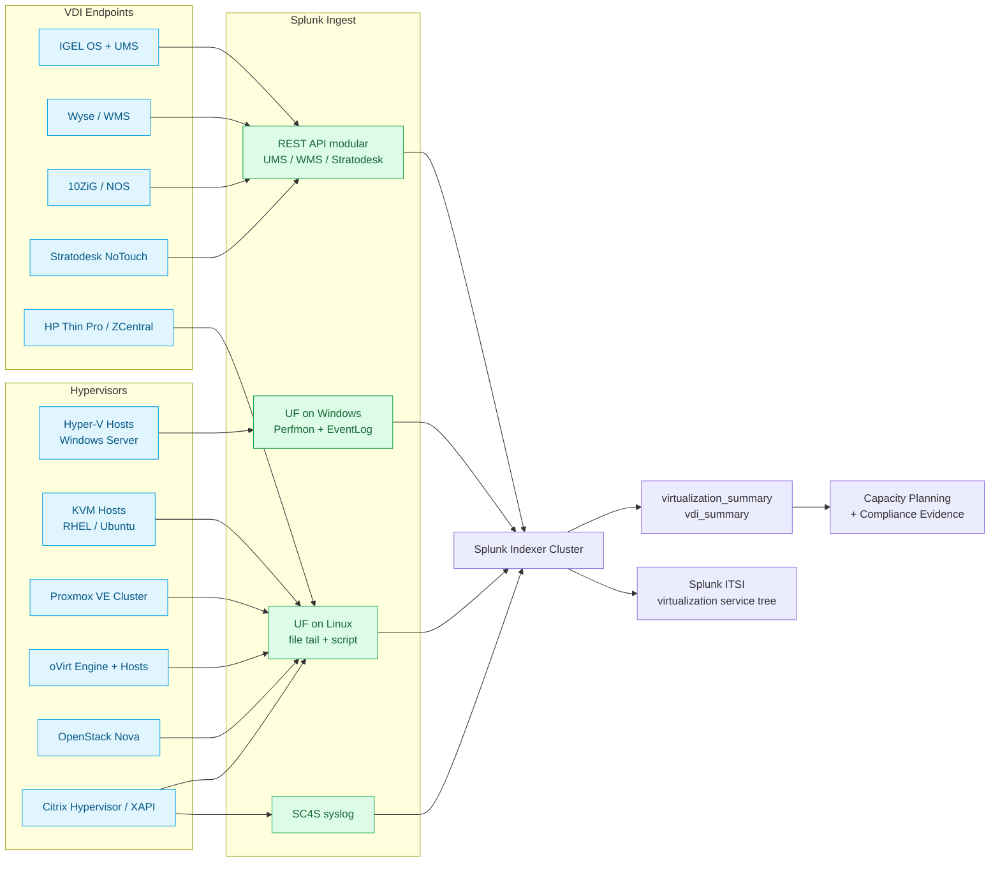

# Hypervisors Beyond VMware — Hyper-V, KVM, Proxmox, oVirt, OpenStack & VDI Endpoints Integration Guide

> Operational, security, and compliance monitoring for the **non-VMware**
> virtualization stack — Microsoft Hyper-V (cat 2.2), KVM / Proxmox VE
> / oVirt / OpenStack (cat 2.3), cross-platform virtualization concerns
> applicable to all hypervisors (cat 2.4), and VDI thin-client endpoint
> management (cat 2.5). Companion guide to `vmware-vsphere.md` (cat 2.1)
> and `compute-hci.md` (cat 19, including Nutanix AHV).

## Table of Contents

- [Quick Start — From Zero to First Hyper-V or KVM Visibility](#quick-start--from-zero-to-first-hyper-v-or-kvm-visibility)
- [Overview](#overview)
- [Architecture and Data Flow](#architecture-and-data-flow)
- [Prerequisites](#prerequisites)
- [Domain 1 — Microsoft Hyper-V (cat 2.2, 15 UCs)](#domain-1--microsoft-hyper-v-cat-22-15-ucs)
- [Domain 2 — KVM / Proxmox / oVirt / OpenStack (cat 2.3, 17 UCs)](#domain-2--kvm--proxmox--ovirt--openstack-cat-23-17-ucs)
- [Domain 3 — Cross-Platform Virtualization (cat 2.4, 7 UCs)](#domain-3--cross-platform-virtualization-cat-24-7-ucs)
- [Domain 4 — VDI Endpoints / Thin Clients (cat 2.5, 10 UCs)](#domain-4--vdi-endpoints--thin-clients-cat-25-10-ucs)
- [Sizing and Capacity Planning](#sizing-and-capacity-planning)
- [Compliance and Audit Evidence Pack](#compliance-and-audit-evidence-pack)
- [Crawl / Walk / Run Roadmap](#crawl--walk--run-roadmap)
- [Dashboards](#dashboards)
- [SPL Examples](#spl-examples)
- [Troubleshooting](#troubleshooting)
- [SOAR Playbooks](#soar-playbooks)
- [Cross-Product Integration](#cross-product-integration)

## Quick Start — From Zero to First Hyper-V or KVM Visibility

### Day 1: Inventory by hypervisor

| Hypervisor | Where it runs | Splunk add-on / method |
|---|---|---|
| Hyper-V | Windows Server hosts | Splunk_TA_windows + Perfmon + WinEventLog |
| KVM | RHEL / Ubuntu / SLES hosts | Splunk_TA_nix + libvirt + virsh + audit |
| Proxmox VE | Proxmox cluster nodes | UF + REST API + cluster log files |
| oVirt / RHV | engine + hosts | UF + engine log + REST API |
| OpenStack | Nova compute nodes | UF + Nova/Cinder/Neutron logs |
| Citrix Hypervisor (XenServer) | XAPI hosts | UF + xensource.log + XAPI |
| Nutanix AHV | covered by `compute-hci.md` | Prism API |

### Day 2: Stand up indexes

```ini
[virtualization]
homePath = $SPLUNK_DB/virtualization/db
coldPath = $SPLUNK_DB/virtualization/colddb
thawedPath = $SPLUNK_DB/virtualization/thaweddb
maxDataSize = auto_high_volume
frozenTimePeriodInSecs = 31536000

[virtualization_summary]
homePath = $SPLUNK_DB/virtualization_summary/db
coldPath = $SPLUNK_DB/virtualization_summary/colddb
thawedPath = $SPLUNK_DB/virtualization_summary/thaweddb
maxDataSize = auto
frozenTimePeriodInSecs = 220752000

[hyperv]
homePath = $SPLUNK_DB/hyperv/db
coldPath = $SPLUNK_DB/hyperv/colddb
thawedPath = $SPLUNK_DB/hyperv/thaweddb
maxDataSize = auto_high_volume
frozenTimePeriodInSecs = 31536000

[kvm]
homePath = $SPLUNK_DB/kvm/db
coldPath = $SPLUNK_DB/kvm/colddb
thawedPath = $SPLUNK_DB/kvm/thaweddb
maxDataSize = auto_high_volume
frozenTimePeriodInSecs = 31536000

[vdi_endpoint]
homePath = $SPLUNK_DB/vdi_endpoint/db
coldPath = $SPLUNK_DB/vdi_endpoint/colddb
thawedPath = $SPLUNK_DB/vdi_endpoint/thaweddb
maxDataSize = auto
frozenTimePeriodInSecs = 7776000

[vdi_summary]
homePath = $SPLUNK_DB/vdi_summary/db
coldPath = $SPLUNK_DB/vdi_summary/colddb
thawedPath = $SPLUNK_DB/vdi_summary/thaweddb
maxDataSize = auto
frozenTimePeriodInSecs = 31536000
```

### Day 3: Hyper-V — wire up Perfmon + WinEventLog

Splunk_TA_windows has Hyper-V Perfmon templates built in. Enable them on
each Hyper-V host's UF:

```ini
[perfmon://Hyper-V Hypervisor Logical Processor]
counters = % Total Run Time; % Hypervisor Run Time; % Guest Run Time
instances = *
interval = 60
disabled = 0
sourcetype = perfmon:hyperv:hypervisor
index = hyperv

[perfmon://Hyper-V Dynamic Memory VM]
counters = Current Pressure; Average Pressure; Memory Add Operations/sec; Memory Remove Operations/sec
instances = *
interval = 60
disabled = 0
sourcetype = perfmon:hyperv:dynamicmemory
index = hyperv

[perfmon://Hyper-V Virtual Machine Health Summary]
counters = Health Critical; Health Ok
instances = *
interval = 60
disabled = 0
sourcetype = perfmon:hyperv:vm:health
index = hyperv

[WinEventLog://Microsoft-Windows-Hyper-V-Worker-Admin]
disabled = 0
sourcetype = WinEventLog:Microsoft-Windows-Hyper-V-Worker
index = hyperv

[WinEventLog://Microsoft-Windows-Hyper-V-VMMS-Admin]
disabled = 0
sourcetype = WinEventLog:Microsoft-Windows-Hyper-V-VMMS-Admin
index = hyperv

[WinEventLog://Microsoft-Windows-FailoverClustering-Operational]
disabled = 0
sourcetype = WinEventLog:Microsoft-Windows-FailoverClustering
index = hyperv
```

### Day 4: KVM — wire up libvirt + virsh

On each KVM host:

```ini
[script:///opt/splunk/bin/scripts/virsh_domstats.sh]
interval = 60
sourcetype = libvirt:domstats
index = kvm

[script:///opt/splunk/bin/scripts/virsh_nodestats.sh]
interval = 300
sourcetype = libvirt:nodestats
index = kvm

[monitor:///var/log/libvirt/libvirtd.log]
sourcetype = libvirt:event
index = kvm

[monitor:///var/log/libvirt/qemu/*.log]
sourcetype = kvm:qemu
index = kvm
```

`virsh_domstats.sh`:

```bash
#!/bin/bash
# Returns per-VM stats as JSON, one event per VM
for dom in $(virsh list --name); do
  virsh domstats "$dom" --raw --backing | \
    python3 -c "
import sys, json, datetime
d = {'_time': datetime.datetime.now().isoformat(), 'vm': '$dom', 'host': '$(hostname)'}
for line in sys.stdin:
  if '=' in line:
    k, v = line.strip().split('=', 1)
    d[k] = v
print(json.dumps(d))
"
done
```

### Day 5: First three dashboards

- VM density per host (Hyper-V + KVM + Proxmox)
- VM CPU + memory utilisation per host
- Failover Cluster / Corosync health

### Day 6–7: VDI thin-client visibility (cat 2.5)

If you have IGEL / Wyse / Stratodesk / 10ZiG fleet:
- Configure UMS / WMS / Center to send REST telemetry to Splunk
- Stand up `vdi_endpoint` index
- Build first online/offline status dashboard (UC-2.5.1)

## Overview

### Why "hypervisors beyond VMware"?

VMware vSphere has the dominant enterprise hypervisor market share, but
**every large enterprise also runs at least one other hypervisor**:

- **Microsoft Hyper-V** ships with every Windows Server and powers most
  Windows-only data centres, Azure Stack HCI deployments, and the
  Hyper-V foundation under Azure Local.
- **KVM** powers most public cloud (AWS Nitro, Google KVM, OpenStack
  Nova, Oracle OCI) and most Linux-native private cloud deployments.
- **Proxmox VE** has displaced VMware in many SMB and mid-market
  deployments after Broadcom's VMware acquisition pricing changes
  (2024–2025).
- **oVirt / RHV** powers most Red Hat / IBM Virtualization estates.
- **Nutanix AHV** powers most Nutanix HCI deployments (covered by
  `compute-hci.md`).
- **Citrix Hypervisor (XenServer)** powers Citrix-only data centres and
  some legacy VDI deployments.

### Why monitor non-VMware hypervisors in Splunk

Five answers:

1. **Cross-hypervisor capacity planning**: a single VM-density and
   resource-utilisation dashboard that includes VMware + Hyper-V + KVM +
   Proxmox is impossible in any single vendor tool.
2. **Snapshot age and backup coverage validation across all
   hypervisors** for SOX / PCI / HIPAA evidence.
3. **Guest OS end-of-life tracking** independent of which hypervisor
   the guest runs on — a Windows Server 2012 VM is equally non-compliant
   on Hyper-V, KVM, or VMware.
4. **VDI thin-client fleet management** for IGEL / Wyse / Stratodesk
   / 10ZiG that no single VDI broker covers because they're hardware
   from different vendors.
5. **Failover-cluster / corosync / heartbeat health** correlation with
   storage and networking layers.

### Domains covered

| Sub | Name | UCs | Highlight |
|---|---|---|---|
| 2.2 | Microsoft Hyper-V | 15 | S2D health, Live Migration tracking, Replica state |
| 2.3 | KVM / Proxmox / oVirt | 17 | virsh domstats, Proxmox PVE cluster, Corosync quorum |
| 2.4 | Cross-Platform Virtualization | 7 | guest OS EOL, VM backup coverage, density trending |
| 2.5 | VDI Endpoint Management | 10 | IGEL UMS, fleet online/offline, firmware compliance |

### What "good" looks like

| KPI | Healthy target | Source |
|---|---|---|
| Cluster quorum | 100% across all hypervisor clusters | FCM / Corosync |
| Live Migration success rate | > 99% | Hyper-V VMMS / virsh |
| VM backup coverage | 100% of VMs backed up in last 24h | cross-platform UC-2.4.2 |
| Snapshot age | < 7 days for active snapshots | cross-platform UC-2.4.x |
| Guest OS EOL | 0% running EOL OS | cross-platform UC-2.4.1 |
| VDI fleet online | > 98% during business hours | IGEL UMS / Wyse |
| VDI firmware compliance | > 95% on approved version | IGEL UMS / Wyse / Stratodesk |

## Architecture and Data Flow



### Core principles

1. **One UF per host, every host.** Hypervisors host multiple VMs but
   the operational telemetry comes from the host, not the guests.
2. **Don't forget the guest OS.** Guest OS EOL tracking (UC-2.4.1) is
   the single highest-impact cross-platform UC because it surfaces
   compliance risk regardless of which hypervisor the guest runs on.
3. **Hyper-V Replica is monitoring-critical.** Hyper-V Replica failures
   silently delay disaster-recovery readiness; UC-2.2.6 catches them
   before the next quarterly DR test.
4. **Proxmox cluster quorum is the canary.** Proxmox VE clusters
   silently degrade when corosync loses quorum on one node; UC-2.3.12
   catches it at the source.
5. **VDI thin-client telemetry is JSON over REST.** Don't try to scrape
   syslog from IGEL / Wyse — use the UMS / WMS REST APIs.

## Prerequisites

### Pre-deployment checklist

- [ ] Hypervisor inventory complete
- [ ] Splunk indexes pre-created
- [ ] Splunk_TA_windows installed on Hyper-V hosts
- [ ] Splunk_TA_nix installed on KVM / Proxmox / oVirt / OpenStack hosts
- [ ] Service-account credentials for cluster-admin operations created
- [ ] PowerShell remoting / WinRM enabled on Hyper-V hosts (for scripted
  inputs that call `Get-VM`, `Get-StoragePool`)
- [ ] libvirt access permissions configured for splunk service account
  on KVM hosts
- [ ] Proxmox PVE API token created (for cluster + VM status REST)
- [ ] OpenStack `keystone` admin token / app credential for Nova /
  Cinder / Neutron polling
- [ ] IGEL UMS REST API user account
- [ ] Wyse WMS / Stratodesk Center / 10ZiG API credentials
- [ ] CIM compliance for Performance, Inventory, Authentication

### Splunk components used

- **Splunk Enterprise / Cloud**
- **Splunk Add-on for Microsoft Windows** (for Hyper-V)
- **Splunk Add-on for Unix and Linux** (for KVM / OpenStack / oVirt)
- **Splunk ITSI** — virtualization service tree
- **MLTK** — VM density forecasting, capacity planning
- **Splunk Enterprise Security** — guest-OS EOL evidence, snapshot
  age compliance

## Domain 1 — Microsoft Hyper-V (cat 2.2, 15 UCs)

The Hyper-V control plane lives in Windows Server hosts. Every signal
comes from PowerShell counters, Perfmon performance counters, or
Windows Event Log channels.

### Highlight UCs

- **UC-2.2.1** — VM Performance Monitoring (CPU, memory, disk, network
  per VM)
- **UC-2.2.6** — Hyper-V Replica State Tracking (UC-2.2.6 in this
  family)
- **UC-2.2.10** — Failover Cluster Node Health and Quorum
- **UC-2.2.11** — Storage Spaces Direct (S2D) Health
- **UC-2.2.12** — VM Generation 2 + Secure Boot Compliance
- **UC-2.2.13** — Hyper-V Live Migration timing & success rate
- **UC-2.2.14** — Hyper-V Replica Time-Lag (Recovery Point Objective)
- **UC-2.2.15** — Hyper-V Network ATC Compliance

### Configuration — PowerShell scripted input for S2D

```ini
[script://. \bin\scripts\hyperv_s2d_health.ps1]
interval = 300
sourcetype = hyperv:powershell:s2d
index = hyperv
```

`hyperv_s2d_health.ps1`:

```powershell
$cluster = Get-Cluster
$nodes = Get-StorageNode | Select-Object Name, OperationalStatus, HealthStatus
$pools = Get-StoragePool | Where-Object IsPrimordial -eq $false |
    Select-Object FriendlyName, OperationalStatus, HealthStatus, Size, AllocatedSize
$volumes = Get-Volume | Where-Object FileSystem -eq "CSVFS" |
    Select-Object DriveLetter, FileSystemLabel, HealthStatus, OperationalStatus, Size, SizeRemaining

@{
    Cluster = $cluster.Name
    Nodes = $nodes
    Pools = $pools
    Volumes = $volumes
} | ConvertTo-Json -Depth 5
```

## Domain 2 — KVM / Proxmox / oVirt / OpenStack (cat 2.3, 17 UCs)

### KVM

The libvirt + virsh stack is the universal interface. `virsh domstats`
gives per-VM CPU/memory/disk/network at sub-minute resolution.

### Proxmox VE

Proxmox has its own `pvesh` CLI and REST API. Cluster + VM + storage +
backup all polled from `pvesh get /...`:

```bash
#!/bin/bash
# proxmox_cluster_status.sh
pvesh get /cluster/status --output-format json | \
  python3 -c "import sys,json,datetime; d=json.load(sys.stdin); d_with_ts={'_time':datetime.datetime.now().isoformat(),'data':d}; print(json.dumps(d_with_ts))"
```

```ini
[script:///opt/splunk/bin/scripts/proxmox_cluster_status.sh]
interval = 60
sourcetype = proxmox:cluster
index = proxmox
```

### oVirt / RHV

Engine writes operational events to `/var/log/ovirt-engine/engine.log`
and audit events to `/var/log/ovirt-engine/audit.log`:

```ini
[monitor:///var/log/ovirt-engine/engine.log]
sourcetype = ovirt:engine:log
index = ovirt

[monitor:///var/log/ovirt-engine/audit.log]
sourcetype = ovirt:audit
index = ovirt
```

### OpenStack

Each Nova compute host writes `/var/log/nova/nova-compute.log`. The
controller writes `/var/log/nova/nova-api.log` + Keystone + Cinder +
Neutron logs:

```ini
[monitor:///var/log/nova/nova-compute.log]
sourcetype = openstack:nova
index = openstack

[monitor:///var/log/nova/nova-api.log]
sourcetype = openstack:nova
index = openstack

[monitor:///var/log/keystone/keystone.log]
sourcetype = openstack:keystone
index = openstack

[monitor:///var/log/cinder/cinder-volume.log]
sourcetype = openstack:cinder
index = openstack

[monitor:///var/log/neutron/neutron-server.log]
sourcetype = openstack:neutron
index = openstack
```

### Highlight UCs

- **UC-2.3.1** — Guest VM Resource Monitoring (virsh domstats)
- **UC-2.3.10** — Storage Pool Capacity Monitoring
- **UC-2.3.11** — Proxmox Backup Server Job Status
- **UC-2.3.12** — Proxmox Cluster Corosync and Quorum Health
- **UC-2.3.13** — KVM Live Migration timing & success
- **UC-2.3.14** — OpenStack Nova Hypervisor Status
- **UC-2.3.15** — oVirt Host Maintenance State Tracking

## Domain 3 — Cross-Platform Virtualization (cat 2.4, 7 UCs)

These UCs run **regardless of which hypervisor a VM is on**. They join
data from VMware, Hyper-V, KVM, Proxmox, oVirt — and produce a single
unified view.

### Highlight UCs

- **UC-2.4.1** — Guest OS End-of-Life Tracking. Joins per-hypervisor VM
  inventory (VMware vCenter + Hyper-V WMI + virsh dominfo) with a
  central `os_eol_dates.csv` lookup. Output: every VM running an
  EOL guest OS, regardless of hypervisor.
- **UC-2.4.2** — VM Backup Coverage Validation. Joins per-hypervisor VM
  inventory with backup vendor TA (Veeam / Commvault / Rubrik / Cohesity)
  to produce "is every VM backed up in the last 24h?" report.
- **UC-2.4.3** — VM-to-Host Density Trending across all hypervisors.
- **UC-2.4.4** — VM Provisioning Time Tracking, joining ITSM ticket
  with hypervisor VM creation event.
- **UC-2.4.5** — Snapshot Age Compliance.
- **UC-2.4.6** — VM Inventory Drift Detection.
- **UC-2.4.7** — VM Migration Compliance (Live Migration vs cold).

### Configuration — Cross-platform VM inventory lookup

```spl
| inputlookup vmware_vm_inventory.csv
| eval hypervisor = "VMware"
| append [
    | inputlookup hyperv_vm_inventory.csv
    | eval hypervisor = "Hyper-V"
  ]
| append [
    | inputlookup kvm_vm_inventory.csv
    | eval hypervisor = "KVM"
  ]
| append [
    | inputlookup proxmox_vm_inventory.csv
    | eval hypervisor = "Proxmox"
  ]
| outputlookup cross_platform_vm_inventory.csv
```

Run hourly. The output drives every cross-platform UC in cat-2.4.

## Domain 4 — VDI Endpoints / Thin Clients (cat 2.5, 10 UCs)

IGEL OS, 10ZiG NOS, HP Thin Pro / ZCentral, Stratodesk NoTouch, Dell
Wyse ThinOS, eLux. The dominant fleet-management product is IGEL
Universal Management Suite (UMS).

### IGEL UMS REST API

```ini
[REST://igel_devices]
endpoint = https://ums.example.com:8443/v3/thindevices
auth_type = basic
auth_user = splunk_readonly
auth_password = <PW>
polling_interval = 300
sourcetype = igel:ums:rest
index = vdi_endpoint
```

### Highlight UCs

- **UC-2.5.1** — IGEL Device Fleet Online/Offline Status
- **UC-2.5.2** — IGEL Firmware Version Compliance
- **UC-2.5.3** — IGEL UMS Server Health
- **UC-2.5.4** — Wyse / WMS Device Inventory + Compliance
- **UC-2.5.5** — Stratodesk NoTouch Center fleet status
- **UC-2.5.6** — 10ZiG fleet inventory
- **UC-2.5.7** — Citrix Workspace App Version Compliance on Thin Client
- **UC-2.5.8** — Per-User VDI Logon Path Tracking (thin client → broker)
- **UC-2.5.9** — Thin Client Hardware Health
- **UC-2.5.10** — IGEL Device Configuration Drift Detection

## Sizing and Capacity Planning

| Source | Per-100-VM daily volume | Per-100-VM monthly storage |
|---|---|---|
| Hyper-V Perfmon | 500 MB | 15 GB |
| Hyper-V WinEventLog | 200 MB | 6 GB |
| Hyper-V PowerShell scripted | 100 MB | 3 GB |
| KVM virsh domstats | 200 MB | 6 GB |
| KVM libvirt log | 100 MB | 3 GB |
| Proxmox cluster + VM status | 100 MB | 3 GB |
| oVirt engine log | 100 MB | 3 GB |
| OpenStack Nova / Keystone / Cinder / Neutron | 1 GB | 30 GB |
| IGEL UMS REST | 50 MB / 1k devices | 1.5 GB |
| Wyse WMS REST | 50 MB / 1k devices | 1.5 GB |
| Cross-platform inventory lookup | 10 MB / 1k VMs | trivial |

## Compliance and Audit Evidence Pack

### SOC 2 Type II

- CC6.1 → cross-platform UC-2.4.1 (EOL OS evidence)
- CC7.2 → UC-2.2.10 (Failover Cluster), UC-2.3.12 (Corosync)
- CC7.5 → UC-2.4.2 (backup coverage)

### PCI DSS 4.0

- §1.1 / §1.2 → segmentation evidence from Hyper-V SDN, KVM virtio-net
- §2.2 → CIS Hyper-V / CIS RHEL benchmark audit
- §10.x → all event-log UCs feed PCI logging evidence

### HIPAA §164.312

- §164.312(a)(1) → access controls on hypervisor management consoles
- §164.312(b) → audit controls on VM lifecycle events
- §164.312(c)(1) → integrity (snapshot + backup)

### NIS2 Annex II

UC-2.2.10 + UC-2.3.12 + UC-2.4.2 jointly satisfy NIS2 Annex II
"continuity" and "incident handling" provisions for essential services.

### DORA Art. 8

UC-2.4.1 (EOL OS) + UC-2.4.6 (inventory drift) jointly satisfy DORA
ICT-asset-management evidence.

### CIS / STIG

UC-2.2.12 (Hyper-V Secure Boot) + UC-2.2.15 (Network ATC) satisfy CIS
Microsoft Windows Server Hyper-V controls. UC-2.3.x KVM hardening
satisfies CIS RHEL libvirt / KVM controls.

### NIST SP 800-46

UC-2.5.x VDI thin-client compliance satisfies telework / remote access
controls.

## Crawl / Walk / Run Roadmap

### Crawl tier (10 UCs — week 1–4)

| UC | Title |
|---|---|
| 2.2.1 | Hyper-V VM Performance |
| 2.2.10 | Failover Cluster Node Health & Quorum |
| 2.2.11 | Storage Spaces Direct (S2D) Health |
| 2.3.1 | KVM Guest VM Resource Monitoring |
| 2.3.10 | KVM Storage Pool Capacity |
| 2.3.12 | Proxmox Cluster Corosync & Quorum |
| 2.4.1 | Guest OS End-of-Life Tracking |
| 2.4.2 | VM Backup Coverage Validation |
| 2.5.1 | IGEL Device Fleet Online/Offline |
| 2.5.2 | IGEL Firmware Version Compliance |

### Walk tier (24 UCs — month 2–3)

Highlights:
- Hyper-V Replica state + RPO tracking
- Hyper-V Live Migration success rate + timing
- Hyper-V Network ATC compliance
- KVM Live Migration timing
- OpenStack Nova hypervisor status
- oVirt host maintenance state
- Cross-platform snapshot age + density trending
- VDI per-user logon path tracking
- Wyse WMS / Stratodesk fleet inventory

### Run tier (15 UCs — month 4+)

Highlights:
- Multi-hypervisor capacity planning forecast (MLTK)
- VM density anomaly detection
- VDI fleet hardware-failure prediction
- Citrix Workspace on thin-client version compliance
- IGEL configuration drift detection
- SOC 2 / PCI / HIPAA / NIS2 / DORA / NIST SP 800-46 evidence
  auto-generation
- Cross-platform inventory drift correlation with CMDB
- Backup-coverage trend forecasting

## Dashboards

| Dashboard | Audience | Refresh |
|---|---|---|
| Cross-Hypervisor Capacity | IT Director / Capacity | daily |
| Hyper-V Cluster Health | Hyper-V Engineer | 1 min |
| KVM Host Density | Linux Engineer | 5 min |
| Proxmox Cluster Status | Proxmox Engineer | 1 min |
| Guest OS EOL Trend | Compliance | weekly |
| VM Backup Coverage | Backup Admin / Compliance | hourly |
| VDI Fleet Health (IGEL+) | EUC | 5 min |
| OpenStack Nova / Cinder / Neutron | Cloud Engineer | 5 min |

## SPL Examples

### Cross-platform VM density per host

```spl
| inputlookup cross_platform_vm_inventory.csv
| stats count as vm_count by host, hypervisor
| sort - vm_count
```

### Failover cluster quorum loss alert

```spl
index=hyperv sourcetype=WinEventLog:Microsoft-Windows-FailoverClustering EventCode=1135 OR EventCode=1146
| stats values(MachineName) as nodes earliest(_time) as first_event by host
| where (now() - first_event) < 600
```

### Proxmox corosync quorum check

```spl
index=proxmox sourcetype=proxmox:cluster
| spath path=quorate output=quorate
| spath path=nodes output=nodes
| stats latest(quorate) as quorate latest(nodes) as nodes by host
| where quorate = "false"
```

### EOL guest OS report

```spl
| inputlookup cross_platform_vm_inventory.csv
| lookup os_eol_dates.csv guest_os OUTPUT eol_date
| where strptime(eol_date, "%Y-%m-%d") < now()
| stats count by guest_os, hypervisor
| sort - count
```

## Troubleshooting

| Symptom | Likely cause | Fix |
|---|---|---|
| Hyper-V Perfmon counters missing | Hyper-V role not installed on the host | Verify with `Get-WindowsFeature Hyper-V` |
| virsh domstats permission denied | splunk user not in libvirt group | `usermod -a -G libvirt splunk` |
| Proxmox API 401 | API token wrong / expired | Recreate token in Datacenter → Permissions → API Tokens |
| oVirt engine log not parsed | TA fields not extracted | Add custom transforms.conf for engine.log format |
| OpenStack logs flood | Debug logging on by default | Set log_level=INFO in nova.conf |
| IGEL UMS REST 401 | API user not assigned permissions | UMS Console → Configuration → IGEL UMS API |
| Wyse WMS REST silent | Tenant ID missing | Check WMS tenant + API config |

## SOAR Playbooks

### Playbook 1 — Cluster quorum loss

```yaml
playbook: hypervisor_quorum_loss
triggers:
  - notable_event: "Cluster Quorum Loss"
phases:
  identify:
    - splunk_search:
        query: "index=hyperv OR index=proxmox sourcetype=*cluster* host=${notable.host}"
  contain:
    - kubectl_drain_or_quiesce_workload: ${notable.host}
  notify:
    - pagerduty_alert:
        urgency: critical
        service: "Virtualization On-Call"
```

### Playbook 2 — VM backup miss

```yaml
playbook: vm_backup_miss
triggers:
  - notable_event: "VM Not Backed Up in 24h"
phases:
  identify:
    - servicenow_create_ticket:
        category: "Backup / Recovery"
        severity: 3
        short_description: "${notable.vm_name} on ${notable.hypervisor} missed backup window"
  enrich:
    - check_backup_job_status: ${notable.vm_name}
```

### Playbook 3 — IGEL device offline-burst

```yaml
playbook: igel_offline_burst
triggers:
  - threshold: "IGEL devices offline > 50 in 5 min"
phases:
  notify:
    - slack_notify_channel:
        channel: "#vdi-ops"
  enrich:
    - check_network_uplink: ${notable.location}
    - check_dhcp_pool: ${notable.location}
```

## Cross-Product Integration

| Other guide | Relationship |
|---|---|
| `vmware-vsphere.md` (cat 2.1) | VMware vSphere coverage; cross-platform UCs (cat 2.4) join its data |
| `compute-hci.md` (cat 19) | Nutanix AHV, Azure Stack HCI, HPE SimpliVity, Dell VxRail (HCI specific) |
| `windows-servers.md` (cat 1.1) | Hyper-V hosts ARE Windows servers; share OS-level monitoring |
| `linux-servers.md` (cat 1.1) | KVM / Proxmox / OpenStack hosts ARE Linux; share OS-level monitoring |
| `citrix-virtual-apps-desktops.md` (cat 2.6) | Citrix VDA on top of Hyper-V / KVM / AHV |
| `storage-backup.md` (cat 6) | Backup vendor data feeds cross-platform UC-2.4.2 |
| `cisco-networks.md` (cat 5.1) | Virtual switching + SR-IOV signals join here |
| `splunk-itsi.md` (cat 13.2) | Virtualization service tree |
| `regulatory-compliance-master.md` (cat 22) | Compliance evidence packs |

---

**Document maintenance.** Reviewed quarterly against Microsoft, Red
Hat, SUSE, Citrix, Proxmox, OpenStack, IGEL release notes. Last
verified against:
- Splunk Enterprise 9.4
- Splunk Add-on for Microsoft Windows 9.0
- Splunk Add-on for Unix and Linux 9.0
- Windows Server 2022 / 2025 (Hyper-V 10.0)
- RHEL 9.x KVM
- Proxmox VE 8.x
- oVirt 4.5
- OpenStack Caracal (2024.2)
- IGEL OS 12 + UMS 12
- Wyse Management Suite 5.x

For corrections or additions, file an issue with `cat-2.2`, `cat-2.3`,
`cat-2.4`, or `cat-2.5` labels.
