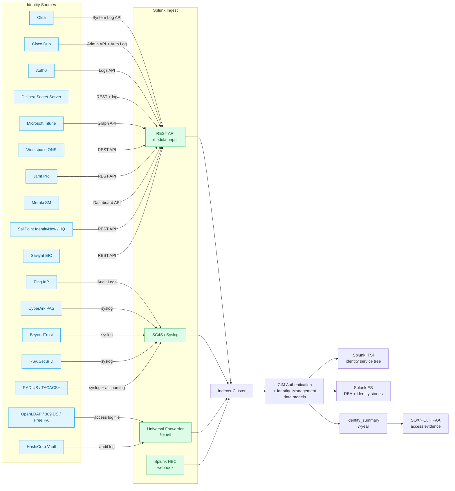

# Identity Platforms (LDAP, SSO/IdP, PAM, Cloud IdP, MDM) Integration Guide

> Operational, security, and compliance monitoring for the identity
> stack **outside Microsoft Active Directory and Entra ID** (those are
> covered by `active-directory-entra-id.md`). Spans LDAP directories
> (cat 9.2), Identity Providers and SSO (cat 9.3), Privileged Access
> Management (cat 9.4), Cloud Identity Providers — Okta<sup class="ref">[<a href="#ref-2">2</a>]</sup> and Duo (cat
> 9.5), Endpoint and Mobile Device Management (cat 9.6), and Identity
> & Access Trending (cat 9.7). Together with `active-directory-entra-id.md`
> (cat 9.1) the two guides cover all 109 use cases of cat-09.

## Table of Contents

- [Quick Start — From Zero to First Identity Risk Dashboard](#quick-start--from-zero-to-first-identity-risk-dashboard)
- [Overview](#overview)
- [Architecture and Data Flow](#architecture-and-data-flow)
- [Prerequisites](#prerequisites)
- [Domain 1 — LDAP Directories (cat 9.2, 12 UCs)](#domain-1--ldap-directories-cat-92-12-ucs)
- [Domain 2 — IdP & SSO (cat 9.3, 16 UCs)](#domain-2--idp--sso-cat-93-16-ucs)
- [Domain 3 — Privileged Access Management (cat 9.4, 25 UCs)](#domain-3--privileged-access-management-cat-94-25-ucs)
- [Domain 4 — Cloud Identity (Okta + Duo, cat 9.5, 15 UCs)](#domain-4--cloud-identity-okta--duo-cat-95-15-ucs)
- [Domain 5 — Endpoint & Mobile Device Management (cat 9.6, 6 UCs)](#domain-5--endpoint--mobile-device-management-cat-96-6-ucs)
- [Domain 6 — Identity & Access Trending (cat 9.7, 7 UCs)](#domain-6--identity--access-trending-cat-97-7-ucs)
- [Sizing and Capacity Planning](#sizing-and-capacity-planning)
- [Compliance and Audit Evidence Pack](#compliance-and-audit-evidence-pack)
- [Crawl / Walk / Run Roadmap](#crawl--walk--run-roadmap)
- [Dashboards](#dashboards)
- [SPL Examples](#spl-examples)
- [Troubleshooting](#troubleshooting)
- [SOAR Playbooks](#soar-playbooks)
- [Cross-Product Integration](#cross-product-integration)

## Quick Start — From Zero to First Identity Risk Dashboard

### Day 1: Identity-stack inventory

Identity is the most fragmented layer of the stack. Catalogue every
control plane:

| Layer | Common products | Splunk add-on |
|---|---|---|
| Primary directory | Active Directory (cat 9.1), OpenLDAP, 389 DS, FreeIPA | `active-directory-entra-id.md` for AD; this guide for the rest |
| Cloud IdP / SSO | Okta, Entra ID, Auth0, Ping, OneLogin, Duo SSO | Splunk_TA_okta, Splunk_TA_microsoft-cloudservices |
| MFA | Duo, RSA SecurID, Entra MFA, YubiKey | Splunk_TA_duo, Splunk_TA_rsa, Splunk_TA_microsoft-cloudservices |
| PAM | CyberArk, BeyondTrust, Delinea, HashiCorp Vault<sup class="ref">[<a href="#ref-7">7</a>]</sup> | Splunk_TA_cyberark, Splunk_TA_beyondtrust, Splunk_TA_delinea, Splunk_TA_vault |
| Identity Governance | SailPoint, Saviynt, Oracle IGA | Splunk_TA_sailpoint, Splunk_TA_saviynt |
| MDM/EMM | Intune, Workspace ONE, Jamf, Meraki SM | Splunk_TA_intune, Splunk_TA_workspace_one, Splunk_TA_jamf, Splunk_TA_cisco_meraki |
| Network identity | RADIUS / TACACS+ servers (Cisco ISE, Aruba ClearPass, FreeRADIUS) | `cisco-ise.md` covers ISE specifically |

### Day 2: Stand up the `identity` indexes

```ini
[identity]
homePath = $SPLUNK_DB/identity/db
coldPath = $SPLUNK_DB/identity/colddb
thawedPath = $SPLUNK_DB/identity/thaweddb
maxDataSize = auto_high_volume
frozenTimePeriodInSecs = 220752000   ` 7 years for SOX / PCI 10 / HIPAA `

[identity_summary]
homePath = $SPLUNK_DB/identity_summary/db
coldPath = $SPLUNK_DB/identity_summary/colddb
thawedPath = $SPLUNK_DB/identity_summary/thaweddb
maxDataSize = auto
frozenTimePeriodInSecs = 220752000   ` 7 years `

[okta]
homePath = $SPLUNK_DB/okta/db
coldPath = $SPLUNK_DB/okta/colddb
thawedPath = $SPLUNK_DB/okta/thaweddb
maxDataSize = auto_high_volume
frozenTimePeriodInSecs = 220752000

[duo]
homePath = $SPLUNK_DB/duo/db
coldPath = $SPLUNK_DB/duo/colddb
thawedPath = $SPLUNK_DB/duo/thaweddb
maxDataSize = auto
frozenTimePeriodInSecs = 220752000

[cyberark]
homePath = $SPLUNK_DB/cyberark/db
coldPath = $SPLUNK_DB/cyberark/colddb
thawedPath = $SPLUNK_DB/cyberark/thaweddb
maxDataSize = auto
frozenTimePeriodInSecs = 220752000   ` 7 years for SOX privileged-access evidence `
```

### Day 3: Wire up Splunk Add-on for Okta (most-common cloud IdP)

Splunk_TA_okta uses Okta System Log API. Create an Okta API token
with `Read-only` admin role, then `inputs.conf`:

```ini
[okta_organization://okta_main]
disabled = 0
okta_url = https://example.okta.com
okta_token = <OKTA_API_TOKEN>
limit = 1000
sourcetype = OktaIM2:log
index = okta
```

Polls every minute. Within 24 hours you'll have full identity event
trail.

### Day 4: First identity dashboards

Three single-value tiles + two timecharts is enough to start:

- Failed authentication rate (24h)
- MFA challenge failure rate (24h)
- Impossible-travel detections (24h)
- Authentication trend by IdP (timechart)
- Top 10 users by failed authentication (table)

### Day 5–6: Add Duo + PAM

Duo: register Splunk as an Admin API integration → `Splunk_TA_duo`
ingests authlog, telephonylog, adminapi.

PAM: install `Splunk_TA_cyberark` (or BeyondTrust / Delinea
equivalent) → ingest privileged-session audit events from the
relevant vault.

### Day 7: Generate first evidence

Run the SOX<sup class="ref">[<a href="#ref-14">14</a>]</sup> 404 access-management evidence dashboard. Export PDF for
the next quarterly access review.

## Overview

### Why identity monitoring matters

The 2025 Verizon DBIR finds that **74% of breaches involve the human
element**, and **identity is consistently the #1 attack vector**:
phished credentials, password reuse, MFA fatigue / push-bombing, OAuth
consent grant abuse, federated trust modifications, privileged
credential theft. Identity monitoring is the single highest-leverage
detection investment in any SOC.

In addition, **identity is the first pillar of NIST SP 800-207 Zero
Trust Architecture** and a hard requirement for SOX 404, PCI DSS 4.0
§7-§8, HIPAA<sup class="ref">[<a href="#ref-16">16</a>]</sup> §164.308, NIS2<sup class="ref">[<a href="#ref-3">3</a>]</sup> Art. 21(2)(d), DORA<sup class="ref">[<a href="#ref-5">5</a>]</sup> Art. 9, CMMC L2/L3,
NYDFS 23 NYCRR Part 500 §500.7, and FFIEC.

### Why "identity beyond AD/Entra"

`active-directory-entra-id.md` covers AD + Entra. **Most enterprises
also run** at least one cloud IdP (Okta or Auth0), at least one MFA
platform (Duo, RSA, YubiKey), at least one PAM solution (CyberArk,
BeyondTrust, Delinea, Vault), at least one MDM/EMM (Intune,
Workspace ONE, Jamf), and (for legacy systems) one or more LDAP
directories (OpenLDAP, 389 DS, FreeIPA).

These layers each generate distinct telemetry that AD doesn't see:
- Okta sees impossible-travel before AD authentication does.
- Duo sees push-bombing patterns invisible to AD.
- CyberArk sees credential check-out timing that AD never logs.
- Intune sees device-compliance changes that affect Conditional Access.
- SailPoint sees access-certification campaigns that prove
  separation-of-duties.

### Domains covered

| Sub | Name | UCs |
|---|---|---|
| 9.2 | LDAP Directories | 12 |
| 9.3 | Identity Providers (IdP) & SSO | 16 |
| 9.4 | Privileged Access Management (PAM) | 25 |
| 9.5 | Cloud Identity Providers — Okta & Duo | 15 |
| 9.6 | Endpoint & Mobile Device Management | 6 |
| 9.7 | Identity & Access Trending | 7 |

### What "good" looks like

| KPI | Healthy target | Source |
|---|---|---|
| Failed authentication rate | < 5% of total authentications | Okta / Entra / AD |
| MFA challenge success | > 95% | Duo / Entra MFA |
| Impossible travel | 0 confirmed | Okta / Entra / Duo |
| Privileged session recording | 100% of PSM sessions | CyberArk / BeyondTrust |
| Stale account count | 0 accounts >90d inactive | SailPoint / Saviynt |
| Device compliance | > 98% per MDM | Intune / Workspace ONE / Jamf |
| Just-in-Time access | 100% of admin actions JIT-elevated | PAM platform |

## Architecture and Data Flow



### Core principles

1. **CIM Authentication and Identity_Management are mandatory.** Every
   identity sourcetype must populate `user`, `src`, `dest`, `app`,
   `action`, `signature`, `signature_id`. Non-CIM identity data is
   useless to ES and most dashboards.
2. **Okta API rate limits are tight.** 600 req/min for Production
   tenants. Don't exceed by polling Splunk_TA_okta with limit=1000
   every 60 seconds.
3. **PAM telemetry is sensitive.** Privileged-session audit logs reveal
   what admins did with vaulted credentials. Apply RBAC: only the
   `cyberark_admin` role and SOC sees `cyberark:vault:audit`. Service
   accounts get no access.
4. **MDM device-compliance changes are real-time.** A device falling
   out of compliance can revoke Conditional Access in under 30
   seconds. Don't poll Intune more than once per minute or you'll
   exhaust Graph API quotas; instead, subscribe to Graph webhooks
   for change notifications.
5. **Identity sync (SCIM) failures cascade.** A SCIM failure at the
   IdP → app boundary can leave a terminated employee with active
   access for hours. UC-9.4.11 catches this.

## Prerequisites

### Pre-deployment checklist

- [ ] Identity-stack inventory complete (see Day 1)
- [ ] Splunk indexes pre-created
- [ ] CIM Authentication + Identity_Management data models accelerated
- [ ] HEC tokens / API tokens for each IdP / PAM / MDM
- [ ] RBAC roles defined: `identity_admin`, `pam_admin`, `mdm_admin`,
  `soc_analyst` — only `pam_admin` and `soc_analyst` see
  `cyberark*` indexes
- [ ] Network connectivity from REST modular input HFs to each
  cloud-IdP API endpoint (Okta, Duo, Auth0, etc.)
- [ ] On-prem syslog from PAM appliances (CyberArk, BeyondTrust,
  Delinea) reaches SC4S
- [ ] LDAP server access logs configured (`olcLogLevel`, slapd
  `loglevel stats acl`)
- [ ] FreeIPA `dirsrv-access` log ingest path agreed
- [ ] RADIUS / TACACS+ accounting + audit logs reach SC4S

### Splunk components used

- **Splunk Enterprise / Cloud**
- **Splunk Enterprise Security<sup class="ref">[<a href="#ref-13">13</a>]</sup>** — identity RBA, impossible-travel,
  consent-grant abuse correlation, ESCU identity stories
- **Splunk ITSI** — IdP service tree (one per IdP) with KPIs
- **Splunk SOAR** — automated containment for identity incidents
- **Splunk_SA_CIM** — CIM compliance for all identity sourcetypes
- **MLTK** — anomaly detection on per-user authentication patterns,
  PAM credential check-out frequency

## Domain 1 — LDAP Directories (cat 9.2, 12 UCs)

OpenLDAP, 389 Directory Server, FreeIPA / Red Hat IdM, Apache DS,
Oracle Internet Directory. Same monitoring concerns regardless of
implementation.

### Highlight UCs

- **UC-9.2.1** — Bind Failure Monitoring. Failed BIND authentication
  attempts; correlates with Active Directory Kerberos failures
  (cat 9.1) for full LDAP+AD picture.
- **UC-9.2.10** — LDAPS Certificate Validation. Tracks Schannel /
  OpenLDAP TLS handshake failures; alerts on certificate expiry within
  30 days.
- **UC-9.2.11** — LDAP Channel Binding Status. Microsoft 2024 ADV190023
  hardening tracking — clients without LDAP channel binding fail.
- **UC-9.2.12** — LDAP Referral Chaining. Tracks unexpected referral
  chains that can leak directory topology.

### Configuration

OpenLDAP `slapd.conf` access logging:

```
loglevel stats acl
include /etc/openldap/schema/auditlog.schema
overlay auditlog
auditlog /var/log/slapd/auditlog.log
```

Splunk UF input:

```ini
[monitor:///var/log/slapd/auditlog.log]
sourcetype = openldap:audit
index = ldap
```

389 Directory Server:

```
nsslapd-accesslog-level: 4   ` connections, operations, bind/unbind `
nsslapd-auditlog: /var/log/dirsrv/slapd-instance/audit
nsslapd-auditlog-logging-enabled: on
```

```ini
[monitor:///var/log/dirsrv/slapd-*/access]
sourcetype = 389ds:access
index = ldap
```

## Domain 2 — IdP & SSO (cat 9.3, 16 UCs)

Cloud IdPs and federation. Covers Okta, Ping, Auth0, ForgeRock,
OneLogin, IBM Verify, Cisco Duo SSO, Salesforce Identity, Google
Identity. SAML, OIDC, OAuth 2.0, WS-Federation.

### Highlight UCs

- **UC-9.3.1** — MFA Challenge Failure Rate. Cross-IdP MFA failure
  rate trending. Sudden spike = phishing kit landed.
- **UC-9.3.10** — SSO Session Hijacking Indicators. Token replay,
  cookie reuse from new ASN, AAL downgrade attempts.
- **UC-9.3.11** — Federated Trust Modifications. Audit of
  trust-relationship changes between IdP and SP — most-impactful
  detection because federated trust changes can compromise hundreds
  of apps.
- **UC-9.3.12** — Consent Grant Abuse. OAuth consent abuse
  (illicit-consent) campaigns where attacker registers an OAuth app
  and tricks users into granting permissions.

## Domain 3 — Privileged Access Management (cat 9.4, 25 UCs)

The largest single sub in cat-9. Covers CyberArk PAS / Idaptive /
Conjur, BeyondTrust Password Safe / Privilege Mgmt / Remote Support,
Delinea / Thycotic Secret Server / PBA, HashiCorp Vault, Centrify,
Saviynt, Wallix Bastion, ManageEngine PAM360.

### Highlight UCs

- **UC-9.4.1** — Privileged Session Audit. Per-session timing, every
  command typed, every screen recorded, every credential check-out.
- **UC-9.4.10** — Just-in-Time Access Request. JIT elevation request
  funnel: requested → approved → activated → expired.
- **UC-9.4.11** — Identity Sync Failure (SCIM connector failures).
  Stops terminated-employee access leaking past the off-boarding
  date.
- **UC-9.4.12** — RADIUS / TACACS+ Server Response Time. Network
  device admin authentication health.

### Configuration

CyberArk PAS syslog (Vault → PVWA):

```
# CyberArk DBPARM.ini
[SYSLOG]
SyslogServerIP=sc4s.splunk.example.com
SyslogServerPort=6514
SyslogServerProtocol=TCP
SyslogTLSCertificate=/etc/pki/cert.pem
SyslogMessageCodeFilter=200,294,295,300,302,374
```

Splunk side: SC4S auto-detects CyberArk via syslog header; routes to
`cyberark` index, `cyberark:syslog` sourcetype.

BeyondTrust syslog:

```
BBT Console → Configuration → Logging → Syslog Logging
  Server: sc4s.splunk.example.com
  Port: 6514 (TLS)
  Format: CEF
```

HashiCorp Vault audit device:

```bash
vault audit enable file file_path=/var/log/vault/audit.log
```

Splunk UF input:

```ini
[monitor:///var/log/vault/audit.log]
sourcetype = hashicorp:vault:audit
index = vault
```

## Domain 4 — Cloud Identity (Okta + Duo, cat 9.5, 15 UCs)

The two most-deployed cloud-identity products in 2026. Both have
mature Splunk integrations.

### Okta

15 high-impact UCs covering everything from authentication failures to
flow event tracking, risk events, and device-trust posture.

```ini
# Splunk_TA_okta inputs.conf
[okta_organization://okta_main]
disabled = 0
okta_url = https://example.okta.com
okta_token = <OKTA_API_TOKEN>
limit = 1000
sourcetype = OktaIM2:log
index = okta
```

### Duo

```ini
# Splunk_TA_duo inputs.conf
[duo_app://duo_main]
disabled = 0
ikey = <DUO_INTEGRATION_KEY>
skey = <DUO_SECRET_KEY>
api_host = api-XXXX.duosecurity.com
sourcetype = duo:authlog
index = duo
limit = 1000
```

### Highlight UCs

- **UC-9.5.1** — Okta Authentication Failures
- **UC-9.5.10** — Federated SSO Token Abuse
- **UC-9.5.11** — Impossible Travel Detection (Okta)
- **UC-9.5.12** — Okta API Rate Limit Monitoring

## Domain 5 — Endpoint & Mobile Device Management (cat 9.6, 6 UCs)

Cisco Meraki Systems Manager is the primary platform represented in
cat 9.6 UCs. The patterns generalise to Intune, Workspace ONE, Jamf,
MaaS360 — same Splunk add-on installation, different sourcetype.

### Configuration — Microsoft Intune (Microsoft Graph)

```ini
[REST://intune_device_compliance]
endpoint = https://graph.microsoft.com/v1.0/deviceManagement/managedDevices
auth_type = oauth_client_credentials
token_endpoint = https://login.microsoftonline.com/<tenant>/oauth2/v2.0/token
scope = https://graph.microsoft.com/.default
client_id = <APP_REG_CLIENT_ID>
client_secret = <APP_REG_CLIENT_SECRET>
polling_interval = 300
sourcetype = intune:device:compliance
index = intune
```

### Configuration — VMware Workspace ONE

```ini
[REST://workspace_one_devices]
endpoint = https://cn<XXX>.awmdm.com/api/mdm/devices
auth_type = oauth2
oauth2_token_endpoint = https://na.uemauth.workspaceone.com/connect/token
client_id = <WSO_CLIENT_ID>
client_secret = <WSO_CLIENT_SECRET>
custom_headers = aw-tenant-code: <WSO_TENANT_CODE>
polling_interval = 600
sourcetype = workspace_one:device:compliance
index = workspace_one
```

### Configuration — Jamf Pro

```ini
[REST://jamf_devices]
endpoint = https://<jamf>.jamfcloud.com/api/v1/computers-inventory
auth_type = oauth2
oauth2_token_endpoint = https://<jamf>.jamfcloud.com/api/v1/auth/token
client_id = <JAMF_CLIENT_ID>
client_secret = <JAMF_CLIENT_SECRET>
polling_interval = 900
sourcetype = jamf:device:inventory
index = jamf
```

## Domain 6 — Identity & Access Trending (cat 9.7, 7 UCs)

Long-window analytical views driven from `identity_summary`:

- UC-9.7.1 — Authentication volume trend (90-day rolling)
- UC-9.7.2 — MFA adoption rate trend
- UC-9.7.3 — Stale account count trend
- UC-9.7.4 — Privileged access frequency trend
- UC-9.7.5 — Federated app adoption trend
- UC-9.7.6 — Identity-related incident MTTR trend
- UC-9.7.7 — Device-compliance trend

## Sizing and Capacity Planning

| Source | Per-1000-user daily volume | Per-1000-user monthly storage |
|---|---|---|
| Okta System Log | ~500 MB | ~15 GB |
| Duo authlog + adminapi | ~200 MB | ~6 GB |
| Auth0 logs | ~300 MB | ~9 GB |
| Ping audit | ~250 MB | ~7.5 GB |
| OpenLDAP access | ~1 GB | ~30 GB |
| 389 DS access | ~800 MB | ~24 GB |
| CyberArk syslog | ~50 MB / vault | ~1.5 GB |
| BeyondTrust syslog | ~50 MB / appliance | ~1.5 GB |
| HashiCorp Vault audit | ~100 MB / cluster | ~3 GB |
| RSA SecurID syslog | ~100 MB | ~3 GB |
| Intune Graph API | ~500 MB / 1k devices | ~15 GB |
| Workspace ONE REST | ~500 MB / 1k devices | ~15 GB |
| Jamf REST | ~300 MB / 1k macs | ~9 GB |
| Meraki SM | ~200 MB / 1k devices | ~6 GB |
| SailPoint IdentityNow | ~100 MB / 1k identities | ~3 GB |

## Compliance and Audit Evidence Pack

### SOX 404 ITGC

Standard ITGC categories satisfied by this guide:

- **Access management** → all of cat-9 generates evidence
- **Privileged access** → all of cat-9.4
- **Change management** → identity-config audit trail (UC-9.3.11)
- **Termination procedures** → SCIM deprovisioning (UC-9.4.11)

### PCI DSS 4.0 §7 + §8

- **§7.2.1-§7.2.6** Access control by job function → SailPoint /
  Saviynt evidence
- **§8.3** Strong cryptography for authentication → MFA enrollment
  evidence
- **§8.4** MFA on all non-console access → UC-9.5.x Okta + Duo
  evidence
- **§8.5** Account management → UC-9.4.11 + UC-9.7.3 evidence

### HIPAA §164.308 Administrative Safeguards

- **§164.308(a)(3)(ii)(B)** Workforce clearance → access certification
  campaigns from SailPoint
- **§164.308(a)(4)** Information access management → UC-9.4.x
- **§164.308(a)(5)(ii)(C)** Login monitoring → UC-9.3.1 + UC-9.5.1

### NIS2 Art. 21(2)(d)

For EU operators of essential services. UC-9.4.x + UC-9.6.x +
UC-9.7.x jointly satisfy art. 21(2)(d) "policies and procedures
regarding access control".

### DORA Art. 9 ICT Risk Management

For financial-services entities. UC-9.4.1 (privileged session audit) +
UC-9.4.10 (JIT) jointly satisfy DORA Art. 9 access management
provisions.

### NIST SP 800-63B Authenticator Assurance Level

UC-9.5.1 + UC-9.5.10 + UC-9.3.10 jointly attest AAL2 / AAL3 control
adherence per session.

### NIST SP 800-207 Zero Trust Architecture

Identity is the first ZTA pillar. UC-9.3.x + UC-9.5.x + UC-9.6.x
jointly attest "verify explicitly" and "use least-privilege access".

### CIS CIS-CSC v8 Control 5 + Control 6

Account Management and Access Control Management — every UC in cat-9
contributes to CIS CSC v8 evidence.

### NYDFS 23 NYCRR Part 500 §500.7

Access privileges. Standard quarterly access certification campaign
evidence from SailPoint or Saviynt.

## Crawl / Walk / Run Roadmap

### Crawl tier (16 UCs — week 1–4)

| UC | Title |
|---|---|
| 9.2.1 | LDAP Bind Failure Monitoring |
| 9.2.10 | LDAPS Certificate Validation |
| 9.3.1 | MFA Challenge Failure Rate |
| 9.3.10 | SSO Session Hijacking Indicators |
| 9.3.11 | Federated Trust Modifications |
| 9.4.1 | Privileged Session Audit |
| 9.4.10 | Just-in-Time Access Request Monitoring |
| 9.4.11 | Identity Sync Failure Detection |
| 9.4.12 | RADIUS / TACACS+ Server Response Time |
| 9.5.1 | Okta Authentication Failures |
| 9.5.10 | Federated SSO Token Abuse |
| 9.5.11 | Impossible Travel Detection (Okta) |
| 9.5.12 | Okta API Rate Limit Monitoring |
| 9.6.1 | Device Compliance Status and Policy Enforcement |
| 9.6.2 | Mobile Device Enrollment Tracking |
| 9.7.1 | Authentication volume trend |

### Walk tier (41 UCs — month 2–3)

Highlights:
- All 25 PAM UCs (CyberArk + BeyondTrust + Delinea + Vault)
- Consent Grant abuse detection
- LDAP referral chaining
- LDAP channel binding compliance
- Duo Trust Monitor anomaly correlation
- MDM Conditional Access integration
- Workspace ONE app wrapping audit
- Jamf smart-group + policy compliance
- Meraki SM geofencing alerts
- SCIM provisioning event audit

### Run tier (24 UCs — month 4+)

Highlights:
- SOX 404 access management evidence pack auto-generation
- PCI DSS 4.0 §7-§8 evidence
- HIPAA §164.308 administrative safeguards evidence
- NIST SP 800-63B AAL attestation
- NIST SP 800-207 ZTA pillar attestation
- ML-driven impossible-travel + push-bombing correlation
- ML-driven privileged-credential check-out anomaly
- Cross-IdP federated trust risk scoring
- Composite identity risk scoring (Okta + Duo + Intune + AD)
- Automated SOAR containment for identity incidents

## Dashboards

| Dashboard | Audience | Refresh |
|---|---|---|
| Identity Executive | CISO / IAM Director | 5 min |
| Authentication Funnel | IAM Engineer | 1 min |
| MFA Health | IAM Engineer | 1 min |
| Cloud Identity (Okta) | IAM Engineer / SOC | 1 min |
| Privileged Access (CyberArk) | PAM Admin / SOC | 1 min |
| Device Compliance | EUC Admin / SOC | 5 min |
| LDAP Directory Health | Identity Engineer | 5 min |
| SOX 404 Access Evidence | Compliance | daily |

## SPL Examples

### Cross-IdP failed authentication concentration

```spl
(index=okta sourcetype=OktaIM2:log eventType="user.authentication.auth_via_mfa") OR
(index=duo sourcetype=duo:authlog) OR
(index=msad:cs:azureactivedirectory eventType=signinLogs)
| eval idp = case(
    sourcetype="OktaIM2:log", "Okta",
    sourcetype="duo:authlog", "Duo",
    sourcetype="msad:cs:azureactivedirectory", "Entra ID")
| where outcome="failure" OR result="failure" OR conditionalAccessStatus="failure"
| stats count by idp, src_ip, user
| where count > 10
| sort - count
```

### Push-bombing detection

```spl
index=duo sourcetype=duo:authlog factor=push_notification result=denied
| stats count by user, _time span=10min
| where count > 5
| stats values(_time) as denial_times count as denials_in_10min by user
| sort - denials_in_10min
```

### CyberArk credential check-out anomaly

```spl
index=cyberark sourcetype=cyberark:vault:audit Action="Retrieve password"
| stats count as check_outs by user, _time span=1d
| eventstats avg(check_outs) as avg_daily stdev(check_outs) as sd_daily by user
| eval z_score = round((check_outs - avg_daily) / sd_daily, 2)
| where z_score > 3
| sort - z_score
```

### Intune device falling out of compliance

```spl
index=intune sourcetype=intune:device:compliance complianceState=noncompliant
| stats latest(complianceState) as state
        latest(lastSyncDateTime) as last_sync
        values(reason) as reasons
        by deviceId, userPrincipalName
| eval days_noncompliant = round((now() - strptime(last_sync, "%Y-%m-%dT%H:%M:%S%Z"))/86400, 1)
| where days_noncompliant > 7
```

## Troubleshooting

| Symptom | Likely cause | Fix |
|---|---|---|
| Okta REST 429 | Polling > 600 req/min | Reduce poll interval; split queries |
| Duo authlog missing | Wrong API host / wrong skey | Verify Duo Admin Panel → Applications → Splunk |
| CyberArk syslog missing | DBPARM.ini wrong / firewall block | Test telnet sc4s host:6514 |
| BeyondTrust CEF not parsed | SC4S detection rule absent | Update SC4S to current version |
| HashiCorp Vault audit silent | audit device disabled | `vault audit list` to verify |
| Intune Graph 401 | App registration permissions wrong | Add `DeviceManagementManagedDevices.Read.All` |
| Workspace ONE REST 401 | aw-tenant-code header wrong | Recheck tenant code |
| Jamf REST 401 | OAuth client credentials wrong | Recreate API role + Splunk client |
| Meraki SM REST 429 | Polling too aggressive | Reduce poll cadence to 5 min |
| SCIM events missing | Connector logs not exported | Configure connector to write to syslog |

## SOAR Playbooks

### Playbook 1 — Push-bombing containment

```yaml
playbook: identity_push_bombing
triggers:
  - notable_event: "Push Bombing Detected"
phases:
  identify:
    - okta_get_user_details: ${notable.user}
  contain:
    - okta_suspend_user: ${notable.user}
    - duo_disable_user: ${notable.user}
  notify:
    - servicenow_create_incident:
        category: "Identity Security"
        severity: 1
        short_description: "Push bombing on ${notable.user} — user suspended"
  enrich:
    - threat_intel_lookup_ip: ${notable.src_ip}
```

### Playbook 2 — Federated trust modification audit

```yaml
playbook: identity_federated_trust_change
triggers:
  - sourcetype: msad:cs:azureactivedirectory OR OktaIM2:log
  - condition: "category=federation_trust_modified OR eventType=app.client.update"
phases:
  notify:
    - splunk_es_create_notable
    - servicenow_create_change_request:
        category: "Identity / Federation"
        severity: 2
        short_description: "Federated trust modified by ${notable.actor}"
  enrich:
    - get_change_history_30d
    - cross_check_with_change_calendar
```

### Playbook 3 — PAM credential burst

```yaml
playbook: pam_credential_burst
triggers:
  - notable_event: "CyberArk Credential Check-out Anomaly"
phases:
  identify:
    - cyberark_get_session_history: ${notable.user}
  contain:
    - cyberark_revoke_active_sessions: ${notable.user}
    - cyberark_force_password_rotation: ${notable.account}
  notify:
    - pagerduty_alert:
        urgency: high
        service: "PAM Operations On-call"
```

## Cross-Product Integration

| Other guide | Relationship |
|---|---|
| `active-directory-entra-id.md` | The other half of cat-9 — AD + Entra ID covered there |
| `cisco-ise.md` | NAC + 802.1X + TrustSec from Cisco ISE |
| `vpn-zerotrust-sase.md` | Identity-aware ZTNA enforcement using IdP claims |
| `email-collaboration.md` | Microsoft 365 / Workspace identity flows |
| `siem-soar.md` | Identity RBA risk objects + ESCU identity stories |
| `vulnerability-management.md` | Per-identity privilege risk scoring |
| `splunk-itsi.md` | IdP service tree for KPI tracking |
| `regulatory-compliance-master.md` | SOX, PCI 7-8, HIPAA 164.308, NIS2 evidence |
| `citrix-virtual-apps-desktops.md` | Citrix Workspace SSO via Okta / Entra |
| `business-analytics.md` | HR-data → identity reconciliation lookup |

---

**Document maintenance.** Reviewed quarterly against vendor release
notes (Okta, Duo, CyberArk, BeyondTrust, Delinea, HashiCorp Vault,
Intune, Workspace ONE, Jamf, SailPoint, Saviynt). Last verified
against:
- Splunk Enterprise 9.4
- Splunk Add-on for Okta 2.6
- Splunk Add-on for Microsoft Cloud Services 5.4
- Splunk Add-on for CyberArk 4.0
- Splunk Add-on for BeyondTrust 1.5
- Splunk Add-on for Microsoft Intune 1.4
- Splunk Add-on for VMware Workspace ONE 1.6
- Okta CIC / Workforce Identity Cloud — current
- Duo SSO + MFA — current
- CyberArk PAS 13.x
- BeyondTrust 23.x
- HashiCorp Vault 1.18

For corrections or additions, file an issue with `cat-9.2` through
`cat-9.7` labels.

---

<!-- BEGIN-AUTOGENERATED-SOURCES -->

## References

*Auto-generated by `scripts/generate_doc_references.py` from `data/source-references.json` and `data/source-mappings.json`. Edit those files (or the document body) to change citations; this footer is rewritten on every run.*

### Primary sources

<a id="ref-1"></a>**[1]** Microsoft Corporation. (2026). *Microsoft Entra ID Documentation*. Retrieved May 11, 2026, from https://learn.microsoft.com/en-us/entra/identity/

<a id="ref-2"></a>**[2]** Okta, Inc. (2026). *Okta Documentation*. Retrieved May 11, 2026, from https://developer.okta.com/docs/

### Supporting sources

<a id="ref-3"></a>**[3]** European Parliament and Council of the European Union. (2022, December). *Directive (EU) 2022/2555 — NIS2 Directive on cybersecurity*. Official Journal of the European Union, L 333. ELI: dir/2022/2555. https://eur-lex.europa.eu/eli/dir/2022/2555/oj

<a id="ref-4"></a>**[4]** European Parliament and Council of the European Union. (2016, April). *Regulation (EU) 2016/679 — General Data Protection Regulation*. Official Journal of the European Union, L 119. ELI: reg/2016/679. https://eur-lex.europa.eu/eli/reg/2016/679/oj

<a id="ref-5"></a>**[5]** European Parliament and Council of the European Union. (2022, December). *Regulation (EU) 2022/2554 — Digital Operational Resilience Act (DORA)*. Official Journal of the European Union, L 333. ELI: reg/2022/2554. https://eur-lex.europa.eu/eli/reg/2022/2554/oj

<a id="ref-6"></a>**[6]** Hardt, D. (Ed.). (2012, October). *The OAuth 2.0 Authorization Framework*. Internet Engineering Task Force. RFC 6749. https://www.rfc-editor.org/rfc/rfc6749

<a id="ref-7"></a>**[7]** HashiCorp. (2026). *HashiCorp Vault Documentation*. Retrieved May 11, 2026, from https://developer.hashicorp.com/vault/docs

<a id="ref-8"></a>**[8]** Jones, M., Bradley, J., & Sakimura, N. (2015, May). *JSON Web Token (JWT)*. Internet Engineering Task Force. RFC 7519. https://www.rfc-editor.org/rfc/rfc7519

<a id="ref-9"></a>**[9]** National Institute of Standards and Technology. (2024). *Digital Identity Guidelines* (Revision 4 (final)). U.S. Department of Commerce. NIST SP 800-63-4. https://pages.nist.gov/800-63-4/

<a id="ref-10"></a>**[10]** Payment Card Industry Security Standards Council. (2018). *Payment Card Industry Data Security Standard v3.2.1* (v3.2.1). PCI SSC. https://www.pcisecuritystandards.org/document_library/?category=pcidss

<a id="ref-11"></a>**[11]** Payment Card Industry Security Standards Council. (2022). *Payment Card Industry Data Security Standard v4.0* (v4.0). PCI SSC. https://www.pcisecuritystandards.org/document_library/?category=pcidss

<a id="ref-12"></a>**[12]** Splunk Inc. (2026). *Splunk Common Information Model Add-on Manual*. Splunk LLC, a Cisco company. Retrieved May 11, 2026, from https://docs.splunk.com/Documentation/CIM

<a id="ref-13"></a>**[13]** Splunk Inc. (2026). *Splunk Enterprise Security Administration Manual*. Splunk LLC, a Cisco company. Retrieved May 11, 2026, from https://docs.splunk.com/Documentation/ES

<a id="ref-14"></a>**[14]** U.S. Congress. (2002). *Sarbanes-Oxley Act of 2002 — Public Company Accounting Reform and Investor Protection Act*. U.S. Government. Pub. L. 107–204. https://www.sec.gov/about/laws/soa2002.pdf

<a id="ref-15"></a>**[15]** U.S. Department of Health & Human Services. (2002). *HIPAA Privacy Rule (45 CFR Parts 160 and 164, Subparts A and E)*. Office for Civil Rights, HHS. 45 CFR 160, 164. https://www.hhs.gov/hipaa/for-professionals/privacy/index.html

<a id="ref-16"></a>**[16]** U.S. Department of Health & Human Services. (2013). *HIPAA Security Rule (45 CFR Parts 160 and 164, Subparts A and C)*. Office for Civil Rights, HHS. 45 CFR 160, 164. https://www.hhs.gov/hipaa/for-professionals/security/index.html

<details>
<summary>Additional online sources cited in the document body (8)</summary>

<a id="ref-17"></a>**[17]** splunkbase.splunk.com. *Splunkbase app #6553*. Retrieved May 11, 2026, from https://splunkbase.splunk.com/app/6553

<a id="ref-18"></a>**[18]** splunkbase.splunk.com. *Splunkbase app #3110*. Retrieved May 11, 2026, from https://splunkbase.splunk.com/app/3110

<a id="ref-19"></a>**[19]** splunkbase.splunk.com. *Splunkbase app #4055*. Retrieved May 11, 2026, from https://splunkbase.splunk.com/app/4055

<a id="ref-20"></a>**[20]** splunkbase.splunk.com. *Splunkbase app #4346*. Retrieved May 11, 2026, from https://splunkbase.splunk.com/app/4346

<a id="ref-21"></a>**[21]** splunkbase.splunk.com. *Splunkbase*. Retrieved May 11, 2026, from https://splunkbase.splunk.com/

<a id="ref-22"></a>**[22]** splunkbase.splunk.com. *Splunkbase app #6135*. Retrieved May 11, 2026, from https://splunkbase.splunk.com/app/6135

<a id="ref-23"></a>**[23]** splunkbase.splunk.com. *Splunkbase app #5580*. Retrieved May 11, 2026, from https://splunkbase.splunk.com/app/5580

<a id="ref-24"></a>**[24]** splunkbase.splunk.com. *Splunkbase app #742*. Retrieved May 11, 2026, from https://splunkbase.splunk.com/app/742

</details>

<!-- END-AUTOGENERATED-SOURCES -->
