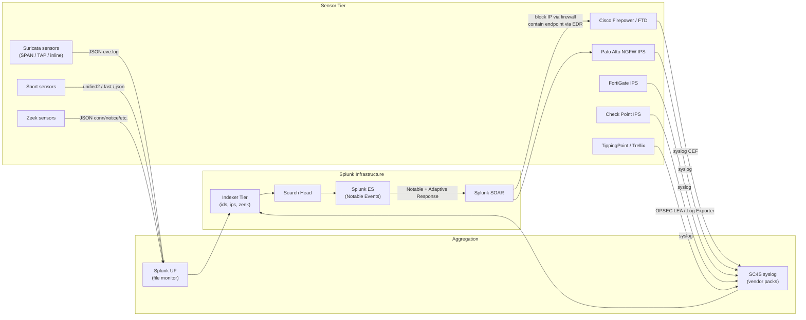

# IDS/IPS (Snort, Suricata, Cisco Firepower, Palo Alto, Vendor IPS) Integration Guide

> The definitive guide to integrating Intrusion Detection / Prevention
> Systems with Splunk. **168 use cases** covering open-source IDS
> (Snort, Suricata, Zeek), commercial NGFW IPS modules (Cisco
> Firepower, Palo Alto Threat Prevention, FortiGate<sup class="ref">[<a href="#ref-5">5</a>]</sup> IPS, Check Point
> IPS), and dedicated IPS appliances (Trend Micro TippingPoint,
> Trellix/McAfee NSP). Signature trending, false-positive tuning,
> protocol anomaly detection, encrypted-traffic inspection, attack
> chain reconstruction with EDR, and Network Intrusion → SOC notable
> pipeline through Splunk Enterprise Security<sup class="ref">[<a href="#ref-12">12</a>]</sup>.

---

## Table of Contents

- [Quick Start](#quick-start)
- [Overview](#overview)
- [Architecture and Data Flow](#architecture)
- [Prerequisites](#prerequisites)
- [Platform Coverage Matrix](#platform-matrix)
- [Suricata](#suricata)
- [Snort 3 / Snort 2](#snort)
- [Cisco Firepower / FTD / FMC](#firepower)
- [Palo Alto Threat Prevention](#palo-alto)
- [Fortinet FortiGate IPS](#fortinet)
- [Check Point IPS](#checkpoint)
- [TippingPoint, Trellix/McAfee NSP](#vendor-ips)
- [Zeek (passive network monitoring)](#zeek)
- [Field Dictionary (Cross-Vendor)](#field-dictionary)
- [Sample Events](#sample-events)
- [Splunk-Side Configuration](#splunk-config)
- [SC4S Pipeline](#sc4s)
- [Signature False-Positive Tuning](#tuning)
- [Cross-Product Correlation (IDS + EDR + Firewall)](#cross-product)
- [CIM Mapping Reference](#cim-mapping)
- [Splunk ES Notable Event Pipeline](#es-notable)
- [Compliance Mapping](#compliance)
- [Capacity Planning and Sizing](#sizing)
- [Recommended Dashboard Layouts](#dashboards)
- [ITSI Service Modeling](#itsi)
- [SOAR Playbook Examples](#soar)
- [Multi-Site Strategy](#multi-site)
- [Security Hardening](#security-hardening)
- [Crawl / Walk / Run Roadmap](#roadmap)
- [Validation Checklist](#validation-checklist)
- [Known Limitations and Gaps](#known-limitations)
- [Troubleshooting](#troubleshooting)
- [FAQ](#faq)
- [Glossary](#glossary)
- [References](#references)
- [Contribution and Feedback](#contribution)

---

<a id="quick-start"></a>
## Quick Start — 30 Minutes to First IDS Alert

> Pick the section for your IDS/IPS. **All sources share the same
> end-state**: alerts flow into the `ids` index, normalize via
> Intrusion_Detection CIM, ready for ES correlation, MITRE ATT&CK<sup class="ref">[<a href="#ref-8">8</a>]</sup>
> mapping, and IDS+EDR cross-attack-chain analysis.

### Suricata (recommended open-source)

1. Install Suricata 7.x with eve.json output:
    ```yaml
    # suricata.yaml
    outputs:
      - eve-log:
          enabled: yes
          filetype: regular
          filename: /var/log/suricata/eve.json
          types:
            - alert
            - http
            - dns
            - tls
            - flow
    ```
2. UF inputs.conf:
    ```ini
    [monitor:///var/log/suricata/eve.json]
    sourcetype = suricata:eve:alert
    index = ids
    INDEXED_EXTRACTIONS = json
    ```
3. Install [TA-suricata (Splunkbase 3441)](https://splunkbase.splunk.com/) on indexers + SH for CIM mapping.
4. Validate: `index=ids sourcetype="suricata:eve:alert" earliest=-15m | stats count by alert.severity`

### Cisco Firepower / FTD

```cisco
!! On FTD via syslog
logging trap informational
logging facility 21
logging host inside <sc4s-vip>
logging permit-hostdown
```

### Palo Alto Threat Prevention

```
Device → Setup → Server Profiles → Syslog
+ Add: Splunk-SC4S
+ Server: <sc4s-vip>:514, format=BSD, facility=LOG_USER
Device → Setup → Log Settings → Threat → Forward to Splunk-SC4S
```

### Activate crawl tier

UC-10.2.1 (Alert Severity Trending), UC-10.2.x (Top Signatures), UC-10.2.x (FP rate per signature).

---

<a id="overview"></a>
## Overview

### Why IDS/IPS still matters

Even in the era of EDR + cloud, IDS/IPS remains essential because:
- **Network-side visibility** — sees attacks targeting unmanaged or IoT/OT devices
- **Signature library** — vetted detection content (10,000+ rules in ET-Open, Talos, etc.)
- **Protocol anomaly detection** — catches attacks that signatures miss
- **Inline blocking (IPS mode)** — stops attacks at wire-speed
- **Compliance requirement** — explicit in PCI-DSS 11.x, NIST CSF<sup class="ref">[<a href="#ref-9">9</a>]</sup> DE.CM-1

### What this guide covers

| Platform | Use case fit |
|---------|------------|
| **Suricata** | Modern open-source NIDS; EVE JSON output |
| **Snort 3 / Snort 2** | Cisco-backed open-source NIDS; basis of Firepower |
| **Cisco Firepower** | Enterprise NGFW IPS module (formerly Sourcefire) |
| **Palo Alto Threat Prevention** | NGFW IPS module |
| **FortiGate IPS** | NGFW UTM IPS engine |
| **Check Point IPS** | NGFW IPS blade |
| **TippingPoint** | Trend Micro dedicated IPS appliance |
| **Trellix / McAfee NSP** | Network Security Platform |
| **Zeek (Bro)** | Passive network metadata + anomaly detection |

### Domains covered

| Domain | Examples |
|--------|---------|
| **Signature trending** | Daily/hourly alert volume by severity |
| **Top attackers / targets** | Source/destination ranking |
| **False-positive tuning** | Per-signature FP rate analysis |
| **Protocol anomaly** | Suricata stream detection, Zeek weird logs |
| **MITRE ATT&CK mapping** | Per-technique coverage |
| **Threat correlation** | IDS + EDR confirmation chain |
| **Compliance** | PCI 11.x, NIST CSF DE.CM-1 |

### What's NOT in scope

| Domain | Where to look |
|--------|---------------|
| **Firewall traffic logs** | [Firewalls Guide](firewalls.md) |
| **NGFW security features (URL/DLP)** | [NGFW Security Guide](ngfw-security.md) |
| **Endpoint detection** | [EDR Guide](edr.md) |
| **NetFlow/IPFIX** | [Network Flow Guide](network-flow.md) |

### What good looks like

| Dimension | Without integration | With full IDS + ES + SOAR |
|-----------|---------------------|---------------------------|
| Signature alert volume | EDR-only blind to network attacks | IDS catches network-layer pre-EDR |
| FP rate per signature | Unknown | Tuned to <2% per detection |
| MITRE ATT&CK coverage | Inconsistent | Network-side coverage map |
| Multi-source attack confirm | Manual correlation | Automated via ES RBA |
| Encrypted traffic visibility | Limited | TLS inspection / JA3 fingerprint hits |

---

<a id="architecture"></a>
## Architecture and Data Flow



### Core principles

- **Sensor placement matters** — span ports vs TAPs vs inline IPS
- **All sensors → centralised Splunk** for cross-sensor correlation
- **CIM Intrusion_Detection** is the unifier across vendors
- **ES correlation searches** are how IDS hits get prioritized

---

<a id="prerequisites"></a>
## Prerequisites

| Item | Detail |
|------|--------|
| **Splunk version** | 9.0+ Enterprise or Cloud |
| **Splunk ES** | 7.x+ (recommended for full value) |
| **CIM 6.x** | Intrusion_Detection, Network_Traffic, Alerts |
| **SC4S** | For commercial vendor syslog |
| **Sensor placement** | SPAN/TAP for IDS-mode, inline for IPS-mode |
| **Rule sources** | ET Open, Talos, vendor signatures |

---

<a id="platform-matrix"></a>
## Platform Coverage Matrix

| Platform | TA | Splunkbase | Sourcetypes | Cloud-vetted |
|---------|----|-----------|-------------|--------------|
| **Suricata** | TA-suricata | [3441](https://splunkbase.splunk.com/) | `suricata:eve:alert`, `suricata:eve:json` | Yes |
| **Snort** | Splunk Add-on for Snort | [340](https://splunkbase.splunk.com/app/340) | `snort:alert`, `snort:fast`, `snort:json` | Yes |
| **Cisco Firepower** | Cisco Secure Firewall Add-on | [3449](https://splunkbase.splunk.com/app/3449) | `cisco:firepower:syslog` | Yes |
| **Palo Alto** | Splunk Add-on for Palo Alto | [2757](https://splunkbase.splunk.com/app/2757) | `pan:threat`, `pan:wildfire` | Yes |
| **FortiGate** | TA-fortinet_fortigate | [2846](https://splunkbase.splunk.com/app/2846) | `fgt_ips`, `fgt_utm` | Yes |
| **Check Point** | Splunk Add-on for Check Point | [5402](https://splunkbase.splunk.com/app/5402) | `cp_ips`, `cp_log` | Yes |
| **Zeek / Bro** | Zeek/Bro Add-on | [1617](https://splunkbase.splunk.com/app/1617) | `bro:notice:json`, `bro:weird:json` | Yes |
| **TippingPoint** | (custom syslog via SC4S) | n/a | `tippingpoint:syslog` | n/a |
| **Trellix IPS** | (custom syslog via SC4S) | n/a | `trellix:ips:syslog` | n/a |

---

<a id="suricata"></a>
## Suricata

### Why Suricata

- Open-source, fast, modern
- EVE JSON native output
- Rich protocol decoding (HTTP, DNS, TLS, SSH, flow)
- Multi-threaded; can do 10+ Gbps on commodity hardware
- ET Open + ET Pro signature feeds

### Configuration

```yaml
# /etc/suricata/suricata.yaml
af-packet:
  - interface: eth1
    cluster-id: 99
    cluster-type: cluster_flow
    defrag: yes

outputs:
  - eve-log:
      enabled: yes
      filetype: regular
      filename: /var/log/suricata/eve.json
      types:
        - alert:
            metadata: yes
            tagged-packets: yes
        - http
        - dns
        - tls:
            extended: yes
        - flow
        - anomaly
        - files:
            force-magic: yes
            force-md5: yes
        - stats:
            interval: 8

# Rule sources
rule-files:
  - emerging-threats.rules
  - suricata-rules/*.rules
```

### Rule sources

```bash
# ET Open (free)
suricata-update enable-source et/open
suricata-update update-sources
suricata-update

# ET Pro (paid)
suricata-update enable-source et/pro --account-key=<your-key>
```

### UF inputs.conf

```ini
[monitor:///var/log/suricata/eve.json]
disabled = 0
sourcetype = suricata:eve:alert
index = ids
INDEXED_EXTRACTIONS = json
KV_MODE = none
```

### Sample event (Suricata EVE alert)

```json
{
    "timestamp": "2026-04-25T14:30:15.123456+0000",
    "flow_id": 1234567890,
    "in_iface": "eth1",
    "event_type": "alert",
    "src_ip": "203.0.113.45",
    "src_port": 56789,
    "dest_ip": "10.10.10.10",
    "dest_port": 80,
    "proto": "TCP",
    "alert": {
        "action": "allowed",
        "gid": 1,
        "signature_id": 2024897,
        "rev": 5,
        "signature": "ET MALWARE Possible Cobalt Strike Beacon Activity",
        "category": "A Network Trojan was detected",
        "severity": 1,
        "metadata": {
            "attack_target": ["Server"],
            "deployment": ["Perimeter"],
            "tag": ["Cobalt_Strike"],
            "mitre_attack_id": ["T1071.001"]
        }
    },
    "http": {
        "hostname": "evil.example.com",
        "url": "/load.php",
        "http_user_agent": "Mozilla/5.0 (compatible; MSIE 7.0;)",
        "http_method": "GET"
    }
}
```

---

<a id="snort"></a>
## Snort 3 / Snort 2

### Snort 3 (modern)

```lua
-- /etc/snort/snort.lua
alert_json = {
    file = true,
    fields = "timestamp pkt_num proto pkt_gen pkt_len dir src_addr src_port dst_addr dst_port service rule msg priority class action"
}
```

### UF inputs.conf

```ini
[monitor:///var/log/snort/alert_json.txt]
disabled = 0
sourcetype = snort:json
index = ids
INDEXED_EXTRACTIONS = json
```

### Sample event (Snort JSON)

```json
{
    "timestamp": "04/25/26-14:30:15.123456",
    "pkt_num": 12345,
    "proto": "TCP",
    "src_addr": "203.0.113.45",
    "src_port": 56789,
    "dst_addr": "10.10.10.10",
    "dst_port": 80,
    "service": "http",
    "rule": "1:2024897:5",
    "msg": "ET MALWARE Possible Cobalt Strike Beacon Activity",
    "priority": 1,
    "class": "A Network Trojan was detected",
    "action": "alert"
}
```

---

<a id="firepower"></a>
## Cisco Firepower / FTD / FMC

### Configuration

In FMC:
1. **System → Logging → Syslog Severity → All to Splunk**
2. Configure remote syslog server (SC4S VIP)
3. Enable IPS event logging on access control policy

### Sample event

```
<189>Apr 25 14:30:15 ftd-01 SFIMS: [Primary Detection Engine (...)] [IPS] [Classification: A Network Trojan was detected] [Priority: 1] {tcp} 203.0.113.45:56789 -> 10.10.10.10:80 [Snort Rule: 1:2024897:5] [Snort Message: "ET MALWARE Possible Cobalt Strike Beacon Activity"]
```

---

<a id="palo-alto"></a>
## Palo Alto Threat Prevention

PAN-OS<sup class="ref">[<a href="#ref-10">10</a>]</sup> Threat logs cover IPS, Antivirus, Anti-spyware, URL filtering, WildFire, DNS Security.

### Configuration

```
# Device → Setup → Server Profiles → Syslog
Format: BSD
Server: <sc4s-vip>
Port: 514
Facility: LOG_USER

# Objects → Log Forwarding → New
Threat Logs → Forward to Splunk-SC4S syslog profile
```

### Sample event

```
1,2026/04/25 14:30:15,001234567890,THREAT,vulnerability,2050,2026/04/25 14:30:15,203.0.113.45,10.10.10.10,...,Apache Log4j Vulnerability,...,T1190,critical,client-to-server,...
```

---

<a id="fortinet"></a>
## Fortinet FortiGate IPS

### Configuration

```fortios
config log syslogd setting
    set status enable
    set server <sc4s-vip>
    set port 514
    set facility local6
    set source-ip <fortigate-ip>
end

config log syslogd filter
    set severity information
    set forward-traffic enable
    set local-traffic enable
    set utm-traffic enable
end
```

### Sample event

```
date=2026-04-25 time=14:30:15 devname="FGT-01" devid="FGT60E1234567890" eventtime=1745596215 logid="0419016384" type="utm" subtype="ips" eventtype="signature" level="alert" vd="root" severity="critical" srcip=203.0.113.45 dstip=10.10.10.10 srccountry="China" dstintf="port1" srcintfrole="wan" sessionid=123456 action="dropped" proto=6 service="HTTP" policyid=10 attack="Apache.Log4j.Header.Injection.RCE" srcport=56789 dstport=80 attackid=51900 ref="http://www.fortinet.com/ids/VID51900" incidentserialno=123456789
```

---

<a id="checkpoint"></a>
## Check Point IPS

### OPSEC LEA / Log Exporter

```bash
# On Check Point Management Server
cd $FWDIR/log_exporter/targets/
mkdir splunk-prod
# Configure exporter.conf
target_name = splunk-prod
target_server = <sc4s-vip>
target_port = 514
protocol = udp
format = syslog
```

---

<a id="vendor-ips"></a>
## TippingPoint, Trellix/McAfee NSP

### TippingPoint syslog

```
log destination remote-syslog
remote-syslog-server <sc4s-vip>
log syslog facility local5
log severity warning
```

### Trellix IPS / McAfee NSP

```
# In NSP Manager
Devices → Configuration → Logging → Syslog
+ Server: <sc4s-vip>
+ Format: CEF
+ Facility: local6
```

---

<a id="zeek"></a>
## Zeek (passive network monitoring)

Zeek (formerly Bro) is metadata-focused — it generates rich logs (conn, dns, http, tls, ssl, files, notice, weird) but isn't signature-based primarily. It's complementary to Suricata.

### Key Zeek logs for IDS

| Log | Purpose |
|-----|---------|
| `notice.log` | Anomalies + threats |
| `weird.log` | Protocol violations |
| `dpd.log` | Dynamic protocol detection failures |
| `intel.log` | TI hits (IOC matches) |

### UF inputs

```ini
[monitor:///opt/zeek/logs/current/notice.log]
sourcetype = bro:notice:json
index = zeek
INDEXED_EXTRACTIONS = json

[monitor:///opt/zeek/logs/current/weird.log]
sourcetype = bro:weird:json
index = zeek
INDEXED_EXTRACTIONS = json
```

### Sample notice.log event

```json
{
    "ts": 1745596215.123,
    "uid": "C12345abcdef",
    "id.orig_h": "203.0.113.45",
    "id.orig_p": 56789,
    "id.resp_h": "10.10.10.10",
    "id.resp_p": 443,
    "note": "SSH::Password_Guessing",
    "msg": "203.0.113.45 appears to be guessing SSH passwords (seen in 30 connections).",
    "src": "203.0.113.45",
    "n": 30,
    "peer_descr": "zeek-sensor-01",
    "actions": ["Notice::ACTION_LOG"]
}
```

---

<a id="field-dictionary"></a>
## Field Dictionary (Cross-Vendor)

After Intrusion_Detection CIM mapping:

| Field | Suricata | Snort | Firepower | Palo Alto | FortiGate | Check Point |
|-------|----------|-------|-----------|-----------|-----------|-------------|
| `src` | src_ip | src_addr | src | src | srcip | src |
| `dest` | dest_ip | dst_addr | dest | dest | dstip | dst |
| `src_port` | src_port | src_port | src_port | src_port | srcport | s_port |
| `dest_port` | dest_port | dst_port | dest_port | dest_port | dstport | service |
| `signature` | alert.signature | msg | message | threatid | attack | attack_name |
| `signature_id` | alert.signature_id | rule | sid | threatid | attackid | attack_info |
| `severity` | alert.severity | priority | priority | severity | severity | severity |
| `category` | alert.category | class | class | category | type | category |
| `action` | alert.action | action | action | action | action | action |
| `mitre_technique` | alert.metadata.mitre_attack_id | (none) | (custom) | (custom) | (custom) | (custom) |

---

<a id="sample-events"></a>
## Sample Events

(See per-platform sections.)

---

<a id="splunk-config"></a>
## Splunk-Side Configuration

### Index strategy

```ini
[ids]
homePath = $SPLUNK_DB/ids/db
maxDataSize = auto_high_volume
frozenTimePeriodInSecs = 31536000   # 1 year (compliance)

[ips]
homePath = $SPLUNK_DB/ips/db
maxDataSize = auto_high_volume
frozenTimePeriodInSecs = 31536000

[zeek]
homePath = $SPLUNK_DB/zeek/db
maxDataSize = auto_high_volume
frozenTimePeriodInSecs = 7776000   # 90 days
```

### CIM data model acceleration

```ini
[Intrusion_Detection]
acceleration = 1
acceleration.earliest_time = -7d
```

---

<a id="sc4s"></a>
## SC4S Pipeline

SC4S vendor packs auto-classify all major NGFW IPS:
- `splunk-cisco-firepower` → `cisco:firepower:syslog`
- `splunk-paloalto-pan_log` → `pan:threat`
- `splunk-fortinet-fortigate` → `fgt_ips`
- `splunk-checkpoint-cplog` → `cp_ips`

Configure SC4S on a HF cluster, point all NGFW syslog at SC4S VIP, and let SC4S route events to indexers via HEC.

---

<a id="tuning"></a>
## Signature False-Positive Tuning

### Per-signature FP rate analysis

```spl
index=ids earliest=-30d
| stats count by signature, severity
| eval is_fp = if(action="allowed" AND severity!="high", 1, 0)
| stats sum(count) as total, sum(is_fp) as fps by signature, severity
| eval fp_rate = round(fps/total*100, 2)
| where total > 100
| sort -fp_rate
```

### Suppress on attack target attributes

For Suricata signatures with high FP rate:
```yaml
# /etc/suricata/threshold.config
suppress gen_id 1, sig_id 2024897, track by_src, ip 192.168.1.0/24
```

### NEAP suppression (Splunk side)

In ES, configure Notable Event Aggregation Policies (NEAPs) to suppress repeat noisy IDS signatures from the same source over short windows.

---

<a id="cross-product"></a>
## Cross-Product Correlation

### IDS + EDR confirmation

```spl
(index=ids signature="*Cobalt Strike*" earliest=-1h)
OR (index=edr DetectName="*Cobalt Strike*" earliest=-1h)
| eval entity = coalesce(src, dest, host)
| stats values(signature) as ids_alerts, values(DetectName) as edr_alerts by entity
| where mvcount(ids_alerts) > 0 AND mvcount(edr_alerts) > 0
```

### IDS + Vulnerability cross-reference

```spl
(index=ids earliest=-7d)
| lookup vuln_dest cve as cve_id OUTPUT severity as vuln_severity
| where isnotnull(vuln_severity)
| stats values(signature) as exploit_attempts by dest, cve_id
```

### IDS + Firewall pre-block analysis

```spl
(index=ids action="allowed" earliest=-1h)
OR (index=firewall earliest=-1h)
| transaction src dest maxspan=10s
| stats values(signature) as ids_signatures, values(action) as fw_actions by src, dest
```

---

<a id="cim-mapping"></a>
## CIM Mapping Reference

| CIM model | Sourcetype | Auto-mapped? |
|-----------|-----------|--------------|
| **Intrusion_Detection.IDS_Attacks** | All IDS sourcetypes | Yes (per TA) |
| **Network_Traffic.All_Traffic** | When IPS-mode logs flows | Yes |
| **Alerts.Alerts** | Alert summaries | Yes |

---

<a id="es-notable"></a>
## Splunk ES Notable Event Pipeline

### Pre-built ES correlation searches

ES + ESCU ship dozens of correlation searches around IDS signatures:
- "Network IDS - High Severity Alert Spike"
- "Network IDS - Repeated Failed Connection Attempts"
- "Network IDS - Cobalt Strike Beacon Detection"
- "Network IDS - Log4Shell Exploitation Attempt"

Enable selectively, tune thresholds, RBA-mode.

---

<a id="compliance"></a>
## Compliance Mapping

### NIST 800-53

| Control | Coverage |
|---------|----------|
| **SI-4** System Monitoring | All IDS sources |
| **AU-2/12** Audit | IDS event audit |
| **IR-4** Incident Handling | IDS-fed notable events |

### PCI-DSS 4.0

| Requirement | Coverage |
|-------------|----------|
| **11.5.1** | Network intrusion detection deployed |
| **10.x** | All IDS audit logs |

### NIS2

| Article | Coverage |
|---------|----------|
| **Art 21(2)(d)** Detection / response | All IDS UCs |

---

<a id="sizing"></a>
## Capacity Planning and Sizing

### Per-source ingest (typical)

| Source | 1 Gbps mirror daily |
|--------|---------------------|
| Suricata alerts only | ~100 MB |
| Suricata full EVE (alerts + flow + http + dns) | ~5 GB |
| Snort alerts | ~80 MB |
| Cisco Firepower full | ~2 GB |
| Palo Alto Threat | ~500 MB |
| FortiGate IPS | ~300 MB |
| Zeek conn + notice + weird | ~3 GB |

---

<a id="dashboards"></a>
## Recommended Dashboard Layouts

### Crawl — "IDS At a Glance"

```
+---------------------+---------------------+
| ALERTS LAST 24H — TREND BY SEVERITY        |
+---------------------+---------------------+
| TOP-10 SIGNATURES                          |
+---------------------+---------------------+
| TOP-10 ATTACKERS / TARGETS                 |
+---------------------+---------------------+
| SENSOR HEALTH (alerts/hr per sensor)       |
+---------------------+---------------------+
```

### Walk — "Tuning + Coverage"

```
+---------------------+---------------------+
| FP RATE PER SIGNATURE                      |
+---------------------+---------------------+
| MITRE ATT&CK TECHNIQUE COVERAGE            |
+---------------------+---------------------+
| ENCRYPTED TRAFFIC (TLS) ANOMALY            |
+---------------------+---------------------+
| PROTOCOL ANOMALY (Zeek weird/dpd)           |
+---------------------+---------------------+
```

### Run — "Threat Hunting + Response"

```
+---------------------+---------------------+
| IDS + EDR CROSS-CONFIRMED ATTACKS          |
+---------------------+---------------------+
| HIGH-RISK ENTITY VIEW (RBA)                |
+---------------------+---------------------+
| AUTO-BLOCKED ATTACK SOURCE COUNT           |
+---------------------+---------------------+
```

---

<a id="itsi"></a>
## ITSI Service Modeling

### Service hierarchy

```
IDS / IPS Posture
├── Per-Vendor Sensor Health
│   ├── Suricata sensors
│   ├── Cisco Firepower
│   ├── Palo Alto NGFW
│   └── FortiGate
├── Detection Pipeline
│   ├── Alerts/hr per source
│   ├── FP rate per source
│   └── MITRE ATT&CK coverage
└── Response Pipeline
    ├── Auto-block success rate
    └── ES notable conversion rate
```

---

<a id="soar"></a>
## SOAR Playbook Examples

### Playbook 1: Auto-Block IDS Attacker

**Trigger:** IDS Sev-Critical signature with attacker IP outside trusted ranges.

```
1. EXTRACT src IP from notable
2. ENRICH IP (geo, abuse score, threat-feed hit)
3. AUTO-BLOCK at perimeter firewall via vendor API
4. CREATE ticket
5. NOTIFY SOC
```

### Playbook 2: IDS + EDR Confirmation Chain

**Trigger:** IDS signature on internal host AND EDR detection within 5 min on same host.

```
1. CROSS-CORRELATE in 5-min window
2. AUTO-CONTAIN host via EDR
3. EXTRACT process tree for evidence
4. PAGE SOC Tier 2
5. CREATE Sev-1 ticket
```

---

<a id="multi-site"></a>
## Multi-Site Strategy

- **Per-site sensors** with local SC4S aggregation
- **Cross-site indexed via Splunk indexer cluster** (replication factor 2-3)
- **Cross-site correlation via ES** spans all sources
- **Site-aware Asset & Identity** to prevent cross-site false positives

---

<a id="security-hardening"></a>
## Security Hardening

- Sensor management interface NOT internet-facing
- Sensor admin credentials in vault, rotated 90-day
- Field-level RBAC on packet captures (may contain sensitive content)
- TLS for all sensor → Splunk transport (HEC over HTTPS)
- Audit immutable: forward sensor admin to write-once index
- Disable unused signature categories (reduce noise + attack surface)

---

<a id="roadmap"></a>
## Crawl / Walk / Run Roadmap

### Crawl (Week 1-4)

1. Deploy primary IDS sensor (Suricata or vendor)
2. Configure SC4S vendor pack
3. CIM Intrusion_Detection acceleration
4. Crawl-tier dashboards
5. UC-10.2.1 wired

### Walk (Month 2-3)

1. Onboard remaining IDS vendors
2. FP tuning program (top 10 noisy signatures)
3. Per-signature FP rate dashboard
4. Splunk ES correlation searches enabled
5. ESCU IDS detections enabled

### Run (Month 4+)

1. Full Splunk ES + SOAR integration
2. Auto-block via SOAR
3. IDS + EDR cross-attack-chain dashboards
4. Quarterly MITRE ATT&CK gap analysis
5. Threat hunting program operational

---

<a id="validation-checklist"></a>
## Validation Checklist

### Day 1

- [ ] First IDS sensor sending alerts
- [ ] First alert visible in Splunk

### Day 7

- [ ] All IDS vendors onboarded
- [ ] CIM acceleration enabled
- [ ] FP tuning underway

### Day 30

- [ ] Walk-tier UCs deployed
- [ ] ES correlation enabled
- [ ] SOAR auto-block playbook live

### Day 90

- [ ] Run-tier UCs deployed
- [ ] Quarterly gap analysis
- [ ] Threat hunting operational

---

<a id="known-limitations"></a>
## Known Limitations and Gaps

| Limitation | Impact | Workaround |
|------------|--------|------------|
| **Signature-based only catches known threats** | Zero-day misses | Pair with Zeek + EDR |
| **Encrypted traffic blind spots** | TLS hides payloads | TLS inspection or JA3/SSL fingerprint |
| **Sensor placement gaps** | Internal lateral movement misses | Multiple sensors / east-west visibility |
| **Vendor signature divergence** | Same attack different IDs | Use CIM signature normalization |
| **High FP rate without tuning** | Analyst fatigue | Mandatory tuning sprint per vendor |

---

<a id="troubleshooting"></a>
## Troubleshooting

### Suricata not generating alerts

- Verify packet capture working: `suricata --dump-config | grep -i af-packet`
- Verify rules loaded: `suricata-update list-sources`
- Check stats.log for dropped packets

### Snort 3 alerts not parsing

- Confirm JSON output format in snort.lua
- Check INDEXED_EXTRACTIONS = json in inputs.conf

### Firepower events missing

- FMC system logging configuration
- Check syslog from FTD ('show logging' on CLI)

### SC4S not classifying vendor

- Update SC4S to latest version
- Check vendor pack documentation
- Verify syslog format matches vendor pack expectations

---

<a id="faq"></a>
## FAQ

**Q: IDS or IPS?**
A: IDS is detection-only (sees attacks); IPS is inline blocking. Modern NGFWs combine both. Pure IDS for visibility-only or in environments where false-positive blocking is unacceptable.

**Q: Suricata vs Snort?**
A: Suricata is faster, multi-threaded, has better JSON output. Snort 3 is competitive. Both use the same rule format (mostly). Suricata is usually preferred today for new deployments.

**Q: Can NGFW IPS replace dedicated IDS?**
A: Often yes — Cisco Firepower IPS is essentially Snort. But dedicated open-source sensors are great for north-south visibility, internal segmentation, and avoiding NGFW vendor lock-in for detection.

**Q: How do I deal with encrypted traffic?**
A: Three options: (1) TLS inspection at NGFW (decrypt+reencrypt), (2) Passive TLS metadata + JA3 fingerprinting, (3) Endpoint visibility via EDR.

**Q: How to tune false positives?**
A: (1) Identify top noisy signatures, (2) Either disable, suppress (per-source/dest), or threshold (require N hits in M time), (3) Document tuning rationale.

---

<a id="glossary"></a>
## Glossary

| Term | Definition |
|------|-----------|
| **IDS** | Intrusion Detection System (passive) |
| **IPS** | Intrusion Prevention System (inline) |
| **NIDS** | Network IDS |
| **HIDS** | Host IDS |
| **NGFW** | Next-Generation Firewall (combines firewall + IPS + URL + AV) |
| **SPAN** | Switched Port Analyzer (mirrored port for IDS) |
| **TAP** | Test Access Point (passive network tap) |
| **EVE** | Extensible Event format (Suricata JSON output) |
| **JA3 / JA3S** | TLS client/server fingerprint hash |
| **MITRE ATT&CK** | Adversary tactics framework |

---

<a id="references"></a>
## References

- [TA-suricata (Splunkbase 3441)](https://splunkbase.splunk.com/)
- [Splunk Add-on for Snort (Splunkbase 340)](https://splunkbase.splunk.com/app/340)
- [Cisco Secure Firewall Add-on (Splunkbase 3449)](https://splunkbase.splunk.com/app/3449)
- [Splunk_TA_paloalto (Splunkbase 2757)](https://splunkbase.splunk.com/app/2757)
- [TA-fortinet_fortigate (Splunkbase 2846)](https://splunkbase.splunk.com/app/2846)
- [Splunk Add-on for Check Point (Splunkbase 5402)](https://splunkbase.splunk.com/app/5402)
- [Zeek/Bro Add-on (Splunkbase 1617)](https://splunkbase.splunk.com/app/1617)
- [Suricata documentation](https://docs.suricata.io/)
- [Snort 3 documentation](https://docs.snort.org/)
- [Zeek documentation](https://docs.zeek.org/)
- [Emerging Threats rules](https://rules.emergingthreats.net/)
- [CIM Intrusion_Detection](https://docs.splunk.com/Documentation/CIM/latest/User/Intrusion_Detection)

---

<a id="contribution"></a>
## Contribution and Feedback

Part of the [Splunk Monitoring Use Cases](https://github.com/fenre/splunk-monitoring-use-cases) project. [Open an issue](https://github.com/fenre/splunk-monitoring-use-cases/issues/new).

---

*Last updated: 2026-05-09. Covers Suricata 7.x, Snort 3.x, Cisco Firepower 7.x, Palo Alto PAN-OS 11.x, FortiGate FortiOS 7.x.*

---

<!-- BEGIN-AUTOGENERATED-SOURCES -->

## References

*Auto-generated by `scripts/generate_doc_references.py` from `data/source-references.json` and `data/source-mappings.json`. Edit those files (or the document body) to change citations; this footer is rewritten on every run.*

### Primary sources

<a id="ref-1"></a>**[1]** National Institute of Standards and Technology. (2020). *Security and Privacy Controls for Information Systems and Organizations* (Revision 5). U.S. Department of Commerce. NIST SP 800-53 Rev. 5. https://csrc.nist.gov/pubs/sp/800/53/r5/upd1/final

### Supporting sources

<a id="ref-2"></a>**[2]** American Institute of Certified Public Accountants. (2017). *Trust Services Criteria (2017) for Security, Availability, Processing Integrity, Confidentiality, and Privacy*. AICPA & CIMA. SOC 2 / TSP Section 100. https://www.aicpa-cima.com/topic/audit-assurance/soc-suite-of-services

<a id="ref-3"></a>**[3]** Center for Internet Security. (2021). *CIS Critical Security Controls v8* (v8). https://www.cisecurity.org/controls

<a id="ref-4"></a>**[4]** European Parliament and Council of the European Union. (2022, December). *Directive (EU) 2022/2555 — NIS2 Directive on cybersecurity*. Official Journal of the European Union, L 333. ELI: dir/2022/2555. https://eur-lex.europa.eu/eli/dir/2022/2555/oj

<a id="ref-5"></a>**[5]** Fortinet, Inc. (2026). *Fortinet FortiOS Documentation*. Retrieved May 11, 2026, from https://docs.fortinet.com/product/fortigate

<a id="ref-6"></a>**[6]** Gerhards, R. (2009, March). *The Syslog Protocol*. Internet Engineering Task Force. RFC 5424. https://www.rfc-editor.org/rfc/rfc5424

<a id="ref-7"></a>**[7]** International Organization for Standardization. (2022). *ISO/IEC 27001:2022 — Information security, cybersecurity and privacy protection — Information security management systems — Requirements*. ISO/IEC. ISO/IEC 27001:2022. https://www.iso.org/standard/27001

<a id="ref-8"></a>**[8]** MITRE Corporation. (2026). *MITRE ATT&CK Knowledge Base*. MITRE Engenuity. https://attack.mitre.org/

<a id="ref-9"></a>**[9]** National Institute of Standards and Technology. (2024). *Cybersecurity Framework (CSF) 2.0* (2.0). U.S. Department of Commerce. NIST CSWP 29. https://www.nist.gov/cyberframework

<a id="ref-10"></a>**[10]** Palo Alto Networks, Inc. (2026). *Palo Alto Networks PAN-OS Documentation*. Retrieved May 11, 2026, from https://docs.paloaltonetworks.com/pan-os

<a id="ref-11"></a>**[11]** Splunk Inc. (2026). *Splunk Common Information Model Add-on Manual*. Splunk LLC, a Cisco company. Retrieved May 11, 2026, from https://docs.splunk.com/Documentation/CIM

<a id="ref-12"></a>**[12]** Splunk Inc. (2026). *Splunk Enterprise Security Administration Manual*. Splunk LLC, a Cisco company. Retrieved May 11, 2026, from https://docs.splunk.com/Documentation/ES

<a id="ref-13"></a>**[13]** U.S. Department of Health & Human Services. (2002). *HIPAA Privacy Rule (45 CFR Parts 160 and 164, Subparts A and E)*. Office for Civil Rights, HHS. 45 CFR 160, 164. https://www.hhs.gov/hipaa/for-professionals/privacy/index.html

<a id="ref-14"></a>**[14]** U.S. Department of Health & Human Services. (2013). *HIPAA Security Rule (45 CFR Parts 160 and 164, Subparts A and C)*. Office for Civil Rights, HHS. 45 CFR 160, 164. https://www.hhs.gov/hipaa/for-professionals/security/index.html

<details>
<summary>Additional online sources cited in the document body (14)</summary>

<a id="ref-15"></a>**[15]** splunkbase.splunk.com. *TA-suricata (Splunkbase 3441)*. Retrieved May 11, 2026, from https://splunkbase.splunk.com/

<a id="ref-16"></a>**[16]** splunkbase.splunk.com. *Splunkbase app #340*. Retrieved May 11, 2026, from https://splunkbase.splunk.com/app/340

<a id="ref-17"></a>**[17]** splunkbase.splunk.com. *Splunkbase app #3449*. Retrieved May 11, 2026, from https://splunkbase.splunk.com/app/3449

<a id="ref-18"></a>**[18]** splunkbase.splunk.com. *Splunkbase app #2757*. Retrieved May 11, 2026, from https://splunkbase.splunk.com/app/2757

<a id="ref-19"></a>**[19]** splunkbase.splunk.com. *Splunkbase app #2846*. Retrieved May 11, 2026, from https://splunkbase.splunk.com/app/2846

<a id="ref-20"></a>**[20]** splunkbase.splunk.com. *Splunkbase app #5402*. Retrieved May 11, 2026, from https://splunkbase.splunk.com/app/5402

<a id="ref-21"></a>**[21]** splunkbase.splunk.com. *Splunkbase app #1617*. Retrieved May 11, 2026, from https://splunkbase.splunk.com/app/1617

<a id="ref-22"></a>**[22]** docs.suricata.io. *Suricata documentation*. Retrieved May 11, 2026, from https://docs.suricata.io/

<a id="ref-23"></a>**[23]** docs.snort.org. *Snort 3 documentation*. Retrieved May 11, 2026, from https://docs.snort.org/

<a id="ref-24"></a>**[24]** docs.zeek.org. *Zeek documentation*. Retrieved May 11, 2026, from https://docs.zeek.org/

<a id="ref-25"></a>**[25]** rules.emergingthreats.net. *Emerging Threats rules*. Retrieved May 11, 2026, from https://rules.emergingthreats.net/

<a id="ref-26"></a>**[26]** docs.splunk.com. *CIM Intrusion_Detection*. Retrieved May 11, 2026, from https://docs.splunk.com/Documentation/CIM/latest/User/Intrusion_Detection

<a id="ref-27"></a>**[27]** github.com. *Splunk Monitoring Use Cases*. Retrieved May 11, 2026, from https://github.com/fenre/splunk-monitoring-use-cases

<a id="ref-28"></a>**[28]** github.com. *Open an issue*. Retrieved May 11, 2026, from https://github.com/fenre/splunk-monitoring-use-cases/issues/new

</details>

### Related repository documents

- [`docs/guides/edr.md`](edr.md)
- [`docs/guides/firewalls.md`](firewalls.md)
- [`docs/guides/network-flow.md`](network-flow.md)
- [`docs/guides/ngfw-security.md`](ngfw-security.md)

### Cited by

- [`docs/guides/ngfw-security.md`](ngfw-security.md)

<!-- END-AUTOGENERATED-SOURCES -->
