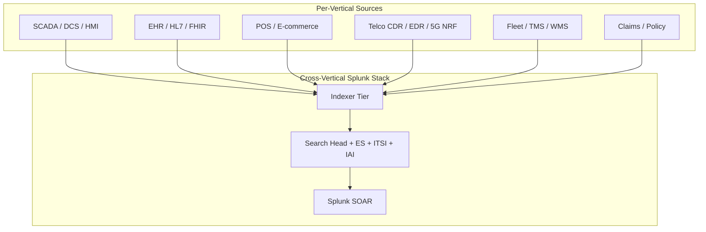

# Industry Verticals Integration Guide

> The definitive guide to industry-specific Splunk integration. **146
> use cases** across ten major verticals: Energy & Utilities (electric
> grid, generation, transmission, distribution, smart grid AMI),
> Manufacturing & Process Industry (discrete + process, OEE, MES, CMMS,
> SAP), Healthcare & Life Sciences (HL7 / FHIR / EHR / Epic / Cerner /
> medical IoT / pharmacy), Transportation & Logistics (TMS, WMS, fleet
> telematics), Oil, Gas & Mining (upstream / midstream / downstream,
> refinery DCS, pipeline SCADA), Retail & E-Commerce (POS, e-commerce,
> omnichannel, loyalty), Aviation & Airport Operations (ATC, baggage
> handling BHS, passenger flow, ramp ops), Telecommunications (5G core /
> RAN / OSS/BSS / charging / IPDR), Water & Wastewater Utilities
> (SCADA, treatment, distribution metering), and Insurance & Claims
> Processing (policy admin, claims, underwriting, fraud). Sector-specific
> KPIs, regulatory compliance (NERC CIP<sup class="ref">[<a href="#ref-8">8</a>]</sup>, HIPAA<sup class="ref">[<a href="#ref-14">14</a>]</sup>, FDA 21 CFR, TSA
> Pipeline), business-process observability, and the playbooks that
> turn Splunk into the system of insight for each industry.

---

## Table of Contents

- [Quick Start](#quick-start)
- [Overview](#overview)
- [Architecture and Data Flow](#architecture)
- [Prerequisites](#prerequisites)
- [Energy and Utilities](#energy)
- [Manufacturing and Process Industry](#manufacturing)
- [Healthcare and Life Sciences](#healthcare)
- [Transportation and Logistics](#transportation)
- [Oil, Gas, and Mining](#oilgas)
- [Retail and E-Commerce](#retail)
- [Aviation and Airport Operations](#aviation)
- [Telecommunications Operations](#telco)
- [Water and Wastewater Utilities](#water)
- [Insurance and Claims Processing](#insurance)
- [Cross-Vertical Foundations](#cross-vertical)
- [Field Dictionary](#field-dictionary)
- [Sample Events](#sample-events)
- [Splunk-Side Configuration](#splunk-config)
- [Cross-Product Correlation](#cross-product)
- [Compliance Mapping by Vertical](#compliance)
- [Capacity Planning and Sizing](#sizing)
- [Recommended Dashboard Layouts (per Vertical)](#dashboards)
- [ITSI Service Modeling](#itsi)
- [SOAR Playbook Examples](#soar)
- [Multi-Region Strategy](#multi-region)
- [Security Hardening](#security-hardening)
- [Crawl / Walk / Run Roadmap](#roadmap)
- [Validation Checklist](#validation-checklist)
- [Known Limitations and Gaps](#known-limitations)
- [Troubleshooting](#troubleshooting)
- [FAQ](#faq)
- [Glossary](#glossary)
- [References](#references)
- [Contribution and Feedback](#contribution)

---

<a id="quick-start"></a>
## Quick Start — Industry-Specific Onboarding

Pick your vertical and start with the highest-value UC:

| Vertical | First UC |
|----------|---------|
| **Energy** | UC-21.1.1 (SCADA Alarm Rate / Flooding) |
| **Manufacturing** | UC-21.2.1 (OEE Trending) |
| **Healthcare** | UC-21.3.1 (HL7 Message Health) |
| **Transportation** | UC-21.4.1 (Fleet Telematics) |
| **Oil & Gas** | UC-21.5.1 (Wellhead SCADA) |
| **Retail** | UC-21.6.1 (POS Transaction Health) |
| **Aviation** | UC-21.7.1 (BHS Throughput) |
| **Telco** | UC-21.8.1 (5G Core SBI Health) |
| **Water** | UC-21.9.1 (Treatment SCADA) |
| **Insurance** | UC-21.10.1 (Claims Cycle Time) |

---

<a id="overview"></a>
## Overview

### Why industry-vertical integration matters

Industry verticals share a pattern:
- **Heavy regulatory environment** (HIPAA, NERC CIP, PCI-DSS, FDA, TSA, etc.)
- **Industry-specific protocols** (HL7, FHIR, ISA-95, NETCONF, CDR, Modbus, OPC)
- **Business KPIs alongside IT KPIs** (OEE, MTTR, claim cycle time, RPO/RTO)
- **Cross-domain correlation** (SCADA → safety → financial impact)
- **Specialized terminology** that must be respected

### What good looks like

| Dimension | Without integration | With full integration |
|-----------|---------------------|-----------------------|
| Industry KPIs | Per-system reports | Unified Splunk dashboards |
| Regulatory evidence | Annual scramble | Continuous attestation |
| Safety event correlation | Manual review | Automated cross-system |
| Business process visibility | Silos | End-to-end via Splunk |

---

<a id="architecture"></a>
## Architecture and Data Flow



---

<a id="prerequisites"></a>
## Prerequisites

| Item | Detail |
|------|--------|
| **Splunk Enterprise / Cloud** | 9.0+ |
| **Splunk ITSI** | For service-health KPIs (most verticals benefit) |
| **Splunk OT Security Add-on** | For OT-heavy verticals (Energy, Manufacturing, Oil & Gas, Water) |
| **Splunk IAI** | Industrial Asset Intelligence for advanced asset analytics |
| **Industry-specific TAs** | Per-vertical (HL7 parsers, telco TAs, etc.) |

---

<a id="energy"></a>
## Energy and Utilities

15 use cases. Electric grid, smart grid AMI, generation, transmission, distribution.

### Data sources

| Source | Sourcetype | Notes |
|--------|-----------|-------|
| SCADA alarms | `scada:alarm` | Substation, line operations |
| SCADA events | `scada:event` | State changes, switching |
| SCADA HMI | `scada:hmi` | Operator actions |
| Smart meter (AMI) | `smartgrid:meter` | Load, demand, anomaly |
| Generation telemetry | `opcua:metrics` | Plant DCS |
| OMS (Outage Mgmt) | `oms:event` | Customer outages |
| DERMS (Distributed Energy) | `derms:event` | Solar, wind, storage |

### SPL — SCADA alarm flooding (UC-21.1.1)

```spl
index=scada sourcetype="scada:alarm" earliest=-1h
| bin _time span=5m
| stats count as alarm_count, dc(alarm_id) as distinct_alarms by substation_id, _time
| eventstats avg(alarm_count) as baseline by substation_id
| eval z_score=(alarm_count-baseline)/baseline
| where alarm_count > 50 OR z_score > 3
```

### SPL — AMI revenue protection

```spl
index=energy sourcetype="smartgrid:meter" earliest=-7d
| stats avg(consumption_kwh) as avg_kwh, dc(timestamp) as readings by meter_id
| where avg_kwh < 0.1 AND readings > 100
| join meter_id [search index=energy sourcetype="cmms:workorder" service_type="active" | stats values(account_status) as status by meter_id]
| where status="active"
```

### Compliance: NERC CIP

CIP-007, CIP-008, CIP-005, CIP-010 — see [IoT/OT Guide](iot-ot.md) for full mapping.

---

<a id="manufacturing"></a>
## Manufacturing and Process Industry

18 use cases. Discrete + process manufacturing, OEE, MES, CMMS.

### Data sources

| Source | Sourcetype |
|--------|-----------|
| MES (Manufacturing Execution) | `mes:event`, `mes:job` |
| CMMS (Maintenance) | `cmms:workorder` |
| OEE (Overall Equipment Effectiveness) | `oee:metric` |
| ERP (SAP, Oracle EBS) | `sap:idoc`, `sap:cdr` |
| ICS / SCADA | (see IoT/OT Guide) |

### SPL — OEE calculation (UC-21.2.1)

```spl
index=mfg sourcetype="oee:metric" earliest=-1d
| stats sum(planned_runtime_min) as planned, sum(actual_runtime_min) as actual, sum(units_produced) as units, sum(units_planned) as planned_units, sum(good_units) as good by line_id
| eval availability=actual/planned*100
| eval performance=units/planned_units*100
| eval quality=good/units*100
| eval oee=round(availability*performance*quality/10000,1)
| sort oee
```

### SPL — Production-impact downtime root cause

```spl
(index=mfg sourcetype="mes:event" event_type="line_stop" earliest=-1d)
| stats count, sum(duration_min) as total_downtime, values(reason_code) as reasons by line_id
| sort -total_downtime
```

---

<a id="healthcare"></a>
## Healthcare and Life Sciences

27 use cases. HL7 / FHIR / EHR / Epic / Cerner / medical IoT / pharmacy.

### Data sources

| Source | Sourcetype |
|--------|-----------|
| HL7 v2 messages | `hl7:message`, `hl7:adt`, `hl7:orm`, `hl7:oru`, `hl7:msh` |
| FHIR resources | `fhir:resource` |
| Epic audit | `epic:audit` |
| Cerner audit | `cerner:audit` |
| Medical IoT (IoMT) | `mediot:device` |
| Pharmacy / dispensing | `pharmacy:event` |

### SPL — HL7 message integrity (UC-21.3.1)

```spl
index=healthcare sourcetype="hl7:message" earliest=-1h
| stats count by message_type, success_flag
| where success_flag="false"
| sort -count
```

### SPL — EHR PHI access audit

```spl
index=healthcare sourcetype="epic:audit" event_type="patient_chart_view" earliest=-1d
| stats dc(patient_mrn) as unique_patients, count by user_id
| where unique_patients > 50
| sort -unique_patients
```

### SPL — Medication dispensing anomaly (Diversion detection)

```spl
index=healthcare sourcetype="pharmacy:event" event_type="dispense" controlled_substance="true" earliest=-7d
| stats count, sum(quantity) as total_qty by user_id, drug_name
| eventstats avg(count) as avg_dispensed, stdev(count) as std_dispensed by drug_name
| eval z_score=if(std_dispensed>0, (count-avg_dispensed)/std_dispensed, 0)
| where z_score > 3
```

### Compliance

- HIPAA §164.312 (technical safeguards)
- HITECH (audit trail)
- FDA 21 CFR Part 11 (electronic records, e-signatures)
- 42 CFR Part 2 (substance use)

---

<a id="transportation"></a>
## Transportation and Logistics

12 use cases. TMS, WMS, fleet telematics.

### Data sources

| Source | Sourcetype |
|--------|-----------|
| TMS (Transportation Mgmt) | `tms:event` |
| WMS (Warehouse Mgmt) | `wms:event` |
| Fleet telematics | `fleet:telematics` |
| RFID / barcode | `rfid:scan`, `barcode:scan` |

### SPL — Shipment SLA breach prediction (UC-21.4.1)

```spl
index=logistics sourcetype="tms:event" earliest=-1d
| stats latest(status) as status, latest(eta) as eta, earliest(_time) as start_time by shipment_id
| where status NOT IN ("delivered","cancelled")
| eval hours_remaining=(strptime(eta,"%Y-%m-%dT%H:%M:%SZ")-now())/3600
| where hours_remaining < 4
```

### SPL — Fleet harsh-driving detection

```spl
index=logistics sourcetype="fleet:telematics" earliest=-1d
| stats count(eval(harsh_braking="yes")) as braking, count(eval(harsh_acceleration="yes")) as accel, count(eval(speeding="yes")) as speeding by vehicle_id, driver_id
| eval risk_score=braking + accel + speeding
| where risk_score > 10
| sort -risk_score
```

---

<a id="oilgas"></a>
## Oil, Gas, and Mining

12 use cases. Upstream / midstream / downstream.

### Data sources

| Source | Sourcetype |
|--------|-----------|
| Wellhead SCADA | `oil:wellhead` |
| Pipeline SCADA | `oil:pipeline:scada` |
| Refinery DCS | `oil:refinery:dcs` |
| Drilling rigs | `oil:drilling:event` |
| Mining ICS | `mining:scada` |

### SPL — Pipeline pressure anomaly (UC-21.5.1)

```spl
index=oilgas sourcetype="oil:pipeline:scada" metric_name="pressure_psi" earliest=-1h
| stats latest(metric_value) as current, avg(metric_value) as baseline, stdev(metric_value) as std by pipeline_id, segment_id
| eval z_score=if(std>0, (current-baseline)/std, 0)
| where abs(z_score) > 3
| eval severity=case(abs(z_score)>5,"critical",abs(z_score)>4,"high",1=1,"medium")
```

### SPL — Wellhead production drop

```spl
index=oilgas sourcetype="oil:wellhead" metric_name="production_bbl_day" earliest=-7d
| stats latest(metric_value) as current_bbl, avg(metric_value) as baseline_bbl by well_id
| eval drop_pct=round((baseline_bbl-current_bbl)/baseline_bbl*100,1)
| where drop_pct > 20
| sort -drop_pct
```

### Compliance

- TSA Pipeline Security Directives
- API RP 1164 (Pipeline SCADA Security)
- NERC CIP (if interconnected)
- BSEE (Bureau of Safety and Environmental Enforcement)

---

<a id="retail"></a>
## Retail and E-Commerce

14 use cases. POS, e-commerce, omnichannel, loyalty.

### Data sources

| Source | Sourcetype |
|--------|-----------|
| POS terminal | `retail:pos` |
| E-commerce platform | `retail:ecommerce` |
| Loyalty | `retail:loyalty` |
| Inventory mgmt | `retail:inventory` |
| Order mgmt | `retail:oms` |

### SPL — POS transaction health (UC-21.6.1)

```spl
index=retail sourcetype="retail:pos" earliest=-1h
| stats count(eval(status="success")) as success, count(eval(status="failure")) as failure, count as total by store_id
| eval failure_pct=round(failure/total*100,2)
| where failure_pct > 5
```

### SPL — E-commerce checkout abandonment

```spl
index=retail sourcetype="retail:ecommerce" earliest=-1d
| stats count(eval(event="cart_create")) as cart_created, count(eval(event="checkout_complete")) as completed by hour
| eval abandonment_rate=round((cart_created-completed)/cart_created*100,1)
| timechart span=1h avg(abandonment_rate)
```

### Compliance

- PCI-DSS 4.0 (POS-side full coverage)
- GDPR<sup class="ref">[<a href="#ref-4">4</a>]</sup> / CCPA<sup class="ref">[<a href="#ref-2">2</a>]</sup> (loyalty data)
- State data privacy laws (US)

---

<a id="aviation"></a>
## Aviation and Airport Operations

10 use cases. ATC, baggage handling, passenger flow, ramp ops.

### Data sources

| Source | Sourcetype |
|--------|-----------|
| BHS (Baggage) | `airport:bhs` |
| Flight info | `airport:flight` |
| Passenger flow | `airport:passenger` |
| ATC events | `atc:event` |
| Ramp ops | `airport:ramp` |

### SPL — BHS throughput (UC-21.7.1)

```spl
index=aviation sourcetype="airport:bhs" earliest=-1h
| stats count(eval(status="processed")) as processed, count(eval(status="reject")) as reject, count as total by terminal, conveyor
| eval reject_rate=round(reject/total*100,1)
| where reject_rate > 2
```

### SPL — Flight on-time performance

```spl
index=aviation sourcetype="airport:flight" event="departure" earliest=-1d
| eval delay_min=actual_minus_scheduled
| eval on_time=if(delay_min<=15,1,0)
| stats avg(on_time)*100 as otp_pct, avg(delay_min) as avg_delay by carrier
| sort otp_pct
```

---

<a id="telco"></a>
## Telecommunications Operations

20 use cases. 5G core, RAN, OSS/BSS, charging.

### Data sources

| Source | Sourcetype |
|--------|-----------|
| Voice CDR | `telco:cdr` |
| Data EDR | `telco:edr` |
| IPDR | `telco:ipdr` |
| 5G NRF | `telco:5g:nrf` |
| 5G SMF | `telco:5g:smf` |
| 5G UPF | `telco:5g:upf` |
| 5G AMF | `telco:5g:amf` |
| 5G AUSF | `telco:5g:ausf` |
| OSS | `telco:oss` |
| BSS / Charging | `telco:bss:charging` |

### SPL — 5G Core SBI health (UC-21.8.1)

```spl
index=telco sourcetype="telco:5g:nrf" earliest=-15m
| stats count, count(eval(http_status>=400)) as errors by nf_type, target_nf
| eval error_rate=round(errors/count*100,2)
| where error_rate > 5
```

### SPL — Voice CDR fraud detection

```spl
index=telco sourcetype="telco:cdr" call_type="voice" earliest=-1h
| stats count, sum(duration_sec) as total_dur by called_number, calling_number
| where (called_number LIKE "+1900*" OR called_number LIKE "+1976*") AND count > 10
```

---

<a id="water"></a>
## Water and Wastewater Utilities

8 use cases. SCADA, treatment, distribution metering.

### Data sources

| Source | Sourcetype |
|--------|-----------|
| Treatment plant SCADA | `water:treatment` |
| Distribution SCADA | `water:scada` |
| Meter telemetry | `water:meter` |

### SPL — Treatment plant chemistry deviation (UC-21.9.1)

```spl
index=water sourcetype="water:treatment" metric_name IN ("ph","chlorine_ppm","turbidity_ntu") earliest=-1h
| stats latest(metric_value) as current, avg(metric_value) as baseline, stdev(metric_value) as std by metric_name, plant_id
| eval z_score=if(std>0, (current-baseline)/std, 0)
| where abs(z_score) > 3
```

### Compliance

- EPA Safe Drinking Water Act
- AWIA (America's Water Infrastructure Act)
- WaterISAC threat sharing

---

<a id="insurance"></a>
## Insurance and Claims Processing

10 use cases. Policy admin, claims, underwriting, fraud.

### Data sources

| Source | Sourcetype |
|--------|-----------|
| Claims processing | `insurance:claim` |
| Policy admin | `insurance:policy` |
| Underwriting | `insurance:underwriting` |

### SPL — Claims cycle time (UC-21.10.1)

```spl
index=insurance sourcetype="insurance:claim" status="closed" earliest=-30d
| eval cycle_time_days=(strptime(closed_at,"%Y-%m-%dT%H:%M:%SZ")-strptime(filed_at,"%Y-%m-%dT%H:%M:%SZ"))/86400
| stats avg(cycle_time_days) as avg_days, perc95(cycle_time_days) as p95_days by claim_type
```

### SPL — Claims fraud detection

```spl
index=insurance sourcetype="insurance:claim" earliest=-90d
| stats count by claimant_id
| where count > 5
| join claimant_id [search index=insurance sourcetype="insurance:claim" earliest=-90d
    | stats sum(claim_amount) as total_claimed by claimant_id]
| where total_claimed > 100000
```

### Compliance

- Solvency II (EU insurance)
- NAIC Model Regulations (US)
- GDPR / CCPA (PII in claims)
- SOX<sup class="ref">[<a href="#ref-11">11</a>]</sup> (financial reporting)

---

<a id="cross-vertical"></a>
## Cross-Vertical Foundations

All verticals benefit from these common building blocks already covered in dedicated guides:
- IT infrastructure: [Linux Servers Guide](linux-servers.md), [Windows Servers Guide](windows-servers.md)
- Cloud: [AWS](aws.md), [Azure](azure.md), [GCP](gcp.md)
- Networking: [Cisco Catalyst](catalyst-center.md), [Firewalls](firewalls.md)
- Security: [SIEM & SOAR](siem-soar.md), [EDR](edr.md), [VM](vulnerability-management.md)
- ITSM: [Service Management & ITSM](service-management-itsm.md)
- Data: [Relational Databases](relational-databases.md), [NoSQL & Cloud DBs](nosql-cloud-databases.md)

---

<a id="field-dictionary"></a>
## Field Dictionary

| Field | Across verticals |
|-------|-----------------|
| `industry_kpi` | OEE, claim_cycle, BHS_throughput, OTP, etc. |
| `business_unit` | Plant, store, hospital, well, terminal, etc. |
| `location_id` | Site / location identifier |
| `severity` | Per-vertical severity scheme |
| `regulation_tag` | NERC CIP, HIPAA, PCI, FDA, TSA |

---

<a id="sample-events"></a>
## Sample Events

(See per-vertical sections.)

---

<a id="splunk-config"></a>
## Splunk-Side Configuration

### Index strategy (per vertical)

```ini
[energy]
homePath = $SPLUNK_DB/energy/db
maxDataSize = auto_high_volume
frozenTimePeriodInSecs = 94608000   # 3 years NERC CIP

[mfg]
homePath = $SPLUNK_DB/mfg/db
maxDataSize = auto_high_volume
frozenTimePeriodInSecs = 31536000

[healthcare]
homePath = $SPLUNK_DB/healthcare/db
maxDataSize = auto_high_volume
frozenTimePeriodInSecs = 220752000  # 7 years HIPAA

[retail]
homePath = $SPLUNK_DB/retail/db
maxDataSize = auto_high_volume
frozenTimePeriodInSecs = 31536000   # 1 year (PCI default)

[telco]
homePath = $SPLUNK_DB/telco/db
maxDataSize = auto_high_volume
frozenTimePeriodInSecs = 94608000   # 3 years CDR

[insurance]
homePath = $SPLUNK_DB/insurance/db
maxDataSize = auto_high_volume
frozenTimePeriodInSecs = 220752000  # 7 years SOX

[oilgas]
homePath = $SPLUNK_DB/oilgas/db
maxDataSize = auto_high_volume
frozenTimePeriodInSecs = 94608000

[water]
homePath = $SPLUNK_DB/water/db
maxDataSize = auto_high_volume
frozenTimePeriodInSecs = 94608000

[aviation]
homePath = $SPLUNK_DB/aviation/db
maxDataSize = auto_high_volume
frozenTimePeriodInSecs = 220752000  # FAA 7 years

[logistics]
homePath = $SPLUNK_DB/logistics/db
maxDataSize = auto_high_volume
frozenTimePeriodInSecs = 31536000
```

---

<a id="cross-product"></a>
## Cross-Product Correlation

### Manufacturing — OEE drop → Maintenance prediction

```spl
(index=mfg sourcetype="oee:metric" earliest=-1h)
| stats avg(oee) as oee by line_id
| where oee < 75
| join line_id [search index=mfg sourcetype="opcua:metrics" metric_name IN ("vibration_mm_s","temperature_c") | stats avg(metric_value) as avg_val by line_id, metric_name]
```

### Healthcare — HL7 latency → Patient impact

```spl
(index=healthcare sourcetype="hl7:adt" earliest=-1h)
| stats latency_ms by patient_mrn
| where latency_ms > 5000
```

### Retail — Failed POS → Lost revenue

```spl
(index=retail sourcetype="retail:pos" status="failure" earliest=-1h)
| stats sum(transaction_amount) as lost_revenue by store_id
| sort -lost_revenue
```

---

<a id="compliance"></a>
## Compliance Mapping by Vertical

| Vertical | Key regulations |
|----------|-----------------|
| **Energy** | NERC CIP, FERC, ISO/RTO directives, EU NIS2<sup class="ref">[<a href="#ref-3">3</a>]</sup> |
| **Manufacturing** | ISA-95, IEC 62443<sup class="ref">[<a href="#ref-6">6</a>]</sup>, ITAR (defense), ISO 9001 |
| **Healthcare** | HIPAA, HITECH, FDA 21 CFR Part 11 + 820, GxP, 42 CFR Part 2 |
| **Transportation** | DOT, FMCSA HOS, IATA |
| **Oil & Gas** | TSA Pipeline, API RP 1164, BSEE |
| **Retail** | PCI-DSS, GDPR/CCPA, FTC Safeguards |
| **Aviation** | FAA, EASA, ICAO, TSA |
| **Telco** | FCC, CALEA, GDPR, EU EECC |
| **Water** | EPA SDWA, AWIA, EU drinking water directive |
| **Insurance** | Solvency II, NAIC, SOX, GDPR |

---

<a id="sizing"></a>
## Capacity Planning and Sizing

| Vertical | Daily volume (large org) |
|----------|--------------------------|
| Energy | 10-100 GB |
| Manufacturing | 5-50 GB per plant |
| Healthcare | 10-200 GB per hospital system |
| Logistics | 5-100 GB |
| Oil & Gas | 50-500 GB |
| Retail | 10-100 GB per chain |
| Aviation | 50-500 GB per major hub |
| Telco | 1+ TB (CDR alone) |
| Water | 1-10 GB per utility |
| Insurance | 5-50 GB |

---

<a id="dashboards"></a>
## Recommended Dashboard Layouts (per Vertical)

Each vertical should have:
- Crawl: First-30-day onboarding dashboard
- Walk: Operational dashboards
- Run: Executive scorecards + compliance attestation

---

<a id="itsi"></a>
## ITSI Service Modeling

Per-vertical service trees, e.g., Manufacturing:
```
Manufacturing Posture
├── Per-Plant
│   ├── Production lines
│   ├── OEE per line
│   ├── Equipment health
│   └── Quality KPIs
├── Per-Process
└── Compliance posture
```

---

<a id="soar"></a>
## SOAR Playbook Examples

### Healthcare: Suspected diversion → Lock + Investigate

```
1. RECEIVE notable: pharmacy diversion candidate
2. SUSPEND user dispensing access (pharmacy system API)
3. CREATE compliance investigation ticket
4. NOTIFY pharmacy director
```

### Retail: POS down → Auto-failover

```
1. RECEIVE notable: POS terminal down 5min
2. CALL POS vendor API: failover to backup
3. NOTIFY store manager
4. CREATE Sev-2 ticket
```

### Telco: 5G UPF degraded → Auto-traffic-shift

```
1. RECEIVE notable: UPF latency > 50ms
2. CALL SMF API: shift traffic to redundant UPF
3. NOTIFY core engineering
```

---

<a id="multi-region"></a>
## Multi-Region Strategy

- Per-region indexes (`telco_us`, `telco_eu`, `telco_apac`)
- Data sovereignty: keep PHI / PII in-region
- Federated dashboards across regions

---

<a id="security-hardening"></a>
## Security Hardening

- Industry-specific RBAC (e.g., separate PHI access role for healthcare)
- Encryption at rest for all PHI/PII/PCI indexes
- Audit log retention per regulation (3-7 years typical)
- Field-level RBAC for sensitive identifiers

---

<a id="roadmap"></a>
## Crawl / Walk / Run Roadmap

### Crawl (Month 1)

1. Onboard 1-2 industry-specific data sources
2. Per-vertical compliance index strategy
3. Crawl-tier KPI dashboard

### Walk (Month 2-3)

1. Onboard remaining systems
2. ITSI service modeling
3. Per-vertical SOAR playbooks
4. Cross-system correlation

### Run (Month 4+)

1. Executive vertical scorecards
2. ML anomaly detection per vertical
3. Quarterly regulatory attestation
4. Predictive analytics

---

<a id="validation-checklist"></a>
## Validation Checklist

- [ ] Day 1: First vertical-specific event in Splunk
- [ ] Day 30: Walk-tier UCs deployed for chosen vertical
- [ ] Day 90: Executive dashboards live; compliance attestation operational

---

<a id="known-limitations"></a>
## Known Limitations and Gaps

| Limitation | Impact | Workaround |
|------------|--------|------------|
| **Industry protocols (HL7v2, NETCONF)** | Custom parsing | Use Splunk OT add-on or vendor parsers |
| **High-volume CDR (telco)** | Storage cost | Summary indexing + selective retention |
| **PHI / PII compliance** | Field-level controls | RBAC + masking |
| **Vertical TA availability** | Often custom | Build per-vendor connector |

---

<a id="troubleshooting"></a>
## Troubleshooting

### HL7 messages not parsing

- Verify HL7 parser configured (vendor-specific)
- Check MSH segment delimiters

### Telco CDR ingest lag

- Check HEC token rate limits
- Use multi-HEC for parallel ingest

### POS data inconsistent across stores

- Verify store time zone handling
- Check CLOCK skew

---

<a id="faq"></a>
## FAQ

**Q: Should I use one Splunk for multiple verticals?**
A: Yes — single platform, per-vertical indexes / RBAC / dashboards.

**Q: How to handle PHI in Splunk?**
A: Encryption at rest + field-level RBAC + audit access to PHI indexes.

**Q: ITSI vs custom dashboards for verticals?**
A: ITSI is best for service-health KPIs; custom dashboards for non-service specifics.

**Q: How long to retain CDR / telco data?**
A: 3 years minimum (CALEA in US, varies elsewhere).

---

<a id="glossary"></a>
## Glossary

| Term | Definition |
|------|-----------|
| **AMI** | Advanced Metering Infrastructure |
| **OEE** | Overall Equipment Effectiveness |
| **MES** | Manufacturing Execution System |
| **CMMS** | Computerized Maintenance Management |
| **HL7** | Health Level Seven International |
| **FHIR** | Fast Healthcare Interoperability Resources |
| **EHR** | Electronic Health Record |
| **IoMT** | Internet of Medical Things |
| **TMS** | Transportation Management System |
| **WMS** | Warehouse Management System |
| **BHS** | Baggage Handling System |
| **OTP** | On-Time Performance (aviation) |
| **CDR** | Call Detail Record (telco) |
| **EDR** | Event Data Record (telco) |
| **IPDR** | IP Detail Record |
| **NRF/SMF/UPF/AMF/AUSF** | 5G Core network functions |
| **SCADA** | Supervisory Control and Data Acquisition |
| **DCS** | Distributed Control System |
| **POS** | Point of Sale |

---

<a id="references"></a>
## References

- [Splunk OT Security Add-on (Splunkbase 5151)](https://splunkbase.splunk.com/app/5151)
- [Splunk Industrial Asset Intelligence (Splunkbase 4942)](https://splunkbase.splunk.com/app/4942)
- [NERC CIP Standards](https://www.nerc.com/pa/Stand/Pages/ReliabilityStandards.aspx)
- [HIPAA Security Rule](https://www.hhs.gov/hipaa/for-professionals/security/index.html)
- [TSA Pipeline Security Directives](https://www.tsa.gov/news)
- [HL7 International](https://www.hl7.org/)
- [3GPP 5G Specifications](https://www.3gpp.org/)

---

<a id="contribution"></a>
## Contribution and Feedback

Part of the [Splunk Monitoring Use Cases](https://github.com/fenre/splunk-monitoring-use-cases) project. [Open an issue](https://github.com/fenre/splunk-monitoring-use-cases/issues/new).

---

*Last updated: 2026-05-09. Covers all 10 industry verticals with vertical-specific KPIs, regulatory compliance, and Splunk integration patterns.*

---

<!-- BEGIN-AUTOGENERATED-SOURCES -->

## References

*Auto-generated by `scripts/generate_doc_references.py` from `data/source-references.json` and `data/source-mappings.json`. Edit those files (or the document body) to change citations; this footer is rewritten on every run.*

### Supporting sources

<a id="ref-1"></a>**[1]** American Institute of Certified Public Accountants. (2017). *Trust Services Criteria (2017) for Security, Availability, Processing Integrity, Confidentiality, and Privacy*. AICPA & CIMA. SOC 2 / TSP Section 100. https://www.aicpa-cima.com/topic/audit-assurance/soc-suite-of-services

<a id="ref-2"></a>**[2]** California Office of the Attorney General. (2020). *California Consumer Privacy Act / California Privacy Rights Act*. State of California. CA Civ Code § 1798.100 et seq. https://oag.ca.gov/privacy/ccpa

<a id="ref-3"></a>**[3]** European Parliament and Council of the European Union. (2022, December). *Directive (EU) 2022/2555 — NIS2 Directive on cybersecurity*. Official Journal of the European Union, L 333. ELI: dir/2022/2555. https://eur-lex.europa.eu/eli/dir/2022/2555/oj

<a id="ref-4"></a>**[4]** European Parliament and Council of the European Union. (2016, April). *Regulation (EU) 2016/679 — General Data Protection Regulation*. Official Journal of the European Union, L 119. ELI: reg/2016/679. https://eur-lex.europa.eu/eli/reg/2016/679/oj

<a id="ref-5"></a>**[5]** Gerhards, R. (2009, March). *The Syslog Protocol*. Internet Engineering Task Force. RFC 5424. https://www.rfc-editor.org/rfc/rfc5424

<a id="ref-6"></a>**[6]** International Electrotechnical Commission. (2018). *IEC 62443 — Industrial communication networks — Network and system security*. IEC. https://webstore.iec.ch/en/publication/7029

<a id="ref-7"></a>**[7]** MITRE Corporation. (2026). *MITRE ATT&CK Knowledge Base*. MITRE Engenuity. https://attack.mitre.org/

<a id="ref-8"></a>**[8]** North American Electric Reliability Corporation. (2024). *NERC Critical Infrastructure Protection (CIP) Reliability Standards*. NERC. https://www.nerc.com/pa/Stand/Pages/CIPStandards.aspx

<a id="ref-9"></a>**[9]** Payment Card Industry Security Standards Council. (2022). *Payment Card Industry Data Security Standard v4.0* (v4.0). PCI SSC. https://www.pcisecuritystandards.org/document_library/?category=pcidss

<a id="ref-10"></a>**[10]** Public Company Accounting Oversight Board. (2007). *Auditing Standard 2201 — An Audit of Internal Control Over Financial Reporting*. PCAOB. PCAOB AS 2201. https://pcaobus.org/oversight/standards/auditing-standards/details/AS2201

<a id="ref-11"></a>**[11]** U.S. Congress. (2002). *Sarbanes-Oxley Act of 2002 — Public Company Accounting Reform and Investor Protection Act*. U.S. Government. Pub. L. 107–204. https://www.sec.gov/about/laws/soa2002.pdf

<a id="ref-12"></a>**[12]** U.S. Department of Defense. (2024). *Cybersecurity Maturity Model Certification (CMMC) 2.0* (2.0). Office of the Under Secretary of Defense for Acquisition and Sustainment. https://dodcio.defense.gov/CMMC/

<a id="ref-13"></a>**[13]** U.S. Department of Health & Human Services. (2002). *HIPAA Privacy Rule (45 CFR Parts 160 and 164, Subparts A and E)*. Office for Civil Rights, HHS. 45 CFR 160, 164. https://www.hhs.gov/hipaa/for-professionals/privacy/index.html

<a id="ref-14"></a>**[14]** U.S. Department of Health & Human Services. (2013). *HIPAA Security Rule (45 CFR Parts 160 and 164, Subparts A and C)*. Office for Civil Rights, HHS. 45 CFR 160, 164. https://www.hhs.gov/hipaa/for-professionals/security/index.html

<a id="ref-15"></a>**[15]** U.S. Transportation Security Administration. (2023). *TSA Security Directive Pipeline-2021-02 series*. U.S. Department of Homeland Security. https://www.tsa.gov/news/press/releases/2022/07/21/tsa-revises-and-reissues-cybersecurity-requirements-pipeline-owners

<details>
<summary>Additional online sources cited in the document body (11)</summary>

<a id="ref-16"></a>**[16]** splunkbase.splunk.com. *Splunk OT Security Add-on (Splunkbase 5151)*. Retrieved May 11, 2026, from https://splunkbase.splunk.com/app/5151

<a id="ref-17"></a>**[17]** splunkbase.splunk.com. *Splunk Industrial Asset Intelligence (Splunkbase 4942)*. Retrieved May 11, 2026, from https://splunkbase.splunk.com/app/4942

<a id="ref-18"></a>**[18]** nerc.com. *NERC CIP Standards*. Retrieved May 11, 2026, from https://www.nerc.com/pa/Stand/Pages/ReliabilityStandards.aspx

<a id="ref-19"></a>**[19]** tsa.gov. *TSA Pipeline Security Directives*. Retrieved May 11, 2026, from https://www.tsa.gov/news

<a id="ref-20"></a>**[20]** hl7.org. *HL7 International*. Retrieved May 11, 2026, from https://www.hl7.org/

<a id="ref-21"></a>**[21]** 3gpp.org. *3GPP 5G Specifications*. Retrieved May 11, 2026, from https://www.3gpp.org/

<a id="ref-22"></a>**[22]** github.com. *Splunk Monitoring Use Cases*. Retrieved May 11, 2026, from https://github.com/fenre/splunk-monitoring-use-cases

<a id="ref-23"></a>**[23]** github.com. *Open an issue*. Retrieved May 11, 2026, from https://github.com/fenre/splunk-monitoring-use-cases/issues/new

<a id="ref-24"></a>**[24]** splunkbase.splunk.com. *Splunkbase*. Retrieved May 11, 2026, from https://splunkbase.splunk.com/

<a id="ref-25"></a>**[25]** splunkbase.splunk.com. *Splunkbase app #5601*. Retrieved May 11, 2026, from https://splunkbase.splunk.com/app/5601

<a id="ref-26"></a>**[26]** splunkbase.splunk.com. *Splunkbase app #3088*. Retrieved May 11, 2026, from https://splunkbase.splunk.com/app/3088

</details>

### Related repository documents

- [`docs/guides/aws.md`](aws.md)
- [`docs/guides/azure.md`](azure.md)
- [`docs/guides/catalyst-center.md`](catalyst-center.md)
- [`docs/guides/edr.md`](edr.md)
- [`docs/guides/firewalls.md`](firewalls.md)
- [`docs/guides/gcp.md`](gcp.md)
- [`docs/guides/iot-ot.md`](iot-ot.md)
- [`docs/guides/linux-servers.md`](linux-servers.md)
- [`docs/guides/nosql-cloud-databases.md`](nosql-cloud-databases.md)
- [`docs/guides/relational-databases.md`](relational-databases.md)
- [`docs/guides/service-management-itsm.md`](service-management-itsm.md)
- [`docs/guides/siem-soar.md`](siem-soar.md)
- [`docs/guides/vulnerability-management.md`](vulnerability-management.md)
- [`docs/guides/windows-servers.md`](windows-servers.md)

<!-- END-AUTOGENERATED-SOURCES -->
