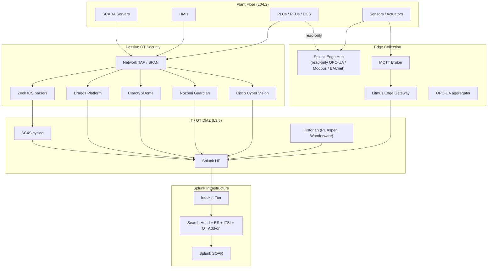

# IoT & Operational Technology (OT) Integration Guide

> The definitive guide to integrating IoT and Operational Technology
> with Splunk. **249 use cases** spanning Splunk Edge Hub deployment,
> Building Management Systems (BACnet, Tridium Niagara, Siemens Desigo,
> Johnson Controls Metasys, Schneider EcoStruxure, Honeywell EBI),
> Industrial Control Systems (OPC-UA, Modbus TCP/RTU, EtherNet/IP,
> Profinet, S7Comm, DNP3), Cisco Cyber Vision, Nozomi Networks Guardian,
> Claroty, Dragos, Litmus Edge, IoT platforms (AWS IoT Core, Azure IoT
> Hub, GCP IoT, ThingsBoard), MQTT + Sparkplug B brokers, and Zeek ICS
> deep protocol inspection. PLC / RTU health, sensor telemetry, alarm
> flooding detection, OT asset inventory, IT/OT convergence security
> (Purdue model boundary monitoring), MITRE ATT&CK for ICS coverage,
> NERC CIP / IEC 62443 / NIS2 compliance, and the full OT visibility
> story from Level 0 sensors through Level 5 enterprise integration.

---

## Table of Contents

- [Quick Start](#quick-start)
- [Overview](#overview)
- [Purdue Reference Model & Where Splunk Fits](#purdue)
- [Architecture and Data Flow](#architecture)
- [Prerequisites](#prerequisites)
- [Platform Coverage Matrix](#platform-matrix)
- [Splunk Edge Hub](#edge-hub)
- [Building Management Systems (BMS)](#bms)
- [Industrial Control Systems (ICS / SCADA)](#ics)
- [Cisco Cyber Vision (Passive OT Monitoring)](#cybervision)
- [Nozomi Networks Guardian](#nozomi)
- [Claroty xDome / SRA](#claroty)
- [Dragos Platform](#dragos)
- [Litmus Edge Industrial IoT Gateway](#litmus)
- [IoT Platforms (AWS IoT, Azure IoT, GCP IoT, ThingsBoard)](#iot-platforms)
- [MQTT and OPC-UA at the Edge](#mqtt-opcua)
- [Zeek ICS Deep Protocol Inspection](#zeek-ics)
- [OT Asset Inventory & Profiling](#ot-asset)
- [Alarm Flooding & SCADA Alarm Management](#alarm-flooding)
- [PLC / RTU / DCS Health Monitoring](#plc-health)
- [Field Dictionary](#field-dictionary)
- [Sample Events](#sample-events)
- [Splunk-Side Configuration](#splunk-config)
- [Cross-Product Correlation](#cross-product)
- [Operational_Telemetry Data Model](#opt-dm)
- [Splunk ES + OT Security Add-on Pipeline](#es-ot)
- [Compliance Mapping (NERC CIP / IEC 62443 / NIS2 / MITRE ICS)](#compliance)
- [Capacity Planning and Sizing](#sizing)
- [Recommended Dashboard Layouts](#dashboards)
- [ITSI Service Modeling for OT](#itsi)
- [SOAR Playbook Examples (OT-Aware)](#soar)
- [Multi-Site / Multi-Plant Strategy](#multi-site)
- [Security Hardening (OT-Specific)](#security-hardening)
- [Crawl / Walk / Run Roadmap](#roadmap)
- [Validation Checklist](#validation-checklist)
- [Known Limitations and Gaps](#known-limitations)
- [Troubleshooting](#troubleshooting)
- [FAQ](#faq)
- [Glossary](#glossary)
- [References](#references)
- [Contribution and Feedback](#contribution)

---

<a id="quick-start"></a>
## Quick Start — 4 Hours to First OT Insight

> OT integration is **conservative by design**. Never deploy active
> probes to PLCs without OT engineering sign-off. Default to passive
> monitoring (TAP / SPAN / Cyber Vision / Nozomi).

### Splunk Edge Hub (purpose-built OT collector)

1. Install [Splunk Edge Hub firmware 3.x](https://www.splunk.com/en_us/products/splunk-edge-hub.html) on hardware.
2. Edge Hub UI → Splunk Connection → HEC URL + token.
3. Edge Hub UI → Sources → add OPC-UA / Modbus / BACnet / MQTT source.
4. Validate: `index=edge_hub sourcetype="edgehub:metric" earliest=-15m | stats count by source, metric_name`

### Cisco Cyber Vision (passive monitoring)

1. Install [TA-cisco-cybervision](https://splunkbase.splunk.com/app/5601).
2. Cyber Vision Center → Settings → Splunk → Add HEC.
3. Validate: `index=cybervision sourcetype="cisco:cybervision:event" earliest=-15m | stats count by event_type`

### Nozomi Networks Guardian

1. Install [Nozomi Networks App for Splunk (Splunkbase 4945)](https://splunkbase.splunk.com/app/4945).
2. Guardian → Administration → Data Integration → Splunk:
    - HEC URL + token
    - Stream: assets, alerts, network traffic
3. Validate: `index=nozomi sourcetype="nozomi:event" earliest=-15m | stats count by source, severity`

### Activate crawl tier

UC-14.1.1 (BMS Energy Monitoring), UC-14.2.1 (PLC/RTU Health), UC-14.3.1 (Edge Hub Device Health), UC-14.5.1 (MQTT Topic Trending), UC-14.9.1 (Cyber Vision Asset Inventory), UC-14.9.6 (Nozomi Alert Triage).

---

<a id="overview"></a>
## Overview

### Why IoT/OT observability is different

OT is **not just IT with old gear**. Key differences:

| Aspect | IT | OT |
|--------|------|-----|
| **Patching** | Days/weeks | Years (production windows) |
| **Lifecycle** | 3-5 years | 15-30 years |
| **Protocols** | TCP/IP + HTTP | Modbus, BACnet, OPC, Profinet, S7Comm |
| **Auth** | Identity-centric | Often "trusted by network" |
| **Logging** | Built-in | Often absent — passive monitoring required |
| **Active probes** | Routine | Can crash 1990s-era PLCs — DON'T |
| **Safety** | Confidentiality > Integrity > Availability | Safety > Availability > Integrity > Confidentiality |

### Domains covered

| Domain | Examples |
|--------|---------|
| **BMS** | HVAC, lighting, fire, access control, smart meters |
| **ICS / SCADA** | PLCs, RTUs, DCS, HMIs |
| **Edge collection** | Splunk Edge Hub, Litmus Edge, OPC-UA aggregators |
| **Passive OT security** | Cisco Cyber Vision, Nozomi, Claroty, Dragos |
| **Cloud IoT** | AWS IoT Core, Azure IoT Hub, GCP IoT |
| **MQTT brokers** | Mosquitto, HiveMQ, EMQX |
| **Asset inventory** | Discovery + classification |
| **Compliance** | NERC CIP, IEC 62443, NIS2, MITRE ATT&CK for ICS |

### What good looks like

| Dimension | Without integration | With full integration |
|-----------|---------------------|-----------------------|
| OT asset inventory | Spreadsheet, stale | Live, daily refresh |
| PLC health visibility | Walk to control room | Per-PLC dashboard |
| Alarm flood detection | Operator overload | Auto-alerted, suppressed |
| IT/OT boundary monitoring | Manual reviews | Continuous Purdue Level 3.5 monitoring |
| MITRE ATT&CK ICS coverage | Uncoded | Per-technique notable searches |
| NERC CIP audit prep | Weeks | Hours, automated evidence |

---

<a id="purdue"></a>
## Purdue Reference Model & Where Splunk Fits

```
Level 5  Enterprise Network                ←  Splunk SH + ES + ITSI
Level 4  Site Business Network             ←  Splunk indexers + UF on plant servers
─────────────────────────────────────────────  IT/OT DMZ (Purdue Level 3.5)
Level 3  Site Operations (MES / Historian) ←  Splunk Edge Hub, Litmus Edge, OT TAs
Level 2  Supervisory (HMI, SCADA)          ←  Splunk Edge Hub (read-only), Cyber Vision passive
Level 1  Control (PLC, RTU, DCS)           ←  Cyber Vision / Nozomi passive only
Level 0  Process (sensors, actuators)      ←  Edge Hub via OPC-UA / Modbus (read-only)
```

Splunk's role:
- **Levels 0-2**: Read-only passive ingest (Edge Hub, Cyber Vision)
- **Level 3**: Historian + MES log ingest, alarm management
- **Level 3.5 (DMZ)**: IT/OT boundary firewall logs (cat 5.2 + 17.6)
- **Levels 4-5**: SIEM + ITSI + analytics

---

<a id="architecture"></a>
## Architecture and Data Flow



### Core principles

- **Passive first** for L0-L2 (Cyber Vision / Nozomi)
- **Read-only active** for Edge Hub OPC-UA / Modbus
- **Never** write to PLCs from Splunk
- **Operational_Telemetry CIM** for sensor metrics (not standard CIM)

---

<a id="prerequisites"></a>
## Prerequisites

| Item | Detail |
|------|--------|
| **Splunk version** | 9.0+ Enterprise / Cloud |
| **OT Security Add-on** | [Splunkbase 5151](https://splunkbase.splunk.com/app/5151) for ES integration |
| **CIM** | Operational_Telemetry (separate from standard CIM) |
| **Edge Hub firmware** | 3.x for full sensor support |
| **OT engineering sign-off** | Required for any active connection to L0-L2 |
| **Network TAP / SPAN** | Required for passive monitoring |
| **NTP discipline** | Critical for OT correlation |

---

<a id="platform-matrix"></a>
## Platform Coverage Matrix

| Layer | Platform | TA / Splunkbase |
|-------|----------|------|
| **Edge collection** | Splunk Edge Hub | Edge Hub Add-on |
| **Edge collection** | Litmus Edge | Litmus Edge Add-on |
| **OT security passive** | Cisco Cyber Vision | TA-cisco-cybervision [5601](https://splunkbase.splunk.com/app/5601) |
| **OT security passive** | Nozomi Guardian | Nozomi App [4945](https://splunkbase.splunk.com/app/4945) |
| **OT security passive** | Claroty xDome | (vendor TA) |
| **OT security passive** | Dragos Platform | (vendor TA / API) |
| **ES integration** | OT Security Add-on | [5151](https://splunkbase.splunk.com/app/5151) |
| **Cloud IoT** | AWS IoT Core | Splunk_TA_aws [1876](https://splunkbase.splunk.com/app/1876) |
| **Cloud IoT** | Azure IoT Hub | Splunk Add-on for Microsoft Cloud Services [3110](https://splunkbase.splunk.com/app/3110) |
| **Cloud IoT** | GCP Cloud IoT | Splunk_TA_google-cloudplatform [3088](https://splunkbase.splunk.com/app/3088) |
| **MQTT** | Mosquitto / HiveMQ / EMQX | Edge Hub MQTT subscriber, custom HEC |
| **Zeek ICS** | s7comm / dnp3 / bacnet / enip / modbus / opcua | Zeek/Bro Add-on [1617](https://splunkbase.splunk.com/app/1617) |

---

<a id="edge-hub"></a>
## Splunk Edge Hub

Splunk Edge Hub is purpose-built ARM-based edge appliance that collects OT and IoT telemetry directly without needing a heavy footprint on the plant floor.

### Hardware

- ARM Cortex-A55, 4 GB RAM, 32 GB storage
- 2x Ethernet ports, USB, serial, GPIO
- Built-in: temperature, humidity, light, accelerometer, color, air quality sensors
- Industrial DIN-rail optional

### Configuration via UI

```
Edge Hub UI → Splunk Connection
  Protocol: HTTPS HEC
  URL: https://splunk-hec.yourcorp.com:8088
  Token: <hec-token>
  Index: edge_hub
  Verify cert: yes

Edge Hub UI → Sources → +Add Source:
  - OPC-UA (server URL, security mode, namespace)
  - Modbus TCP (host, port, register start, register count)
  - BACnet (network, device ID)
  - MQTT (broker URL, topic, QoS)
```

### Sample event (Edge Hub OPC-UA metric)

```json
{
    "edge_hub_id": "EH-PLANT01-001",
    "source": "OPCUA-Compressor-1",
    "metric_name": "compressor.discharge_pressure_psi",
    "metric_value": 142.5,
    "metric_unit": "PSI",
    "quality": "Good",
    "timestamp": "2026-04-25T14:30:15.123Z"
}
```

### SPL — Edge Hub device health

```spl
index=edge_hub sourcetype="edgehub:health" earliest=-15m
| stats latest(cpu_pct) as cpu, latest(memory_pct) as mem, latest(disk_pct) as disk, latest(uptime_sec) as uptime by edge_hub_id
| where cpu > 80 OR mem > 90 OR disk > 90
```

### Skill reference

For full Edge Hub deployment guidance, see the [splunk-edge-hub](file:///Users/fsudmann/.cursor/skills/splunk-edge-hub/SKILL.md) and [splunk-edge-hub-protocols](file:///Users/fsudmann/.cursor/skills/splunk-edge-hub-protocols/SKILL.md) skills.

---

<a id="bms"></a>
## Building Management Systems (BMS)

### Major BMS platforms

| Vendor | Platform | Common protocols |
|--------|----------|------------------|
| **Schneider Electric** | EcoStruxure Building | BACnet IP, LonWorks |
| **Honeywell** | EBI / Niagara | BACnet IP, Niagara |
| **Siemens** | Desigo | BACnet IP, KNX |
| **Johnson Controls** | Metasys | BACnet IP, N2 |
| **Tridium** | Niagara Framework | BACnet, Modbus, OPC, MQTT |
| **Distech / Reliable Controls** | EC-Net / RC-Studio | BACnet IP |

### Integration approach

1. Edge Hub or Litmus Edge subscribes to BACnet / KNX / OPC over IP
2. Or: Niagara Station JACE → REST/MQTT → Splunk HEC
3. Or: BMS native API exports to Splunk

### Sample SPL — Energy consumption trending

```spl
index=bms sourcetype="bacnet:metrics" metric_name IN ("kw_total","gas_m3_h","water_l_min","steam_kg_h") earliest=-7d
| timechart span=1h sum(metric_value) by metric_name
```

### Sample SPL — HVAC anomaly

```spl
index=bms sourcetype="bacnet:metrics" metric_name="zone_temperature_c" earliest=-1h
| eventstats avg(metric_value) as avg_temp, stdev(metric_value) as std_temp by zone_id
| eval z_score=if(std_temp>0, (metric_value-avg_temp)/std_temp, 0)
| where abs(z_score) > 3
| table _time, zone_id, metric_value, avg_temp, z_score
```

---

<a id="ics"></a>
## Industrial Control Systems (ICS / SCADA)

### Common ICS protocols

| Protocol | Vendor / use |
|----------|---------|
| **OPC-UA / OPC-DA** | Universal — most modern HMIs/SCADA |
| **Modbus TCP / RTU** | Universal — legacy and modern |
| **EtherNet/IP (CIP)** | Allen-Bradley / Rockwell, ODVA |
| **Profinet** | Siemens, Phoenix Contact |
| **S7Comm** | Siemens S7-300/400/1200/1500 |
| **DNP3** | Electric utilities (SCADA) |
| **IEC 60870-5-104** | European utilities (SCADA) |
| **MMS / IEC 61850** | Substation automation |
| **BACnet** | Building / HVAC |

### Splunk integration patterns

1. **Passive only**: Cyber Vision / Nozomi / Claroty / Dragos via SPAN
2. **Read-only active**: Edge Hub OPC-UA / Modbus polling at low rate
3. **HMI / SCADA logs**: forward via UF or syslog (`scada:event`)

### SPL — SCADA event trending

```spl
index=scada sourcetype="scada:event" earliest=-1d
| stats count by event_class, severity
| sort -count
```

---

<a id="cybervision"></a>
## Cisco Cyber Vision (Passive OT Monitoring)

Cisco Cyber Vision combines the Catalyst IE switches and Cyber Vision Sensors with the Cyber Vision Center for passive OT visibility.

### Configuration

```
Cisco Cyber Vision Center → Admin → API:
  + Generate API token

Cyber Vision Center → Admin → Splunk Integration:
  + Splunk HEC URL + token
  + Streams: events, assets, vulnerabilities, flows
```

### Sourcetypes

| Sourcetype | Content |
|-----------|---------|
| `cisco:cybervision:event` | Security events (intrusion, baseline drift) |
| `cisco:cybervision:asset` | Asset inventory (PLC, HMI, engineering workstation) |
| `cisco:cybervision:flow` | Network conversation metadata |
| `cisco:cybervision:vulnerability` | CVE per asset |

### SPL — Cyber Vision asset inventory

```spl
index=cybervision sourcetype="cisco:cybervision:asset" earliest=-1d
| stats latest(*) as * by asset_id
| stats count by vendor, asset_type, criticality
```

---

<a id="nozomi"></a>
## Nozomi Networks Guardian

Nozomi Guardian is a passive OT/IoT security platform that integrates via REST API + Splunk HEC.

### Configuration

```
Nozomi Guardian → Administration → Data Integration → Splunk:
  + HEC URL + token
  + Streams: assets, alerts, network traffic, vulnerabilities
```

### Sourcetypes

`nozomi:event`, `nozomi:asset`, `nozomi:alert`, `nozomi:flow`.

### SPL — Critical Nozomi alerts

```spl
index=nozomi sourcetype="nozomi:alert" severity IN ("high","critical") earliest=-1d
| stats values(asset_name) as assets, count by alert_type, severity
| sort -count
```

---

<a id="claroty"></a>
## Claroty xDome / SRA

Claroty xDome (formerly CTD) integrates via REST API or syslog to Splunk SC4S.

```
Claroty xDome → System → Integrations → Splunk:
  + Syslog target → SC4S
```

Sourcetype: `claroty:event`.

---

<a id="dragos"></a>
## Dragos Platform

Dragos exports via REST API + Splunk HEC.

Sourcetype: `dragos:event`.

---

<a id="litmus"></a>
## Litmus Edge Industrial IoT Gateway

Litmus Edge is a software gateway that aggregates OT data and forwards to Splunk HEC.

```
Litmus Edge → Outputs → +Add Splunk Output:
  HEC URL + token
  Index: edge_hub
```

Sourcetype: `litmusedge:metric`.

---

<a id="iot-platforms"></a>
## IoT Platforms (AWS IoT, Azure IoT, GCP IoT, ThingsBoard)

### AWS IoT Core

```
AWS IoT Core → Rules → +Create Rule:
  Trigger: SELECT * FROM 'iot/+/telemetry'
  Action: Send to Kinesis Data Stream → Splunk Add-on for AWS
```

Sourcetype: `aws:iot:core`.

### Azure IoT Hub

```
Azure IoT Hub → Endpoints → +Add Custom Endpoint → Event Hub
  → Stream to Splunk Add-on for Microsoft Cloud Services
```

Sourcetype: `azure:iothub`.

### Google Cloud IoT

```
GCP Cloud IoT → device telemetry → Pub/Sub → Splunk_TA_google-cloudplatform
```

Sourcetype: `google:gcp:iotcore`.

### ThingsBoard (open-source)

ThingsBoard → Rule Chains → REST API call to Splunk HEC.

Sourcetype: `thingsboard:event`.

---

<a id="mqtt-opcua"></a>
## MQTT and OPC-UA at the Edge

MQTT is the standard IoT pub/sub messaging protocol; OPC-UA is the standard for industrial automation.

### MQTT brokers

| Broker | Notes |
|--------|-------|
| **Mosquitto** | Open-source, lightweight |
| **HiveMQ** | Enterprise, MQTT 5 |
| **EMQX** | Cluster-grade, multi-protocol |
| **AWS IoT** / **Azure IoT** | Managed cloud MQTT |

### Splunk integration

1. **Edge Hub MQTT subscriber** (preferred for L2-L3)
2. **Custom HEC bridge** (bash + mosquitto_sub | curl)
3. **MQTT TA / connector apps** on Splunkbase

### Sample SPL — MQTT topic activity

```spl
index=mqtt sourcetype="mqtt:json" earliest=-1h
| stats count by topic
| sort -count
```

### Sparkplug B (industrial MQTT standard)

Sourcetype `sparkplug:b` — industrial-specific MQTT payload.

---

<a id="zeek-ics"></a>
## Zeek ICS Deep Protocol Inspection

Zeek (formerly Bro) parses ICS protocols deeply when fed via SPAN port.

### Supported ICS parsers

| Sourcetype | Protocol |
|-----------|---------|
| `bro:s7comm` | Siemens S7Comm |
| `bro:dnp3` | DNP3 (utilities) |
| `bro:bacnet` | BACnet (BMS) |
| `bro:enip` | EtherNet/IP CIP (Rockwell) |
| `bro:modbus` | Modbus TCP |
| `bro:opcua` | OPC-UA |

### SPL — S7Comm read/write trending

```spl
index=ot sourcetype="bro:s7comm" earliest=-1d
| stats count by uid, function_name
```

---

<a id="ot-asset"></a>
## OT Asset Inventory & Profiling

### Combined inventory from passive monitoring tools

```spl
(index=cybervision sourcetype="cisco:cybervision:asset")
OR (index=nozomi sourcetype="nozomi:asset")
| eval source_tool=case(sourcetype="cisco:cybervision:asset","CyberVision",sourcetype="nozomi:asset","Nozomi")
| stats values(source_tool) as tools, latest(asset_type) as type, latest(vendor) as vendor by asset_ip
| stats count by vendor, type, mvcount(tools)
```

---

<a id="alarm-flooding"></a>
## Alarm Flooding & SCADA Alarm Management

### SPL — Alarm flooding detection

```spl
index=scada sourcetype="scada:alarm" earliest=-1h
| bin _time span=5m
| stats count as alarm_count, dc(alarm_id) as distinct_alarms by substation_id, _time
| eventstats avg(alarm_count) as baseline, stdev(alarm_count) as std by substation_id
| eval z_score=if(std>0, (alarm_count-baseline)/std, 0)
| where alarm_count > 50 OR z_score > 3
```

ISA-18.2 alarm rationalisation reference: 1 alarm per operator per 10 minutes maximum.

---

<a id="plc-health"></a>
## PLC / RTU / DCS Health Monitoring

### SPL — PLC health (Edge Hub OPC-UA)

```spl
index=edge_hub sourcetype="edgehub:metric" metric_name IN ("plc.cpu_pct","plc.memory_pct","plc.comm_status") earliest=-15m
| chart latest(metric_value) over plc_name by metric_name
| where 'plc.cpu_pct'>80 OR 'plc.memory_pct'>90 OR 'plc.comm_status'!="OK"
```

---

<a id="field-dictionary"></a>
## Field Dictionary

| Field | Edge Hub | Cyber Vision | Nozomi | Zeek ICS | SCADA |
|-------|----------|--------------|--------|----------|-------|
| `asset` | source | asset_id | asset_id | host | tag_name |
| `metric_name` | metric_name | (n/a) | (n/a) | function_name | tag_quality |
| `metric_value` | metric_value | (n/a) | (n/a) | value | tag_value |
| `metric_unit` | metric_unit | (n/a) | (n/a) | (n/a) | engineering_unit |
| `severity` | (n/a) | severity | severity | severity | priority |
| `event_type` | (n/a) | event_type | alert_type | function_name | event_class |

---

<a id="sample-events"></a>
## Sample Events

(See per-platform sections.)

---

<a id="splunk-config"></a>
## Splunk-Side Configuration

### Index strategy

```ini
[ot]
homePath = $SPLUNK_DB/ot/db
maxDataSize = auto_high_volume
frozenTimePeriodInSecs = 31536000   # 1 year (NERC CIP min)

[edge_hub]
homePath = $SPLUNK_DB/edge_hub/db
maxDataSize = auto_high_volume
frozenTimePeriodInSecs = 31536000

[cybervision]
homePath = $SPLUNK_DB/cybervision/db
maxDataSize = auto_high_volume
frozenTimePeriodInSecs = 31536000

[nozomi]
homePath = $SPLUNK_DB/nozomi/db
maxDataSize = auto_high_volume
frozenTimePeriodInSecs = 31536000

[scada]
homePath = $SPLUNK_DB/scada/db
maxDataSize = auto_high_volume
frozenTimePeriodInSecs = 94608000   # 3 years (NERC CIP retention)
```

### Skill reference

See [splunk-oti-data-model](file:///Users/fsudmann/.cursor/skills/splunk-oti-data-model/SKILL.md) and [splunk-oti-datastreamer](file:///Users/fsudmann/.cursor/skills/splunk-oti-datastreamer/SKILL.md) for complete OT data model setup.

---

<a id="cross-product"></a>
## Cross-Product Correlation

### Engineering workstation → unauthorized PLC writes

```spl
(index=cybervision sourcetype="cisco:cybervision:event" event_type="plc_write" earliest=-24h)
| join asset_ip [search index=cybervision sourcetype="cisco:cybervision:asset" asset_type="EngineeringWorkstation" | stats values(asset_ip) as engineering_ws]
| where NOT match(asset_ip, engineering_ws)
| stats count by source_asset, target_plc
```

### IT/OT boundary breach

```spl
(index=firewall src_ip IN (it_subnet) dest_ip IN (ot_subnet) action="allowed" earliest=-1h)
| stats count by src_ip, dest_ip, dest_port
| sort -count
```

---

<a id="opt-dm"></a>
## Operational_Telemetry Data Model

The Operational_Telemetry data model (separate from standard CIM) normalises OT/IoT sensor data into:
- Metrics (universal sensor readings)
- Events (state transitions)
- States (discrete states)
- Production (manufacturing)
- OEE (Overall Equipment Effectiveness)
- Quality
- Maintenance
- Security
- Location

### Universal sensor reading mapping

```ini
# props.conf for opcua:metrics
[opcua:metrics]
FIELDALIAS-metric_name_aliases = NodeId AS metric_name
FIELDALIAS-metric_value_aliases = Value AS metric_value
FIELDALIAS-metric_unit_aliases = EngineeringUnit AS metric_unit
EVAL-metric_type = "gauge"
```

---

<a id="es-ot"></a>
## Splunk ES + OT Security Add-on Pipeline

The OT Security Add-on for Splunk (Splunkbase 5151) provides:
- 35+ correlation searches mapped to MITRE ATT&CK for ICS
- NERC CIP compliance dashboards
- ICS asset risk scoring
- Integration with Splunk ES notable framework

### MITRE ATT&CK for ICS coverage

| Tactic | Coverage |
|--------|----------|
| **Initial Access (TA0108)** | IT/OT boundary monitoring |
| **Execution (TA0104)** | PLC program changes |
| **Persistence (TA0110)** | Engineering workstation persistence |
| **Privilege Escalation (TA0111)** | HMI privilege misuse |
| **Lateral Movement (TA0109)** | OT-internal lateral via Cyber Vision flows |
| **Collection (TA0100)** | Historian access patterns |
| **Command and Control (TA0101)** | Outbound from OT to internet |
| **Inhibit Response Function (TA0107)** | Safety system disable detection |
| **Impair Process Control (TA0106)** | Setpoint manipulation |

---

<a id="compliance"></a>
## Compliance Mapping (NERC CIP / IEC 62443 / NIS2 / MITRE ICS)

### NERC CIP (electric utilities)

| Standard | Coverage |
|----------|----------|
| **CIP-007 R4** Security event monitoring | All OT logs ingested |
| **CIP-008 R1** Incident response plan | ES notable + SOAR |
| **CIP-005 R1** Electronic Security Perimeter | IT/OT firewall logs |
| **CIP-010** Configuration change | PLC config change detection |

### IEC 62443 (ISA-99)

| Zone | Coverage |
|------|----------|
| **3-3 SR-2.8** Auditable events | All OT events ingested |
| **3-3 SR-3.4** Software/info integrity | Config change detection |
| **3-3 SR-7.6** Network and security configuration | Cyber Vision baseline drift |

### NIS2 (essential entities)

| Article | Coverage |
|---------|----------|
| **Art 21** Cybersecurity risk-management | Continuous OT monitoring |
| **Art 23** Incident reporting | ES + SOAR pipeline |

---

<a id="sizing"></a>
## Capacity Planning and Sizing

| Plant size | Daily volume |
|------------|--------------|
| Small (single building, < 100 PLCs) | ~1 GB |
| Medium (1-5 sites, 100-1000 PLCs) | ~10 GB |
| Large (10+ sites, 1000+ PLCs) | ~100 GB |
| Hyper-scale (utility / global manufacturer) | ~1 TB+ |

Edge Hub adds ~50 KB/sensor/day at 1-min polling.

---

<a id="dashboards"></a>
## Recommended Dashboard Layouts

### Crawl

```
+---------------------+---------------------+
| OT ASSET INVENTORY (count by vendor)       |
+---------------------+---------------------+
| EDGE HUB DEVICE HEALTH                     |
+---------------------+---------------------+
| TOP SCADA ALARMS                           |
+---------------------+---------------------+
| MQTT TOPIC ACTIVITY                        |
+---------------------+---------------------+
```

### Walk

```
+---------------------+---------------------+
| CYBER VISION ALERTS BY SEVERITY            |
+---------------------+---------------------+
| ALARM FLOODING DETECTION (per substation)  |
+---------------------+---------------------+
| PLC HEALTH HEAT-MAP                        |
+---------------------+---------------------+
| IT/OT BOUNDARY TRAFFIC                     |
+---------------------+---------------------+
```

### Run

```
+---------------------+---------------------+
| MITRE ATT&CK ICS COVERAGE                  |
+---------------------+---------------------+
| OEE / PRODUCTION KPI                       |
+---------------------+---------------------+
| NERC CIP / IEC 62443 EVIDENCE PANE         |
+---------------------+---------------------+
| OT MATURITY SCORECARD                      |
+---------------------+---------------------+
```

---

<a id="itsi"></a>
## ITSI Service Modeling for OT

### Service hierarchy

```
OT Plant Posture
├── Per-Plant Health
│   ├── Plant 1
│   ├── Plant 2
│   └── ...
├── Critical Process Lines
│   ├── Line A (boilers, turbines, etc.)
│   └── Line B
├── Asset Categories
│   ├── PLCs
│   ├── HMIs
│   ├── Engineering workstations
│   └── Network gear
└── Security Posture
    ├── Cyber Vision risk score
    ├── Nozomi alert rate
    └── IT/OT boundary anomaly rate
```

---

<a id="soar"></a>
## SOAR Playbook Examples (OT-Aware)

> **CRITICAL**: SOAR playbooks for OT must default to **alert + ticket**,
> not auto-block. OT response actions require human-in-the-loop.

### Playbook 1: Cyber Vision critical alert → Notify

```
1. RECEIVE notable: critical OT alert
2. ENRICH with Cyber Vision asset detail
3. PAGE OT Engineering on-call
4. CREATE Sev-1 ticket
5. DO NOT auto-isolate (could halt production)
```

### Playbook 2: New device on OT VLAN → Quarantine (with approval)

```
1. RECEIVE notable: unmanaged device on OT VLAN
2. PAUSE for human approval (Slack interactive prompt)
3. IF approved → push 802.1X dynamic VLAN to Quarantine via Cisco ISE API
4. NOTIFY OT engineering
```

### Playbook 3: PLC config change → Audit trail

```
1. RECEIVE notable: PLC program upload detected
2. PULL last 7 days of engineering workstation activity
3. ATTACH to ticket
4. NOTIFY change management
```

---

<a id="multi-site"></a>
## Multi-Site / Multi-Plant Strategy

- Per-site Edge Hub fleet, all reporting to central Splunk
- Per-site indexes (`ot_plant1`, `ot_plant2`)
- Per-site Cyber Vision Center → consolidated Splunk
- Geo-tag every event via lookup

---

<a id="security-hardening"></a>
## Security Hardening (OT-Specific)

- Edge Hub HEC tokens: rotate, scope per device
- TLS for all OT data flows
- Read-only credentials for OPC-UA / Modbus polling
- IT/OT DMZ Splunk Heavy Forwarder, never Universal Forwarder writing back to OT
- Field-level RBAC for safety-critical data

---

<a id="roadmap"></a>
## Crawl / Walk / Run Roadmap

### Crawl (Month 1-2)

1. Deploy 1 Edge Hub at pilot site
2. Onboard Cyber Vision (passive)
3. CIM Operational_Telemetry mapping
4. UC-14.1.1, UC-14.2.1, UC-14.9.1

### Walk (Month 3-6)

1. Roll out Edge Hub fleet
2. Onboard Nozomi / Claroty / Dragos
3. ES OT correlation enabled
4. SOAR alert-and-ticket playbooks
5. Operational_Telemetry data model accelerated

### Run (Month 7+)

1. MITRE ATT&CK ICS full coverage
2. Multi-site federated dashboards
3. NERC CIP / IEC 62443 evidence pipeline
4. ITSI OT service health KPIs

---

<a id="validation-checklist"></a>
## Validation Checklist

- [ ] Day 1: First Edge Hub or passive sensor sending events
- [ ] Day 14: Asset inventory operational
- [ ] Day 30: Walk-tier UCs deployed, Operational_Telemetry CIM working
- [ ] Day 90: SOAR alert-mode playbooks live; compliance dashboards live

---

<a id="known-limitations"></a>
## Known Limitations and Gaps

| Limitation | Impact | Workaround |
|------------|--------|------------|
| **Active OPC polling can crash old PLCs** | OT downtime | Use Cyber Vision passive only on legacy gear |
| **OPC-UA security models complex** | Auth setup time | Document per-vendor cert config |
| **MQTT QoS not enforced uniformly** | Message loss | Use QoS 1 minimum |
| **NERC CIP requires 3-year retention** | Storage cost | Plan for cold/frozen tier |
| **OT vendor APIs vary widely** | Integration complexity | Standardize on Edge Hub or vendor TAs |

---

<a id="troubleshooting"></a>
## Troubleshooting

### Edge Hub data not arriving

- Verify HEC token + URL
- Check Edge Hub status via local UI
- Inspect `index=_internal source=edge_hub*`

### Cyber Vision asset count low

- Verify SPAN port mirrors all OT VLAN traffic
- Check sensor health in Cyber Vision Center
- Look for unidirectional traffic (PLC chatty, HMI quiet)

### ICS protocols not parsed

- Verify Zeek policy includes ICS scripts
- Check sourcetype mapping in props.conf

### MQTT broker overload

- Increase Edge Hub batch size
- Use MQTT QoS 0 for high-volume telemetry
- Consider HiveMQ or EMQX cluster for >100k clients

---

<a id="faq"></a>
## FAQ

**Q: Can Splunk write to a PLC?**
A: Technically yes via SOAR + custom action; **never** in production without OT engineering approval. Default: read-only.

**Q: Edge Hub vs Litmus Edge — which?**
A: Both are valid. Edge Hub is purpose-built for Splunk; Litmus is more flexible across SIEMs.

**Q: Cyber Vision vs Nozomi vs Claroty vs Dragos?**
A: All credible. Cyber Vision strongest for Cisco-network shops. Nozomi/Claroty broader vendor coverage. Dragos strongest threat-intel for utilities.

**Q: How much OT data should I retain?**
A: NERC CIP says 1 year minimum, 3 years for evidence. IEC 62443 silent. Industry best practice: 1 year hot + warm, 3+ years cold.

**Q: What about safety systems (SIS)?**
A: Read-only monitoring only. Never integrate writes. Document in OT Cyber Vision policy.

---

<a id="glossary"></a>
## Glossary

| Term | Definition |
|------|-----------|
| **PLC** | Programmable Logic Controller |
| **RTU** | Remote Terminal Unit |
| **DCS** | Distributed Control System |
| **SCADA** | Supervisory Control and Data Acquisition |
| **HMI** | Human-Machine Interface |
| **OPC-UA** | OPC Unified Architecture |
| **BACnet** | Building Automation and Control |
| **DNP3** | Distributed Network Protocol (utilities) |
| **ICS** | Industrial Control System |
| **OT** | Operational Technology |
| **IIoT** | Industrial Internet of Things |
| **OEE** | Overall Equipment Effectiveness |
| **NERC CIP** | North American Electric Reliability Corp Critical Infrastructure Protection |
| **IEC 62443** | International OT cybersecurity standard |
| **Purdue Model** | Reference architecture for OT layering |
| **MES** | Manufacturing Execution System |

---

<a id="references"></a>
## References

- [Splunk OT Security Add-on (Splunkbase 5151)](https://splunkbase.splunk.com/app/5151)
- [TA-cisco-cybervision (Splunkbase 5601)](https://splunkbase.splunk.com/app/5601)
- [Nozomi Networks App for Splunk (Splunkbase 4945)](https://splunkbase.splunk.com/app/4945)
- [Splunk Edge Hub Product Page](https://www.splunk.com/en_us/products/splunk-edge-hub.html)
- [NIST 800-82r3 OT Security](https://csrc.nist.gov/pubs/sp/800/82/r3/final)
- [IEC 62443](https://www.isa.org/standards-and-publications/isa-standards/isa-iec-62443-series-of-standards)
- [MITRE ATT&CK for ICS](https://attack.mitre.org/matrices/ics/)
- [NERC CIP Standards](https://www.nerc.com/pa/Stand/Pages/ReliabilityStandards.aspx)

---

<a id="contribution"></a>
## Contribution and Feedback

Part of the [Splunk Monitoring Use Cases](https://github.com/fenre/splunk-monitoring-use-cases) project. [Open an issue](https://github.com/fenre/splunk-monitoring-use-cases/issues/new).

---

*Last updated: 2026-05-09. Covers Splunk Edge Hub firmware 3.x, Cisco Cyber Vision 5.x, Nozomi Guardian 24.x, Claroty xDome 11.x, Dragos Platform 2.x, Litmus Edge current.*
