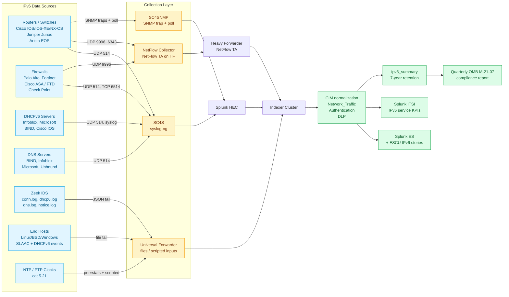

# IPv6 Operations & Transition Integration Guide

> Operational visibility, transition tracking, and federal-mandate compliance
> for the IPv6 protocol family — covering dual-stack, IPv6-only, NetFlow v9 /
> IPFIX flow data, DHCPv6 and prefix delegation, neighbour discovery and
> first-hop security, IPv6 routing protocols, and the regulatory evidence pack
> required by OMB M-21-07, NIST SP 800-119, NIS2, PCI DSS 4.0, HIPAA, and the
> CISA TIC 3.0 trust-zone model. Companion guide to `cisco-networks.md`,
> `network-flow.md`, `dns-dhcp.md`, and `firewalls.md`.

## Table of Contents

- [Quick Start — From Zero to First IPv6 Adoption Dashboard](#quick-start--from-zero-to-first-ipv6-adoption-dashboard)
- [Overview](#overview)
- [Architecture and Data Flow](#architecture-and-data-flow)
- [Prerequisites](#prerequisites)
- [Data Sources](#data-sources)
- [Configuration](#configuration)
- [Sizing and Capacity Planning](#sizing-and-capacity-planning)
- [Compliance and Audit Evidence Pack](#compliance-and-audit-evidence-pack)
- [Crawl / Walk / Run Roadmap](#crawl--walk--run-roadmap)
- [Dashboards](#dashboards)
- [SPL Examples](#spl-examples)
- [Troubleshooting](#troubleshooting)
- [SOAR Playbooks](#soar-playbooks)
- [Network Time Services (cat 5.21)](#network-time-services-cat-521)
- [Cross-Product Integration](#cross-product-integration)

## Quick Start — From Zero to First IPv6 Adoption Dashboard

### Day 1: Identify your data sources

You almost certainly have IPv6 data flowing into your network already, even
if you haven't enabled it explicitly: every modern Linux, macOS, Windows,
iOS, and Android client speaks IPv6 over Wi-Fi by default, and most cloud
providers (AWS, Azure, GCP) auto-assign IPv6 to managed services. The
question is whether you're seeing it in Splunk.

Three minimum-viable inputs:

| Source | What it tells you | Add-on |
|---|---|---|
| Router/switch syslog | NDP, MLD, RA events; IPv6 BGP/OSPFv3 sessions; ICMPv6 rate-limit hits | Splunk Add-on for Cisco IOS (1352), Splunk Add-on for Juniper (2847) |
| NetFlow v9 / IPFIX | IPv6 flow records (NetFlow v5 is IPv4-only — skip it) | Splunk Add-on for NetFlow (1658) |
| Firewall traffic logs | IPv6 sessions, NAT64, ICMPv6 policy hits | Splunk Add-on for Palo Alto (7523), Splunk Add-on for Fortinet (2846) |

### Day 2: Stand up the `ipv6_summary` summary index

Long-term IPv6 trending (adoption ratios, prefix utilisation, transition
milestones) is best driven from a summary index so the executive dashboards
stay snappy. Pre-create:

```ini
# indexes.conf on cluster manager
[ipv6_summary]
homePath   = $SPLUNK_DB/ipv6_summary/db
coldPath   = $SPLUNK_DB/ipv6_summary/colddb
thawedPath = $SPLUNK_DB/ipv6_summary/thaweddb
maxDataSize = auto_high_volume
frozenTimePeriodInSecs = 220752000
```

Retention: 7 years to satisfy the OMB M-21-07 federal-mandate evidence
window and NIST SP 800-53 PM-9 (capital planning) lookback.

### Day 3: Enable IPv6 ratio trending (UC-5.20.1)

```spl
index=netflow sourcetype=netflow OR sourcetype=ipfix
| eval ip_version=case(
    match(src_ip, ":"), "IPv6",
    match(dest_ip, ":"), "IPv6",
    isnotnull(sourceIPv6Address), "IPv6",
    1==1, "IPv4")
| timechart span=1h count as flows sum(bytes) as total_bytes by ip_version
| eval ipv6_pct_flows=round(('IPv6' / ('IPv4' + 'IPv6')) * 100, 2)
| collect index=ipv6_summary sourcetype=ipv6:ratio:hourly
```

Schedule this as a saved search every 60 minutes with a 24h window. Within a
week you'll have the trend chart that becomes the headline number on every
quarterly readout to the network-operations leadership and (for federal
agencies) the OCIO IPv6 transition committee.

### Day 4–6: Wire up the first-hop security signals

The biggest IPv6 operational risks aren't routing — they're **rogue Router
Advertisements** and **DHCPv6 spoofing** on access VLANs (RFC 6105 RA Guard
and RFC 7610 DHCPv6 Shield exist precisely for this). On day 4–6, add
correlation searches for:

- ICMPv6 RA from non-router MAC addresses (UC-5.20.21)
- Router Advertisement rate-limit hits (UC-5.20.22)
- DHCPv6 server impersonation (UC-5.20.10)
- Duplicate Address Detection (DAD) failures (UC-5.20.16)

These four catch the entire "Plug-and-Play IPv6 takeover" attack class
described in RFC 9099 §2.4.

### Day 7: Generate your first compliance attestation

Run the OMB M-21-07 compliance dashboard (UC-5.20.100) and export the PDF.
For US federal agencies this becomes the FY-end submission; for everyone
else it's a useful "where are we on IPv6 adoption" board-level report.

You now have a working IPv6 monitoring stack. Iterate from here using the
[Crawl / Walk / Run Roadmap](#crawl--walk--run-roadmap).

## Overview

### Why IPv6 monitoring matters now

IPv4 address exhaustion has been "tomorrow's problem" for 25 years, but the
combination of three forcing functions makes IPv6 visibility a 2026
priority:

1. **OMB M-21-07** requires US federal agencies to operate **80% IPv6-only**
   networks by end of FY 2025 (extended into FY 2026 for many agencies).
   Inability to produce monthly transition metrics is now an OCIO finding.
2. **Mobile carriers** (T-Mobile, AT&T, Verizon, Vodafone, NTT, KDDI) run
   **IPv6-only access networks with NAT64/464XLAT**. Any enterprise
   service that doesn't speak IPv6 incurs translator latency, breaks for
   IPv6-only IoT clients, and fails the carrier's IPv6 readiness scoring.
3. **Cloud-native services** (AWS API Gateway, ALB IPv6, EKS dual-stack,
   GKE IPv6/IPv4 dual-stack, Azure Container Apps) increasingly default to
   IPv6 endpoints. NAT64 traffic counts toward egress charges in some
   billing models.

For non-federal enterprises, the practical drivers are usually:

- Wi-Fi 6/6E/7 controllers turning on IPv6 by default
- Microsoft Direct Access / Always-On VPN requiring IPv6 transport
- IoT/OT vendors (Cisco IE, Siemens SCALANCE, Schneider Modicon) shipping
  IPv6-only operating modes for site-to-site control protocols
- Carrier IPv6-only mobile + 5G slicing where v4 fallback is metered

### Why "monitor IPv6 in Splunk"

IPv6 introduces several monitoring gaps that vendor management systems
miss:

| Gap | Symptom | Splunk lens |
|---|---|---|
| Rogue Router Advertisement | Hosts use a malicious gateway | Correlate `cisco:ios` ND-RA event with `cisco:ios` MAC-address-table to find offending port |
| DHCPv6 vs SLAAC ambiguity | Hosts get duplicate addresses | Join `infoblox:dhcp` lease with `cisco:nxos` ND cache via MAC |
| ICMPv6 over-blocking | PMTUD breaks; HTTPS hangs | Compare Palo Alto `paloalto:traffic` ICMPv6 deny rate vs RFC 4890 baseline |
| NAT64 stateful overflow | Mobile users lose IPv4 services | Track NAT64 state-table size from translator syslog |
| Privacy address churn | Forensics can't attribute | Correlate `bind9:queries` AAAA + DHCPv6 lease events |

### Domains covered

This guide spans **147 use cases** across two subcategories:

- **5.20 IPv6 Operations & Transition** — 143 UCs covering adoption
  metrics, NetFlow v9 / IPFIX IPv6 templates, BGP4+ / OSPFv3 / IS-IS for
  IPv6 / EIGRP for IPv6, NDP and SLAAC, DHCPv6 and prefix delegation,
  ICMPv6 policy, NAT64 / DNS64 / 464XLAT operations, MTU and PMTUD,
  fragmentation policy, IPv6 first-hop security (RA Guard, DHCPv6 Shield,
  IPv6 Source Guard), MLD, ULA and link-local hygiene, transition
  technologies (6PE / 6VPE / 6rd / MAP-T / DS-Lite), and the full
  regulatory evidence pack.
- **5.21 Network Time Services** — 4 UCs covering NTP peer reachability
  and stratum tracking, NTP clock-drift thresholds, PTP grandmaster /
  boundary-clock health, and NTP authentication failures. Time
  synchronisation is grouped here because IPv6 deployments expose new NTP
  failure modes (NTPv4 over IPv6, MD5 vs Autokey vs NTS).

### What good looks like

- IPv6 ratio of total flow byte volume **trended monthly**, broken down by
  business-function (campus / data centre / cloud / branch).
- **Zero rogue RA** events in the past 30 days; any single event triggers
  an immediate SOAR playbook.
- **Prefix utilisation per /48 site** trended monthly; alerts at 70% and
  90% to drive subnet-allocation refresh.
- **NAT64 state-table** capacity and aging-timer monitored, with capacity
  buffer ≥ 30%.
- **OMB M-21-07 quarterly transition report** generated automatically from
  Splunk searches; signed PDF emailed to OCIO.

### Documentation conventions

| Symbol | Meaning |
|---|---|
| `ind:`, `cisco:ios`, `index=netflow` | Verbatim Splunk index, sourcetype, or SPL syntax |
| **bold** | Splunk product name, vendor add-on, or RFC mandatory wording |
| → | Data flow direction |
| crawl / walk / run | Implementation maturity tier (matches `wave` field on each UC) |

## Architecture and Data Flow



### Core principles

1. **Two collection paths, never three.** Network device logs go through
   SC4S (syslog) for UDP 514 traffic; flow data goes through the NetFlow
   TA on a dedicated Heavy Forwarder. SNMP for IPv6 MIBs goes through
   SC4SNMP. Don't mix syslog and NetFlow on the same TCP/UDP port.
2. **Sample if you must, never below 1:1000.** IPv6 NetFlow v9 templates
   are larger than v5 (IPv6 addresses are 16 bytes vs 4); on a 100Gbps
   spine link, full export can exceed 200k flows/sec. Sample at 1:1000
   or use IPFIX with options templates rather than dropping records.
3. **The IPv6 ratio summary index is sacred.** Once `ipv6_summary` is
   populated, never re-collect into it from a smaller window — you'll
   double-count and break the OMB M-21-07 evidence chain. Always use
   `collect` with `addtime=true` and a deterministic `host` value.
4. **Every IPv6 monitoring search must filter `fe80::/10` link-local.**
   Link-local addresses inflate every count and ratio because every
   interface emits NDP unconditionally. Standard filter:
   `| where NOT match(src_ip, "^fe80:") AND NOT match(dest_ip, "^fe80:")`.
5. **Prefer IPFIX over NetFlow v9 where possible.** IPFIX (RFC 7011)
   carries full IPv6 Information Elements (IE 27, IE 28) with cleaner
   options templates. NetFlow v9 also works but its IPv6 templates vary
   by vendor (Cisco's "v9 IPv6" template is not bit-compatible with
   Juniper's).

## Prerequisites

### Pre-deployment checklist

- [ ] **IPv6 prefix plan** documented — minimum /48 per site, /56 per
  customer, /64 per link (RFC 6177, RFC 7421). If you don't have one,
  use UC-5.20.8 to detect non-conformance and feed it back to network
  architecture.
- [ ] **DHCPv6 vs SLAAC policy** decided per VLAN. Mixed-mode causes
  duplicate-address-detection storms on Apple iOS clients and is the
  #1 root cause of "IPv6 doesn't work" tickets.
- [ ] **First-hop security baseline**: RA Guard, DHCPv6 Shield, IPv6
  Source Guard, and Binding Table Recovery configured on every access
  switch. UC-5.20.43 audits compliance.
- [ ] **NetFlow v9 or IPFIX** enabled on every router/switch with IPv6
  interfaces. NetFlow v5 will silently report 0% IPv6.
- [ ] **NTP/PTP infrastructure** (cat 5.21) operational. IPv6 NTP MD5
  authentication requires distinct keys from IPv4 NTP and breaks if
  v4 keys are reused (RFC 5905 §7.3).
- [ ] **Splunk indexes** pre-created with appropriate retention:
  `netflow` (90d), `network` (90d), `firewall` (1y), `dhcp` (1y),
  `dns` (90d), `zeek` (90d), `ipv6_summary` (7y for OMB M-21-07
  evidence).
- [ ] **CIM compliance** for `Network_Traffic` data model. Run
  Splunk_SA_CIM data model audit; all IPv6 sourcetypes must populate
  `src_ip`, `dest_ip`, `bytes`, `packets`, `protocol`, `transport`,
  `app`, `direction`.

### Splunk components used

- **Splunk Enterprise / Cloud** — searching, indexing, dashboards
- **Splunk Enterprise Security** — IPv6 ESCU stories, RBA risk objects
- **Splunk ITSI** — IPv6 service KPIs (adoption %, rogue-RA count, prefix
  utilisation %, NAT64 health)
- **Splunk SOAR** — automated containment for rogue RA, DHCPv6
  impersonation, IPv6 prefix exhaustion
- **MLTK** (optional) — anomaly detection on IPv6 traffic-volume
  patterns and NDP storm prediction

## Data Sources

### Source 1 — Router and switch syslog (Cisco / Juniper / Arista)

The largest single source of IPv6 operational data. Each platform emits
distinct facility/level patterns:

| Vendor / OS | Syslog facility/level | Key sourcetypes | What you get |
|---|---|---|---|
| Cisco IOS / IOS-XE | local6/notice | `cisco:ios`, `cisco:iosxe` | NDP table changes, RA send/receive, BGP IPv6, OSPFv3, ICMPv6 rate-limit hits, IPv6 ACL deny |
| Cisco NX-OS | local7/info | `cisco:nxos` | Same plus VXLAN-EVPN IPv6 events, vPC IPv6 sync |
| Cisco IOS-XR | local7/info | `cisco:iosxr` | Same plus 6PE / 6VPE label events, MPLS-LDPv6 |
| Juniper Junos | local6/info | `juniper:junos:syslog` | NDP, RA, BGP IPv6, OSPFv3, IS-IS for IPv6, MPLS-LDP IPv6 |
| Arista EOS | local6/info | `arista:eos:syslog` | NDP, RA, BGP IPv6, eAPI IPv6 events |

Volume: typical campus IDF switch emits ~100 IPv6-relevant events / hour
under steady state; spikes to 5,000+ events / hour during deliberate
network changes (VLAN moves, prefix renumbering).

### Source 2 — NetFlow v9 / IPFIX

The only practical way to measure IPv6 traffic volume at line rate.
Required Information Elements:

| IE # | Name | Type | Required for |
|---|---|---|---|
| 27 | sourceIPv6Address | ipv6Address | every IPv6 ratio UC |
| 28 | destinationIPv6Address | ipv6Address | every IPv6 ratio UC |
| 56 | sourceIPv6Prefix | ipv6Address | UC-5.20.6 prefix utilisation |
| 57 | destinationIPv6Prefix | ipv6Address | UC-5.20.6 prefix utilisation |
| 1 | octetDeltaCount | unsigned64 | byte-weighted ratio |
| 2 | packetDeltaCount | unsigned64 | packet-weighted ratio |
| 4 | protocolIdentifier | unsigned8 | TCP / UDP / ICMPv6 split |
| 6 | tcpControlBits | unsigned8 | session establishment ratio |
| 60 | ipVersion | unsigned8 | unambiguous v4 / v6 marking |

### Source 3 — DHCPv6 servers

DHCPv6 differs from DHCPv4: prefix delegation (PD) for downstream
routers, IA_NA + IA_TA + IA_PD identity association types, server
identifier (DUID), and client identifier (DUID, not MAC).

| Server | Sourcetype | Key events |
|---|---|---|
| Infoblox NIOS | `infoblox:dhcp` | lease, lease6, prefix delegation, audit |
| Microsoft Windows Server | `microsoft:windows:dhcp` | DhcpV6Audit, scope statistics |
| ISC DHCP / Kea | `dhcpd:lease`, `dhcpd:audit`, `dhcp6:lease` | lease6 file changes, ddns-update events |
| Cisco IOS DHCPv6 server | `cisco:ios` | %DHCPv6S-, %DHCPv6C-, prefix-delegation lease |

### Source 4 — DNS (AAAA, PTR, DDNS)

| Server | Sourcetype | What you query for IPv6 |
|---|---|---|
| Infoblox | `infoblox:dns` | AAAA query rate, AAAA failure rate, ip6.arpa PTR coverage |
| BIND 9 | `bind9:queries`, `bind9:audit` | AAAA QPS, NXDOMAIN ratio, DNSSEC validation |
| Microsoft DNS | `MSAD:NT6:DNS` | EventID 7656 IPv6 record additions; AAAA query log |
| Unbound | `unbound:queries` | qname AAAA stats |

### Source 5 — Firewall traffic logs

The most reliable measurement of IPv6 vs IPv4 traffic at the security
zone perimeter. NAT64 is also visible here.

| Vendor | Sourcetype | NAT64 / DNS64 visible | Notes |
|---|---|---|---|
| Palo Alto PAN-OS | `paloalto:traffic`, `paloalto:threat` | Yes (`pa:nat64`) | Best IPv6 logging; native Information Elements in IPFIX export |
| Fortinet FortiGate | `fortinet:fortigate` | Yes (`fortinet:nat64`) | NAT64 logged as separate session; correlate via session ID |
| Cisco ASA | `cisco:asa` | Limited | NAT64 introduced in ASA 9.5; older versions don't log v6 separately |
| Cisco FTD | `cisco:ftd` | Yes | Better than ASA; IPv6 zone enforcement visible |
| Check Point | `checkpoint:opsec` | Yes | OPSEC LEA exports IPv6 fields when enabled |

### Source 6 — Zeek / Bro IDS

The richest IPv6 protocol-state telemetry available; `zeek:dhcp6` parses
DHCPv6 Solicit / Advertise / Request / Reply / Renew / Rebind / Decline /
Reconfigure / InfoRequest into structured fields. Required for the
DHCPv6 spoofing detections (UC-5.20.10 family).

### Source 7 — End-host events

| OS | Sourcetype | Key signal |
|---|---|---|
| Windows | `WinEventLog:System` (NetioMS, IpHlpSvc) | EventID 4202 (DAD failure), 4203 (RA accepted) |
| Linux | `linux:audit:ipv6`, `syslog` (kernel) | `kernel: IPv6: ADDRCONF`, dad failure, accept_ra changes |
| macOS | `osx:asl` | Apple System Log RA / DHCPv6 events |

## Configuration

### Step 1 — Splunk Add-on for NetFlow

```bash
$SPLUNK_HOME/etc/apps/splunk-add-on-for-netflow/
├── default/
│   ├── inputs.conf
│   ├── props.conf
│   └── transforms.conf
└── local/
    └── inputs.conf
```

Heavy Forwarder `local/inputs.conf`:

```ini
[netflow://9996]
disabled = 0
sourcetype = netflow
index = netflow
collector_port = 9996

[ipfix://4739]
disabled = 0
sourcetype = ipfix
index = netflow
collector_port = 4739
ipfix_v9_collector = 1

[sflow://6343]
disabled = 0
sourcetype = sflow
index = netflow
```

Add CIM aliases for IPv6 Information Elements (`local/props.conf`):

```ini
[ipfix]
FIELDALIAS-ipv6_src = sourceIPv6Address AS src_ip
FIELDALIAS-ipv6_dst = destinationIPv6Address AS dest_ip
EVAL-ip_version = if(isnotnull(sourceIPv6Address) OR match(src_ip, ":"), "IPv6", "IPv4")
EVAL-bytes = octetDeltaCount
EVAL-packets = packetDeltaCount
EVAL-transport = case(protocolIdentifier=6, "tcp", protocolIdentifier=17, "udp", protocolIdentifier=58, "icmpv6", protocolIdentifier=41, "ipv6-encap", 1==1, protocolIdentifier)
```

### Step 2 — IPv6 syslog from Cisco IOS / IOS-XE

On the device:

```cisco
ipv6 unicast-routing
ipv6 cef
!
logging facility local6
logging trap notifications
logging source-interface Loopback0
logging host 2001:db8:42::10 transport udp port 514
!
! enable IPv6 NDP and RA logging
ipv6 nd ra interval 200 minimum 100
ipv6 nd ra-throttler attach-policy DEFAULT
ipv6 nd ra log
ipv6 nd dad attempts 2
!
! ICMPv6 rate-limit logging (RFC 4890)
ipv6 icmp error-interval 100 10
ipv6 icmp source-interface Loopback0
!
! NetFlow v9 IPv6 export
flow exporter EXPORTER-V9
 destination 2001:db8:42::10
 transport udp 9996
 export-protocol netflow-v9
 template data timeout 60
 option interface-table
!
flow monitor MONITOR-V6
 exporter EXPORTER-V9
 record netflow ipv6 original-input
!
interface GigabitEthernet0/0
 ipv6 address 2001:db8::1/64
 ipv6 nd ra suppress all
 ipv6 traffic-filter ACL-V6-IN in
 ipv6 flow monitor MONITOR-V6 input
 ipv6 flow monitor MONITOR-V6 output
```

The Splunk Add-on for Cisco IOS already extracts the relevant IPv6
fields via its `props.conf`. Verify with:

```spl
| metadata type=sources index=network
| where match(source, "cisco")
```

### Step 3 — DHCPv6 monitoring (Infoblox)

Configure the Splunk Add-on for Infoblox to ingest the DHCPv6 lease and
audit logs. The Infoblox Grid sends syslog by default; on the Grid
Master:

```
Grid → Properties → Monitoring → Logging
  ☑ Send Syslog
    Server: 10.0.20.10  Port: 514  Protocol: TCP
  ☑ Logging Categories: ALL (or select DHCP, DHCPv6, AUDIT)
```

Splunk side, `local/inputs.conf` for the Infoblox TA:

```ini
[tcp://514]
sourcetype = infoblox:dhcp
index = dhcp

[tcp://515]
sourcetype = infoblox:dns
index = dns

[tcp://516]
sourcetype = infoblox:audit
index = infoblox
```

For Microsoft Windows DHCPv6, the Splunk_TA_windows DHCP Server input:

```ini
[WinEventLog://Microsoft-Windows-DHCP-Server/AuditLog]
disabled = 0
index = dhcp
sourcetype = MSAD:DHCP

[monitor://%SystemRoot%\System32\Dhcp\DhcpV6SrvLog-*.log]
disabled = 0
index = dhcp
sourcetype = microsoft:windows:dhcp
```

### Step 4 — Firewall IPv6 traffic logging

Palo Alto PAN-OS:

```
Device → Setup → Management → Logging and Reporting Settings
  Enable: All Logs ☑
Objects → Log Forwarding → ipv6-forwarding
  Server Profile → ipv6-syslog
    Format: BSD
    Facility: LOG_LOCAL6
    Transport: SSL/TCP 6514
Policies → Security → all rules
  Actions → Log Forwarding: ipv6-forwarding
```

Splunk Add-on for Palo Alto Networks already tags IPv6 fields. Validate
with:

```spl
index=firewall sourcetype=pan:traffic
| where match(src, ":") OR match(dest, ":")
| stats count by app, action
```

### Step 5 — IPv6 first-hop security telemetry (RA Guard, DHCPv6 Shield)

On Cisco access switches:

```cisco
ipv6 dhcp guard policy DHCP-CLIENT
 device-role client
ipv6 dhcp guard policy DHCP-SERVER
 device-role server
!
ipv6 nd raguard policy RA-CLIENT
 device-role host
ipv6 nd raguard policy RA-SERVER
 device-role router
!
ipv6 source-guard policy SOURCE
 device-role node
!
vlan configuration 100,200
 ipv6 nd raguard attach-policy RA-CLIENT
 ipv6 dhcp guard attach-policy DHCP-CLIENT
 ipv6 source-guard attach-policy SOURCE
 ipv6 snooping
!
interface GigabitEthernet1/0/24
 ipv6 nd raguard attach-policy RA-SERVER vlan add 100,200
 ipv6 dhcp guard attach-policy DHCP-SERVER vlan add 100,200
!
logging discriminator V6FHS msg-body includes RAGUARD|DHCPGUARD|SOURCEGUARD
logging buffered 4096
logging host 2001:db8:42::10 discriminator V6FHS
```

### Step 6 — NTP / PTP for cat 5.21

NTP MD5 / Autokey / NTS over IPv6 on Cisco IOS-XE:

```cisco
ntp authentication-key 1 sha2-256 0 SuperSecretSharedSecretAtLeast32Chars
ntp authenticate
ntp trusted-key 1
ntp source Loopback0
ntp server 2001:db8:42::ntp1 key 1 prefer
ntp server 2001:db8:42::ntp2 key 1
ntp access-group peer NTP-SERVERS-V6
!
ipv6 access-list NTP-SERVERS-V6
 permit udp host 2001:db8:42::ntp1 any eq ntp
 permit udp host 2001:db8:42::ntp2 any eq ntp
 deny ipv6 any any log-input
```

Capture peerstats and loopstats via Universal Forwarder:

```ini
[monitor:///var/log/ntpstats/peerstats]
sourcetype = ntp:peerstats
index = ntp

[monitor:///var/log/ntpstats/loopstats]
sourcetype = ntp:loopstats
index = ntp
```

## Sizing and Capacity Planning

### Volume estimates

| Source | Per-device volume | 1,000-device estimate |
|---|---|---|
| Router/switch syslog (steady state) | ~100 events/hr | ~2.4M events/day, ~2 GB/day |
| NetFlow v9 / IPFIX (1:1000 sampled) | ~200 flows/sec | ~17B flows/day pre-sample, ~17M/day stored, ~10 GB/day |
| Firewall traffic logs (IPv6 only) | ~5k/sec | ~430M events/day across 10 firewalls, ~80 GB/day |
| DHCPv6 lease + prefix delegation | ~50/min | ~72k events/day per server |
| DNS AAAA queries | 30% of total DNS | depends on DNS load — typically 100M–10B/day |
| Zeek conn + dhcp6 + dns | ~2k/sec per sensor | ~170M/day per sensor, ~150 GB/day |

**Heavy Forwarder sizing for NetFlow**: a single Splunk Heavy Forwarder
running the NetFlow TA can ingest ~50,000 flows/sec at full-template
expansion. For higher rates, deploy multiple HFs behind a Layer-4 load
balancer using UDP-with-source-affinity, or use IPFIX with options
templates (which are smaller).

### Indexer cluster guidance

For a 1,000-device deployment with full NetFlow + Zeek + firewall:

| Component | Recommendation |
|---|---|
| Indexer count | 8 (peer cluster, RF=2, SF=2) |
| Hot/Warm storage | 25 TB per indexer (80 days hot+warm) |
| Cold storage | 200 TB shared (S3 or NFS, 1y for `firewall`, 90d for `network`) |
| Frozen | S3 Glacier with `coldToFrozenDir` script for OMB compliance window |
| Search head | 4 SHC members for IPv6 / ITSI / ES dashboards |

### Summary index strategy

Drive every long-window dashboard from `ipv6_summary` to keep
`oldest_time` searches fast. Standard rollup pattern:

```spl
index=netflow sourcetype=netflow OR sourcetype=ipfix earliest=-1h@h latest=@h
| eval ip_version=case(match(src_ip,":"), "IPv6", 1==1, "IPv4")
| stats sum(bytes) as total_bytes count as flows by ip_version
| eval _time=relative_time(now(),"-1h@h")
| collect index=ipv6_summary sourcetype=ipv6:ratio:hourly addtime=true
```

Run hourly. The summary index grows ~50 MB/year per source — negligible.

## Compliance and Audit Evidence Pack

### OMB M-21-07 — US Federal IPv6-only Mandate

**Requirement**: 80% of IP-enabled assets operating IPv6-only by end of
FY 2025 (extended to FY 2026 for many agencies). Evidence: monthly
reporting of (a) IPv6-only-capable systems, (b) IPv6-only-operating
systems, (c) dual-stack systems, (d) IPv4-only systems. Gold-standard
evidence is generated from Splunk:

```spl
index=ipv6_summary sourcetype=ipv6:ratio:hourly earliest=-30d@d
| timechart span=1d sum(IPv6_bytes) as ipv6_bytes sum(IPv4_bytes) as ipv4_bytes
| eval pct_ipv6_traffic = round((ipv6_bytes / (ipv6_bytes + ipv4_bytes)) * 100, 2)
| eval ms21_07_target_met = if(pct_ipv6_traffic >= 80, "YES", "NO")
| stats values(pct_ipv6_traffic) avg(pct_ipv6_traffic) as monthly_avg by ms21_07_target_met
```

Generated PDF is signed and submitted to the OCIO IPv6 Transition
Working Group. Also see UC-5.20.100.

### NIST SP 800-119 — Secure IPv6 Deployment

15 control families covered by 27 UCs in cat-5.20. Compliance dashboard
maps each control to one or more UCs:

| 800-119 Control Area | Splunk evidence |
|---|---|
| §5.1 Transition planning | UC-5.20.1 (ratio), UC-5.20.6 (prefix utilisation) |
| §5.2 Address management | UC-5.20.5 (canonical format), UC-5.20.8 (prefix plan compliance) |
| §6.1 ICMPv6 filtering | UC-5.20.37 (ICMPv6 firewall audit), UC-5.20.131 (RFC 4890 rate limiting) |
| §6.2 First-hop security | UC-5.20.21 (rogue RA), UC-5.20.43 (FHS policy compliance) |
| §6.4 IPsec/IKEv2 | UC-5.20.95 (IPsec/IKEv2 IPv6 cipher compliance) |
| §7 NDP / SLAAC | UC-5.20.16 (DAD failure), UC-5.20.137 (RFC 8981 privacy) |

### CISA TIC 3.0 — IPv6 Trust Zone Telemetry

UC-5.20.102 generates the per-trust-zone IPv6 telemetry attestation
required by the Cybersecurity and Infrastructure Security Agency Trusted
Internet Connections 3.0 reference architecture.

### NIS2 Annex II — Network and Information Systems Security

For EU operators of essential services (energy, transport, banking,
health, water), Annex II requires "monitoring of the network and
information systems for the detection of incidents and the
identification of … incidents during their early stages" — IPv6 ratio
trending and rogue-RA detection both contribute to this evidence.

### PCI DSS 4.0 §1 (Network Security Controls)

For dual-stack environments, PCI scope extends to both IPv4 and IPv6.
UC-5.20.92 generates PCI 4.0 §1.2.1 evidence that IPv6 traffic into the
CDE is restricted by IPv6 ACLs / IPv6 zone policies.

### HIPAA §164.312(e)(1) Transmission Security

UC-5.20.103 generates HIPAA §164.312(e)(1) evidence that IPv6 PHI
traffic is encrypted (IPsec/IKEv2 IPv6 or TLS 1.3 over IPv6).

### GDPR — IPv6 Address as Personal Data

Per Court of Justice of the EU C-582/14 *Breyer v. Germany* (2016) and
ICO guidance, dynamic IP addresses (including SLAAC and privacy-extension
IPv6 addresses) qualify as personal data under GDPR Art. 4(1) when
combined with linkable account data. UC-5.20.93 generates evidence of:
- AAAA log retention conformant with the agreed period (typically 14–30
  days for security-only purposes)
- DHCPv6 lease log retention conformant with art. 5(1)(e)
- Privacy-extension address rotation behaviour (RFC 8981)
- IPv6 address pseudonymisation in long-term `ipv6_summary` rollups

### DISA STIG IPv6

UC-5.20.79 audits Cisco IOS / IOS-XE / NX-OS configurations against the
DISA IPv6 STIG (V-220535 through V-220622). Evidence is generated as
JSON; pass/fail per-rule per-device feeds the next STIG ASD review.

### CIS Benchmark IPv6

UC-5.20.91 audits the Centre for Internet Security IPv6 hardening
benchmark across a fleet of routers, firewalls, and end hosts.

### RFC compliance

Standard Splunk-generated attestations covering:

- **RFC 4890** — ICMPv6 filtering policy (UC-5.20.131)
- **RFC 8200** — IPv6 packet specification
- **RFC 8504** — IPv6 Node Requirements (UC-5.20.80)
- **RFC 8981** — Privacy Extensions (UC-5.20.137)
- **RFC 9131** — Gratuitous Neighbor Advertisement
- **RFC 9099** — Operational Security Considerations

## Crawl / Walk / Run Roadmap

### Crawl tier (18 UCs — first 30 days)

Goals: visibility on IPv6 traffic ratio, rogue-RA detection, DHCPv6
lease tracking. No transformation of operations yet.

| UC | Title | Why crawl |
|---|---|---|
| 5.20.1 | IPv6 vs IPv4 Traffic Ratio Trending | Foundational adoption metric |
| 5.20.5 | IPv6 Address Canonical Format Compliance | Cheap audit; surfaces config errors |
| 5.20.6 | Subnet Allocation and Prefix Utilization | Capacity baseline |
| 5.20.8 | IPv6 Prefix Plan Compliance Audit | Find architectural drift |
| 5.20.10 | DHCPv6 Lease and Prefix Delegation Tracking | DHCPv6 visibility |
| 5.20.16 | DAD Failure Detection | iOS / Android fail signal |
| 5.20.21 | Rogue Router Advertisement Detection | Single most important security UC |
| 5.20.22 | RA Rate Limiting Compliance | RFC 4861 §6.2.1 enforcement |
| 5.20.37 | ICMPv6 Firewall Policy Compliance Audit | RFC 4890 attestation |
| 5.20.43 | First-Hop Security Policy Compliance | RA Guard / DHCPv6 Shield audit |
| 5.21.1 | NTP Peer Reachability | Time stack required for IPv6 IPsec |
| 5.21.2 | NTP Clock Drift | Same |

### Walk tier (76 UCs — 30–90 days)

Goals: NAT64/DNS64 operations, prefix delegation across hierarchical
DHCPv6, IPv6 routing protocol health, SOC 2 + HIPAA + PCI evidence
collection.

Highlights:
- IPv6 routing protocols: OSPFv3, BGP4+, IS-IS for IPv6, EIGRP for IPv6
- NAT64 state-table tracking and DNS64 cache hit ratio
- IPv6 firewall zone policy hit rates
- IPv6 NDP cache exhaustion alerting
- AAAA query rate vs A query rate trending
- RA throttler pacification audit
- Hierarchical DHCPv6 prefix delegation tree visualisation
- DHCPv6 server failover health
- 6PE / 6VPE label allocation tracking (cat 5.18 boundary)
- IPv6 PMTUD signalling failures

### Run tier (53 UCs — 90+ days)

Goals: federal-mandate compliance attestation, ESCU IPv6 stories
operationalised in ES, MLTK-driven anomaly detection on IPv6 traffic
patterns, automated SOAR remediation.

Highlights:
- OMB M-21-07 quarterly transition reporting (UC-5.20.100)
- SOC 2 Trust Services Criteria IPv6 evidence (UC-5.20.101)
- CISA TIC 3.0 trust zone telemetry (UC-5.20.102)
- NIST SP 800-119 deployment dashboard (UC-5.20.77)
- DISA STIG IPv6 router/firewall audit (UC-5.20.79)
- RFC 8504 Node Requirements compliance (UC-5.20.80)
- CIS Benchmark IPv6 hardening (UC-5.20.91)
- PCI DSS 4.0 IPv6 segmentation (UC-5.20.92)
- GDPR IPv6 privacy compliance (UC-5.20.93)
- IPsec/IKEv2 IPv6 cipher compliance (UC-5.20.95)
- HIPAA §164.312 IPv6 technical safeguards (UC-5.20.103)
- ML-driven NDP storm prediction
- ML-driven NAT64 state-table forecasting
- IPv6 DDoS pre-attack signal correlation

## Dashboards

Pre-built Dashboard Studio definitions ship as part of the catalogue
download. Recommended dashboards:

| Dashboard | Audience | Refresh | Source |
|---|---|---|---|
| IPv6 Adoption Executive Summary | CIO / OCIO | daily | `ipv6_summary` |
| IPv6 First-Hop Security | NetSec | 5 min | `network`, `firewall` |
| DHCPv6 + Prefix Delegation | NetOps | 15 min | `dhcp`, `infoblox` |
| IPv6 Routing Health (BGP/OSPFv3) | NetOps | 5 min | `network` |
| NAT64 / DNS64 Operations | NetOps | 5 min | `firewall`, `dns` |
| OMB M-21-07 Compliance Tracker | Compliance / OCIO | hourly | `ipv6_summary` |
| NIST SP 800-119 Coverage | Compliance | daily | `ipv6_summary` |

## SPL Examples

### IPv6 traffic ratio (current 24h)

```spl
index=netflow earliest=-24h@h
| eval ip_version=if(match(src_ip,":"), "IPv6", "IPv4")
| stats sum(bytes) as bytes by ip_version
| eventstats sum(bytes) as total_bytes
| eval pct=round((bytes/total_bytes)*100, 2)
| where ip_version="IPv6"
| fields pct
```

### Rogue Router Advertisement source MAC tracking

```spl
index=network sourcetype=cisco:ios "%RA" OR "Router Advertisement"
| rex "(?P<src_mac>([0-9a-f]{2}[:.]){5}[0-9a-f]{2})"
| lookup mac_oui_lookup mac AS src_mac OUTPUT vendor
| stats count latest(_time) as last_seen by host, src_mac, vendor
| join type=left src_mac
    [ search index=network sourcetype=cisco:ios "MAC-IF-MAPPING"
    | table src_mac, interface, switch_port ]
| where vendor != "Cisco" AND vendor != "Juniper" AND vendor != "Arista"
```

### Prefix utilisation per /48 site

```spl
index=dhcp sourcetype=infoblox:dhcp
| rex field=lease_address "^(?P<site_prefix>2001:db8:[0-9a-f]+::)"
| stats dc(lease_address) as leased by site_prefix
| eval allocated=2147483648
| eval pct_used=round((leased/allocated)*100, 6)
| sort - pct_used
```

### NAT64 state-table capacity

```spl
index=firewall sourcetype=paloalto:traffic action=allow nat=nat64
| stats count as active_sessions by host
| eval session_table_max=64000
| eval pct_used=round((active_sessions/session_table_max)*100, 2)
| where pct_used > 70
```

### DHCPv6 server impersonation

```spl
index=dhcp sourcetype=infoblox:dhcp OR sourcetype=zeek:dhcp6 msg_type=Advertise
| stats values(server_id) as server_ids dc(server_id) as server_count
        values(client_id) as clients by vlan, _time
| where server_count > 1
| eval suspect=mvfilter(NOT match(server_ids, "^00:01:00:01:42:[0-9a-f]+:[0-9a-f]+"))
| where isnotnull(suspect) AND suspect != ""
```

## Troubleshooting

### Common issues

| Symptom | Likely cause | Where to look |
|---|---|---|
| 0% IPv6 in NetFlow | Exporter is v5 (IPv4-only) | `index=netflow | stats values(sourcetype) by exporter_ip` — anything `netflow_v5` is the culprit |
| 0% IPv6 from PAN | "Log at session end" disabled for IPv6 zones | PAN Security policy → Actions → Log Forwarding |
| Massive RA event spam | Cisco %ND-RA-RECEIVED logged at info | Use logging discriminator to drop legit RA |
| DHCPv6 lease churn | iOS / Android wake-from-sleep | Filter by client DUID type 1 (DUID-LLT) and accept |
| NAT64 sessions exhausted | Translator pool too small | Increase pool size; track via UC-5.20.71 |
| ICMPv6 PMTUD failures | Firewall blocking type 2 (Packet Too Big) | RFC 4890 §4.3.1; UC-5.20.131 |

### Search performance

- Always anchor `ip_version` early in the pipeline. Filtering 8 chars of
  the source IP with `match(src_ip,":")` is ~10x faster than parsing the
  full address.
- Use `tstats` against the accelerated `Network_Traffic` data model for
  ratio queries spanning > 7 days.
- For long-window OMB reporting, query `ipv6_summary` not the raw
  `netflow` index — 30-day raw queries can take minutes; summary queries
  return in seconds.

## SOAR Playbooks

Three high-value SOAR playbooks for IPv6 operations:

### Playbook 1 — Rogue RA Containment

Trigger: notable `IPv6_Rogue_RA_Detected`.

```yaml
playbook: ipv6_rogue_ra_containment
triggers:
  - notable_event: "IPv6 Rogue Router Advertisement Detected"
phases:
  identify:
    - splunk_lookup_mac_to_port:
        from: notable.src_mac
        to: switch_port
  contain:
    - cisco_dna_center_disable_port:
        switch: ${switch_port.host}
        interface: ${switch_port.interface}
        reason: "Rogue RA — automatic containment"
  notify:
    - servicenow_create_incident:
        category: "Network Security"
        severity: 2
        short_description: "Rogue IPv6 RA contained on ${switch_port.interface}"
  enrich:
    - virustotal_lookup_mac:
        mac: ${notable.src_mac}
```

### Playbook 2 — DHCPv6 Server Impersonation

Trigger: notable `IPv6_DHCPv6_Server_Impersonation`.

```yaml
playbook: ipv6_dhcpv6_impersonation
triggers:
  - notable_event: "DHCPv6 Server Impersonation"
phases:
  identify:
    - splunk_correlate_server_id_to_mac:
        from: notable.server_id
        to: client_mac
  contain:
    - cisco_dna_disable_port:
        on: ${client_mac.switch_port}
  notify:
    - pagerduty_alert:
        urgency: high
        service: "Network Security On-call"
```

### Playbook 3 — IPv6 Prefix Exhaustion Pre-warning

Trigger: ITSI KPI `ipv6_prefix_utilisation_pct > 70%`.

```yaml
playbook: ipv6_prefix_capacity_warning
triggers:
  - itsi_kpi_breach: "IPv6 prefix utilisation"
phases:
  notify:
    - jira_create_ticket:
        project: "NETARCH"
        summary: "IPv6 prefix utilisation > 70% on ${itsi.entity}"
        priority: "High"
  enrich:
    - generate_capacity_forecast:
        method: "MLTK kalmanfilter"
        horizon: "30d"
```

## Network Time Services (cat 5.21)

cat 5.21 covers four UCs that are tightly coupled to IPv6 operations
because IPv6 IPsec, DHCPv6 lease validation, and BGP MD5 / TCP-AO all
depend on tightly-synchronised time.

### UC-5.21.1 — NTP Peer Reachability and Stratum

Indexes peerstats from each network device and tracks reachability bits
plus stratum. Alert when stratum > 4 or reach byte = 0x00 for > 5 min.

### UC-5.21.2 — NTP Clock Drift Threshold

Uses MIB-2 entity sensors and `ntp:peerstats` `offset` field to alert
when |offset| > 100 ms for sustained 5 minutes — outside the bounds at
which IPv6 IPsec replay-window protection breaks.

### UC-5.21.3 — PTP IEEE 1588 Grandmaster Health

For data-centre fabrics running PTP for distributed-database clock
ordering (Spanner, CockroachDB, YugabyteDB), tracks PTP grandmaster
identity, boundary clock offsets, and slave clock alignment.

### UC-5.21.4 — NTP Authentication Failures

Detects MD5 / SHA1 / NTS authentication failures across NTP peers —
often the leading indicator of a key-rollover problem or a deliberate
NTP-server impersonation attempt.

## Cross-Product Integration

| Other guide | What flows here / from there |
|---|---|
| `cisco-networks.md` (cat 5.1) | BGP4+, OSPFv3, IS-IS for IPv6 routing-protocol session events live here; this guide focuses on IPv6 plane operations |
| `firewalls.md` (cat 5.2) | NAT64, DNS64, ICMPv6 policy hits, IPv6 zone enforcement; that guide covers the firewall product, this one the IPv6 protocol semantics |
| `dns-dhcp.md` (cat 5.3, 5.4) | DHCPv6 lease tracking, AAAA / PTR / DDNS for ip6.arpa; that guide covers DNS and DHCP product operations, this one IPv6-specific behaviour |
| `network-flow.md` (cat 5.6) | NetFlow v9 / IPFIX collection topology; this guide covers the IPv6 Information Elements |
| `wireless-infrastructure.md` (cat 5.7) | IPv6 over Wi-Fi 6/6E/7 — DHCPv6 over wireless, RA Guard on access points |
| `vpn-zerotrust-sase.md` (cat 17.1, 17.2) | IPv6 ZTNA enforcement, IPsec/IKEv2 over IPv6 for site-to-site |
| `aws.md`, `azure.md`, `gcp.md` (cat 4.1–4.3) | IPv6 in cloud VPCs, IPv6 LB endpoints, IPv6 egress |
| `regulatory-compliance-master.md` (cat 22) | Federal IPv6 mandate, NIS2, PCI 4.0, HIPAA evidence packs |
| `siem-soar.md` (cat 10.7) | IPv6 ESCU stories, RBA risk objects, NDP/RA correlation rules |
| `iot-ot.md` (cat 14) | IPv6 in Edge Hub deployments, OPC UA over IPv6, Modbus TCP IPv6 |
| `splunk-itsi.md` (cat 13.2) | IPv6 service KPIs (adoption %, rogue RA count, prefix utilisation %, NAT64 health) |

## Appendix A — IPv6 Information Element reference

| IE | Field name | Type | Used in UCs |
|---|---|---|---|
| 27 | sourceIPv6Address | ipv6Address (16) | every IPv6 ratio UC |
| 28 | destinationIPv6Address | ipv6Address (16) | every IPv6 ratio UC |
| 29 | sourceIPv6PrefixLength | unsigned8 | UC-5.20.6 |
| 30 | destinationIPv6PrefixLength | unsigned8 | UC-5.20.6 |
| 31 | flowLabelIPv6 | unsigned32 | UC-5.20.42 |
| 32 | icmpTypeCodeIPv4 | unsigned16 | (IPv4 only) |
| 56 | sourceIPv6Prefix | ipv6Address | UC-5.20.6, UC-5.20.8 |
| 57 | destinationIPv6Prefix | ipv6Address | UC-5.20.6, UC-5.20.8 |
| 60 | ipVersion | unsigned8 | unambiguous v4/v6 split |
| 178 | icmpTypeCodeIPv6 | unsigned16 | UC-5.20.131, UC-5.20.37 |
| 281 | mplsTopLabelIPv6Address | ipv6Address | 6PE / 6VPE tracking (boundary with cat 5.18) |
| 290 | observationDomainName | string | per-router accounting |

## Appendix B — Reserved IPv6 prefixes (filter targets)

Block, classify, or filter at ingest time:

| Prefix | RFC | Purpose | Filter direction |
|---|---|---|---|
| `::/128` | 4291 | unspecified address | block source |
| `::1/128` | 4291 | loopback | block source/dest at L3 boundary |
| `100::/64` | 6666 | discard-only | log + drop |
| `2001:2::/48` | 5180 | benchmarking | block at perimeter |
| `2001:db8::/32` | 3849 | documentation only | block in production |
| `2002::/16` | 3056 | 6to4 (deprecated) | block source |
| `fe80::/10` | 4291 | link-local | filter from monitoring queries |
| `fc00::/7` | 4193 | unique local (ULA) | track separately from global |
| `ff00::/8` | 4291 | multicast | filter from per-host counts |

## Appendix C — Test the deployment

After day 7, run this validation pack:

```spl
| makeresults
| eval test="IPv6 ratio data flowing"
| append [search index=ipv6_summary | head 1 | eval test="IPv6 ratio data flowing", result="PASS" | fields test, result]
| append [search index=netflow earliest=-1h | where match(src_ip,":") | head 1 | eval test="NetFlow IPv6 records present", result="PASS" | fields test, result]
| append [search index=dhcp sourcetype=infoblox:dhcp* OR sourcetype=microsoft:windows:dhcp* lease6 | head 1 | eval test="DHCPv6 lease events", result="PASS" | fields test, result]
| append [search index=network sourcetype=cisco:ios "%ND" | head 1 | eval test="NDP events from Cisco", result="PASS" | fields test, result]
| append [search index=firewall (sourcetype=pan:traffic OR sourcetype=fortinet:fortigate) earliest=-1h | where match(src,":") OR match(dest,":") | head 1 | eval test="Firewall IPv6 sessions", result="PASS" | fields test, result]
| where isnotnull(result)
| table test, result
```

All five rows must return `PASS`. If any test is missing, work backward
through the [Configuration](#configuration) section to find the gap.

---

**Document maintenance.** This guide is reviewed quarterly against
RFC errata, NIST SP 800-119 revisions, OMB IPv6 transition memoranda,
and Splunkbase add-on releases. Last verified against:

- Splunk Enterprise 9.4
- Splunk Add-on for Cisco IOS 5.0
- Splunk Add-on for NetFlow 4.0
- NIST SP 800-119 (2010, plus 2024 supplemental)
- OMB M-21-07 (Nov 2020) plus FY2025 transition guidance
- RFC 9099 (2023), RFC 8504 (2019), RFC 8981 (2021)

For corrections or additions, file an issue with the `cat-5.20` or
`cat-5.21` label.
