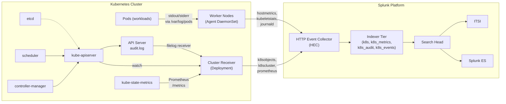

# Kubernetes Integration Guide

> The definitive guide to monitoring Kubernetes with Splunk. 46 use cases
> spanning workload health, RBAC and admission, capacity, autoscaling,
> networking, supply chain, and the API server control plane — across vanilla
> upstream, EKS, AKS, GKE, OpenShift, Rancher, and K3s — using the Splunk
> OpenTelemetry Collector for Kubernetes as the primary collection plane.

---

## Table of Contents

- [Quick Start](#quick-start)
- [Overview and What Good Looks Like](#overview)
- [Architecture and Data Flow](#architecture)
- [Prerequisites](#prerequisites)
- [Data Sources Reference](#data-sources)
- [Field Dictionary](#field-dictionary)
- [Sample Events](#sample-events)
- [OpenTelemetry Collector Deployment (Helm)](#otel-deploy)
- [API Server Audit Logging](#audit)
- [Kube-State-Metrics and Prometheus Scrape](#ksm)
- [Container Logs (stdout/stderr)](#container-logs)
- [Cluster-Level Events](#cluster-events)
- [OpenShift / EKS / AKS / GKE Specifics](#cloud-managed)
- [Cross-Product Correlation](#cross-product-correlation)
- [CIM Mapping Reference](#cim-mapping)
- [Compliance Mapping](#compliance-mapping)
- [Capacity Planning and Sizing](#sizing)
- [Recommended Dashboard Layouts](#dashboards)
- [ITSI Service Modeling](#itsi)
- [SOAR Playbook Examples](#soar)
- [Multi-Cluster and Multi-Tenancy](#multi-cluster)
- [Security Hardening](#security-hardening)
- [Crawl / Walk / Run Roadmap](#roadmap)
- [Validation Checklist](#validation-checklist)
- [Known Limitations and Gaps](#known-limitations)
- [Troubleshooting](#troubleshooting)
- [FAQ](#faq)
- [Glossary](#glossary)
- [Migration from Splunk Connect for Kubernetes (SCK)](#migration)
- [References](#references)
- [Contribution and Feedback](#contribution)

---

<a id="quick-start"></a>
## Quick Start — 30 Minutes to First Data

For platform engineers who want logs, metrics, and traces flowing immediately:

1. **Create the indexes** in Splunk:

    ```ini
    # indexes.conf
    [k8s]               # container logs + objects
    [k8s_metrics]       # metrics (event index, NOT metric store)
    [k8s_audit]         # API server audit
    [k8s_events]        # cluster events (optional split)
    ```

2. **Create a Splunk HEC token** named `k8s-otel-collector`. Permitted indexes: `k8s`, `k8s_metrics`, `k8s_audit`, `k8s_events`.

3. **Install the helm chart** ([splunk-otel-collector](https://github.com/signalfx/splunk-otel-collector-chart)) on a single cluster:

    ```bash
    helm repo add splunk-otel-collector-chart \
      https://signalfx.github.io/splunk-otel-collector-chart
    helm repo update

    helm install splunk-otel \
      --set="splunkPlatform.endpoint=https://splunk-hec.example.com:8088/services/collector" \
      --set="splunkPlatform.token=$HEC_TOKEN" \
      --set="splunkPlatform.index=k8s" \
      --set="splunkPlatform.metricsIndex=k8s_metrics" \
      --set="splunkPlatform.logsEnabled=true" \
      --set="splunkPlatform.metricsEnabled=true" \
      --set="clusterName=prod-eks-eu-west-1" \
      --set="cloudProvider=aws" \
      --set="distribution=eks" \
      splunk-otel-collector-chart/splunk-otel-collector
    ```

4. **Enable kube-state-metrics** (the chart bundles the upstream KSM by default; verify):

    ```bash
    kubectl get pods -n default -l app.kubernetes.io/name=kube-state-metrics
    ```

5. **Verify in Splunk** within ~5 minutes:

    ```spl
    | mstats count WHERE index=k8s_metrics span=1m
    index=k8s sourcetype=kube:container:logs | stats count by k8s.namespace.name
    ```

    Both queries should return data. If not, jump to [Troubleshooting](#troubleshooting).

6. **Deploy core UCs** — Start with the [Crawl tier roadmap](#roadmap): CrashLoopBackOff (UC-3.2.10), pod restart rate, kube-apiserver health.

---

<a id="overview"></a>
## Overview and What Good Looks Like

### What the Splunk OpenTelemetry Collector for Kubernetes collects

The chart deploys two OTel collector workloads:

- **DaemonSet (per-node Agent)** — collects:
  - Container logs (`kube:container:logs`) via the OTel `filelog` receiver tailing `/var/log/pods/`
  - Host metrics via the `hostmetrics` receiver
  - Kubelet stats via the `kubeletstats` receiver
  - Optional journald logs from the underlying node OS
  - Forwards traces from in-cluster apps (OTLP)

- **Cluster Receiver Deployment (singleton)** — collects:
  - Cluster events (`kube:events`) via the `k8sobjects` receiver
  - Kubernetes object inventory (`kube:objects:metrics`) via the `k8scluster` receiver
  - Prometheus scrapes of `kube-state-metrics`, `kube-apiserver`, `kubelet`, `node-exporter` via the `prometheus` receiver

- **Optional: `clusterReceiver` + `prometheusReceiver` for control-plane metrics** when you have access to the kube-apiserver `/metrics` endpoint (managed clusters: cloud provider often blocks this; use cloud-native equivalents instead).

### Why integrate with Splunk?

| Capability | Native K8s tools | Splunk + OTel Collector |
|------------|------------------|--------------------------|
| Live `kubectl describe pod` | Yes | Splunk (events + logs + audit correlated, retained) |
| Real-time log streaming | `kubectl logs -f` | Splunk (search across cluster, retained) |
| Audit trail | API server audit log on disk | Splunk (searchable, retention enforced) |
| Performance trending | Prometheus + Grafana (15d typical) | Splunk: months/years |
| Cross-cluster aggregation | Federation/Thanos/Mimir | Native via `cluster` field |
| RBAC anomaly detection | None native | UC-3.2.12, UC-3.2.23 |
| Workload placement intelligence | Manual investigation | UC-3.2.10, UC-3.2.32 (capacity), .47 (priority) |
| Compliance evidence | Manual export | Auditor-ready saved searches |
| SOAR auto-remediation | None native | Splunk SOAR + K8s API |

### Who should read this guide?

| Role | Relevant sections |
|------|-------------------|
| **Platform / SRE** | Quick Start, Architecture, OTel Deploy, Sizing |
| **Security operations** | Audit, RBAC UCs, Compliance Mapping |
| **Cluster admin** | Multi-Cluster, Hardening, Roadmap |
| **Application developer** | Container logs, FAQ |
| **Compliance / audit** | Compliance Mapping, Validation Checklist |
| **Splunk architecture** | OTel Deploy, Migration from SCK |

### What good looks like

| Dimension | Before integration | After full deployment |
|-----------|-------------------|-----------------------|
| **CrashLoopBackOff detection** | Engineer notices in `kubectl get pods` | Splunk alert with logs + events + restart history (UC-3.2.10) |
| **Pod log access** | `kubectl logs` per pod | Splunk: cross-cluster, searchable, retained |
| **API server audit** | On-disk per cluster, no central view | Splunk: forensic-grade, queryable per user/verb/resource |
| **RBAC drift** | Periodic manual review | Continuous detection (UC-3.2.12, .23) |
| **Capacity planning** | Grafana with 15-day data | Splunk: 1y+ trending with `predict` (UC-3.2.32) |
| **Service degradation** | Probe failures buried in `kubectl describe` | Splunk: ITSI service tree with KPIs |

---

<a id="architecture"></a>
## Architecture and Data Flow



**Key collection paths:**

1. **DaemonSet Agent (one per node)** — each node runs an OTel collector that:
   - Tails `/var/log/pods/<namespace>_<pod>_<uid>/<container>/*.log` for container logs
   - Reads `/proc` and `/sys` for node host metrics
   - Calls the local kubelet for pod-level CPU/mem
   - Optionally tails `journald` for node OS events

2. **Cluster Receiver (singleton Deployment)** — runs:
   - The `k8sobjects` receiver: watches the API server for cluster events
   - The `k8scluster` receiver: produces inventory metrics
   - The `prometheus` receiver: scrapes kube-state-metrics + (where allowed) kube-apiserver, kubelet, node-exporter `/metrics` endpoints

3. **API Server Audit (out-of-band)** — for managed clusters:
   - **EKS**: CloudWatch Logs → AWS Add-on → `index=k8s_audit`
   - **AKS**: Azure Monitor → MS Cloud Services Add-on → `index=k8s_audit`
   - **GKE**: Cloud Logging → Splunk Add-on for Google Cloud → `index=k8s_audit`
   - **Self-managed**: filelog receiver tails `/var/log/kubernetes/audit.log` on the control plane node

This last step is critical — without API server audit you cannot satisfy UC-3.2.12 (RBAC anomaly), UC-3.2.23 (cluster-admin escalation), or many compliance UCs.

---

<a id="prerequisites"></a>
## Prerequisites

### Kubernetes requirements

| Requirement | Detail |
|-------------|--------|
| **Kubernetes version** | 1.28+ recommended; 1.31 is the latest. K8s 1.27 and earlier work but lack some metric labels. |
| **Container runtime** | containerd (preferred), CRI-O, Docker (legacy — only K8s 1.23 and earlier) |
| **kube-state-metrics** | v2.10+ deployed via the Splunk OTel chart or your own. Required for nearly every metrics UC. |
| **API server audit** | Audit policy + audit log writing to disk OR streaming to cloud provider (EKS/AKS/GKE). |
| **RBAC** | Service account with cluster-wide read on `pods`, `nodes`, `services`, `endpoints`, `events`, `configmaps`, `namespaces` (chart-bundled by default) |
| **Network access** | Pods must reach Splunk HEC. Outbound HTTPS to your HEC URL/port. |
| **Time sync** | Nodes synced to NTP. Skew breaks event ordering. |

### Splunk requirements

| Requirement | Detail |
|-------------|--------|
| **Splunk version** | Splunk Enterprise 9.0+ or Splunk Cloud (Victoria or Classic) |
| **HEC enabled** | Settings → Data Inputs → HTTP Event Collector. Token created with permission for the K8s indexes. |
| **HEC endpoint sizing** | Behind a load balancer for production; 1+ HEC receiver per ~5,000 EPS |
| **Indexes** | `k8s`, `k8s_metrics`, `k8s_audit`, optionally `k8s_events` |
| **Roles** | `k8s_observer` for ops; `k8s_admin` for full access; `k8s_security` for audit-only |

### Network requirements

| From | To | Port | Protocol | Purpose |
|------|----|------|----------|---------|
| OTel Collector pods | Splunk HEC | 8088 | HTTPS | Log/metric ingest |
| Cluster Receiver | kube-apiserver | 443 | HTTPS | k8sobjects watch |
| Cluster Receiver | KSM service | 8080 | HTTP | Prometheus scrape |
| Cluster Receiver | kubelet | 10250 | HTTPS | kubeletstats (alternative path) |
| Splunk HEC | (none — HEC is inbound) | – | – | – |

---

<a id="data-sources"></a>
## Data Sources Reference

### Container logs (`kube:container:logs`)

| Sourcetype | Source | Default cadence | Key Fields | Used by |
|------------|--------|-----------------|-----------|---------|
| `kube:container:logs` | DaemonSet `filelog` receiver tailing `/var/log/pods/` | Continuous | `k8s.namespace.name`, `k8s.pod.name`, `k8s.container.name`, `k8s.node.name`, `k8s.pod.uid`, `k8s.cluster.name`, `_raw` (line) | Most app-troubleshooting UCs; `kubernetes:container:logs` is an OTel alias |

### API server audit (`kube:apiserver:audit`)

| Sourcetype | Source | Cadence | Key Fields | Used by |
|------------|--------|---------|-----------|---------|
| `kube:apiserver:audit` | Audit policy on disk OR CloudWatch (EKS) / Azure Monitor (AKS) / Cloud Logging (GKE) | Stream | `verb`, `objectRef.resource`, `objectRef.namespace`, `objectRef.name`, `user.username`, `user.groups`, `requestObject.*`, `responseStatus.code`, `sourceIPs`, `userAgent`, `auditID`, `stage` (`RequestReceived`, `ResponseStarted`, `ResponseComplete`, `Panic`) | UC-3.2.12 (RBAC anomaly), UC-3.2.23 (cluster-admin escalation), most compliance UCs |

### Cluster events (`kube:events`)

| Sourcetype | Source | Key Fields | Used by |
|------------|--------|-----------|---------|
| `kube:events` | `k8sobjects` receiver watching `events.k8s.io` | `reason`, `type` (`Normal`/`Warning`), `involvedObject.kind`, `involvedObject.name`, `involvedObject.namespace`, `message`, `count`, `firstTimestamp`, `lastTimestamp` | UC-3.2.10 (CrashLoopBackOff via reason `BackOff`/`Failed`), UC-3.2.41 (NoReadyEndpoints) |

### Kubernetes objects (`kube:objects:metrics`)

| Sourcetype | Source | Key Fields | Used by |
|------------|--------|-----------|---------|
| `kube:objects:metrics` | `k8scluster` receiver | `k8s.cluster.name`, object kind, status conditions | Inventory UCs |

### Prometheus scrape (`prometheus:scrape:metrics`)

| Sourcetype | Source | Cadence | Notable Series | Used by |
|------------|--------|---------|----------------|---------|
| `prometheus:scrape:metrics` | OTel `prometheus` receiver scraping kube-state-metrics, kubelet, node-exporter, kube-apiserver | 30s default | `kube_pod_container_status_*`, `kube_pod_container_resource_requests/limits`, `kube_node_status_*`, `kube_resourcequota`, `kube_horizontalpodautoscaler_*`, `kube_verticalpodautoscaler_*`, `kube_networkpolicy_*`, `kube_endpoint_*`, `apiserver_request_total`, `apiserver_admission_*` | Almost all metrics UCs |

### Node host metrics

| Sourcetype | Source | Notes |
|------------|--------|-------|
| `prometheus:scrape:metrics` (with `host.name` resource attribute) | `hostmetrics` receiver in DaemonSet | CPU, memory, disk, network at the node OS level |
| `splunk:otel:journald` | journald input on node | When enabled — kernel/systemd events |

---

<a id="field-dictionary"></a>
## Field Dictionary

### Common resource attributes (all sourcetypes)

The OTel collector enriches every event with Kubernetes resource attributes:

| Field | Type | Example | Description |
|-------|------|---------|-------------|
| `k8s.cluster.name` | string | `prod-eks-eu-west-1` | Set via chart `clusterName` |
| `k8s.namespace.name` | string | `payments-prod` | Pod namespace |
| `k8s.pod.name` | string | `web-7c4d9f5b8b-xkj2p` | Pod name |
| `k8s.pod.uid` | string | UID | Stable pod identifier |
| `k8s.container.name` | string | `web` | Container within pod |
| `k8s.deployment.name` | string | `web` | Owner Deployment (if any) |
| `k8s.statefulset.name` | string | `database` | Owner StatefulSet |
| `k8s.daemonset.name` | string | `splunk-otel-collector-agent` | Owner DaemonSet |
| `k8s.node.name` | string | `ip-10-0-1-23.eu-west-1.compute.internal` | Node hostname |
| `cloud.provider` | string | `aws`, `azure`, `gcp` | Set via chart |
| `cloud.region` | string | `eu-west-1` | If discoverable |
| `cloud.account.id` | string | `123456789012` | If discoverable |

### `kube:apiserver:audit`

| Field | Type | Example | Description | Used by |
|-------|------|---------|-------------|---------|
| `verb` | string | `create`, `update`, `patch`, `delete`, `get`, `list`, `watch` | API verb | UC-3.2.12, .23 |
| `objectRef.resource` | string | `pods`, `clusterrolebindings`, `secrets` | Resource type | UC-3.2.12, .23 |
| `objectRef.namespace` | string | `kube-system` | Resource namespace (cluster-scoped = empty) | UC-3.2.12, .23 |
| `objectRef.name` | string | `cluster-admin` | Resource name | UC-3.2.23 |
| `user.username` | string | `system:serviceaccount:default:my-sa`, `kube-admin@example.com` | Acting principal | UC-3.2.12, .23 |
| `user.groups` | mvfield | `system:authenticated`, `system:masters`, `kube-admin` | Subject groups (`system:masters` bypasses RBAC checks) | UC-3.2.23 |
| `responseStatus.code` | int | `200`, `201`, `403` | HTTP status | UC-3.2.12 |
| `sourceIPs{}` | mvfield | `10.0.1.23` | Client IPs | UC-3.2.23 |
| `userAgent` | string | `kubectl/v1.31.0 (linux/amd64)` | Client user-agent | Anomaly detection |
| `requestObject.subjects{}` | mvfield | `{kind: User, name: bob@example.com}` | Subjects in role bindings | UC-3.2.23 |
| `requestObject.roleRef.name` | string | `cluster-admin` | Bound role | UC-3.2.23 |
| `auditID` | string | UID | Stable per-request ID | Forensics |
| `stage` | string | `ResponseComplete` | `RequestReceived`, `ResponseStarted`, `ResponseComplete`, `Panic` | Performance |

### `kube:events`

| Field | Type | Example | Description |
|-------|------|---------|-------------|
| `reason` | string | `BackOff`, `Failed`, `FailedScheduling`, `Pulled`, `Killing`, `Started`, `FailedToUpdateEndpoint` | Event reason — primary trigger field |
| `type` | string | `Normal`, `Warning` | Severity |
| `involvedObject.kind` | string | `Pod`, `Deployment`, `Node`, `Endpoint` | Object type |
| `involvedObject.name` | string | `web-7c4d9f5b8b-xkj2p` | Object name |
| `involvedObject.namespace` | string | `payments-prod` | Object namespace |
| `message` | string | "Back-off restarting failed container" | Human-readable |
| `count` | int | `3` | Repeat count |
| `firstTimestamp` / `lastTimestamp` | string | ISO 8601 | First/last occurrence |

### `prometheus:scrape:metrics` (notable series)

| Series | Labels | Description | Used by |
|--------|--------|-------------|---------|
| `kube_pod_container_status_waiting_reason` | `pod`, `namespace`, `container`, `reason` | `reason="CrashLoopBackOff"` for UC-3.2.10 | UC-3.2.10 |
| `kube_pod_container_status_restarts_total` | `pod`, `namespace`, `container` | Lifetime restart counter | UC-3.2.1, .10 |
| `kube_pod_container_status_last_terminated_reason` | `pod`, `namespace`, `container`, `reason` | Last termination cause | UC-3.2.10 |
| `kube_pod_container_status_last_terminated_exitcode` | `pod`, `namespace`, `container`, `exit_code` | OOM = 137, segfault = 139 | UC-3.2.10 |
| `kube_pod_container_resource_requests` | `pod`, `namespace`, `container`, `resource` | Requested CPU/memory | UC-3.2.32, .38 |
| `kube_pod_container_resource_limits` | `pod`, `namespace`, `container`, `resource` | Limited CPU/memory | UC-3.2.32, .38 |
| `kube_node_status_condition` | `node`, `condition`, `status` | Node Ready, MemoryPressure, etc. | Capacity UCs |
| `kube_resourcequota` | `namespace`, `resource`, `type` (hard/used) | Namespace quota | UC-3.2.32 |
| `kube_horizontalpodautoscaler_*` | `namespace`, `horizontalpodautoscaler` | HPA state | UC-3.2.38 |
| `kube_verticalpodautoscaler_status_recommendation_containerrecommendations_target` | `namespace`, `target_kind`, `target_name`, `container` | VPA recommendation | UC-3.2.38 |
| `kube_endpoint_address_available` / `_not_ready` | `namespace`, `endpoint` | Service endpoint health | UC-3.2.41 |
| `apiserver_request_total` | `verb`, `code`, `resource` | API server request counts | UC-3.2.7, .19 |
| `apiserver_admission_webhook_request_total` | `name`, `operation`, `type`, `code` | Admission webhook calls | UC-3.2.40 |

---

<a id="sample-events"></a>
## Sample Events

### `kube:container:logs` (single line from a pod)

```
{"k8s.cluster.name":"prod-eks-eu-west-1","k8s.namespace.name":"payments-prod","k8s.pod.name":"web-7c4d9f5b8b-xkj2p","k8s.container.name":"web","k8s.node.name":"ip-10-0-1-23","_raw":"2026-04-25T14:30:00.123Z INFO main Starting payment service version 1.4.2"}
```

### `kube:apiserver:audit` (RoleBinding create — UC-3.2.23 trigger)

```json
{
  "kind": "Event",
  "apiVersion": "audit.k8s.io/v1",
  "level": "RequestResponse",
  "auditID": "f1e2d3c4-b5a6-7890-abcd-ef1234567890",
  "stage": "ResponseComplete",
  "verb": "create",
  "user": {
    "username": "kube-admin@example.com",
    "groups": ["system:authenticated", "kube-admin"]
  },
  "sourceIPs": ["10.0.1.23"],
  "userAgent": "kubectl/v1.31.0 (linux/amd64)",
  "objectRef": {
    "resource": "clusterrolebindings",
    "apiGroup": "rbac.authorization.k8s.io",
    "name": "developers-as-cluster-admin"
  },
  "responseStatus": {"code": 201},
  "requestObject": {
    "roleRef": {"kind": "ClusterRole", "name": "cluster-admin", "apiGroup": "rbac.authorization.k8s.io"},
    "subjects": [{"kind": "Group", "name": "developers", "apiGroup": "rbac.authorization.k8s.io"}]
  },
  "requestReceivedTimestamp": "2026-04-25T14:30:00.123Z",
  "stageTimestamp": "2026-04-25T14:30:00.456Z"
}
```

UC-3.2.23 fires on `verb=create` + `objectRef.resource=clusterrolebindings` + `requestObject.roleRef.name=cluster-admin`.

### `kube:events` (CrashLoopBackOff)

```json
{
  "reason": "BackOff",
  "type": "Warning",
  "involvedObject": {"kind": "Pod", "name": "checkout-7d4f5b9-x2k8h", "namespace": "payments-prod", "uid": "..."},
  "message": "Back-off restarting failed container checkout in pod checkout-7d4f5b9-x2k8h_payments-prod",
  "count": 12,
  "firstTimestamp": "2026-04-25T14:00:00Z",
  "lastTimestamp": "2026-04-25T14:30:00Z"
}
```

### `prometheus:scrape:metrics` (CrashLoopBackOff metric)

```
kube_pod_container_status_waiting_reason{pod="checkout-7d4f5b9-x2k8h",namespace="payments-prod",container="checkout",reason="CrashLoopBackOff"} 1
```

UC-3.2.10 alerts on this gauge being 1, then enriches with the corresponding `kube_pod_container_status_last_terminated_exitcode` to identify OOM (137) vs application crash (139, 1, etc).

---

<a id="otel-deploy"></a>
## OpenTelemetry Collector Deployment (Helm)

### Chart values for production

`values.yaml`:

```yaml
clusterName: prod-eks-eu-west-1
cloudProvider: aws
distribution: eks

splunkPlatform:
  endpoint: https://splunk-hec.example.com:8088/services/collector
  token: ${HEC_TOKEN}
  index: k8s
  metricsIndex: k8s_metrics
  logsEnabled: true
  metricsEnabled: true
  tracesEnabled: false  # set to true for OTLP traces from in-cluster apps

agent:
  enabled: true
  resources:
    limits: {cpu: 200m, memory: 500Mi}
    requests: {cpu: 100m, memory: 200Mi}

clusterReceiver:
  enabled: true
  k8sObjects:
    - name: events
      mode: watch
      group: events.k8s.io
    - name: pods
      mode: pull
      interval: 60s

logsCollection:
  containers:
    enabled: true
    excludeAgentLogs: true
    excludePaths:
      - /var/log/pods/kube-system_*/_*.log  # optional: drop kube-system noise

extraSecrets:
  hec-token:
    spec:
      data:
        token: ${HEC_TOKEN}
```

### Apply

```bash
helm upgrade --install splunk-otel \
  -f values.yaml \
  splunk-otel-collector-chart/splunk-otel-collector
```

### Verify

```bash
kubectl get pods -l app=splunk-otel-collector

kubectl logs -l app=splunk-otel-collector,component=agent --tail 50

kubectl logs -l app=splunk-otel-collector,component=cluster-receiver --tail 50
```

In Splunk:

```spl
| mstats count WHERE index=k8s_metrics span=1m

index=k8s sourcetype=kube:container:logs k8s.cluster.name=prod-eks-eu-west-1
| stats count by k8s.namespace.name | head 10

index=k8s sourcetype=kube:events k8s.cluster.name=prod-eks-eu-west-1
| stats count by reason
```

### Common chart customisations

**Drop verbose namespaces from logs:**

```yaml
logsCollection:
  containers:
    excludePaths:
      - /var/log/pods/kube-system_*/*/*.log
      - /var/log/pods/observability_*/*/*.log
```

**Reduce metric cardinality (drop low-value series):**

```yaml
agent:
  config:
    processors:
      filter/drop_metrics:
        metrics:
          metric:
            - 'name == "container_blkio_*"'
```

**Add custom resource attributes:**

```yaml
agent:
  config:
    processors:
      resource/attributes:
        attributes:
          - key: env
            value: production
            action: insert
          - key: line_of_business
            value: payments
            action: insert
```

---

<a id="audit"></a>
## API Server Audit Logging

### Audit policy

A minimal but useful audit policy (`/etc/kubernetes/audit-policy.yaml`):

```yaml
apiVersion: audit.k8s.io/v1
kind: Policy
omitStages:
  - RequestReceived
rules:
  - level: None
    users: ["system:kube-proxy"]
    verbs: ["watch"]
    resources: [{group: "", resources: ["endpoints", "services"]}]
  - level: None
    userGroups: ["system:nodes"]
    verbs: ["get"]
    resources: [{group: "", resources: ["nodes"]}]
  - level: RequestResponse
    resources:
      - group: rbac.authorization.k8s.io
        resources: ["clusterrolebindings", "rolebindings", "clusterroles", "roles"]
      - group: ""
        resources: ["secrets", "serviceaccounts", "configmaps"]
      - group: certificates.k8s.io
        resources: ["certificatesigningrequests"]
  - level: Metadata
    resources:
      - group: ""
        resources: ["pods", "namespaces", "nodes"]
  - level: Metadata
    omitStages: ["RequestReceived"]
```

Apply on the kube-apiserver:

```yaml
# kube-apiserver flags
- --audit-policy-file=/etc/kubernetes/audit-policy.yaml
- --audit-log-path=/var/log/kubernetes/audit.log
- --audit-log-maxage=30
- --audit-log-maxbackup=10
- --audit-log-maxsize=100
- --audit-log-format=json
```

### Forwarding to Splunk

**Self-managed**: use the Splunk OTel `filelog` receiver running on the control plane node:

```yaml
receivers:
  filelog/audit:
    include: [/var/log/kubernetes/audit.log]
    operators:
      - type: json_parser
        timestamp:
          parse_from: attributes.requestReceivedTimestamp
          layout: '%Y-%m-%dT%H:%M:%S.%sZ'
exporters:
  splunk_hec/audit:
    token: ${HEC_TOKEN}
    endpoint: https://splunk-hec.example.com:8088/services/collector
    index: k8s_audit
    sourcetype: kube:apiserver:audit
service:
  pipelines:
    logs/audit:
      receivers: [filelog/audit]
      exporters: [splunk_hec/audit]
```

**EKS**: enable Control Plane Logging → audit; CloudWatch log group `/aws/eks/<cluster>/cluster`. Splunk Add-on for AWS subscribes to that log group → routes to `index=k8s_audit` with `sourcetype=kube:apiserver:audit`.

**AKS**: Diagnostic Settings → kube-audit category → Event Hub. Splunk Add-on for Microsoft Cloud Services consumes the Event Hub.

**GKE**: Cloud Logging → audit logs. Splunk Add-on for Google Cloud Platform pulls them via Pub/Sub.

### Validation

```spl
index=k8s_audit sourcetype=kube:apiserver:audit
| stats count by verb
```

Expect `get`, `list`, `watch`, `create`, `update`, `patch`, `delete`. If only `get`/`list`/`watch`, your audit policy is too restrictive — UC-3.2.23 won't work.

---

<a id="ksm"></a>
## Kube-State-Metrics and Prometheus Scrape

`kube-state-metrics` (KSM) exposes Kubernetes object state as Prometheus metrics. The Splunk OTel chart ships KSM by default — verify with:

```bash
kubectl get pods -A -l app.kubernetes.io/name=kube-state-metrics
```

### When to override

If you already run KSM (e.g. via `kube-prometheus-stack`), set:

```yaml
clusterReceiver:
  k8sObjects: [...]
  prometheusReceiver:
    config:
      scrape_configs:
        - job_name: kube-state-metrics
          kubernetes_sd_configs:
            - role: endpoints
              namespaces:
                names: [monitoring]
          relabel_configs:
            - source_labels: [__meta_kubernetes_service_label_app]
              regex: kube-state-metrics
              action: keep
```

### Validating KSM coverage

```spl
| mstats count WHERE index=k8s_metrics metric_name=kube_pod_container_status_*
```

If empty, KSM isn't being scraped. Common causes:
- KSM service not in the chart's discovery scope
- Network policy blocking the cluster receiver from KSM
- KSM RBAC insufficient (needs full cluster read on most resources)

### Recommended additional scrapes

| Target | Endpoint | Why |
|--------|----------|-----|
| **node-exporter** | DaemonSet on each node, `:9100/metrics` | Host CPU/memory/disk/network at OS level |
| **kubelet** | `:10250/metrics` (mTLS) | Per-node container resource usage |
| **kube-apiserver** | (control plane) | Request rates, latency (UC-3.2.7, .19, .40) |
| **etcd** | (control plane, mTLS) | Cluster store health |

EKS/AKS/GKE block direct access to kube-apiserver and etcd `/metrics` — use cloud-native equivalents (CloudWatch metrics, Azure Monitor, Cloud Monitoring).

---

<a id="container-logs"></a>
## Container Logs (stdout/stderr)

Container logs come from `/var/log/pods/<namespace>_<pod>_<uid>/<container>/0.log` (containerd) or `/var/log/containers/*.log` (symlink farm).

### What the OTel filelog receiver does

- Tails the directory recursively
- Multi-line stitching per container (configurable; default works for most app stacks)
- Adds Kubernetes metadata via the `k8sattributes` processor
- Ships to HEC with `sourcetype=kube:container:logs`

### Excluding noise

Common high-volume, low-value logs to drop at the agent:

```yaml
logsCollection:
  containers:
    excludePaths:
      - /var/log/pods/kube-system_kube-proxy-*/*/*.log
      - /var/log/pods/kube-system_aws-node-*/*/*.log
      - /var/log/pods/observability_*/*/*.log
```

For full lossy filtering at index time, use `transforms.conf` SED rules — but you'll lose evidence; prefer agent-side filtering.

### Pulling structured fields from log lines

For JSON-logging apps, the OTel collector auto-parses if you configure:

```yaml
agent:
  config:
    processors:
      transform/json:
        log_statements:
          - context: log
            statements:
              - set(body, parse_json(body)) where IsString(body)
```

After this, every JSON field becomes a top-level field in Splunk.

---

<a id="cluster-events"></a>
## Cluster-Level Events

The `k8sobjects` receiver in the cluster receiver watches `events.k8s.io`:

```yaml
clusterReceiver:
  k8sObjects:
    - name: events
      mode: watch
      group: events.k8s.io
```

Events are short-lived (default 1h TTL on the API server) — Splunk gives you forensic retention.

### Useful event reasons

| Reason | Significance | Used by |
|--------|--------------|---------|
| `BackOff`, `Failed`, `Killing` | Container lifecycle issues | UC-3.2.10 |
| `FailedScheduling` | No node has capacity for the pod | Capacity UCs |
| `FailedMount` | Volume mount failure | Storage UCs |
| `NodeNotReady`, `NodeReady` | Node state transitions | Node UCs |
| `Evicted` | Pod evicted (OOM, node pressure, manual) | Capacity UCs |
| `EvictedByVPA` | VPA forcibly evicted pod | UC-3.2.38 |
| `FailedToUpdateEndpoint`, `FailedToUpdateEndpointSlices` | Service plumbing | UC-3.2.41 |

### Search patterns

```spl
index=k8s sourcetype=kube:events type=Warning
| stats count by reason, involvedObject.kind, involvedObject.namespace
| sort -count
```

---

<a id="cloud-managed"></a>
## OpenShift / EKS / AKS / GKE Specifics

### EKS

| Topic | Detail |
|-------|--------|
| Audit | Enable Control Plane Logging → audit. CloudWatch log group `/aws/eks/<cluster>/cluster`. Use Splunk Add-on for AWS to subscribe. |
| Metrics | EKS-specific metrics via CloudWatch + Splunk Add-on for AWS |
| IAM auth | Map IAM roles to K8s RBAC via `aws-auth` configmap; audit shows `arn:aws:iam::...:role/...` as `user.username` |
| chart `distribution` | `eks` |
| Operator-managed control plane | No direct kube-apiserver `/metrics` access; use AWS-side metrics |

### AKS

| Topic | Detail |
|-------|--------|
| Audit | Diagnostic Settings → kube-audit / kube-audit-admin category → Event Hub or Storage. Splunk Add-on for MS Cloud Services. |
| Metrics | Azure Monitor + Container Insights; or scrape via OTel |
| AAD integration | Audit shows AAD UPNs in `user.username` |
| chart `distribution` | `aks` |

### GKE

| Topic | Detail |
|-------|--------|
| Audit | Cloud Logging audit logs. Splunk Add-on for Google Cloud Platform → Pub/Sub → HEC |
| Metrics | Cloud Monitoring (Stackdriver) + Splunk Add-on for GCP, or scrape via OTel |
| Workload Identity | Service accounts mapped to GCP IAM |
| chart `distribution` | `gke` (or `gke/autopilot`) |

### OpenShift

| Topic | Detail |
|-------|--------|
| Audit | OpenShift OAuth audit + kube-apiserver audit. Both need separate filelog inputs |
| Metrics | Cluster Monitoring stack (Prometheus). Federate or scrape directly |
| RBAC | `oc` adds OpenShift-specific roles (e.g. `cluster-reader`) |
| chart `distribution` | `openshift` |
| Routes | Use OpenShift Routes (not Ingress) for external HEC if HEC is in-cluster |

### Other distributions

| Distribution | chart `distribution` |
|--------------|---------------------|
| K3s / Rancher | `k3s` |
| RKE2 | `rke2` |
| Tanzu Kubernetes Grid | `tkg` |
| Vanilla / kubeadm | (omit) |

---

<a id="cross-product-correlation"></a>
## Cross-Product Correlation

### K8s + Linux node

```spl
(index=k8s sourcetype=kube:events involvedObject.kind=Node reason="NodeNotReady")
OR (index=os sourcetype=linux_messages)
| transaction host=k8s.node.name maxspan=10m
```

### K8s + Cloud provider (AWS example)

```spl
(index=k8s sourcetype=kube:events reason="FailedScheduling")
OR (index=aws sourcetype=aws:cloudwatchlogs:asg "CapacityNotAvailable")
| transaction _time maxspan=15m
```

### K8s + Splunk ES (RBA / risk)

UC-3.2.23 (cluster-admin escalation) is a high-risk signal; assign 80+ risk score in Splunk ES so it surfaces in the analyst queue.

### K8s + Splunk APM

If you've enabled `tracesEnabled: true` and your apps emit OTLP, Splunk APM correlates traces with the same `k8s.cluster.name`/`k8s.pod.name` resource attributes.

### K8s + Falco runtime security

```spl
(index=k8s sourcetype=kube:apiserver:audit)
OR (index=falco sourcetype=falco:json)
| transaction k8s.pod.name maxspan=5m
```

---

<a id="cim-mapping"></a>
## CIM Mapping Reference

| CIM Data Model | Mapped sourcetypes / UCs | Validation SPL |
|----------------|--------------------------|----------------|
| **Authentication** | `kube:apiserver:audit` (verbs against `serviceaccounts`, login-like events) | `\| tstats count from datamodel=Authentication` |
| **Change** | `kube:apiserver:audit` (create/update/patch/delete) | `\| tstats count from datamodel=Change` |
| **Endpoint** | `kube:container:logs`, `kube:events` (process-equivalent) | `\| tstats count from datamodel=Endpoint` |
| **Performance** | `prometheus:scrape:metrics` (kube_pod_container_resource_*) | `\| tstats count from datamodel=Performance` |
| **Network_Sessions** | `prometheus:scrape:metrics` (kube_endpoint_*) | `\| tstats count from datamodel=Network_Sessions` |

The chart ships eventtypes/tags for the audit and events sourcetypes; metrics often need custom CIM mappings via `props.conf` field aliases.

---

<a id="compliance-mapping"></a>
## Compliance Mapping

### NIST 800-53 Rev. 5

| UC | Control | Description |
|----|---------|-------------|
| UC-3.2.23 | AC-2(7), AC-6 | Privileged accounts |
| UC-3.2.12 | AC-3, AU-2 | Access enforcement, audit |
| UC-3.2.40 | SI-7 | Software integrity (admission) |
| UC-3.2.10 | SI-4 | System monitoring |
| UC-3.2.27 | SC-7 | Boundary protection (NetworkPolicy) |

### PCI-DSS v4.0

| UC | Requirement | Description |
|----|------------|-------------|
| UC-3.2.23 | 7.x, 8.x | Restrict access |
| UC-3.2.27 | 1.x | Network segmentation |
| UC-3.2.* | 10.x | Audit logging |

### CIS Kubernetes Benchmark

| UC | CIS Section |
|----|-------------|
| UC-3.2.23 | 5.1 RBAC |
| UC-3.2.27 | 5.3 NetworkPolicy |
| UC-3.2.40 | 1.2 / 5.x Admission |
| UC-3.2.* (audit policy) | 3.2 Logging |

### NIS2 / DORA

UC-3.2.7, .19, .40 (control plane health) map to NIS2 Article 21(2)(a) "policies on risk analysis and information system security" via demonstrated continuous monitoring.

---

<a id="sizing"></a>
## Capacity Planning and Sizing

### Per-cluster ingest estimates

| Component | Volume |
|-----------|--------|
| **Container logs** | ~5–50 MB/pod/day at typical app volumes; up to GB/day for chatty apps |
| **kube:events** | ~10–50 MB/cluster/day |
| **kube:apiserver:audit** | At `RequestResponse` for RBAC + Metadata for the rest: ~100 MB – 5 GB/cluster/day depending on cluster size and verbosity |
| **prometheus:scrape:metrics** (KSM + node-exporter) | ~500 MB – 3 GB/cluster/day for 100 nodes |
| **Total typical 100-node cluster** | ~5–15 GB/day |

### Worked examples

| Cluster | Logs | Audit | Metrics | Total |
|---------|------|-------|---------|-------|
| **Small (10 nodes, 100 pods)** | ~500 MB | ~200 MB | ~300 MB | ~1 GB/day |
| **Medium (100 nodes, 1000 pods)** | ~5 GB | ~1.5 GB | ~2 GB | ~8.5 GB/day |
| **Large (500 nodes, 5000 pods)** | ~25 GB | ~5 GB | ~8 GB | ~38 GB/day |
| **Very large (2000 nodes, 20K pods)** | ~100 GB | ~15 GB | ~25 GB | ~140 GB/day |

### Cost-cutting levers

1. **Drop kube-system + observability namespace logs** at the agent (saves 30–50% in many clusters)
2. **Filter audit at level=Metadata** for non-RBAC resources (saves 60–80% of audit)
3. **Reduce metric cardinality**: drop `container_blkio_*`, `container_fs_*` you don't use
4. **Use Splunk Edge Processor** for on-the-wire filtering before HEC

### Indexer sizing for HEC

| Volume | HEC receivers | Indexers |
|--------|---------------|----------|
| < 10 GB/day | 1 | 1+ |
| 10–100 GB/day | 2–3 (load-balanced) | 2+ |
| 100 GB – 1 TB/day | 4–8 | Per Splunk Validated Architecture |
| > 1 TB/day | Dedicated HEC tier | Per Splunk Validated Architecture |

---

<a id="dashboards"></a>
## Recommended Dashboard Layouts

### Crawl Dashboard — "Cluster Health at a Glance"

```
+----------------------------------+----------------------------------+
| NODES READY / TOTAL              | PODS RUNNING / DESIRED           |
| (kube_node_status_condition)     | (kube_deployment_status_replicas)|
+----------------------------------+----------------------------------+
| TOP CRASHLOOPBACKOFF (UC-3.2.10) | TOP RECENT WARNING EVENTS        |
+----------------------------------+----------------------------------+
| API SERVER REQUEST LATENCY p99   | NAMESPACE QUOTA UTILIZATION      |
| (UC-3.2.19)                      | (UC-3.2.32)                      |
+----------------------------------+----------------------------------+
```

### Walk Dashboard — "Operational Intelligence"

```
+----------------------------------+----------------------------------+
| HPA SCALING HEAT MAP             | ENDPOINT AVAILABILITY (UC-3.2.41)|
+----------------------------------+----------------------------------+
| ADMISSION WEBHOOK LATENCY        | NETWORKPOLICY COVERAGE           |
| (UC-3.2.40)                      | (UC-3.2.27)                      |
+----------------------------------+----------------------------------+
| VPA RECOMMENDATION DRIFT         | RESOURCE REQUEST vs USAGE        |
| (UC-3.2.38)                      | (cost optimisation)              |
+----------------------------------+----------------------------------+
```

### Run Dashboard — "Security & Compliance"

```
+----------------------------------+----------------------------------+
| RBAC CHANGES LAST 30D            | CLUSTER-ADMIN BINDINGS           |
| (UC-3.2.12)                      | (UC-3.2.23)                      |
+----------------------------------+----------------------------------+
| SECRETS GET/LIST BY USER         | EXEC INTO PROD PODS              |
| (least-privilege drift)          | (UC-3.2.x audit)                 |
+----------------------------------+----------------------------------+
| CIS BENCHMARK SCORECARD          | COMPLIANCE EVIDENCE              |
+----------------------------------+----------------------------------+
```

---

<a id="itsi"></a>
## ITSI Service Modeling

### Service hierarchy

```
Kubernetes Platform
├── Cluster: prod-eks-eu-west-1
│   ├── Control Plane (KPIs from apiserver_*)
│   ├── Node Health (kube_node_status_*)
│   ├── Workload Health (CrashLoopBackOff %, restart rate)
│   ├── Service Discovery (kube_endpoint_*)
│   └── Capacity (resource quotas, autoscaler)
├── Cluster: prod-eks-us-east-1
│   └── ...
```

### Recommended KPIs

| KPI | UC | Base search | Threshold |
|-----|----|------------|-----------|
| **Pods in CrashLoopBackOff** | UC-3.2.10 | `\| mstats sum(kube_pod_container_status_waiting_reason) WHERE index=k8s_metrics reason=CrashLoopBackOff` | Static (warn >0, crit >5) |
| **Node Ready %** | – | `\| mstats avg(kube_node_status_condition) WHERE index=k8s_metrics condition=Ready status=true` | Static (crit < 90%) |
| **API Server p99 latency** | UC-3.2.19 | apiserver_request_duration histogram | Adaptive |
| **Quota utilization (max)** | UC-3.2.32 | `kube_resourcequota` ratio | Static (warn 80%, crit 95%) |
| **Endpoint availability** | UC-3.2.41 | `kube_endpoint_address_available` | Static (any not_ready) |

### Entity import

```spl
index=k8s sourcetype=kube:objects:metrics object=node earliest=-1h
| dedup name
| table name, k8s.cluster.name, role, instance_type, region
```

Entity definition: title `name`, identifier `name`, informational `cluster`, `role`.

---

<a id="soar"></a>
## SOAR Playbook Examples

### Playbook 1: CrashLoopBackOff Auto-Triage

**Trigger:** UC-3.2.10 alert.

```
1. RECEIVE alert (cluster, namespace, pod, container, reason, exit_code)
2. PULL last 100 lines of container logs
   SPL: index=k8s sourcetype=kube:container:logs k8s.cluster.name=$cluster k8s.namespace.name=$namespace k8s.pod.name=$pod earliest=-30m
3. PULL recent events for the pod
   SPL: index=k8s sourcetype=kube:events involvedObject.name=$pod earliest=-30m
4. CHECK exit_code:
   ├── 137 → flag as OOM, query memory limits and recommend bump
   ├── 139 → flag as segfault, attach to bug ticket
   ├── 1   → application error, trigger app-team alert
   └── other → page on-call
5. CREATE Slack message to namespace owner channel with summary
6. CREATE ServiceNow ticket if persists > 30min
```

### Playbook 2: Cluster-Admin Binding Detected

**Trigger:** UC-3.2.23 alert.

```
1. RECEIVE alert (cluster, actor, subject, role, change_ticket)
2. CHECK approved_change_ticket against ServiceNow
   ├── Match → close as authorized, log evidence
   └── No match → CONTINUE
3. CHECK actor's recent activity for other anomalies
   SPL: index=k8s_audit user.username=$actor earliest=-24h
        | stats count by verb, objectRef.resource
4. PULL all bindings created in last 7d by same actor
5. NOTIFY security on-call
6. AUTO-REVERT IF approved by SecOps in <15min:
   kubectl delete clusterrolebinding $binding_name
7. CREATE incident with full audit trail
```

### Playbook 3: Capacity Crunch (UC-3.2.32 namespace quota)

**Trigger:** UC-3.2.32 forecast — namespace projected to hit 100% quota in <14d.

```
1. RECEIVE alert (cluster, namespace, resource, days_to_exhaustion)
2. PULL top consumers in namespace
   SPL: kube_pod_container_resource_requests
        \| stats sum(value) by pod, container
        \| sort -sum(value)
3. CROSS-CHECK with VPA recommendations (UC-3.2.38)
4. NOTIFY namespace owner via email + Slack
5. IF days_to_exhaustion < 7:
   CREATE ServiceNow ticket
   ESCALATE to cluster admin
6. SUGGEST quota bump or workload right-sizing in Slack message
```

---

<a id="multi-cluster"></a>
## Multi-Cluster and Multi-Tenancy

### Multiple clusters

Each cluster runs its own helm release of the chart with a unique `clusterName`. The `k8s.cluster.name` resource attribute is automatically present on every event; use it as the primary scoping field.

### Index strategy

**Option A: Shared indexes** — all clusters write to `k8s`, `k8s_metrics`, `k8s_audit`. Use `k8s.cluster.name` for filtering.

**Option B: Per-environment indexes** — `k8s_prod`, `k8s_dev`, `k8s_audit_prod`. Stronger access boundaries.

**Option C: Per-cluster indexes** — `k8s_eks_eu_west_1`. Heaviest isolation; complicates cross-cluster searches.

### Dashboard tokens

```xml
<input type="dropdown" token="cluster">
  <label>Cluster</label>
  <choice value="*">All clusters</choice>
  <fieldForLabel>k8s.cluster.name</fieldForLabel>
  <fieldForValue>k8s.cluster.name</fieldForValue>
  <search>
    <query>| mstats count WHERE index=k8s_metrics by k8s.cluster.name | dedup k8s.cluster.name</query>
  </search>
  <default>*</default>
</input>
```

### Per-tenant access

Use Splunk roles + index scoping. For namespace-level multi-tenancy within a shared cluster, use search-time RBAC via `srchFilter`:

```ini
[role_payments_team]
srchIndexesAllowed = k8s, k8s_metrics
srchFilter = k8s.namespace.name=payments-*
```

---

<a id="security-hardening"></a>
## Security Hardening

### OTel Collector pod

- Run as non-root (chart default)
- Read-only root FS (chart default)
- Use a dedicated ServiceAccount with the chart's bundled RBAC (don't grant cluster-admin)
- Pin chart version + image digest; verify image signatures

### HEC token

- Dedicated token for K8s ingest, restricted to the K8s indexes
- Rotate quarterly
- Store as a Kubernetes Secret (chart supports `extraSecrets`)
- Don't put the token in `values.yaml` checked into git — use ArgoCD/Flux secret integration or sealed-secrets

### Network

- Egress NetworkPolicy: collector pods → HEC endpoint only
- mTLS to HEC if your Splunk supports it
- Audit log path → HEC over TLS

### Audit data sensitivity

Audit logs may contain secret names, configmap names, IP addresses. Apply field-level RBAC for analyst roles. The `requestObject` body for some verbs (e.g. `create secret`) contains the secret payload at `Metadata` level — use audit policy `level: Metadata` (NOT `RequestResponse`) for `secrets` to avoid leaking secret values to Splunk.

```yaml
# In audit policy — be careful!
- level: Metadata        # NOT RequestResponse
  resources: [{group: "", resources: ["secrets"]}]
```

---

<a id="roadmap"></a>
## Crawl / Walk / Run Roadmap

### Crawl (Week 1–2)

| Order | UC | Title |
|-------|----|-------|
| 1 | UC-3.2.10 | CrashLoopBackOff detection |
| 2 | UC-3.2.1 | Pod restart rate |
| 3 | UC-3.2.7 | API server availability |
| 4 | UC-3.2.41 | Endpoint availability |

### Walk (Week 3–6)

1. **Capacity**: namespace quota (UC-3.2.32), HPA / VPA (UC-3.2.38), node pressure
2. **Networking**: NetworkPolicy coverage (UC-3.2.27), service degradation (UC-3.2.41)
3. **Performance**: API server latency (UC-3.2.19), admission webhook latency (UC-3.2.40)

### Run (Month 2+)

1. **Security**: RBAC anomaly (UC-3.2.12), cluster-admin escalation (UC-3.2.23)
2. **ITSI** service tree across clusters
3. **SOAR** playbooks (CrashLoop triage, RBAC auto-revert, capacity escalation)
4. **Cross-product**: K8s + cloud provider + APM
5. **Compliance**: CIS Benchmark scorecard

---

<a id="validation-checklist"></a>
## Validation Checklist

### Day 1

- [ ] Splunk indexes (`k8s`, `k8s_metrics`, `k8s_audit`, optionally `k8s_events`) created
- [ ] HEC token created and tested
- [ ] Helm chart installed; agent + cluster-receiver pods Running
- [ ] `index=k8s | stats count by sourcetype` shows logs, events, objects
- [ ] `| mstats count WHERE index=k8s_metrics | head 1` returns data
- [ ] `index=k8s_audit sourcetype=kube:apiserver:audit | stats count by verb` shows full verb set

### Day 7

- [ ] Crawl-tier UCs deployed
- [ ] Crawl dashboard built and shared
- [ ] First alerts firing (CrashLoopBackOff, restart rate)
- [ ] Per-namespace volume measured
- [ ] Indexer disk growth on track

### Day 30

- [ ] Walk-tier UCs deployed
- [ ] Capacity dashboard reviewed
- [ ] kube-state-metrics scrape complete (all expected series present)
- [ ] Audit policy refined (no missing fields for UC-3.2.12, .23)

### Day 90

- [ ] Run-tier UCs deployed
- [ ] ITSI services modelled
- [ ] At least one SOAR playbook in production
- [ ] Cross-cluster aggregated dashboards working
- [ ] CIS Benchmark scorecard reviewed by security

---

<a id="known-limitations"></a>
## Known Limitations and Gaps

| Limitation | Impact | Workaround |
|------------|--------|------------|
| **Managed K8s blocks kube-apiserver `/metrics`** | UC-3.2.7, .19, .40 partial | Use cloud-native equivalents (CloudWatch, Azure Monitor, Cloud Monitoring) |
| **Audit log can be very high volume** | Index growth, cost | Carefully tune audit policy; level=Metadata for high-verb resources |
| **Container logs lose multi-line context** when not properly stitched | Partial events | Configure `multiline` in filelog operators per app |
| **`kube:events` retention is short** at the API server (1h default) | Loss of historical event context | Splunk retains; bridge the gap |
| **OTel `prometheus` receiver doesn't forward all metric types** equally | Histograms can be lossy | Use OTel `prometheus_simple` for critical histograms |
| **kube-state-metrics chart version mismatches** | Some metric labels missing | Pin KSM version per cluster |
| **Splunk `_raw` JSON parsing of audit can be slow** | Search latency | Use spath at index time via props.conf or use a metric index for selected gauges |

---

<a id="troubleshooting"></a>
## Troubleshooting

### No data arriving in Splunk

1. **Check pod status**: `kubectl get pods -l app=splunk-otel-collector`
2. **Check agent logs**: `kubectl logs -l app=splunk-otel-collector,component=agent --tail 50`
3. **Look for HEC errors**: search agent logs for `429`, `503`, `unauthorized`
4. **Test HEC manually from a pod**:
    ```bash
    kubectl exec -it <agent-pod> -- curl -k https://<hec-endpoint>/services/collector/health \
      -H "Authorization: Splunk $HEC_TOKEN"
    ```
5. **Network policy blocking?** — check egress to HEC
6. **HEC token wrong indexes?** — verify in Splunk Settings → HEC

### Logs arrive but events / metrics don't

- Cluster receiver may be in a CrashLoop (check `kubectl logs -l component=cluster-receiver`)
- Service account RBAC insufficient — chart's bundled `ClusterRole` should suffice; if you customised, ensure read on events/objects/metrics

### Audit logs missing

| Symptom | Cause | Fix |
|---------|-------|-----|
| `index=k8s_audit` empty | Audit logging not enabled | Enable on kube-apiserver / Control Plane Logs (cloud) |
| Verbs missing (only `get`/`list`) | Audit policy too restrictive | Add `RequestResponse` for change-related resources |
| `requestObject` missing | Policy at `Metadata` level | Bump to `RequestResponse` for RBAC resources only |

### `kube_*` metrics empty

```bash
kubectl get pods -A -l app.kubernetes.io/name=kube-state-metrics
kubectl logs -l app.kubernetes.io/name=kube-state-metrics
```

If KSM is healthy but metrics still empty, the cluster receiver isn't scraping it — check `clusterReceiver.prometheusReceiver.config`.

### High collector CPU

- Container log volume too high → exclude noisy namespaces
- Multi-line stitching expensive → tune `multiline` config
- Too many KSM scrape series → drop unused metrics with a `filter` processor

### Splunk-side: `tstats` from K8s metrics is slow

Metrics in `k8s_metrics` are EVENTS (not a metric store). For high-cardinality dashboards, consider routing select metrics to a true metric index via `metricsIndex` chart value AND `metricsEnabled: true` with `metric_name` derivation.

---

<a id="faq"></a>
## FAQ

**Q: Should I use `splunk-otel-collector-chart` or `splunk-connect-for-kubernetes` (SCK)?**
A: Use `splunk-otel-collector-chart`. SCK is in maintenance mode; OTel is the strategic direction and gets active feature work.

**Q: Can I run the OTel collector on Windows nodes?**
A: Yes — set `agent.windows.enabled: true`. Some receivers (e.g. journald) are Linux-only.

**Q: How do I correlate K8s pod logs with my distributed traces?**
A: Enable `tracesEnabled: true`, instrument your apps with OTLP, and use Splunk APM. The collector adds `k8s.*` resource attributes to every span.

**Q: My cluster has 5K namespaces and 50K pods — will this scale?**
A: Yes, but partition. Use multiple cluster receivers (one per namespace shard) and consider Splunk Edge Processor for filtering.

**Q: How do I exclude `system:serviceaccount:*` from RBAC anomaly detection?**
A: Most analyses correctly distinguish service accounts from human users. UC-3.2.12 already filters; UC-3.2.23 explicitly tracks both.

**Q: Audit log is too large — what should I drop?**
A: Drop `RequestResponse` for ConfigMap and Secret reads (only keep writes). Drop all `level: Metadata` for `events` and `endpoints`.

**Q: Can I forward only some namespaces' container logs?**
A: Yes — use `logsCollection.containers.includePaths` (allow-list) or `excludePaths` (deny-list).

**Q: How does this integrate with Splunk Observability Cloud?**
A: The same chart can dual-export to Splunk Platform (HEC) AND Observability Cloud. Configure both in the chart values; OTel handles routing.

**Q: I see duplicate logs — why?**
A: Common cause: two collectors running (e.g. you installed splunk-otel-collector-chart AND a separate fluentd). Pick one.

---

<a id="glossary"></a>
## Glossary

| Term | Definition |
|------|-----------|
| **Admission webhook** | Out-of-process plugin invoked by kube-apiserver during create/update/delete |
| **CRD** | Custom Resource Definition — extends K8s API |
| **DaemonSet** | Workload type — one pod per node |
| **HEC** | Splunk HTTP Event Collector |
| **HPA** | Horizontal Pod Autoscaler |
| **kube-state-metrics (KSM)** | Service exposing K8s object state as Prometheus metrics |
| **OTel** | OpenTelemetry — vendor-neutral observability standard |
| **OTLP** | OpenTelemetry Protocol — wire format |
| **RBAC** | Role-Based Access Control |
| **SCK** | Splunk Connect for Kubernetes (legacy fluentd-based) |
| **VPA** | Vertical Pod Autoscaler |

---

<a id="migration"></a>
## Migration from Splunk Connect for Kubernetes (SCK)

If you're running SCK (fluentd-based, deprecated), migrate to the OTel collector chart.

### Migration sequence

1. **Audit current SCK config** — identify which logs, events, metrics, and target indexes
2. **Map to OTel chart values** — most options have a 1:1 equivalent
3. **Deploy OTel chart in parallel** — same indexes, different release name
4. **Validate parity** — confirm expected events appear under both
5. **Roll out cluster-by-cluster** — uninstall SCK only after OTel is verified
6. **Remove duplicate sourcetype dashboards** — old SCK sourcetypes can be retired

### Sourcetype mapping

| SCK sourcetype | OTel equivalent |
|---------------|-----------------|
| `kube:container:logs` | `kube:container:logs` (same) |
| `kube:objects` | `kube:objects:metrics` |
| `kube:events` | `kube:events` (same) |
| `kube:metrics` | `prometheus:scrape:metrics` |
| `kube:audit` | `kube:apiserver:audit` |

Keep SCK sourcetypes searchable until retention windows expire.

---

<a id="references"></a>
## References

| Resource | URL |
|----------|-----|
| Splunk OpenTelemetry Collector for Kubernetes (chart) | [github.com/signalfx/splunk-otel-collector-chart](https://github.com/signalfx/splunk-otel-collector-chart) |
| Splunk OpenTelemetry Collector | [github.com/signalfx/splunk-otel-collector](https://github.com/signalfx/splunk-otel-collector) |
| Kubernetes Documentation | [kubernetes.io/docs](https://kubernetes.io/docs) |
| kube-state-metrics | [github.com/kubernetes/kube-state-metrics](https://github.com/kubernetes/kube-state-metrics) |
| Kubernetes Audit Logging | [kubernetes.io/docs/tasks/debug/debug-cluster/audit/](https://kubernetes.io/docs/tasks/debug/debug-cluster/audit/) |
| CIS Kubernetes Benchmark | [cisecurity.org/benchmark/kubernetes](https://www.cisecurity.org/benchmark/kubernetes) |
| Splunk Add-on for AWS (for EKS audit) | [splunkbase.splunk.com/app/1876](https://splunkbase.splunk.com/app/1876) |
| Splunk Add-on for Microsoft Cloud Services (for AKS audit) | [splunkbase.splunk.com/app/3110](https://splunkbase.splunk.com/app/3110) |
| Splunk Add-on for Google Cloud Platform | [splunkbase.splunk.com/app/3088](https://splunkbase.splunk.com/app/3088) |

---

<a id="contribution"></a>
## Contribution and Feedback

Part of the [Splunk Monitoring Use Cases](https://github.com/fenre/splunk-monitoring-use-cases) project. Found an error? [Open an issue](https://github.com/fenre/splunk-monitoring-use-cases/issues/new).

---

*Last updated: 2026-05-08. Covers `splunk-otel-collector-chart` 0.110+ on Kubernetes 1.28–1.31 (vanilla, EKS, AKS, GKE, OpenShift, Rancher, K3s).*
