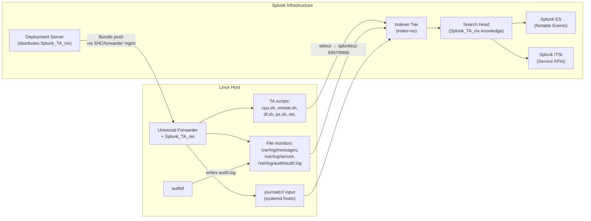

# Linux Servers Integration Guide

> The definitive guide to monitoring Linux servers with Splunk. 134 use cases
> covering CPU/memory/disk/network performance, kernel and process health,
> systemd, journald, auditd security telemetry, package and patch state,
> bonded/teamed NIC failover, multipath I/O, network namespaces, file integrity,
> and CIS-aligned compliance evidence — across RHEL, Ubuntu, SUSE, Amazon
> Linux, Oracle Linux, and Debian.

---

## Table of Contents

- [Quick Start](#quick-start)
- [Overview and What Good Looks Like](#overview)
- [Architecture and Data Flow](#architecture)
- [Prerequisites](#prerequisites)
- [Data Sources Reference](#data-sources)
- [Field Dictionary](#field-dictionary)
- [Sample Events](#sample-events)
- [TA Configuration](#ta-configuration)
- [Auditd Configuration](#auditd)
- [Journald Configuration](#journald)
- [Syslog Pipeline (SC4S)](#syslog-pipeline)
- [Custom Scripted Inputs](#custom-scripted-inputs)
- [Cross-Product Correlation](#cross-product-correlation)
- [CIM Mapping Reference](#cim-mapping)
- [Compliance Mapping](#compliance-mapping)
- [Capacity Planning and Sizing](#sizing)
- [Distribution Compatibility Matrix](#compatibility)
- [Recommended Dashboard Layouts](#dashboards)
- [ITSI Service Modeling](#itsi)
- [SOAR Playbook Examples](#soar)
- [Containers and Hosts Running Containers](#containers)
- [Security Hardening](#security-hardening)
- [Crawl / Walk / Run Roadmap](#roadmap)
- [Validation Checklist](#validation-checklist)
- [Known Limitations and Gaps](#known-limitations)
- [Troubleshooting](#troubleshooting)
- [FAQ](#faq)
- [Glossary](#glossary)
- [Migrating from Legacy nix Add-Ons](#migration)
- [References](#references)
- [Contribution and Feedback](#contribution)

---

<a id="quick-start"></a>
## Quick Start — 10 Minutes to First Data

For engineers who want data flowing before reading the rest:

1. **Install the TA** — Download [Splunk Add-on for Unix and Linux (Splunkbase 833)](https://splunkbase.splunk.com/app/833). Install on the search head, indexer (for parsing), and ship via Forwarder Management to every Universal Forwarder.

2. **Create the index** — In Splunk: Settings → Indexes → New Index. Name: `os`, type: Events. Set retention per the highest compliance framework you operate under (PCI: 1y; SOX/HIPAA: 6–7y).

3. **Enable the foundational scripted inputs** — On the deployment server, edit `etc/deployment-apps/Splunk_TA_nix/local/inputs.conf`:

   ```ini
   [script://./bin/cpu.sh]
   disabled = 0
   interval = 60
   sourcetype = cpu
   index = os

   [script://./bin/vmstat.sh]
   disabled = 0
   interval = 60
   sourcetype = vmstat
   index = os

   [script://./bin/df.sh]
   disabled = 0
   interval = 300
   sourcetype = df
   index = os

   [monitor:///var/log/secure]
   disabled = 0
   sourcetype = linux_secure
   index = os

   [monitor:///var/log/audit/audit.log]
   disabled = 0
   sourcetype = linux_audit
   index = os
   ```

   Reload: `splunk reload deploy-server` and confirm forwarder check-in in Forwarder Management.

4. **Verify data** — Within 5 minutes:
   ```spl
   index=os | stats count by sourcetype | sort -count
   ```
   You should see `cpu`, `vmstat`, `df`, and the monitor inputs.

5. **Deploy core UCs** — Start with the [Crawl tier roadmap](#roadmap).

**Stuck?** Jump to [Troubleshooting](#troubleshooting).

---

<a id="overview"></a>
## Overview and What Good Looks Like

### What Splunk_TA_nix collects

`Splunk_TA_nix` is a hybrid add-on that combines two collection patterns:

- **Scripted inputs** — Bash scripts under `$SPLUNK_HOME/etc/apps/Splunk_TA_nix/bin/` that wrap classic Unix commands (`top`, `vmstat`, `iostat`, `df`, `lsof`, `netstat`, `ps`, `who`, `lastlog`, `dpkg/rpm`, `ip`, `ss`) and emit structured key-value or columnar text. The TA's `props.conf` extracts those into well-named fields (`pctIdle`, `loadAvg1mi`, `Used%`, etc.).
- **Monitor inputs** — File monitors on `/var/log/messages`, `/var/log/secure`, `/var/log/audit/audit.log`, plus an optional `journald://` modular input introduced in TA 8.x for systemd-only distros.

This dual model lets you cover everything from raw performance metrics to security audit trails with a single add-on on every host.

### Why Splunk over node_exporter / Prometheus / vendor tools?

| Capability | node_exporter / Prometheus | Splunk_TA_nix |
|------------|----------------------------|---------------|
| Numeric performance metrics | First-class (TSDB) | First-class (metric index or events) |
| Process inventory | None (separate exporter) | Built-in (`ps`) |
| Audit log search | None | Native (`linux_audit`) |
| Sudo / login forensics | None | Native (`linux_secure`, `lastlog`, `who`) |
| Package inventory & drift | None | Native (`package`) |
| Cross-correlate auth + perf | Hard | Trivial in SPL |
| Long-term retention | Days/weeks (cardinality cost) | Years (frozen archive) |
| Compliance evidence | Manual | Auditable, time-indexed |

Most Splunk customers run both: Prometheus for the metric heatmaps NOC engineers love, Splunk for the correlation, security telemetry, and audit-grade retention.

### Who should read this guide?

| Role | Relevant sections |
|------|-------------------|
| **Linux SRE / Platform Engineering** | Quick Start, Sourcetypes, Field Dictionary, Dashboards, Troubleshooting |
| **Security Operations** | Auditd Config, Compliance Mapping, SOAR Playbooks, Cross-Product Correlation |
| **Compliance / Audit** | Compliance Mapping, Validation Checklist, Sample Events |
| **Splunk Architecture** | Sizing, ITSI, Security Hardening |
| **Capacity Planning** | Sizing, Crawl/Walk/Run Roadmap, ITSI KPIs |

### What good looks like

| Dimension | Before integration | After full deployment |
|-----------|-------------------|-----------------------|
| **Visibility** | SSH + `top` / `htop` per host | Fleet-wide dashboards by service / region |
| **Capacity decisions** | "We're out of CPU, ship a ticket" | 30/60/90-day trend tells you which hosts to refresh next quarter |
| **Security forensics** | Audit log lives only on the box (gone if the box is rooted) | Auditd, secure log, journald all centrally indexed and tamper-evident |
| **Compliance evidence** | Quarterly screenshot scramble | Auditor-ready reports per control |
| **Patch state** | "We think we're current" | `index=os sourcetype=package` shows actual installed RPMs/DEBs vs golden lookup |
| **Mean Time to Recovery** | Hours of triage | Minutes — auth + perf + change correlated in one search |

---

<a id="architecture"></a>
## Architecture and Data Flow



**Three collection patterns:**

1. **Scripted inputs (`script://`)** — TA-shipped scripts run on the UF at the configured `interval`. Stdout is captured by the splunkd ExecProcessor and forwarded to the indexer tier with the configured `sourcetype`. Examples: `cpu.sh`, `vmstat.sh`, `iostat.sh`, `ps.sh`, `df.sh`, `package.sh`, `hardware.sh`, `interfaces.sh`, `lastlog.sh`, `who.sh`, `lsof.sh`.

2. **File monitor inputs (`monitor://`)** — splunkd watches a file (or directory) for new bytes and forwards each line. Used for `/var/log/messages`, `/var/log/secure`, `/var/log/audit/audit.log`, `/var/log/dnf.log`, application logs.

3. **Journald modular input (`journald://`)** — Available in `Splunk_TA_nix` 8.0+ for distros with no `/var/log/messages` (RHEL 9 default, Ubuntu 22.04+ for many services, container hosts). Reads from systemd-journal directly via `libsystemd`. Configurable filters (`unit=`, `priority=`, etc.).

The deployment server distributes `Splunk_TA_nix` plus a thin local override (`local/inputs.conf` enabling specific sourcetypes) as an app bundle. Most environments put hosts into a serverclass like `linux_uf` keyed on a host attribute (`whitelist.0 = .*linux.*` or a deployment tag).

---

<a id="prerequisites"></a>
## Prerequisites

### Linux host requirements

| Requirement | Detail |
|-------------|--------|
| **Distribution** | RHEL/CentOS/Rocky/Alma 7/8/9, Ubuntu 18.04/20.04/22.04/24.04 LTS, SUSE 12/15, Amazon Linux 2/2023, Oracle Linux 7/8/9, Debian 10/11/12. Embedded/minimal distros (Alpine, BusyBox, OpenWRT) need extra care — many TA scripts assume bash, coreutils, util-linux. |
| **Universal Forwarder** | Splunk Universal Forwarder 9.0 or later. Install path is conventionally `/opt/splunkforwarder`. Run as a non-root service account where possible (`splunk` user). |
| **systemd / SysV / Upstart** | Forwarder ships init scripts for all three. systemd recommended for any distro that supports it. |
| **Disk space** | UF + `Splunk_TA_nix` bundle ≈ 600 MB; UF persistent state at `/opt/splunkforwarder/var` grows with monitored file fingerprints — plan ~2 GB headroom. |
| **Required packages** | `bash` (≥4), `coreutils`, `util-linux`, `procps-ng`, `iproute2`, `gawk`, `sed`. Optional but recommended: `auditd`, `aide`, `chrony`/`ntpd`, `multipath-tools`, `lm-sensors`. |
| **Time sync** | `chrony` or `ntp` running and synchronised. Splunk uses event timestamps for everything; clock skew >5 minutes will silently break dashboards and alerts. |

### Splunk requirements

| Requirement | Detail |
|-------------|--------|
| **Splunk version** | Splunk Enterprise 9.0+ or Splunk Cloud (Victoria or Classic). |
| **TA install scope** | Universal Forwarder (collection) + Indexer (parsing & CIM eventtypes/tags) + Search Head (eventtype/tag knowledge for CIM acceleration). Do NOT install only on UFs — search-time CIM behaviour will silently fail. |
| **Index** | `os` (events); `os_metrics` (metric store) optional for metric-store deployments. |
| **Roles** | Operators need `srchIndexesAllowed = os` (e.g. a custom `linux_observer` role). Don't grant `admin`. |
| **Deployment server** | Recommended for any deployment >25 hosts. Smaller can use forwarder management with manual `splunk add forward-server`. |

### Network requirements

| From | To | Port | Protocol | Purpose |
|------|----|------|----------|---------|
| UF | Indexer / IDM | 9997 (or 9998 TLS) | TCP | splunktcp event forwarding |
| UF | Deployment Server | 8089 | TCP (HTTPS) | Bundle pull |
| UF | License Master (if separate) | 8089 | TCP (HTTPS) | License check (heavy forwarders only; UFs do not consume license) |

`firewalld`, `nftables`, `iptables`, or cloud security groups must permit egress on 9997/9998 from each host. AWS Nitro and Azure VMs commonly need explicit NSG / security group rules.

---

<a id="data-sources"></a>
## Data Sources Reference

The default `inputs.conf` in `Splunk_TA_nix` ships every input **disabled = 1**. Override in your local app to enable. Default `interval` values shown — most are tuned for "one event per host per minute" or per "polling cadence."

### Performance and metrics (scripted inputs)

| Sourcetype | Script | Default Interval | Key Fields | Est. Volume / host |
|------------|--------|-----------------|------------|--------------------|
| `cpu` | `bin/cpu.sh` | 60s | `CPU` (per-core or `all`), `pctUser`, `pctSystem`, `pctIowait`, `pctIdle`, `pctNice`, `pctSteal` | ~24,500 events/day on a 16-core box |
| `cpu_metric` | `bin/cpu_metric.sh` | 60s | Metric variant of `cpu` | ~5× lower volume than `cpu` |
| `vmstat` | `bin/vmstat.sh` | 60s | `memTotalMB`, `memFreeMB`, `memUsedMB`, `swapUsedMB`, `pgPageIn`, `pgPageOut`, `loadAvg1mi`, `loadAvg5mi`, `loadAvg15mi`, `cSwitches`, `interrupts` | ~1,440 events/day |
| `vmstat_metric` | `bin/vmstat_metric.sh` | 60s | Metric variant | Lower volume |
| `iostat` | `bin/iostat.sh` | 60s | `Device`, `tps`, `rKBps`, `wKBps`, `await`, `svctm`, `pct_util` | ~1,440 events/day per disk |
| `iostat_metric` | `bin/iostat_metric.sh` | 60s | Metric variant | Lower volume |
| `df` | `bin/df.sh` | 300s | `Filesystem`, `Type`, `Size`, `Used`, `Avail`, `UsePct`, `MountedOn`, `Inodes`, `IUsedPct` | ~10 events/poll on typical host |
| `ps` | `bin/ps.sh` | 30s | `USER`, `PID`, `pctCPU`, `pctMEM`, `RSZ_KB`, `VSZ_KB`, `COMMAND`, `ARGS` | Variable; ~200–500 procs/event/poll |
| `top` | `bin/top.sh` | 60s | Top-N processes by CPU/memory | ~1,440 events/day |
| `hardware` | `bin/hardware.sh` | 36000s (10h) | `KEY` (`CPU_VENDOR`, `CPU_COUNT`, `CPU_MHZ`, `MEMORY_TOTAL_MB`, `MOTHERBOARD_VENDOR`, etc.) | ~30 events/poll |
| `interfaces` | `bin/interfaces.sh` | 60s | `interface`, `inBytes`, `outBytes`, `inPackets`, `outPackets`, `inErrors`, `outErrors`, `dropped_in`, `dropped_out` | ~1 event per interface per poll |
| `bandwidth` | `bin/bandwidth.sh` | 60s | Per-interface bandwidth deltas | Lower than `interfaces` |
| `protocol` | `bin/protocol.sh` | 60s | Per-protocol packet counts (TCP, UDP, ICMP) | Low volume |
| `netstat` | `bin/netstat.sh` | 60s | `Proto`, `LocalAddress`, `ForeignAddress`, `State`, `pid`, `program` | Variable; can be high on app servers |
| `openPorts` | `bin/openPorts.sh` | 600s | Listening sockets (`Proto`, `Port`, `Process`) | ~10–50 events/poll |

### Inventory and drift (scripted inputs)

| Sourcetype | Script | Default Interval | Key Fields | Use |
|------------|--------|-----------------|------------|-----|
| `package` | `bin/package.sh` | 3600s | `PACKAGE`, `VERSION`, `RELEASE`, `ARCH`, `INSTALLDATE`, `VENDOR` | RPM/DEB inventory; patch drift detection |
| `lsof` | `bin/lsof.sh` | 600s | `COMMAND`, `PID`, `USER`, `FD`, `TYPE`, `NAME` | Open file forensics |
| `usersWithLoginPrivs` | `bin/usersWithLoginPrivs.sh` | 3600s | `USERNAME`, `SHELL` | Users with login shells |
| `who` | `bin/who.sh` | 300s | `USER`, `LINE`, `TIME`, `IP` | Currently logged-in users |
| `lastlog` | `bin/lastlog.sh` | 86400s | `USERNAME`, `PORT`, `FROM`, `LATEST` | Last login per user |
| `rlog` | `bin/rlog.sh` | 60s | Reads selected files in `/var/log/` | Generic log scrape (rarely used; prefer monitor inputs) |
| `time` | `bin/time.sh` | 21600s | NTP/chrony sync state | Time-sync monitoring |

### Log monitor inputs (file monitors)

| Sourcetype | Source | Common path | Notes |
|------------|--------|-------------|-------|
| `linux_messages_syslog` | `monitor://` | `/var/log/messages` | RHEL/CentOS/Oracle/Amazon Linux. Generic syslog facility. |
| `syslog` | `monitor://` | `/var/log/syslog` | Debian/Ubuntu generic syslog. |
| `linux_secure` | `monitor://` | `/var/log/secure` (RHEL) or `/var/log/auth.log` (Debian/Ubuntu) | Authentication/sudo events. Required for UC-1.1.9, .68, .70, .73, .74, .75, .77. |
| `linux_audit` | `monitor://` | `/var/log/audit/audit.log` | auditd events. Multi-line — TA includes `LINE_BREAKER` to handle properly. Required for ALL `audit-related` UCs (file integrity, SUID/SGID, /etc/shadow, etc.). |
| `dpkg` | `monitor://` | `/var/log/dpkg.log` | Debian/Ubuntu package install/remove. |
| `dnf` / `yum` | `monitor://` | `/var/log/dnf.log` / `/var/log/yum.log` | RHEL package install/remove. |
| `bash_history` | `monitor://` | `/home/*/.bash_history`, `/root/.bash_history` | Command history (privacy-sensitive — see [Security Hardening](#security-hardening)). |

### Journald modular input (`journald://`)

For systemd-only distros where `/var/log/messages` is empty (RHEL 9, Ubuntu 22.04+ for many services). Configure in `inputs.conf`:

```ini
[journald://systemd_all]
disabled = 0
sourcetype = journald
index = os
journalctl-include-fields = MESSAGE,_HOSTNAME,_UID,_GID,_PID,_COMM,_EXE,_SYSTEMD_UNIT,SYSLOG_IDENTIFIER,PRIORITY,_BOOT_ID,_TRANSPORT
journalctl-filter = _PRIORITY<5
```

Filter examples:
- `journalctl-filter = _SYSTEMD_UNIT=ssh.service` — only SSH service
- `journalctl-filter = PRIORITY<4` — warning and higher (kernel emerg/alert/crit/err)
- `journalctl-filter = SYSLOG_FACILITY=10` — auth facility

The journald input requires `libsystemd` on the host and the splunkd process to be allowed to read `/run/log/journal` (default permissions usually permit; on hardened hosts add the splunk user to the `systemd-journal` group).

---

<a id="field-dictionary"></a>
## Field Dictionary

### `cpu`

| Field | Type | Example | Description | Used by |
|-------|------|---------|-------------|---------|
| `CPU` | string / int | `all` or `0` | Per-core (`0`,`1`,...) or summary (`all`). **Always filter to `CPU="all"` for fleet-level dashboards.** | UC-1.1.1, .3, .12 |
| `pctUser` | float | `15.3` | % time in user space | UC-1.1.1, .12 |
| `pctSystem` | float | `4.2` | % time in kernel space | UC-1.1.1 |
| `pctNice` | float | `0.0` | % time in nice'd processes | UC-1.1.1 |
| `pctIowait` | float | `2.1` | % time waiting on I/O | UC-1.1.6, .12 |
| `pctSteal` | float | `0.0` | % time stolen by hypervisor (VMs) | UC-1.1.30, .92 |
| `pctIdle` | float | `78.4` | % time idle | UC-1.1.1 |
| `host` | string | `web01.prod` | Reporting host | All UCs |

### `vmstat`

| Field | Type | Example | Description | Used by |
|-------|------|---------|-------------|---------|
| `memTotalMB` | int | `32768` | Total physical memory MB | UC-1.1.18 |
| `memFreeMB` | int | `1248` | Free memory MB | UC-1.1.18 |
| `memUsedMB` | int | `28344` | Used memory MB | UC-1.1.18 |
| `swapUsedMB` | int | `512` | Swap MB used | UC-1.1.45 (swap thrashing) |
| `swapUsedPct` | float | `1.5` | Swap % used | UC-1.1.45 |
| `pgPageIn` | int | `0` | Pages paged in (since boot or sample) | UC-1.1.45 |
| `pgPageOut` | int | `0` | Pages paged out | UC-1.1.45 |
| `si` | int | `120` | Swap-in pages/sec | UC-1.1.45 |
| `so` | int | `135` | Swap-out pages/sec | UC-1.1.45 |
| `loadAvg1mi` | float | `2.34` | 1-minute load average | UC-1.1.5 |
| `loadAvg5mi` | float | `1.87` | 5-minute load average | UC-1.1.5 |
| `loadAvg15mi` | float | `1.45` | 15-minute load average | UC-1.1.5 |
| `cSwitches` | int | `12345` | Context switches/sec | UC-1.1.30 |
| `interrupts` | int | `5678` | Hardware interrupts/sec | UC-1.1.30 |

### `df`

| Field | Type | Example | Description | Used by |
|-------|------|---------|-------------|---------|
| `Filesystem` | string | `/dev/mapper/vg_root-lv_var` | Block device or remote mount | UC-1.1.15, .18 |
| `Type` | string | `xfs` | Filesystem type | UC-1.1.15 |
| `MountedOn` | string | `/var` | Mount point | UC-1.1.15 (capacity by mount) |
| `Size` | int (KB) | `52428800` | Total size in KB | UC-1.1.15 |
| `Used` | int (KB) | `48234567` | Used in KB | UC-1.1.15 |
| `Avail` | int (KB) | `4194233` | Available in KB | UC-1.1.15 |
| `UsePct` | int | `92` | Percent used | UC-1.1.15 (alerts >85%) |
| `Inodes` | int | `26214400` | Total inodes | UC-1.1.20 (inode exhaustion) |
| `IUsedPct` | int | `78` | Inode % used | UC-1.1.20 |

### `linux_audit`

| Field | Type | Example | Description | Used by |
|-------|------|---------|-------------|---------|
| `type` | string | `SYSCALL`, `PATH`, `EXECVE`, `USER_AUTH` | Audit record type | UC-1.1.69, .70, .73, .92, .115 |
| `key` | string | `priv_esc`, `passwd_changes`, `mod_chmod` | Auditd rule key (set with `-k`) | UC-1.1.69, .70 |
| `name` | string | `/etc/passwd`, `chmod` | File path or syscall name | UC-1.1.70 (path), .69 (syscall) |
| `auid` | int | `1001` | Audit UID (the original login UID, persists across su) | UC-1.1.70 (`auid != -1` to filter system) |
| `uid` | int | `0` | Effective UID | UC-1.1.70 |
| `comm` | string | `vim` | Command name (16-char limit) | UC-1.1.69, .70 |
| `exe` | string | `/usr/bin/vim` | Full executable path | UC-1.1.69, .70 |
| `pid` | int | `12345` | Process ID | UC-1.1.92 |
| `ppid` | int | `1` | Parent process ID | UC-1.1.92 |
| `success` | string | `yes`, `no` | Whether syscall succeeded | UC-1.1.70, .77 |
| `nametype` | string | `NORMAL`, `CREATE`, `DELETE` | Path event type | UC-1.1.70 |

### `linux_secure`

| Field | Type | Example | Description | Used by |
|-------|------|---------|-------------|---------|
| `process` | string | `sshd`, `sudo`, `su` | Source process | UC-1.1.9, .68, .73 |
| `user` | string | `root`, `alice` | Acting user | UC-1.1.9, .68 |
| `src_ip` | string | `10.1.1.5` | Source IP for SSH/RADIUS | UC-1.1.68 |
| `action` | string | `success`, `failure` | Auth outcome | UC-1.1.68, .73 |
| `command` | string | `/bin/cat /etc/shadow` | sudo command (when present) | UC-1.1.9 |

### `package`

| Field | Type | Example | Description | Used by |
|-------|------|---------|-------------|---------|
| `PACKAGE` | string | `openssl-libs` | Package name | UC-1.1.27 (drift), .92 (CVE) |
| `VERSION` | string | `1.1.1k` | Upstream version | UC-1.1.27 |
| `RELEASE` | string | `9.el8_7` | Distro release suffix | UC-1.1.27 |
| `ARCH` | string | `x86_64` | Architecture | UC-1.1.27 |
| `INSTALLDATE` | string / int | `1714060200` | Epoch install time | UC-1.1.27 |
| `VENDOR` | string | `Red Hat, Inc.` | Package vendor | UC-1.1.27 |

### `interfaces`

| Field | Type | Example | Description | Used by |
|-------|------|---------|-------------|---------|
| `interface` | string | `eth0`, `bond0`, `team0` | NIC name | UC-1.1.58, .59, .63 |
| `inBytes` / `outBytes` | int | `1234567` | Cumulative bytes since boot | UC-1.1.58, .63 |
| `inPackets` / `outPackets` | int | `5678` | Cumulative packets | UC-1.1.63 |
| `inErrors` / `outErrors` | int | `0` | NIC error counter | UC-1.1.63 |
| `dropped_in` / `dropped_out` | int | `0` | Dropped packet counter | UC-1.1.63 |

### `hardware`

| Field | Type | Example | Description | Used by |
|-------|------|---------|-------------|---------|
| `KEY` | string | `CPU_COUNT`, `MEMORY_TOTAL_MB`, `CPU_VENDOR`, `MOTHERBOARD_VENDOR` | Hardware key name | UC-1.1.5 (CPU count for ratio), .18 |
| `VALUE` | string | `16`, `32768`, `Intel`, `Dell Inc.` | Value of the key | UC-1.1.5 |

---

<a id="sample-events"></a>
## Sample Events

### `cpu`

```
04-25-2026 15:30:01 CPU pctUser pctNice pctSystem pctIowait pctIdle
all   12.5 0.0 4.2 1.8 81.5
0     14.0 0.0 5.1 1.2 79.7
1     11.0 0.0 3.5 0.9 84.6
2     13.5 0.0 4.4 2.1 80.0
...
host=web01.prod sourcetype=cpu source=cpu
```

`Splunk_TA_nix`'s `props.conf` extracts each numeric column into a field per row; the row with `CPU=all` is the fleet-correct summary.

### `vmstat`

```
04-25-2026 15:30:02 memTotalMB=32768 memFreeMB=1248 memUsedMB=28344 swapUsedMB=512 pgPageIn=0 pgPageOut=0 loadAvg1mi=2.34 loadAvg5mi=1.87 loadAvg15mi=1.45
host=web01.prod sourcetype=vmstat source=vmstat
```

### `df`

```
04-25-2026 15:35:00 Filesystem Type Size Used Avail UsePct MountedOn Inodes IUsed IFree IUsedPct
/dev/mapper/vg_root-lv_root xfs 10485760 4194304 6291456 40 / 5242880 145672 5097208 3
/dev/mapper/vg_root-lv_var xfs 52428800 48234567 4194233 92 /var 26214400 20567345 5647055 78
/dev/sda1 ext4 1048576 156432 892144 16 /boot 65536 312 65224 1
host=web01.prod sourcetype=df source=df
```

UC-1.1.15 alerts on `UsePct >= 85`; UC-1.1.20 alerts on `IUsedPct >= 90`.

### `linux_secure` (sudo failure)

```
Apr 25 15:42:13 web01 sudo: alice : 3 incorrect password attempts ; TTY=pts/0 ; PWD=/home/alice ; USER=root ; COMMAND=/usr/bin/cat /etc/shadow
host=web01.prod sourcetype=linux_secure source=/var/log/secure
```

`Splunk_TA_nix`'s default field extractions parse `user=alice`, `process=sudo`, `command=/usr/bin/cat /etc/shadow`, `dest_user=root`. UC-1.1.9 alerts on this pattern.

### `linux_audit` (chmod on /etc/passwd)

```
type=SYSCALL msg=audit(1714060500.123:7842): arch=c000003e syscall=90 success=yes exit=0 a0=7ffe abc def a1=1a4 a2=0 a3=7ffe items=1 ppid=1 pid=12345 auid=1001 uid=0 gid=0 euid=0 suid=0 fsuid=0 egid=0 sgid=0 fsgid=0 tty=pts0 ses=12 comm="chmod" exe="/usr/bin/chmod" subj=unconfined_u:unconfined_r:unconfined_t:s0-s0:c0.c1023 key="passwd_modify"
type=PATH msg=audit(1714060500.123:7842): item=0 name="/etc/passwd" inode=12345 dev=fd:00 mode=0100644 ouid=0 ogid=0 rdev=00:00 obj=system_u:object_r:passwd_file_t:s0 nametype=NORMAL cap_fp=0 cap_fi=0 cap_fe=0 cap_fver=0
host=web01.prod sourcetype=linux_audit source=/var/log/audit/audit.log
```

The TA's `LINE_BREAKER` and `SHOULD_LINEMERGE` settings join the `SYSCALL` + `PATH` records into a single Splunk event so UC-1.1.70 can correlate `auid`, `comm`, and `name` in one search.

### `package`

```
04-25-2026 16:00:01 PACKAGE=openssl-libs VERSION=1.1.1k RELEASE=9.el8_7 ARCH=x86_64 INSTALLDATE=1714060200 VENDOR="Red Hat, Inc."
04-25-2026 16:00:01 PACKAGE=kernel VERSION=4.18.0 RELEASE=553.16.1.el8_10 ARCH=x86_64 INSTALLDATE=1714060300 VENDOR="Red Hat, Inc."
host=web01.prod sourcetype=package source=package
```

UC-1.1.27 joins `package` against a `golden_packages` lookup to find drift; UC-1.1.92 joins against a CVE feed (e.g. exported from RHSA / Oracle ELSA / USN).

### `journald`

```
{"_HOSTNAME":"web01.prod","_SYSTEMD_UNIT":"ssh.service","_PID":"4521","_UID":"0","_COMM":"sshd","SYSLOG_IDENTIFIER":"sshd","PRIORITY":"6","MESSAGE":"Accepted publickey for alice from 10.1.1.5 port 53124 ssh2: ED25519 SHA256:..."}
host=web01.prod sourcetype=journald
```

JSON-formatted; `_HOSTNAME`, `_SYSTEMD_UNIT`, `MESSAGE`, etc. are auto-extracted as fields.

---

<a id="ta-configuration"></a>
## TA Configuration (Step-by-Step)

### Step 1: Install the TA on the search head and indexer

Download from [Splunkbase 833](https://splunkbase.splunk.com/app/833) and install via Splunk Web (Apps → Install App from File) on:

- **Search Head** — provides eventtypes, tags, `props.conf` field extractions, and CIM compliance for the `Performance` data model.
- **Indexer (and HF if you have one)** — provides parsing-time `props.conf` and `transforms.conf`, including the multi-line `LINE_BREAKER` for `linux_audit`.
- **Universal Forwarder** — provides the scripted inputs in `bin/`.

For SHC: deploy via the deployer; for indexer cluster: deploy via the cluster manager (`splunk apply cluster-bundle`).

**Critical:** the same TA must be on UF, indexer, and SH. Skipping the SH install means CIM tags won't apply, and your `tstats` queries will return empty results even though raw events are indexed.

### Step 2: Create the `os` index

Settings → Indexes → New Index. Name: `os`, type: Events.

`indexes.conf` example:

```ini
[os]
homePath   = $SPLUNK_DB/os/db
coldPath   = $SPLUNK_DB/os/colddb
thawedPath = $SPLUNK_DB/os/thaweddb
maxTotalDataSizeMB = 1048576       # 1 TB; size per fleet
frozenTimePeriodInSecs = 31536000  # 1 year; bump for HIPAA/SOX (6–7y)
```

For metric-store deployments, create `os_metrics` (datatype = metric) in addition.

### Step 3: Build the deployment app `nix_uf`

On the deployment server, create `etc/deployment-apps/nix_uf/local/inputs.conf`:

```ini
# --- Performance scripted inputs ---
[script://./bin/cpu.sh]
disabled = 0
interval = 60
sourcetype = cpu
index = os

[script://./bin/vmstat.sh]
disabled = 0
interval = 60
sourcetype = vmstat
index = os

[script://./bin/iostat.sh]
disabled = 0
interval = 60
sourcetype = iostat
index = os

[script://./bin/df.sh]
disabled = 0
interval = 300
sourcetype = df
index = os

[script://./bin/ps.sh]
disabled = 0
interval = 60
sourcetype = ps
index = os

[script://./bin/hardware.sh]
disabled = 0
interval = 36000   # 10 hours; hardware doesn't change often
sourcetype = hardware
index = os

[script://./bin/interfaces.sh]
disabled = 0
interval = 60
sourcetype = interfaces
index = os

[script://./bin/openPorts.sh]
disabled = 0
interval = 600
sourcetype = openPorts
index = os

[script://./bin/package.sh]
disabled = 0
interval = 3600
sourcetype = package
index = os

[script://./bin/lastlog.sh]
disabled = 0
interval = 86400
sourcetype = lastlog
index = os

# --- File monitor inputs ---
[monitor:///var/log/messages]
disabled = 0
sourcetype = linux_messages_syslog
index = os
crcSalt = <SOURCE>

[monitor:///var/log/syslog]
disabled = 0
sourcetype = syslog
index = os
crcSalt = <SOURCE>

[monitor:///var/log/secure]
disabled = 0
sourcetype = linux_secure
index = os

[monitor:///var/log/auth.log]
disabled = 0
sourcetype = linux_secure
index = os

[monitor:///var/log/audit/audit.log]
disabled = 0
sourcetype = linux_audit
index = os

[monitor:///var/log/dpkg.log]
disabled = 0
sourcetype = dpkg
index = os

[monitor:///var/log/dnf.log]
disabled = 0
sourcetype = dnf
index = os

[monitor:///var/log/yum.log]
disabled = 0
sourcetype = yum
index = os
```

Add `local/app.conf`:

```ini
[install]
state = enabled

[ui]
is_visible = 0
label = Linux Universal Forwarder Inputs
```

### Step 4: Create the serverclass

`etc/system/local/serverclass.conf`:

```ini
[serverClass:linux_servers]
whitelist.0 = *

[serverClass:linux_servers:app:Splunk_TA_nix]
restartSplunkd = 1

[serverClass:linux_servers:app:nix_uf]
restartSplunkd = 1
```

For finer targeting, use:
- `whitelist.0 = *.prod.example.com` (DNS pattern)
- `whitelist.0 = clientName="linux*"` (forwarder client name pattern)
- Or attribute-based: deploy a `clientName` override on each UF: `splunk set deploy-poll <ds-host>:8089 -auth admin:...; splunk set default-hostname <fqdn>; echo "[deployment]\nclientName = linux-prod" >> $SPLUNK_HOME/etc/system/local/deploymentclient.conf`

### Step 5: Reload and verify

```bash
splunk reload deploy-server
```

In Splunk Web → Settings → Forwarder Management, watch each client check in and pull the bundle. Then on a sample host:

```bash
sudo /opt/splunkforwarder/bin/splunk btool inputs list --debug | grep cpu.sh
```

Should show `disabled = 0` from `nix_uf/local/inputs.conf` (your override) winning over the default-disabled stanza in `Splunk_TA_nix/default/inputs.conf`.

### Step 6: Validate end-to-end

```spl
index=os | stats count earliest(_time) as first latest(_time) as last by sourcetype host
| eval mins_since_last = round((now()-last)/60, 1)
| sort host, sourcetype
```

Every (host, sourcetype) pair should show `mins_since_last < 5` for 60-second sourcetypes; `< 10` for 5-minute sourcetypes; `< 65` for hourly.

---

<a id="auditd"></a>
## Auditd Configuration

A vanilla auditd installation logs little. The Linux audit UCs (UC-1.1.69, .70, .73, .77, .92, .115, .129) require **rules** in `/etc/audit/rules.d/`. The CIS Benchmark for the distro gives you a comprehensive starting set; the ones the catalog UCs depend on are below.

### Required rules

`/etc/audit/rules.d/splunk_uc.rules`:

```ini
## /etc/passwd, /etc/shadow, /etc/group integrity (UC-1.1.70, .115)
-w /etc/passwd -p wa -k passwd_modify
-w /etc/shadow -p wa -k shadow_modify
-w /etc/group  -p wa -k group_modify
-w /etc/gshadow -p wa -k gshadow_modify
-w /etc/sudoers -p wa -k sudoers_modify
-w /etc/sudoers.d/ -p wa -k sudoers_modify

## SSH key changes
-w /root/.ssh/ -p wa -k ssh_keys
-w /home/ -p wa -k home_dir_change
-w /etc/ssh/sshd_config -p wa -k sshd_config

## chmod / fchmod / chown / fchown for SUID/SGID detection (UC-1.1.69)
-a always,exit -F arch=b64 -S chmod  -F auid>=1000 -F auid!=4294967295 -k mod_chmod
-a always,exit -F arch=b64 -S fchmod -F auid>=1000 -F auid!=4294967295 -k mod_chmod
-a always,exit -F arch=b64 -S chown  -F auid>=1000 -F auid!=4294967295 -k mod_chown
-a always,exit -F arch=b64 -S fchown -F auid>=1000 -F auid!=4294967295 -k mod_chown

## Privileged binary execution (UC-1.1.92)
-a always,exit -F path=/usr/bin/sudo -F perm=x -F auid>=1000 -k priv_exec
-a always,exit -F path=/usr/bin/su   -F perm=x -F auid>=1000 -k priv_exec

## Kernel module load/unload (UC-1.1.129)
-w /sbin/insmod  -p x -k modules
-w /sbin/rmmod   -p x -k modules
-w /sbin/modprobe -p x -k modules
-a always,exit -F arch=b64 -S init_module -S delete_module -k modules

## Time changes (NTP tampering)
-a always,exit -F arch=b64 -S adjtimex -S settimeofday -k time_change
-a always,exit -F arch=b64 -S clock_settime -k time_change
-w /etc/localtime -p wa -k time_change

## Make the rules immutable until reboot (defence in depth)
-e 2
```

Apply with:

```bash
augenrules --load
auditctl -l   # confirm rules loaded
systemctl status auditd
```

### Buffer sizing

A noisy host (heavy `chmod` activity, build farm) can overflow the default 8192-record auditd queue and lose events. Tune in `/etc/audit/auditd.conf`:

```
buffer_size = 16384
disp_qos = lossless
overflow_action = SYSLOG
```

UC-1.1.92 (Auditd Daemon Health) will catch hosts where auditd has stopped writing — set up that alert before you go live.

### journald-only hosts

On RHEL 9 minimal / Ubuntu Server 22.04+, audit can write to journald instead of `audit.log`. Either:

- Install the `audit` package and let it write to `/var/log/audit/audit.log` (recommended — UCs assume the file path).
- Or use the `journald://` input with filter `_TRANSPORT=audit` to capture the same data, then add a `props.conf` rename/transform on the UF to map field names to the catalog's expectations.

---

<a id="journald"></a>
## Journald Configuration

For systemd-only distros where you want `journald://` to replace some `monitor://` inputs:

### Default journald input

```ini
[journald://systemd_default]
disabled = 0
sourcetype = journald
index = os
journalctl-include-fields = MESSAGE,_HOSTNAME,_UID,_GID,_PID,_COMM,_EXE,_SYSTEMD_UNIT,SYSLOG_IDENTIFIER,PRIORITY,_BOOT_ID,_TRANSPORT
```

### Per-unit isolation

For high-volume services, isolate to its own sourcetype so search-time props extractions don't fight:

```ini
[journald://nginx]
disabled = 0
sourcetype = nginx:access
index = os
journalctl-filter = _SYSTEMD_UNIT=nginx.service

[journald://kubelet]
disabled = 0
sourcetype = kubelet:journald
index = os
journalctl-filter = _SYSTEMD_UNIT=kubelet.service
```

### Permission gotcha

splunkd runs as the `splunk` user by default; `/run/log/journal` access usually requires either:
- Membership in the `systemd-journal` group: `usermod -aG systemd-journal splunk`
- Or running splunkd as `root` (not recommended; security regression).

Verify with `journalctl --user-unit=nothing` as the splunk user — should return events without permission errors.

### Persistence

journald defaults to in-memory on many distros — events disappear on reboot. For Splunk to ingest reliably, enable persistence in `/etc/systemd/journald.conf`:

```
Storage=persistent
SystemMaxUse=2G
```

Then `systemctl restart systemd-journald`.

---

<a id="syslog-pipeline"></a>
## Syslog Pipeline (SC4S — Optional)

For hosts that already centralise syslog to a SC4S receiver (e.g. you don't run a UF on every appliance), parsing happens in SC4S and Splunk receives normalized events. SC4S provides distro-aware parsing for `linux_messages_syslog`, `linux_secure`, and friends — but if you're collecting *from* a Linux host running a UF, prefer the UF's `monitor://` inputs (no extra hop, simpler RBAC).

When SC4S is in scope, set:

```
[default]
SC4S_DEST_SPLUNK_HEC_DEFAULT_URL=https://hec.splunk.example.com:8088
SC4S_DEST_SPLUNK_HEC_DEFAULT_TOKEN=<token>
```

And in `local.yml` allowlist Linux source IP ranges so SC4S routes them to `index=os` with the right sourcetype. See [SC4S documentation](https://splunk-connect-for-syslog.readthedocs.io/) for the full pipeline.

---

<a id="custom-scripted-inputs"></a>
## Custom Scripted Inputs

The TA covers most cases. Add custom inputs when you need:

### Smartctl / disk SMART telemetry (UC-1.1.30 supplement)

`bin/smart.sh`:

```bash
#!/usr/bin/env bash
# Run as root or with sudoers entry granting NOPASSWD: /usr/sbin/smartctl
for d in /dev/sd? /dev/nvme?n?; do
  [[ -e $d ]] || continue
  attrs=$(/usr/sbin/smartctl -A "$d" 2>/dev/null | awk '/^[ ]*[0-9]+/ {print $2"="$10}' | tr '\n' ' ')
  echo "device=$d $attrs"
done
```

`inputs.conf`:

```ini
[script://./bin/smart.sh]
disabled = 0
interval = 3600
sourcetype = smart
index = os
```

Sudoers: `splunk ALL=(root) NOPASSWD: /usr/sbin/smartctl -A /dev/*`

### Network namespaces (UC-1.1.54)

`bin/netns.sh`:

```bash
#!/usr/bin/env bash
host=$(hostname -f)
ip netns 2>/dev/null | awk '{print "host='"$host"' netns_name="$1}'
```

```ini
[script://./bin/netns.sh]
disabled = 0
interval = 300
sourcetype = custom:netns
index = os
```

### Multipath status (UC-1.1.36 supplement)

`bin/multipath.sh`:

```bash
#!/usr/bin/env bash
[[ -x /sbin/multipath ]] || exit 0
/sbin/multipath -ll | awk '
/^[a-z0-9]/ {wwid=$1; next}
/policy=/ {print "wwid="wwid" "$0}
'
```

```ini
[script://./bin/multipath.sh]
disabled = 0
interval = 60
sourcetype = multipath:status
index = os
```

### IPMI / BMC sensors (UC-1.4.* hardware)

`bin/ipmi.sh` (requires `ipmitool` and IPMI access):

```bash
#!/usr/bin/env bash
host=$(hostname -f)
/usr/bin/ipmitool sensor 2>/dev/null | awk -F\| -v h="$host" '{
  gsub(/[ \t]+$/,"",$1); gsub(/^[ \t]+/,"",$1);
  gsub(/[ \t]+$/,"",$2); gsub(/^[ \t]+/,"",$2);
  print "host="h" sensor=\""$1"\" value="$2" status="$3
}'
```

```ini
[script://./bin/ipmi.sh]
disabled = 0
interval = 600
sourcetype = ipmi:sensor
index = os
```

---

<a id="cross-product-correlation"></a>
## Cross-Product Correlation

### Linux + Windows cross-fleet view

For mixed fleets, query both:

```spl
(index=os sourcetype=cpu CPU="all") OR (index=wineventlog source="WMI:CPU")
| eval cpu_used = coalesce(100-pctIdle, PercentProcessorTime)
| eval os = if(sourcetype=="cpu", "linux", "windows")
| timechart span=1h avg(cpu_used) by os
```

### Linux + Splunk Enterprise Security

Linux audit UCs (UC-1.1.69 SUID, .70 /etc/passwd, .77 sudo, .92 auditd health, .115 shadow) feed the **Endpoint** and **Change** data models. Configure `eventtypes.conf` and `tags.conf` in a local app:

```ini
# eventtypes.conf
[linux_audit_passwd_change]
search = sourcetype=linux_audit name="/etc/passwd" action=modified

[linux_audit_suid_change]
search = sourcetype=linux_audit (suid=1 OR sgid=1) (name="chmod*" OR type=SYSCALL)

# tags.conf
[eventtype=linux_audit_passwd_change]
change = enabled
endpoint = enabled

[eventtype=linux_audit_suid_change]
change = enabled
endpoint = enabled
```

Then ES correlation searches against the Change data model will pick up your Linux file integrity events, and Risk-Based Alerting (RBA) can score them.

### Linux + ITSI service tree

Map each Linux host to one or more ITSI entities; aggregate into business services. KPIs straight from the catalog:
- `cpu_load_percent` from UC-1.1.1 (Performance data model)
- `disk_used_percent` from UC-1.1.15 (`df` sourcetype)
- `memory_used_percent` from UC-1.1.18 (`vmstat`)
- `audit_health` from UC-1.1.92 (audit silence detection → service health KPI)

### Linux + Microsoft Defender for Linux (MDE)

Defender for Endpoint on Linux writes to `/var/log/microsoft/mdatp/microsoft_defender_*.log` and to syslog. Forward via the same `monitor://` pattern with sourcetype `mdatp:linux:json`. Correlate Defender alerts with `linux_audit` to give SOC analysts host-side context:

```spl
index=os sourcetype="mdatp:linux:json" severity="High"
| join host
   [search index=os sourcetype=linux_audit earliest=-1h
    | stats count by host, key]
```

### Linux + AIDE (file integrity baseline)

If you run AIDE for daily file integrity checks, ingest its report:

```ini
[monitor:///var/log/aide/aide.log]
sourcetype = aide:report
index = os
```

Then UC-1.1.69 (SUID changes) gets a daily reconciliation point against AIDE's full-tree baseline.

### Linux + CrowdStrike Falcon LightSpeed (Linux EDR)

CrowdStrike's Linux sensor publishes telemetry through Falcon Data Replicator (FDR) or Falcon LogScale Collector. When ingested into Splunk, correlate Falcon process events with `linux_audit` for forensics:

```spl
(index=falcon ComputerName=$host$ event_simpleName=ProcessRollup2)
OR (index=os sourcetype=linux_audit host=$host$)
| sort _time
| streamstats current=f window=1 last(_raw) as prev_raw
| where (sourcetype="linux_audit" AND searchmatch(prev_raw, "ProcessRollup2"))
   OR (sourcetype="falcon:*" AND searchmatch(prev_raw, "linux_audit"))
```

---

<a id="cim-mapping"></a>
## CIM Mapping Reference

| CIM Data Model | Mapped sourcetypes / UCs | Validation SPL |
|----------------|--------------------------|----------------|
| **Performance** | `cpu`, `vmstat`, `iostat`, `df`, `interfaces` (UC-1.1.1, .12, .15, .18, .45) | `\| tstats count from datamodel=Performance where nodename=Performance.CPU` |
| **Authentication** | `linux_secure` (UC-1.1.9, .68, .73) | `\| tstats count from datamodel=Authentication by Authentication.action` |
| **Change** | `linux_audit` (UC-1.1.69, .70, .115, .129) | `\| tstats count from datamodel=Change by All_Changes.action, All_Changes.object` |
| **Endpoint.Filesystem** | `linux_audit` (UC-1.1.70, .115) | `\| tstats count from datamodel=Endpoint.Filesystem` |
| **Endpoint.Processes** | `ps`, `linux_audit` `EXECVE` (UC-1.1.6, .92) | `\| tstats count from datamodel=Endpoint.Processes by Processes.user` |
| **Endpoint.Ports** | `openPorts`, `netstat` | `\| tstats count from datamodel=Endpoint.Ports` |
| **Updates** | `package`, `dnf`, `dpkg`, `yum` (UC-1.1.27) | `\| tstats count from datamodel=Updates by Updates.package` |
| **Network_Sessions** | `interfaces`, `netstat` (UC-1.1.63) | `\| tstats count from datamodel=Network_Sessions` |

Most of these are wired automatically by `Splunk_TA_nix/default/eventtypes.conf` and `tags.conf`. Verify in Splunk Web → Settings → Data Models → Performance → Documents tab — you should see `nix_cpu_metric` and friends listed as constraint matches.

If `tstats` returns nothing but raw events are present:
1. Confirm the TA is on the search head (most common cause).
2. Check the Performance / Endpoint / Change data model is **accelerated**: Settings → Data Models → → Edit → Acceleration → check.
3. Allow time for the acceleration to backfill (minutes to hours depending on volume).

---

<a id="compliance-mapping"></a>
## Compliance Mapping

Linux is the substrate of most enterprise applications, so it appears in nearly every compliance framework — usually under access control, audit logging, file integrity, configuration baselines, and patch management.

### NIST 800-53 Rev. 5

| UC | Control | Control Name | Assurance Level |
|----|---------|-------------|-----------------|
| UC-1.1.9, .68, .73, .77 | AC-2 | Account Management | Partial |
| UC-1.1.9, .68, .73, .77 | AC-7 | Unsuccessful Logon Attempts | Partial |
| UC-1.1.69, .70, .115, .129 | AU-2 | Event Logging | Strong |
| UC-1.1.92 | AU-5 | Response to Audit Logging Process Failures | Partial |
| UC-1.1.69, .70, .115 | SI-7 | Software, Firmware, and Information Integrity | Partial |
| UC-1.1.27 | CM-2 | Baseline Configuration | Partial |
| UC-1.1.27 | SI-2 | Flaw Remediation | Partial |
| UC-1.1.129 | CM-5 | Access Restrictions for Change | Partial |
| UC-1.1.6, .12 | SI-4 | System Monitoring | Partial |

### PCI-DSS v4.0

| UC | Requirement | Description |
|----|------------|-------------|
| UC-1.1.69, .70, .115 | 10.2.2 | Audit logs capture changes to the system | Partial |
| UC-1.1.92 | 10.2.7 | Audit log access | Partial |
| UC-1.1.9, .68, .73 | 10.2.1 | Audit logs capture user authentication events | Partial |
| UC-1.1.27 | 6.3.1 | Identify security vulnerabilities (patch tracking) | Partial |
| UC-1.1.129 | 11.5.1 | Detect changes to critical system files | Partial |

### HIPAA Security Rule

| UC | Safeguard | Description |
|----|-----------|-------------|
| UC-1.1.69, .70, .115 | §164.312(b) | Audit Controls | Partial |
| UC-1.1.92 | §164.308(a)(1)(ii)(D) | Information System Activity Review | Partial |
| UC-1.1.27 | §164.308(a)(5)(ii)(B) | Protection from Malicious Software (patch evidence) | Partial |
| UC-1.1.9, .73 | §164.312(d) | Person or Entity Authentication | Partial |

### ISO 27001:2022

| UC | Annex Control | Description |
|----|---------------|-------------|
| UC-1.1.69, .70 | A.8.7 | Protection against malware (file integrity) | Partial |
| UC-1.1.27, .92 | A.8.8 | Management of technical vulnerabilities | Partial |
| UC-1.1.69, .70, .115, .129 | A.8.15 | Logging | Strong |
| UC-1.1.9, .68, .73 | A.8.16 | Monitoring activities | Partial |

### CIS Linux Benchmark

| UC | CIS Section | Description |
|----|-------------|-------------|
| UC-1.1.69 | 6.1.10–6.1.13 | World-writable / SUID-SGID file audit | Strong |
| UC-1.1.70, .115 | 6.2 | User and group settings integrity | Partial |
| UC-1.1.92 | 4.1 | Configure auditd | Partial |
| UC-1.1.129 | 1.1.x | Disable unused filesystems / kernel modules | Partial |

### SOX ITGC

| UC | Control Area | Description |
|----|-------------|-------------|
| UC-1.1.9, .68 | Logical access | Privileged user activity audit | Contributing |
| UC-1.1.27 | Change management | Patch / package change history | Contributing |
| UC-1.1.69, .70, .115, .129 | Logical access | File integrity for sensitive system files | Contributing |

### NIS2 (EU)

| UC | Article | Theme |
|----|---------|-------|
| UC-1.1.92 | Art 23 | Security event monitoring |
| UC-1.1.69, .70, .115 | Art 21 §2(b) | Incident detection (file integrity) |
| UC-1.1.27 | Art 21 §2(e) | Patch management evidence |

---

<a id="sizing"></a>
## Capacity Planning and Sizing

### Per-host daily ingest by sourcetype

These estimates assume the Quick Start scripted-input set at default intervals. Add 20–50% if you enable noisy security log sources (auditd verbose mode, bash_history) or run on busy app/db hosts.

| Sourcetype | Events/day | Avg event size | Daily ingest/host |
|------------|-----------|----------------|--------------------|
| `cpu` (16-core, `CPU=all` only) | 1,440 | 200 B | ~280 KB/day |
| `cpu` (16-core, all per-core) | 24,500 | 200 B | ~4.7 MB/day |
| `vmstat` | 1,440 | 250 B | ~350 KB/day |
| `iostat` (4 disks) | 5,760 | 180 B | ~1 MB/day |
| `df` (5 mounts) | 1,440 | 250 B | ~350 KB/day |
| `ps` (300 procs) | 86,400 | 350 B | ~30 MB/day |
| `interfaces` (3 NICs) | 4,320 | 200 B | ~850 KB/day |
| `package` (500 pkgs) | 12,000 | 250 B | ~3 MB/day |
| `linux_secure` (idle host) | ~50 | 250 B | ~12 KB/day |
| `linux_secure` (login-busy) | ~5,000 | 250 B | ~1.2 MB/day |
| `linux_audit` (CIS rules, idle) | ~500 | 600 B | ~300 KB/day |
| `linux_audit` (CIS rules, busy build farm) | ~50,000 | 600 B | ~30 MB/day |

### Worked examples

| Fleet | Scenario | Daily ingest | 1-year retention |
|-------|----------|--------------|------------------|
| **50 hosts, idle** | Quick Start set | ~2 GB/day | ~730 GB |
| **500 hosts, busy** | Quick Start + audit | ~25 GB/day | ~9 TB |
| **5,000 hosts, mixed** | Full TA + audit verbose | ~250 GB/day | ~90 TB |

### Cost-cutting levers

1. **Drop `ps` to interval=300** if you only need long-term process trends, not per-minute deltas.
2. **Use `cpu_metric`/`vmstat_metric`/`iostat_metric` in metric indexes** — drops ingest by ~5×; KPIs and dashboards work the same.
3. **Filter audit events at index time** — a `transforms.conf` SED rule can drop noisy audit types on a busy host (be careful: this destroys evidence; only do with security review).
4. **Tune `crcSalt` carefully** — without it, log rotation can re-ingest the same events with new identifiers; with it set wrong, rotated logs can be missed. Default `<SOURCE>` is the safest starting point.

### Universal Forwarder licence

UFs themselves do **not** count against your licence (they're free with any Splunk licence). What counts is the bytes ingested at the indexer tier. Sample your environment for a week before sizing the production licence — actual `ps`/`linux_audit` volume is the single largest variable.

---

<a id="compatibility"></a>
## Distribution Compatibility Matrix

| Distribution | UF Support | TA scripts work | journald required | Notes |
|--------------|-----------|-----------------|-------------------|-------|
| **RHEL / CentOS / Rocky / Alma 7** | Yes | Yes | No | EOL upstream; security TA still functional |
| **RHEL / CentOS Stream / Rocky / Alma 8** | Yes | Yes | Optional | Most common Splunk customer baseline |
| **RHEL / Rocky / Alma 9** | Yes | Yes | Recommended | `/var/log/messages` is sparse by default |
| **Ubuntu 18.04 LTS** | Yes (UF 9.x EOL aware) | Yes | Optional | EOL April 2028 (ESM) |
| **Ubuntu 20.04 LTS** | Yes | Yes | Optional | Standard |
| **Ubuntu 22.04 LTS** | Yes | Yes | Recommended | journald-first for many services |
| **Ubuntu 24.04 LTS** | Yes (UF 9.2+) | Yes | Recommended | Test new TA versions before mass rollout |
| **Debian 11 / 12** | Yes | Yes | Optional | Standard |
| **SUSE 12 SP5 / 15** | Yes | Yes (mostly) | Optional | `package.sh` uses `rpm` correctly |
| **Amazon Linux 2** | Yes | Yes | Optional | Standard for AWS workloads |
| **Amazon Linux 2023** | Yes | Yes | Recommended | AL2023 is RHEL 9-derived; journald-first |
| **Oracle Linux 7 / 8 / 9** | Yes | Yes | Same as RHEL | UEK kernel may produce extra `linux_audit` `arch` values; existing UCs cope |
| **Alpine** | Limited (musl libc) | Most scripts work | Use journald | UF distributed as glibc-based; alpine needs a glibc compat layer |
| **Embedded / IoT (BusyBox)** | No | No | N/A | Use Splunk Connect for Syslog (SC4S) instead |
| **Container hosts** (any of above) | Yes (host-level) | Yes for host metrics | Recommended | See [Containers and Hosts Running Containers](#containers) |

UF version policy: UF n-1 minor releases are supported by Splunk for at least 24 months. As of May 2026, UF 9.0/9.1/9.2/9.3 are all in support. UF 8.x is EOL.

---

<a id="dashboards"></a>
## Recommended Dashboard Layouts

### Crawl Dashboard (Day 1) — "Linux Fleet at a Glance"

```
+----------------------------------+----------------------------------+
| HOSTS REPORTING                  | CPU >90% SUSTAINED 1H            |
| (UC-1.1.92 / Data Collection)    | (UC-1.1.1)                       |
| Single value: dc(host) last 5m   | Single value; red if >0          |
| with sparkline                   |                                  |
+----------------------------------+----------------------------------+
| FILESYSTEMS >85% USED            | MEMORY >90% USED                 |
| (UC-1.1.15)                      | (UC-1.1.18)                      |
| Sortable table by host, mount    | Sortable table by host           |
+----------------------------------+----------------------------------+
| FAILED SUDO LAST 24H             | UNREACHABLE HOSTS                |
| (UC-1.1.9)                       | (UC-1.1.92 / silence detection)  |
| Stacked bar by host              | Table: host, last_event_minutes  |
+----------------------------------+----------------------------------+
```

### Walk Dashboard (Week 2) — "Operational Intelligence"

Add to crawl:

```
+----------------------------------+----------------------------------+
| INTERFACE ERROR RATE             | PACKAGE DRIFT FROM GOLDEN        |
| (UC-1.1.63)                      | (UC-1.1.27)                      |
| Timechart by host, interface     | Table: host, package, expected,  |
|                                  | actual, days_drifted             |
+----------------------------------+----------------------------------+
| SUDO COMMANDS LAST 24H           | SUID/SGID CHANGES                |
| (UC-1.1.9)                       | (UC-1.1.69)                      |
| Top-20 user/command pairs        | Recent additions w/ AIDE diff   |
+----------------------------------+----------------------------------+
```

### Run Dashboard (Month 2+) — "Compliance & Forensics"

Add to walk:

```
+----------------------------------+----------------------------------+
| /etc/passwd MODIFICATIONS        | KERNEL MODULE LOAD/UNLOAD        |
| (UC-1.1.70)                      | (UC-1.1.129)                     |
| Annotated timeline w/ change     | Table grouped by module          |
| ticket cross-ref                 |                                  |
+----------------------------------+----------------------------------+
| ROOT-EQUIVALENT (UID 0) USE      | MULTIPATH FAILOVERS              |
| (UC-1.1.9)                       | (UC-1.1.36)                      |
| User → host heatmap              | Table: host, device, count, time |
+----------------------------------+----------------------------------+
| AUDIT DAEMON HEALTH (META)       | NTP SYNC HEALTH                  |
| (UC-1.1.92)                      | (UC-1.1.45 area)                 |
| Status table: host, audit_health | Table: host, offset, sync_state  |
+----------------------------------+----------------------------------+
```

---

<a id="itsi"></a>
## ITSI Service Modeling

### Service hierarchy

```
Linux Compute Platform
├── Region: EMEA
│   ├── Data Center: AMS
│   │   ├── Web Tier
│   │   ├── App Tier
│   │   └── DB Tier
│   └── Data Center: FRA
└── Region: AMER
    └── ...
```

### Recommended KPIs

| KPI | UC | Base search | Threshold type |
|-----|----|------------|----------------|
| **CPU Saturation** | UC-1.1.1 | `index=os sourcetype=cpu CPU="all" \| stats avg(eval(100-pctIdle)) as cpu_used by host` | Adaptive (stdev) |
| **Memory Pressure** | UC-1.1.18 | `index=os sourcetype=vmstat \| eval mem_pct=100*(memUsedMB/memTotalMB) \| stats avg(mem_pct) by host` | Adaptive |
| **Filesystem Headroom** | UC-1.1.15 | `index=os sourcetype=df \| stats max(UsePct) as max_used by host` | Static (warn 80, crit 90) |
| **Audit Daemon Health** | UC-1.1.92 | `index=os sourcetype=linux_audit \| stats max(_time) as last by host \| eval mins=round((now()-last)/60,1)` | Static (crit > 5 min) |
| **Failed Auth Rate** | UC-1.1.9 | `index=os sourcetype=linux_secure "authentication failure" \| stats count by host` | Adaptive |
| **Multipath Health** | UC-1.1.36 | `index=os sourcetype=syslog "multipathd" "path failed" \| stats count by host` | Static (crit > 0) |

### Entity import

Use `package` or `hardware` as the discovery source:

```spl
index=os (sourcetype=hardware OR sourcetype=package) earliest=-24h
| dedup host
| eval cpu_count = if(KEY="CPU_COUNT", VALUE, "")
| stats values(cpu_count) as cpu_count, latest(_time) as last_seen by host
```

ITSI entity definition:
- **Title:** `host`
- **Identifier fields:** `host`
- **Informational fields:** `cpu_count`, `os_distribution`
- **Entity type:** `linux_server`

### Health score weighting

Within an "App Tier" service, suggested weights:
- Audit daemon health: 25 (security must work or evidence trail breaks)
- CPU saturation: 20
- Memory pressure: 20
- Filesystem headroom: 20
- Failed auth rate: 15

---

<a id="soar"></a>
## SOAR Playbook Examples

### Playbook 1: Filesystem 95%+ Auto-Triage

**Trigger:** UC-1.1.15 alert fires (filesystem ≥ 95%).

```
1. RECEIVE alert (host, mount, UsePct, Avail)
2. RUN diagnostic via SSH/Ansible: list largest dirs and files
   ssh splunk@$host "sudo du -sh ${mount}/* 2>/dev/null | sort -h | tail -20"
3. CHECK recent log growth via Splunk
   SPL: index=os sourcetype=df host=$host MountedOn=$mount
        | timechart span=1h max(UsePct)
4. DECISION:
   ├── If /var → check application log directories first
   ├── If /tmp → consider safe cleanup of files older than 7 days
   └── If /home or /data → escalate to data owner immediately
5. CREATE ServiceNow incident with:
   - Top-20 large files
   - 24h growth chart (Splunk URL)
   - Suggested cleanup commands (do NOT auto-run)
6. NOTIFY service owner via email + Slack
```

### Playbook 2: Critical SUID Binary Detected

**Trigger:** UC-1.1.69 alert fires (new SUID binary outside golden lookup).

```
1. RECEIVE alert (host, file path, owner, command)
2. CHECK if path is in approved baseline lookup
   SPL: | inputlookup approved_suid.csv | search path=$path
   ├── If approved → close as expected; record in audit log
   └── If unknown → CONTINUE
3. ENRICH with file hash and AIDE diff
   ssh splunk@$host "sudo sha256sum $path"
4. CHECK for matching CVE / IOC
   GET https://api.threatintel.example.com/v1/file/$hash
5. DECIDE
   ├── Known malicious → AUTO-QUARANTINE (mv to /quarantine, chmod 0)
   │                    + create P1 SOC ticket + page IR
   └── Unknown → P3 SOC ticket; analyst review within 24h
6. UPDATE Splunk notable event with playbook results
```

### Playbook 3: Auditd Silence Detection

**Trigger:** UC-1.1.92 alert fires (auditd silent for 5+ minutes).

```
1. RECEIVE alert (host)
2. CHECK forwarder health first
   SPL: index=_internal sourcetype=splunkd host=$host component=Metrics
   ├── If forwarder is also silent → likely network/host-down, NOT audit issue
   └── If forwarder is fine → CONTINUE (audit-specific issue)
3. SSH to host
   ssh splunk@$host "sudo systemctl status auditd"
4. DECISION:
   ├── auditd inactive → systemctl restart auditd; create incident
   ├── auditd active but no events → check rules: auditctl -l
   ├── Buffer overflow (look for "lost X events" in dmesg) → tune buffer_size
   └── Selinux denial → ausearch -m AVC -ts recent
5. RECORD remediation in change ticket
```

---

<a id="containers"></a>
## Containers and Hosts Running Containers

For hosts running Docker/Podman/Kubernetes:

- **Host-level UCs (1.1.*) still apply** — CPU, memory, disk, audit, package etc. are host concerns regardless of containers.
- **Container-internal monitoring** — NOT covered by `Splunk_TA_nix`. Use the [Kubernetes Integration Guide](kubernetes.md) and OpenTelemetry collectors instead.
- **Cgroups awareness** — `cpu.sh` reads `/proc/stat` (host view, not cgroup view). On a container host, the values reflect the kernel's whole-host CPU, not per-container. This is correct for fleet capacity decisions; for per-pod metrics, use cAdvisor/OTel.
- **Audit container-host boundary** — auditd rules in this guide watch the host filesystem. Add specific rules for `/var/lib/docker/`, `/var/lib/containerd/`, `/var/lib/kubelet/` if you want container-runtime change visibility.

---

<a id="security-hardening"></a>
## Security Hardening

### Forwarder identity

- Run UF as a **non-root** user (`splunk` user, default in modern UF). Service file is `/etc/systemd/system/SplunkForwarder.service`.
- Required sudoers entries should be **specific to the script + path**, never blanket NOPASSWD: ALL.

Example sudoers for hardware-only scripts:
```
splunk ALL=(root) NOPASSWD: /usr/sbin/dmidecode
splunk ALL=(root) NOPASSWD: /usr/sbin/smartctl -A /dev/*
splunk ALL=(root) NOPASSWD: /usr/sbin/multipath -ll
```

### Privacy: do NOT collect bash_history by default

`/home/*/.bash_history` and `/root/.bash_history` contain sensitive data (passwords typed by mistake, internal hostnames, customer IDs). Only collect with explicit security review and a documented retention/redaction policy.

If you do collect:
- Set `host_segment` and `host` correctly so per-user privacy boundaries are auditable.
- Apply CIM `Authentication` data model tagging.
- Restrict `index=os sourcetype=bash_history` to a dedicated security role only.

### Audit log integrity

- Make `/var/log/audit/audit.log` immutable to all users except `auditd` itself: `chattr +a /var/log/audit/audit.log` (append-only). The Splunk UF reads files in append mode; this works.
- Rotate audit logs **after** Splunk has confirmed forwarding (not on schedule), or use a `crcSalt = <SOURCE>` trick to ensure no rotated chunks are missed.

### Splunk TLS

Always use `splunktcp-ssl` between UF and indexer:

```ini
# UF outputs.conf
[tcpout]
defaultGroup = primary_indexers
[tcpout:primary_indexers]
server = idx-01:9998, idx-02:9998
sslCertPath = $SPLUNK_HOME/etc/auth/server.pem
sslPassword = ...
sslVerifyServerCert = true
sslCommonNameToCheck = idx.splunk.example.com
```

Use a properly-signed certificate, not the default Splunk one.

### Role separation

- `linux_observer` (read `index=os`) — for SRE / operations
- `linux_security` (read `index=os` + `linux_audit`, `linux_secure` bash_history sourcetypes) — for SOC
- Avoid granting `admin` to anyone other than the platform team.

---

<a id="roadmap"></a>
## Crawl / Walk / Run Roadmap

### Crawl (Week 1–2) — Foundation

**Goal:** Data flowing, basic alerts, fleet inventory.

| Order | UC | Title | Effort |
|-------|----|-------|--------|
| 1 | UC-1.1.1 | CPU Utilization Trending | 30 min |
| 2 | UC-1.1.15 | Filesystem Capacity (`df`) | 30 min |
| 3 | UC-1.1.18 | Memory Used % (`vmstat`) | 30 min |
| 4 | UC-1.1.92 | Auditd / Forwarder Health (Meta) | 30 min |
| 5 | UC-1.1.9  | Failed sudo / authentication | 30 min |

Deploy ~38 crawl-tier UCs in this manner.

**Milestone:** Crawl dashboard rendered; first alert configured (CPU sustained or filesystem 90%).

### Walk (Week 3–6) — Depth and breadth

**Goal:** Trending, change detection, audit telemetry, package drift.

Deploy walk-tier UCs in logical groups:

1. **Performance deep-dives** (UC-1.1.5, .6, .12, .30, .45, .58, .59, .63, .64) — load, I/O wait, swap thrash, NIC errors
2. **Audit + Security** (UC-1.1.69, .70, .73, .77, .115) — file integrity and authentication forensics
3. **Inventory and drift** (UC-1.1.27, .115, .129) — package, kernel module changes
4. **Storage and multipath** (UC-1.1.36, .15 deep dive) — multipath failovers

**Milestone:** Walk dashboards in production. ITSI entities imported. Audit log retention validated.

### Run (Month 2+) — Cross-product, automation

**Goal:** Cross-product correlation, ITSI service health, SOAR playbooks.

Deploy run-tier UCs:

1. **Cross-product** — Linux + ES (Notable Events for SUID changes), Linux + Defender for Linux, Linux + AIDE
2. **ITSI** — Full service tree, KPI thresholds tuned with adaptive thresholds
3. **SOAR** — At least 3 playbooks operational ([SOAR section](#soar))
4. **Capacity planning** — 30/60/90-day trend reports for replacement decisions

**Milestone:** Audit pass; MTTR measurably reduced; capacity refresh decisions data-driven.

---

<a id="validation-checklist"></a>
## Validation Checklist

### Day 1 — Data flowing

- [ ] `Splunk_TA_nix` installed on Search Head, Indexer, Universal Forwarder
- [ ] `index=os` exists with retention set
- [ ] Deployment server has `nix_uf` app pushed; clients checked in
- [ ] Sample host shows `cpu`, `vmstat`, `df`, `linux_secure`, `linux_audit` sourcetypes
- [ ] `index=os sourcetype=cpu | head 1 | table _time host CPU pctUser pctIdle` returns populated fields
- [ ] No errors in `index=_internal sourcetype=splunkd component=ExecProcessor "cpu.sh"`
- [ ] NTP/chrony synced on every host (clock skew check)

### Day 7 — Baseline established

- [ ] All crawl-tier inputs enabled
- [ ] Crawl dashboard built with 6 panels
- [ ] First alerts configured (CPU sustained, filesystem >90%, sudo failure)
- [ ] CIM data models accelerated (Performance, Endpoint, Authentication, Change)
- [ ] Auditd rules deployed and verified with `auditctl -l`
- [ ] UC-1.1.92 (audit daemon health) operational

### Day 30 — Operationalised

- [ ] Walk-tier UCs deployed
- [ ] Package drift baseline captured (golden lookup populated)
- [ ] Audit log retention tested (auditor walkthrough)
- [ ] Compliance dashboard reviewed with audit/compliance team
- [ ] Runbooks documented for top-5 alerts
- [ ] Alert fatigue tuning complete (suppress maintenance windows)
- [ ] Daily ingest tracked; under sizing budget

### Day 90 — Mature

- [ ] Run-tier UCs deployed
- [ ] ITSI services tree modelled (if licensed)
- [ ] At least one SOAR playbook in production
- [ ] Cross-product correlation with security stack (ES / Defender / AIDE)
- [ ] Multi-region/multi-DC dashboard tokens working
- [ ] Compliance evidence pack tested end-to-end
- [ ] Forwarder TLS certificates rolled to production CA
- [ ] Quarterly capacity report routinely produced

---

<a id="known-limitations"></a>
## Known Limitations and Gaps

| Limitation | Impact | Workaround |
|------------|--------|------------|
| **No cgroup-aware container metrics** | `cpu.sh`/`vmstat.sh` report host metrics, not per-container | Use OpenTelemetry collector + `kubernetes` receiver for in-pod metrics; see Kubernetes guide |
| **`linux_audit` is multi-line and verbose** | Easy to overwhelm an indexer if every syscall is logged | Filter at auditd level (CIS rules only); avoid `-a always,exit -F arch=b64 -S all` |
| **`bash_history` is a privacy minefield** | Captures passwords typed by mistake, customer data, etc. | Don't collect by default; gated security-only role + retention policy |
| **journald binary format** | Some Splunk customers prefer text logs; journald is binary | Use the `journald://` modular input (handles binary→Splunk translation) |
| **`hardware.sh` requires `dmidecode`** | Not installed by default on minimal images | Install via package or ship a custom inventory script |
| **`ps.sh` can spike CPU on large fleets** | A 4,000-process box is heavy at 30s interval | Drop to interval=300 or use OS-level export |
| **`smartctl` requires sudo** | Out of the box, splunk user can't read SMART | Add specific sudoers entry (see [Hardening](#security-hardening)) |
| **Time-skew breaks SPL silently** | `_time` based queries return wrong windows | UC-1.1.45 area / monitor `chrony`/`ntp` sync state |
| **`crcSalt` mistakes cause re-ingest** | Log rotation can trigger duplicate events | Use `crcSalt = <SOURCE>` and test in a non-prod log-rotation cycle |
| **Embedded distros (Alpine/BusyBox)** | UF is glibc-based; no shell scripts work without coreutils | Forward via SC4S syslog instead of running UF |

---

<a id="troubleshooting"></a>
## Troubleshooting

### No events from a host

**Symptoms:** `index=os host=<that host> | stats count` returns 0.

```spl
| rest splunk_server=local /services/search/jobs/export?search=...
```

Diagnostic steps (on the affected host):

1. `sudo /opt/splunkforwarder/bin/splunk status` → forwarder running?
2. `sudo /opt/splunkforwarder/bin/splunk list forward-server` → indexer reachable?
3. `tail -f /opt/splunkforwarder/var/log/splunk/splunkd.log | grep -E '(WARN|ERROR)'` → connection issues?
4. `sudo /opt/splunkforwarder/bin/splunk btool inputs list --debug | grep cpu.sh` → input enabled?
5. Network: `nc -vz idx-host 9997` (or 9998 for SSL).

Common causes:
- Forwarder service not running (post-reboot misconfig).
- `outputs.conf` points at decommissioned indexer.
- Local firewall (`firewalld`, `nftables`) blocking outbound 9997/9998.
- TLS cert expired or hostname mismatch (look for `SSL3_GET_SERVER_CERTIFICATE` errors).

### Events arriving but fields are missing

**Symptoms:** `pctIdle` (or other expected fields) is null.

1. Check the raw event: `index=os sourcetype=cpu host=<host> | head 1` → does the raw stdout look right?
2. Compare to vanilla TA:
   ```
   sudo -u splunk /opt/splunkforwarder/etc/apps/Splunk_TA_nix/bin/cpu.sh | head -5
   ```
3. If vanilla output is wrong → corporate hardening / shell init script broke it. Common: `/etc/profile.d/` setting LANG that breaks `awk` numeric parsing.
4. If vanilla output is right but Splunk shows null fields → the TA's `props.conf` is missing on the indexer or search head. Re-deploy.

### Stale events from a host

**Symptoms:** UC-1.1.92 (data collection health) flags host as "Stale."

1. `index=_internal sourcetype=splunkd host=<host> component=Metrics` → forwarder publishing metrics?
2. `index=_internal sourcetype=splunkd host=<host> component=ExecProcessor "cpu.sh"` → ExecProcessor invoking the script?
3. On host: `top -p $(pgrep -f splunkd)` → splunkd running but stuck?
4. `df -h /opt/splunkforwarder/var` → disk full?
5. NTP/chrony sync: `chronyc tracking` or `ntpq -p`.

### Auditd loses events ("buffer overflow")

**Symptoms:** `dmesg` shows `audit_log_lost: <N> events`.

```bash
sudo auditctl -s | grep "lost"
```

If `lost > 0`, increase buffer:

```bash
sudo auditctl -b 16384
# Persist by editing /etc/audit/auditd.conf:
buffer_size = 16384
```

### Multi-line audit events split incorrectly in Splunk

**Symptoms:** SYSCALL and PATH records on different Splunk events for the same audit ID.

Cause: `Splunk_TA_nix` `props.conf` for `linux_audit` not active on the indexer (or HF if separating parsing).

Fix: confirm TA installed on indexer; restart `splunkd` after install; for indexer cluster, push via `splunk apply cluster-bundle`.

### `linux_audit` events show as `host=` indexer hostname instead of host

Cause: `host_segment` not set or syslog forwarding via SC4S/syslog-ng is rewriting the hostname.

Fix: For `monitor://` direct UF reads (preferred), default `host` is the OS hostname — verify with `hostname -f`. For SC4S pipelines, configure SC4S to preserve `LEGACY_FORMAT` host extraction.

---

<a id="faq"></a>
## FAQ

**Q: Do I need `Splunk_TA_nix` on each Linux host, or can I just forward syslog?**
A: For full coverage, yes — install on each host. Syslog alone misses the scripted-input data (CPU, memory, disk, package, hardware). For appliance-only / IoT use cases, syslog via SC4S is acceptable but you lose the performance and inventory data.

**Q: Does `Splunk_TA_nix` work in containers?**
A: Yes for **host-level** monitoring (CPU/memory/disk of the container host). For per-container metrics use Splunk OpenTelemetry Collector with the K8s/cgroups receiver — see the Kubernetes guide.

**Q: How do I monitor a Linux host that doesn't have a UF?**
A: Use SC4S (Splunk Connect for Syslog) and configure rsyslog/syslog-ng on the host to forward to SC4S. You'll get syslog/secure/audit with correct sourcetypes but lose the scripted-input metrics.

**Q: Can I use Universal Forwarder + metric store instead of events?**
A: Yes. Switch `sourcetype = cpu` to `sourcetype = cpu_metric` and route to a metric index. Ingest drops ~5×. CIM acceleration still works because Performance is metric-aware in CIM 5.x+.

**Q: Why does `pctIowait` matter for CPU alerts?**
A: A high `pctIowait` looks like CPU pressure but is really storage waiting. Alerting on `100-pctIdle` mistakes I/O bottlenecks for CPU bottlenecks. UC-1.1.6 distinguishes them.

**Q: Should I run scripts as root?**
A: No. Run UF as `splunk` user (default). Add specific sudoers entries only for scripts that genuinely need elevated privileges (e.g. `smartctl`).

**Q: How big can the `os` index get?**
A: A typical 1,000-host fleet runs 30–80 GB/day. With 1-year retention that's 10–30 TB. Use storage-optimised indexer hardware (NVMe SmartStore / S3) for cost containment.

**Q: Does this work for macOS endpoints?**
A: Partially. Some scripts (`cpu.sh`, `vmstat.sh`, `df.sh`) work via Bash + `top`. Others (audit, package) don't because macOS uses different mechanisms (OpenBSM audit, Homebrew/MDM). See `cat-01.3 macOS Endpoints` for native macOS UCs.

**Q: How do I monitor `journald` if I don't want to enable file monitors?**
A: Use the `journald://` modular input (TA 8.0+). Configure with `journalctl-filter` to scope and `journalctl-include-fields` to control what's indexed.

**Q: My package count keeps dropping after security upgrades — bug?**
A: No. UC-1.1.27 compares against a `golden_packages.csv` lookup. After a security upgrade, the host has *new* package versions; either update the golden lookup or alert on "drifted *down*" (downgrades) which are usually unintentional.

**Q: Can I monitor systemd units (start/stop/fail)?**
A: Yes — use `journald://` with a sourcetype like `systemd:units` and search:

```spl
index=os sourcetype=journald _SYSTEMD_UNIT=* (PRIORITY<=3 OR MESSAGE="*Failed*")
| stats count by _SYSTEMD_UNIT, host
```

**Q: Are there pre-built saved searches in the TA?**
A: Yes — `Splunk_TA_nix/default/savedsearches.conf` ships a handful (CPU, disk, memory). Most production deployments build their own, using the catalog UCs in this repo as the reference.

**Q: How do I know if my CIM acceleration is current?**
A: Settings → Data Models → Performance → Edit → Acceleration → check "Status". A red flag means re-acceleration is in progress; a missing summary means the TA was installed after acceleration started.

---

<a id="glossary"></a>
## Glossary

| Term | Definition |
|------|-----------|
| **auditd** | Linux audit daemon; writes kernel-mediated security events to `/var/log/audit/audit.log`. Configured via rules in `/etc/audit/rules.d/`. |
| **AIDE** | Advanced Intrusion Detection Environment — host-based file integrity monitor that periodically scans the filesystem against a baseline. Complements auditd (auditd = continuous, AIDE = periodic full-tree). |
| **CIM** | Splunk Common Information Model — normalised field schema for cross-source searches. |
| **cgroup** | Control group — Linux kernel mechanism that container runtimes use to limit CPU/memory/IO per container. `Splunk_TA_nix` does NOT report per-cgroup metrics. |
| **journalctl** | systemd-journal query tool. The `journald://` modular input wraps it for Splunk. |
| **monitor input** | Splunk input that watches a file for new bytes (`monitor:///var/log/...`). |
| **scripted input** | Splunk input that runs a script on a schedule and indexes its stdout (`script://./bin/...`). |
| **sourcetype** | Splunk classifier that determines parsing rules and field extractions. |
| **TA** | Technology Add-on — Splunk app providing field extractions, eventtypes, tags, and inputs for a specific data source. |
| **UF** | Universal Forwarder — lightweight agent that forwards events to a Splunk indexer. Free; doesn't count against licence. |

---

<a id="migration"></a>
## Migrating from Legacy nix Add-Ons

Older Splunk environments may be running:

- **`unix` app** (legacy, pre-2014) — bundled both inputs and a UI; superseded by `Splunk_TA_nix` which is inputs-only.
- **`Splunk_TA_nix` 5.x or 6.x** — earlier major versions had different field names for `vmstat` (`SWAP_USED` vs `swapUsedMB`), missing journald support, and no metric variants.
- **Custom shell-script collectors** — common in 2010-era deployments; usually emit non-standard sourcetypes.

### Migration steps

1. **Inventory**: `index=os | stats count by sourcetype | sort -count` → identify legacy sourcetypes (e.g. `unix:cpu`, `unix:vmstat`).
2. **Install current TA on a canary host**; let it run alongside legacy collection for one week.
3. **Field-map legacy → current**: build a `transforms.conf` for any sourcetypes you must preserve historically:
   ```
   [unix_cpu_to_cpu]
   REGEX = .
   FORMAT = sourcetype::cpu
   DEST_KEY = MetaData:Sourcetype
   ```
4. **Update SPL**: rename old field names in saved searches:
   - `pct_user` → `pctUser`
   - `SWAP_USED` → `swapUsedMB`
   - `disk_used_pct` → `UsePct`
5. **Cut over** in batches; keep legacy index for historic queries.
6. **Decommission** legacy collectors after retention cutoff.

---

<a id="references"></a>
## References

| Resource | URL |
|----------|-----|
| Splunk Add-on for Unix and Linux (Splunkbase 833) | [splunkbase.splunk.com/app/833](https://splunkbase.splunk.com/app/833) |
| `Splunk_TA_nix` Sourcetypes documentation | [docs.splunk.com/Documentation/AddOns/released/UnixLinux/Sourcetypes](https://docs.splunk.com/Documentation/AddOns/released/UnixLinux/Sourcetypes) |
| `Splunk_TA_nix` Inputs documentation | [docs.splunk.com/Documentation/AddOns/released/UnixLinux/Configureinputs](https://docs.splunk.com/Documentation/AddOns/released/UnixLinux/Configureinputs) |
| `inputs.conf` reference (script://, monitor://, journald://) | [docs.splunk.com/Documentation/Splunk/latest/Admin/Inputsconf](https://docs.splunk.com/Documentation/Splunk/latest/Admin/Inputsconf) |
| `props.conf` reference (parsing) | [docs.splunk.com/Documentation/Splunk/latest/Admin/Propsconf](https://docs.splunk.com/Documentation/Splunk/latest/Admin/Propsconf) |
| Splunk CIM: Performance data model | [docs.splunk.com/Documentation/CIM/latest/User/Performance](https://docs.splunk.com/Documentation/CIM/latest/User/Performance) |
| Splunk CIM: Endpoint data model | [docs.splunk.com/Documentation/CIM/latest/User/Endpoint](https://docs.splunk.com/Documentation/CIM/latest/User/Endpoint) |
| Splunk Connect for Syslog (SC4S) | [splunk-connect-for-syslog.readthedocs.io](https://splunk-connect-for-syslog.readthedocs.io/) |
| Linux Auditd Documentation | [github.com/linux-audit/audit-documentation](https://github.com/linux-audit/audit-documentation/wiki) |
| Red Hat Audit Reference | [access.redhat.com/documentation/en-us/red_hat_enterprise_linux/9/html/security_hardening/auditing-the-system_security-hardening](https://access.redhat.com/documentation/en-us/red_hat_enterprise_linux/9/html/security_hardening/auditing-the-system_security-hardening) |
| CIS Linux Benchmarks | [cisecurity.org/cis-benchmarks](https://www.cisecurity.org/cis-benchmarks) |

---

<a id="contribution"></a>
## Contribution and Feedback

This guide is part of the [Splunk Monitoring Use Cases](https://github.com/fenre/splunk-monitoring-use-cases) project.

- **Found an error?** [Open a GitHub issue](https://github.com/fenre/splunk-monitoring-use-cases/issues/new) with the section name and a description of the problem.
- **Want to add a use case?** See `schemas/uc.schema.json` for the use case schema, create a `UC-1.1.*.json` file, and submit a pull request.
- **Have a question?** Check the [FAQ](#faq) first. If not covered, open a GitHub discussion.
- **Field name corrections?** If `Splunk_TA_nix` versions diverge from this guide on your platform, please report so we can keep the field dictionary accurate.

---

*Last updated: 2026-05-08. This guide covers `Splunk_TA_nix` 9.x on RHEL 7+, Ubuntu 18.04+, SUSE 12+, Amazon Linux 2/2023, Oracle Linux 7+, and Debian 10+.*
