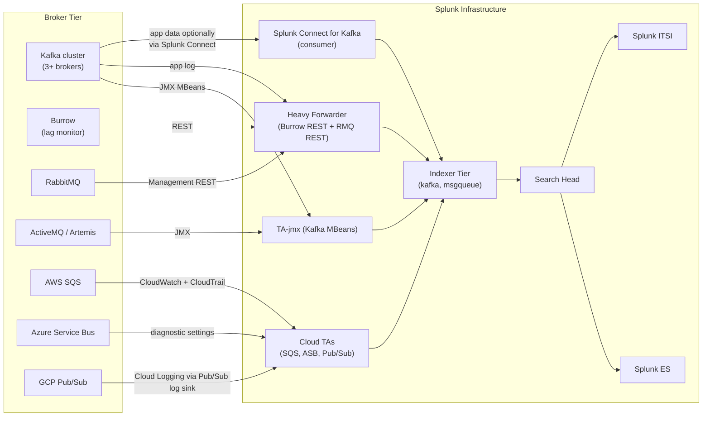

# Message Queues & Event Streaming Integration Guide

> The definitive guide to monitoring message brokers and event
> streaming with Splunk. 29 use cases covering Apache Kafka /
> Confluent, RabbitMQ, ActiveMQ / Artemis, AWS SQS / SNS / Kinesis,
> Azure Service Bus / Event Hub, GCP Pub/Sub, Redis Streams, NATS,
> and IBM MQ. Consumer lag, queue depth, dead-letter queue (DLQ)
> growth, broker availability, partition rebalances, throughput
> trending, schema registry health, and cross-product correlation
> with consuming applications.

---

## Table of Contents

- [Quick Start](#quick-start)
- [Overview](#overview)
- [Architecture and Data Flow](#architecture)
- [Prerequisites](#prerequisites)
- [Platform Coverage Matrix](#platform-matrix)
- [Apache Kafka / Confluent](#kafka)
- [RabbitMQ](#rabbitmq)
- [ActiveMQ / Artemis](#activemq)
- [AWS SQS / SNS / Kinesis](#aws-msg)
- [Azure Service Bus / Event Hub](#azure-msg)
- [GCP Pub/Sub](#gcp-msg)
- [Redis Streams, NATS, IBM MQ](#other-msg)
- [Field Dictionary (Cross-Vendor)](#field-dictionary)
- [Sample Events](#sample-events)
- [Splunk-Side Configuration](#splunk-config)
- [Cross-Product Correlation](#cross-product)
- [CIM Mapping Reference](#cim-mapping)
- [Compliance Mapping](#compliance)
- [Capacity Planning and Sizing](#sizing)
- [Recommended Dashboard Layouts](#dashboards)
- [ITSI Service Modeling](#itsi)
- [SOAR Playbook Examples](#soar)
- [Multi-Site / Multi-Region Strategy](#multi-site)
- [Security Hardening](#security-hardening)
- [Crawl / Walk / Run Roadmap](#roadmap)
- [Validation Checklist](#validation-checklist)
- [Known Limitations and Gaps](#known-limitations)
- [Troubleshooting](#troubleshooting)
- [FAQ](#faq)
- [Glossary](#glossary)
- [References](#references)
- [Contribution and Feedback](#contribution)

---

<a id="quick-start"></a>
## Quick Start — 30 Minutes to First Telemetry

### Apache Kafka (fastest)

1. Install [Splunk Connect for Kafka (Splunkbase 3862)](https://splunkbase.splunk.com/app/3862) on a Heavy Forwarder.
2. Enable Kafka JMX (every broker):

    ```bash
    # broker startup
    KAFKA_OPTS="$KAFKA_OPTS -Dcom.sun.management.jmxremote -Dcom.sun.management.jmxremote.port=9999"
    ```

3. Deploy [Burrow](https://github.com/linkedin/Burrow) for consumer lag monitoring:

    ```toml
    # burrow.toml
    [client-profile.local]
    client-id="burrow-lagmon"
    [cluster.prod]
    class-name="kafka"
    servers=["kafka-01:9092","kafka-02:9092","kafka-03:9092"]
    [storage.default]
    class-name="inmemory"
    [http-server.default]
    address=":8000"
    ```

4. Splunk HEC scripted input pulls Burrow JSON:

    ```ini
    [script:///opt/splunk/etc/apps/burrow_input/bin/burrow_input.sh]
    sourcetype = kafka:burrow
    index = kafka
    interval = 60
    ```

5. Validate: `index=kafka sourcetype="kafka:burrow" earliest=-15m | stats count by consumer_group`
6. Activate UC-8.3.1 (Consumer Lag).

### RabbitMQ

```bash
# Enable management plugin
rabbitmq-plugins enable rabbitmq_management

# Splunk REST polling
curl -u splunk:<pwd> http://rabbitmq01:15672/api/queues
```

### Activate crawl tier

UC-8.3.1 (Consumer Lag), UC-8.3.x (Queue depth), UC-8.3.x (DLQ growth), UC-8.3.x (Broker offline).

---

<a id="overview"></a>
## Overview

### Why monitor message queues

Message queues are the **circulatory system** of modern microservices. When they fail:

- Consumer lag → events backed up → user-facing latency
- DLQ growth → silent data loss
- Broker outage → entire pipeline halt
- Partition rebalance → temporary unavailability
- Quota exhaustion → producer rejection

### What this guide covers

| Platform | Use case fit |
|---------|------------|
| **Apache Kafka** | Open-source + Confluent Platform / Confluent Cloud |
| **RabbitMQ** | Erlang-based AMQP broker (CloudAMQP, on-prem) |
| **ActiveMQ / Artemis** | JMS-compliant broker (Apache, RedHat AMQ) |
| **AWS SQS / SNS** | AWS managed messaging (queues + topics) |
| **AWS Kinesis** | AWS managed streaming (data streams + Firehose) |
| **Azure Service Bus** | Microsoft AMQP-based broker |
| **Azure Event Hub** | Microsoft Kafka-protocol-compatible streaming |
| **GCP Pub/Sub** | Google managed pub/sub |
| **Redis Streams** | Redis-based stream (Redis 5+) |
| **NATS** | Cloud-native lightweight messaging |
| **IBM MQ** | Enterprise JMS broker |

### Domains covered

| Domain | Examples |
|--------|---------|
| **Throughput** | Producer / consumer messages per second |
| **Lag / Backlog** | Consumer group lag, queue depth, partition lag |
| **Availability** | Broker uptime, partition leader election |
| **Errors** | DLQ growth, producer errors, deserialization failures |
| **Capacity** | Disk usage, partition count, connection count |
| **Security** | ACL changes, auth failures, public topic exposure |

### What's NOT in scope

| Domain | Where to look |
|--------|---------------|
| **Producer/consumer app code** | [Application Servers Guide](application-servers.md) |
| **Container/K8s broker pods** | [Kubernetes Guide](kubernetes.md) |
| **Full E2E trace** | Splunk APM |

### What good looks like

| Dimension | Without integration | With full deployment |
|-----------|---------------------|----------------------|
| Consumer lag spike | Customer complains | Real-time alert per group |
| DLQ growth | Silent data loss | DLQ depth alarm + queueing analysis |
| Broker outage | Entire pipeline frozen | Pre-warning health checks + auto-failover |
| Schema drift (Confluent) | Deserialization storm | Schema Registry validation alerts |
| Partition rebalance | Temporary unavailability | Pre/post rebalance metrics + correlation |

---

<a id="architecture"></a>
## Architecture and Data Flow



---

<a id="prerequisites"></a>
## Prerequisites

| Item | Detail |
|------|--------|
| **Splunk version** | 9.0+ Enterprise or Cloud |
| **Splunk Connect for Kafka** | For Kafka topic data (optional) |
| **TA-jmx** | For Kafka / ActiveMQ JMX |
| **Burrow** | For Kafka consumer lag |
| **HEC token** | For HEC ingestion |
| **CIM 6.x** | Network_Sessions, Performance |

### Broker-side requirements

| Platform | Required |
|---------|----------|
| **Kafka** | JMX enabled, ACLs configured for read-only monitoring |
| **RabbitMQ** | Management plugin enabled |
| **ActiveMQ** | JMX enabled |
| **AWS SQS** | CloudWatch metrics enabled, CloudTrail enabled |
| **Azure Service Bus** | Diagnostic settings → Event Hub or Storage |
| **GCP Pub/Sub** | Cloud Logging + Cloud Monitoring |

---

<a id="platform-matrix"></a>
## Platform Coverage Matrix

| Platform | TA / Component | Splunkbase | Sourcetypes |
|---------|---------------|-----------|-------------|
| **Kafka (open + Confluent)** | Splunk Connect for Kafka | [3862](https://splunkbase.splunk.com/app/3862) | `kafka:server`, `kafka:burrow`, `kafka:jmx` |
| **RabbitMQ** | Custom REST input + Management plugin | n/a | `rabbitmq:management`, `rabbitmq:log` |
| **ActiveMQ / Artemis** | TA-jmx | [2647](https://splunkbase.splunk.com/app/2647) | `activemq:broker`, `artemis:broker` |
| **AWS SQS / SNS / Kinesis** | Splunk_TA_aws | [1876](https://splunkbase.splunk.com/app/1876) | `aws:sqs`, `aws:cloudtrail`, `aws:kinesis` |
| **Azure Service Bus / Event Hub** | Splunk_TA_microsoft-cloudservices | [3110](https://splunkbase.splunk.com/app/3110) | `azure:servicebus`, `azure:eventhub` |
| **GCP Pub/Sub** | Splunk_TA_google-cloudplatform | [3088](https://splunkbase.splunk.com/app/3088) | `google:gcp:pubsub` |

---

<a id="kafka"></a>
## Apache Kafka / Confluent

### Three monitoring layers

1. **JMX MBeans** — broker-internal metrics (request rate, partition health)
2. **Burrow** — consumer-group lag (best-of-breed)
3. **Splunk Connect for Kafka** — sink topic data into Splunk

### Layer 1 — JMX

```bash
# server.properties
JMX_PORT=9999
KAFKA_OPTS="-Dcom.sun.management.jmxremote.port=9999 \
    -Dcom.sun.management.jmxremote.authenticate=true \
    -Dcom.sun.management.jmxremote.password.file=/opt/kafka/jmx.password"
```

Configure TA-jmx to poll critical MBeans:

| MBean | Why |
|-------|-----|
| `kafka.server:type=ReplicaManager,name=UnderReplicatedPartitions` | Replica health |
| `kafka.server:type=BrokerTopicMetrics,name=MessagesInPerSec` | Throughput |
| `kafka.server:type=BrokerTopicMetrics,name=BytesInPerSec` | Bandwidth |
| `kafka.controller:type=KafkaController,name=ActiveControllerCount` | Controller health |
| `kafka.controller:type=KafkaController,name=OfflinePartitionsCount` | Critical alarm |
| `kafka.network:type=RequestMetrics,name=TotalTimeMs,request=*` | Latency |

### Layer 2 — Burrow consumer lag

[Burrow](https://github.com/linkedin/Burrow) is the de-facto standard for Kafka consumer lag. It:

- Polls Kafka for consumer group offsets
- Compares against partition log-end-offsets
- Computes per-group, per-topic, per-partition lag
- Provides `/v3/kafka/<cluster>/consumer/<group>/status` REST endpoint with health classification

```bash
# Run burrow as a sidecar
docker run -d --name burrow \
    -v /etc/burrow:/etc/burrow \
    -p 8000:8000 \
    linkedin/burrow:latest
```

### Splunk pulling Burrow REST

```bash
#!/bin/bash
# /opt/splunk/etc/apps/burrow_input/bin/burrow_input.sh
CLUSTERS=$(curl -s http://burrow:8000/v3/kafka)
for c in $(echo $CLUSTERS | jq -r '.clusters[]'); do
    GROUPS=$(curl -s http://burrow:8000/v3/kafka/$c/consumer)
    for g in $(echo $GROUPS | jq -r '.consumers[]'); do
        curl -s http://burrow:8000/v3/kafka/$c/consumer/$g/status
    done
done
```

```ini
[script:///opt/splunk/etc/apps/burrow_input/bin/burrow_input.sh]
sourcetype = kafka:burrow
index = kafka
interval = 60
```

### Layer 3 — Splunk Connect for Kafka (sink topic data)

```yaml
# Splunk Connect for Kafka — connect-distributed.properties
bootstrap.servers=kafka-01:9092,kafka-02:9092
group.id=splunk-sink-connector
key.converter=org.apache.kafka.connect.json.JsonConverter
value.converter=org.apache.kafka.connect.json.JsonConverter
key.converter.schemas.enable=false
value.converter.schemas.enable=false

# Splunk Sink Connector config
splunk.hec.uri=https://hec.splunk.example.com:8088
splunk.hec.token=<HEC token>
splunk.indexes=kafka_data
splunk.sourcetypes=kafka_topic
topics=app-events,user-events
```

### Sample SPL — UC-8.3.1 Consumer Lag

```spl
index=kafka sourcetype="kafka:burrow" earliest=-15m
| spath status.maxlag.current_lag output=current_lag
| spath status.partitions{}.topic output=topic
| spath status.partitions{}.partition output=partition
| spath status.partitions{}.start.lag output=part_lag
| stats max(current_lag) as max_lag, sum(part_lag) as total_lag by consumer_group, topic
| where max_lag > 10000
```

### Sample SPL — Under-replicated partitions

```spl
index=kafka sourcetype="jmx:kafka:replicas" earliest=-5m
| stats latest(UnderReplicatedPartitions) as under_repl by host
| where under_repl > 0
```

### Sample SPL — Confluent Schema Registry health

```spl
index=kafka sourcetype="confluent:schema:registry" earliest=-1h
| stats count by event, subject, version
| where event = "DELETE"
```

---

<a id="rabbitmq"></a>
## RabbitMQ

### Management plugin REST API

```bash
# Enable management plugin
rabbitmq-plugins enable rabbitmq_management

# REST endpoints
curl -u monitor:<pwd> http://rabbitmq01:15672/api/overview
curl -u monitor:<pwd> http://rabbitmq01:15672/api/queues
curl -u monitor:<pwd> http://rabbitmq01:15672/api/connections
curl -u monitor:<pwd> http://rabbitmq01:15672/api/channels
curl -u monitor:<pwd> http://rabbitmq01:15672/api/exchanges
curl -u monitor:<pwd> http://rabbitmq01:15672/api/nodes
```

### Splunk scripted input

```bash
#!/bin/bash
# /opt/splunk/etc/apps/rabbitmq_input/bin/rabbitmq_input.sh
RABBIT_HOSTS="rabbitmq01 rabbitmq02 rabbitmq03"
for h in $RABBIT_HOSTS; do
    curl -s -u $RABBIT_USER:$RABBIT_PASS http://$h:15672/api/queues | jq -c '.[]'
done
```

```ini
[script:///opt/splunk/etc/apps/rabbitmq_input/bin/rabbitmq_input.sh]
sourcetype = rabbitmq:management
index = rabbitmq
interval = 60
```

### Sample event

```json
{
    "name": "orders.queue",
    "vhost": "/",
    "messages": 12345,
    "messages_ready": 12300,
    "messages_unacknowledged": 45,
    "consumers": 3,
    "memory": 2456789,
    "state": "running",
    "policy": "ha-all"
}
```

### Sample SPL — RabbitMQ queue depth

```spl
index=rabbitmq sourcetype="rabbitmq:management"
| stats latest(messages) as queue_depth, latest(consumers) as consumers, latest(state) as state by name
| where queue_depth > 10000
| sort -queue_depth
```

### Sample SPL — Dead letter queue (DLQ) growth

```spl
index=rabbitmq sourcetype="rabbitmq:management" name="*.dlq" OR name="*-dlx"
| stats latest(messages) as dlq_depth by name
| where dlq_depth > 100
```

---

<a id="activemq"></a>
## ActiveMQ / Artemis

### JMX MBeans

| MBean | Purpose |
|-------|--------|
| `org.apache.activemq:type=Broker,brokerName=*,destinationType=Queue,destinationName=*` | Per-queue stats |
| `org.apache.activemq:type=Broker,brokerName=*` | Broker-level |
| `org.apache.activemq.artemis:broker=*,address=*,queue=*,subcomponent=queues,routing-type=*` | Artemis specific |

### TA-jmx config

```xml
<stanza name="activemq-queues" sourcetype="activemq:broker">
    <mbean objectName="org.apache.activemq:type=Broker,brokerName=*,destinationType=Queue,destinationName=*">
        <attribute objectName="QueueSize"/>
        <attribute objectName="EnqueueCount"/>
        <attribute objectName="DequeueCount"/>
        <attribute objectName="ConsumerCount"/>
        <attribute objectName="InFlightCount"/>
        <attribute objectName="ExpiredCount"/>
    </mbean>
</stanza>
```

---

<a id="aws-msg"></a>
## AWS SQS / SNS / Kinesis

### SQS via CloudWatch

```ini
# Splunk_TA_aws inputs.conf
[aws_cloudwatch://sqs-metrics]
aws_account = prod
sourcetype = aws:cloudwatch
index = aws_sqs
metric_namespace = AWS/SQS
metric_names = ApproximateNumberOfMessagesVisible,ApproximateAgeOfOldestMessage,NumberOfMessagesSent,NumberOfMessagesReceived,NumberOfMessagesDeleted
metric_dimensions = QueueName,*
period = 60
```

### SQS via CloudTrail (admin events)

```ini
[aws_cloudtrail://prod]
aws_account = prod
sourcetype = aws:cloudtrail
index = aws_sqs
# Filter to SQS events at search-time:
# index=aws_sqs eventSource="sqs.amazonaws.com"
```

### Sample SPL — SQS queue age (potential consumer issue)

```spl
index=aws_sqs sourcetype="aws:cloudwatch" metric_name="ApproximateAgeOfOldestMessage"
| stats max(value) as max_age_seconds by QueueName
| where max_age_seconds > 300
```

### Sample SPL — Kinesis iterator age (consumer lag analog)

```spl
index=aws_sqs sourcetype="aws:cloudwatch" metric_name="GetRecords.IteratorAgeMilliseconds"
| stats max(value) as max_iterator_age_ms by StreamName, ShardId
| where max_iterator_age_ms > 60000
```

---

<a id="azure-msg"></a>
## Azure Service Bus / Event Hub

### Azure Service Bus

```ini
# Splunk_TA_microsoft-cloudservices
[azure_eventhub://servicebus-diag]
event_hub_namespace = ehns-diag-prod
event_hub_name = servicebus-diag
sourcetype = azure:servicebus
index = azure_servicebus
```

### Azure Event Hub

```ini
[azure_eventhub://eventhub-metrics]
event_hub_namespace = ehns-metrics
event_hub_name = eventhub-metrics
sourcetype = azure:eventhub
index = azure_servicebus
```

### Sample SPL — Service Bus queue depth

```spl
index=azure_servicebus operationName="QueueLengthChanged"
| stats latest(properties.messageCount) as depth by resourceId
```

---

<a id="gcp-msg"></a>
## GCP Pub/Sub

Use the [GCP Guide](gcp.md) Pub/Sub log sink pattern. Specifically for Pub/Sub itself:

```bash
# Pub/Sub metrics → Cloud Monitoring → Splunk via Pub/Sub log sink
gcloud logging sinks create pubsub-monitoring-sink pubsub.googleapis.com/projects/<project>/topics/splunk-monitoring \
    --log-filter='resource.type="pubsub_topic" OR resource.type="pubsub_subscription"'
```

### Sample SPL — Pub/Sub subscription backlog

```spl
index=gcp resource.type=pubsub_subscription
| stats latest(jsonPayload.numUndeliveredMessages) as backlog by resource.labels.subscription_id
| where backlog > 10000
```

---

<a id="other-msg"></a>
## Redis Streams, NATS, IBM MQ

### Redis Streams

```bash
# Custom scripted input — XINFO + XLEN
redis-cli XINFO STREAM mystream
redis-cli XLEN mystream
redis-cli XPENDING mystream consumer-group
```

### NATS

```bash
# NATS server monitoring port (8222)
curl http://nats01:8222/varz
curl http://nats01:8222/connz
curl http://nats01:8222/subsz
curl http://nats01:8222/streamz
```

### IBM MQ

```bash
# IBM MQ — runmqsc DISPLAY commands
echo "DISPLAY QSTATUS(*) WHERE(QTYPE EQ LOCAL)" | runmqsc <QM>
```

Use Splunk Add-on for IBM MQ (community / IBM-provided) or scripted input.

---

<a id="field-dictionary"></a>
## Field Dictionary (Cross-Vendor)

| Field | Kafka | RabbitMQ | SQS | Azure SB | GCP Pub/Sub |
|-------|-------|----------|-----|----------|-------------|
| `topic_or_queue` | topic / consumer_group | name (queue) | QueueName | resourceId | subscription_id |
| `depth` | lag (consumer) | messages | ApproximateNumberOfMessagesVisible | messageCount | numUndeliveredMessages |
| `consumers` | n/a | consumers | (multiple) | (multiple) | (multiple) |
| `throughput` | MessagesInPerSec | message_stats.publish | NumberOfMessagesSent | (CloudWatch metric) | (Cloud Monitoring) |
| `dlq_depth` | n/a | name=*.dlq | DLQ separate queue | (separate) | (separate sub) |

---

<a id="sample-events"></a>
## Sample Events

(See per-platform sections.)

---

<a id="splunk-config"></a>
## Splunk-Side Configuration

### Index strategy

```ini
[kafka]
homePath = $SPLUNK_DB/kafka/db
maxDataSize = auto_high_volume
frozenTimePeriodInSecs = 7776000

[msgqueue]
homePath = $SPLUNK_DB/msgqueue/db
maxDataSize = auto_high_volume
frozenTimePeriodInSecs = 7776000
```

---

<a id="cross-product"></a>
## Cross-Product Correlation

### Queue + Consumer App (lag impact on app)

```spl
(index=kafka sourcetype="kafka:burrow" earliest=-1h)
OR (index=jvm sourcetype="jmx:memory")
| stats values(current_lag) as lag, values(heap_pct) as heap by host, _time
```

### Queue + DB (slow consumer due to DB)

```spl
(index=kafka sourcetype="kafka:burrow" current_lag>10000)
OR (index=database sourcetype="mssql:query" duration_ms>1000)
| transaction service maxspan=10s
```

### Cloud queue + IAM (unauthorized queue access)

```spl
(index=aws_sqs sourcetype="aws:cloudtrail" eventSource="sqs.amazonaws.com")
| stats count by eventName, userIdentity.arn
```

---

<a id="cim-mapping"></a>
## CIM Mapping Reference

| CIM model | Sourcetype | Auto-mapped? |
|-----------|-----------|--------------|
| **Performance** | `jmx:kafka:*`, `kafka:burrow` | Partial (custom mapping) |
| **Change** | `*:audit`, `aws:cloudtrail` (sqs) | Yes |

---

<a id="compliance"></a>
## Compliance Mapping

### NIST 800-53

| Control | Coverage |
|---------|----------|
| **AU-2/12** Audit | Broker audit + admin events |
| **SC-7** Boundary protection | ACL + auth events |
| **SI-4** System monitoring | Lag, depth, broker health |

### PCI-DSS

| Requirement | Coverage |
|-------------|----------|
| **10.2.x** Audit trails | Producer/consumer auth, admin actions |
| **6.4.x** Change control | Topic/queue config audit |

### SOC 2

| TSC | Coverage |
|-----|----------|
| **CC6.1** Logical access | Broker auth + ACL |
| **CC7.2** System monitoring | Lag, depth, broker health |

---

<a id="sizing"></a>
## Capacity Planning and Sizing

### Per-source ingest

| Source | Daily ingest |
|--------|-------------|
| Kafka JMX (3 brokers, 30 metrics, 60s) | ~50 MB |
| Burrow REST (60s, 100 groups) | ~100 MB |
| RabbitMQ REST (60s, 50 queues) | ~80 MB |
| SQS CloudWatch (1-min, 100 queues) | ~50 MB |

### Retention

| Data | Retention | Rationale |
|------|-----------|-----------|
| Lag / depth metrics | 90 days | Trending |
| Broker logs | 90 days | Investigation |
| Audit (admin actions) | 1 year+ | Compliance |
| Schema Registry events | 1 year+ | Audit |

---

<a id="dashboards"></a>
## Recommended Dashboard Layouts

### Crawl — "Message Queue Health"

```
+---------------------+---------------------+
| TOTAL CONSUMER LAG (all groups, top 10)    |
+---------------------+---------------------+
| QUEUE DEPTH BY QUEUE/TOPIC                 |
+---------------------+---------------------+
| BROKER ONLINE / OFFLINE                    |
+---------------------+---------------------+
| DLQ DEPTH BY DLQ                           |
+---------------------+---------------------+
```

### Walk — "Performance & Capacity"

```
+---------------------+---------------------+
| PRODUCER / CONSUMER THROUGHPUT TREND       |
+---------------------+---------------------+
| PARTITION REBALANCE EVENTS                 |
+---------------------+---------------------+
| TOP CONSUMERS BY LAG                       |
+---------------------+---------------------+
| BROKER DISK USAGE                          |
+---------------------+---------------------+
```

### Run — "Audit & Security"

```
+---------------------+---------------------+
| ADMIN OPERATIONS (topic create/delete)     |
+---------------------+---------------------+
| ACL CHANGES                                |
+---------------------+---------------------+
| AUTH FAILURES                              |
+---------------------+---------------------+
| SCHEMA REGISTRY EVOLUTION (Confluent)      |
+---------------------+---------------------+
```

---

<a id="itsi"></a>
## ITSI Service Modeling

### Service hierarchy

```
Message Queue Tier
├── Per-Cluster Brokers
│   ├── Kafka prod cluster (3 brokers)
│   ├── Kafka staging cluster
│   └── RabbitMQ HA cluster
├── Per-Topic / Per-Queue
│   ├── orders.events (topic)
│   ├── payment.queue (queue)
│   └── ...
└── Cloud Queues
    ├── SQS queues
    └── Service Bus queues
```

### Recommended KPIs

| KPI | Source | Threshold |
|-----|--------|-----------|
| Consumer lag (max) | Burrow | Static (warn 10K, page 100K) |
| Queue depth | RabbitMQ / SQS / ASB | Adaptive |
| Under-replicated partitions | Kafka JMX | Static (warn > 0) |
| Broker uptime | JMX heartbeat | Static (page if missing) |
| DLQ growth rate | DLQ depth delta | Static (page > 0) |
| Producer error rate | broker log | Static (warn > 1%) |

---

<a id="soar"></a>
## SOAR Playbook Examples

### Playbook 1: Consumer Lag Spike

**Trigger:** UC-8.3.1 — lag > 100K for any group.

```
1. RECEIVE alert (consumer_group, topic, max_lag)
2. CHECK consumer service health (cross-product cat 8.2)
3. AUTO-SCALE consumer pods if K8s
4. PAGE consumer-app team if not auto-resolved
5. CREATE Sev-2 ticket
```

### Playbook 2: DLQ Growth

**Trigger:** DLQ depth > 100.

```
1. RECEIVE alert (dlq_name, depth, top_error_types)
2. SAMPLE DLQ messages (peek not consume)
3. NOTIFY app team for triage
4. CREATE Sev-3 ticket
```

### Playbook 3: Broker Offline

**Trigger:** Broker missing > 1 min from JMX heartbeat.

```
1. RECEIVE alert (broker_id, last_seen)
2. CHECK partition leader election in progress
3. AUTO-FAILOVER consumers to surviving brokers
4. PAGE Kafka admin team
5. CREATE Sev-1 if multi-broker outage
```

---

<a id="multi-site"></a>
## Multi-Site / Multi-Region Strategy

For distributed queue infrastructure:

- **Per-region indexes** (`kafka_emea`, `kafka_amer`, `kafka_apac`)
- **MirrorMaker / Kafka Connect** lag tracking for cross-cluster replication
- **Federated ITSI services** for global queue visibility
- **Per-region Burrow** with central Splunk aggregation

---

<a id="security-hardening"></a>
## Security Hardening

- Read-only auth for monitoring (Kafka SASL/SCRAM, RabbitMQ user with `monitoring` tag)
- TLS for all REST + JMX connections
- API tokens rotated 90-day
- Audit log forwarding immutable
- Field-level RBAC for sensitive topic / queue names

---

<a id="roadmap"></a>
## Crawl / Walk / Run Roadmap

### Crawl (Week 1–2)

1. Stand up Burrow for Kafka
2. Splunk Connect for Kafka or scripted REST input
3. Health dashboard
4. Lag + depth alerts

### Walk (Week 3–6)

1. JMX coverage for Kafka brokers
2. RabbitMQ / ActiveMQ on-prem onboarding
3. Cloud queue (SQS/ASB/Pub/Sub) ingestion
4. ITSI per-queue service

### Run (Month 2+)

1. Full audit ingestion (admin actions, ACL)
2. Schema Registry integration (Confluent)
3. SOAR playbooks
4. DLQ analytics + replay

---

<a id="validation-checklist"></a>
## Validation Checklist

### Day 1

- [ ] First broker / queue connected
- [ ] Health dashboard live
- [ ] Lag alert wired

### Day 7

- [ ] All brokers + queues onboarded
- [ ] CIM mapping done
- [ ] Threshold alerts wired

### Day 30

- [ ] Walk-tier UCs deployed
- [ ] ITSI services live
- [ ] Cross-product correlation

### Day 90

- [ ] Run-tier UCs deployed
- [ ] SOAR playbooks live
- [ ] Compliance audit reports

---

<a id="known-limitations"></a>
## Known Limitations and Gaps

| Limitation | Impact | Workaround |
|------------|--------|------------|
| **Burrow not Splunk-built** | Self-managed | Containerise + monitor health |
| **JMX over WAN** | Latency / firewalls | Use OTel / Prometheus exporter alternative |
| **Cloud queue metrics 1-min granularity** | Real-time gap | Combine with CloudTrail Data Events |
| **Schema Registry no native TA** | Custom integration | Use kafka:connect logs or REST polling |
| **DLQ pattern non-standard** | Per-platform variations | Custom convention enforcement |

---

<a id="troubleshooting"></a>
## Troubleshooting

### Burrow not seeing groups

- Check Burrow can reach all brokers on 9092
- Verify Burrow has read ACL on `__consumer_offsets`

### JMX connection refused

```bash
# Test
jconsole kafka01:9999
# Or
java -jar jmxquery.jar kafka01:9999
```

### RabbitMQ REST returning 401

- Verify monitoring user created: `rabbitmqctl add_user monitor <pwd>` and tag: `set_user_tags monitor monitoring`

### CloudWatch metrics stale

- Increase polling frequency in Splunk_TA_aws inputs
- Check IAM role has `cloudwatch:GetMetricStatistics`

---

<a id="faq"></a>
## FAQ

**Q: Should I use Burrow or Confluent's built-in lag metrics?**
A: Burrow — it's more accurate, framework-agnostic, and has health classification. Confluent metrics are good for self-managed clusters.

**Q: Can I send Kafka topic data into Splunk?**
A: Yes — Splunk Connect for Kafka acts as a Kafka consumer that writes to Splunk HEC.

**Q: How do I detect a stuck consumer?**
A: Lag delta > 0 sustained AND consumer count > 0 = consumer is processing too slowly.

**Q: How do I handle high-volume topic ingestion?**
A: Don't ingest topic data into Splunk by default — only key audit/event topics. Use Burrow for lag.

**Q: Can I correlate queue depth with downstream service health?**
A: Yes — combine queue depth (cat 8.3) + consumer service health (cat 8.2) + DB health (cat 7.1).

**Q: What's the best broker outage detection?**
A: JMX heartbeat OR Burrow `error` cluster status OR controller count != 1.

---

<a id="glossary"></a>
## Glossary

| Term | Definition |
|------|-----------|
| **Broker** | Kafka cluster node |
| **Topic** | Kafka named log of messages |
| **Partition** | Kafka topic shard |
| **Consumer Group** | Kafka group sharing partition consumption |
| **Lag** | Messages in topic but not yet consumed |
| **DLQ** | Dead Letter Queue — failed-message graveyard |
| **AMQP** | Advanced Message Queuing Protocol (RabbitMQ etc.) |
| **JMS** | Java Messaging Service (ActiveMQ etc.) |
| **MirrorMaker** | Kafka cross-cluster replication |
| **Schema Registry** | Confluent's central schema store |
| **ZooKeeper / KRaft** | Kafka coordination service (legacy ZK, modern KRaft) |

---

<a id="references"></a>
## References

- [Splunk Connect for Kafka (Splunkbase 3862)](https://splunkbase.splunk.com/app/3862)
- [Burrow on GitHub](https://github.com/linkedin/Burrow)
- [Splunk Add-on for AWS (Splunkbase 1876)](https://splunkbase.splunk.com/app/1876)
- [Splunk Add-on for Microsoft Cloud Services (Splunkbase 3110)](https://splunkbase.splunk.com/app/3110)
- [Splunk Add-on for Google Cloud Platform (Splunkbase 3088)](https://splunkbase.splunk.com/app/3088)
- [Apache Kafka monitoring docs](https://kafka.apache.org/documentation/#monitoring)
- [RabbitMQ Management plugin docs](https://www.rabbitmq.com/management.html)

---

<a id="contribution"></a>
## Contribution and Feedback

Part of the [Splunk Monitoring Use Cases](https://github.com/fenre/splunk-monitoring-use-cases) project. [Open an issue](https://github.com/fenre/splunk-monitoring-use-cases/issues/new).

---

*Last updated: 2026-05-09. Covers Splunk Connect for Kafka 2.x, Splunk_TA_aws 7.x, Splunk_TA_microsoft-cloudservices 5.x.*

---

<!-- BEGIN-AUTOGENERATED-SOURCES -->

## References

*Auto-generated by `scripts/generate_doc_references.py` from `data/source-references.json` and `data/source-mappings.json`. Edit those files (or the document body) to change citations; this footer is rewritten on every run.*

### Primary sources

<a id="ref-1"></a>**[1]** Splunk Inc. (2026). *Splunk Common Information Model Add-on Manual*. Splunk LLC, a Cisco company. Retrieved May 11, 2026, from https://docs.splunk.com/Documentation/CIM

### Supporting sources

<a id="ref-2"></a>**[2]** American Institute of Certified Public Accountants. (2017). *Trust Services Criteria (2017) for Security, Availability, Processing Integrity, Confidentiality, and Privacy*. AICPA & CIMA. SOC 2 / TSP Section 100. https://www.aicpa-cima.com/topic/audit-assurance/soc-suite-of-services

<a id="ref-3"></a>**[3]** Gerhards, R. (2009, March). *The Syslog Protocol*. Internet Engineering Task Force. RFC 5424. https://www.rfc-editor.org/rfc/rfc5424

<a id="ref-4"></a>**[4]** International Organization for Standardization. (2022). *ISO/IEC 27001:2022 — Information security, cybersecurity and privacy protection — Information security management systems — Requirements*. ISO/IEC. ISO/IEC 27001:2022. https://www.iso.org/standard/27001

<a id="ref-5"></a>**[5]** National Institute of Standards and Technology. (2020). *Security and Privacy Controls for Information Systems and Organizations* (Revision 5). U.S. Department of Commerce. NIST SP 800-53 Rev. 5. https://csrc.nist.gov/pubs/sp/800/53/r5/upd1/final

<a id="ref-6"></a>**[6]** OpenTelemetry Authors. (2026). *OpenTelemetry Specification*. Cloud Native Computing Foundation. Retrieved May 11, 2026, from https://opentelemetry.io/docs/specs/otel/

<a id="ref-7"></a>**[7]** Splunk Inc. (2026). *Splunk Distribution of the OpenTelemetry Collector*. Splunk LLC, a Cisco company. Retrieved May 11, 2026, from https://docs.splunk.com/observability/en/gdi/opentelemetry/opentelemetry.html

<a id="ref-8"></a>**[8]** Splunk Inc. (2026). *Splunk Infrastructure Monitoring Documentation*. Splunk LLC, a Cisco company. Retrieved May 11, 2026, from https://docs.splunk.com/observability/en/infrastructure/intro-to-infrastructure.html

<a id="ref-9"></a>**[9]** Splunk Inc. (2026). *Splunk IT Service Intelligence Administration Manual*. Splunk LLC, a Cisco company. Retrieved May 11, 2026, from https://docs.splunk.com/Documentation/ITSI

<a id="ref-10"></a>**[10]** Splunk Inc. (2026). *Splunk Observability Cloud Documentation*. Splunk LLC, a Cisco company. Retrieved May 11, 2026, from https://docs.splunk.com/observability/en/

<a id="ref-11"></a>**[11]** U.S. Department of Health & Human Services. (2002). *HIPAA Privacy Rule (45 CFR Parts 160 and 164, Subparts A and E)*. Office for Civil Rights, HHS. 45 CFR 160, 164. https://www.hhs.gov/hipaa/for-professionals/privacy/index.html

<a id="ref-12"></a>**[12]** U.S. Department of Health & Human Services. (2013). *HIPAA Security Rule (45 CFR Parts 160 and 164, Subparts A and C)*. Office for Civil Rights, HHS. 45 CFR 160, 164. https://www.hhs.gov/hipaa/for-professionals/security/index.html

<details>
<summary>Additional online sources cited in the document body (10)</summary>

<a id="ref-13"></a>**[13]** splunkbase.splunk.com. *Splunk Connect for Kafka (Splunkbase 3862)*. Retrieved May 11, 2026, from https://splunkbase.splunk.com/app/3862

<a id="ref-14"></a>**[14]** github.com. *Burrow*. Retrieved May 11, 2026, from https://github.com/linkedin/Burrow

<a id="ref-15"></a>**[15]** splunkbase.splunk.com. *Splunkbase app #2647*. Retrieved May 11, 2026, from https://splunkbase.splunk.com/app/2647

<a id="ref-16"></a>**[16]** splunkbase.splunk.com. *Splunkbase app #1876*. Retrieved May 11, 2026, from https://splunkbase.splunk.com/app/1876

<a id="ref-17"></a>**[17]** splunkbase.splunk.com. *Splunkbase app #3110*. Retrieved May 11, 2026, from https://splunkbase.splunk.com/app/3110

<a id="ref-18"></a>**[18]** splunkbase.splunk.com. *Splunkbase app #3088*. Retrieved May 11, 2026, from https://splunkbase.splunk.com/app/3088

<a id="ref-19"></a>**[19]** kafka.apache.org. *Apache Kafka monitoring docs*. Retrieved May 11, 2026, from https://kafka.apache.org/documentation/#monitoring

<a id="ref-20"></a>**[20]** rabbitmq.com. *RabbitMQ Management plugin docs*. Retrieved May 11, 2026, from https://www.rabbitmq.com/management.html

<a id="ref-21"></a>**[21]** github.com. *Splunk Monitoring Use Cases*. Retrieved May 11, 2026, from https://github.com/fenre/splunk-monitoring-use-cases

<a id="ref-22"></a>**[22]** github.com. *Open an issue*. Retrieved May 11, 2026, from https://github.com/fenre/splunk-monitoring-use-cases/issues/new

</details>

### Related repository documents

- [`docs/guides/application-servers.md`](application-servers.md)
- [`docs/guides/gcp.md`](gcp.md)
- [`docs/guides/kubernetes.md`](kubernetes.md)

### Cited by

- [`docs/guides/application-servers.md`](application-servers.md)

<!-- END-AUTOGENERATED-SOURCES -->
