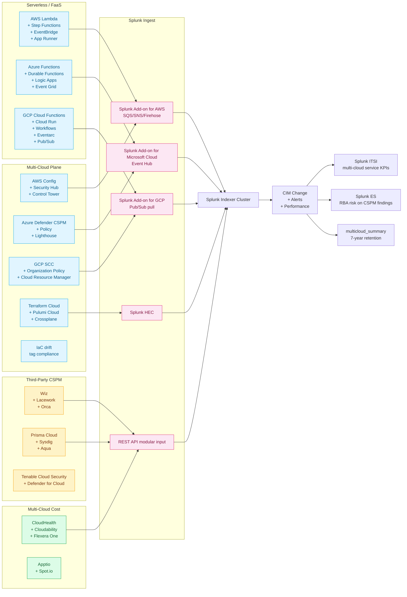

# Multi-Cloud, Cloud Management & Serverless / FaaS Integration Guide

> Operational, security, financial, and compliance monitoring for the
> **multi-cloud control plane** — Terraform / Crossplane / Pulumi IaC,
> AWS Config / Azure Defender CSPM / Google SCC posture, multi-cloud
> identity federation, third-party CSPMs (Wiz, Lacework, Orca, Prisma
> Cloud, Sysdig, Aqua, Tenable), CloudHealth / Cloudability / Flexera
> chargeback (cat 4.4) — and the **serverless / FaaS plane** —
> AWS Lambda, Step Functions, EventBridge, App Runner; Azure
> Functions / Durable Functions / Logic Apps / Event Grid; GCP Cloud
> Functions (1st + 2nd gen), Cloud Run, Workflows, Eventarc, Pub/Sub
> (cat 4.5) — plus **cloud trending** (cat 4.6, executive scorecards
> across providers). Companion guide to `aws.md` (cat 4.1),
> `azure.md` (cat 4.2), `gcp.md` (cat 4.3), `kubernetes.md` (cat 3.2),
> `container-platforms-docker-openshift.md` (cat 3.1, 3.3-3.6),
> `finops-cost-capacity.md` (cat 20), and `devops-cicd.md` (cat 12).

## Table of Contents

- [Quick Start — From Zero to First Multi-Cloud Dashboard](#quick-start--from-zero-to-first-multi-cloud-dashboard)
- [Overview](#overview)
- [Architecture and Data Flow](#architecture-and-data-flow)
- [Prerequisites](#prerequisites)
- [Domain 1 — Multi-Cloud & Cloud Management (cat 4.4, 32 UCs)](#domain-1--multi-cloud--cloud-management-cat-44-32-ucs)
- [Domain 2 — Serverless & FaaS (cat 4.5, 15 UCs)](#domain-2--serverless--faas-cat-45-15-ucs)
- [Domain 3 — Cloud Infrastructure Trending (cat 4.6, 6 UCs)](#domain-3--cloud-infrastructure-trending-cat-46-6-ucs)
- [Sizing and Capacity Planning](#sizing-and-capacity-planning)
- [Compliance and Audit Evidence Pack](#compliance-and-audit-evidence-pack)
- [Crawl / Walk / Run Roadmap](#crawl--walk--run-roadmap)
- [Dashboards](#dashboards)
- [SPL Examples](#spl-examples)
- [Troubleshooting](#troubleshooting)
- [SOAR Playbooks](#soar-playbooks)
- [Cross-Product Integration](#cross-product-integration)

## Quick Start — From Zero to First Multi-Cloud Dashboard

### Day 1: Inventory cloud providers and posture sources

| Layer | Common products |
|---|---|
| IaC + drift | Terraform Cloud / Enterprise, Pulumi Cloud, Crossplane, AWS Service Catalog, Azure Blueprints |
| Cloud-native CSPM | AWS Config + Security Hub, Azure Defender for Cloud + Policy, Google SCC + Organization Policy |
| Third-party CSPM | Wiz, Lacework, Orca, Prisma Cloud, Sysdig Secure, Aqua, Tenable Cloud Security |
| Multi-cloud cost | CloudHealth, Cloudability, Flexera One, Apptio, Spot.io |
| Serverless / FaaS | AWS Lambda + Step Functions + EventBridge; Azure Functions + Durable Functions + Logic Apps + Event Grid; GCP Cloud Functions + Cloud Run + Workflows + Eventarc + Pub/Sub |

### Day 2: Stand up indexes

```ini
[multicloud]
homePath = $SPLUNK_DB/multicloud/db
coldPath = $SPLUNK_DB/multicloud/colddb
thawedPath = $SPLUNK_DB/multicloud/thaweddb
maxDataSize = auto_high_volume
frozenTimePeriodInSecs = 31536000

[multicloud_summary]
homePath = $SPLUNK_DB/multicloud_summary/db
coldPath = $SPLUNK_DB/multicloud_summary/colddb
thawedPath = $SPLUNK_DB/multicloud_summary/thaweddb
maxDataSize = auto
frozenTimePeriodInSecs = 220752000

[cspm]
homePath = $SPLUNK_DB/cspm/db
coldPath = $SPLUNK_DB/cspm/colddb
thawedPath = $SPLUNK_DB/cspm/thaweddb
maxDataSize = auto_high_volume
frozenTimePeriodInSecs = 31536000

[serverless]
homePath = $SPLUNK_DB/serverless/db
coldPath = $SPLUNK_DB/serverless/colddb
thawedPath = $SPLUNK_DB/serverless/thaweddb
maxDataSize = auto_high_volume
frozenTimePeriodInSecs = 31536000

[terraform_audit]
homePath = $SPLUNK_DB/terraform_audit/db
coldPath = $SPLUNK_DB/terraform_audit/colddb
thawedPath = $SPLUNK_DB/terraform_audit/thaweddb
maxDataSize = auto
frozenTimePeriodInSecs = 220752000
```

### Day 3: Splunk Add-on for AWS — Lambda + Config + Security Hub

```ini
[aws_lambda_invocations]
disabled = 0
account = aws-prod
aws_account = aws-prod
aws_region = us-east-1,eu-west-1,ap-southeast-1
metric_dimensions = FunctionName
metric_namespace = AWS/Lambda
metric_names = Invocations,Errors,Throttles,Duration,IteratorAge,ConcurrentExecutions,ProvisionedConcurrencyInvocations
period = 60
sourcetype = aws:cloudwatch
index = serverless

[aws_security_hub]
disabled = 0
account = aws-prod
aws_account = aws-prod
aws_region = us-east-1
sourcetype = aws:securityhub:finding
index = cspm

[aws_config]
disabled = 0
account = aws-prod
sourcetype = aws:config
index = cspm
```

### Day 4: Splunk Add-on for Microsoft Cloud Services — Functions + Defender CSPM

```ini
[azure_event_hub://azure-functions]
event_hub_namespace = mc-events.servicebus.windows.net
event_hub_name = azure-monitor
consumer_group = splunk
sourcetype = azure:functions:invocation
index = serverless

[azure_defender_for_cloud]
sourcetype = azure:defender:cspm
index = cspm
polling_interval = 600
```

### Day 5: Splunk Add-on for Google Cloud Platform — Cloud Functions + SCC

```ini
[google:cloud:audit://multi-project]
project_ids = mc-prod,mc-stg
credentials_name = gcp-svcacc
sinks = monitoring,logging,scc
sourcetype = google:cloud:audit
index = aws

[google:cloud:scc://findings]
sourcetype = google:cloud:scc:finding
index = cspm
```

### Day 6: Terraform Cloud audit log (HEC)

Terraform Cloud → Settings → Audit log streaming:

| Field | Value |
|---|---|
| Destination | HTTP endpoint |
| URL | `https://hec.splunk.example.com:8088/services/collector/event` |
| Authentication header | `Splunk <HEC_TOKEN>` |
| Source | `terraform_cloud` |
| Sourcetype | `terraform:cloud:audit` |
| Index | `terraform_audit` |

### Day 7: First three dashboards

- Multi-cloud CSPM finding distribution (UC-4.4.7)
- Lambda invocation errors (UC-4.5.1)
- Cloud trending — resource counts (UC-4.6.1)

## Overview

### Why multi-cloud monitoring matters

The world has settled on multi-cloud as the default — 89% of large
enterprises run workloads on AWS, Azure, AND GCP simultaneously per
the 2025 FinOps Foundation State of FinOps. The monitoring problem is
that each provider exposes different APIs, different finding formats
(ASFF, Defender JSON, SCC SourceProperties), and different IAM models.
Splunk is uniquely positioned to consolidate this into a single
operational, security, and financial pane of glass.

For SOC 2<sup class="ref">[<a href="#ref-3">3</a>]</sup> CC6.6 and ISO 27017 audits, the auditor wants **one place
that demonstrates posture across all clouds with the same controls,
the same disposition workflow, and the same evidence retention**.
Splunk + this guide is that one place.

### Why serverless deserves its own treatment

Serverless / FaaS flips the operational model: there is no server to
SSH into, no log file to tail, and metrics live in the cloud
provider's CloudWatch / Azure Monitor<sup class="ref">[<a href="#ref-8">8</a>]</sup> / Cloud Monitoring service.
You cannot use traditional monitoring approaches. The only viable
pattern is **CloudWatch / Azure Monitor / Cloud Monitoring → Splunk
Add-on → Splunk index → CIM-aligned dashboards**. This guide
documents that pattern in detail.

For PCI DSS 4.0 §6.4 and §10, serverless functions in payment paths
must produce the same audit-log evidence that traditional EC2 / VM
workloads produce. This is a recurring audit finding — most teams
forget that DLQ messages contain payment data and fail §3.4.

### Why cloud trending (cat 4.6) is its own subdomain

Trending dashboards roll up the operational and security signals from
4.4 and 4.5 into the executive layer (board, CFO, CISO, CIO scorecards).
Different audience, different cadence, different SLA — and different
data lifecycle (long-term, summary-indexed, never deleted before
fiscal-year close).

### Domains covered

| Sub | Name | UCs | Highlight |
|---|---|---|---|
| 4.4 | Multi-Cloud & Cloud Management | 32 | Terraform drift + multi-cloud CSPM + tagging |
| 4.5 | Serverless & FaaS | 15 | Lambda + Functions + Cloud Run + DLQ + Step Functions |
| 4.6 | Cloud Infrastructure Trending | 6 | Executive scorecards across providers |

### What "good" looks like

| KPI | Healthy target | Source |
|---|---|---|
| Terraform drift detection (24h) | 100% of state files reconciled | Terraform Cloud / Pulumi |
| Multi-cloud tag policy compliance | > 99% of resources tagged | AWS Config / Azure Policy / GCP Org Policy |
| CSPM critical-finding remediation MTTR | < 24h | CSPM platform |
| Lambda error rate | < 0.1% per function per 5-min window | CloudWatch Lambda |
| Lambda cold-start ratio | < 5% (or document acceptable threshold) | CloudWatch Lambda |
| DLQ message rate | 0 messages older than 1h | CloudWatch / Service Bus / Pub/Sub |
| Step Functions execution failure rate | < 0.5% | CloudWatch Step Functions |

## Architecture and Data Flow



### Core principles

1. **Single index per provider, single sourcetype namespace per data
   family.** Don't mix CloudTrail with CSPM findings even if from the
   same provider — the field set, retention class, and access-control
   profile differ.
2. **CSPM findings always go to a 7-year retention class.** SOC 2
   ISO 27001 PCI DSS HIPAA<sup class="ref">[<a href="#ref-15">15</a>]</sup> NIS2<sup class="ref">[<a href="#ref-4">4</a>]</sup> DORA<sup class="ref">[<a href="#ref-6">6</a>]</sup> evidence retention all converge
   on 7 years for security-control evidence.
3. **Serverless metrics use 60-second granularity, not 5-minute.**
   Lambda cold-start signal is invisible at 5-minute aggregation.
4. **Lambda DLQ messages are PII.** Treat the DLQ index like a
   privileged-data store with separate ACLs.
5. **Terraform Cloud audit logs go to a separate index from posture.**
   Terraform audit is privileged-action data (who ran apply, with what
   variables) — the access-control profile is different from posture.
6. **Multi-cloud tag normalisation happens at search time.** AWS uses
   `tag.X`, Azure uses `tags.X`, GCP uses `labels.X`. Normalise via a
   `eval` chain in the SPL or a lookup-driven calculated field.

## Prerequisites

### Pre-deployment checklist

- [ ] AWS account list including Organizations master + member
  account IDs (for IAM Identity Center / Control Tower)
- [ ] Azure tenant + subscription IDs + Lighthouse delegations
- [ ] GCP organization + project IDs + Cloud Resource Manager hierarchy
- [ ] AWS Config enabled in all regions, recording all supported
  resource types
- [ ] AWS Security Hub enabled in all regions, AWS Foundational
  Security Best Practices + CIS AWS Foundations Benchmark v2.x
  standards subscribed
- [ ] Azure Defender for Cloud enabled with Defender CSPM tier (or
  Foundational at minimum)
- [ ] Google Security Command Center enabled at Premium tier
- [ ] Terraform Cloud audit-log streaming HEC URL configured
- [ ] Third-party CSPM REST API service accounts with read-only scope
- [ ] CloudHealth / Cloudability / Flexera REST API credentials with
  read-only scope
- [ ] CIM Change + Alerts + Performance data models accelerated

### Splunk components used

- **Splunk Enterprise / Cloud**
- **Splunk ES** — RBA risk objects from CSPM findings; ESCU multi-cloud
  analytic stories
- **Splunk SOAR** — auto-remediate CSPM findings (e.g., remove
  publicly-readable S3 buckets, block 0.0.0.0/0 SG rules), DLQ
  message replay automation
- **Splunk ITSI** — multi-cloud service health KPIs
- **MLTK** — anomaly detection on Lambda invocation rate, CSPM
  finding velocity, multi-cloud cost trending

## Domain 1 — Multi-Cloud & Cloud Management (cat 4.4, 32 UCs)

### Highlight UCs

- **UC-4.4.1** — Terraform Drift Detection
- **UC-4.4.7** — Multi-Cloud CSPM Finding Distribution by Provider /
  Service / Severity
- **UC-4.4.10** — Cloud API Rate Limit and Throttling (429) Trends
- **UC-4.4.11** — Cloud Encryption and Key Rotation Compliance
- **UC-4.4.12** — Multi-Cloud Identity and Access Anomalies
- **UC-4.4.13** — Cloud Provider Status and Incident Correlation
- **UC-4.4.14** — Cloud Trail and Diagnostic Logging Gaps
- **UC-4.4.20** — Multi-Cloud Tag Policy Compliance
- **UC-4.4.32** — Cross-Cloud Identity Federation Audit (OIDC + WIF)

### Configuration — Terraform Cloud audit-log streaming

```bash
# Configure via Terraform Cloud API
curl -X POST "https://app.terraform.io/api/v2/organizations/<ORG>/audit-trail-streaming-configurations" \
  -H "Authorization: Bearer $TFC_TOKEN" \
  -H "Content-Type: application/vnd.api+json" \
  --data '{
    "data": {
      "type": "audit-trail-streaming-configurations",
      "attributes": {
        "destination-url": "https://hec.splunk.example.com:8088/services/collector/event",
        "authorization-header": "Splunk '"$HEC_TOKEN"'",
        "format": "json"
      }
    }
  }'
```

### Configuration — AWS Security Hub finding aggregator

Enable the cross-region finding aggregator in AWS Security Hub. The
Splunk Add-on for AWS consumes findings via SQS subscribed to the
EventBridge rule that fires on `ASFF` events.

```bash
# CLI: subscribe Splunk SQS queue to Security Hub findings
aws events put-rule --name security-hub-findings-to-splunk \
  --event-pattern '{"source": ["aws.securityhub"], "detail-type": ["Security Hub Findings - Imported"]}'

aws events put-targets --rule security-hub-findings-to-splunk \
  --targets "Id"="1","Arn"="arn:aws:sqs:us-east-1:123456789012:splunk-securityhub-findings"
```

### Configuration — Wiz REST integration

```ini
[REST://wiz_issues]
endpoint = https://api.wiz.io/api/v1/issues
auth_type = oauth2
oauth2_token_endpoint = https://auth.app.wiz.io/oauth/token
client_id = <WIZ_CLIENT_ID>
client_secret = <WIZ_CLIENT_SECRET>
audience = wiz-api
polling_interval = 600
sourcetype = wiz:issue
index = cspm
```

### Configuration — Multi-cloud tag policy compliance lookup

Maintain a lookup of mandatory tags + canonical tag names:

```csv
canonical_tag,aws_tag,azure_tag,gcp_label
business_unit,BusinessUnit,businessUnit,business_unit
cost_center,CostCenter,costCenter,cost_center
environment,Environment,environment,environment
data_classification,DataClassification,dataClassification,data_classification
owner,Owner,owner,owner
```

Then normalise at search time:

```spl
| eval business_unit = coalesce(
    'tag.BusinessUnit',
    'tags.businessUnit',
    'labels.business_unit')
```

## Domain 2 — Serverless & FaaS (cat 4.5, 15 UCs)

### Highlight UCs

- **UC-4.5.1** — Lambda Invocation Errors and Failed Invocations
- **UC-4.5.10** — Lambda Dead Letter Queue Depth and Message Rate
- **UC-4.5.11** — AWS Step Functions Execution Failures
- **UC-4.5.12** — Azure Durable Functions Orchestration Health
- **UC-4.5.13** — Lambda Provisioned Concurrency Utilization
- **UC-4.5.14** — API Gateway Integration Latency for Serverless
  Backends
- **UC-4.5.15** — GCP Cloud Run Cold Start and Concurrency

### Configuration — AWS Lambda metrics + logs

```ini
[aws_lambda_metrics]
disabled = 0
account = aws-prod
aws_region = us-east-1
metric_namespace = AWS/Lambda
metric_names = Invocations,Errors,Throttles,Duration,IteratorAge,ConcurrentExecutions,ProvisionedConcurrencyInvocations,DeadLetterErrors
period = 60
sourcetype = aws:cloudwatch
index = serverless

[aws_lambda_logs]
disabled = 0
account = aws-prod
aws_region = us-east-1
log_group_name = /aws/lambda/*
sourcetype = aws:cloudwatch:logs
index = serverless
```

### Configuration — Lambda DLQ

```ini
[aws_sqs_dlq_metrics]
disabled = 0
account = aws-prod
aws_region = us-east-1
metric_namespace = AWS/SQS
metric_names = ApproximateNumberOfMessagesVisible,ApproximateAgeOfOldestMessage
queue_name_filter = .*-dlq$
period = 60
sourcetype = aws:cloudwatch
index = serverless
```

### Configuration — Azure Functions via Event Hub

In `host.json`:

```json
{
  "version": "2.0",
  "logging": {
    "applicationInsights": {
      "samplingSettings": {
        "isEnabled": false
      }
    },
    "fileLoggingMode": "always",
    "logLevel": {
      "default": "Information"
    }
  },
  "extensions": {
    "applicationInsights": {
      "destinationLogs": "https://eventhub-namespace.servicebus.windows.net/azure-monitor"
    }
  }
}
```

Then in Splunk Add-on for Microsoft Cloud Services:

```ini
[azure_event_hub://function-app-prod]
event_hub_namespace = mc-events.servicebus.windows.net
event_hub_name = azure-monitor
consumer_group = splunk
sourcetype = azure:functions:invocation
index = serverless
```

### Configuration — GCP Cloud Functions via Pub/Sub

```bash
gcloud logging sinks create splunk-functions-sink \
  pubsub.googleapis.com/projects/$PROJECT_ID/topics/splunk-cloudfunctions \
  --log-filter='resource.type="cloud_function" OR resource.type="cloud_run_revision"' \
  --include-children
```

```ini
[google:cloud:pubsub://functions-sink]
project_id = mc-prod
subscription_name = splunk-cloudfunctions-sub
credentials_name = gcp-svcacc
sourcetype = google:cloud:functions:invocation
index = serverless
```

## Domain 3 — Cloud Infrastructure Trending (cat 4.6, 6 UCs)

### Highlight UCs

- **UC-4.6.1** — Cloud Resource Count Trending
- **UC-4.6.2** — Lambda/Function Invocation Volume Trending
- **UC-4.6.3** — Cloud Security Finding Trending
- **UC-4.6.4** — S3/Blob Storage Growth Trending
- **UC-4.6.5** — Cloud Network Traffic Volume Trending
- **UC-4.6.6** — CloudTrail/Activity Log Event Volume Trending

### Configuration — Daily summary index for trending

Create a saved search that runs daily at 02:00 and writes to
`multicloud_summary`:

```spl
index=cspm OR index=serverless OR index=multicloud earliest=-1d@d latest=@d
| stats count by sourcetype, provider, region, severity, finding_status
| eval summary_date = strftime(now(), "%Y-%m-%d")
| collect index=multicloud_summary sourcetype=multicloud:trending
```

### Configuration — Executive scorecard via accelerated data model

Build a Performance data model on `multicloud_summary` with
acceleration enabled. Use `tstats` for board-tier dashboards (sub-1s
load times):

```spl
| tstats count from datamodel=Multicloud_Trending where earliest=-30d@d
  by Multicloud_Trending.provider, Multicloud_Trending.severity
```

## Sizing and Capacity Planning

| Source | Per-100-account daily volume | Per-100-account monthly storage |
|---|---|---|
| AWS Config + Security Hub | 4 GB | 120 GB |
| AWS CloudTrail (multi-region) | 12 GB | 360 GB |
| Azure Defender CSPM | 3 GB | 90 GB |
| Azure Activity Log | 8 GB | 240 GB |
| Google SCC | 2 GB | 60 GB |
| Google Cloud Audit | 6 GB | 180 GB |
| Terraform Cloud audit | 100 MB | 3 GB |
| Wiz / Lacework / Orca / Prisma | 1 GB each | 30 GB each |
| Lambda metrics + logs | 8 GB / 1k functions | 240 GB |
| Azure Functions / Logic Apps | 6 GB / 1k functions | 180 GB |
| GCP Cloud Functions / Cloud Run | 5 GB / 1k functions | 150 GB |
| CloudHealth / Cloudability | 200 MB | 6 GB |

For a representative deployment of 100 cloud accounts and 5,000
serverless functions across AWS / Azure / GCP: budget **~80 GB/day**
indexed multi-cloud + serverless data.

## Compliance and Audit Evidence Pack

### SOC 2 CC6 / CC7

UC-4.4.7 + UC-4.4.11 + UC-4.4.12 + UC-4.4.32 jointly satisfy CC6.1
"logical access security software, infrastructure, and architectures
have been implemented." UC-4.5.1 + UC-4.5.10 + UC-4.5.11 satisfy
CC7.2 "system performance is monitored."

### ISO 27017 (cloud-specific controls)

ISO 27017 §9.5 (segregation in virtual computing environments) +
§13.2 (multi-tenant cloud) jointly satisfied via UC-4.4.20 (tag
policy compliance) + UC-4.4.32 (cross-cloud identity federation).

### ISO 27018 (PII in public cloud)

UC-4.5.10 (Lambda DLQ — PII spillage) + UC-4.4.11 (KMS rotation)
jointly satisfy ISO 27018 §7.

### NIS2 Annex II §a + DORA Art. 8

Multi-cloud incident handling — UC-4.4.13 (cloud provider status
incident correlation) directly required.

### GDPR Art. 32

UC-4.4.11 (key rotation) + UC-4.4.12 (identity anomalies) + UC-4.5.10
(DLQ PII) jointly cover Art. 32 TOMs across cloud providers.

### HIPAA §164.312

UC-4.4.7 + UC-4.4.11 + UC-4.4.32 satisfy access control + integrity +
audit-control requirements for PHI in cloud BAA arrangements.

### PCI DSS 4.0

§6.4 — CSPM evidence on cardholder-data environment serverless
functions. §10 — comprehensive cloud audit trails. §11 — CSPM
continuous monitoring requirement.

### CIS Benchmarks (AWS / Azure / GCP)

UC-4.4.7 directly maps to CIS AWS Foundations Benchmark §1, §2, §3,
§4, §5; CIS Azure Foundations Benchmark §1-§9; CIS GCP Foundations
Benchmark §1-§7.

### CSA Cloud Controls Matrix CCM v4

Multi-domain coverage (AAC, AIS, BCR, CCC, CEK, DCS, DSP, GRC, HRS,
IAM, IPY, IVS, LOG, SEF, STA, TVM, UEM).

### FedRAMP Moderate / High

Multi-cloud government workloads — evidence pack includes UC-4.4.7,
UC-4.4.11, UC-4.4.32 audit chains.

### AWS / Azure / GCP Well-Architected

UC-4.5.x covers Reliability + Operational Excellence pillars across
all three. UC-4.4.x covers Security + Cost.

## Crawl / Walk / Run Roadmap

### Crawl tier (11 UCs — week 1–4)

| UC | Title |
|---|---|
| 4.4.1 | Terraform Drift Detection |
| 4.4.7 | Multi-Cloud CSPM Finding Distribution |
| 4.4.10 | Cloud API Rate Limit (429) Trends |
| 4.4.11 | Cloud Encryption and Key Rotation Compliance |
| 4.4.13 | Cloud Provider Status / Incident Correlation |
| 4.4.14 | CloudTrail / Diagnostic Logging Gaps |
| 4.4.20 | Multi-Cloud Tag Policy Compliance |
| 4.5.1 | Lambda Invocation Errors |
| 4.5.10 | Lambda DLQ Depth and Message Rate |
| 4.6.1 | Cloud Resource Count Trending |
| 4.6.3 | Cloud Security Finding Trending |

### Walk tier (27 UCs — month 2–3)

Highlights:
- All multi-cloud identity / federation UCs (4.4.12, 4.4.32)
- All Lambda performance UCs (4.5.13 provisioned concurrency,
  4.5.14 API Gateway integration latency)
- Azure Durable Functions orchestration health (4.5.12)
- Step Functions execution failures (4.5.11)
- GCP Cloud Run cold-start (4.5.15)
- Wiz / Lacework / Orca / Prisma Cloud / Sysdig finding ingestion
- CloudHealth / Cloudability multi-cloud cost trending
- Cloud trending dashboards (4.6.2, 4.6.4, 4.6.5, 4.6.6)

### Run tier (15 UCs — month 4+)

Highlights:
- ML-driven CSPM finding triage with MLTK clustering
- SOAR auto-remediation playbooks for common findings
- Lambda cold-start optimisation analytics
- Multi-cloud cost anomaly detection with prophet/holt-winters
- Cross-cloud identity federation forensics
- Executive scorecards for board / CISO / CFO
- ISO 27017, ISO 27018, FedRAMP, CSA CCM v4 evidence pack
  auto-generation

## Dashboards

| Dashboard | Audience | Refresh |
|---|---|---|
| Multi-Cloud Executive | CIO / CISO / CFO | 1h |
| CSPM Finding Triage | Cloud SecOps | 5 min |
| Terraform Drift Operations | Platform / SRE | 15 min |
| Lambda Performance | Application Owner | 1 min |
| Azure Functions Health | Application Owner | 1 min |
| GCP Cloud Run Health | Application Owner | 1 min |
| Multi-Cloud Tag Compliance | FinOps + Cloud Governance | 1h |
| Cloud Identity Federation | IAM Team | 5 min |

## SPL Examples

### Multi-cloud CSPM finding distribution

```spl
index=cspm (sourcetype="aws:securityhub:finding" OR sourcetype="azure:defender:cspm" OR sourcetype="google:cloud:scc:finding")
| eval provider = case(
    sourcetype="aws:securityhub:finding", "AWS",
    sourcetype="azure:defender:cspm", "Azure",
    sourcetype="google:cloud:scc:finding", "GCP")
| stats count by provider, severity, finding_status
| sort - count
```

### Lambda DLQ growth alert

```spl
index=serverless sourcetype=aws:cloudwatch metric_name=ApproximateAgeOfOldestMessage
| where Average > 3600
| stats max(Average) as oldest_message_age by queue_name
| where oldest_message_age > 3600
| eval alert = "DLQ message older than 1h - investigate"
```

### Terraform drift detection

```spl
index=terraform_audit sourcetype=terraform:cloud:audit
| where action="state.update" AND resource_count_drift > 0
| stats count, sum(resource_count_drift) as total_drift by workspace, organization
| sort - total_drift
```

## Troubleshooting

| Symptom | Likely cause | Fix |
|---|---|---|
| AWS Security Hub findings not arriving | Aggregator not enabled cross-region | `aws securityhub get-finding-aggregator` |
| Azure Defender CSPM empty | Defender CSPM tier not enabled | Defender for Cloud → Pricing → Defender CSPM |
| Google SCC findings sparse | Premium tier required for premium-class findings | Upgrade to SCC Premium |
| Terraform Cloud audit empty | HEC URL/cred wrong | Test HEC manually: `curl -X POST $HEC_URL ...` |
| Lambda metrics 5-min granularity | `period=60` not set | Update modular input config |
| Multi-cloud tag normalisation fails | Lookup file outdated | Update `tag_canonical.csv` and verify schema |
| GCP Pub/Sub backlog growing | Splunk consumer lagging | Scale Splunk indexers or partition Pub/Sub |
| Wiz REST 401 | OAuth token expired | Recreate client in Wiz UI; rotate secret |

## SOAR Playbooks

### Playbook 1 — CSPM critical finding auto-remediate

```yaml
playbook: cspm_critical_auto_remediate
triggers:
  - notable_event: "CSPM Critical Finding"
phases:
  triage:
    - splunk_search:
        query: "index=cspm severity=critical earliest=-1h"
  enrich:
    - aws_securityhub_get_finding
    - asset_lookup: ${notable.resource_id}
  contain:
    - aws_remediate:
        finding_type: "S3.PublicReadAccess"
        action: "block_public_access"
    - aws_remediate:
        finding_type: "EC2.SecurityGroup.0.0.0.0/0"
        action: "remove_rule"
  notify:
    - servicenow_create_ticket
    - splunk_es_create_notable
```

### Playbook 2 — Lambda DLQ alert + replay

```yaml
playbook: lambda_dlq_replay
triggers:
  - rule: "DLQ message older than 1h"
phases:
  identify:
    - aws_sqs_receive_message: ${notable.queue_name}
  enrich:
    - lambda_function_get_config: ${notable.function_name}
  remediate:
    - aws_lambda_invoke:
        function_name: ${notable.function_name}
        payload: ${dlq_message_body}
  notify:
    - pagerduty_alert:
        urgency: high
        service: "Serverless On-Call"
```

### Playbook 3 — Terraform drift containment

```yaml
playbook: terraform_drift_containment
triggers:
  - notable_event: "Terraform Drift Detected"
phases:
  identify:
    - terraform_cloud_get_workspace_state: ${notable.workspace}
  enrich:
    - git_log_compare: ${notable.workspace}
  notify:
    - slack_notify:
        channel: "#platform-on-call"
        message: "Drift in ${notable.workspace}: ${drift_summary}"
  remediate:
    - terraform_cloud_run_plan: ${notable.workspace}
    - jira_create_ticket:
        project: "PLATFORM"
        priority: high
```

## Cross-Product Integration

| Other guide | Relationship |
|---|---|
| `aws.md` (cat 4.1) | AWS-specific deep coverage |
| `azure.md` (cat 4.2) | Azure-specific deep coverage |
| `gcp.md` (cat 4.3) | GCP-specific deep coverage |
| `kubernetes.md` (cat 3.2) | K8s orchestration of containerised serverless |
| `container-platforms-docker-openshift.md` (cat 3.1, 3.3-3.6) | Container platforms incl. Cloud Run + Fargate |
| `devops-cicd.md` (cat 12) | IaC pipelines that produce Terraform plans |
| `finops-cost-capacity.md` (cat 20) | Multi-cloud chargeback + showback |
| `vulnerability-management.md` (cat 10.6) | CSPM findings feed vuln triage |
| `identity-platforms-pam-sso.md` (cat 9) | Cross-cloud identity federation |
| `siem-soar.md` (cat 10.7) | RBA risk objects from CSPM |
| `splunk-itsi.md` (cat 13.2) | Multi-cloud service KPIs |
| `regulatory-compliance-master.md` (cat 22) | SOC 2, ISO 27017, ISO 27018, NIS2, DORA evidence |

---

**Document maintenance.** Reviewed quarterly against vendor release
notes. Last verified against:
- Splunk Enterprise 9.4
- Splunk Add-on for AWS 7.0
- Splunk Add-on for Microsoft Cloud Services 5.0
- Splunk Add-on for Google Cloud Platform 4.0
- Splunk Add-on for OpenTelemetry 1.7
- AWS Config + Security Hub — current
- Azure Defender for Cloud — current (CSPM tier)
- Google SCC Premium — current
- Terraform Cloud audit-log streaming — current
- Wiz REST API v1
- Lacework REST API v2
- Prisma Cloud REST API v3

For corrections or additions, file an issue with `cat-4.4`,
`cat-4.5`, or `cat-4.6` labels.

---

<!-- BEGIN-AUTOGENERATED-SOURCES -->

## References

*Auto-generated by `scripts/generate_doc_references.py` from `data/source-references.json` and `data/source-mappings.json`. Edit those files (or the document body) to change citations; this footer is rewritten on every run.*

### Primary sources

<a id="ref-1"></a>**[1]** Splunk Inc. (2026). *Splunk Observability Cloud Documentation*. Splunk LLC, a Cisco company. Retrieved May 11, 2026, from https://docs.splunk.com/observability/en/

### Supporting sources

<a id="ref-2"></a>**[2]** Amazon Web Services, Inc. (2026). *AWS Documentation*. Retrieved May 11, 2026, from https://docs.aws.amazon.com/

<a id="ref-3"></a>**[3]** American Institute of Certified Public Accountants. (2017). *Trust Services Criteria (2017) for Security, Availability, Processing Integrity, Confidentiality, and Privacy*. AICPA & CIMA. SOC 2 / TSP Section 100. https://www.aicpa-cima.com/topic/audit-assurance/soc-suite-of-services

<a id="ref-4"></a>**[4]** European Parliament and Council of the European Union. (2022, December). *Directive (EU) 2022/2555 — NIS2 Directive on cybersecurity*. Official Journal of the European Union, L 333. ELI: dir/2022/2555. https://eur-lex.europa.eu/eli/dir/2022/2555/oj

<a id="ref-5"></a>**[5]** European Parliament and Council of the European Union. (2016, April). *Regulation (EU) 2016/679 — General Data Protection Regulation*. Official Journal of the European Union, L 119. ELI: reg/2016/679. https://eur-lex.europa.eu/eli/reg/2016/679/oj

<a id="ref-6"></a>**[6]** European Parliament and Council of the European Union. (2022, December). *Regulation (EU) 2022/2554 — Digital Operational Resilience Act (DORA)*. Official Journal of the European Union, L 333. ELI: reg/2022/2554. https://eur-lex.europa.eu/eli/reg/2022/2554/oj

<a id="ref-7"></a>**[7]** Google LLC. (2026). *Google Cloud Documentation*. Retrieved May 11, 2026, from https://cloud.google.com/docs

<a id="ref-8"></a>**[8]** Microsoft Corporation. (2026). *Azure Monitor Documentation*. Retrieved May 11, 2026, from https://learn.microsoft.com/en-us/azure/azure-monitor/

<a id="ref-9"></a>**[9]** OpenTelemetry Authors. (2026). *OpenTelemetry Specification*. Cloud Native Computing Foundation. Retrieved May 11, 2026, from https://opentelemetry.io/docs/specs/otel/

<a id="ref-10"></a>**[10]** Payment Card Industry Security Standards Council. (2018). *Payment Card Industry Data Security Standard v3.2.1* (v3.2.1). PCI SSC. https://www.pcisecuritystandards.org/document_library/?category=pcidss

<a id="ref-11"></a>**[11]** Payment Card Industry Security Standards Council. (2022). *Payment Card Industry Data Security Standard v4.0* (v4.0). PCI SSC. https://www.pcisecuritystandards.org/document_library/?category=pcidss

<a id="ref-12"></a>**[12]** Splunk Inc. (2026). *Splunk Common Information Model Add-on Manual*. Splunk LLC, a Cisco company. Retrieved May 11, 2026, from https://docs.splunk.com/Documentation/CIM

<a id="ref-13"></a>**[13]** Splunk Inc. (2026). *Splunk Distribution of the OpenTelemetry Collector*. Splunk LLC, a Cisco company. Retrieved May 11, 2026, from https://docs.splunk.com/observability/en/gdi/opentelemetry/opentelemetry.html

<a id="ref-14"></a>**[14]** U.S. Department of Health & Human Services. (2002). *HIPAA Privacy Rule (45 CFR Parts 160 and 164, Subparts A and E)*. Office for Civil Rights, HHS. 45 CFR 160, 164. https://www.hhs.gov/hipaa/for-professionals/privacy/index.html

<a id="ref-15"></a>**[15]** U.S. Department of Health & Human Services. (2013). *HIPAA Security Rule (45 CFR Parts 160 and 164, Subparts A and C)*. Office for Civil Rights, HHS. 45 CFR 160, 164. https://www.hhs.gov/hipaa/for-professionals/security/index.html

<details>
<summary>Additional online sources cited in the document body (6)</summary>

<a id="ref-16"></a>**[16]** splunkbase.splunk.com. *Splunkbase app #1876*. Retrieved May 11, 2026, from https://splunkbase.splunk.com/app/1876

<a id="ref-17"></a>**[17]** splunkbase.splunk.com. *Splunkbase app #3110*. Retrieved May 11, 2026, from https://splunkbase.splunk.com/app/3110

<a id="ref-18"></a>**[18]** splunkbase.splunk.com. *Splunkbase app #3088*. Retrieved May 11, 2026, from https://splunkbase.splunk.com/app/3088

<a id="ref-19"></a>**[19]** splunkbase.splunk.com. *Splunkbase app #5601*. Retrieved May 11, 2026, from https://splunkbase.splunk.com/app/5601

<a id="ref-20"></a>**[20]** splunkbase.splunk.com. *Splunkbase app #4666*. Retrieved May 11, 2026, from https://splunkbase.splunk.com/app/4666

<a id="ref-21"></a>**[21]** splunkbase.splunk.com. *Splunkbase app #4687*. Retrieved May 11, 2026, from https://splunkbase.splunk.com/app/4687

</details>

<!-- END-AUTOGENERATED-SOURCES -->
