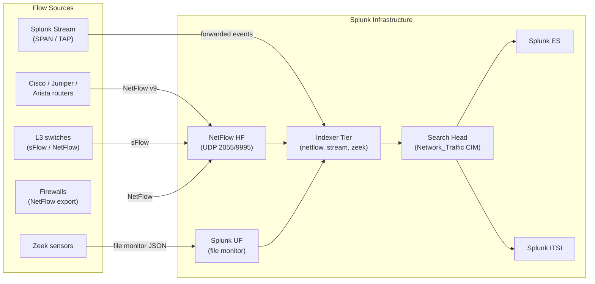

# Network Flow Data (NetFlow, IPFIX, sFlow, Zeek, Stream) Integration Guide

> The definitive guide to monitoring network flow telemetry with
> Splunk. 20 use cases covering NetFlow v5/v9, IPFIX, sFlow, Zeek
> (Bro) network metadata, and Splunk Stream wire data. Top talkers,
> conversation analysis, lateral movement detection, encrypted
> traffic profiling, exfil/beaconing detection, and DDoS mitigation
> — all the way from "who's eating my bandwidth?" to advanced
> threat hunting via JA3/JA3S TLS fingerprints.

---

## Table of Contents

- [Quick Start](#quick-start)
- [Overview](#overview)
- [Architecture and Data Flow](#architecture)
- [Prerequisites](#prerequisites)
- [Flow Telemetry Coverage Matrix](#flow-matrix)
- [NetFlow v5 vs v9 vs IPFIX vs sFlow](#flow-types)
- [Cisco NetFlow / Flexible NetFlow](#cisco-netflow)
- [Juniper jFlow](#juniper-jflow)
- [Arista sFlow](#arista-sflow)
- [Splunk Stream (wire data)](#splunk-stream)
- [Zeek (Bro) Network Metadata](#zeek)
- [Field Dictionary (Cross-Source)](#field-dictionary)
- [Sample Events](#sample-events)
- [Splunk-Side Configuration](#splunk-config)
- [NetFlow Sampling and Sizing](#sampling)
- [CIM Network_Traffic Mapping](#cim-mapping)
- [Threat Hunting with Flow Data](#threat-hunting)
- [Cross-Product Correlation](#cross-product)
- [Compliance Mapping](#compliance)
- [Capacity Planning and Sizing](#sizing)
- [Recommended Dashboard Layouts](#dashboards)
- [ITSI Service Modeling](#itsi)
- [SOAR Playbook Examples](#soar)
- [Multi-Site Strategy](#multi-site)
- [Security Hardening](#security-hardening)
- [Crawl / Walk / Run Roadmap](#roadmap)
- [Validation Checklist](#validation-checklist)
- [Known Limitations and Gaps](#known-limitations)
- [Troubleshooting](#troubleshooting)
- [FAQ](#faq)
- [Glossary](#glossary)
- [References](#references)
- [Contribution and Feedback](#contribution)

---

<a id="quick-start"></a>
## Quick Start — 30 Minutes to First Telemetry

### NetFlow (fastest)

1. Install [Splunk Add-on for NetFlow (Splunkbase 1759)](https://splunkbase.splunk.com/app/1759) on a Heavy Forwarder.
2. Configure HF to listen on UDP/2055 (or 9995/9996):

    ```ini
    # inputs.conf
    [udp://2055]
    sourcetype = stream:netflow
    index = netflow
    no_appending_timestamp = true
    ```

3. On Cisco IOS-XE (per egress interface):

    ```cisco
    flow record FNF-IPv4
      match ipv4 source address
      match ipv4 destination address
      match transport source-port
      match transport destination-port
      match ipv4 protocol
      collect counter bytes long
      collect counter packets long
      collect timestamp absolute first
      collect timestamp absolute last

    flow exporter FNF-EXP-SPLUNK
      destination <splunk-hf-ip>
      transport udp 2055
      template data timeout 60

    flow monitor FNF-IPv4-MON
      record FNF-IPv4
      exporter FNF-EXP-SPLUNK
      cache timeout active 60
      cache timeout inactive 15

    interface GigabitEthernet0/0/0
      ip flow monitor FNF-IPv4-MON input
      ip flow monitor FNF-IPv4-MON output
    ```

4. Validate within minutes: `index=netflow earliest=-15m | stats count by host`
5. Activate UC-5.7.1 (Top Talkers).

### Zeek (Bro)

```bash
# Zeek conn.log → Splunk via UF
[monitor:///opt/zeek/logs/current/conn.log]
sourcetype = bro:conn:json
index = zeek
INDEXED_EXTRACTIONS = json
```

---

<a id="overview"></a>
## Overview

### Why flow telemetry matters

Flow data is the **east-west visibility** layer that firewalls miss. Whereas firewall logs show what's allowed/blocked at the perimeter, NetFlow/IPFIX/sFlow show **every conversation everywhere** — internal-to-internal lateral movement, exfiltration patterns, DDoS amplification, top talkers — without packet capture overhead.

### What this guide covers

| Source | Use case fit |
|--------|-------------|
| **NetFlow v5** | IPv4-only, fixed format — legacy Cisco |
| **NetFlow v9** | Template-based, IPv6, MPLS, vendor extensions |
| **IPFIX (RFC 7011)** | Standardized v9 successor — multi-vendor |
| **sFlow** | Sampled flow — switches/Arista/HPE common |
| **Splunk Stream** | Inline wire-data parsing (DNS, HTTP, etc.) |
| **Zeek (Bro)** | Rich application-layer metadata via dedicated capture |

### Domains covered

| Domain | Examples |
|--------|---------|
| **Capacity** | Top talkers, link utilization, peering analysis |
| **Performance** | Conversation latency, retransmits |
| **Availability** | Asymmetric routing, blackhole detection |
| **Security** | Lateral movement, beaconing, exfiltration, DDoS |
| **Compliance** | East-west audit (PCI segmentation), zone violations |

### What's NOT in scope

| Domain | Where to look |
|--------|---------------|
| **Full PCAP storage** | Out of scope — see Cisco Stealthwatch/Securonix |
| **Firewall L7 detection** | [Firewalls Guide](firewalls.md) |
| **Endpoint network activity** | [EDR Guide](edr.md) |
| **Internet path visibility** | [ThousandEyes Guide](cisco-thousandeyes.md) |

### What good looks like

| Dimension | Without flow telemetry | With full deployment |
|-----------|---------------------|----------------------|
| Top talker analysis | "Who's killing the link?" guess | Real-time per-IP volume + asset enrichment |
| Lateral movement | Invisible | Detect SMB/RDP scans, beaconing patterns |
| DDoS detection | Reactive (CPU pegged) | Proactive: anomalous flow rate alert |
| Capacity planning | Quarterly link audit | Continuous trended utilization |
| Compliance segmentation | Manual config audit | Continuous east-west audit |

---

<a id="architecture"></a>
## Architecture and Data Flow



---

<a id="prerequisites"></a>
## Prerequisites

| Item | Detail |
|------|--------|
| **Splunk version** | 9.0+ Enterprise or Cloud |
| **Add-on** | Splunk Add-on for NetFlow OR Splunk Stream |
| **HF** | Dedicated Heavy Forwarder for high-volume flow ingest |
| **CIM 6.x** | Network_Traffic data model |
| **Asset inventory** | `asset_inventory.csv` for IP-to-hostname enrichment |

### Network-side requirements

| Vendor | Required configs |
|--------|------------------|
| **Cisco IOS / IOS-XE** | Flexible NetFlow record + exporter + monitor |
| **Cisco IOS-XR** | `netflow exporter-map` |
| **Cisco NX-OS** | `flow record` + `flow exporter` + `flow monitor` |
| **Juniper Junos** | `forwarding-options sampling` |
| **Arista EOS** | `flow tracking sample` (sFlow) |
| **Linux/Zeek sensors** | SPAN / TAP / mirrored interface |

---

<a id="flow-matrix"></a>
## Flow Telemetry Coverage Matrix

| Source | Sourcetype | Sampling | IPv6 | TLS metadata | Cloud-vetted |
|--------|-----------|---------|------|--------------|--------------|
| **NetFlow v5** | `netflow` | No (full) | No | No | Yes |
| **NetFlow v9** | `stream:netflow` / `netflow` | No / vendor | Yes | No | Yes |
| **IPFIX** | `stream:ipfix` | Vendor-defined | Yes | Yes (with IEs) | Yes |
| **sFlow v5** | `stream:sflow` | Yes (1-in-N) | Yes | No | Yes |
| **Splunk Stream** | `stream:*` | No | Yes | Partial | Yes |
| **Zeek (Bro) conn.log** | `bro:conn:json` | No | Yes | Yes (ssl.log) | Yes |

---

<a id="flow-types"></a>
## NetFlow v5 vs v9 vs IPFIX vs sFlow

### Quick decision matrix

| Need | Recommendation |
|------|----------------|
| Cisco IOS legacy router | NetFlow v5 |
| IPv6 visibility | NetFlow v9 or IPFIX |
| Multi-vendor environment | IPFIX |
| 10G/40G/100G link with sampling | sFlow or IPFIX with sampling |
| Application-layer metadata | Splunk Stream or Zeek |
| Encrypted traffic profiling | Zeek (JA3/JA3S) |

### Sampling caveats

For 10G+ links, full NetFlow can crush both router CPU and Splunk ingest. Use sampling:

- **Cisco**: `random sampler 1 out-of 1000`
- **Juniper**: `sampling rate 1000`
- **Arista sFlow**: `sample 1000` (sample 1 in N packets)

Multiply byte/packet counts by sampling rate to reconstruct true volume.

---

<a id="cisco-netflow"></a>
## Cisco NetFlow / Flexible NetFlow

### Flexible NetFlow (FNF) on IOS-XE — full reference

```cisco
!! Step 1 — Define the record (what fields to export)
flow record FNF-IPv4-RECORD
  description Splunk-bound IPv4 flow record
  match ipv4 source address
  match ipv4 destination address
  match transport source-port
  match transport destination-port
  match ipv4 protocol
  match ipv4 tos
  collect interface input
  collect interface output
  collect counter bytes long
  collect counter packets long
  collect timestamp absolute first
  collect timestamp absolute last
  collect transport tcp flags

!! Same for IPv6
flow record FNF-IPv6-RECORD
  match ipv6 source address
  match ipv6 destination address
  match transport source-port
  match transport destination-port
  match ipv6 next-header
  collect counter bytes long
  collect counter packets long
  collect timestamp absolute first
  collect timestamp absolute last

!! Step 2 — Define the exporter
flow exporter FNF-EXP-SPLUNK
  description Splunk Heavy Forwarder
  destination <splunk-hf-ip>
  transport udp 2055
  source Loopback0
  template data timeout 60
  option exporter-stats timeout 300
  option interface-table timeout 300

!! Step 3 — Define the monitor (record + exporter + cache)
flow monitor FNF-IPv4-MON
  record FNF-IPv4-RECORD
  exporter FNF-EXP-SPLUNK
  cache timeout active 60
  cache timeout inactive 15
  cache entries 200000

flow monitor FNF-IPv6-MON
  record FNF-IPv6-RECORD
  exporter FNF-EXP-SPLUNK
  cache timeout active 60
  cache timeout inactive 15

!! Step 4 — Apply to interfaces
interface GigabitEthernet0/0/0
  description WAN-Uplink
  ip flow monitor FNF-IPv4-MON input
  ip flow monitor FNF-IPv4-MON output
  ipv6 flow monitor FNF-IPv6-MON input
  ipv6 flow monitor FNF-IPv6-MON output
```

### Verify on Cisco

```cisco
show flow exporter FNF-EXP-SPLUNK statistics
show flow monitor FNF-IPv4-MON statistics
show flow record FNF-IPv4-RECORD
```

---

<a id="juniper-jflow"></a>
## Juniper jFlow

```junos
forwarding-options {
    sampling {
        instance Splunk-Sampling {
            input {
                rate 1;
            }
            family inet {
                output {
                    flow-server <splunk-hf-ip> {
                        port 2055;
                        version-ipfix template Splunk-Template;
                    }
                }
            }
        }
    }
}
services {
    flow-monitoring {
        version-ipfix template Splunk-Template {
            flow-active-timeout 60;
            flow-inactive-timeout 15;
            template-refresh-rate seconds 60;
            ipv4-template;
            ipv6-template;
        }
    }
}

interfaces ge-0/0/0 {
    unit 0 {
        family inet {
            sampling {
                input;
                output;
            }
        }
    }
}
```

---

<a id="arista-sflow"></a>
## Arista sFlow

```eos
sflow source <loopback-ip>
sflow destination <splunk-hf-ip> 6343
sflow polling-interval 60
sflow sample 16384
sflow run

interface Ethernet1
    sflow enable
```

---

<a id="splunk-stream"></a>
## Splunk Stream (wire data)

### Required Splunk components

| Component | Purpose |
|-----------|--------|
| Splunk Stream | App + per-host stream forwarder for inline wire parsing |
| TAP / SPAN port | To mirror traffic to stream sensor host |

### Architecture

Splunk Stream sniffs L2-L7 from a SPAN port and parses common protocols (DNS, HTTP, TCP/UDP flow, TLS metadata) directly. Heavier than NetFlow but richer.

### Configuration

Install Splunk_TA_stream + splunk_app_stream on the search head. Push stream-forwarder app to each sensor host via deployment server.

```bash
# On stream sensor host:
splunk install app /tmp/Splunk_TA_stream-8.x.spl
```

Stream forwarder reads from a configured interface (e.g., `eth1` mirrored from a switch SPAN). Configure protocols in stream UI.

### Sample stream:netflow event

```json
{
    "src_ip": "10.20.30.40",
    "dest_ip": "192.0.2.50",
    "src_port": 51234,
    "dest_port": 443,
    "protocol": "TCP",
    "bytes": 12345678,
    "packets": 8901,
    "tcp_flags": 24,
    "duration": 12.345,
    "input_interface": "GigabitEthernet0/0/0",
    "output_interface": "GigabitEthernet0/0/1"
}
```

---

<a id="zeek"></a>
## Zeek (Bro) Network Metadata

Zeek is the gold standard for **rich application-layer metadata** (DNS, HTTP, SSL, files) without payload storage. Generates one log per protocol.

### Splunk integration

```ini
# UF inputs.conf on Zeek sensor
[monitor:///opt/zeek/logs/current/conn.log]
sourcetype = bro:conn:json
index = zeek

[monitor:///opt/zeek/logs/current/dns.log]
sourcetype = bro:dns:json
index = zeek

[monitor:///opt/zeek/logs/current/http.log]
sourcetype = bro:http:json
index = zeek

[monitor:///opt/zeek/logs/current/ssl.log]
sourcetype = bro:ssl:json
index = zeek

[monitor:///opt/zeek/logs/current/files.log]
sourcetype = bro:files:json
index = zeek

[monitor:///opt/zeek/logs/current/notice.log]
sourcetype = bro:notice:json
index = zeek
```

Make sure Zeek is configured for JSON output:

```zeek
# /opt/zeek/share/zeek/site/local.zeek
@load policy/tuning/json-logs.zeek
```

### TLS fingerprinting (JA3 / JA3S)

```zeek
@load policy/protocols/ssl/ja3
```

Then SPL:

```spl
index=zeek sourcetype="bro:ssl:json" earliest=-1h
| stats count by ja3, server_name
| where count > 100
| sort -count
```

### Sample bro:conn:json

```json
{
    "ts": 1745596200.123456,
    "uid": "CzZJ4Q1aBcD",
    "id.orig_h": "10.20.30.40",
    "id.orig_p": 51234,
    "id.resp_h": "192.0.2.50",
    "id.resp_p": 443,
    "proto": "tcp",
    "service": "ssl",
    "duration": 12.345,
    "orig_bytes": 12345,
    "resp_bytes": 67890,
    "conn_state": "SF",
    "history": "ShADadFf",
    "orig_pkts": 89,
    "resp_pkts": 102
}
```

---

<a id="field-dictionary"></a>
## Field Dictionary (Cross-Source)

After Network_Traffic CIM mapping:

| CIM field | NetFlow | IPFIX | sFlow | Stream | Zeek |
|-----------|--------|-------|-------|--------|------|
| `src` | ipv4_src_addr | sourceIPv4Address | srcIp | src_ip | id.orig_h |
| `dest` | ipv4_dst_addr | destinationIPv4Address | dstIp | dest_ip | id.resp_h |
| `src_port` | l4_src_port | sourceTransportPort | srcPort | src_port | id.orig_p |
| `dest_port` | l4_dst_port | destinationTransportPort | dstPort | dest_port | id.resp_p |
| `bytes` | in_bytes | octetDeltaCount | bytes | bytes | orig_bytes + resp_bytes |
| `packets` | in_pkts | packetDeltaCount | packets | packets | orig_pkts + resp_pkts |
| `protocol` | protocol | protocolIdentifier | proto | protocol | proto |
| `tcp_flag` | tcp_flags | tcpControlBits | n/a | tcp_flags | history |
| `duration` | last - first | flowEndSysUpTime | n/a | duration | duration |
| `app` | n/a | applicationId | n/a | n/a | service |

---

<a id="sample-events"></a>
## Sample Events

(See per-source sections.)

---

<a id="splunk-config"></a>
## Splunk-Side Configuration

### Index strategy

```ini
[netflow]
homePath = $SPLUNK_DB/netflow/db
maxDataSize = auto_high_volume
frozenTimePeriodInSecs = 7776000   # 90 days

[zeek]
homePath = $SPLUNK_DB/zeek/db
maxDataSize = auto_high_volume
frozenTimePeriodInSecs = 7776000

[stream]
# Splunk Stream comes with its own indexes (stream:netflow, stream:dns, etc.)
homePath = $SPLUNK_DB/stream/db
```

### CIM Network_Traffic acceleration

```ini
# datamodels.conf
[Network_Traffic]
acceleration = 1
acceleration.earliest_time = -7d
acceleration.cron_schedule = 8 * * * *
```

---

<a id="sampling"></a>
## NetFlow Sampling and Sizing

| Link speed | Recommended sample rate | Reason |
|-----------|------------------------|--------|
| 1G or below | 1:1 (full) | Full visibility, manageable volume |
| 10G | 1:1000 | Router CPU + Splunk ingest balance |
| 40G/100G | 1:10000 or sFlow | Hardware sampling required |

### Sample rate compensation

```spl
index=netflow earliest=-1h
| eval sample_rate=if(isnotnull(sample_rate), sample_rate, 1)
| eval bytes_actual = bytes * sample_rate
| eval packets_actual = packets * sample_rate
| stats sum(bytes_actual) as total_bytes by src
```

---

<a id="cim-mapping"></a>
## CIM Network_Traffic Mapping

| CIM field | Sourcetype | Auto-mapped? |
|-----------|-----------|--------------|
| `All_Traffic.bytes` | `stream:netflow`, `bro:conn:json` | Yes |
| `All_Traffic.src` | All | Yes |
| `All_Traffic.dest` | All | Yes |
| `All_Traffic.app` | `bro:conn:json`, `stream:*` | Partial |
| `All_Traffic.protocol` | All | Yes |

---

<a id="threat-hunting"></a>
## Threat Hunting with Flow Data

### Beaconing detection

```spl
index=netflow earliest=-24h
| bin _time span=1m
| stats count, sum(bytes) as total_bytes by _time, src, dest
| eventstats stdev(count) as count_std, avg(count) as count_avg by src, dest
| where count_std < 2 AND count_avg > 0   /* Very regular interval = beacon */
| stats values(count) as session_pattern, sum(total_bytes) as total by src, dest
| sort -total
```

### Lateral movement (SMB/RDP scan)

```spl
index=netflow earliest=-1h dest_port IN (139, 445, 3389, 5985, 5986)
| stats dc(dest) as unique_targets, count as sessions by src
| where unique_targets > 50
| sort -unique_targets
```

### Data exfiltration

```spl
index=netflow earliest=-1h
| where match(dest, "^(?!10\.|192\.168|172\.(1[6-9]|2[0-9]|3[0-1])).*")
| stats sum(bytes) as out_bytes by src, dest
| eval out_GB = round(out_bytes/1073741824, 2)
| where out_GB > 5
| sort -out_GB
```

### TLS JA3 anomaly (Zeek)

```spl
index=zeek sourcetype="bro:ssl:json" earliest=-1d
| stats dc(id.orig_h) as src_count, count, latest(_time) as last_seen by ja3
| where src_count = 1 AND count > 100   /* Single source, many connections, novel JA3 */
| sort -count
```

### DDoS detection

```spl
index=netflow earliest=-5m
| stats count by dest, dest_port
| where count > 10000   /* Single destination > 10K flows in 5 min */
| sort -count
```

---

<a id="cross-product"></a>
## Cross-Product Correlation

### Flow + Firewall (allowed-but-suspicious)

```spl
(index=netflow earliest=-1h dest IN ("known-bad-1", "known-bad-2"))
OR (index=firewall earliest=-1h sourcetype="pan:traffic" action=allow)
| transaction src dest maxspan=5m
```

### Flow + DNS (DGA-driven C2 traffic confirmation)

```spl
(index=dns sourcetype="infoblox:dns" reply_code=NOERROR)
OR (index=netflow)
| transaction src maxspan=5m
| stats values(query) as queried_domains, sum(bytes) as outbound by src
| where len(mvjoin(queried_domains, ",")) > 1000
```

### Flow + EDR (process attribution)

```spl
(index=edr sourcetype="crowdstrike:detection" earliest=-1h)
OR (index=netflow earliest=-1h)
| transaction src maxspan=10s
```

---

<a id="compliance"></a>
## Compliance Mapping

### NIST 800-53

| Control | Coverage |
|---------|----------|
| **AU-2/12** Audit | All flow records |
| **SC-7** Boundary Protection | East-west flow audit |
| **SI-4** System Monitoring | DDoS, exfil, beaconing |

### NIS2

| Article | Coverage |
|---------|----------|
| **Art 21(2)(a)** Network security | Flow visibility, lateral movement detection |
| **Art 23** Incident reporting | Flow-based forensics |

### PCI-DSS 4.0

| Requirement | Coverage |
|-------------|----------|
| **1.4.4** Inbound restrictions | Flow audit confirms expected paths |
| **11.5.2** File integrity / NIDS | Zeek notice.log → ES |
| **A1.2.1** Segmentation | East-west flow audit |

### MITRE ATT&CK

| Tactic | Flow-based detection |
|--------|---------------------|
| **TA0008 Lateral Movement** | T1021 — SMB/RDP scan UC |
| **TA0010 Exfiltration** | T1041 / T1567 — outbound volume UC |
| **TA0011 C2** | T1071 / T1095 — beaconing UC |

---

<a id="sizing"></a>
## Capacity Planning and Sizing

### Per-source volume estimates

| Source | Records/day | Daily ingest |
|--------|------------|-------------|
| NetFlow (1G link, full) | ~5M | ~1 GB |
| NetFlow (10G link, 1:1000) | ~50M | ~10 GB |
| Splunk Stream (1G SPAN) | ~50M | ~30 GB |
| Zeek (1G SPAN, conn only) | ~30M | ~10 GB |
| Zeek (1G SPAN, all logs) | ~100M | ~50 GB |

### Retention recommendations

| Data | Retention | Rationale |
|------|-----------|-----------|
| Raw flow | 30-90 days | Threat hunting, forensics |
| Aggregated flow | 1 year | Capacity trending |
| Zeek notice.log | 1 year | Security incident retention |
| TLS metadata | 90 days | TLS fingerprinting hunts |

---

<a id="dashboards"></a>
## Recommended Dashboard Layouts

### Crawl — "Network Flow At a Glance"

```
+---------------------+---------------------+
| TOTAL TRAFFIC PER LINK (timechart)         |
+---------------------+---------------------+
| TOP 20 TALKERS (with asset enrichment)     |
+---------------------+---------------------+
| TOP CONVERSATION PAIRS                     |
+---------------------+---------------------+
| TOP DESTINATIONS (external)                |
+---------------------+---------------------+
```

### Walk — "Threat Hunt"

```
+---------------------+---------------------+
| BEACONING PATTERNS DETECTED                |
+---------------------+---------------------+
| LATERAL MOVEMENT (SMB/RDP/WinRM scans)     |
+---------------------+---------------------+
| OUTBOUND VOLUME ANOMALIES                  |
+---------------------+---------------------+
| TLS JA3 ANOMALIES (Zeek)                   |
+---------------------+---------------------+
```

### Run — "Capacity & Compliance"

```
+---------------------+---------------------+
| 90-DAY LINK UTILISATION TREND              |
+---------------------+---------------------+
| EAST-WEST SEGMENTATION COMPLIANCE          |
+---------------------+---------------------+
| PER-VRF / PER-DC TRAFFIC MATRIX            |
+---------------------+---------------------+
| PEERING ANALYSIS (autonomous-system)       |
+---------------------+---------------------+
```

---

<a id="itsi"></a>
## ITSI Service Modeling

### Service hierarchy

```
Network Flow Tier
├── Per-Site Edge Routers
│   ├── HQ-DC-Edge
│   ├── EMEA-DC-Edge
│   └── ...
├── Internal Backbone
│   └── Core Routers
└── Sensor Tier
    ├── Zeek sensors
    └── Stream sensors
```

### Recommended KPIs

| KPI | Source | Threshold |
|-----|--------|-----------|
| Total ingress bandwidth | NetFlow per-link sum | Adaptive |
| Top talker volume | NetFlow per-src | Adaptive (alert spike) |
| Beaconing patterns count | flow analytics search | Static (warn > 5) |
| Zeek notice events | bro:notice:json | Static (warn > 0 high) |
| Lateral movement scan count | flow scan search | Static (page > 0) |

---

<a id="soar"></a>
## SOAR Playbook Examples

### Playbook 1: Beaconing Suspect

**Trigger:** UC-5.7.x — beaconing pattern detected.

```
1. RECEIVE alert (src, dest, beacon_interval, total_bytes)
2. LOOKUP src in asset_inventory (owner, business_unit)
3. CHECK dest reputation (TI feed)
4. QUERY DNS logs for resolved domain
5. QUERY EDR for process attribution
6. ISOLATE endpoint via EDR if confirmed
7. CREATE incident ticket
```

### Playbook 2: Lateral Movement Scan

**Trigger:** Single host scanning > 50 destinations on SMB/RDP.

```
1. RECEIVE alert (src, target_count, ports, top_destinations)
2. CHECK if src is approved scanner (Nessus, Tenable)
3. IF unapproved → ISOLATE via EDR
4. PAGE Tier 2 SOC
5. PRESERVE raw flow data for forensics
```

### Playbook 3: Outbound Exfiltration

**Trigger:** UC-5.7.x — outbound volume > 5 GB/h to non-RFC1918.

```
1. RECEIVE alert (src, dest, out_GB, dest_country)
2. CHECK dest reputation, ASN, country
3. QUERY EDR for parent process
4. QUERY proxy logs for context (URL, mime)
5. IF confirmed exfil → BLOCK egress at firewall
6. NOTIFY DLP team and CISO
```

---

<a id="multi-site"></a>
## Multi-Site Strategy

For globally-distributed networks:

- **Per-region NetFlow HF** (avoid cross-WAN flow shipping)
- **Per-region indexes** (`netflow_emea`, `netflow_amer`, `netflow_apac`)
- **Federated search** for global views
- **Dedicated Zeek sensors** at high-value chokepoints (DC ingress/egress)

---

<a id="security-hardening"></a>
## Security Hardening

- Restrict NetFlow UDP 2055 to allowlisted exporter IPs only
- Use IPSec/GRE tunnels if exporting flow across untrusted WANs
- Zeek sensors should be on out-of-band management network
- Field-level RBAC: src/dest IPs may be PII (e.g., user workstations)
- Don't store flow data with reverse DNS resolution (cardinality + privacy issue)

---

<a id="roadmap"></a>
## Crawl / Walk / Run Roadmap

### Crawl (Week 1–2)

1. Stand up NetFlow HF
2. Configure FNF on 2-3 critical egress routers
3. UC-5.7.1 (top talkers) + at-a-glance dashboard

### Walk (Week 3–6)

1. Roll out FNF to all WAN edges
2. Network_Traffic CIM acceleration
3. Beaconing + lateral movement UCs
4. ITSI per-site service

### Run (Month 2+)

1. Deploy Zeek sensors at high-value chokepoints
2. Splunk Stream for application-layer visibility
3. Full threat hunting playbooks
4. SOAR integration

---

<a id="validation-checklist"></a>
## Validation Checklist

### Day 1

- [ ] NetFlow HF receiving from at least 1 router
- [ ] Index volume non-zero
- [ ] Top talkers UC live

### Day 7

- [ ] Multiple flow sources onboarded
- [ ] CIM acceleration enabled
- [ ] At-a-glance dashboard deployed

### Day 30

- [ ] Threat hunting UCs deployed
- [ ] Zeek sensors at first chokepoint
- [ ] ITSI per-site service

### Day 90

- [ ] Full Zeek + Stream coverage
- [ ] SOAR playbooks live
- [ ] Long-term retention strategy

---

<a id="known-limitations"></a>
## Known Limitations and Gaps

| Limitation | Impact | Workaround |
|------------|--------|------------|
| **NetFlow sampling = approximate** | Volume estimation imprecise | Compensate with sample_rate multiplier |
| **NetFlow lacks payload** | Can't detect content | Pair with Zeek/Stream for app-layer |
| **High-cardinality src/dest pairs** | tstats explosion | Aggregate before analysis |
| **NetFlow v5 IPv4-only** | No IPv6 visibility | Migrate exporter to v9/IPFIX |
| **Encrypted traffic = limited L7** | TLS opaque | Use Zeek JA3/JA3S for fingerprinting |
| **Asymmetric routing breaks flow records** | Duplicate or missing flows | Export from both ends; deduplicate |

---

<a id="troubleshooting"></a>
## Troubleshooting

### No flow records arriving

- Verify HF listening: `tcpdump -i any -n udp port 2055`
- Verify firewall rules allow UDP 2055 from router IPs
- Check `show flow exporter statistics` on Cisco

### Bytes seem too low

- Check sampling rate; multiply if applicable
- Verify exporter / monitor active timeout (60s typical)
- For sFlow: confirm `sample 1024` then multiply

### `src`/`dest` show interface IPs not endpoint IPs

- Apply NetFlow on the edge interface, not transit
- Verify NAT translation order (export pre-NAT for original IPs)

### CIM Network_Traffic returns nothing

- Run `| datamodel Network_Traffic All_Traffic search` to test
- Check field aliases in TA props.conf
- Verify acceleration completed

### IPv6 records missing

- NetFlow v5 is IPv4-only. Migrate to v9 or IPFIX.
- For Cisco, define a separate `flow record FNF-IPv6` and apply to interface

---

<a id="faq"></a>
## FAQ

**Q: Should I use NetFlow or Zeek?**
A: NetFlow for volume + capacity (lightweight, ubiquitous). Zeek for security (rich app-layer metadata). Most enterprises run both.

**Q: My Splunk indexer is overloaded by NetFlow. Help?**
A: (1) Increase sampling rate at router (1:1000), (2) Use summary indexing for top-talker aggregation, (3) Move raw flow to SmartStore.

**Q: Can I detect ransomware exfiltration via flow alone?**
A: Yes — sustained outbound to non-typical destinations + size + duration. See exfiltration UC.

**Q: How do I tell beaconing apart from legitimate keep-alive?**
A: Beacon = perfectly regular interval + small payload. Legitimate keep-alive = TCP keepalive (1-byte) ignored at flow level.

**Q: Can flow data replace IDS?**
A: No — flow gives you the "who/where/how-much," IDS gives you the "what's in the payload." Best together.

**Q: What's the minimum useful retention?**
A: 30 days for threat hunting; 90 days for forensics (typical breach detection time).

---

<a id="glossary"></a>
## Glossary

| Term | Definition |
|------|-----------|
| **NetFlow** | Cisco-originated flow telemetry protocol (v5 = IPv4 only, v9 = template-based, IPv6) |
| **IPFIX** | RFC 7011 — IETF-standardized successor to NetFlow v9 |
| **sFlow** | Sampled flow telemetry — switches/Arista typical |
| **Flexible NetFlow (FNF)** | Cisco's modern user-defined flow record/exporter/monitor |
| **Zeek (Bro)** | Open-source network security monitoring framework |
| **Stream** | Splunk's wire-data inline parsing solution |
| **Beacon** | Regular outbound check-in pattern (often C2) |
| **JA3 / JA3S** | TLS Client/Server fingerprint hash |
| **East-west traffic** | Internal datacenter traffic (vs. north-south = perimeter) |
| **PCAP** | Packet capture (full payload) |

---

<a id="references"></a>
## References

- [Splunk Add-on for NetFlow (Splunkbase 1759)](https://splunkbase.splunk.com/app/1759)
- [Splunk Stream (Splunkbase 5234)](https://splunkbase.splunk.com/app/5234)
- [Zeek/Bro Splunk Add-on (Splunkbase 1617)](https://splunkbase.splunk.com/app/1617)
- [Network_Traffic CIM model](https://docs.splunk.com/Documentation/CIM/latest/User/Network_Traffic)
- [Cisco Flexible NetFlow configuration guide](https://www.cisco.com/c/en/us/td/docs/ios-xml/ios/fnetflow/configuration/xe-17/fnf-xe-17-book.html)
- [Zeek docs](https://docs.zeek.org/)
- [RFC 7011 — IPFIX specification](https://datatracker.ietf.org/doc/html/rfc7011)

---

<a id="contribution"></a>
## Contribution and Feedback

Part of the [Splunk Monitoring Use Cases](https://github.com/fenre/splunk-monitoring-use-cases) project. [Open an issue](https://github.com/fenre/splunk-monitoring-use-cases/issues/new).

---

*Last updated: 2026-05-09. Covers Splunk Add-on for NetFlow 1.x, Splunk Stream 8.x, Zeek 5.x.*
