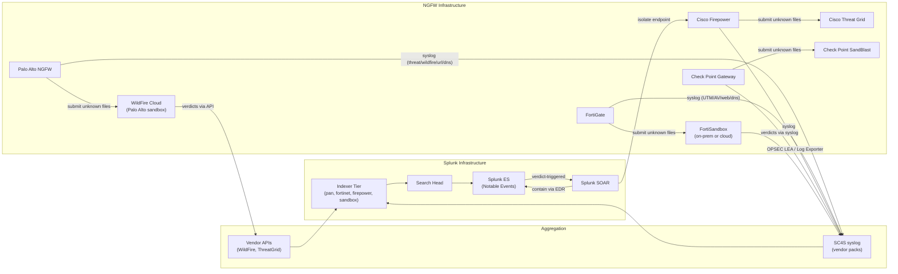

# NGFW Security Modules (WildFire, FortiSandbox, Threat Prevention) Integration Guide

> The definitive guide to the NGFW security modules that go beyond
> simple firewall traffic logs. **77 use cases** covering Palo Alto
> WildFire (sandboxing) + Threat Prevention (IPS, antivirus, URL,
> DNS Security), Fortinet FortiSandbox + UTM (AV, web filter, DNS,
> sandbox), Cisco Secure Malware Analytics (formerly Threat Grid) +
> AMP for Networks, Check Point SandBlast, and Trend Micro Deep
> Discovery. Sandbox verdicts, URL category trending, DNS Security
> (DGA / sinkhole), AV signature hits, and the integration with
> Splunk ES + SOAR for sandbox-verdict-triggered auto-response.

---

## Table of Contents

- [Quick Start](#quick-start)
- [Overview](#overview)
- [Architecture and Data Flow](#architecture)
- [Prerequisites](#prerequisites)
- [Platform Coverage Matrix](#platform-matrix)
- [Palo Alto WildFire + Threat Prevention](#palo-alto)
- [Fortinet FortiSandbox + UTM](#fortinet)
- [Cisco Secure Malware Analytics + AMP](#cisco)
- [Check Point SandBlast](#checkpoint)
- [Trend Micro Deep Discovery](#trend-micro)
- [Sandbox Verdict Pipeline](#sandbox)
- [URL Category Filtering](#url-filter)
- [DNS Security (DGA / Sinkhole)](#dns-sec)
- [Field Dictionary (Cross-Vendor)](#field-dictionary)
- [Sample Events](#sample-events)
- [Splunk-Side Configuration](#splunk-config)
- [Cross-Product Correlation](#cross-product)
- [CIM Mapping Reference](#cim-mapping)
- [Splunk ES Notable Event Pipeline](#es-notable)
- [Compliance Mapping](#compliance)
- [Capacity Planning and Sizing](#sizing)
- [Recommended Dashboard Layouts](#dashboards)
- [ITSI Service Modeling](#itsi)
- [SOAR Playbook Examples (Sandbox-Verdict-Triggered)](#soar)
- [Multi-Site Strategy](#multi-site)
- [Security Hardening](#security-hardening)
- [Crawl / Walk / Run Roadmap](#roadmap)
- [Validation Checklist](#validation-checklist)
- [Known Limitations and Gaps](#known-limitations)
- [Troubleshooting](#troubleshooting)
- [FAQ](#faq)
- [Glossary](#glossary)
- [References](#references)
- [Contribution and Feedback](#contribution)

---

<a id="quick-start"></a>
## Quick Start — 30 Minutes to First Sandbox Verdict

### Palo Alto WildFire (most common)

1. Install [Splunk Add-on for Palo Alto (Splunkbase 2757)](https://splunkbase.splunk.com/app/2757).
2. On Panorama / Firewall:
    ```
    Device → Setup → Server Profiles → Syslog → Add Splunk-SC4S
    Objects → Log Forwarding Profile → enable WildFire + Threat + URL + DNS
    ```
3. Validate: `index=pan sourcetype="pan:wildfire" earliest=-15m | stats count by verdict, filetype`

### FortiGate FortiSandbox

1. Install [TA-fortinet_fortigate (Splunkbase 2846)](https://splunkbase.splunk.com/app/2846).
2. Configure UTM logging:
    ```fortios
    config log syslogd setting
        set status enable
        set server <sc4s-vip>
        set port 514
        set facility local6
    end
    config log syslogd filter
        set utm-traffic enable
    end
    ```
3. Validate: `index=fortinet sourcetype="fortinet:fortisandbox:event" earliest=-15m | stats count`

### Activate crawl tier

UC-10.1.1 (NGFW Threat Trending), UC-10.1.2 (WildFire/Sandbox Verdicts), UC-10.1.x (URL Category Blocking), UC-10.1.x (DNS Security).

---

<a id="overview"></a>
## Overview

### Why NGFW security modules matter

Modern NGFWs are not just firewalls — they're a packet inspection chassis with multiple security modules:

- **Threat Prevention / IPS** — vendor signature library
- **Antivirus** — signature + heuristic file scanning
- **WildFire / Sandbox** — unknown file dynamic analysis
- **URL Filtering** — category-based web filtering
- **DNS Security** — block DGA, sinkhole malicious domains
- **DLP** — data loss prevention (sometimes separate)
- **Anti-Spyware / Bot Detection** — known C2 signatures

This guide focuses on the **non-IPS, non-traffic** security modules. (For traffic logs and policy, see the [Firewalls Guide](firewalls.md). For IPS specifically, see the [IDS/IPS Guide](ids-ips.md).)

### Platforms covered

| Platform | Modules |
|---------|--------|
| **Palo Alto NGFW + WildFire** | Threat Prevention, AV, WildFire sandbox, URL Filtering, DNS Security |
| **FortiGate<sup class="ref">[<a href="#ref-6">6</a>]</sup> + FortiSandbox** | UTM (AV, IPS, web filter, DNS), FortiSandbox dynamic analysis |
| **Cisco Firepower + AMP for Networks + Threat Grid** | URL, AMP file disposition, sandbox |
| **Check Point + SandBlast** | AV, Threat Emulation, Threat Extraction, URL filtering |
| **Trend Micro Deep Discovery** | Network sandbox + breach detection |

### Domains covered

| Domain | Examples |
|--------|---------|
| **Sandbox verdict tracking** | Malware/grayware/phishing verdicts; affected hosts |
| **URL category trending** | Top categories blocked / users blocked |
| **DNS Security** | DGA detection, sinkhole hits |
| **AV signature hits** | Top file-types, top signature names |
| **C2 / Command & Control** | Anti-spyware bot detection |
| **Compliance** | PCI 5.x, NIST SI-3, NIS2<sup class="ref">[<a href="#ref-5">5</a>]</sup> |

### What's NOT in scope

| Domain | Where to look |
|--------|---------------|
| **Firewall traffic / policy** | [Firewalls Guide](firewalls.md) |
| **IPS specifically** | [IDS/IPS Guide](ids-ips.md) |
| **Endpoint / EDR** | [EDR Guide](edr.md) |
| **Email-borne malware** | [Email Security Guide](email-security.md) |
| **Web proxy / SWG** | [Web Security Guide](web-security.md) |

### What good looks like

| Dimension | Without integration | With full integration |
|-----------|---------------------|-----------------------|
| Sandbox visibility | NGFW-only logs | Centralized, queryable, cross-vendor |
| Sandbox-verdict response | Manual host investigation | Auto-EDR-isolation via SOAR |
| URL category trending | One-off NGFW reports | Daily Splunk dashboard |
| DGA detection | Manual hunting | DNS Security module + Splunk |
| Multi-vendor view | Per-vendor consoles | Unified Splunk view |

---

<a id="architecture"></a>
## Architecture and Data Flow



### Core principles

- **Sandbox is the brain** — analyzes unknowns and emits verdicts
- **Centralised verdict pipeline** in Splunk for cross-vendor view
- **CIM Intrusion_Detection** for IPS / AV / WildFire alerts
- **CIM Web** for URL filtering events
- **Auto-response on malware verdicts** via SOAR

---

<a id="prerequisites"></a>
## Prerequisites

| Item | Detail |
|------|--------|
| **Splunk version** | 9.0+ Enterprise / Cloud |
| **Splunk ES** | Recommended for full notable event workflow |
| **CIM 6.x** | Intrusion_Detection, Web, Network_Resolution, Network_Traffic |
| **SC4S** | For all NGFW vendor syslog |
| **API access** | WildFire API key, ThreatGrid API key (optional, enriches sandbox) |
| **NGFW security licenses** | Threat Prevention, WildFire, URL Filtering, DNS Security per vendor |

---

<a id="platform-matrix"></a>
## Platform Coverage Matrix

| Platform | TA | Splunkbase | Modules covered |
|---------|----|-----------|----------------|
| **Palo Alto NGFW + WildFire** | Splunk Add-on for Palo Alto Networks | [2757](https://splunkbase.splunk.com/app/2757) | Threat, WildFire, URL, DNS Security, AV |
| **FortiGate + FortiSandbox** | TA-fortinet_fortigate | [2846](https://splunkbase.splunk.com/app/2846) | UTM (all modules) + FortiSandbox |
| **Cisco Firepower + AMP + Threat Grid** | Cisco Secure Firewall Add-on | [3449](https://splunkbase.splunk.com/app/3449) | Threat, AMP for Networks, sandbox |
| **Check Point + SandBlast** | Splunk Add-on for Check Point OPSEC LEA | [5402](https://splunkbase.splunk.com/app/5402) | AV, Threat Emulation, URL filtering |
| **Trend Micro Deep Discovery** | (custom syslog via SC4S) | n/a | Network breach detection |

---

<a id="palo-alto"></a>
## Palo Alto WildFire + Threat Prevention

### Configuration on PAN-OS

```
Device → Setup → Server Profiles → Syslog:
+ Add: Splunk-SC4S
+ Server: <sc4s-vip>:514
+ Format: BSD
+ Facility: LOG_USER

Objects → Log Forwarding → New profile:
+ Threat Logs → Match all severity High+/Critical → Forward to Splunk-SC4S
+ WildFire Submissions → Forward all → Splunk-SC4S
+ URL Filtering → All categories → Splunk-SC4S
+ DNS Security → All actions → Splunk-SC4S

Apply forwarding profile to security policies
```

### Sample event (PAN Threat — IPS)

```
1,2026/04/25 14:30:15,001234567890,THREAT,vulnerability,2050,2026/04/25 14:30:15,203.0.113.45,10.10.10.10,...,Apache Log4j Vulnerability,...,T1190,critical,client-to-server,...
```

### Sample event (PAN WildFire)

```
1,2026/04/25 14:30:15,001234567890,WILDFIRE,...,abc123def456...,malware,executable,from-internet,2026/04/25 14:30:15,...
```

### Sample event (PAN URL)

```
1,2026/04/25 14:30:15,001234567890,URL,...,gambling,block-url,malicious-content,...
```

### Sample event (PAN DNS Security)

```
1,2026/04/25 14:30:15,001234567890,SPYWARE,...,suspicious-dns-query,sinkhole,suspicious-dns-query.example.com,...
```

---

<a id="fortinet"></a>
## Fortinet FortiSandbox + UTM

### Configuration

```fortios
# FortiGate UTM profile
config antivirus profile
    edit "default"
        config http
            set av-scan disable
            set quarantine block-url block-malicious enable
        end
        set inspection-mode flow-based
        set scan-mode quick
        set ftgd-analytics every-time
    next
end

# FortiSandbox forwarding
config system fortisandbox
    set status enable
    set server <fortisandbox-host>
end
```

### Sample event (FortiGate UTM AV)

```
date=2026-04-25 time=14:30:15 devname="FGT-01" devid="FGT60E1234567890" eventtime=1745596215 logid="0211008192" type="utm" subtype="virus" eventtype="virus" level="warning" vd="root" srcip=10.10.10.10 dstip=203.0.113.45 srcport=56789 dstport=80 srcintf="lan" dstintf="wan" service="HTTP" filename="evil.exe" virus="W32/Generic.AC123!tr" dtype="Virus" action="blocked" filehash="abc123..." quarskip="No-skip" eventid=12345
```

### Sample event (FortiSandbox)

```
date=2026-04-25 time=14:30:15 devname="FSA-01" devid="FSA1KE1234567890" type="malware" subtype="malware-pkg" rating="HIGH" filename="invoice.pdf" filehash="def456..." submitter="FGT-01" srcip=10.10.10.10 user="jdoe" group="finance" verdict="MALICIOUS"
```

---

<a id="cisco"></a>
## Cisco Secure Malware Analytics (Threat Grid) + AMP

### Configuration on Firepower

In FMC:
1. **Policies → Access Control → Edit policy → File Policy → Edit**
2. Add file rule: type "Malware Cloud Lookup" or "Block Malware"
3. Apply policy
4. AMP for Networks license required for full integration

### Sample event (Cisco AMP for Networks)

```
<189>Apr 25 14:30:15 ftd-01 SFIMS: [Primary Detection Engine (...)] [AMP] [Sha256: abc123...] [Disposition: Malware] [Action: Block] {tcp} 10.10.10.10:56789 -> 203.0.113.45:80 [File Type: PE] [Filename: evil.exe]
```

---

<a id="checkpoint"></a>
## Check Point SandBlast

### Configuration

In SmartConsole:
1. **Threat Prevention Profile → Threat Emulation tab → enable**
2. Configure file types to emulate (PDF, Office, exe, etc.)
3. **Logs → SmartView → set log forwarding to Splunk via Log Exporter**

### Sample event

```
time="25Apr2026 14:30:15" loguid="..." srcip=10.10.10.10 dstip=203.0.113.45 service=80 protocol=tcp 
type="ThreatEmulation" verdict=Malicious filename="invoice.pdf" filehash="abc123..."
```

---

<a id="trend-micro"></a>
## Trend Micro Deep Discovery

Standalone network sandbox / breach detection. Integrate via syslog → SC4S; sourcetype `trendmicro:dd:syslog`.

---

<a id="sandbox"></a>
## Sandbox Verdict Pipeline

### Volume + verdict trending

```spl
index=pan sourcetype="pan:wildfire" earliest=-7d
| stats count by verdict, filetype
| eval verdict_label=case(
    verdict=0,"benign", 
    verdict=1,"malware", 
    verdict=2,"grayware", 
    verdict=4,"phishing")
```

### Affected user/host investigation

```spl
index=pan sourcetype="pan:wildfire" verdict=1 earliest=-7d
| join sha256 [search index=pan sourcetype="pan:threat" earliest=-7d | fields sha256, src, dest, user]
| stats values(filename) as files dc(src) as src_count by user
| sort -src_count
```

### Cross-vendor verdict aggregation

```spl
(index=pan sourcetype="pan:wildfire" verdict=1)
OR (index=fortinet sourcetype="fortinet:fortisandbox:event" verdict="MALICIOUS")
OR (index=firepower sourcetype="cisco:amp:event" disposition="Malware")
| eval file_hash = coalesce(sha256, filehash)
| stats values(filename) as filenames count by file_hash
| sort -count
```

---

<a id="url-filter"></a>
## URL Category Filtering

### Top blocked categories

```spl
index=pan sourcetype="pan:url" action="block-url" earliest=-24h
| top limit=20 category
```

### Top users with blocked URLs

```spl
index=pan sourcetype="pan:url" action="block-url" earliest=-7d category IN ("malware", "phishing", "command-and-control")
| stats count dc(category) as cat_count values(category) as categories by user
| sort -count
```

### URL filtering policy bypass

```spl
index=pan sourcetype="pan:url" action="continue" earliest=-7d
| stats count by user, category
| sort -count
```

---

<a id="dns-sec"></a>
## DNS Security (DGA / Sinkhole)

### DNS sinkhole hits

```spl
index=pan sourcetype="pan:threat" subtype="spyware" action="sinkhole" earliest=-24h
| stats count dc(domain) as unique_domains by src
| sort -count
```

### DGA detection (entropy-based)

```spl
index=pan sourcetype="pan:dns_security" earliest=-1h
| eval domain_len = len(query)
| eval domain_entropy = `entropy(query)`   `# requires URL Toolbox`
| where domain_len > 15 AND domain_entropy > 4.0
| stats count avg(domain_entropy) as avg_entropy by query, src
| sort -count
```

---

<a id="field-dictionary"></a>
## Field Dictionary (Cross-Vendor)

| Field | PAN WildFire | FortiSandbox | Cisco AMP | Check Point SandBlast |
|-------|-------------|--------------|-----------|----------------------|
| `file_hash` | sha256 | filehash | Sha256 | filehash |
| `file_name` | filename | filename | Filename | filename |
| `file_type` | filetype | filetype | FileType | filetype |
| `verdict` | verdict | rating/verdict | Disposition | verdict |
| `signature` | virusname | virus | Detection | malware_name |
| `src` | src | srcip | src | srcip |
| `dest` | dest | dstip | dest | dstip |
| `user` | user | user | user | user |

---

<a id="sample-events"></a>
## Sample Events

(See per-platform sections.)

---

<a id="splunk-config"></a>
## Splunk-Side Configuration

### Index strategy

```ini
[pan]
homePath = $SPLUNK_DB/pan/db
maxDataSize = auto_high_volume
frozenTimePeriodInSecs = 31536000   # 1 year (compliance)

[fortinet]
homePath = $SPLUNK_DB/fortinet/db
maxDataSize = auto_high_volume
frozenTimePeriodInSecs = 31536000

[firepower]
homePath = $SPLUNK_DB/firepower/db
maxDataSize = auto_high_volume
frozenTimePeriodInSecs = 31536000

[checkpoint]
homePath = $SPLUNK_DB/checkpoint/db
maxDataSize = auto_high_volume
frozenTimePeriodInSecs = 31536000

[sandbox]
homePath = $SPLUNK_DB/sandbox/db
maxDataSize = auto_high_volume
frozenTimePeriodInSecs = 31536000   # 1 year for malware forensics
```

### CIM data model acceleration

```ini
[Intrusion_Detection]
acceleration = 1
acceleration.earliest_time = -7d

[Web]
acceleration = 1
acceleration.earliest_time = -7d

[Network_Resolution]
acceleration = 1
acceleration.earliest_time = -7d
```

---

<a id="cross-product"></a>
## Cross-Product Correlation

### Sandbox verdict + EDR confirmation

```spl
(index=pan sourcetype="pan:wildfire" verdict=1 earliest=-1h)
OR (index=edr DetectName="*malware*" earliest=-1h)
| eval entity = coalesce(src, dest, host)
| stats values(filename) as files values(filehash) as hashes by entity
| where mvcount(hashes) >= 2
```

### URL block + EDR drive-by

```spl
(index=pan sourcetype="pan:url" action="block-url" earliest=-1h)
| join src [search index=edr DetectName="*drive-by*" earliest=-1h | rename device_id as src | fields src]
| stats count by src, url
```

---

<a id="cim-mapping"></a>
## CIM Mapping Reference

| CIM model | Sourcetype |
|-----------|-----------|
| **Intrusion_Detection.IDS_Attacks** | All threat / sandbox sourcetypes |
| **Web.Web** | All URL filtering sourcetypes |
| **Network_Resolution.DNS** | All DNS Security sourcetypes |
| **Network_Traffic.All_Traffic** | (when traffic logs forwarded) |

---

<a id="es-notable"></a>
## Splunk ES Notable Event Pipeline

ES + ESCU correlation searches:
- "WildFire - Malware Verdict Detected"
- "URL Filtering - Multiple Blocks for Same User"
- "DNS Security - DGA Detection"
- "Threat Prevention - High-Severity IPS Alert"

---

<a id="compliance"></a>
## Compliance Mapping

### NIST 800-53

| Control | Coverage |
|---------|----------|
| **SI-3** Malware Protection | All AV + sandbox UCs |
| **SI-4** System Monitoring | All threat-prevention UCs |
| **SC-7** Boundary Protection | NGFW URL/DNS blocking |

### PCI-DSS 4.0

| Requirement | Coverage |
|-------------|----------|
| **5.x** Anti-malware | All AV + sandbox UCs |
| **1.x** Firewall | NGFW threat module config |

### NIS2

| Article | Coverage |
|---------|----------|
| **Art 21(2)(d)** Detection | All threat module UCs |

---

<a id="sizing"></a>
## Capacity Planning and Sizing

| NGFW size | Daily threat events |
|----------|---------------------|
| Small office (1 NGFW) | ~50 MB |
| Mid-enterprise (10 NGFW) | ~1 GB |
| Large enterprise (50+ NGFW) | ~5-10 GB |

Sandbox event volume is much smaller (typically <5% of threat events).

---

<a id="dashboards"></a>
## Recommended Dashboard Layouts

### Crawl

```
+---------------------+---------------------+
| SANDBOX VERDICTS LAST 24H                  |
+---------------------+---------------------+
| TOP MALWARE FILE TYPES                     |
+---------------------+---------------------+
| TOP BLOCKED URL CATEGORIES                 |
+---------------------+---------------------+
```

### Walk

```
+---------------------+---------------------+
| AFFECTED USERS / HOSTS BY VERDICT          |
+---------------------+---------------------+
| URL FILTERING — POLICY BYPASS              |
+---------------------+---------------------+
| DNS SECURITY — SINKHOLE HITS               |
+---------------------+---------------------+
```

### Run

```
+---------------------+---------------------+
| MULTI-VENDOR VERDICT CORRELATION           |
+---------------------+---------------------+
| AUTO-CONTAINMENT EXECUTIONS                |
+---------------------+---------------------+
| MITRE ATT&CK TECHNIQUE COVERAGE            |
+---------------------+---------------------+
```

---

<a id="itsi"></a>
## ITSI Service Modeling

### Service hierarchy

```
NGFW Security Module Posture
├── Per-Vendor Module Health
│   ├── PA Threat / WildFire
│   ├── FortiGate UTM / FortiSandbox
│   ├── Firepower / AMP
│   └── Check Point / SandBlast
├── Sandbox Pipeline
│   ├── Submissions/hr
│   └── Verdict latency
└── Block Pipeline
    ├── URL block rate
    └── DNS sinkhole rate
```

---

<a id="soar"></a>
## SOAR Playbook Examples

### Playbook 1: WildFire Malware → Auto-EDR-Isolation

**Trigger:** WildFire verdict=malware AND src is internal IP.

```
1. EXTRACT src + filehash + filename from notable
2. ENRICH src (host inventory, asset criticality)
3. LOOKUP filehash in CrowdStrike (already-known indicator?)
4. AUTO-CONTAIN host via EDR
5. CREATE Sev-1 ticket
6. SUBMIT hash to Threat Intel Management
```

### Playbook 2: DGA Domain → Auto-Block at Firewall

```
1. RECEIVE DNS Security DGA detection
2. EXTRACT suspicious domain
3. SUBMIT to threat intel for verdict
4. AUTO-ADD to NGFW sinkhole list (vendor API)
5. NOTIFY SOC
```

---

<a id="multi-site"></a>
## Multi-Site Strategy

- Per-site NGFW pairs (HA)
- Per-region sandbox (WildFire EU, US, Asia clouds)
- Centralised Splunk + ES across sites
- Cross-site correlation via ES correlation searches

---

<a id="security-hardening"></a>
## Security Hardening

- NGFW management interface NOT internet-facing
- Panorama / FMC / FortiManager admin in vault, MFA-protected
- TLS for all NGFW → Splunk transport
- Audit immutable: forward all NGFW admin changes to write-once index
- Encrypt sandbox indexes at rest (may contain malware samples)

---

<a id="roadmap"></a>
## Crawl / Walk / Run Roadmap

### Crawl (Week 1-4)

1. Onboard primary NGFW vendor
2. Forward Threat + URL + WildFire / sandbox events
3. CIM Intrusion_Detection acceleration
4. Crawl-tier dashboards
5. UC-10.1.1, UC-10.1.2 wired

### Walk (Month 2-3)

1. Onboard remaining vendors
2. Sandbox verdict cross-correlation
3. URL filtering policy analysis
4. DNS Security UCs
5. ES correlation searches enabled

### Run (Month 4+)

1. Full SOAR auto-response pipelines
2. Cross-vendor verdict aggregation
3. MITRE ATT&CK<sup class="ref">[<a href="#ref-9">9</a>]</sup> technique mapping
4. Quarterly threat module gap analysis

---

<a id="validation-checklist"></a>
## Validation Checklist

- [ ] Day 1: First NGFW sending events
- [ ] Day 7: All NGFW vendors onboarded
- [ ] Day 30: Walk-tier UCs deployed; ES correlation enabled
- [ ] Day 90: SOAR auto-response operational; quarterly metrics

---

<a id="known-limitations"></a>
## Known Limitations and Gaps

| Limitation | Impact | Workaround |
|------------|--------|------------|
| **Sandbox verdict latency 5-15 min** | Live threats may slip through | Combine with EDR + IDS for layered defense |
| **WildFire premium subscription required** | Per-firewall licensing | Plan budget |
| **URL category misclassifications** | False blocks | Override at NGFW + monitor |
| **DNS Security needs license + DNS proxy** | Architecture change | Pilot first, deploy gradually |
| **High verdict storage cost** | If retaining samples | Hash-only retention if no forensics need |

---

<a id="troubleshooting"></a>
## Troubleshooting

### WildFire events not appearing

- Verify WildFire license active
- Check Log Forwarding profile applied to security policies
- SC4S WildFire vendor pack version current

### URL category not parsing

- Confirm URL Filtering license active
- Check `pan:url` sourcetype field extractions
- Update Splunk_TA_paloalto to current

### FortiSandbox not registering submissions

- Verify FortiSandbox connectivity from FortiGate
- Check FortiSandbox license
- UTM profile must have analysis enabled

---

<a id="faq"></a>
## FAQ

**Q: WildFire vs FortiSandbox vs Threat Grid?**
A: All do dynamic sandbox analysis. WildFire is largest cloud sandbox (Palo Alto). FortiSandbox can be on-prem for regulatory compliance. Threat Grid (now Cisco Secure Malware Analytics) is competitive. Pick by vendor lock-in / regulatory needs.

**Q: How fast does sandbox return verdict?**
A: WildFire: 5-15 min typically. FortiSandbox: similar. Cisco Threat Grid: similar.

**Q: Can I use multiple sandboxes?**
A: Yes — defense-in-depth. WildFire at perimeter, FortiSandbox at branch sites, etc.

**Q: How does NGFW URL filtering compare to dedicated SWG (Zscaler)?**
A: NGFW URL is for east-west + north-south at the firewall layer. SWG (Zscaler/Umbrella) is cloud-delivered for roaming users. Often deployed together.

**Q: What happens to sandbox samples — privacy concerns?**
A: WildFire / FortiSandbox have data residency options. Check vendor for EU/regulatory deployments.

---

<a id="glossary"></a>
## Glossary

| Term | Definition |
|------|-----------|
| **WildFire** | Palo Alto cloud sandbox |
| **FortiSandbox** | Fortinet sandbox (on-prem or cloud) |
| **AMP** | Cisco Advanced Malware Protection (legacy name) |
| **Threat Grid** | Cisco sandbox (now "Secure Malware Analytics") |
| **SandBlast** | Check Point sandbox |
| **Threat Emulation** | Check Point dynamic sandbox |
| **Threat Extraction** | Check Point CDR (Content Disarm & Reconstruct) |
| **DGA** | Domain Generation Algorithm |
| **C2** | Command and Control |
| **Sinkhole** | Redirecting malicious DNS to safe IP for monitoring |

---

<a id="references"></a>
## References

- [Splunk Add-on for Palo Alto Networks (Splunkbase 2757)](https://splunkbase.splunk.com/app/2757)
- [TA-fortinet_fortigate (Splunkbase 2846)](https://splunkbase.splunk.com/app/2846)
- [Cisco Secure Firewall Add-on (Splunkbase 3449)](https://splunkbase.splunk.com/app/3449)
- [Splunk Add-on for Check Point (Splunkbase 5402)](https://splunkbase.splunk.com/app/5402)
- [Palo Alto WildFire documentation](https://docs.paloaltonetworks.com/wildfire)
- [Fortinet FortiSandbox documentation](https://docs.fortinet.com/product/fortisandbox)
- [Cisco Secure Malware Analytics](https://www.cisco.com/c/en/us/products/security/threat-grid/index.html)
- [Check Point SandBlast](https://www.checkpoint.com/products/sandblast/)
- [CIM: Intrusion_Detection](https://docs.splunk.com/Documentation/CIM/latest/User/Intrusion_Detection)

---

<a id="contribution"></a>
## Contribution and Feedback

Part of the [Splunk Monitoring Use Cases](https://github.com/fenre/splunk-monitoring-use-cases) project. [Open an issue](https://github.com/fenre/splunk-monitoring-use-cases/issues/new).

---

*Last updated: 2026-05-09. Covers Palo Alto PAN-OS<sup class="ref">[<a href="#ref-12">12</a>]</sup> 11.x, Fortinet FortiOS 7.x, Cisco Firepower 7.x, Check Point R81+.*

---

<!-- BEGIN-AUTOGENERATED-SOURCES -->

## References

*Auto-generated by `scripts/generate_doc_references.py` from `data/source-references.json` and `data/source-mappings.json`. Edit those files (or the document body) to change citations; this footer is rewritten on every run.*

### Primary sources

<a id="ref-1"></a>**[1]** Splunk Inc. (2026). *Splunk Common Information Model Add-on Manual*. Splunk LLC, a Cisco company. Retrieved May 11, 2026, from https://docs.splunk.com/Documentation/CIM

<a id="ref-2"></a>**[2]** Splunk Inc. (2026). *Splunk Enterprise Security Administration Manual*. Splunk LLC, a Cisco company. Retrieved May 11, 2026, from https://docs.splunk.com/Documentation/ES

### Supporting sources

<a id="ref-3"></a>**[3]** American Institute of Certified Public Accountants. (2017). *Trust Services Criteria (2017) for Security, Availability, Processing Integrity, Confidentiality, and Privacy*. AICPA & CIMA. SOC 2 / TSP Section 100. https://www.aicpa-cima.com/topic/audit-assurance/soc-suite-of-services

<a id="ref-4"></a>**[4]** Center for Internet Security. (2021). *CIS Critical Security Controls v8* (v8). https://www.cisecurity.org/controls

<a id="ref-5"></a>**[5]** European Parliament and Council of the European Union. (2022, December). *Directive (EU) 2022/2555 — NIS2 Directive on cybersecurity*. Official Journal of the European Union, L 333. ELI: dir/2022/2555. https://eur-lex.europa.eu/eli/dir/2022/2555/oj

<a id="ref-6"></a>**[6]** Fortinet, Inc. (2026). *Fortinet FortiOS Documentation*. Retrieved May 11, 2026, from https://docs.fortinet.com/product/fortigate

<a id="ref-7"></a>**[7]** Gerhards, R. (2009, March). *The Syslog Protocol*. Internet Engineering Task Force. RFC 5424. https://www.rfc-editor.org/rfc/rfc5424

<a id="ref-8"></a>**[8]** International Organization for Standardization. (2022). *ISO/IEC 27001:2022 — Information security, cybersecurity and privacy protection — Information security management systems — Requirements*. ISO/IEC. ISO/IEC 27001:2022. https://www.iso.org/standard/27001

<a id="ref-9"></a>**[9]** MITRE Corporation. (2026). *MITRE ATT&CK Knowledge Base*. MITRE Engenuity. https://attack.mitre.org/

<a id="ref-10"></a>**[10]** National Institute of Standards and Technology. (2020). *Security and Privacy Controls for Information Systems and Organizations* (Revision 5). U.S. Department of Commerce. NIST SP 800-53 Rev. 5. https://csrc.nist.gov/pubs/sp/800/53/r5/upd1/final

<a id="ref-11"></a>**[11]** OWASP Foundation. (2023). *OWASP API Security Top 10 — 2023*. OWASP Foundation, Inc. Retrieved May 11, 2026, from https://owasp.org/API-Security/editions/2023/en/0x00-header/

<a id="ref-12"></a>**[12]** Palo Alto Networks, Inc. (2026). *Palo Alto Networks PAN-OS Documentation*. Retrieved May 11, 2026, from https://docs.paloaltonetworks.com/pan-os

<a id="ref-13"></a>**[13]** U.S. Department of Health & Human Services. (2002). *HIPAA Privacy Rule (45 CFR Parts 160 and 164, Subparts A and E)*. Office for Civil Rights, HHS. 45 CFR 160, 164. https://www.hhs.gov/hipaa/for-professionals/privacy/index.html

<a id="ref-14"></a>**[14]** U.S. Department of Health & Human Services. (2013). *HIPAA Security Rule (45 CFR Parts 160 and 164, Subparts A and C)*. Office for Civil Rights, HHS. 45 CFR 160, 164. https://www.hhs.gov/hipaa/for-professionals/security/index.html

<details>
<summary>Additional online sources cited in the document body (11)</summary>

<a id="ref-15"></a>**[15]** splunkbase.splunk.com. *Splunk Add-on for Palo Alto (Splunkbase 2757)*. Retrieved May 11, 2026, from https://splunkbase.splunk.com/app/2757

<a id="ref-16"></a>**[16]** splunkbase.splunk.com. *TA-fortinet_fortigate (Splunkbase 2846)*. Retrieved May 11, 2026, from https://splunkbase.splunk.com/app/2846

<a id="ref-17"></a>**[17]** splunkbase.splunk.com. *Splunkbase app #3449*. Retrieved May 11, 2026, from https://splunkbase.splunk.com/app/3449

<a id="ref-18"></a>**[18]** splunkbase.splunk.com. *Splunkbase app #5402*. Retrieved May 11, 2026, from https://splunkbase.splunk.com/app/5402

<a id="ref-19"></a>**[19]** docs.paloaltonetworks.com. *Palo Alto WildFire documentation*. Retrieved May 11, 2026, from https://docs.paloaltonetworks.com/wildfire

<a id="ref-20"></a>**[20]** docs.fortinet.com. *Fortinet FortiSandbox documentation*. Retrieved May 11, 2026, from https://docs.fortinet.com/product/fortisandbox

<a id="ref-21"></a>**[21]** cisco.com. *Cisco Secure Malware Analytics*. Retrieved May 11, 2026, from https://www.cisco.com/c/en/us/products/security/threat-grid/index.html

<a id="ref-22"></a>**[22]** checkpoint.com. *Check Point SandBlast*. Retrieved May 11, 2026, from https://www.checkpoint.com/products/sandblast/

<a id="ref-23"></a>**[23]** docs.splunk.com. *CIM: Intrusion_Detection*. Retrieved May 11, 2026, from https://docs.splunk.com/Documentation/CIM/latest/User/Intrusion_Detection

<a id="ref-24"></a>**[24]** github.com. *Splunk Monitoring Use Cases*. Retrieved May 11, 2026, from https://github.com/fenre/splunk-monitoring-use-cases

<a id="ref-25"></a>**[25]** github.com. *Open an issue*. Retrieved May 11, 2026, from https://github.com/fenre/splunk-monitoring-use-cases/issues/new

</details>

### Related repository documents

- [`docs/guides/edr.md`](edr.md)
- [`docs/guides/email-security.md`](email-security.md)
- [`docs/guides/firewalls.md`](firewalls.md)
- [`docs/guides/ids-ips.md`](ids-ips.md)
- [`docs/guides/web-security.md`](web-security.md)

### Cited by

- [`docs/guides/api-gateways.md`](api-gateways.md)
- [`docs/guides/ids-ips.md`](ids-ips.md)
- [`docs/guides/web-security.md`](web-security.md)

<!-- END-AUTOGENERATED-SOURCES -->
